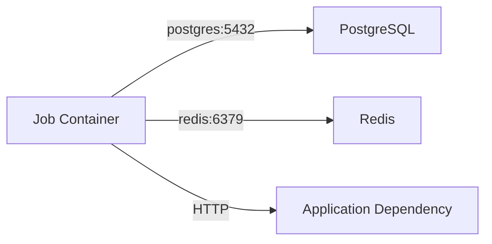
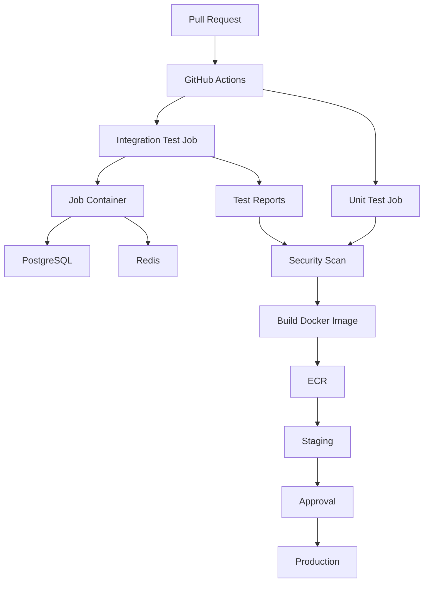

# 03- Container Networking

## Overview

Container networking is a critical part of GitHub Actions integration testing and containerized CI/CD.

A backend pipeline commonly contains multiple isolated processes:

```text
GitHub Actions Runner
        │
        ├── Job Container
        │     └── Python / Django / FastAPI / pytest
        │
        ├── PostgreSQL Service
        │
        └── Redis Service
```

The test application must be able to communicate with PostgreSQL, Redis, HTTP services, or other dependencies using the correct networking model.

The most important distinction is whether the workflow job runs:

- Directly on the GitHub Actions runner.
- Inside a job container.

This changes how services should be addressed.

```text
Job runs on runner
    ↓
localhost + published port

Job runs in container
    ↓
Service hostname + service port
```

Understanding this distinction prevents many common CI failures such as connection refusals, incorrect hostnames, unavailable ports, and tests that work locally but fail in GitHub Actions.

## Container Networking Model

At a high level, a containerized CI environment can be viewed as:

```text
                    GitHub Actions
                          │
                    Runner Host
                          │
              ┌───────────┴───────────┐
              │                       │
        Job Container          Service Containers
              │                 ┌─────┴─────┐
              │                 │           │
           pytest          PostgreSQL     Redis
              │
              └──────────────┬──────────────
                             │
                       Container Network
```

The exact networking behavior depends on whether the job executes directly on the runner or inside a container.

## Runner-Based Job Networking

When a job runs directly on the runner:

```yaml
jobs:
  test:
    runs-on: ubuntu-latest

    services:
      postgres:
        image: postgres:16
        ports:
          - 5432:5432
```

The workflow step executes on the runner host:

```text
Runner
  │
  ├── pytest
  │
  └── PostgreSQL Container
          │
          └── 5432 published to runner
```

The application can typically connect using:

```text
localhost:5432
```

Example:

```yaml
env:
  DATABASE_HOST: localhost
  DATABASE_PORT: "5432"
```

The port mapping:

```yaml
ports:
  - 5432:5432
```

makes the service port available through the runner.

## Containerized Job Networking

When the job itself runs inside a container:

```yaml
jobs:
  test:
    runs-on: ubuntu-latest

    container:
      image: python:3.12-slim

    services:
      postgres:
        image: postgres:16
```

The architecture becomes:

```text
Runner
   │
   ├── Job Container
   │       └── pytest
   │
   └── PostgreSQL Service
```

The job and service containers communicate through the job's container network.

The service name becomes the hostname:

```text
postgres
```

Application configuration:

```yaml
env:
  DATABASE_HOST: postgres
  DATABASE_PORT: "5432"
```

The application should therefore connect to:

```text
postgres:5432
```

rather than:

```text
localhost:5432
```

## `localhost` vs Service Hostname

This is one of the most important concepts in GitHub Actions container networking.

| Job execution | Service address |
|---|---|
| Job runs directly on runner | `localhost:<published-port>` |
| Job runs in container | `<service-name>:<service-port>` |

Example:

```yaml
services:
  postgres:
    image: postgres:16
    ports:
      - 5432:5432
```

Host-based job:

```text
localhost:5432
```

Containerized job:

```text
postgres:5432
```

The difference exists because `localhost` refers to the current network namespace.

Inside a job container:

```text
localhost
```

refers to the job container itself, not automatically to the PostgreSQL service.

## Service Names as DNS Names

When service containers are used with a containerized job, the service identifier can be used as a hostname.

Example:

```yaml
services:
  postgres:
    image: postgres:16

  redis:
    image: redis:7
```

The application can use:

```text
postgres
redis
```

as network destinations.

For example:

```yaml
env:
  DATABASE_HOST: postgres
  REDIS_HOST: redis
```

Conceptually:

```text
pytest
 │
 ├── postgres:5432
 │
 └── redis:6379
```

This avoids hard-coding container IP addresses.

## Never Depend on Container IP Addresses

Container IP addresses are implementation details and can change.

Avoid:

```text
172.x.x.x
```

in application configuration.

Prefer:

```text
postgres
redis
```

Service discovery through stable service names is easier to maintain and works across repeated CI executions.

## Ports

A network endpoint generally consists of:

```text
hostname + port
```

Examples:

```text
postgres:5432
redis:6379
mysql:3306
```

Common backend ports:

| Service | Default Port |
|---|---:|
| PostgreSQL | 5432 |
| MySQL | 3306 |
| Redis | 6379 |
| Kafka | 9092 |
| HTTP | 80 |
| HTTPS | 443 |

The application should use the port on which the service listens inside the container network.

Do not automatically substitute a host-published port when communicating container-to-container.

## Port Publishing

Port publishing is primarily useful when the runner host needs access to a service.

Example:

```yaml
services:
  postgres:
    image: postgres:16
    ports:
      - 5432:5432
```

This creates a path similar to:

```text
Runner Host
    │
    │ localhost:5432
    ▼
PostgreSQL Container
    │
    │ 5432
    ▼
PostgreSQL
```

For a containerized job, direct service networking may be sufficient:

```text
Job Container
      │
      │ postgres:5432
      ▼
PostgreSQL Service
```

In that situation, host port publishing may not be required.

## Container-to-Container Communication

A typical integration-test environment:



The job container acts as the client.

For example:

```text
pytest
   ↓
Django Repository
   ↓
PostgreSQL
```

and:

```text
pytest
   ↓
Django Cache
   ↓
Redis
```

The communication occurs through the container network rather than through `localhost`.

## PostgreSQL Example

A containerized Django test job:

```yaml
jobs:
  test:
    runs-on: ubuntu-latest

    container:
      image: python:3.12-slim

    services:
      postgres:
        image: postgres:16
        env:
          POSTGRES_USER: django
          POSTGRES_PASSWORD: django
          POSTGRES_DB: django_test

    env:
      DATABASE_HOST: postgres
      DATABASE_PORT: "5432"
      DATABASE_NAME: django_test
      DATABASE_USER: django
      DATABASE_PASSWORD: django

    steps:
      - name: Checkout
        uses: actions/checkout@v4

      - name: Install dependencies
        run: |
          pip install --upgrade pip
          pip install -r requirements.txt

      - name: Run migrations
        run: python manage.py migrate --noinput

      - name: Run tests
        run: pytest
```

The data path is:

```text
pytest
   ↓
Django
   ↓
postgres:5432
   ↓
PostgreSQL
```

## Redis Example

A Redis service:

```yaml
services:
  redis:
    image: redis:7
```

Application configuration:

```yaml
env:
  REDIS_HOST: redis
  REDIS_PORT: "6379"
```

The networking path becomes:

```text
FastAPI / Django
        │
        │ redis:6379
        ▼
      Redis
```

This is preferable to attempting:

```text
localhost:6379
```

from inside the job container.

## MySQL Example

MySQL can be configured as:

```yaml
services:
  mysql:
    image: mysql:8.4
    env:
      MYSQL_ROOT_PASSWORD: root
      MYSQL_DATABASE: app_test
      MYSQL_USER: app
      MYSQL_PASSWORD: app
```

A containerized application can connect using:

```yaml
env:
  DATABASE_HOST: mysql
  DATABASE_PORT: "3306"
```

The hostname comes from the service name:

```text
services:
  mysql:
```

## Multiple Services

Real backend applications often require multiple dependencies.

```yaml
jobs:
  integration:
    runs-on: ubuntu-latest

    container:
      image: python:3.12-slim

    services:
      postgres:
        image: postgres:16
        env:
          POSTGRES_USER: app
          POSTGRES_PASSWORD: app
          POSTGRES_DB: app_test

      redis:
        image: redis:7

    env:
      DATABASE_HOST: postgres
      DATABASE_PORT: "5432"
      REDIS_HOST: redis
      REDIS_PORT: "6379"

    steps:
      - uses: actions/checkout@v4

      - name: Install dependencies
        run: pip install -r requirements.txt

      - name: Run integration tests
        run: pytest tests/integration
```

The resulting network topology is:

```text
                  Job Container
                       │
             ┌─────────┴─────────┐
             │                   │
             ▼                   ▼
       postgres:5432        redis:6379
             │                   │
             ▼                   ▼
        PostgreSQL             Redis
```

## Service Readiness

Networking does not guarantee application readiness.

A container may exist while the service inside it is still initializing.

```text
Container Created
       ↓
Container Started
       ↓
Process Started
       ↓
Service Initialization
       ↓
Service Ready
```

A test started too early may produce:

```text
connection refused
```

even though the container itself is running.

## PostgreSQL Health Check

A PostgreSQL service can define a health check:

```yaml
services:
  postgres:
    image: postgres:16
    env:
      POSTGRES_USER: test
      POSTGRES_PASSWORD: test
      POSTGRES_DB: app_test
    options: >-
      --health-cmd "pg_isready -U test -d app_test"
      --health-interval 10s
      --health-timeout 5s
      --health-retries 5
```

This verifies that PostgreSQL is actually responding to its readiness probe.

The important distinction is:

```text
Network Available
        ≠
Application Ready
```

Both should be considered when diagnosing startup failures.

## Redis Readiness

Redis is usually lightweight, but tests can still fail if the service is not ready.

A bounded probe can use:

```bash
for attempt in {1..30}; do
  if redis-cli -h redis ping; then
    echo "Redis is ready"
    exit 0
  fi

  sleep 2
done

echo "Redis did not become ready" >&2
exit 1
```

Avoid unbounded loops.

## HTTP Service Dependencies

Container networking is not limited to databases.

A backend integration test might communicate with another HTTP service:

```text
API Test Container
        │
        │ HTTP
        ▼
Mock / Dependency Service
```

For example:

```text
FastAPI
  ↓
HTTP Client
  ↓
Internal Service
```

The service hostname should be used when both applications participate in the same container network.

## Microservice Integration Testing

For microservices:

```text
                 Integration Test
                       │
          ┌────────────┼────────────┐
          ▼            ▼            ▼
       API A        Service B    Service C
          │            │            │
          └────────────┼────────────┘
                       ▼
                   PostgreSQL
                       │
                     Redis
```

This can validate:

- HTTP communication.
- Service discovery.
- Authentication.
- Serialization.
- Database interactions.
- Retry behavior.
- Timeouts.

However, starting an entire production-like microservice topology for every pull request can be expensive.

Use the smallest realistic dependency graph needed for the test.

## REST and gRPC Dependencies

Container networking applies equally to REST and gRPC.

REST:

```text
api-a → http://service-b:8000
```

gRPC:

```text
api-a → service-b:50051
```

The protocol changes, but the networking model remains:

```text
Service Name
      +
Service Port
```

Avoid coupling CI tests to container IP addresses.

## Kafka Networking

Kafka requires more careful networking configuration than simple databases because clients may receive broker-advertised addresses.

A conceptual topology is:

```text
Application
    │
    │ kafka:9092
    ▼
Kafka Broker
```

However, Kafka clients also depend on the broker's advertised listener configuration.

A client may successfully connect to the initial bootstrap endpoint and then fail if Kafka advertises an unreachable hostname.

Therefore:

```text
Bootstrap Connectivity
        +
Advertised Listener Connectivity
```

must both be correct.

This is a common container-networking issue with Kafka-based integration tests.

## Nginx and Reverse Proxy Testing

Container networking can also test an Nginx layer:

```text
pytest
   │
   │ HTTP
   ▼
Nginx
   │
   │ HTTP
   ▼
FastAPI / Django
   │
   ├── PostgreSQL
   └── Redis
```

For example:

```text
http://nginx:80
```

rather than:

```text
http://localhost:80
```

when the test process itself runs inside a container.

This allows the test to validate:

- Routing.
- Headers.
- Proxy configuration.
- Timeouts.
- Upstream connectivity.

## DNS and Service Discovery

The most important service-discovery principle is:

```text
Use logical service names
rather than dynamic container IPs.
```

For example:

```text
postgres
redis
mysql
api
nginx
```

This keeps the application configuration stable even though the underlying containers are ephemeral.

## Environment-Specific Configuration

A backend should not embed GitHub Actions-specific hostnames throughout application code.

Prefer environment-driven configuration.

Django:

```python
import os

DATABASE_HOST = os.environ.get("DATABASE_HOST", "localhost")
```

Workflow:

```yaml
env:
  DATABASE_HOST: postgres
```

Local development can use:

```text
localhost
```

while CI can use:

```text
postgres
```

This keeps the application portable across environments.

## Docker Compose vs GitHub Actions Services

Docker Compose and GitHub Actions service containers solve related but different problems.

| Capability | GitHub Actions Services | Docker Compose |
|---|---|---|
| Native GitHub Actions integration | Yes | No |
| Simple CI dependencies | Excellent | Good |
| Complex multi-container topology | Limited | Strong |
| Local development | Limited | Excellent |
| Custom networks | Limited | Strong |
| Complex volume configuration | Limited | Strong |
| CI portability | Strong | Depends on setup |
| Full application topology | Less suitable | Strong |

Use GitHub Actions services when the dependency topology is relatively simple.

Use Docker Compose when the test environment itself requires a more complex multi-container architecture and the repository already uses Compose.

## Docker Compose in CI

A workflow can run Docker Compose directly on the runner when more control is required.

Example:

```yaml
jobs:
  integration:
    runs-on: ubuntu-latest

    steps:
      - uses: actions/checkout@v4

      - name: Start services
        run: docker compose up -d postgres redis

      - name: Run tests
        run: docker compose run --rm api pytest

      - name: Collect logs
        if: ${{ !cancelled() }}
        run: docker compose logs

      - name: Stop services
        if: ${{ always() }}
        run: docker compose down -v
```

This gives greater control over:

- Networks.
- Volumes.
- Container configuration.
- Dependency relationships.
- Service startup.
- Application containers.

The trade-off is additional workflow complexity.

## Container Networking with Docker Compose

A Compose network can look like:

```yaml
services:
  api:
    build: .
    depends_on:
      - postgres
      - redis

  postgres:
    image: postgres:16

  redis:
    image: redis:7
```

The API can communicate with:

```text
postgres:5432
redis:6379
```

because Compose provides service-name-based networking.

The conceptual model is similar to GitHub Actions service containers:

```text
Logical Service Name
        ↓
Container Network
        ↓
Service
```

## Network Isolation

Network isolation is an important security property.

Avoid allowing test containers to access networks they do not need.

For example:

```text
Test Network
 ├── API
 ├── PostgreSQL
 └── Redis
```

is preferable to unnecessarily exposing every dependency to unrelated external networks.

For self-hosted runners, additional network controls may be necessary at the infrastructure level.

## Self-Hosted Runner Networking

Self-hosted runners introduce another layer:

```text
GitHub Actions
      ↓
Self-Hosted Runner
      ↓
Container Network
      ↓
Service Containers
```

The runner itself may also have access to:

```text
Corporate Network
Private VPC
Internal APIs
Databases
Cloud Services
```

This creates a larger security boundary.

A compromised workflow can potentially abuse the network access available to the runner.

## Private Network Access

Some integration tests need access to private services.

For example:

```text
GitHub Actions
      ↓
Self-Hosted Runner
      ↓
Private Network
      ↓
Internal API
```

In this architecture, container networking does not replace the runner's network connectivity.

The important boundaries are:

```text
GitHub
  ↓
Runner Security Boundary
  ↓
Container Security Boundary
  ↓
Private Network Boundary
```

Grant only the connectivity required by the workflow.

## Security Considerations

Container networking should be designed with least privilege.

Important controls include:

- Minimize exposed ports.
- Avoid production network access from ordinary CI.
- Use isolated test dependencies.
- Use trusted service images.
- Avoid privileged containers.
- Restrict self-hosted runner network access.
- Avoid passing production credentials into tests.
- Treat pull-request code as potentially untrusted.
- Prefer ephemeral runners for sensitive workloads.

A container network is not a complete security boundary by itself.

## Fork Pull Requests

Fork-based pull requests deserve particular attention.

The workflow may execute code controlled by someone outside the repository's trusted organization.

A dangerous architecture is:

```text
Untrusted PR Code
      ↓
Self-Hosted Runner
      ↓
Private Network
      ↓
Internal Services
```

Even if service containers are isolated, the runner may still provide network access or credentials.

For untrusted workloads, prefer GitHub-hosted isolation or appropriately isolated ephemeral infrastructure.

## Network Exposure

Avoid exposing services unnecessarily.

If a service only needs to communicate with a job container:

```text
Job Container
      │
      ▼
PostgreSQL Service
```

there is generally no reason to make PostgreSQL publicly reachable.

Do not expose:

```text
5432
6379
3306
```

to external networks unless the test architecture requires it.

## Performance Considerations

Networking can become a measurable component of integration-test performance.

Potential bottlenecks include:

- Large API payloads.
- Excessive database round trips.
- Cross-container serialization.
- Repeated connection establishment.
- Slow service startup.
- DNS or service-discovery delays.
- Excessive logging.

For high-volume tests:

```text
Test
 ↓
Application
 ↓
Database
```

should avoid unnecessary network round trips.

Use connection pooling where appropriate.

## Connection Pooling

Backend applications such as Django and FastAPI frequently maintain database connection pools or reusable connections.

In CI, keep the pool size appropriate to the test workload.

An unnecessarily large pool can create resource contention:

```text
100 Test Workers
×
10 Connections
=
1000 Database Connections
```

The database service may not support that workload.

Tune:

```text
Test Parallelism
+
Application Pool Size
+
Database Connection Limit
```

as a single system.

## Parallel Testing

Parallel tests can create contention.

For example:

```text
pytest workers
   ├── Worker 1 ──┐
   ├── Worker 2 ──┤
   ├── Worker 3 ──┼── PostgreSQL
   └── Worker 4 ──┘
```

Potential problems include:

- Database locks.
- Connection exhaustion.
- Shared Redis keys.
- Port collisions.
- Race conditions.
- Non-isolated test data.

Use independent test databases or schemas where the framework and architecture require them.

## Reliability

A reliable networking setup should have:

```text
Stable Service Names
        ↓
Known Ports
        ↓
Readiness Checks
        ↓
Deterministic Initialization
        ↓
Bounded Timeouts
        ↓
Clear Diagnostics
```

Avoid relying on timing assumptions.

For example, this is fragile:

```bash
sleep 20
pytest
```

A service may be ready in 3 seconds or require 30 seconds.

A readiness check is more deterministic.

## Timeouts

Always consider timeouts for network operations.

An unavailable service should not cause a workflow to hang indefinitely.

Application clients should use appropriate:

```text
Connection Timeout
Request Timeout
Retry Limit
Backoff
```

For CI, bounded failure is generally better than an indefinitely running workflow.

## Retry Strategy

Retries can help with transient startup conditions.

A robust retry strategy should include:

```text
Maximum Attempts
+
Backoff
+
Timeout
+
Useful Error Logging
```

Avoid infinite retries because they can hide infrastructure failures and consume runner capacity.

## Troubleshooting

Use the standard troubleshooting model:

```text
Symptom
→ Possible Causes
→ Isolation Strategy
→ Commands / Checks
→ Root Cause
→ Corrective Action
→ Prevention
```

## Connection Refused

### Symptom

```text
connection refused
```

### Possible Causes

- Service is not running.
- Service is not ready.
- Incorrect hostname.
- Incorrect port.
- Incorrect network model.
- Application starts before dependency readiness.

### Isolation Strategy

Check:

```text
Job execution model
Service name
Port
Service health
Application configuration
```

For a containerized job, verify:

```text
DATABASE_HOST=postgres
```

rather than:

```text
DATABASE_HOST=localhost
```

## DNS Resolution Failure

### Symptom

```text
could not resolve host
```

### Possible Causes

- Incorrect service name.
- Wrong network.
- Service not attached to expected network.
- Application configuration error.

### Checks

Verify the configured hostname:

```bash
getent hosts postgres
```

or:

```bash
getent hosts redis
```

If the command is unavailable in a minimal image, install the appropriate diagnostic package or use an available DNS/network diagnostic tool.

## Port Failure

### Symptom

```text
connection timed out
```

### Possible Causes

- Wrong port.
- Service not listening.
- Network path unavailable.
- Firewall or security control.
- Incorrect advertised endpoint.

For containerized service communication, distinguish:

```text
Container Port
```

from:

```text
Published Host Port
```

Do not automatically use the host port for container-to-container communication.

## PostgreSQL Diagnostics

Useful checks include:

```bash
pg_isready -h postgres -p 5432
```

and, where the client is installed:

```bash
psql \
  -h postgres \
  -p 5432 \
  -U test \
  -d app_test
```

Check:

```text
Hostname
Port
Credentials
Database
Readiness
```

## Redis Diagnostics

Check connectivity:

```bash
redis-cli -h redis -p 6379 ping
```

Expected response:

```text
PONG
```

If it fails, inspect:

```text
Service Status
Hostname
Port
Readiness
Network
```

## HTTP Diagnostics

For an HTTP dependency:

```bash
curl -v http://service:8000/health
```

This can reveal:

- DNS resolution.
- TCP connection.
- HTTP response.
- Redirects.
- TLS problems.
- Application-level errors.

## Kafka Diagnostics

Kafka problems often require checking both:

```text
Bootstrap Server
```

and:

```text
Advertised Listener
```

A client may successfully connect to:

```text
kafka:9092
```

but subsequently fail if Kafka advertises an unreachable endpoint.

This is a common containerized integration-test failure.

## Debugging the Network

When diagnosing a container networking issue, isolate the layers:

```text
DNS
 ↓
TCP
 ↓
Service Readiness
 ↓
Protocol
 ↓
Application
```

For example:

```text
1. Does postgres resolve?
2. Is port 5432 reachable?
3. Is PostgreSQL ready?
4. Can authentication succeed?
5. Does the application query succeed?
```

Do not start by debugging application logic when the TCP connection itself is failing.

## Production CI/CD Architecture

A mature pipeline can use container networking for integration tests while keeping deployment networking separate.



The networking concern is localized to the integration environment:

```text
Integration Job
    ↓
Container Network
    ├── PostgreSQL
    └── Redis
```

This keeps CI dependencies isolated from production infrastructure.

## Container Networking vs Production Networking

Do not assume that CI networking should exactly reproduce production networking.

CI optimizes for:

```text
Isolation
+
Reproducibility
+
Fast Feedback
```

Production optimizes for:

```text
Availability
+
Security
+
Scalability
+
Observability
+
Failure Recovery
```

The architectures may share concepts but have different operational requirements.

## High Availability

Individual CI service containers generally do not require production-style high availability.

If PostgreSQL fails during an integration test:

```text
Job Fails
→ Environment Destroyed
→ Workflow Rerun
```

The priority is deterministic recovery rather than maintaining a continuously available test database.

Production systems are different:

```text
Application
   ↓
Load Balancer
   ↓
Multiple Instances
   ↓
Highly Available Database
```

Do not over-engineer ephemeral CI dependencies.

## Disaster Recovery

For CI service containers, disaster recovery generally means:

```text
Failed Environment
        ↓
Destroy
        ↓
Recreate
        ↓
Rerun
```

Persistent test infrastructure requires a different strategy.

If an organization depends on persistent integration environments, it should separately define:

- Backup.
- Recovery.
- Data reset.
- Failure isolation.
- Environment ownership.

For ordinary pull-request integration tests, disposable service containers are usually simpler.

## Cost Considerations

Container networking itself is inexpensive compared with the runner and service execution time.

Cost grows primarily through:

```text
More Services
+
Larger Images
+
Longer Startup
+
Larger Matrix
+
Longer Test Execution
```

For example:

```text
3 Python versions
×
2 PostgreSQL versions
×
2 Redis versions
=
12 test environments
```

Use matrix dimensions only where they provide meaningful compatibility coverage.

## Operational Best Practices

Use the following practices:

- Prefer service names over container IP addresses.
- Understand whether the job runs on the runner or inside a container.
- Use `localhost` only when the networking model requires it.
- Use service hostnames for container-to-container communication.
- Avoid unnecessary port publishing.
- Add readiness checks for stateful services.
- Keep service versions controlled.
- Keep test infrastructure disposable.
- Separate unit and integration tests.
- Avoid production network access.
- Restrict self-hosted runner connectivity.
- Use bounded retries and timeouts.
- Capture diagnostics when integration tests fail.

## Interview Scenarios

### A Django Test Gets `Connection Refused`

Explain the diagnostic sequence:

```text
1. Is PostgreSQL running?
2. Is PostgreSQL ready?
3. Is the job running inside a container?
4. Is the hostname correct?
5. Is the port correct?
6. Are credentials correct?
```

If the job is containerized:

```text
postgres:5432
```

is normally the appropriate service endpoint.

### Why Does `localhost` Fail Inside a Container?

Because:

```text
localhost
```

refers to the current container's network namespace.

The PostgreSQL service is a different container.

Use:

```text
postgres
```

as the service hostname.

### Why Avoid Container IP Addresses?

They are dynamic and implementation-dependent.

Use stable service names instead.

### How Would You Design Django + PostgreSQL + Redis CI?

```text
Python Job Container
       │
       ├── postgres:5432
       │
       └── redis:6379
```

Then:

```text
migrations
   ↓
pytest
   ↓
coverage
   ↓
artifacts
```

### Why Can Kafka Be More Difficult?

Kafka clients can receive advertised broker addresses after the initial connection.

Therefore, both the bootstrap address and advertised listeners must be reachable from the test environment.

### How Would You Debug a Network Failure?

Use layered isolation:

```text
DNS
→ TCP
→ Readiness
→ Authentication
→ Protocol
→ Application
```

This prevents application-level debugging from masking a lower-level network failure.

### How Would You Secure a Self-Hosted Runner?

Discuss:

- Ephemeral runners.
- Network segmentation.
- Runner groups.
- Minimal private-network access.
- Least-privilege credentials.
- Untrusted-code isolation.
- Cleanup after execution.

### How Would You Control CI Cost?

Consider:

- Fewer unnecessary services.
- Smaller matrices.
- Dependency caching.
- Parallel execution where beneficial.
- Fast unit tests before expensive integration tests.
- Appropriate runner sizing.

## Key Takeaways

- Container networking in GitHub Actions depends fundamentally on whether the job runs directly on the runner or inside a job container.
- Runner-based jobs commonly reach published service ports through `localhost`, while containerized jobs normally reach service containers through stable service names such as `postgres:5432` or `redis:6379`.
- Service readiness, DNS, TCP connectivity, ports, protocol configuration, and application behavior are separate failure layers and should be diagnosed independently.
- Production-grade CI networking should minimize exposed ports, isolate test infrastructure, avoid production network access, use controlled service images, and apply stronger isolation for self-hosted runners.
- For senior-level CI design, treat container networking as part of the overall reliability, security, performance, and troubleshooting architecture rather than merely a Docker configuration detail.