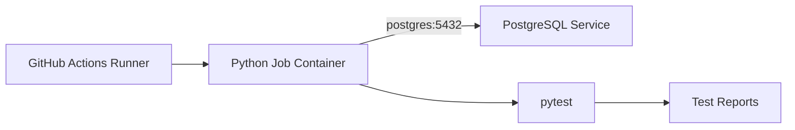

# 04- PostgreSQL Service Containers

## Overview

PostgreSQL is one of the most common service dependencies for backend integration tests. GitHub Actions service containers provide a disposable PostgreSQL instance that can run alongside a test job without requiring a separately managed database server.

A typical Python CI pipeline can use:

```text
Pull Request
    ↓
GitHub Actions
    ↓
Python Test Job
    ↓
PostgreSQL Service Container
    ↓
Django / FastAPI / pytest
    ↓
Test Reports
```

This approach is useful when integration tests need real PostgreSQL behavior rather than an in-memory or SQLite substitute.

A production-oriented setup should address more than simply starting the container. The workflow must account for:

- PostgreSQL image and version selection.
- Credentials and database initialization.
- Container networking.
- Port configuration.
- Service readiness.
- Database migrations.
- Test isolation.
- Parallel execution.
- Connection limits.
- Failure diagnostics.
- Security.
- CI execution cost.

## Why Use PostgreSQL Service Containers?

A service container gives the workflow a temporary PostgreSQL environment dedicated to the current job.

This provides several advantages:

| Approach | Characteristics |
|---|---|
| SQLite | Fast, but behavior differs significantly from PostgreSQL |
| Shared external PostgreSQL | More realistic, but introduces shared-state and availability dependencies |
| PostgreSQL service container | Disposable, isolated, reproducible |
| Dedicated test database infrastructure | Highly configurable, but operationally heavier |

For Django or FastAPI applications that use PostgreSQL in production, testing against PostgreSQL in CI reduces the risk of database-specific behavior escaping into production.

Examples include:

- PostgreSQL-specific SQL.
- Transaction behavior.
- Constraints.
- Indexes.
- JSON/JSONB operations.
- Array fields.
- PostgreSQL extensions.
- Query planner behavior.
- Isolation semantics.

## Basic PostgreSQL Service

A minimal GitHub Actions service can be configured as:

```yaml
jobs:
  test:
    runs-on: ubuntu-latest

    services:
      postgres:
        image: postgres:16
        env:
          POSTGRES_USER: test
          POSTGRES_PASSWORD: test
          POSTGRES_DB: app_test
        ports:
          - 5432:5432

    steps:
      - name: Checkout
        uses: actions/checkout@v4

      - name: Install dependencies
        run: |
          python -m pip install --upgrade pip
          pip install -r requirements.txt

      - name: Run tests
        run: pytest
```

The important components are:

```yaml
services:
  postgres:
    image: postgres:16
```

and:

```yaml
env:
  POSTGRES_USER: test
  POSTGRES_PASSWORD: test
  POSTGRES_DB: app_test
```

The PostgreSQL image uses these environment variables during initial database initialization.

## PostgreSQL Image Selection

Use an explicit PostgreSQL version:

```yaml
image: postgres:16
```

Avoid relying on:

```yaml
image: postgres:latest
```

in production CI.

An implicit `latest` tag can change independently of the repository and introduce unexpected failures.

For compatibility testing, a matrix can deliberately test multiple PostgreSQL versions:

```yaml
strategy:
  matrix:
    postgres:
      - "15"
      - "16"
      - "17"

services:
  postgres:
    image: postgres:${{ matrix.postgres }}
```

This is useful when an application supports multiple PostgreSQL versions.

## Version Strategy

There are two different goals:

### Production Compatibility

Test the PostgreSQL version used by production.

```yaml
image: postgres:16
```

This minimizes environment drift.

### Compatibility Testing

Test several supported versions:

```text
PostgreSQL 15
PostgreSQL 16
PostgreSQL 17
```

Use a matrix when the application explicitly supports multiple versions.

Do not create a large database matrix without a compatibility requirement because every matrix combination increases CI execution time and cost.

## PostgreSQL Initialization

The official PostgreSQL image uses initialization environment variables such as:

```yaml
env:
  POSTGRES_USER: test
  POSTGRES_PASSWORD: test
  POSTGRES_DB: app_test
```

The resulting environment is conceptually:

```text
PostgreSQL Container
        │
        ├── User: test
        ├── Database: app_test
        └── Password: test
```

The application should use matching connection settings.

## Database Connection Configuration

A Python application should read database configuration from environment variables.

For example:

```python
import os

DATABASE_CONFIG = {
    "HOST": os.environ.get("DATABASE_HOST", "localhost"),
    "PORT": os.environ.get("DATABASE_PORT", "5432"),
    "NAME": os.environ.get("DATABASE_NAME", "app_test"),
    "USER": os.environ.get("DATABASE_USER", "test"),
    "PASSWORD": os.environ.get("DATABASE_PASSWORD", "test"),
}
```

The workflow can provide:

```yaml
env:
  DATABASE_HOST: localhost
  DATABASE_PORT: "5432"
  DATABASE_NAME: app_test
  DATABASE_USER: test
  DATABASE_PASSWORD: test
```

This is appropriate when the job runs directly on the GitHub Actions runner.

## Containerized Test Job

When the job itself runs inside a container, PostgreSQL should normally be addressed using the service name.

```yaml
jobs:
  test:
    runs-on: ubuntu-latest

    container:
      image: python:3.12-slim

    services:
      postgres:
        image: postgres:16
        env:
          POSTGRES_USER: test
          POSTGRES_PASSWORD: test
          POSTGRES_DB: app_test

    env:
      DATABASE_HOST: postgres
      DATABASE_PORT: "5432"
      DATABASE_NAME: app_test
      DATABASE_USER: test
      DATABASE_PASSWORD: test

    steps:
      - uses: actions/checkout@v4

      - name: Install dependencies
        run: pip install -r requirements.txt

      - name: Run tests
        run: pytest
```

The connection path is:

```text
Python Job Container
        │
        │ postgres:5432
        ▼
PostgreSQL Service Container
```

Do not assume that:

```text
localhost:5432
```

will refer to the PostgreSQL service from inside the job container.

## Runner-Based vs Containerized Jobs

| Configuration | PostgreSQL Host | PostgreSQL Port |
|---|---|---:|
| Job runs directly on runner | `localhost` | Published host port |
| Job runs inside container | `postgres` | `5432` |

The distinction is caused by the networking model.

```text
Runner-based Job

pytest
  │
  │ localhost:5432
  ▼
PostgreSQL
```

versus:

```text
Containerized Job

pytest
  │
  │ postgres:5432
  ▼
PostgreSQL
```

## Port Mapping

For a runner-based job, the service can publish a port:

```yaml
services:
  postgres:
    image: postgres:16
    ports:
      - 5432:5432
```

This exposes PostgreSQL through the runner.

The mapping means:

```text
Runner Port 5432
       ↓
Container Port 5432
```

For container-to-container communication, the service's internal port is normally used directly through the service hostname.

## Avoiding Host Port Collisions

Parallel workflows can run simultaneously on the same infrastructure.

For GitHub-hosted runners, each job normally has an isolated runner environment, so host-port collisions between unrelated hosted jobs are generally not the same concern as they are on a shared persistent machine.

On self-hosted infrastructure, however, port management requires more care.

Do not design multiple jobs around fixed host ports on a shared persistent runner unless isolation is guaranteed.

## PostgreSQL Health Checks

A running PostgreSQL container does not necessarily mean PostgreSQL is ready to accept connections.

Configure a health check:

```yaml
services:
  postgres:
    image: postgres:16
    env:
      POSTGRES_USER: test
      POSTGRES_PASSWORD: test
      POSTGRES_DB: app_test
    options: >-
      --health-cmd "pg_isready -U test -d app_test"
      --health-interval 10s
      --health-timeout 5s
      --health-retries 5
```

The health check verifies database readiness more reliably than an arbitrary delay.

The lifecycle is:

```text
Container Created
       ↓
PostgreSQL Process Started
       ↓
Database Initialization
       ↓
PostgreSQL Ready
       ↓
Tests
```

## Why `sleep` Is a Weak Readiness Strategy

This pattern is fragile:

```yaml
- name: Wait for PostgreSQL
  run: sleep 10
```

Ten seconds may be:

- Longer than necessary.
- Too short under heavy startup conditions.
- Unrelated to actual readiness.

Prefer a readiness probe such as:

```bash
pg_isready -h localhost -p 5432
```

or:

```bash
pg_isready -h postgres -p 5432
```

depending on the networking model.

## Explicit Readiness Probe

A bounded readiness loop can provide deterministic behavior:

```bash
for attempt in {1..30}; do
  if pg_isready -h "$DATABASE_HOST" -p "$DATABASE_PORT"; then
    echo "PostgreSQL is ready"
    exit 0
  fi

  sleep 2
done

echo "PostgreSQL did not become ready in time" >&2
exit 1
```

This provides:

- Bounded waiting.
- Retry behavior.
- Clear failure output.
- Environment-driven configuration.

## Database Migrations

For Django integration tests, migrations should normally run against the PostgreSQL service before tests.

```yaml
- name: Run migrations
  run: python manage.py migrate --noinput

- name: Run tests
  run: pytest
```

The data flow is:

```text
PostgreSQL Starts
      ↓
Database Ready
      ↓
Django Migrations
      ↓
Database Schema
      ↓
pytest
```

This validates that the current application schema can actually be created on PostgreSQL.

## Django Configuration

A typical Django configuration can use:

```python
import os

DATABASES = {
    "default": {
        "ENGINE": "django.db.backends.postgresql",
        "NAME": os.environ["DATABASE_NAME"],
        "USER": os.environ["DATABASE_USER"],
        "PASSWORD": os.environ["DATABASE_PASSWORD"],
        "HOST": os.environ["DATABASE_HOST"],
        "PORT": os.environ.get("DATABASE_PORT", "5432"),
    }
}
```

The workflow can then control the environment:

```yaml
env:
  DATABASE_NAME: app_test
  DATABASE_USER: test
  DATABASE_PASSWORD: test
  DATABASE_HOST: localhost
  DATABASE_PORT: "5432"
```

For a containerized job:

```yaml
env:
  DATABASE_HOST: postgres
```

## FastAPI and SQLAlchemy

A FastAPI application can construct its PostgreSQL URL from environment variables:

```python
import os

DATABASE_URL = (
    f"postgresql+psycopg://"
    f"{os.environ['DATABASE_USER']}:"
    f"{os.environ['DATABASE_PASSWORD']}@"
    f"{os.environ['DATABASE_HOST']}:"
    f"{os.environ.get('DATABASE_PORT', '5432')}/"
    f"{os.environ['DATABASE_NAME']}"
)
```

This keeps CI-specific network configuration outside application source code.

## PostgreSQL Extensions

Some applications depend on PostgreSQL extensions.

Examples include:

- `pgcrypto`
- `uuid-ossp`
- PostGIS extensions
- Full-text search capabilities

If the application requires an extension, the CI PostgreSQL environment must support the same database behavior required by the application.

A migration may contain:

```sql
CREATE EXTENSION IF NOT EXISTS pgcrypto;
```

The CI environment should then validate that migration against the actual PostgreSQL version used for testing.

## PostgreSQL-Specific Testing

Using PostgreSQL instead of SQLite can expose issues that a lightweight database may not reproduce.

Examples:

```text
Application
    │
    ├── PostgreSQL constraints
    ├── Transactions
    ├── Indexes
    ├── JSONB
    ├── PostgreSQL-specific SQL
    └── Query behavior
```

This is particularly important when PostgreSQL is the production database.

## Database Isolation

Each workflow job should ideally receive a disposable database environment.

A clean CI lifecycle is:

```text
Job Starts
    ↓
Fresh PostgreSQL
    ↓
Create Schema
    ↓
Run Tests
    ↓
Collect Reports
    ↓
Environment Destroyed
```

This prevents one workflow execution from contaminating another.

Avoid using a shared persistent test database for ordinary pull-request testing unless there is a specific architectural reason.

## Test Data Isolation

Tests should not depend on data left behind by previous tests.

Prefer framework-supported mechanisms such as:

- Transaction rollback.
- Test database recreation.
- Fixtures.
- Factories.
- Explicit setup and teardown.
- Unique test identifiers.

For Django:

```bash
python manage.py test
```

or:

```bash
pytest
```

with the appropriate Django testing configuration can manage test database lifecycle.

## Parallel Tests

Parallel test execution can increase pressure on PostgreSQL.

For example:

```text
pytest workers
   ├── Worker 1 ──┐
   ├── Worker 2 ──┤
   ├── Worker 3 ──┼── PostgreSQL
   └── Worker 4 ──┘
```

Potential limits include:

- Maximum database connections.
- CPU.
- Memory.
- Lock contention.
- Temporary storage.
- Query execution time.

More workers do not automatically mean faster tests.

## Connection Management

A test suite with high parallelism can exhaust PostgreSQL connections.

For example:

```text
20 workers
×
5 connections
=
100 connections
```

If PostgreSQL is configured with a lower connection limit, tests may fail even though the application itself is correct.

Tune together:

```text
pytest parallelism
+
Application connection pool
+
PostgreSQL max connections
+
Runner resources
```

## PostgreSQL Configuration

A service container can receive PostgreSQL environment configuration:

```yaml
services:
  postgres:
    image: postgres:16
    env:
      POSTGRES_USER: test
      POSTGRES_PASSWORD: test
      POSTGRES_DB: app_test
```

For more specialized workloads, PostgreSQL configuration may require additional container arguments or a custom image.

Avoid modifying database configuration merely to hide a poorly designed test suite.

Fix the workload first.

## Persistent vs Disposable PostgreSQL

| Characteristic | Disposable Service | Persistent Test DB |
|---|---|---|
| Isolation | Strong | Requires management |
| Startup | Per job | Faster after startup |
| State leakage | Low | Higher risk |
| Operations | Simple | More complex |
| Scaling | Job-based | Infrastructure-based |
| Pull-request suitability | Strong | Depends on architecture |
| Recovery | Recreate | Restore/repair |

For most CI integration tests, disposable PostgreSQL is easier to reason about.

## PostgreSQL Version Matrix

A compatibility matrix can be useful:

```yaml
jobs:
  test:
    runs-on: ubuntu-latest

    strategy:
      matrix:
        postgres:
          - "15"
          - "16"
          - "17"

    services:
      postgres:
        image: postgres:${{ matrix.postgres }}
        env:
          POSTGRES_USER: test
          POSTGRES_PASSWORD: test
          POSTGRES_DB: app_test
```

This produces:

```text
             PostgreSQL 15
            /
Python Tests ─ PostgreSQL 16
            \
             PostgreSQL 17
```

Use this only when compatibility across those versions is part of the supported application contract.

## Python Version and PostgreSQL Matrix

A larger compatibility matrix can combine Python and PostgreSQL versions:

```yaml
strategy:
  matrix:
    python:
      - "3.11"
      - "3.12"
    postgres:
      - "15"
      - "16"
```

This creates:

```text
Python 3.11 + PostgreSQL 15
Python 3.11 + PostgreSQL 16
Python 3.12 + PostgreSQL 15
Python 3.12 + PostgreSQL 16
```

The matrix should represent meaningful compatibility requirements rather than arbitrary combinations.

## Matrix Cost

If:

```text
3 Python versions
×
3 PostgreSQL versions
×
2 operating systems
```

are tested, that becomes:

```text
18 jobs
```

If each job takes 8 minutes:

```text
18 × 8 = 144 runner-minutes
```

Parallel execution reduces wall-clock time but does not eliminate compute consumption.

## PostgreSQL Logs

When a test fails, PostgreSQL logs can be valuable.

With Docker Compose, for example:

```bash
docker compose logs postgres
```

GitHub Actions service containers are managed by the runner, so diagnostics should also include application output and database connectivity checks.

A useful failure report should make it possible to determine whether the failure came from:

```text
Application
Database startup
Database readiness
Database authentication
Database schema
Query execution
Test logic
```

## Common Authentication Failures

### Symptom

```text
password authentication failed for user "test"
```

### Possible Causes

- Incorrect password.
- Incorrect username.
- Wrong database.
- Environment variable mismatch.
- Application loaded a different configuration source.

### Isolation

Print safe configuration metadata:

```bash
echo "Database host: $DATABASE_HOST"
echo "Database port: $DATABASE_PORT"
echo "Database name: $DATABASE_NAME"
echo "Database user: $DATABASE_USER"
```

Never print:

```bash
echo "$DATABASE_PASSWORD"
```

Secrets and credentials should not be written to logs.

## Database Does Not Exist

### Symptom

```text
database "app_test" does not exist
```

### Possible Causes

- `POSTGRES_DB` was not configured.
- Application uses a different database name.
- Database initialization failed.
- Configuration was overridden.

Verify:

```yaml
POSTGRES_DB: app_test
```

and:

```yaml
DATABASE_NAME: app_test
```

## Migration Failure

### Symptom

```text
django.db.utils.OperationalError
```

or a migration-specific error.

### Isolation Strategy

Separate:

```text
PostgreSQL Connectivity
```

from:

```text
Migration Logic
```

First verify:

```bash
pg_isready -h "$DATABASE_HOST" -p "$DATABASE_PORT"
```

Then run:

```bash
python manage.py migrate --noinput
```

If connectivity succeeds but migration fails, investigate schema or migration logic rather than networking.

## PostgreSQL Extension Failure

### Symptom

```text
extension "..." is not available
```

### Possible Causes

- Base image does not contain the required extension.
- Incorrect PostgreSQL image.
- Extension package is missing.
- Unsupported PostgreSQL version.

### Corrective Action

Use an appropriate PostgreSQL image or build a controlled custom test image containing the required extension.

Do not silently remove the extension from CI simply to make the pipeline pass if production requires it.

## Connection Timeout

### Symptom

```text
connection timed out
```

### Isolation

Check:

```text
Hostname
Port
Container networking
Service readiness
Published port
Runner networking
```

For a containerized job:

```text
postgres:5432
```

For a runner-based job:

```text
localhost:5432
```

provided the service port is published.

## PostgreSQL Health Check Failure

### Symptom

The service never becomes healthy.

### Possible Causes

- Invalid credentials.
- PostgreSQL initialization failure.
- Incorrect health command.
- Database startup problem.
- Insufficient resources.

Use the same user/database configuration in the health check:

```yaml
options: >-
  --health-cmd "pg_isready -U test -d app_test"
```

## Security Considerations

CI databases should contain test data only.

Never connect ordinary pull-request tests to a production PostgreSQL database.

Avoid:

```text
PR Code
  ↓
Production Database
```

Prefer:

```text
PR Code
  ↓
Ephemeral PostgreSQL
```

This limits the blast radius of untrusted or compromised workflow code.

## Test Credentials

Static credentials such as:

```yaml
POSTGRES_USER: test
POSTGRES_PASSWORD: test
```

are acceptable for an isolated disposable test database when they contain no real privileges or production data.

Do not reuse:

```text
Production database credentials
```

for CI.

The security boundary is the database environment itself.

## Pull Requests and Untrusted Code

Pull-request workflows can execute repository code.

That code should not receive credentials or network access that exceeds what is required for testing.

A safe CI architecture is:

```text
Untrusted PR Code
       ↓
Isolated Runner
       ↓
Ephemeral PostgreSQL
```

rather than:

```text
Untrusted PR Code
       ↓
Self-Hosted Runner
       ↓
Private Network
       ↓
Production Resources
```

## Self-Hosted Runners

Persistent self-hosted runners require additional controls.

Risks include:

- Files left by previous jobs.
- Credentials remaining in the workspace.
- Network access to private infrastructure.
- Container escape vulnerabilities.
- Cross-job contamination.
- Malicious pull-request code.

For sensitive workloads, ephemeral runners provide stronger isolation.

## PostgreSQL and AWS

A CI integration test should normally use an ephemeral PostgreSQL service rather than an AWS production database.

AWS becomes relevant later in the deployment pipeline:

```text
GitHub Actions
    ↓
Integration Tests
    ↓
Build Docker Image
    ↓
ECR
    ↓
Staging
    ↓
Production
```

Authentication to AWS should preferably use OIDC rather than long-lived AWS credentials stored as GitHub secrets.

## PostgreSQL and Docker Images

The application image and database service have different responsibilities.

```text
Application Image
    │
    ├── Python
    ├── Django/FastAPI
    └── Application Code

PostgreSQL Image
    │
    └── PostgreSQL Server
```

Do not build PostgreSQL into the application image merely to simplify CI.

Separate service responsibilities make the environment easier to operate and troubleshoot.

## Artifact and Test Report Flow

A production test pipeline can collect coverage and reports:

```text
Python Application
       ↓
PostgreSQL Service
       ↓
pytest
       ↓
coverage
       ↓
JUnit / Coverage Reports
       ↓
GitHub Actions Artifacts
```

Example:

```yaml
- name: Run tests
  run: |
    pytest \
      --junitxml=test-results.xml \
      --cov=. \
      --cov-report=xml

- name: Upload test reports
  if: ${{ !cancelled() }}
  uses: actions/upload-artifact@v4
  with:
    name: test-reports
    path: |
      test-results.xml
      coverage.xml
```

Artifacts preserve outputs from the test execution.

They are not substitutes for dependency caches.

## Caching Dependencies

Python dependencies can be cached to reduce installation time.

For example:

```yaml
- name: Set up Python
  uses: actions/setup-python@v6
  with:
    python-version: "3.12"
    cache: pip
```

Caching:

```text
Python Dependencies
```

is different from caching:

```text
PostgreSQL Database State
```

Do not cache mutable database state as a substitute for creating a clean database for each test execution.

## Reliability Architecture

A reliable PostgreSQL CI environment follows:

```text
Pinned PostgreSQL Version
        ↓
Known Configuration
        ↓
Service Startup
        ↓
Health Check
        ↓
Connection Verification
        ↓
Migrations
        ↓
Tests
        ↓
Reports
        ↓
Environment Disposal
```

Each stage has a distinct responsibility.

## Performance Optimization

Optimize the test environment without sacrificing database realism.

Useful techniques include:

- Cache Python dependencies.
- Run unit tests before expensive integration tests.
- Parallelize independent test suites.
- Keep PostgreSQL initialization lightweight.
- Avoid unnecessary service dependencies.
- Use a suitable PostgreSQL version.
- Reduce redundant migrations where the test framework safely supports it.
- Avoid oversized matrix combinations.

Do not optimize by replacing PostgreSQL with SQLite if PostgreSQL compatibility is part of what the tests need to validate.

## Failure Isolation

A senior engineer should distinguish:

```text
CI Infrastructure Failure
```

from:

```text
Application Failure
```

For example:

```text
PostgreSQL cannot start
        ↓
Infrastructure failure
```

while:

```text
PostgreSQL starts
        ↓
Migration fails
```

usually indicates an application/schema problem.

Likewise:

```text
Connection succeeds
        ↓
SQL query fails
```

should be investigated at the application/database layer rather than as a container networking issue.

## Production Pipeline Example

A realistic backend pipeline can look like:

```yaml
name: Python CI

on:
  pull_request:
  push:
    branches:
      - main

jobs:
  integration:
    runs-on: ubuntu-latest

    services:
      postgres:
        image: postgres:16
        env:
          POSTGRES_USER: test
          POSTGRES_PASSWORD: test
          POSTGRES_DB: app_test
        ports:
          - 5432:5432
        options: >-
          --health-cmd "pg_isready -U test -d app_test"
          --health-interval 10s
          --health-timeout 5s
          --health-retries 5

    env:
      DATABASE_HOST: localhost
      DATABASE_PORT: "5432"
      DATABASE_NAME: app_test
      DATABASE_USER: test
      DATABASE_PASSWORD: test

    steps:
      - name: Checkout
        uses: actions/checkout@v4

      - name: Set up Python
        uses: actions/setup-python@v6
        with:
          python-version: "3.12"
          cache: pip

      - name: Install dependencies
        run: |
          python -m pip install --upgrade pip
          pip install -r requirements.txt

      - name: Run migrations
        run: python manage.py migrate --noinput

      - name: Run tests
        run: |
          pytest \
            --junitxml=test-results.xml \
            --cov=. \
            --cov-report=xml

      - name: Upload test reports
        if: ${{ !cancelled() }}
        uses: actions/upload-artifact@v4
        with:
          name: integration-test-reports
          path: |
            test-results.xml
            coverage.xml
```

The resulting pipeline is:

```text
Pull Request
     ↓
GitHub Actions
     ↓
Python Environment
     ↓
PostgreSQL Service
     ↓
Health Check
     ↓
Django Migrations
     ↓
pytest
     ↓
Coverage
     ↓
Artifacts
```

## Architecture for a Containerized Job

When the application itself runs in a container:



The application configuration becomes:

```yaml
env:
  DATABASE_HOST: postgres
  DATABASE_PORT: "5432"
```

This architecture is useful when the test environment needs to closely control the Python runtime and OS-level dependencies.

## When to Use PostgreSQL Service Containers

Use PostgreSQL service containers when:

- Tests require real PostgreSQL behavior.
- The database can be disposable.
- Integration tests run in CI.
- A repository needs reproducible database environments.
- Pull-request tests need database isolation.
- The application uses PostgreSQL in production.

Consider external test infrastructure when:

- The database topology is highly complex.
- Multiple systems must share a persistent environment.
- Specialized extensions or infrastructure cannot reasonably run in a service container.
- The test requires infrastructure that must persist across jobs.

## Common Mistakes

### Using `localhost` From a Containerized Job

Incorrect:

```text
DATABASE_HOST=localhost
```

when PostgreSQL is a separate service container.

Use:

```text
DATABASE_HOST=postgres
```

### Using `latest`

Avoid:

```yaml
image: postgres:latest
```

Prefer a deliberate version:

```yaml
image: postgres:16
```

### Assuming Container Startup Means Database Readiness

A running container does not guarantee that PostgreSQL is accepting connections.

Use health checks or bounded readiness probes.

### Reusing Production Credentials

Never point CI integration tests at production PostgreSQL.

Use isolated test credentials and data.

### Sharing a Persistent Database Between Pull Requests

Shared state can cause:

- Flaky tests.
- Data contamination.
- Race conditions.
- Difficult cleanup.
- Security problems.

Prefer disposable environments.

### Printing Database Passwords

Never debug credentials using:

```bash
echo "$DATABASE_PASSWORD"
```

Print non-sensitive configuration instead.

### Overbuilding the Matrix

Testing every Python and PostgreSQL combination can become expensive.

Only create matrix combinations that represent supported compatibility requirements.

### Ignoring Connection Limits

Parallel tests can exhaust PostgreSQL connections.

Tune worker count and connection pooling together.

### Using Arbitrary Sleeps

Avoid:

```bash
sleep 30
```

Prefer a readiness check.

### Treating Database Failures as Application Failures

First establish whether PostgreSQL is:

```text
Running
→ Ready
→ Reachable
→ Authenticated
→ Migrated
```

before debugging application queries.

## Troubleshooting Checklist

When PostgreSQL tests fail:

```text
[ ] Is the PostgreSQL service configured?
[ ] Is the image version intentional?
[ ] Is the container running?
[ ] Is the health check passing?
[ ] Is the hostname correct?
[ ] Is the port correct?
[ ] Is the job runner-based or containerized?
[ ] Are credentials correct?
[ ] Does the database exist?
[ ] Can pg_isready connect?
[ ] Can the application authenticate?
[ ] Do migrations succeed?
[ ] Are PostgreSQL extensions available?
[ ] Is connection capacity sufficient?
[ ] Are tests isolated?
[ ] Are parallel workers causing contention?
[ ] Are reports being uploaded?
```

## GitHub CLI Operational Checks

GitHub CLI can help inspect failed workflow runs:

```bash
gh run list
```

Inspect a specific run:

```bash
gh run view RUN_ID
```

View logs:

```bash
gh run view RUN_ID --log
```

Rerun a failed workflow:

```bash
gh run rerun RUN_ID
```

List workflow definitions:

```bash
gh workflow list
```

These commands are useful when diagnosing whether the PostgreSQL failure is isolated to one run or consistently affects the workflow.

## Interview Traps

### Why Use PostgreSQL Instead of SQLite?

Because production database behavior matters.

SQLite can hide PostgreSQL-specific problems involving:

- SQL syntax.
- Constraints.
- Transactions.
- Data types.
- Indexes.
- Query behavior.
- Extensions.

### Why Does a Health Check Matter?

Because:

```text
Container Running
```

does not necessarily mean:

```text
PostgreSQL Ready
```

### Why Pin the PostgreSQL Version?

To prevent an external image update from unexpectedly changing the CI environment.

### Why Not Use a Shared PostgreSQL Server?

A shared server introduces:

- State leakage.
- Concurrent test interference.
- Cleanup requirements.
- Availability dependencies.
- Larger security boundaries.

Disposable databases provide stronger isolation for ordinary CI tests.

### How Would You Test PostgreSQL Compatibility?

Use a deliberate matrix:

```text
Python Version × PostgreSQL Version
```

but only for combinations that are part of the supported compatibility contract.

### How Would You Secure PostgreSQL in CI?

Use:

- Ephemeral databases.
- Test-only credentials.
- No production data.
- No production credentials.
- Restricted network access.
- Isolated runners.
- Appropriate permissions.

### What Happens When PostgreSQL Is Slow to Start?

Use a health check or bounded readiness loop rather than a fixed arbitrary sleep.

### How Would You Diagnose a Failed Django Integration Test?

Use the sequence:

```text
Service
→ Health
→ Network
→ Authentication
→ Database
→ Migration
→ Query
→ Test
```

This separates infrastructure failures from application failures.

## Production Checklist

Before adopting PostgreSQL service containers for a production CI pipeline, verify:

- [ ] PostgreSQL version is explicitly selected.
- [ ] Test-only credentials are used.
- [ ] No production data is accessible.
- [ ] Service health checks are configured.
- [ ] Correct hostname is used for the job networking model.
- [ ] Correct port is configured.
- [ ] Django/FastAPI configuration is environment-driven.
- [ ] Migrations run before integration tests.
- [ ] Tests use isolated database state.
- [ ] Parallel test capacity is understood.
- [ ] PostgreSQL extensions are available when required.
- [ ] Dependency caching is configured appropriately.
- [ ] Test reports are stored as artifacts.
- [ ] Sensitive values are excluded from logs.
- [ ] Self-hosted runners have appropriate network restrictions.
- [ ] Matrix dimensions reflect actual compatibility requirements.
- [ ] Workflow failures provide enough diagnostics.
- [ ] CI infrastructure is disposable and reproducible.

## Key Takeaways

- PostgreSQL service containers provide disposable, isolated database environments that are well suited to backend integration testing in GitHub Actions.
- The correct database hostname depends on the job networking model: runner-based jobs commonly use `localhost` with a published port, while containerized jobs use the PostgreSQL service name and container port.
- A running PostgreSQL container is not necessarily ready; health checks and bounded readiness probes are more reliable than arbitrary sleeps.
- Production-quality CI should use pinned PostgreSQL versions, isolated test credentials, disposable databases, controlled parallelism, safe logging, and appropriate runner/network isolation.
- Senior-level PostgreSQL CI design treats the database as one component of a complete pipeline spanning service readiness, migrations, tests, artifacts, security, performance, troubleshooting, and reproducibility.