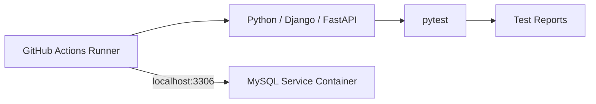
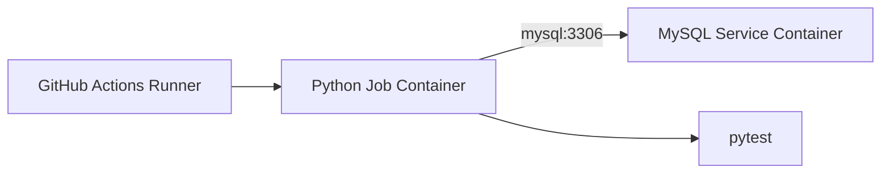
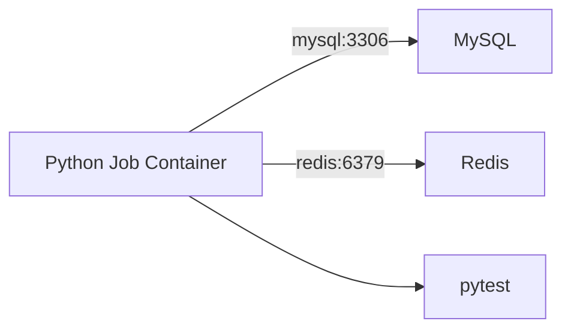
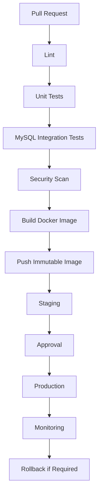

# 05- MySQL Service Containers

## Overview

MySQL service containers provide a disposable MySQL instance alongside a GitHub Actions job for integration and database testing.

For backend applications built with Python, Django, or FastAPI, this allows CI to validate the application against an actual MySQL server instead of relying exclusively on SQLite, mocks, or a shared external database.

A typical CI flow is:

```text
Pull Request
    ↓
GitHub Actions
    ↓
Python Test Job
    ↓
MySQL Service Container
    ↓
Migrations
    ↓
pytest
    ↓
Coverage / Test Reports
    ↓
Artifacts
```

The important engineering concerns are not limited to starting MySQL. A reliable setup must address:

- MySQL version selection.
- Database and user initialization.
- Container networking.
- Port mapping.
- Health and readiness.
- Character sets and collations.
- Application connection configuration.
- Migration behavior.
- Test isolation.
- Connection limits.
- Parallel testing.
- Security.
- Failure diagnostics.
- CI performance and cost.

## Why Use MySQL Service Containers?

A service container gives each CI job an isolated MySQL environment.

This is particularly useful when MySQL is the application's production database.

```text
Application
    ↓
MySQL-specific behavior
    ↓
Integration Tests
```

Testing against the actual database engine helps detect issues involving:

- SQL dialect differences.
- Data types.
- Constraints.
- Indexes.
- Transactions.
- Character sets.
- Collations.
- Isolation behavior.
- MySQL-specific SQL.
- Migration compatibility.

Using SQLite for an application that runs MySQL in production can produce false confidence because the two database engines do not behave identically.

## MySQL Service Architecture

A runner-based GitHub Actions job can use:



When the job itself runs in a container:



The hostname changes because the networking model changes.

## Basic MySQL Service

A basic service configuration is:

```yaml
jobs:
  test:
    runs-on: ubuntu-latest

    services:
      mysql:
        image: mysql:8.4
        env:
          MYSQL_ROOT_PASSWORD: root
          MYSQL_DATABASE: app_test
          MYSQL_USER: test
          MYSQL_PASSWORD: test
        ports:
          - 3306:3306

    steps:
      - name: Checkout
        uses: actions/checkout@v4

      - name: Install dependencies
        run: |
          python -m pip install --upgrade pip
          pip install -r requirements.txt

      - name: Run tests
        run: pytest
```

The main components are:

```yaml
services:
  mysql:
    image: mysql:8.4
```

and:

```yaml
env:
  MYSQL_ROOT_PASSWORD: root
  MYSQL_DATABASE: app_test
  MYSQL_USER: test
  MYSQL_PASSWORD: test
```

The service name:

```text
mysql
```

also becomes important when the job runs inside a container.

## MySQL Image Selection

Use an explicit version:

```yaml
image: mysql:8.4
```

Avoid:

```yaml
image: mysql:latest
```

for a production CI pipeline.

An unpinned `latest` tag can introduce a new MySQL release without any corresponding source-code change.

This can result in:

```text
Previously passing pipeline
        ↓
New MySQL image
        ↓
Changed behavior
        ↓
Unexpected CI failure
```

Pin the version according to the application's supported database versions.

## MySQL Version Compatibility

There are two common strategies.

### Production Version Testing

Use the same major version used in production:

```yaml
image: mysql:8.4
```

This minimizes database-version drift.

### Compatibility Matrix

If the application officially supports multiple MySQL versions, use a matrix:

```yaml
strategy:
  matrix:
    mysql:
      - "8.0"
      - "8.4"

services:
  mysql:
    image: mysql:${{ matrix.mysql }}
```

This validates the compatibility contract intentionally.

Do not create a database-version matrix simply because multiple versions exist.

## MySQL Initialization

The official MySQL image supports initialization through environment variables.

Example:

```yaml
env:
  MYSQL_ROOT_PASSWORD: root
  MYSQL_DATABASE: app_test
  MYSQL_USER: test
  MYSQL_PASSWORD: test
```

This establishes:

```text
MySQL
 ├── root user
 ├── test user
 └── app_test database
```

The application should connect using the non-root test user whenever possible.

## Root vs Application User

Avoid running the application using the MySQL root account.

Prefer:

```text
Application
    ↓
test user
    ↓
app_test
```

instead of:

```text
Application
    ↓
root
    ↓
Everything
```

The application user should have only the privileges required for the tests.

For example:

```yaml
MYSQL_DATABASE: app_test
MYSQL_USER: test
MYSQL_PASSWORD: test
```

The root password is used for database initialization and administrative operations rather than application traffic.

## Database Connection Configuration

A Python application should read MySQL configuration from environment variables.

Example:

```python
import os

DATABASE_CONFIG = {
    "ENGINE": "django.db.backends.mysql",
    "NAME": os.environ["DATABASE_NAME"],
    "USER": os.environ["DATABASE_USER"],
    "PASSWORD": os.environ["DATABASE_PASSWORD"],
    "HOST": os.environ["DATABASE_HOST"],
    "PORT": os.environ.get("DATABASE_PORT", "3306"),
}
```

For a runner-based job:

```yaml
env:
  DATABASE_HOST: localhost
  DATABASE_PORT: "3306"
  DATABASE_NAME: app_test
  DATABASE_USER: test
  DATABASE_PASSWORD: test
```

For a containerized job:

```yaml
env:
  DATABASE_HOST: mysql
  DATABASE_PORT: "3306"
```

## Runner-Based Job Networking

When the job executes directly on the GitHub Actions runner:

```text
Python Process
      │
      │ localhost:3306
      ▼
MySQL Service Container
```

The service port is published:

```yaml
ports:
  - 3306:3306
```

Application configuration:

```yaml
env:
  DATABASE_HOST: localhost
  DATABASE_PORT: "3306"
```

## Containerized Job Networking

When the job executes inside a container:

```yaml
jobs:
  test:
    runs-on: ubuntu-latest

    container:
      image: python:3.12-slim

    services:
      mysql:
        image: mysql:8.4
        env:
          MYSQL_ROOT_PASSWORD: root
          MYSQL_DATABASE: app_test
          MYSQL_USER: test
          MYSQL_PASSWORD: test

    env:
      DATABASE_HOST: mysql
      DATABASE_PORT: "3306"
```

The connection path is:

```text
Python Job Container
        │
        │ mysql:3306
        ▼
MySQL Service Container
```

Do not assume that:

```text
localhost:3306
```

points to the MySQL service from inside the job container.

## `localhost` vs `mysql`

| Job model | MySQL hostname | Port |
|---|---|---:|
| Job runs directly on runner | `localhost` | Published port |
| Job runs in container | `mysql` | `3306` |

The distinction is caused by network namespaces.

Inside the job container:

```text
localhost
```

means the job container itself.

The MySQL service is a different container and should normally be reached through:

```text
mysql:3306
```

## Port Mapping

For a runner-based job:

```yaml
ports:
  - 3306:3306
```

means:

```text
Runner Host
    │
    │ localhost:3306
    ▼
MySQL Container
    │
    │ 3306
    ▼
MySQL Server
```

For container-to-container communication:

```text
Job Container
    │
    │ mysql:3306
    ▼
MySQL Service
```

The internal service port is the important endpoint.

## MySQL Readiness

Starting the MySQL container does not necessarily mean that MySQL is ready to accept connections.

The lifecycle is:

```text
Container Created
       ↓
MySQL Process Started
       ↓
Data Directory Initialized
       ↓
System Tables Initialized
       ↓
Database/User Created
       ↓
MySQL Ready
       ↓
Tests
```

A test started too early may fail with:

```text
Can't connect to MySQL server
```

even though the container itself has started.

## MySQL Health Check

A health check can be configured using Docker container options:

```yaml
services:
  mysql:
    image: mysql:8.4
    env:
      MYSQL_ROOT_PASSWORD: root
      MYSQL_DATABASE: app_test
      MYSQL_USER: test
      MYSQL_PASSWORD: test
    ports:
      - 3306:3306
    options: >-
      --health-cmd="mysqladmin ping -h 127.0.0.1 -uroot -proot"
      --health-interval=10s
      --health-timeout=5s
      --health-retries=10
```

The health command verifies that the MySQL server is responding.

A readiness check is better than an arbitrary delay.

## Avoid Arbitrary Sleeps

This is fragile:

```yaml
- name: Wait for MySQL
  run: sleep 30
```

It has two problems:

1. It may wait longer than necessary.
2. It may still be insufficient under slow startup conditions.

Prefer a readiness check.

## Explicit MySQL Readiness Probe

A bounded readiness loop can be used:

```bash
for attempt in {1..30}; do
  if mysqladmin ping \
      -h "$DATABASE_HOST" \
      -P "$DATABASE_PORT" \
      -u "$DATABASE_USER" \
      -p"$DATABASE_PASSWORD" \
      --silent; then
    echo "MySQL is ready"
    exit 0
  fi

  sleep 2
done

echo "MySQL did not become ready in time" >&2
exit 1
```

This provides:

- Bounded retries.
- Clear failure behavior.
- Environment-driven configuration.
- No dependency on arbitrary startup timing.

## MySQL Client Availability

Minimal Python images may not contain the MySQL client.

For example:

```text
python:3.12-slim
```

does not necessarily include:

```bash
mysql
mysqladmin
```

If the workflow uses these commands for diagnostics, install the required client package or use another readiness mechanism.

Do not confuse:

```text
Python database driver
```

with:

```text
MySQL command-line client
```

They are separate dependencies.

## Django with MySQL

Django can use MySQL through an appropriate database driver.

A typical configuration is:

```python
import os

DATABASES = {
    "default": {
        "ENGINE": "django.db.backends.mysql",
        "NAME": os.environ["DATABASE_NAME"],
        "USER": os.environ["DATABASE_USER"],
        "PASSWORD": os.environ["DATABASE_PASSWORD"],
        "HOST": os.environ["DATABASE_HOST"],
        "PORT": os.environ.get("DATABASE_PORT", "3306"),
    }
}
```

The workflow provides:

```yaml
env:
  DATABASE_NAME: app_test
  DATABASE_USER: test
  DATABASE_PASSWORD: test
  DATABASE_HOST: localhost
  DATABASE_PORT: "3306"
```

For a containerized job:

```yaml
DATABASE_HOST: mysql
```

## Django Migrations

Migrations should run against the actual MySQL service:

```yaml
- name: Run migrations
  run: python manage.py migrate --noinput

- name: Run tests
  run: pytest
```

The lifecycle becomes:

```text
MySQL Ready
    ↓
Django Migrations
    ↓
Schema Created
    ↓
pytest
```

This validates the application's migration chain against MySQL.

## FastAPI with MySQL

A FastAPI application can construct a MySQL connection URL from environment variables:

```python
import os

DATABASE_URL = (
    "mysql+pymysql://"
    f"{os.environ['DATABASE_USER']}:"
    f"{os.environ['DATABASE_PASSWORD']}@"
    f"{os.environ['DATABASE_HOST']}:"
    f"{os.environ.get('DATABASE_PORT', '3306')}/"
    f"{os.environ['DATABASE_NAME']}"
)
```

The application does not need to know whether it is running:

```text
Locally
CI
Docker Compose
Kubernetes
```

The deployment environment supplies the appropriate endpoint.

## MySQL Character Sets

Character-set configuration can affect application behavior.

A common modern configuration is:

```text
utf8mb4
```

which supports the full Unicode range.

CI should reproduce production-relevant character-set behavior.

For example, applications may need to store:

- Emoji.
- International text.
- Non-Latin scripts.
- Unicode symbols.

A CI environment using different character-set behavior can hide production issues.

## MySQL Collations

Collation determines how strings are compared and sorted.

Differences can affect:

- Case sensitivity.
- Ordering.
- Uniqueness.
- Search behavior.

For example:

```text
Application
    ↓
String Comparison
    ↓
MySQL Collation
```

If production uses a specific collation, integration testing should avoid silently using a different configuration.

## SQL Modes

MySQL SQL modes influence database behavior.

They can affect:

- Invalid values.
- Date handling.
- Grouping behavior.
- Data truncation.
- Strictness.

CI should use configuration that is compatible with production.

Do not intentionally loosen SQL behavior merely to make tests pass.

A production mismatch such as:

```text
Production: strict mode
CI: permissive mode
```

can allow invalid application behavior to pass CI.

## MySQL-Specific Behavior

Testing against MySQL can expose issues hidden by SQLite.

Examples include:

```text
SQL dialect
Data types
Collation
Character sets
Index behavior
Constraints
Transactions
Isolation
SQL modes
```

For applications deployed on MySQL, these behaviors should be validated with MySQL rather than relying exclusively on another database engine.

## Test Database Isolation

A clean CI lifecycle should be:

```text
Job Starts
    ↓
Fresh MySQL
    ↓
Database Initialized
    ↓
Migrations
    ↓
Tests
    ↓
Reports
    ↓
Container Destroyed
```

Each workflow execution gets an independent environment.

This prevents:

- Test data leakage.
- Cross-PR interference.
- State-dependent tests.
- Cleanup failures.
- Race conditions.

## Test Data Management

Tests should not depend on pre-existing data.

Prefer:

- Factories.
- Fixtures.
- Explicit test setup.
- Transaction rollback.
- Test database recreation.
- Deterministic cleanup.

For Django:

```bash
pytest
```

with the appropriate Django test configuration can create and manage test database state.

## Parallel Tests

Parallel execution can put significant load on MySQL.

```text
pytest workers
   ├── Worker 1 ──┐
   ├── Worker 2 ──┤
   ├── Worker 3 ──┼── MySQL
   └── Worker 4 ──┘
```

Potential bottlenecks include:

- Connection limits.
- Lock contention.
- CPU.
- Memory.
- Temporary tables.
- Disk I/O.
- Concurrent schema operations.

Increasing test workers indefinitely does not guarantee faster execution.

## Connection Limits

Consider the relationship between:

```text
Test Workers
+
Application Connection Pool
+
MySQL max_connections
+
Runner Resources
```

For example:

```text
20 workers
×
5 connections
=
100 potential connections
```

If MySQL cannot support the workload, tests may fail with connection errors.

Tune the system as a whole.

## MySQL Configuration

Basic configuration:

```yaml
services:
  mysql:
    image: mysql:8.4
    env:
      MYSQL_ROOT_PASSWORD: root
      MYSQL_DATABASE: app_test
      MYSQL_USER: test
      MYSQL_PASSWORD: test
```

More specialized requirements may require:

- Custom configuration.
- Custom MySQL image.
- Initialization scripts.
- Custom character set.
- Custom collation.
- SQL mode configuration.

Only add configuration required by the application.

## Initialization Scripts

For more complex database initialization, an image can execute initialization scripts during database creation.

A conceptual structure is:

```text
MySQL Image
    │
    ├── Base MySQL Server
    │
    └── Initialization Scripts
            │
            ├── Database Setup
            ├── Extensions / Configuration
            └── Test Fixtures
```

Be careful not to put application migrations into the image if migrations are supposed to be validated by the CI workflow itself.

A useful separation is:

```text
MySQL initialization
        ↓
Database infrastructure

Django migrations
        ↓
Application schema
```

This allows the CI pipeline to validate migrations rather than assuming the schema already exists.

## Docker Compose Alternative

For simple database dependencies, GitHub Actions service containers are convenient.

For more complex environments, Docker Compose may be preferable.

Example:

```yaml
services:
  api:
    build: .
    environment:
      DATABASE_HOST: mysql
      DATABASE_PORT: "3306"
      DATABASE_NAME: app_test
      DATABASE_USER: test
      DATABASE_PASSWORD: test
    depends_on:
      - mysql

  mysql:
    image: mysql:8.4
    environment:
      MYSQL_ROOT_PASSWORD: root
      MYSQL_DATABASE: app_test
      MYSQL_USER: test
      MYSQL_PASSWORD: test
```

The API communicates using:

```text
mysql:3306
```

because Compose provides service-name-based networking.

## GitHub Actions Services vs Docker Compose

| Capability | GitHub Actions Service | Docker Compose |
|---|---|---|
| Simple MySQL dependency | Excellent | Good |
| Native workflow integration | Strong | Manual |
| Complex networking | Limited | Strong |
| Multiple application containers | Less convenient | Strong |
| Local development parity | Moderate | Excellent |
| Custom volumes | More limited | Strong |
| Custom networks | More limited | Strong |
| CI setup complexity | Low | Higher |

Use GitHub Actions services when the topology is simple.

Use Compose when the integration environment is itself a multi-container system.

## MySQL and Redis Together

A Python backend may require both MySQL and Redis:

```yaml
services:
  mysql:
    image: mysql:8.4
    env:
      MYSQL_ROOT_PASSWORD: root
      MYSQL_DATABASE: app_test
      MYSQL_USER: test
      MYSQL_PASSWORD: test

  redis:
    image: redis:7
```

A containerized application can use:

```yaml
env:
  DATABASE_HOST: mysql
  DATABASE_PORT: "3306"
  REDIS_HOST: redis
  REDIS_PORT: "6379"
```

The topology becomes:



## MySQL and Celery

A Django application may use:

```text
Django
   ↓
MySQL
```

for persistent data and:

```text
Django / Celery
   ↓
Redis
```

for task or cache-related functionality.

Integration tests may therefore require both services.

Keep responsibilities separate:

```text
MySQL → Persistent relational state
Redis → Cache / broker / transient state
```

## MySQL and Nginx

A full integration environment may look like:

```text
pytest
   ↓
Nginx
   ↓
Django / FastAPI
   ↓
MySQL
```

This can validate proxy behavior together with database access.

However, do not include Nginx merely because it exists in production.

Add services only when the test actually validates the corresponding integration boundary.

## Security Considerations

A CI MySQL instance should be disposable and isolated.

Do not connect pull-request tests to:

```text
Production MySQL
```

or:

```text
Shared sensitive database
```

Prefer:

```text
Untrusted Code
      ↓
Isolated Runner
      ↓
Ephemeral MySQL
```

## Test Credentials

For a disposable local service, credentials such as:

```yaml
MYSQL_USER: test
MYSQL_PASSWORD: test
```

can be acceptable because they do not grant access to production infrastructure.

Never reuse:

```text
Production MySQL username/password
```

for CI.

## Secret Handling

Do not print credentials:

```bash
echo "$MYSQL_PASSWORD"
```

Instead, print only safe metadata:

```bash
echo "Database host: $DATABASE_HOST"
echo "Database port: $DATABASE_PORT"
echo "Database name: $DATABASE_NAME"
echo "Database user: $DATABASE_USER"
```

Passwords and tokens should remain out of workflow logs.

## Pull Request Security

Pull-request workflows may execute untrusted source changes.

Avoid architectures where:

```text
Untrusted PR
    ↓
Self-Hosted Runner
    ↓
Private Network
    ↓
Production MySQL
```

The database service should be isolated and disposable.

For sensitive CI workloads, consider ephemeral runners and strict network controls.

## Self-Hosted Runners

Persistent self-hosted runners increase the security and reliability requirements.

Potential problems include:

- Workspace contamination.
- Credentials left behind.
- Database processes surviving a job.
- Cross-job data leakage.
- Excessive private-network access.
- Malicious code persistence.

Ephemeral runners provide stronger isolation.

## MySQL Logs and Diagnostics

When a workflow fails, determine whether the problem is:

```text
Container startup
        ↓
MySQL readiness
        ↓
Network connectivity
        ↓
Authentication
        ↓
Database existence
        ↓
Migration
        ↓
Query execution
        ↓
Application test
```

This layered diagnosis avoids debugging application code when MySQL itself is unavailable.

## Connection Failure

### Symptom

```text
Can't connect to MySQL server
```

### Possible Causes

- MySQL is still starting.
- Wrong hostname.
- Wrong port.
- Service is unhealthy.
- Container networking is incorrect.
- MySQL failed during initialization.

### Isolation Strategy

Determine the job execution model first.

Runner-based:

```text
localhost:3306
```

Containerized:

```text
mysql:3306
```

Then verify readiness.

## Authentication Failure

### Symptom

```text
Access denied for user 'test'
```

### Possible Causes

- Incorrect username.
- Incorrect password.
- Wrong host.
- Initialization configuration mismatch.
- Application configuration override.

Check:

```text
MYSQL_USER
MYSQL_PASSWORD
DATABASE_USER
DATABASE_PASSWORD
DATABASE_HOST
```

Never print the password during diagnosis.

## Unknown Database

### Symptom

```text
Unknown database 'app_test'
```

### Possible Causes

- `MYSQL_DATABASE` is missing.
- Database name differs between service and application.
- Initialization failed.
- Application is using another configuration source.

Verify:

```yaml
MYSQL_DATABASE: app_test
```

and:

```yaml
DATABASE_NAME: app_test
```

## Migration Failure

### Symptom

Django migration fails.

### Isolation Strategy

Separate database connectivity from migration logic.

First verify:

```bash
mysqladmin ping \
  -h "$DATABASE_HOST" \
  -P "$DATABASE_PORT"
```

Then run:

```bash
python manage.py migrate --noinput
```

If connectivity succeeds but migrations fail, investigate:

- Migration dependencies.
- MySQL compatibility.
- SQL generation.
- Database constraints.
- Character sets.
- Collations.
- SQL modes.

## Character-Set Failure

### Symptom

Unicode or string operations behave unexpectedly.

### Possible Causes

- Different character set.
- Different collation.
- Production and CI configurations differ.

### Corrective Action

Make CI configuration representative of production.

For modern applications, verify that the intended `utf8mb4` behavior is preserved.

## SQL Mode Differences

### Symptom

A query or insert succeeds in CI but fails in production.

### Possible Cause

Different MySQL SQL modes.

The environment may have different strictness.

Compare:

```text
Production SQL Mode
        vs
CI SQL Mode
```

Avoid using a permissive CI configuration to conceal application errors.

## Timeout

### Symptom

```text
Connection timed out
```

### Isolation

Check:

```text
Hostname
Port
Container network
MySQL readiness
Runner networking
```

Do not immediately assume the application is slow.

## Health Check Failure

### Symptom

The MySQL service remains unhealthy.

### Possible Causes

- Incorrect root password.
- Invalid initialization.
- MySQL startup failure.
- Insufficient resources.
- Health command incorrect.

Check the container configuration first.

## MySQL-Specific Diagnostics

Useful commands include:

```bash
mysqladmin ping \
  -h "$DATABASE_HOST" \
  -P "$DATABASE_PORT"
```

If the MySQL client is available:

```bash
mysql \
  -h "$DATABASE_HOST" \
  -P "$DATABASE_PORT" \
  -u "$DATABASE_USER" \
  -p"$DATABASE_PASSWORD" \
  "$DATABASE_NAME"
```

Avoid placing passwords directly in shell history or logs outside the isolated CI execution context. Prefer environment variables and CI secret mechanisms where credentials are actually sensitive.

## MySQL Version Matrix

A deliberate compatibility matrix can look like:

```yaml
strategy:
  matrix:
    mysql:
      - "8.0"
      - "8.4"

services:
  mysql:
    image: mysql:${{ matrix.mysql }}
    env:
      MYSQL_ROOT_PASSWORD: root
      MYSQL_DATABASE: app_test
      MYSQL_USER: test
      MYSQL_PASSWORD: test
```

This allows the same test suite to validate multiple supported versions.

The matrix should be driven by a real compatibility requirement.

## Matrix with Python

A backend project may test:

```yaml
strategy:
  matrix:
    python:
      - "3.11"
      - "3.12"
    mysql:
      - "8.0"
      - "8.4"
```

This produces four combinations:

```text
Python 3.11 + MySQL 8.0
Python 3.11 + MySQL 8.4
Python 3.12 + MySQL 8.0
Python 3.12 + MySQL 8.4
```

Every additional dimension increases CI resource consumption.

## Performance Considerations

MySQL service startup can add significant time to integration jobs.

Optimize the surrounding workflow rather than weakening database validation.

Useful techniques include:

- Cache Python dependencies.
- Run linting and unit tests before integration tests.
- Run independent integration jobs in parallel.
- Keep the MySQL image version controlled.
- Avoid unnecessary service dependencies.
- Avoid excessive matrix combinations.
- Use appropriate test parallelism.

## Database Startup Cost

A pipeline should not repeatedly initialize MySQL unnecessarily.

A typical architecture is:

```text
Lint
  ↓
Unit Tests
  ↓
Integration Tests
  ├── MySQL
  └── Redis
  ↓
Build
```

This ensures the database environment is created only for jobs that need it.

## Test Ordering

A practical backend pipeline can use:

```text
Pull Request
     ↓
Lint
     ↓
Unit Tests
     ↓
Integration Tests
     ↓
Security Scan
     ↓
Build
```

Unit tests provide faster feedback.

Integration tests then validate actual database behavior.

## Artifacts

Database test failures should produce useful diagnostics.

For example:

```yaml
- name: Run tests
  run: |
    pytest \
      --junitxml=test-results.xml \
      --cov=. \
      --cov-report=xml

- name: Upload test reports
  if: ${{ !cancelled() }}
  uses: actions/upload-artifact@v4
  with:
    name: mysql-test-reports
    path: |
      test-results.xml
      coverage.xml
```

Artifacts preserve test outputs for later inspection.

Do not confuse artifacts with dependency caches.

## Production CI/CD Architecture

MySQL integration testing should be one stage in a broader immutable-artifact pipeline:



The database used for CI should remain separate from production infrastructure.

## Immutable Build Promotion

The CI database validates the application before building the production artifact.

The preferred flow is:

```text
Source
  ↓
Tests
  ↓
Build
  ↓
Immutable Artifact
  ↓
Staging
  ↓
Production
```

The Docker image should not be rebuilt separately for each environment.

## MySQL in Production vs CI

Do not confuse:

```text
MySQL Service Container
```

with:

```text
Production MySQL Infrastructure
```

CI optimizes for:

- Reproducibility.
- Isolation.
- Disposable environments.
- Fast feedback.

Production optimizes for:

- Availability.
- Durability.
- Backup.
- Replication.
- Monitoring.
- Recovery.
- Security.
- Capacity management.

The CI database is a test dependency, not a production architecture.

## High Availability

A service container normally does not need production-style MySQL high availability.

If the container fails:

```text
Job Fails
    ↓
Environment Destroyed
    ↓
Workflow Rerun
```

Production MySQL may instead require:

```text
Application
    ↓
Highly Available Database Architecture
    ↓
Replication / Failover
    ↓
Backups
```

Do not over-engineer ephemeral CI infrastructure.

## Disaster Recovery

For disposable CI databases, recovery generally means:

```text
Destroy
  ↓
Recreate
  ↓
Migrate
  ↓
Rerun
```

Persistent shared test environments require a separate backup and recovery strategy.

## Cost Considerations

The major cost drivers are:

```text
Runner Duration
+
Matrix Size
+
MySQL Startup Time
+
Test Duration
+
Parallelism
```

For example:

```text
4 matrix combinations
×
10 minutes
=
40 runner-minutes
```

Parallel execution can reduce wall-clock duration but still consumes compute resources.

Keep the matrix aligned with actual compatibility requirements.

## Common Mistakes

### Using `localhost` From a Containerized Job

Incorrect:

```yaml
DATABASE_HOST: localhost
```

when MySQL is a separate service container.

Use:

```yaml
DATABASE_HOST: mysql
```

### Using `latest`

Avoid:

```yaml
image: mysql:latest
```

Prefer:

```yaml
image: mysql:8.4
```

### Running the Application as Root

Avoid:

```text
Application → root
```

Prefer:

```text
Application → test
```

with only the privileges required by the test environment.

### Assuming Startup Means Readiness

A container can be running while MySQL is still initializing.

Use health checks.

### Using `sleep`

Avoid:

```bash
sleep 30
```

Use a bounded readiness check.

### Reusing Production Credentials

CI should never need production MySQL credentials for ordinary integration tests.

### Using a Shared Test Database

Shared databases can introduce:

- Race conditions.
- Data leakage.
- Flaky tests.
- Cleanup failures.

Prefer disposable service containers.

### Ignoring Character Sets

Different character-set configurations can cause production-only failures.

Use production-relevant configuration.

### Ignoring Collations

String comparison and ordering behavior can depend on collation.

Keep CI and production behavior aligned where it matters.

### Ignoring SQL Modes

A permissive CI configuration can hide invalid SQL or data behavior that production rejects.

### Overusing Matrix Testing

Every matrix combination consumes CI resources.

Only test supported compatibility combinations.

## Troubleshooting Checklist

When MySQL integration tests fail:

```text
[ ] Is the MySQL image version intentional?
[ ] Is the service configured correctly?
[ ] Is the container running?
[ ] Is the service healthy?
[ ] Is the job runner-based or containerized?
[ ] Is DATABASE_HOST correct?
[ ] Is port 3306 correct?
[ ] Is the database initialized?
[ ] Are credentials correct?
[ ] Is the application using the expected configuration?
[ ] Can mysqladmin ping succeed?
[ ] Can the application authenticate?
[ ] Do Django migrations succeed?
[ ] Are character sets correct?
[ ] Are collations compatible?
[ ] Are SQL modes compatible?
[ ] Are connection limits sufficient?
[ ] Are parallel tests creating contention?
[ ] Are sensitive values excluded from logs?
[ ] Are test reports available?
```

## GitHub CLI Operational Checks

GitHub CLI can be used to inspect workflow execution:

```bash
gh run list
```

Inspect a run:

```bash
gh run view RUN_ID
```

Inspect logs:

```bash
gh run view RUN_ID --log
```

List workflows:

```bash
gh workflow list
```

Rerun a workflow:

```bash
gh run rerun RUN_ID
```

These commands help establish whether the MySQL failure is isolated to one execution or consistently reproducible.

## Interview Scenarios

### Why Use MySQL Instead of SQLite?

If MySQL is the production database, integration tests should validate MySQL-specific behavior.

SQLite may not reproduce:

- MySQL SQL behavior.
- Character sets.
- Collations.
- SQL modes.
- Transaction behavior.
- Data type behavior.

### Why Does `localhost` Fail?

When the job runs inside a container:

```text
localhost
```

refers to the job container itself.

The MySQL service should normally be addressed as:

```text
mysql:3306
```

### Why Pin the MySQL Version?

To prevent external image updates from unexpectedly changing the CI environment.

### Why Use a Non-Root MySQL User?

It follows least privilege and prevents the application from having unnecessary administrative permissions.

### How Would You Test Multiple MySQL Versions?

Use a matrix only for versions the application explicitly supports:

```yaml
strategy:
  matrix:
    mysql:
      - "8.0"
      - "8.4"
```

### How Would You Debug a Connection Failure?

Use the sequence:

```text
Container
→ Health
→ DNS / Hostname
→ TCP / Port
→ Authentication
→ Database
→ Migration
→ Query
→ Test
```

### What Causes a Migration to Fail When MySQL Is Healthy?

Potential causes include:

- Migration logic.
- Unsupported SQL.
- Schema constraints.
- Character sets.
- Collations.
- SQL modes.
- MySQL-version incompatibility.

### How Would You Protect MySQL From Untrusted PR Code?

Use:

- Disposable database instances.
- Test-only credentials.
- GitHub-hosted or properly isolated ephemeral runners.
- No production network access.
- No production credentials.
- Least-privilege permissions.

### How Would You Keep CI Fast?

Separate fast tests from integration tests:

```text
Lint
  ↓
Unit Tests
  ↓
Integration Tests
  ↓
Build
```

Cache dependencies and avoid unnecessary matrix combinations.

## Production Checklist

Before using MySQL service containers in a production CI pipeline:

- [ ] MySQL version is explicitly pinned.
- [ ] Version selection matches production or an intentional compatibility matrix.
- [ ] Test-only credentials are used.
- [ ] The application does not use the root account.
- [ ] The database is disposable.
- [ ] The correct hostname is configured for the job networking model.
- [ ] Port `3306` is configured correctly.
- [ ] MySQL readiness is verified.
- [ ] Arbitrary startup sleeps are avoided.
- [ ] Character sets match production requirements.
- [ ] Collations match production requirements.
- [ ] SQL modes are production-compatible where relevant.
- [ ] Django/FastAPI configuration is environment-driven.
- [ ] Migrations run against the actual MySQL service.
- [ ] Parallel test capacity is understood.
- [ ] Connection limits are appropriate.
- [ ] Sensitive values are not logged.
- [ ] Pull-request code cannot reach production databases.
- [ ] Self-hosted runner network access is restricted.
- [ ] Test reports are uploaded as artifacts.
- [ ] Dependency caching is configured separately from test database state.
- [ ] Matrix testing is limited to meaningful compatibility combinations.
- [ ] Workflow failures provide sufficient database diagnostics.

## Key Takeaways

- MySQL service containers provide isolated, disposable database environments that allow GitHub Actions to validate Python, Django, and FastAPI applications against a real MySQL server.
- Runner-based jobs commonly connect through `localhost:3306`, while containerized jobs normally connect through the service hostname such as `mysql:3306`.
- Reliable MySQL CI requires readiness checks, explicit database configuration, correct credentials, migration validation, and attention to character sets, collations, SQL modes, and connection limits.
- Production-grade CI should use test-only credentials, avoid root application access, isolate pull-request workloads from production infrastructure, and use disposable databases and appropriately isolated runners.
- Senior-level MySQL CI design balances database realism with reproducibility, performance, security, matrix cost, troubleshooting, and the broader immutable-artifact deployment pipeline.