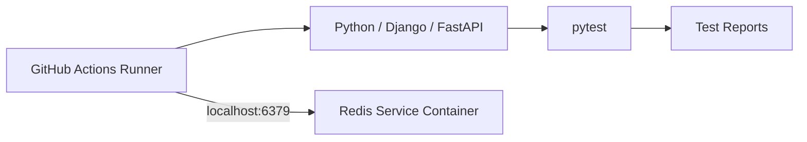
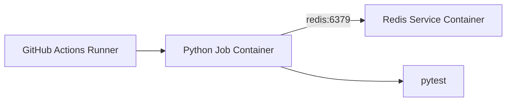
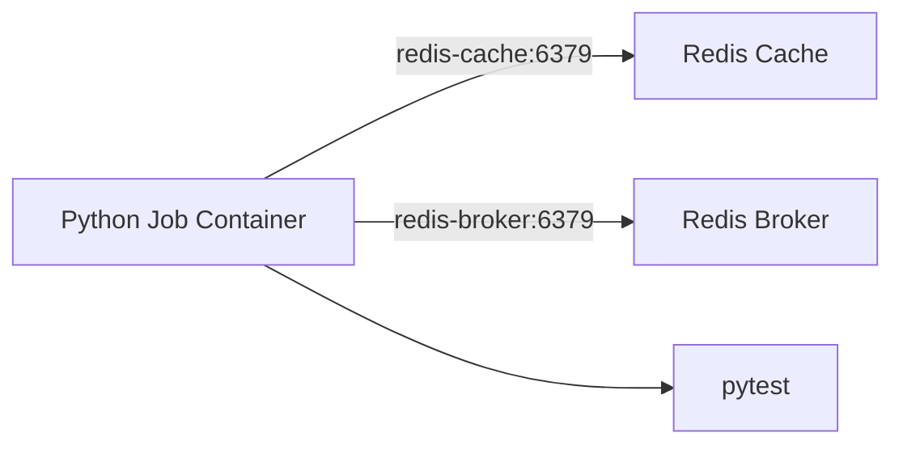
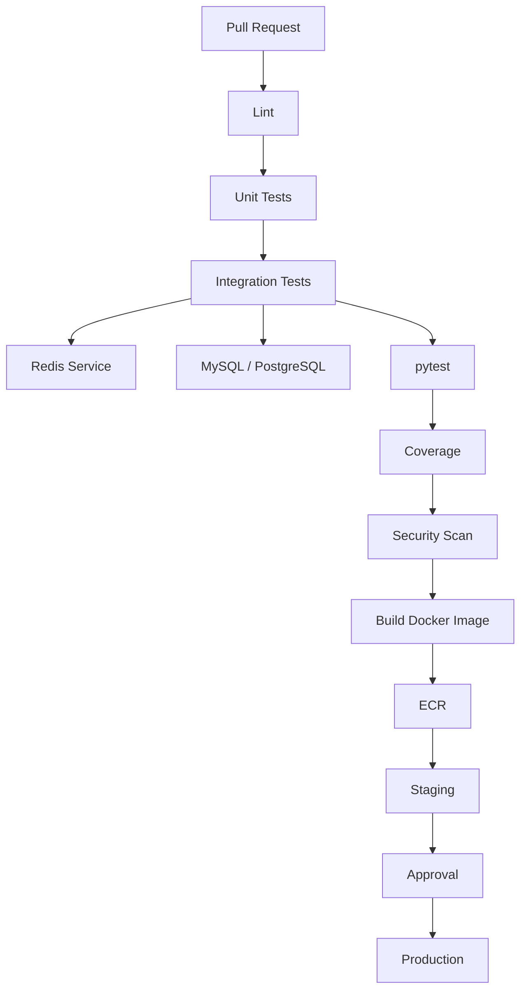

# 06- Redis Service Containers

## Overview

Redis is commonly used by backend applications for caching, task queues, distributed coordination, rate limiting, sessions, and other low-latency workloads. When a GitHub Actions integration test depends on Redis, a service container provides an isolated Redis instance for the duration of the job.

A typical backend CI pipeline can look like:

```text
Pull Request
    ↓
GitHub Actions
    ↓
Python / Django / FastAPI Job
    ↓
Redis Service Container
    ↓
Integration Tests
    ↓
Coverage / Test Reports
    ↓
Artifacts
```

Redis service containers are particularly useful when the application behavior being tested depends on actual Redis semantics rather than a mock.

The important concerns include:

- Redis image and version selection.
- Container networking.
- Service hostnames and ports.
- Readiness.
- Authentication where applicable.
- Database selection.
- Cache and queue isolation.
- Django and FastAPI integration.
- Celery integration.
- Parallel testing.
- Test data cleanup.
- Security.
- Failure diagnostics.
- Performance and CI cost.

## Why Use Redis Service Containers?

A Redis service container gives each CI job a disposable Redis environment.

This is useful when integration tests need to validate actual Redis behavior such as:

- Cache reads and writes.
- Key expiration.
- TTL behavior.
- Serialization.
- Atomic operations.
- Redis-backed sessions.
- Celery broker communication.
- Celery result backends.
- Rate limiting.
- Distributed locks.
- Pub/sub behavior.

The important distinction is:

```text
Mock Redis
    ↓
Tests application interaction contract

Real Redis
    ↓
Tests application + Redis behavior
```

A mock can be useful for unit tests, while a real Redis service is more appropriate for integration tests involving Redis semantics.

## Redis Service Architecture

For a runner-based job:



For a containerized job:



The hostname depends on the job's networking model.

## Basic Redis Service

A basic GitHub Actions service can be configured as:

```yaml
jobs:
  test:
    runs-on: ubuntu-latest

    services:
      redis:
        image: redis:7

    steps:
      - name: Checkout
        uses: actions/checkout@v4

      - name: Set up Python
        uses: actions/setup-python@v6
        with:
          python-version: "3.12"

      - name: Install dependencies
        run: |
          python -m pip install --upgrade pip
          pip install -r requirements.txt

      - name: Run tests
        run: pytest
```

If the job runs directly on the runner and the application needs to access Redis through the host, publish the port:

```yaml
services:
  redis:
    image: redis:7
    ports:
      - 6379:6379
```

## Redis Image Selection

Use an explicit Redis version:

```yaml
image: redis:7
```

Avoid:

```yaml
image: redis:latest
```

for production CI pipelines where reproducibility matters.

An unpinned image can change independently of the application source code.

A controlled version gives:

```text
Source Code
    +
Pinned Redis Version
    ↓
Reproducible Test Environment
```

## Redis Version Compatibility

If the application supports one Redis version, test against that version:

```yaml
image: redis:7
```

If multiple Redis versions are explicitly supported, use a matrix:

```yaml
strategy:
  matrix:
    redis:
      - "6"
      - "7"

services:
  redis:
    image: redis:${{ matrix.redis }}
```

Do not create a large Redis-version matrix unless the compatibility requirement justifies the additional CI cost.

## Runner-Based Job Networking

When the job executes directly on the GitHub Actions runner:

```text
Python Process
      │
      │ localhost:6379
      ▼
Redis Service Container
```

The service port is published:

```yaml
ports:
  - 6379:6379
```

Application configuration:

```yaml
env:
  REDIS_HOST: localhost
  REDIS_PORT: "6379"
```

## Containerized Job Networking

When the job runs inside a container:

```yaml
jobs:
  test:
    runs-on: ubuntu-latest

    container:
      image: python:3.12-slim

    services:
      redis:
        image: redis:7

    env:
      REDIS_HOST: redis
      REDIS_PORT: "6379"

    steps:
      - uses: actions/checkout@v4

      - name: Install dependencies
        run: pip install -r requirements.txt

      - name: Run tests
        run: pytest
```

The connection path becomes:

```text
Python Job Container
        │
        │ redis:6379
        ▼
Redis Service Container
```

Inside the job container:

```text
localhost
```

refers to the job container itself, not automatically to the Redis service.

## `localhost` vs `redis`

| Job model | Redis hostname | Port |
|---|---|---:|
| Job runs directly on runner | `localhost` | Published port |
| Job runs inside container | `redis` | `6379` |

This distinction is one of the most common causes of Redis connection failures in containerized CI.

## Service Name as DNS

When the job and Redis service participate in the same container network, the service name can be used as the hostname.

Given:

```yaml
services:
  redis:
    image: redis:7
```

the application can use:

```text
redis:6379
```

Avoid depending on dynamic container IP addresses.

Prefer:

```text
redis
```

over:

```text
172.x.x.x
```

Service names are stable logical identifiers while container IP addresses are implementation details.

## Port Mapping

For runner-based jobs:

```yaml
ports:
  - 6379:6379
```

provides:

```text
Runner
  │
  │ localhost:6379
  ▼
Redis Container
```

For container-to-container communication:

```text
Job Container
      │
      │ redis:6379
      ▼
Redis Service
```

the internal service port is used.

## Redis Readiness

A Redis container starting does not necessarily mean that the service is ready for application requests.

The lifecycle is:

```text
Container Created
       ↓
Redis Process Started
       ↓
Redis Ready
       ↓
Application Tests
```

Redis usually starts quickly, but CI should still avoid relying purely on timing assumptions.

## Redis Health Check

A health check can be configured:

```yaml
services:
  redis:
    image: redis:7
    ports:
      - 6379:6379
    options: >-
      --health-cmd "redis-cli ping"
      --health-interval 10s
      --health-timeout 5s
      --health-retries 5
```

A successful check should return:

```text
PONG
```

This provides a better readiness signal than:

```bash
sleep 10
```

## Explicit Redis Readiness Probe

A bounded readiness loop can be used when the Redis CLI is available:

```bash
for attempt in {1..30}; do
  if redis-cli -h "$REDIS_HOST" -p "$REDIS_PORT" ping | grep -q PONG; then
    echo "Redis is ready"
    exit 0
  fi

  sleep 2
done

echo "Redis did not become ready in time" >&2
exit 1
```

This provides:

- Bounded retries.
- Clear failure behavior.
- Environment-driven configuration.
- Deterministic startup handling.

## Redis Client Availability

Minimal application images may not contain:

```bash
redis-cli
```

The Python Redis client:

```python
import redis
```

is not the same thing as the Redis CLI.

If diagnostic commands are part of the workflow, explicitly provide the required tooling.

## Python Redis Client

A backend application can use environment-driven configuration:

```python
import os
import redis

client = redis.Redis(
    host=os.environ.get("REDIS_HOST", "localhost"),
    port=int(os.environ.get("REDIS_PORT", "6379")),
    decode_responses=True,
)
```

The application can then use:

```python
client.set("health-check", "ok")
value = client.get("health-check")
```

CI determines the endpoint:

```yaml
env:
  REDIS_HOST: localhost
  REDIS_PORT: "6379"
```

or, for a containerized job:

```yaml
env:
  REDIS_HOST: redis
  REDIS_PORT: "6379"
```

## Django Cache with Redis

Django can use Redis as a cache backend.

A typical configuration can use:

```python
import os

CACHES = {
    "default": {
        "BACKEND": "django_redis.cache.RedisCache",
        "LOCATION": (
            f"redis://{os.environ.get('REDIS_HOST', 'localhost')}:"
            f"{os.environ.get('REDIS_PORT', '6379')}/1"
        ),
        "OPTIONS": {
            "CLIENT_CLASS": "django_redis.client.DefaultClient",
        },
    }
}
```

CI can configure:

```yaml
env:
  REDIS_HOST: localhost
  REDIS_PORT: "6379"
```

The application can then test:

```text
Django
  ↓
Django Cache
  ↓
Redis
```

## FastAPI with Redis

A FastAPI application can use the Redis client with environment-driven configuration:

```python
import os
import redis

redis_client = redis.Redis(
    host=os.environ.get("REDIS_HOST", "localhost"),
    port=int(os.environ.get("REDIS_PORT", "6379")),
    decode_responses=True,
)
```

An integration test can validate:

```text
HTTP Request
    ↓
FastAPI
    ↓
Redis
    ↓
Response
```

This is more representative than replacing Redis with an in-memory dictionary when Redis behavior itself is part of the integration contract.

## Celery with Redis

Redis is frequently used with Celery as a broker and/or result backend.

Example configuration:

```python
import os

REDIS_HOST = os.environ.get("REDIS_HOST", "localhost")
REDIS_PORT = os.environ.get("REDIS_PORT", "6379")

CELERY_BROKER_URL = (
    f"redis://{REDIS_HOST}:{REDIS_PORT}/0"
)

CELERY_RESULT_BACKEND = (
    f"redis://{REDIS_HOST}:{REDIS_PORT}/1"
)
```

A CI environment can therefore validate:

```text
Test
  ↓
Django / FastAPI
  ↓
Celery
  ↓
Redis
  ↓
Worker
```

For a complete Celery integration test, the worker itself may need to run as an additional process or container.

## Redis Database Selection

Redis supports logical databases identified by numeric indexes.

For example:

```text
Redis DB 0 → Celery broker
Redis DB 1 → Celery results
Redis DB 2 → Application cache
```

A simple CI environment can use separate logical databases to reduce key collisions.

However, logical Redis databases are not equivalent to independent Redis servers.

They share the same:

- Process.
- Memory.
- Configuration.
- Availability boundary.
- Resource limits.

For strong isolation, separate Redis instances are more appropriate.

## Cache Isolation

Tests should avoid accidentally depending on keys left by previous tests.

For example:

```text
test_a
   ↓
SET user:1
   ↓
test_b
   ↓
GET user:1
```

can create hidden test coupling.

Prefer unique keys or explicit cleanup.

Example:

```python
import uuid

cache_key = f"test:{uuid.uuid4()}"
```

Framework-specific test isolation can also be used where appropriate.

## Redis Key Expiration

Redis TTL behavior can be tested directly:

```python
client.set("temporary-key", "value", ex=30)

assert client.get("temporary-key") == "value"
assert client.ttl("temporary-key") > 0
```

This is one reason a real Redis integration test can be valuable.

A mock may not reproduce actual expiration semantics.

## Redis Serialization

Applications often serialize Python objects before storing them.

Examples include:

- JSON.
- Pickle.
- MessagePack.
- Framework-specific serializers.

Integration tests should validate the actual serialization path when serialization compatibility matters.

Avoid assuming:

```text
Python object
    =
Redis value
```

Redis stores byte-oriented/string-like values, while the application controls serialization.

## Redis Authentication

A basic CI Redis instance may not require authentication because it is isolated within the workflow environment.

If the application requires Redis authentication in production, CI should reproduce the relevant security behavior where practical.

For example:

```yaml
services:
  redis:
    image: redis:7
    command: redis-server --requirepass test-password
```

The application can then use the corresponding credential.

Do not copy production Redis passwords into CI.

## Redis TLS

Production Redis deployments may use TLS.

A simple local service container often does not need TLS unless the application specifically needs to validate TLS behavior.

When TLS itself is part of the integration contract, use an environment that supports and exercises the required TLS configuration.

Do not add production complexity to every CI job without a testing requirement.

## Redis Data Persistence

Redis can be configured for persistence, but ordinary CI service containers generally do not need production-style persistence.

The desired CI lifecycle is:

```text
Job Starts
    ↓
Fresh Redis
    ↓
Tests
    ↓
Redis Destroyed
```

There is normally no need to preserve Redis data between workflow runs.

## Redis Persistence vs CI Reproducibility

Production Redis may use:

- RDB snapshots.
- AOF.
- Replication.
- Managed service backups.

CI integration tests usually optimize for:

```text
Fresh State
+
Fast Startup
+
Isolation
+
Reproducibility
```

Persisting test Redis state can actually make tests less deterministic.

## Multiple Redis Services

A workflow may require separate Redis instances for different purposes:

```yaml
services:
  redis-cache:
    image: redis:7

  redis-broker:
    image: redis:7
```

A containerized job can then use:

```text
redis-cache:6379
redis-broker:6379
```

This provides stronger isolation than merely using different logical Redis databases.

The topology becomes:



Use multiple services only when the application architecture or test boundary requires it.

## Redis with MySQL

A common backend integration environment contains both MySQL and Redis:

```yaml
services:
  mysql:
    image: mysql:8.4
    env:
      MYSQL_ROOT_PASSWORD: root
      MYSQL_DATABASE: app_test
      MYSQL_USER: test
      MYSQL_PASSWORD: test

  redis:
    image: redis:7
```

A containerized application can use:

```yaml
env:
  DATABASE_HOST: mysql
  DATABASE_PORT: "3306"
  REDIS_HOST: redis
  REDIS_PORT: "6379"
```

The architecture becomes:

```text
                 Python Job
                     │
            ┌────────┴────────┐
            │                 │
            ▼                 ▼
       MySQL:3306        Redis:6379
            │                 │
            ▼                 ▼
       Persistent          Cache /
         Data              Broker
```

## Redis with PostgreSQL

The same pattern applies to PostgreSQL:

```text
Python Job
    │
    ├── postgres:5432
    │
    └── redis:6379
```

This is a common Django and FastAPI integration-test architecture.

## Redis and Nginx

Nginx generally does not communicate directly with Redis.

A more realistic flow is:

```text
pytest
   ↓
Nginx
   ↓
Django / FastAPI
   ├── MySQL / PostgreSQL
   └── Redis
```

Include Nginx in the test environment only when the test needs to validate the reverse-proxy boundary.

## Redis and Microservices

Multiple services may use the same Redis service:

```text
Service A ──┐
Service B ──┼── Redis
Service C ──┘
```

This can be useful for integration tests, but shared Redis state increases coupling.

For isolated service tests, consider whether each test should receive:

- Its own Redis instance.
- Its own key namespace.
- A dedicated logical database.

The appropriate choice depends on the integration boundary being tested.

## Service Networking

For a containerized job:

```text
Job Container
    │
    ├── redis:6379
    ├── mysql:3306
    └── postgres:5432
```

The service names act as logical DNS names.

Do not hard-code:

```text
172.17.0.3
```

or another container IP.

Container IPs can change between runs.

## Health and Readiness

A robust Redis integration environment should establish:

```text
Container Started
       ↓
Redis Ready
       ↓
Connectivity Verified
       ↓
Application Started
       ↓
Tests
```

The health check should validate actual service availability rather than merely container existence.

## Test Types

Redis service containers can support several testing layers.

### Unit Tests

Use mocks when Redis itself is not the subject of the test.

```text
Unit Test
   ↓
Mock Redis Client
```

This keeps tests fast.

### Integration Tests

Use real Redis when validating Redis interaction:

```text
Application
   ↓
Real Redis
```

### API Tests

A real Redis service is useful when an HTTP endpoint depends on Redis:

```text
HTTP Request
    ↓
FastAPI / Django
    ↓
Redis
    ↓
HTTP Response
```

### End-to-End Tests

A larger environment can include:

```text
Client
  ↓
Nginx
  ↓
API
  ├── MySQL
  └── Redis
```

The Redis service becomes one component of the end-to-end environment.

## Parallel Testing

Parallel tests can interfere with Redis when they share keys.

Potential problems include:

- Key collisions.
- Race conditions.
- Unexpected deletes.
- Shared counters.
- Distributed-lock contention.
- Rate-limit state leaking between tests.

A safer strategy is to namespace keys.

For example:

```text
ci:<run-id>:<worker-id>:<key>
```

The namespace can be generated by the test framework or workflow.

## Matrix Testing

Redis can participate in a CI matrix when compatibility testing is required:

```yaml
strategy:
  matrix:
    python:
      - "3.11"
      - "3.12"
    redis:
      - "6"
      - "7"
```

This creates:

```text
Python 3.11 + Redis 6
Python 3.11 + Redis 7
Python 3.12 + Redis 6
Python 3.12 + Redis 7
```

Every additional matrix dimension increases CI resource usage.

## Redis Connection Pooling

Python Redis clients can use connection pools.

For example:

```python
import os
import redis

pool = redis.ConnectionPool(
    host=os.environ.get("REDIS_HOST", "localhost"),
    port=int(os.environ.get("REDIS_PORT", "6379")),
    max_connections=20,
    decode_responses=True,
)

client = redis.Redis(connection_pool=pool)
```

The pool size should reflect the test workload.

Do not configure a large pool simply because production has a large Redis workload.

CI resources are usually smaller and disposable.

## Redis Resource Limits

Redis is memory-oriented.

Potential CI bottlenecks include:

- Memory consumption.
- Large test values.
- Excessive key creation.
- Unbounded test data.
- Large serialized objects.
- High parallelism.

A test suite that continuously writes keys without cleanup can consume significant memory.

## Test Cleanup

Tests should remove temporary data where appropriate.

For example:

```python
client.set("test-key", "value")

try:
    assert client.get("test-key") == "value"
finally:
    client.delete("test-key")
```

Framework fixtures can provide cleaner lifecycle management.

The exact cleanup strategy depends on whether the test needs to verify key persistence after a specific operation.

## Redis Flush Operations

A tempting cleanup operation is:

```text
FLUSHDB
```

or:

```text
FLUSHALL
```

These operations should be used carefully.

`FLUSHDB` removes all keys from the selected logical database.

`FLUSHALL` removes keys from all logical databases on the Redis instance.

In isolated CI containers, this may be acceptable for controlled test setup, but tests should not assume that destructive commands are safe in shared Redis environments.

Never run broad flush commands against production Redis as part of a CI test.

## Security Considerations

A Redis service container should be isolated from production infrastructure.

Avoid:

```text
Pull Request
    ↓
Redis Service
    ↓
Private Production Network
```

Prefer:

```text
Pull Request
    ↓
Isolated Runner
    ↓
Ephemeral Redis
```

The Redis service should contain only test data.

## Redis Credentials

If authentication is unnecessary for an isolated CI service, avoid introducing fake production-like credential management solely for appearance.

If authentication behavior is part of the test requirement, configure it explicitly:

```yaml
services:
  redis:
    image: redis:7
    command: redis-server --requirepass test-password
```

Keep the credential limited to the test environment.

## Pull Request Security

Untrusted pull-request code can execute application and test code.

Do not give that code access to:

- Production Redis.
- Shared internal Redis.
- Production credentials.
- Unnecessary private networks.

For sensitive environments, use appropriately isolated runners.

## Self-Hosted Runners

Self-hosted runners require additional controls because they may have:

```text
Private Network Access
+
Persistent Filesystem
+
Cloud Credentials
+
Internal DNS
```

A malicious workflow could potentially abuse those capabilities.

Prefer ephemeral runners for workloads that execute untrusted code while requiring access to sensitive infrastructure.

## Redis Logging

Redis failures should be diagnosable without exposing credentials.

Capture:

- Workflow logs.
- Application errors.
- Connectivity checks.
- Test reports.

Avoid printing:

```text
Redis passwords
connection URLs containing credentials
tokens
```

into workflow logs.

## Redis Diagnostics

A simple connectivity check is:

```bash
redis-cli -h "$REDIS_HOST" -p "$REDIS_PORT" ping
```

Expected:

```text
PONG
```

A basic key test:

```bash
redis-cli \
  -h "$REDIS_HOST" \
  -p "$REDIS_PORT" \
  SET ci:health-check ok
```

Then:

```bash
redis-cli \
  -h "$REDIS_HOST" \
  -p "$REDIS_PORT" \
  GET ci:health-check
```

Expected:

```text
ok
```

These checks distinguish basic Redis connectivity from application-level failures.

## Connection Failure

### Symptom

```text
Connection refused
```

### Possible Causes

- Redis is still starting.
- Incorrect hostname.
- Incorrect port.
- Service is unhealthy.
- Job networking model is misunderstood.

### Isolation Strategy

Determine whether the job runs:

```text
On runner
```

or:

```text
Inside a container
```

Then use:

```text
localhost:6379
```

or:

```text
redis:6379
```

respectively.

## DNS Resolution Failure

### Symptom

```text
Could not resolve host redis
```

### Possible Causes

- Incorrect service name.
- Incorrect network.
- Job is not using the expected container networking model.

Verify:

```bash
getent hosts redis
```

when the diagnostic utility is available.

## Redis Health Failure

### Symptom

The service is not healthy.

### Possible Causes

- Redis failed to start.
- Incorrect command-line arguments.
- Authentication configuration mismatch.
- Resource constraints.
- Incorrect health command.

Check the service definition and health command first.

## Authentication Failure

### Symptom

```text
NOAUTH Authentication required
```

### Possible Causes

- Redis requires a password.
- Application did not provide the password.
- CI configuration differs from application configuration.

Verify the intended authentication model.

## Wrong Redis Database

### Symptom

A test expects a key but cannot find it.

### Possible Causes

The application may be connected to:

```text
DB 0
```

while the test checks:

```text
DB 1
```

Verify the Redis URL and database index.

## Key Collision

### Symptom

Tests fail intermittently.

### Possible Cause

Parallel tests share the same Redis keys.

For example:

```text
test_worker_1 → user:1
test_worker_2 → user:1
```

One worker may overwrite or delete the other's data.

Use unique namespaces:

```text
test:<worker>:user:1
```

## TTL-Related Flakiness

### Symptom

A test involving expiration passes locally but fails intermittently in CI.

### Possible Causes

- Extremely short TTL.
- Scheduling delays.
- Clock assumptions.
- Test runner contention.

Avoid assertions that depend on precise timing.

Prefer bounded assertions such as:

```text
TTL > 0
```

when exact expiration timing is not the behavior being validated.

## Redis Memory Problems

### Symptom

Redis becomes slow or unavailable during tests.

### Possible Causes

- Excessive test data.
- Large values.
- Missing cleanup.
- Too much parallelism.

Inspect:

```text
Key Count
Memory Usage
Test Data Size
Parallelism
```

A disposable Redis container should still have a bounded workload.

## Production CI/CD Architecture

Redis integration tests belong in the validation stage of an immutable CI/CD pipeline:



Redis should remain a CI dependency rather than becoming a hidden connection to production infrastructure.

## Immutable Artifact Promotion

The test stage validates the source before an immutable artifact is promoted:

```text
Source
  ↓
Unit Tests
  ↓
Redis Integration Tests
  ↓
Security Scan
  ↓
Build
  ↓
Immutable Docker Image
  ↓
Staging
  ↓
Production
```

The same artifact should be promoted between environments rather than rebuilt independently for each environment.

## High Availability

A Redis service container normally does not require production-style high availability.

If the container fails:

```text
Job Fails
    ↓
Environment Destroyed
    ↓
Workflow Rerun
```

Production Redis may require:

- Replication.
- Automatic failover.
- Managed services.
- Persistence.
- Monitoring.
- Backup and recovery.

Those requirements generally do not belong in an ephemeral CI service container.

## Disaster Recovery

For disposable CI Redis:

```text
Failure
  ↓
Destroy
  ↓
Recreate
  ↓
Rerun
```

There is normally no reason to restore Redis test state from backup.

Persistent shared test environments are different and may require:

- Backup.
- Restore.
- Data reset.
- Failure recovery.
- Environment ownership.

## Performance Considerations

Redis is generally fast, but CI performance can still be affected by:

- Large test payloads.
- Excessive serialization.
- Too many keys.
- High test parallelism.
- Connection establishment.
- Large Redis commands.
- Unnecessary end-to-end dependencies.

Keep Redis interactions realistic but bounded.

## Cost Considerations

Redis service containers contribute to CI cost primarily through runner execution time.

Cost drivers include:

```text
Number of Jobs
+
Matrix Size
+
Test Duration
+
Startup Time
+
Parallel Execution
```

If:

```text
4 matrix combinations
×
8 minutes
```

are executed, the workload consumes:

```text
32 runner-minutes
```

Parallelism reduces wall-clock time but does not eliminate compute consumption.

## Operational Best Practices

Use these practices:

- Pin the Redis version.
- Use service names rather than container IP addresses.
- Use the correct hostname for the job networking model.
- Add readiness checks.
- Keep Redis disposable.
- Use real Redis for Redis-specific integration behavior.
- Use mocks for isolated unit tests.
- Namespace test keys.
- Clean up temporary state.
- Keep connection pools appropriate for CI.
- Avoid unnecessary Redis services.
- Avoid production Redis access.
- Keep credentials out of logs.
- Restrict self-hosted runner network access.
- Limit matrix combinations to meaningful compatibility requirements.
- Preserve test reports and diagnostics.

## Common Mistakes

### Using `localhost` From a Job Container

Incorrect:

```yaml
REDIS_HOST: localhost
```

when Redis is a separate service container.

Use:

```yaml
REDIS_HOST: redis
```

### Using `latest`

Avoid:

```yaml
image: redis:latest
```

Prefer:

```yaml
image: redis:7
```

### Assuming Container Startup Means Readiness

A running container does not guarantee that Redis is accepting requests.

Use a health check.

### Using Arbitrary Sleeps

Avoid:

```bash
sleep 20
```

Prefer:

```bash
redis-cli ping
```

with bounded retries.

### Sharing Redis Keys Between Tests

Shared keys can create flaky parallel tests.

Use unique key namespaces.

### Using `FLUSHALL` Carelessly

`FLUSHALL` is destructive.

Never use it against shared or production Redis.

### Testing Only With Mocks

Mocks cannot validate actual Redis behavior such as:

- TTL.
- Serialization.
- Atomic operations.
- Connection behavior.
- Actual broker interaction.

Use integration tests where those behaviors matter.

### Overbuilding the Environment

Do not add:

```text
Nginx
Redis
MySQL
PostgreSQL
Kafka
Celery
```

to every integration test simply because the production application uses them.

Build the smallest environment that validates the intended integration boundary.

### Ignoring Redis Memory Usage

Large test datasets and missing cleanup can consume significant memory.

Keep the workload bounded.

## Troubleshooting Checklist

When Redis integration tests fail:

```text
[ ] Is the Redis image version intentional?
[ ] Is the service running?
[ ] Is Redis healthy?
[ ] Is the job runner-based or containerized?
[ ] Is REDIS_HOST correct?
[ ] Is port 6379 correct?
[ ] Is Redis authentication configured?
[ ] Is the application using the expected Redis database?
[ ] Can redis-cli ping Redis?
[ ] Are keys isolated between tests?
[ ] Are parallel workers causing collisions?
[ ] Are TTL assertions deterministic?
[ ] Is Redis memory usage reasonable?
[ ] Are credentials excluded from logs?
[ ] Is production Redis completely isolated?
[ ] Are test reports available?
```

## GitHub CLI Operational Checks

GitHub CLI can be used to inspect workflow execution:

```bash
gh run list
```

Inspect a specific run:

```bash
gh run view RUN_ID
```

Inspect workflow logs:

```bash
gh run view RUN_ID --log
```

List workflows:

```bash
gh workflow list
```

Rerun a failed workflow:

```bash
gh run rerun RUN_ID
```

These commands help determine whether Redis failures are isolated to a particular workflow execution or consistently reproducible.

## Interview Scenarios

### Why Use Redis Service Containers?

Because integration tests can validate actual Redis behavior in an isolated environment without depending on shared infrastructure.

### Why Not Use a Python Dictionary?

A dictionary does not reproduce:

- Network communication.
- Redis serialization.
- TTL.
- Redis atomic operations.
- Redis connection behavior.
- Redis-specific failures.

A dictionary is appropriate for some unit tests but not for Redis integration behavior.

### Why Does `localhost` Fail Inside a Job Container?

Because:

```text
localhost
```

refers to the job container itself.

The Redis service is a separate container and should normally be reached as:

```text
redis:6379
```

### How Would You Test Django + Redis?

Use:

```text
Django
   ↓
Django Cache
   ↓
Redis Service
   ↓
pytest
```

Validate cache behavior such as:

- Set.
- Get.
- Expiration.
- Serialization where applicable.

### How Would You Test Celery + Redis?

A realistic integration environment can contain:

```text
pytest
   ↓
Django / FastAPI
   ↓
Celery
   ↓
Redis
   ↓
Celery Worker
```

The worker should run in a controlled test process or container when worker behavior is part of the test.

### How Would You Isolate Parallel Redis Tests?

Use unique namespaces:

```text
ci:<run-id>:<worker-id>:<key>
```

rather than relying on globally shared keys.

### When Would You Use Separate Redis Containers?

Use separate services when stronger isolation is required, for example:

```text
redis-cache
redis-broker
```

This provides stronger separation than merely using different logical Redis databases.

### How Would You Debug a Redis Connection Failure?

Use:

```text
Container
→ Health
→ Hostname
→ Port
→ Authentication
→ Redis Database
→ Key State
→ Application
→ Test
```

### How Would You Secure Redis in CI?

Use:

- Disposable Redis instances.
- Test-only credentials.
- No production Redis connectivity.
- Isolated runners.
- Restricted private-network access.
- No credentials in logs.

### How Would You Keep Redis Integration Tests Fast?

Separate unit tests from integration tests, cache Python dependencies, limit unnecessary matrix combinations, avoid oversized test data, and parallelize independent tests without introducing shared-key contention.

## Production Checklist

Before using Redis service containers in a production CI pipeline:

- [ ] Redis version is explicitly pinned.
- [ ] Redis hostname matches the job networking model.
- [ ] Port `6379` is configured correctly.
- [ ] Redis readiness is verified.
- [ ] Arbitrary startup sleeps are avoided.
- [ ] Test Redis is disposable.
- [ ] Redis-specific behavior is covered by real integration tests where required.
- [ ] Unit tests use mocks where appropriate.
- [ ] Test keys are isolated.
- [ ] Parallel workers cannot unintentionally share state.
- [ ] Redis authentication is configured when the test requires it.
- [ ] Redis database selection is explicit.
- [ ] Characteristic production Redis behavior is tested where relevant.
- [ ] Redis memory usage is bounded.
- [ ] Connection pools are appropriate for CI.
- [ ] `FLUSHALL` and broad destructive commands are not used against shared infrastructure.
- [ ] No production Redis credentials are exposed.
- [ ] Pull-request workloads cannot reach production Redis.
- [ ] Self-hosted runner network access is restricted.
- [ ] Test reports and diagnostics are preserved.
- [ ] Matrix testing is limited to supported compatibility requirements.
- [ ] CI cost is monitored as the test matrix grows.

## Key Takeaways

- Redis service containers provide isolated, disposable Redis environments for integration testing of caching, TTLs, serialization, Celery, rate limiting, and other Redis-dependent backend behavior.
- Runner-based jobs commonly use `localhost:6379`, while containerized jobs normally connect through the service hostname such as `redis:6379`.
- Reliable Redis CI requires explicit versions, readiness checks, environment-driven configuration, isolated test keys, bounded resources, and correct handling of parallel test execution.
- Redis should remain isolated from production infrastructure, with test-only credentials, controlled self-hosted runner access, and no sensitive values exposed in workflow logs.
- Senior-level Redis CI design balances realistic Redis integration coverage with test isolation, performance, matrix cost, security, reproducibility, and the broader immutable-artifact CI/CD pipeline.