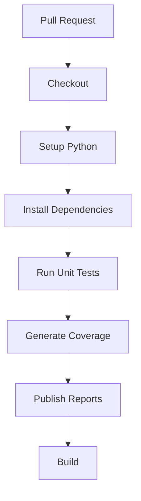
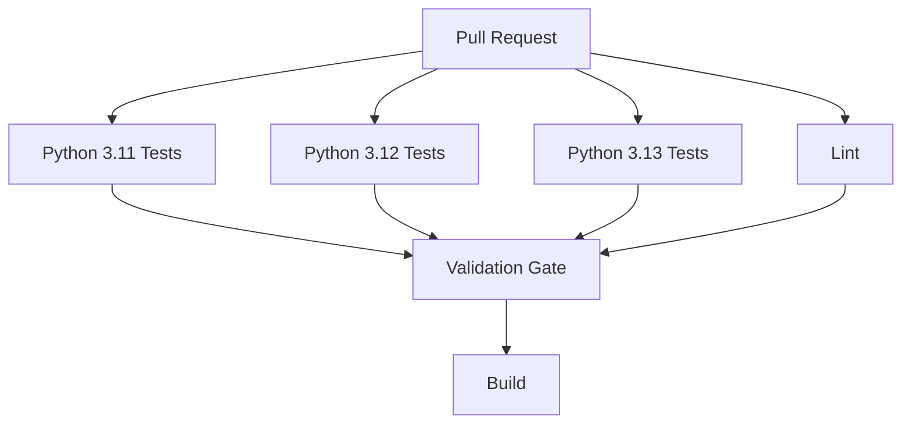
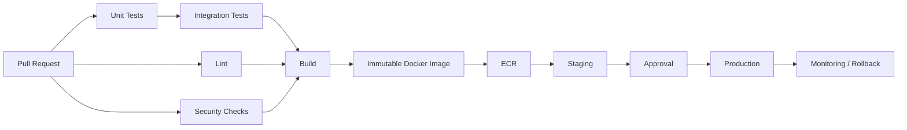

# 07- Unit Testing Pipelines

## Overview

Unit testing is the fastest and most frequently executed validation layer in a production CI/CD pipeline. GitHub Actions should execute unit tests consistently across pull requests and protected branches, while keeping the unit-test stage isolated from slower integration and end-to-end dependencies.

A typical Python backend pipeline separates unit testing from external-service testing:

```text
Pull Request
     ↓
Checkout
     ↓
Python Setup
     ↓
Dependency Installation
     ↓
Lint / Static Checks
     ↓
Unit Tests
     ↓
Coverage
     ↓
Test Reports
     ↓
Integration Tests
     ↓
Build
```

For Django and FastAPI applications, unit tests should primarily validate application logic without requiring PostgreSQL, MySQL, Redis, Kafka, external APIs, or AWS services.

The distinction matters because unit tests should remain:

- Fast.
- Deterministic.
- Isolated.
- Repeatable.
- Cheap to execute.
- Easy to diagnose.

Integration tests can then validate infrastructure boundaries using service containers such as PostgreSQL, MySQL, and Redis.

## Unit Tests vs Integration Tests

The primary CI decision is determining what belongs in a unit test.

| Test type | External services | Typical speed | Primary purpose |
|---|---|---:|---|
| Unit | No | Very fast | Application logic |
| Integration | Often yes | Moderate | Component interactions |
| API | Sometimes | Moderate | HTTP/API behavior |
| End-to-end | Yes | Slow | Complete user/system flow |

A healthy pipeline usually follows:

```text
Many unit tests
      ↓
Fewer integration tests
      ↓
Small number of end-to-end tests
```

This is sometimes described as a test pyramid.

## What Belongs in a Unit Test?

A unit test should normally validate one logical unit of application behavior.

Examples include:

- Pure Python functions.
- Business rules.
- Data transformations.
- Validation logic.
- Serialization logic.
- Error handling.
- Permission decisions.
- Utility functions.
- Domain services.
- State transitions.

For example:

```python
def calculate_total(price: float, quantity: int) -> float:
    if quantity < 0:
        raise ValueError("quantity cannot be negative")

    return price * quantity
```

A unit test can validate this without starting Django, Redis, PostgreSQL, or an HTTP server.

```python
def test_calculate_total():
    assert calculate_total(25.0, 4) == 100.0
```

## Why Unit Tests Should Be Isolated

Consider a business function:

```text
Order
  ↓
Calculate Discount
  ↓
Return Amount
```

There is no reason to start:

```text
PostgreSQL
Redis
Celery
Nginx
AWS
```

just to verify arithmetic.

External dependencies increase:

- Startup time.
- Failure points.
- Configuration complexity.
- Debugging effort.
- CI resource consumption.

Unit tests should therefore keep infrastructure boundaries outside the test whenever those boundaries are not part of the behavior being validated.

## Unit Test Execution Model

A GitHub Actions unit-test job typically follows:



The runner creates a clean execution environment for each workflow job.

A simplified lifecycle is:

```text
Runner Allocated
      ↓
Repository Checked Out
      ↓
Python Installed
      ↓
Dependencies Installed
      ↓
Tests Executed
      ↓
Reports Generated
      ↓
Job Succeeds / Fails
      ↓
Runner Environment Discarded
```

## Basic Python Unit-Test Workflow

A practical baseline is:

```yaml
name: Unit Tests

on:
  pull_request:
  push:
    branches:
      - main

jobs:
  unit-tests:
    runs-on: ubuntu-latest

    steps:
      - name: Checkout
        uses: actions/checkout@v4

      - name: Set up Python
        uses: actions/setup-python@v6
        with:
          python-version: "3.12"

      - name: Install dependencies
        run: |
          python -m pip install --upgrade pip
          pip install -r requirements.txt
          pip install pytest pytest-cov

      - name: Run unit tests
        run: pytest tests/unit
```

The workflow deliberately does not define PostgreSQL, MySQL, or Redis services.

## Python Version Selection

The Python version used by CI should be explicit:

```yaml
with:
  python-version: "3.12"
```

Avoid depending on whichever Python version happens to be preinstalled on the runner.

Explicit versions improve reproducibility.

## Testing Multiple Python Versions

If the application supports multiple Python versions, use a matrix:

```yaml
jobs:
  unit-tests:
    runs-on: ubuntu-latest

    strategy:
      fail-fast: false
      matrix:
        python-version:
          - "3.11"
          - "3.12"
          - "3.13"

    steps:
      - name: Checkout
        uses: actions/checkout@v4

      - name: Set up Python
        uses: actions/setup-python@v6
        with:
          python-version: ${{ matrix.python-version }}

      - name: Install dependencies
        run: |
          python -m pip install --upgrade pip
          pip install -r requirements.txt
          pip install pytest pytest-cov

      - name: Run unit tests
        run: pytest tests/unit
```

This produces independent jobs:

```text
Python 3.11 → Unit Tests
Python 3.12 → Unit Tests
Python 3.13 → Unit Tests
```

### `fail-fast`

For compatibility testing:

```yaml
fail-fast: false
```

allows all matrix jobs to complete even if one version fails.

This is useful when the purpose is to determine the complete compatibility surface.

For expensive test suites where one failure should stop unnecessary work, `fail-fast: true` may be appropriate.

## Unit Tests in Django

Django unit tests can validate application logic without requiring every production dependency.

For example:

```python
from django.test import SimpleTestCase


class PriceTests(SimpleTestCase):
    def test_discounted_price(self):
        price = 100
        discount = 20

        result = price - (price * discount / 100)

        self.assertEqual(result, 80)
```

For pure logic, `SimpleTestCase` can avoid unnecessary database requirements.

The important principle is:

```text
Test Requirement
      ↓
Smallest Required Runtime Environment
```

## Django Database Tests

Not every Django test is a unit test.

If a test uses:

```python
Model.objects.create(...)
```

it is interacting with a database and should generally be treated as a database/integration-oriented test.

For example:

```python
from django.test import TestCase

from .models import UserProfile


class UserProfileTests(TestCase):
    def test_profile_creation(self):
        profile = UserProfile.objects.create(
            name="Alice",
        )

        self.assertEqual(profile.name, "Alice")
```

This test requires Django's database testing infrastructure.

It should not be categorized as a pure unit test simply because the test uses Django's test framework.

## FastAPI Unit Tests

FastAPI applications can separate pure business logic from HTTP integration.

Business logic:

```python
def calculate_discount(amount: float, percentage: float) -> float:
    return amount * (percentage / 100)
```

Unit test:

```python
def test_calculate_discount():
    assert calculate_discount(200, 10) == 20
```

An API test using `TestClient` is a different boundary:

```python
from fastapi.testclient import TestClient

from app.main import app

client = TestClient(app)


def test_health_endpoint():
    response = client.get("/health")

    assert response.status_code == 200
```

This is closer to an API/integration test because the HTTP application stack is involved.

## pytest as the Test Runner

`pytest` is commonly used for Python backend CI because it provides:

- Simple test discovery.
- Fixtures.
- Parameterization.
- Plugins.
- Rich failure reporting.
- Parallel execution support through plugins.
- Coverage integration.
- Integration with Django and FastAPI ecosystems.

Basic execution:

```bash
pytest
```

Unit-only execution:

```bash
pytest tests/unit
```

Verbose output:

```bash
pytest -v
```

Stop after the first failure:

```bash
pytest -x
```

Run a specific test:

```bash
pytest tests/unit/test_orders.py::test_calculate_total
```

## Test Discovery

A predictable test layout improves CI behavior.

For example:

```text
project/
├── app/
├── tests/
│   ├── unit/
│   │   ├── test_orders.py
│   │   ├── test_pricing.py
│   │   └── test_validation.py
│   ├── integration/
│   └── e2e/
├── pyproject.toml
└── requirements.txt
```

Then:

```bash
pytest tests/unit
```

clearly communicates the intended test boundary.

## pytest Configuration

Configuration can be centralized in `pyproject.toml`:

```toml
[tool.pytest.ini_options]
testpaths = ["tests"]
addopts = "-ra"
```

Additional project-specific configuration can define markers:

```toml
[tool.pytest.ini_options]
testpaths = ["tests"]
markers = [
    "unit: isolated unit tests",
    "integration: integration tests",
    "e2e: end-to-end tests",
]
```

Then:

```bash
pytest -m unit
```

can select unit tests.

## Test Markers

Markers provide an explicit classification:

```python
import pytest


@pytest.mark.unit
def test_calculate_total():
    assert 2 + 2 == 4
```

Integration tests can be marked separately:

```python
import pytest


@pytest.mark.integration
def test_database_connection():
    ...
```

CI can then execute:

```bash
pytest -m unit
```

and later:

```bash
pytest -m integration
```

This prevents every CI stage from executing every test.

## Unit Test Job with Markers

A production-style workflow can use:

```yaml
- name: Run unit tests
  run: pytest -m unit
```

The integration workflow can separately provision service containers:

```text
Integration Job
    ↓
PostgreSQL
Redis
MySQL
    ↓
pytest -m integration
```

## Dependency Installation

The dependency strategy should match the project's packaging model.

A basic application can use:

```yaml
- name: Install dependencies
  run: |
    python -m pip install --upgrade pip
    pip install -r requirements.txt
```

A project using development requirements can use:

```yaml
- name: Install dependencies
  run: |
    python -m pip install --upgrade pip
    pip install -r requirements.txt
    pip install -r requirements-dev.txt
```

For a modern packaged application:

```yaml
- name: Install package
  run: |
    python -m pip install --upgrade pip
    pip install -e ".[test]"
```

The important goal is that CI installs the same supported dependency set developers and production builds are expected to use.

## Dependency Caching

Dependency installation can be expensive.

`actions/setup-python` supports dependency caching:

```yaml
- name: Set up Python
  uses: actions/setup-python@v6
  with:
    python-version: "3.12"
    cache: pip
    cache-dependency-path: requirements.txt
```

The cache should accelerate dependency installation, not become a source of test correctness.

## Cache vs Artifact

A cache is intended for reusable dependencies.

An artifact is intended for workflow outputs.

| Mechanism | Purpose | Example |
|---|---|---|
| Cache | Speed future runs | pip packages |
| Artifact | Preserve run output | coverage report |
| Artifact | Transfer build output | wheel |
| Artifact | Debug failure | logs |

Do not use caches as the mechanism for preserving test reports.

## Cache Keys

A dependency cache should reflect inputs that affect dependencies.

For example:

```text
Python Version
+
OS
+
requirements.txt hash
```

A dependency change should invalidate the relevant cache.

Using `hashFiles()` helps:

```yaml
key: ${{ runner.os }}-python-${{ matrix.python-version }}-${{ hashFiles('requirements.txt') }}
```

When using `actions/setup-python` with `cache: pip`, the action handles the relevant cache behavior.

## Coverage

Coverage measures which parts of the code are exercised by tests.

A typical command is:

```bash
pytest \
  --cov=app \
  --cov-report=term-missing \
  --cov-report=xml
```

This produces:

```text
Terminal Report
+
coverage.xml
```

The XML report can be preserved as an artifact or consumed by another reporting system.

## Coverage Workflow

```yaml
- name: Run unit tests
  run: |
    pytest tests/unit \
      --cov=app \
      --cov-report=term-missing \
      --cov-report=xml

- name: Upload coverage report
  if: ${{ !cancelled() }}
  uses: actions/upload-artifact@v4
  with:
    name: coverage-report
    path: coverage.xml
```

The artifact provides a durable output of the workflow run.

## Coverage Thresholds

A project can enforce a minimum coverage threshold:

```bash
pytest \
  --cov=app \
  --cov-fail-under=80
```

This makes the threshold part of the CI contract.

However, coverage percentage alone does not measure test quality.

For example:

```text
100% line coverage
```

can still contain weak assertions.

Coverage should therefore be used as a signal rather than the sole quality metric.

## Test Reports

A CI pipeline should preserve useful test output when failures occur.

Possible outputs include:

- JUnit XML.
- Coverage XML.
- HTML coverage.
- Logs.
- Screenshots for UI tests.
- Application diagnostics.

Example:

```bash
pytest \
  --junitxml=test-results.xml \
  --cov=app \
  --cov-report=xml
```

## Artifact Upload

A robust workflow should preserve test reports even when tests fail.

```yaml
- name: Run unit tests
  run: |
    pytest \
      --junitxml=test-results.xml \
      --cov=app \
      --cov-report=xml

- name: Upload test reports
  if: ${{ !cancelled() }}
  uses: actions/upload-artifact@v4
  with:
    name: unit-test-reports
    path: |
      test-results.xml
      coverage.xml
```

Using:

```yaml
if: ${{ !cancelled() }}
```

allows report collection after ordinary test failures while respecting workflow cancellation.

## Why Preserve Failed Test Reports?

Without artifacts, a failed job may leave only console output.

Reports provide:

- Historical evidence.
- Structured test results.
- Coverage data.
- Debugging information.
- Inputs for external quality systems.

For large pipelines, this becomes especially important when multiple matrix jobs fail.

## Matrix Test Reports

Matrix jobs should produce uniquely identifiable artifacts.

For example:

```yaml
- name: Upload test report
  if: ${{ !cancelled() }}
  uses: actions/upload-artifact@v4
  with:
    name: unit-tests-python-${{ matrix.python-version }}
    path: test-results.xml
```

Otherwise, multiple matrix jobs may produce confusing or conflicting output names.

## Parallel Unit Tests

Large test suites can be split across workers.

A common Python approach uses `pytest-xdist`:

```bash
pytest -n auto
```

This can reduce wall-clock time when the test suite is sufficiently large.

However, parallel execution requires tests to be independent.

Problems can occur when tests share:

- Files.
- Environment variables.
- Ports.
- Databases.
- Redis keys.
- Global state.
- Temporary directories.

## Parallelism Trade-Off

| Strategy | Benefit | Risk |
|---|---|---|
| Sequential | Simple, deterministic | Slow |
| Fixed workers | Controlled resource usage | Requires tuning |
| `auto` workers | Easy scaling | Can consume significant CPU |
| Matrix + parallel workers | Very fast | High CI cost |

Do not maximize parallelism blindly.

The target is:

```text
Acceptable CI Duration
+
Reliable Tests
+
Controlled Cost
```

## Deterministic Tests

A CI test should ideally produce the same result when run with the same inputs.

Avoid:

```python
import random

value = random.randint(1, 100)
```

without controlling randomness when the result affects the assertion.

Avoid assumptions about:

- Current time.
- External APIs.
- Execution order.
- Local timezone.
- Filesystem ordering.
- Network availability.
- Mutable shared state.

For time-dependent code, inject a clock or use an appropriate testing abstraction.

## External API Mocking

Unit tests should not normally depend on live external APIs.

Instead:

```text
Unit Test
    ↓
Mock HTTP Client
    ↓
Expected Response
```

This avoids:

- Network instability.
- Rate limits.
- Credentials.
- External service outages.
- Slow execution.

The real API contract can be validated separately through integration or contract tests.

## Python HTTP Client Mocking

For code using an HTTP client, mock the boundary rather than the entire application.

For example:

```python
def get_exchange_rate(client, currency):
    response = client.get(
        f"https://example.test/rates/{currency}"
    )
    response.raise_for_status()
    return response.json()["rate"]
```

The unit test can supply a controlled client implementation or mock.

The goal is to test:

```text
Application Logic
```

rather than:

```text
Application Logic
+
Internet
+
Third-Party API
```

## AWS Unit Testing

Avoid making unit tests call live AWS services.

For example, a unit test for S3-related business logic can mock the S3 client.

The CI pipeline should not require:

```text
AWS Credentials
+
Production S3
```

just to validate local business logic.

AWS integration tests can be isolated into a separate stage when actual AWS behavior needs validation.

## Secrets in Unit-Test Jobs

A pure unit-test job often needs no secrets.

Prefer:

```yaml
jobs:
  unit-tests:
    permissions:
      contents: read
```

rather than granting unnecessary permissions.

If the job does not need:

- AWS OIDC.
- Packages write access.
- Pull request write access.
- Deployment permissions.

do not grant them.

## `GITHUB_TOKEN` Permissions

Set the minimum permissions required:

```yaml
permissions:
  contents: read
```

For a pure unit-test workflow, this is frequently sufficient.

A job that only checks out source code should not automatically receive broad write permissions.

## Pull Request Security

Pull-request workflows may execute code originating from contributors.

This makes the unit-test job a security boundary.

Do not expose unnecessary secrets to test execution.

A test can execute arbitrary application code:

```text
pytest
   ↓
Application Code
   ↓
Imported Dependencies
   ↓
Test Fixtures
```

Therefore:

```text
Unit Test Job
```

should be treated as code execution rather than a harmless validation command.

## Shell Injection

Never directly interpolate untrusted GitHub data into shell commands.

Risky:

```yaml
- name: Print branch
  run: echo "${{ github.head_ref }}"
```

A safer pattern is to pass the value through an environment variable:

```yaml
- name: Print branch
  env:
    BRANCH_NAME: ${{ github.head_ref }}
  run: printf '%s\n' "$BRANCH_NAME"
```

The same principle applies to:

- Pull request titles.
- Branch names.
- Commit messages.
- Issue content.
- Manual inputs.

## Unit Test Environment Variables

Application configuration should be explicit.

Example:

```yaml
env:
  DJANGO_SETTINGS_MODULE: config.settings.test
  PYTHONUNBUFFERED: "1"
```

Environment variables can be scoped at:

- Workflow level.
- Job level.
- Step level.

Prefer the narrowest scope that makes the configuration understandable.

## Test Settings

Django projects should generally have explicit test configuration.

For example:

```text
config/
├── settings/
│   ├── base.py
│   ├── development.py
│   ├── test.py
│   └── production.py
```

The workflow can specify:

```yaml
env:
  DJANGO_SETTINGS_MODULE: config.settings.test
```

This avoids accidentally using production settings during CI.

## Failures and Exit Codes

A test command should fail the workflow when tests fail.

For example:

```yaml
- name: Run unit tests
  run: pytest tests/unit
```

If pytest exits with a non-zero status:

```text
pytest
  ↓
Exit Code != 0
  ↓
Step Failed
  ↓
Job Failed
  ↓
Workflow Failed
```

Do not hide test failures with:

```yaml
continue-on-error: true
```

unless the failure is intentionally non-blocking.

## When `continue-on-error` Is Appropriate

A matrix can use experimental configurations:

```yaml
strategy:
  matrix:
    python-version:
      - "3.12"
      - "3.13"
    experimental:
      - false
```

A specific experimental job could be allowed to fail if the project intentionally treats it as informational.

However, making core unit tests non-blocking defeats the purpose of CI quality gates.

## Conditional Test Execution

A unit-test job can depend on earlier validation:

```yaml
jobs:
  lint:
    ...

  unit-tests:
    needs: lint
    ...
```

The dependency graph becomes:

```text
Lint
  ↓
Unit Tests
```

Alternatively, lint and unit tests can run in parallel:

```text
       ┌── Lint ────────┐
PR ────┤                ├── Build
       └── Unit Tests ──┘
```

The correct design depends on whether linting should block test execution and whether parallelism materially reduces pipeline duration.

## Fan-Out and Fan-In

A production CI pipeline can fan out unit tests:



The validation gate can then become a dependency for the build.

## Job Outputs

If a test stage needs to communicate structured information to another job, use `GITHUB_OUTPUT`.

Example:

```yaml
- name: Determine test status
  id: test-status
  run: echo "result=passed" >> "$GITHUB_OUTPUT"
```

A job can expose it:

```yaml
outputs:
  result: ${{ steps.test-status.outputs.result }}
```

Another job can consume it through `needs`.

For ordinary pass/fail behavior, however, job success and failure should generally be represented through the workflow dependency graph rather than custom status outputs.

## Unit Tests and Build Gates

A typical pipeline can use:

```yaml
jobs:
  unit-tests:
    ...

  build:
    needs:
      - unit-tests
    ...
```

This means:

```text
Unit Tests Pass
      ↓
Build
```

If unit tests fail:

```text
Unit Tests Fail
      ↓
Build Blocked
```

This is usually preferable to allowing the build to proceed and discovering the failure later.

## Unit Tests Before Integration Tests

A common production pipeline is:

```text
Lint
  ↓
Unit Tests
  ↓
Integration Tests
  ↓
Security Scan
  ↓
Build
```

However, independent checks can run in parallel:

```text
          ┌── Lint ─────────────┐
          │                     │
Pull ─────┼── Unit Tests ───────┼── Build
          │                     │
          └── Static Analysis ─┘
```

The decision should consider:

- Runtime.
- Resource usage.
- Failure feedback speed.
- Dependency relationships.
- Team workflow.

## Unit Tests and Docker

Unit tests do not necessarily need Docker.

Running:

```text
GitHub Runner
   ↓
Python
   ↓
pytest
```

is often simpler and faster than:

```text
GitHub Runner
   ↓
Docker
   ↓
Python Container
   ↓
pytest
```

Use a containerized test job when you need:

- A controlled OS environment.
- System-level dependencies.
- Production-like runtime.
- Custom tooling.
- Consistency with the production container.

Do not containerize tests merely because the application is deployed with Docker.

## Unit Tests in a Docker Image

If the application image is already built before testing, tests can run against the same dependency environment.

For example:

```text
Docker Build
    ↓
Application Image
    ↓
Unit Tests
```

However, building a full production image before fast unit tests can increase feedback time.

A multi-stage pipeline may instead perform:

```text
Dependency Install
    ↓
Unit Tests
    ↓
Docker Build
```

This avoids spending image-build time on code that already fails unit tests.

## Docker Build and Test Ordering

A practical pipeline is:

```text
Checkout
   ↓
Setup Python
   ↓
Install Dependencies
   ↓
Lint + Unit Tests
   ↓
Integration Tests
   ↓
Security Checks
   ↓
Docker Build
```

The exact ordering can change when Docker itself is part of the test boundary.

## Test Artifacts

Useful artifacts include:

```text
test-results.xml
coverage.xml
htmlcov/
application.log
debug.log
```

Upload only what is useful.

Do not upload:

```text
.env
private keys
production credentials
secret configuration
```

as test artifacts.

## Artifact Retention

Test reports are often useful for a limited period.

Configure an appropriate retention period:

```yaml
- name: Upload test reports
  if: ${{ !cancelled() }}
  uses: actions/upload-artifact@v4
  with:
    name: unit-test-reports
    path: test-results.xml
    retention-days: 7
```

Long retention increases storage usage.

The correct period depends on compliance, debugging, and operational requirements.

## Test Report Naming

For matrix builds:

```yaml
name: unit-tests-python-${{ matrix.python-version }}
```

provides useful traceability.

A report should make it clear:

```text
Which workflow?
Which job?
Which runtime?
Which test configuration?
Which commit?
```

This becomes increasingly important as CI complexity grows.

## Unit Test Failure Troubleshooting

### Symptom

`pytest` fails in GitHub Actions but passes locally.

### Possible Causes

- Different Python version.
- Different dependency versions.
- Missing environment variables.
- OS differences.
- Test ordering dependency.
- Timezone differences.
- Filesystem assumptions.
- Local services accidentally available.

### Isolation Strategy

Compare:

```text
Python Version
Dependency Lock
Environment Variables
Operating System
Working Directory
Locale / Timezone
Test Command
```

### Checks

```bash
python --version
pip freeze
pwd
env | sort
pytest --version
```

Do not print secrets when inspecting the environment.

### Prevention

Pin supported runtime and dependency versions and make test configuration explicit.

## Dependency Failure

### Symptom

```text
ModuleNotFoundError
```

### Possible Causes

- Missing development dependency.
- Incorrect installation command.
- Incorrect working directory.
- Dependency only exists in local environment.

### Corrective Action

Make CI installation reproduce the project's supported development environment.

Avoid:

```bash
pip install random-package
```

inside the workflow merely to make a failing test pass.

The dependency should belong in the project's dependency definition if the application genuinely requires it.

## Working Directory Failure

Monorepos often contain multiple applications.

For example:

```yaml
defaults:
  run:
    working-directory: backend
```

Then:

```yaml
- name: Run tests
  run: pytest tests/unit
```

The workflow should make the intended directory explicit rather than relying on local execution assumptions.

## Environment Configuration Failure

### Symptom

Tests fail because a configuration value is missing.

### Possible Causes

- Missing test environment variable.
- Wrong Django settings module.
- Production settings loaded unintentionally.
- Local `.env` file exists but CI does not have one.

### Corrective Action

Define required test configuration explicitly:

```yaml
env:
  DJANGO_SETTINGS_MODULE: config.settings.test
  APP_ENV: test
```

Do not commit real secrets merely to satisfy CI.

## Time-Dependent Test Failures

Tests involving:

```text
datetime.now()
sleep()
TTL
expiration
```

can become flaky.

Prefer dependency injection or deterministic time controls.

Avoid:

```python
time.sleep(5)
assert condition()
```

as a general synchronization mechanism.

## Test Ordering Problems

A unit test suite should not require:

```text
test_a
  ↓
test_b
```

to pass.

A test that only passes because another test mutated global state is not isolated.

Run tests independently where possible:

```bash
pytest tests/unit/test_orders.py
```

and investigate failures that depend on ordering.

## Randomized Test Failures

If randomized testing is used, record the seed when a failure occurs.

This makes a failure reproducible.

A good property-based testing workflow should provide enough information to rerun the failing case rather than producing an irreproducible CI-only failure.

## Flaky Tests

A flaky test is especially dangerous in CI because it undermines trust in the pipeline.

Common causes:

- Timing assumptions.
- Shared state.
- Race conditions.
- Randomness.
- External dependencies.
- Resource contention.
- Test ordering.

Do not simply add automatic retries to hide the problem.

Retries can be useful diagnostically, but persistent flakiness should be treated as a reliability defect in the test suite.

## Test Retries

Retries can be appropriate for specific infrastructure-related integration failures, but pure unit tests should generally be deterministic.

If a unit test requires retries:

```text
Retry
  ↓
Still Fails
  ↓
Investigate Root Cause
```

Do not normalize:

```text
pytest failed
  ↓
rerun automatically
  ↓
passed
  ↓
ignore
```

because this can hide real defects.

## Security Scanning and Unit Tests

Unit tests are one stage of the CI security model, not a replacement for security testing.

A broader pipeline can contain:

```text
Unit Tests
+
Dependency Scan
+
SAST
+
Secret Detection
+
Container Scan
```

Each stage addresses a different failure class.

## Dependency Security

A test dependency can itself become a supply-chain risk.

Keep development dependencies:

- Reviewed.
- Version controlled.
- Updated deliberately.
- Scanned where appropriate.

Do not install unpinned packages dynamically in CI without a reason.

## Third-Party Actions

Every GitHub Action executed by the workflow is part of the CI supply chain.

For example:

```yaml
- uses: actions/checkout@v4
```

Organizations with stricter supply-chain requirements may pin actions to immutable commit SHAs.

The trade-off is:

```text
Tag
→ Easier upgrades

SHA
→ Stronger immutability
```

Follow the repository or organization security policy.

## Reusable Unit-Test Workflows

If multiple repositories use the same unit-test process, centralize the orchestration in a reusable workflow.

For example:

```yaml
on:
  workflow_call:
    inputs:
      python-version:
        required: true
        type: string
```

Consumer:

```yaml
jobs:
  unit-tests:
    uses: organization/ci/.github/workflows/python-unit-tests.yml@v1
    with:
      python-version: "3.12"
```

This prevents every repository from independently maintaining the same CI implementation.

## Reusable Workflow vs Composite Action

These solve different problems.

| Capability | Reusable workflow | Composite action |
|---|---|---|
| Orchestrate jobs | Yes | No |
| Reuse steps | Indirectly | Yes |
| Matrix strategy | Yes | No workflow-level matrix |
| Job dependencies | Yes | No |
| Environment deployment | Yes | No |
| Package common commands | Not primarily | Yes |

A reusable workflow is appropriate for:

```text
Checkout
→ Setup Python
→ Install
→ Test
→ Coverage
→ Artifacts
```

A composite action is appropriate for packaging a reusable step sequence within a job.

## Concurrency

Unit-test workflows often do not need production-style deployment concurrency.

For pull requests, concurrency can prevent obsolete commits from consuming unnecessary CI resources:

```yaml
concurrency:
  group: unit-tests-${{ github.workflow }}-${{ github.ref }}
  cancel-in-progress: true
```

When a new commit is pushed to the same pull request:

```text
Commit A → Unit Tests
Commit B → New Unit Tests
```

the older run can be cancelled when it is no longer useful.

This can reduce CI consumption while preserving fast feedback.

## Unit-Test Concurrency vs Deployment Concurrency

The goal differs:

```text
Unit Tests
→ Avoid wasting resources on obsolete runs

Production Deployment
→ Prevent simultaneous deployments
```

Do not assume the same concurrency policy should be applied to every workflow.

## Production Pipeline Integration

A mature backend CI pipeline can be structured as:



Unit tests provide the fast quality gate before more expensive stages.

## Build Once, Promote the Same Artifact

Unit tests should validate source before the production artifact is created.

A preferred model is:

```text
Source
  ↓
Unit Tests
  ↓
Integration Tests
  ↓
Security Validation
  ↓
Build
  ↓
Immutable Artifact
  ↓
Staging
  ↓
Production
```

The artifact should then be promoted rather than rebuilt separately for production.

This reduces the possibility that:

```text
Staging Artifact != Production Artifact
```

## AWS Integration

Unit tests generally should not require long-lived AWS credentials.

If a later deployment stage requires AWS access, use GitHub Actions OIDC with AWS IAM and STS rather than exposing permanent access keys to the unit-test job.

The separation should look like:

```text
Unit Test Job
  ↓
No AWS Credentials

Deployment Job
  ↓
OIDC
  ↓
STS
  ↓
Temporary AWS Credentials
```

This minimizes the security boundary of the test job.

## Observability

CI pipelines should expose enough information to diagnose failures.

Useful information includes:

- Test command.
- Python version.
- Dependency installation result.
- Test duration.
- Failure output.
- Coverage.
- Artifact names.
- Matrix configuration.

Avoid excessive logging that obscures the actual failure.

## Step Summaries

A workflow can produce a concise test summary:

```yaml
- name: Add test summary
  if: ${{ !cancelled() }}
  run: |
    {
      echo "## Unit Tests"
      echo ""
      echo "- Python: ${{ matrix.python-version }}"
      echo "- Test command: pytest tests/unit"
    } >> "$GITHUB_STEP_SUMMARY"
```

This can make large workflows easier to inspect without replacing detailed logs.

## Performance Optimization

The main performance levers are:

```text
Dependency Caching
+
Parallel Tests
+
Matrix Design
+
Test Isolation
+
Fast Test Discovery
+
Avoiding Unnecessary Services
```

A common mistake is optimizing the Python test code while the majority of CI time is actually spent installing dependencies.

Measure the pipeline before optimizing it.

## CI Cost Optimization

For a matrix:

```text
3 Python Versions
×
10 Minutes
=
30 Runner-Minutes
```

Adding another dimension can multiply the cost.

For example:

```text
3 Python Versions
×
2 Operating Systems
×
10 Minutes
=
60 Runner-Minutes
```

Matrix dimensions should represent meaningful compatibility requirements.

## High Availability of CI

GitHub-hosted runners provide ephemeral execution environments.

A unit-test workflow should therefore be designed to tolerate:

- Runner replacement.
- Workflow reruns.
- Test retries where justified.
- Artifact retention.
- Dependency cache misses.

Do not rely on local runner state.

## Disaster Recovery for Test Pipelines

CI should be reproducible from source control.

If a runner disappears:

```text
New Runner
    ↓
Checkout Source
    ↓
Install Dependencies
    ↓
Run Tests
```

The pipeline should not depend on manually configured local state.

For self-hosted runners, persistent state introduces additional failure and security concerns.

## Self-Hosted Runner Considerations

Self-hosted runners may provide:

- Private network access.
- Custom software.
- Faster local dependencies.
- Specialized hardware.

But they also introduce:

- Persistent filesystem risk.
- Credential exposure.
- Cross-job contamination.
- Maintenance requirements.
- Security concerns for untrusted pull requests.

Pure unit tests generally have little reason to require a privileged private-network runner.

## Common Mistakes

### Running Every Test as an Integration Test

This makes the pipeline unnecessarily slow.

Separate:

```text
Unit
Integration
E2E
```

tests according to their actual dependencies.

### Using Production Services for Unit Tests

Never require production Redis, PostgreSQL, AWS, or third-party APIs for ordinary unit tests.

### Installing Dependencies Manually in CI

Avoid workflows that contain undocumented dependency installation just to make CI pass.

The project dependency definition should be authoritative.

### Ignoring Python Version Differences

A test that passes on Python 3.12 does not automatically prove compatibility with Python 3.11.

Use a matrix when multiple versions are supported.

### Setting Unrealistically High Coverage Targets

Coverage can become a metric-gaming exercise.

Focus on meaningful behavior and risk coverage.

### Uploading Secrets as Artifacts

Never upload `.env` files or credential-containing logs.

### Using `continue-on-error` for Core Tests

A passing workflow with failing core unit tests provides misleading feedback.

### Hiding Failures With Retries

Retries should not become a substitute for fixing flaky tests.

### Sharing Mutable State

Global state can make tests order-dependent and parallel execution unreliable.

### Overusing Docker

Docker is valuable when it solves an environment problem. It is not automatically necessary for every unit-test job.

## Failure Domain Model

Troubleshooting should follow:

```text
Symptom
   ↓
Possible Causes
   ↓
Isolation Strategy
   ↓
Commands / Checks
   ↓
Root Cause
   ↓
Corrective Action
   ↓
Prevention
```

For unit-test failures, start at the smallest boundary:

```text
Test
 ↓
Application
 ↓
Python Runtime
 ↓
Dependencies
 ↓
Workflow Configuration
 ↓
Runner
```

This avoids immediately blaming GitHub Actions for an application-level defect.

## Senior-Level Design Considerations

A senior engineer should design the unit-test stage around the following questions:

### How Fast Should Feedback Be?

If pull-request feedback takes 30 minutes because unit tests wait for unnecessary infrastructure, the pipeline architecture is probably mixing test boundaries.

### What Must Be Real?

Use real infrastructure only where its behavior is being validated.

```text
Business Logic → Mock Dependencies
Redis Semantics → Real Redis
Database Behavior → Real Database
AWS Integration → Controlled AWS Integration Environment
```

### What Can Run in Parallel?

Independent validation stages can fan out:

```text
          ┌── Lint
          ├── Unit Tests
PR ───────┼── Security Scan
          └── Type Checks
```

Then:

```text
All Required Checks
        ↓
Build
```

### What Should Block Deployment?

Core correctness checks should block promotion:

```text
Unit Tests
Integration Tests
Security Checks
Build Validation
```

Informational checks can be explicitly separated from required gates.

## Interview Scenarios

### Design a Python Unit-Test Pipeline

A strong design would include:

```text
Checkout
→ Python Setup
→ Dependency Installation
→ Unit Tests
→ Coverage
→ Test Artifacts
```

with explicit Python versions and minimal permissions.

### How Would You Test Multiple Python Versions?

Use a matrix:

```yaml
strategy:
  matrix:
    python-version:
      - "3.11"
      - "3.12"
      - "3.13"
```

Each matrix job runs the same test suite against a different runtime.

### How Would You Test Django Without PostgreSQL?

Keep pure business-logic tests independent of the database and use Django test infrastructure only where framework or database behavior is part of the test.

### How Would You Handle Redis?

Do not require Redis for pure unit tests.

Use a Redis service container for integration tests that validate Redis behavior.

### How Would You Prevent Unit Tests From Accessing Production AWS?

Keep AWS credentials out of the unit-test job and separate AWS integration/deployment jobs from ordinary test execution.

### How Would You Reduce CI Runtime?

Evaluate:

- Dependency caching.
- Test parallelism.
- Matrix design.
- Workflow fan-out.
- Test isolation.
- Unnecessary services.
- Duplicate test execution.

### How Would You Handle Flaky Tests?

First reproduce and isolate the cause.

Investigate:

```text
Timing
Shared State
Concurrency
Randomness
External Dependencies
Resource Contention
```

Do not simply add retries and declare the problem solved.

### How Would You Structure a Monorepo?

For multiple services:

```text
services/
├── users/
│   └── tests/
│       └── unit/
├── orders/
│   └── tests/
│       └── unit/
└── payments/
    └── tests/
        └── unit/
```

Path-aware workflows can execute the relevant tests when appropriate, while shared validation can still run at repository level.

### How Would You Promote a Build After Tests?

Use job dependencies:

```yaml
build:
  needs:
    - unit-tests
    - integration-tests
```

Then produce one immutable artifact and promote that artifact through environments.

## Production Checklist

Before considering the unit-test pipeline production-ready:

- [ ] Python versions are explicit.
- [ ] Supported Python versions are covered by a matrix where required.
- [ ] Unit and integration tests are clearly separated.
- [ ] Unit tests do not unnecessarily depend on external infrastructure.
- [ ] Test dependencies are declared by the project.
- [ ] Dependency caching is configured where beneficial.
- [ ] Tests run with deterministic configuration.
- [ ] Coverage is generated where required.
- [ ] Coverage thresholds are meaningful rather than arbitrary.
- [ ] JUnit or equivalent test reports are preserved.
- [ ] Failed test reports remain accessible.
- [ ] Matrix artifacts have unique names.
- [ ] Core test failures block dependent build stages.
- [ ] Pull-request test jobs use minimal permissions.
- [ ] Secrets are not unnecessarily exposed to test code.
- [ ] Untrusted GitHub data is not directly interpolated into shell commands.
- [ ] External APIs are mocked for unit tests where appropriate.
- [ ] Production AWS credentials are not used by unit tests.
- [ ] Parallel tests do not share unsafe mutable state.
- [ ] Flaky tests are investigated rather than hidden.
- [ ] CI concurrency prevents obsolete pull-request runs from wasting resources where appropriate.
- [ ] Docker is used only when it provides a meaningful environment boundary.
- [ ] Test artifacts have appropriate retention.
- [ ] CI cost is monitored as matrix size grows.
- [ ] The unit-test stage feeds a clear CI quality gate.
- [ ] The pipeline remains reproducible on a clean runner.

## Key Takeaways

- Unit tests should be fast, deterministic, isolated, and independent of infrastructure that is not part of the behavior being validated.
- GitHub Actions should separate unit tests from integration tests requiring PostgreSQL, MySQL, Redis, AWS, or other external services.
- Production unit-test pipelines should explicitly manage Python versions, dependencies, caching, coverage, reports, artifacts, permissions, and matrix execution.
- Parallelism, matrix testing, and caching can significantly reduce feedback time, but they must be balanced against test isolation, reliability, and CI cost.
- A senior CI design treats unit tests as an early quality gate within an immutable build-and-promotion pipeline, with clear security boundaries and deterministic failure diagnostics.