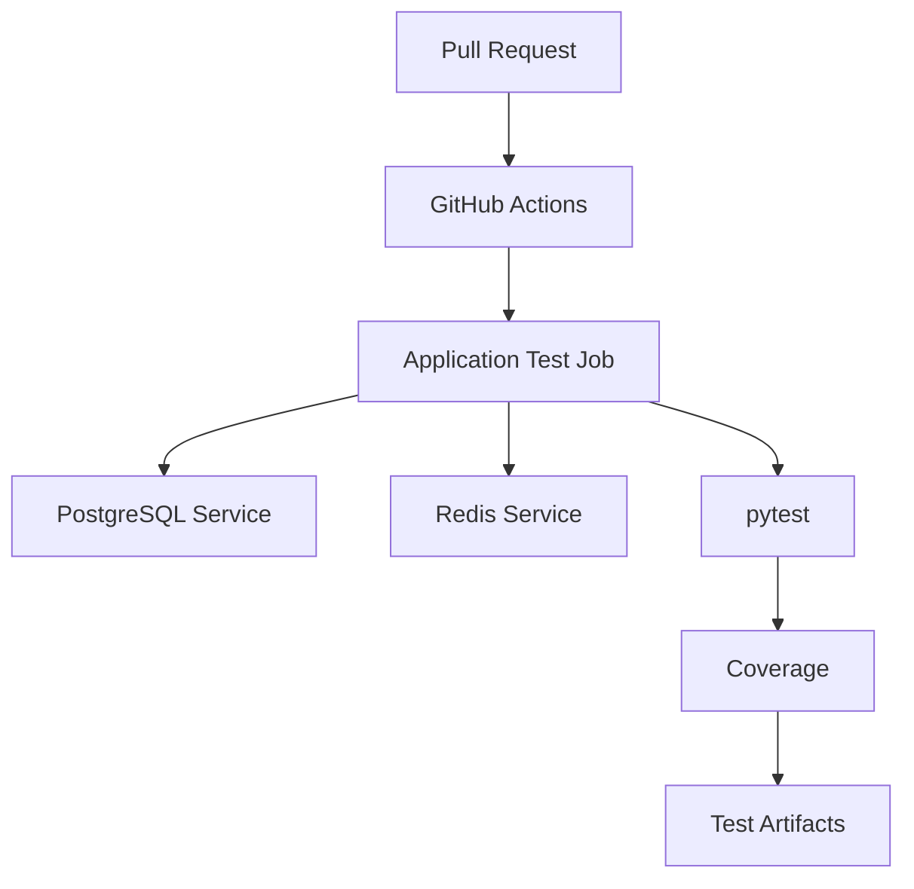
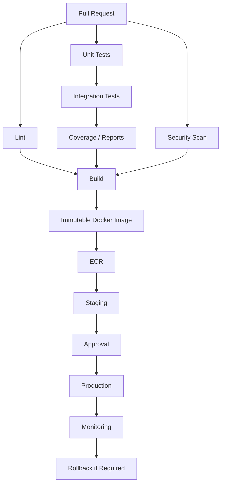

# 08- Integration Testing Pipelines

## Overview

Integration testing validates that application components work correctly across real dependency boundaries. Unlike unit tests, integration tests intentionally exercise infrastructure such as PostgreSQL, MySQL, Redis, message brokers, HTTP services, or framework components.

For a Python backend, a realistic integration-testing pipeline may look like:

```text
Pull Request
     ↓
Checkout
     ↓
Python Setup
     ↓
Dependency Installation
     ↓
Application
     ↓
PostgreSQL / MySQL
     ↓
Redis
     ↓
Integration Tests
     ↓
Coverage
     ↓
Test Reports
     ↓
Artifacts
```

GitHub Actions service containers make these dependencies available as disposable CI infrastructure.

The goal is not to reproduce the entire production environment in every test job. The goal is to reproduce the specific infrastructure boundaries required to validate the behavior being tested.

## Unit Testing vs Integration Testing

The first architectural decision is determining whether a test actually requires an external dependency.

| Test type | Real infrastructure | Typical purpose | Relative speed |
|---|---|---|---|
| Unit | No | Business logic | Very fast |
| Integration | Yes, where required | Component interaction | Moderate |
| API | Sometimes | HTTP/application behavior | Moderate |
| End-to-end | Usually | Complete system behavior | Slow |

A mature pipeline typically uses:

```text
Many Unit Tests
      ↓
Fewer Integration Tests
      ↓
Small Number of End-to-End Tests
```

Integration tests should not replace unit tests.

## What Is an Integration Test?

An integration test verifies behavior across a real application boundary.

Examples:

- Django ↔ PostgreSQL.
- Django ↔ Redis.
- FastAPI ↔ PostgreSQL.
- FastAPI ↔ Redis.
- Application ↔ Celery.
- Application ↔ Kafka.
- API ↔ database.
- Repository layer ↔ database.
- Cache layer ↔ Redis.

For example:

```text
Application Service
       ↓
Repository
       ↓
PostgreSQL
```

The test validates the interaction between those components rather than testing a single function in isolation.

## Why Integration Tests Matter

Mocks can validate that application code calls a dependency correctly, but they cannot prove that the real dependency behaves as expected.

A mocked database does not validate:

- SQL syntax.
- Constraints.
- Indexes.
- Transactions.
- Isolation behavior.
- Database-specific semantics.

A mocked Redis client does not validate:

- Network connectivity.
- TTL behavior.
- Serialization.
- Redis commands.
- Connection handling.

Integration tests therefore validate assumptions that unit tests intentionally leave outside their boundary.

## Integration Test Architecture

A common GitHub Actions architecture is:



The services are created for the job and removed when the job finishes.

This gives the workflow:

```text
Fresh Environment
        ↓
Run Tests
        ↓
Collect Results
        ↓
Destroy Environment
```

## Service Containers

GitHub Actions service containers provide additional containers that a job can communicate with.

Example:

```yaml
jobs:
  integration-tests:
    runs-on: ubuntu-latest

    services:
      postgres:
        image: postgres:16
        env:
          POSTGRES_USER: test
          POSTGRES_PASSWORD: test
          POSTGRES_DB: app_test
        ports:
          - 5432:5432

      redis:
        image: redis:7
        ports:
          - 6379:6379

    steps:
      - name: Checkout
        uses: actions/checkout@v4

      - name: Set up Python
        uses: actions/setup-python@v6
        with:
          python-version: "3.12"

      - name: Install dependencies
        run: |
          python -m pip install --upgrade pip
          pip install -r requirements.txt
          pip install pytest pytest-cov

      - name: Run integration tests
        run: pytest tests/integration
```

This creates an environment containing:

```text
GitHub Runner
   │
   ├── Python Application
   │
   ├── PostgreSQL
   │
   └── Redis
```

## Runner-Based Networking

When the job runs directly on the GitHub-hosted runner, published ports can be accessed through `localhost`.

For example:

```yaml
services:
  postgres:
    image: postgres:16
    ports:
      - 5432:5432

  redis:
    image: redis:7
    ports:
      - 6379:6379
```

Application configuration:

```yaml
env:
  DATABASE_HOST: localhost
  DATABASE_PORT: "5432"
  REDIS_HOST: localhost
  REDIS_PORT: "6379"
```

The flow is:

```text
Python Process
   │
   ├── localhost:5432 → PostgreSQL
   │
   └── localhost:6379 → Redis
```

## Containerized Jobs

A job can also execute inside a container:

```yaml
jobs:
  integration-tests:
    runs-on: ubuntu-latest

    container:
      image: python:3.12-slim

    services:
      postgres:
        image: postgres:16
        env:
          POSTGRES_USER: test
          POSTGRES_PASSWORD: test
          POSTGRES_DB: app_test

      redis:
        image: redis:7

    steps:
      - name: Checkout
        uses: actions/checkout@v4

      - name: Install dependencies
        run: |
          pip install --upgrade pip
          pip install -r requirements.txt

      - name: Run integration tests
        run: pytest tests/integration
```

In this model, the application should normally connect through service names:

```text
postgres:5432
redis:6379
```

rather than:

```text
localhost:5432
localhost:6379
```

## `localhost` vs Service Name

| Job configuration | PostgreSQL | Redis |
|---|---|---|
| Runner-based job | `localhost:5432` | `localhost:6379` |
| Containerized job | `postgres:5432` | `redis:6379` |

This distinction is one of the most common causes of integration-test failures.

## Service Naming

Given:

```yaml
services:
  postgres:
    image: postgres:16

  redis:
    image: redis:7
```

the service names become logical hostnames in the containerized job:

```text
postgres
redis
```

Avoid using dynamically discovered container IP addresses.

Prefer:

```text
postgres
```

over:

```text
172.x.x.x
```

Service names provide a stable logical interface.

## Health and Readiness

Starting a service container does not necessarily mean that the application can immediately connect to it.

The lifecycle is:

```text
Container Created
      ↓
Process Started
      ↓
Service Ready
      ↓
Application Connects
      ↓
Integration Tests
```

A test that starts immediately can fail with:

```text
Connection refused
```

even though the container itself started successfully.

## PostgreSQL Health Check

A PostgreSQL service can define a health check:

```yaml
services:
  postgres:
    image: postgres:16
    env:
      POSTGRES_USER: test
      POSTGRES_PASSWORD: test
      POSTGRES_DB: app_test
    ports:
      - 5432:5432
    options: >-
      --health-cmd "pg_isready -U test -d app_test"
      --health-interval 10s
      --health-timeout 5s
      --health-retries 5
```

The check verifies database readiness rather than merely container existence.

## Redis Health Check

Redis can use:

```yaml
services:
  redis:
    image: redis:7
    ports:
      - 6379:6379
    options: >-
      --health-cmd "redis-cli ping"
      --health-interval 10s
      --health-timeout 5s
      --health-retries 5
```

The expected response is:

```text
PONG
```

## Avoid Arbitrary Sleeps

Avoid:

```bash
sleep 20
```

as the primary readiness strategy.

A fixed delay does not prove that the service is ready.

A readiness check provides:

```text
Actual Service State
        ↓
Ready
        ↓
Continue
```

instead of:

```text
Wait Arbitrary Duration
        ↓
Assume Ready
```

## Explicit Readiness Probes

A bounded readiness loop can be useful when additional verification is required.

For PostgreSQL:

```bash
for attempt in {1..30}; do
  if pg_isready \
      -h "$DATABASE_HOST" \
      -p "$DATABASE_PORT" \
      -U "$DATABASE_USER" \
      -d "$DATABASE_NAME"; then
    echo "PostgreSQL is ready"
    exit 0
  fi

  sleep 2
done

echo "PostgreSQL did not become ready in time" >&2
exit 1
```

For Redis:

```bash
for attempt in {1..30}; do
  if redis-cli \
      -h "$REDIS_HOST" \
      -p "$REDIS_PORT" \
      ping | grep -q PONG; then
    echo "Redis is ready"
    exit 0
  fi

  sleep 2
done

echo "Redis did not become ready in time" >&2
exit 1
```

Use bounded retries so a permanently unhealthy dependency does not hang the workflow indefinitely.

## PostgreSQL Integration Testing

PostgreSQL integration tests are appropriate when validating:

- ORM behavior.
- SQL queries.
- Transactions.
- Constraints.
- Foreign keys.
- Indexes.
- PostgreSQL-specific behavior.
- Database migrations.
- Repository implementations.

A typical environment is:

```text
Python
   ↓
Django / SQLAlchemy / Repository
   ↓
PostgreSQL
```

## Django + PostgreSQL

Django tests that use the ORM require database infrastructure.

Example:

```python
from django.test import TestCase

from orders.models import Order


class OrderTests(TestCase):
    def test_order_creation(self):
        order = Order.objects.create(
            customer_name="Alice",
            total=100,
        )

        self.assertEqual(order.total, 100)
```

This is not a pure unit test because it depends on database behavior.

## FastAPI + PostgreSQL

FastAPI applications commonly use SQLAlchemy or another database abstraction.

An integration test can validate:

```text
HTTP/API Layer
      ↓
Service Layer
      ↓
Repository
      ↓
PostgreSQL
```

The objective is to validate the complete application/database interaction rather than mocking the repository.

## Database Migrations

Integration testing should validate that migrations can construct the expected schema.

A typical pipeline is:

```yaml
- name: Apply migrations
  run: python manage.py migrate

- name: Run integration tests
  run: pytest tests/integration
```

This catches issues such as:

- Invalid migrations.
- Missing columns.
- Incorrect constraints.
- Migration ordering problems.
- Model/schema mismatches.

## Migration Testing

Do not assume that:

```text
Models Are Correct
```

means:

```text
Database Schema Is Correct
```

A production-oriented pipeline should validate the migration path used by the application.

## MySQL Integration Testing

Applications that support MySQL should test against MySQL when database-specific behavior matters.

Example:

```yaml
services:
  mysql:
    image: mysql:8.4
    env:
      MYSQL_ROOT_PASSWORD: root
      MYSQL_DATABASE: app_test
      MYSQL_USER: test
      MYSQL_PASSWORD: test
    ports:
      - 3306:3306
    options: >-
      --health-cmd="mysqladmin ping -h 127.0.0.1 -uroot -proot"
      --health-interval=10s
      --health-timeout=5s
      --health-retries=10
```

Tests can then use:

```text
localhost:3306
```

for a runner-based job.

## PostgreSQL vs MySQL

Do not assume that a test passing against PostgreSQL proves MySQL compatibility.

Differences can exist in:

- SQL syntax.
- Data types.
- Constraints.
- Collation.
- Character sets.
- Index behavior.
- Transaction behavior.
- Locking semantics.

If both databases are officially supported, include both in compatibility testing.

## Redis Integration Testing

Redis should be used as a real service when validating Redis behavior.

Examples include:

- Cache operations.
- TTL.
- Serialization.
- Distributed locks.
- Rate limiting.
- Celery broker behavior.
- Celery result backend behavior.

Architecture:

```text
Application
    ↓
Redis Client
    ↓
Redis Service
```

A mock Redis client cannot validate actual Redis protocol or server behavior.

## Django + Redis

A Django integration test may validate:

```text
Django View
   ↓
Cache Layer
   ↓
Redis
```

For example:

```python
from django.core.cache import cache


def test_cache_round_trip():
    cache.set("integration:test", "value", timeout=60)

    assert cache.get("integration:test") == "value"
```

The Redis service makes the test exercise the actual cache backend.

## FastAPI + Redis

A FastAPI integration test can validate:

```text
HTTP Request
     ↓
FastAPI
     ↓
Redis
     ↓
HTTP Response
```

This is useful for endpoints whose behavior depends on cached or distributed state.

## Celery + Redis

If Redis is used as a Celery broker:

```text
Application
    ↓
Celery
    ↓
Redis
    ↓
Worker
```

The integration environment may require both Redis and a worker process.

A complete test can validate:

```text
Task Submitted
      ↓
Broker
      ↓
Worker
      ↓
Task Executed
      ↓
Result
```

Do not add a Celery worker if the test only validates a synchronous application path.

## Service Dependencies

A realistic integration environment can contain:

```text
Python Application
       │
       ├── PostgreSQL
       │
       ├── Redis
       │
       └── Celery Worker
```

Only provision services required by the tests.

Every additional service increases:

- Startup time.
- Configuration.
- Failure surface.
- CI resource usage.
- Debugging complexity.

## Service Container vs Docker Compose

Both can create multi-container test environments.

| Capability | GitHub service containers | Docker Compose |
|---|---|---|
| Simple CI dependencies | Strong fit | Possible |
| Multi-service topology | Good | Strong |
| Complex networking | Limited compared with Compose | Strong |
| Existing local Compose setup | Less direct reuse | Strong |
| GitHub-native job lifecycle | Strong | Requires Docker commands |
| Complex orchestration | Can become cumbersome | Better fit |

Use service containers for straightforward CI dependencies.

Use Docker Compose when the test environment itself is a meaningful multi-container application topology.

## Docker Compose Integration Tests

A repository may already define:

```yaml
services:
  app:
    build: .

  postgres:
    image: postgres:16

  redis:
    image: redis:7
```

The workflow can run:

```bash
docker compose up -d --build
```

followed by:

```bash
docker compose exec app pytest tests/integration
```

This can be useful when the local development environment and CI integration environment should share the same topology.

## When Not to Use Docker Compose

Do not introduce Compose merely to start one Redis container.

For:

```text
Python
+
PostgreSQL
+
Redis
```

GitHub service containers may be simpler.

For:

```text
Nginx
+
API
+
Worker
+
PostgreSQL
+
Redis
+
Kafka
```

Compose can become more attractive because the complete topology is meaningful.

## Database Isolation

Each integration job should receive a fresh database.

For example:

```text
Job A → app_test
Job B → app_test
```

is safe when each job has its own PostgreSQL container.

Avoid relying on a shared remote database for ordinary CI.

## Why Shared Test Databases Are Risky

A shared database introduces:

- Cross-job contamination.
- Race conditions.
- Test ordering dependencies.
- Cleanup problems.
- Data leakage.
- Resource contention.

Instead:

```text
Job
 ↓
Fresh Database
 ↓
Tests
 ↓
Database Destroyed
```

provides deterministic isolation.

## Transaction Isolation

Database tests should understand the transaction behavior they are validating.

Potential issues include:

- Concurrent updates.
- Locks.
- Isolation levels.
- Rollbacks.
- Deadlocks.

A unit test that mocks a repository cannot validate these database-level behaviors.

Integration tests are the appropriate layer for them.

## Test Data Management

Integration tests need deterministic data.

Common strategies include:

- Fixtures.
- Factories.
- Database setup functions.
- Migration-based initialization.
- Per-test cleanup.
- Transaction rollback.

Avoid relying on data left behind by previous tests.

## Test Factories

A factory can create realistic test data:

```python
def create_user(repository, *, email="test@example.com"):
    return repository.create_user(
        email=email,
        name="Integration Test User",
    )
```

Factories reduce duplicated setup while keeping tests explicit.

## Database Cleanup

Tests should not depend on execution order.

A good lifecycle is:

```text
Arrange
   ↓
Act
   ↓
Assert
   ↓
Cleanup
```

Framework-managed transactional test isolation can simplify this.

For tests that intentionally verify persistent state, cleanup should still be explicit.

## Redis State Isolation

Redis requires similar care.

Avoid:

```text
test_a → SET user:1
test_b → GET user:1
```

unless the shared state is intentional.

Prefer:

```text
test:<run-id>:<worker-id>:user:1
```

or isolated Redis databases/services.

## Parallel Integration Testing

Integration tests can run in parallel, but infrastructure state must be isolated.

Potential conflicts include:

- Database rows.
- Redis keys.
- Ports.
- Files.
- Temporary resources.
- Shared queues.
- Distributed locks.

Parallelism should be introduced only after test isolation is reliable.

## Matrix Testing

Integration tests can use matrices to validate supported environments.

For example:

```yaml
strategy:
  fail-fast: false
  matrix:
    python-version:
      - "3.11"
      - "3.12"
    database:
      - postgres
      - mysql
```

This creates:

```text
Python 3.11 + PostgreSQL
Python 3.11 + MySQL
Python 3.12 + PostgreSQL
Python 3.12 + MySQL
```

The matrix should represent actual support requirements.

## Matrix Cost

If:

```text
2 Python Versions
×
2 Databases
×
10 Minutes
```

the workflow consumes approximately:

```text
40 Runner-Minutes
```

Adding Redis does not necessarily multiply the matrix if it is required by every database combination.

The larger concern is the number of independent jobs created by the matrix.

## Selective Integration Testing

Large monorepos should avoid running every integration test for every change when unnecessary.

A workflow may use path filters:

```yaml
on:
  pull_request:
    paths:
      - "backend/**"
      - "tests/integration/**"
      - ".github/workflows/integration-tests.yml"
```

This can reduce unnecessary execution.

However, path-based optimization must not accidentally skip tests required for shared libraries or cross-service changes.

## Test Coverage

Coverage can be collected during integration tests:

```bash
pytest tests/integration \
  --cov=app \
  --cov-report=term-missing \
  --cov-report=xml
```

Integration coverage and unit-test coverage measure different things.

Unit tests typically provide broad logic coverage.

Integration tests provide confidence across infrastructure boundaries.

## Test Reports

Use structured reports:

```bash
pytest \
  tests/integration \
  --junitxml=integration-test-results.xml
```

Then upload:

```yaml
- name: Upload integration test results
  if: ${{ !cancelled() }}
  uses: actions/upload-artifact@v4
  with:
    name: integration-test-results
    path: integration-test-results.xml
```

Reports should remain available after test failures.

## Debugging Artifacts

Integration failures may require more diagnostics than unit failures.

Useful artifacts can include:

- Test reports.
- Coverage.
- Application logs.
- Database logs.
- Service diagnostics.
- Docker logs.

Do not upload credentials or sensitive environment files.

## Capturing Container Logs

When Docker CLI access is available:

```bash
docker ps
```

and:

```bash
docker logs <container>
```

can help identify service startup failures.

The exact container name should be discovered rather than hard-coded when possible.

## Database Diagnostics

PostgreSQL:

```bash
pg_isready \
  -h "$DATABASE_HOST" \
  -p "$DATABASE_PORT" \
  -U "$DATABASE_USER" \
  -d "$DATABASE_NAME"
```

Redis:

```bash
redis-cli \
  -h "$REDIS_HOST" \
  -p "$REDIS_PORT" \
  ping
```

MySQL:

```bash
mysqladmin \
  ping \
  -h "$DATABASE_HOST" \
  -P "$DATABASE_PORT" \
  -u "$DATABASE_USER" \
  -p"$DATABASE_PASSWORD"
```

Avoid printing passwords in diagnostic output.

## Integration Test Failure Troubleshooting

Use:

```text
Symptom
   ↓
Possible Causes
   ↓
Isolation Strategy
   ↓
Commands / Checks
   ↓
Root Cause
   ↓
Corrective Action
   ↓
Prevention
```

Do not immediately rerun a failed job without determining whether the failure is deterministic.

## Connection Refused

### Symptom

```text
Connection refused
```

### Possible Causes

- Service still starting.
- Incorrect hostname.
- Incorrect port.
- Service failed its health check.
- Application started before dependency readiness.

### Isolation Strategy

Verify:

```text
Job Networking Model
Service Name
Port
Health
Application Configuration
```

### Corrective Action

Use the correct endpoint and readiness strategy.

## DNS Resolution Failure

### Symptom

```text
Could not resolve host postgres
```

### Possible Causes

- Incorrect service name.
- Job networking mismatch.
- Service definition is incorrect.

### Check

For a containerized job:

```bash
getent hosts postgres
```

For runner-based jobs, use the published host endpoint such as:

```text
localhost
```

## Database Authentication Failure

### Symptom

```text
password authentication failed
```

### Possible Causes

- Incorrect username.
- Incorrect password.
- Wrong database.
- Environment variable mismatch.
- Initialization configuration mismatch.

Verify that the service environment and application configuration agree.

## Database Initialization Failure

### Symptom

Migrations fail because tables or extensions are missing.

### Possible Causes

- Service not ready.
- Migration not executed.
- Wrong database.
- Incorrect initialization scripts.
- Unsupported database version.

Run migrations explicitly and verify the target database.

## Redis Authentication Failure

### Symptom

```text
NOAUTH Authentication required
```

### Possible Causes

- Redis requires authentication.
- Application credentials are missing.
- Test configuration differs from service configuration.

Verify the Redis URL and credentials.

## Redis Key Collision

### Symptom

Intermittent failures involving cached values.

### Possible Causes

- Parallel tests use identical keys.
- Cleanup is incomplete.
- Shared Redis state.

Use isolated key namespaces or separate Redis instances.

## Test Flakiness

### Symptom

The same integration test passes and fails across different runs.

### Possible Causes

- Timing.
- Service readiness.
- Shared state.
- Race conditions.
- Parallel execution.
- Resource contention.
- External network dependency.

### Prevention

Prefer deterministic setup and bounded readiness checks.

Do not solve recurring failures by simply adding:

```bash
sleep 30
```

or blind retries.

## External APIs

Integration tests may need to validate an external API boundary.

Do not make every pull request depend on a live production API.

Prefer:

```text
Unit Tests
   ↓
Mock External API

Integration Tests
   ↓
Controlled Test API / Sandbox

End-to-End
   ↓
Realistic External Integration
```

The correct boundary depends on the system being validated.

## Contract Testing

When a service depends on another service, contract tests can validate the expected interface without requiring the entire downstream system.

For example:

```text
Service A
   ↓
Expected API Contract
   ↓
Service B
```

This can reduce the need for expensive full-stack integration tests.

## Kafka Integration Testing

If Kafka is part of the application's supported integration boundary, a Kafka service can be included.

The test flow becomes:

```text
Application
   ↓
Kafka Producer
   ↓
Kafka Broker
   ↓
Kafka Consumer
```

Kafka should not be introduced into an integration job that does not exercise messaging behavior.

## Nginx in Integration Tests

Nginx can be included when the reverse-proxy boundary matters:

```text
Client
  ↓
Nginx
  ↓
FastAPI / Django
  ↓
PostgreSQL
  ↓
Redis
```

For application-level tests, bypassing Nginx may be faster and easier to diagnose.

## End-to-End vs Integration

A complete application stack:

```text
Client
  ↓
Nginx
  ↓
API
  ├── PostgreSQL
  ├── Redis
  └── Celery
```

is closer to an end-to-end test.

An integration test may intentionally stop at:

```text
API
  ↓
PostgreSQL
```

The boundary should be explicit.

## Security Considerations

Integration tests execute application code against real services.

This makes them a significant CI security boundary.

Avoid connecting pull-request code to:

- Production databases.
- Production Redis.
- Production AWS resources.
- Shared internal services.
- Sensitive private networks.

Prefer ephemeral service containers.

## GITHUB_TOKEN Permissions

Integration tests generally need minimal GitHub permissions:

```yaml
permissions:
  contents: read
```

Do not grant:

```yaml
permissions: write-all
```

unless there is a documented requirement.

## Secrets

Avoid exposing secrets to integration tests unless the test genuinely requires them.

If a test needs credentials for a sandbox service, use dedicated test credentials.

Do not reuse production credentials.

## Pull Request Security

Pull-request workflows can execute contributor-controlled code.

Integration test jobs should therefore assume:

```text
Application Code
+
Tests
+
Dependencies
```

may execute arbitrary commands.

Do not provide those jobs with unnecessary privileged credentials.

## `pull_request_target`

`pull_request_target` requires particular caution because it executes in the context of the base repository and can access resources that ordinary pull-request workflows may not.

Do not combine privileged secrets with untrusted pull-request code without a carefully designed security boundary.

## Self-Hosted Runners

Self-hosted runners may have access to:

- Private networks.
- Internal DNS.
- Cloud credentials.
- Persistent filesystem state.
- Internal services.

Running untrusted integration tests on such infrastructure increases the blast radius of a compromised workflow.

Prefer isolated or ephemeral runners when private infrastructure access is required.

## Third-Party Actions

Integration workflows often use several third-party actions.

Each action becomes part of the CI supply chain.

Evaluate:

- Source trust.
- Version.
- Permissions.
- Maintenance.
- Dependencies.
- Required credentials.

Where organizational policy requires it, pin actions to immutable SHAs.

## Dependency Security

Integration-test dependencies should be managed like production dependencies.

Use:

- Dependency review.
- Dependabot where appropriate.
- Lock files where supported.
- Vulnerability scanning.
- Controlled upgrades.

Do not allow CI to silently resolve arbitrary dependency versions if reproducibility is important.

## Production CI/CD Pipeline

Integration testing should fit into the larger pipeline:



Integration tests should block artifact promotion when required validation fails.

## Build Once, Promote the Same Artifact

A production pipeline should preferably use:

```text
Source
  ↓
Tests
  ↓
Build
  ↓
Immutable Artifact
  ↓
Staging
  ↓
Approval
  ↓
Production
```

rather than:

```text
Source
  ↓
Build Staging Artifact

Source
  ↓
Build Production Artifact
```

The second model creates an opportunity for environment artifacts to differ.

## Docker Integration Testing

A Dockerized backend can be tested using:

```text
Application Container
       │
       ├── PostgreSQL
       └── Redis
```

The workflow may build the application image before executing integration tests if the container itself is part of the test boundary.

Otherwise, running the Python application directly on the runner can reduce feedback time.

## Docker Buildx

Buildx can provide efficient image building and caching:

```yaml
- name: Set up Docker Buildx
  uses: docker/setup-buildx-action@v3
```

The build stage should generally occur after required test gates.

## AWS Integration

AWS integration tests should use controlled environments.

For deployment authentication, GitHub Actions can use:

```text
GitHub Actions
      ↓
OIDC
      ↓
AWS STS
      ↓
Temporary Credentials
      ↓
AWS Resource
```

Avoid long-lived AWS access keys in repository secrets when OIDC is suitable.

## AWS Integration-Test Boundaries

If a test requires:

```text
S3
ECR
ECS
Lambda
```

separate it clearly from tests that only require local services.

A pipeline may use:

```text
Local Integration Tests
       ↓
AWS Integration Tests
       ↓
Build
       ↓
Deploy
```

or run independent AWS checks in parallel where appropriate.

## Environment Promotion

A typical production promotion flow is:

```text
Pull Request
   ↓
Unit Tests
   ↓
Integration Tests
   ↓
Security Scan
   ↓
Build
   ↓
ECR
   ↓
Staging
   ↓
Approval
   ↓
Production
```

Each stage should have a clear responsibility.

## Deployment Concurrency

Integration tests themselves are usually independent, but deployment stages require stronger concurrency controls.

For production deployment:

```yaml
concurrency:
  group: production-deployment
  cancel-in-progress: false
```

This prevents simultaneous production deployments from racing.

The concurrency strategy for deployment should not automatically be copied to test jobs.

## Artifacts

Integration test jobs can produce:

```text
JUnit XML
Coverage XML
Logs
Screenshots
Diagnostics
```

Upload them as artifacts:

```yaml
- name: Upload integration reports
  if: ${{ !cancelled() }}
  uses: actions/upload-artifact@v4
  with:
    name: integration-reports
    path: |
      integration-test-results.xml
      coverage.xml
      logs/
```

## Artifacts vs Caches

Use artifacts for outputs:

```text
Test Reports
Coverage
Logs
Build Outputs
```

Use caches for reusable dependencies:

```text
pip Cache
npm Cache
Docker Build Cache
```

Do not use caches as a substitute for test-result storage.

## GitHub CLI

GitHub CLI is useful for operating integration workflows.

List workflows:

```bash
gh workflow list
```

List runs:

```bash
gh run list
```

Inspect a run:

```bash
gh run view RUN_ID
```

View logs:

```bash
gh run view RUN_ID --log
```

Rerun a workflow:

```bash
gh run rerun RUN_ID
```

Download artifacts:

```bash
gh run download RUN_ID
```

These commands are useful when diagnosing failed CI runs without navigating the GitHub web interface.

## Operational Debugging

A senior engineer should be able to determine whether a failure belongs to:

```text
Application
   ↓
Test
   ↓
Service
   ↓
Networking
   ↓
Runner
   ↓
Workflow
```

For example:

```text
Connection refused
```

should first trigger:

```text
Is the service healthy?
```

before:

```text
Is the application broken?
```

This prevents debugging the wrong layer.

## Integration Test Cost

Integration tests consume more resources than unit tests.

Cost drivers include:

- Number of matrix jobs.
- Database startup.
- Redis startup.
- Container startup.
- Test duration.
- Parallel workers.
- Artifact storage.

Measure:

```text
Wall-Clock Duration
+
Runner-Minutes
+
Artifact Storage
```

rather than optimizing only test execution time.

## Performance Optimization

Useful optimizations include:

- Dependency caching.
- Reusing efficient Docker layers.
- Parallelizing independent tests.
- Reducing unnecessary matrix dimensions.
- Avoiding unnecessary service containers.
- Running unit tests before expensive integration tests.
- Running selective integration tests for changed components.
- Using efficient fixtures.
- Avoiding excessive database setup per test.

Do not optimize away the infrastructure behavior the test is supposed to validate.

## High Availability

CI service containers are intentionally ephemeral.

They do not need production-style Redis or PostgreSQL high availability.

If a service fails:

```text
Job Fails
   ↓
Workflow Rerun
   ↓
Fresh Service Containers
```

Production environments are different and may require:

- Replication.
- Failover.
- Backups.
- Monitoring.
- Disaster recovery.

## Disaster Recovery

For disposable CI dependencies, recovery normally means recreation:

```text
Service Failure
     ↓
Job Failure
     ↓
Fresh Runner
     ↓
Fresh Containers
     ↓
Retry
```

Persistent shared test environments require a different recovery strategy.

## Common Mistakes

### Treating Integration Tests as Unit Tests

If the test requires PostgreSQL or Redis, it is not an isolated unit test.

Classify tests according to their actual dependency boundary.

### Using Production Infrastructure

Do not point CI tests at production services.

### Using Shared Test Databases

Shared databases create cross-run contamination and race conditions.

Use disposable per-job databases where practical.

### Ignoring Readiness

A started container is not necessarily a ready service.

Use health checks and bounded readiness probes.

### Using `localhost` in Containerized Jobs

Use service hostnames such as:

```text
postgres
redis
```

when the job runs inside a container.

### Adding Too Many Services

Do not reproduce the entire production topology for every test.

Provision only dependencies required by the test.

### Running Live External APIs

Live third-party dependencies introduce nondeterminism and external failure modes.

Use mocks, sandboxes, or dedicated contract/integration tests.

### Sharing Redis Keys

Parallel tests can interfere with each other through shared keys.

Use namespaces or isolated instances.

### Blind Retries

Retries can hide infrastructure or application defects.

Investigate the underlying failure first.

### Using `sleep` for Readiness

Fixed sleeps are timing assumptions.

Prefer service health checks and bounded probes.

### Exposing Secrets

Do not provide production credentials to pull-request integration tests.

### Uploading Sensitive Logs

Logs can contain credentials, connection strings, request data, or tokens.

Review artifacts before uploading them.

## Interview Scenarios

### Design an Integration-Test Pipeline for Django

A strong design could be:

```text
Pull Request
    ↓
Lint
    ↓
Unit Tests
    ↓
Django Integration Tests
    ↓
PostgreSQL
    ↓
Redis
    ↓
Coverage
    ↓
Artifacts
```

Use disposable service containers and explicit readiness checks.

### Why Not Use SQLite for PostgreSQL Tests?

SQLite has different database semantics.

It cannot reliably validate PostgreSQL-specific:

- SQL.
- Constraints.
- Indexes.
- Transaction behavior.
- Data types.

If production uses PostgreSQL, database-specific integration behavior should be tested against PostgreSQL.

### Why Not Mock Redis?

A mock cannot validate actual Redis behavior.

Use a real Redis service when testing:

- TTL.
- Cache behavior.
- Serialization.
- Distributed locks.
- Celery broker interaction.

### How Would You Test MySQL and PostgreSQL?

Use a matrix when both databases are supported:

```yaml
matrix:
  database:
    - postgres
    - mysql
```

The application configuration should select the corresponding service.

### How Would You Avoid Shared Test Data?

Use:

```text
Fresh Database
+
Fresh Redis
+
Unique Test Data
+
Controlled Cleanup
```

For parallel tests, use worker-specific namespaces where necessary.

### How Would You Debug `Connection Refused`?

Follow:

```text
Service Exists
    ↓
Service Healthy
    ↓
Correct Hostname
    ↓
Correct Port
    ↓
Network Reachability
    ↓
Credentials
    ↓
Application Configuration
```

### How Would You Keep Integration Tests Fast?

Use:

- Unit tests for isolated logic.
- Dependency caching.
- Parallel execution.
- Selective integration tests.
- Efficient fixtures.
- Minimal required services.
- Meaningful matrix dimensions.

### How Would You Secure Integration Tests From Pull Requests?

Use:

- Minimal `GITHUB_TOKEN` permissions.
- No production credentials.
- Ephemeral services.
- Isolated runners.
- Restricted private-network access.
- Careful handling of untrusted code.
- Trusted and pinned actions where required.

### How Would You Test Celery?

Provision Redis when it is the broker:

```text
Application
   ↓
Celery
   ↓
Redis
   ↓
Worker
```

Run the worker only for tests that actually validate asynchronous execution.

### How Would You Design a Production Pipeline?

A complete design could be:

```text
Pull Request
    ↓
Lint
    ↓
Unit Tests
    ↓
Integration Tests
    ↓
Security Scan
    ↓
Matrix Validation
    ↓
Docker Build
    ↓
Immutable Image
    ↓
ECR
    ↓
Staging
    ↓
Approval
    ↓
Production
    ↓
Monitoring
    ↓
Rollback
```

Each stage should have a clear responsibility and security boundary.

## Production Checklist

Before using integration testing in a production CI pipeline:

- [ ] Unit and integration tests are clearly separated.
- [ ] Every external dependency is intentional.
- [ ] PostgreSQL/MySQL versions are explicitly selected.
- [ ] Redis versions are explicitly selected.
- [ ] Service health checks are configured where appropriate.
- [ ] Readiness is verified before tests execute.
- [ ] Arbitrary sleeps are avoided.
- [ ] Runner-based and containerized networking are understood.
- [ ] Service hostnames are correct.
- [ ] Test databases are isolated.
- [ ] Redis state is isolated.
- [ ] Test data is deterministic.
- [ ] Parallel tests do not share unsafe state.
- [ ] Database migrations are validated.
- [ ] Integration coverage is collected where useful.
- [ ] JUnit/test reports are preserved.
- [ ] Diagnostic logs are available after failures.
- [ ] Sensitive information is excluded from artifacts.
- [ ] Pull-request jobs do not access production infrastructure.
- [ ] `GITHUB_TOKEN` permissions are minimized.
- [ ] AWS credentials are not unnecessarily exposed.
- [ ] OIDC is used for AWS authentication where appropriate.
- [ ] Third-party Actions are trusted and version-controlled.
- [ ] Matrix dimensions represent real compatibility requirements.
- [ ] CI cost and runtime are monitored.
- [ ] Integration tests block artifact promotion when required.
- [ ] Docker images are built after appropriate validation.
- [ ] The same immutable artifact is promoted between environments.
- [ ] Deployment concurrency prevents production races.
- [ ] Rollback procedures are defined.
- [ ] Failure diagnosis follows a consistent failure-domain model.

## Key Takeaways

- Integration testing validates real application boundaries such as PostgreSQL, MySQL, Redis, Celery, and HTTP services that unit tests intentionally isolate.
- GitHub Actions service containers provide disposable infrastructure, but networking and readiness must be designed correctly for both runner-based and containerized jobs.
- Reliable integration pipelines require isolated data, deterministic setup, health checks, explicit dependency versions, controlled parallelism, and meaningful test reports.
- Security boundaries are critical: pull-request code should not receive production credentials or unrestricted access to private infrastructure merely because integration tests require services.
- Senior-level CI design balances realistic integration coverage with test speed, matrix size, infrastructure cost, reproducibility, failure isolation, immutable artifact promotion, and production deployment safety.