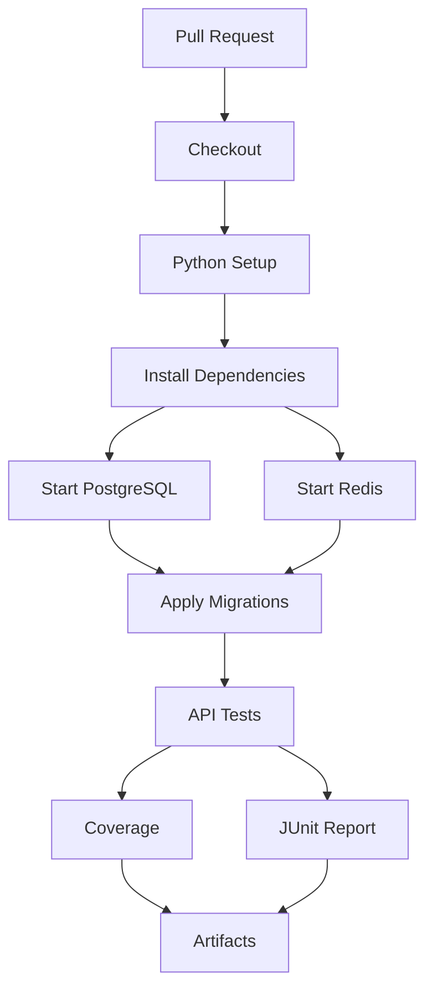
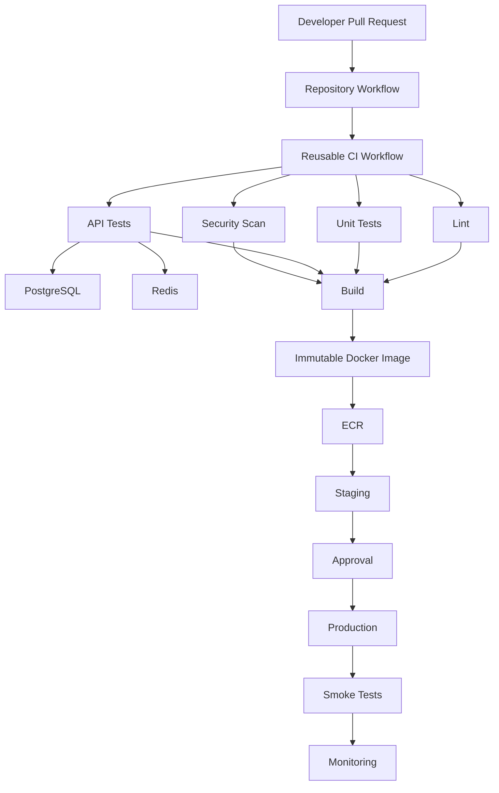

# 09- API Testing Pipelines

## Overview

API testing validates the behavior of an application through its externally exposed interfaces rather than testing only internal functions. For backend systems, this commonly means exercising REST or gRPC endpoints through realistic HTTP or RPC requests and validating status codes, response bodies, headers, authentication, persistence, caching, and downstream behavior.

A production-oriented API testing pipeline typically sits between unit testing and full end-to-end testing:

```text
Pull Request
     ↓
Lint
     ↓
Unit Tests
     ↓
API Tests
     ↓
Integration Tests
     ↓
Security Scan
     ↓
Build
     ↓
Immutable Artifact
```

For Python backends, GitHub Actions can execute API tests against Django, Django REST Framework, or FastAPI applications with PostgreSQL, MySQL, Redis, and other required services.

The important distinction is the test boundary. An API test should validate the behavior exposed through the API contract without unnecessarily turning every test into a complete production-stack end-to-end test.

## API Testing Boundaries

API tests can operate at different levels.

| Test type | API boundary | Real dependencies | Primary purpose |
|---|---|---|---|
| Unit | No | Usually mocked | Business logic |
| API | Yes | Selected real dependencies | HTTP/API behavior |
| Integration | Sometimes | Database/cache/services | Component integration |
| End-to-end | Yes | Most or all system dependencies | Complete user flow |

A mature backend pipeline usually combines these layers rather than attempting to use one type of test for everything.

## What API Tests Validate

API tests can validate:

- HTTP status codes.
- Response schemas.
- Request validation.
- Authentication.
- Authorization.
- Headers.
- Cookies.
- Pagination.
- Filtering.
- Sorting.
- Serialization.
- Database interaction.
- Cache behavior.
- Error handling.
- Idempotency.
- API versioning.
- Rate-limiting behavior where appropriate.

For example:

```text
HTTP Request
     ↓
Nginx / Gateway
     ↓
Django / FastAPI
     ↓
Service Layer
     ↓
PostgreSQL
     ↓
HTTP Response
```

The test determines which parts of this path are intentionally inside the test boundary.

## API Testing with Python

Python backends commonly use:

- `pytest`.
- `pytest-django`.
- FastAPI `TestClient`.
- HTTPX.
- Django REST Framework's `APIClient`.
- Async HTTP clients for asynchronous APIs.

The testing tool should match the application architecture.

## Django REST Framework API Tests

A DRF API test can use `APIClient`:

```python
import pytest
from rest_framework.test import APIClient


@pytest.mark.django_db
def test_create_order():
    client = APIClient()

    response = client.post(
        "/api/orders/",
        {
            "customer_name": "Alice",
            "total": "100.00",
        },
        format="json",
    )

    assert response.status_code == 201
    assert response.data["customer_name"] == "Alice"
```

This exercises the API layer while allowing Django's test infrastructure to manage database access.

## FastAPI API Tests

FastAPI commonly uses a test client:

```python
from fastapi.testclient import TestClient

from app.main import app


client = TestClient(app)


def test_health_endpoint():
    response = client.get("/health")

    assert response.status_code == 200
    assert response.json()["status"] == "ok"
```

For asynchronous behavior or external HTTP calls, HTTPX can be used with appropriate async testing infrastructure.

## API Test Structure

A useful API test structure is:

```text
Arrange
   ↓
Authenticate
   ↓
Send Request
   ↓
Validate Status
   ↓
Validate Response Contract
   ↓
Validate Side Effects
```

For example:

```python
def test_create_user():
    token = create_test_token()

    response = client.post(
        "/api/users/",
        json={
            "email": "alice@example.com",
            "name": "Alice",
        },
        headers={
            "Authorization": f"Bearer {token}",
        },
    )

    assert response.status_code == 201
    assert response.json()["email"] == "alice@example.com"

    user = User.objects.get(email="alice@example.com")
    assert user.name == "Alice"
```

The test validates both the API response and the important persistence side effect.

## API Contract Validation

A successful status code is not enough.

This is insufficient:

```python
assert response.status_code == 200
```

A production API test should also validate important contract fields:

```python
data = response.json()

assert data["id"]
assert data["email"] == "alice@example.com"
assert "created_at" in data
```

For larger APIs, schema validation can provide stronger guarantees.

## Request Validation

Test invalid inputs explicitly.

Example:

```python
def test_create_user_rejects_invalid_email():
    response = client.post(
        "/api/users/",
        json={
            "email": "not-an-email",
            "name": "Alice",
        },
    )

    assert response.status_code == 400
```

The exact status code should match the application's API contract.

## Authentication Testing

Authentication should be tested through the same interface used by clients.

Examples include:

```text
Authorization: Bearer <token>
```

or:

```text
Cookie: session=<value>
```

Test at least:

- Missing credentials.
- Invalid credentials.
- Expired credentials.
- Valid credentials.
- Correct identity extraction.

Example:

```python
def test_protected_endpoint_requires_authentication():
    response = client.get("/api/profile/")

    assert response.status_code in {401, 403}
```

The expected status should be aligned with the application's authentication contract.

## Authorization Testing

Authentication answers:

```text
Who are you?
```

Authorization answers:

```text
Are you allowed to perform this operation?
```

Test cases should include:

```text
Admin → Allowed
Owner → Allowed
Different User → Forbidden
Anonymous → Unauthorized
```

For example:

```python
def test_user_cannot_delete_another_users_order():
    response = client.delete(
        "/api/orders/123/",
        headers={
            "Authorization": f"Bearer {other_user_token}",
        },
    )

    assert response.status_code == 403
```

Authorization tests are particularly important because successful authentication does not imply authorization.

## API Error Contracts

APIs should have predictable error responses.

Example:

```json
{
  "error": {
    "code": "INVALID_REQUEST",
    "message": "The request is invalid."
  }
}
```

Tests should validate important error fields:

```python
assert response.status_code == 400

body = response.json()

assert body["error"]["code"] == "INVALID_REQUEST"
assert "message" in body["error"]
```

Avoid asserting unnecessarily fragile text when the API provides stable error codes.

## Status Code Testing

Typical API tests should validate expected HTTP semantics.

| Scenario | Typical status |
|---|---:|
| Successful read | `200` |
| Successful creation | `201` |
| Successful deletion with no body | `204` |
| Invalid request | `400` |
| Missing authentication | `401` |
| Authenticated but unauthorized | `403` |
| Resource not found | `404` |
| Conflict | `409` |
| Rate limited | `429` |
| Unexpected server error | `5xx` |

The exact contract should come from the API design rather than assumptions.

## HTTP Headers

Headers can be part of the API contract.

Test important headers such as:

```python
assert response.headers["Content-Type"].startswith(
    "application/json"
)
```

Depending on the system, tests may also validate:

- Cache-Control.
- ETag.
- Location.
- CORS headers.
- Security headers.
- Request IDs.
- Rate-limit headers.

Do not assert every header indiscriminately. Test headers that are contractually or operationally important.

## Pagination Testing

Pagination should be tested as a behavioral contract.

For example:

```python
response = client.get(
    "/api/orders/",
    params={
        "page": 2,
        "page_size": 20,
    },
)

assert response.status_code == 200

data = response.json()

assert len(data["results"]) <= 20
assert "next" in data
assert "previous" in data
```

Important scenarios include:

- First page.
- Middle page.
- Last page.
- Empty result.
- Invalid page.
- Maximum page size.
- Filtering combined with pagination.

## Filtering and Sorting

Test combinations that are important to consumers.

Example:

```python
response = client.get(
    "/api/orders/",
    params={
        "status": "completed",
        "ordering": "-created_at",
    },
)

assert response.status_code == 200
```

Do not create an enormous number of combinatorial tests without evidence that each combination represents an important contract.

## API Versioning

If an API exposes:

```text
/api/v1/orders/
/api/v2/orders/
```

test the contracts independently where both versions are supported.

A version change can affect:

- Fields.
- Serialization.
- Validation.
- Authentication.
- Status codes.
- Pagination.
- Error responses.

API tests provide an executable compatibility contract.

## Database-Backed API Tests

Many APIs depend on PostgreSQL or MySQL.

A typical architecture is:

```text
API Test
   ↓
Django / FastAPI
   ↓
Repository / ORM
   ↓
PostgreSQL
```

The database should be real when the test intends to validate database interaction.

Using SQLite as a substitute for PostgreSQL can hide database-specific behavior.

## PostgreSQL Service Container

A GitHub Actions API test job may define:

```yaml
jobs:
  api-tests:
    runs-on: ubuntu-latest

    services:
      postgres:
        image: postgres:16
        env:
          POSTGRES_USER: test
          POSTGRES_PASSWORD: test
          POSTGRES_DB: app_test
        ports:
          - 5432:5432
        options: >-
          --health-cmd "pg_isready -U test -d app_test"
          --health-interval 10s
          --health-timeout 5s
          --health-retries 5

    steps:
      - name: Checkout
        uses: actions/checkout@v4

      - name: Set up Python
        uses: actions/setup-python@v6
        with:
          python-version: "3.12"

      - name: Install dependencies
        run: |
          python -m pip install --upgrade pip
          pip install -r requirements.txt
          pip install pytest pytest-cov

      - name: Run migrations
        env:
          DATABASE_HOST: localhost
          DATABASE_PORT: "5432"
          DATABASE_NAME: app_test
          DATABASE_USER: test
          DATABASE_PASSWORD: test
        run: python manage.py migrate

      - name: Run API tests
        env:
          DATABASE_HOST: localhost
          DATABASE_PORT: "5432"
          DATABASE_NAME: app_test
          DATABASE_USER: test
          DATABASE_PASSWORD: test
        run: pytest tests/api
```

For runner-based jobs, the application can access the published PostgreSQL port through `localhost`.

## Redis-Backed API Tests

If an API depends on Redis:

```yaml
services:
  redis:
    image: redis:7
    ports:
      - 6379:6379
    options: >-
      --health-cmd "redis-cli ping"
      --health-interval 10s
      --health-timeout 5s
      --health-retries 5
```

The test configuration can use:

```text
REDIS_HOST=localhost
REDIS_PORT=6379
```

This is useful for APIs involving:

- Caching.
- Rate limiting.
- Session state.
- Distributed locks.
- Celery.

## API Tests with Celery

If an endpoint submits asynchronous work:

```text
HTTP Request
     ↓
API
     ↓
Celery
     ↓
Redis
     ↓
Worker
```

the integration boundary determines whether a worker is required.

For example, if the test only validates that the API enqueues a task, the worker may not be necessary.

If the test validates the complete asynchronous workflow, a worker is required.

## API Tests with Kafka

A messaging API may require:

```text
HTTP Request
     ↓
API
     ↓
Kafka Producer
     ↓
Kafka
     ↓
Consumer
```

A full messaging integration test should validate the relevant message flow rather than mocking Kafka when actual broker behavior is part of the contract.

## Test Data

API tests require deterministic data.

Prefer:

- Factories.
- Fixtures.
- Explicit setup.
- Unique test identifiers.
- Controlled cleanup.

Avoid relying on data from previous tests.

For example:

```python
def test_get_order(client, order_factory):
    order = order_factory()

    response = client.get(f"/api/orders/{order.id}/")

    assert response.status_code == 200
    assert response.json()["id"] == order.id
```

The test owns the data it needs.

## Database Isolation

Parallel API tests must not accidentally modify the same records.

Potential isolation strategies include:

- Transactional test frameworks.
- Per-test database state.
- Per-worker databases.
- Unique records.
- Explicit cleanup.

The correct approach depends on the framework and test runner.

## External API Dependencies

Avoid making every pull request depend on third-party APIs.

A typical strategy is:

```text
Unit Tests
   ↓
Mock External API

API Integration Tests
   ↓
Controlled Stub / Sandbox

End-to-End Tests
   ↓
Real External Integration
```

This improves reliability and prevents external outages from blocking unrelated development.

## HTTP Mocking

When testing your application's handling of an external service, mock the outbound boundary.

For example:

```text
Your API
   ↓
HTTP Client
   ↓
Mock External Service
```

This lets tests simulate:

- Success.
- Timeout.
- `4xx`.
- `5xx`.
- Malformed responses.
- Slow responses.

The API test then validates your application's behavior under those conditions.

## Contract Testing

For service-to-service communication:

```text
Service A
    ↓
API Contract
    ↓
Service B
```

contract testing can verify compatibility without requiring the complete dependency graph.

This is especially useful in microservice environments.

## API Test Fixtures

Fixtures should represent stable infrastructure or reusable setup.

Example:

```python
import pytest


@pytest.fixture
def authenticated_client(client, user):
    token = create_access_token(user)

    client.headers.update(
        {
            "Authorization": f"Bearer {token}",
        }
    )

    return client
```

The fixture removes repeated authentication setup while keeping the test focused on the API behavior.

## Authentication Fixtures

Create separate fixtures for different authorization levels where appropriate:

```text
anonymous_client
authenticated_user_client
admin_client
```

This makes authorization tests explicit.

## Response Schema Validation

For APIs with formal schemas, validate the response structure.

Example with Pydantic:

```python
from pydantic import BaseModel


class UserResponse(BaseModel):
    id: int
    email: str
    name: str


def test_user_response(client):
    response = client.get("/api/users/1/")

    assert response.status_code == 200

    user = UserResponse.model_validate(response.json())

    assert user.id == 1
```

This is stronger than checking only one field.

## Property-Based API Testing

Property-based testing can generate multiple valid and invalid inputs.

It is useful for:

- Input validation.
- Serialization.
- Boundary conditions.
- Pagination.
- Numeric constraints.
- String constraints.

Use it selectively. It should complement, not replace, explicit business scenarios.

## API Test Matrix

GitHub Actions can validate multiple supported Python versions:

```yaml
strategy:
  fail-fast: false
  matrix:
    python-version:
      - "3.11"
      - "3.12"

steps:
  - name: Set up Python
    uses: actions/setup-python@v6
    with:
      python-version: ${{ matrix.python-version }}
```

For supported database combinations:

```yaml
strategy:
  matrix:
    python-version:
      - "3.11"
      - "3.12"
    database:
      - postgres
      - mysql
```

This produces four independent jobs.

## Matrix Trade-Offs

Matrix testing increases confidence but also increases:

- Runner consumption.
- Pipeline duration.
- Service startup overhead.
- Artifact volume.
- Debugging complexity.

Use matrix dimensions that represent supported compatibility requirements.

## API Test Pipeline

A focused API testing job can look like:

```yaml
name: API Tests

on:
  pull_request:
    paths:
      - "app/**"
      - "tests/api/**"
      - "requirements*.txt"
      - ".github/workflows/api-tests.yml"

permissions:
  contents: read

jobs:
  api-tests:
    runs-on: ubuntu-latest

    strategy:
      fail-fast: false
      matrix:
        python-version:
          - "3.11"
          - "3.12"

    services:
      postgres:
        image: postgres:16
        env:
          POSTGRES_USER: test
          POSTGRES_PASSWORD: test
          POSTGRES_DB: app_test
        ports:
          - 5432:5432
        options: >-
          --health-cmd "pg_isready -U test -d app_test"
          --health-interval 10s
          --health-timeout 5s
          --health-retries 5

      redis:
        image: redis:7
        ports:
          - 6379:6379
        options: >-
          --health-cmd "redis-cli ping"
          --health-interval 10s
          --health-timeout 5s
          --health-retries 5

    steps:
      - name: Checkout
        uses: actions/checkout@v4

      - name: Set up Python
        uses: actions/setup-python@v6
        with:
          python-version: ${{ matrix.python-version }}
          cache: pip

      - name: Install dependencies
        run: |
          python -m pip install --upgrade pip
          pip install -r requirements.txt
          pip install pytest pytest-cov

      - name: Apply migrations
        env:
          DATABASE_HOST: localhost
          DATABASE_PORT: "5432"
          DATABASE_NAME: app_test
          DATABASE_USER: test
          DATABASE_PASSWORD: test
          REDIS_HOST: localhost
          REDIS_PORT: "6379"
        run: python manage.py migrate

      - name: Run API tests
        env:
          DATABASE_HOST: localhost
          DATABASE_PORT: "5432"
          DATABASE_NAME: app_test
          DATABASE_USER: test
          DATABASE_PASSWORD: test
          REDIS_HOST: localhost
          REDIS_PORT: "6379"
        run: |
          pytest tests/api \
            --cov=app \
            --cov-report=term-missing \
            --cov-report=xml \
            --junitxml=api-test-results.xml

      - name: Upload API test artifacts
        if: ${{ !cancelled() }}
        uses: actions/upload-artifact@v4
        with:
          name: api-test-results-${{ matrix.python-version }}
          path: |
            api-test-results.xml
            coverage.xml
```

## Workflow Data Flow

The pipeline can be understood as:



The workflow should fail when required API validation fails.

## API Testing and Caching

Dependency caching can reduce setup time:

```yaml
- name: Set up Python
  uses: actions/setup-python@v6
  with:
    python-version: "3.12"
    cache: pip
```

The cache should accelerate dependency installation.

It should not be treated as a source of truth for build or test outputs.

## Artifacts

API test jobs should preserve useful results:

```text
JUnit XML
Coverage XML
Application Logs
Diagnostic Logs
Screenshots
```

Example:

```yaml
- name: Upload API test reports
  if: ${{ !cancelled() }}
  uses: actions/upload-artifact@v4
  with:
    name: api-test-reports
    path: |
      api-test-results.xml
      coverage.xml
      logs/
```

The `if` condition ensures diagnostics can still be collected after a preceding test step fails, provided the job itself has not been cancelled.

## Artifacts vs Caches

| Mechanism | API testing use |
|---|---|
| Artifact | Test reports |
| Artifact | Coverage |
| Artifact | Failure diagnostics |
| Artifact | Generated build output |
| Cache | Python dependencies |
| Cache | Docker layers |
| Cache | Package-manager downloads |

Artifacts represent outputs worth preserving.

Caches represent reusable data that can be recreated.

## Coverage Strategy

Coverage should support engineering decisions rather than become an arbitrary target.

A useful pipeline can collect:

```bash
pytest tests/api \
  --cov=app \
  --cov-report=term-missing \
  --cov-report=xml
```

Track coverage trends while avoiding tests that merely increase percentages without validating meaningful behavior.

## API Test Performance

API tests are generally slower than isolated unit tests because they can involve:

- Serialization.
- Authentication.
- Middleware.
- Database queries.
- Redis operations.
- Network calls.
- Application startup.

Performance improvements include:

- Keep unit tests fast and numerous.
- Parallelize independent API tests.
- Reuse application setup where safe.
- Use efficient fixtures.
- Avoid unnecessary external services.
- Use selective test execution.
- Cache dependencies.
- Keep the matrix aligned with actual compatibility requirements.

## Parallel API Tests

Parallel testing can reduce wall-clock duration:

```bash
pytest tests/api -n auto
```

when `pytest-xdist` is configured.

However, parallelism can expose:

- Database collisions.
- Shared Redis keys.
- Port conflicts.
- File-system conflicts.
- Global state.
- Race conditions.

Do not introduce parallel execution until tests are sufficiently isolated.

## Security Considerations

API tests frequently exercise authentication and authorization, making security boundaries important.

Do not use:

- Production tokens.
- Production databases.
- Production API credentials.
- Production AWS credentials.

Use dedicated test credentials where a real credential is unavoidable.

## GITHUB_TOKEN Permissions

Most API test jobs only need repository read access:

```yaml
permissions:
  contents: read
```

Do not grant unnecessary permissions to a job that only executes tests.

## Untrusted Pull Requests

Pull-request code can be controlled by contributors.

Treat:

```text
PR Source Code
+
Tests
+
Dependencies
```

as potentially untrusted code.

Do not expose privileged secrets simply because the workflow is running tests.

## Script Injection

Never directly interpolate untrusted GitHub context into shell commands.

Avoid patterns such as:

```yaml
- name: Print branch
  run: echo "${{ github.head_ref }}"
```

when the value could contain shell-sensitive content.

Prefer passing values through environment variables:

```yaml
- name: Print branch
  env:
    BRANCH_NAME: ${{ github.head_ref }}
  run: |
    printf '%s\n' "$BRANCH_NAME"
```

The same principle applies to:

- Pull request titles.
- Branch names.
- Commit messages.
- Issue content.
- Manual inputs.

## `pull_request` vs `pull_request_target`

Ordinary API test workflows should generally treat pull-request code as untrusted.

`pull_request_target` executes in the context of the base repository and therefore requires particular caution when combined with checkout or execution of pull-request code.

Do not design a privileged workflow that:

```text
Loads Secrets
      +
Checks Out Untrusted PR Code
      +
Executes It
```

without a strong security boundary.

## Third-Party Actions

Every action in an API pipeline introduces a supply-chain dependency.

Prefer trusted sources and controlled versions.

Where organizational security policy requires immutable references:

```yaml
uses: actions/checkout@<commit-sha>
```

can prevent a mutable tag from changing the action implementation unexpectedly.

## Environment Isolation

API tests should use dedicated environments:

```text
Development
     ↓
CI Test Environment
     ↓
Staging
     ↓
Production
```

The CI test environment should not accidentally inherit staging or production credentials.

## API Testing in Docker

A Docker-based application may be tested with:

```text
API Container
    │
    ├── PostgreSQL
    └── Redis
```

This is useful when container startup, networking, environment variables, or the production container image itself are part of the behavior being validated.

If the Docker image is not part of the test boundary, running the Python process directly can provide faster feedback.

## Docker Compose

For a multi-container API environment:

```yaml
services:
  api:
    build: .

  postgres:
    image: postgres:16

  redis:
    image: redis:7
```

Docker Compose can provide a consistent topology for local development and CI.

A workflow can execute:

```bash
docker compose up -d --build
```

then:

```bash
docker compose exec api pytest tests/api
```

This is particularly useful when the API requires several coordinated services.

## API Gateway and Nginx

If Nginx is part of the contract being tested:

```text
API Client
    ↓
Nginx
    ↓
Django / FastAPI
    ↓
PostgreSQL
```

API tests can exercise the complete HTTP path.

If the objective is application behavior rather than gateway configuration, testing the application directly can be faster and easier to diagnose.

## gRPC API Testing

API testing is not limited to REST.

For gRPC:

```text
gRPC Client
    ↓
gRPC Service
    ↓
Database / Dependencies
```

tests can validate:

- RPC methods.
- Request messages.
- Response messages.
- Status codes.
- Metadata.
- Authentication.
- Error handling.
- Serialization.

The same CI principles apply: isolate dependencies, avoid production infrastructure, preserve test reports, and control credentials.

## API Contract Compatibility

For microservices:

```text
Service A
   ↓
Service B API
```

an API change can break consumers even when the provider's own tests pass.

CI should therefore consider:

```text
Provider Tests
+
Consumer Tests
+
Contract Tests
```

when service compatibility is important.

## Production Pipeline Integration

API testing should be one stage of a broader pipeline:


API tests should provide confidence before an artifact is promoted.

## Build Once, Promote the Same Artifact

A reliable deployment architecture is:

```text
Source
  ↓
Tests
  ↓
Build
  ↓
Immutable Docker Image
  ↓
ECR
  ↓
Staging
  ↓
Approval
  ↓
Production
```

Do not rebuild the application separately for staging and production when the goal is to promote the same tested artifact.

## Docker Image Validation

The pipeline can build an image after tests pass:

```yaml
- name: Set up Docker Buildx
  uses: docker/setup-buildx-action@v3

- name: Build image
  uses: docker/build-push-action@v6
  with:
    context: .
    push: false
    tags: app:${{ github.sha }}
```

The commit SHA provides an immutable identifier for the artifact.

## AWS Authentication

For AWS deployment workflows, GitHub Actions should preferably use OIDC:

```text
GitHub Actions
      ↓
OIDC Identity Token
      ↓
AWS STS
      ↓
Temporary Credentials
      ↓
ECR / ECS / EC2 / S3 / Lambda
```

This avoids storing long-lived AWS access keys when OIDC is appropriate.

## Deployment Concurrency

Production deployments should prevent concurrent releases:

```yaml
concurrency:
  group: production-deployment
  cancel-in-progress: false
```

API tests may run concurrently because they should use isolated infrastructure.

Deployment concurrency protects shared production state.

## Health Validation

After deployment, validate the API:

```bash
curl --fail \
  --silent \
  --show-error \
  https://api.example.com/health
```

For authenticated endpoints, use dedicated deployment validation credentials rather than production user credentials.

A health check should validate the appropriate level of functionality.

## Smoke Tests After Deployment

A small smoke-test suite can validate:

```text
Production Deployment
       ↓
Health Check
       ↓
Authentication
       ↓
Critical API Endpoint
       ↓
Deployment Accepted
```

Smoke tests should be intentionally small and fast.

They should not replace comprehensive pre-deployment API tests.

## Rollback

If deployment validation fails:

```text
Deploy
  ↓
Smoke Tests
  ↓
Failure
  ↓
Rollback
```

The rollback mechanism depends on the deployment strategy:

- ECS deployment.
- EC2 deployment.
- Kubernetes rollout.
- Blue/green deployment.
- Canary deployment.

The critical principle is that the previously validated artifact remains available for recovery.

## Rolling Deployment

A rolling deployment gradually replaces instances.

API validation should consider:

- Health checks.
- Backward-compatible database changes.
- Version compatibility.
- Traffic handling.
- Rollback behavior.

## Blue/Green Deployment

Blue/green provides two environments:

```text
Blue  → Current Production
Green → New Version
```

API tests or smoke tests can validate Green before traffic is switched.

## Canary Deployment

Canary deployment sends a controlled portion of traffic to the new version.

Monitoring should validate:

- Error rates.
- Latency.
- Availability.
- Business-critical API behavior.

Rollback can then occur before full traffic promotion.

## API Test Failure Troubleshooting

Use a consistent model:

```text
Symptom
   ↓
Possible Causes
   ↓
Isolation Strategy
   ↓
Commands / Checks
   ↓
Root Cause
   ↓
Corrective Action
   ↓
Prevention
```

## Test Step Fails Before API Request

### Symptom

The test job fails during setup.

### Possible Causes

- Dependency installation failure.
- Python version mismatch.
- Missing environment variable.
- Service container failure.
- Migration failure.

### Checks

```bash
python --version
pip --version
env | sort
```

Do not print secret values.

Then inspect service health and migration output.

## API Returns `404`

### Possible Causes

- Incorrect URL.
- Missing URL prefix.
- API version mismatch.
- Route configuration problem.
- Application not started correctly.

### Isolation

Test the endpoint locally or inspect the generated route configuration.

For Django:

```bash
python manage.py check
```

For FastAPI, verify the application route definitions and startup configuration.

## API Returns `401`

Check:

```text
Authorization Header
Token Validity
Authentication Middleware
Token Audience / Issuer
Credential Configuration
```

Do not immediately modify application authorization logic without first confirming the test credentials.

## API Returns `403`

Check:

```text
Authenticated Identity
Required Permission
Role / Scope
Resource Ownership
Authorization Policy
```

A `403` can indicate that authentication succeeded but authorization failed.

## API Returns `500`

The response alone is usually insufficient.

Inspect:

```text
Application Logs
Database Logs
Redis Logs
Traceback
Request ID
Migration State
Environment Variables
```

If logs are uploaded as artifacts, ensure sensitive values are removed.

## Database Connection Failure

Check:

```text
Service Health
Hostname
Port
Database Name
Username
Password
Network Model
```

Runner-based job:

```text
localhost:5432
```

Containerized job:

```text
postgres:5432
```

## Redis Connection Failure

Check:

```text
Redis Service
Hostname
Port
Authentication
Readiness
Application Configuration
```

Runner-based:

```text
localhost:6379
```

Containerized:

```text
redis:6379
```

## Timeout Failures

API timeouts may indicate:

- Database lock.
- Slow query.
- External dependency timeout.
- Deadlock.
- Service startup issue.
- Application performance regression.

Do not simply increase the timeout.

Determine which dependency consumes the time.

## Flaky API Tests

Common causes:

- Shared state.
- Race conditions.
- Timing assumptions.
- External services.
- Random test data.
- Parallel execution.
- Database transaction interactions.

A flaky test is a reliability problem in the CI system.

Treat it as an engineering defect rather than normal test behavior.

## API Test Diagnostics

Useful commands include:

```bash
curl -v http://localhost:8000/health
```

Inspect listening ports:

```bash
ss -lnt
```

Check Docker containers:

```bash
docker ps
```

Inspect container logs:

```bash
docker logs <container>
```

Check PostgreSQL readiness:

```bash
pg_isready -h localhost -p 5432
```

Check Redis:

```bash
redis-cli -h localhost -p 6379 ping
```

Use diagnostics that match the actual runner and networking model.

## GitHub CLI Operations

List workflows:

```bash
gh workflow list
```

Run a workflow:

```bash
gh workflow run api-tests.yml
```

List recent runs:

```bash
gh run list --workflow api-tests.yml
```

Inspect a run:

```bash
gh run view RUN_ID
```

View logs:

```bash
gh run view RUN_ID --log
```

Rerun a failed workflow:

```bash
gh run rerun RUN_ID
```

Download artifacts:

```bash
gh run download RUN_ID
```

These commands are useful for operating API testing pipelines without turning the documentation into a generic GitHub CLI reference.

## Runner Architecture

GitHub-hosted runners provide isolated execution environments suitable for most API testing.

Self-hosted runners may be required when tests need:

- Private networks.
- Internal services.
- Specialized software.
- Custom networking.
- Private databases.

However, self-hosted runners increase security and operational responsibilities.

## Ephemeral vs Persistent Runners

For untrusted or frequently changing workloads:

```text
Job
 ↓
Ephemeral Runner
 ↓
Tests
 ↓
Runner Destroyed
```

is safer than reusing a persistent runner.

Persistent runners can retain:

- Credentials.
- Files.
- Docker layers.
- Application artifacts.
- Temporary state.

This creates a larger contamination and security risk.

## CI Reliability

A reliable API testing pipeline should minimize:

- External dependencies.
- Shared infrastructure.
- Unbounded retries.
- Arbitrary sleeps.
- Non-deterministic data.
- Hidden environment assumptions.

It should maximize:

- Isolation.
- Reproducibility.
- Diagnostics.
- Deterministic setup.
- Explicit dependencies.
- Clear failure boundaries.

## CI Cost Optimization

API tests can become expensive when combined with large matrices.

For example:

```text
3 Python Versions
×
2 Databases
×
2 Operating Systems
```

creates:

```text
12 Jobs
```

Only use dimensions that represent actual compatibility requirements.

Other optimizations include:

- Dependency caching.
- Selective path-based execution.
- Parallel test execution.
- Efficient fixtures.
- Minimal service dependencies.
- Separate smoke tests from comprehensive suites.

## Governance

Organizations should establish policies for:

- Allowed actions.
- Action versions.
- Runner usage.
- `GITHUB_TOKEN` permissions.
- Secret access.
- Environment protection.
- Artifact retention.
- Test-result retention.
- Reusable workflows.
- Production deployment approvals.

Reusable workflows can standardize API testing across repositories:

```text
Repository A ─┐
Repository B ─┼──> Shared API Test Workflow
Repository C ─┘
```

This reduces duplicated CI logic.

## Reusable API Test Workflow

A shared workflow can expose:

```yaml
on:
  workflow_call:
    inputs:
      python-version:
        required: true
        type: string
    secrets:
      test-api-token:
        required: false
```

Consumer repositories can invoke it while retaining repository-specific source and tests.

The reusable workflow should have a stable interface and controlled versioning.

## Reusable Workflow vs Composite Action

These solve different problems.

| Capability | Reusable workflow | Composite action |
|---|---|---|
| Multiple jobs | Yes | No |
| Matrix strategy | Yes | No, not at workflow orchestration level |
| Job dependencies | Yes | No |
| Environment deployment | Yes | Limited to containing job |
| Package reusable steps | No | Yes |
| API test orchestration | Strong fit | Useful for repeated setup steps |

Use a reusable workflow when the entire API testing job or pipeline should be standardized.

Use a composite action when a repeated sequence of steps should be packaged within a job.

## Production API Testing Architecture

A scalable organization can use:



The architecture separates:

```text
Validation
+
Artifact Creation
+
Artifact Promotion
+
Deployment
+
Post-Deployment Verification
```

## Failure Domains

A senior CI design should identify failure domains explicitly.

```text
Workflow
   │
   ├── Runner Failure
   ├── Dependency Installation Failure
   ├── Service Container Failure
   ├── Application Failure
   ├── Database Failure
   ├── Redis Failure
   ├── Test Failure
   ├── Artifact Failure
   └── Deployment Failure
```

This allows failures to be isolated rather than treating every red workflow as an application defect.

## Disaster Recovery

For disposable API test infrastructure, recovery generally means recreating the environment:

```text
Failed Job
   ↓
Fresh Runner
   ↓
Fresh Services
   ↓
Fresh Database
   ↓
Tests
```

Persistent test environments require additional backup and recovery procedures.

Production recovery is separate from CI recovery.

## Interview Scenarios

### Design an API Testing Pipeline for FastAPI

A strong design should consider:

```text
Pull Request
   ↓
Lint
   ↓
Unit Tests
   ↓
FastAPI API Tests
   ↓
PostgreSQL
   ↓
Redis
   ↓
Coverage
   ↓
Reports
```

The answer should explain why each dependency is real or mocked.

### How Would You Test an Authenticated API?

Discuss:

- Authentication fixture.
- Token generation.
- Missing credentials.
- Invalid credentials.
- Expired credentials.
- Authorized user.
- Unauthorized user.
- Resource ownership.

### How Would You Test PostgreSQL-Backed APIs?

Use PostgreSQL service containers rather than substituting SQLite when PostgreSQL-specific behavior matters.

Validate:

```text
Request
 ↓
API
 ↓
ORM / Repository
 ↓
PostgreSQL
 ↓
Response
```

### How Would You Test Redis-Backed APIs?

Use a real Redis service when validating actual Redis behavior.

Test:

- Cache hits.
- Cache misses.
- TTL.
- Serialization.
- Key isolation.
- Failure behavior.

### How Would You Test External APIs?

Use controlled mocks or sandboxes for ordinary CI.

Reserve live external integration for dedicated tests where the value justifies the operational cost.

### How Would You Prevent Production Credentials From Reaching PR Tests?

Use:

- Minimal permissions.
- Dedicated test credentials.
- Environment protection.
- No production secrets in ordinary PR workflows.
- Ephemeral infrastructure.
- Careful handling of `pull_request_target`.

### How Would You Run API Tests Against Multiple Python Versions?

Use a matrix:

```yaml
strategy:
  matrix:
    python-version:
      - "3.11"
      - "3.12"
```

Set:

```yaml
fail-fast: false
```

when independent compatibility failures should all be visible.

### How Would You Test Multiple Databases?

Use a database matrix only if the application officially supports those databases.

For example:

```text
Python 3.11 + PostgreSQL
Python 3.11 + MySQL
Python 3.12 + PostgreSQL
Python 3.12 + MySQL
```

### Why Use Service Containers?

They provide disposable infrastructure directly associated with the test job.

This avoids relying on shared databases or manually managed test infrastructure for ordinary CI.

### Why Is `localhost` Sometimes Wrong?

The answer depends on the job networking model.

Runner-based job:

```text
localhost → Published Service Port
```

Containerized job:

```text
service-name → Service Container
```

Understanding the network topology is more important than memorizing a specific hostname.

### How Would You Diagnose an Intermittent API Failure?

Start with:

```text
Reproducibility
   ↓
Logs
   ↓
Service Health
   ↓
Database State
   ↓
Redis State
   ↓
Concurrency
   ↓
External Dependencies
```

Determine whether the failure is caused by application logic, infrastructure, timing, or test isolation.

### How Would You Integrate API Tests Into Production Deployment?

Use:

```text
PR
 ↓
Unit Tests
 ↓
API Tests
 ↓
Integration Tests
 ↓
Security Scan
 ↓
Build
 ↓
Immutable Artifact
 ↓
Staging
 ↓
Approval
 ↓
Production
 ↓
Smoke Test
 ↓
Monitoring
 ↓
Rollback
```

The same immutable artifact should be promoted rather than rebuilt for production.

## Production Checklist

- [ ] API tests have clearly defined boundaries.
- [ ] Unit, API, integration, and end-to-end tests are separated appropriately.
- [ ] API contracts are tested beyond status codes.
- [ ] Authentication is tested.
- [ ] Authorization is tested.
- [ ] Error responses are validated.
- [ ] Pagination and filtering behavior is covered where relevant.
- [ ] Database-backed APIs use appropriate database services.
- [ ] PostgreSQL/MySQL compatibility is tested when required.
- [ ] Redis is real when Redis behavior is part of the contract.
- [ ] External APIs are isolated through mocks, stubs, or sandboxes where appropriate.
- [ ] Test data is deterministic.
- [ ] Parallel tests have isolated state.
- [ ] Service readiness is verified.
- [ ] Arbitrary sleeps are avoided.
- [ ] API tests run against supported Python versions.
- [ ] Matrix dimensions represent actual compatibility requirements.
- [ ] Coverage is collected where useful.
- [ ] JUnit or equivalent reports are preserved.
- [ ] Diagnostic artifacts are uploaded after failures.
- [ ] Sensitive data is excluded from logs and artifacts.
- [ ] `GITHUB_TOKEN` permissions are minimized.
- [ ] Pull-request workflows do not receive production credentials.
- [ ] Third-party Actions are trusted and version-controlled.
- [ ] Self-hosted runners are isolated when required.
- [ ] API tests are integrated into artifact promotion gates.
- [ ] Docker images are immutable and identifiable by commit SHA where appropriate.
- [ ] AWS authentication uses OIDC where appropriate.
- [ ] Production deployments use concurrency controls.
- [ ] Post-deployment smoke tests exist for critical APIs.
- [ ] Rollback procedures are defined and tested.

## Key Takeaways

- API testing validates the externally visible behavior of Django, FastAPI, REST, and gRPC services while allowing the test boundary to include only the dependencies that matter.
- Reliable API pipelines use disposable infrastructure such as PostgreSQL and Redis service containers, deterministic test data, readiness checks, and isolated state.
- Security is a core CI concern: pull-request API tests should not receive production credentials or unrestricted access to private infrastructure.
- Matrix testing, caching, parallelism, artifacts, and reusable workflows can scale API validation, but each increases complexity or resource consumption and should be justified by actual engineering requirements.
- A production pipeline should connect API validation to immutable artifact creation, staging, approval, production deployment, smoke testing, monitoring, and rollback.