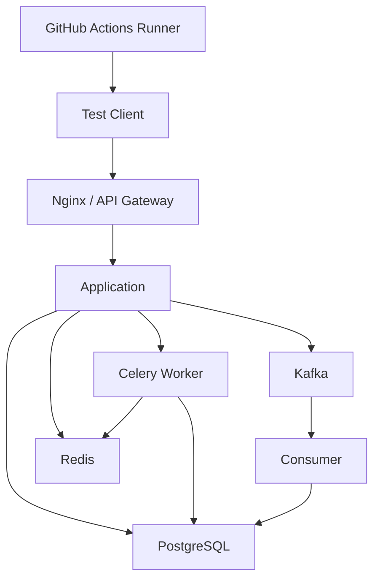
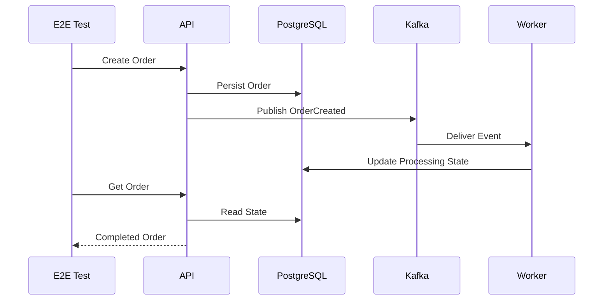
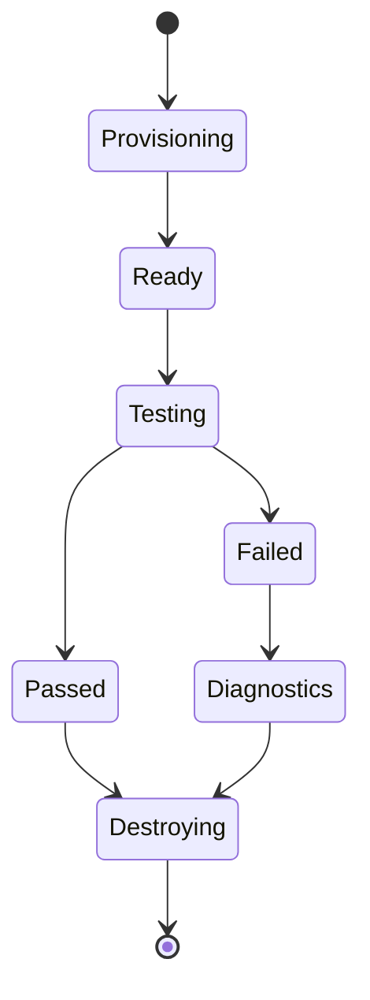
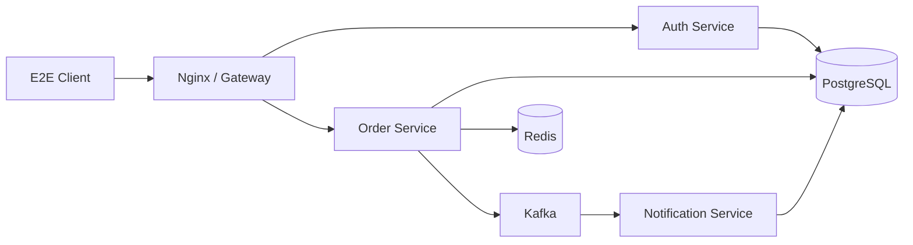

# 10- End to End Testing Pipelines

## Overview

End-to-end (E2E) testing validates a complete application workflow through interfaces and infrastructure that closely resemble the real system. Instead of testing an isolated function or a single API boundary, an E2E test exercises a user or business workflow across multiple application components.

For a backend system, an E2E flow may look like:

```text
Test Client
    ↓
Nginx / API Gateway
    ↓
Django / FastAPI
    ↓
Authentication
    ↓
Application Services
    ↓
PostgreSQL
    ↓
Redis
    ↓
Celery / Kafka / External Services
    ↓
Response
```

E2E tests provide confidence that independently working components also work correctly together. They are therefore valuable before production deployment, but they are slower, more expensive, and more operationally complex than unit and API tests.

A mature CI/CD pipeline normally combines test layers:

```text
Unit Tests
    ↓
API Tests
    ↓
Integration Tests
    ↓
End-to-End Tests
    ↓
Security Validation
    ↓
Build
    ↓
Deployment
```

E2E testing should validate a deliberately selected set of critical workflows rather than attempting to reproduce every possible application behavior through the complete production stack.

## Test Boundary

The primary characteristic of an E2E test is its broad system boundary.

| Test type | Typical boundary | Speed | Main purpose |
|---|---|---:|---|
| Unit | Function/class | Very fast | Business logic |
| API | HTTP/RPC boundary | Fast | API contract |
| Integration | Multiple components | Medium | Component interaction |
| E2E | Complete workflow | Slow | System behavior |
| Production smoke test | Deployed system | Very fast | Deployment validation |

For example, consider an order system.

A unit test might validate:

```text
calculate_total()
```

An API test might validate:

```text
POST /api/orders/
```

An integration test might validate:

```text
API → PostgreSQL
```

An E2E test might validate:

```text
Login
  ↓
Create Order
  ↓
Persist Order
  ↓
Publish Event
  ↓
Process Background Task
  ↓
Update Order
  ↓
Retrieve Order
```

The broader boundary provides more confidence but introduces more failure modes.

## Why E2E Tests Exist

E2E tests catch failures that lower-level tests may not detect.

Examples include:

- Incorrect routing.
- Authentication integration failures.
- Misconfigured environment variables.
- Broken service-to-service communication.
- Database migration problems.
- Redis configuration problems.
- Incorrect serialization between services.
- Broken asynchronous workflows.
- Nginx configuration issues.
- Incorrect Docker networking.
- Missing production configuration.
- Incompatible service versions.

A unit test may pass while the complete workflow still fails because two independently correct components are incorrectly integrated.

## E2E Test Characteristics

A useful E2E test should have:

- A clearly defined business workflow.
- Real application boundaries.
- Deterministic test data.
- Controlled infrastructure.
- Explicit cleanup.
- Strong failure diagnostics.
- Reasonable execution time.
- Minimal dependence on unrelated external systems.

Avoid turning E2E tests into large scripts that attempt to validate every implementation detail.

## Critical User Journeys

E2E tests should prioritize business-critical workflows.

Examples:

```text
User Registration
    ↓
Email Verification
    ↓
Login
    ↓
Create Resource
    ↓
Retrieve Resource
    ↓
Update Resource
    ↓
Delete Resource
```

For an e-commerce backend:

```text
Login
  ↓
Browse Product
  ↓
Add to Cart
  ↓
Create Order
  ↓
Payment
  ↓
Order Confirmation
```

For a Django/FastAPI microservice:

```text
Client
  ↓
API Gateway
  ↓
Authentication Service
  ↓
Order Service
  ↓
PostgreSQL
  ↓
Kafka
  ↓
Notification Service
```

The workflow should represent a meaningful system contract.

## E2E Testing Architecture

A CI E2E environment may look like:



The exact topology should reflect the behavior being validated.

Do not add infrastructure simply because it exists in production. Every dependency increases setup time, resource consumption, and potential failure modes.

## E2E Testing and GitHub Actions

GitHub Actions provides the execution layer:

```text
Workflow
    ↓
E2E Job
    ↓
Runner
    ↓
Application Environment
    ↓
Test Client
    ↓
Test Results
    ↓
Artifacts
```

An E2E job may either:

1. Start the application and dependencies directly on the runner.
2. Run the application inside Docker containers.
3. Deploy a temporary environment and test it.
4. Test a dedicated staging environment.
5. Test a preview environment created for the pull request.

The correct model depends on the purpose and required fidelity of the test.

## Local Application E2E Testing

For a Python application, the simplest architecture is:

```text
GitHub Runner
   │
   ├── PostgreSQL
   ├── Redis
   ├── Application
   └── E2E Test Client
```

The application can run through Uvicorn, Gunicorn, Django's production-like server configuration, or a Docker container depending on the test boundary.

For example:

```yaml
- name: Start application
  run: |
    uvicorn app.main:app \
      --host 0.0.0.0 \
      --port 8000 &
```

The test client can then target:

```text
http://127.0.0.1:8000
```

The process should be explicitly monitored and its logs preserved when failures occur.

## Docker-Based E2E Testing

Docker provides a more controlled application topology.

```text
Docker Network
│
├── nginx
├── api
├── postgres
├── redis
├── worker
└── e2e-tests
```

A Compose configuration might define:

```yaml
services:
  api:
    build: .
    depends_on:
      postgres:
        condition: service_healthy
      redis:
        condition: service_healthy

  postgres:
    image: postgres:16
    environment:
      POSTGRES_USER: test
      POSTGRES_PASSWORD: test
      POSTGRES_DB: app_test
    healthcheck:
      test: ["CMD-SHELL", "pg_isready -U test -d app_test"]
      interval: 10s
      timeout: 5s
      retries: 5

  redis:
    image: redis:7
    healthcheck:
      test: ["CMD", "redis-cli", "ping"]
      interval: 10s
      timeout: 5s
      retries: 5
```

The E2E test container can communicate with the application using the Docker service name:

```text
http://api:8000
```

This differs from a runner-based service-container setup where `localhost` may be appropriate.

## Service Readiness

Starting a container does not necessarily mean that the service is ready.

This is a common mistake:

```text
docker compose up -d
↓
Immediately run tests
```

The database, Redis server, or application may still be initializing.

Prefer health checks and explicit readiness validation.

```text
Start Services
     ↓
Health Checks
     ↓
Readiness Confirmed
     ↓
Run E2E Tests
```

Avoid arbitrary delays such as:

```bash
sleep 30
```

A fixed delay may be:

- Too short on a busy runner.
- Longer than necessary on a fast runner.
- Difficult to reason about.

Readiness should be based on service state whenever possible.

## HTTP Readiness Checks

For an application:

```bash
curl --fail \
  --silent \
  --show-error \
  http://127.0.0.1:8000/health
```

A robust CI script can retry:

```bash
for attempt in {1..30}; do
  if curl --fail --silent http://127.0.0.1:8000/health; then
    exit 0
  fi

  sleep 2
done

echo "Application failed readiness check"
exit 1
```

The retry window should be bounded.

## Database Readiness

PostgreSQL:

```bash
pg_isready \
  -h localhost \
  -p 5432 \
  -U test
```

Redis:

```bash
redis-cli \
  -h localhost \
  -p 6379 \
  ping
```

Readiness checks should validate the actual dependency required by the application.

## Database Migrations

E2E environments should apply migrations before testing workflows:

```bash
python manage.py migrate
```

The migration stage validates that the application can initialize its expected database schema.

A pipeline may therefore be:

```text
Start PostgreSQL
    ↓
Wait for PostgreSQL
    ↓
Run Migrations
    ↓
Start Application
    ↓
Wait for Application
    ↓
Run E2E Tests
```

## Django E2E Testing

Django applications can expose HTTP endpoints through:

```text
Django
   ↓
Gunicorn / Uvicorn
   ↓
HTTP
   ↓
E2E Client
```

The E2E test should interact with the application through HTTP rather than directly calling Django views.

For example:

```python
import httpx


def test_user_registration(base_url):
    response = httpx.post(
        f"{base_url}/api/users/",
        json={
            "email": "e2e-user@example.com",
            "password": "StrongTestPassword123!",
        },
        timeout=10,
    )

    assert response.status_code == 201
```

The important distinction is that the application is running as an HTTP service.

## FastAPI E2E Testing

For FastAPI, E2E tests can use HTTPX against the running server:

```python
import httpx


def test_health(base_url):
    response = httpx.get(
        f"{base_url}/health",
        timeout=10,
    )

    assert response.status_code == 200
    assert response.json()["status"] == "ok"
```

This is different from using `TestClient` directly against the application object.

`TestClient` is useful for API-level tests.

A real HTTP client against a running service is more appropriate when validating the deployed HTTP boundary.

## E2E Authentication

Authentication should be tested through the actual supported flow.

For example:

```text
Create Test User
      ↓
Login
      ↓
Receive Access Token
      ↓
Call Protected API
      ↓
Validate Response
```

A test should not simply inject an internal authentication object if the purpose is to validate the authentication workflow.

Example:

```python
def test_authenticated_order_flow(base_url):
    login = httpx.post(
        f"{base_url}/api/auth/login/",
        json={
            "email": "e2e-user@example.com",
            "password": "StrongTestPassword123!",
        },
    )

    assert login.status_code == 200

    token = login.json()["access_token"]

    response = httpx.post(
        f"{base_url}/api/orders/",
        headers={
            "Authorization": f"Bearer {token}",
        },
        json={
            "items": [
                {
                    "product_id": 1001,
                    "quantity": 2,
                }
            ]
        },
    )

    assert response.status_code == 201
```

## Browser-Based E2E Testing

Some applications require browser automation.

Typical tools include:

- Playwright.
- Selenium.

The architecture becomes:

```text
Browser
   ↓
Frontend
   ↓
Nginx
   ↓
Backend API
   ↓
Database / Services
```

Browser-based tests are appropriate when validating:

- Authentication flows.
- Browser-specific behavior.
- Cookies.
- Redirects.
- Frontend/backend integration.
- Critical UI workflows.

They are usually slower and more fragile than direct API-level E2E tests.

For backend-focused CI, prefer HTTP-based E2E tests unless browser behavior is part of the requirement.

## Selenium in CI

A Selenium workflow may require:

```text
GitHub Runner
    ↓
Browser
    ↓
Web Application
    ↓
Backend API
```

The runner must have:

- Browser.
- WebDriver or compatible browser automation infrastructure.
- Application.
- Dependencies.

Headless browser execution is normally appropriate in CI.

## Playwright vs Selenium

| Consideration | Playwright | Selenium |
|---|---|---|
| Browser automation | Strong | Strong |
| Multi-browser support | Strong | Strong |
| Modern web testing | Strong | Strong |
| Existing Selenium ecosystem | Requires migration | Strong |
| CI integration | Strong | Strong |
| Backend API-only tests | Usually unnecessary | Usually unnecessary |

The choice should follow the application's existing test ecosystem and browser requirements.

## E2E Test Data

E2E tests should create the data they require.

Avoid assumptions such as:

```text
User ID 123 always exists.
```

Prefer:

```text
Create Test User
     ↓
Create Test Resource
     ↓
Execute Workflow
     ↓
Validate Result
     ↓
Cleanup
```

This improves test isolation and reproducibility.

## Seed Data

Some systems require reference data.

Seed only stable, necessary data:

```text
Countries
Currencies
Product Categories
Permissions
Static Configuration
```

Do not make the entire E2E suite depend on a huge database dump unless the production data shape is itself part of the test requirement.

## Cleanup

Tests should clean up resources where possible.

Potential resources include:

- Database records.
- Redis keys.
- Temporary files.
- Kafka topics.
- Object-storage objects.
- Test users.
- Temporary cloud resources.

A useful pattern is:

```text
Setup
  ↓
Test
  ↓
Cleanup
```

When cleanup is impossible or unreliable, use disposable environments so resources disappear with the environment.

## Unique Test Data

Parallel E2E jobs should avoid collisions.

Use identifiers tied to the test execution:

```python
import uuid

email = f"e2e-{uuid.uuid4().hex}@example.com"
```

For shared environments, include the workflow or run identifier when appropriate.

## Parallel E2E Testing

E2E tests can be parallelized, but only after test isolation is established.

Potential conflicts include:

- Same users.
- Same orders.
- Shared Redis keys.
- Shared files.
- Shared database records.
- Shared Kafka topics.
- Shared external resources.

A safe architecture might be:

```text
Worker 1 → Database Schema 1
Worker 2 → Database Schema 2
Worker 3 → Database Schema 3
```

or separate disposable environments.

## Matrix E2E Testing

Matrix testing can validate:

```yaml
strategy:
  fail-fast: false
  matrix:
    python-version:
      - "3.11"
      - "3.12"
```

However, E2E tests often should use a smaller matrix than unit tests because every combination requires a complete environment.

A common strategy is:

```text
Unit Tests
→ Large Matrix

API / Integration Tests
→ Moderate Matrix

E2E Tests
→ Focused Compatibility Matrix
```

## E2E Test Pipeline

A basic Docker-based GitHub Actions pipeline may look like:

```yaml
name: E2E Tests

on:
  pull_request:
    paths:
      - "app/**"
      - "tests/e2e/**"
      - "Dockerfile"
      - "compose.yml"
      - ".github/workflows/e2e.yml"

permissions:
  contents: read

jobs:
  e2e:
    runs-on: ubuntu-latest

    steps:
      - name: Checkout
        uses: actions/checkout@v4

      - name: Build application
        run: docker compose build

      - name: Start services
        run: docker compose up -d

      - name: Wait for application
        run: |
          for attempt in {1..30}; do
            if curl --fail --silent http://127.0.0.1:8000/health; then
              exit 0
            fi

            sleep 2
          done

          echo "Application did not become ready"
          docker compose logs
          exit 1

      - name: Run E2E tests
        run: docker compose run --rm e2e-tests

      - name: Collect logs
        if: ${{ !cancelled() }}
        run: docker compose logs > docker-compose.log

      - name: Upload diagnostics
        if: ${{ !cancelled() }}
        uses: actions/upload-artifact@v4
        with:
          name: e2e-diagnostics
          path: docker-compose.log

      - name: Stop services
        if: ${{ always() }}
        run: docker compose down -v
```

The exact Compose topology depends on the application.

## Failure Diagnostics

E2E failures often require more evidence than a test assertion.

Collect:

```text
Test Report
Application Logs
Database Logs
Redis Logs
Worker Logs
Nginx Logs
Browser Screenshots
Browser Traces
HTTP Responses
Container Status
```

For browser tests, screenshots and traces can be especially useful.

## Conditional Artifact Collection

Diagnostic artifacts should still be collected when tests fail.

For example:

```yaml
- name: Upload E2E artifacts
  if: ${{ !cancelled() }}
  uses: actions/upload-artifact@v4
  with:
    name: e2e-results
    path: |
      test-results/
      screenshots/
      traces/
      logs/
```

`!cancelled()` allows the diagnostic step to run after ordinary failures while avoiding unnecessary execution after explicit cancellation.

## JUnit Reports

Pytest can produce JUnit XML:

```bash
pytest tests/e2e \
  --junitxml=test-results/e2e.xml
```

The report can then be uploaded:

```yaml
- name: Upload test report
  if: ${{ !cancelled() }}
  uses: actions/upload-artifact@v4
  with:
    name: e2e-test-report
    path: test-results/e2e.xml
```

## Screenshots

Browser tests should capture screenshots when a workflow fails.

Example conceptually:

```python
try:
    run_checkout_flow()
except Exception:
    page.screenshot(path="artifacts/checkout-failure.png")
    raise
```

The implementation depends on the browser framework.

## Browser Traces

Modern browser testing tools can capture execution traces containing:

- Network requests.
- Console output.
- DOM state.
- Timing information.
- Screenshots.

Traces are often more useful than a screenshot alone when diagnosing intermittent browser failures.

## Artifacts vs Caches

E2E pipelines frequently need both.

| Mechanism | Example |
|---|---|
| Artifact | JUnit report |
| Artifact | Screenshot |
| Artifact | Browser trace |
| Artifact | Application logs |
| Artifact | Coverage |
| Cache | Python packages |
| Cache | Browser binaries |
| Cache | Docker layers |

Artifacts are outputs from a test execution.

Caches accelerate future executions.

## External Services

E2E tests should carefully control external dependencies.

For example:

```text
Application
    ↓
Payment Provider
```

Calling a real payment provider on every pull request can cause:

- Cost.
- Rate limits.
- Credential exposure.
- Flaky tests.
- External outages.
- Test data pollution.

Prefer a sandbox or mock at the appropriate boundary.

## When Real External Services Are Appropriate

Real external integration can be valuable when validating:

- Authentication provider integration.
- Payment provider sandbox behavior.
- Cloud APIs.
- Object storage.
- Messaging infrastructure.
- Third-party contracts.

Use dedicated credentials and isolated accounts or projects.

## E2E and Kafka

For event-driven systems:



The test must account for asynchronous processing.

Do not use an arbitrary sleep:

```python
time.sleep(30)
```

Prefer polling with a bounded timeout:

```python
import time


deadline = time.monotonic() + 30

while time.monotonic() < deadline:
    response = client.get(f"/api/orders/{order_id}/")

    if response.json()["status"] == "completed":
        break

    time.sleep(1)
else:
    raise AssertionError("Order was not processed within 30 seconds")
```

The exact implementation should match the application's consistency model.

## Eventual Consistency

Asynchronous systems may not immediately expose the final state.

An E2E test should therefore distinguish:

```text
Request Accepted
```

from:

```text
Processing Complete
```

The API contract may explicitly expose a state such as:

```text
pending
processing
completed
failed
```

The test should validate the intended lifecycle.

## E2E and Celery

For Celery-based applications:

```text
API
 ↓
Redis
 ↓
Celery Worker
 ↓
Task
 ↓
PostgreSQL
```

If the workflow requires task completion, the CI environment must include the worker.

Example:

```yaml
services:
  worker:
    build: .
    command: celery -A app worker --loglevel=INFO
```

The worker should use the same dependency configuration as the application.

## E2E and Nginx

Testing through Nginx can validate:

- Routing.
- Headers.
- Proxy configuration.
- Timeouts.
- TLS termination behavior where applicable.
- Upstream connectivity.

The topology becomes:

```text
E2E Client
    ↓
Nginx
    ↓
API
```

However, testing Nginx in every E2E run may increase execution time. Use a dedicated gateway test layer if the proxy configuration can be validated separately.

## E2E Environment Strategies

There are several common deployment models.

| Strategy | Isolation | Cost | Fidelity |
|---|---|---:|---:|
| Local containers on runner | High | Low | Medium |
| Docker Compose environment | High | Low | Medium/High |
| Preview environment | High | Medium | High |
| Shared staging | Low/Medium | Lower | High |
| Ephemeral cloud environment | Very high | Higher | Very high |

A pull request may use an ephemeral environment while release validation may use staging.

## Shared Staging Risks

Running E2E tests against shared staging can cause:

- Data collisions.
- Test interference.
- Environment drift.
- Flaky results.
- Concurrent deployment conflicts.

If shared staging is used, define:

- Test data ownership.
- Cleanup rules.
- Deployment concurrency.
- Test-user isolation.
- Environment reset procedures.

## Ephemeral Environments

An ephemeral environment can be created for a workflow:

```text
Pull Request
    ↓
Provision Environment
    ↓
Deploy Application
    ↓
Run E2E Tests
    ↓
Collect Results
    ↓
Destroy Environment
```

This provides strong isolation but increases infrastructure complexity and cloud cost.

## E2E Environment Lifecycle

A robust lifecycle is:



The environment should be destroyed even when tests fail.

## AWS Integration

For AWS-based systems, E2E tests may interact with:

- ECR.
- ECS.
- EC2.
- S3.
- Lambda.
- RDS.
- ElastiCache.
- SQS.
- SNS.

Use GitHub Actions OIDC rather than long-lived AWS access keys where appropriate.

```text
GitHub Actions
     ↓
OIDC
     ↓
AWS STS
     ↓
Temporary Credentials
     ↓
Test Infrastructure
```

The IAM role should have only the permissions required by the E2E workflow.

## E2E AWS Architecture

A deployment validation flow might be:

```text
GitHub Actions
     ↓
Build Image
     ↓
ECR
     ↓
Deploy Test Environment
     ↓
ECS
     ↓
ALB
     ↓
API
     ↓
RDS / ElastiCache
     ↓
E2E Tests
```

After validation:

```text
Pass → Promote Artifact
Fail → Collect Diagnostics + Destroy
```

## Security Boundaries

E2E environments should not become a path into production.

Separate:

- AWS accounts where appropriate.
- IAM roles.
- Secrets.
- Databases.
- VPC access.
- Object storage.
- Service credentials.

Do not assume that because a test is automated, it is trusted.

## GitHub Token Permissions

An E2E job may only need:

```yaml
permissions:
  contents: read
```

If the workflow provisions AWS resources using OIDC, add only the required identity permission:

```yaml
permissions:
  contents: read
  id-token: write
```

Avoid broad permissions such as unrestricted repository write access.

## Secret Management

Do not place credentials directly in YAML:

```yaml
run: pytest --token=actual-secret
```

Use environment variables:

```yaml
env:
  TEST_API_TOKEN: ${{ secrets.TEST_API_TOKEN }}
```

and ensure tests do not print the token.

Even environment variables can be exposed if application logs or debugging output print them.

## Pull Request Security

Pull request workflows may execute untrusted code.

Do not combine:

```text
Untrusted PR Code
+
Production Secrets
+
Write Permissions
+
Private Network Access
```

without a strong security design.

`pull_request_target` requires particular caution because it runs with the base repository's context.

## Third-Party E2E Dependencies

Browser binaries, test libraries, Docker images, and GitHub Actions all become supply-chain dependencies.

Use:

- Trusted sources.
- Controlled versions.
- Dependabot where appropriate.
- Dependency review.
- Action pinning according to organizational policy.
- Image vulnerability scanning.

## E2E Flakiness

Flaky E2E tests are often caused by:

- Race conditions.
- Eventual consistency.
- Shared test data.
- Service readiness problems.
- Browser timing.
- External APIs.
- Network instability.
- Resource exhaustion.
- Test ordering.

A flaky test should be investigated rather than repeatedly retried until it passes.

## Retries

Retries can hide real failures.

Use retries selectively for known transient operations.

Bad pattern:

```text
Test fails
 ↓
Retry 10 times
 ↓
Eventually passes
```

Better:

```text
Test fails
 ↓
Classify failure
 ↓
Retry only known transient dependency
 ↓
Preserve original diagnostics
```

The application itself should not be made to appear healthy by indiscriminate test retries.

## Timeouts

Every E2E operation should have bounded time.

Examples:

```text
Application readiness: 60s
API request: 10s
Async workflow: 30s
Browser navigation: 30s
Full E2E suite: CI job timeout
```

Unbounded waits can consume runner capacity and increase CI cost.

## E2E Performance

E2E tests are expensive because they involve multiple systems.

Optimize by:

- Keeping the suite focused.
- Parallelizing isolated workflows.
- Reusing infrastructure where safe.
- Avoiding unnecessary browser tests.
- Avoiding external network dependencies.
- Caching dependencies.
- Using API-level tests for lower-level coverage.
- Reserving full E2E execution for critical paths.

## Test Pyramid

A practical testing distribution is:

```text
          /\
         /  \
        / E2E\
       /------\
      /  API   \
     /----------\
    / Integration \
   /--------------\
  /   Unit Tests   \
 /------------------\
```

The exact proportions depend on the application, but the principle is important:

- Unit tests provide fast feedback.
- API/integration tests provide broader confidence.
- E2E tests validate critical complete workflows.

Do not use E2E tests to replace lower-level tests.

## E2E Pipeline Placement

A pull-request pipeline may use:

```text
Lint
  ↓
Unit Tests
  ↓
API Tests
  ↓
Integration Tests
  ↓
E2E Tests
  ↓
Security Scan
```

The E2E stage can depend on earlier stages:

```yaml
jobs:
  e2e:
    needs:
      - unit-tests
      - api-tests
      - integration-tests
```

This avoids spending E2E resources when fundamental validation has already failed.

## Fan-Out and Fan-In

E2E testing can use a dependency graph:

```text
              ┌── Unit Tests ─────┐
              │                   │
Pull Request ─┼── API Tests ──────┼── E2E ── Build
              │                   │
              └── Integration ───┘
```

This provides parallel feedback while retaining a clear promotion boundary.

## Concurrency

Production deployments should not race.

For deployment workflows:

```yaml
concurrency:
  group: production-deployment
  cancel-in-progress: false
```

For pull-request E2E environments, concurrency can instead use the PR identifier:

```yaml
concurrency:
  group: e2e-${{ github.event.pull_request.number }}
  cancel-in-progress: true
```

This can prevent multiple obsolete E2E runs from consuming resources for the same pull request.

## Artifacts and Environment Cleanup

The cleanup order matters.

Prefer:

```text
Run Tests
   ↓
Collect Logs
   ↓
Upload Artifacts
   ↓
Destroy Environment
```

not:

```text
Destroy Environment
   ↓
Attempt to Collect Logs
```

If the environment is destroyed too early, critical failure evidence may disappear.

## Cleanup with `always()`

Cleanup operations often need to execute regardless of test outcome:

```yaml
- name: Destroy environment
  if: ${{ always() }}
  run: ./scripts/destroy-test-environment.sh
```

Be careful with cancellation semantics. Cleanup should be designed so that cancellation does not leave expensive infrastructure running indefinitely.

## Production Deployment Validation

E2E tests can be used after deployment as smoke tests.

A typical sequence is:

```text
Deploy
  ↓
Wait for Health
  ↓
Run Critical E2E Flows
  ↓
Validate Metrics
  ↓
Accept / Roll Back
```

Production smoke tests should be smaller than the full E2E suite.

## Build Once, Promote the Same Artifact

A production pipeline should preferably use:

```text
Source
  ↓
Tests
  ↓
Build
  ↓
Immutable Docker Image
  ↓
ECR
  ↓
Staging
  ↓
E2E
  ↓
Approval
  ↓
Production
```

The same immutable image should be promoted rather than rebuilding separately for production.

This prevents the tested artifact from differing from the deployed artifact.

## Docker Image Tags

Useful identifiers include:

```text
app:<commit-sha>
app:<semantic-version>
```

The commit SHA provides a strong link between:

```text
Git Commit
    ↓
CI Run
    ↓
Docker Image
    ↓
Deployment
```

Avoid relying exclusively on mutable tags such as:

```text
latest
```

for production promotion.

## Release Validation

Release workflows can perform:

```text
Tag
 ↓
Build
 ↓
Unit Tests
 ↓
API Tests
 ↓
Integration Tests
 ↓
E2E Tests
 ↓
Publish Artifact
 ↓
Release
```

Pre-release versions can be validated separately before broader promotion.

## Monitoring After E2E Deployment

Successful E2E tests do not prove that production is healthy indefinitely.

Monitor:

- Error rate.
- Latency.
- Availability.
- Database health.
- Redis health.
- Queue depth.
- Kafka lag.
- CPU.
- Memory.
- Application-specific business metrics.

E2E tests validate known workflows at a point in time.

Monitoring validates ongoing system behavior.

## High Availability Considerations

E2E validation should consider the deployment architecture.

For highly available services:

```text
Load Balancer
    ↓
Instance A
Instance B
Instance C
```

A test should not accidentally validate only one instance when the production behavior depends on load balancing.

For stateful components, verify that the test environment matches the relevant production topology where HA behavior is itself part of the test objective.

## Disaster Recovery

E2E tests can validate recovery workflows when explicitly designed for them.

Examples:

- Service restart.
- Worker restart.
- Database failover.
- Cache failure.
- Deployment rollback.
- Instance replacement.

These should generally be separate resilience tests rather than embedded into every ordinary pull-request E2E run.

## Cost Considerations

E2E environments can become expensive.

Major cost drivers include:

- Cloud infrastructure.
- Long-running environments.
- Browser execution.
- Large matrices.
- External services.
- High-volume logs.
- Large artifacts.
- Persistent self-hosted runners.

Use disposable infrastructure and aggressive cleanup for temporary environments.

## Self-Hosted Runners

Self-hosted runners can provide:

- Private network access.
- Custom browsers.
- Internal dependencies.
- Specialized software.

But they also introduce:

- Persistent state risk.
- Credential exposure.
- Maintenance.
- Capacity management.
- Security isolation requirements.

Ephemeral runners are preferable for workloads requiring stronger isolation.

## Failure Domain Troubleshooting

Use:

```text
Symptom
  ↓
Possible Causes
  ↓
Isolation Strategy
  ↓
Commands / Checks
  ↓
Root Cause
  ↓
Corrective Action
  ↓
Prevention
```

## Application Does Not Start

### Symptom

The E2E job cannot reach the application.

### Possible Causes

- Invalid configuration.
- Dependency failure.
- Migration failure.
- Port conflict.
- Application crash.
- Incorrect Docker networking.

### Checks

```bash
docker compose ps
docker compose logs api
curl -v http://127.0.0.1:8000/health
```

### Corrective Action

Fix the application startup failure rather than increasing the readiness timeout blindly.

## Database Is Unavailable

### Checks

```bash
docker compose ps postgres
docker compose logs postgres
pg_isready -h localhost -p 5432
```

If the application runs inside Docker, verify the service hostname rather than assuming `localhost`.

## Redis Is Unavailable

```bash
docker compose ps redis
docker compose logs redis
redis-cli -h localhost -p 6379 ping
```

For container-to-container communication:

```text
redis:6379
```

may be correct instead.

## Tests Fail Only in CI

Possible causes:

- Environment assumptions.
- Missing dependencies.
- Different Python version.
- Timezone differences.
- Database version differences.
- Browser differences.
- CPU/resource constraints.
- Race conditions.

Compare:

```text
Local Environment
        vs
CI Environment
```

Do not immediately change the test to accommodate an unknown difference.

## Tests Fail Intermittently

Investigate:

```text
Timing
Concurrency
Shared State
External Services
Resource Exhaustion
Async Processing
```

Collect timestamps and service logs around the failure.

## E2E Test Times Out

Possible causes:

- Deadlocked worker.
- Slow database query.
- Missing consumer.
- Application startup delay.
- External service timeout.
- Resource exhaustion.

Check the slowest boundary rather than increasing the global timeout.

## Browser Test Fails

Collect:

- Screenshot.
- Browser trace.
- Console logs.
- Network logs.
- Application logs.

Then determine whether the failure is:

```text
Browser
Frontend
Gateway
Backend
Dependency
```

## Docker Networking Failure

Check:

```bash
docker network ls
docker network inspect <network>
docker compose ps
```

Verify that the service hostname is resolvable from the test container.

## AWS Authentication Failure

For OIDC-based workflows, verify:

```text
permissions.id-token: write
IAM Trust Policy
Repository / Branch Conditions
Role ARN
AWS Region
STS Configuration
```

Do not fall back to long-lived access keys merely to make CI work.

## Artifact Missing

Check:

```text
Test Output Path
Working Directory
Artifact Upload Condition
File Creation
```

Useful diagnostics:

```bash
pwd
find . -maxdepth 3 -type f
```

Avoid uploading the entire workspace because it may contain secrets or unnecessary data.

## Workflow Concurrency Failure

If two E2E environments interfere:

```text
PR A → Environment X
PR B → Environment X
```

the environment naming or concurrency policy is incorrect.

Use a unique environment identifier:

```text
e2e-pr-123
```

and define cleanup ownership clearly.

## E2E Architecture for Microservices

A mature microservice test environment might look like:



The test should validate only workflows that require this complete topology.

If a service does not participate in the workflow, avoid adding it.

## E2E and Service Virtualization

A complex dependency graph can be simplified:

```text
Real:
Gateway
Application
Database

Virtualized:
Payment Provider
Email Provider
External CRM
```

This reduces cost and flakiness while retaining meaningful coverage.

## E2E Architecture for Backend Systems

A scalable test strategy is:

```text
                    ┌── Unit Tests
                    │
Pull Request ───────┼── API Tests
                    │
                    ├── Integration Tests
                    │
                    └── Critical E2E Tests
                              ↓
                         Build Artifact
                              ↓
                           Staging
                              ↓
                       Full E2E / Smoke
                              ↓
                         Production
```

This keeps fast feedback near the beginning while reserving expensive validation for appropriate stages.

## Reusable E2E Workflows

Organizations can standardize E2E execution:

```yaml
on:
  workflow_call:
    inputs:
      compose-file:
        required: true
        type: string
      test-command:
        required: true
        type: string
```

The reusable workflow can standardize:

- Service startup.
- Readiness checks.
- Test execution.
- Artifact collection.
- Cleanup.

Repository-specific workflows provide the application-specific configuration.

## Composite Actions for E2E Setup

A composite action can package repeated steps such as:

```text
Install Dependencies
Start Services
Wait for Readiness
Run Diagnostics
```

A reusable workflow should orchestrate multiple jobs or complete CI stages.

## Governance

Enterprise E2E pipelines should standardize:

- Test environment ownership.
- Required test stages.
- Action versions.
- Runner policies.
- Secret handling.
- Artifact retention.
- Environment cleanup.
- AWS access.
- Deployment approvals.
- Concurrency policies.

A central reusable workflow can enforce these controls consistently.

## GitHub CLI Operations

List workflow runs:

```bash
gh run list --workflow e2e.yml
```

Inspect a run:

```bash
gh run view RUN_ID
```

View logs:

```bash
gh run view RUN_ID --log
```

Rerun:

```bash
gh run rerun RUN_ID
```

Download artifacts:

```bash
gh run download RUN_ID
```

Run manually:

```bash
gh workflow run e2e.yml
```

These commands are useful when diagnosing or operating E2E pipelines.

## Production E2E Pipeline

A complete production-oriented pipeline may be:

```text
Pull Request
      ↓
Lint
      ↓
Unit Tests
      ↓
API Tests
      ↓
Integration Tests
      ↓
Critical E2E Tests
      ↓
Security Scan
      ↓
Build Docker Image
      ↓
Push to ECR
      ↓
Deploy Staging
      ↓
Staging E2E
      ↓
Approval
      ↓
Production Deployment
      ↓
Production Smoke Tests
      ↓
Monitoring
      ↓
Rollback if Required
```

The pipeline separates:

```text
Code Validation
Artifact Creation
Environment Validation
Promotion
Production Verification
```

## Senior Engineering Trade-Offs

E2E testing involves several important trade-offs.

| Decision | Benefit | Cost / Risk |
|---|---|---|
| Full real infrastructure | High fidelity | Expensive |
| Mock external services | Fast and deterministic | Lower external fidelity |
| Shared staging | Production-like | Test interference |
| Ephemeral environment | Strong isolation | Infrastructure cost |
| Browser E2E | Real user path | Slow and fragile |
| HTTP E2E | Faster | Does not validate browser behavior |
| Large matrix | Broad compatibility | Expensive |
| Small matrix | Faster | Lower coverage |
| Parallel execution | Faster feedback | Isolation complexity |

The correct architecture depends on what risk the test is intended to reduce.

## Common Mistakes

### Treating E2E as Unit Testing

E2E tests should not validate every internal branch.

Use unit tests for detailed business logic.

### Testing Everything Through E2E

This creates:

- Slow CI.
- High maintenance.
- Flaky failures.
- Difficult diagnosis.

Keep most detailed behavioral coverage at lower levels.

### Using Fixed Sleeps

Bad:

```python
time.sleep(30)
```

Prefer bounded readiness checks or polling against a meaningful condition.

### Using Shared Mutable Test Data

Shared records cause race conditions and order-dependent tests.

Create isolated test data.

### Using Production Credentials

Never use production credentials simply because E2E tests require authentication.

Use dedicated test identities and environments.

### Ignoring Cleanup

Temporary infrastructure must be destroyed even after failures.

### Running E2E Against `latest`

Mutable images make test reproducibility difficult.

Prefer immutable build identifiers such as commit SHA tags.

### Retrying Every Failure

Retries can hide real application defects.

Classify failures before adding retry behavior.

## Interview Scenarios

### Design a GitHub Actions E2E Pipeline

A strong answer should cover:

```text
Checkout
  ↓
Build
  ↓
Start Infrastructure
  ↓
Readiness
  ↓
Migrations
  ↓
E2E Tests
  ↓
Reports
  ↓
Logs
  ↓
Cleanup
```

Then discuss security, isolation, concurrency, cost, and artifact retention.

### Why Not Use E2E Tests for Everything?

Because E2E tests are:

- Slower.
- More expensive.
- More fragile.
- Harder to diagnose.
- More dependent on infrastructure.

Lower-level tests provide faster feedback and more precise failures.

### How Would You Test an Asynchronous Workflow?

Do not rely on fixed sleeps.

Use:

```text
Trigger Event
   ↓
Poll Observable State
   ↓
Bounded Timeout
   ↓
Validate Final State
```

Also collect worker, queue, and application logs on failure.

### How Would You Run E2E Tests in Parallel?

First isolate:

- Database state.
- Redis state.
- Kafka resources.
- Files.
- Users.
- External resources.

Then partition tests across workers or environments.

### How Would You Test a Pull Request Without Exposing Secrets?

Use:

- `pull_request`.
- Minimal permissions.
- Dedicated test credentials where needed.
- Ephemeral infrastructure.
- No production secrets.
- Controlled external dependencies.

Be particularly careful with `pull_request_target`.

### How Would You Test a Dockerized Application?

Build the same or equivalent application image used for deployment, start the required dependency topology, wait for readiness, execute E2E tests, collect logs, and destroy the environment.

### How Would You Validate a Production Deployment?

Use a small smoke-test suite after deployment:

```text
Health
 ↓
Authentication
 ↓
Critical API
 ↓
Critical Business Workflow
 ↓
Metrics
```

If validation fails, trigger the appropriate rollback mechanism.

### How Would You Avoid Rebuilding for Production?

Build once:

```text
Source
 ↓
Tests
 ↓
Docker Image
 ↓
ECR
```

Then promote the same immutable image:

```text
ECR
 ↓
Staging
 ↓
Production
```

### How Would You Handle a Flaky E2E Test?

Classify the failure:

```text
Application
Infrastructure
Timing
Concurrency
External Dependency
Test Isolation
```

Collect evidence, reproduce the issue, fix the underlying cause, and only use targeted retries for genuinely transient failures.

## Production Checklist

- [ ] E2E tests represent critical business workflows.
- [ ] Test boundaries are clearly defined.
- [ ] Unit, API, integration, and E2E tests have distinct responsibilities.
- [ ] Application startup is validated before tests begin.
- [ ] PostgreSQL/MySQL readiness is verified.
- [ ] Redis readiness is verified.
- [ ] Migrations run before database-dependent tests.
- [ ] Async workers are started when workflows require them.
- [ ] Kafka consumers/producers are available when required.
- [ ] E2E data is deterministic and isolated.
- [ ] Parallel tests do not share mutable state.
- [ ] External dependencies are controlled appropriately.
- [ ] Browser tests are used only where browser behavior matters.
- [ ] E2E tests have bounded timeouts.
- [ ] Arbitrary sleeps are avoided.
- [ ] Flaky tests are investigated rather than blindly retried.
- [ ] JUnit or equivalent test reports are preserved.
- [ ] Application and infrastructure logs are collected.
- [ ] Browser screenshots/traces are collected when applicable.
- [ ] Cleanup runs after success and failure.
- [ ] Temporary environments are destroyed.
- [ ] E2E workflows use minimal GitHub permissions.
- [ ] Production credentials are never exposed to ordinary PR tests.
- [ ] AWS authentication uses OIDC where appropriate.
- [ ] Self-hosted runners are isolated appropriately.
- [ ] Docker images use immutable identifiers for promotion.
- [ ] Production smoke tests are separate from the full E2E suite.
- [ ] Deployment concurrency prevents production races.
- [ ] Rollback procedures are defined.
- [ ] E2E pipeline costs are monitored.
- [ ] Reusable workflows standardize common E2E infrastructure where appropriate.

## Key Takeaways

- E2E tests validate complete business workflows across realistic application boundaries and should complement, not replace, unit, API, and integration tests.
- Reliable E2E pipelines depend on deterministic data, isolated environments, explicit service readiness, bounded timeouts, and disciplined cleanup.
- Docker, PostgreSQL, Redis, Celery, Kafka, Nginx, and AWS can be included when they are part of the workflow under test, but unnecessary dependencies increase cost and failure surface.
- CI security requires strict isolation of pull-request code, secrets, GitHub permissions, AWS credentials, third-party actions, and self-hosted runners.
- Production pipelines should validate an immutable artifact through staging and targeted E2E or smoke tests before promotion, while preserving diagnostics and maintaining a reliable rollback path.