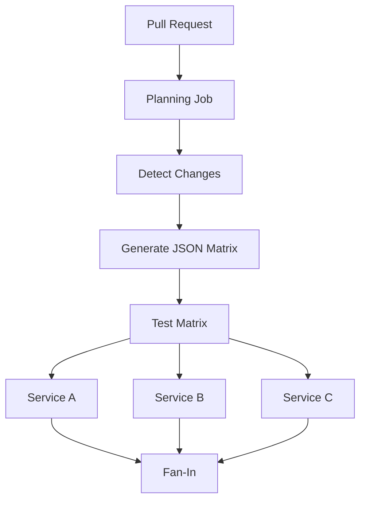
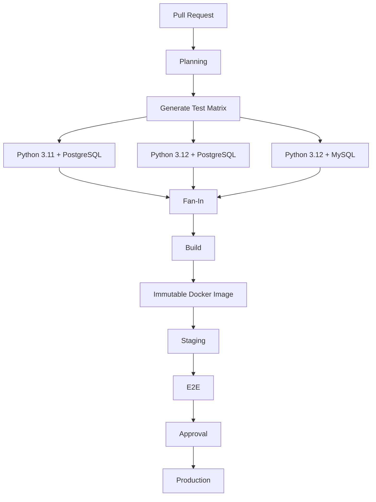

# 11- Test Matrix Design

## Overview

Test matrices allow GitHub Actions to execute the same job against multiple combinations of environments, runtimes, databases, operating systems, or configuration values.

For backend engineering, a matrix is useful when compatibility is part of the product contract. A Python application may need validation across supported Python versions, PostgreSQL versions, operating systems, or dependency configurations.

A simple matrix:

```yaml
strategy:
  matrix:
    python-version:
      - "3.11"
      - "3.12"
```

creates two independent job executions.

A multidimensional matrix:

```yaml
strategy:
  matrix:
    python-version:
      - "3.11"
      - "3.12"
    database:
      - postgres
      - mysql
```

creates four combinations:

```text
Python 3.11 + PostgreSQL
Python 3.11 + MySQL
Python 3.12 + PostgreSQL
Python 3.12 + MySQL
```

Matrix design is not simply a YAML feature. It is a test strategy decision involving compatibility coverage, execution time, runner capacity, cost, failure diagnosis, and maintenance.

## Why Test Matrices Exist

Without a matrix, compatibility testing often becomes duplicated workflow configuration.

Instead of:

```yaml
jobs:
  test-python-311:
    ...

  test-python-312:
    ...
```

a matrix expresses the compatibility dimensions declaratively:

```yaml
jobs:
  test:
    strategy:
      matrix:
        python-version:
          - "3.11"
          - "3.12"
```

GitHub Actions expands the matrix into independent job executions.

This provides:

- Consistent test logic.
- Parallel execution.
- Explicit compatibility coverage.
- Easier addition or removal of supported versions.
- Independent failure reporting.
- Better CI maintainability.

## Matrix Execution Model

A matrix belongs to a job's `strategy`.

Conceptually:

```text
Workflow
   ↓
Job
   ↓
Strategy
   ↓
Matrix Expansion
   ├── Job Instance 1
   ├── Job Instance 2
   ├── Job Instance 3
   └── Job Instance N
```

Each matrix combination receives its own execution environment.

For example:

```yaml
jobs:
  test:
    runs-on: ubuntu-latest

    strategy:
      matrix:
        python-version:
          - "3.11"
          - "3.12"

    steps:
      - uses: actions/checkout@v4

      - uses: actions/setup-python@v6
        with:
          python-version: ${{ matrix.python-version }}

      - run: pytest
```

The expression:

```yaml
${{ matrix.python-version }}
```

refers to the value for the current matrix combination.

## Matrix Dimensions

A matrix dimension represents one compatibility or test variable.

Common dimensions include:

| Dimension | Example |
|---|---|
| Python | `3.11`, `3.12` |
| Database | PostgreSQL, MySQL |
| OS | Ubuntu, Windows |
| Framework | Django versions |
| Node | `20`, `22` |
| Architecture | `amd64`, `arm64` |
| Deployment target | ECS, Kubernetes |
| Feature flag | enabled, disabled |

Not every dimension should be combined with every other dimension.

The matrix should represent meaningful test coverage rather than every technically possible combination.

## Matrix Cardinality

For independent dimensions, the number of combinations is approximately:

```text
Dimension 1 × Dimension 2 × Dimension 3
```

For example:

```text
2 Python versions
×
2 databases
×
2 operating systems
=
8 jobs
```

Adding another dimension:

```text
8 × 2
=
16 jobs
```

can double CI resource consumption.

This is one of the most important considerations when designing large matrices.

## Single-Dimension Matrix

The simplest matrix tests one compatibility dimension.

```yaml
strategy:
  matrix:
    python-version:
      - "3.10"
      - "3.11"
      - "3.12"
```

This is appropriate when the application supports multiple Python versions but uses the same infrastructure for each.

## Multiple Dimensions

Multiple dimensions produce combinations.

```yaml
strategy:
  matrix:
    python-version:
      - "3.11"
      - "3.12"
    database:
      - postgres
      - mysql
```

The matrix produces:

```text
3.11 + postgres
3.11 + mysql
3.12 + postgres
3.12 + mysql
```

Each combination is independent.

## Accessing Matrix Values

Matrix values are available through the `matrix` context.

```yaml
- name: Display configuration
  run: |
    echo "Python: ${{ matrix.python-version }}"
    echo "Database: ${{ matrix.database }}"
```

A Python setup step might use:

```yaml
- name: Set up Python
  uses: actions/setup-python@v6
  with:
    python-version: ${{ matrix.python-version }}
```

## Matrix Naming

Use meaningful matrix keys.

Prefer:

```yaml
matrix:
  python-version:
  database:
  os:
```

over ambiguous names such as:

```yaml
matrix:
  value:
  type:
  option:
```

Readable matrix configuration becomes increasingly important as the number of dimensions grows.

## `include`

`include` adds or modifies matrix combinations.

For example:

```yaml
strategy:
  matrix:
    python-version:
      - "3.11"
      - "3.12"
    database:
      - postgres
      - mysql

    include:
      - python-version: "3.12"
        database: postgres
        experimental: true
```

`include` is useful when additional metadata or targeted combinations are required.

A matrix entry can carry additional values:

```yaml
strategy:
  matrix:
    python-version:
      - "3.11"
      - "3.12"

    include:
      - python-version: "3.12"
        django-version: "5.2"
```

The additional property can then be accessed with:

```yaml
${{ matrix.django-version }}
```

## `exclude`

`exclude` removes combinations that are unnecessary or unsupported.

```yaml
strategy:
  matrix:
    python-version:
      - "3.11"
      - "3.12"
    database:
      - postgres
      - mysql

    exclude:
      - python-version: "3.11"
        database: mysql
```

The resulting matrix contains:

```text
3.11 + postgres
3.12 + postgres
3.12 + mysql
```

Use `exclude` when a Cartesian-product matrix contains combinations that are explicitly unsupported or unnecessary.

## Include vs Exclude

| Mechanism | Purpose |
|---|---|
| Matrix dimension | Defines supported combinations |
| `include` | Adds metadata or targeted combinations |
| `exclude` | Removes unwanted combinations |

A common mistake is to define a huge matrix and use dozens of exclusions.

When exclusions become difficult to understand, the matrix model itself may need redesign.

## `fail-fast`

`fail-fast` controls whether GitHub Actions should cancel in-progress matrix jobs when a matrix job fails.

Example:

```yaml
strategy:
  fail-fast: true
  matrix:
    python-version:
      - "3.11"
      - "3.12"
      - "3.13"
```

With:

```yaml
fail-fast: true
```

a failure can cause other in-progress matrix jobs to be cancelled.

With:

```yaml
fail-fast: false
```

other matrix combinations continue running.

## When to Use `fail-fast: false`

For compatibility testing, this is often useful:

```yaml
strategy:
  fail-fast: false
```

Suppose Python 3.11 fails while Python 3.12 and 3.13 are still running.

Keeping them running provides the complete compatibility picture.

This is particularly useful for:

- Supported Python versions.
- Database versions.
- Operating systems.
- Browser combinations.

## When `fail-fast` Is Useful

`fail-fast: true` can reduce CI cost when later combinations provide little additional information after a fundamental failure.

For example, a large experimental matrix may not need to continue after a shared configuration failure.

The correct choice depends on whether the matrix represents:

```text
Independent Compatibility Evidence
```

or:

```text
Exploratory / Optional Testing
```

## `continue-on-error`

`continue-on-error` can be combined with matrix metadata.

For example:

```yaml
strategy:
  matrix:
    python-version:
      - "3.11"
      - "3.12"

    include:
      - python-version: "3.13"
        experimental: true

continue-on-error: ${{ matrix.experimental == true }}
```

This allows an experimental matrix combination to fail without failing the entire job.

Use this carefully. Do not mark supported production configurations as experimental merely to keep CI green.

## `max-parallel`

`max-parallel` limits how many matrix jobs can execute concurrently.

```yaml
strategy:
  max-parallel: 2
  matrix:
    python-version:
      - "3.10"
      - "3.11"
      - "3.12"
      - "3.13"
```

This can control:

- Runner consumption.
- Database load.
- External API load.
- Cloud resource pressure.
- CI cost.

The trade-off is longer wall-clock execution time.

## Matrix and Runner Capacity

A matrix with 20 combinations can potentially create 20 job executions.

The actual execution speed depends on available runner capacity and scheduling.

Large matrices can therefore create:

```text
High Parallelism
      ↓
More Runner Consumption
      ↓
Higher Cost
      ↓
Potential Queueing
```

Do not assume that increasing matrix size always improves developer feedback.

## Matrix and Service Containers

A matrix job can use service containers.

For example:

```yaml
jobs:
  integration:
    runs-on: ubuntu-latest

    strategy:
      matrix:
        python-version:
          - "3.11"
          - "3.12"

    services:
      postgres:
        image: postgres:16
        env:
          POSTGRES_USER: test
          POSTGRES_PASSWORD: test
          POSTGRES_DB: app_test
        ports:
          - 5432:5432
        options: >-
          --health-cmd "pg_isready -U test -d app_test"
          --health-interval 10s
          --health-timeout 5s
          --health-retries 5
```

Each matrix job receives its own job environment and service container instance.

## Matrix Testing with PostgreSQL

A database matrix can validate database compatibility.

```yaml
strategy:
  matrix:
    database:
      - postgres
      - mysql
```

The workflow can select configuration based on the matrix value.

```yaml
- name: Configure database
  run: |
    if [ "${{ matrix.database }}" = "postgres" ]; then
      echo "DATABASE_ENGINE=postgresql" >> "$GITHUB_ENV"
    else
      echo "DATABASE_ENGINE=mysql" >> "$GITHUB_ENV"
    fi
```

For larger systems, it is often cleaner to generate configuration from a structured mapping rather than accumulating shell conditionals.

## Matrix Testing with Python and Database

A common backend matrix is:

```yaml
strategy:
  fail-fast: false
  matrix:
    python-version:
      - "3.11"
      - "3.12"
    database:
      - postgres
      - mysql
```

This provides compatibility evidence across both runtime and database dimensions.

However, if the application officially supports only PostgreSQL, adding MySQL creates noise rather than useful coverage.

## Matrix and Django

A Django project might test:

```text
Python 3.11 + Django 5.2 + PostgreSQL
Python 3.12 + Django 5.2 + PostgreSQL
```

If multiple Django versions are supported:

```yaml
strategy:
  matrix:
    python-version:
      - "3.11"
      - "3.12"
    django-version:
      - "5.1"
      - "5.2"
```

This creates four combinations.

Before adding such a matrix, verify that every combination is actually supported by the application's dependency constraints.

## Matrix and FastAPI

FastAPI applications may use a matrix for:

- Python versions.
- Dependency versions.
- Database versions.
- Operating systems.

For example:

```yaml
strategy:
  matrix:
    python-version:
      - "3.11"
      - "3.12"
```

The application test remains identical while the runtime changes.

## Matrix Testing and pytest

A matrix should normally execute the same test command:

```yaml
- name: Run tests
  run: pytest
```

The environment changes according to the matrix.

Avoid embedding matrix-specific business logic inside tests unless the behavior genuinely differs by supported environment.

## Matrix and Test Selection

Not every test needs to run for every matrix combination.

For example:

```text
Full Unit Suite
    ↓
All Python Versions

Integration Tests
    ↓
Primary Python Version

Database Compatibility
    ↓
Supported Database Matrix

E2E Tests
    ↓
Focused Production-Like Environment
```

This can significantly reduce CI cost while preserving meaningful coverage.

## Test Matrix Design Principles

A useful matrix should satisfy:

```text
Supported Configuration
        +
Meaningful Risk
        +
Actionable Failure
        +
Reasonable Cost
```

If a matrix dimension does not provide useful information, remove it.

## Compatibility Matrix vs Test Matrix

These concepts are related but not identical.

A compatibility matrix answers:

```text
Which configurations does the application support?
```

A test matrix answers:

```text
Which configurations should CI validate?
```

The supported compatibility space may be larger than the CI matrix.

For example:

```text
Supported:
Python 3.10 → 3.13

CI:
Python 3.11 → 3.13
```

The organization may choose not to test every supported combination on every pull request.

## Minimum and Full Matrices

A useful strategy is to maintain multiple matrix sizes.

```text
Pull Request
    ↓
Focused Matrix
```

and:

```text
Nightly / Release
    ↓
Expanded Matrix
```

For example:

```text
PR:
Python 3.11 + PostgreSQL

Nightly:
Python 3.10–3.13
+
PostgreSQL
+
MySQL
+
Selected OS
```

This balances developer feedback speed with broader compatibility validation.

## Dynamic Matrices

Static matrices are sufficient for many projects.

More advanced pipelines can generate matrices dynamically.

For example:

```text
Repository Configuration
        ↓
Planning Job
        ↓
Generate JSON
        ↓
Dynamic Matrix
        ↓
Test Jobs
```

This is useful for:

- Monorepos.
- Changed-service detection.
- Supported-version metadata.
- Environment discovery.
- Selective testing.

## Generating a Dynamic Matrix

A planning job can write JSON to `GITHUB_OUTPUT`:

```yaml
jobs:
  plan:
    runs-on: ubuntu-latest
    outputs:
      matrix: ${{ steps.generate.outputs.matrix }}

    steps:
      - uses: actions/checkout@v4

      - id: generate
        name: Generate test matrix
        shell: bash
        run: |
          matrix='{"python-version":["3.11","3.12"]}'
          echo "matrix=$matrix" >> "$GITHUB_OUTPUT"
```

A dependent job can consume it:

```yaml
  test:
    needs: plan
    runs-on: ubuntu-latest

    strategy:
      matrix: ${{ fromJSON(needs.plan.outputs.matrix) }}

    steps:
      - uses: actions/checkout@v4

      - uses: actions/setup-python@v6
        with:
          python-version: ${{ matrix.python-version }}

      - run: pytest
```

## Why Dynamic Matrices Matter

A static matrix might test every service in a monorepo:

```text
service-a
service-b
service-c
service-d
service-e
```

even when a pull request changes only:

```text
service-c
```

A planning job can determine the affected services and generate:

```json
{
  "service": ["service-c"]
}
```

The resulting pipeline tests only the relevant service.

## Dynamic Matrix Architecture



Dynamic matrices introduce additional workflow complexity and should be used when the optimization is meaningful.

## Structured Matrix Data

Matrix entries can contain multiple attributes.

Example:

```yaml
strategy:
  matrix:
    include:
      - python-version: "3.11"
        database: postgres
        experimental: false
      - python-version: "3.12"
        database: postgres
        experimental: false
      - python-version: "3.13"
        database: postgres
        experimental: true
```

The job can use:

```yaml
${{ matrix.python-version }}
${{ matrix.database }}
${{ matrix.experimental }}
```

This is often easier to reason about than a large Cartesian product followed by many exclusions.

## Matrix and `needs`

Matrix jobs can participate in dependency graphs.

```yaml
jobs:
  test:
    strategy:
      matrix:
        python-version:
          - "3.11"
          - "3.12"

    steps:
      - run: pytest

  build:
    needs: test
    runs-on: ubuntu-latest

    steps:
      - run: docker build .
```

The dependent job waits for the matrix job to complete successfully.

This creates a fan-out/fan-in pattern:

```text
             ┌── Python 3.11 ──┐
Pull Request ┤                 ├── Build
             └── Python 3.12 ──┘
```

## Matrix Job Outputs

Matrix outputs require careful design because multiple matrix executions can produce values under the same logical job.

If a downstream job requires one value from every matrix execution, artifacts or structured aggregation are often clearer than trying to treat a matrix job as one scalar output.

A common pattern is:

```text
Matrix Jobs
    ↓
Artifacts
    ↓
Aggregation Job
    ↓
Combined Result
```

## Matrix and Artifacts

Each matrix combination can produce a uniquely named artifact:

```yaml
- name: Upload test report
  uses: actions/upload-artifact@v4
  with:
    name: test-report-${{ matrix.python-version }}-${{ matrix.database }}
    path: test-results.xml
```

This avoids collisions between parallel jobs.

## Artifact Naming

Bad:

```yaml
name: test-results
```

when every matrix job uploads an artifact with the same logical name.

Better:

```yaml
name: test-results-${{ matrix.python-version }}-${{ matrix.database }}
```

This makes the result traceable to its execution configuration.

## Matrix and Coverage

Coverage results from separate matrix jobs should not automatically be interpreted as one combined coverage value.

For example:

```text
Python 3.11 → 91%
Python 3.12 → 92%
```

does not mean the application's total coverage is 91.5%.

If combined coverage is required, explicitly aggregate the underlying coverage data using a controlled process.

## Matrix and Caching

Cache keys should include relevant matrix dimensions when those dimensions affect cached content.

For example:

```yaml
key: ${{ runner.os }}-python-${{ matrix.python-version }}-${{ hashFiles('**/requirements.txt') }}
```

Otherwise, incompatible cached data can be reused incorrectly.

The exact cache strategy depends on what is being cached.

## Matrix and Docker Caching

Docker Buildx caching can also be affected by matrix dimensions.

If the Docker build differs by:

- Architecture.
- Python version.
- Build arguments.
- Base image.

the cache strategy should avoid treating incompatible builds as interchangeable.

## Matrix and Operating Systems

An OS matrix might look like:

```yaml
strategy:
  matrix:
    os:
      - ubuntu-latest
      - windows-latest
```

Then:

```yaml
runs-on: ${{ matrix.os }}
```

This is useful when the application officially supports multiple operating systems.

For Linux-only production backend services, adding Windows merely because it is available usually provides little value.

## OS-Specific Behavior

If a test genuinely differs by operating system, use conditional configuration.

```yaml
- name: Install dependencies
  if: runner.os == 'Linux'
  run: ./scripts/install-linux.sh
```

Avoid spreading OS-specific conditions throughout every step.

Centralize platform differences where possible.

## Architecture Matrices

Some applications need:

```text
amd64
arm64
```

testing.

This can matter for:

- Docker images.
- Native Python packages.
- Compiled dependencies.
- ARM-based AWS infrastructure.

An architecture matrix can validate that builds and tests behave consistently.

## Matrix and Docker Images

A Docker build matrix may use:

```yaml
strategy:
  matrix:
    platform:
      - linux/amd64
      - linux/arm64
```

For multi-platform image publishing, Buildx is typically used.

The pipeline must distinguish:

```text
Test Matrix
```

from:

```text
Build Platform Matrix
```

They solve different problems.

## Matrix and E2E Testing

E2E tests should generally use a smaller matrix than unit tests.

For example:

```text
Unit Tests:
Python 3.10–3.13
PostgreSQL + MySQL

API Tests:
Python 3.11–3.13
PostgreSQL

E2E:
Python 3.12
Production-like PostgreSQL
Redis
```

The E2E environment is expensive because it requires the complete application stack.

## Matrix and Reusable Workflows

A reusable workflow can expose matrix-related inputs.

```yaml
on:
  workflow_call:
    inputs:
      python-versions:
        required: true
        type: string
```

The caller can provide configuration, while the reusable workflow controls the actual testing implementation.

This allows multiple repositories to share the same matrix execution model.

## Matrix and Composite Actions

A composite action executes inside one matrix job.

```text
Matrix
 ├── Job 1 → Composite Action
 ├── Job 2 → Composite Action
 └── Job 3 → Composite Action
```

The composite action does not create matrix jobs itself.

This distinction matters when deciding where orchestration belongs.

## Matrix and Concurrency

Matrix jobs can run in parallel while deployment jobs remain serialized.

For example:

```text
Python 3.11 ─┐
Python 3.12 ─┼── Tests ── Build ── Deploy
Python 3.13 ─┘
```

Production deployment can use:

```yaml
concurrency:
  group: production-deployment
  cancel-in-progress: false
```

This prevents the parallel nature of testing from becoming a deployment race.

## Matrix and Environments

Test jobs generally do not need production environments.

Deployment jobs may use:

```text
staging
production
```

with protection rules and approvals.

Do not grant production environment secrets to every matrix test job.

## Matrix Security

Matrix values can influence commands and configuration.

Do not assume matrix values are inherently safe if they originate from untrusted data or dynamically generated workflow inputs.

Prefer:

```yaml
env:
  PYTHON_VERSION: ${{ matrix.python-version }}
```

and controlled command usage.

Be especially careful when dynamic matrices are generated from pull-request-controlled files.

## Matrix and Untrusted Pull Requests

A dynamic matrix generated from repository content can become a security boundary.

For example:

```text
Untrusted PR
   ↓
Changes configuration
   ↓
Workflow generates matrix
   ↓
Matrix influences execution
```

Do not allow untrusted pull-request content to determine privileged commands, secrets, or deployment targets.

This is particularly important when using:

```text
pull_request_target
```

or workflows with elevated permissions.

## Matrix Security with AWS

A test matrix should normally not receive AWS credentials.

If AWS access is required:

```yaml
permissions:
  contents: read
  id-token: write
```

should be scoped to the smallest job that needs it.

Avoid giving every matrix test job permission to assume a production deployment role.

## Matrix Supply Chain

Every matrix job can execute:

- GitHub Actions.
- Package installation.
- Docker images.
- Test dependencies.

A large matrix multiplies the number of executions of these dependencies.

Use:

- Trusted action sources.
- Controlled action versions.
- Dependency review.
- Dependabot where appropriate.
- SHA pinning when organizational policy requires it.
- Trusted container images.

## Matrix Cost

Suppose a workflow has:

```text
4 Python versions
×
2 databases
×
2 operating systems
```

That creates:

```text
16 jobs
```

If each job consumes 5 runner minutes:

```text
16 × 5 = 80 runner-minutes
```

Increasing matrix dimensions can therefore increase CI consumption rapidly.

Cost analysis should consider:

- Job count.
- Runtime.
- Runner type.
- Frequency.
- Pull-request volume.
- Artifact storage.
- Cache usage.

## Matrix Optimization Strategies

Useful techniques include:

- Reduce unnecessary dimensions.
- Use a focused PR matrix.
- Use an expanded nightly matrix.
- Use dynamic matrices for monorepos.
- Run expensive E2E tests selectively.
- Cache dependencies.
- Limit parallelism when infrastructure is constrained.
- Use `fail-fast` appropriately.
- Avoid testing unsupported combinations.

## PR Matrix vs Release Matrix

A mature pipeline can have different coverage policies.

### Pull Request

```text
Lint
 ↓
Unit Tests
 ↓
Focused API Matrix
 ↓
Focused Integration Tests
```

### Nightly

```text
Expanded Runtime Matrix
 ↓
Database Matrix
 ↓
Extended Integration Tests
 ↓
E2E
```

### Release

```text
Full Supported Matrix
 ↓
Security Scan
 ↓
Build
 ↓
E2E
 ↓
Artifact Promotion
```

This provides fast developer feedback while retaining broader release confidence.

## Matrix for Monorepos

A monorepo may contain:

```text
services/
  auth/
  orders/
  payments/
  notifications/
```

Testing every service on every pull request can become expensive.

A planning job can detect changed services:

```text
Changed Files
    ↓
Service Detection
    ↓
JSON Matrix
    ↓
Only Affected Services
```

For example:

```json
{
  "service": [
    "orders",
    "payments"
  ]
}
```

The test matrix then expands only for those services.

## Dynamic Matrix Example

```yaml
jobs:
  plan:
    runs-on: ubuntu-latest
    outputs:
      matrix: ${{ steps.plan.outputs.matrix }}

    steps:
      - uses: actions/checkout@v4

      - id: plan
        shell: bash
        run: |
          services='["orders","payments"]'
          echo "matrix={\"service\":$services}" >> "$GITHUB_OUTPUT"

  test:
    needs: plan
    runs-on: ubuntu-latest

    strategy:
      fail-fast: false
      matrix: ${{ fromJSON(needs.plan.outputs.matrix) }}

    steps:
      - uses: actions/checkout@v4

      - name: Test service
        run: pytest "services/${{ matrix.service }}/tests"
```

In a production monorepo, the planning logic should derive the matrix from repository state rather than hardcoding the service list.

## Matrix Planning Job

A planning job should have a narrow responsibility:

```text
Discover Required Work
        ↓
Validate Configuration
        ↓
Produce Structured Output
```

It should not perform expensive tests.

This creates a clean separation between:

```text
Planning
```

and:

```text
Execution
```

## JSON and `fromJSON()`

Dynamic matrices commonly use JSON.

Producer:

```yaml
echo 'matrix={"python-version":["3.11","3.12"]}' >> "$GITHUB_OUTPUT"
```

Consumer:

```yaml
strategy:
  matrix: ${{ fromJSON(needs.plan.outputs.matrix) }}
```

`fromJSON()` converts the serialized JSON value into a workflow expression object.

## Validating Dynamic Matrices

A dynamically generated matrix should be validated before execution.

Check:

- Expected schema.
- Allowed values.
- Maximum size.
- Supported versions.
- Allowed services.
- Allowed environments.

Do not allow arbitrary input to produce an unlimited matrix.

## Preventing Matrix Explosion

Dynamic matrices can accidentally become enormous.

For example:

```text
Changed Services
×
Python Versions
×
Databases
×
Operating Systems
```

can grow quickly.

Apply explicit limits.

A planning job can reject or reduce an unexpectedly large matrix rather than consuming excessive CI resources.

## Matrix and Job Dependencies

Consider:

```text
Plan
 ↓
Matrix Tests
 ↓
Build
 ↓
Deploy
```

The build should depend on the successful matrix:

```yaml
build:
  needs: test
```

This creates a fan-in boundary.

If one required matrix combination fails, the build should normally not proceed.

## Optional Matrix Entries

Experimental combinations can be separated from required compatibility.

```yaml
include:
  - python-version: "3.13"
    experimental: true
```

Then:

```yaml
continue-on-error: ${{ matrix.experimental }}
```

This prevents experimental support from becoming a mandatory deployment gate.

However, the organization should make the distinction explicit.

## Matrix Failure Analysis

A matrix should make failures easy to identify.

GitHub Actions already exposes matrix values in job names, but explicit naming can improve readability.

For example:

```yaml
name: Test (${{ matrix.python-version }}, ${{ matrix.database }})
```

This makes failures immediately traceable:

```text
Test (3.11, postgres)
Test (3.12, mysql)
```

## Matrix Logs

Every matrix job has independent logs.

When diagnosing a failure:

```text
Workflow
  ↓
Matrix Job
  ↓
Matrix Combination
  ↓
Failed Step
```

Always identify the exact combination before diagnosing application behavior.

A failure on:

```text
Python 3.12 + MySQL
```

does not necessarily indicate a general test failure.

## Matrix Artifacts

Use unique artifact names:

```yaml
- uses: actions/upload-artifact@v4
  with:
    name: junit-${{ matrix.python-version }}-${{ matrix.database }}
    path: test-results.xml
```

For logs:

```yaml
- uses: actions/upload-artifact@v4
  if: ${{ !cancelled() }}
  with:
    name: logs-${{ matrix.python-version }}-${{ matrix.database }}
    path: logs/
```

## Matrix Troubleshooting

### Matrix Does Not Expand

Check:

```text
strategy.matrix
YAML indentation
Expression syntax
JSON structure
fromJSON()
Job outputs
```

For dynamic matrices, inspect the planning job output.

### Matrix Combination Is Missing

Check:

```text
include
exclude
Generated JSON
Conditional logic
```

An `exclude` entry may unintentionally remove the combination.

### Too Many Jobs

Calculate:

```text
Dimension A × Dimension B × Dimension C
```

Then inspect whether every combination is meaningful.

### Wrong Matrix Value

Inspect:

```yaml
- name: Debug matrix
  run: |
    echo "Python=${{ matrix.python-version }}"
    echo "Database=${{ matrix.database }}"
```

Do not print secrets or sensitive dynamically generated values.

### Matrix Job Fails Only on One Version

Compare:

```text
Python Version
Dependency Resolution
Native Packages
Warnings
Database Driver
OS
```

Do not assume the matrix configuration itself is broken.

## Matrix and Dependency Resolution

Different Python versions may resolve different dependency versions if constraints are loose.

This means:

```text
Python 3.11
```

and:

```text
Python 3.12
```

may not test exactly the same dependency graph.

Use explicit constraints or lock strategies when reproducibility is required.

## Matrix and Lock Files

A dependency lock file can provide deterministic installation.

However, if the lock file is platform- or Python-version-specific, the matrix may need separate lock configurations.

The matrix strategy should reflect how dependencies are actually resolved in production.

## Matrix and Native Dependencies

Python packages containing native extensions may behave differently across:

- Python versions.
- Operating systems.
- Architectures.

Matrix testing can expose these compatibility problems.

Examples include:

- Database drivers.
- Scientific libraries.
- Cryptographic packages.
- System-level bindings.

## Matrix and Containers

Containerized tests can reduce environmental differences.

For example:

```yaml
container:
  image: python:3.12-slim
```

combined with a matrix can provide consistent userland environments.

However, the container image itself becomes part of the matrix's compatibility definition.

## Matrix and Kubernetes

Kubernetes deployment testing may use a matrix for:

- Kubernetes versions.
- Helm chart versions.
- Kubernetes distributions.

Do this only when the application officially supports multiple versions.

A deployment matrix should not be confused with application runtime testing.

## Matrix and AWS

AWS deployment testing can use matrices for supported regions or infrastructure variants, but production deployment matrices require additional controls.

For example:

```text
Test:
us-east-1
eu-west-1

Production:
Controlled promotion
```

Do not automatically deploy every matrix combination to production.

Testing parallelism and production deployment concurrency solve different problems.

## Matrix and Deployment Concurrency

A test matrix may execute in parallel:

```text
Test A ─┐
Test B ─┼── Build
Test C ─┘
```

Production deployment should generally be serialized:

```text
Build
  ↓
Production Deployment
  ↓
Verification
```

Use:

```yaml
concurrency:
  group: production
  cancel-in-progress: false
```

where appropriate.

## Matrix and Reusable CI Architecture

A reusable workflow can standardize matrix testing across repositories:

```text
Repository A ─┐
Repository B ─┼── Shared Test Workflow
Repository C ─┘
```

The shared workflow can define:

- Supported Python versions.
- Matrix strategy.
- Caching.
- Test execution.
- Artifact naming.
- Failure diagnostics.

Repositories can supply application-specific parameters.

## Enterprise Matrix Governance

At organization scale, standardize:

- Supported runtime versions.
- Required compatibility dimensions.
- Maximum matrix size.
- Artifact retention.
- Runner policies.
- Action versions.
- Security permissions.
- Experimental version policy.

This prevents individual repositories from creating unnecessarily expensive or insecure matrices.

## Cost Governance

Track matrix-related CI usage.

Useful metrics include:

```text
Jobs per workflow
Runner minutes
Average matrix duration
Queue time
Failure rate by combination
Cache hit rate
Artifact storage
```

A matrix that rarely discovers unique failures may not justify its cost.

## Reliability

Matrix testing improves reliability when each combination provides meaningful evidence.

It can reduce reliability when:

- Jobs are flaky.
- Dependencies are unstable.
- Test data is shared.
- Matrix combinations are poorly defined.
- Failures are difficult to diagnose.

A smaller deterministic matrix is more useful than a huge unreliable one.

## High Availability and Matrix Testing

CI infrastructure itself can become a bottleneck.

Large organizations may use:

- Multiple runner groups.
- Autoscaled runners.
- Ephemeral runners.
- Separate runner pools.
- Workload-specific labels.

Matrix execution can then scale without placing every workload on the same runner capacity.

## Self-Hosted Runner Considerations

Self-hosted runners can provide:

- Private network access.
- Specialized software.
- Custom hardware.
- Internal databases.

But matrix expansion can multiply the load on the runner pool.

For example:

```text
20 Matrix Jobs
    ↓
20 Runner Slots Required
```

if all jobs are allowed to run concurrently.

Use `max-parallel` and runner groups when appropriate.

## Ephemeral Runners

For untrusted workloads, ephemeral runners reduce cross-job contamination.

A matrix can therefore produce:

```text
Matrix Job 1 → Ephemeral Runner → Destroy
Matrix Job 2 → Ephemeral Runner → Destroy
Matrix Job 3 → Ephemeral Runner → Destroy
```

This provides stronger isolation than persistent runners.

## Test Matrix and Security Boundaries

A matrix should not be used as a mechanism to bypass environment protection.

For example, do not create:

```text
Matrix
 ├── staging
 ├── production
 └── production
```

and assume a matrix entry automatically represents an approval boundary.

Production promotion should be an explicit deployment stage with environment protection and controlled concurrency.

## Test Matrix Architecture

A production-oriented architecture can look like:



This separates:

```text
Planning
→
Parallel Validation
→
Aggregation
→
Artifact Creation
→
Promotion
```

## Matrix Design for a Senior Backend Engineer

A senior engineer should begin with the compatibility contract rather than YAML.

Ask:

1. Which runtimes are officially supported?
2. Which databases are officially supported?
3. Which operating systems matter?
4. Which combinations are actually valid?
5. Which combinations provide unique risk coverage?
6. Which tests need every combination?
7. Which tests need only one representative environment?
8. Which tests belong in PR CI?
9. Which tests belong in nightly CI?
10. Which tests belong in release validation?
11. What is the acceptable CI duration?
12. What is the acceptable CI cost?

Only then should the matrix be implemented.

## Matrix Design Workflow

```text
Define Supported Configurations
          ↓
Identify Risk Dimensions
          ↓
Select Meaningful Combinations
          ↓
Estimate Matrix Size
          ↓
Choose PR / Nightly / Release Coverage
          ↓
Implement Matrix
          ↓
Measure Runtime and Failures
          ↓
Optimize
```

This avoids treating matrix configuration as a purely syntactic task.

## Example: Python Backend

Suppose a service officially supports:

```text
Python 3.11
Python 3.12
```

and:

```text
PostgreSQL
```

A focused matrix is:

```yaml
strategy:
  fail-fast: false
  matrix:
    python-version:
      - "3.11"
      - "3.12"
```

Adding MySQL would not improve coverage unless MySQL is supported.

## Example: Multi-Database Backend

If the service supports both databases:

```yaml
strategy:
  fail-fast: false
  matrix:
    python-version:
      - "3.11"
      - "3.12"
    database:
      - postgres
      - mysql
```

This is a legitimate four-combination compatibility matrix.

## Example: Experimental Runtime

```yaml
strategy:
  fail-fast: false
  matrix:
    python-version:
      - "3.11"
      - "3.12"
      - "3.13"

    include:
      - python-version: "3.13"
        experimental: true

continue-on-error: ${{ matrix.experimental }}
```

The experimental status should be temporary and tracked.

## Example: Selective Database Coverage

Suppose MySQL is supported only on Python 3.12.

Instead of:

```yaml
matrix:
  python-version:
    - "3.11"
    - "3.12"
  database:
    - postgres
    - mysql
```

with a large exclusion list, use explicit combinations:

```yaml
strategy:
  matrix:
    include:
      - python-version: "3.11"
        database: postgres

      - python-version: "3.12"
        database: postgres

      - python-version: "3.12"
        database: mysql
```

This makes the compatibility contract explicit.

## Matrix vs Separate Jobs

Use a matrix when:

- Test logic is essentially identical.
- Only configuration changes.
- Results can be interpreted independently.
- The combinations share the same lifecycle.

Use separate jobs when:

- Workflows are materially different.
- Different permissions are required.
- Different environments are required.
- Different deployment logic is involved.
- Failure semantics differ significantly.

A matrix should not be used simply to avoid writing another job.

## Matrix vs Reusable Workflow

A matrix controls repeated job execution.

A reusable workflow packages reusable workflow architecture.

They can be combined:

```text
Repository
   ↓
Reusable Workflow
   ↓
Matrix
   ↓
Test Jobs
```

This is useful when multiple repositories require the same compatibility-testing policy.

## Matrix vs Composite Action

A composite action packages steps:

```text
Matrix Job
   ↓
Composite Action
   ├── Install
   ├── Configure
   └── Test
```

The composite action does not define the matrix.

The workflow remains responsible for orchestration.

## Troubleshooting Matrix Configuration

### Symptom: Unexpected Job Count

Check:

```text
Number of matrix dimensions
Number of values per dimension
include
exclude
Dynamic JSON
```

Calculate the expected Cartesian product manually.

### Symptom: Missing Combination

Check `exclude` and generated matrix JSON.

### Symptom: Wrong Configuration

Inspect the matrix context:

```yaml
- name: Show matrix configuration
  run: |
    echo "Python: ${{ matrix.python-version }}"
    echo "Database: ${{ matrix.database }}"
```

### Symptom: Dynamic Matrix Is Empty

Inspect the planning job:

```yaml
- name: Show generated matrix
  run: echo '${{ steps.plan.outputs.matrix }}'
```

Ensure the output is valid JSON.

### Symptom: `fromJSON()` Fails

Validate that the producer emits valid JSON and that the output contains no unintended shell formatting.

A safer pattern is to generate JSON with a scripting language when matrix data is complex.

### Symptom: Matrix Is Too Slow

Measure:

```text
Number of Jobs
Job Duration
Queue Time
Service Startup
Test Duration
Artifact Upload
```

Then remove redundant dimensions or move expensive combinations to scheduled/release workflows.

### Symptom: Matrix Is Too Expensive

Reduce:

- Dimensions.
- PR coverage.
- Parallelism.
- Artifact volume.
- E2E combinations.

Move broad compatibility testing to nightly or release workflows when appropriate.

## Diagnostic Commands

List recent workflow runs:

```bash
gh run list
```

Inspect a run:

```bash
gh run view RUN_ID
```

View logs:

```bash
gh run view RUN_ID --log
```

Rerun:

```bash
gh run rerun RUN_ID
```

Download artifacts:

```bash
gh run download RUN_ID
```

These commands help identify which matrix combination failed and inspect its artifacts.

## Matrix Failure Analysis

A useful diagnostic sequence is:

```text
Identify Failed Combination
        ↓
Inspect Failed Step
        ↓
Compare With Passing Combinations
        ↓
Identify Configuration Difference
        ↓
Reproduce Locally
        ↓
Determine Application vs Environment Failure
        ↓
Correct Configuration or Code
```

For example:

```text
Python 3.11 + PostgreSQL → PASS
Python 3.12 + PostgreSQL → PASS
Python 3.12 + MySQL → FAIL
```

The first investigation target should be the MySQL-specific difference rather than the entire application.

## Production Pitfalls

### Matrix Explosion

Adding dimensions without calculating the resulting job count can create excessive CI load.

### Testing Unsupported Combinations

A large matrix may report failures for configurations the product never promised to support.

### Overusing `include` and `exclude`

A matrix with dozens of exceptions becomes difficult to maintain.

### Using One Matrix for Every Test Layer

Unit, API, integration, and E2E tests have different cost profiles.

### Ignoring Artifact Collisions

Parallel jobs must use unique artifact names where required.

### Sharing Mutable Infrastructure

Parallel matrix jobs should not accidentally modify the same database, Redis keys, files, or cloud resources.

### Giving Every Matrix Job Production Permissions

Test jobs should generally have minimal permissions.

### Unbounded Dynamic Matrices

Generated matrices should be validated and size-limited.

### Hiding Failures with `continue-on-error`

Only genuinely experimental or non-gating configurations should normally use it.

## Interview Scenarios

### How Does a Matrix Work?

Explain that GitHub Actions expands the declared matrix into independent job executions.

For:

```yaml
python:
  - "3.11"
  - "3.12"
```

there are two job instances.

### How Many Jobs Does a Matrix Create?

For independent dimensions:

```text
Dimension 1 × Dimension 2 × ...
```

Example:

```text
2 Python versions
×
2 databases
×
2 operating systems
=
8 jobs
```

### When Would You Use `include`?

Use `include` when adding metadata or targeted combinations that do not fit a simple Cartesian product.

### When Would You Use `exclude`?

Use `exclude` when the Cartesian product contains explicitly unsupported or unnecessary combinations.

### When Should `fail-fast` Be False?

When each matrix result provides independent compatibility information and you want all failures reported.

### What Is `max-parallel`?

It limits how many matrix jobs execute concurrently, allowing control over runner capacity, infrastructure pressure, and cost.

### How Would You Test Multiple Python Versions?

```yaml
strategy:
  matrix:
    python-version:
      - "3.11"
      - "3.12"
```

Then:

```yaml
with:
  python-version: ${{ matrix.python-version }}
```

### How Would You Test Python and Multiple Databases?

Use a multidimensional matrix when every combination is supported and meaningful:

```yaml
strategy:
  matrix:
    python-version:
      - "3.11"
      - "3.12"
    database:
      - postgres
      - mysql
```

### How Would You Avoid Testing Every Combination?

Use explicit `include` combinations or separate test policies for different stages.

For example:

```text
PR → Focused Matrix
Nightly → Expanded Matrix
Release → Full Supported Matrix
```

### How Would You Design a Monorepo Matrix?

Use a planning job to detect affected services, generate a validated JSON matrix, and pass it to the test job using `GITHUB_OUTPUT` and `fromJSON()`.

### How Would You Prevent a Dynamic Matrix From Becoming Dangerous?

Validate:

- Allowed values.
- Schema.
- Number of combinations.
- Services.
- Versions.
- Environments.

Never allow arbitrary pull-request input to control privileged deployment behavior.

### How Do Matrix Jobs Interact With `needs`?

A downstream job depending on a matrix job waits for the required matrix execution to complete.

This creates a fan-out/fan-in architecture:

```text
              ┌── Matrix Job A ──┐
Planning ─────┼── Matrix Job B ──┼── Build
              └── Matrix Job C ──┘
```

### How Would You Optimize a 50-Job Matrix?

Start by identifying which dimensions provide unique risk coverage.

Then consider:

- Focused PR matrix.
- Nightly expanded matrix.
- Release matrix.
- Dynamic service selection.
- `max-parallel`.
- Caching.
- Removing unsupported combinations.

### Should E2E Tests Use the Same Matrix as Unit Tests?

Usually not.

E2E tests are more expensive and should generally use a smaller production-relevant compatibility set.

### How Would You Handle Experimental Versions?

Use explicit matrix metadata and, when appropriate, `continue-on-error` for experimental combinations.

Do not hide failures in officially supported configurations.

## Production Checklist

- [ ] Every matrix dimension represents a real compatibility or risk dimension.
- [ ] Supported combinations are clearly defined.
- [ ] Matrix cardinality is calculated before implementation.
- [ ] Unsupported combinations are excluded or represented explicitly.
- [ ] `fail-fast` behavior is intentional.
- [ ] `max-parallel` is configured when infrastructure requires it.
- [ ] Matrix values have meaningful names.
- [ ] Matrix jobs use independent test infrastructure where required.
- [ ] Database and Redis state is isolated between parallel jobs.
- [ ] Artifact names identify matrix combinations.
- [ ] Cache keys include relevant matrix dimensions.
- [ ] Coverage is interpreted correctly across matrix jobs.
- [ ] Dynamic matrices use validated JSON.
- [ ] Dynamic matrix size is bounded.
- [ ] Untrusted input cannot control privileged matrix execution.
- [ ] Experimental combinations are explicitly identified.
- [ ] Production credentials are not unnecessarily exposed to matrix jobs.
- [ ] AWS OIDC permissions are limited to jobs that require them.
- [ ] PR, nightly, and release matrices have deliberate coverage policies.
- [ ] E2E testing uses a focused matrix.
- [ ] Monorepos use dynamic matrices when selective execution provides meaningful savings.
- [ ] Reusable workflows standardize matrix policy where appropriate.
- [ ] Self-hosted runner capacity is considered.
- [ ] CI cost and runtime are measured.
- [ ] Matrix failures are easy to identify and diagnose.

## Key Takeaways

- A GitHub Actions matrix is a declarative way to execute the same job across meaningful runtime, database, operating-system, or configuration combinations.
- Matrix design should begin with the application's supported compatibility contract and risk model, not with YAML syntax; unnecessary dimensions create cost and maintenance without useful coverage.
- `include`, `exclude`, `fail-fast`, `max-parallel`, structured outputs, and dynamic JSON matrices provide control over increasingly complex test strategies.
- Production pipelines should use different matrix sizes for pull requests, scheduled validation, and releases, with expensive E2E testing generally receiving narrower coverage than unit or API tests.
- Senior-level matrix design requires explicit attention to security, isolation, runner capacity, artifact handling, dynamic-input validation, failure diagnosis, reliability, and CI cost.