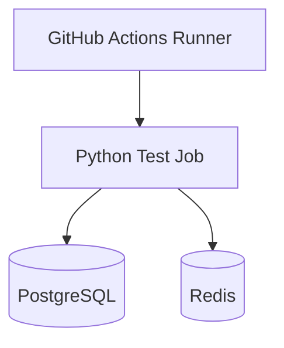

# 12- Coverage and Test Reports

## Overview

Test coverage and test reports turn automated test execution into measurable CI evidence.

A test command such as:

```bash
pytest
```

answers whether the tests passed. Coverage reporting answers which parts of the application were exercised. Test reports provide structured evidence that can be consumed by developers, CI systems, pull requests, quality gates, and debugging workflows.

A production Python pipeline commonly follows:

```text
Pull Request
    ↓
Install Dependencies
    ↓
Unit / Integration Tests
    ↓
Coverage Collection
    ↓
Test Report Generation
    ↓
Upload Reports
    ↓
Quality Gate
    ↓
Build
```

For backend systems such as Django and FastAPI, coverage and reports are useful for identifying untested application paths, tracking regressions, diagnosing CI failures, and preserving test evidence from ephemeral GitHub Actions runners.

Coverage is not itself a measure of software quality. A codebase can have high line coverage and still contain weak assertions, missing integration scenarios, incorrect business rules, or untested failure paths.

## Navigation

| # | File | Description |
|---|---|---|
| 01 | [01- Running Jobs in Containers](./01-%20Running%20Jobs%20in%20Containers.md) | GitHub Actions can execute an entire job inside a container, allowing the workflow to use a controlled Linux environment instead of relying... |
| 02 | [02- Service Containers](./02-%20Service%20Containers.md) | Service containers provide temporary supporting services to a GitHub Actions job. |
| 03 | [03- Container Networking](./03-%20Container%20Networking.md) | Container networking is a critical part of GitHub Actions integration testing and containerized CI/CD. |
| 04 | [04- PostgreSQL Service Containers](./04-%20PostgreSQL%20Service%20Containers.md) | PostgreSQL is one of the most common service dependencies for backend integration tests. |
| 05 | [05- MySQL Service Containers](./05-%20MySQL%20Service%20Containers.md) | MySQL service containers provide a disposable MySQL instance alongside a GitHub Actions job for integration and database testing. |
| 06 | [06- Redis Service Containers](./06-%20Redis%20Service%20Containers.md) | Redis is commonly used by backend applications for caching, task queues, distributed coordination, rate limiting, sessions, and other low-la... |
| 07 | [07- Unit Testing Pipelines](./07-%20Unit%20Testing%20Pipelines.md) | Unit testing is the fastest and most frequently executed validation layer in a production CI/CD pipeline. |
| 08 | [08- Integration Testing Pipelines](./08-%20Integration%20Testing%20Pipelines.md) | Integration testing validates that application components work correctly across real dependency boundaries. |
| 09 | [09- API Testing Pipelines](./09-%20API%20Testing%20Pipelines.md) | API testing validates the behavior of an application through its externally exposed interfaces rather than testing only internal functions. |
| 10 | [10- End to End Testing Pipelines](./10-%20End%20to%20End%20Testing%20Pipelines.md) | End-to-end (E2E) testing validates a complete application workflow through interfaces and infrastructure that closely resemble the real syst... |
| 11 | [11- Test Matrix Design](./11-%20Test%20Matrix%20Design.md) | Test matrices allow GitHub Actions to execute the same job against multiple combinations of environments, runtimes, databases, operating sys... |
| 12 | [12- Coverage and Test Reports](./12-%20Coverage%20and%20Test%20Reports.md) | Test coverage and test reports turn automated test execution into measurable CI evidence. |

## Test Results vs Coverage

These are related but different concerns.

| Concern | Question answered |
|---|---|
| Test result | Did the test suite pass or fail? |
| Test report | Which tests ran and what happened to each test? |
| Coverage | Which executable code was exercised? |
| Coverage report | Which files, modules, branches, or lines were covered? |
| Quality gate | Should the pipeline continue based on defined criteria? |

A mature CI pipeline uses all of them where appropriate.

## Why Coverage Exists

Coverage provides visibility into exercised code paths.

For example:

```text
orders/service.py
    240 executable lines
    216 covered
    24 uncovered
```

This can identify areas where tests may be missing.

Coverage is especially useful when:

- Refactoring backend services.
- Adding new API endpoints.
- Reviewing pull requests.
- Tracking regressions.
- Enforcing minimum coverage policies.
- Identifying neglected modules.
- Comparing test effectiveness over time.

## Coverage Is Not Test Quality

Consider:

```python
def calculate_discount(total: float) -> float:
    if total >= 1000:
        return total * 0.10

    return 0
```

A test that executes the function once may increase line coverage without validating the business behavior correctly.

Good tests should validate meaningful behavior:

```python
def test_calculate_discount_for_large_order():
    assert calculate_discount(1500) == 150
```

Coverage measures execution, not correctness.

A useful engineering model is:

```text
Coverage
+
Assertions
+
Boundary Cases
+
Failure Cases
+
Integration Behavior
=
Stronger Test Evidence
```

## Coverage Types

Common coverage measurements include:

| Type | Measures |
|---|---|
| Line coverage | Executed source lines |
| Statement coverage | Executed statements |
| Branch coverage | Branch outcomes exercised |
| Function coverage | Functions invoked |
| Condition coverage | Individual boolean conditions |
| Path coverage | Execution paths |

Python projects commonly use `coverage.py`, often through `pytest-cov`.

## Line Coverage

Line coverage asks whether executable lines were executed.

Example:

```python
def create_user(name: str, active: bool):
    user = User(name=name)

    if active:
        user.activate()

    user.save()
    return user
```

A test covering only:

```text
active=True
```

may leave the `active=False` branch untested.

Line coverage alone may therefore provide incomplete information about control flow.

## Branch Coverage

Branch coverage measures whether alternative execution paths were exercised.

Run pytest with branch coverage:

```bash
pytest --cov=app --cov-branch
```

A branch-oriented test suite might include:

```python
def test_create_active_user():
    ...

def test_create_inactive_user():
    ...
```

Branch coverage is particularly useful for backend code containing:

- Authorization decisions.
- Validation rules.
- Error handling.
- Feature flags.
- Retry logic.
- Conditional database operations.

## Function Coverage

Function coverage identifies functions that were never executed.

This is useful for detecting:

- Dead code.
- Untested services.
- Missing endpoint tests.
- Utility modules without tests.

However, executing a function does not prove that its behavior is correctly tested.

## Path Coverage

Path coverage attempts to reason about complete execution paths.

For non-trivial backend systems, complete path coverage can become impractical because combinations grow rapidly.

For example:

```text
3 conditions
→ potentially many execution combinations
```

Therefore, production test strategies generally prioritize meaningful branches and business scenarios rather than attempting exhaustive path enumeration.

## `pytest-cov`

For Python projects using pytest, `pytest-cov` provides a convenient interface to coverage measurement.

Install:

```bash
python -m pip install pytest pytest-cov
```

Run:

```bash
pytest --cov=app
```

Generate a terminal report:

```bash
pytest \
  --cov=app \
  --cov-report=term-missing
```

The `term-missing` report identifies uncovered lines.

## Coverage Configuration

Coverage configuration should normally live in project configuration rather than being duplicated across workflow files.

For example, `pyproject.toml`:

```toml
[tool.coverage.run]
branch = true
source = ["app"]

[tool.coverage.report]
show_missing = true
skip_covered = false
fail_under = 85
```

This centralizes policy.

The workflow can then remain simple:

```yaml
- name: Run tests with coverage
  run: pytest --cov=app
```

## Coverage Scope

Define what should be measured.

Prefer:

```bash
pytest --cov=app
```

over accidentally measuring every installed package in the environment.

Coverage scope should normally include application code while excluding:

- Virtual environments.
- Generated files.
- Migration files when intentionally excluded.
- Test code.
- Build output.
- Generated clients.
- Tooling that is outside the project's test responsibility.

## Coverage Exclusions

Coverage exclusions should be intentional.

For example:

```toml
[tool.coverage.report]
exclude_also = [
    "if TYPE_CHECKING:",
    "@overload",
]
```

Avoid broadly excluding difficult code simply to increase the reported percentage.

Bad practice:

```text
Untested code
    ↓
Exclude it
    ↓
Coverage increases
```

The metric becomes misleading.

## Coverage Thresholds

A project can define a minimum threshold:

```toml
[tool.coverage.report]
fail_under = 85
```

If the resulting coverage is below the threshold, the test command can fail.

This turns coverage into a CI quality gate.

However, thresholds should be treated as engineering policy rather than universal quality standards.

## Global vs Changed-Code Coverage

Two common policies are:

### Global Coverage

```text
Entire application ≥ threshold
```

This is simple and useful for long-term regression control.

### Changed-Code Coverage

```text
Changed code must meet threshold
```

This prevents new code from reducing quality while allowing legacy areas to be improved incrementally.

A mature organization may use both:

```text
Global baseline
+
Changed-code protection
```

## Coverage Regression

Suppose:

```text
Before PR: 91%
After PR: 86%
```

The decrease may indicate:

- New untested code.
- Removed tests.
- New branches.
- Refactoring.
- Changes in coverage scope.

Do not automatically treat every percentage decrease as a defect without examining why the metric changed.

## Coverage in Django

A Django application can collect coverage across:

- Models.
- Views.
- Serializers.
- Services.
- Permissions.
- Management commands.
- Tasks.
- Utility modules.

Example:

```bash
pytest \
  --cov=myproject \
  --cov-report=term-missing
```

A typical Django pipeline may include:

```text
Django
 ↓
PostgreSQL Service Container
 ↓
Migrations
 ↓
pytest
 ↓
Coverage
 ↓
JUnit XML
 ↓
Artifacts
```

## Coverage in FastAPI

FastAPI tests commonly use `pytest` and `TestClient` or an asynchronous HTTP client.

Example:

```bash
pytest \
  --cov=app \
  --cov-report=term-missing
```

Coverage should include:

- API routes.
- Dependency functions.
- Service layer.
- Validation.
- Error handling.
- Database integration where applicable.

## Coverage and Celery

Celery workers can require separate test coverage considerations.

For example:

```text
HTTP API
   ↓
Celery Task
   ↓
Worker
```

Testing only the API submission path does not necessarily prove that the worker behavior is correct.

Test the task logic directly and use integration tests where task execution semantics need validation.

## Coverage and Async Code

Async Python code should be tested using appropriate async test support.

Coverage tools can measure async code, but the test suite must actually exercise:

- Success paths.
- Timeout behavior.
- Exceptions.
- Cancellation where relevant.
- External service failures.

Coverage does not compensate for missing asynchronous failure scenarios.

## Test Reports

A test report provides structured information about individual test execution.

Typical formats include:

- JUnit XML.
- JSON.
- HTML.
- Terminal output.

JUnit XML is commonly used by CI systems and reporting tools.

Example:

```bash
pytest --junitxml=test-results.xml
```

## JUnit XML

A pytest command can produce:

```bash
pytest \
  --junitxml=test-results.xml
```

The generated report contains structured test information such as:

- Test cases.
- Pass/fail status.
- Errors.
- Failures.
- Duration.

This is more machine-readable than raw console output.

## Combining Coverage and JUnit Reports

A practical command is:

```bash
pytest \
  --cov=app \
  --cov-report=term-missing \
  --cov-report=xml:coverage.xml \
  --junitxml=test-results.xml
```

This produces:

```text
coverage.xml
test-results.xml
terminal output
```

The artifacts can then be uploaded by GitHub Actions.

## Coverage Report Formats

Common coverage formats include:

| Format | Purpose |
|---|---|
| Terminal | Fast local/CI visibility |
| XML | CI and external tooling |
| HTML | Human investigation |
| JSON | Automation and analysis |
| LCOV | Tooling compatibility |

Example:

```bash
pytest \
  --cov=app \
  --cov-report=term-missing \
  --cov-report=xml:coverage.xml \
  --cov-report=html:htmlcov
```

## HTML Coverage Reports

HTML coverage is useful when developers need to inspect uncovered code.

Generate:

```bash
pytest \
  --cov=app \
  --cov-report=html
```

The report is typically generated under:

```text
htmlcov/
```

In CI, this directory can be uploaded as an artifact.

## GitHub Actions Test Reporting

A basic workflow:

```yaml
jobs:
  test:
    runs-on: ubuntu-latest

    steps:
      - uses: actions/checkout@v4

      - uses: actions/setup-python@v6
        with:
          python-version: "3.12"

      - name: Install dependencies
        run: |
          python -m pip install --upgrade pip
          pip install -r requirements.txt
          pip install pytest pytest-cov

      - name: Run tests
        run: |
          pytest \
            --cov=app \
            --cov-report=term-missing \
            --cov-report=xml:coverage.xml \
            --junitxml=test-results.xml
```

## Uploading Test Reports

GitHub-hosted runners are ephemeral. Files generated during a job should be uploaded if they need to survive the job.

```yaml
- name: Upload test reports
  if: ${{ !cancelled() }}
  uses: actions/upload-artifact@v4
  with:
    name: test-reports
    path: |
      test-results.xml
      coverage.xml
      htmlcov/
```

Using `!cancelled()` allows reports to be uploaded after normal failures while avoiding unnecessary execution after cancellation.

## Artifact Naming in Matrix Jobs

When tests run through a matrix, artifact names should identify the matrix combination.

```yaml
- name: Upload test reports
  if: ${{ !cancelled() }}
  uses: actions/upload-artifact@v4
  with:
    name: reports-${{ matrix.python-version }}-${{ matrix.database }}
    path: |
      test-results.xml
      coverage.xml
```

This prevents confusion between:

```text
Python 3.11 + PostgreSQL
```

and:

```text
Python 3.12 + PostgreSQL
```

## Matrix Coverage Architecture

A matrix might look like:

```text
                  ┌── Python 3.11 ── Coverage
                  │
Pull Request ─────┼── Python 3.12 ── Coverage
                  │
                  └── Python 3.13 ── Coverage
                            ↓
                       Test Reports
                            ↓
                         Artifacts
```

Each matrix job produces independent evidence.

Do not automatically interpret separate coverage percentages as one combined coverage value.

## Aggregating Matrix Reports

If an organization needs one combined report, use an explicit aggregation job.

```text
Matrix Tests
    ├── Report A
    ├── Report B
    └── Report C
          ↓
      Aggregation Job
          ↓
   Combined Report
```

Artifacts are useful for transferring these reports between jobs.

The aggregation process must be designed around the coverage tool and data format being used.

## Coverage Across Different Python Versions

Suppose:

```text
Python 3.11 → 90%
Python 3.12 → 91%
```

These are separate measurements.

Do not calculate:

```text
(90 + 91) / 2
```

and call that the application's coverage without establishing what the combined metric represents.

If the test set is identical, the differences may be useful diagnostically, but the coverage data should be interpreted according to the actual collection and aggregation model.

## Test Reports and Failed Tests

Reports should remain available when tests fail.

Use:

```yaml
if: ${{ !cancelled() }}
```

for artifact collection when the report-producing step may have failed.

For a simple test job:

```yaml
- name: Run tests
  id: tests
  run: pytest --junitxml=test-results.xml

- name: Upload reports
  if: ${{ !cancelled() }}
  uses: actions/upload-artifact@v4
  with:
    name: test-results
    path: test-results.xml
```

This preserves useful evidence.

## `always()` vs `!cancelled()`

A common mistake is to use:

```yaml
if: always()
```

everywhere.

`always()` can cause a step to execute even when the workflow has been cancelled.

For report collection, this can be undesirable.

A more deliberate pattern is:

```yaml
if: ${{ !cancelled() }}
```

when reports should be preserved after failures but not after explicit cancellation.

The exact behavior should be selected based on the required workflow semantics.

## Coverage as a Quality Gate

A quality gate can fail CI when coverage falls below a defined threshold.

Example:

```toml
[tool.coverage.report]
fail_under = 85
```

The workflow then simply runs:

```yaml
- name: Test and enforce coverage
  run: pytest --cov=app
```

If the threshold is violated, the step fails.

## Quality Gate Design

A quality gate should be:

- Deterministic.
- Explainable.
- Consistent.
- Relevant to the repository.
- Difficult to bypass accidentally.

Avoid gates that developers cannot understand or reproduce locally.

A failed CI message should make it clear:

```text
Required coverage: 85%
Actual coverage: 82%
```

## Coverage and Pull Requests

Coverage can be used as pull-request evidence.

A useful workflow is:

```text
Pull Request
    ↓
Tests
    ↓
Coverage
    ↓
JUnit / Coverage Reports
    ↓
PR Feedback
```

The purpose is to help reviewers understand whether changes introduced untested behavior.

## Coverage and Changed Code

A legacy repository may have:

```text
Global coverage = 62%
```

A new global threshold of:

```text
90%
```

could prevent all future changes even when the new code is well tested.

A gradual strategy can instead establish:

```text
Existing code → Improvement backlog
New/changed code → Strong coverage requirement
```

This prevents technical debt from blocking all delivery while still preventing new regression.

## Coverage and Branches

Branch coverage is particularly important for code like:

```python
if user.is_staff:
    ...
else:
    ...
```

or:

```python
if cache_hit:
    ...
else:
    database_query()
```

Backend systems contain many decision points around:

- Authentication.
- Authorization.
- Validation.
- Cache behavior.
- Retry behavior.
- Feature flags.
- Database failures.
- External API responses.

Testing only the successful path can leave important production behavior unverified.

## Coverage of Error Handling

Error-handling code is often poorly covered.

Examples:

```python
try:
    response = client.get(...)
except TimeoutError:
    ...
```

A test suite should consider:

```text
Success
Timeout
Connection failure
Invalid response
Unexpected response
```

Coverage can reveal whether those branches are exercised.

## Coverage and Mocking

Excessive mocking can produce misleading coverage.

For example:

```python
mock_client.get.return_value = ...
```

may exercise the service function without validating the actual integration behavior.

Use the appropriate test layer:

```text
Unit Test
→ Isolate business logic

Integration Test
→ Validate real component interaction

E2E Test
→ Validate complete behavior
```

Coverage should be interpreted across these layers.

## Test Reports and Integration Tests

Integration tests may produce reports containing:

- Database failures.
- API failures.
- Service startup failures.
- Timeout information.
- Fixture failures.

For Django or FastAPI:

```text
Application
   ↓
PostgreSQL
   ↓
Redis
   ↓
pytest
   ↓
JUnit XML
   ↓
Coverage XML
   ↓
Artifacts
```

This gives developers evidence beyond a single failed command.

## Coverage and Service Containers

A service container failure may prevent tests from running.

In that situation:

```text
Coverage = incomplete or unavailable
```

The root cause is infrastructure readiness, not application coverage.

Therefore, CI diagnostics should distinguish:

```text
Test Failure
```

from:

```text
Test Environment Failure
```

## Test Report Retention

Artifact retention should match operational needs.

Consider:

- Pull-request debugging window.
- Release audit requirements.
- Compliance requirements.
- Storage cost.
- Incident investigation needs.

Do not retain every large HTML report indefinitely without a reason.

## Coverage Storage and Cost

HTML coverage reports can be significantly larger than XML reports.

For routine CI:

```text
JUnit XML
Coverage XML
```

may be sufficient.

HTML coverage can be uploaded for failed or important workflows.

A common strategy is:

```text
PR:
JUnit + XML

Nightly:
JUnit + XML + HTML

Release:
JUnit + XML + HTML + retained artifacts
```

The exact policy depends on organizational requirements.

## Security Considerations

Test reports can contain sensitive information.

Potential leakage includes:

- Database connection strings.
- Environment variables.
- Request headers.
- Tokens printed by tests.
- Internal URLs.
- User data.
- Stack traces containing sensitive paths.

Do not assume test artifacts are safe merely because they are generated by CI.

Review what tests write to:

```text
stdout
stderr
JUnit XML
coverage reports
HTML reports
debug logs
```

## Secrets in Test Output

Never intentionally print:

```yaml
run: echo "${{ secrets.API_KEY }}"
```

Do not include secrets in exception messages or test reports.

Even with GitHub masking, relying on masking as the only security control is unsafe.

Prefer test fixtures with synthetic credentials.

## Pull Requests From Forks

Tests for forked pull requests operate under different security constraints.

Do not redesign test reporting by granting broad secrets merely to make an external integration test pass.

Separate:

```text
Untrusted PR Validation
```

from:

```text
Trusted Deployment / Privileged Validation
```

when necessary.

## Coverage Artifacts and Access

Coverage artifacts may expose source-code structure.

Consider repository and artifact access policies when handling:

- Private source code.
- Internal services.
- Sensitive test data.

Use synthetic test data wherever possible.

## Coverage and Dependency Caching

Caching can reduce the time required to install testing dependencies.

Example:

```yaml
- name: Set up Python
  uses: actions/setup-python@v6
  with:
    python-version: "3.12"
    cache: pip
```

Coverage itself should not normally be treated as a cache.

A coverage report is an output artifact.

## Artifact vs Cache

| Artifact | Cache |
|---|---|
| Stores build/test output | Stores reusable dependency data |
| Intended for retrieval | Intended for performance |
| Can contain reports | Usually contains packages/build state |
| Should be traceable to a run | Can be invalidated/replaced |
| Used for evidence | Used to speed execution |

Do not use caches as a substitute for preserving test reports.

## Test Report Naming

Use predictable names:

```text
test-results.xml
coverage.xml
htmlcov/
```

For matrix jobs:

```text
test-results-3.12-postgres.xml
coverage-3.12-postgres.xml
```

or encode the matrix values in artifact names.

Consistent naming simplifies downstream automation.

## GitHub Actions Summary

A concise test summary can be written to `GITHUB_STEP_SUMMARY`.

Example:

```yaml
- name: Add test summary
  if: ${{ !cancelled() }}
  run: |
    {
      echo "## Test Results"
      echo ""
      echo "- Test report: \`test-results.xml\`"
      echo "- Coverage report: \`coverage.xml\`"
    } >> "$GITHUB_STEP_SUMMARY"
```

The step summary is useful for high-level CI visibility without replacing detailed artifacts.

## Annotations

GitHub Actions annotations can highlight errors and warnings.

For example:

```bash
echo "::error file=app/service.py,line=42::Test expectation failed"
```

Use annotations selectively.

Do not generate thousands of annotations from a large test suite because they can make CI output difficult to navigate.

## Test Reports in a Production Pipeline

A mature pipeline might be:

```mermaid
flowchart LR
    A[Pull Request] --> B[Lint]
    B --> C[Unit Tests]
    C --> D[Integration Tests]
    D --> E[Coverage]
    E --> F[Test Reports]
    F --> G[Artifacts]
    G --> H[Security Scan]
    H --> I[Build]
    I --> J[Immutable Docker Image]
    J --> K[Staging]
    K --> L[Approval]
    L --> M[Production]
```



Coverage and reports belong in the validation stage.

They provide evidence before an artifact is promoted.

## Build Promotion

Test reports should not become a reason to rebuild an artifact for every environment.

Prefer:

```text
Test
 ↓
Build
 ↓
Immutable Artifact
 ↓
Staging
 ↓
Approval
 ↓
Production
```

If the same Docker image is promoted, the artifact validated by CI is the artifact deployed to production.

## Coverage and Docker

Coverage can run inside a CI container:

```yaml
jobs:
  test:
    runs-on: ubuntu-latest

    container:
      image: python:3.12-slim

    steps:
      - uses: actions/checkout@v4

      - run: pip install -r requirements.txt

      - run: |
          pytest \
            --cov=app \
            --cov-report=xml:coverage.xml \
            --junitxml=test-results.xml
```

This can improve environment consistency.

## Coverage and PostgreSQL

Integration testing with PostgreSQL may use a service container:

```yaml
services:
  postgres:
    image: postgres:16
    env:
      POSTGRES_USER: test
      POSTGRES_PASSWORD: test
      POSTGRES_DB: app_test
    ports:
      - 5432:5432
```

The tests can then produce:

```text
PostgreSQL Integration Tests
        ↓
Coverage
        ↓
JUnit XML
        ↓
Artifacts
```

## Coverage and Redis

For applications using Redis:

```text
Django/FastAPI
      ↓
Redis
      ↓
Integration Tests
      ↓
Coverage
```

Redis-related behavior should be covered where it affects application correctness:

- Cache hit.
- Cache miss.
- Expiration.
- Serialization.
- Failure handling.

## Coverage and Kafka

For Kafka-backed services, coverage should not be interpreted as proof that event-driven behavior is correct.

Test:

```text
Producer
 ↓
Event
 ↓
Consumer
 ↓
Business Logic
 ↓
Database
```

where appropriate.

Coverage complements integration and contract testing rather than replacing it.

## Coverage in Microservices

For a microservice architecture:

```text
Service A
Service B
Service C
```

each service should normally own its test and coverage policy.

A central pipeline can standardize:

```text
Test
Coverage
Report Format
Artifact Naming
Threshold Policy
```

without assuming every service has identical test requirements.

## Coverage and Monorepos

Monorepos may have multiple applications:

```text
services/
  users/
  orders/
  payments/
```

Coverage should normally be scoped to the relevant service.

A changed-service matrix can produce:

```text
users → coverage
orders → coverage
```

rather than measuring unrelated services on every change.

## Coverage and Selective Testing

Selective testing introduces an important distinction:

```text
Measured Coverage
```

may represent only the code exercised by selected tests.

Therefore, the pipeline should document what the metric represents.

A coverage number without scope is difficult to interpret.

## Coverage Baselines

For long-lived repositories, track coverage over time.

Useful metrics include:

```text
Global coverage
Branch coverage
Changed-code coverage
Coverage trend
Uncovered critical modules
```

Avoid optimizing exclusively for a single percentage.

## Coverage of Critical Code

Some modules are more important than others.

Examples:

- Authentication.
- Authorization.
- Payment processing.
- Financial calculations.
- Data integrity.
- Security controls.

A global coverage threshold may not guarantee sufficient testing of these components.

Use targeted tests and review policies for critical paths.

## Test Reports and Failure Diagnosis

A useful CI diagnostic model is:

```text
Symptom
  ↓
Identify Failed Test
  ↓
Inspect JUnit Report
  ↓
Inspect Coverage
  ↓
Inspect Logs
  ↓
Determine Failure Domain
  ↓
Fix
  ↓
Rerun
```

Coverage can help identify whether the failing path was actually exercised.

## Common Mistakes

### Treating Coverage as Quality

High coverage does not guarantee correct assertions or meaningful scenarios.

### Setting an Arbitrarily High Threshold

A threshold should reflect engineering goals and repository maturity.

### Excluding Difficult Code

Exclusions should reflect intentional tooling or generated-code boundaries, not test avoidance.

### Uploading Reports Only on Success

Failed test runs often contain the most valuable diagnostic evidence.

### Using `always()` Without Understanding Cancellation

This can cause cleanup or reporting steps to execute during cancellation when that is not desired.

### Overwriting Matrix Artifacts

Parallel jobs need uniquely identifiable artifact names.

### Combining Coverage Percentages Incorrectly

Independent percentages cannot automatically be averaged into a meaningful aggregate.

### Ignoring Error Paths

Successful-path coverage can still leave production failure behavior untested.

### Testing Only Through Mocks

Mocks can produce high coverage while leaving real integration behavior unverified.

### Printing Sensitive Data

Test logs and reports can persist beyond the job and should be treated as potentially sensitive artifacts.

## Performance Considerations

Coverage introduces runtime overhead because execution must be measured.

For most backend CI workloads this is acceptable, but large repositories should measure the impact.

Potential optimizations include:

- Scope coverage to application packages.
- Avoid unnecessary coverage instrumentation.
- Split test suites intelligently.
- Cache dependencies.
- Run tests in parallel where safe.
- Upload only required reports.
- Use focused PR coverage and broader scheduled validation.

## Parallel Test Execution

A large test suite can be distributed across workers or matrix jobs.

For example:

```text
Test Suite
 ├── Group A
 ├── Group B
 ├── Group C
 └── Group D
```

Each group can generate separate reports.

If coverage is combined, the aggregation process must preserve the coverage data required by the coverage tool.

## Reliability Considerations

Test reporting should not hide the original failure.

For example:

```yaml
- name: Run tests
  run: pytest --junitxml=test-results.xml

- name: Upload reports
  if: ${{ !cancelled() }}
  uses: actions/upload-artifact@v4
  with:
    name: test-reports
    path: test-results.xml
```

The report-upload step should not accidentally turn a test failure into a successful workflow.

The test step remains the quality gate.

## Report Upload Failure

Artifact upload can fail independently from test execution.

For critical pipelines, decide whether report-upload failure should:

- Fail the workflow.
- Be tolerated.
- Trigger operational investigation.

Do not blindly use `continue-on-error: true` for every reporting step.

The correct policy depends on whether the report is optional evidence or a required compliance artifact.

## Coverage and Release Gates

For release pipelines, coverage can be one input into release readiness:

```text
Tests Pass
+
Coverage Policy Passes
+
Security Scan Passes
+
Build Succeeds
=
Eligible Artifact
```

Coverage should not be the only gate.

## Coverage and Security Testing

Coverage does not replace:

- Dependency scanning.
- SAST.
- Secret scanning.
- Container scanning.
- DAST.
- Security-focused tests.

A security-sensitive branch can be covered while still containing a vulnerability.

## Coverage and Code Review

Reviewers should ask:

```text
What behavior changed?
What tests cover the change?
Which failure paths are tested?
Did coverage change?
Are integration tests required?
```

A coverage percentage can provide supporting evidence but should not replace engineering review.

## GitHub CLI Operations

List workflow runs:

```bash
gh run list
```

Inspect a run:

```bash
gh run view RUN_ID
```

View logs:

```bash
gh run view RUN_ID --log
```

Download artifacts:

```bash
gh run download RUN_ID
```

Rerun a failed workflow:

```bash
gh run rerun RUN_ID
```

These commands are useful when investigating test reports generated by CI.

## Production Architecture

A production-grade Python CI pipeline can be structured as:

```text
Pull Request
      ↓
Change Detection
      ↓
Test Matrix
      ├── Python 3.11
      ├── Python 3.12
      └── Selected Integration Environment
      ↓
JUnit Reports
      +
Coverage Reports
      ↓
Artifacts
      ↓
Quality Gates
      ↓
Security Scan
      ↓
Build Docker Image
      ↓
Push Immutable Image
      ↓
ECR
      ↓
Staging
      ↓
Approval
      ↓
Production
      ↓
Monitoring
      ↓
Rollback if Required
```

The key design principle is that test evidence is generated before artifact promotion.

## Senior-Level Design Considerations

A senior engineer should treat coverage and reports as observability for the test system.

Important questions include:

- What exactly does the coverage number measure?
- Which code is intentionally excluded?
- Which tests are required for each change?
- Which reports must survive the CI job?
- How are matrix reports distinguished?
- How are reports aggregated?
- What happens when tests fail?
- What happens when report upload fails?
- Are reports safe to expose to pull-request contributors?
- How long should reports be retained?
- Which quality gates are mandatory?
- How is legacy coverage improved?
- How are critical paths tested beyond global coverage?
- How does the strategy scale as the repository grows?

## Production Checklist

- [ ] Coverage scope is explicitly defined.
- [ ] Coverage measurement uses a reproducible configuration.
- [ ] Branch coverage is enabled where decision-heavy backend code justifies it.
- [ ] Coverage thresholds are intentional and documented.
- [ ] Coverage is not treated as a direct measure of test quality.
- [ ] JUnit or equivalent structured test reports are generated.
- [ ] Coverage reports are generated in a machine-readable format.
- [ ] HTML coverage is generated when human investigation benefits from it.
- [ ] Test reports are uploaded as artifacts when required.
- [ ] Failed tests still preserve useful reports.
- [ ] Matrix artifacts have unique names.
- [ ] Coverage from separate matrix jobs is interpreted correctly.
- [ ] Aggregation is explicit when a combined report is required.
- [ ] Test artifacts do not contain secrets or sensitive data.
- [ ] Coverage exclusions are intentional.
- [ ] Critical business paths receive targeted tests.
- [ ] Unit, integration, API, and E2E coverage responsibilities are distinguished.
- [ ] Coverage thresholds do not hide legacy technical debt.
- [ ] Changed-code coverage is considered where global thresholds are impractical.
- [ ] Artifact retention matches operational and compliance requirements.
- [ ] CI cost and report-generation overhead are monitored.
- [ ] Report upload behavior during failures and cancellation is intentional.
- [ ] Test reports support practical failure diagnosis.
- [ ] Coverage and test results are generated before deployment artifact promotion.

## Interview Scenarios

### How Is Coverage Different From a Test Report?

Coverage measures which code was exercised. A test report records the outcome and metadata of individual tests.

### Does 100% Coverage Mean the Code Is Correct?

No. Coverage measures execution, not correctness. Tests can execute every line while making weak assertions or missing important business scenarios.

### Why Use Branch Coverage?

Branch coverage identifies whether alternative decision paths have been exercised, which is especially useful for authorization, validation, error handling, retries, and feature flags.

### How Would You Enforce a Minimum Coverage Threshold?

Configure the coverage tool with a threshold and make the test command fail when the threshold is not met.

For example:

```toml
[tool.coverage.report]
fail_under = 85
```

### Why Upload Reports as Artifacts?

GitHub-hosted runners are ephemeral. Artifacts preserve test evidence after the job finishes and make reports available for debugging, review, and operational analysis.

### Why Should Reports Be Uploaded After a Failed Test?

Failures often produce the most useful diagnostic evidence. Report collection should therefore be designed to run after test failures while respecting cancellation behavior.

### Why Not Use `always()` for Every Reporting Step?

`always()` can cause a step to run even during cancellation. Reporting behavior should deliberately distinguish ordinary failures from cancelled workflows.

### How Would You Handle Coverage in a Matrix?

Generate coverage independently for each matrix combination and identify artifacts using matrix values.

For example:

```yaml
name: coverage-${{ matrix.python-version }}-${{ matrix.database }}
```

If combined coverage is required, explicitly aggregate coverage data rather than averaging percentages.

### How Would You Test a Django Application?

A production-oriented pipeline could use:

```text
Django
 ↓
PostgreSQL
 ↓
pytest
 ↓
pytest-cov
 ↓
JUnit XML
 ↓
Coverage XML
 ↓
Artifacts
```

### How Would You Handle a Legacy Repository With 50% Coverage?

Avoid immediately imposing an unrealistic global threshold. Establish a baseline, prevent new code from reducing coverage, prioritize critical areas, and incrementally improve the existing codebase.

### How Would You Investigate a Coverage Drop?

Compare:

```text
Changed files
Coverage scope
Added branches
Removed tests
Dependency/test configuration changes
Coverage exclusions
```

Then inspect the uncovered lines rather than reacting only to the percentage.

### What Is the Difference Between Coverage and Integration Testing?

Coverage measures executed code. Integration testing validates interactions between real components such as a Django application, PostgreSQL, Redis, external services, or message brokers.

### How Would You Protect Test Reports From Sensitive Data?

Use synthetic test data, avoid logging secrets, inspect generated reports, restrict artifact access appropriately, and treat test artifacts as potentially sensitive outputs.

### Should Coverage Be the Only CI Quality Gate?

No. Production quality requires multiple signals, including functional tests, integration tests, security scanning, static analysis, build validation, and deployment verification.

## Key Takeaways

- Coverage measures exercised code, while test reports provide structured evidence about individual test execution; neither metric independently represents software quality.
- Configure coverage centrally, use branch coverage where meaningful, and enforce thresholds deliberately rather than optimizing for an arbitrary percentage.
- GitHub Actions should preserve JUnit, coverage, and debugging reports as artifacts, including after test failures, while handling cancellation and artifact-upload failures intentionally.
- Matrix jobs produce independent coverage evidence; combined coverage must be explicitly aggregated rather than inferred by averaging percentages.
- Production-grade reporting requires security-aware artifacts, meaningful quality gates, appropriate retention, clear failure diagnostics, and integration with the broader CI/CD promotion pipeline.
You said:
Pasted text(20260928-144203).txt
Document
ChatGPT said:
Code
# README

## Overview

The `05- Containers and Testing` section covers how GitHub Actions executes backend test workloads in containerized environments and how those tests become reliable CI evidence.

The focus is not simply on running `pytest`. A production CI pipeline must also manage the execution environment, dependent services, test isolation, matrix strategies, coverage, test reports, artifacts, failures, and operational diagnostics.

The overall flow is:

```text
GitHub Actions
    ↓
Test Environment
    ↓
Application Container / Runner
    ↓
Service Containers
    ├── PostgreSQL
    ├── MySQL
    └── Redis
    ↓
Unit / Integration / API / E2E Tests
    ↓
Test Matrix
    ↓
Coverage
    ↓
Test Reports
    ↓
Artifacts
    ↓
Quality Gates
```

This section is particularly relevant to Python backend systems built with Django, FastAPI, pytest, PostgreSQL, MySQL, Redis, Celery, and containerized CI environments.

## Section Scope

The documents in this section build from the execution environment toward production-grade test evidence and CI design.

| Document | Focus |
|---|---|
| `01- Running Jobs in Containers.md` | Running GitHub Actions jobs inside containers |
| `02- Service Containers.md` | Using dependent containers for CI services |
| `03- Redis Service Containers.md` | Redis service containers and backend integration testing |
| `04- PostgreSQL Service Containers.md` | PostgreSQL service containers and database testing |
| `05- MySQL Service Containers.md` | MySQL service containers and database testing |
| `06- End to End Testing.md` | End-to-end testing concepts and CI execution |
| `07- Unit Testing Pipelines.md` | Unit-test pipeline design |
| `08- Integration Testing Pipelines.md` | Integration-test pipeline design |
| `09- API Testing Pipelines.md` | API-focused CI testing |
| `10- End to End Testing Pipelines.md` | Production-oriented E2E testing pipelines |
| `11- Test Matrix Design.md` | Matrix-based test execution and compatibility testing |
| `12- Coverage and Test Reports.md` | Coverage collection, test reports, quality gates, and artifacts |

The exact files present in the repository should remain the source of truth for navigation. Entries should be added only when the corresponding document exists.

## Containers in GitHub Actions

GitHub Actions can execute backend test workloads in several environments:

```text
GitHub-hosted Runner
       │
       ├── Direct host execution
       │
       ├── Job Container
       │
       └── Service Containers
```

A job container provides the execution environment for the job:

```yaml
jobs:
  test:
    runs-on: ubuntu-latest

    container:
      image: python:3.12-slim
```

Service containers provide dependencies required by the tests:

```text
Application
    │
    ├── PostgreSQL
    ├── Redis
    └── Other Test Services
```

This distinction is fundamental.

A job container is where the workflow executes.

A service container provides a dependency used by that workflow.

## Service Container Architecture

A typical backend integration-test environment can look like:



For a Django or FastAPI application:

```text
pytest
   ↓
Application Code
   ├── PostgreSQL
   └── Redis
```

The CI environment should reproduce the relevant dependencies without unnecessarily reproducing the entire production infrastructure.

## Backend Testing Layers

The section covers multiple testing layers.

| Test Type | Primary Purpose |
|---|---|
| Unit tests | Validate isolated application behavior |
| Integration tests | Validate interactions between components |
| API tests | Validate HTTP/API contracts and behavior |
| Database tests | Validate persistence and database interactions |
| End-to-end tests | Validate complete user/system flows |
| Matrix tests | Validate compatibility across supported combinations |

These layers complement each other.

A high unit-test coverage percentage does not prove that PostgreSQL connectivity, Redis behavior, authentication, HTTP routing, or complete workflows work correctly.

## Python Testing Stack

A common Python CI stack is:

```text
Python
  ↓
pytest
  ↓
pytest plugins
  ↓
Coverage
  ↓
JUnit/Test Reports
  ↓
GitHub Actions Artifacts
```

For Django:

```text
Django
  ↓
pytest-django
  ↓
PostgreSQL
  ↓
pytest
  ↓
Coverage / Reports
```

For FastAPI:

```text
FastAPI
  ↓
pytest
  ↓
HTTP Test Client
  ↓
PostgreSQL / Redis
  ↓
Coverage / Reports
```

## Test Matrix Design

A matrix allows the same test workload to execute across multiple dimensions.

Example:

```yaml
strategy:
  matrix:
    python-version: ["3.11", "3.12", "3.13"]
```

A more advanced matrix can include databases:

```yaml
strategy:
  matrix:
    python-version: ["3.11", "3.12"]
    database: [postgres, mysql]
```

This creates multiple test environments:

```text
Python 3.11 + PostgreSQL
Python 3.11 + MySQL
Python 3.12 + PostgreSQL
Python 3.12 + MySQL
```

Matrix design should be deliberate because test combinations increase CI runtime and cost.

## Matrix Controls

Important matrix controls include:

- `include`
- `exclude`
- `fail-fast`
- `max-parallel`
- `needs`
- Matrix expressions
- Dynamic JSON matrices
- Matrix outputs

For large repositories, a dynamically generated matrix can avoid testing combinations that are irrelevant to a particular change.

## Compatibility Matrix vs Test Matrix

These concepts should not be treated as identical.

A compatibility matrix describes supported combinations.

A test matrix defines which combinations CI actually executes.

For example:

```text
Supported:
Python 3.11 + PostgreSQL
Python 3.12 + PostgreSQL
Python 3.13 + PostgreSQL
```

The CI pipeline might run all combinations on releases but only a subset on pull requests.

## Test Isolation

Tests should be isolated from:

- Previous test runs.
- Other matrix jobs.
- Developer-specific state.
- Production data.
- Persistent infrastructure.

For database integration tests, this commonly means creating a fresh test database per job.

For Redis, test isolation may require:

- Dedicated database numbers where appropriate.
- Unique keys.
- Explicit cleanup.
- Separate service instances.

## Readiness vs Availability

Starting a service container does not necessarily mean that the service is ready to accept requests.

For example:

```text
Container Started
      ↓
PostgreSQL Initialization
      ↓
Database Ready
```

Tests that start immediately may fail intermittently.

Health checks and readiness checks should therefore be part of the test environment design.

## Test Artifacts

GitHub Actions runners are ephemeral.

Important test outputs should be preserved as artifacts when required.

Typical artifacts include:

```text
test-results.xml
coverage.xml
htmlcov/
screenshots/
videos/
logs/
traces/
```

Artifact naming should be unique for matrix jobs:

```yaml
name: test-results-${{ matrix.python-version }}
```

## Coverage

Coverage measures which portions of application code were exercised by tests.

For Python:

```bash
pytest \
  --cov=app \
  --cov-report=term-missing \
  --cov-report=xml:coverage.xml
```

Coverage is useful for identifying untested code, but it is not a direct measure of test quality.

A high coverage percentage can still contain:

- Weak assertions.
- Missing failure scenarios.
- Incorrect expected values.
- Missing integration tests.
- Missing business-rule validation.

## Test Reports

Structured test reports make CI results easier to consume.

For pytest:

```bash
pytest --junitxml=test-results.xml
```

Coverage and test reports can be generated together:

```bash
pytest \
  --cov=app \
  --cov-report=xml:coverage.xml \
  --junitxml=test-results.xml
```

The resulting files can be uploaded:

```yaml
- name: Upload test reports
  if: ${{ !cancelled() }}
  uses: actions/upload-artifact@v4
  with:
    name: test-reports
    path: |
      test-results.xml
      coverage.xml
```

## Artifacts vs Caches

Artifacts and caches have different purposes.

| Artifacts | Caches |
|---|---|
| Preserve outputs | Speed up future execution |
| Test reports | Python dependencies |
| Coverage reports | Node dependencies |
| Build outputs | Docker build layers |
| Debugging files | Reusable package data |
| Run-specific evidence | Performance optimization |

A test report should be an artifact, not a dependency cache.

## Failure-Aware Reporting

Test reports are often most useful when tests fail.

A reporting step should therefore be designed to execute after a failed test while respecting cancellation.

A common pattern is:

```yaml
- name: Run tests
  run: pytest --junitxml=test-results.xml

- name: Upload test reports
  if: ${{ !cancelled() }}
  uses: actions/upload-artifact@v4
  with:
    name: test-reports
    path: test-results.xml
```

The test step remains the quality gate.

The report-upload step preserves evidence.

## Security Considerations

Test environments must be treated as execution environments, not trusted sandboxes.

Important concerns include:

- Secrets in tests.
- Untrusted pull requests.
- Third-party actions.
- Service-container images.
- Test-generated logs.
- Report contents.
- Self-hosted runners.

Never print credentials into test output.

Avoid using production credentials for ordinary CI testing.

Use synthetic test data and dedicated test infrastructure wherever possible.

## Pull Request Security

Pull-request workflows may execute code supplied by contributors.

Therefore:

```text
Untrusted Source
      ↓
CI Execution
      ↓
Potential Code Execution
```

The workflow should not unnecessarily expose:

- Cloud credentials.
- Production secrets.
- Private deployment credentials.
- High-privilege `GITHUB_TOKEN` permissions.

`pull_request_target` requires particular caution because it executes with the security context of the target repository while interacting with pull-request data.

## Third-Party Actions

Test pipelines frequently use actions for:

- Checkout.
- Python setup.
- Artifact upload.
- Coverage reporting.
- Docker.
- Security scanning.

Treat third-party actions as supply-chain dependencies.

Production pipelines should consider:

- Trusted sources.
- Version pinning.
- SHA pinning where required by organizational policy.
- Minimal permissions.
- Dependency monitoring.
- Action allowlists.

## Docker-Based Testing

Containers make test environments more reproducible.

A backend CI architecture can be:

```text
GitHub Runner
      ↓
Docker
      ├── Python Application
      ├── PostgreSQL
      └── Redis
```

This reduces differences between developer and CI environments.

However, containers do not automatically guarantee reproducibility. The image versions, dependencies, environment variables, initialization sequence, and test data strategy still matter.

## Docker and Integration Testing

A realistic integration-test environment might be:

```text
Python Application
       │
       ├───────────────┐
       ↓               ↓
 PostgreSQL          Redis
       │               │
       └───────┬───────┘
               ↓
             pytest
               ↓
       Coverage / Reports
```

This pattern is particularly useful for Django and FastAPI applications.

## Production Pipeline Relationship

The testing section feeds into the larger CI/CD pipeline:

```mermaid
flowchart LR
    PR[Pull Request]
    Lint[Lint]
    Unit[Unit Tests]
    Integration[Integration Tests]
    Matrix[Test Matrix]
    Coverage[Coverage]
    Reports[Test Reports]
    Security[Security Scan]
    Build[Build]
    Artifact[Immutable Artifact]
    Staging[Staging]
    Approval[Approval]
    Production[Production]

    PR --> Lint
    Lint --> Unit
    Unit --> Integration
    Integration --> Matrix
    Matrix --> Coverage
    Coverage --> Reports
    Reports --> Security
    Security --> Build
    Build --> Artifact
    Artifact --> Staging
    Staging --> Approval
    Approval --> Production
```



The objective is not simply to make tests pass.

The objective is to produce trustworthy evidence that supports artifact promotion.

## Immutable Artifact Promotion

A production pipeline should preferably follow:

```text
Validate
   ↓
Build
   ↓
Immutable Artifact
   ↓
Staging
   ↓
Approval
   ↓
Production
```

rather than:

```text
Build for Staging
   ↓
Rebuild for Production
```

Rebuilding can produce a different artifact from the one that was tested.

For Docker-based applications, an immutable image reference can be based on a commit SHA or another immutable identifier.

## AWS Integration

The testing section can feed deployment workflows targeting AWS services such as:

- ECR.
- ECS.
- EC2.
- Lambda.

GitHub Actions should preferably authenticate to AWS using OIDC and short-lived credentials rather than long-lived AWS credentials stored as repository secrets.

The broader flow is:

```text
GitHub Actions
      ↓
OIDC
      ↓
AWS STS
      ↓
Temporary Credentials
      ↓
AWS Deployment
```

Test execution itself should not require deployment permissions unless the test specifically validates an AWS integration that requires them.

## Runners and Testing

GitHub-hosted runners are suitable for many standard test workloads.

Self-hosted runners may be required when tests need:

- Private network access.
- Custom software.
- Internal databases.
- Specialized hardware.
- Internal services.

Self-hosted runners introduce additional security and operational responsibilities.

Persistent self-hosted runners can retain state between jobs. Ephemeral runners reduce this risk by providing a fresh execution environment.

## Performance and Cost

Test infrastructure directly affects CI cost.

Important factors include:

```text
Test Duration
×
Matrix Cardinality
×
Parallel Jobs
=
CI Resource Consumption
```

If a matrix contains:

```text
3 Python versions
× 2 databases
× 2 operating systems
```

that can produce:

```text
12 combinations
```

before additional dimensions are introduced.

Use `exclude`, selective matrices, `max-parallel`, and change-aware testing when appropriate.

## Scaling the Test Suite

As the repository grows, a single sequential test job becomes increasingly expensive.

A scalable design can use:

```text
Planning
   ↓
Test Matrix
   ├── Unit Tests
   ├── Integration Tests
   ├── API Tests
   └── E2E Tests
         ↓
   Reports / Artifacts
         ↓
       Fan-In
         ↓
     Quality Gate
```

The test strategy should balance:

- Execution speed.
- Coverage.
- Reliability.
- Cost.
- Diagnostic quality.

## Troubleshooting Model

Troubleshooting should follow a consistent failure-domain model:

```text
Symptom
  ↓
Possible Causes
  ↓
Isolation Strategy
  ↓
Commands / Checks
  ↓
Root Cause
  ↓
Corrective Action
  ↓
Prevention
```

Common failure domains include:

| Failure | Initial Investigation |
|---|---|
| Test command fails | Inspect test output and exit code |
| Database connection fails | Verify service name, port, credentials, readiness |
| Redis connection fails | Verify service networking and readiness |
| Matrix job fails | Inspect matrix values and generated configuration |
| Coverage missing | Check test command and coverage configuration |
| Report missing | Check report path and upload step |
| Artifact missing | Inspect upload logs and artifact path |
| Container fails | Inspect image, command, environment, and logs |
| Flaky integration test | Investigate readiness, isolation, timing, and shared state |
| E2E failure | Inspect screenshots, traces, logs, and environment state |

## GitHub CLI

GitHub CLI can support operational investigation.

List workflow runs:

```bash
gh run list
```

Inspect a specific run:

```bash
gh run view RUN_ID
```

View logs:

```bash
gh run view RUN_ID --log
```

Download artifacts:

```bash
gh run download RUN_ID
```

Rerun a workflow:

```bash
gh run rerun RUN_ID
```

These commands are useful for diagnosing test and reporting failures without turning the section into a generic GitHub CLI course.

## Common Mistakes

### Treating Containers as Complete Test Isolation

Containers provide process and filesystem isolation, but shared external resources can still introduce state leakage.

### Assuming a Started Service Is Ready

Database and Redis containers may require initialization before tests can connect.

### Running Every Matrix Combination

A large matrix can increase execution time and cost without providing proportional confidence.

### Treating Coverage as Test Quality

Coverage only describes exercised code.

### Uploading Reports Only on Successful Tests

Failed tests often produce the most valuable diagnostic information.

### Reusing Matrix Artifact Names

Parallel jobs can produce confusing or conflicting artifacts if names do not identify the matrix combination.

### Using Production Secrets in CI Tests

Tests should use dedicated credentials and synthetic data whenever possible.

### Ignoring Self-Hosted Runner State

Persistent runners can retain files, credentials, caches, processes, or other state between jobs.

### Rebuilding Artifacts for Each Environment

The artifact tested in CI should preferably be the same artifact promoted through staging and production.

## Recommended CI Testing Structure

For a Python backend repository, a practical structure is:

```text
Pull Request
    ↓
Lint
    ↓
Unit Tests
    ↓
Integration Tests
    ├── PostgreSQL
    └── Redis
    ↓
Test Matrix
    ├── Supported Python Versions
    └── Required Compatibility Variants
    ↓
Coverage
    ↓
JUnit / Test Reports
    ↓
Artifacts
    ↓
Security Checks
    ↓
Build
    ↓
Immutable Docker Image
```

The exact matrix should be determined by the application's supported runtime and infrastructure combinations.

## Senior-Level Design Questions

When designing a production testing pipeline, consider:

- Which tests must run on every pull request?
- Which tests can run nightly or before release?
- Which Python versions are actually supported?
- Which database versions need compatibility coverage?
- Which services require service containers?
- How are services made ready before tests begin?
- How is test state isolated?
- How are matrix jobs controlled?
- How are reports preserved after failures?
- How are coverage thresholds defined?
- How are coverage regressions detected?
- Which reports require long-term retention?
- Can test artifacts contain sensitive information?
- Are self-hosted runners required?
- What happens when a runner becomes unhealthy?
- How is CI cost controlled?
- How does test evidence influence artifact promotion?
- How is rollback handled after a deployment passes CI but fails in production?

## Interview Scenarios

### Multiple Python Versions Must Be Tested

Use a matrix:

```yaml
strategy:
  matrix:
    python-version: ["3.11", "3.12", "3.13"]
```

Keep the matrix aligned with the application's actual support policy.

### PostgreSQL and Redis Are Required

Use service containers and explicit readiness handling:

```text
Python Test Job
    ├── PostgreSQL
    └── Redis
```

The application tests should connect to the CI service endpoints rather than production infrastructure.

### Test Reports Must Survive a Failed Job

Generate structured reports during testing and upload them with failure-aware conditions.

### CI Is Too Slow

Analyze:

```text
Matrix Cardinality
+
Test Runtime
+
Container Startup
+
Dependency Installation
+
Parallelism
```

Then optimize the actual bottleneck rather than simply adding more runners.

### Coverage Is High but Production Bugs Continue

Investigate whether the test suite has:

- Weak assertions.
- Missing integration coverage.
- Missing failure scenarios.
- Missing boundary cases.
- Incorrect mocks.
- Insufficient E2E validation.

The solution is not necessarily increasing the coverage threshold.

### A Self-Hosted Runner Executes Untrusted Pull Requests

Treat this as a significant security boundary.

Avoid exposing persistent privileged infrastructure to untrusted code. Consider isolated or ephemeral execution and minimize network and credential access.

## Section Completion Criteria

This section is complete when an engineer can:

- Run GitHub Actions jobs inside containers.
- Configure PostgreSQL, MySQL, and Redis service containers.
- Understand container networking and readiness.
- Build unit, integration, API, and E2E test pipelines.
- Design a practical test matrix.
- Run tests across Python and infrastructure variants.
- Generate and preserve coverage reports.
- Generate structured test reports.
- Upload test evidence as artifacts.
- Distinguish artifacts from caches.
- Diagnose test-environment failures separately from application failures.
- Secure test execution against untrusted code.
- Control matrix execution cost.
- Integrate testing into an immutable artifact promotion pipeline.
- Use GitHub CLI for CI troubleshooting.
- Reason about reliability, scalability, security, and maintainability of CI test infrastructure.

## Key Takeaways

- Containerized testing provides reproducible CI environments, but service readiness, networking, isolation, and state management still require deliberate engineering.
- Unit, integration, API, E2E, and matrix testing serve different purposes and should be combined according to the application's risk and compatibility requirements.
- Coverage and test reports are CI evidence that should be preserved as artifacts, especially when tests fail; coverage should not be confused with test quality.
- Matrix design directly affects CI runtime, cost, and reliability, so combinations should reflect real support requirements rather than indiscriminately testing every possible configuration.
- Production-grade testing should feed trustworthy evidence into security checks, immutable artifact creation, environment promotion, deployment protection, and rollback workflows.