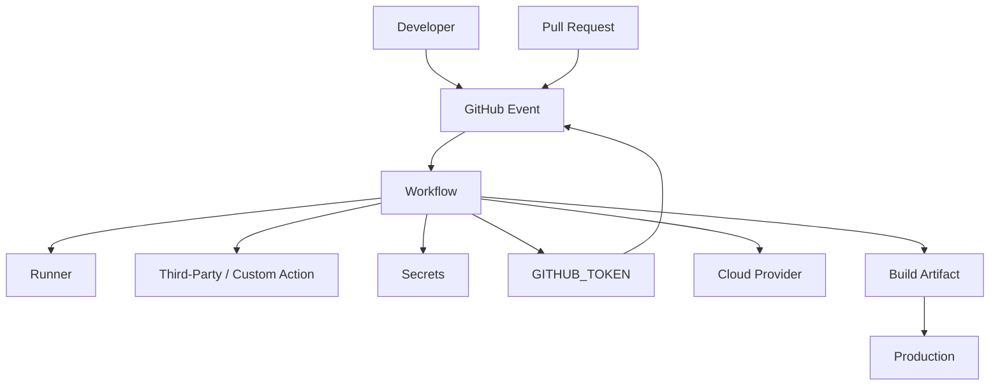
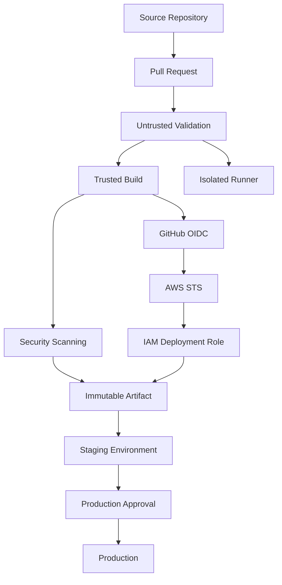

# 01- GitHub Actions Security Overview

## Overview

GitHub Actions security is the combination of workflow permissions, secret protection, execution isolation, supply-chain controls, identity management, and deployment safeguards that prevent CI/CD from becoming an unintended privilege-escalation path.

A GitHub Actions workflow executes code. That code may come from the repository itself, a pull request, a third-party action, a Docker image, a package dependency, or a deployment script. Therefore, the security model must assume that workflow execution is a security boundary.

For a production backend system, the relevant flow is:

```text
GitHub Event
    ↓
Workflow Selection
    ↓
Runner
    ↓
Workflow / Actions
    ↓
Application Code + Dependencies
    ↓
Secrets / Tokens / Cloud Identity
    ↓
Build / Artifact
    ↓
Deployment
```

A secure pipeline minimizes what each stage can access.

The core principle is:

```text
Untrusted Input
    ↓
Minimal Permissions
    ↓
Isolated Execution
    ↓
Controlled Credentials
    ↓
Verified Dependencies
    ↓
Trusted Artifact
    ↓
Protected Deployment
```

GitHub Actions security therefore cannot be reduced to protecting repository secrets. A secure design must also address `GITHUB_TOKEN`, workflow permissions, pull requests, shell injection, third-party actions, runners, artifacts, OIDC, AWS IAM, Docker images, and deployment boundaries.

## Security Model

A useful way to reason about GitHub Actions security is to identify the major trust boundaries.



Each arrow represents a potential trust boundary.

Security failures commonly occur when a workflow gives one component more trust or access than it actually requires.

## Core Security Principles

### Least Privilege

Every workflow, job, action, token, credential, and runner should receive only the access required to perform its task.

Instead of:

```yaml
permissions: write-all
```

prefer an explicit permission model.

For example:

```yaml
permissions:
  contents: read
```

A deployment job that requires AWS OIDC can explicitly add:

```yaml
permissions:
  contents: read
  id-token: write
```

The permission set should correspond to the actual operations performed by that job.

### Explicit Trust Boundaries

Separate:

```text
Untrusted Validation
```

from:

```text
Trusted Deployment
```

A pull request from an external fork should not automatically gain access to production credentials simply because the same repository contains a deployment workflow.

### Ephemeral Execution

Prefer fresh execution environments where practical.

GitHub-hosted runners are generally ephemeral. Persistent self-hosted runners require additional controls because previous jobs can leave behind:

- Files.
- Credentials.
- Processes.
- Docker containers.
- Build artifacts.
- Environment state.

### Immutable Promotion

Build once and promote the same artifact:

```text
Source
  ↓
Build
  ↓
Scan
  ↓
Immutable Artifact
  ↓
Staging
  ↓
Production
```

Do not rebuild separately for production unless there is a deliberate reason to do so.

### Short-Lived Credentials

For cloud deployment, prefer short-lived identity mechanisms such as GitHub Actions OIDC with AWS STS rather than storing long-lived AWS access keys as GitHub secrets.

## `GITHUB_TOKEN`

`GITHUB_TOKEN` is a GitHub-provided token available to workflows.

It can be used to interact with GitHub APIs and repository resources according to its granted permissions.

The security concern is not merely that the token exists.

The important question is:

```text
What can this workflow do with the token?
```

A workflow that can modify repository contents, create releases, approve pull requests, or modify other resources has a larger blast radius than a workflow that can only read repository contents.

## Permissions

Use the `permissions` block to explicitly define access.

A restrictive workflow-level configuration can be:

```yaml
permissions:
  contents: read
```

Jobs that require additional permissions can specify them independently:

```yaml
jobs:
  test:
    permissions:
      contents: read

  release:
    permissions:
      contents: write
```

This is preferable to granting write access to every job.

## Common `GITHUB_TOKEN` Permissions

Relevant permission areas include:

| Permission | Typical Purpose |
|---|---|
| `contents` | Repository contents |
| `actions` | Actions/workflow-related resources |
| `packages` | Packages |
| `pull-requests` | Pull request resources |
| `id-token` | OIDC token requests |
| `issues` | Issue resources |
| `deployments` | Deployment resources |

The exact permissions required depend on the workflow operation.

## Job-Level Permissions

Job-level permissions are useful when different jobs have different trust requirements.

```yaml
permissions:
  contents: read

jobs:
  test:
    permissions:
      contents: read

  deploy:
    permissions:
      contents: read
      id-token: write
```

The deployment job receives the additional OIDC capability without automatically giving it to the testing job.

## Default Permissions

Do not design workflows assuming that broad default permissions are safe.

Repository and organization configuration can influence the effective security posture.

Production repositories should establish explicit permission policies rather than relying on implicit defaults.

## Secret Management

GitHub Actions supports secrets at multiple scopes.

Common scopes include:

- Repository secrets.
- Organization secrets.
- Environment secrets.

The workflow accesses secrets through the `secrets` context.

Example:

```yaml
env:
  DATABASE_PASSWORD: ${{ secrets.DATABASE_PASSWORD }}
```

Secrets should be introduced only into the jobs that require them.

## Secret Exposure

A secret can be exposed through:

- Shell output.
- Debug logging.
- Error messages.
- Generated artifacts.
- Test reports.
- Docker build arguments.
- Command-line arguments.
- Third-party actions.
- Environment dumps.

Avoid:

```yaml
run: echo "${{ secrets.API_KEY }}"
```

Even when GitHub masks known secret values, masking should not be treated as the primary security boundary.

The better approach is to avoid placing secrets into logs in the first place.

## Secrets in Command Arguments

Avoid unnecessarily passing secrets as command-line arguments.

For example:

```bash
some-command --password "$PASSWORD"
```

can expose credentials through process inspection depending on the environment and command implementation.

Prefer environment variables or secure configuration mechanisms supported by the application.

## Environment Secrets

Deployment environments provide an additional security boundary.

Typical environments include:

```text
development
staging
production
```

Production can require:

- Required reviewers.
- Branch restrictions.
- Deployment protection.
- Environment-specific secrets.
- Environment-specific variables.
- Deployment history.

A deployment job can target an environment:

```yaml
jobs:
  deploy:
    environment: production
```

This allows deployment controls to be associated with the production environment.

## Environment Protection

Production deployments should not automatically inherit the same trust level as pull-request validation.

A useful model is:

```text
Pull Request
    ↓
Automated Validation
    ↓
Build
    ↓
Staging
    ↓
Production Approval
    ↓
Production
```

The approval boundary separates automated validation from privileged production operations.

## Pull Request Security

Pull requests are a major security boundary because the source code being executed may not be fully trusted.

For example, a contributor can modify:

```text
.github/workflows/test.yml
```

or application code executed by the workflow.

If the workflow also exposes secrets or write permissions, malicious code may attempt to use them.

## `pull_request`

For ordinary pull-request validation:

```yaml
on:
  pull_request:
```

the workflow runs in the pull-request security context.

This is generally appropriate for validating code changes without granting unnecessary access to sensitive repository resources.

## Fork Pull Requests

Fork-based pull requests require particular attention.

The repository owner should assume that workflow-executed code can be influenced by the pull request.

Do not design untrusted PR validation around access to:

- Production credentials.
- Deployment credentials.
- Private infrastructure.
- Highly privileged GitHub tokens.

Use separate trusted workflows when privileged operations are required.

## `pull_request_target`

`pull_request_target` requires particular caution.

It runs in the context of the target repository rather than simply treating the pull request as an isolated untrusted execution environment.

A dangerous pattern is effectively:

```text
pull_request_target
      ↓
Checkout untrusted PR code
      ↓
Execute it
      ↓
Expose repository secrets
```

The combination can turn untrusted pull-request code into code executing with privileged repository context.

Avoid checking out and executing untrusted pull-request content from a privileged workflow unless the security boundary has been deliberately designed and reviewed.

## Shell Injection

GitHub metadata can contain attacker-controlled content.

Potentially untrusted values include:

- Pull request titles.
- Branch names.
- Commit messages.
- Issue content.
- Workflow inputs.
- Repository-controlled text.

A dangerous pattern is direct interpolation into shell code:

```yaml
- name: Process title
  run: echo "${{ github.event.pull_request.title }}"
```

The problem is that expression interpolation occurs before the shell executes the resulting command.

## Safer Environment Passing

Pass external values through environment variables:

```yaml
- name: Process title
  env:
    PR_TITLE: ${{ github.event.pull_request.title }}
  run: |
    printf '%s\n' "$PR_TITLE"
```

The shell receives the value as data rather than having the workflow construct shell syntax from the value.

For complex or security-sensitive processing, validate and constrain the input before using it.

## Untrusted Inputs

Treat these values as untrusted unless their origin and constraints are understood:

```text
github.event.*
workflow_dispatch inputs
PR titles
branch names
commit messages
issue bodies
external API responses
generated JSON
```

A workflow should not assume that a string is safe merely because it originated from GitHub.

## Third-Party Actions

Actions are executable dependencies.

Using:

```yaml
- uses: some-owner/some-action@v1
```

means the workflow trusts code supplied by that action reference.

The action may:

- Execute commands.
- Access environment variables.
- Read files.
- Access tokens.
- Make network requests.
- Modify build outputs.

Therefore, actions should be treated similarly to production dependencies.

## Action Pinning

There are several levels of action versioning.

```yaml
uses: owner/action@v1
```

A major version reference is convenient but can move as new compatible releases are published.

A specific version provides more deterministic behavior:

```yaml
uses: owner/action@v1.2.3
```

A full commit SHA provides strong immutability:

```yaml
uses: owner/action@<commit-sha>
```

Organizations with strict supply-chain requirements may require SHA pinning.

## Trusted Action Sources

Before adopting an action, consider:

- Repository ownership.
- Maintenance activity.
- Release process.
- Dependency chain.
- Required permissions.
- Runtime behavior.
- Security history.
- Whether the action is necessary.

Prefer a small set of trusted actions over indiscriminately adding Marketplace dependencies.

## Compromised Action Scenario

Consider:

```text
Workflow
   ↓
Third-Party Action
   ↓
GITHUB_TOKEN
   ↓
Repository Write Access
```

If the action is compromised, the token's permissions determine the potential blast radius.

This is why:

```text
Trusted Action
+
Least-Privilege Token
```

is stronger than either control alone.

## Supply-Chain Security

The CI/CD supply chain includes:

```text
Source Code
    ↓
Dependencies
    ↓
Actions
    ↓
Runner
    ↓
Build
    ↓
Artifact
    ↓
Registry
    ↓
Deployment
```

Each stage should be treated as part of the security boundary.

Relevant controls include:

- Dependency review.
- Dependabot.
- Action pinning.
- SBOM generation.
- Artifact provenance.
- Artifact attestations.
- Artifact signing.
- Trusted build pipelines.
- Protected deployment environments.

## Dependency Security

Python dependencies can introduce supply-chain risk.

A pipeline may install:

```bash
pip install -r requirements.txt
```

which executes installation logic from third-party packages.

Use controlled dependency management and lock or constrain versions according to project requirements.

Security scanning should be integrated into the broader CI pipeline rather than relying solely on manual review.

## SBOM

A Software Bill of Materials describes the components included in a build.

For a Python backend, the SBOM can help identify:

```text
Application
 ├── Python runtime
 ├── Django
 ├── FastAPI
 ├── Requests
 └── Other dependencies
```

For containerized applications, the SBOM can also represent image-level dependencies.

## Artifact Provenance

A production artifact should be traceable to its source and build process.

A useful chain is:

```text
Commit SHA
    ↓
GitHub Actions Run
    ↓
Build
    ↓
Artifact
    ↓
Registry
    ↓
Deployment
```

This makes incident investigation and release auditing easier.

## Artifact Attestations and Signing

Artifact integrity mechanisms can provide evidence that an artifact originated from a trusted build process and was not unexpectedly replaced.

The broader objective is:

```text
Source
  ↓
Trusted Build
  ↓
Verified Artifact
  ↓
Trusted Deployment
```

These controls become increasingly important as the organization operates multiple repositories, runners, registries, and deployment environments.

## Runner Security

The runner executes workflow code.

Therefore:

```text
Runner = Execution Boundary
```

A workflow can potentially access resources available to the runner.

This includes:

- Filesystem.
- Network.
- Environment variables.
- Installed software.
- Credentials available to the process.
- Docker resources where available.

## GitHub-Hosted Runners

GitHub-hosted runners provide managed execution environments.

They are useful for standard workloads such as:

- Python testing.
- Docker builds.
- Linting.
- Unit tests.
- Integration tests.
- Security scans.

Their ephemeral nature reduces persistent-state risk compared with long-lived self-hosted machines.

## Self-Hosted Runners

Self-hosted runners are useful when workflows require:

- Private network access.
- Internal databases.
- Custom software.
- Specialized hardware.
- Restricted network connectivity.

However, they introduce additional operational and security responsibilities.

## Persistent Runner Risks

A persistent runner may retain:

```text
Workspace files
Docker images
Credentials
Temporary files
Processes
Caches
Build artifacts
```

A later workflow may encounter state left by a previous job.

This creates both reliability and security risks.

## Ephemeral Runners

Ephemeral runners reduce cross-job contamination.

The desired lifecycle is:

```text
Provision
   ↓
Execute One Workload
   ↓
Collect Required Outputs
   ↓
Destroy
```

This is particularly valuable when workloads execute untrusted code.

## Private Network Access

A self-hosted runner may provide access to:

```text
GitHub Actions
      ↓
Private Runner
      ↓
Internal Network
      ├── Database
      ├── Internal API
      └── Private Registry
```

This can be necessary for integration testing, but it increases the impact of a compromised workflow.

Network access should therefore be limited to the smallest required set of resources.

## Runner Labels and Groups

Runner labels and groups can enforce workload placement.

For example:

```yaml
runs-on: [self-hosted, linux, private-network]
```

This helps ensure that jobs requiring internal access run only on appropriate infrastructure.

Do not treat runner labels as a complete security boundary. Permissions, network controls, isolation, and repository governance remain necessary.

## Docker Security

Docker-based CI pipelines introduce additional trust boundaries.

A workflow may:

```text
Build Docker Image
      ↓
Run Container
      ↓
Access Filesystem / Network
```

Avoid unnecessarily granting privileged container access.

Be particularly careful with:

```text
--privileged
Docker socket access
Host filesystem mounts
Host networking
```

These can substantially increase the impact of compromised workflow code.

## Docker Registry Authentication

Registry credentials should not be embedded in Dockerfiles.

Avoid:

```dockerfile
ENV REGISTRY_PASSWORD=...
```

Use the CI identity mechanism appropriate for the registry.

For AWS ECR, GitHub Actions can use OIDC to obtain short-lived AWS credentials and then authenticate to ECR.

## AWS OIDC

OIDC allows GitHub Actions to exchange a GitHub-issued identity token for temporary AWS credentials through AWS STS.

The conceptual flow is:

```text
GitHub Actions
      ↓
OIDC Identity Token
      ↓
AWS STS
      ↓
IAM Role
      ↓
Temporary AWS Credentials
      ↓
ECR / ECS / S3 / EC2 / Lambda
```

This avoids storing long-lived AWS access keys in GitHub secrets.

## AWS IAM Trust Policy

The IAM role trust policy should restrict which GitHub workflows can assume the role.

Important dimensions can include:

- Organization/repository.
- Branch.
- Environment.
- Workflow identity claims.

The goal is to prevent an unrelated repository or workflow from assuming a privileged deployment role.

## OIDC Permission

A job requesting an OIDC token requires:

```yaml
permissions:
  id-token: write
  contents: read
```

Do not give `id-token: write` to every job.

For example:

```yaml
jobs:
  test:
    permissions:
      contents: read

  deploy:
    permissions:
      contents: read
      id-token: write
```

This reduces the number of jobs capable of obtaining cloud identity credentials.

## AWS Deployment Boundary

A production deployment should look conceptually like:

```text
GitHub Actions
      ↓
OIDC
      ↓
AWS STS
      ↓
Restricted IAM Role
      ↓
ECR / ECS / Lambda / EC2
```

The IAM role should grant only the operations required by the deployment.

For example, a service that only pushes images to ECR should not automatically receive broad access to unrelated AWS services.

## Secret vs OIDC

| Long-Lived Secret | OIDC |
|---|---|
| Credential stored in GitHub | Identity exchanged at runtime |
| Can remain valid for long periods | Temporary credentials |
| Rotation required | Short-lived by design |
| Exposure can have long impact | Limited credential lifetime |
| Commonly used historically | Preferred for supported cloud federation |

OIDC does not eliminate the need for IAM least privilege.

A short-lived credential with excessive permissions is still dangerous.

## Workflow Environments

Environment protection is particularly important for deployments.

A useful model is:

```text
Development
    ↓
Staging
    ↓
Production
```

Production can require manual approval before deployment.

This prevents a normal CI job from automatically becoming a production deployment.

## Concurrency and Security

Concurrency is usually discussed as a reliability mechanism, but it also has security implications.

For production deployments:

```yaml
concurrency:
  group: production-deployment
  cancel-in-progress: false
```

This can prevent two deployments from changing production simultaneously.

Race conditions can otherwise create unexpected deployment state.

## Artifact Promotion Security

A secure deployment pipeline should establish:

```text
Build
 ↓
Scan
 ↓
Verify
 ↓
Promote
```

rather than:

```text
Build
 ↓
Deploy
 ↓
Hope
```

The artifact should be traceable and preferably immutable.

## Production Deployment Security

A typical production flow is:

```mermaid
flowchart LR
    PR[Pull Request]
    Test[Tests]
    Scan[Security Scan]
    Build[Build]
    Artifact[Immutable Artifact]
    Staging[Staging]
    Approval[Production Approval]
    Prod[Production]
    Monitor[Monitoring]
    Rollback[Rollback]

    PR --> Test
    Test --> Scan
    Scan --> Build
    Build --> Artifact
    Artifact --> Staging
    Staging --> Approval
    Approval --> Prod
    Prod --> Monitor
    Monitor --> Rollback
```



Security controls should exist throughout this path.

## Secrets in Test and Build Pipelines

Testing workflows should generally require fewer privileges than deployment workflows.

For example:

```text
Unit Tests
    → No cloud credentials

Integration Tests
    → Test-only credentials where required

Build
    → Registry permissions

Deployment
    → Production deployment role
```

This creates security boundaries between pipeline stages.

## Job Permission Segmentation

A useful pattern is:

```yaml
permissions:
  contents: read

jobs:
  test:
    permissions:
      contents: read

  build:
    permissions:
      contents: read
      packages: write

  deploy:
    permissions:
      contents: read
      id-token: write
```

Each job receives only the permissions needed for its function.

## Logging Security

Logs should be considered persistent operational data.

Avoid logging:

```text
Access tokens
Passwords
API keys
Session tokens
Authorization headers
Sensitive user information
Private credentials
```

Be careful with debugging commands such as:

```bash
env
set
printenv
```

These can reveal environment variables that should not appear in CI logs.

## Debug Logging

Debugging can require additional visibility, but enabling verbose logging in production workflows can expose sensitive information.

Use debug logging temporarily and review the resulting logs before sharing them.

## Artifacts as Security Boundaries

Artifacts can contain:

- Coverage reports.
- Logs.
- Screenshots.
- Docker metadata.
- Test output.
- Generated configuration.

Do not upload arbitrary directories without checking their contents.

Avoid:

```yaml
path: .
```

for debugging artifacts.

Prefer explicit paths:

```yaml
path: |
  test-results.xml
  coverage.xml
  logs/test.log
```

## Security of Test Reports

Test reports can reveal:

- Internal filesystem paths.
- API endpoints.
- Database names.
- User identifiers.
- Exception details.
- Request data.

Use synthetic data and avoid embedding credentials in test fixtures.

## Workflow File Security

Workflow files are executable infrastructure.

Protect:

```text
.github/workflows/
```

through normal code-review controls.

Changes to workflow files should receive appropriate review because a small YAML change can alter:

- Token permissions.
- Secret exposure.
- Deployment behavior.
- Runner selection.
- Cloud access.
- Action versions.

## CODEOWNERS and Workflow Changes

Organizations can use code ownership policies to require specialized review for sensitive workflow files.

The objective is:

```text
Application Code
    → Application Review

Deployment / Security Workflows
    → Appropriate Security / Platform Review
```

This is particularly useful for repositories with production deployment workflows.

## Governance

Organizations may establish controls around:

- Allowed actions.
- Marketplace actions.
- Runner groups.
- Reusable workflows.
- Workflow permissions.
- Environment protection.
- Secret management.
- OIDC roles.
- Production deployments.

Enterprise governance should reduce accidental privilege without preventing legitimate engineering workflows.

## Action Allowlists

An organization may restrict which actions can be used.

A controlled action inventory can reduce supply-chain risk:

```text
Approved Actions
    ├── checkout
    ├── setup-python
    ├── upload-artifact
    └── organization-maintained actions
```

Teams should avoid adding arbitrary actions simply because they provide convenient functionality.

## Reusable Workflows as Security Boundaries

Reusable workflows can centralize security controls.

For example:

```text
Repository A ─┐
Repository B ─┼──> Shared CI Workflow
Repository C ─┘
                    ↓
             Standard Permissions
             Standard Scanning
             Standard Reporting
```

A reusable workflow can enforce organizational standards consistently.

However, changes to a centrally shared workflow can affect many repositories, so versioning, testing, review, and rollback are important.

## Composite Actions vs Reusable Workflows

These have different security boundaries.

| Composite Action | Reusable Workflow |
|---|---|
| Packages steps | Orchestrates workflows/jobs |
| Runs inside a job | Can define multiple jobs |
| Reusable implementation | Reusable pipeline |
| Good for focused step logic | Good for organizational CI/CD standards |

Security controls that apply to multiple jobs often belong naturally in reusable workflows.

## Security Failure Domains

Security troubleshooting should be structured around the failure domain.

| Symptom | Possible Cause |
|---|---|
| AWS authentication fails | OIDC permission, trust policy, role configuration |
| Secret is unavailable | Scope, environment, fork restrictions |
| API operation denied | `GITHUB_TOKEN` permission |
| Action cannot access resource | Permission or token scope |
| Deployment starts unexpectedly | Environment/concurrency configuration |
| Third-party action behaves unexpectedly | Action version or dependency change |
| PR exposes sensitive operation | Workflow trust-boundary mistake |
| Docker build accesses host | Excessive Docker privileges |
| Self-hosted runner contains old files | Persistent runner state |
| Artifact contains credentials | Overly broad artifact path |
| Production deployment races | Missing concurrency control |

## Security Troubleshooting Model

Use:

```text
Symptom
  ↓
Possible Causes
  ↓
Isolation Strategy
  ↓
Commands / Checks
  ↓
Root Cause
  ↓
Corrective Action
  ↓
Prevention
```

For example:

```text
AWS AssumeRole Failure
        ↓
Check id-token permission
        ↓
Check IAM trust policy
        ↓
Check repository / branch / environment claims
        ↓
Check IAM role permissions
        ↓
Correct trust configuration
        ↓
Add automated validation
```

## GitHub CLI Security Operations

List workflow runs:

```bash
gh run list
```

Inspect a workflow:

```bash
gh run view RUN_ID
```

View logs:

```bash
gh run view RUN_ID --log
```

List repository secrets without exposing their values:

```bash
gh secret list
```

List repository variables:

```bash
gh variable list
```

Inspect environments:

```bash
gh api repos/OWNER/REPO/environments
```

Use the GitHub CLI for operational inspection without attempting to retrieve secret values.

## Common Security Mistakes

### Granting Write Permissions Globally

A workflow that only runs tests rarely needs repository write access.

Use:

```yaml
permissions:
  contents: read
```

and expand permissions only where necessary.

### Giving Deployment Credentials to Test Jobs

Test jobs should not normally have production deployment credentials.

Separate validation and deployment privileges.

### Executing Untrusted PR Code With Secrets

This can turn a pull request into a credential-exfiltration path.

Keep privileged workflows separate from untrusted code execution.

### Unsafe `pull_request_target` Usage

Do not combine privileged repository context with arbitrary pull-request code without a carefully designed trust boundary.

### Interpolating Untrusted Data Into Shell Commands

Prefer environment variables:

```yaml
env:
  VALUE: ${{ github.event.pull_request.title }}
```

rather than constructing shell syntax directly from untrusted metadata.

### Trusting Every Marketplace Action

An action is executable code.

Review and pin important dependencies according to organizational policy.

### Using Long-Lived AWS Keys

Prefer OIDC and temporary AWS credentials where supported.

### Giving OIDC Permission to Every Job

`id-token: write` should be limited to jobs that actually need cloud federation.

### Using Persistent Runners for Untrusted Workloads

Persistent runners can retain state and provide access to internal resources.

Use isolated or ephemeral execution where the threat model requires it.

### Uploading the Entire Workspace

Broad artifact paths can accidentally publish credentials, configuration, or sensitive test data.

Upload explicit paths.

### Assuming Masking Solves Secret Security

Masking is a logging safeguard, not a replacement for least privilege and careful secret handling.

### Ignoring Workflow File Changes

Workflow YAML is executable infrastructure. Treat changes to `.github/workflows/` as security-sensitive changes.

## Production Security Checklist

- [ ] Workflow permissions are explicitly defined.
- [ ] Jobs receive only the permissions they require.
- [ ] `GITHUB_TOKEN` access follows least privilege.
- [ ] Test jobs do not receive unnecessary deployment credentials.
- [ ] Production credentials are isolated behind deployment controls.
- [ ] Environment protection is configured for privileged deployments.
- [ ] Production deployments use appropriate approval and concurrency controls.
- [ ] Secrets are never intentionally printed to logs.
- [ ] Sensitive values are not unnecessarily passed through command arguments.
- [ ] Untrusted GitHub data is not directly interpolated into shell commands.
- [ ] `pull_request` and `pull_request_target` are deliberately selected based on trust requirements.
- [ ] Fork pull requests cannot access unnecessary privileged resources.
- [ ] Third-party actions are reviewed and version-controlled.
- [ ] Action pinning follows organizational security requirements.
- [ ] Dependencies are monitored.
- [ ] SBOM and artifact integrity controls are considered for production artifacts.
- [ ] Runner isolation matches the workload's trust level.
- [ ] Persistent self-hosted runners are hardened and cleaned.
- [ ] Ephemeral runners are considered for untrusted workloads.
- [ ] Private network access is minimized.
- [ ] Docker privileges are minimized.
- [ ] AWS authentication uses OIDC where appropriate.
- [ ] AWS IAM trust policies restrict GitHub identities appropriately.
- [ ] AWS deployment roles follow least privilege.
- [ ] Build artifacts are immutable and traceable.
- [ ] Test and build artifacts are checked for sensitive data.
- [ ] Workflow files receive appropriate code review.
- [ ] Security-sensitive reusable workflows are governed and versioned.
- [ ] CI security failures have a defined troubleshooting process.

## Senior-Level Security Architecture

A mature GitHub Actions security architecture can be modeled as:



The architecture deliberately separates:

```text
Untrusted Code
```

from:

```text
Privileged Operations
```

and separates:

```text
Build Identity
```

from:

```text
Deployment Identity
```

## Security Trade-Offs

Security controls have operational consequences.

| Control | Security Benefit | Operational Cost |
|---|---|---|
| Explicit permissions | Smaller blast radius | More configuration |
| SHA-pinned actions | Stronger immutability | Version updates require maintenance |
| Ephemeral runners | Reduced persistence risk | Infrastructure complexity |
| Environment approvals | Strong deployment boundary | Slower deployment |
| OIDC | Avoids long-lived cloud keys | IAM configuration complexity |
| Action allowlists | Reduced supply-chain exposure | Limits available tooling |
| Matrix isolation | Better compatibility confidence | Higher CI cost |
| Artifact signing | Stronger integrity evidence | Additional tooling and governance |

Senior engineering decisions should consider both security and operational requirements.

## High Availability and Recovery

CI/CD security also affects recovery.

If a deployment pipeline is compromised or unavailable, recovery mechanisms should exist.

Important controls include:

- Immutable previous artifacts.
- Deployment history.
- Rollback workflows.
- Restricted production access.
- Reproducible builds.
- Independent monitoring.
- Emergency access procedures.

A rollback should not require rebuilding the previous version if the immutable artifact is already available.

## Incident Response

When a GitHub Actions security incident occurs, consider:

```text
1. Identify affected workflow.
2. Identify affected runs.
3. Determine token permissions.
4. Identify secrets or credentials exposed.
5. Identify artifacts produced.
6. Identify cloud resources accessed.
7. Revoke or rotate affected credentials.
8. Disable compromised workflows or actions.
9. Inspect repository and deployment changes.
10. Preserve relevant logs.
11. Correct the trust boundary.
12. Add preventive controls.
```

The exact response depends on the incident.

The important principle is to determine the complete blast radius rather than assuming the issue was limited to one failed workflow.

## Security Review Questions

Before approving a production GitHub Actions workflow, ask:

### Identity

- What identity does this job receive?
- What can `GITHUB_TOKEN` access?
- Does the job require OIDC?
- What AWS IAM role can it assume?

### Secrets

- Does the job need secrets?
- Which scope provides them?
- Could tests or dependencies access them?
- Could they appear in logs or artifacts?

### Code Trust

- Is the executed code trusted?
- Can a fork modify it?
- Can workflow files be modified by a pull request?
- Is `pull_request_target` involved?

### Actions

- Which third-party actions are used?
- Are versions pinned?
- Are permissions minimized?
- Are actions approved by organizational policy?

### Runner

- Is the runner ephemeral?
- Does it have private network access?
- Can workflows access Docker?
- What happens to state after the job?

### Artifacts

- Is the artifact immutable?
- Can it contain sensitive data?
- Can its origin be verified?
- Can production deploy the exact artifact that was tested?

### Deployment

- Is production protected?
- Is deployment concurrency configured?
- Is rollback available?
- Can two deployments execute simultaneously?

## Interview Scenarios

### A Pull Request Needs to Run Tests but Tests Should Not Receive Production Secrets

Separate untrusted validation from privileged deployment workflows. The PR test job should use minimal `GITHUB_TOKEN` permissions and no production secrets.

### A Deployment Requires AWS Credentials

Use GitHub Actions OIDC with AWS STS and a narrowly scoped IAM role rather than storing long-lived AWS access keys.

### A Third-Party Action Is Compromised

Reduce the blast radius through trusted action sources, version or SHA pinning, minimal `GITHUB_TOKEN` permissions, restricted secrets, isolated runners, and limited cloud permissions.

### Why Is `pull_request_target` Dangerous?

It can operate using the target repository's security context. Combining it with execution of untrusted pull-request code can expose privileged repository resources or secrets.

### A Pull Request Title Is Used in a Shell Command

Treat the title as untrusted input. Pass it through an environment variable and quote it rather than directly interpolating it into shell syntax.

### Why Should `id-token: write` Be Restricted?

It permits the job to request an OIDC identity token. If the corresponding AWS trust policy permits it, that identity can potentially obtain cloud credentials.

### Why Use Ephemeral Runners?

They reduce the risk of credentials, files, processes, and other state persisting between unrelated workflow executions.

### How Would You Secure a Production Deployment Pipeline?

A reasonable architecture is:

```text
Pull Request
 ↓
Minimal-Permission Validation
 ↓
Security Scanning
 ↓
Trusted Build
 ↓
Immutable Artifact
 ↓
Staging
 ↓
Protected Production Environment
 ↓
OIDC + Restricted IAM Role
 ↓
Production
```

### How Would You Investigate a Suspicious Workflow Run?

Start with:

```text
Workflow
→ Commit
→ Actor
→ Changed Workflow
→ Permissions
→ Secrets Available
→ Runner
→ Actions Used
→ Commands Executed
→ Artifacts
→ Cloud API Activity
```

The objective is to determine both the immediate failure and the potential blast radius.

## Key Takeaways

- GitHub Actions security is a complete trust-boundary problem involving workflow permissions, secrets, runners, actions, artifacts, cloud identity, and deployments.
- Apply least privilege at every layer: `GITHUB_TOKEN`, job permissions, secrets, OIDC, AWS IAM roles, runners, and network access.
- Treat pull requests, workflow files, third-party actions, dependencies, and shell-interpolated GitHub metadata as potentially untrusted inputs.
- Prefer ephemeral execution, immutable artifacts, trusted and pinned actions, protected environments, and short-lived cloud credentials through OIDC.
- A production-secure pipeline separates untrusted validation from privileged build and deployment operations while preserving traceability, rollback capability, and a controlled blast radius.