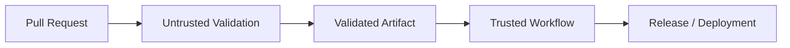
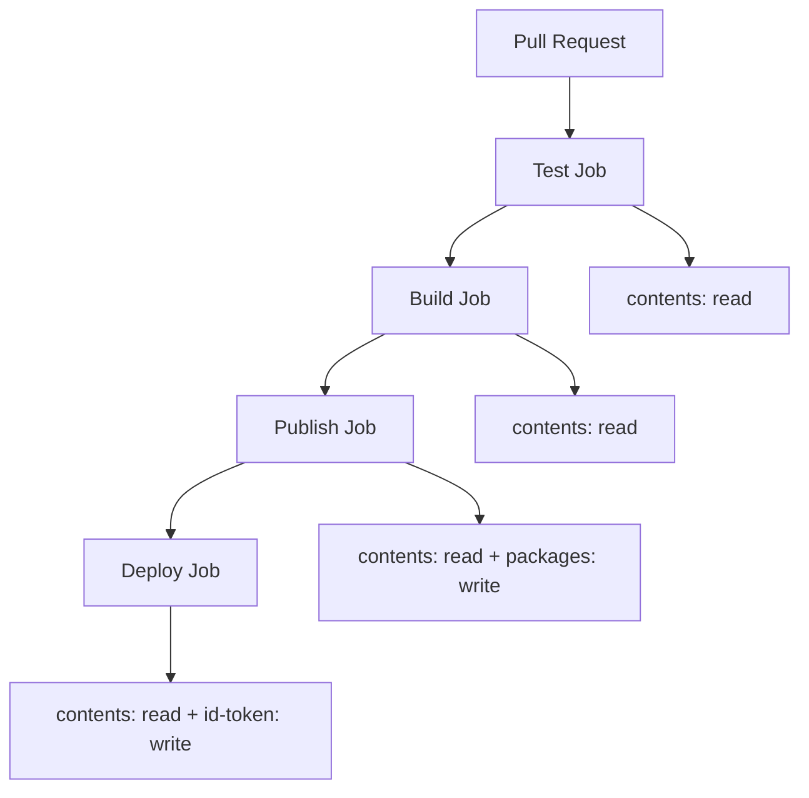

# 02- GITHUB_TOKEN Security

## Overview

`GITHUB_TOKEN` is the GitHub-provided authentication token available to a GitHub Actions workflow. It allows workflow jobs to interact with GitHub resources on behalf of the repository's workflow execution.

The security problem is not simply that a token exists. The important questions are:

- What permissions does the token have?
- Which jobs receive it?
- Which actions can access it?
- Can untrusted code execute with it?
- Can it modify repository state?
- Can it trigger additional workflows or releases?
- What happens if a third-party action is compromised?

A production GitHub Actions pipeline should treat `GITHUB_TOKEN` as a privileged capability and explicitly minimize its permissions.

The basic security model is:

```text
Workflow
    ↓
GITHUB_TOKEN
    ↓
Granted Permissions
    ↓
GitHub Resources
```

A secure pipeline aims for:

```text
Job
  ↓
Required Operation
  ↓
Minimum Permission
  ↓
Minimum Blast Radius
```

This is particularly important for backend CI/CD pipelines that build Docker images, publish artifacts, create releases, deploy to AWS, or run code from pull requests.

## What Is `GITHUB_TOKEN`?

`GITHUB_TOKEN` is an automatically provided token that allows a workflow to authenticate with GitHub.

A workflow can access it through:

```yaml
${{ secrets.GITHUB_TOKEN }}
```

GitHub also makes the token available to actions through the workflow execution environment.

A typical workflow might use it indirectly through an official action:

```yaml
- name: Checkout repository
  uses: actions/checkout@v4
```

or explicitly:

```yaml
- name: Call GitHub API
  env:
    GH_TOKEN: ${{ secrets.GITHUB_TOKEN }}
  run: |
    gh api repos/${{ github.repository }}
```

The effective capabilities depend on the permissions granted to the workflow or job.

## Why `GITHUB_TOKEN` Exists

Without an automatically provided token, every workflow that needs to interact with GitHub would require manually created credentials.

`GITHUB_TOKEN` provides a workflow-specific authentication mechanism for common operations such as:

- Reading repository contents.
- Creating or updating GitHub resources when permitted.
- Working with pull requests.
- Publishing packages.
- Managing releases.
- Calling GitHub APIs.
- Performing other Actions-related operations supported by the granted permissions.

The security benefit is that workflows can use a scoped, workflow-provided identity rather than requiring developers to create a long-lived personal access token for every automation task.

## Token Lifecycle

Conceptually, a workflow execution follows:

```text
Workflow Trigger
      ↓
GitHub Creates Workflow Context
      ↓
GITHUB_TOKEN Available to Jobs
      ↓
Job Executes
      ↓
Actions / Scripts Use Token
      ↓
Workflow Completes
      ↓
Token Lifecycle Ends
```

The token should be treated as temporary workflow credentials rather than a permanent application credential.

## `GITHUB_TOKEN` Permissions

The token's effective access is controlled through the workflow `permissions` configuration.

A minimal workflow might use:

```yaml
permissions:
  contents: read
```

This communicates an important security property:

```text
This workflow can read repository contents,
but it should not receive unnecessary write capabilities.
```

## Common Permission Areas

Common GitHub Actions permissions include:

| Permission | Typical Purpose |
|---|---|
| `contents` | Repository contents |
| `actions` | Actions and workflow resources |
| `packages` | GitHub Packages |
| `pull-requests` | Pull request resources |
| `issues` | Issues |
| `deployments` | Deployment resources |
| `id-token` | OIDC identity tokens |
| `checks` | Check runs |
| `statuses` | Commit statuses |

The exact permissions required depend on what the workflow actually does.

## Least Privilege

The primary security principle for `GITHUB_TOKEN` is least privilege.

Suppose a test workflow only performs:

```text
Checkout
    ↓
Install Dependencies
    ↓
Run Tests
```

It normally does not need broad write access to the repository.

Use:

```yaml
permissions:
  contents: read
```

instead of granting broad write permissions.

The goal is:

```text
Required Capability
        ↓
Required Permission
        ↓
Required Job
```

rather than:

```text
Workflow
   ↓
Everything
```

## Workflow-Level Permissions

Permissions can be defined at the workflow level:

```yaml
name: CI

on:
  pull_request:

permissions:
  contents: read

jobs:
  test:
    runs-on: ubuntu-latest

    steps:
      - uses: actions/checkout@v4

      - name: Run tests
        run: pytest
```

This creates a conservative baseline for the workflow.

## Job-Level Permissions

Different jobs often require different privileges.

For example:

```yaml
permissions:
  contents: read

jobs:
  test:
    runs-on: ubuntu-latest

    permissions:
      contents: read

    steps:
      - uses: actions/checkout@v4
      - run: pytest

  release:
    runs-on: ubuntu-latest

    permissions:
      contents: write

    steps:
      - uses: actions/checkout@v4
      - name: Create release
        run: ./scripts/release.sh
```

The testing job does not inherit the release job's write requirement.

This reduces the blast radius if the test environment or one of its dependencies is compromised.

## Permission Scope Design

A useful production pattern is:

```text
Workflow
│
├── Lint
│     └── contents: read
│
├── Unit Tests
│     └── contents: read
│
├── Build
│     └── contents: read
│
├── Package Publish
│     └── packages: write
│
└── Release
      └── contents: write
```

The permissions reflect the responsibility of each job.

## Explicit Permissions

For security-sensitive repositories, explicit permissions make the workflow easier to audit.

Example:

```yaml
permissions:
  contents: read
```

Then grant additional access only where required:

```yaml
jobs:
  publish:
    permissions:
      contents: read
      packages: write
```

This creates a visible permission contract in the workflow.

## `GITHUB_TOKEN` and `actions/checkout`

`actions/checkout` commonly uses the workflow token to retrieve repository contents.

Example:

```yaml
steps:
  - name: Checkout
    uses: actions/checkout@v4
```

The workflow therefore needs appropriate repository read access.

A common baseline is:

```yaml
permissions:
  contents: read
```

The checkout operation itself does not imply that the workflow should receive repository write permissions.

## `GITHUB_TOKEN` and GitHub CLI

The token can be used with GitHub CLI.

For example:

```yaml
- name: Inspect repository
  env:
    GH_TOKEN: ${{ secrets.GITHUB_TOKEN }}
  run: |
    gh repo view "${{ github.repository }}"
```

For API operations:

```yaml
- name: Query workflow information
  env:
    GH_TOKEN: ${{ secrets.GITHUB_TOKEN }}
  run: |
    gh api "repos/${{ github.repository }}/actions/runs"
```

The token's permissions still determine what operations are allowed.

## `GITHUB_TOKEN` and GitHub API

A workflow can interact with GitHub APIs using the token.

Example:

```yaml
- name: Read repository metadata
  env:
    GH_TOKEN: ${{ secrets.GITHUB_TOKEN }}
  run: |
    gh api "repos/${{ github.repository }}"
```

If an API call returns:

```text
403 Forbidden
```

the first security-related question should be:

```text
Does the job have the required permission?
```

Do not immediately solve authorization failures by granting broad write access.

## Read vs Write Access

A useful distinction is:

```text
Read
  ↓
Inspect / Download / Validate

Write
  ↓
Modify / Publish / Delete / Trigger
```

Write permissions should receive additional scrutiny because they increase the potential blast radius.

For example:

```yaml
permissions:
  contents: read
```

is materially different from:

```yaml
permissions:
  contents: write
```

The second permits repository modification operations that the first does not.

## Pull Request Security

`GITHUB_TOKEN` becomes particularly sensitive when workflows execute pull-request code.

Consider:

```text
Pull Request
    ↓
Workflow
    ↓
Checkout PR Code
    ↓
Execute Tests
    ↓
GITHUB_TOKEN
```

The code under test may be modified by the pull request.

If that code can access a powerful token, it may attempt to use the token for operations unrelated to testing.

Therefore:

```text
Untrusted Code
+
Privileged Token
=
Large Security Risk
```

## `pull_request`

A typical validation workflow is:

```yaml
name: Pull Request CI

on:
  pull_request:

permissions:
  contents: read

jobs:
  test:
    runs-on: ubuntu-latest

    steps:
      - uses: actions/checkout@v4

      - name: Install dependencies
        run: pip install -r requirements.txt

      - name: Run tests
        run: pytest
```

The validation workflow receives only the access required to read the repository and execute the tests.

## Fork Pull Requests

Fork pull requests require additional caution because the source repository is outside the target repository's normal trust boundary.

A malicious pull request could modify:

```text
Application code
Workflow files
Build scripts
Test scripts
Package configuration
Dockerfiles
```

Any of these may execute during CI.

Therefore, a pull-request workflow should be designed under the assumption that executed code may be hostile.

## `pull_request_target`

`pull_request_target` is particularly sensitive because it operates using the target repository's context.

A dangerous design can look like:

```text
pull_request_target
       ↓
Checkout Pull Request
       ↓
Execute Pull Request Code
       ↓
Privileged GITHUB_TOKEN
       ↓
Repository Modification
```

The security problem is the combination of:

- Privileged repository context.
- Untrusted pull-request code.
- Token permissions.
- Secret availability.

Do not treat `pull_request_target` as a simple replacement for `pull_request`.

## Secure Trust-Boundary Design

Separate untrusted validation from privileged operations:



The trusted workflow should not blindly execute arbitrary code supplied by an untrusted pull request.

## Shell Injection

GitHub event data can be attacker-controlled.

Examples include:

- Pull request titles.
- Branch names.
- Commit messages.
- Issue content.
- Workflow inputs.

Avoid constructing shell commands directly from these values.

Unsafe pattern:

```yaml
- name: Process PR title
  run: |
    echo "Title: ${{ github.event.pull_request.title }}"
```

If the value contains shell metacharacters, the resulting command may behave differently from what the workflow author intended.

## Safer Environment Variables

Pass untrusted values through environment variables:

```yaml
- name: Process PR title
  env:
    PR_TITLE: ${{ github.event.pull_request.title }}
  run: |
    printf '%s\n' "$PR_TITLE"
```

The shell receives the value as data.

This pattern is preferable when processing GitHub-provided strings in shell commands.

## User-Controlled Workflow Inputs

Manual workflows can define inputs:

```yaml
on:
  workflow_dispatch:
    inputs:
      environment:
        description: Deployment environment
        required: true
        type: choice
        options:
          - staging
          - production
```

Inputs should still be validated against the intended set of values.

Do not assume that a workflow input is safe simply because it originates from `workflow_dispatch`.

## Branch Names

Branch names can contain characters that make direct shell interpolation unsafe.

Avoid:

```yaml
run: git checkout ${{ github.ref_name }}
```

Prefer:

```yaml
env:
  BRANCH_NAME: ${{ github.ref_name }}
run: |
  git checkout -- "$BRANCH_NAME"
```

Where possible, use GitHub Actions features or Git commands that avoid constructing shell syntax from external strings.

## Commit Messages

Commit messages should also be treated as untrusted data.

Avoid:

```yaml
run: echo "Commit: ${{ github.event.head_commit.message }}"
```

Prefer:

```yaml
env:
  COMMIT_MESSAGE: ${{ github.event.head_commit.message }}
run: |
  printf '%s\n' "$COMMIT_MESSAGE"
```

## Third-Party Actions and `GITHUB_TOKEN`

A third-party action executes within the same workflow environment and may be able to access credentials made available to it.

Therefore:

```text
GITHUB_TOKEN
      ↓
Third-Party Action
      ↓
Repository / API Access
```

If the action is compromised, the token's permissions become part of the potential blast radius.

## Action Trust

Before using an action, evaluate:

- Source repository.
- Maintainer.
- Release process.
- Dependencies.
- Required permissions.
- Network behavior.
- Repository activity.
- Security history.
- Whether the action is necessary.

An action should not receive broad permissions merely because it is convenient.

## Pinning Actions

A workflow can reference actions using:

```yaml
uses: actions/checkout@v4
```

or a specific release:

```yaml
uses: actions/checkout@v4.2.2
```

For stronger immutability:

```yaml
uses: actions/checkout@<commit-sha>
```

The appropriate strategy depends on organizational supply-chain requirements.

SHA pinning provides stronger protection against a mutable tag unexpectedly pointing to different code.

## Permission Minimization and Third-Party Actions

Suppose an action only needs to read repository metadata.

Do not provide:

```yaml
permissions:
  contents: write
  issues: write
  pull-requests: write
  packages: write
```

when the actual requirement is:

```yaml
permissions:
  contents: read
```

Security controls should match actual functionality.

## Secret Exposure Through Actions

Actions can potentially access environment variables and other values available to their execution context.

Avoid making secrets globally available:

```yaml
env:
  API_KEY: ${{ secrets.API_KEY }}
```

unless every step in the job requires the value.

Prefer narrower scope:

```yaml
- name: Call external API
  env:
    API_KEY: ${{ secrets.API_KEY }}
  run: |
    ./scripts/call-api.sh
```

This reduces unnecessary exposure.

## `GITHUB_TOKEN` and Secrets

`GITHUB_TOKEN` should not be confused with ordinary repository secrets.

| `GITHUB_TOKEN` | Repository Secret |
|---|---|
| Automatically provided by GitHub Actions | Explicitly configured |
| Used for GitHub operations | Used for application/service credentials |
| Controlled through permissions | Controlled through secret scope |
| Workflow-specific | Depends on configured secret lifecycle |
| Should use least privilege | Should also use least privilege |

Both should be treated as sensitive credentials.

## Secret Masking

GitHub attempts to mask secrets in workflow logs.

However, masking is not a complete security strategy.

Do not intentionally print secrets:

```yaml
- run: echo "${{ secrets.API_KEY }}"
```

Instead:

```yaml
- name: Call API
  env:
    API_KEY: ${{ secrets.API_KEY }}
  run: ./scripts/call-api.sh
```

The script should use the value without logging it.

## Environment Variables

Avoid dumping all environment variables during debugging:

```bash
env
```

or:

```bash
printenv
```

These commands can expose credentials and sensitive configuration in workflow logs.

Prefer targeted diagnostics:

```bash
printf 'Environment: %s\n' "$DEPLOY_ENV"
```

without printing secret values.

## Job-Level Token Isolation

A strong production pattern is to keep the test job low privilege and grant deployment access only to the deployment job.

```yaml
permissions:
  contents: read

jobs:
  test:
    runs-on: ubuntu-latest

    permissions:
      contents: read

    steps:
      - uses: actions/checkout@v4
      - run: pytest

  deploy:
    runs-on: ubuntu-latest

    permissions:
      contents: read
      id-token: write

    environment: production

    steps:
      - uses: actions/checkout@v4

      - name: Deploy
        run: ./scripts/deploy.sh
```

The test job cannot request AWS OIDC credentials because it does not receive `id-token: write`.

## `id-token` and OIDC

`id-token: write` is not equivalent to AWS access by itself.

It allows the workflow job to request an OIDC identity token.

The AWS trust relationship then determines whether that identity can assume an IAM role.

The flow is:

```text
GitHub Actions Job
       ↓
id-token: write
       ↓
GitHub OIDC Token
       ↓
AWS STS
       ↓
IAM Role Trust Policy
       ↓
Temporary AWS Credentials
```

The complete security boundary therefore includes both GitHub permissions and AWS IAM.

## OIDC Permission Scope

Only jobs requiring cloud federation should receive:

```yaml
permissions:
  id-token: write
```

For example:

```yaml
jobs:
  test:
    permissions:
      contents: read

  deploy:
    permissions:
      contents: read
      id-token: write
```

This limits which workflow stages can obtain cloud identity tokens.

## AWS IAM and `GITHUB_TOKEN`

`GITHUB_TOKEN` itself is not an AWS credential.

A deployment workflow may use:

```text
GITHUB_TOKEN
    ↓
GitHub Actions / GitHub API

OIDC Token
    ↓
AWS STS
    ↓
IAM Role
    ↓
AWS APIs
```

These identities should be considered separately.

## AWS Deployment Security

A production AWS deployment should preferably use:

```text
GitHub Actions
      ↓
OIDC
      ↓
AWS STS
      ↓
Restricted IAM Role
      ↓
ECR / ECS / EC2 / Lambda
```

The IAM role should grant only the AWS operations required by the deployment.

For example, a job that publishes a Docker image to ECR should not automatically receive administrative access to unrelated AWS services.

## Repository Write Access

A workflow that can write repository contents can potentially:

- Modify files.
- Create commits.
- Modify branches.
- Influence future workflows.
- Change workflow definitions.
- Alter release state.

Therefore:

```yaml
contents: write
```

should be treated as a significant privilege.

## Workflow Modification Risk

Consider:

```text
Workflow
   ↓
contents: write
   ↓
Modify .github/workflows/
   ↓
Future Workflow Execution
```

Repository write access can therefore become a mechanism for persistent workflow compromise.

Jobs that do not need repository modification should not receive this permission.

## Release Automation

A release job may legitimately require additional permissions.

For example:

```yaml
jobs:
  release:
    permissions:
      contents: write
```

The release workflow should still be isolated from ordinary test execution.

A useful design is:

```text
PR Validation
    ↓
Tests
    ↓
Security Checks
    ↓
Build
    ↓
Release Approval / Trusted Trigger
    ↓
Release Job
```

## Package Publishing

A package-publishing job may require:

```yaml
permissions:
  contents: read
  packages: write
```

Do not automatically grant:

```yaml
contents: write
```

if the package publication process does not modify repository contents.

## Deployment Permissions

Deployment-related permissions should be isolated.

A pipeline may have:

```text
Test Job
  → contents: read

Build Job
  → contents: read
  → packages: write

Deploy Job
  → contents: read
  → id-token: write
```

This provides clearer security boundaries than granting every job all permissions.

## `GITHUB_TOKEN` and Reusable Workflows

Reusable workflows can centralize permission policies.

A calling workflow may invoke:

```yaml
jobs:
  ci:
    uses: organization/shared-workflows/.github/workflows/ci.yml@v1
```

The reusable workflow should define the permissions required for its jobs.

Reusable workflows are particularly useful for enforcing organization-wide CI security patterns.

## `secrets: inherit`

Reusable workflows can receive secrets explicitly or through inheritance where supported.

For example:

```yaml
jobs:
  deploy:
    uses: organization/platform/.github/workflows/deploy.yml@v1
    secrets: inherit
```

`secrets: inherit` should be used deliberately.

A reusable workflow receiving secrets should be treated as a trusted component because its jobs may be able to access the inherited secret set.

## Permission Boundaries in Reusable Workflows

A shared workflow should avoid requiring broad permissions simply because one consumer needs them.

The workflow should be designed around the minimum permissions required by its responsibilities.

This is especially important when one reusable workflow serves many repositories.

## Concurrency and `GITHUB_TOKEN`

Concurrency is primarily a deployment reliability mechanism, but it also reduces race conditions involving repository and deployment state.

Example:

```yaml
concurrency:
  group: production-deployment
  cancel-in-progress: false
```

This prevents overlapping production deployment workflows from operating simultaneously under the same concurrency group.

## Token Exposure Through Logs

A secure workflow should assume logs may be retained and viewed by people or systems with access to the workflow run.

Avoid:

```yaml
run: |
  echo "TOKEN=$GITHUB_TOKEN"
```

Even when masking is expected, intentional credential logging is an operational security failure.

## Token Exposure Through Artifacts

Be careful when uploading workspace contents:

```yaml
- uses: actions/upload-artifact@v4
  with:
    name: debug
    path: .
```

The workspace may contain:

```text
.env
configuration files
credentials
temporary files
test databases
logs
```

Prefer explicit artifact paths:

```yaml
- uses: actions/upload-artifact@v4
  with:
    name: test-results
    path: |
      test-results.xml
      coverage.xml
```

## Token Exposure Through Docker

Avoid passing sensitive credentials into Docker build layers unnecessarily.

For example, do not use:

```dockerfile
ARG GITHUB_TOKEN
RUN echo "$GITHUB_TOKEN"
```

A credential accidentally incorporated into an image layer can remain recoverable even if the final Dockerfile no longer references it.

Use appropriate Docker BuildKit secret mechanisms when a build genuinely requires a secret.

## Backend Example: Django CI

A Django test workflow can use minimal GitHub permissions:

```yaml
name: Django CI

on:
  pull_request:

permissions:
  contents: read

jobs:
  test:
    runs-on: ubuntu-latest

    steps:
      - name: Checkout
        uses: actions/checkout@v4

      - name: Set up Python
        uses: actions/setup-python@v5
        with:
          python-version: "3.12"

      - name: Install dependencies
        run: pip install -r requirements.txt

      - name: Run tests
        run: pytest
```

The application can test against PostgreSQL or Redis through service containers without granting the test job repository write permissions.

## Backend Example: FastAPI CI

A FastAPI workflow follows the same principle:

```yaml
name: FastAPI CI

on:
  pull_request:

permissions:
  contents: read

jobs:
  test:
    runs-on: ubuntu-latest

    steps:
      - uses: actions/checkout@v4

      - uses: actions/setup-python@v5
        with:
          python-version: "3.12"

      - name: Install dependencies
        run: pip install -r requirements.txt

      - name: Run tests
        run: pytest
```

The application code can use PostgreSQL, Redis, or other service containers without granting unrelated GitHub permissions.

## Backend Example: Build and Publish

A Docker build that publishes to GitHub Packages may use:

```yaml
permissions:
  contents: read
  packages: write
```

The publishing job should not automatically receive:

```yaml
contents: write
```

unless it genuinely needs repository modification access.

## Security Architecture

A production backend pipeline can separate permissions by stage:



This architecture limits each stage to its required capability.

## Security Failure Scenarios

### Test Job Attempts a GitHub API Write

Symptom:

```text
403 Forbidden
```

Possible cause:

```text
contents: write
```

or another required permission is missing.

Isolation:

```bash
gh api "repos/${GITHUB_REPOSITORY}"
```

Then inspect the operation being attempted and the job's permissions.

Corrective action:

Grant only the specific required permission.

Do not replace the permission set with broad write access.

### Deployment Cannot Obtain AWS Credentials

Possible causes include:

- Missing `id-token: write`.
- Incorrect AWS IAM trust policy.
- Incorrect repository or branch conditions.
- Incorrect environment configuration.
- Incorrect IAM role ARN.

Isolation:

```text
GitHub Job Permissions
        ↓
OIDC Token Request
        ↓
AWS STS
        ↓
IAM Trust Policy
        ↓
IAM Permissions
```

### Pull Request Can Modify Repository State

Possible causes include:

- Excessive `GITHUB_TOKEN` permissions.
- Privileged workflow triggered by untrusted code.
- Unsafe `pull_request_target` usage.
- Third-party action with write access.

Corrective action:

Separate untrusted validation from trusted repository operations.

### Third-Party Action Behaves Unexpectedly

Investigate:

```text
Action Version
    ↓
Action Source
    ↓
Action Dependencies
    ↓
Workflow Permissions
    ↓
Secrets Available
    ↓
Runner Access
```

The objective is to determine what the action could access, not only what command visibly failed.

## GitHub CLI Diagnostics

Inspect workflow runs:

```bash
gh run list
```

Inspect a specific run:

```bash
gh run view RUN_ID
```

View logs:

```bash
gh run view RUN_ID --log
```

Inspect repository metadata:

```bash
gh repo view
```

List repository secrets without exposing their values:

```bash
gh secret list
```

List repository variables:

```bash
gh variable list
```

The GitHub CLI should be used for operational inspection and management rather than attempting to reveal secret values.

## Common Mistakes

### Granting `contents: write` to Every Job

This creates unnecessary repository modification capability.

Use read access by default and write access only where required.

### Treating `GITHUB_TOKEN` as Harmless

The token can have significant repository permissions.

Treat it as a sensitive credential.

### Giving the Token to Untrusted Code

Pull-request code can execute workflow commands. Avoid exposing unnecessary privileges to jobs executing untrusted changes.

### Using `pull_request_target` Without Understanding the Boundary

The security context can be more privileged than expected.

Do not execute arbitrary pull-request code from a privileged workflow.

### Direct Shell Interpolation

Avoid:

```yaml
run: echo "${{ github.event.pull_request.title }}"
```

Use an environment variable instead.

### Giving OIDC Access to All Jobs

Only jobs that need cloud federation should receive:

```yaml
id-token: write
```

### Logging Environment Variables

Avoid:

```bash
env
```

in workflows that contain credentials.

### Uploading the Entire Workspace

Artifacts can accidentally contain credentials and configuration.

Use explicit artifact paths.

### Trusting Masking as the Security Boundary

Masking helps prevent accidental log exposure, but it does not make it safe to expose secrets to untrusted code.

### Using Long-Lived AWS Credentials

Use OIDC and temporary credentials where the cloud provider supports it.

## Production Checklist

- [ ] Define explicit workflow-level permissions.
- [ ] Use `contents: read` where write access is unnecessary.
- [ ] Define job-level permissions for privileged jobs.
- [ ] Review every use of `contents: write`.
- [ ] Review every use of `packages: write`.
- [ ] Review every use of `id-token: write`.
- [ ] Keep deployment permissions out of test jobs.
- [ ] Keep production secrets out of ordinary PR validation.
- [ ] Treat fork pull requests as untrusted.
- [ ] Review `pull_request_target` usage carefully.
- [ ] Avoid direct shell interpolation of GitHub-controlled strings.
- [ ] Pass untrusted values through environment variables.
- [ ] Review third-party action permissions.
- [ ] Pin actions according to organizational policy.
- [ ] Avoid unnecessary Marketplace actions.
- [ ] Restrict reusable workflow permissions.
- [ ] Avoid exposing secrets globally through job-level `env`.
- [ ] Never intentionally print credentials.
- [ ] Avoid dumping the entire environment.
- [ ] Upload only explicit artifact paths.
- [ ] Avoid exposing credentials through Docker build layers.
- [ ] Use OIDC instead of long-lived AWS credentials where appropriate.
- [ ] Restrict AWS IAM trust policies.
- [ ] Keep production deployment concurrency controlled.
- [ ] Review workflow-file changes as security-sensitive changes.
- [ ] Use isolated or ephemeral runners for workloads with higher trust requirements.
- [ ] Maintain an incident-response process for compromised workflow credentials.

## Senior-Level Design Principles

A senior engineer should reason about `GITHUB_TOKEN` as an authorization capability rather than merely a convenience credential.

The correct design question is not:

```text
"Does this workflow need GITHUB_TOKEN?"
```

It is:

```text
"What exact GitHub operation must this job perform,
and what is the minimum permission required for that operation?"
```

The same reasoning should be applied to every privileged capability:

```text
GITHUB_TOKEN
    ↓
Minimum GitHub Permissions

OIDC
    ↓
Minimum AWS Trust Relationship

AWS IAM
    ↓
Minimum AWS API Permissions

Secrets
    ↓
Minimum Scope

Runner
    ↓
Minimum Network / Host Access
```

This creates defense in depth.

## Production Pipeline Security Model

A mature pipeline can be modeled as:

```text
Pull Request
    ↓
Minimal-Permission Validation
    ↓
Unit Tests
    ↓
Integration Tests
    ↓
Security Scan
    ↓
Build
    ↓
Immutable Artifact
    ↓
Staging
    ↓
Protected Production Environment
    ↓
OIDC
    ↓
Restricted IAM Role
    ↓
Production
```

Each stage should have an explicit security boundary.

The final goal is not merely to prevent one token from being abused. It is to ensure that compromise of any individual workflow component does not automatically provide unrestricted access to the repository, cloud account, production infrastructure, or deployment pipeline.

## Key Takeaways

- `GITHUB_TOKEN` is a workflow credential whose effective permissions should be explicitly minimized according to the exact GitHub operations each job requires.
- Job-level permissions provide an important security boundary, allowing test, build, package, release, and deployment jobs to receive different capabilities.
- Pull-request code, fork content, workflow inputs, branch names, commit messages, and other GitHub-controlled data must be treated as potentially untrusted, especially when combined with privileged tokens.
- `pull_request_target`, third-party actions, shell interpolation, excessive repository permissions, and unnecessary OIDC access can significantly increase the CI/CD blast radius.
- A production pipeline should combine least-privilege `GITHUB_TOKEN` permissions, protected environments, trusted actions, isolated execution, OIDC-based cloud identity, and immutable artifact promotion.