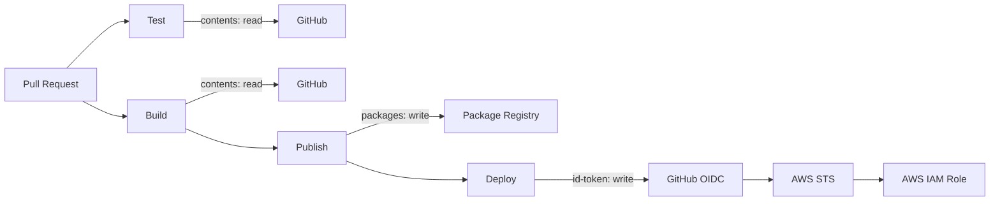
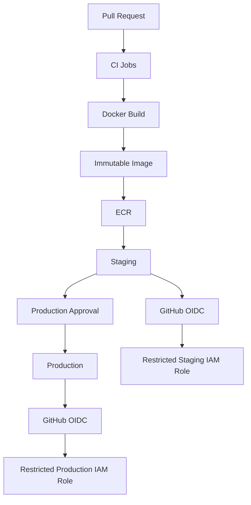

# 03- Permissions and Least Privilege

## Overview

GitHub Actions permissions determine what a workflow can do through its execution identity, particularly through `GITHUB_TOKEN`. Permissions are a security boundary between workflow code and GitHub resources.

A production workflow should not be designed around the assumption that every job needs broad repository access. Instead, each job should receive the smallest set of capabilities required to perform its responsibility.

The core principle is:

```text
Workflow
    ↓
Job
    ↓
Required Operation
    ↓
Minimum Permission
    ↓
Minimum Blast Radius
```

This becomes increasingly important as CI/CD pipelines grow to include:

- Pull request validation.
- Matrix testing.
- Docker builds.
- Package publishing.
- Releases.
- Deployment workflows.
- AWS OIDC authentication.
- Reusable workflows.
- Third-party actions.
- Self-hosted runners.
- Production environments.

Least privilege should therefore be treated as an architectural property of the entire CI/CD system rather than as a single YAML setting.

## GitHub Actions Permission Model

A workflow executes inside a GitHub Actions security context. Depending on the event, repository configuration, workflow permissions, and job configuration, the workflow may receive different capabilities.

The simplified model is:

```text
Workflow Trigger
      ↓
Workflow Security Context
      ↓
Workflow Permissions
      ↓
Job Permissions
      ↓
GITHUB_TOKEN / OIDC / Other Credentials
      ↓
GitHub or External Resources
```

The important distinction is between:

- Authentication — who or what is making the request.
- Authorization — what that identity is allowed to do.

`GITHUB_TOKEN` provides workflow authentication to GitHub, while the `permissions` configuration controls the GitHub capabilities available to that token.

## Why Least Privilege Matters

A workflow executes code.

That code may come from:

- Repository source code.
- Pull requests.
- Dependencies.
- Third-party actions.
- Build scripts.
- Dockerfiles.
- Test utilities.
- Custom scripts.

If the workflow receives excessive permissions, a compromise of any executed component can potentially become a repository-level security problem.

For example:

```text
Malicious Code
      ↓
Workflow Execution
      ↓
GITHUB_TOKEN
      ↓
contents: write
      ↓
Repository Modification
      ↓
Workflow Modification
      ↓
Persistent CI/CD Compromise
```

With:

```yaml
permissions:
  contents: read
```

the same workflow has substantially less repository modification capability.

## Permission Categories

GitHub Actions exposes multiple permission areas.

| Permission | Typical Use |
|---|---|
| `contents` | Repository contents |
| `actions` | Actions and workflow resources |
| `checks` | Check runs |
| `deployments` | Deployment resources |
| `issues` | Issues |
| `packages` | GitHub Packages |
| `pull-requests` | Pull request resources |
| `statuses` | Commit statuses |
| `id-token` | OIDC identity tokens |

The exact set of available permissions and their behavior should be considered in the context of the GitHub feature being accessed.

## Read and Write Permissions

Many permission categories support read/write semantics.

Conceptually:

```text
read
    ↓
Inspect / consume

write
    ↓
Create / modify / publish
```

Write access should receive additional scrutiny because it expands the possible impact of a compromised workflow.

For example:

```yaml
permissions:
  contents: read
```

is materially different from:

```yaml
permissions:
  contents: write
```

A testing workflow generally needs the former. A release workflow may legitimately require the latter.

## Workflow-Level Permissions

Permissions can be defined at the workflow level.

```yaml
name: CI

on:
  pull_request:

permissions:
  contents: read

jobs:
  test:
    runs-on: ubuntu-latest

    steps:
      - name: Checkout
        uses: actions/checkout@v4

      - name: Run tests
        run: pytest
```

This establishes a baseline for all jobs in the workflow.

Workflow-level permissions are useful when most jobs share the same security requirements.

## Job-Level Permissions

Different jobs often have different responsibilities.

Consider:

```text
Test
  → Read source

Build
  → Read source

Publish
  → Publish package

Deploy
  → Request OIDC token
```

These jobs should not necessarily receive the same permissions.

Example:

```yaml
permissions:
  contents: read

jobs:
  test:
    runs-on: ubuntu-latest

    permissions:
      contents: read

    steps:
      - uses: actions/checkout@v4
      - run: pytest

  publish:
    runs-on: ubuntu-latest

    permissions:
      contents: read
      packages: write

    steps:
      - uses: actions/checkout@v4
      - run: ./scripts/publish.sh
```

The publish job receives additional capability without giving the test job package publishing permissions.

## Permission Inheritance

A useful mental model is:

```text
Workflow Permissions
        ↓
Default Job Capability
        ↓
Job-Level Permissions
        ↓
Effective Job Capability
```

When designing a workflow, always determine the effective permissions at the job where sensitive operations occur.

Do not assume that because one job needs a permission, every job should receive it.

## Minimal Baseline

For a normal repository validation workflow:

```yaml
permissions:
  contents: read
```

is a useful baseline when the workflow only needs to read repository contents.

For example:

```yaml
name: Backend CI

on:
  pull_request:

permissions:
  contents: read

jobs:
  test:
    runs-on: ubuntu-latest

    steps:
      - uses: actions/checkout@v4

      - uses: actions/setup-python@v5
        with:
          python-version: "3.12"

      - run: pip install -r requirements.txt
      - run: pytest
```

The workflow does not need repository write permissions merely because it runs tests.

## Permission Design by Pipeline Stage

A production pipeline can separate capabilities by responsibility.

| Pipeline Stage | Typical Permissions |
|---|---|
| Lint | `contents: read` |
| Unit tests | `contents: read` |
| Integration tests | `contents: read` |
| Security scanning | `contents: read` |
| Docker build | `contents: read` |
| Package publish | `contents: read`, `packages: write` |
| Release | `contents: write` when required |
| AWS deployment | `contents: read`, `id-token: write` |
| GitHub deployment metadata | Additional deployment permission if required |

The exact permission set must be based on the operations actually performed.

## `contents`

`contents` controls access to repository contents and related repository operations.

A CI workflow commonly needs:

```yaml
permissions:
  contents: read
```

because it needs to check out source code.

A release or automation workflow may require:

```yaml
permissions:
  contents: write
```

when it needs to modify repository state.

Do not grant write access simply because `actions/checkout` is used.

## `packages`

A workflow publishing a package to GitHub Packages may need:

```yaml
permissions:
  contents: read
  packages: write
```

For example:

```yaml
jobs:
  publish:
    permissions:
      contents: read
      packages: write

    runs-on: ubuntu-latest

    steps:
      - uses: actions/checkout@v4

      - name: Build package
        run: python -m build

      - name: Publish package
        run: ./scripts/publish.sh
```

The workflow does not automatically need repository write access.

## `pull-requests`

A workflow interacting with pull requests may require pull-request permissions.

Examples include workflows that:

- Update pull-request metadata.
- Add comments.
- Manage pull-request-related resources.
- Read or modify pull-request state where permitted.

Grant the required access rather than broadly enabling repository write permissions.

## `issues`

Automation that interacts with issues may require:

```yaml
permissions:
  issues: write
```

This should be isolated to the job that performs the issue operation.

A test job does not need issue write access simply because another automation job creates issue comments.

## `actions`

The `actions` permission is relevant when workflows need to interact with Actions-related resources.

This should be granted only when the workflow actually performs such operations.

Avoid creating a general-purpose automation job with broad access to repository Actions resources unless the responsibility requires it.

## `checks`

Workflows that create or update check-related resources may need the appropriate `checks` permission.

The important engineering principle remains the same:

```text
Operation
    ↓
Required Permission
```

rather than:

```text
Workflow
    ↓
All Permissions
```

## `statuses`

Some CI integrations update commit statuses.

If the workflow genuinely requires status modification, grant the relevant permission.

Do not use unrelated write permissions as a workaround for a missing status capability.

## `deployments`

Deployment workflows may interact with deployment resources.

A production deployment job should have only the GitHub permissions required for its deployment process.

It may also have separate cloud permissions through OIDC and AWS IAM.

These are different security boundaries.

## `id-token`

`id-token: write` is commonly used for OIDC-based authentication.

Example:

```yaml
permissions:
  contents: read
  id-token: write
```

The permission allows the job to request an OIDC identity token.

It does not directly grant access to AWS resources.

The security flow is:

```text
GitHub Actions Job
       ↓
id-token: write
       ↓
OIDC Identity Token
       ↓
AWS STS
       ↓
IAM Role Trust Policy
       ↓
Temporary AWS Credentials
       ↓
AWS APIs
```

## Why `id-token: write` Is Sensitive

A test job that does not deploy to AWS should normally not need:

```yaml
id-token: write
```

If every job receives the permission, a compromise in an unrelated job may provide a path toward obtaining a cloud identity token.

A better design is:

```yaml
jobs:
  test:
    permissions:
      contents: read

  deploy:
    permissions:
      contents: read
      id-token: write
```

Cloud identity is therefore isolated to the deployment boundary.

## GitHub Permissions vs AWS Permissions

GitHub permissions and AWS IAM permissions are separate.

```text
GitHub Actions
      │
      ├── GITHUB_TOKEN
      │       └── GitHub permissions
      │
      └── OIDC
              └── AWS IAM role
                      └── AWS permissions
```

A secure pipeline must minimize both.

For example:

```text
GitHub:
contents: read
id-token: write

AWS:
ecr: push
ecs: update
```

The GitHub job should not receive unrelated GitHub permissions, and the AWS role should not receive unrelated AWS permissions.

## Permission Boundaries Around Jobs

A useful production architecture is:



Each boundary limits what the corresponding job can do.

## Permissions and Pull Requests

Pull-request workflows require special attention because workflow code may process untrusted changes.

A pull request can modify:

```text
Python code
Shell scripts
Dockerfiles
Tests
Build scripts
Workflow files
Dependency definitions
```

These files may execute during CI.

The risk becomes:

```text
Untrusted Repository Changes
          ↓
Workflow Execution
          ↓
GITHUB_TOKEN
          ↓
Excessive Permissions
          ↓
Security Boundary Violation
```

Least privilege reduces the impact if the workflow executes malicious code.

## `pull_request`

A standard pull-request validation workflow might use:

```yaml
on:
  pull_request:

permissions:
  contents: read
```

This is appropriate for workflows whose purpose is to validate changes without modifying protected repository state.

## `pull_request_target`

`pull_request_target` requires particular caution because it executes in the context of the target repository.

A dangerous design is:

```text
pull_request_target
       ↓
Checkout untrusted PR code
       ↓
Execute untrusted code
       ↓
Privileged token
       ↓
Repository modification
```

The problem is not the event name alone. The problem is combining a privileged execution context with untrusted code.

Separate trusted operations from untrusted validation.

## Safe Trust Boundaries

A safer design is:

```text
Pull Request
     ↓
Untrusted Validation
     ↓
Tests / Security Checks
     ↓
Artifact
     ↓
Trusted Workflow
     ↓
Deployment / Release
```

The trusted stage should consume validated outputs rather than blindly executing arbitrary pull-request code with privileged credentials.

## Shell Injection and Permissions

Least privilege does not eliminate command injection risk.

For example:

```yaml
run: echo "${{ github.event.pull_request.title }}"
```

can become dangerous because the pull-request title is external input.

Prefer:

```yaml
- name: Process title
  env:
    PR_TITLE: ${{ github.event.pull_request.title }}
  run: |
    printf '%s\n' "$PR_TITLE"
```

Security requires both:

```text
Safe Input Handling
+
Least Privilege
```

## User-Controlled Inputs

Manual workflow inputs should be treated as data rather than trusted shell syntax.

Example:

```yaml
on:
  workflow_dispatch:
    inputs:
      environment:
        description: Target environment
        required: true
        type: choice
        options:
          - staging
          - production
```

Restricting the input to known values is preferable to accepting an arbitrary string when the workflow has a finite set of valid targets.

## Branch Names and Commit Messages

Branch names and commit messages can contain attacker-controlled content.

Avoid direct interpolation:

```yaml
run: ./deploy.sh ${{ github.ref_name }}
```

Prefer:

```yaml
env:
  REF_NAME: ${{ github.ref_name }}
run: |
  ./deploy.sh "$REF_NAME"
```

The shell receives the value as data rather than as part of the command syntax.

## Third-Party Actions

Third-party actions execute as part of the workflow and may have access to capabilities available to their job.

Therefore:

```text
Job Permissions
       ↓
Third-Party Action
       ↓
Potential GitHub API Access
```

If the job has:

```yaml
permissions:
  contents: write
```

a compromised action executing in that job may potentially exploit that capability.

Least privilege limits the impact.

## Action Permission Review

Before introducing an action, evaluate:

- What the action does.
- What permissions it requires.
- What secrets it receives.
- Whether it executes arbitrary commands.
- Its source repository.
- Its dependencies.
- Its release process.
- Its versioning strategy.
- Whether it needs network access.
- Whether it runs on a self-hosted runner.

A third-party action should not receive privileges simply because the workflow happens to have them available.

## Action Pinning

An action can be referenced by a major version:

```yaml
uses: actions/checkout@v4
```

or a specific release:

```yaml
uses: actions/checkout@v4.2.2
```

Organizations with stronger supply-chain requirements may pin actions to immutable commit SHAs:

```yaml
uses: actions/checkout@<commit-sha>
```

SHA pinning improves immutability because a tag can move while a commit SHA identifies a specific revision.

## Reusable Workflows

Reusable workflows provide an important mechanism for standardizing permission policies.

For example, an organization can maintain a shared CI workflow that establishes:

```yaml
permissions:
  contents: read
```

and only grants additional permissions to specific deployment jobs.

This reduces permission drift across repositories.

## Reusable Workflow Trust

A reusable workflow should be treated as a privileged platform component when it receives:

- Repository secrets.
- `GITHUB_TOKEN` write permissions.
- OIDC capability.
- Deployment credentials.
- Production environment access.

A shared workflow therefore requires:

- Version control.
- Code ownership.
- Review.
- Release management.
- Consumer awareness.
- Security testing.

## Secrets and Least Privilege

Permissions apply to GitHub capabilities, while secrets provide credentials for external systems.

Both must follow least privilege.

Avoid:

```yaml
env:
  AWS_ACCESS_KEY_ID: ${{ secrets.AWS_ACCESS_KEY_ID }}
  AWS_SECRET_ACCESS_KEY: ${{ secrets.AWS_SECRET_ACCESS_KEY }}
```

at workflow scope when only one deployment step requires the credentials.

Prefer narrower scope:

```yaml
- name: Deploy
  env:
    AWS_ACCESS_KEY_ID: ${{ secrets.AWS_ACCESS_KEY_ID }}
    AWS_SECRET_ACCESS_KEY: ${{ secrets.AWS_SECRET_ACCESS_KEY }}
  run: ./scripts/deploy.sh
```

For AWS deployments, OIDC is preferable where supported so that long-lived AWS credentials do not need to be stored.

## Environment Protection

Production environments provide an additional security boundary.

A deployment architecture can be:

```text
Build
  ↓
Staging
  ↓
Validation
  ↓
Production Environment
  ↓
Approval
  ↓
Deployment
```

Environment protection can be combined with:

- Required reviewers.
- Environment-specific secrets.
- Deployment restrictions.
- Deployment history.
- Concurrency controls.

Permissions alone should not be the only production protection mechanism.

## Permission Design for Development, Staging, and Production

A common model is:

```text
Development
    ↓
Lower operational impact

Staging
    ↓
Production-like validation

Production
    ↓
Strongest controls
```

Production deployment jobs should normally have stronger isolation and approval requirements than ordinary CI jobs.

## Production Permission Architecture

A mature backend pipeline might use:

```text
Pull Request
    ↓
CI
    ├── contents: read
    ├── Tests
    └── Security Scan
          ↓
Build
    ├── contents: read
    └── Immutable Artifact
          ↓
Staging
    ├── id-token: write
    └── Restricted AWS Role
          ↓
Approval
          ↓
Production
    ├── id-token: write
    └── Production AWS Role
```

Staging and production can use different IAM roles even though both authenticate through GitHub OIDC.

## Immutable Artifacts

Least privilege works particularly well with immutable artifacts.

Instead of rebuilding for every environment:

```text
Build → Staging
Build → Production
```

prefer:

```text
Build
  ↓
Immutable Artifact
  ↓
Staging
  ↓
Approval
  ↓
Same Artifact
  ↓
Production
```

The production job does not need build permissions if the artifact already exists.

This reduces both operational complexity and the number of capabilities required by the deployment stage.

## Docker Example

A backend pipeline might build:

```text
Python Application
       ↓
Docker Buildx
       ↓
Image
       ↓
ECR
       ↓
Staging
       ↓
Production
```

The build job may need package or registry access, while the deployment job may need OIDC access to AWS.

Separating these responsibilities reduces privilege concentration.

## Docker Build Security

Do not expose `GITHUB_TOKEN` unnecessarily to Docker build processes.

Avoid designs where credentials become part of image layers.

Use BuildKit-supported secret mechanisms when a private dependency or package source genuinely requires a secret during the build.

The desired property is:

```text
Build Secret
    ↓
Temporary Build Access
    ↓
Not Included in Final Image
```

## Self-Hosted Runners

Self-hosted runners introduce another security boundary.

A self-hosted runner may have access to:

- Internal networks.
- Cloud resources.
- Persistent files.
- Custom software.
- Credentials.
- Local Docker state.

If a workflow has excessive permissions and runs on a persistent self-hosted runner, compromise can have a larger blast radius.

## Persistent vs Ephemeral Runners

Persistent runner:

```text
Job
 ↓
Runner
 ↓
Workspace / State
 ↓
Next Job
```

Ephemeral runner:

```text
Job
 ↓
Fresh Runner
 ↓
Job Complete
 ↓
Runner Destroyed
```

Ephemeral execution can reduce cross-job contamination and persistence risks.

For untrusted workloads, runner isolation is especially important.

## Private Network Access

Some deployment jobs require access to:

- Private databases.
- Internal APIs.
- Private Kubernetes clusters.
- Internal AWS resources.

A self-hosted runner may provide this connectivity.

However:

```text
Private Network Access
+
Untrusted Code
```

can create a significant security boundary.

Do not place untrusted pull-request workloads on highly privileged persistent runners simply because they have convenient network access.

## Permissions and Concurrency

Concurrency is not itself an authorization mechanism, but it is important for safely operating privileged workflows.

For example:

```yaml
concurrency:
  group: production-deployment
  cancel-in-progress: false
```

This prevents multiple production deployment executions from operating simultaneously under the same concurrency group.

This is especially important when jobs have:

```yaml
permissions:
  id-token: write
```

and can modify production infrastructure.

## Permission Governance

At organization level, permissions should be treated as a governance concern.

Useful controls include:

- Standard workflow templates.
- Reusable workflows.
- Action allowlists.
- Permission policies.
- Review requirements.
- CODEOWNERS for workflow files.
- Security reviews for deployment workflows.
- Restricted production environments.
- Runner governance.
- Secret governance.

The objective is to prevent every repository from independently inventing its own security model.

## Workflow File Protection

Workflow files are security-sensitive.

A change to:

```text
.github/workflows/*.yml
```

can change:

- Triggers.
- Permissions.
- Secrets usage.
- Deployment behavior.
- Runner selection.
- Third-party actions.
- Environment access.
- OIDC access.

Therefore, workflow changes should receive appropriate review and ownership controls.

## Permission Drift

Permission drift occurs when workflows accumulate capabilities over time.

For example:

```text
Initial:
contents: read

Later:
contents: write

Later:
packages: write

Later:
id-token: write

Later:
issues: write
```

without a clear justification for each addition.

Regular permission reviews should remove capabilities that are no longer required.

## Permission Review Process

A practical review process is:

```text
Identify Job
    ↓
List Operations
    ↓
Identify Required Permissions
    ↓
Remove Unused Permissions
    ↓
Test Workflow
    ↓
Review Failure Paths
    ↓
Document Exceptional Access
```

Do not use trial-and-error broadening as the permanent solution.

## Troubleshooting Permission Failures

Use the following model:

```text
Symptom
   ↓
Possible Causes
   ↓
Isolation Strategy
   ↓
Commands / Checks
   ↓
Root Cause
   ↓
Corrective Action
   ↓
Prevention
```

### Symptom: GitHub API Returns 403

Possible causes:

- Missing permission.
- Incorrect job-level permissions.
- Event-specific security restrictions.
- Resource ownership restrictions.
- Token cannot access the requested resource.

Check the workflow permissions first.

Example:

```yaml
permissions:
  contents: read
```

If the operation requires repository modification, determine whether:

```yaml
contents: write
```

is genuinely required.

### Symptom: `actions/checkout` Fails

Possible causes include:

- Repository access restrictions.
- Incorrect workflow context.
- Token permissions.
- Repository configuration.
- Event-specific restrictions.

For a standard repository checkout, verify that the job has appropriate contents access.

### Symptom: AWS OIDC Authentication Fails

Check:

```text
Job permissions
    ↓
id-token: write
    ↓
OIDC configuration
    ↓
AWS IAM trust policy
    ↓
Role ARN
    ↓
AWS permissions
```

Do not solve an OIDC trust failure by storing long-lived credentials without first diagnosing the trust relationship.

### Symptom: Package Publish Fails

Check whether the publishing job has the required package permission:

```yaml
permissions:
  contents: read
  packages: write
```

Do not automatically add:

```yaml
contents: write
```

unless repository modification is also required.

### Symptom: Workflow Cannot Update a Pull Request

Determine whether the operation requires:

```yaml
pull-requests: write
```

or another specific permission.

Keep the additional capability isolated to the job performing the operation.

## GitHub CLI for Permission Diagnostics

List recent workflow runs:

```bash
gh run list
```

Inspect a run:

```bash
gh run view RUN_ID
```

Inspect logs:

```bash
gh run view RUN_ID --log
```

Inspect repository information:

```bash
gh repo view
```

List configured repository secrets:

```bash
gh secret list
```

List repository variables:

```bash
gh variable list
```

The GitHub CLI is useful for operational investigation, but secret values should never be exposed merely for debugging.

## Common Mistakes

### Giving Every Workflow Write Access

This increases the blast radius of every workflow execution.

Use explicit minimum permissions.

### Granting Permissions at Workflow Scope When Only One Job Needs Them

If only deployment requires OIDC, do not grant:

```yaml
id-token: write
```

to the entire workflow.

### Using `contents: write` for Checkout

Checkout normally requires repository read access, not repository write access.

### Using `pull_request_target` as a Shortcut

A privileged event combined with untrusted code can create a severe security boundary violation.

### Passing Untrusted Values Directly to Shell Commands

Do not assume branch names, PR titles, issue content, or commit messages are safe.

Use environment variables and safe argument handling.

### Giving Third-Party Actions Excessive Permissions

The action executes inside the job's security context.

Reduce job permissions before introducing third-party automation.

### Treating OIDC as Automatically Safe

OIDC removes the need for long-lived cloud credentials, but the resulting AWS IAM role must still be tightly scoped.

### Running Untrusted Code on Privileged Persistent Runners

A persistent runner can expose filesystem, network, and credential state across jobs.

Use appropriate runner isolation.

### Never Removing Old Permissions

Permissions should be reviewed as the workflow evolves.

Unused capabilities become unnecessary attack surface.

## Performance and Operational Considerations

Least privilege generally has minimal direct runtime overhead. Its primary value is security and operational containment.

However, permission isolation can influence pipeline architecture.

For example:

```text
Test
 ↓
Build
 ↓
Publish
 ↓
Deploy
```

may require explicit job boundaries rather than putting every operation into one large job.

Those boundaries provide additional advantages:

- Smaller failure domains.
- Clearer permissions.
- Better observability.
- Easier retries.
- Easier auditing.
- Reduced credential exposure.
- Better separation of responsibilities.

A highly privileged monolithic job is often operationally harder to reason about than several narrowly scoped jobs.

## Reliability and Least Privilege

Security and reliability are closely connected.

If a deployment job has access to only the artifact and deployment system it requires, an unrelated test failure or compromised dependency has fewer ways to affect production.

The architecture becomes:

```text
CI
 ↓
Immutable Artifact
 ↓
Protected Deployment
 ↓
Restricted Identity
 ↓
Production
```

instead of:

```text
Everything
 ↓
One Highly Privileged Job
 ↓
Production
```

The latter creates a larger failure domain.

## High Availability Considerations

CI/CD permissions should not become a single operational bottleneck.

For critical deployment systems:

- Use reusable workflows for standardized security controls.
- Keep deployment identities separate from CI identities.
- Use immutable artifacts.
- Maintain rollback mechanisms.
- Protect production environments.
- Control concurrent deployments.
- Keep runner infrastructure reliable.
- Avoid a single long-lived credential shared by all workflows.

The deployment system should remain recoverable even when an individual workflow run fails.

## Disaster Recovery

CI/CD recovery should include the ability to:

- Re-run trusted workflows.
- Retrieve immutable artifacts.
- Roll back to a known artifact.
- Re-authenticate through OIDC.
- Recreate runner infrastructure.
- Restore workflow configuration.
- Re-establish required environment configuration.

Long-lived credentials should not be the recovery mechanism.

A stronger model is:

```text
Source
  ↓
Reproducible Build
  ↓
Immutable Artifact
  ↓
Temporary Identity
  ↓
Deployment
```

## Security Review Checklist

### Workflow Permissions

- [ ] Is there an explicit workflow-level permission baseline?
- [ ] Does every job receive only required permissions?
- [ ] Are write permissions justified?
- [ ] Are `id-token: write` permissions isolated?
- [ ] Are package permissions isolated?
- [ ] Are release permissions isolated?

### Pull Requests

- [ ] Are fork pull requests treated as untrusted?
- [ ] Is `pull_request_target` used only where appropriate?
- [ ] Is untrusted code prevented from receiving privileged credentials?
- [ ] Are user-controlled values safely passed to shell commands?

### Actions

- [ ] Are third-party actions trusted?
- [ ] Are action versions controlled?
- [ ] Is SHA pinning required by organizational policy?
- [ ] Are action permissions minimized?
- [ ] Are reusable workflows reviewed as privileged components?

### Secrets

- [ ] Are secrets scoped to the smallest required job or step?
- [ ] Are secrets excluded from untrusted workflows?
- [ ] Are secrets prevented from appearing in logs?
- [ ] Are artifacts checked for accidental credential exposure?
- [ ] Are long-lived AWS credentials avoided where OIDC is available?

### Runners

- [ ] Are untrusted jobs isolated?
- [ ] Are persistent runners protected?
- [ ] Are privileged network connections restricted?
- [ ] Are ephemeral runners used where appropriate?
- [ ] Are runner groups and labels governed?

### Production

- [ ] Are production environments protected?
- [ ] Are deployments serialized where necessary?
- [ ] Are artifacts immutable?
- [ ] Can deployments be rolled back?
- [ ] Are production IAM roles restricted?
- [ ] Is the same artifact promoted between environments?

## Senior-Level Design Scenario

Consider a Python service with:

```text
Django / FastAPI
PostgreSQL
Redis
Docker
AWS ECR
AWS ECS
GitHub Actions
```

The desired pipeline is:

```text
Pull Request
    ↓
Lint
    ↓
Unit Tests
    ↓
Integration Tests
    ↓
Security Scan
    ↓
Docker Build
    ↓
Immutable Image
    ↓
ECR
    ↓
Staging
    ↓
Approval
    ↓
Production
```

A least-privilege design could be:

| Job | GitHub Capability |
|---|---|
| Lint | `contents: read` |
| Unit tests | `contents: read` |
| Integration tests | `contents: read` |
| Security scan | `contents: read` |
| Docker build | `contents: read` |
| ECR publish | `contents: read`, `id-token: write` |
| Staging deployment | `contents: read`, `id-token: write` |
| Production deployment | `contents: read`, `id-token: write` |

AWS IAM then provides the separate cloud-side authorization boundary.



The key design property is that no single job needs unrestricted access to the entire system.

## Interview Scenarios

### Production Deployment Must Not Run Twice

Explain how you would combine:

- Job-level permissions.
- Production environments.
- Concurrency groups.
- Immutable artifacts.
- OIDC.
- Restricted AWS IAM roles.

The important reasoning is to separate authorization from concurrency:

```text
Permissions
    ↓
What the job can do

Concurrency
    ↓
When the job can do it
```

### AWS Credentials Must Not Be Long-Lived Secrets

Design:

```text
GitHub Actions
    ↓
id-token: write
    ↓
GitHub OIDC
    ↓
AWS STS
    ↓
Restricted IAM Role
```

Explain both the GitHub permission and AWS trust policy.

### A Third-Party Action Is Compromised

Determine:

1. Which job executes the action?
2. What permissions does the job have?
3. Which secrets are available?
4. Which network resources can the runner access?
5. Is the runner persistent?
6. Can the action modify repository state?
7. Can it obtain an OIDC token?
8. Can it influence production deployment?

The goal is to determine blast radius rather than merely replacing the action.

### Multiple Python Versions Must Be Tested

Use a matrix:

```yaml
strategy:
  matrix:
    python-version:
      - "3.11"
      - "3.12"
```

The matrix jobs should receive only the permissions required for testing.

There is no reason for each matrix worker to receive deployment credentials.

### PostgreSQL and Redis Are Required

Use service containers:

```text
Test Job
 ├── contents: read
 ├── PostgreSQL service
 ├── Redis service
 └── pytest
```

Database and cache access do not require additional GitHub repository permissions.

### Docker Image Must Be Promoted Without Rebuilding

Use:

```text
Build
  ↓
Immutable Image
  ↓
ECR
  ↓
Staging
  ↓
Approval
  ↓
Same Image
  ↓
Production
```

This reduces the production deployment job's responsibilities and helps preserve artifact integrity.

### Self-Hosted Runner Requires Private Network Access

Evaluate:

```text
Runner
 ├── Network Access
 ├── Filesystem
 ├── Credentials
 ├── Docker Socket
 └── GitHub Permissions
```

Do not solve network access by placing untrusted pull-request execution on a highly privileged persistent runner.

## Architecture Principles

A mature GitHub Actions security architecture follows several principles:

```text
Least Privilege
      +
Strong Trust Boundaries
      +
Immutable Artifacts
      +
Temporary Credentials
      +
Protected Environments
      +
Isolated Runners
      +
Controlled Concurrency
      +
Auditable Workflows
```

Each control addresses a different failure mode.

No single permission setting provides complete CI/CD security.

## Production Design Checklist

Before approving a production GitHub Actions workflow, verify:

```text
1. What does each job need to do?
2. What GitHub permissions does each operation require?
3. Which jobs execute untrusted code?
4. Which jobs receive secrets?
5. Which jobs can request OIDC tokens?
6. Which jobs can modify repository state?
7. Which jobs can publish artifacts?
8. Which jobs can deploy?
9. Which jobs can access private networks?
10. Which third-party actions execute?
11. Which runners execute the workload?
12. Can the deployment run concurrently?
13. Is the artifact immutable?
14. Can production be rolled back?
15. What is the blast radius if this job is compromised?
```

The final question is often the most important:

```text
"If this job is fully compromised,
what is the maximum damage it can cause?"
```

Least privilege is the architectural answer to reducing that maximum impact.

## Key Takeaways

- GitHub Actions permissions should be designed per responsibility, with read access as the normal baseline and write or identity permissions granted only when an operation requires them.
- Job-level permissions create meaningful security boundaries between testing, building, publishing, releasing, and deployment stages.
- Least privilege must be combined with safe handling of untrusted pull-request data, third-party action controls, protected environments, runner isolation, and secure secret management.
- `id-token: write` should be isolated to jobs that require cloud federation, while AWS IAM trust and permissions provide the separate cloud-side authorization boundary.
- Production pipelines should minimize blast radius through immutable artifacts, temporary credentials, protected deployments, controlled concurrency, and narrowly scoped workflow identities.