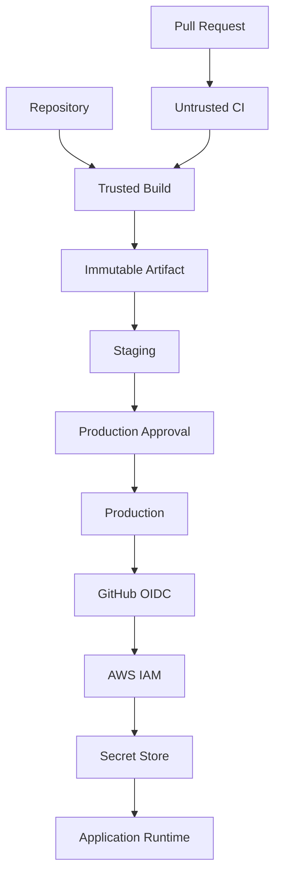

# 04- Secrets Security

## Overview

Secrets are credentials or sensitive values used by CI/CD workflows to authenticate with external systems or protected services. In GitHub Actions, secrets can include cloud credentials, API keys, database passwords, signing material, package registry credentials, and application configuration that must not be exposed to workflow logs or untrusted code.

Secret security is broader than simply storing a value under **Settings → Secrets**. A production-grade design must control:

- Where secrets are stored.
- Which workflows can access them.
- Which jobs can access them.
- Which environments can expose them.
- How secrets are passed to processes.
- Whether untrusted code can execute with them.
- Whether secrets can appear in logs or artifacts.
- How third-party actions interact with them.
- How credentials are rotated and revoked.
- Whether a secret can be replaced with short-lived identity.

The security model should be:

```text
Secret
  ↓
Smallest Required Scope
  ↓
Trusted Workflow / Job
  ↓
Controlled Process
  ↓
External System
```

The objective is not merely to hide secrets. It is to minimize the opportunity for a compromised workflow component to obtain, expose, reuse, or persist them.

## What Is a GitHub Actions Secret?

A GitHub Actions secret is a sensitive value made available to workflows through GitHub's secret-management mechanisms.

A workflow can reference a secret with:

```yaml
${{ secrets.API_KEY }}
```

For example:

```yaml
- name: Call service
  env:
    API_KEY: ${{ secrets.API_KEY }}
  run: ./scripts/call-service.sh
```

The secret should be consumed by the process that requires it without being printed or unnecessarily propagated to other steps.

## Why Secrets Exist

CI/CD pipelines frequently need credentials to interact with external systems.

Typical examples include:

| Secret Type | Example Use |
|---|---|
| API key | External REST API |
| Database credential | Integration environment |
| Package credential | Private package registry |
| Signing key | Artifact signing |
| Webhook credential | External automation |
| Cloud credential | Legacy cloud authentication |
| Application secret | Deployment configuration |

However, not every credential should be implemented as a long-lived GitHub secret.

For example, AWS deployments can use GitHub OIDC and temporary credentials instead of storing long-lived AWS access keys.

## Secret Scope

GitHub Actions supports different secret scopes.

Common scopes include:

- Repository secrets.
- Organization secrets.
- Environment secrets.

The scope should match the ownership and operational boundary of the credential.

```text
Organization Secret
        ↓
Multiple Repositories

Repository Secret
        ↓
Repository Workflows

Environment Secret
        ↓
Specific Environment
```

A production credential should generally not be exposed to every workflow in a repository when it is only required by the production deployment environment.

## Repository Secrets

Repository secrets are appropriate for credentials used by workflows within a particular repository.

Example:

```yaml
- name: Publish package
  env:
    PACKAGE_TOKEN: ${{ secrets.PACKAGE_TOKEN }}
  run: ./scripts/publish.sh
```

Repository secrets should still be scoped carefully at the workflow and job level.

The fact that a secret is stored securely does not mean every job should receive it.

## Organization Secrets

Organization-level secrets can be shared across repositories according to configured access policies.

They are useful for common infrastructure such as:

- Shared services.
- Organization-wide integrations.
- Common signing infrastructure.
- Standard CI/CD systems.

However, organization-level secrets have a potentially larger blast radius.

A compromise of a repository that can access a broadly shared organization secret may affect multiple projects.

Therefore, organization secrets should have explicit repository access controls.

## Environment Secrets

Environment secrets associate credentials with environments such as:

```text
development
staging
production
```

For example:

```yaml
jobs:
  deploy:
    environment: production

    steps:
      - name: Deploy
        env:
          DEPLOY_TOKEN: ${{ secrets.DEPLOY_TOKEN }}
        run: ./scripts/deploy.sh
```

Environment protection can be combined with:

- Required reviewers.
- Deployment restrictions.
- Environment-specific configuration.
- Environment-specific secrets.
- Deployment history.

This creates an important production security boundary.

## Secret Scope Comparison

| Scope | Typical Use | Blast Radius |
|---|---|---|
| Repository | One repository | Repository |
| Organization | Multiple repositories | Potentially organization-wide |
| Environment | Specific deployment environment | Environment/workflow dependent |

Use the smallest practical scope.

## Secret Inheritance

Reusable workflows can receive secrets explicitly or through inheritance where supported.

Example:

```yaml
jobs:
  deploy:
    uses: organization/platform/.github/workflows/deploy.yml@v1
    secrets: inherit
```

`secrets: inherit` should not be treated as a default convenience mechanism.

A reusable workflow receiving inherited secrets should be considered trusted infrastructure because the called workflow may gain access to sensitive values.

## Explicit Secret Passing

When only a small number of secrets are required, explicit passing provides clearer contracts.

For example:

```yaml
jobs:
  deploy:
    uses: organization/platform/.github/workflows/deploy.yml@v1
    secrets:
      deployment-token: ${{ secrets.DEPLOYMENT_TOKEN }}
```

This communicates:

```text
Caller
  ↓
Specific Secret
  ↓
Reusable Workflow
```

rather than:

```text
Caller
  ↓
All Available Secrets
  ↓
Reusable Workflow
```

## Secret Availability and Untrusted Pull Requests

Pull requests are an important security boundary.

A workflow may execute code modified by a pull request, including:

- Python code.
- Shell scripts.
- Tests.
- Dockerfiles.
- Build scripts.
- Dependency installation logic.

If that code can access production credentials, the credential boundary is compromised.

The dangerous pattern is:

```text
Untrusted Pull Request
        ↓
Workflow Execution
        ↓
Production Secret
        ↓
Attacker-Controlled Code
```

Therefore, production secrets should not be made available to ordinary untrusted pull-request validation jobs.

## `pull_request` and Secrets

A standard pull-request workflow should be designed around the assumption that repository changes may be untrusted.

Example:

```yaml
name: Pull Request CI

on:
  pull_request:

permissions:
  contents: read

jobs:
  test:
    runs-on: ubuntu-latest

    steps:
      - uses: actions/checkout@v4

      - uses: actions/setup-python@v5
        with:
          python-version: "3.12"

      - run: pip install -r requirements.txt
      - run: pytest
```

This workflow does not require deployment credentials.

## Fork Pull Requests

Fork-based pull requests require additional caution because the source repository is outside the normal trusted repository boundary.

Treat code from a fork as untrusted.

A secure architecture separates:

```text
Untrusted PR Validation
        ↓
Tests / Scans
        ↓
Trusted Repository State
        ↓
Privileged Deployment
```

Do not expose production credentials merely because the workflow needs to execute tests.

## `pull_request_target`

`pull_request_target` requires particular care because it runs in the context of the target repository.

A dangerous pattern is:

```text
pull_request_target
       ↓
Checkout PR Code
       ↓
Execute PR Code
       ↓
Access Secrets
       ↓
Secret Exfiltration
```

The security problem is created by combining a privileged context with attacker-controlled code.

If privileged operations are required, isolate them from untrusted code execution.

## Secret Exposure Through Shell Commands

Avoid embedding secrets directly into command strings.

For example:

```yaml
- name: Call API
  run: curl -H "Authorization: Bearer ${{ secrets.API_TOKEN }}" https://api.example.com
```

Passing secrets through environment variables provides a cleaner separation:

```yaml
- name: Call API
  env:
    API_TOKEN: ${{ secrets.API_TOKEN }}
  run: |
    curl \
      --fail \
      --header "Authorization: Bearer ${API_TOKEN}" \
      https://api.example.com
```

The secret remains available to the process without being directly embedded into the workflow command definition.

## Secret Exposure Through Command Arguments

Command-line arguments can be exposed through:

- Process inspection.
- Debugging tools.
- Process listings.
- Tool-specific logging.
- Error output.

Where supported, prefer environment variables or dedicated secret-input mechanisms rather than passing credentials as command-line arguments.

For example, prefer:

```yaml
env:
  API_TOKEN: ${{ secrets.API_TOKEN }}
```

over:

```bash
./deploy.sh --token "$API_TOKEN"
```

when the underlying tool provides an environment-based authentication mechanism.

## Secret Masking

GitHub Actions attempts to mask secrets in workflow logs.

However:

```text
Masking
≠
Complete Secret Protection
```

Masking should be considered a defense against accidental log exposure, not permission to expose secrets to untrusted processes.

Never intentionally print a secret:

```yaml
- run: echo "${{ secrets.API_TOKEN }}"
```

## Debug Logging

Be careful when enabling verbose debugging.

Commands such as:

```bash
env
```

or:

```bash
printenv
```

can expose sensitive environment variables.

Instead, inspect only non-sensitive values:

```bash
printf 'Environment: %s\n' "$DEPLOY_ENV"
printf 'Commit: %s\n' "$GITHUB_SHA"
```

Do not use broad environment dumps as a normal troubleshooting technique in credential-bearing jobs.

## Secrets in Artifacts

Artifacts can accidentally become credential-storage mechanisms.

Avoid:

```yaml
- uses: actions/upload-artifact@v4
  with:
    name: debug
    path: .
```

The workspace may contain:

```text
.env
credentials.json
configuration files
logs
temporary files
test output
```

Prefer explicit paths:

```yaml
- uses: actions/upload-artifact@v4
  with:
    name: test-results
    path: |
      reports/junit.xml
      reports/coverage.xml
```

## Secrets in Logs

Credentials can leak through:

- Explicit `echo`.
- Debug output.
- Exception messages.
- Shell tracing.
- Dependency installation output.
- Deployment tools.
- HTTP client debugging.
- Application logs.

Be especially careful with:

```bash
set -x
```

because commands and expanded variables can become visible in logs.

Avoid enabling shell tracing around credential-consuming commands.

## Secrets in Docker Builds

Do not place secrets into Docker image layers.

Avoid:

```dockerfile
ARG API_TOKEN

RUN curl \
    -H "Authorization: Bearer ${API_TOKEN}" \
    https://private.example.com/package
```

A secret used as a build argument can potentially become exposed through build metadata or image history depending on how it is handled.

When a build genuinely requires a secret, use Docker BuildKit secret mechanisms so that the secret is provided temporarily and is not incorporated into the resulting image.

The desired flow is:

```text
Build Secret
    ↓
Temporary Build Step
    ↓
Dependency Retrieval
    ↓
Secret Removed
    ↓
Final Image
```

## Secret Handling in Python Applications

A Django or FastAPI application should generally receive deployment secrets through environment configuration rather than hard-coding them.

For example:

```python
import os

DATABASE_URL = os.environ["DATABASE_URL"]
SECRET_KEY = os.environ["SECRET_KEY"]
```

The GitHub Actions deployment step can provide environment-specific configuration without committing the values into source control.

Do not place:

```python
SECRET_KEY = "production-secret"
```

in source code.

## Django Deployment Example

A deployment workflow can use an environment-specific secret:

```yaml
jobs:
  deploy:
    runs-on: ubuntu-latest
    environment: production

    permissions:
      contents: read
      id-token: write

    steps:
      - uses: actions/checkout@v4

      - name: Deploy Django application
        env:
          DJANGO_SECRET_KEY: ${{ secrets.DJANGO_SECRET_KEY }}
        run: ./scripts/deploy.sh
```

The secret is scoped to the production deployment job.

## FastAPI Deployment Example

A FastAPI deployment may use:

```yaml
- name: Deploy API
  env:
    DATABASE_URL: ${{ secrets.PRODUCTION_DATABASE_URL }}
  run: ./scripts/deploy.sh
```

The deployment script should avoid printing the connection string.

For production systems, the deployed application's runtime secret store may be preferable to injecting long-lived application secrets directly through CI.

## CI Database Credentials

Integration tests may require database credentials.

For example:

```yaml
jobs:
  integration:
    runs-on: ubuntu-latest

    services:
      postgres:
        image: postgres:16
        env:
          POSTGRES_USER: test_user
          POSTGRES_PASSWORD: test_password
          POSTGRES_DB: test_db
```

For an ephemeral test database, static test credentials may be acceptable when they have no production privileges and the database exists only for the test job.

Do not reuse production database credentials for CI.

## Production vs Test Credentials

Use separate credentials:

```text
CI
 ↓
Test Database
 ↓
Limited Test User

Production
 ↓
Production Database
 ↓
Restricted Production Identity
```

Never use:

```text
CI
 ↓
Production Database Credentials
```

even if the workflow is convenient.

## Redis Credentials

The same principle applies to Redis.

An integration-test Redis instance should not use production credentials or connect to production infrastructure merely because the application uses Redis in production.

For CI:

```text
Test Job
  ↓
Ephemeral Redis
  ↓
Test Credentials
```

For production:

```text
Deployment
  ↓
Production Environment
  ↓
Production Redis Configuration
```

## Kafka Credentials

If integration tests use Kafka, create isolated test credentials and test infrastructure.

Avoid exposing production Kafka credentials to pull-request workflows.

This is particularly important because message-broker credentials can allow:

- Publishing messages.
- Consuming sensitive events.
- Accessing production topics.
- Modifying consumer state.

## Secret Rotation

Secrets should have a lifecycle.

```text
Create
  ↓
Use
  ↓
Monitor
  ↓
Rotate
  ↓
Revoke Old Credential
  ↓
Verify
```

Rotation should be designed before an incident occurs.

A credential that cannot be rotated safely becomes an operational risk.

## Rotation Without Downtime

For services that support overlapping credentials, use a staged rotation:

```text
Old Credential
      ↓
Create New Credential
      ↓
Deploy New Credential
      ↓
Verify
      ↓
Revoke Old Credential
```

This avoids breaking production deployments during rotation.

## Incident Response

If a secret is exposed:

```text
Detect
  ↓
Revoke / Rotate
  ↓
Identify Exposure
  ↓
Assess Usage
  ↓
Review Logs
  ↓
Deploy Replacement
  ↓
Verify
  ↓
Document Root Cause
```

Do not assume that deleting the leaked log line or commit makes the credential safe.

The credential itself should be considered compromised.

## Secret Exposure in Git History

If a credential is committed to Git:

```text
git history
    ↓
Secret exists in repository history
```

Removing it from the latest commit does not necessarily remove it from the repository's history.

The immediate response should focus on:

1. Revoking or rotating the credential.
2. Determining exposure.
3. Removing the secret from current source.
4. Cleaning history when appropriate.
5. Reviewing downstream systems.

Credential rotation is more important than merely deleting the visible string.

## Organization-Level Secret Governance

Organizations should define:

- Who can create secrets.
- Who can update secrets.
- Which repositories can access organization secrets.
- Which environments can access production secrets.
- How secrets are rotated.
- How secret access is audited.
- How incidents are handled.

Shared secrets should have an explicit owner.

## Secret Naming

Use descriptive names that communicate purpose without embedding the secret itself.

Examples:

```text
PYPI_API_TOKEN
PRODUCTION_DATABASE_URL
SENTRY_AUTH_TOKEN
DEPLOYMENT_TOKEN
```

Avoid ambiguous names such as:

```text
TOKEN
KEY
PASSWORD
SECRET
```

unless the scope is obvious from the environment.

## Secret Scope by Job

A useful design is:

```text
Lint
  → No secrets

Unit Tests
  → No secrets

Integration Tests
  → Test-only credentials

Build
  → Build-only credentials if required

Publish
  → Registry credentials

Deploy
  → Production credentials / OIDC
```

This significantly reduces credential exposure.

## Secret Scope by Step

When possible, narrow the scope further:

```yaml
steps:
  - name: Build
    run: docker build .

  - name: Publish
    env:
      REGISTRY_TOKEN: ${{ secrets.REGISTRY_TOKEN }}
    run: ./scripts/publish.sh
```

The build step does not receive the registry credential.

## Prefer Identity Over Secrets

One of the strongest production patterns is to replace long-lived credentials with workload identity.

For AWS:

```text
GitHub Actions
      ↓
OIDC
      ↓
AWS STS
      ↓
Temporary Credentials
      ↓
IAM Role
```

Instead of:

```text
GitHub Actions
      ↓
Long-Lived AWS Access Key
      ↓
AWS
```

OIDC reduces credential lifecycle and storage complexity.

## AWS OIDC Example

A deployment job may use:

```yaml
permissions:
  contents: read
  id-token: write
```

The job can then authenticate to AWS through OIDC.

The security boundary becomes:

```text
GitHub Repository
      ↓
Workflow Identity
      ↓
OIDC Claims
      ↓
AWS IAM Trust Policy
      ↓
Temporary Credentials
      ↓
Restricted AWS Permissions
```

The AWS role should restrict:

- Repository.
- Organization.
- Branch or tag where appropriate.
- Environment where appropriate.
- Allowed AWS actions.
- Allowed resources.

## Secrets vs OIDC

| Approach | Credential Lifetime | Storage | Typical Risk |
|---|---|---|---|
| Long-lived secret | Long | GitHub secret store | Higher exposure window |
| OIDC | Short-lived | No long-lived cloud key | Reduced credential persistence |
| Ephemeral test credential | Short-lived/test-only | CI configuration | Low impact when isolated |

OIDC does not eliminate the need for authorization controls. It changes the credential model from persistent credentials to federated identity.

## Third-Party Actions and Secrets

Third-party actions should not automatically receive every available secret.

For example, avoid creating a job where:

```yaml
env:
  API_KEY: ${{ secrets.API_KEY }}
```

and then executing several unrelated third-party actions.

Instead:

```yaml
steps:
  - name: Prepare
    uses: trusted/action@v1

  - name: Call service
    env:
      API_KEY: ${{ secrets.API_KEY }}
    run: ./scripts/call-service.sh
```

This reduces the number of components exposed to the credential.

## Reusable Workflows and Secrets

A reusable deployment workflow may require credentials.

The workflow should document:

- Required secrets.
- Purpose of each secret.
- Environment expectations.
- Permission requirements.
- Trust assumptions.
- Versioning strategy.

Example:

```yaml
on:
  workflow_call:
    secrets:
      deployment-token:
        required: true
```

The reusable workflow then receives a clearly defined secret contract.

## Composite Actions and Secrets

Composite actions package steps within a job.

If a composite action receives a secret, consider whether the action genuinely requires it.

Avoid making a generic composite action dependent on broad secret availability.

A better pattern is:

```text
Application-specific secret
        ↓
Specific step
        ↓
Focused action
```

rather than:

```text
Every action
        ↓
Every secret
```

## Secret Access and Permissions Are Different

A workflow can have:

```yaml
permissions:
  contents: read
```

and still receive a repository secret.

Conversely, a workflow can have:

```yaml
contents: write
```

without receiving a particular application secret.

These are separate controls:

```text
GitHub Permissions
    ↓
GitHub API Capabilities

Secrets
    ↓
Credential Access
```

Both need independent review.

## Environment Protection and Secrets

Production secrets should generally be associated with protected production environments when the deployment model supports it.

A production job can be:

```yaml
jobs:
  deploy:
    environment: production

    permissions:
      contents: read
      id-token: write

    steps:
      - name: Deploy
        run: ./scripts/deploy.sh
```

The environment becomes part of the deployment security boundary.

## Secrets and Approval Gates

A production workflow can use:

```text
Build
  ↓
Staging
  ↓
Validation
  ↓
Production Environment
  ↓
Required Approval
  ↓
Production Deployment
```

This provides a human authorization boundary in addition to technical permissions.

Approval should not be treated as a substitute for least privilege. Both controls address different risks.

## Secrets and Deployment Concurrency

Production credentials should not be used by competing deployments unnecessarily.

For example:

```yaml
concurrency:
  group: production-deployment
  cancel-in-progress: false
```

This prevents overlapping production deployment jobs from competing over deployment state.

## Secrets and Immutable Artifacts

A secure deployment model is:

```text
Build
  ↓
Immutable Docker Image
  ↓
ECR
  ↓
Staging
  ↓
Approval
  ↓
Production
```

The production job should not need build-time secrets if the artifact has already been created.

This reduces the number of privileged operations performed during production deployment.

## Secret Scanning

Secret scanning should be part of the CI/CD security model.

Useful controls include:

- Secret scanning.
- Dependency review.
- Repository security tooling.
- Pre-commit checks.
- CI security scanning.
- Developer education.
- Incident response.

Secret scanning is a detection mechanism, not a replacement for secure secret handling.

## Preventing Accidental Commits

Do not store production credentials in:

```text
.env
settings.py
config.yaml
Dockerfile
docker-compose.yml
Terraform variables committed to Git
Shell scripts
Test fixtures
```

Instead, use:

```text
GitHub Secrets
Environment configuration
Cloud secret stores
OIDC / workload identity
```

according to the architecture.

## Production Secret Stores

For complex production systems, GitHub Actions should not necessarily be the long-term source of truth for every runtime secret.

A stronger architecture can be:

```text
GitHub Actions
      ↓
Deploy Application
      ↓
Cloud Secret Store
      ↓
Application Runtime
```

Examples include cloud-managed secret systems and environment-specific configuration services.

The deployment workflow then needs permission to reference the secret store rather than copying every application credential into GitHub Actions.

## Kubernetes Integration

For Kubernetes deployments, avoid putting long-lived application secrets directly into workflow files.

A production architecture can be:

```text
GitHub Actions
      ↓
OIDC / Cluster Authentication
      ↓
Kubernetes
      ↓
Secret Management System
      ↓
Application Pod
```

The CI/CD workflow should receive only the credentials required to perform its deployment operation.

## Secret Security Architecture

A production security model can be represented as:



The architecture separates:

- Untrusted validation.
- Artifact creation.
- Deployment authorization.
- Runtime secrets.
- Cloud identity.

## Secret Security Failure Domains

A useful operational model is:

| Failure Domain | Example | Primary Control |
|---|---|---|
| Repository | Secret committed to Git | Secret scanning + rotation |
| Workflow | Secret exposed to job | Scope secrets narrowly |
| Shell | Secret leaked through command | Environment variables |
| Logs | Secret printed | Avoid logging + masking |
| Artifact | Secret included in archive | Explicit artifact paths |
| Docker | Secret stored in image layer | BuildKit secrets |
| Runner | Secret persists on disk | Ephemeral runners |
| Third-party action | Action accesses credential | Trusted actions + narrow scope |
| Cloud | Long-lived credential compromised | OIDC |
| Production | Credential over-privileged | IAM least privilege |

## Troubleshooting Secret Failures

### Symptom: Secret Is Empty

Possible causes:

- Secret does not exist.
- Secret is scoped to another environment.
- Workflow is not associated with the required environment.
- Secret is unavailable for the event context.
- Incorrect secret name.
- Reusable workflow was not passed the secret.

Isolation:

```text
Secret Definition
    ↓
Secret Scope
    ↓
Workflow Event
    ↓
Environment
    ↓
Job
    ↓
Step
```

Verify configuration without printing the secret value.

### Symptom: Secret Is Not Available in a Reusable Workflow

Check whether the caller passes it:

```yaml
secrets:
  deployment-token: ${{ secrets.DEPLOYMENT_TOKEN }}
```

or intentionally uses inheritance where appropriate.

Verify that the reusable workflow declares the expected secret contract.

### Symptom: Secret Appears in Logs

Possible causes:

- Explicit `echo`.
- Shell tracing.
- Tool debug mode.
- Exception output.
- HTTP debugging.
- Dependency output.

Immediate action:

1. Stop unnecessary exposure.
2. Rotate the credential if exposure is credible.
3. Review logs and artifacts.
4. Identify the source.
5. Correct the workflow.

### Symptom: Deployment Secret Is Available to PR Tests

Investigate:

```text
Workflow Event
    ↓
Environment
    ↓
Job
    ↓
Secret Scope
```

Separate PR validation from privileged deployment workflows.

### Symptom: Docker Image Contains a Credential

Treat the credential as compromised.

Then:

```text
Rotate Credential
    ↓
Remove Secret from Build
    ↓
Rebuild Image
    ↓
Scan Image
    ↓
Replace Deployed Image
```

Do not assume that deleting the Dockerfile line removes the secret from existing image layers.

## GitHub CLI for Secret Operations

List repository secrets:

```bash
gh secret list
```

Set a repository secret:

```bash
gh secret set API_TOKEN
```

Set a secret from standard input:

```bash
printf '%s' "$API_TOKEN" | gh secret set API_TOKEN
```

List repository variables:

```bash
gh variable list
```

The CLI should be used carefully so that secret values do not appear in terminal history, shell tracing, CI logs, or process listings.

## Secret Management Operational Practices

Production teams should maintain:

- Secret ownership.
- Rotation schedules.
- Access reviews.
- Incident procedures.
- Environment separation.
- Repository access controls.
- Audit records.
- Credential expiration where supported.
- Documentation of secret purpose.

Every production secret should have a reason to exist.

If a credential has no clear owner or purpose, it is operational debt.

## Cost Considerations

Secret management has relatively little direct CI runtime cost.

The larger operational cost comes from:

- Manual rotation.
- Incident response.
- Credential sprawl.
- Shared credentials.
- Long-lived credentials.
- Repeated secret synchronization.
- Multiple environment-specific copies.

Reducing the number of long-lived credentials can therefore reduce operational complexity.

## Reliability Considerations

Secret management affects deployment reliability.

A deployment can fail because:

```text
Secret Expired
    ↓
Deployment Fails
```

or:

```text
Secret Rotated
    ↓
One Environment Not Updated
    ↓
Production Failure
```

Use controlled rotation processes and verify credential availability before revoking old credentials.

## Disaster Recovery

A production CI/CD system should be able to recover when credentials are rotated or revoked.

Prefer:

```text
Reproducible Workflow
      +
OIDC / Temporary Identity
      +
External Secret Store
      +
Immutable Artifact
```

over a deployment process dependent on one manually maintained long-lived credential.

## Common Mistakes

### Storing Secrets in Git

Never treat `.env` files or configuration files as secure simply because the repository is private.

Private repositories can still have:

- Many contributors.
- CI access.
- Forks.
- Backups.
- Clones.
- Logs.
- Third-party integrations.

### Using Production Secrets in CI Tests

Tests should use isolated test credentials and infrastructure.

### Making Secrets Globally Available

Avoid workflow-level secret environment variables unless every step truly requires them.

### Printing Secrets During Debugging

Never use:

```bash
echo "$SECRET"
```

or:

```bash
printenv
```

in a credential-bearing workflow.

### Passing Secrets to Every Third-Party Action

Only expose credentials to the action or step that requires them.

### Using Long-Lived AWS Credentials

Prefer OIDC and temporary AWS credentials where supported.

### Treating Masking as a Security Boundary

Masking reduces accidental log exposure but does not make untrusted code safe.

### Using `secrets: inherit` Without Reviewing Trust

A reusable workflow receiving inherited secrets becomes part of the secret's trust boundary.

### Putting Secrets in Docker Build Arguments

Build arguments can result in credential exposure through build metadata or layers.

### Forgetting to Rotate Leaked Credentials

Removing a leaked string from the workflow does not invalidate the credential.

Rotate or revoke it.

## Production Checklist

### Secret Storage

- [ ] Secrets are stored outside source control.
- [ ] Repository secrets are limited to the appropriate repository.
- [ ] Organization secrets have explicit repository access.
- [ ] Production credentials use environment-specific scope where appropriate.
- [ ] Runtime secrets are stored in an appropriate secret-management system.

### Workflow Access

- [ ] Secrets are scoped to the smallest required job.
- [ ] Secrets are scoped to the smallest required step where practical.
- [ ] Pull-request validation does not receive production credentials.
- [ ] Fork workflows are treated as untrusted.
- [ ] `pull_request_target` usage is reviewed carefully.
- [ ] Reusable workflow secret contracts are explicit.

### Logging

- [ ] Secrets are never intentionally printed.
- [ ] Shell tracing is not enabled around credential operations.
- [ ] Environment dumps are avoided.
- [ ] Debug tooling cannot expose credentials.
- [ ] Logs are reviewed for accidental credential exposure.

### Artifacts and Docker

- [ ] Artifact paths are explicit.
- [ ] Workspace dumps are avoided.
- [ ] Credentials are not stored in Docker layers.
- [ ] BuildKit secret mechanisms are used when required.
- [ ] Built images are scanned for accidental secret inclusion.

### Cloud Authentication

- [ ] Long-lived cloud credentials are avoided where OIDC is supported.
- [ ] `id-token: write` is restricted to required jobs.
- [ ] AWS IAM trust policies are restricted.
- [ ] AWS IAM permissions follow least privilege.
- [ ] Production and staging identities are separated.

### Operations

- [ ] Secrets have owners.
- [ ] Rotation procedures exist.
- [ ] Revocation procedures exist.
- [ ] Secret exposure incident procedures exist.
- [ ] Access is periodically reviewed.
- [ ] Expired or unused credentials are removed.

## Senior-Level Design Principles

A senior engineer should treat secrets as a lifecycle and trust-boundary problem rather than simply a storage problem.

The complete model is:

```text
Secret Creation
      ↓
Secret Storage
      ↓
Secret Scope
      ↓
Workflow Authorization
      ↓
Job Access
      ↓
Process Consumption
      ↓
Logging / Artifact Controls
      ↓
Rotation
      ↓
Revocation
```

Every stage is a possible failure point.

The strongest architecture minimizes the number of long-lived secrets and limits the scope of the credentials that remain.

## Production CI/CD Example

Consider a backend platform using:

```text
Python
Django / FastAPI
PostgreSQL
Redis
Docker
GitHub Actions
AWS ECR
AWS ECS
```

A production pipeline can use:

```text
Pull Request
    ↓
Lint
    ↓
Unit Tests
    ↓
Integration Tests
    ↓
Security Scan
    ↓
Docker Build
    ↓
Immutable Image
    ↓
ECR
    ↓
Staging
    ↓
Approval
    ↓
Production
```

Secret boundaries should be:

```text
Lint
  → No secrets

Unit Tests
  → Test-only credentials if required

Integration Tests
  → Ephemeral PostgreSQL / Redis credentials

Build
  → Build-only secret if required

ECR Publish
  → OIDC

Staging
  → Staging identity

Production
  → Protected environment + production identity
```

This is preferable to a single workflow job that receives every secret.

## Interview Questions

### Why Should Secrets Not Be Available to Every Job?

Because every job is another execution boundary. A compromised job can potentially access any secret available to it.

The security objective is:

```text
Minimum Job
    ↓
Minimum Secret Set
```

### Are GitHub Secrets Enough to Secure a CI/CD Pipeline?

No.

Secret storage is only one layer.

A secure pipeline also requires:

- Least-privilege permissions.
- Trusted workflow design.
- Safe handling of untrusted input.
- Protected environments.
- Runner isolation.
- Third-party action controls.
- Secret rotation.
- Artifact security.
- Cloud identity controls.

### Why Is `pull_request_target` Dangerous?

Because it can combine a privileged repository context with pull-request code that may be controlled by an untrusted contributor.

The dangerous combination is:

```text
Privileged Context
+
Untrusted Code
+
Secrets
```

### How Would You Deploy to AWS Without Storing AWS Access Keys?

Use:

```text
GitHub Actions
    ↓
id-token: write
    ↓
GitHub OIDC
    ↓
AWS STS
    ↓
Restricted IAM Role
    ↓
Temporary Credentials
```

### How Would You Handle a Leaked Production Secret?

The immediate priority is to revoke or rotate the credential.

Then:

```text
Rotate
  ↓
Identify Exposure
  ↓
Inspect Logs / Artifacts / History
  ↓
Remove Secret Source
  ↓
Deploy Replacement
  ↓
Verify
  ↓
Prevent Recurrence
```

### How Would You Prevent a Third-Party Action From Accessing Production Secrets?

Do not execute the third-party action in the job that receives the production secret.

Instead:

```text
Third-Party Action
    ↓
Unprivileged Job

Production Deployment
    ↓
Trusted Job
    ↓
Production Credential
```

This creates a stronger trust boundary.

## Security Architecture Principles

A mature secrets architecture follows:

```text
Least Privilege
        +
Minimum Secret Scope
        +
Trusted Execution
        +
Short-Lived Identity
        +
Protected Environments
        +
Isolated Runners
        +
Immutable Artifacts
        +
Controlled Rotation
```

The strongest security improvement is often removing a long-lived secret entirely.

For example:

```text
Long-Lived AWS Secret
        ↓
Replace
        ↓
OIDC
        ↓
Temporary AWS Identity
```

This reduces both the storage requirement and the credential exposure window.

## Key Takeaways

- Secrets must be scoped to the smallest practical workflow, job, step, repository, or environment boundary rather than merely stored securely.
- Untrusted pull-request code must never receive production credentials, and `pull_request_target` requires particular care when privileged workflows interact with pull-request content.
- Secret security includes logs, shell commands, artifacts, Docker builds, third-party actions, runners, reusable workflows, rotation, and incident response—not only secret storage.
- Prefer short-lived workload identity such as GitHub OIDC for AWS deployments instead of long-lived cloud credentials whenever the architecture supports it.
- A production CI/CD system should minimize long-lived secrets, isolate privileged jobs, protect environments, use immutable artifacts, and maintain explicit rotation and revocation procedures.