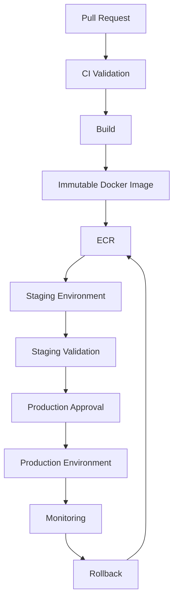

# 05- Environment Secrets and Protection

## Overview

GitHub Actions environments provide a security and deployment boundary around workflows that target different operational stages such as development, staging, and production.

An environment can associate:

- Environment-specific secrets.
- Environment-specific variables.
- Deployment protection rules.
- Required reviewers.
- Branch or tag restrictions.
- Deployment history.

The important distinction is that an environment is not simply a collection of configuration values. It can become a controlled authorization boundary between CI and production.

A production deployment should ideally follow:

```text
Pull Request
    ↓
CI Validation
    ↓
Build
    ↓
Immutable Artifact
    ↓
Staging
    ↓
Validation
    ↓
Production Environment
    ↓
Protection / Approval
    ↓
Production Deployment
```

The environment becomes the point where higher-risk credentials and deployment authority are introduced.

## What Is a GitHub Actions Environment?

A GitHub Actions environment represents a deployment target or operational boundary such as:

```text
development
staging
production
```

A job references an environment using:

```yaml
jobs:
  deploy:
    environment: production
```

The environment can then provide environment-specific configuration and protection controls.

For example:

```yaml
jobs:
  deploy:
    runs-on: ubuntu-latest
    environment: production

    steps:
      - name: Deploy
        run: ./scripts/deploy.sh
```

The job's relationship with the environment becomes part of the deployment security model.

## Why Environments Exist

Without environment separation, a repository may have a single workflow with access to every deployment credential:

```text
Workflow
   ↓
Development Secrets
Staging Secrets
Production Secrets
   ↓
Any Job
```

This creates a large blast radius.

Environment separation allows:

```text
Development Job
    ↓
Development Configuration

Staging Job
    ↓
Staging Configuration

Production Job
    ↓
Production Configuration
```

The result is clearer authorization and smaller credential exposure.

## Environment as a Security Boundary

A useful model is:

```text
CI
 ↓
Low Privilege
 ↓
Artifact
 ↓
Environment
 ↓
Higher Privilege
 ↓
Deployment
```

For example:

```text
Pull Request
    ↓
contents: read
    ↓
Tests
    ↓
Docker Image
    ↓
Staging
    ↓
Production Approval
    ↓
Production
```

The production environment should not be treated as another generic workflow variable.

## Development, Staging, and Production

A typical environment model is:

| Environment | Purpose | Typical Protection |
|---|---|---|
| Development | Developer validation | Low |
| Staging | Production-like validation | Moderate |
| Production | Customer-facing deployment | Strong |

The exact protection level depends on the organization's risk model.

## Environment Variables

Environment-specific variables are useful for non-sensitive configuration.

Examples include:

```text
APP_ENV
AWS_REGION
ECS_CLUSTER
ECS_SERVICE
API_BASE_URL
LOG_LEVEL
```

A workflow can associate these values with an environment.

For example:

```yaml
jobs:
  deploy:
    environment: staging

    steps:
      - name: Show deployment target
        run: |
          printf 'Environment: %s\n' "$APP_ENV"
          printf 'Region: %s\n' "$AWS_REGION"
```

Non-sensitive configuration should not be stored as secrets merely because it is environment-specific.

## Environment Secrets

Environment secrets are appropriate for sensitive environment-specific credentials.

Example:

```yaml
jobs:
  deploy:
    environment: production

    steps:
      - name: Deploy
        env:
          DEPLOYMENT_TOKEN: ${{ secrets.DEPLOYMENT_TOKEN }}
        run: ./scripts/deploy.sh
```

The deployment job explicitly associates itself with the production environment.

## Environment Variables vs Secrets

| Configuration | Environment Variable | Secret |
|---|---|---|
| AWS region | Yes | No |
| ECS cluster name | Yes | No |
| Deployment URL | Yes | Usually no |
| API key | No | Yes |
| Database password | No | Yes |
| Signing key | No | Yes |
| Deployment token | No | Yes |

The distinction should be based on sensitivity, not merely whether the value changes by environment.

## Repository vs Environment Secrets

Repository secrets are broadly available within the repository's applicable workflows, subject to GitHub's event and security rules.

Environment secrets are associated with a particular environment.

For production deployment, an environment secret can provide a stronger organizational boundary:

```text
Repository
    ↓
Production Environment
    ↓
Production Secret
```

rather than:

```text
Repository
    ↓
Production Secret Available Broadly
```

## Environment Protection Rules

Production environments can be protected using deployment rules such as required reviewers and deployment restrictions.

The goal is:

```text
Workflow Requests Production
        ↓
Environment Protection
        ↓
Authorization / Approval
        ↓
Deployment Continues
```

This adds a control point between automated CI and production execution.

## Required Reviewers

A production environment can require approval before a deployment proceeds.

Conceptually:

```text
Build
  ↓
Staging
  ↓
Production Deployment Requested
  ↓
Required Reviewer
  ↓
Approval
  ↓
Production Job Continues
```

This is useful when production deployments require explicit human authorization.

Approval is not a replacement for technical controls. A deployment should still use:

- Least-privilege permissions.
- Restricted credentials.
- Trusted workflow code.
- Immutable artifacts.
- Controlled concurrency.

## Branch and Tag Restrictions

Environment deployment rules can restrict which branches or tags are permitted to deploy.

A production pipeline may conceptually require:

```text
main
  ↓
Production
```

while staging may accept:

```text
main
feature/*
release/*
```

depending on the organization's deployment model.

Branch restrictions should be considered together with repository branch protection and workflow trigger configuration.

## Environment Protection Flow

A protected deployment can be represented as:


The environment is introduced at the point where deployment risk increases.

## Environment Deployment Lifecycle

A production deployment can follow:

```text
Workflow Trigger
      ↓
Build
      ↓
Artifact
      ↓
Deployment Job
      ↓
Environment Selected
      ↓
Protection Rules Evaluated
      ↓
Approval / Restrictions
      ↓
Environment Secrets Available
      ↓
Deployment
      ↓
Deployment Recorded
```

This makes the environment part of the workflow's authorization lifecycle.

## When Environment Secrets Become Available

A critical security consideration is that environment-specific secrets should not be treated as ordinary repository variables.

The deployment job must target the appropriate environment:

```yaml
jobs:
  deploy:
    environment: production
```

This creates the relationship between:

```text
Job
  ↓
Environment
  ↓
Environment Configuration
  ↓
Environment Secrets
```

A job targeting staging should not be designed around production credentials.

## Separate Environment Credentials

Use separate credentials for separate environments.

For example:

```text
Staging
  └── STAGING_DATABASE_URL

Production
  └── PRODUCTION_DATABASE_URL
```

Avoid:

```text
All Environments
  └── PRODUCTION_DATABASE_URL
```

The production credential should not be necessary for staging validation.

## Django Example

A Django deployment pipeline may use:

```yaml
jobs:
  deploy:
    runs-on: ubuntu-latest
    environment: production

    steps:
      - uses: actions/checkout@v4

      - name: Deploy Django application
        env:
          DJANGO_SECRET_KEY: ${{ secrets.DJANGO_SECRET_KEY }}
          DATABASE_URL: ${{ secrets.DATABASE_URL }}
        run: ./scripts/deploy.sh
```

The deployment script should not print either credential.

For a mature architecture, application runtime secrets may be retrieved from a cloud secret-management system rather than passed through CI.

## FastAPI Example

A FastAPI service can use environment-specific deployment configuration:

```yaml
jobs:
  deploy:
    runs-on: ubuntu-latest
    environment: staging

    steps:
      - uses: actions/checkout@v4

      - name: Deploy API
        env:
          DATABASE_URL: ${{ secrets.DATABASE_URL }}
        run: ./scripts/deploy.sh
```

The staging job receives staging credentials, not production credentials.

## PostgreSQL and Environment Separation

Database credentials should follow environment boundaries.

```text
Development
    ↓
Development PostgreSQL

Staging
    ↓
Staging PostgreSQL

Production
    ↓
Production PostgreSQL
```

Never make CI integration tests depend on production database credentials.

For GitHub Actions integration tests, an ephemeral PostgreSQL service is often preferable:

```yaml
services:
  postgres:
    image: postgres:16
    env:
      POSTGRES_USER: test_user
      POSTGRES_PASSWORD: test_password
      POSTGRES_DB: test_db
```

This avoids introducing production database credentials into the test workflow.

## Redis and Environment Separation

The same model applies to Redis:

```text
Integration Tests
    ↓
Ephemeral Redis

Staging
    ↓
Staging Redis

Production
    ↓
Production Redis
```

A CI job should not receive production Redis credentials simply because the application uses Redis.

## Environment-Specific AWS Roles

AWS deployments should ideally combine GitHub environments with OIDC.

For example:

```text
Staging Environment
    ↓
GitHub OIDC
    ↓
Staging IAM Role

Production Environment
    ↓
GitHub OIDC
    ↓
Production IAM Role
```

This creates separate cloud authorization boundaries.

## AWS OIDC Example

A deployment job can use:

```yaml
jobs:
  deploy:
    runs-on: ubuntu-latest
    environment: production

    permissions:
      contents: read
      id-token: write

    steps:
      - uses: actions/checkout@v4

      - name: Configure AWS credentials
        uses: aws-actions/configure-aws-credentials@v4
        with:
          role-to-assume: ${{ vars.AWS_DEPLOYMENT_ROLE }}
          aws-region: ${{ vars.AWS_REGION }}

      - name: Deploy
        run: ./scripts/deploy.sh
```

The environment can provide environment-specific configuration while OIDC provides temporary AWS identity.

The AWS IAM role must independently enforce least privilege.

## Environment Variables and OIDC

Non-sensitive deployment configuration can use environment variables:

```text
AWS_REGION
ECS_CLUSTER
ECS_SERVICE
ECR_REPOSITORY
```

Sensitive authentication should use:

```text
OIDC
```

rather than placing long-lived AWS access keys into environment secrets.

The separation is:

```text
Environment Variables
    ↓
Configuration

OIDC / Secrets
    ↓
Authentication
```

## Staging Environment

Staging should approximate production where practical without exposing production credentials.

A typical staging pipeline is:

```text
Build
  ↓
Immutable Image
  ↓
ECR
  ↓
Staging
  ↓
Integration / Smoke Tests
```

Staging should use:

- Staging database.
- Staging Redis.
- Staging external integrations.
- Staging IAM role.
- Staging secrets.

## Production Environment

Production should introduce stronger controls:

```text
Immutable Artifact
      ↓
Production Environment
      ↓
Required Approval
      ↓
Production Identity
      ↓
Production Deployment
```

Production should also have:

- Restricted deployment permissions.
- Production-specific credentials.
- Deployment concurrency.
- Health validation.
- Rollback procedures.
- Monitoring.

## Environment Promotion

The preferred production model is:

```text
Build Once
    ↓
Immutable Artifact
    ↓
Staging
    ↓
Validation
    ↓
Approval
    ↓
Production
```

Avoid:

```text
Build for Staging
    ↓
Staging

Build Again for Production
    ↓
Production
```

Rebuilding can introduce differences between the artifact tested in staging and the artifact deployed to production.

## Docker Image Promotion

A backend deployment can use:

```text
Python Application
      ↓
Docker Buildx
      ↓
Image
      ↓
ECR
      ↓
Staging
      ↓
Production
```

Tag the image immutably using the commit SHA:

```text
my-api:<commit-sha>
```

Then promote the same image.

The production environment should not rebuild the Docker image.

## Environment Variables for Image Promotion

The image identifier can be passed between jobs using outputs:

```yaml
jobs:
  build:
    runs-on: ubuntu-latest

    outputs:
      image: ${{ steps.image.outputs.image }}

    steps:
      - id: image
        run: |
          echo "image=123456789012.dkr.ecr.us-east-1.amazonaws.com/api:${GITHUB_SHA}" >> "$GITHUB_OUTPUT"

  deploy:
    needs: build
    runs-on: ubuntu-latest
    environment: staging

    steps:
      - name: Deploy image
        env:
          IMAGE: ${{ needs.build.outputs.image }}
        run: ./scripts/deploy.sh "$IMAGE"
```

The environment determines where the artifact is deployed, while the build job determines which immutable artifact is used.

## Environment Secrets and Reusable Workflows

Reusable deployment workflows can define environment-aware interfaces.

Example:

```yaml
on:
  workflow_call:
    inputs:
      environment:
        required: true
        type: string
```

The caller can then select:

```yaml
jobs:
  deploy:
    uses: organization/platform/.github/workflows/deploy.yml@v1
    with:
      environment: staging
```

The reusable workflow should validate the environment selection and maintain clear boundaries between staging and production.

## Avoiding Arbitrary Environment Selection

Do not allow an untrusted pull request to arbitrarily choose:

```text
production
```

as a deployment target.

A dangerous pattern is:

```yaml
environment: ${{ github.event.inputs.environment }}
```

combined with a workflow that allows untrusted or insufficiently authorized callers to select production.

Environment selection is an authorization decision, not merely a string parameter.

## Manual Workflow Dispatch

Manual deployments can use controlled inputs:

```yaml
on:
  workflow_dispatch:
    inputs:
      environment:
        description: Deployment environment
        required: true
        type: choice
        options:
          - staging
          - production
```

However, the existence of a choice input does not replace environment protection.

Production should still be protected by appropriate deployment controls.

## Environment Variables and `vars`

GitHub Actions provides a `vars` context for configuration values.

For example:

```yaml
- name: Deploy
  run: |
    echo "Deploying to ${{ vars.DEPLOY_REGION }}"
```

Variables are appropriate for non-sensitive configuration.

Do not use variables as a substitute for secrets.

Sensitive values belong in the appropriate secret mechanism.

## Environment Secret Naming

Use environment-independent names when the environment itself determines the value.

For example:

```text
DATABASE_URL
DEPLOYMENT_TOKEN
API_KEY
```

rather than:

```text
PRODUCTION_DATABASE_URL
STAGING_DATABASE_URL
```

when the secret is already scoped to the corresponding environment.

This can simplify reusable deployment workflows:

```yaml
env:
  DATABASE_URL: ${{ secrets.DATABASE_URL }}
```

The environment determines which actual value is provided.

## Environment Configuration Model

A clean architecture is:

```text
Repository
│
├── Source Code
├── Workflow
│
├── Development Environment
│     ├── Variables
│     └── Secrets
│
├── Staging Environment
│     ├── Variables
│     └── Secrets
│
└── Production Environment
      ├── Variables
      └── Secrets
```

This separates application source from environment-specific configuration.

## Environment Protection and Branch Protection

These controls solve different problems.

| Control | Protects |
|---|---|
| Branch protection | What can enter a protected branch |
| Environment protection | What can deploy to an environment |
| Workflow permissions | What a workflow can access |
| IAM | What the deployment identity can do in AWS |
| Secret scope | Which workflows can receive credentials |
| Concurrency | Which deployments can execute simultaneously |

A mature CI/CD pipeline uses several of these controls together.

## Production Approval

A production environment can introduce a human approval gate:

```text
Build
  ↓
Staging
  ↓
Automated Validation
  ↓
Production Deployment Requested
  ↓
Reviewer
  ↓
Approved
  ↓
Production Deployment
```

The reviewer should not need to manually reconstruct whether the artifact is safe. The workflow should provide sufficient evidence through:

- Commit SHA.
- Test results.
- Security scan results.
- Artifact identity.
- Staging validation.
- Change information.

## Approval Does Not Equal Security

Manual approval should not be treated as a substitute for secure engineering.

A malicious workflow could still be dangerous if the approval process is asked to authorize an opaque or mutable deployment.

The deployment should therefore use:

```text
Trusted Workflow
+
Immutable Artifact
+
Restricted Permissions
+
Protected Environment
+
Approval
```

## Deployment History

Environment deployments provide operational visibility into:

- What was deployed.
- When it was deployed.
- Which workflow executed.
- Which environment was targeted.
- Which deployment succeeded or failed.

Deployment history is useful for incident investigation and rollback decisions.

## Rollback

Environment protection should work with a clear rollback mechanism.

For an immutable Docker deployment:

```text
Production
    ↓
Current Image: abc123
    ↓
Problem Detected
    ↓
Rollback
    ↓
Previous Image: 789xyz
```

The rollback should use a known immutable artifact rather than rebuilding from source.

## Rollback and Secrets

Rollback may require the same environment credentials as a normal deployment.

However, rollback should not require broader privileges than deployment.

For example:

```text
Production Deployment
    ↓
Production IAM Role

Production Rollback
    ↓
Same Restricted Production IAM Role
```

Avoid creating a highly privileged emergency credential that becomes the only way to recover production.

## Environment Concurrency

Production deployments should normally be serialized where simultaneous changes could create race conditions.

Example:

```yaml
concurrency:
  group: production-deployment
  cancel-in-progress: false
```

This prevents competing production deployment executions from operating simultaneously.

For staging, a different policy may be appropriate:

```yaml
concurrency:
  group: staging-deployment
  cancel-in-progress: true
```

The correct policy depends on whether newer deployments should replace older pending deployments.

## Environment and Matrix Deployments

Matrix jobs can create unexpected deployment concurrency.

For example:

```yaml
strategy:
  matrix:
    region:
      - us-east-1
      - eu-west-1
```

If every matrix job targets production, the deployment architecture must account for:

- Regional concurrency.
- Independent health validation.
- Partial failure.
- Rollback.
- Artifact identity.
- Environment permissions.

A matrix is useful for parallel validation, but production deployment fan-out requires deliberate architecture.

## Environment Security and Third-Party Actions

Avoid giving a third-party action access to a production environment secret unless the action is explicitly trusted for that responsibility.

Prefer:

```text
Trusted Deployment Job
    ↓
Production Secret
    ↓
Deployment
```

rather than:

```text
Production Job
    ↓
Production Secret
    ↓
Multiple Third-Party Actions
```

The fewer components that can access a production credential, the smaller the trust boundary.

## Environment Security and Self-Hosted Runners

A production environment may require private network access.

For example:

```text
GitHub Actions
      ↓
Self-Hosted Runner
      ↓
Private Network
      ↓
ECS / Kubernetes / Internal API
```

This creates a stronger runner trust requirement.

Do not execute untrusted pull-request code on a self-hosted runner that has production network access.

Use separate runner groups or isolated execution models for privileged deployment workloads.

## Ephemeral Runners

Ephemeral runners reduce persistent state.

The model is:

```text
Provision Runner
      ↓
Run Deployment
      ↓
Destroy Runner
```

This reduces the risk that credentials, workspace contents, Docker layers, or other state remain available to a later job.

Ephemeral execution is particularly useful for sensitive deployment infrastructure.

## Secret Rotation

Environment secrets require an operational rotation process.

A typical process is:

```text
Create New Credential
      ↓
Configure Environment
      ↓
Deploy / Validate
      ↓
Verify
      ↓
Revoke Old Credential
```

Avoid changing credentials manually without validating the deployment path.

## Zero-Downtime Rotation

When an external system supports overlapping credentials:

```text
Credential A
Credential B
```

can coexist temporarily.

The application is updated to use B:

```text
A + B
  ↓
Deploy B
  ↓
Verify B
  ↓
Remove A
```

This reduces downtime during rotation.

## Environment Secret Incident Response

If a production environment secret is exposed:

```text
Detect
  ↓
Stop Further Exposure
  ↓
Rotate / Revoke
  ↓
Review Logs and Artifacts
  ↓
Assess Usage
  ↓
Deploy Replacement
  ↓
Validate Production
  ↓
Document Root Cause
```

Do not assume that deleting the workflow run makes the credential safe.

## Environment Secret Troubleshooting

### Symptom: Environment Secret Is Empty

Possible causes:

- Job does not target the environment.
- Secret is configured under a different environment.
- Secret name is incorrect.
- Deployment protection has not been satisfied.
- Workflow context does not allow access.
- Reusable workflow was not given the expected secret.

Isolation:

```text
Job
  ↓
environment:
  ↓
Environment Configuration
  ↓
Secret Name
  ↓
Protection Status
```

Do not print the secret value to diagnose the problem.

### Symptom: Deployment Is Waiting for Approval

Possible causes:

- Required reviewer configuration.
- Environment protection rule.
- Deployment restriction.
- Pending deployment state.

Inspect the deployment state rather than modifying the workflow to bypass protection.

### Symptom: Staging Deployment Uses Production Configuration

Possible causes:

- Repository-level secret used instead of environment secret.
- Incorrect environment selected.
- Shared reusable workflow not propagating environment context correctly.
- Environment variable precedence issue.

Verify:

```text
Workflow
  ↓
Job
  ↓
Environment
  ↓
Variables / Secrets
```

### Symptom: Production Deployment Uses the Wrong Branch

Possible causes:

- Incorrect workflow trigger.
- Missing branch restrictions.
- Manual workflow invoked from an unexpected ref.
- Reusable workflow called without validating the source.

Review the workflow event, ref, environment protection, and repository branch controls.

### Symptom: Production Deployment Runs Twice

Possible causes:

- Missing concurrency group.
- Different workflows targeting the same environment.
- Matrix fan-out.
- Manual and automated deployment paths operating independently.

Use deployment-level concurrency and consolidate production deployment paths where appropriate.

## GitHub CLI for Environment Operations

List environments:

```bash
gh api repos/{owner}/{repo}/environments
```

Inspect a specific environment:

```bash
gh api repos/{owner}/{repo}/environments/production
```

List deployments:

```bash
gh api repos/{owner}/{repo}/deployments
```

Inspect workflow runs:

```bash
gh run list
```

Inspect a specific run:

```bash
gh run view RUN_ID
```

View workflow logs:

```bash
gh run view RUN_ID --log
```

List repository secrets without exposing their values:

```bash
gh secret list
```

The GitHub CLI should be used for operational inspection and management, not for revealing sensitive credential values.

## Environment Management

A production environment should have an explicit owner and documented purpose.

Maintain:

- Environment name.
- Deployment source.
- Allowed branches or tags.
- Required reviewers.
- Secrets.
- Variables.
- Runner requirements.
- Cloud identity.
- Deployment strategy.
- Rollback procedure.
- Monitoring expectations.

An environment without clear ownership can become a source of configuration drift.

## Configuration Drift

Environment drift occurs when environments gradually become different in undocumented ways.

For example:

```text
Staging
  → Python 3.12
  → Image abc123

Production
  → Python 3.11
  → Image xyz789
```

This makes staging validation less representative of production.

Use immutable artifacts and infrastructure/configuration automation to reduce drift.

## Environment Parity

Perfect parity is not always practical, but the important runtime characteristics should be aligned.

Consider:

- Python version.
- Docker image.
- Database engine.
- Redis version.
- Environment configuration.
- Network behavior.
- Authentication model.
- Resource limits.

The closer staging is to production, the more meaningful staging validation becomes.

## Cost Considerations

Separate environments increase infrastructure cost.

For example:

```text
Development
    +
Staging
    +
Production
```

may require multiple databases, caches, services, and networking components.

However, sharing production infrastructure with CI to reduce cost creates a much larger security and reliability risk.

Cost optimization should therefore preserve isolation for production workloads.

## Reliability Considerations

Environment protection improves reliability by reducing accidental production changes.

Useful controls include:

- Required approval.
- Immutable artifacts.
- Deployment concurrency.
- Health checks.
- Rollback.
- Environment-specific configuration.
- Automated validation.

The objective is:

```text
Controlled Change
    ↓
Observable Deployment
    ↓
Validated State
```

## High Availability

Environment protection should not make recovery impossible.

A production deployment system should support:

- Fast rollback.
- Re-deployment of known-good artifacts.
- Multiple deployment strategies.
- Health validation.
- Independent runner recovery.
- Temporary credential regeneration.

Do not make production dependent on one manually maintained machine or one permanent credential.

## Disaster Recovery

CI/CD disaster recovery should account for:

```text
Workflow Failure
Runner Failure
Credential Rotation
Artifact Availability
Environment Configuration
Cloud Authentication
Rollback
```

Immutable artifacts should be retained according to operational recovery requirements.

The deployment system should be capable of redeploying a known-good artifact without rebuilding the application from scratch.

## Environment Architecture

A mature backend CI/CD architecture can be represented as:



The production environment is protected by both technical and operational controls.

## Environment Security Model

The complete security model is:

```text
Source Control
      ↓
Workflow Permissions
      ↓
Trusted Workflow
      ↓
Immutable Artifact
      ↓
Environment
      ↓
Protection Rules
      ↓
Environment Secrets / Variables
      ↓
OIDC / IAM
      ↓
Deployment
```

Each layer addresses a different risk.

## Production Deployment Example

A production deployment can combine environment protection, OIDC, immutable images, and concurrency:

```yaml
name: Deploy

on:
  workflow_dispatch:
    inputs:
      environment:
        description: Deployment environment
        required: true
        type: choice
        options:
          - staging
          - production

permissions:
  contents: read

jobs:
  deploy:
    runs-on: ubuntu-latest

    environment:
      name: ${{ inputs.environment }}

    concurrency:
      group: deployment-${{ inputs.environment }}
      cancel-in-progress: false

    permissions:
      contents: read
      id-token: write

    steps:
      - name: Checkout
        uses: actions/checkout@v4

      - name: Configure AWS credentials
        uses: aws-actions/configure-aws-credentials@v4
        with:
          role-to-assume: ${{ vars.AWS_DEPLOYMENT_ROLE }}
          aws-region: ${{ vars.AWS_REGION }}

      - name: Deploy immutable image
        env:
          IMAGE: ${{ vars.DOCKER_IMAGE }}
        run: ./scripts/deploy.sh "$IMAGE"
```

The exact production design should be adapted to the repository's trust model.

The important principles are:

```text
Environment
+
Protected Deployment
+
Restricted Permissions
+
OIDC
+
Immutable Artifact
+
Concurrency
```

## Senior-Level Design Principles

A senior backend engineer should treat GitHub environments as deployment boundaries rather than configuration containers.

The key questions are:

```text
Who can trigger the deployment?
        ↓
Which artifact is being deployed?
        ↓
Which environment is targeted?
        ↓
What protection rules apply?
        ↓
Which credentials become available?
        ↓
Which identity can access production?
        ↓
Can another deployment run simultaneously?
        ↓
How is rollback performed?
```

A strong environment architecture minimizes the number of decisions made during the actual production deployment.

The workflow should already establish:

```text
Artifact
Identity
Configuration
Authorization
Approval
Concurrency
Rollback
```

before production state changes.

## Interview Scenarios

### Production Deployment Requires Approval

Design a pipeline that:

```text
Builds once
    ↓
Deploys to staging
    ↓
Runs validation
    ↓
Requests production deployment
    ↓
Requires approval
    ↓
Deploys the same artifact
```

Explain why the environment protection rule is separate from the workflow's GitHub permissions.

### Staging and Production Need Different AWS Roles

Use:

```text
Staging Environment
    ↓
OIDC
    ↓
Staging IAM Role

Production Environment
    ↓
OIDC
    ↓
Production IAM Role
```

Explain how the GitHub environment, OIDC claims, IAM trust policy, and IAM permissions work together.

### Production Deployment Must Not Run Twice

Use:

```yaml
concurrency:
  group: production-deployment
  cancel-in-progress: false
```

Then explain why concurrency prevents races but does not itself provide authorization.

### Docker Image Must Not Be Rebuilt for Production

Use:

```text
Build
  ↓
Immutable SHA-tagged Image
  ↓
ECR
  ↓
Staging
  ↓
Approval
  ↓
Production
```

Explain how this reduces the possibility that staging and production run different binaries.

### A Developer Can Deploy to Staging but Not Production

Separate:

```text
Staging
  ↓
Less restrictive environment

Production
  ↓
Protected environment
  ↓
Required reviewer
```

The developer can participate in normal CI/CD while production remains protected.

### Production Secrets Must Not Be Available During Pull Requests

Use:

```text
Pull Request
    ↓
Untrusted CI
    ↓
No Production Secrets

Trusted Deployment
    ↓
Production Environment
    ↓
Production Secrets
```

Explain why the trust boundary must be enforced by workflow architecture rather than developer convention.

## Common Mistakes

### Treating Environments as Configuration Only

An environment can provide a deployment authorization boundary.

Do not ignore its protection capabilities.

### Sharing Production Secrets With Staging

Production credentials should not be required for staging validation.

Use separate environment credentials.

### Rebuilding for Production

Rebuilding after staging creates the possibility that the production artifact differs from the tested artifact.

Prefer immutable artifact promotion.

### Bypassing Approval for Emergency Deployments

Emergency procedures should be explicitly designed and governed rather than implemented by casually removing production protection.

A rollback path should already exist.

### Using Repository Secrets for Everything

Repository-level secrets can have a broader scope than required.

Use environment-specific secrets where the credential belongs to a specific deployment environment.

### Passing Production Secrets to Third-Party Actions

Limit production credentials to trusted deployment steps.

### Allowing Arbitrary Environment Selection

Do not let untrusted input decide whether a privileged production environment is targeted.

### Ignoring Concurrency

Environment protection does not automatically eliminate deployment race conditions.

Use appropriate concurrency controls.

### Using Persistent Privileged Runners for PR Workflows

A self-hosted runner with production network access should not execute arbitrary pull-request code.

### Making Staging Fundamentally Different From Production

Large environment differences reduce the value of staging validation.

## Production Checklist

### Environment Design

- [ ] Development, staging, and production have clear purposes.
- [ ] Production is represented as a protected environment.
- [ ] Environment ownership is documented.
- [ ] Environment-specific variables are separated from secrets.
- [ ] Environment-specific secrets are isolated.

### Security

- [ ] Pull-request workflows do not receive production credentials.
- [ ] Fork workflows are treated as untrusted.
- [ ] `pull_request_target` usage is reviewed carefully.
- [ ] Third-party actions do not unnecessarily receive production secrets.
- [ ] Production credentials use the smallest practical scope.
- [ ] OIDC is used instead of long-lived AWS credentials where appropriate.

### Deployment Protection

- [ ] Production requires appropriate approval.
- [ ] Deployment restrictions are configured.
- [ ] Branch or tag restrictions are appropriate.
- [ ] Deployment history is available.
- [ ] Emergency and rollback procedures are documented.

### Artifact Management

- [ ] Artifacts are immutable.
- [ ] Docker images use immutable identifiers where appropriate.
- [ ] Production uses the same artifact validated in staging.
- [ ] Production does not rebuild the application unnecessarily.
- [ ] Rollback artifacts remain available according to recovery requirements.

### Reliability

- [ ] Production deployments use appropriate concurrency.
- [ ] Health validation exists.
- [ ] Rollback is tested.
- [ ] Runner failures do not permanently block recovery.
- [ ] Credentials can be rotated without unnecessary downtime.

### Operations

- [ ] Environment configuration is documented.
- [ ] Secret rotation procedures exist.
- [ ] Environment drift is monitored.
- [ ] Logs and deployment history are available.
- [ ] Environment access is periodically reviewed.

## Key Takeaways

- GitHub environments should be treated as deployment and authorization boundaries, not merely as collections of environment variables.
- Environment-specific secrets and variables should be isolated across development, staging, and production, with production credentials unavailable to untrusted CI.
- Protected production environments can combine required approvals, deployment restrictions, branch controls, environment secrets, and deployment history to control higher-risk changes.
- Production deployments should preferably promote the same immutable artifact from staging to production, combined with OIDC, least-privilege identities, and deployment concurrency.
- A mature environment architecture separates untrusted CI, trusted artifact creation, environment authorization, production credentials, deployment execution, monitoring, and rollback.