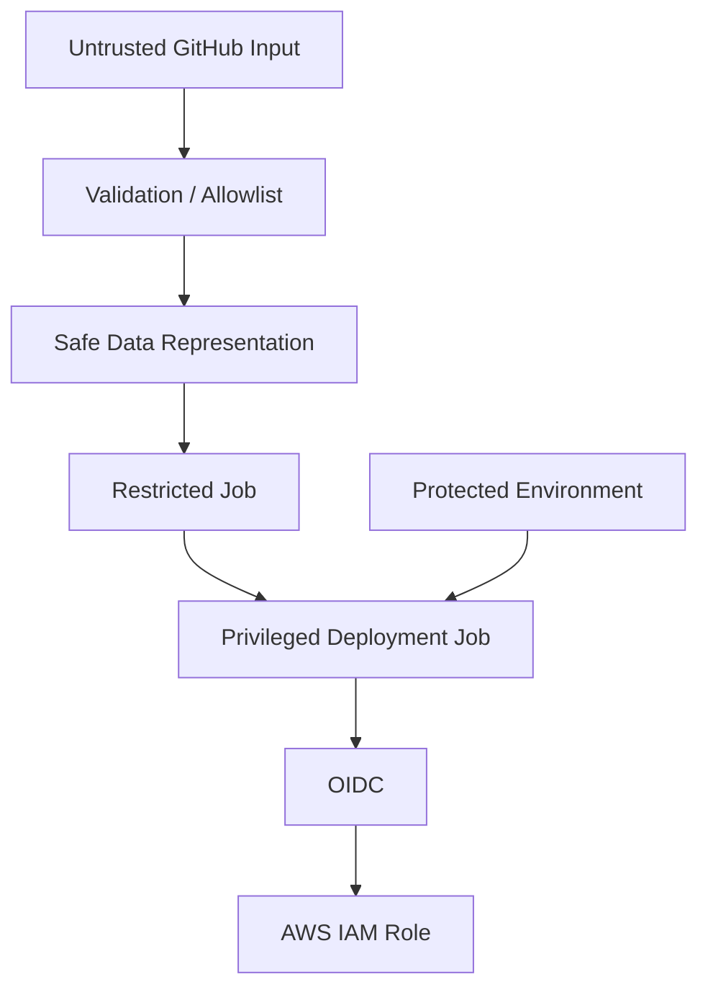

# 06- Script Injection

## Overview

Script injection is one of the most important security risks in GitHub Actions because workflow files frequently combine trusted repository code with untrusted data from pull requests, branches, commit messages, issues, workflow inputs, and external systems.

The core problem is not GitHub Actions expressions themselves. The problem occurs when data controlled by an attacker is inserted into a shell command or executable script without treating it as untrusted input.

A vulnerable workflow can unintentionally transform:

```text
Untrusted GitHub Data
        ↓
Workflow Expression
        ↓
Shell Command
        ↓
Command Injection
        ↓
Runner Compromise
        ↓
Credential / Token Exposure
```

The impact can be significantly higher when the job has:

- A powerful `GITHUB_TOKEN`.
- Repository write permissions.
- Cloud credentials.
- Production secrets.
- Access to private networks.
- A persistent self-hosted runner.

The senior-level objective is therefore not simply to "escape strings". It is to design workflows so that untrusted data remains data and never becomes executable shell syntax.

## What Is Script Injection?

Script injection occurs when attacker-controlled input becomes part of a command or script executed by the runner.

Consider:

```yaml
- name: Print PR title
  run: echo "${{ github.event.pull_request.title }}"
```

The workflow expression is evaluated before the shell executes the resulting command.

If the pull request title contains shell metacharacters or commands, the generated script can become unsafe.

The important distinction is:

```text
GitHub Expression Evaluation
        ↓
Generated Shell Script
        ↓
Shell Parsing
        ↓
Command Execution
```

GitHub does not automatically make the resulting shell command safe merely because the value came from a GitHub Actions context.

## Why Script Injection Exists

GitHub Actions workflows routinely consume dynamic values:

- Pull request titles.
- Branch names.
- Commit messages.
- Issue titles.
- Issue bodies.
- Workflow inputs.
- Repository dispatch payloads.
- API responses.
- File contents.
- Matrix values.
- External service responses.

These values may be controlled directly or indirectly by users.

The security boundary therefore depends on the source of the value.

## Trusted vs Untrusted Data

A useful classification is:

| Source | Typical Trust Level | Example |
|---|---|---|
| Workflow YAML | Trusted repository-controlled code | `run:` |
| Protected branch | Relatively trusted | `main` |
| Pull request from fork | Untrusted | PR title/body |
| Issue content | Untrusted | Issue title |
| Workflow input | Potentially untrusted | `workflow_dispatch` |
| Branch name | Potentially untrusted | Feature branch |
| Commit message | Potentially untrusted | Commit text |
| External API response | Untrusted until validated | JSON payload |
| Repository secret | Sensitive trusted data | API key |

The exact trust boundary depends on who can modify the source and how the workflow is triggered.

## The Shell Is the Security Boundary

The most important mental model is:

```text
Expression
    ↓
String
    ↓
Shell Parser
    ↓
Executable Commands
```

Suppose a workflow contains:

```yaml
- run: echo "${{ github.event.pull_request.title }}"
```

The expression is substituted into the command before the shell interprets it.

The shell does not know that the inserted text originally came from a GitHub context.

Therefore:

```text
GitHub Context ≠ Shell-Safe Input
```

## Example of a Vulnerable Workflow

Consider:

```yaml
- name: Validate PR title
  run: |
    echo "PR title: ${{ github.event.pull_request.title }}"
```

A malicious title could contain shell syntax.

The dangerous pattern is:

```yaml
run: command "${{ untrusted_value }}"
```

The workflow author has allowed external data to become part of the shell program.

## Safe Environment Variable Pattern

A safer approach is to pass the value through an environment variable:

```yaml
- name: Validate PR title
  env:
    PR_TITLE: ${{ github.event.pull_request.title }}
  run: |
    printf 'PR title: %s\n' "$PR_TITLE"
```

The important difference is:

```text
Untrusted Value
      ↓
Environment Variable
      ↓
Quoted Variable Expansion
      ↓
Data
```

instead of:

```text
Untrusted Value
      ↓
String Interpolation
      ↓
Shell Program
```

The shell parses `$PR_TITLE` as a variable reference rather than reparsing the contents of the variable as shell syntax.

## Why Quoting Matters

Use:

```bash
printf '%s\n' "$PR_TITLE"
```

rather than:

```bash
printf '%s\n' $PR_TITLE
```

Quoting prevents word splitting and wildcard expansion.

For shell scripts:

```bash
"$VARIABLE"
```

should generally be the default when a variable represents one logical value.

## Avoid `eval`

Never use `eval` with untrusted data.

Dangerous:

```bash
eval "deploy $INPUT"
```

`eval` asks the shell to parse generated text as shell code.

The data-to-code boundary becomes explicit:

```text
Input
 ↓
String
 ↓
eval
 ↓
Shell Code
```

This dramatically increases the attack surface.

## Dangerous Command Construction

Avoid patterns such as:

```bash
COMMAND="deploy $TARGET"
eval "$COMMAND"
```

or:

```bash
sh -c "deploy $TARGET"
```

when `TARGET` can be influenced externally.

Prefer fixed commands with explicit arguments:

```bash
deploy --target "$TARGET"
```

If the command itself must vary, use a controlled mapping rather than arbitrary command construction.

## Allowlist-Based Command Selection

Instead of:

```bash
$DEPLOY_COMMAND
```

use a controlled mapping:

```bash
case "$ENVIRONMENT" in
  staging)
    ./scripts/deploy-staging.sh
    ;;
  production)
    ./scripts/deploy-production.sh
    ;;
  *)
    echo "Unsupported environment" >&2
    exit 1
    ;;
esac
```

This preserves the distinction between:

```text
User Input
    ↓
Validated Choice
    ↓
Known Command
```

## Workflow Inputs Are Not Automatically Trusted

Manual workflow inputs can still be attacker-controlled depending on repository permissions and workflow design.

For example:

```yaml
on:
  workflow_dispatch:
    inputs:
      environment:
        required: true
        type: string
```

Do not assume:

```text
workflow_dispatch
    =
trusted input
```

Validate the value before using it in privileged operations.

Prefer a constrained input:

```yaml
on:
  workflow_dispatch:
    inputs:
      environment:
        required: true
        type: choice
        options:
          - staging
          - production
```

Even then, production authorization should come from environment protection rather than the input itself.

## Pull Request Titles

Pull request titles are attacker-controlled in many workflows.

Avoid:

```yaml
- run: echo "Title: ${{ github.event.pull_request.title }}"
```

Prefer:

```yaml
- name: Inspect PR title
  env:
    PR_TITLE: ${{ github.event.pull_request.title }}
  run: |
    printf 'Title: %s\n' "$PR_TITLE"
```

If the title is used for validation, treat it as data:

```bash
if [[ "$PR_TITLE" =~ ^feat: ]]; then
    echo "Valid feature title"
else
    echo "Invalid title" >&2
    exit 1
fi
```

## Branch Names

Branch names should also be treated as untrusted input.

Avoid:

```yaml
run: ./deploy.sh ${{ github.ref_name }}
```

Prefer:

```yaml
- name: Process branch
  env:
    BRANCH_NAME: ${{ github.ref_name }}
  run: |
    ./scripts/process-branch.sh "$BRANCH_NAME"
```

If only specific branch names are valid, validate against an allowlist.

## Commit Messages

Commit messages can contain arbitrary text.

Avoid:

```yaml
run: echo "${{ github.event.head_commit.message }}"
```

Prefer:

```yaml
- name: Inspect commit message
  env:
    COMMIT_MESSAGE: ${{ github.event.head_commit.message }}
  run: |
    printf '%s\n' "$COMMIT_MESSAGE"
```

Never assume that commit metadata is safe simply because it came from Git.

## Issue Titles and Bodies

Issue content should be treated as untrusted.

Dangerous:

```yaml
run: |
  ./process.sh "${{ github.event.issue.body }}"
```

Safer:

```yaml
- name: Process issue
  env:
    ISSUE_BODY: ${{ github.event.issue.body }}
  run: |
    ./process.sh "$ISSUE_BODY"
```

The called script should also validate and safely handle the value.

Security should not depend entirely on the workflow layer.

## External API Responses

Data retrieved from an external API should also be treated as untrusted.

For example:

```bash
response="$(curl --fail --silent "$API_URL")"
```

Do not immediately transform arbitrary response fields into shell code.

Prefer structured parsing:

```bash
name="$(jq -r '.name' <<< "$response")"
```

Then pass the value as an argument:

```bash
./scripts/process-user.sh "$name"
```

## JSON Parsing

Structured data should remain structured for as long as possible.

Prefer:

```text
JSON
 ↓
Parser
 ↓
Validated Field
 ↓
Program Argument
```

rather than:

```text
JSON
 ↓
String Concatenation
 ↓
Shell Script
```

For example:

```bash
value="$(jq -r '.environment' <<< "$response")"

case "$value" in
  staging|production)
    ;;
  *)
    echo "Invalid environment" >&2
    exit 1
    ;;
esac
```

## Python as a Safer Boundary

Python scripts can provide stronger validation than complex shell command construction.

Workflow:

```yaml
- name: Validate deployment input
  env:
    ENVIRONMENT: ${{ inputs.environment }}
  run: python scripts/validate_environment.py
```

Python:

```python
import os
import sys

allowed = {"staging", "production"}
environment = os.environ["ENVIRONMENT"]

if environment not in allowed:
    print(f"Unsupported environment: {environment}", file=sys.stderr)
    sys.exit(1)

print(f"Validated environment: {environment}")
```

This makes validation explicit and testable.

## Python Subprocess Security

Python code can still be vulnerable.

Avoid:

```python
subprocess.run(
    f"deploy --target {environment}",
    shell=True,
    check=True,
)
```

Prefer argument arrays:

```python
subprocess.run(
    ["deploy", "--target", environment],
    check=True,
)
```

The difference is important:

```text
shell=True
    ↓
Shell Parsing
```

versus:

```text
Argument List
    ↓
Executable + Arguments
```

Avoid `shell=True` unless there is a specific requirement and the input is fully controlled.

## Django and FastAPI Deployment Scripts

A backend deployment pipeline may invoke:

```text
GitHub Actions
    ↓
Docker
    ↓
Django / FastAPI
    ↓
AWS ECS
```

Deployment parameters should be validated before they reach:

- Docker commands.
- AWS CLI commands.
- Kubernetes commands.
- Terraform commands.
- SSH commands.
- Database commands.

For example:

```yaml
- name: Deploy API
  env:
    IMAGE_TAG: ${{ github.sha }}
    ENVIRONMENT: staging
  run: |
    ./scripts/deploy.sh "$ENVIRONMENT" "$IMAGE_TAG"
```

The deployment script should validate both parameters.

## AWS CLI and Injection

AWS CLI commands are especially important because successful command injection may become cloud compromise.

Avoid constructing arbitrary commands:

```bash
aws "$COMMAND" "$ARGUMENT"
```

Prefer fixed command structures:

```bash
aws ecs update-service \
  --cluster "$ECS_CLUSTER" \
  --service "$ECS_SERVICE" \
  --force-new-deployment
```

Validate identifiers before use.

## AWS OIDC and Script Injection

OIDC removes the need for long-lived AWS access keys, but it does not eliminate script injection risk.

The dangerous chain can still be:

```text
Untrusted PR
    ↓
Compromised Workflow Execution
    ↓
id-token: write
    ↓
AWS OIDC
    ↓
Assume IAM Role
    ↓
AWS API Access
```

Therefore:

```yaml
permissions:
  contents: read
  id-token: write
```

must only be granted to trusted deployment jobs.

Do not combine:

```text
Untrusted Code
+
Production OIDC
+
Broad IAM Role
```

## `pull_request` vs `pull_request_target`

The distinction is critical.

### `pull_request`

The workflow generally operates in the context of the pull request merge state and is designed for testing proposed changes.

It should be the default choice for untrusted PR validation.

A useful security model is:

```text
Fork PR
   ↓
pull_request
   ↓
Untrusted Code
   ↓
Restricted Permissions
   ↓
No Production Secrets
```

### `pull_request_target`

`pull_request_target` executes in the context of the base repository.

This can provide access to repository-level privileges and secrets that are not normally available to forked pull requests.

That makes it useful for certain trusted automation scenarios, but dangerous when combined with execution of untrusted pull-request code.

## Dangerous `pull_request_target` Pattern

Avoid:

```yaml
on:
  pull_request_target:

jobs:
  test:
    runs-on: ubuntu-latest

    steps:
      - uses: actions/checkout@v4
        with:
          ref: ${{ github.event.pull_request.head.sha }}

      - run: pip install -r requirements.txt
      - run: pytest
```

The workflow is privileged while explicitly checking out attacker-controlled code.

If the repository grants secrets or powerful permissions to the job, the pull request can potentially influence what gets executed.

## Safe Security Boundary

Prefer:

```text
pull_request
    ↓
Checkout PR Code
    ↓
Test
    ↓
Restricted Permissions
    ↓
No Production Secrets
```

For trusted repository automation:

```text
pull_request_target
    ↓
Trusted Base-Repository Code
    ↓
Limited Metadata Operations
```

The critical principle is:

> Do not use a privileged workflow to execute attacker-controlled code.

## Fork Pull Requests

Fork pull requests require particular care because the contributor may control:

- Source code.
- Workflow modifications.
- Dependency changes.
- Build scripts.
- Test code.
- Shell scripts.

Therefore, a workflow that checks out and executes PR code must treat it as potentially malicious.

A secure PR workflow should minimize:

```text
Permissions
Secrets
Network Access
Runner Privileges
Cloud Identity
```

## Script Injection Through Workflow Files

Attackers do not need to control only a variable.

If an attacker can modify the workflow itself through a pull request and the workflow executes with privileged credentials, they may simply add:

```yaml
- run: env
```

or attempt to access available credentials.

This means:

```text
Workflow Integrity
```

is as important as input validation.

Do not expose privileged credentials to jobs that execute untrusted workflow changes.

## Third-Party Actions

Third-party actions execute code with the permissions available to the job.

A compromised action can potentially access:

- Environment variables.
- Secrets.
- Workspace files.
- `GITHUB_TOKEN`.
- Cloud credentials.
- Artifact contents.

Therefore:

```text
Third-Party Action
    ↓
Job Permissions
    ↓
Available Credentials
    ↓
Potential Blast Radius
```

## Pin Actions

Prefer immutable references for security-sensitive workflows.

For example:

```yaml
- uses: actions/checkout@<commit-sha>
```

A full commit SHA provides a stronger integrity boundary than a mutable branch reference.

Version tags such as:

```yaml
- uses: actions/checkout@v4
```

are convenient, but they depend on the tag remaining trustworthy.

Organizations should define an appropriate policy balancing security, maintenance, and operational overhead.

## Action Allowlisting

Organizations can restrict which actions repositories may use.

A governance model can be:

```text
Enterprise Policy
      ↓
Approved Actions
      ↓
Repository Workflows
```

This reduces supply-chain exposure.

## Secret Exposure Through Command Arguments

Avoid:

```bash
curl -H "Authorization: Bearer $TOKEN" "$URL"
```

when the command line may become visible through process inspection or diagnostics, depending on the environment.

Prefer mechanisms appropriate to the tool, such as:

```bash
curl \
  -H "Authorization: Bearer ${TOKEN}" \
  "$URL"
```

and ensure that logging/debugging does not expose the expanded command.

For highly sensitive credentials, prefer native credential mechanisms or temporary identity where available.

## Secret Exposure Through Logs

Do not print:

```bash
echo "$TOKEN"
```

or:

```bash
env
```

in privileged jobs.

GitHub attempts to mask registered secrets, but masking is not a complete security boundary.

Avoid transformations that can defeat straightforward masking, such as:

```bash
echo "$TOKEN" | base64
```

The safest approach is to avoid exposing the value at all.

## Secret Exposure Through Artifacts

Do not write credentials into files that are later uploaded:

```yaml
- run: |
    echo "$TOKEN" > debug.txt

- uses: actions/upload-artifact@v4
  with:
    name: debug
    path: debug.txt
```

Artifacts can persist beyond the workflow execution.

Before uploading diagnostics, inspect them for:

- Secrets.
- Tokens.
- Environment dumps.
- Configuration files.
- Credentials.
- Private keys.
- Database URLs.

## Secret Exposure Through Docker

Avoid:

```dockerfile
ARG API_TOKEN
RUN ./build.sh "$API_TOKEN"
```

Build arguments and image layers can create unwanted exposure depending on how the value is used.

For sensitive build-time material, use appropriate BuildKit secret mechanisms and ensure secrets do not become part of the resulting image.

Better yet, avoid requiring runtime credentials during image creation whenever possible.

## Secret Exposure Through Caches

Caches are designed for reusable data, not sensitive credentials.

Never intentionally place:

```text
.env
credentials
private keys
tokens
production configuration
```

into a shared cache.

A cache can have a broader lifecycle than an individual step.

## Injection Through `GITHUB_ENV`

`GITHUB_ENV` is useful for passing values between steps:

```bash
echo "BUILD_VERSION=$VERSION" >> "$GITHUB_ENV"
```

But values written into environment files should still be validated.

Do not allow untrusted input to manipulate environment variable names or workflow control data.

Prefer fixed variable names:

```bash
printf 'BUILD_VERSION=%s\n' "$VERSION" >> "$GITHUB_ENV"
```

## Injection Through `GITHUB_OUTPUT`

Outputs are also data channels.

Safe:

```bash
printf 'image_tag=%s\n' "$IMAGE_TAG" >> "$GITHUB_OUTPUT"
```

The consumer should still validate the output before using it in a privileged command.

Do not assume that:

```text
Step Output
```

means:

```text
Trusted Value
```

If the producer used untrusted input, the output remains untrusted.

## Dynamic Matrices and Injection

Dynamic matrices often use JSON:

```yaml
strategy:
  matrix: ${{ fromJSON(needs.plan.outputs.matrix) }}
```

The matrix data may affect:

- Job configuration.
- Commands.
- Image names.
- Environment selection.
- Deployment targets.

Validate generated matrix data before it reaches privileged jobs.

A planning job should produce structured, constrained data:

```text
Untrusted Input
    ↓
Validation
    ↓
Structured JSON
    ↓
Matrix
    ↓
Restricted Job
```

## Environment Selection Injection

A dangerous design is:

```yaml
environment: ${{ github.event.inputs.environment }}
```

combined with unrestricted user-controlled values.

A safer model uses explicit mapping:

```yaml
- name: Validate environment
  env:
    ENVIRONMENT: ${{ inputs.environment }}
  run: |
    case "$ENVIRONMENT" in
      staging|production)
        ;;
      *)
        echo "Invalid environment" >&2
        exit 1
        ;;
    esac
```

Authorization should still be enforced through the target environment's protection rules.

## Kubernetes and `kubectl`

Do not construct arbitrary `kubectl` commands from untrusted strings.

Avoid:

```bash
kubectl "$USER_COMMAND"
```

Prefer:

```bash
kubectl -n "$NAMESPACE" rollout status deployment/"$DEPLOYMENT"
```

Validate:

```text
Namespace
Deployment Name
Container Name
Image Reference
```

before using them.

Production Kubernetes credentials should not be available to untrusted PR workflows.

## Terraform

Terraform workflows can be compromised if untrusted input reaches:

```text
terraform apply
```

with privileged cloud identity.

Separate:

```text
Pull Request
    ↓
terraform fmt
terraform validate
terraform plan
```

from:

```text
Protected Environment
    ↓
terraform apply
```

The apply job should use protected credentials and trusted workflow code.

## SSH and Remote Commands

Remote execution is particularly sensitive.

Avoid:

```bash
ssh "$HOST" "deploy $INPUT"
```

when `INPUT` is untrusted.

Prefer a fixed remote script:

```bash
ssh "$HOST" /opt/deploy/deploy.sh
```

Pass validated parameters through a controlled mechanism if necessary.

The remote host should not be treated as a second shell boundary that makes unsafe input safe.

## Shell Selection

GitHub Actions can execute different shells depending on the runner and workflow configuration.

Examples:

```yaml
shell: bash
```

or:

```yaml
shell: pwsh
```

Security assumptions must match the shell being used.

Shell-specific metacharacters and quoting rules differ.

Do not assume that a quoting strategy proven for Bash automatically applies to PowerShell or another shell.

## Cross-Platform Workflows

A matrix such as:

```yaml
strategy:
  matrix:
    os:
      - ubuntu-latest
      - windows-latest
```

can expose platform-specific command behavior.

For portable workflows:

- Keep command construction explicit.
- Avoid unnecessary shell interpolation.
- Prefer language-level scripts for complex logic.
- Test quoting on every supported runner.
- Avoid relying on undocumented shell behavior.

## Security Architecture

A production GitHub Actions security model can be represented as:



The critical property is that untrusted input must not directly become privileged executable code.

## Defense in Depth

Script injection should be mitigated at multiple layers:

```text
Input Validation
      ↓
Safe Data Passing
      ↓
Least-Privilege Permissions
      ↓
No Secrets in Untrusted Jobs
      ↓
Protected Environments
      ↓
Restricted Cloud Identity
      ↓
Runner Isolation
      ↓
Monitoring
```

No single control should be considered sufficient.

## Permissions and Script Injection

Use minimal permissions:

```yaml
permissions:
  contents: read
```

A deployment job might require:

```yaml
permissions:
  contents: read
  id-token: write
```

Avoid broad repository permissions when the job does not need them.

A successful injection against:

```text
contents: read
```

has a substantially different impact from an injection against a job with broad write permissions and production cloud identity.

## Job-Level Permissions

Keep privileged permissions at the smallest scope.

Prefer:

```yaml
permissions:
  contents: read

jobs:
  test:
    permissions:
      contents: read

  deploy:
    permissions:
      contents: read
      id-token: write
```

rather than granting:

```yaml
permissions:
  write-all
```

to the complete workflow.

## Self-Hosted Runner Risk

Self-hosted runners increase the consequences of script injection.

A compromised workflow can potentially interact with:

- Local files.
- Persistent credentials.
- Docker sockets.
- Internal services.
- Cloud metadata.
- Private networks.
- Other jobs.

Persistent privileged runners are particularly risky for workflows executing untrusted code.

## Ephemeral Runner Architecture

For privileged deployments:

```text
Provision Runner
      ↓
Authenticate
      ↓
Execute Deployment
      ↓
Collect Required Logs
      ↓
Destroy Runner
```

This limits persistence after execution.

## Network Isolation

A privileged runner should have only the network access required for its deployment responsibilities.

For example:

```text
Deployment Runner
    ├── ECR
    ├── ECS API
    └── Required Internal APIs
```

Avoid unrestricted access to unrelated internal systems.

## Monitoring and Detection

Monitor for suspicious workflow behavior such as:

- Unexpected network destinations.
- Unusual AWS API calls.
- Unexpected credential usage.
- Changes to workflow permissions.
- New third-party actions.
- Unexpected workflow file modifications.
- Unexpected production deployments.
- Repeated failed authentication.

The objective is to detect both attempted and successful compromise.

## Troubleshooting Script Injection

Use the following failure model:

```text
Symptom
  ↓
Possible Causes
  ↓
Isolation Strategy
  ↓
Commands / Checks
  ↓
Root Cause
  ↓
Corrective Action
  ↓
Prevention
```

### Symptom: A PR Title Causes a Step to Fail Unexpectedly

**Possible causes**

- Untrusted title inserted into `run:`.
- Shell metacharacters.
- Quoting failure.
- Command substitution.

**Isolation**

Inspect the workflow for:

```yaml
${{ github.event.pull_request.title }}
```

inside shell commands.

**Corrective action**

Move the value into an environment variable:

```yaml
env:
  PR_TITLE: ${{ github.event.pull_request.title }}
```

and use:

```bash
printf '%s\n' "$PR_TITLE"
```

### Symptom: A Branch Name Changes Command Behavior

**Possible causes**

- Branch name interpolated into a shell command.
- Missing quoting.
- Dynamic command construction.

**Corrective action**

Use:

```bash
./script.sh "$BRANCH_NAME"
```

and validate the value.

### Symptom: A Production Workflow Executes Unexpected Commands

**Possible causes**

- Privileged job executes untrusted code.
- `pull_request_target` checks out PR code.
- Third-party action compromise.
- Workflow file was modified.
- Shell command constructed from untrusted data.

**Isolation**

Review:

```text
Event
↓
Ref
↓
Checkout
↓
Workflow Permissions
↓
Environment
↓
Secrets
↓
Actions
```

### Symptom: OIDC Role Is Assumed by Unexpected Workflow

**Possible causes**

- `id-token: write` granted too broadly.
- IAM trust policy too broad.
- Privileged workflow executes untrusted code.
- Production environment protection is bypassed.

**Corrective action**

Review:

- Workflow permissions.
- Environment restrictions.
- IAM trust conditions.
- Workflow source branch.
- Runner trust model.

### Symptom: A Third-Party Action May Have Exposed Credentials

**Possible causes**

- Action had access to production secrets.
- Job had broad `GITHUB_TOKEN` permissions.
- Action was mutable.
- Action source was compromised.

**Corrective action**

- Rotate affected credentials.
- Review logs.
- Review cloud audit logs.
- Pin or replace the action.
- Reduce permissions.
- Review all consumers.

## Diagnostic Commands

List workflow runs:

```bash
gh run list
```

Inspect a run:

```bash
gh run view RUN_ID
```

View logs:

```bash
gh run view RUN_ID --log
```

Inspect repository Actions configuration:

```bash
gh api repos/{owner}/{repo}/actions/permissions
```

Inspect workflow permissions where applicable:

```bash
gh api repos/{owner}/{repo}/actions/permissions/workflow
```

List repository secrets without revealing their values:

```bash
gh secret list
```

Inspect environments:

```bash
gh api repos/{owner}/{repo}/environments
```

The GitHub CLI should be used to inspect configuration and execution state without exposing sensitive values.

## Incident Response

If script injection is suspected in a privileged workflow:

1. Stop affected deployments.
2. Identify the workflow run and commit.
3. Determine which permissions were available.
4. Determine which secrets or cloud identities were accessible.
5. Rotate exposed credentials.
6. Review AWS CloudTrail or equivalent audit logs.
7. Review repository and workflow changes.
8. Inspect artifacts and logs for unexpected data.
9. Remove or fix the injection path.
10. Re-run security validation.
11. Restore deployment capability using a known-good workflow.

For AWS deployments, determine whether the affected GitHub OIDC role was assumed and which API calls occurred.

## Production CI/CD Architecture

A secure production pipeline should separate validation from privileged deployment:

```text
Pull Request
    ↓
Lint
    ↓
Unit Tests
    ↓
Integration Tests
    ↓
Security Scan
    ↓
Build
    ↓
Immutable Docker Image
    ↓
ECR
    ↓
Staging
    ↓
Validation
    ↓
Protected Production Environment
    ↓
Approval
    ↓
OIDC
    ↓
Restricted IAM Role
    ↓
Production
```

The pull-request path should not need production credentials.

## Secure Python Backend Pipeline

A practical backend pipeline can use:

```yaml
name: CI/CD

on:
  pull_request:
  push:
    branches:
      - main

permissions:
  contents: read

jobs:
  test:
    runs-on: ubuntu-latest

    steps:
      - uses: actions/checkout@v4

      - name: Set up Python
        uses: actions/setup-python@v5
        with:
          python-version: "3.12"

      - name: Install dependencies
        run: pip install -r requirements.txt

      - name: Run tests
        run: pytest
```

No production credentials are necessary for the test job.

A separate deployment job can use:

```yaml
  deploy:
    needs: test
    runs-on: ubuntu-latest
    environment: production

    permissions:
      contents: read
      id-token: write

    steps:
      - uses: actions/checkout@v4

      - name: Configure AWS
        uses: aws-actions/configure-aws-credentials@v4
        with:
          role-to-assume: ${{ vars.AWS_DEPLOYMENT_ROLE }}
          aws-region: ${{ vars.AWS_REGION }}

      - name: Deploy
        env:
          IMAGE_TAG: ${{ github.sha }}
        run: ./scripts/deploy.sh "$IMAGE_TAG"
```

The security boundary is explicit:

```text
test
  ↓
No production credentials

deploy
  ↓
Protected environment
  ↓
OIDC
  ↓
Restricted IAM role
```

## Docker Build Security

Build images without allowing arbitrary workflow input to become Docker instructions.

Avoid:

```bash
docker build --build-arg COMMAND="$INPUT" .
```

when the build process uses the value as executable content.

Prefer fixed build arguments for non-sensitive configuration and BuildKit mechanisms for sensitive build-time material.

A production image should not contain:

```text
AWS credentials
API keys
Database passwords
Private keys
GitHub tokens
.env files
```

## Artifact Integrity

Script injection can compromise artifacts.

A malicious build could produce:

```text
Expected Application
        +
Malicious Code
```

Therefore:

```text
Trusted Workflow
    ↓
Controlled Build
    ↓
Artifact
    ↓
Provenance / Attestation
    ↓
Promotion
```

Artifact integrity is especially important when staging and production use the same artifact.

## Supply-Chain Security

Script injection is one part of a broader CI/CD supply-chain problem.

Controls should include:

- Trusted actions.
- Action pinning.
- Dependency review.
- Dependabot.
- Minimal permissions.
- Protected environments.
- Immutable artifacts.
- SBOM.
- Provenance.
- Attestations.
- Restricted runners.
- OIDC.
- IAM least privilege.

## Performance and Scalability

Security controls should not unnecessarily serialize all CI.

A common architecture is:

```text
                 ┌── Unit Tests ────────┐
                 │                      │
PR ── Build ─────┼── Integration Tests ─┼── Security ── Build Artifact
                 │                      │
                 └── Matrix Tests ─────┘
```

Only the privileged deployment stage needs strong serialization:

```text
Artifact
   ↓
Staging
   ↓
Production Concurrency
```

This preserves CI parallelism while protecting production.

## Reliability

Secure pipelines should also remain recoverable.

Avoid security controls that depend on one manually maintained credential or runner.

Prefer:

```text
OIDC
+
Ephemeral Runner
+
Immutable Artifact
+
Protected Environment
+
Automated Rollback
```

This reduces both security exposure and operational fragility.

## Cost Considerations

Security improvements can increase CI cost:

- Ephemeral runners.
- Additional security scans.
- SBOM generation.
- Artifact retention.
- Staging environments.
- Additional validation.

Optimize the expensive portions without removing critical security boundaries.

For example:

```text
PR
 ↓
Fast Validation

Main
 ↓
Full Validation

Production
 ↓
Protected Deployment
```

This separates development feedback speed from production assurance.

## Common Mistakes

### Directly Interpolating Untrusted Data

Dangerous:

```yaml
run: echo "${{ github.event.pull_request.title }}"
```

Prefer environment variables and quoted expansion.

### Using `eval`

Avoid:

```bash
eval "$COMMAND"
```

Especially when any part of `COMMAND` originates outside trusted workflow code.

### Using `shell=True` With User Input

Avoid:

```python
subprocess.run(command, shell=True)
```

when `command` contains untrusted data.

### Giving PR Jobs Production Secrets

A test job should not require production credentials.

### Using `pull_request_target` to Run PR Code

Do not combine a privileged event with attacker-controlled checkout and execution.

### Granting `id-token: write` Globally

OIDC should be limited to trusted deployment jobs.

### Using Broad AWS Roles

Even if script injection occurs, the blast radius should be limited by IAM.

### Trusting Third-Party Actions

Actions execute code. Treat their permissions as part of the security boundary.

### Logging Environment Variables

Avoid:

```bash
env
```

in privileged jobs.

### Using Production Runners for Untrusted Code

Separate runner trust zones.

### Treating Validation as Authorization

A value being syntactically valid does not mean the caller is authorized to perform the operation.

## Senior Engineering Principles

The most important design rule is:

> Keep data and code separate.

Prefer:

```text
Untrusted Input
    ↓
Environment Variable
    ↓
Validation
    ↓
Program Argument
```

Avoid:

```text
Untrusted Input
    ↓
String Interpolation
    ↓
Shell Program
    ↓
Execution
```

The second principle is:

> Reduce the impact if injection occurs.

Use:

```text
Least Privilege
+
No Secrets
+
Restricted Network
+
Ephemeral Runner
+
Protected Environment
+
Restricted IAM
```

The third principle is:

> Never use manual approval as the only security boundary.

Approval should complement technical controls.

## Interview Scenarios

### A PR Title Executes a Shell Command

Explain:

- Why expression interpolation is dangerous.
- How shell parsing occurs.
- Why environment variables are safer.
- Why quoting matters.
- How permissions affect blast radius.

### `pull_request_target` Is Required

Explain:

- Why the event has higher privilege.
- Why checking out fork code is dangerous.
- How to separate trusted automation from untrusted execution.
- When a separate trusted workflow is more appropriate.

### AWS Deployment Credentials Are Available

Design:

```text
PR
 ↓
Tests
 ↓
No AWS Production Identity

Main
 ↓
Build
 ↓
Protected Environment
 ↓
OIDC
 ↓
Restricted IAM Role
```

Explain why OIDC solves credential persistence but not workflow compromise.

### A Third-Party Action Is Compromised

Explain:

- What permissions the action receives.
- What secrets are accessible.
- Whether the action is pinned.
- Whether the runner is ephemeral.
- How credentials are rotated.
- How the action is replaced or removed.

### A Production Deployment Command Uses User Input

Design a safer pipeline using:

```text
Input
 ↓
Allowlist
 ↓
Validated Parameter
 ↓
Fixed Command
```

Explain why `eval` and `shell=True` are inappropriate.

### A Self-Hosted Runner Has Private Network Access

Explain:

- Why untrusted PR code must not run there.
- How runner groups can separate trust zones.
- Why ephemeral runners reduce persistence.
- How network segmentation limits blast radius.

## Production Security Checklist

### Input Handling

- [ ] Untrusted GitHub data is identified.
- [ ] PR titles are treated as untrusted.
- [ ] Branch names are treated as untrusted.
- [ ] Commit messages are treated as untrusted.
- [ ] Issue content is treated as untrusted.
- [ ] Workflow inputs are validated.
- [ ] External API responses are validated.

### Shell Safety

- [ ] Untrusted values are not directly interpolated into `run:`.
- [ ] Environment variables are used for untrusted values.
- [ ] Shell variables are quoted.
- [ ] `eval` is avoided.
- [ ] Dynamic `sh -c` usage is avoided.
- [ ] Python avoids unnecessary `shell=True`.
- [ ] Command selection uses allowlists.

### Permissions

- [ ] `GITHUB_TOKEN` permissions are minimal.
- [ ] `id-token: write` is limited to trusted jobs.
- [ ] Production jobs use restricted IAM roles.
- [ ] PR jobs do not have production credentials.
- [ ] Third-party actions receive only required permissions.

### Workflow Security

- [ ] `pull_request_target` usage is reviewed.
- [ ] Privileged workflows do not execute untrusted PR code.
- [ ] Third-party actions are trusted and appropriately pinned.
- [ ] Workflow modifications are protected.
- [ ] Production environments are protected.
- [ ] Deployment concurrency is configured.

### Runner Security

- [ ] Untrusted code uses isolated runners.
- [ ] Persistent privileged runners are avoided.
- [ ] Ephemeral runners are used where appropriate.
- [ ] Private network access is restricted.
- [ ] Runner groups separate trust levels.

### Secrets

- [ ] Production secrets are unavailable to PR jobs.
- [ ] Secrets are not printed.
- [ ] Secrets are not placed into artifacts.
- [ ] Secrets are not intentionally cached.
- [ ] Secrets are not baked into Docker images.
- [ ] Rotation procedures exist.

### Incident Response

- [ ] Workflow runs can be inspected.
- [ ] Deployment history is available.
- [ ] Cloud audit logs are available.
- [ ] Credentials can be revoked quickly.
- [ ] Known-good artifacts can be redeployed.
- [ ] Rollback procedures are tested.

## Key Takeaways

- Script injection occurs when untrusted GitHub data crosses the boundary from data into executable shell syntax; environment variables, quoting, validation, and fixed command structures help preserve that boundary.
- `pull_request`, `pull_request_target`, workflow inputs, third-party actions, runners, and `GITHUB_TOKEN` must be designed around explicit trust boundaries rather than assumed to be safe.
- Least-privilege permissions, protected environments, OIDC, restricted IAM roles, and isolated runners limit the blast radius when workflow code or input is compromised.
- Production pipelines should keep untrusted validation separate from privileged deployment, promote immutable artifacts, and avoid exposing production credentials to pull-request execution.
- Secure GitHub Actions design is defense in depth: safe input handling, workflow integrity, permission minimization, secret isolation, supply-chain controls, runner isolation, monitoring, and tested recovery mechanisms.