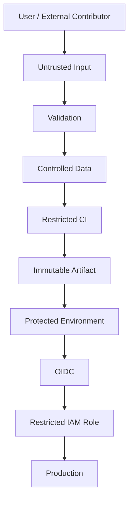

# 07- Untrusted Input Handling

## Overview

GitHub Actions workflows routinely consume data that may be controlled by users or external systems. Pull request titles, branch names, commit messages, issue content, workflow inputs, repository dispatch payloads, API responses, and generated matrix values can all cross trust boundaries.

The security problem begins when untrusted data is treated as trusted configuration or executable code.

A secure workflow maintains a clear separation:

```text
Untrusted Input
      ↓
Validation
      ↓
Safe Data Representation
      ↓
Restricted Processing
      ↓
Privileged Operation
```

The most important principle is:

> Untrusted input must remain data throughout the workflow unless it has been explicitly validated and transformed into an allowed value.

This is closely related to script injection, secret exposure, `pull_request_target`, workflow permissions, environments, self-hosted runners, OIDC, and AWS IAM.

## What Is Untrusted Input?

Untrusted input is any value whose contents can be influenced by a party that is not fully trusted by the workflow.

Common examples include:

| Input | Typical Risk |
|---|---|
| Pull request title | Shell injection |
| Pull request body | Script or command injection |
| Branch name | Command manipulation |
| Commit message | Shell injection |
| Issue title/body | Command manipulation |
| Workflow input | Unauthorized target selection |
| Repository dispatch payload | Unexpected parameters |
| External API response | Malicious data |
| Generated matrix values | Unexpected job configuration |
| File contents | Data-to-command injection |
| Docker image reference | Unexpected image selection |

The key point is that the value may look harmless while still being attacker-controlled.

## Trusted and Untrusted Boundaries

A useful model is:

```text
Trusted Workflow Code
        │
        ├── Trusted Configuration
        │
        └── Untrusted Input
                 │
                 ↓
            Validation
                 │
                 ↓
          Controlled Value
```

Do not assume that a value is trusted simply because GitHub generated it.

For example:

```text
github.event.pull_request.title
```

is supplied by GitHub, but its contents can be controlled by the pull request author.

Therefore:

```text
GitHub-generated metadata
        ≠
Trusted application input
```

## Why Untrusted Input Matters in CI/CD

CI/CD systems have unusually powerful capabilities.

A workflow may have access to:

- Source code.
- Repository write permissions.
- Package registries.
- Cloud credentials.
- Deployment credentials.
- Production environments.
- Private networks.
- Docker.
- Kubernetes.
- AWS APIs.
- Internal services.

A successful injection therefore has a larger potential blast radius than the same vulnerability in an ordinary application.

For example:

```text
Malicious PR Title
      ↓
Shell Injection
      ↓
Workflow Execution
      ↓
AWS OIDC Token
      ↓
IAM Role
      ↓
Cloud Resources
```

The security objective is therefore both:

1. Prevent the injection.
2. Limit the impact if workflow execution is compromised.

## Data vs Code

The central security distinction is:

```text
Data
```

versus:

```text
Executable Code
```

Safe design:

```text
Input
  ↓
Environment Variable
  ↓
Quoted Argument
  ↓
Program
```

Dangerous design:

```text
Input
  ↓
String Concatenation
  ↓
Shell Script
  ↓
Execution
```

The second design allows data to influence the structure of the executable command.

## GitHub Expressions and Shell Commands

GitHub Actions expressions use:

```yaml
${{ ... }}
```

The expression is evaluated by GitHub Actions before the shell executes the resulting command.

Consider:

```yaml
- name: Display title
  run: echo "${{ github.event.pull_request.title }}"
```

Conceptually:

```text
GitHub Expression
      ↓
String Substitution
      ↓
Generated Shell Script
      ↓
Shell Parser
      ↓
Execution
```

The shell does not know that the inserted string originated from a GitHub context.

This is why direct interpolation of untrusted data into `run:` commands is dangerous.

## Safe Environment Variable Pattern

Prefer passing untrusted values through environment variables:

```yaml
- name: Display PR title
  env:
    PR_TITLE: ${{ github.event.pull_request.title }}
  run: |
    printf 'PR title: %s\n' "$PR_TITLE"
```

The shell parses:

```bash
"$PR_TITLE"
```

as a variable expansion.

The contents of the variable are treated as data rather than being reparsed as shell syntax.

## Why Quoting Matters

Use:

```bash
"$VALUE"
```

rather than:

```bash
$VALUE
```

For example:

```bash
printf '%s\n' "$BRANCH_NAME"
```

Quoting protects against:

- Word splitting.
- Wildcard expansion.
- Unexpected argument boundaries.

This is a basic but important shell-security practice.

## Pull Request Titles

Pull request titles are commonly attacker-controlled.

Avoid:

```yaml
- name: Validate title
  run: |
    echo "Title: ${{ github.event.pull_request.title }}"
```

Prefer:

```yaml
- name: Validate title
  env:
    PR_TITLE: ${{ github.event.pull_request.title }}
  run: |
    printf 'Title: %s\n' "$PR_TITLE"
```

If the title must satisfy a format:

```bash
if [[ "$PR_TITLE" =~ ^(feat|fix|docs|refactor): ]]; then
    echo "Valid title"
else
    echo "Invalid pull request title" >&2
    exit 1
fi
```

Validation should determine whether the value is allowed rather than attempting to sanitize arbitrary shell syntax.

## Branch Names

Branch names should be treated as untrusted input.

Avoid:

```yaml
- run: ./deploy.sh ${{ github.ref_name }}
```

Prefer:

```yaml
- name: Process branch
  env:
    BRANCH_NAME: ${{ github.ref_name }}
  run: |
    ./scripts/process-branch.sh "$BRANCH_NAME"
```

If only known branches are valid:

```bash
case "$BRANCH_NAME" in
  main|develop)
    ;;
  *)
    echo "Unsupported branch: $BRANCH_NAME" >&2
    exit 1
    ;;
esac
```

## Commit Messages

Commit messages can contain arbitrary text.

Avoid:

```yaml
- run: echo "${{ github.event.head_commit.message }}"
```

Prefer:

```yaml
- name: Inspect commit message
  env:
    COMMIT_MESSAGE: ${{ github.event.head_commit.message }}
  run: |
    printf '%s\n' "$COMMIT_MESSAGE"
```

Do not use commit messages to construct shell commands.

## Issue Titles and Bodies

Issue content is user-controlled.

Avoid:

```yaml
- name: Process issue
  run: ./process.sh "${{ github.event.issue.body }}"
```

Prefer:

```yaml
- name: Process issue
  env:
    ISSUE_BODY: ${{ github.event.issue.body }}
  run: |
    ./process.sh "$ISSUE_BODY"
```

The called script should still validate the input.

## Workflow Inputs

Manual workflow inputs should not automatically be considered trusted.

For example:

```yaml
on:
  workflow_dispatch:
    inputs:
      environment:
        description: Deployment environment
        required: true
        type: string
```

The input could potentially influence:

- Deployment target.
- AWS account.
- Kubernetes namespace.
- Docker image.
- File path.
- Shell command.

Prefer constrained inputs where appropriate:

```yaml
on:
  workflow_dispatch:
    inputs:
      environment:
        description: Deployment environment
        required: true
        type: choice
        options:
          - staging
          - production
```

The input constraint improves correctness but does not replace authorization.

## Authorization vs Validation

Validation answers:

> Is this value structurally or semantically acceptable?

Authorization answers:

> Is this caller allowed to perform this operation?

For example:

```text
environment = production
```

may be valid.

That does not mean the caller is authorized to deploy to production.

A secure deployment therefore needs:

```text
Input Validation
      +
Environment Protection
      +
Workflow Permissions
      +
Cloud Authorization
```

## Repository Dispatch Inputs

External automation can trigger workflows through `repository_dispatch`.

Payload data should be treated as untrusted until validated.

Conceptually:

```text
External System
      ↓
repository_dispatch
      ↓
Payload
      ↓
Validation
      ↓
Controlled Workflow
```

Do not allow arbitrary payload values to become shell commands or privileged resource selectors.

## External API Responses

External services are also untrusted data sources.

For example:

```bash
response="$(curl --fail --silent "$API_URL")"
```

Do not immediately construct commands from arbitrary response content.

Prefer structured parsing:

```bash
name="$(jq -r '.name' <<< "$response")"
```

Then pass the validated field as an argument:

```bash
./scripts/process-user.sh "$name"
```

The preferred flow is:

```text
API Response
    ↓
JSON Parser
    ↓
Validation
    ↓
Typed / Controlled Value
    ↓
Application Logic
```

## JSON as a Data Boundary

Structured formats help preserve the distinction between data and executable commands.

Prefer:

```text
JSON
 ↓
Parser
 ↓
Validation
 ↓
Program Argument
```

instead of:

```text
JSON
 ↓
String Concatenation
 ↓
Shell Command
```

For example:

```bash
environment="$(jq -r '.environment' <<< "$response")"

case "$environment" in
  staging|production)
    ;;
  *)
    echo "Invalid environment" >&2
    exit 1
    ;;
esac
```

## Shell Command Injection

The classic dangerous pattern is:

```bash
COMMAND="deploy $INPUT"
eval "$COMMAND"
```

or:

```bash
sh -c "deploy $INPUT"
```

The input becomes part of the shell program.

Avoid `eval` with untrusted input.

Prefer fixed command structures:

```bash
deploy --target "$INPUT"
```

Even better, validate the value before passing it:

```bash
case "$INPUT" in
  staging|production)
    deploy --target "$INPUT"
    ;;
  *)
    echo "Invalid deployment target" >&2
    exit 1
    ;;
esac
```

## `eval`

`eval` causes the shell to parse a string as shell code.

Avoid:

```bash
eval "$COMMAND"
```

when any part of `COMMAND` originates from untrusted data.

The security problem is:

```text
Input
  ↓
String
  ↓
eval
  ↓
Shell Parser
  ↓
Code Execution
```

A safer design avoids generating shell programs dynamically.

## `sh -c`

The same principle applies to:

```bash
sh -c "$COMMAND"
```

and:

```bash
bash -c "$COMMAND"
```

These constructs intentionally create a second command-parsing boundary.

If dynamic execution is genuinely required, the input must be strictly controlled and constrained.

## Python Subprocesses

Python deployment scripts can also introduce injection vulnerabilities.

Avoid:

```python
import subprocess

environment = input_value

subprocess.run(
    f"./deploy.sh {environment}",
    shell=True,
    check=True,
)
```

Prefer:

```python
import subprocess

environment = input_value

subprocess.run(
    ["./deploy.sh", environment],
    check=True,
)
```

The list form separates:

```text
Executable
+
Arguments
```

instead of constructing a shell command string.

## Python Input Validation

Use explicit validation:

```python
import sys

ALLOWED_ENVIRONMENTS = {"staging", "production"}

environment = sys.argv[1]

if environment not in ALLOWED_ENVIRONMENTS:
    print("Invalid environment", file=sys.stderr)
    sys.exit(1)
```

This is preferable to attempting to remove dangerous characters from arbitrary input.

## Allowlist vs Sanitization

For security-sensitive choices, prefer an allowlist.

Weak approach:

```text
Remove:
$ ; & | ` < >
```

Better approach:

```text
Accept only:
staging
production
```

Why?

Because command languages contain many parsing rules, quoting mechanisms, substitutions, encodings, and shell-specific behaviors.

An allowlist defines what is valid instead of attempting to enumerate everything that is invalid.

## File Paths

File paths can also be attacker-controlled.

Dangerous:

```bash
cat "$USER_PATH"
```

Even when quoting prevents shell injection, the application may still allow path traversal:

```text
../../sensitive-file
```

Therefore shell safety and application-level validation are separate concerns.

A secure workflow should validate:

- Allowed directories.
- Expected file extensions.
- Canonical paths.
- Repository-relative boundaries.

## Temporary Files

Do not construct temporary file paths directly from user input.

Avoid:

```bash
FILE="/tmp/$INPUT"
```

Prefer secure temporary-file mechanisms:

```bash
TEMP_FILE="$(mktemp)"
```

and validate any user-controlled filename separately.

## Docker Image References

Docker image names and tags can become injection or authorization problems if dynamically constructed.

Prefer:

```yaml
- name: Build image
  env:
    IMAGE_TAG: ${{ github.sha }}
  run: |
    docker build -t "my-api:${IMAGE_TAG}" .
```

A commit SHA is preferable to arbitrary user input for production artifact identity.

For user-provided image names, validate:

```text
Registry
Repository
Tag
Digest
```

before using them.

## Docker Build Arguments

Avoid using arbitrary input as executable build instructions.

For example:

```bash
docker build --build-arg COMMAND="$INPUT" .
```

is dangerous if the Dockerfile executes the value.

Do not allow user-controlled values to determine arbitrary Dockerfile commands.

## Docker Secrets

Do not pass production secrets through ordinary build arguments:

```dockerfile
ARG AWS_SECRET_ACCESS_KEY
```

Build arguments can become visible through build metadata or image history depending on usage.

Use appropriate BuildKit secret mechanisms for legitimate build-time secrets, and avoid requiring secrets during image creation whenever possible.

## Kubernetes

Kubernetes command construction requires the same discipline.

Avoid:

```bash
kubectl "$USER_COMMAND"
```

Prefer fixed commands:

```bash
kubectl -n "$NAMESPACE" rollout status deployment/"$DEPLOYMENT"
```

Then validate:

```text
Namespace
Deployment
Container
Image
```

before use.

Production Kubernetes credentials should never be available to untrusted pull-request jobs.

## AWS CLI

AWS CLI commands can become dangerous when dynamic values are inserted into executable command structures.

Prefer:

```bash
aws ecs update-service \
  --cluster "$ECS_CLUSTER" \
  --service "$ECS_SERVICE" \
  --force-new-deployment
```

Avoid:

```bash
aws $COMMAND
```

where `COMMAND` is externally controlled.

Use fixed command structures and validated arguments.

## AWS OIDC

OIDC reduces the need for long-lived AWS credentials but does not make workflow execution trusted.

A compromised privileged workflow could potentially obtain an OIDC token.

The security model should therefore be:

```text
Trusted Deployment Workflow
        ↓
id-token: write
        ↓
GitHub OIDC
        ↓
AWS STS
        ↓
Restricted IAM Role
```

Do not combine:

```text
Untrusted Code
+
id-token: write
+
Production IAM Role
```

## IAM Least Privilege

The IAM role assumed by GitHub Actions should have only the permissions required by the deployment.

For example:

```text
Deployment Job
    ↓
OIDC
    ↓
Production IAM Role
    ↓
ECS Update Permissions
```

Avoid granting:

```text
AdministratorAccess
```

to a general-purpose CI deployment role.

If script injection occurs, least privilege limits the blast radius.

## `pull_request` Security Boundary

A pull request workflow may execute code introduced by the contributor.

Therefore:

```text
pull_request
    ↓
Untrusted Repository Changes
    ↓
Restricted Permissions
    ↓
No Production Secrets
```

is the safer default model for validation.

PR workflows should normally be able to:

- Checkout code.
- Install dependencies.
- Run tests.
- Build validation artifacts.

They should not require production deployment authority.

## `pull_request_target`

`pull_request_target` executes in the context of the base repository.

That can provide access to privileges and secrets unavailable to ordinary fork-based PR workflows.

This makes it useful for certain trusted metadata operations but dangerous when combined with execution of untrusted PR code.

Avoid:

```yaml
on:
  pull_request_target:

jobs:
  test:
    steps:
      - uses: actions/checkout@v4
        with:
          ref: ${{ github.event.pull_request.head.sha }}

      - run: pip install -r requirements.txt
      - run: pytest
```

The workflow is privileged while executing attacker-controlled code.

The important rule is:

> A privileged workflow must not execute untrusted pull-request code.

## Fork Pull Requests

Fork contributors may control:

- Source code.
- Workflow changes.
- Dependencies.
- Build scripts.
- Tests.
- Shell scripts.

Therefore a fork PR should be treated as untrusted execution.

A secure architecture is:

```text
Fork PR
   ↓
pull_request
   ↓
GitHub-hosted Runner
   ↓
Restricted Permissions
   ↓
No Production Secrets
```

## Workflow File Integrity

Input validation alone does not protect against a malicious workflow modification.

An attacker who can modify the workflow itself may attempt:

```yaml
- run: env
```

or:

```yaml
- run: curl attacker.example
```

If the modified workflow executes with production credentials, the security boundary has already failed.

Therefore protect:

- Default branches.
- Workflow files.
- Deployment workflows.
- Reusable workflows.
- Action definitions.

## Third-Party Actions

Third-party actions are executable code.

An action may access the permissions and environment available to the job.

The risk model is:

```text
Third-Party Action
       ↓
Job Permissions
       ↓
Secrets / Token / OIDC
       ↓
Potential Blast Radius
```

Limit what the job can access before invoking external actions.

## Action Pinning

For security-sensitive workflows, immutable commit SHA references provide stronger integrity than mutable tags.

For example:

```yaml
- uses: actions/checkout@<commit-sha>
```

An organization can establish an approved-action policy that defines when tags, major versions, or full SHAs are acceptable.

The important principle is to control action provenance and change.

## Secret Exposure

Untrusted input becomes particularly dangerous when the same job has secrets.

For example:

```text
Untrusted PR
    +
Production Secret
    =
High Impact
```

Avoid giving secrets to jobs that execute untrusted code.

Environment secrets should be introduced only at the trusted deployment boundary.

## Environment Protection

A production environment can provide:

- Required reviewers.
- Deployment restrictions.
- Environment secrets.
- Environment variables.
- Deployment history.

A secure deployment path can be:

```text
Build
  ↓
Immutable Artifact
  ↓
Staging
  ↓
Validation
  ↓
Production Environment
  ↓
Approval
  ↓
Production
```

Environment protection should complement, not replace, workflow and cloud authorization.

## Environment Selection

Do not blindly trust:

```yaml
environment: ${{ inputs.environment }}
```

when the input can be manipulated.

Validate the target:

```bash
case "$ENVIRONMENT" in
  staging|production)
    ;;
  *)
    echo "Unsupported environment" >&2
    exit 1
    ;;
esac
```

Authorization must still be enforced through the environment configuration.

## GITHUB_OUTPUT

Outputs are data channels, not trust boundaries.

A step may generate:

```bash
printf 'environment=%s\n' "$ENVIRONMENT" >> "$GITHUB_OUTPUT"
```

A later job might consume it:

```yaml
environment: ${{ needs.plan.outputs.environment }}
```

The output must still be considered untrusted if its source was untrusted.

Use validation before allowing an output to influence privileged behavior.

## GITHUB_ENV

Similarly:

```bash
printf 'DEPLOY_TARGET=%s\n' "$TARGET" >> "$GITHUB_ENV"
```

does not make `TARGET` trusted.

Use fixed variable names and validate values.

Avoid allowing user-controlled input to determine environment variable names or workflow control data.

## Dynamic Matrices

Dynamic matrices often use:

```yaml
strategy:
  matrix: ${{ fromJSON(needs.plan.outputs.matrix) }}
```

The generated JSON can influence:

- Operating systems.
- Python versions.
- Databases.
- Deployment regions.
- Environment targets.
- Image references.

A safe architecture is:

```text
Input
  ↓
Planning Job
  ↓
Validation
  ↓
Constrained JSON
  ↓
Matrix
  ↓
Restricted Jobs
```

Do not let arbitrary user input directly generate a privileged deployment matrix.

## Matrix Security

For testing:

```yaml
strategy:
  matrix:
    python-version:
      - "3.11"
      - "3.12"
```

is relatively constrained.

A matrix generated from external data requires additional validation.

For example:

```text
Allowed Python Versions
    ↓
3.11
3.12
```

is safer than accepting arbitrary values such as:

```text
python-version = "some-user-command"
```

## Artifacts

Artifacts should also be treated as potentially untrusted unless produced by a trusted build process.

Do not automatically execute arbitrary files from an artifact.

For example:

```text
Download Artifact
      ↓
Verify Source / Integrity
      ↓
Inspect
      ↓
Execute Only if Trusted
```

This is particularly important when workflows from different trust boundaries share artifacts.

## Caches

Caches should not be treated as trusted executable state.

A compromised cache could potentially contain malicious dependencies or build outputs.

Use cache keys and scopes carefully.

Avoid caching:

- Secrets.
- Production credentials.
- `.env` files.
- Private keys.
- Authentication material.

## Dependency Installation

Dependency installation executes code in many ecosystems.

For Python:

```bash
pip install -r requirements.txt
```

may execute package installation logic.

For Node:

```bash
npm ci
```

may execute lifecycle scripts depending on configuration.

For untrusted PRs, dependency changes should therefore be considered part of the execution trust boundary.

## Python Dependency Security

Use:

- Locked dependency versions.
- Dependency review.
- Trusted package indexes.
- Dependency scanning.
- Hash verification where appropriate.
- Regular dependency updates.

Do not assume that a dependency file committed to a PR is trustworthy.

## Django and FastAPI CI

A typical backend validation pipeline is:

```text
Pull Request
    ↓
Checkout
    ↓
Python Setup
    ↓
Dependency Installation
    ↓
Django / FastAPI Tests
    ↓
Coverage
    ↓
Security Scan
```

This workflow should not require production secrets.

Integration tests should use isolated services:

```text
pytest
  ↓
PostgreSQL Service
Redis Service
```

rather than production infrastructure.

## PostgreSQL and Redis

Use ephemeral service containers where appropriate:

```text
GitHub Runner
 ├── Application
 ├── PostgreSQL
 └── Redis
```

This keeps test dependencies isolated.

Do not configure:

```text
CI
 ↓
Production PostgreSQL
```

just because the application uses PostgreSQL.

## Celery

Celery integration tests may require Redis or another broker.

Use a dedicated test broker:

```text
CI
 ├── Django / FastAPI
 ├── PostgreSQL
 └── Redis
       ↓
     Celery
```

Do not expose production broker credentials to pull-request tests.

## Kafka

Kafka integration testing should similarly use isolated infrastructure.

The security boundary should remain:

```text
PR
 ↓
Test Kafka
```

rather than:

```text
PR
 ↓
Production Kafka
```

This protects both credentials and production data.

## gRPC and REST APIs

API test inputs are untrusted application data even when generated inside CI.

Test payloads should not accidentally become shell commands through diagnostic tooling.

For example, avoid:

```bash
curl ... -d "$USER_INPUT" | sh
```

or any pipeline that turns API responses into executable content.

## Shell vs Application-Level Validation

Complex validation is often better implemented in Python than shell.

Instead of:

```bash
if [[ "$INPUT" =~ complicated-regex ]]; then
    ...
fi
```

consider:

```bash
python scripts/validate_input.py
```

when the validation logic becomes complex enough to require:

- Structured parsing.
- Multiple constraints.
- Type validation.
- Detailed error handling.
- Unit tests.

This improves maintainability and testability.

## Input Validation Strategy

A strong validation pipeline is:

```text
Receive
  ↓
Parse
  ↓
Normalize
  ↓
Validate Type
  ↓
Validate Format
  ↓
Validate Allowed Values
  ↓
Authorize
  ↓
Execute
```

For example:

```text
environment
  ↓
string
  ↓
staging|production
  ↓
caller authorized?
  ↓
deploy
```

## Normalization

Normalization should be applied carefully.

For example:

```python
environment = input_value.strip().lower()
```

can be useful when the accepted format allows case-insensitive input.

However, normalization must not accidentally transform an invalid input into a privileged valid operation.

For security-sensitive identifiers, explicit canonicalization rules are preferable.

## Input Length Limits

Untrusted input should often have reasonable size limits.

For example:

```python
if len(title) > 256:
    raise ValueError("Title is too long")
```

This helps prevent:

- Excessive log volume.
- Resource consumption.
- Unexpected parser behavior.
- Large environment variables.
- Accidental artifact growth.

## Logging Untrusted Input

Logging untrusted input can itself create operational problems.

For example:

```bash
printf '%s\n' "$INPUT"
```

is safer than shell execution, but the value may still contain:

- ANSI escape sequences.
- Huge payloads.
- Control characters.
- Sensitive content.

Logging should therefore use appropriate limits and formatting.

## Command Arguments

Command arguments should represent values, not command fragments.

Good:

```bash
deploy --environment "$ENVIRONMENT"
```

Bad:

```bash
deploy $ENVIRONMENT
```

Worse:

```bash
eval "deploy $ENVIRONMENT"
```

The goal is to maintain:

```text
Executable
+
Known Argument Positions
+
Validated Values
```

## Environment Variables Are Not Automatically Safe

Environment variables reduce shell parsing risk, but they do not solve every security problem.

For example:

```bash
rm -rf "$USER_PATH"
```

may be safe from shell metacharacter injection but still dangerous if `USER_PATH` points to the wrong location.

Therefore:

```text
Shell Safety
```

and:

```text
Application Authorization
```

are separate concerns.

## Security Architecture

A production CI/CD security architecture can be represented as:



The privileged path begins only after the trust boundary has been crossed.

## Defense in Depth

Input handling should be one layer in a broader security model:

```text
Input Validation
       ↓
Safe Command Construction
       ↓
Least-Privilege Permissions
       ↓
Secret Isolation
       ↓
Protected Environments
       ↓
Trusted Actions
       ↓
Runner Isolation
       ↓
Restricted Cloud IAM
       ↓
Monitoring
```

If one control fails, the remaining controls should limit the impact.

## Self-Hosted Runner Security

Self-hosted runners require additional care because workflows can potentially access:

- Local files.
- Persistent credentials.
- Docker sockets.
- Internal services.
- Cloud metadata.
- Private networks.
- Other jobs.

A self-hosted runner with production network access should not execute arbitrary pull-request code.

## Runner Isolation

Use separate trust zones:

```text
Untrusted CI
    ↓
GitHub-Hosted Runner

Trusted Deployment
    ↓
Privileged Runner
    ↓
Private Network
```

Where possible, privileged runners should be ephemeral.

## Ephemeral Runners

A secure deployment architecture can be:

```text
Provision Runner
      ↓
Execute Deployment
      ↓
Collect Required Results
      ↓
Destroy Runner
```

This reduces persistence of:

- Source code.
- Credentials.
- Docker layers.
- Temporary files.
- Compromised state.

## Network Restrictions

A privileged runner should only access the systems required by its job.

For example:

```text
Deployment Runner
    ├── ECR
    ├── ECS
    └── Required Internal APIs
```

Avoid broad network access that turns a CI compromise into an internal-network compromise.

## Third-Party Action Trust

Before using an action in a privileged job, consider:

- Source repository.
- Maintainer trust.
- Versioning.
- Pinning strategy.
- Permissions required.
- Secrets accessed.
- Network access.
- Dependency chain.
- Release process.

A production deployment should minimize the number of external actions inside the privileged trust boundary.

## Permissions

Use the smallest possible `GITHUB_TOKEN` permissions.

For general CI:

```yaml
permissions:
  contents: read
```

For a deployment requiring OIDC:

```yaml
permissions:
  contents: read
  id-token: write
```

Do not grant permissions globally if only one job requires them.

## Job-Level Permissions

Prefer:

```yaml
permissions:
  contents: read

jobs:
  test:
    permissions:
      contents: read

  deploy:
    permissions:
      contents: read
      id-token: write
```

This limits the blast radius of an injection in the test job.

## Production Secrets

Production secrets should be introduced only where required:

```text
Build
 ↓
No Production Secrets

Staging
 ↓
Staging Configuration

Production
 ↓
Protected Environment
 ↓
Production Credentials
```

Do not expose production secrets merely because the workflow eventually deploys to production.

## Environment Protection

Production environments should typically combine:

- Required reviewers.
- Branch restrictions.
- Environment secrets.
- Environment variables.
- Deployment history.
- Deployment concurrency.

The architecture becomes:

```text
Trusted Artifact
      ↓
Staging
      ↓
Validation
      ↓
Production Environment
      ↓
Approval
      ↓
Production
```

## Immutable Artifacts

Build once:

```text
Source
  ↓
Build
  ↓
Docker Image
  ↓
ECR
```

Then promote:

```text
ECR Image
  ↓
Staging
  ↓
Production
```

Avoid:

```text
Build for Staging
      ↓
Build Again for Production
```

because the production artifact may differ from the tested artifact.

## Concurrency

Production deployment races should be prevented:

```yaml
concurrency:
  group: production-deployment
  cancel-in-progress: false
```

The goal is:

```text
Deployment A
    ↓
Production

Deployment B
    ↓
Wait
```

rather than:

```text
Deployment A ──┐
               ├── Production
Deployment B ──┘
```

Concurrency protects deployment consistency but does not replace authorization.

## Rollback

A secure deployment system should have a known-good artifact available for rollback.

For example:

```text
Production
   ↓
Image: abc123
   ↓
Failure
   ↓
Rollback
   ↓
Image: 789xyz
```

Rollback should not require executing arbitrary recovery commands supplied by an operator.

Use predefined deployment mechanisms.

## Monitoring

Monitor for:

- Unexpected workflow changes.
- Unexpected deployment triggers.
- Unexpected cloud API activity.
- Unexpected network connections.
- Repeated authentication failures.
- New third-party actions.
- Changes to production workflows.
- Unexpected environment usage.

For AWS deployments, CloudTrail is particularly useful for identifying actions performed using an assumed deployment role.

## Troubleshooting

Use:

```text
Symptom
  ↓
Possible Causes
  ↓
Isolation Strategy
  ↓
Commands / Checks
  ↓
Root Cause
  ↓
Corrective Action
  ↓
Prevention
```

### Workflow Fails Only for Certain PR Titles

**Possible causes**

- Direct expression interpolation.
- Shell metacharacters.
- Quoting failure.
- Command substitution.

**Isolation**

Search workflow files for:

```yaml
${{ github.event.pull_request.title }}
```

inside `run:` blocks.

**Corrective action**

Use:

```yaml
env:
  PR_TITLE: ${{ github.event.pull_request.title }}
```

and:

```bash
printf '%s\n' "$PR_TITLE"
```

### Branch Name Changes Command Behavior

**Possible causes**

- Direct shell interpolation.
- Missing quotes.
- Dynamic command construction.

**Corrective action**

Use:

```bash
./scripts/process.sh "$BRANCH_NAME"
```

and validate the branch name.

### Production Deployment Uses Unexpected Target

**Possible causes**

- Unvalidated workflow input.
- Dynamic environment selection.
- Broad permissions.
- Missing environment protection.
- Compromised workflow.

**Isolation**

Inspect:

```text
Workflow Event
↓
Input
↓
Validation
↓
Environment
↓
Permissions
↓
Cloud Identity
```

### OIDC Role Is Assumed Unexpectedly

**Possible causes**

- `id-token: write` granted too broadly.
- IAM trust policy too broad.
- Privileged workflow executes untrusted code.
- Production environment restrictions are insufficient.

**Corrective action**

Review:

- Workflow permissions.
- Environment protection.
- IAM trust conditions.
- Workflow source.
- Runner trust level.

### Unexpected Commands Execute During PR Validation

**Possible causes**

- Malicious dependency.
- Malicious workflow modification.
- Test script compromise.
- `pull_request_target` executing PR code.
- Shell injection.

**Isolation**

Review:

```text
Checkout
↓
Dependencies
↓
Workflow
↓
Test Commands
↓
Permissions
↓
Secrets
```

### Third-Party Action Is Suspected

**Possible causes**

- Compromised action.
- Mutable version reference.
- Excessive permissions.
- Unexpected dependency behavior.

**Corrective action**

- Pin the action.
- Review its source and release.
- Remove unnecessary permissions.
- Rotate exposed credentials.
- Review logs and cloud audit data.

## GitHub CLI Diagnostics

List recent workflow runs:

```bash
gh run list
```

Inspect a run:

```bash
gh run view RUN_ID
```

View logs:

```bash
gh run view RUN_ID --log
```

Inspect repository Actions permissions:

```bash
gh api repos/{owner}/{repo}/actions/permissions
```

Inspect workflow permission configuration:

```bash
gh api repos/{owner}/{repo}/actions/permissions/workflow
```

List repository secrets without revealing values:

```bash
gh secret list
```

Inspect environments:

```bash
gh api repos/{owner}/{repo}/environments
```

These commands support investigation without requiring sensitive credential values to be printed.

## Incident Response

If untrusted input may have resulted in code execution inside a privileged workflow:

1. Stop affected deployments.
2. Identify the workflow run.
3. Identify the triggering event.
4. Identify the commit and workflow revision.
5. Determine available `GITHUB_TOKEN` permissions.
6. Determine whether secrets were available.
7. Determine whether OIDC was available.
8. Identify the IAM role used, if applicable.
9. Rotate potentially exposed credentials.
10. Review cloud audit logs.
11. Review workflow and repository changes.
12. Inspect artifacts and logs.
13. Fix the trust boundary.
14. Validate the corrected workflow.
15. Restore deployment capability using known-good code and artifacts.

## Production CI/CD Example

A secure Python backend pipeline can separate untrusted validation from privileged deployment:

```yaml
name: CI/CD

on:
  pull_request:
  push:
    branches:
      - main

permissions:
  contents: read

jobs:
  test:
    runs-on: ubuntu-latest

    steps:
      - name: Checkout
        uses: actions/checkout@v4

      - name: Set up Python
        uses: actions/setup-python@v5
        with:
          python-version: "3.12"

      - name: Install dependencies
        run: pip install -r requirements.txt

      - name: Run tests
        run: pytest

  deploy:
    if: github.event_name == 'push' && github.ref == 'refs/heads/main'
    needs: test
    runs-on: ubuntu-latest
    environment: production

    concurrency:
      group: production-deployment
      cancel-in-progress: false

    permissions:
      contents: read
      id-token: write

    steps:
      - name: Checkout
        uses: actions/checkout@v4

      - name: Configure AWS credentials
        uses: aws-actions/configure-aws-credentials@v4
        with:
          role-to-assume: ${{ vars.AWS_DEPLOYMENT_ROLE }}
          aws-region: ${{ vars.AWS_REGION }}

      - name: Deploy immutable artifact
        env:
          IMAGE_TAG: ${{ github.sha }}
        run: |
          ./scripts/deploy.sh "$IMAGE_TAG"
```

The security properties are:

```text
Pull Request
    ↓
Restricted CI
    ↓
No Production Credentials

Main
    ↓
Protected Deployment
    ↓
OIDC
    ↓
Restricted IAM
    ↓
Immutable Artifact
```

## Secure Deployment Architecture

A production pipeline can be structured as:

```mermaid
flowchart LR
    PR[Pull Request]
    CI[Lint + Tests + Security Scan]
    Build[Build]
    Artifact[Immutable Artifact]
    Registry[ECR]
    Stage[Staging]
    Validate[Validation]
    Protect[Production Protection]
    OIDC[GitHub OIDC]
    IAM[AWS IAM Role]
    Prod[Production]
    Monitor[Monitoring]
    Rollback[Rollback]

    PR --> CI
    CI --> Build
    Build --> Artifact
    Artifact --> Registry
    Registry --> Stage
    Stage --> Validate
    Validate --> Protect
    Protect --> OIDC
    OIDC --> IAM
    IAM --> Prod
    Prod --> Monitor
    Monitor --> Rollback
    Rollback --> Registry
```



The untrusted PR path terminates before privileged deployment credentials become available.

## Reliability Considerations

Security controls should not make the pipeline impossible to recover.

A reliable design should support:

- Re-running trusted workflows.
- Re-deploying immutable artifacts.
- Credential rotation.
- Runner replacement.
- Deployment rollback.
- Environment recovery.
- Artifact retention.
- Cloud audit investigation.

Avoid recovery procedures that require disabling all security controls.

## High Availability

CI/CD infrastructure should avoid unnecessary single points of failure.

For sensitive deployments:

```text
GitHub Actions
      ↓
Ephemeral Runner
      ↓
OIDC
      ↓
Cloud API
```

The runner should be replaceable.

The artifact should remain available independently of the runner.

The deployment should not depend on a developer's workstation.

## Disaster Recovery

A CI/CD recovery strategy should preserve:

```text
Source
+
Workflow Definitions
+
Immutable Artifacts
+
Environment Configuration
+
Cloud Identity
+
Rollback Procedure
```

If a runner is destroyed, the organization should still be able to deploy a known-good artifact.

If credentials are rotated, the workflow should be able to authenticate using the replacement identity.

## Cost and Performance

Security controls should be designed around risk.

For example:

```text
PR
 ↓
Fast Parallel Tests

Main
 ↓
Full Validation

Production
 ↓
Protected Deployment
```

Do not serialize all CI merely because production deployments must be serialized.

Use:

- Matrix parallelism.
- Dependency caching.
- Docker layer caching.
- Appropriate artifact retention.
- Ephemeral runners where justified.

## Common Mistakes

### Assuming GitHub Contexts Are Trusted

`github.event.*` values can contain attacker-controlled data.

Treat them according to their source and trust level.

### Direct Expression Interpolation

Avoid:

```yaml
run: echo "${{ github.event.pull_request.title }}"
```

Use environment variables instead.

### Using `eval`

Avoid:

```bash
eval "$COMMAND"
```

with dynamic input.

### Using `shell=True`

Avoid:

```python
subprocess.run(command, shell=True)
```

when `command` contains untrusted data.

### Sanitizing Instead of Allowlisting

Removing a few dangerous characters is weaker than accepting only known valid values.

### Giving Production Credentials to CI Tests

Tests should use isolated databases, caches, brokers, and other services.

### Trusting Workflow Inputs

Manual inputs can influence privileged behavior and should be validated and authorized.

### Ignoring Dependency Execution

Installing a dependency can execute code. Dependency changes in PRs are part of the trust boundary.

### Using `pull_request_target` With PR Checkout

This can combine privileged workflow execution with attacker-controlled code.

### Running PR Code on Privileged Self-Hosted Runners

This can expose private network access, persistent credentials, and local state.

### Granting Broad AWS Permissions

A successful injection should not automatically become an account-wide compromise.

### Treating Environment Variables as Complete Security

Environment variables prevent certain shell parsing problems but do not provide authorization or path safety.

## Senior-Level Design Principles

### Preserve the Data-Code Boundary

Always prefer:

```text
Input
 ↓
Validated Data
 ↓
Fixed Program
```

over:

```text
Input
 ↓
Generated Program
```

### Validate Before Privilege

The sequence should be:

```text
Receive
 ↓
Parse
 ↓
Validate
 ↓
Authorize
 ↓
Privileged Operation
```

not:

```text
Receive
 ↓
Privileged Operation
 ↓
Validate
```

### Minimize Blast Radius

Assume that any privileged job could eventually be compromised.

Reduce impact through:

```text
Least Privilege
+
No Unnecessary Secrets
+
Restricted IAM
+
Protected Environments
+
Ephemeral Runners
+
Network Segmentation
```

### Separate CI From CD

A strong architecture keeps:

```text
Untrusted CI
```

separate from:

```text
Trusted Deployment
```

This is more important than simply adding input sanitization.

### Prefer Immutable Artifacts

Build once:

```text
Source
 ↓
Artifact
```

Then promote:

```text
Artifact
 ↓
Staging
 ↓
Production
```

This prevents production from rebuilding arbitrary source state.

## Interview Scenarios

### A PR Title Can Execute Shell Commands

Explain:

- Why expression interpolation is dangerous.
- When the expression is evaluated.
- When the shell parses the resulting command.
- Why environment variables are safer.
- Why quoting matters.
- How permissions limit the blast radius.

### A Production Workflow Uses a User-Provided Environment

Design:

```text
Input
 ↓
Allowlist
 ↓
Environment Selection
 ↓
Protected Environment
 ↓
Deployment
```

Explain the difference between validation and authorization.

### A `pull_request_target` Workflow Needs Repository Secrets

Explain:

- Why `pull_request_target` has a different security boundary.
- Why checking out and executing fork code is dangerous.
- How to separate trusted automation from untrusted code.
- Why production secrets should not be exposed to PR execution.

### A Deployment Script Uses `subprocess.run`

Given:

```python
subprocess.run(
    f"deploy --environment {environment}",
    shell=True,
)
```

identify the vulnerability and redesign it using:

```python
subprocess.run(
    ["deploy", "--environment", environment],
    check=True,
)
```

Then explain validation and authorization.

### An AWS OIDC Role Is Available to a PR

Explain why this is dangerous:

```text
Fork PR
 +
id-token: write
 +
Production IAM Role
```

Design a workflow where only a trusted deployment job receives OIDC permissions.

### A Self-Hosted Runner Has Private Network Access

Explain:

- Why PR code should not execute there.
- How runner groups can isolate trust zones.
- Why ephemeral runners reduce persistence.
- How network restrictions reduce blast radius.

### A Third-Party Action Is Compromised

Explain:

- Which permissions the action receives.
- Which secrets are available.
- Whether the action is pinned.
- Whether OIDC is available.
- Whether the runner is persistent.
- How credentials would be rotated.
- How the action would be replaced.

### Docker Image Tags Are User-Controlled

Explain how you would:

```text
Validate Registry
Validate Repository
Validate Tag
Prefer Immutable SHA / Digest
Build
Scan
Promote
```

without allowing arbitrary shell commands.

## Production Checklist

### Input Handling

- [ ] PR titles are treated as untrusted.
- [ ] PR bodies are treated as untrusted.
- [ ] Branch names are treated as untrusted.
- [ ] Commit messages are treated as untrusted.
- [ ] Issue content is treated as untrusted.
- [ ] Workflow inputs are validated.
- [ ] External API responses are parsed and validated.
- [ ] Dynamic matrix data is constrained.

### Shell Security

- [ ] Untrusted values are not directly interpolated into `run:`.
- [ ] Environment variables are used for untrusted data.
- [ ] Shell variables are quoted.
- [ ] `eval` is avoided.
- [ ] Dynamic `sh -c` and `bash -c` usage is avoided.
- [ ] Python avoids unnecessary `shell=True`.
- [ ] Commands use fixed executable structures.
- [ ] Allowlist validation is used for privileged choices.

### Workflow Security

- [ ] `pull_request` is used for untrusted PR validation where appropriate.
- [ ] `pull_request_target` usage is reviewed carefully.
- [ ] Privileged workflows do not execute attacker-controlled PR code.
- [ ] Workflow files are protected.
- [ ] Third-party actions are reviewed.
- [ ] Actions use an appropriate pinning strategy.
- [ ] Production workflows have minimal permissions.

### Secrets and Identity

- [ ] PR jobs do not receive production secrets.
- [ ] Secrets are not printed.
- [ ] Secrets are not written to artifacts.
- [ ] Secrets are not stored in caches.
- [ ] Secrets are not baked into Docker images.
- [ ] OIDC is limited to trusted jobs.
- [ ] AWS IAM roles use least privilege.
- [ ] Credentials can be rotated quickly.

### Runner Security

- [ ] Untrusted code uses isolated runners.
- [ ] Privileged self-hosted runners are protected.
- [ ] Persistent privileged runners are avoided where practical.
- [ ] Ephemeral runners are considered for sensitive deployments.
- [ ] Private network access is restricted.

### Deployment

- [ ] Production uses a protected environment.
- [ ] Deployment authorization is separate from input validation.
- [ ] Production deployments use immutable artifacts.
- [ ] Production deployment concurrency is configured.
- [ ] Rollback uses known-good artifacts.
- [ ] Production deployment identity is restricted.
- [ ] Staging and production credentials are separate.

### Detection and Recovery

- [ ] Workflow runs can be inspected.
- [ ] Cloud audit logs are available.
- [ ] Unexpected deployment activity can be detected.
- [ ] Credentials can be revoked.
- [ ] Known-good artifacts are retained.
- [ ] Incident response procedures exist.
- [ ] Rollback procedures are tested.

## Key Takeaways

- Treat pull request metadata, workflow inputs, branch names, commit messages, issue content, external responses, and generated workflow data as untrusted until validated.
- Preserve the data-code boundary by using environment variables, quoted arguments, structured parsing, allowlists, and argument arrays instead of dynamically constructing shell commands.
- `pull_request_target`, production secrets, OIDC, self-hosted runners, and privileged AWS roles must never be combined with execution of attacker-controlled code.
- Input validation is only one layer of defense; least-privilege permissions, protected environments, trusted actions, isolated runners, restricted IAM, and immutable artifacts limit the blast radius of a compromise.
- A production-grade CI/CD pipeline separates untrusted CI from privileged deployment and provides controlled authorization, monitoring, rollback, and recovery paths.