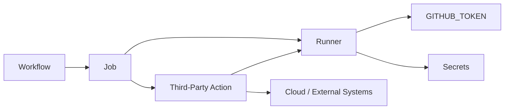

# 10- Third Party Actions Security

## Overview

GitHub Actions workflows are composed of executable components. A third-party action is therefore not simply a reusable configuration snippet; it is code executing inside the workflow's security context.

For production CI/CD, the trust chain looks like:

```text
Workflow
    ↓
Third-Party Action
    ↓
Action Dependencies
    ↓
Runner
    ↓
GITHUB_TOKEN / Secrets / OIDC
    ↓
External Systems
```

If a third-party action is compromised, malicious, poorly maintained, or granted excessive permissions, it can potentially abuse the privileges available to the workflow.

This makes third-party action security a supply-chain concern as well as a GitHub Actions configuration concern.

The core principles are:

- Use only actions that are appropriate for the workflow's trust level.
- Prefer trusted sources.
- Pin security-sensitive actions to immutable references.
- Minimize `GITHUB_TOKEN` permissions.
- Avoid exposing unnecessary secrets.
- Restrict OIDC access.
- Review action dependencies and release history.
- Separate untrusted pull-request workflows from privileged deployment workflows.
- Establish organization-level governance for approved actions.

## What Is a Third-Party Action?

A third-party action is an action maintained outside the repository's own trusted workflow code.

Example:

```yaml
steps:
  - uses: actions/checkout@v4
  - uses: actions/setup-python@v5
  - uses: third-party/example-action@v1
```

The action can be implemented as:

- Composite action.
- JavaScript action.
- Docker action.

From the workflow's perspective, the important question is not only:

```text
What does this action claim to do?
```

but also:

```text
What code will execute?
What permissions does it receive?
What secrets can it access?
What network resources can it reach?
What dependencies does it use?
Can its implementation change without my workflow changing?
```

## Why Third-Party Actions Are a Security Boundary

An action executes within the job that invokes it.

For example:

```yaml
permissions:
  contents: write

steps:
  - uses: third-party/action@v1
```

The third-party action may execute with the job's available permissions.

If the workflow also exposes:

```yaml
env:
  DEPLOYMENT_TOKEN: ${{ secrets.DEPLOYMENT_TOKEN }}
```

the action may potentially access that environment.

Therefore:

```text
Third-Party Action
       +
Excessive Permissions
       +
Secrets
       =
Large Blast Radius
```

The security objective is to reduce that blast radius.

## Action Execution Model

A useful model is:



The action inherits the execution environment and capabilities provided by the workflow.

## Major Third-Party Action Risks

Common risks include:

| Risk | Example | Impact |
|---|---|---|
| Compromised action | Maintainer account compromised | Arbitrary code execution |
| Malicious dependency | Dependency altered | Code execution |
| Mutable tag | `@v1` moves to another commit | Unexpected behavior |
| Excessive permissions | `contents: write` | Repository modification |
| Secret exposure | Action receives deployment secrets | Credential compromise |
| OIDC access | `id-token: write` | Cloud credential acquisition |
| Self-hosted runner access | Action runs internally | Private network compromise |
| Poor maintenance | Vulnerabilities remain unfixed | Long-term exposure |
| Supply-chain attack | Release pipeline compromised | Malicious action distribution |

## Trusted Action Sources

When selecting an action, evaluate:

- Repository ownership.
- Maintainer identity.
- Organization reputation.
- Source availability.
- Release history.
- Dependency model.
- Security response process.
- Documentation.
- Required permissions.
- Runtime requirements.
- Community or organizational adoption.

A commonly used action is not automatically safe.

Popularity is useful context, but it is not a security guarantee.

## Official and Organization-Owned Actions

Prefer actions from trusted sources when they satisfy the requirement.

For example:

```yaml
- uses: actions/checkout@v4
```

Organizations may also maintain internal actions:

```yaml
- uses: my-org/platform-actions/python-ci@v1
```

Internal actions provide greater control over:

- Source.
- Reviews.
- Versioning.
- Dependencies.
- Security policy.
- Documentation.
- Release process.

However, internal ownership does not eliminate the need for secure action design.

## Action Pinning

A workflow may reference an action using:

```yaml
- uses: example/action@v1
```

or:

```yaml
- uses: example/action@v1.4.2
```

or an immutable commit SHA:

```yaml
- uses: example/action@<commit-sha>
```

These approaches have different operational characteristics.

| Reference | Stability | Security Characteristics | Maintenance |
|---|---|---|---|
| Branch | Low | Weak | Easy |
| Major tag | Moderate | Mutable | Easy |
| Exact version tag | Higher | Still potentially mutable | Moderate |
| Commit SHA | High | Strong immutability | Requires update process |

For security-sensitive workflows, immutable SHA pinning provides stronger protection against a tag being moved to different code.

## Why Mutable Tags Matter

Consider:

```yaml
- uses: example/action@v1
```

Today:

```text
v1 → Commit A
```

Later:

```text
v1 → Commit B
```

The workflow file has not changed, but the executed code has.

That makes the dependency mutable.

With a pinned SHA:

```text
Workflow
   ↓
SHA
   ↓
Specific Commit
```

the executed revision remains fixed unless the workflow reference itself is changed.

## SHA Pinning Trade-Off

SHA pinning improves integrity but introduces maintenance overhead.

A repository must periodically:

1. Identify updated action versions.
2. Review changes.
3. Verify the intended commit.
4. Update the SHA.
5. Run CI.
6. Merge through normal review.

This is why dependency automation and governance are important.

## Version Pinning Strategy

Organizations can choose different policies based on risk.

### General CI

```yaml
uses: actions/checkout@v4
```

may be operationally convenient.

### Security-Sensitive Deployment

```yaml
uses: example/deploy-action@<verified-sha>
```

provides stronger immutability.

### Enterprise Governance

An organization may require:

```text
Approved Actions
+
Version Policy
+
SHA Pinning
+
Automated Updates
+
Security Review
```

for privileged workflows.

## Third-Party Action Permissions

Start with minimal permissions:

```yaml
permissions:
  contents: read
```

Then add only what is required.

For example:

```yaml
permissions:
  contents: read
  pull-requests: write
```

is preferable to:

```yaml
permissions: write-all
```

The action should not determine permissions by itself. The workflow author controls the security boundary.

## Job-Level Permissions

Different actions may need different capabilities.

Use job-level permissions where appropriate:

```yaml
jobs:
  test:
    permissions:
      contents: read

  publish:
    permissions:
      contents: read
      packages: write
```

This prevents a low-privilege action from automatically receiving the privileges needed by another job.

## `GITHUB_TOKEN`

The `GITHUB_TOKEN` is available to workflows and can be used by actions.

Its permissions should be explicitly constrained.

Example:

```yaml
permissions:
  contents: read
```

If an action only needs to inspect repository contents, there is no reason to grant:

```text
issues: write
pull-requests: write
packages: write
actions: write
contents: write
```

## Secrets

Do not expose secrets to actions unless necessary.

Avoid:

```yaml
env:
  AWS_SECRET: ${{ secrets.AWS_SECRET }}
```

when the action does not require it.

Prefer scoped access:

```yaml
jobs:
  deploy:
    environment: production

    steps:
      - uses: example/deploy-action@<verified-sha>
        env:
          DEPLOY_TOKEN: ${{ secrets.DEPLOY_TOKEN }}
```

The deployment action should run only in the trusted deployment job.

## Secrets Are Not Automatically Safe Because They Are Masked

GitHub may mask recognized secret values in logs, but masking is not equivalent to secure handling.

A secret may still be exposed through:

- Command arguments.
- Artifacts.
- Generated files.
- External services.
- Debug output.
- Process inspection.
- Docker layers.
- Third-party action behavior.

The correct approach is to minimize secret exposure in the first place.

## Avoid Secrets in Command Arguments

Avoid:

```yaml
run: deploy --token "${{ secrets.DEPLOY_TOKEN }}"
```

Prefer environment-based handling when supported:

```yaml
env:
  DEPLOY_TOKEN: ${{ secrets.DEPLOY_TOKEN }}
run: ./deploy.sh
```

The deployment tool should read the credential securely from its expected environment or credential mechanism.

## OIDC

OIDC can provide short-lived AWS credentials without storing long-lived AWS access keys in GitHub secrets.

A deployment job may use:

```yaml
permissions:
  contents: read
  id-token: write
```

The action or AWS tooling can then exchange the GitHub-issued identity token with AWS STS.

The trust flow is:

```text
GitHub Actions
      ↓
OIDC Token
      ↓
AWS STS
      ↓
IAM Trust Policy
      ↓
Temporary Credentials
      ↓
AWS Resource
```

However, `id-token: write` is itself a privilege.

Do not grant it to arbitrary PR jobs or unrelated third-party actions.

## Third-Party Actions and OIDC

This combination deserves special attention:

```yaml
permissions:
  id-token: write
```

plus:

```yaml
- uses: third-party/action@...
```

If the action is compromised, it may be able to participate in the cloud authentication flow available to the job.

A safer architecture is:

```text
PR CI
 ↓
No OIDC
 ↓
No production cloud role

Trusted Deployment
 ↓
Approved Action
 ↓
OIDC
 ↓
Restricted IAM Role
```

## AWS IAM Least Privilege

Even trusted deployment actions should not receive unrestricted cloud access.

Avoid:

```text
AdministratorAccess
```

for a generic deployment role.

Instead grant only the required operations for the target service.

For example, an ECS deployment role may require a limited set of:

```text
ECS
ECR
IAM PassRole
CloudFormation
```

permissions depending on the deployment architecture.

The exact policy should be derived from the actual deployment operations.

## Third-Party Actions and Pull Requests

Third-party actions become particularly sensitive in pull-request workflows.

Consider:

```yaml
on:
  pull_request:

permissions:
  contents: read

jobs:
  test:
    steps:
      - uses: third-party/security-action@v1
```

The action executes while processing potentially untrusted repository code.

If the action also receives:

```text
Secrets
Write permissions
OIDC
Private network access
```

the risk increases substantially.

## `pull_request_target`

Third-party actions in `pull_request_target` workflows require additional scrutiny.

The dangerous combination is:

```text
pull_request_target
+
Third-Party Action
+
Secrets
+
Untrusted PR Context
```

A compromised action can operate with the workflow's available privileges.

If a `pull_request_target` workflow is necessary, minimize:

- Permissions.
- Secrets.
- Runner access.
- Network access.
- Executable inputs.

## Action Dependency Chain

An action can itself depend on additional packages.

For a JavaScript action:

```text
Workflow
   ↓
JavaScript Action
   ↓
npm Dependencies
   ↓
Transitive Dependencies
```

For a Docker action:

```text
Workflow
   ↓
Docker Action
   ↓
Base Image
   ↓
OS Packages
   ↓
Application Dependencies
```

Therefore reviewing only the top-level action repository is insufficient for high-security environments.

## Dependency Review

Use dependency security tooling where appropriate.

Relevant controls include:

- Dependency review.
- Dependabot.
- Lockfiles.
- Vulnerability scanning.
- SBOM generation.
- Security advisories.
- Automated update workflows.

The goal is to detect vulnerable or unexpectedly changed dependencies before they become part of the trusted build chain.

## Dependabot and Action Updates

Action references should be maintained like application dependencies.

A controlled update process can be:

```text
New Action Release
      ↓
Automated Update
      ↓
Security Review
      ↓
CI
      ↓
Pull Request
      ↓
Merge
      ↓
Production Workflow
```

Avoid allowing dependency updates to bypass normal CI/CD controls.

## Supply-Chain Security

A production CI/CD pipeline has a software supply chain:

```text
Developer
   ↓
Repository
   ↓
Workflow
   ↓
Actions
   ↓
Dependencies
   ↓
Build
   ↓
Artifact
   ↓
Registry
   ↓
Deployment
```

Every stage can become a supply-chain attack surface.

## SBOM

A Software Bill of Materials can describe the components included in a build artifact.

For a Dockerized Python service, this can include:

```text
Python Runtime
Django
FastAPI
Requests
PostgreSQL Driver
Redis Client
OS Packages
Base Image
```

An SBOM helps identify affected components when a vulnerability is discovered.

## Artifact Provenance

Artifact provenance answers questions such as:

```text
Which source produced this artifact?
Which workflow built it?
Which commit was used?
Which build environment was used?
```

This becomes important when promoting artifacts between environments.

## Artifact Attestations

Attestations can provide verifiable metadata about an artifact's origin and build process.

A production deployment architecture can therefore establish:

```text
Trusted Commit
      ↓
Trusted Workflow
      ↓
Build
      ↓
Artifact
      ↓
Provenance / Attestation
      ↓
Deployment
```

This is stronger than trusting an arbitrary image tag alone.

## Artifact Signing

Signing can provide an additional integrity control:

```text
Build
 ↓
Artifact
 ↓
Sign
 ↓
Registry
 ↓
Verify
 ↓
Deploy
```

The deployment process can verify that the artifact being promoted is the expected signed artifact.

## Build Integrity

The objective is not simply to build successfully.

A production system should establish:

```text
Correct Source
+
Trusted Workflow
+
Trusted Actions
+
Controlled Dependencies
+
Expected Build
=
Trusted Artifact
```

## GitHub-Hosted Runners

GitHub-hosted runners provide an isolated execution environment for workflows.

They are generally appropriate for normal CI workloads.

Advantages include:

- Managed infrastructure.
- Fresh environments.
- No persistent organization-managed runner state.
- Easy scaling across jobs.
- Multiple operating systems.

Limitations include:

- Execution limits.
- Resource constraints.
- Limited private network access.
- Potential differences from production infrastructure.

## Self-Hosted Runner Risks

Self-hosted runners can provide:

- Private network access.
- Custom software.
- Specialized hardware.
- Internal infrastructure connectivity.

But they also introduce operational security risks.

A persistent runner may contain:

```text
Credentials
Caches
Docker layers
Source code
Temporary files
Build artifacts
```

A compromised action may attempt to access these resources.

## Ephemeral Runners

Ephemeral runners reduce persistence:

```text
Provision
    ↓
Execute Job
    ↓
Collect Results
    ↓
Destroy
```

They are particularly valuable for sensitive workloads.

They do not eliminate the need for:

- Least privilege.
- Network segmentation.
- Secret isolation.
- Action review.

## Private Network Access

A third-party action running on a runner with private network access may potentially communicate with:

```text
Internal APIs
PostgreSQL
Redis
Kafka
Kubernetes
AWS private resources
Internal management services
```

Therefore network access should be granted only where required.

For PR workflows, isolated test infrastructure is preferable to production network access.

## Docker Actions

Docker actions have their own supply-chain dependencies.

Review:

```text
Dockerfile
Base Image
OS Packages
Application Dependencies
Entrypoint
```

A Docker action should not automatically be considered safer than a JavaScript or composite action.

## Base Image Security

For Docker-based actions, evaluate:

- Base image source.
- Image version.
- Digest.
- OS package updates.
- Vulnerability status.
- Build process.

A mutable base image can introduce changes without an explicit Dockerfile change.

## Composite Actions

Composite actions package multiple workflow steps.

Example:

```yaml
runs:
  using: composite
  steps:
    - shell: bash
      run: |
        python -m pip install -r requirements.txt

    - shell: bash
      run: |
        pytest
```

Composite actions should still be treated as executable code.

They may execute shell commands, access environment variables, and use available workflow permissions.

## JavaScript Actions

JavaScript actions execute Node.js code.

Review:

```text
action.yml
package.json
package-lock.json
src/
dist/
```

and understand how the release artifact is produced.

A committed `dist/` directory may be the actual code executed by consumers.

## Docker Actions

Docker actions execute through a containerized action runtime.

Review:

```text
action.yml
Dockerfile
entrypoint
dependencies
base image
```

The container boundary does not eliminate the action's access to the workflow environment.

## Action Inputs

Action inputs may originate from untrusted sources.

Avoid allowing an action to construct shell commands from raw inputs.

Prefer structured arguments and validation.

For example:

```yaml
with:
  environment: staging
```

and validate allowed values inside the action:

```text
staging
production
```

rather than accepting arbitrary shell fragments.

## Action Outputs

Outputs are data, not authorization.

For example:

```yaml
outputs:
  image:
    description: Built image reference
```

A downstream job should not blindly trust an output if the producing job processes untrusted data.

Validate values that influence:

- Deployment targets.
- Cloud accounts.
- Regions.
- Image references.
- Environment selection.

## Action Versioning

Third-party actions should have a controlled update policy.

Common strategies include:

```text
Major Version
Exact Version
Commit SHA
```

For high-risk workflows:

```text
Verified SHA
+
Automated Update Process
+
Security Review
```

provides strong control.

## Action Allowlisting

Organizations can establish approved action sources.

For example:

```text
Approved:
- actions/*
- organization/platform-actions/*
- selected vendors
```

and restrict arbitrary Marketplace actions.

This reduces supply-chain exposure across repositories.

## Enterprise Governance

A large organization may establish:

```text
Enterprise Policy
       ↓
Approved Action Sources
       ↓
Repository Policy
       ↓
Workflow Review
       ↓
Runtime Permissions
```

Governance can cover:

- Allowed actions.
- Required pinning.
- Permission policies.
- Runner policies.
- Reusable workflows.
- Security scanning.
- Dependency management.
- Production deployment controls.

## Reusable Workflows vs Third-Party Actions

These solve different problems.

| Mechanism | Primary Purpose |
|---|---|
| Third-party action | Reuse executable functionality |
| Composite action | Reuse steps within a job |
| Reusable workflow | Reuse multi-job workflow orchestration |

A reusable workflow can provide a controlled platform boundary:

```text
Repository
   ↓
Reusable CI Workflow
   ↓
Approved Actions
   ↓
Standard Permissions
```

This reduces duplicated security-sensitive configuration.

## Centralized Approved Actions

A platform team can provide approved building blocks:

```text
platform-actions/
├── python-ci/
├── docker-build/
├── security-scan/
├── aws-auth/
└── deploy-ecs/
```

Repositories then consume standardized functionality instead of independently selecting arbitrary actions.

## Production Deployment Example

```yaml
name: Deploy

on:
  push:
    branches:
      - main

permissions:
  contents: read

jobs:
  deploy:
    runs-on: ubuntu-latest

    environment:
      name: production

    permissions:
      contents: read
      id-token: write

    steps:
      - name: Configure AWS credentials
        uses: aws-actions/configure-aws-credentials@<verified-sha>
        with:
          role-to-assume: ${{ vars.AWS_DEPLOYMENT_ROLE }}
          aws-region: ${{ vars.AWS_REGION }}

      - name: Deploy
        uses: organization/platform-actions/deploy@<verified-sha>
```

Security properties include:

- Trusted branch trigger.
- Minimal default permissions.
- OIDC only in the deployment job.
- Protected production environment.
- Pinned actions.
- No long-lived AWS credentials.
- Deployment responsibility centralized in a controlled action.

## Python Backend CI Example

A PR workflow should generally look more like:

```yaml
name: Python CI

on:
  pull_request:

permissions:
  contents: read

jobs:
  test:
    runs-on: ubuntu-latest

    steps:
      - name: Checkout
        uses: actions/checkout@<verified-sha>

      - name: Set up Python
        uses: actions/setup-python@<verified-sha>
        with:
          python-version: "3.12"

      - name: Install dependencies
        run: pip install -r requirements.txt

      - name: Run tests
        run: pytest
```

The test job does not need:

```text
AWS OIDC
Production secrets
Production database
Production Redis
Production Kafka
```

## Django and FastAPI

For Django or FastAPI applications, third-party actions may support:

- Python setup.
- Dependency caching.
- Linting.
- Security scanning.
- Docker builds.
- Coverage reporting.
- Deployment.

The action should remain isolated from production credentials unless it is explicitly part of a trusted deployment stage.

## Docker Build Pipeline

A production pipeline may use:

```text
Pull Request
    ↓
Lint
    ↓
Unit Tests
    ↓
Integration Tests
    ↓
Security Scan
    ↓
Trusted Main
    ↓
Docker Buildx
    ↓
Image Scan
    ↓
SBOM
    ↓
ECR
    ↓
Staging
    ↓
Approval
    ↓
Production
```

Third-party actions should be evaluated at each step of this chain.

## Immutable Image References

Prefer an immutable reference for production promotion.

For example:

```text
my-service:git-<commit-sha>
```

or preferably use the image digest when the deployment platform supports it:

```text
my-service@sha256:<digest>
```

Avoid treating:

```text
latest
```

as a production deployment identity.

## Monitoring Third-Party Action Usage

Organizations should know:

- Which repositories use an action.
- Which version they use.
- Which workflows invoke it.
- Which permissions it receives.
- Whether it receives secrets.
- Whether it can request OIDC.
- Which runner executes it.

This inventory is important during security incidents.

## Detecting a Compromised Action

If an action is suspected of compromise:

1. Identify all repositories using it.
2. Identify all workflow files referencing it.
3. Determine the referenced versions or SHAs.
4. Determine workflow permissions.
5. Determine available secrets.
6. Determine whether OIDC was enabled.
7. Identify self-hosted runner usage.
8. Review network access.
9. Review cloud audit logs.
10. Review workflow logs.
11. Replace or remove the action.
12. Rotate potentially exposed credentials.
13. Rebuild affected artifacts.
14. Reassess deployments created using the action.

## Security Incident Blast Radius

The blast radius depends on:

```text
Action
 ↓
Workflow Permissions
 ↓
Secrets
 ↓
Runner
 ↓
Network
 ↓
Cloud Identity
 ↓
Production Resources
```

A low-privilege action in an isolated test job has a substantially different impact from the same action running in a production deployment job.

## Troubleshooting

Use:

```text
Symptom
→ Possible Causes
→ Isolation Strategy
→ Commands / Checks
→ Root Cause
→ Corrective Action
→ Prevention
```

### Action Fails After an Update

**Possible causes**

- Action version changed.
- Runtime changed.
- Dependency changed.
- Input/output behavior changed.
- Required permission changed.

**Checks**

```bash
gh run view RUN_ID --log
```

Compare the previous and current action references.

**Prevention**

Use controlled version updates and CI validation.

### Action Suddenly Changes Behavior

**Possible causes**

- Mutable tag moved.
- Upstream release changed.
- Dependency changed.

**Corrective action**

Pin the action to a verified immutable reference.

### Action Cannot Access Repository

**Possible causes**

- Missing `contents` permission.
- Job-level permissions override workflow-level permissions.
- Token configuration changed.

Inspect:

```yaml
permissions:
```

### Action Cannot Assume AWS Role

**Possible causes**

- Missing `id-token: write`.
- IAM trust policy mismatch.
- Incorrect repository or branch claims.
- Incorrect audience.
- Wrong role ARN.

Trace:

```text
GitHub Workflow
 ↓
OIDC Permission
 ↓
OIDC Token
 ↓
AWS STS
 ↓
IAM Trust Policy
```

### Third-Party Action Exposes a Secret

**Possible causes**

- Secret passed unnecessarily.
- Secret placed in environment.
- Action logs input.
- Action writes sensitive data to artifacts.

**Corrective action**

Remove unnecessary secret access and rotate exposed credentials.

### Action Works on GitHub-Hosted Runner but Not Self-Hosted

**Possible causes**

- Missing software.
- Different network configuration.
- Different Docker configuration.
- Proxy restrictions.
- File permission differences.
- Runner architecture differences.

Do not solve the problem by granting broader permissions without identifying the actual dependency.

## GitHub CLI Operations

List workflows:

```bash
gh workflow list
```

List recent runs:

```bash
gh run list
```

Inspect a workflow run:

```bash
gh run view RUN_ID
```

View workflow logs:

```bash
gh run view RUN_ID --log
```

List repository secrets:

```bash
gh secret list
```

Inspect Actions permissions:

```bash
gh api repos/{owner}/{repo}/actions/permissions
```

Inspect workflow permissions:

```bash
gh api repos/{owner}/{repo}/actions/permissions/workflow
```

List environments:

```bash
gh api repos/{owner}/{repo}/environments
```

List releases:

```bash
gh release list
```

The CLI should be used to inspect and operate CI/CD systems without exposing secret values.

## Cost and Performance

Security controls can introduce maintenance and execution overhead.

For example:

```text
SHA Pinning
+
Security Scanning
+
SBOM
+
Artifact Signing
```

increase build and maintenance work.

However, this should be evaluated against the risk of compromised build dependencies.

Performance improvements should not bypass security boundaries.

Use:

- Dependency caching.
- Docker layer caching.
- Parallel matrix jobs.
- Reusable workflows.
- Approved action versions.

without allowing caches or artifacts to become uncontrolled trust channels.

## Reliability and High Availability

Third-party actions can become external dependencies of the CI/CD platform.

A production organization should consider:

- Action availability.
- Runtime compatibility.
- Upstream release stability.
- Dependency availability.
- Runner compatibility.
- Failure recovery.

For critical deployment workflows, avoid unnecessary dependency chains.

A smaller trusted deployment path is easier to reason about:

```text
Trusted Workflow
    ↓
Approved Action
    ↓
OIDC
    ↓
Restricted IAM
    ↓
Deployment
```

## Disaster Recovery

A compromised or unavailable third-party action should not make production recovery impossible.

Maintain the ability to:

- Replace the action.
- Pin a known-good version.
- Use an internal action.
- Re-run trusted deployment workflows.
- Deploy a known-good artifact.
- Rotate affected credentials.
- Rebuild from a trusted commit.

Immutable artifacts are particularly useful during recovery because production does not need to be rebuilt merely to restore service.

## Common Mistakes

### Trusting a Popular Action Blindly

Popularity does not guarantee security.

Review source, release process, permissions, dependencies, and versioning.

### Using Mutable Tags for Sensitive Actions

Avoid relying on mutable references for critical deployment operations.

### Giving Every Action `write-all`

This dramatically increases blast radius.

Start with:

```yaml
permissions:
  contents: read
```

and add only what is required.

### Giving OIDC to Every Job

OIDC should be limited to jobs that actually authenticate to cloud providers.

### Passing All Secrets to a Reusable Workflow

Avoid unnecessary:

```yaml
secrets: inherit
```

when explicit secret passing is sufficient.

### Running Third-Party Actions on Privileged Runners

A third-party action should not receive private network access or persistent runner state without a clear requirement.

### Ignoring Action Dependencies

The top-level action may depend on vulnerable or compromised packages.

### Treating Containers as Complete Isolation

Docker actions still operate within the workflow's security context.

### Assuming SHA Pinning Solves Everything

SHA pinning protects against mutable-reference changes but does not guarantee that the pinned commit itself is safe.

You still need:

- Source review.
- Permission minimization.
- Dependency management.
- Security monitoring.

### Updating Actions Without Testing

A version update can change:

- Inputs.
- Outputs.
- Runtime behavior.
- Required permissions.
- Dependency behavior.

Treat action updates like dependency upgrades.

## Production Security Checklist

### Action Selection

- [ ] Action source is trusted.
- [ ] Maintainer and ownership are known.
- [ ] Release history has been reviewed.
- [ ] Dependencies are understood.
- [ ] Required permissions are documented.
- [ ] The action is necessary.

### Versioning

- [ ] Security-sensitive actions use immutable references where appropriate.
- [ ] Action updates follow a controlled process.
- [ ] Versions are periodically reviewed.
- [ ] Automated dependency updates are validated.
- [ ] Rollback to a known-good version is possible.

### Permissions

- [ ] `GITHUB_TOKEN` permissions are explicitly minimized.
- [ ] Job-level permissions are used where appropriate.
- [ ] `contents: write` is granted only when necessary.
- [ ] `pull-requests: write` is granted only when necessary.
- [ ] `id-token: write` is restricted to trusted jobs.
- [ ] Broad `write-all` permissions are avoided.

### Secrets

- [ ] Third-party actions receive only required secrets.
- [ ] Production secrets are isolated.
- [ ] Secrets are not unnecessarily placed in command arguments.
- [ ] Secret exposure is monitored.
- [ ] Rotation procedures exist.

### Pull Requests

- [ ] PR code is treated as untrusted.
- [ ] Fork PRs do not receive production credentials.
- [ ] `pull_request_target` is used only for controlled trusted operations.
- [ ] Privileged workflows do not execute untrusted PR code.
- [ ] Third-party actions in PR workflows have minimal privileges.

### Runners

- [ ] Privileged actions do not unnecessarily use persistent self-hosted runners.
- [ ] Runner groups enforce trust boundaries.
- [ ] Private network access is restricted.
- [ ] Ephemeral runners are considered for sensitive workloads.
- [ ] Runner state can be discarded after untrusted execution.

### Supply Chain

- [ ] Dependency review is enabled where appropriate.
- [ ] Dependabot or equivalent update mechanisms are used.
- [ ] SBOM generation is considered.
- [ ] Artifact provenance is established.
- [ ] Artifact attestations are considered.
- [ ] Production artifacts can be verified.
- [ ] Critical actions are centrally inventoried.

### Governance

- [ ] Approved action sources are defined.
- [ ] Marketplace restrictions are considered.
- [ ] Action pinning policy is documented.
- [ ] Workflow permissions are governed.
- [ ] Sensitive workflow changes receive appropriate review.
- [ ] Reusable workflows are governed.
- [ ] Runner policies are documented.

## Senior-Level Design Principles

### Treat Actions as Dependencies

An action should be managed like a production dependency:

```text
Evaluate
 ↓
Approve
 ↓
Pin
 ↓
Test
 ↓
Monitor
 ↓
Update
 ↓
Rollback if required
```

### Least Privilege Is the Primary Control

Even a trusted action should receive only the capabilities it needs.

### Separate CI and CD Trust

Use:

```text
PR CI
 ↓
Restricted Permissions

Trusted Deployment
 ↓
Protected Environment
 ↓
OIDC
 ↓
Restricted IAM
```

rather than combining everything into one workflow.

### Immutable References Improve Reproducibility

A pinned action commit makes the executed action deterministic with respect to that dependency reference.

### Reduce Dependency Chains

Every additional action or dependency increases the supply-chain surface.

Use reusable internal building blocks where they provide meaningful governance and consistency.

### Minimize Blast Radius

Design so that a compromised action cannot automatically:

```text
Read all secrets
+
Modify repositories
+
Assume production roles
+
Reach private networks
+
Modify production
```

## Interview Scenarios

### A Marketplace Action Is Compromised

Explain how you would determine:

- Which repositories use it.
- Which versions are referenced.
- Which workflows execute it.
- Which permissions it receives.
- Which secrets are exposed.
- Whether OIDC is enabled.
- Which runners execute it.
- Which cloud resources may have been accessed.

### How Would You Secure a Deployment Action?

Design:

```text
Trusted Main
 ↓
Protected Deployment
 ↓
Pinned Action
 ↓
id-token: write
 ↓
OIDC
 ↓
Restricted IAM
 ↓
AWS
```

Explain why the action does not receive unnecessary repository permissions.

### SHA Pinning vs Version Tags

Explain:

- Mutable references.
- Immutable references.
- Operational maintenance.
- Security trade-offs.
- Automated update mechanisms.

### How Would You Govern Actions Across 100 Repositories?

Discuss:

- Approved actions.
- Internal actions.
- Reusable workflows.
- SHA pinning.
- Organization policies.
- Permission standards.
- Dependency scanning.
- Central inventory.
- Automated updates.
- Security incident response.

### A Third-Party Action Needs AWS Access

Determine:

1. Why it needs AWS.
2. Whether OIDC can be used.
3. Which job requires access.
4. Which IAM role is required.
5. Which resources need access.
6. Whether the action is trusted enough for that privilege.
7. Whether the deployment can use an internal approved action instead.

### A Third-Party Action Runs on a Self-Hosted Runner

Evaluate:

```text
Action
 ↓
Runner
 ↓
Filesystem
 ↓
Network
 ↓
Cloud Credentials
```

Explain how runner groups, ephemeral infrastructure, network segmentation, and least privilege reduce the blast radius.

## Key Takeaways

- Treat every third-party GitHub Action as executable supply-chain code and evaluate its source, dependencies, release process, permissions, and operational trust.
- Use least-privilege `GITHUB_TOKEN` permissions, restrict secrets, and keep `id-token: write` limited to trusted deployment jobs.
- Pin security-sensitive actions to immutable references where appropriate, while maintaining a controlled process for reviewing and updating those references.
- Separate untrusted pull-request CI from privileged deployment workflows, especially when third-party actions, self-hosted runners, secrets, private networks, or AWS OIDC are involved.
- Reduce organizational blast radius through approved action policies, reusable internal workflows, dependency management, provenance, attestations, runner isolation, monitoring, and tested recovery procedures.