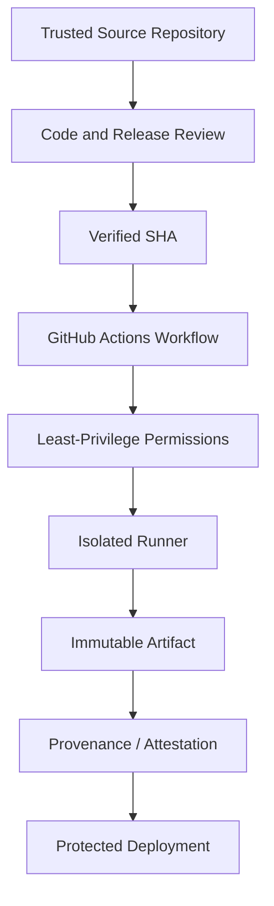
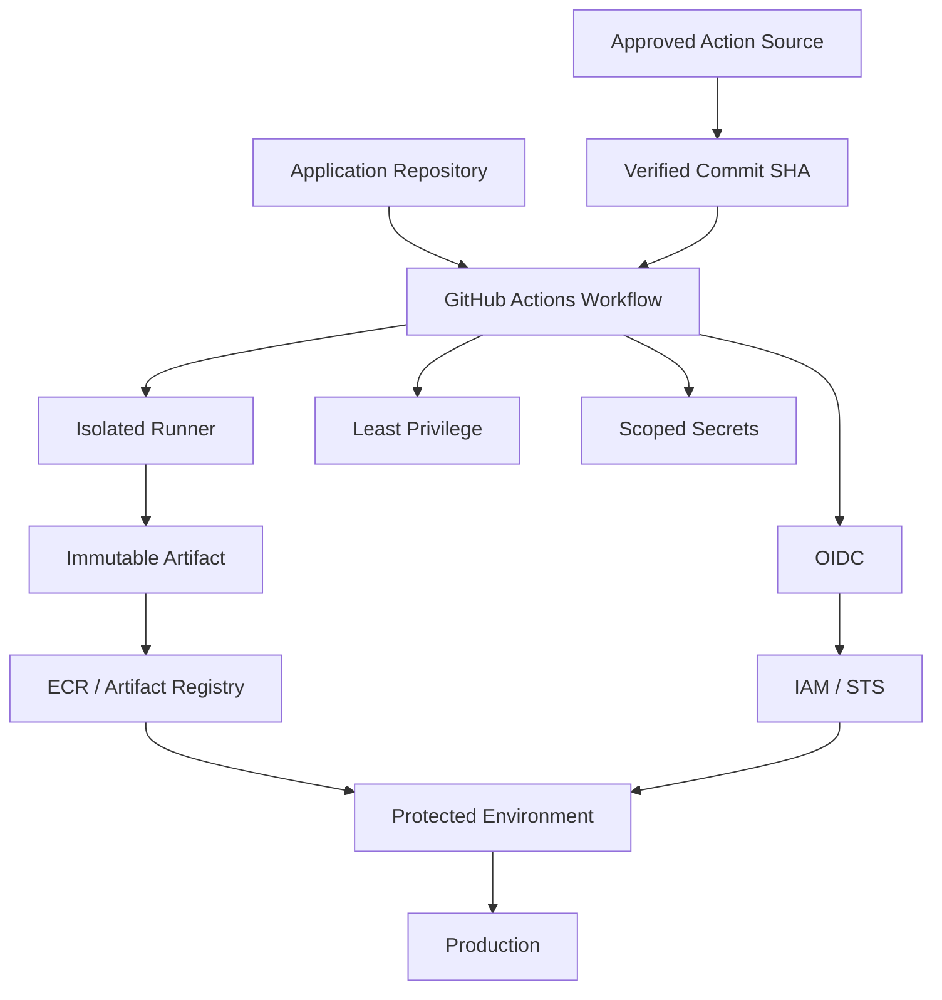
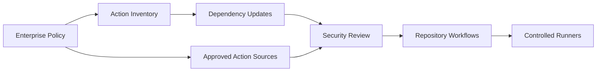

# 12- SHA Pinning

## Overview

SHA pinning is the practice of referencing a GitHub Actions dependency by a specific Git commit SHA instead of a mutable branch or version tag.

For example:

```yaml
- uses: actions/checkout@<verified-commit-sha>
```

rather than:

```yaml
- uses: actions/checkout@main
```

or:

```yaml
- uses: actions/checkout@v4
```

The objective is deterministic execution.

A GitHub Actions workflow is itself a software supply-chain consumer:

```text
Workflow
   ↓
Action Reference
   ↓
Action Repository
   ↓
Action Revision
   ↓
Executable Code
   ↓
Runner
```

If the action reference can move, the executable code can change without an obvious modification to the workflow.

SHA pinning replaces that mutable dependency boundary with:

```text
Workflow
   ↓
Specific Commit SHA
   ↓
Known Action Revision
   ↓
Runner
```

SHA pinning is particularly relevant for:

- Production CI/CD.
- Deployment workflows.
- Workflows with AWS OIDC access.
- Workflows with secrets.
- Workflows running on self-hosted runners.
- Organization-wide reusable workflows.
- Security-sensitive third-party actions.

SHA pinning should be treated as one control within a broader software supply-chain security strategy rather than as a complete security solution.

## Why SHA Pinning Exists

Consider:

```yaml
- uses: example/action@v1
```

At one point:

```text
v1 → Commit A
```

Later, the maintainer or repository state may cause the tag to reference:

```text
v1 → Commit B
```

The workflow file remains unchanged:

```yaml
- uses: example/action@v1
```

but the executed implementation is different.

This creates a hidden dependency change.

With a commit SHA:

```yaml
- uses: example/action@abc123...
```

the workflow references one specific Git revision.

The dependency changes only when the workflow reference itself changes.

## Mutable References vs SHA References

| Reference | Example | Behavior | Supply-Chain Risk |
|---|---|---|---|
| Branch | `@main` | Changes frequently | High |
| Major tag | `@v4` | Can move | Medium |
| Exact tag | `@v4.2.1` | Intended to identify a release | Lower, but still mutable |
| Commit SHA | `@abc123...` | Identifies a specific commit | Lowest reference-level mutability |

The important distinction is:

```text
Version Identifier
≠
Immutable Reference
```

A semantic version or Git tag communicates release intent, but a commit SHA identifies the exact Git revision.

## SHA Pinning vs Version Pinning

Version pinning and SHA pinning solve related but different problems.

### Version Pinning

```yaml
- uses: example/action@v4.2.1
```

Communicates:

> Use version 4.2.1.

Advantages:

- Readable.
- Easy to understand.
- Easy to maintain.
- Convenient for dependency updates.

Limitation:

- A Git tag can theoretically be moved.

### SHA Pinning

```yaml
- uses: example/action@abc123...
```

Communicates:

> Execute this exact Git commit.

Advantages:

- Deterministic.
- Stronger immutability.
- Easier forensic identification.
- Explicit dependency changes.
- Better suited to strict supply-chain controls.

Limitation:

- Less readable.
- Requires deliberate updates.
- Security fixes do not automatically enter the workflow.

## SHA Pinning Is Not a Trust Mechanism

A common misconception is:

```text
SHA Pinning
    ↓
Safe Action
```

That is incorrect.

SHA pinning guarantees which revision is executed. It does not guarantee that the revision itself is trustworthy.

For example:

```text
Malicious Commit
      ↓
SHA Pinning
      ↓
Malicious Code Still Executes
```

A secure workflow therefore combines:

```text
Trusted Source
+
Source Review
+
Commit Verification
+
SHA Pinning
+
Least Privilege
+
Secret Isolation
+
Runner Isolation
+
Dependency Security
```

## Verify Before Pinning

Do not blindly copy a SHA from an arbitrary source.

A controlled process is:

```text
Identify Required Action
        ↓
Identify Intended Release
        ↓
Inspect Upstream Repository
        ↓
Verify Release → Commit Mapping
        ↓
Review Relevant Changes
        ↓
Test
        ↓
Pin SHA
        ↓
Run CI
        ↓
Merge
```

The important question is not simply:

> Is this SHA valid?

It is:

> Is this the expected commit for the trusted release that we intend to execute?

## Production Example

A production deployment workflow might use:

```yaml
name: Deploy

on:
  push:
    branches:
      - main

permissions:
  contents: read

jobs:
  deploy:
    runs-on: ubuntu-latest

    environment:
      name: production

    permissions:
      contents: read
      id-token: write

    steps:
      - name: Checkout
        uses: actions/checkout@<verified-sha>

      - name: Configure AWS credentials
        uses: aws-actions/configure-aws-credentials@<verified-sha>
        with:
          role-to-assume: ${{ vars.AWS_DEPLOYMENT_ROLE }}
          aws-region: ${{ vars.AWS_REGION }}
```

The security properties are independent:

| Control | Purpose |
|---|---|
| SHA pinning | Controls exact action revision |
| `permissions` | Limits GitHub API access |
| Environment | Protects deployment |
| OIDC | Avoids long-lived AWS credentials |
| IAM | Limits AWS capabilities |
| Protected branch | Controls source promotion |

None of these controls replaces the others.

## SHA Pinning and Third-Party Actions

Third-party actions introduce another software dependency into the CI/CD trust boundary.

Before using an action, evaluate:

- Repository ownership.
- Source code.
- Release history.
- Maintainer activity.
- Dependencies.
- Required permissions.
- Secrets required.
- Network access.
- Runtime.
- Known vulnerabilities.
- Release process.
- Compatibility with the workflow.

The process should be:

```text
Requirement
   ↓
Candidate Action
   ↓
Source Review
   ↓
Dependency Review
   ↓
Security Review
   ↓
Commit Verification
   ↓
SHA Pin
```

Do not treat a popular Marketplace action as automatically trusted.

## Action Dependency Chain

SHA pinning the top-level action does not automatically secure its complete dependency tree.

For a JavaScript action:

```text
Workflow
   ↓
JavaScript Action
   ↓
package.json
   ↓
Lock File
   ↓
Transitive Dependencies
```

For a Docker action:

```text
Workflow
   ↓
Docker Action
   ↓
Dockerfile
   ↓
Base Image
   ↓
OS Packages
   ↓
Application Dependencies
```

For an internal action:

```text
Workflow
   ↓
Internal Action
   ↓
Source Repository
   ↓
Dependencies
   ↓
Runtime
```

Each layer can introduce risk.

## SHA Pinning and Supply-Chain Security

A mature CI/CD security model looks like:



SHA pinning controls one specific part of this chain:

```text
Workflow → Exact Action Revision
```

## SHA Pinning and GITHUB_TOKEN

A pinned action can still abuse an overly privileged `GITHUB_TOKEN`.

Avoid:

```yaml
permissions: write-all
```

Prefer the smallest required permission set:

```yaml
permissions:
  contents: read
```

If a job needs additional access:

```yaml
jobs:
  release:
    permissions:
      contents: write
      packages: write
```

Keep privileged permissions at the narrowest practical scope.

The security relationship is:

```text
SHA Pinning
     +
Least Privilege
```

rather than:

```text
SHA Pinning
     =
Complete Security
```

## SHA Pinning and Secrets

Suppose an action is pinned:

```yaml
- uses: example/deploy-action@<verified-sha>
  with:
    token: ${{ secrets.DEPLOY_TOKEN }}
```

The action can still access the token during execution.

Therefore:

- Only provide secrets to trusted actions.
- Scope secrets to the required environment.
- Avoid unnecessary secret inheritance.
- Do not pass secrets through command-line arguments when avoidable.
- Avoid printing secret values.
- Use short-lived credentials where possible.

## SHA Pinning and AWS OIDC

AWS authentication through OIDC typically looks like:

```text
GitHub Actions
      ↓
GitHub OIDC Token
      ↓
AWS STS
      ↓
IAM Role
      ↓
AWS Resources
```

For example:

```yaml
permissions:
  contents: read
  id-token: write
```

The deployment job can then use a pinned AWS credential action.

The important security boundaries are:

```text
Pinned Action
      ↓
Minimal GitHub Permissions
      ↓
OIDC
      ↓
Restricted IAM Trust Policy
      ↓
Restricted IAM Permissions
```

Giving `id-token: write` to unrelated jobs increases the blast radius if another dependency is compromised.

## SHA Pinning and Self-Hosted Runners

Self-hosted runners increase the importance of supply-chain controls because the runner may have access to:

- Internal networks.
- Cloud credentials.
- Private package registries.
- Deployment systems.
- Internal services.
- Persistent files.

A compromised action executing on a persistent self-hosted runner can potentially affect the runner itself and subsequent jobs.

Prefer:

```text
Untrusted / Semi-Trusted Work
        ↓
Isolated Runner
        ↓
Job Completes
        ↓
Runner Destroyed
```

for workflows that require elevated infrastructure access.

Ephemeral runners reduce persistence between jobs.

## SHA Pinning and `pull_request`

For pull requests:

```yaml
on:
  pull_request:
```

the workflow may process code controlled by contributors or fork repositories.

Use:

```yaml
permissions:
  contents: read
```

and keep secrets unavailable unless there is an explicit, controlled trust model.

SHA pinning protects the action dependency, but the workflow must still treat repository code and pull-request data according to its trust level.

## SHA Pinning and `pull_request_target`

`pull_request_target` requires particular caution.

A workflow triggered from the base repository can have access to the base repository's context, permissions, and potentially secrets.

A dangerous design can emerge when it combines:

```text
pull_request_target
+
Checkout of PR Code
+
Execution of PR Code
+
Secrets
+
Write Permissions
```

Pinning the actions does not eliminate this risk.

The trust boundary must remain explicit.

## Action Pinning and Untrusted Input

Even a SHA-pinned action can be invoked with dangerous user-controlled data.

For example:

```yaml
run: echo "${{ github.event.pull_request.title }}"
```

can become unsafe when untrusted values are inserted directly into shell syntax.

Prefer environment variables:

```yaml
env:
  PR_TITLE: ${{ github.event.pull_request.title }}

run: |
  printf '%s\n' "$PR_TITLE"
```

The security principle is:

```text
Pinned Dependency
+
Safe Input Handling
```

Both are required.

## SHA Pinning and Reusable Workflows

Reusable workflows are also dependencies.

Example:

```yaml
jobs:
  deploy:
    uses: organization/platform/.github/workflows/deploy.yml@v3
```

The same questions should be asked:

- Who controls the repository?
- Can the reference move?
- What permissions does the workflow receive?
- What secrets are passed?
- How are updates reviewed?
- Can the dependency be referenced immutably?

For security-sensitive shared workflows, an immutable revision can provide stronger dependency control.

## SHA Pinning and Composite Actions

Composite actions execute steps within the caller's job.

Example:

```yaml
- uses: organization/platform-actions/python-ci@<verified-sha>
```

The composite action can execute shell commands and access the job environment.

Therefore it should be governed like executable code, including:

- Source review.
- Version control.
- SHA pinning.
- Dependency review.
- Permissions review.
- Testing.
- Ownership.
- Release management.

## SHA Pinning and JavaScript Actions

JavaScript actions execute Node.js code on the runner.

The dependency chain may include:

```text
action.yml
   ↓
Node Runtime
   ↓
JavaScript Bundle
   ↓
npm Dependencies
```

The action's repository revision should be controlled, while the action's own dependencies should also be managed.

Lock files, dependency scanning, and controlled releases are useful complementary controls.

## SHA Pinning and Docker Actions

Docker actions add another dependency layer:

```text
Action SHA
    ↓
Dockerfile
    ↓
Base Image
    ↓
OS Packages
    ↓
Application Dependencies
```

A pinned action does not automatically pin its base image.

For production builds, consider controlling image references by digest where appropriate.

## SHA Pinning and Docker Build Pipelines

A mature Docker pipeline can be structured as:

```text
Protected Branch
      ↓
Pinned Actions
      ↓
Buildx
      ↓
Multi-stage Build
      ↓
Security Scan
      ↓
SBOM
      ↓
Immutable Image
      ↓
ECR
      ↓
Staging
      ↓
Approval
      ↓
Production
```

Two separate immutability controls exist:

```text
Action SHA
    ↓
Immutable CI dependency

Image Digest
    ↓
Immutable Deployment Artifact
```

## Build Once, Promote Later

SHA pinning works well with immutable artifact promotion.

Instead of:

```text
Build Staging Image
      ↓
Deploy Staging

Build Production Image
      ↓
Deploy Production
```

prefer:

```text
Build
  ↓
Immutable Artifact
  ↓
Staging
  ↓
Approval
  ↓
Production
```

The exact artifact tested in staging becomes the artifact promoted to production.

## SHA Pinning and Artifact Integrity

Action pinning controls executable workflow dependencies.

Artifact integrity controls the output of the workflow.

A stronger production pipeline therefore considers:

- Immutable action revisions.
- Immutable container image references.
- Artifact digests.
- SBOMs.
- Provenance.
- Attestations.
- Signing.
- Deployment verification.

Conceptually:

```text
Pinned Build Environment
        ↓
Deterministic Build
        ↓
Artifact Digest
        ↓
Provenance
        ↓
Verification
        ↓
Deployment
```

## SHA Pinning and Dependabot

Dependency-management automation can help identify outdated action references.

A controlled update process is:

```text
New Action Release
       ↓
Dependency Update
       ↓
Pull Request
       ↓
CI
       ↓
Security Review
       ↓
Merge
       ↓
New SHA
```

The objective is not to update actions automatically without validation.

The objective is to automate discovery while preserving review and testing.

## Updating a SHA

A controlled SHA update should include:

1. Identify the current reference.
2. Identify the intended new release.
3. Verify the release.
4. Determine the corresponding commit.
5. Review upstream changes.
6. Update the workflow.
7. Run CI.
8. Review security implications.
9. Merge.
10. Monitor production workflows.

Example:

```yaml
# Before
- uses: example/action@<sha-a>

# After
- uses: example/action@<sha-b>
```

The change should be visible in version control.

## Maintaining Readability

SHA references are difficult to interpret:

```yaml
- uses: example/action@abc123456789...
```

A comment can preserve release context:

```yaml
- uses: example/action@abc123456789... # v4.2.1
```

The comment should be treated as documentation, not as the source of truth.

The SHA remains the executable reference.

## Pinning Policy

An organization can define policies such as:

| Workflow Type | Suggested Policy |
|---|---|
| Experimental workflow | Version tag may be acceptable |
| Developer-only workflow | Version tag depending on risk |
| Standard CI | Controlled version or SHA |
| Production deployment | SHA preferred |
| Cloud-authenticated deployment | SHA strongly preferred |
| Privileged self-hosted workflow | SHA strongly preferred |
| Security-sensitive workflow | SHA required by policy |

The exact policy should reflect the organization's threat model and operational capabilities.

## Centralized Action Governance

Large organizations may have hundreds of repositories.

For example:

```text
500 Repositories
      ↓
Shared Actions
      ↓
Different SHA Versions
```

Without governance, dependency drift becomes difficult to manage.

A platform team can maintain:

```text
Approved Actions
       ↓
Verified Versions
       ↓
Approved SHAs
       ↓
Reusable Workflows
       ↓
Repositories
```

This reduces duplicated security decisions.

## Internal Action Platform

Organizations can create approved internal actions:

```text
platform-actions/
├── python-ci/
├── docker-build/
├── security-scan/
├── aws-auth/
└── deploy/
```

Repositories can then consume approved dependencies:

```yaml
- uses: organization/platform-actions/python-ci@<verified-sha>
```

Benefits include:

- Consistent implementation.
- Centralized ownership.
- Reduced dependency sprawl.
- Easier security review.
- Standardized permissions.
- Controlled upgrades.

## Action Allowlisting

Organizations can restrict action sources.

For example:

```text
Allowed
├── actions/*
├── aws-actions/*
└── organization/platform-actions/*

Restricted
└── Arbitrary Marketplace Actions
```

Allowlisting and SHA pinning solve different problems.

```text
Allowlist
    ↓
Controls which sources may be used

SHA Pinning
    ↓
Controls which revision is executed
```

Using both provides stronger control.

## Monitoring Action Dependencies

A mature organization should be able to answer:

```text
Which repositories use this action?
Which SHA do they use?
Which workflows invoke it?
What permissions does it receive?
Does it access production?
Does it have OIDC permissions?
Does it run on self-hosted infrastructure?
```

An action inventory can contain:

| Field | Example |
|---|---|
| Action | `example/action` |
| Release | `v4.2.1` |
| SHA | `abc123...` |
| Repository | `backend-api` |
| Workflow | `deploy.yml` |
| Permissions | `contents: read` |
| OIDC | Yes |
| Environment | Production |
| Runner | GitHub-hosted |
| Owner | Platform Team |

## Incident Response

If an action is compromised, SHA pinning helps identify the exact affected revision.

Response should include:

1. Identify the compromised action.
2. Identify affected SHA(s).
3. Inventory repositories using those SHAs.
4. Identify workflow execution history.
5. Determine permissions.
6. Determine secret exposure.
7. Determine OIDC access.
8. Determine self-hosted runner exposure.
9. Review GitHub workflow logs.
10. Review AWS or other cloud audit logs.
11. Replace the compromised dependency.
12. Rotate potentially exposed credentials.
13. Rebuild affected artifacts.
14. Review deployments.
15. Restore known-good versions where required.
16. Document the incident.

## Rollback

Suppose:

```yaml
- uses: example/action@<sha-a>
```

is replaced with:

```yaml
- uses: example/action@<sha-b>
```

If the new revision causes failures, restore:

```yaml
- uses: example/action@<sha-a>
```

The previous SHA should remain available in version control and should be associated with a known-good workflow state.

## Disaster Recovery

A production CI/CD platform should preserve:

- Previous workflow revisions.
- Known-good action SHAs.
- Known-good reusable workflow revisions.
- Immutable artifacts.
- Deployment history.
- Cloud audit logs.
- Rollback procedures.

This enables:

```text
Failure
  ↓
Identify Last Known-Good State
  ↓
Restore Workflow Dependency
  ↓
Restore Known-Good Artifact
  ↓
Validate
  ↓
Resume Deployment
```

## Reliability Considerations

SHA pinning improves reproducibility but creates an update responsibility.

If an organization pins an action indefinitely:

```text
SHA
 ↓
Never Updated
 ↓
Known Vulnerability
 ↓
Persistent Exposure
```

Therefore:

```text
Pin
 ↓
Monitor
 ↓
Review
 ↓
Update
 ↓
Test
 ↓
Pin New SHA
```

is the correct lifecycle.

## Performance and Cost

SHA pinning itself introduces negligible runtime overhead.

The operational costs are primarily:

- Security review.
- Dependency maintenance.
- CI validation.
- Update automation.
- Repository governance.

At scale, automation should handle discovery and update proposals.

For example:

```text
Dependency Scanner
       ↓
Update PR
       ↓
CI
       ↓
Security Checks
       ↓
Human Review
       ↓
Merge
```

This is generally more maintainable than manually auditing every repository.

## High Availability and Deployment Safety

SHA pinning does not directly provide deployment availability.

Production availability still requires:

- Deployment concurrency.
- Health checks.
- Rolling deployments.
- Blue/green deployments.
- Canary deployments.
- Rollback.
- Protected environments.
- Immutable artifacts.

A production deployment can therefore be:

```text
Pinned Actions
      ↓
Build
      ↓
Immutable Artifact
      ↓
Staging
      ↓
Approval
      ↓
Deployment Concurrency
      ↓
Canary / Blue-Green / Rolling
      ↓
Health Validation
      ↓
Production
      ↓
Rollback if Required
```

## Common Mistakes

### Using `@main`

Avoid:

```yaml
uses: example/action@main
```

for security-sensitive production workflows.

The branch can change without a workflow change.

### Assuming `@v4.2.1` Is Immutable

A version tag communicates release intent but does not provide the same reference-level guarantee as a commit SHA.

### Copying a SHA Without Verification

A SHA can be syntactically valid while referring to an unintended revision.

Verify the release-to-commit relationship.

### Pinning Only Production Actions

Pull-request workflows can also execute third-party code and should be evaluated according to their trust boundary.

### Pinning Without Least Privilege

This remains dangerous:

```yaml
permissions: write-all
```

even if every action is SHA-pinned.

### Pinning and Never Updating

Old pinned dependencies can accumulate vulnerabilities.

A pinning strategy requires an update process.

### Ignoring Transitive Dependencies

The action's repository can contain vulnerable npm packages, Docker base images, or other dependencies.

### Trusting the Comment Instead of the SHA

This:

```yaml
- uses: example/action@abc123... # v4.2.1
```

is controlled by the SHA, not the comment.

### Automatically Updating Without Validation

An update bot should create a controlled change, not bypass security checks.

## Troubleshooting

Use the general diagnostic model:

```text
Symptom
→ Possible Causes
→ Isolation Strategy
→ Commands / Checks
→ Root Cause
→ Corrective Action
→ Prevention
```

### Action Update Causes Workflow Failure

**Possible causes**

- Changed action inputs.
- Changed outputs.
- Runtime changes.
- Dependency changes.
- Permission requirements.
- Behavioral changes.

**Isolation**

Compare:

```text
Previous SHA
vs
New SHA
```

Review the upstream release and run the workflow with the previous known-good reference.

### SHA Does Not Match the Expected Release

**Possible causes**

- Incorrect commit selected.
- Tag/release mapping misunderstood.
- Fork used instead of upstream repository.
- Release process changed.

**Corrective action**

Verify the upstream repository and release history.

### Security Fix Is Available but Old SHA Remains

**Possible causes**

- No dependency update automation.
- Update PR not merged.
- Repository ownership unclear.
- Action inventory incomplete.

**Prevention**

Automate action dependency discovery and update proposals.

### Different Repositories Use Different SHAs

**Possible causes**

- Independent update schedules.
- Manual dependency management.
- Different compatibility constraints.

**Corrective action**

Consider centralized reusable workflows, internal actions, and organization-level dependency governance.

### Pinned Action Cannot Access AWS

Check:

```text
Action SHA
 ↓
permissions.id-token
 ↓
OIDC Token
 ↓
IAM Trust Policy
 ↓
IAM Permissions
 ↓
AWS API
```

Do not immediately grant administrator permissions.

### Pinned Action Works on GitHub-Hosted Runner but Fails on Self-Hosted Runner

Compare:

```text
Runner Image
Runner Software
Docker
Network Access
Environment Variables
Permissions
Credentials
Filesystem State
```

A SHA does not guarantee identical runner environments.

## Diagnostic Commands

List workflows:

```bash
gh workflow list
```

List workflow runs:

```bash
gh run list
```

Inspect a workflow run:

```bash
gh run view RUN_ID
```

View logs:

```bash
gh run view RUN_ID --log
```

Inspect Actions permissions:

```bash
gh api repos/{owner}/{repo}/actions/permissions
```

Inspect workflow permissions:

```bash
gh api repos/{owner}/{repo}/actions/permissions/workflow
```

List repository secrets:

```bash
gh secret list
```

List releases:

```bash
gh release list
```

The GitHub CLI should be used for operational investigation without exposing secret values.

## Architecture: Secure Action Dependency Model



The architecture deliberately separates:

- Code trust.
- Action trust.
- Runner trust.
- Permission trust.
- Secret trust.
- Cloud authentication.
- Artifact integrity.
- Deployment authorization.

## Architecture: Enterprise Action Governance



This model allows a platform engineering team to control the action supply chain without manually maintaining every workflow.

## Production CI/CD Example

A senior backend engineering pipeline can use the following model:

```text
Pull Request
      ↓
Pinned CI Actions
      ↓
Lint
      ↓
Unit Tests
      ↓
PostgreSQL + Redis Integration Tests
      ↓
Security Scan
      ↓
Matrix Testing
      ↓
Protected Main
      ↓
Pinned Build Actions
      ↓
Docker Buildx
      ↓
Immutable Image
      ↓
SBOM / Security Scan
      ↓
ECR
      ↓
Staging
      ↓
Manual Approval
      ↓
Production
      ↓
Monitoring
      ↓
Rollback
```

For a Python backend:

```text
Django / FastAPI
      ↓
pytest
      ↓
PostgreSQL
      ↓
Redis
      ↓
Docker
      ↓
ECR
      ↓
ECS / EC2 / Kubernetes
```

The action references used at each stage should follow the organization's approved pinning policy.

## Senior-Level Design Principles

### Make Executable Dependencies Explicit

Every action is executable code.

Treat:

```yaml
uses: organization/action@...
```

as a software dependency, not as harmless YAML configuration.

### Prefer Deterministic References for High-Trust Workflows

Production deployments, cloud authentication, and privileged self-hosted workflows should have stricter dependency controls than low-risk experimental workflows.

### Separate Security Controls

Use different controls for different threats:

| Threat | Control |
|---|---|
| Mutable action reference | SHA pinning |
| Excessive GitHub permissions | `permissions` |
| Long-lived cloud credentials | OIDC |
| Excessive AWS access | IAM least privilege |
| Secret exposure | Scoped secrets |
| Persistent runner compromise | Ephemeral runners |
| Artifact replacement | Immutable digests |
| Dependency vulnerability | Dependency scanning |
| Build integrity | Provenance / attestations |
| Deployment races | Concurrency |
| Bad deployment | Health checks / rollback |

### Automate the Lifecycle

A scalable strategy is:

```text
Inventory
   ↓
Detect Update
   ↓
Create PR
   ↓
Run CI
   ↓
Security Review
   ↓
Merge
   ↓
Monitor
```

### Keep a Known-Good State

For critical workflows, maintain the ability to restore:

```text
Previous Action SHA
+
Previous Workflow Revision
+
Previous Artifact
```

This improves incident response and recovery.

## Interview Preparation

### What Is SHA Pinning?

Explain that SHA pinning references a GitHub Action using a specific commit rather than a mutable branch or tag.

### Why Is `@main` Risky?

Discuss mutable references and how upstream changes can alter executable workflow code without changing the workflow file.

### Is `@v4` Fully Immutable?

No. A Git tag can move. SHA pinning provides stronger reference-level immutability.

### Is SHA Pinning Sufficient for Supply-Chain Security?

No.

Discuss:

- Trusted sources.
- Commit verification.
- Dependency review.
- Least privilege.
- Secrets.
- Runner isolation.
- SBOM.
- Provenance.
- Attestations.
- Artifact integrity.

### How Would You Manage SHA Updates Across Hundreds of Repositories?

Discuss:

- Action inventory.
- Approved action sources.
- Automated dependency updates.
- Pull requests.
- Centralized reusable workflows.
- Internal actions.
- Security review.
- Organization policies.
- Rollback.

### What Happens If a Pinned Action Is Compromised?

Discuss:

```text
Identify SHA
    ↓
Find Consumers
    ↓
Inspect Workflow History
    ↓
Assess Permissions
    ↓
Assess Secrets / OIDC
    ↓
Review Audit Logs
    ↓
Replace Action
    ↓
Rotate Credentials
    ↓
Rebuild Artifacts
    ↓
Validate Deployments
```

### How Does SHA Pinning Work With AWS OIDC?

Explain that SHA pinning controls the action implementation while OIDC controls how the workflow obtains temporary AWS credentials.

The complete model is:

```text
Pinned Action
    ↓
GitHub OIDC
    ↓
AWS STS
    ↓
Restricted IAM Role
    ↓
AWS Resource
```

### How Would You Secure a Self-Hosted Runner?

Discuss:

- Ephemeral runners.
- Runner groups.
- Labels.
- Network isolation.
- Minimal permissions.
- Restricted secrets.
- Trusted workflows.
- Action pinning.
- Cleanup.
- Autoscaling.
- Monitoring.

### How Would You Secure a Docker-Based CI/CD Pipeline?

Discuss:

```text
Pinned Actions
    ↓
Buildx
    ↓
Multi-stage Build
    ↓
Security Scan
    ↓
SBOM
    ↓
Immutable Image Digest
    ↓
ECR
    ↓
Protected Deployment
```

## Production Checklist

### Action References

- [ ] Security-sensitive actions use verified SHA references.
- [ ] Mutable branch references are avoided in production workflows.
- [ ] Version-to-SHA mappings are documented.
- [ ] SHAs are verified against trusted upstream releases.
- [ ] Known-good previous SHAs are recoverable.

### Security

- [ ] Action sources are approved.
- [ ] Third-party actions are reviewed.
- [ ] GITHUB_TOKEN permissions are minimized.
- [ ] Secrets are scoped appropriately.
- [ ] OIDC is limited to required jobs.
- [ ] AWS IAM follows least privilege.
- [ ] Untrusted input is handled safely.
- [ ] Self-hosted runners are appropriately isolated.

### Supply Chain

- [ ] Action dependencies are monitored.
- [ ] Dependency updates are automated where appropriate.
- [ ] SBOMs are considered.
- [ ] Artifact provenance is available where required.
- [ ] Artifact attestations are considered.
- [ ] Docker images use immutable references for deployment.
- [ ] Approved action sources are governed centrally.

### Operations

- [ ] Action versions are inventoried.
- [ ] Workflow failures can be diagnosed.
- [ ] Action updates run through CI.
- [ ] Rollback to a known-good SHA is possible.
- [ ] Workflow logs are available.
- [ ] Cloud audit logs are available.
- [ ] Credential rotation procedures exist.
- [ ] Compromised dependency response is documented.

## Key Takeaways

- SHA pinning makes GitHub Actions dependencies deterministic by referencing a specific Git commit instead of a mutable branch or tag.
- SHA pinning does not establish trust by itself; secure source review, least privilege, secret isolation, runner isolation, dependency scanning, and artifact integrity remain necessary.
- Production action updates should follow a controlled lifecycle of verification, testing, review, deployment, monitoring, and rollback to a known-good SHA.
- SHA pinning works best as part of a broader supply-chain model covering reusable workflows, third-party actions, Docker dependencies, AWS OIDC, SBOMs, provenance, and immutable artifacts.
- Enterprise-scale CI/CD should combine SHA pinning with approved action sources, dependency automation, centralized governance, action inventories, and incident-response procedures.