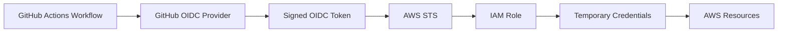
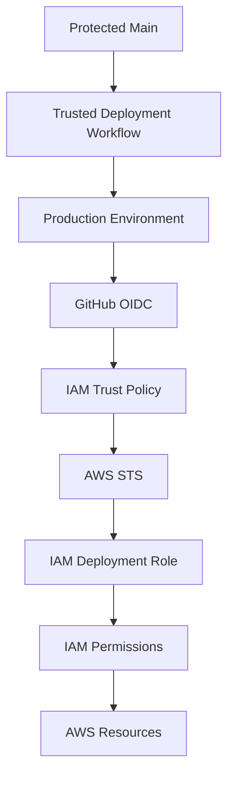
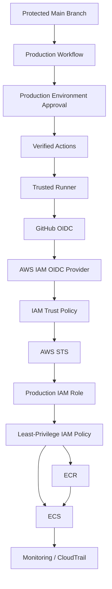
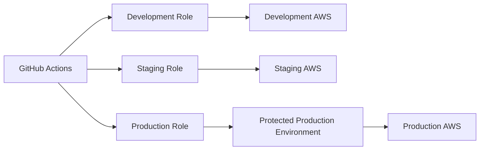

# 14- OIDC Security

## Overview

OpenID Connect (OIDC) allows GitHub Actions workflows to authenticate to external identity providers and cloud platforms using short-lived, workload-specific identity tokens instead of long-lived static credentials.

For AWS-based CI/CD, the common flow is:

```text
GitHub Actions
      ↓
GitHub OIDC Provider
      ↓
OIDC Web Identity Token
      ↓
AWS STS
      ↓
IAM Role
      ↓
Temporary AWS Credentials
      ↓
AWS Resources
```

This changes the credential model from:

```text
GitHub Secret
    ↓
Long-Lived AWS Access Key
    ↓
AWS
```

to:

```text
GitHub Actions Identity
    ↓
OIDC
    ↓
STS
    ↓
Short-Lived Credentials
    ↓
AWS
```

OIDC is particularly valuable for production CI/CD because credentials do not need to be stored as long-lived GitHub secrets.

However, OIDC does not automatically make a workflow secure. The GitHub workflow, action dependencies, runner, OIDC trust policy, IAM permissions, repository, branch, environment, and deployment process all form part of the security boundary.

## Why OIDC Exists

Traditional CI/CD authentication often stores cloud credentials as secrets:

```yaml
env:
  AWS_ACCESS_KEY_ID: ${{ secrets.AWS_ACCESS_KEY_ID }}
  AWS_SECRET_ACCESS_KEY: ${{ secrets.AWS_SECRET_ACCESS_KEY }}
```

This creates a long-lived credential lifecycle:

```text
Create Credential
      ↓
Store Credential
      ↓
Distribute Credential
      ↓
Use Credential
      ↓
Rotate Credential
      ↓
Revoke Credential
```

Risks include:

- Credential leakage.
- Excessive credential lifetime.
- Rotation overhead.
- Accidental exposure.
- Credential reuse outside CI/CD.
- Difficulty determining which workflow used a credential.

OIDC removes the need for many such long-lived credentials.

## OIDC Security Model

The security model is based on workload identity.



The critical point is that AWS must decide whether the presented GitHub identity is allowed to assume the requested IAM role.

## OIDC vs Static Credentials

| Property | Static AWS Credentials | OIDC |
|---|---|---|
| Credential type | Long-lived | Short-lived |
| Storage | GitHub secret or external secret store | No long-lived AWS credential required |
| Rotation | Required | Temporary credentials expire |
| Trust model | Credential possession | Workload identity |
| Repository binding | Indirect | Can be encoded in trust policy |
| Branch/environment binding | Indirect | Can be encoded in claims |
| Leakage impact | Potentially long-lived | Limited by credential lifetime |
| Operational overhead | Higher | Lower after setup |

OIDC reduces credential-management risk, but IAM trust policies still need to be restrictive.

## GitHub OIDC Token

GitHub Actions can request an OIDC token when the job has:

```yaml
permissions:
  id-token: write
```

For example:

```yaml
permissions:
  contents: read
  id-token: write
```

The token represents the workflow execution identity.

It is not the AWS credential itself.

The flow is:

```text
GitHub Workflow
      ↓
Request OIDC Token
      ↓
GitHub Issues Signed Token
      ↓
AWS STS Validates Token
      ↓
IAM Trust Policy Evaluates Claims
      ↓
Temporary Credentials
```

## `id-token: write` Does Not Mean AWS Write Access

This distinction is important.

```yaml
permissions:
  id-token: write
```

allows the workflow to request an OIDC identity token.

It does not directly grant:

```text
S3 write
ECR push
ECS deployment
EC2 modification
Lambda update
```

AWS permissions are determined by the IAM role that STS allows the workflow to assume.

Therefore:

```text
GitHub Permissions
       ↓
OIDC Token
       ↓
IAM Trust Policy
       ↓
IAM Permission Policy
       ↓
AWS Access
```

Each layer must be controlled.

## GitHub OIDC Provider in AWS

AWS must trust GitHub's OIDC identity provider.

Conceptually:

```text
GitHub OIDC Issuer
       ↓
AWS IAM OIDC Provider
       ↓
IAM Role Trust Policy
```

The trust relationship allows AWS STS to validate identity tokens issued by GitHub.

The IAM OIDC provider configuration should use the expected GitHub OIDC issuer and audience for AWS authentication.

## AWS STS

AWS Security Token Service (STS) issues temporary credentials.

The workflow effectively follows:

```text
OIDC Token
    ↓
STS AssumeRoleWithWebIdentity
    ↓
Temporary Access Key
+
Temporary Secret Key
+
Session Token
```

These credentials have an expiration time and are used by AWS SDKs and CLI commands during the job.

## IAM Role

The IAM role is the central AWS authorization boundary.

A production role should define:

```text
Who can assume the role?
        ↓
What can the role do?
        ↓
Which AWS resources can it access?
```

These are separate questions.

The trust policy controls:

```text
Who
```

The permissions policy controls:

```text
What
```

## Trust Policy vs Permissions Policy

| Policy | Answers |
|---|---|
| Trust policy | Who may assume this role? |
| Permissions policy | What may the role do? |

Example:

```text
GitHub Workflow
      ↓
Trust Policy
      ↓
Can assume role?
      ↓
Permissions Policy
      ↓
Can perform AWS operation?
```

A secure OIDC design requires both boundaries.

## Minimal GitHub Permissions

For a deployment job:

```yaml
permissions:
  contents: read
  id-token: write
```

Avoid granting unnecessary permissions such as:

```yaml
permissions:
  contents: write
  issues: write
  pull-requests: write
  packages: write
  id-token: write
```

unless the job actually requires them.

A compromised action in the same job inherits the permissions available to that job.

## Job-Level OIDC Permissions

Prefer granting OIDC only to the deployment job.

```yaml
jobs:
  test:
    runs-on: ubuntu-latest
    permissions:
      contents: read

    steps:
      - uses: actions/checkout@<verified-sha>
      - run: pytest

  deploy:
    runs-on: ubuntu-latest
    permissions:
      contents: read
      id-token: write

    steps:
      - uses: actions/checkout@<verified-sha>
      - name: Configure AWS credentials
        uses: aws-actions/configure-aws-credentials@<verified-sha>
        with:
          role-to-assume: ${{ vars.AWS_DEPLOYMENT_ROLE }}
          aws-region: ${{ vars.AWS_REGION }}
```

The test job cannot request an OIDC token because it does not have:

```yaml
id-token: write
```

This reduces blast radius.

## IAM Trust Policy

A simplified AWS trust policy can look like:

```json
{
  "Version": "2012-10-17",
  "Statement": [
    {
      "Effect": "Allow",
      "Principal": {
        "Federated": "arn:aws:iam::<ACCOUNT_ID>:oidc-provider/token.actions.githubusercontent.com"
      },
      "Action": "sts:AssumeRoleWithWebIdentity",
      "Condition": {
        "StringEquals": {
          "token.actions.githubusercontent.com:aud": "sts.amazonaws.com"
        }
      }
    }
  ]
}
```

This is only a partial example.

A production trust policy should normally constrain the GitHub identity further.

## Restricting the Repository

A trust policy can restrict which repository may assume the role.

Conceptually:

```text
repo:organization/backend-api
```

rather than allowing:

```text
Any GitHub Repository
```

This prevents unrelated repositories from assuming the same deployment role.

## Restricting the Branch

A role can be constrained to a specific GitHub ref where appropriate.

Conceptually:

```text
repo:organization/backend-api:ref:refs/heads/main
```

This provides a stronger trust boundary than repository-only access.

The resulting model is:

```text
Organization
    ↓
Repository
    ↓
Branch
    ↓
Workflow Identity
    ↓
IAM Role
```

## Restricting the Environment

GitHub environments can be incorporated into the identity model.

For example:

```text
repo:organization/backend-api:environment:production
```

This can create a stronger deployment boundary:

```text
Trusted Repository
      ↓
Production Environment
      ↓
Protected Deployment
      ↓
OIDC
      ↓
Production IAM Role
```

This is useful when production access should only be available to approved workflows targeting the production environment.

## Environment Protection

Production environments can provide:

- Required reviewers.
- Deployment restrictions.
- Environment-scoped secrets.
- Deployment history.

Example:

```yaml
jobs:
  deploy:
    environment:
      name: production

    permissions:
      contents: read
      id-token: write
```

This separates:

```text
Build
```

from:

```text
Production Authorization
```

## Production Trust Boundary

A robust deployment architecture is:



Each layer provides a different control.

## OIDC Security Conditions

Important claims and restrictions should be evaluated according to the organization's deployment model.

Typical controls include:

- OIDC issuer.
- Audience.
- Repository.
- Organization.
- Branch or ref.
- Environment.
- Workflow identity where supported by the trust design.

The goal is:

```text
Only the intended workload
        ↓
From the intended repository
        ↓
Under the intended trust conditions
        ↓
Can assume the intended IAM role
```

## Repository-Level Trust Is Not Always Enough

Suppose:

```text
Repository
    ↓
Many Branches
    ↓
OIDC Role
```

If every branch can assume the same production role, an untrusted or compromised branch may gain production access.

A stronger model is:

```text
main
 ↓
production workflow
 ↓
production environment
 ↓
production IAM role
```

while feature branches use:

```text
feature branch
 ↓
test workflow
 ↓
non-production access
```

## Environment Separation

A common production model is:

```text
Development
    ↓
dev IAM role

Staging
    ↓
staging IAM role

Production
    ↓
production IAM role
```

Each environment should have a separate trust and authorization boundary where practical.

## Separate IAM Roles

Avoid using one broad role for every environment.

Prefer:

```text
GitHub
 ├── Role: BackendDev
 ├── Role: BackendStaging
 └── Role: BackendProduction
```

The production role should have the narrowest practical access.

## AWS Permissions

The IAM role should follow least privilege.

For example, a deployment role may require:

```text
ECR
- Authenticate
- Push images

ECS
- Update service
- Describe service

CloudWatch
- Read deployment state
```

It should not automatically receive:

```text
*
```

for all AWS services.

## Resource-Level Permissions

Where AWS supports resource-level permissions, restrict access to specific resources.

Conceptually:

```text
ECR Repository
    ↓
backend-api

ECS Service
    ↓
backend-api-production
```

rather than all repositories or services in the account.

## AWS Account Separation

For larger systems:

```text
GitHub
   ↓
Dev Account
   ↓
Staging Account
   ↓
Production Account
```

OIDC roles can exist independently in each account.

This reduces cross-environment blast radius.

## Cross-Account Deployment

A GitHub workflow can authenticate into a deployment account using OIDC.

For example:

```text
GitHub
   ↓
OIDC
   ↓
AWS Account A
   ↓
STS
   ↓
Deployment Role
   ↓
AWS Account B
   ↓
Target Resources
```

Cross-account role chains should be tightly controlled.

Avoid unnecessary trust relationships between accounts.

## OIDC and Third-Party Actions

A major security risk occurs when a privileged OIDC job executes third-party actions.

For example:

```yaml
permissions:
  id-token: write

steps:
  - uses: third-party/action@<verified-sha>
  - run: deploy
```

The action runs in the same job context.

If compromised, it may attempt to use the workflow's available identity.

Therefore:

```text
OIDC Job
    ↓
Only Trusted Actions
    ↓
Minimal Permissions
```

is an important design principle.

## Pin OIDC-Enabled Actions

Deployment workflows should use controlled action references.

For example:

```yaml
- name: Configure AWS credentials
  uses: aws-actions/configure-aws-credentials@<verified-sha>
```

SHA pinning does not replace trust review, but it prevents the action reference from silently moving to another revision.

## Separate Build and Deployment Jobs

A safer pipeline is:

```text
Build Job
   ↓
Immutable Artifact
   ↓
Deployment Job
   ↓
OIDC
   ↓
AWS
```

rather than:

```text
Build + Test + Deployment + OIDC
```

in one broad job.

This reduces the number of steps that operate inside the cloud-privileged trust boundary.

## Build Once, Promote Later

Production deployment should preferably follow:

```text
Source
  ↓
Build
  ↓
Immutable Docker Image
  ↓
ECR
  ↓
Staging
  ↓
Approval
  ↓
Production
```

The production job can retrieve the already-built image rather than rebuilding it.

This reduces both supply-chain and deployment variability.

## Docker and OIDC

A Python backend pipeline may use:

```text
GitHub Actions
      ↓
Docker Buildx
      ↓
Image
      ↓
ECR
      ↓
ECS
```

OIDC can authenticate the workflow to AWS without storing static ECR credentials.

Example:

```yaml
permissions:
  contents: read
  id-token: write

steps:
  - name: Configure AWS credentials
    uses: aws-actions/configure-aws-credentials@<verified-sha>
    with:
      role-to-assume: ${{ vars.AWS_ECR_ROLE }}
      aws-region: ${{ vars.AWS_REGION }}

  - name: Login to Amazon ECR
    uses: aws-actions/amazon-ecr-login@<verified-sha>
```

## ECR Authentication

The authentication flow is:

```text
GitHub Workflow
      ↓
OIDC
      ↓
STS
      ↓
IAM Role
      ↓
Temporary AWS Credentials
      ↓
ECR Authentication
      ↓
Docker Push
```

The credentials are temporary rather than permanently stored in GitHub secrets.

## ECS Deployment

A typical ECS pipeline is:

```text
Build Docker Image
      ↓
Push Image to ECR
      ↓
Update ECS Task Definition
      ↓
Update ECS Service
      ↓
Wait for Deployment
      ↓
Health Validation
```

The deployment role should have only the permissions required for these operations.

## S3

For an application that publishes static assets:

```text
GitHub Actions
      ↓
OIDC
      ↓
S3 Deployment Role
      ↓
Specific S3 Bucket / Prefix
```

Do not grant access to every S3 bucket if the workflow only needs one deployment bucket.

## Lambda

A deployment workflow can use OIDC to obtain temporary credentials and update a Lambda function.

Conceptually:

```text
Build
 ↓
Package
 ↓
Artifact
 ↓
OIDC
 ↓
STS
 ↓
IAM Role
 ↓
Lambda Update
```

The role should be restricted to the intended function and supporting resources.

## CloudFormation

For infrastructure deployment:

```text
GitHub Actions
      ↓
OIDC
      ↓
CloudFormation Deployment Role
      ↓
CloudFormation
      ↓
AWS Resources
```

Infrastructure roles are often highly privileged.

Separate them from ordinary application deployment roles.

## Terraform

Terraform executed through GitHub Actions can use OIDC:

```text
GitHub Actions
      ↓
OIDC
      ↓
AWS IAM Role
      ↓
Terraform
      ↓
AWS APIs
```

The trust boundary becomes particularly important because Terraform may modify large portions of an AWS environment.

Use separate roles and state-management controls for different environments.

## OIDC and Terraform State

Terraform state may contain sensitive infrastructure information.

Protect:

- State bucket.
- State locking mechanism.
- IAM permissions.
- Encryption.
- Network access.

A workflow should not receive broad S3 access simply because Terraform needs access to one state location.

## OIDC and Kubernetes

OIDC can also authenticate CI/CD systems to cloud-managed Kubernetes infrastructure.

The architecture may be:

```text
GitHub
   ↓
OIDC
   ↓
AWS STS
   ↓
IAM
   ↓
EKS
   ↓
Kubernetes Authorization
```

AWS IAM authentication and Kubernetes RBAC remain separate authorization layers.

## OIDC and Self-Hosted Runners

OIDC does not eliminate self-hosted runner risks.

A self-hosted runner may have:

- Private network access.
- Cached credentials.
- Docker access.
- Internal DNS access.
- Persistent filesystem state.

A compromised action running in an OIDC-enabled job can potentially obtain cloud credentials and interact with internal infrastructure.

Use:

- Ephemeral runners.
- Restricted runner groups.
- Network segmentation.
- Minimal IAM permissions.
- Trusted deployment workflows.

## OIDC and Fork Pull Requests

Do not assume fork PRs should receive production OIDC access.

A typical secure model is:

```text
Fork PR
   ↓
pull_request
   ↓
Restricted CI
   ↓
No Production OIDC
```

Production OIDC should generally be associated with a trusted source and protected deployment path.

## OIDC and `pull_request_target`

Avoid combining:

```text
pull_request_target
+
Checkout PR Code
+
id-token: write
+
Production IAM Role
```

This creates a highly privileged trust boundary around potentially untrusted code.

If a workflow must process PR metadata, separate that processing from privileged deployment operations.

## OIDC and Secrets

One advantage of OIDC is reducing static cloud credentials.

Instead of:

```yaml
secrets:
  AWS_ACCESS_KEY_ID
  AWS_SECRET_ACCESS_KEY
```

the workflow can request temporary credentials.

However, other application secrets may still be required.

For example:

```text
OIDC
 ↓
AWS Authentication

Environment Secret
 ↓
Application Configuration
```

OIDC should not be interpreted as a replacement for every secret-management mechanism.

## Secretless AWS Authentication

A preferred model is:

```text
GitHub Actions
      ↓
OIDC Token
      ↓
AWS STS
      ↓
Temporary Credentials
```

rather than:

```text
GitHub Secret
      ↓
Permanent Access Key
      ↓
AWS
```

This reduces long-lived credential exposure and rotation requirements.

## Credential Lifetime

Temporary AWS credentials expire.

This limits the useful lifetime of a leaked credential.

However:

```text
Short-lived
≠
Harmless
```

A compromised workflow can still use valid temporary credentials during their lifetime.

Therefore immediate containment remains important.

## OIDC and Session Duration

The role session duration should follow operational requirements rather than being unnecessarily long.

A long-running deployment may require more time, but avoid extending credential lifetime without a reason.

Use the shortest practical duration supported by the deployment process.

## IAM Trust Policy Conditions

Trust policy conditions should be as specific as practical.

Conceptually:

```json
{
  "Condition": {
    "StringEquals": {
      "token.actions.githubusercontent.com:aud": "sts.amazonaws.com",
      "token.actions.githubusercontent.com:sub": "repo:organization/backend-api:environment:production"
    }
  }
}
```

The exact claim format should match the GitHub workflow's identity model.

Do not copy a trust policy blindly across repositories or environments.

## OIDC Trust Policy Design

A strong design answers:

```text
Which GitHub organization?
        ↓
Which repository?
        ↓
Which branch / ref?
        ↓
Which environment?
        ↓
Which workflow trust boundary?
        ↓
Which AWS role?
        ↓
Which AWS resources?
```

Each additional restriction reduces unintended role assumption.

## Multiple Roles

Use different roles for materially different privileges.

For example:

```text
GitHub
 ├── CI Read Role
 ├── ECR Push Role
 ├── ECS Deploy Role
 ├── Infrastructure Role
 └── Production Operations Role
```

Do not combine all permissions into one universal CI role.

## Deployment Role Separation

A backend application might use:

```text
Build Job
    ↓
ECR Push Role

Deployment Job
    ↓
ECS Deploy Role
```

The ECR role does not need broad ECS administrative access.

This limits compromise impact.

## OIDC and Concurrency

OIDC controls authentication.

Concurrency controls execution races.

Use both where required:

```yaml
concurrency:
  group: production-deployment
  cancel-in-progress: false
```

The model becomes:

```text
OIDC
 ↓
Who may deploy?

Concurrency
 ↓
Which deployment may execute now?
```

These solve different problems.

## OIDC and Approval Gates

Production deployment can use:

```yaml
environment:
  name: production
```

with environment protection.

The flow becomes:

```text
Build
 ↓
Staging
 ↓
Production Approval
 ↓
OIDC
 ↓
AWS STS
 ↓
Production Deployment
```

This prevents production credentials from being the only control protecting deployment.

## OIDC Failure Domains

OIDC authentication can fail at multiple layers.

```text
GitHub Workflow
      ↓
GitHub OIDC
      ↓
Token
      ↓
AWS IAM OIDC Provider
      ↓
Trust Policy
      ↓
STS
      ↓
IAM Role
      ↓
Permissions
      ↓
AWS API
```

Troubleshooting should isolate the failing layer rather than immediately changing IAM permissions.

## Troubleshooting OIDC

Use:

```text
Symptom
→ Possible Causes
→ Isolation Strategy
→ Commands / Checks
→ Root Cause
→ Corrective Action
→ Prevention
```

### `Not authorized to perform sts:AssumeRoleWithWebIdentity`

**Possible causes**

- Incorrect IAM trust policy.
- Incorrect OIDC provider.
- Wrong repository.
- Wrong branch/ref.
- Wrong environment claim.
- Wrong audience.
- Missing `id-token: write`.

**Isolation**

Check:

```yaml
permissions:
  id-token: write
```

Then review the IAM trust policy conditions.

Do not immediately grant broader IAM permissions.

### OIDC Token Cannot Be Requested

Check:

```yaml
permissions:
  id-token: write
```

If the workflow uses job-level permissions, verify that the deployment job itself has the permission.

### AWS Credentials Action Fails

Check:

```text
GitHub Job Permissions
        ↓
OIDC Provider
        ↓
Trust Policy
        ↓
Audience
        ↓
Subject Claim
        ↓
Role ARN
```

### Trust Policy Works for Staging but Not Production

Compare:

```text
Repository
Branch
Environment
OIDC Subject
IAM Role
```

Production commonly uses a different environment claim or IAM role.

### AWS API Call Is Denied After Successful Authentication

This indicates a different failure domain.

The workflow successfully assumed the role, but the IAM permissions policy does not allow the requested operation.

```text
OIDC Authentication
        ↓
Success

IAM Authorization
        ↓
Denied
```

Do not change the trust policy for an authorization failure.

## GitHub CLI Operations

List workflows:

```bash
gh workflow list
```

Inspect workflow runs:

```bash
gh run list
```

View a specific run:

```bash
gh run view RUN_ID
```

View logs:

```bash
gh run view RUN_ID --log
```

Inspect repository Actions permissions:

```bash
gh api repos/{owner}/{repo}/actions/permissions
```

Inspect workflow permissions:

```bash
gh api repos/{owner}/{repo}/actions/permissions/workflow
```

List environments:

```bash
gh api repos/{owner}/{repo}/environments
```

List repository variables:

```bash
gh variable list
```

List repository secrets without exposing their values:

```bash
gh secret list
```

The GitHub CLI is useful for workflow and repository diagnostics, while AWS IAM and CloudTrail tooling should be used for AWS-side investigation.

## AWS-Side Diagnostics

Inspect IAM role configuration:

```bash
aws iam get-role \
  --role-name GitHubActionsDeploymentRole
```

List attached policies:

```bash
aws iam list-attached-role-policies \
  --role-name GitHubActionsDeploymentRole
```

List inline policies:

```bash
aws iam list-role-policies \
  --role-name GitHubActionsDeploymentRole
```

Inspect a specific inline policy:

```bash
aws iam get-role-policy \
  --role-name GitHubActionsDeploymentRole \
  --policy-name DeploymentPolicy
```

Use CloudTrail to investigate actual AWS API activity associated with the assumed role.

## OIDC Monitoring

Monitor:

- Role assumptions.
- STS activity.
- IAM role usage.
- Unexpected repositories.
- Unexpected branches.
- Unexpected environments.
- Unexpected deployment times.
- Unexpected AWS API operations.
- Unexpected regions.
- Unexpected resource changes.

A useful audit relationship is:

```text
GitHub Workflow Run
      ↓
OIDC Identity
      ↓
STS AssumeRole
      ↓
IAM Role Session
      ↓
CloudTrail Events
```

## CloudTrail

CloudTrail is important for investigating AWS-side activity.

For an incident, correlate:

```text
Workflow Start
      ↓
OIDC Role Assumption
      ↓
AWS API Calls
      ↓
Resource Changes
```

This provides evidence of what the workflow actually did after authentication.

## Production OIDC Architecture



## Multi-Environment Architecture



Each role can have:

- Different trust conditions.
- Different IAM permissions.
- Different AWS accounts.
- Different environments.
- Different deployment controls.

## High Availability

OIDC authentication should not become a single operational bottleneck in the deployment design.

Production deployments should account for:

- AWS service availability.
- GitHub Actions availability.
- Runner availability.
- Registry availability.
- Deployment-controller availability.
- Rollback availability.

Use immutable artifacts so that an existing artifact can be redeployed without rebuilding if CI infrastructure is temporarily unavailable.

## Disaster Recovery

A production CI/CD system should preserve:

- Workflow definitions.
- IAM role configuration.
- OIDC provider configuration.
- Trust policies.
- Permission policies.
- Artifact references.
- ECR images.
- Deployment history.
- CloudTrail logs.
- Recovery procedures.

Do not make the deployment process dependent on a manually remembered trust-policy configuration.

## Cost Considerations

OIDC itself does not require storing or rotating long-lived AWS access keys, reducing operational overhead.

Cost considerations primarily come from:

- CI runner usage.
- AWS resources deployed by CI.
- Artifact storage.
- ECR storage.
- CloudTrail storage.
- Security monitoring.
- Ephemeral runner infrastructure.

Use least privilege and environment separation without unnecessarily creating duplicate infrastructure.

## Common Mistakes

### Using Static AWS Keys When OIDC Is Available

This increases credential-management overhead and long-lived secret exposure.

### Granting `id-token: write` Everywhere

OIDC access should be limited to jobs that actually need cloud authentication.

### Assuming OIDC Grants AWS Permissions

OIDC provides identity.

IAM policies provide AWS authorization.

### Using One IAM Role for Every Environment

This increases blast radius.

Separate development, staging, and production roles where appropriate.

### Trusting the Entire Repository

A repository may contain:

```text
main
feature/*
experimental/*
```

Production IAM access should not automatically be available to every branch.

### Trusting the Entire Branch Without Environment Protection

A protected production environment adds another deployment boundary.

### Granting AdministratorAccess

OIDC does not justify broad IAM permissions.

Use least privilege.

### Running Third-Party Actions in an OIDC Job

A compromised action in a privileged job may be able to use the job's cloud identity.

Use only trusted, reviewed, controlled actions in high-privilege jobs.

### Using `pull_request_target` With OIDC

Do not combine privileged OIDC access with execution of untrusted PR code.

### Reusing Production Roles for CI Tests

Testing normally does not require production cloud write access.

Keep test and deployment roles separate.

### Changing Trust Policy to Fix an IAM Authorization Error

Authentication and authorization are different failure domains.

```text
AssumeRole Failure
→ Trust Policy

AWS API AccessDenied
→ Permissions Policy
```

### Assuming Short-Lived Credentials Eliminate Risk

A valid temporary credential can still perform significant operations before expiration.

## Production Security Checklist

### GitHub

- [ ] `id-token: write` is granted only where required.
- [ ] Workflow permissions are explicitly defined.
- [ ] Deployment jobs are separated from general CI.
- [ ] Production environments are protected.
- [ ] Untrusted PR workflows do not receive production OIDC access.
- [ ] Third-party actions in privileged jobs are reviewed and pinned.

### AWS OIDC

- [ ] GitHub OIDC provider is configured correctly.
- [ ] Audience is restricted appropriately.
- [ ] Repository trust is restricted.
- [ ] Branch/ref conditions are used where appropriate.
- [ ] Environment conditions are used where appropriate.
- [ ] Separate IAM roles exist for materially different environments or privileges.

### IAM

- [ ] Trust policies are restrictive.
- [ ] Permission policies follow least privilege.
- [ ] Resource-level permissions are used where supported.
- [ ] Production roles are not shared unnecessarily.
- [ ] Cross-account trust is minimized.
- [ ] Terraform/infrastructure roles are separated from ordinary deployment roles.

### Runners

- [ ] Privileged workflows use trusted runners.
- [ ] Self-hosted runners are appropriately isolated.
- [ ] Ephemeral runners are considered for sensitive workloads.
- [ ] Private network access is restricted.
- [ ] Docker daemon access is controlled.

### Supply Chain

- [ ] OIDC-enabled actions are trusted.
- [ ] Actions are pinned appropriately.
- [ ] Action dependencies are reviewed.
- [ ] Build artifacts are immutable.
- [ ] Container images can be identified by digest.
- [ ] SBOM/provenance/attestation controls are considered.

### Monitoring

- [ ] CloudTrail is enabled where required.
- [ ] STS role assumptions are monitored.
- [ ] Unexpected repositories or branches are investigated.
- [ ] Deployment activity is correlated with workflow runs.
- [ ] IAM changes are audited.
- [ ] Incident-response procedures include OIDC compromise.

## Senior-Level Design Principles

### Authentication and Authorization Are Separate

OIDC answers:

```text
Who is this workload?
```

IAM answers:

```text
What can this workload do?
```

Both must be designed independently.

### Use Identity Instead of Stored Credentials

Prefer:

```text
GitHub Identity
   ↓
OIDC
   ↓
STS
   ↓
Temporary Credentials
```

over:

```text
GitHub Secret
   ↓
Long-Lived Access Key
```

where supported.

### Bind Identity to the Deployment Context

The strongest practical trust model is not merely:

```text
Repository → AWS Role
```

but:

```text
Repository
    +
Trusted Ref / Environment
    +
Protected Workflow
    ↓
AWS Role
```

### Keep Privileged Jobs Small

A deployment job should contain only the steps that actually require production authorization.

For example:

```text
Build
  ↓
No Production OIDC

Test
  ↓
No Production OIDC

Deploy
  ↓
Production OIDC
```

This reduces blast radius.

### Separate Environment Authorization

Use different trust and permission boundaries for:

```text
Development
Staging
Production
```

rather than treating the entire CI/CD pipeline as one trust zone.

### Combine OIDC With Supply-Chain Controls

A secure deployment pipeline requires:

```text
Trusted Source
+
Pinned Actions
+
Least Privilege
+
OIDC
+
Restricted IAM
+
Protected Environment
+
Immutable Artifact
+
Monitoring
```

No single control is sufficient.

## Interview Preparation

### What Is OIDC in GitHub Actions?

Explain that OIDC allows GitHub Actions to obtain a short-lived identity token and exchange it for temporary cloud credentials instead of storing long-lived AWS credentials.

### What Does `id-token: write` Mean?

It allows the workflow to request an OIDC token.

It does not directly grant AWS permissions.

### How Does GitHub Actions Authenticate to AWS?

Explain:

```text
GitHub Actions
      ↓
OIDC Token
      ↓
AWS STS
      ↓
IAM Trust Policy
      ↓
Temporary Credentials
      ↓
IAM Permissions
      ↓
AWS API
```

### What Is the Difference Between an IAM Trust Policy and Permission Policy?

Trust policy:

```text
Who can assume the role?
```

Permission policy:

```text
What can the assumed role do?
```

### Why Is OIDC Safer Than Long-Lived AWS Keys?

Discuss:

- Temporary credentials.
- Reduced secret storage.
- Reduced rotation burden.
- Workload identity.
- Repository/ref/environment restrictions.
- Smaller credential lifetime.

Also explain that OIDC does not replace least privilege.

### How Would You Restrict Production OIDC?

Design:

```text
Protected Main
      ↓
Production Workflow
      ↓
Production Environment
      ↓
OIDC
      ↓
Restricted Trust Policy
      ↓
Production IAM Role
      ↓
Least-Privilege Permissions
```

### What Happens If a Third-Party Action Is Compromised?

Explain that a compromised action executing in an OIDC-enabled job may attempt to use the job's available identity.

Mitigations include:

- Trusted actions.
- SHA pinning.
- Minimal permissions.
- Dedicated deployment jobs.
- Restricted IAM.
- Protected environments.
- Trusted runners.

### How Would You Design Dev, Staging, and Production?

Use:

```text
Dev
 ↓
Dev Role

Staging
 ↓
Staging Role

Production
 ↓
Protected Environment
 ↓
Production Role
```

Separate accounts may provide additional isolation.

### How Would You Debug an OIDC Failure?

Follow:

```text
Workflow Permission
 ↓
OIDC Token
 ↓
OIDC Provider
 ↓
Audience
 ↓
Subject Claim
 ↓
Trust Policy
 ↓
STS
 ↓
IAM Role
 ↓
Permission Policy
 ↓
AWS API
```

Do not modify every layer simultaneously.

### How Would You Secure Terraform With OIDC?

Discuss:

- Dedicated Terraform IAM role.
- Restricted repository/ref/environment trust.
- Least-privilege AWS permissions.
- Protected production environment.
- Secure remote state.
- State locking.
- Plan/apply separation.
- Approval before production apply.

### How Would You Secure an ECR/ECS Deployment?

Use:

```text
Build
 ↓
Immutable Image
 ↓
ECR
 ↓
Protected Deployment
 ↓
OIDC
 ↓
ECS Deploy Role
 ↓
ECS
```

The ECR push and ECS deployment permissions can be separated if operationally appropriate.

## Production Reference Pipeline

```text
Pull Request
      ↓
Lint
      ↓
Unit Tests
      ↓
PostgreSQL / Redis Integration Tests
      ↓
Security Scan
      ↓
Matrix Testing
      ↓
Protected Main
      ↓
Build
      ↓
Docker Image
      ↓
ECR
      ↓
Staging
      ↓
Production Approval
      ↓
OIDC
      ↓
AWS STS
      ↓
Restricted IAM Role
      ↓
Production
      ↓
Health Validation
      ↓
Monitoring
      ↓
Rollback
```

The critical security boundary is:

```text
Untrusted CI
      ║
      ║ No Production OIDC
      ║
Trusted Deployment
      ↓
Protected Environment
      ↓
OIDC
      ↓
Restricted IAM
```

## Key Takeaways

- GitHub Actions OIDC replaces many long-lived AWS credentials with short-lived workload identity and temporary credentials obtained through AWS STS.
- OIDC authentication and AWS authorization are separate controls: the IAM trust policy determines who may assume a role, while the IAM permissions policy determines what that role may do.
- Production OIDC should be restricted by trusted repositories, refs or environments, protected deployment workflows, minimal GitHub permissions, least-privilege IAM roles, and trusted action dependencies.
- Separate build, test, and deployment trust zones so that untrusted pull requests and ordinary CI jobs cannot inherit production cloud identity or privileged credentials.
- A production-grade OIDC architecture combines identity restrictions with pinned actions, protected environments, immutable artifacts, isolated runners, CloudTrail monitoring, and tested incident-response and rollback procedures.