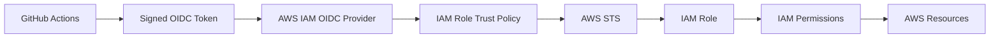
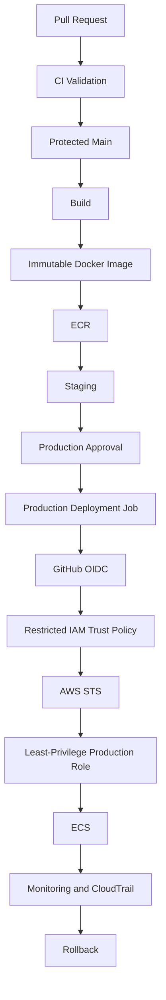

# 15- AWS IAM Trust Policies for OIDC

## Overview

AWS IAM trust policies define **who or what is allowed to assume an IAM role**. When GitHub Actions uses OpenID Connect (OIDC) to authenticate to AWS, the trust policy becomes the primary AWS-side identity boundary.

The authentication flow is:

```text
GitHub Actions
      ↓
GitHub OIDC Provider
      ↓
OIDC Token
      ↓
AWS STS
      ↓
IAM Trust Policy
      ↓
IAM Role
      ↓
Temporary AWS Credentials
      ↓
AWS APIs
```

The IAM trust policy answers:

> "Under exactly what identity conditions may this GitHub workload assume this AWS role?"

The role's permissions policy answers a different question:

> "After assuming the role, what may the workload do?"

This distinction is fundamental to secure CI/CD architecture.

A production GitHub Actions deployment should therefore have multiple security boundaries:

```text
Trusted Repository
      ↓
Trusted Workflow
      ↓
Protected Branch / Environment
      ↓
GitHub OIDC
      ↓
Restricted IAM Trust Policy
      ↓
Temporary Credentials
      ↓
Least-Privilege IAM Permissions
      ↓
AWS Resources
```

A permissive trust policy can undermine otherwise strong IAM permissions because an unintended GitHub workload may be able to obtain the role credentials.

## IAM Trust Policy vs Permission Policy

An IAM role has two conceptually different policy boundaries.

| Policy | Purpose | Key Question |
|---|---|---|
| Trust policy | Controls role assumption | Who can assume this role? |
| Permissions policy | Controls AWS operations | What can the assumed role do? |

Example:

```text
GitHub OIDC Token
        ↓
Trust Policy
        ↓
AssumeRole allowed?
        ↓
IAM Role
        ↓
Permissions Policy
        ↓
S3/ECR/ECS/Lambda/etc. allowed?
```

A trust-policy failure usually produces an `AssumeRoleWithWebIdentity` authorization error.

A permissions-policy failure usually produces an AWS API `AccessDenied` error after the role has already been assumed.

## Why Trust Policies Matter

Consider an IAM role with:

```text
ECS deployment permissions
```

If its trust policy allows only:

```text
repo:company/backend-api:environment:production
```

the role is restricted to the intended production deployment identity.

If the trust policy instead permits a broad set of GitHub identities, the same powerful permissions could potentially be obtained by unintended workflows.

The security boundary is therefore:

```text
Strong Permission Policy
        +
Strong Trust Policy
        =
Controlled Workload Identity
```

## GitHub OIDC Architecture

GitHub Actions can issue an OIDC token representing the workflow execution.

AWS must first be configured to trust GitHub's OIDC identity provider.



The OIDC provider establishes the external identity source.

The trust policy determines which identities from that provider are accepted.

## GitHub OIDC Provider

The AWS account needs an IAM OIDC provider for GitHub Actions.

The provider represents GitHub's OIDC issuer:

```text
token.actions.githubusercontent.com
```

The provider is not itself the authorization policy.

Instead:

```text
OIDC Provider
    ↓
Makes GitHub tokens recognizable to AWS

Trust Policy
    ↓
Restricts which GitHub identities are trusted
```

## OIDC Audience

GitHub's AWS integration uses an audience value associated with AWS STS:

```text
sts.amazonaws.com
```

A trust policy should normally restrict the audience.

Example:

```json
{
  "Condition": {
    "StringEquals": {
      "token.actions.githubusercontent.com:aud": "sts.amazonaws.com"
    }
  }
}
```

The audience restriction helps ensure that the token is intended for the AWS STS trust relationship.

## OIDC Subject Claim

The `sub` claim identifies the GitHub workload context.

For example, a subject may represent a repository and environment:

```text
repo:my-org/backend-api:environment:production
```

or a branch/ref-based identity:

```text
repo:my-org/backend-api:ref:refs/heads/main
```

The exact subject depends on the GitHub workflow and triggering context.

The trust policy can use this claim to restrict role assumption.

## Trust Policy Structure

A typical trust policy contains:

```json
{
  "Version": "2012-10-17",
  "Statement": [
    {
      "Effect": "Allow",
      "Principal": {
        "Federated": "arn:aws:iam::<ACCOUNT_ID>:oidc-provider/token.actions.githubusercontent.com"
      },
      "Action": "sts:AssumeRoleWithWebIdentity",
      "Condition": {
        "StringEquals": {
          "token.actions.githubusercontent.com:aud": "sts.amazonaws.com",
          "token.actions.githubusercontent.com:sub": "repo:my-org/backend-api:environment:production"
        }
      }
    }
  ]
}
```

The important elements are:

| Element | Purpose |
|---|---|
| `Effect` | Allows or denies the statement |
| `Principal` | Identifies the trusted identity provider |
| `Action` | Allows `AssumeRoleWithWebIdentity` |
| `Condition` | Restricts which OIDC identities are accepted |

## Trust Policy Evaluation

Conceptually:

```text
OIDC Token
    ↓
AWS receives token
    ↓
Identify OIDC provider
    ↓
Evaluate Principal
    ↓
Evaluate Action
    ↓
Evaluate Conditions
    ↓
All required conditions satisfied?
    ├── No → AssumeRole denied
    └── Yes
          ↓
      IAM Role
          ↓
      Temporary Credentials
```

The trust policy is evaluated before the role's permissions policy becomes relevant.

## Repository-Level Restriction

A common baseline is to restrict role assumption to a specific repository.

Conceptually:

```text
repo:my-org/backend-api:*
```

This prevents unrelated repositories from using the role.

However, repository-only restrictions may still be too broad for production.

A repository can contain:

```text
main
feature/*
experimental/*
release/*
```

If every branch can assume a production role, the trust boundary is larger than necessary.

## Branch-Based Trust

For deployments that are intentionally restricted to a branch, a subject can be constrained to the expected ref.

Example:

```json
{
  "Condition": {
    "StringEquals": {
      "token.actions.githubusercontent.com:aud": "sts.amazonaws.com",
      "token.actions.githubusercontent.com:sub": "repo:my-org/backend-api:ref:refs/heads/main"
    }
  }
}
```

This produces:

```text
backend-api
     ↓
main branch
     ↓
OIDC
     ↓
Production IAM Role
```

The branch restriction should be combined with GitHub branch protection rather than treated as a replacement for it.

## Environment-Based Trust

For production deployment pipelines, an environment-based identity can provide a strong deployment boundary.

Example:

```text
repo:my-org/backend-api:environment:production
```

The architecture becomes:

```text
Protected main
      ↓
Deployment Workflow
      ↓
Production Environment
      ↓
OIDC Subject
      ↓
Production IAM Role
```

This is useful when production authorization is tied to the GitHub environment rather than simply a branch.

## Branch vs Environment Trust

| Model | Identity Boundary | Typical Use |
|---|---|---|
| Repository | Repository | Broad CI access |
| Branch/ref | Repository + branch | Controlled branch deployments |
| Environment | Repository + environment | Protected staging/production deployments |
| Separate AWS account | AWS account boundary | Strong environment isolation |

Environment-based trust is especially useful when production requires approval or deployment protection.

## GitHub Environment Protection

A production environment can provide:

- Required reviewers.
- Deployment restrictions.
- Environment-specific secrets.
- Deployment history.

Example:

```yaml
jobs:
  deploy:
    environment:
      name: production

    permissions:
      contents: read
      id-token: write

    steps:
      - uses: actions/checkout@<verified-sha>

      - name: Configure AWS credentials
        uses: aws-actions/configure-aws-credentials@<verified-sha>
        with:
          role-to-assume: ${{ vars.AWS_PRODUCTION_ROLE }}
          aws-region: ${{ vars.AWS_REGION }}
```

The environment should be part of the overall trust design, not merely a UI-level approval mechanism.

## Why `id-token: write` Matters

The GitHub job must have permission to request an OIDC token:

```yaml
permissions:
  contents: read
  id-token: write
```

This permission should be granted only to jobs that need OIDC.

Prefer:

```yaml
jobs:
  test:
    permissions:
      contents: read

  deploy:
    permissions:
      contents: read
      id-token: write
```

over granting:

```yaml
permissions:
  id-token: write
```

to every job.

## OIDC Does Not Grant AWS Permissions

This is one of the most important concepts.

```yaml
permissions:
  id-token: write
```

does not mean:

```text
Can modify AWS resources
```

It means:

```text
Can request an OIDC identity token
```

AWS access comes from:

```text
OIDC Token
   ↓
IAM Trust Policy
   ↓
Assumed IAM Role
   ↓
IAM Permission Policy
```

## Least-Privilege Trust Policies

A trust policy should be as narrow as the deployment model allows.

Avoid designing:

```text
Any GitHub Repository
        ↓
Production Role
```

Prefer:

```text
Specific Repository
        ↓
Specific Deployment Context
        ↓
Production Role
```

For example:

```text
my-org/backend-api
        +
production environment
        ↓
Production IAM Role
```

## Least-Privilege Permission Policies

Trust restriction is only one side of the security model.

Suppose a production role can be assumed only by the intended workflow, but its permissions are:

```json
{
  "Effect": "Allow",
  "Action": "*",
  "Resource": "*"
}
```

The role still has excessive authority.

A secure design therefore requires:

```text
Restricted Trust
        +
Restricted Permissions
```

## Separate Roles by Environment

A common architecture is:

```text
GitHub
 ├── Development Role
 ├── Staging Role
 └── Production Role
```

For example:

```text
backend-api
    ↓
dev environment
    ↓
arn:aws:iam::DEV_ACCOUNT:role/backend-api-dev

backend-api
    ↓
staging environment
    ↓
arn:aws:iam::STAGING_ACCOUNT:role/backend-api-staging

backend-api
    ↓
production environment
    ↓
arn:aws:iam::PROD_ACCOUNT:role/backend-api-production
```

Each role can have different trust and permission policies.

## Separate AWS Accounts

For stronger isolation:

```text
GitHub
   ├── Dev AWS Account
   ├── Staging AWS Account
   └── Production AWS Account
```

The production role exists only in the production account.

This creates multiple boundaries:

```text
GitHub Identity
      ↓
IAM Trust Policy
      ↓
Production AWS Account
      ↓
Production IAM Role
      ↓
Production Resources
```

## Cross-Account OIDC

GitHub can authenticate directly into a target AWS account when that account has its own GitHub OIDC provider and IAM role.

Conceptually:

```text
GitHub
   ↓
OIDC
   ↓
Production AWS Account
   ↓
Production IAM Role
   ↓
Production Resources
```

Avoid introducing an intermediate role unless the architecture actually requires role chaining.

If role chaining is necessary, document each trust relationship explicitly.

## Trust Policy Conditions

Conditions are the most important part of an OIDC trust policy.

Typical restrictions include:

```text
aud
sub
```

with `sub` representing the repository and workflow identity context.

A condition should match the actual identity model of the workflow.

Do not blindly copy a trust policy from another repository because its subject claim may represent a different branch or environment.

## `StringEquals` vs `StringLike`

Use exact matching where the identity is known and fixed.

Example:

```json
{
  "StringEquals": {
    "token.actions.githubusercontent.com:aud": "sts.amazonaws.com",
    "token.actions.githubusercontent.com:sub": "repo:my-org/backend-api:environment:production"
  }
}
```

Pattern matching can be useful when multiple identities intentionally need access.

Example:

```json
{
  "StringLike": {
    "token.actions.githubusercontent.com:sub": "repo:my-org/*:environment:production"
  }
}
```

However, broad patterns increase the trust boundary.

Use the narrowest pattern that matches the actual requirement.

## Wildcards in Trust Policies

A dangerous pattern is:

```json
{
  "StringLike": {
    "token.actions.githubusercontent.com:sub": "*"
  }
}
```

This effectively removes the useful identity restriction.

Another risky pattern is granting an entire organization access when only one repository needs the role.

Prefer:

```text
Exact repository
+
Exact deployment context
```

where possible.

## Repository Ownership Changes

Trust policies should be reviewed when:

- Repository ownership changes.
- Organization names change.
- Repositories are renamed.
- Deployment environments change.
- Branching strategy changes.
- Workflows are migrated.
- AWS accounts change.

An identity restriction that references an old repository or organization can break deployments.

Conversely, a broadened restriction can unintentionally expand access.

## Fork Pull Requests

Forks represent a different trust boundary.

A typical secure design is:

```text
Fork PR
   ↓
pull_request
   ↓
Lint/Test
   ↓
No Production OIDC
```

Production deployment should occur only from a trusted deployment path.

Do not assume that because a workflow file exists in a repository, every execution of that workflow should receive production AWS identity.

## `pull_request` and OIDC

A `pull_request` workflow can execute code from the pull request context.

This is useful for testing untrusted contributions.

Therefore:

```text
pull_request
+
Production OIDC
+
Untrusted Code
```

is generally an unsafe combination.

Keep privileged deployment operations outside the untrusted PR execution boundary.

## `pull_request_target`

`pull_request_target` executes in the context of the base repository.

This can provide access to repository-level privileges that ordinary fork PR workflows do not receive.

That makes this pattern dangerous:

```text
pull_request_target
      ↓
Checkout PR Code
      ↓
Execute PR Code
      ↓
id-token: write
      ↓
Production IAM Role
```

The problem is not the event alone. The problem is combining a privileged execution context with untrusted code.

## OIDC and Third-Party Actions

Consider:

```yaml
permissions:
  id-token: write

steps:
  - uses: third-party/action@<sha>
  - name: Deploy
    run: ./deploy.sh
```

The third-party action executes inside the same job.

A compromised action may attempt to access credentials or perform operations using the available identity.

For privileged jobs:

- Review actions.
- Pin actions to immutable references.
- Minimize permissions.
- Avoid unnecessary third-party actions.
- Separate build and deployment jobs.
- Use trusted action sources.
- Restrict network access where practical.

## Job-Level Privilege Isolation

A useful pattern is:

```text
Lint Job
  ↓
No AWS Identity

Test Job
  ↓
No AWS Identity

Build Job
  ↓
No Production AWS Identity

Deploy Job
  ↓
OIDC
  ↓
Production Role
```

This minimizes the number of execution steps that operate inside the production trust boundary.

## OIDC and Build Pipelines

A secure production pipeline should preferably separate:

```text
Build
```

from:

```text
Deploy
```

For example:

```text
Pull Request
   ↓
Tests
   ↓
Security Scan
   ↓
Build
   ↓
Immutable Artifact
   ↓
ECR
   ↓
Protected Deployment
   ↓
OIDC
   ↓
Production IAM Role
   ↓
ECS
```

This also supports artifact promotion without rebuilding.

## Immutable Artifact Promotion

The preferred deployment model is:

```text
Source
   ↓
Build Once
   ↓
Docker Image
   ↓
ECR
   ↓
Staging
   ↓
Approval
   ↓
Production
```

rather than:

```text
Build for Staging
   ↓
Build Again for Production
```

Rebuilding can introduce differences between the artifact tested in staging and the artifact deployed in production.

## ECR Trust Model

A build job may need:

```text
OIDC
 ↓
ECR Push Role
```

while the production deployment job may need:

```text
OIDC
 ↓
ECS Deployment Role
```

These can be separate roles.

Example:

```text
Build Job
   ↓
ECR Push Role
   ↓
ECR

Deploy Job
   ↓
ECS Deployment Role
   ↓
ECS
```

This limits the blast radius of each job.

## ECS Deployment Trust

An ECS deployment role may require permissions for:

- ECS service operations.
- Task-definition operations.
- IAM `PassRole` for the intended ECS task role where required.
- Reading deployment state.

`iam:PassRole` deserves particular attention because it can allow a deployment role to cause AWS services to use another IAM role.

Restrict `PassRole` to the specific task role or roles required.

## `iam:PassRole` Considerations

Avoid:

```json
{
  "Effect": "Allow",
  "Action": "iam:PassRole",
  "Resource": "*"
}
```

when a specific task role is sufficient.

Prefer restricting the resource to the intended role.

The effective deployment path may otherwise become:

```text
GitHub OIDC
   ↓
Deployment Role
   ↓
PassRole
   ↓
Highly Privileged Task Role
   ↓
AWS Resources
```

This can significantly increase the deployment role's effective authority.

## S3 Deployment

For a static application deployment:

```text
GitHub
   ↓
OIDC
   ↓
S3 Deployment Role
   ↓
Specific Bucket / Prefix
```

Restrict the permission policy to the required bucket and prefix where supported.

Do not grant broad S3 access simply because the deployment uses S3.

## Lambda Deployment

For Lambda:

```text
GitHub
   ↓
OIDC
   ↓
Lambda Deployment Role
   ↓
Specific Lambda Function
```

The permission policy should restrict the target function where the AWS API supports resource-level authorization.

## Infrastructure Deployment

Infrastructure workflows are particularly sensitive.

Terraform or CloudFormation may modify:

```text
IAM
VPC
ECS
EC2
S3
RDS
Lambda
Security Groups
```

Therefore infrastructure roles should normally have separate trust and authorization boundaries from ordinary application CI.

## Terraform OIDC Architecture

```text
GitHub Actions
      ↓
Protected Environment
      ↓
OIDC
      ↓
Terraform IAM Role
      ↓
Terraform
      ↓
AWS Infrastructure
```

For production:

```text
Plan
 ↓
Review
 ↓
Approval
 ↓
Apply
```

The role used by `apply` should not be unnecessarily available to ordinary pull request workflows.

## Trust Policy and Workflow Reuse

Reusable workflows can centralize deployment logic.

For example:

```yaml
jobs:
  deploy:
    uses: my-org/platform-workflows/.github/workflows/deploy.yml@<verified-ref>
    with:
      environment: production
    secrets: inherit
```

The trust model still needs to account for the repository and execution context.

Reusable workflow design should not accidentally broaden production identity access across repositories.

## Cross-Repository Reusable Workflows

A centralized deployment workflow may be used by:

```text
backend-api
payments-api
orders-api
inventory-api
```

If all repositories can assume the same production role, the blast radius increases.

Prefer:

```text
Repository
   ↓
Repository-specific or narrowly scoped role
```

where security requirements justify it.

Alternatively, a centralized workflow can map approved repositories to dedicated roles.

## OIDC and Custom Actions

Custom actions execute within the caller's job context.

Therefore a custom action does not automatically create a separate security boundary.

If:

```text
Job
 ├── OIDC
 ├── Custom Action
 └── AWS Deployment
```

the custom action runs in a privileged context.

Treat custom actions used in deployment jobs as part of the privileged supply chain.

## OIDC and Docker Actions

Docker-based actions can also execute inside a privileged workflow.

Review:

- Docker image source.
- Image version.
- Action source.
- Entrypoint.
- Inputs.
- Environment variables.
- Mounted resources.
- AWS credential availability.

Do not assume containerizing an action automatically isolates it from the job's privileges.

## Self-Hosted Runners

Self-hosted runners increase the importance of trust policy design.

A runner may have:

- Private network access.
- Internal DNS.
- Docker socket access.
- Persistent filesystem data.
- Custom credentials.
- Internal service access.

A compromised workflow can potentially use the runner as a pivot point.

For privileged OIDC workflows, consider:

- Ephemeral runners.
- Dedicated runner groups.
- Restricted labels.
- Network segmentation.
- Minimal IAM.
- Strong repository controls.

## Persistent vs Ephemeral Runners

| Runner | Security Characteristic |
|---|---|
| GitHub-hosted | Stronger default isolation |
| Persistent self-hosted | State can survive between jobs |
| Ephemeral self-hosted | Fresh execution environment per job |
| Dedicated deployment runner | Strong workload isolation if properly managed |

Ephemeral runners reduce cross-job contamination and residual state.

## Private Network Access

A self-hosted deployment runner may need access to:

```text
Private EKS
Private ECS endpoints
Internal databases
Private APIs
Internal registries
```

Network access should be treated as another privilege.

OIDC controls AWS identity but does not automatically restrict network reachability.

Use:

```text
OIDC
+
IAM
+
Network segmentation
+
Runner isolation
```

for defense in depth.

## Trust Policy and Network Controls

A production architecture may look like:

```text
GitHub
   ↓
OIDC
   ↓
IAM Role
   ↓
Restricted AWS Permissions
   ↓
Private Network
   ↓
Target Service
```

The IAM role controls AWS API permissions while networking controls which systems can be reached.

## Monitoring Trust Policy Usage

Monitor:

- `AssumeRoleWithWebIdentity`.
- Unexpected role sessions.
- Unexpected repository identities.
- Unexpected environments.
- Unexpected AWS regions.
- Unexpected API operations.
- Unexpected deployment times.
- IAM trust-policy changes.

CloudTrail provides AWS-side visibility into role assumption and subsequent API activity.

## Incident Response

If an OIDC trust relationship is suspected to be compromised:

```text
Detect
  ↓
Identify Role
  ↓
Identify GitHub Identity
  ↓
Inspect CloudTrail
  ↓
Restrict Trust
  ↓
Reduce Permissions
  ↓
Stop Affected Workflow
  ↓
Review Actions
  ↓
Review Artifacts
  ↓
Restore Trusted Configuration
```

Because OIDC credentials are temporary, there may be no static AWS access key to rotate.

However, active sessions and the trust relationship still need investigation and containment.

## Emergency Containment

Potential controls include:

- Disable or restrict the affected workflow.
- Remove unnecessary OIDC permission.
- Temporarily tighten the IAM trust policy.
- Reduce IAM permissions.
- Block affected deployment environments.
- Restrict runner access.
- Review CloudTrail.
- Review GitHub Actions runs.
- Investigate third-party actions.
- Redeploy from a known-good immutable artifact.

The exact response depends on the incident.

## Trust Policy Change Management

Treat trust policies as production infrastructure.

Changes should be:

- Version controlled.
- Reviewed.
- Tested.
- Audited.
- Documented.
- Applied through controlled infrastructure workflows where practical.

Avoid manually modifying production trust policies without recording the change.

## Terraform Example

A simplified Terraform role can represent the trust relationship:

```hcl
data "aws_iam_policy_document" "github_actions_assume_role" {
  statement {
    effect = "Allow"

    principals {
      type        = "Federated"
      identifiers = [
        "arn:aws:iam::${var.aws_account_id}:oidc-provider/token.actions.githubusercontent.com"
      ]
    }

    actions = [
      "sts:AssumeRoleWithWebIdentity"
    ]

    condition {
      test     = "StringEquals"
      variable = "token.actions.githubusercontent.com:aud"
      values   = ["sts.amazonaws.com"]
    }

    condition {
      test     = "StringEquals"
      variable = "token.actions.githubusercontent.com:sub"
      values   = [
        "repo:${var.github_repository}:environment:production"
      ]
    }
  }
}

resource "aws_iam_role" "github_actions" {
  name               = "github-actions-production"
  assume_role_policy = data.aws_iam_policy_document.github_actions_assume_role.json
}
```

This approach makes the trust boundary part of the infrastructure codebase.

## Trust Policy as Code

Managing trust policies as code provides:

- Version history.
- Peer review.
- Reproducibility.
- Automated validation.
- Auditable changes.
- Easier environment-specific configuration.

The trust relationship should be treated with the same discipline as application infrastructure.

## Production Naming

Use explicit role names.

Examples:

```text
github-actions-backend-dev
github-actions-backend-staging
github-actions-backend-production
github-actions-infrastructure-production
github-actions-ecr-publisher
```

Avoid ambiguous names such as:

```text
github-role
deployment-role
ci-role
```

Explicit names make incident investigation easier.

## Trust Policy Documentation

Document:

```text
Role
Repository
Environment
Branch/ref
AWS account
Purpose
Permissions
Deployment workflow
Owner
```

For example:

```text
Role:
github-actions-backend-production

Repository:
my-org/backend-api

Environment:
production

Purpose:
ECS application deployment

AWS Account:
Production

Workflow:
.github/workflows/deploy.yml
```

This improves operational clarity.

## Testing Trust Policies

Before production use, test:

```text
Expected repository
Expected environment
Expected branch/ref
Unexpected repository
Unexpected branch
Unexpected environment
Fork PR
Untrusted workflow
```

The goal is to verify both:

```text
Expected identity → Allowed
```

and:

```text
Unexpected identity → Denied
```

## Trust Policy Validation Matrix

| Scenario | Expected Result |
|---|---|
| Production workflow | Allowed |
| Production environment | Allowed |
| Wrong repository | Denied |
| Wrong environment | Denied |
| Untrusted feature branch | Denied where branch restriction applies |
| Fork PR | Denied for production role |
| Staging workflow | Denied for production role |
| Missing OIDC permission | Authentication fails |
| Correct identity but missing AWS permission | AWS API denied |

## Troubleshooting OIDC Trust Policies

### Symptom: `AssumeRoleWithWebIdentity` Denied

**Possible causes**

- Incorrect OIDC provider.
- Incorrect audience.
- Incorrect `sub`.
- Incorrect repository.
- Incorrect branch/ref.
- Incorrect environment.
- Missing `id-token: write`.
- Incorrect IAM role ARN.

**Isolation strategy**

Start with:

```text
GitHub permissions
      ↓
OIDC provider
      ↓
Audience
      ↓
Subject
      ↓
Trust policy
```

Do not modify permission policies until role assumption succeeds.

### Symptom: Role Assumption Succeeds but AWS API Is Denied

This is usually an IAM permission-policy problem.

```text
OIDC
 ↓
STS
 ↓
IAM Role
 ↓
Success

AWS API
 ↓
AccessDenied
```

Inspect the role's permissions instead of the trust relationship.

### Symptom: Staging Works but Production Fails

Compare:

```text
Repository
Environment
Subject claim
IAM role ARN
AWS account
Trust policy
GitHub environment configuration
```

Production often uses a different subject claim or role.

### Symptom: Role Works for Main but Not Environment Deployment

The workflow may be producing an environment-based subject rather than a branch-based subject.

Do not assume:

```text
main branch
```

and:

```text
production environment
```

produce the same identity.

Build the trust policy around the actual workflow identity model.

## AWS CLI Diagnostics

Inspect the role:

```bash
aws iam get-role \
  --role-name github-actions-backend-production
```

Inspect the role trust policy:

```bash
aws iam get-role \
  --role-name github-actions-backend-production \
  --query 'Role.AssumeRolePolicyDocument'
```

List attached policies:

```bash
aws iam list-attached-role-policies \
  --role-name github-actions-backend-production
```

List inline policies:

```bash
aws iam list-role-policies \
  --role-name github-actions-backend-production
```

Inspect an inline policy:

```bash
aws iam get-role-policy \
  --role-name github-actions-backend-production \
  --policy-name DeploymentPolicy
```

List OIDC providers:

```bash
aws iam list-open-id-connect-providers
```

These commands help isolate AWS-side configuration.

## GitHub CLI Diagnostics

List workflow runs:

```bash
gh run list
```

Inspect a run:

```bash
gh run view RUN_ID
```

View logs:

```bash
gh run view RUN_ID --log
```

List repository environments:

```bash
gh api repos/{owner}/{repo}/environments
```

Inspect workflow permissions:

```bash
gh api repos/{owner}/{repo}/actions/permissions/workflow
```

List repository secrets:

```bash
gh secret list
```

List repository variables:

```bash
gh variable list
```

## Failure-Domain Troubleshooting Model

```text
Workflow Configuration
        ↓
GitHub Permissions
        ↓
OIDC Token
        ↓
AWS OIDC Provider
        ↓
IAM Trust Policy
        ↓
STS Role Assumption
        ↓
IAM Permission Policy
        ↓
AWS Resource Authorization
        ↓
Application Deployment
```

Debug from left to right.

Changing several layers simultaneously makes the root cause harder to identify.

## Common Mistakes

### Trusting Every Repository

Bad pattern:

```text
Organization
   ↓
All repositories
   ↓
Production Role
```

This expands the blast radius unnecessarily.

### Trusting Every Branch

A production role should not automatically be available to feature branches.

### Using `StringLike` Too Broadly

A wildcard can silently expand the trust boundary.

### Ignoring the Environment Claim

A workflow using a protected environment may have a different subject identity than a simple branch-based workflow.

### Granting OIDC to Every Job

Only privileged jobs should normally receive:

```yaml
id-token: write
```

### Combining OIDC With Untrusted Code

Do not execute untrusted PR code inside a privileged deployment job.

### Using One Role for Everything

Avoid a universal role containing:

```text
ECR
ECS
S3
Lambda
IAM
Terraform
CloudFormation
```

when separate roles can provide smaller blast radii.

### Granting `iam:PassRole` Broadly

Restrict it to the intended task or service roles.

### Treating OIDC as a Complete Security Solution

OIDC solves a credential-distribution problem.

It does not solve:

- Excessive IAM permissions.
- Malicious actions.
- Untrusted code execution.
- Runner compromise.
- Network exposure.
- Artifact tampering.
- Deployment races.

## Production Architecture

A mature production deployment architecture can be modeled as:



## High-Availability Considerations

CI/CD security should not create unnecessary deployment single points of failure.

Consider:

- GitHub-hosted runner availability.
- Ephemeral runner capacity.
- ECR availability.
- AWS STS availability.
- Deployment controller availability.
- Artifact availability.
- Rollback availability.

Keep previously built immutable artifacts available so that a deployment can be retried without rebuilding.

## Disaster Recovery

Preserve enough information to reconstruct the trust relationship:

```text
OIDC Provider Configuration
IAM Trust Policies
IAM Permission Policies
GitHub Workflow Definitions
GitHub Environment Configuration
AWS Account Mapping
Artifact References
Deployment Procedures
CloudTrail Logs
```

Infrastructure-as-code is particularly valuable because the trust relationship becomes reproducible.

## Cost Considerations

Trust policies themselves have negligible direct infrastructure cost.

Operational costs come from the surrounding architecture:

- GitHub Actions runner minutes.
- Self-hosted runner infrastructure.
- AWS STS/AWS API usage.
- ECR storage.
- CloudTrail storage.
- Monitoring.
- Security tooling.

OIDC can reduce operational cost associated with long-lived credential management and rotation.

## Governance

Organizations should define standards for:

- OIDC provider configuration.
- Approved trust-policy patterns.
- Repository restrictions.
- Environment restrictions.
- IAM role naming.
- Permission boundaries.
- Action pinning.
- Deployment roles.
- Infrastructure roles.
- Self-hosted runners.
- CloudTrail monitoring.

A platform team can provide approved reusable workflows that implement these controls consistently.

## Enterprise Role Model

A larger organization might use:

```text
GitHub Organization
        ↓
Approved Deployment Workflow
        ↓
Repository-specific Identity
        ↓
Environment
        ↓
Dedicated IAM Role
        ↓
Least-Privilege Permission Policy
        ↓
AWS Account
```

This scales better than manually creating broad shared roles for every project.

## Senior-Level Design Principles

### Trust Narrowly

The trust policy should identify the smallest practical workload boundary.

```text
Specific repository
+
Specific environment/ref
+
Specific role
```

is stronger than:

```text
Any GitHub workload
+
Shared production role
```

### Separate Authentication From Authorization

Always reason about:

```text
Can assume?
```

and:

```text
Can perform?
```

independently.

### Minimize Privileged Execution

The fewer steps that have OIDC and production permissions, the smaller the blast radius.

### Prefer Dedicated Roles

Separate:

```text
CI
ECR publishing
Application deployment
Infrastructure deployment
Production operations
```

when the security boundary justifies it.

### Treat Trust Policies as Code

Review them like application code and infrastructure.

A trust policy is security-critical configuration.

### Design for Failure

A production deployment must have:

- Health validation.
- Concurrency protection.
- Immutable artifacts.
- Rollback.
- Monitoring.
- Auditing.

OIDC protects authentication but does not provide deployment reliability by itself.

## Interview Questions

### What Is an IAM Trust Policy?

A trust policy defines which principals are allowed to assume an IAM role and under what conditions.

### Why Is a Trust Policy Important for GitHub OIDC?

Because GitHub can obtain an OIDC token, but AWS must decide whether that specific GitHub workload is trusted to assume the role.

### What Is the Difference Between `Principal` and `Condition`?

`Principal` identifies the trusted identity source.

`Condition` narrows which identities from that source are actually accepted.

### What Is the Purpose of the OIDC Audience?

The audience identifies the intended recipient of the token. For AWS STS integration, the expected audience is commonly:

```text
sts.amazonaws.com
```

### Why Restrict the `sub` Claim?

It prevents unrelated GitHub repositories, branches, or environments from assuming the IAM role.

### Should You Trust an Entire GitHub Organization?

Only if the architecture intentionally requires that level of trust. Otherwise, a repository- or environment-specific restriction provides a narrower boundary.

### Why Is `pull_request_target` Dangerous With OIDC?

Because it can execute with the base repository's privilege context. If untrusted pull request code is then executed inside the privileged workflow, that code may operate inside a highly privileged trust boundary.

### Does `id-token: write` Grant AWS Permissions?

No. It allows the job to request an OIDC token. AWS permissions come from the IAM role and its permission policies after successful role assumption.

### Why Separate Build and Deployment Jobs?

The build and test stages usually do not require production AWS identity. Separating them reduces the number of execution steps that can access production credentials.

### How Would You Secure a Production ECS Deployment?

A strong design would include:

```text
Protected main
    ↓
CI validation
    ↓
Immutable image
    ↓
ECR
    ↓
Production approval
    ↓
Dedicated deployment job
    ↓
OIDC
    ↓
Restricted trust policy
    ↓
Least-privilege ECS role
    ↓
ECS deployment
```

### How Would You Debug `AssumeRoleWithWebIdentity`?

Check:

```text
id-token: write
        ↓
OIDC provider
        ↓
Audience
        ↓
Subject
        ↓
Trust policy
        ↓
Role ARN
```

Only after successful role assumption should you investigate AWS permission policies.

### How Would You Protect Terraform?

Use:

- Dedicated Terraform role.
- Restricted OIDC trust.
- Protected production environment.
- Separate plan/apply privileges where appropriate.
- Secure state.
- Least-privilege AWS permissions.
- Approval before production changes.

## Production Checklist

### GitHub

- [ ] `id-token: write` is granted only to required jobs.
- [ ] Workflow permissions are explicit.
- [ ] Production deployments use protected environments.
- [ ] Untrusted PRs cannot obtain production OIDC access.
- [ ] Privileged jobs use trusted actions.
- [ ] Deployment actions are pinned appropriately.

### OIDC Provider

- [ ] GitHub OIDC provider exists in the target AWS account.
- [ ] Provider configuration is managed and documented.
- [ ] Expected audience is enforced.
- [ ] OIDC configuration is monitored for unauthorized changes.

### Trust Policy

- [ ] Principal is the intended GitHub OIDC provider.
- [ ] `sts:AssumeRoleWithWebIdentity` is the intended action.
- [ ] Audience is restricted.
- [ ] Subject is restricted.
- [ ] Repository access is intentionally scoped.
- [ ] Branch/ref restrictions are used where appropriate.
- [ ] Environment restrictions are used where appropriate.
- [ ] Wildcards are minimized.

### IAM Permissions

- [ ] Permissions follow least privilege.
- [ ] Resource-level restrictions are used where supported.
- [ ] Production roles are separate from CI roles.
- [ ] `iam:PassRole` is restricted.
- [ ] Infrastructure roles are separated from application deployment roles.

### Runners

- [ ] Privileged workflows use trusted runners.
- [ ] Self-hosted runners are isolated.
- [ ] Ephemeral runners are considered.
- [ ] Private network access is restricted.
- [ ] Runner groups and labels are controlled.

### Operations

- [ ] Trust policies are version controlled.
- [ ] Changes are peer reviewed.
- [ ] CloudTrail monitors role assumption.
- [ ] Deployment activity can be correlated with workflow runs.
- [ ] Rollback procedures are tested.
- [ ] Incident-response procedures include OIDC compromise.

## Key Takeaways

- IAM trust policies define **who may assume an AWS role**, while IAM permission policies define **what the assumed role may do**; both must enforce least privilege.
- GitHub OIDC trust should be narrowed using the appropriate repository, branch/ref, environment, and audience conditions rather than trusting broad GitHub identities.
- Production OIDC access should be isolated to protected deployment jobs and combined with environment approvals, trusted actions, restricted runners, and dedicated IAM roles.
- `pull_request_target`, third-party actions, self-hosted runners, and broad wildcard trust policies can significantly expand the OIDC attack surface when combined with privileged AWS roles.
- Treat OIDC trust policies as production security infrastructure: manage them as code, monitor role assumptions with CloudTrail, test expected and unexpected identities, and maintain rollback and incident-response procedures.