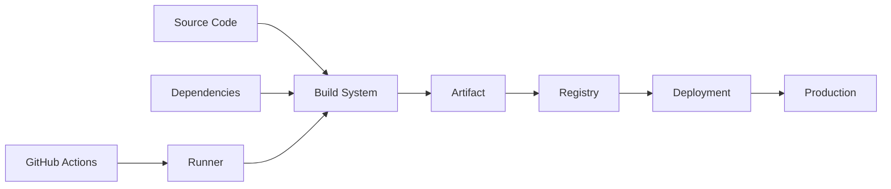
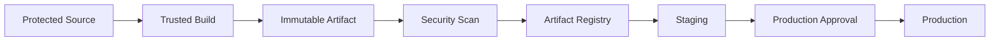
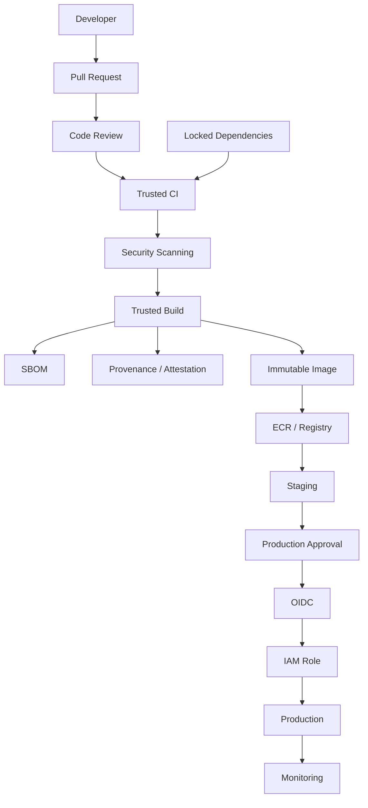

# 16- Supply Chain Security

## Overview

Supply chain security in GitHub Actions protects the entire path from source code to production deployment:

```text
Source Code
    ↓
Dependencies
    ↓
GitHub Actions
    ↓
Runners
    ↓
Build Tools
    ↓
Container Images
    ↓
Artifacts
    ↓
Registries
    ↓
Deployment
    ↓
Production
```

A CI/CD pipeline is itself a software supply chain. It executes code, downloads dependencies, invokes third-party actions, builds artifacts, accesses credentials, and can modify production infrastructure.

A compromise anywhere in this chain can affect the final production system.

For a Python/Django/FastAPI backend, a realistic supply chain includes:

```text
Python Source
   ↓
PyPI Dependencies
   ↓
GitHub Actions
   ↓
Node / Python / Docker Tooling
   ↓
Build
   ↓
Docker Image
   ↓
ECR
   ↓
ECS / Kubernetes / EC2
```

Supply chain security therefore requires more than vulnerability scanning. The pipeline should establish:

- Trusted inputs.
- Controlled dependencies.
- Verified build tooling.
- Least-privilege execution.
- Immutable artifacts.
- Artifact provenance.
- Integrity verification.
- Controlled promotion.
- Protected deployment identities.
- Monitoring and incident response.

## Supply Chain Threat Model

A useful threat model is:



Every arrow is a trust boundary.

An attacker may attempt to:

- Commit malicious source code.
- Compromise a dependency.
- Compromise a GitHub Action.
- Exploit a runner.
- Poison a build.
- Replace an artifact.
- Push a malicious container image.
- Modify deployment configuration.
- Steal CI credentials.
- Abuse production deployment permissions.

## Why Supply Chain Security Matters

Traditional application security often focuses on:

```text
Application
    ↓
Vulnerabilities
```

CI/CD security must additionally consider:

```text
Application
    +
Dependencies
    +
Build Environment
    +
CI Actions
    +
Artifacts
    +
Registry
    +
Deployment Identity
```

A secure application can still be compromised if the pipeline builds or deploys a malicious artifact.

## Core Security Properties

A production CI/CD supply chain should aim to establish:

| Property | Question |
|---|---|
| Authenticity | Where did this component come from? |
| Integrity | Was it modified? |
| Provenance | How was it built? |
| Traceability | Which source produced it? |
| Reproducibility | Can the build be recreated? |
| Authorization | Who or what may deploy it? |
| Immutability | Can a released artifact be replaced? |
| Verification | Is the artifact trusted before deployment? |

## Supply Chain Security Layers

A practical defense-in-depth model is:

```text
Source Protection
      ↓
Dependency Security
      ↓
Action Security
      ↓
Runner Security
      ↓
Build Security
      ↓
Artifact Integrity
      ↓
Registry Security
      ↓
Deployment Security
      ↓
Runtime Monitoring
```

No single layer should be considered sufficient.

## Source Code Security

Protect the source repository using:

- Protected branches.
- Required pull requests.
- Required reviews.
- Status checks.
- CODEOWNERS.
- Restricted workflow changes.
- Restricted repository administration.
- Signed commits where organizational policy requires them.

Production deployment should originate from a trusted source state.

A useful model is:

```text
Pull Request
    ↓
Review
    ↓
CI Validation
    ↓
Protected Main
    ↓
Build
```

## Workflow File Security

GitHub Actions workflow files are executable infrastructure.

For example:

```text
.github/workflows/deploy.yml
```

can determine:

- Which code executes.
- Which actions execute.
- Which secrets are available.
- Which AWS roles can be assumed.
- Which production resources can be changed.

Therefore workflow changes should receive the same level of review as application code and infrastructure.

## CODEOWNERS for Workflows

A repository can require specific reviewers for workflow files.

Conceptually:

```text
.github/workflows/*
    → Platform / DevOps owners
```

This creates an additional review boundary for CI/CD changes.

Workflow modifications deserve special attention because they can alter security controls without changing application code.

## Dependency Supply Chain

Backend applications depend on external packages.

For Python:

```text
requirements.txt
pyproject.toml
poetry.lock
uv.lock
```

may reference external packages.

A dependency compromise can enter the production artifact during installation.

Example:

```text
pip install
    ↓
PyPI
    ↓
Package
    ↓
Build
    ↓
Docker Image
    ↓
Production
```

## Dependency Pinning

Avoid unnecessarily floating dependencies in production.

Prefer locked dependency resolution:

```text
Application
    ↓
Lock File
    ↓
Exact / Controlled Versions
    ↓
Build
```

For example:

```text
Django 5.x
FastAPI 0.x
Pydantic 2.x
```

should be resolved through a controlled lock strategy rather than allowing arbitrary upgrades during every build.

## Dependency Lock Files

Use lock files appropriate to the dependency tooling.

Examples include:

```text
poetry.lock
uv.lock
requirements.txt
```

The purpose is to make dependency resolution predictable.

A build should ideally produce the same dependency graph when the source and lock state are unchanged.

## Dependency Updates

Dependency updates should be treated as supply chain changes.

A controlled process is:

```text
Dependency Update
      ↓
Automated PR
      ↓
Security Scan
      ↓
Unit Tests
      ↓
Integration Tests
      ↓
Review
      ↓
Merge
```

Dependabot can automate dependency update pull requests.

## Dependency Review

Dependency review helps identify potentially problematic changes introduced by pull requests.

Use it to examine:

- New packages.
- Removed packages.
- Version changes.
- Known vulnerabilities.
- Dependency graph changes.

The important principle is:

```text
Dependency change
    =
Supply chain change
```

## Vulnerability Scanning

Dependency vulnerability scanning should run as part of CI.

Typical targets include:

- Python packages.
- Node packages.
- OS packages.
- Container images.
- GitHub Actions dependencies.

Scanning tools can identify known vulnerabilities, but vulnerability scanning does not prove that a dependency is trustworthy.

A package can be:

```text
No known CVEs
```

and still be malicious.

## Vulnerability Scanning Limitations

A clean vulnerability scan does not guarantee:

- Safe source code.
- Trusted maintainer.
- Absence of zero-day vulnerabilities.
- Correct package provenance.
- Secure build process.
- Safe transitive dependencies.

Use scanning as one control in a broader supply chain strategy.

## GitHub Actions as Dependencies

A workflow dependency such as:

```yaml
uses: some-org/some-action@v4
```

is itself part of the supply chain.

The action may:

- Execute arbitrary code.
- Read environment variables.
- Access files.
- Access workflow tokens.
- Access secrets available to the job.
- Make network requests.
- Interact with cloud credentials.

Therefore GitHub Actions should be treated like software dependencies.

## Third-Party Action Security

Before using an external action, evaluate:

- Repository ownership.
- Maintainer activity.
- Release history.
- Source code.
- Dependencies.
- Permissions required.
- Security history.
- Community adoption.
- Whether the action is actually necessary.

Do not select an action solely because it is popular or appears in the Marketplace.

## Action Pinning

A mutable reference:

```yaml
uses: vendor/action@v4
```

can move to a different commit over time.

A SHA-pinned reference:

```yaml
uses: vendor/action@<verified-commit-sha>
```

identifies a specific revision.

SHA pinning reduces the risk of unexpected changes through mutable tags.

## Version Pinning vs SHA Pinning

| Reference | Stability | Security Control |
|---|---|---|
| `@main` | Low | Weak |
| `@v4` | Better | Mutable |
| `@v4.2.1` | More predictable | Still mutable |
| Commit SHA | Immutable reference | Stronger |

A common enterprise approach is:

```text
Verified Action Version
        ↓
Verified Commit SHA
        ↓
Dependabot / Controlled Update
        ↓
Review
```

## SHA Pinning Limitations

SHA pinning does not prove that the commit is trustworthy.

An attacker may compromise an action before the SHA is pinned.

Therefore:

```text
SHA pinning
+
Source review
+
Controlled updates
```

is stronger than SHA pinning alone.

## Malicious vs Compromised Actions

These scenarios are different.

### Malicious Action

The action itself is intentionally designed to perform harmful behavior.

### Compromised Action

A previously trusted action is modified or its release infrastructure is compromised.

The second scenario is particularly important because a trusted dependency may suddenly become malicious.

## Action Dependency Chains

An action can depend on other software:

```text
Workflow
   ↓
Action
   ↓
Node Package
   ↓
Transitive Package
```

or:

```text
Workflow
   ↓
Docker Action
   ↓
Container Image
   ↓
Base Image
   ↓
OS Packages
```

Supply chain analysis must account for the full dependency chain.

## Composite Actions

Composite actions package multiple workflow steps.

They may execute:

```text
Shell Commands
Scripts
Third-Party Tools
```

A composite action should therefore be treated as executable code rather than merely configuration.

Review:

- `action.yml`.
- Referenced scripts.
- External downloads.
- Inputs.
- Outputs.
- Environment variables.
- Secrets.
- Dependencies.

## JavaScript Actions

JavaScript actions introduce another dependency chain:

```text
Action
 ↓
Node Runtime
 ↓
package.json
 ↓
package-lock.json
 ↓
npm Dependencies
```

The generated runtime bundle and dependencies should be controlled.

Avoid unnecessary runtime downloads during execution.

## Docker Actions

Docker actions introduce:

```text
Action
 ↓
Dockerfile
 ↓
Base Image
 ↓
OS Packages
 ↓
Application Dependencies
```

Review and pin base images where practical.

A Docker action can inherit significant privileges from the workflow that executes it.

## Build Environment Security

The build environment should be treated as part of the trusted computing base.

Protect:

- Runner software.
- Build tools.
- Package managers.
- Docker.
- Credentials.
- Temporary files.
- Workspace.
- Network access.

A compromised build environment can produce a malicious artifact even when source code is clean.

## GitHub-Hosted Runners

GitHub-hosted runners provide managed execution environments.

They generally provide stronger isolation characteristics than persistent self-hosted runners.

However, workflow code still executes with the permissions and network capabilities available to the job.

Do not treat a hosted runner as a substitute for least privilege.

## Self-Hosted Runner Risks

Self-hosted runners may provide:

- Persistent state.
- Internal network access.
- Docker socket access.
- Internal credentials.
- Custom software.
- Access to private infrastructure.

A malicious workflow can potentially exploit these capabilities.

For untrusted workloads, consider GitHub-hosted or ephemeral isolated runners.

## Ephemeral Runners

Ephemeral runners reduce persistent state between jobs.

A useful model is:

```text
Create Runner
     ↓
Run Job
     ↓
Destroy Runner
```

This reduces:

- Cross-job contamination.
- Persistent malware.
- Credential residue.
- Workspace leakage.

Ephemeral infrastructure is particularly useful for sensitive deployment workloads.

## Runner Network Isolation

A runner should have only the network access it needs.

For example:

```text
Build Runner
    ↓
Internet
    ↓
Package Registries

Deployment Runner
    ↓
AWS / Private Network
    ↓
Deployment Targets
```

Avoid giving ordinary CI jobs unnecessary access to production networks.

## Secrets and Supply Chain Risk

A compromised action is dangerous primarily because of what the workflow makes available to it.

For example:

```yaml
permissions:
  id-token: write
```

combined with:

```text
Production IAM Role
```

creates a valuable target.

Similarly:

```yaml
env:
  DATABASE_PASSWORD: ${{ secrets.PROD_DB_PASSWORD }}
```

makes a privileged secret available to every step in the job.

The principle is:

```text
Trusted Dependency
+
Minimal Privilege
=
Smaller Blast Radius
```

## Job-Level Permissions

Prefer:

```yaml
jobs:
  test:
    permissions:
      contents: read

  deploy:
    permissions:
      contents: read
      id-token: write
```

over:

```yaml
permissions:
  contents: write
  packages: write
  id-token: write
```

at workflow scope when only one job needs those capabilities.

## GITHUB_TOKEN

The `GITHUB_TOKEN` is another supply chain boundary.

A compromised action may attempt to use it to:

- Read repository contents.
- Modify pull requests.
- Create releases.
- Modify workflow-related resources.
- Access other GitHub APIs depending on permissions.

Use explicit permissions:

```yaml
permissions:
  contents: read
```

and add capabilities only when required.

## OIDC and Supply Chain Security

OIDC reduces long-lived cloud credentials, but it does not prevent a compromised action from using temporary credentials available to its job.

The secure model is:

```text
Trusted Action
      +
Minimal GitHub Permissions
      +
Restricted OIDC Trust
      +
Least-Privilege IAM
      +
Protected Environment
```

## Artifact Security

An artifact is a build output that will later be consumed by another stage.

Examples:

- Python package.
- Wheel.
- ZIP archive.
- Docker image.
- Terraform bundle.
- Lambda deployment package.
- Frontend static files.

Artifact security requires:

```text
Integrity
+
Authenticity
+
Provenance
+
Controlled Storage
+
Controlled Promotion
```

## Artifact Immutability

Once an artifact is approved for deployment, avoid replacing it with different content under the same identity.

Prefer:

```text
backend-api:git-sha-abc123
```

or an immutable digest:

```text
sha256:<digest>
```

rather than relying only on:

```text
backend-api:latest
```

## Docker Image Tags

Common tags include:

```text
latest
v2.4.0
main
abc123def
```

For production deployment, a commit SHA or image digest provides stronger traceability than a mutable tag.

Example:

```text
backend-api:abc123def
```

The deployment system can record exactly which source revision produced the image.

## Docker Image Digests

A digest identifies image content:

```text
backend-api@sha256:<digest>
```

The digest is content-addressed.

If the registry tag changes but the digest remains the same, the referenced content remains identifiable.

## Build Once, Promote

A secure pipeline should preferably:

```text
Build
  ↓
Scan
  ↓
Attest
  ↓
Publish
  ↓
Staging
  ↓
Approval
  ↓
Production
```

The same artifact should move through environments.

Avoid:

```text
Build for Staging
      ↓
Rebuild for Production
```

because the production artifact may differ from the tested artifact.

## Artifact Promotion Architecture



## Artifact Provenance

Provenance answers:

```text
Where did this artifact come from?
```

Useful provenance information includes:

- Source repository.
- Commit SHA.
- Build workflow.
- Build system.
- Builder identity.
- Dependencies.
- Build timestamp.
- Artifact digest.

A useful relationship is:

```text
Production Image
      ↓
Artifact Digest
      ↓
Build Provenance
      ↓
Commit SHA
      ↓
Source Repository
```

## SBOM

A Software Bill of Materials describes software components contained in an artifact.

For a Python application:

```text
Application
 ├── Django
 ├── FastAPI
 ├── Pydantic
 ├── Requests
 └── Other Dependencies
```

A container SBOM may additionally contain:

```text
Base Image
 ├── OS Packages
 ├── Python Runtime
 ├── Python Packages
 └── Application
```

## Why SBOM Matters

An SBOM improves:

- Vulnerability investigation.
- Dependency visibility.
- Incident response.
- License analysis.
- Supply chain traceability.

For example, if a vulnerability affects a package, the organization can determine which deployed artifacts contain it.

## SBOM Limitations

An SBOM does not automatically mean:

```text
Software is secure.
```

It provides component visibility.

Security still requires:

- Vulnerability analysis.
- Source review.
- Build integrity.
- Provenance.
- Runtime controls.

## Artifact Attestations

An attestation associates claims with an artifact.

A production deployment can use the principle:

```text
Artifact
    ↓
Attestation
    ↓
Verify provenance
    ↓
Deploy
```

This can help enforce policies such as:

```text
Only artifacts produced by the approved CI workflow may enter production.
```

## Artifact Signing

Signing provides a mechanism to verify artifact authenticity.

Conceptually:

```text
Trusted Builder
      ↓
Build Artifact
      ↓
Sign
      ↓
Registry
      ↓
Verify Signature
      ↓
Deploy
```

The signing key or signing identity must itself be protected.

## Build Integrity

A secure build should establish:

```text
Trusted Source
      ↓
Trusted Dependencies
      ↓
Trusted Builder
      ↓
Trusted Build Tools
      ↓
Verified Artifact
```

If the builder is compromised, downstream artifact security controls become much less meaningful.

## Reproducible Builds

A reproducible build attempts to produce equivalent artifacts from the same inputs.

Benefits include:

- Detecting unexpected build changes.
- Improving auditability.
- Increasing confidence in build integrity.
- Simplifying incident investigation.

Perfect reproducibility can be difficult because of timestamps, network dependencies, package resolution, compiler behavior, and environment differences.

Still, deterministic inputs and locked dependencies significantly improve build consistency.

## Network Access During Builds

Uncontrolled network access increases supply chain risk.

A build might download:

```text
PyPI
npm
GitHub
Docker Hub
Operating System Packages
```

Control dependency sources where practical.

For high-security environments, consider:

- Internal package proxies.
- Artifact repositories.
- Dependency caching.
- Allowlisted registries.
- Network egress restrictions.

## Dependency Proxying

A company may use an internal artifact repository:

```text
GitHub Actions
      ↓
Internal Package Proxy
      ↓
Approved External Packages
```

This can provide:

- Centralized caching.
- Dependency governance.
- Availability improvements.
- Security scanning.
- Controlled upstream access.

## Python Dependency Security

A production Python build might use:

```text
pyproject.toml
      ↓
Lock File
      ↓
Controlled Installation
      ↓
Security Scan
      ↓
Docker Image
```

Avoid resolving unconstrained dependencies during every production deployment.

## Docker Base Image Security

The base image is part of the supply chain.

Example:

```dockerfile
FROM python:3.12-slim
```

This implicitly trusts:

```text
Python Image
 ↓
Debian Base
 ↓
OS Packages
```

Production controls should include:

- Controlled base image versions.
- Vulnerability scanning.
- Image provenance.
- Controlled registries.
- Regular base-image updates.

## Multi-Stage Docker Builds

Multi-stage builds can reduce the final image attack surface.

Example:

```dockerfile
FROM python:3.12-slim AS builder

WORKDIR /app

COPY pyproject.toml uv.lock ./
RUN pip install --no-cache-dir uv \
    && uv sync --frozen

FROM python:3.12-slim AS runtime

WORKDIR /app

COPY --from=builder /app /app
COPY . .

CMD ["python", "-m", "app"]
```

The runtime image should contain only what the application requires.

## Docker Build Context

Avoid accidentally including sensitive or unnecessary files.

Use:

```text
.dockerignore
```

to exclude:

```text
.git
.env
.venv
__pycache__
tests/
local credentials
build output
```

as appropriate.

A leaked `.env` file can become part of the image and therefore part of the supply chain artifact.

## Secrets During Docker Builds

Avoid embedding secrets in image layers.

Do not use:

```dockerfile
ARG AWS_SECRET_ACCESS_KEY
ENV AWS_SECRET_ACCESS_KEY=$AWS_SECRET_ACCESS_KEY
```

for secrets.

Build secrets should use the appropriate BuildKit mechanisms when a secret is genuinely required during the build.

Better still, design the build so that production credentials are not needed.

## Artifact Registry Security

An artifact registry such as Amazon ECR should enforce:

- Authentication.
- Repository permissions.
- Image scanning.
- Lifecycle policies.
- Immutable tags where appropriate.
- Access logging.
- Cross-account controls.

The registry is part of the trusted supply chain.

## ECR Architecture

```text
GitHub Actions
      ↓
OIDC
      ↓
ECR Publisher Role
      ↓
ECR Repository
      ↓
Immutable Image
      ↓
Staging
      ↓
Production
```

The production deployment should reference the exact approved image.

## Registry Access Separation

Separate:

```text
Push
```

from:

```text
Deploy
```

where practical.

For example:

```text
Build Job
  ↓
ECR Push Role

Deploy Job
  ↓
ECS Deployment Role
```

The deployment job does not need unrestricted repository write access.

## Deployment Security

A production deployment should verify:

```text
Is this the expected artifact?
Is it from the expected repository?
Was it produced by the approved workflow?
Did security checks pass?
Was it approved?
Is the deployment authorized?
```

This creates a chain of trust:

```text
Source
 ↓
Build
 ↓
Artifact
 ↓
Verification
 ↓
Promotion
 ↓
Deployment
```

## Production Environment Protection

Use GitHub environments to protect sensitive deployment stages.

For example:

```yaml
jobs:
  deploy:
    environment:
      name: production
```

Combine this with:

- Required reviewers.
- Branch restrictions.
- OIDC.
- Restricted IAM trust.
- Deployment concurrency.

## Deployment Concurrency

Production deployments should avoid races.

Example:

```yaml
concurrency:
  group: production-deployment
  cancel-in-progress: false
```

This prevents multiple production deployments from competing for the same deployment target.

## Rollback

A secure supply chain must support rollback.

Because artifacts are immutable:

```text
Current
 ↓
Artifact A

Rollback
 ↓
Known-Good Artifact B
```

The deployment does not need to rebuild the application.

This is one of the operational benefits of immutable artifacts.

## Release Security

A release should identify:

- Source commit.
- Artifact version.
- Container digest.
- Build workflow.
- Deployment environment.
- Deployment time.

For example:

```text
Release: v2.8.0
Commit: abc123
Image: backend-api@sha256:...
Build: workflow run 12345
Environment: production
```

This provides useful traceability during incidents.

## Supply Chain Monitoring

Monitor:

- Dependency changes.
- Action changes.
- Workflow changes.
- IAM trust-policy changes.
- Unexpected artifact builds.
- Unexpected registry pushes.
- Unexpected deployments.
- Unexpected role assumptions.
- Failed signature/provenance verification.
- Vulnerability findings.

## Security Events Worth Alerting On

Examples include:

```text
Production IAM trust policy changed
Unexpected GitHub OIDC role assumption
Unexpected ECR image push
Production deployment from unexpected branch
Workflow permission escalation
Unapproved workflow modification
Unexpected third-party action introduction
```

## Incident Response

When a supply chain compromise is suspected:

```text
Detect
  ↓
Identify Affected Component
  ↓
Stop Promotion
  ↓
Identify Affected Artifacts
  ↓
Identify Deployment Scope
  ↓
Revoke / Restrict Access
  ↓
Build From Known-Good Inputs
  ↓
Verify Artifact
  ↓
Redeploy
  ↓
Monitor
```

Do not simply rebuild without determining whether the build inputs themselves are compromised.

## Dependency Compromise Scenario

Suppose:

```text
Python Package
     ↓
Compromised Release
     ↓
CI Installation
     ↓
Docker Image
     ↓
ECR
     ↓
Production
```

The response should identify:

- Which package version was installed.
- Which artifacts contain it.
- Which deployments used those artifacts.
- Whether the package executed during build or runtime.
- Whether credentials were accessible.
- Which systems were affected.

## Compromised GitHub Action Scenario

Suppose:

```text
Trusted Action
     ↓
Maintainer Account Compromised
     ↓
New Malicious Release
     ↓
Workflow Executes It
     ↓
OIDC Credentials Available
     ↓
AWS Access
```

Controls that reduce impact include:

- SHA pinning.
- Restricted OIDC trust.
- Job-level permissions.
- Dedicated deployment jobs.
- Least-privilege IAM.
- CloudTrail.
- Protected environments.
- Action allowlists.

## Artifact Poisoning Scenario

Suppose an attacker modifies an artifact after build:

```text
Trusted Build
     ↓
Artifact
     ↓
Artifact Modified
     ↓
Production
```

Artifact integrity mechanisms help prevent this.

A stronger pipeline is:

```text
Build
 ↓
Digest
 ↓
Attestation / Signature
 ↓
Registry
 ↓
Verify
 ↓
Deploy
```

## Dependency Confusion

Dependency confusion occurs when a package resolver obtains a malicious package instead of the intended internal package.

Controls include:

- Internal package namespaces.
- Trusted package indexes.
- Explicit dependency sources.
- Dependency locking.
- Registry configuration.
- Package ownership controls.

Do not rely solely on package name matching.

## Typosquatting

Attackers may publish packages with names resembling legitimate dependencies.

For example:

```text
legitimate-package
legitimate_packag
legitmate-package
```

Review dependencies before adding them.

Automated vulnerability scanning will not necessarily detect every typosquatting package.

## Build Script Security

Package installation can execute code through package build systems or installation hooks.

Therefore:

```text
Dependency Installation
```

should be treated as:

```text
Code Execution
```

Do not assume package installation is passive file downloading.

## Lock Files and Integrity

Lock files improve determinism but do not guarantee package integrity.

A locked dependency can still point to a compromised package version.

Use:

```text
Locking
+
Trusted Registries
+
Vulnerability Scanning
+
Package Review
```

## CI Cache Security

Caches can improve performance but introduce trust considerations.

A malicious or incorrect cache may influence a later build.

Avoid using caches as authoritative release artifacts.

Distinguish:

```text
Cache
```

from:

```text
Artifact
```

A cache is an optimization.

An artifact is a controlled build output.

## Cache vs Artifact

| Property | Cache | Artifact |
|---|---|---|
| Primary purpose | Speed | Transfer/store build output |
| Rebuildable | Yes | Should be reproducible |
| Trust boundary | Lower | Higher |
| Release identity | No | Yes |
| Production promotion | Generally no | Yes |
| Integrity requirements | Moderate | High |

Do not deploy a production release directly from an arbitrary dependency cache.

## GitHub Actions Cache Poisoning

Cache keys should be designed carefully.

Avoid allowing untrusted pull requests to populate caches that trusted production workflows will consume without appropriate isolation.

For example:

```text
Untrusted PR
    ↓
Cache
    ↓
Production Build
```

can create a trust boundary problem.

## Matrix Builds

Matrix builds may execute many jobs:

```yaml
strategy:
  matrix:
    python-version:
      - "3.11"
      - "3.12"
```

Keep privileged deployment steps outside broad matrix jobs unless every matrix entry genuinely requires those privileges.

Prefer:

```text
Matrix Test Jobs
       ↓
Single Deployment Job
       ↓
OIDC
```

## Dynamic Matrices

Dynamic matrices are useful but can introduce additional input flow.

If matrix configuration comes from untrusted data:

```text
Untrusted Input
      ↓
JSON
      ↓
fromJSON()
      ↓
Matrix
      ↓
Shell Command
```

validate and constrain the generated values.

Do not assume JSON structure is safe simply because it is syntactically valid.

## Untrusted Input

GitHub expressions and shell commands have different execution models.

Avoid:

```yaml
run: echo "${{ github.event.pull_request.title }}"
```

when the value can contain shell metacharacters.

Prefer passing values through environment variables and handling them safely:

```yaml
- name: Process PR title
  env:
    PR_TITLE: ${{ github.event.pull_request.title }}
  run: |
    printf '%s\n' "$PR_TITLE"
```

This matters because malicious input can become executable shell syntax.

## Shell Injection and Supply Chain Security

Supply chain compromise is not limited to dependencies.

A malicious:

```text
Branch Name
Commit Message
PR Title
Issue Content
Workflow Input
```

can become dangerous if inserted directly into shell commands.

The security model should include:

```text
External Input
      ↓
Validation
      ↓
Safe Data Handling
      ↓
Build / Deployment
```

## Python Build Scripts

Python build tooling can execute arbitrary code.

Be careful with:

```python
subprocess.run(user_input, shell=True)
```

Prefer argument arrays:

```python
import subprocess

subprocess.run(
    ["docker", "build", "-t", image_tag, "."],
    check=True,
)
```

Validate `image_tag` before passing it to the command.

## Docker Image References

Treat image references as supply chain inputs.

Avoid blindly constructing:

```bash
docker pull "$IMAGE"
```

from untrusted workflow input.

Use allowlists or validated references.

Prefer trusted registries and immutable digests for production.

## Kubernetes Deployment Security

For Kubernetes:

```text
GitHub
   ↓
OIDC / Cloud Identity
   ↓
Deployment Identity
   ↓
Registry
   ↓
Kubernetes
```

Controls should cover:

- Image provenance.
- Image digest.
- Registry authorization.
- Kubernetes RBAC.
- Deployment permissions.
- Namespace boundaries.
- Admission policies where applicable.

## Image Admission

A mature Kubernetes environment may enforce:

```text
Only signed images
        +
Approved registries
        +
Approved provenance
        ↓
Deployment Allowed
```

This moves supply chain verification closer to runtime.

## AWS Deployment Security

For AWS:

```text
GitHub
   ↓
OIDC
   ↓
STS
   ↓
IAM Role
   ↓
ECR / ECS / Lambda / EC2
```

Combine:

- OIDC.
- Restricted trust policies.
- Least privilege.
- Artifact integrity.
- CloudTrail.
- Environment protection.

## Governance

Organizations should establish standards for:

- Approved GitHub Actions.
- SHA pinning.
- Dependency management.
- Vulnerability scanning.
- SBOM generation.
- Artifact signing.
- Provenance.
- Container image policies.
- Runner security.
- OIDC roles.
- Deployment environments.

## Action Allowlists

An organization may restrict which actions repositories can use.

For example:

```text
Approved:
- actions/*
- aws-actions/*
- internal-org/*
```

while requiring review for other external actions.

The exact allowlist should match organizational requirements.

## Internal Actions

Internal reusable actions can reduce reliance on arbitrary third-party dependencies.

For example:

```text
my-org/ci-python
my-org/docker-build
my-org/aws-deploy
```

However, internal actions still require:

- Versioning.
- Testing.
- Security review.
- Ownership.
- Dependency management.
- Release controls.

Internal does not automatically mean secure.

## Reusable Workflows

Reusable workflows can centralize security controls.

For example:

```text
Application Repository
        ↓
Reusable CI Workflow
        ↓
Standard Security Controls
```

This can enforce:

- Permissions.
- Action versions.
- Dependency scanning.
- Artifact generation.
- OIDC patterns.
- Deployment controls.

## Centralized Deployment Workflow

A platform team might provide:

```text
Reusable Deployment Workflow
        ↓
OIDC
        ↓
AWS
```

Applications provide:

```text
Image
Environment
Deployment Parameters
```

This reduces duplicated security-sensitive workflow logic.

## Governance Trade-Off

Centralization improves consistency but can increase coupling.

A reusable workflow should have:

- Stable interfaces.
- Versioning.
- Backward compatibility.
- Documentation.
- Testing.
- Controlled rollout.
- Consumer visibility.

Do not turn the reusable workflow into an opaque platform dependency that teams cannot debug.

## Production CI/CD Security Architecture



## High Availability

Supply chain security should not make recovery dependent on rebuilding everything from scratch.

Maintain:

- Immutable production artifacts.
- Artifact registry retention.
- Known-good image digests.
- Release metadata.
- Deployment history.
- Recovery procedures.

This allows:

```text
Production Incident
      ↓
Known-Good Artifact
      ↓
Rollback
```

without requiring a new build.

## Disaster Recovery

For CI/CD disaster recovery, preserve:

```text
Source
Workflow Definitions
Reusable Workflows
Dependency Lock Files
Container Images
SBOMs
Provenance
Attestations
IAM Configuration
Deployment Configuration
```

Artifact registries should have retention and recovery policies appropriate to the organization's RTO/RPO requirements.

## Cost Optimization

Supply chain controls introduce some operational cost.

Examples:

- Vulnerability scans.
- SBOM generation.
- Artifact retention.
- Security monitoring.
- Dedicated runners.
- Dependency proxies.
- Signature verification.
- Additional CI stages.

Optimize without removing critical controls.

Examples:

```text
Cache dependencies
Reuse immutable artifacts
Scan once per immutable artifact
Promote instead of rebuild
Use matrix testing selectively
Retain security metadata according to policy
```

## Performance Considerations

Supply chain checks can increase CI duration.

Optimize by:

- Caching dependencies.
- Using parallel security scans.
- Reusing Docker layers.
- Generating SBOMs during image builds.
- Avoiding repeated artifact rebuilding.
- Separating fast PR checks from deeper release checks.

Security should be integrated into the pipeline rather than added as a completely serial bottleneck.

## Failure Domains

A mature pipeline separates failures:

```text
Source Failure
Dependency Failure
Action Failure
Runner Failure
Build Failure
Scan Failure
Artifact Failure
Registry Failure
Deployment Failure
Runtime Failure
```

Each should have a different diagnostic and recovery strategy.

## Troubleshooting Model

Use:

```text
Symptom
→ Possible Causes
→ Isolation Strategy
→ Commands / Checks
→ Root Cause
→ Corrective Action
→ Prevention
```

## Dependency Installation Failure

**Symptom**

Build cannot install dependencies.

**Possible causes**

- Registry outage.
- Dependency removed.
- Lock-file mismatch.
- Authentication failure.
- Network failure.
- Package corruption.

**Checks**

```bash
python -m pip check
python -m pip list
```

Inspect the lock file and package registry configuration.

**Prevention**

- Lock dependencies.
- Use controlled registries.
- Cache safely.
- Maintain dependency update automation.

## Action Failure

**Symptom**

A previously successful workflow begins failing after an action update.

**Possible causes**

- Mutable tag changed.
- Action dependency changed.
- Runtime changed.
- Breaking release.

**Prevention**

- Pin actions.
- Review updates.
- Use controlled rollout.
- Maintain rollback references.

## Artifact Mismatch

**Symptom**

The artifact deployed to production differs from the one tested in staging.

**Likely cause**

The pipeline rebuilt the application for production.

**Corrective action**

Adopt:

```text
Build Once
    ↓
Immutable Artifact
    ↓
Promote
```

## Unexpected Production Artifact

**Symptom**

An unexpected image or package appears in production.

**Investigation**

Trace:

```text
Production Artifact
      ↓
Digest
      ↓
Registry
      ↓
Build Run
      ↓
Workflow
      ↓
Commit
      ↓
Dependencies
```

Then inspect:

- Workflow changes.
- Action versions.
- Build logs.
- Dependency changes.
- Registry events.
- Deployment logs.

## Compromised Dependency

**Symptom**

A vulnerable or malicious package is discovered.

**Isolation**

Determine:

```text
Affected Version
      ↓
Affected Lock Files
      ↓
Affected Builds
      ↓
Affected Images
      ↓
Affected Deployments
```

Do not assume only the latest deployment is affected.

## Compromised Action

**Symptom**

A third-party action is suspected to be compromised.

**Immediate controls**

- Stop affected deployments.
- Identify all workflows using the action.
- Identify action versions/SHAs.
- Review workflow permissions.
- Review secrets and OIDC access.
- Inspect AWS CloudTrail if cloud credentials were available.
- Replace the action with a verified revision.

## GitHub CLI

List workflows:

```bash
gh workflow list
```

Inspect recent runs:

```bash
gh run list
```

Inspect a specific run:

```bash
gh run view RUN_ID
```

View logs:

```bash
gh run view RUN_ID --log
```

Rerun a failed workflow:

```bash
gh run rerun RUN_ID
```

List repository secrets:

```bash
gh secret list
```

List repository variables:

```bash
gh variable list
```

List environments:

```bash
gh api repos/{owner}/{repo}/environments
```

Inspect Actions permissions:

```bash
gh api repos/{owner}/{repo}/actions/permissions
```

The GitHub CLI is useful for operational investigation; AWS CLI and CloudTrail should be used for AWS-side supply chain incidents.

## AWS Diagnostics

Inspect an ECR repository:

```bash
aws ecr describe-repositories \
  --repository-names backend-api
```

List image details:

```bash
aws ecr describe-images \
  --repository-name backend-api
```

Inspect IAM role:

```bash
aws iam get-role \
  --role-name github-actions-backend-production
```

List CloudTrail events:

```bash
aws cloudtrail lookup-events \
  --lookup-attributes AttributeKey=EventName,AttributeValue=AssumeRoleWithWebIdentity
```

Use CloudTrail to correlate role assumptions with workflow and deployment activity.

## Production Checklist

### Source

- [ ] Protected branches are configured.
- [ ] Workflow files are reviewed.
- [ ] CODEOWNERS covers security-sensitive CI files.
- [ ] Pull requests require appropriate checks.

### Dependencies

- [ ] Production dependencies are controlled.
- [ ] Lock files are committed.
- [ ] Dependency updates are reviewed.
- [ ] Dependabot or equivalent automation is configured where appropriate.
- [ ] Vulnerability scanning is enabled.
- [ ] Dependency sources are controlled.

### GitHub Actions

- [ ] Third-party actions are reviewed.
- [ ] Actions are pinned appropriately.
- [ ] Action dependencies are monitored.
- [ ] Unnecessary actions are removed.
- [ ] Reusable workflows are versioned.
- [ ] Privileged jobs use trusted actions.

### Runners

- [ ] Untrusted workloads do not share privileged runners.
- [ ] Self-hosted runners are isolated.
- [ ] Ephemeral runners are considered for sensitive workloads.
- [ ] Network access is restricted.
- [ ] Runner credentials are minimized.

### Build

- [ ] Builds use deterministic dependency inputs.
- [ ] Docker base images are controlled.
- [ ] Build secrets are not embedded in images.
- [ ] Build outputs are immutable.
- [ ] Build provenance is captured where required.

### Artifacts

- [ ] Artifacts have unique identities.
- [ ] Container images use immutable references or digests.
- [ ] SBOMs are generated where required.
- [ ] Provenance or attestations are available.
- [ ] Artifacts are scanned.
- [ ] Production promotes existing artifacts instead of rebuilding.

### Registry

- [ ] Registry access is least privilege.
- [ ] Push and deployment permissions are separated where practical.
- [ ] Image scanning is enabled.
- [ ] Registry retention is configured.
- [ ] Immutable image policies are considered.

### Deployment

- [ ] Production uses protected environments.
- [ ] OIDC is used instead of long-lived AWS credentials where appropriate.
- [ ] IAM trust policies are restricted.
- [ ] IAM permissions are least privilege.
- [ ] Deployment concurrency is controlled.
- [ ] Rollback uses known-good immutable artifacts.

### Monitoring

- [ ] CloudTrail is enabled where required.
- [ ] Unexpected role assumptions are monitored.
- [ ] Artifact changes are auditable.
- [ ] Workflow changes are reviewed.
- [ ] Security findings are tracked.
- [ ] Incident-response procedures are documented.

## Senior-Level Design Principles

### Treat CI/CD as Production Infrastructure

The pipeline can modify production.

Therefore:

```text
CI/CD
=
Production Security Boundary
```

It deserves infrastructure-level controls.

### Build Trust From Source to Runtime

A strong chain is:

```text
Trusted Source
   ↓
Trusted Dependencies
   ↓
Trusted Build
   ↓
Verified Artifact
   ↓
Trusted Registry
   ↓
Authorized Deployment
   ↓
Monitored Runtime
```

### Reduce Mutable State

Prefer:

```text
Immutable Commit
Immutable Artifact
Immutable Image Digest
Controlled Deployment
```

over mutable references such as:

```text
latest
main
unversioned dependency
floating action tag
```

where immutable references are practical.

### Minimize Privileged Execution

Production credentials should exist only where necessary.

```text
Lint
 ↓
No Production Credentials

Test
 ↓
No Production Credentials

Build
 ↓
No Production Credentials

Deploy
 ↓
OIDC
 ↓
Production Role
```

### Verify Before Promotion

Do not assume:

```text
Built
=
Trusted
```

Instead:

```text
Built
 ↓
Scanned
 ↓
Provenance Recorded
 ↓
Artifact Verified
 ↓
Promoted
```

### Make Rollback Independent of Rebuild

A production rollback should use a known-good artifact already stored in the registry.

This reduces recovery time and removes another build from the incident path.

## Interview Preparation

### What Is Software Supply Chain Security?

It is the practice of protecting the components, tools, dependencies, build systems, artifacts, registries, and deployment mechanisms that collectively produce and deliver software.

### Why Is GitHub Actions Part of the Supply Chain?

Actions execute code and can access workflow resources.

A compromised action can potentially affect:

- Source.
- Artifacts.
- Secrets.
- Cloud credentials.
- Production infrastructure.

### Why Pin GitHub Actions to SHA?

A mutable tag can move to a different commit.

A commit SHA identifies a specific revision and provides a stronger integrity boundary.

### Does SHA Pinning Guarantee Security?

No.

The pinned commit may already be malicious or compromised.

Combine SHA pinning with source review, dependency management, permissions, and controlled updates.

### What Is an SBOM?

An SBOM is a machine-readable inventory of software components contained in an artifact.

It helps identify affected components during vulnerability and incident response.

### What Is Artifact Provenance?

Provenance records how and where an artifact was produced, including information such as source revision, builder, workflow, and build inputs.

### Why Build Once and Promote?

It ensures the artifact tested in staging is the same artifact deployed to production.

```text
Build
 ↓
Immutable Artifact
 ↓
Staging
 ↓
Approval
 ↓
Production
```

### How Would You Secure a Python Docker Build?

Discuss:

- Locked dependencies.
- Trusted package sources.
- Vulnerability scanning.
- Controlled base images.
- Multi-stage builds.
- `.dockerignore`.
- No embedded secrets.
- Immutable image tags/digests.
- SBOM.
- Provenance.
- ECR controls.

### How Would You Secure a Third-Party GitHub Action?

Evaluate:

- Source repository.
- Maintainers.
- Release history.
- Dependencies.
- Required permissions.
- Security history.
- SHA pinning.
- Update process.

Then isolate it from privileged jobs when possible.

### How Would You Handle a Compromised Action?

Explain:

```text
Stop affected deployments
      ↓
Identify affected workflows
      ↓
Identify action versions
      ↓
Review credentials
      ↓
Inspect CloudTrail
      ↓
Replace action
      ↓
Rebuild from trusted inputs
      ↓
Verify artifacts
      ↓
Redeploy
```

### How Would You Secure a Production ECR/ECS Pipeline?

Use:

```text
Protected Source
      ↓
Locked Dependencies
      ↓
Security Scan
      ↓
Build
      ↓
SBOM / Provenance
      ↓
Immutable Image
      ↓
ECR
      ↓
Staging
      ↓
Approval
      ↓
OIDC
      ↓
Restricted IAM Role
      ↓
ECS
```

### How Do You Prevent a Compromised CI Job From Reaching Production?

Use defense in depth:

- Minimal `GITHUB_TOKEN` permissions.
- No production OIDC in ordinary CI.
- Dedicated deployment job.
- Protected environment.
- Restricted IAM trust policy.
- Least-privilege role.
- Trusted actions.
- Isolated runners.
- Immutable artifacts.
- Deployment concurrency.

### What Is Cache Poisoning?

Cache poisoning occurs when untrusted or incorrect data enters a cache and is later consumed by a trusted workflow.

Treat caches as optimization mechanisms, not authoritative release artifacts.

## Reference Architecture

```text
                         ┌─────────────────────┐
                         │   Protected Source  │
                         └──────────┬──────────┘
                                    │
                                    ▼
                         ┌─────────────────────┐
                         │ Dependency Checks   │
                         └──────────┬──────────┘
                                    │
                                    ▼
                         ┌─────────────────────┐
                         │     CI Pipeline     │
                         │                     │
                         │ Lint                │
                         │ Unit Tests          │
                         │ Integration Tests   │
                         │ Security Scan       │
                         └──────────┬──────────┘
                                    │
                                    ▼
                         ┌─────────────────────┐
                         │   Trusted Build     │
                         └──────────┬──────────┘
                                    │
                    ┌───────────────┴────────────────┐
                    ▼                                ▼
             ┌─────────────┐                 ┌─────────────┐
             │    SBOM     │                 │ Provenance  │
             └──────┬──────┘                 └──────┬──────┘
                    │                                │
                    └───────────────┬────────────────┘
                                    ▼
                         ┌─────────────────────┐
                         │ Immutable Artifact  │
                         └──────────┬──────────┘
                                    │
                                    ▼
                         ┌─────────────────────┐
                         │   ECR / Registry    │
                         └──────────┬──────────┘
                                    │
                                    ▼
                         ┌─────────────────────┐
                         │      Staging        │
                         └──────────┬──────────┘
                                    │
                                    ▼
                         ┌─────────────────────┐
                         │ Production Approval │
                         └──────────┬──────────┘
                                    │
                                    ▼
                         ┌─────────────────────┐
                         │       OIDC          │
                         └──────────┬──────────┘
                                    │
                                    ▼
                         ┌─────────────────────┐
                         │ Restricted IAM Role │
                         └──────────┬──────────┘
                                    │
                                    ▼
                         ┌─────────────────────┐
                         │    Production       │
                         └──────────┬──────────┘
                                    │
                                    ▼
                         ┌─────────────────────┐
                         │ Monitoring / Audit   │
                         └─────────────────────┘
```

## Key Takeaways

- Treat the entire CI/CD pipeline as a software supply chain: source, dependencies, actions, runners, build tools, artifacts, registries, and deployment identities all require security controls.
- Use defense in depth through dependency locking, action review and SHA pinning, least-privilege permissions, isolated runners, immutable artifacts, SBOMs, provenance, attestations, and protected deployment environments.
- Build once and promote the same immutable artifact through staging and production rather than rebuilding for each environment.
- OIDC, IAM, and artifact controls must work together: OIDC reduces long-lived credentials, IAM limits authorization, and provenance/integrity controls establish confidence in what is actually deployed.
- Design incident response around traceability from production artifact → registry → build → workflow → commit → dependencies, with known-good immutable artifacts available for rapid rollback.