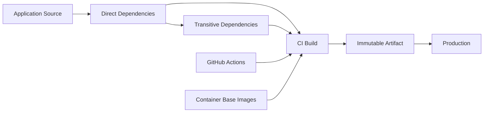
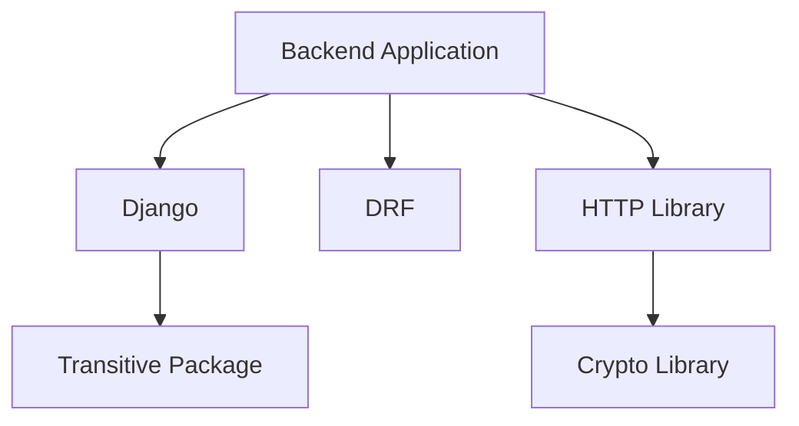
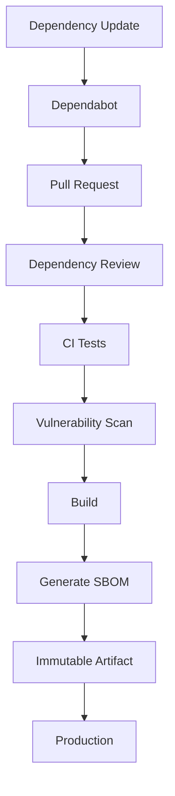

# 17- Dependency Review and Dependabot

## Overview

Dependency management is a core software supply chain concern in GitHub Actions.

A production backend does not depend only on its own source code. It depends on:

```text
Application Code
    ↓
Direct Dependencies
    ↓
Transitive Dependencies
    ↓
Build Tools
    ↓
GitHub Actions
    ↓
Container Base Images
    ↓
Runtime Components
```

For a Python backend, this may include:

```text
Django / FastAPI
    ↓
Pydantic / SQLAlchemy / Celery / Redis Clients
    ↓
Transitive PyPI Packages
    ↓
Python Runtime
    ↓
Docker Base Image
```

GitHub provides two important mechanisms for managing dependency risk:

- **Dependency Review** — evaluates dependency changes introduced by pull requests.
- **Dependabot** — identifies dependency updates and can create pull requests automatically.

They solve different problems.

| Capability | Dependency Review | Dependabot |
|---|---|---|
| Primary purpose | Review dependency changes | Keep dependencies updated |
| Typical trigger | Pull request | Scheduled update process |
| Main question | "What dependency risk is being introduced?" | "Which dependencies should be updated?" |
| Creates PRs | No | Yes |
| Vulnerability awareness | Yes | Yes |
| Version update automation | No | Yes |
| Supply-chain role | Prevent risky changes | Maintain dependency hygiene |

A mature CI/CD pipeline uses both as part of a broader supply chain security strategy.

## Dependency Supply Chain

Dependencies enter a backend system through multiple paths.



Dependency security must therefore cover more than `requirements.txt`.

Important dependency categories include:

- Python packages.
- Node.js packages.
- GitHub Actions.
- Docker base images.
- OS packages.
- Build tools.
- Infrastructure providers.
- Runtime libraries.

## Dependency Review

Dependency Review examines dependency changes introduced by a pull request.

The core model is:

```text
Pull Request
     ↓
Dependency Changes
     ↓
Dependency Review
     ↓
Risk Evaluation
     ↓
Pass / Fail
```

It is particularly useful when a pull request adds or changes dependencies.

### Why Dependency Review Exists

Without dependency review, a pull request could introduce:

```text
Existing Application
       +
New Dependency
       ↓
Unknown Vulnerability
       ↓
Production
```

Dependency Review adds an explicit security checkpoint before the dependency enters the trusted branch.

## What Dependency Review Evaluates

Depending on the ecosystem and configuration, dependency review can identify dependency changes such as:

- Added dependencies.
- Removed dependencies.
- Version changes.
- Known vulnerable dependencies.
- Dependency risk information.

The important engineering question is not simply:

> "Does the dependency have a CVE?"

It is:

> "What changed in the software supply chain, and should this change be allowed into the trusted branch?"

## Dependency Review Workflow

A basic workflow can use the dependency review action:

```yaml
name: Dependency Review

on:
  pull_request:

permissions:
  contents: read

jobs:
  dependency-review:
    runs-on: ubuntu-latest

    steps:
      - name: Dependency review
        uses: actions/dependency-review-action@v4
```

In a production repository, pin third-party actions according to the organization's action-pinning policy.

## Why Dependency Review Belongs on Pull Requests

A pull request is a natural security boundary:

```text
Developer Change
      ↓
Pull Request
      ↓
Dependency Review
      ↓
Security Checks
      ↓
Human Review
      ↓
Protected Branch
```

This prevents dependency changes from becoming trusted simply because the application tests happen to pass.

## Dependency Review vs Vulnerability Scanning

These concepts overlap but are not identical.

### Dependency Review

Focuses on dependency changes associated with a change set.

### Vulnerability Scanning

Looks for known security vulnerabilities in dependencies or artifacts.

A production pipeline can use:

```text
Pull Request
    ↓
Dependency Review
    ↓
Tests
    ↓
Security Scan
    ↓
Build
    ↓
Container Scan
```

Dependency review answers:

```text
"What dependency changed?"
```

Security scanning answers:

```text
"Does the resulting dependency set contain known vulnerabilities?"
```

## Dependency Review Configuration

Dependency review can be configured to enforce organizational policies around dependency risk.

For example, a repository may decide that dependencies with unacceptable severity should block merging.

Conceptually:

```text
Dependency Change
      ↓
Known Vulnerability
      ↓
Severity Evaluation
      ↓
Policy
      ↓
Allow / Reject
```

The threshold should reflect the application's risk profile rather than blindly applying the same rule to every repository.

## Dependabot

Dependabot automates dependency maintenance.

It can:

- Detect outdated dependencies.
- Detect known vulnerabilities.
- Create update pull requests.
- Keep dependencies within configured update policies.
- Update dependency manifests and lock files.
- Help maintain GitHub Actions dependencies.

The normal flow is:

```text
Dependency Update Available
        ↓
Dependabot
        ↓
Pull Request
        ↓
CI
        ↓
Dependency Review
        ↓
Security Scan
        ↓
Tests
        ↓
Review
        ↓
Merge
```

## Dependabot Configuration

A common configuration is:

```yaml
version: 2

updates:
  - package-ecosystem: "pip"
    directory: "/"
    schedule:
      interval: "weekly"

  - package-ecosystem: "github-actions"
    directory: "/"
    schedule:
      interval: "weekly"
```

The exact configuration should match the repository structure and dependency management strategy.

## Python Dependencies

For a Python backend, Dependabot can monitor dependency manifests and lock files.

Common files include:

```text
requirements.txt
requirements-dev.txt
pyproject.toml
poetry.lock
uv.lock
```

A typical backend repository might contain:

```text
pyproject.toml
uv.lock
```

or:

```text
requirements.txt
requirements-dev.txt
```

The dependency-management tool should be consistent with the project's build process.

## GitHub Actions Dependencies

Dependabot can also monitor GitHub Actions references.

For example:

```yaml
steps:
  - uses: actions/checkout@v4
  - uses: actions/setup-python@v5
```

This is important because GitHub Actions are executable dependencies.

A mature dependency-management strategy therefore includes:

```text
Python Dependencies
+
GitHub Actions
+
Container Dependencies
+
OS Dependencies
```

## Dependabot Pull Requests

Dependabot pull requests should pass through the same CI controls as developer-created pull requests.

A useful flow is:

```text
Dependabot PR
    ↓
Lint
    ↓
Unit Tests
    ↓
Integration Tests
    ↓
Dependency Review
    ↓
Security Scan
    ↓
Build
```

Do not automatically merge every Dependabot pull request solely because it was generated by Dependabot.

## Automated Dependency Updates

Automation reduces maintenance effort, but automation does not eliminate risk.

An update may contain:

- Breaking API changes.
- Behavior changes.
- New transitive dependencies.
- New vulnerabilities.
- Runtime incompatibilities.
- Performance regressions.

Therefore:

```text
Automated Update
      ≠
Automatically Safe
```

CI should establish compatibility before merging.

## Grouped Dependency Updates

Large repositories can generate many individual pull requests.

Grouping compatible updates can reduce maintenance overhead.

For example:

```yaml
groups:
  django:
    patterns:
      - "Django*"

  testing:
    patterns:
      - "pytest*"
      - "pytest-*"
```

Grouping should be used carefully.

A group containing many unrelated major upgrades can make failures difficult to diagnose.

## Update Frequency

Dependabot can run on different schedules.

Common strategies include:

| Schedule | Suitable Use |
|---|---|
| Daily | High-security / rapidly changing dependencies |
| Weekly | General backend applications |
| Monthly | Lower-change environments |
| Manual | Highly controlled environments |

The correct frequency depends on:

- Security requirements.
- Application criticality.
- Team capacity.
- Dependency volatility.
- Release frequency.

## Security Updates vs Version Updates

Security updates and routine version updates have different operational characteristics.

### Security Update

A vulnerability has been identified.

The priority is reducing exposure.

### Version Update

A newer version is available without necessarily addressing a security issue.

The priority is controlled maintenance.

Treat security updates with an appropriate response SLA rather than waiting for the normal maintenance cycle.

## Direct vs Transitive Dependencies

Consider:

```text
Application
   ↓
Django
   ↓
asgiref
   ↓
Other Dependency
```

The application directly declares Django, but may indirectly depend on additional packages.

A vulnerability in a transitive dependency can still affect the application.

Therefore dependency review must consider the resolved dependency graph, not only the top-level manifest.

## Dependency Graph

Conceptually:



A vulnerability may exist several levels deep.

## Lock Files

Lock files capture a resolved dependency state.

They improve:

- Reproducibility.
- Build consistency.
- Reviewability.
- Incident investigation.

For example:

```text
pyproject.toml
       ↓
Dependency Constraints
       ↓
uv.lock
       ↓
Exact Resolved Graph
```

Do not treat a lock file as proof that dependencies are secure.

It provides determinism, not security by itself.

## Dependency Update Lifecycle

A production dependency update should follow:

```text
Update Available
      ↓
Automated PR
      ↓
Dependency Review
      ↓
Vulnerability Scan
      ↓
Unit Tests
      ↓
Integration Tests
      ↓
Build
      ↓
Container Scan
      ↓
Review
      ↓
Merge
      ↓
Release
```

## Dependency Review in a Python CI Pipeline

```yaml
name: Python CI

on:
  pull_request:

permissions:
  contents: read

jobs:
  dependency-review:
    runs-on: ubuntu-latest

    steps:
      - name: Review dependency changes
        uses: actions/dependency-review-action@v4

  test:
    runs-on: ubuntu-latest

    steps:
      - name: Checkout
        uses: actions/checkout@v4

      - name: Set up Python
        uses: actions/setup-python@v5
        with:
          python-version: "3.12"

      - name: Install dependencies
        run: |
          python -m pip install --upgrade pip
          pip install -r requirements.txt

      - name: Run tests
        run: pytest
```

In a production repository, action references should follow the organization's SHA-pinning standard.

## Dependabot for Python and Actions

Example:

```yaml
version: 2

updates:
  - package-ecosystem: "pip"
    directory: "/"
    schedule:
      interval: "weekly"

  - package-ecosystem: "github-actions"
    directory: "/"
    schedule:
      interval: "weekly"
```

This allows the same dependency-maintenance mechanism to monitor both application dependencies and workflow dependencies.

## Django Example

A Django application may contain:

```text
Django
djangorestframework
psycopg
celery
redis
gunicorn
```

A dependency update can affect:

- Database behavior.
- Serialization.
- Authentication.
- Task processing.
- Redis connectivity.
- Application startup.
- Production workers.

Therefore dependency updates should run the relevant integration and application tests.

## FastAPI Example

A FastAPI application might use:

```text
fastapi
uvicorn
pydantic
sqlalchemy
asyncpg
redis
```

An update to Pydantic or FastAPI can have transitive effects on:

- Request validation.
- Serialization.
- OpenAPI schemas.
- Dependency injection.
- Async behavior.

Do not rely solely on a successful package installation.

## Dependency Updates and Docker

For containerized applications:

```text
Dependabot
   ↓
Python Dependency Update
   ↓
CI
   ↓
Docker Build
   ↓
Container Scan
   ↓
Artifact
```

The dependency update should be tested against the actual production build path.

A package that works in a local virtual environment may fail in the production container.

## Base Image Updates

Dependabot can also be used for supported container and dependency ecosystems.

Base image updates should be evaluated separately from application dependency updates because they can change:

- OS packages.
- libc behavior.
- OpenSSL.
- Python runtime.
- System libraries.
- Security patches.

Example:

```dockerfile
FROM python:3.12-slim
```

A base image update can affect the entire runtime environment.

## GitHub Actions Updates

GitHub Actions should be treated as dependencies.

For example:

```yaml
uses: actions/checkout@v4
```

An update may affect:

- Runtime behavior.
- Node runtime compatibility.
- Action dependencies.
- Permissions.
- Performance.

Dependabot can create PRs for these changes.

## Action Pinning and Dependabot

There is an operational trade-off between:

```yaml
uses: actions/checkout@v4
```

and:

```yaml
uses: actions/checkout@<commit-sha>
```

SHA pinning improves immutability, while Dependabot can help identify new versions.

A mature process is:

```text
Pinned SHA
   ↓
Dependabot Update
   ↓
Review New SHA
   ↓
CI
   ↓
Merge
```

Do not replace SHA pinning with mutable tags simply to simplify updates.

## Dependency Review and Action Security

Dependency Review focuses primarily on dependency changes, while action security requires additional controls.

Use:

```text
Dependency Review
+
Action Pinning
+
Permissions
+
Third-Party Action Review
+
Supply Chain Controls
```

This prevents treating dependency review as the only supply chain security mechanism.

## Vulnerability Severity

Security tooling may classify vulnerabilities by severity.

Typical categories include:

| Severity | Typical Response |
|---|---|
| Critical | Immediate investigation / remediation |
| High | Rapid remediation |
| Medium | Scheduled remediation |
| Low | Risk-based maintenance |

The exact policy should consider:

- Exploitability.
- Application exposure.
- Runtime usage.
- Internet accessibility.
- Available mitigations.
- Business impact.

A CVE in an unused development-only component does not necessarily carry the same operational risk as an exploitable runtime vulnerability.

## False Positives

Dependency scanners can report vulnerabilities that are not directly exploitable in the application's context.

For example:

```text
Vulnerable Package
      ↓
Application
      ↓
Affected Code Path Not Used
```

Do not blindly suppress findings.

Instead document:

- Why it is considered non-exploitable.
- Which versions are affected.
- Which code paths are involved.
- Who approved the exception.
- When it should be reviewed again.

## Vulnerability Exceptions

Exceptions should be explicit and time-bounded.

Avoid:

```text
Ignore vulnerability permanently
```

Prefer:

```text
Finding
 ↓
Risk Assessment
 ↓
Temporary Exception
 ↓
Owner
 ↓
Expiration
 ↓
Reassessment
```

## Dependabot Configuration Strategy

A repository should configure updates based on:

- Package ecosystem.
- Repository directory.
- Update schedule.
- Grouping.
- Open PR limits.
- Review ownership.
- Security requirements.

Avoid generating hundreds of low-value PRs if the team cannot process them.

## Dependency Ownership

CODEOWNERS can assign dependency-related changes to appropriate reviewers.

For example:

```text
requirements.txt      @backend-team
pyproject.toml        @backend-team
uv.lock               @backend-team
.github/workflows/    @platform-team
Dockerfile            @platform-team
```

This makes dependency ownership explicit.

## Dependency Update Testing

A dependency update should test the behaviors affected by the dependency.

For a Django application:

```text
Dependency Update
      ↓
Unit Tests
      ↓
Django Tests
      ↓
Database Integration Tests
      ↓
API Tests
      ↓
Docker Build
```

For a FastAPI service:

```text
Dependency Update
      ↓
Unit Tests
      ↓
API Tests
      ↓
Async Integration Tests
      ↓
Docker Build
```

## Matrix Testing

Dependency updates can be tested against supported runtime versions.

Example:

```yaml
strategy:
  matrix:
    python-version:
      - "3.11"
      - "3.12"
      - "3.13"
```

This is particularly important for dependency updates that change runtime compatibility.

## Dependency Updates and Databases

Database-related libraries require integration testing.

Examples:

```text
psycopg
asyncpg
SQLAlchemy
Django ORM
```

A dependency update may change:

- Connection behavior.
- Transaction handling.
- SQL generation.
- Async behavior.
- Connection pooling.

Run PostgreSQL integration tests where relevant.

## Dependency Updates and Redis

Redis clients may affect:

- Serialization.
- Connection pooling.
- Timeouts.
- Async behavior.
- Pub/Sub.
- Celery integration.

A version update should therefore run Redis-backed integration tests when those capabilities are production-critical.

## Dependency Updates and Celery

Celery dependencies can affect:

- Broker communication.
- Serialization.
- Task execution.
- Retry behavior.
- Worker startup.

Test both application code and worker execution.

## Dependency Updates and Kafka

Kafka client updates can affect:

- Protocol compatibility.
- Consumer behavior.
- Producer behavior.
- Serialization.
- Retries.
- Offset handling.

Run integration tests against the supported Kafka environment where appropriate.

## Dependency Review in Fork Pull Requests

Fork pull requests have different trust characteristics.

Do not expose privileged secrets simply because dependency review is running.

A safe model is:

```text
Fork PR
   ↓
Untrusted Code
   ↓
Dependency Review
   ↓
Tests Without Production Secrets
```

Privileged deployment should remain isolated.

## Dependency Review and `pull_request_target`

Be particularly careful when combining dependency or code execution with:

```yaml
pull_request_target:
```

This event runs in the context of the base repository.

Never use it to execute arbitrary fork code with privileged repository secrets or production credentials.

The core rule is:

```text
Untrusted Code
+
Privileged Context
=
High-Risk Execution Boundary
```

## Security of Dependabot Pull Requests

Dependabot-generated pull requests are automated changes, but they still modify executable dependency state.

Protect the pipeline with:

- Dependency review.
- Tests.
- Security scans.
- Required checks.
- Branch protection.
- Human review where appropriate.

Automation should reduce maintenance work, not bypass security controls.

## Dependabot and CI Cost

Dependency automation can increase CI usage.

If every update triggers:

```text
Full Matrix
+
Integration Tests
+
E2E Tests
+
Docker Build
```

the cost can become significant.

Use appropriate pipeline tiers:

```text
Fast PR Validation
      ↓
Unit Tests
      ↓
Integration Tests
```

and reserve deeper release-level validation for changes that require it.

## Dependency Update Batching

Batching compatible dependencies can reduce:

- PR volume.
- Review overhead.
- CI cost.

But excessive batching increases failure isolation cost.

A useful principle is:

```text
Small enough to understand
+
Large enough to maintain
```

## Dependency Update Rollback

If a dependency update causes a production regression:

```text
Identify Version
      ↓
Identify Release
      ↓
Rollback Artifact
      ↓
Pin Known-Good Version
      ↓
Open Fix PR
      ↓
Retest
```

Do not manually edit production environments to work around dependency management.

The source and dependency state should remain the system of record.

## Dependency Security in Immutable Builds

A mature pipeline produces:

```text
Commit SHA
   +
Dependency Lock
   +
Build Configuration
   ↓
Immutable Artifact
```

The artifact should then be promoted without rebuilding.

This makes dependency state traceable to production.

## Supply Chain Traceability

For a production image, you should be able to answer:

```text
Which commit produced it?
Which dependencies were installed?
Which dependency versions were resolved?
Which workflow built it?
Which runner built it?
Which action versions were used?
Which security checks passed?
Which environment deployed it?
```

A strong dependency-management process supports this traceability.

## SBOM Integration

Dependency review and Dependabot are complementary to SBOM generation.

```text
Dependency Review
        ↓
PR Dependency Changes

Dependabot
        ↓
Dependency Updates

SBOM
        ↓
Artifact Component Inventory
```

Together they provide visibility before and after the build.

## Dependency Review + Dependabot + SBOM

A mature model is:



## Production Dependency Governance

At organization level, define:

- Supported ecosystems.
- Update schedules.
- Security response times.
- Vulnerability severity policies.
- Dependency ownership.
- Approved registries.
- Action policies.
- Lock-file requirements.
- Exception procedures.
- SBOM requirements.
- Artifact retention.

## Repository Standard

A backend repository can standardize around:

```text
.github/
├── dependabot.yml
└── workflows/
    ├── ci.yml
    ├── dependency-review.yml
    └── security.yml

pyproject.toml
uv.lock
Dockerfile
```

This creates a predictable security baseline across services.

## Enterprise Dependency Architecture

```text
                    Organization
                         │
          ┌──────────────┼──────────────┐
          │              │              │
       Policy        Dependabot      Approved
          │              │           Registries
          │              │              │
          └──────────────┼──────────────┘
                         │
                  Repository
                         │
                 Pull Request
                         │
             ┌───────────┴───────────┐
             │                       │
     Dependency Review          CI Pipeline
             │                       │
             └───────────┬───────────┘
                         │
                    Security Scan
                         │
                       Build
                         │
                       SBOM
                         │
                 Immutable Artifact
```

## Reliability Considerations

Dependency automation should not become a single point of failure.

If Dependabot is unavailable:

- Developers should still be able to update dependencies manually.
- CI should still validate dependency changes.
- Security monitoring should remain available.
- Production deployments should not depend exclusively on automated update generation.

Dependency management should be automated but not operationally fragile.

## High Availability and Dependency Registries

Builds depend on package registries.

A production organization can improve resilience through:

- Internal package proxies.
- Dependency caches.
- Artifact repositories.
- Controlled mirrors.

The objective is:

```text
External Registry Failure
        ↓
Controlled Internal Source
        ↓
Build Continues
```

where the architecture justifies this complexity.

## Disaster Recovery

Dependency recovery requires knowing:

- Which versions were used.
- Where lock files are stored.
- Which artifacts were built.
- Which images were deployed.
- Which registry contains known-good artifacts.

Keep production artifacts long enough to support rollback and incident response.

## Common Mistakes

### Treating Dependabot PRs as Automatically Safe

Dependabot creates updates; it does not guarantee compatibility or security.

**Avoid it by:** running normal CI and appropriate security checks.

### Running Only Dependency Review

Dependency Review does not replace vulnerability scanning.

**Avoid it by:** combining dependency review with security scanning.

### Ignoring Transitive Dependencies

A vulnerability may exist several levels below the direct dependency.

**Avoid it by:** evaluating the resolved dependency graph.

### Updating Dependencies Without Lock Files

Uncontrolled dependency resolution can produce different builds.

**Avoid it by:** using an appropriate lock strategy.

### Using Mutable Action References

```yaml
uses: vendor/action@main
```

creates a moving dependency.

**Avoid it by:** following a verified version/SHA pinning strategy.

### Automatically Merging Every Update

A dependency update can introduce a breaking change.

**Avoid it by:** requiring appropriate tests and review.

### Ignoring Base Images

Updating application packages while leaving an outdated OS base image can leave known vulnerabilities unresolved.

**Avoid it by:** treating base images as dependencies.

### Deploying From a Cache

Caches are optimization mechanisms, not authoritative release artifacts.

**Avoid it by:** producing and promoting immutable artifacts.

### Ignoring Dependency Exceptions

Permanent security exceptions create hidden technical debt.

**Avoid it by:** assigning owners and expiration dates to exceptions.

### Running Privileged Tests on Untrusted Pull Requests

A dependency or test process can execute arbitrary code.

**Avoid it by:** keeping privileged credentials and deployment permissions outside untrusted CI jobs.

## Troubleshooting Dependency Review

**Symptom:** Dependency review fails.

**Possible causes:**

- Newly introduced vulnerable dependency.
- Dependency configuration issue.
- Unexpected manifest change.
- Policy threshold triggered.

**Isolation strategy:**

```text
Review PR Diff
    ↓
Identify Dependency Changes
    ↓
Inspect Resolved Versions
    ↓
Check Security Findings
    ↓
Evaluate Policy
```

**Corrective action:**

- Upgrade dependency.
- Remove unnecessary dependency.
- Replace dependency.
- Document a temporary exception if justified.

**Prevention:**

- Keep dependencies current.
- Use Dependabot.
- Review dependency changes consistently.

## Troubleshooting Dependabot

**Symptom:** Dependabot is not creating expected updates.

**Possible causes:**

- Incorrect ecosystem.
- Incorrect directory.
- Unsupported manifest structure.
- Configuration error.
- Dependency already satisfies the configured policy.
- Update limits or repository configuration.

**Checks:**

```text
.github/dependabot.yml
Dependency Manifest
Lock File
Dependabot Logs / Pull Requests
Repository Configuration
```

**Corrective action:**

Validate the ecosystem and directory configuration and inspect Dependabot's generated diagnostics.

## Troubleshooting Dependency Test Failures

**Symptom:** Dependabot PR fails CI.

**Possible causes:**

- Breaking API.
- Runtime incompatibility.
- Changed transitive dependency.
- Database compatibility issue.
- Changed test behavior.

**Isolation strategy:**

```text
Failing Test
    ↓
Changed Package
    ↓
Transitive Changes
    ↓
Runtime Compatibility
    ↓
Integration Behavior
```

Do not immediately revert the dependency without identifying which contract changed.

## GitHub CLI Operational Checks

List workflow runs:

```bash
gh run list
```

Inspect a run:

```bash
gh run view RUN_ID
```

Inspect logs:

```bash
gh run view RUN_ID --log
```

List repository workflows:

```bash
gh workflow list
```

List repository secrets:

```bash
gh secret list
```

List repository variables:

```bash
gh variable list
```

For Dependabot-specific administration, use GitHub repository settings and API capabilities appropriate to the organization's permissions and policies.

## Production Dependency Pipeline

A production-grade backend pipeline can follow:

```text
Pull Request
     ↓
Dependency Review
     ↓
Lint
     ↓
Unit Tests
     ↓
Integration Tests
     ↓
Security Scan
     ↓
Matrix Tests
     ↓
Docker Build
     ↓
Container Scan
     ↓
SBOM
     ↓
Provenance
     ↓
Immutable Artifact
     ↓
ECR
     ↓
Staging
     ↓
Approval
     ↓
Production
```

Dependabot feeds dependency updates into the same controlled pipeline rather than creating a separate security path.

## Senior-Level Design Principles

### Automate Updates, Not Trust

Dependabot should automate:

```text
Detection
+
PR Creation
```

but trust should still be established through:

```text
Review
+
Tests
+
Security Checks
+
Policy
```

### Dependency Changes Are Code Changes

A package version can change application behavior as significantly as source-code changes.

Treat dependency updates as production code changes.

### Keep the Dependency Graph Observable

A senior engineer should be able to determine:

```text
Application
   ↓
Direct Dependencies
   ↓
Transitive Dependencies
   ↓
Artifact
   ↓
Production
```

without manually reconstructing the information.

### Separate Detection From Enforcement

Use different controls for different jobs:

```text
Dependabot
→ Detect and propose updates

Dependency Review
→ Evaluate PR dependency changes

Security Scanner
→ Detect known vulnerabilities

CI
→ Validate behavior

Production Controls
→ Control deployment
```

### Minimize Dependency Drift

Long-lived dependency drift increases:

- Upgrade complexity.
- Vulnerability exposure.
- Breaking-change risk.
- Operational effort.

Regular small updates are generally easier to reason about than infrequent large upgrades.

## Interview Scenarios

### Scenario: A Dependabot PR Updates Django

Discuss:

- Dependency review.
- Lock-file changes.
- Unit tests.
- Integration tests.
- Python-version matrix.
- Database tests.
- Security scanning.
- Docker build.
- Production artifact promotion.

### Scenario: A Critical Vulnerability Is Found in a Transitive Dependency

Discuss:

```text
Identify Vulnerable Version
        ↓
Determine Dependency Path
        ↓
Find Fixed Version
        ↓
Update Lock File
        ↓
Run Security Checks
        ↓
Rebuild
        ↓
Deploy
        ↓
Verify
```

Also determine whether already-deployed artifacts contain the vulnerable component.

### Scenario: Dependabot Generates Too Many PRs

Discuss:

- Grouping.
- Schedule.
- Open PR limits.
- Dependency ownership.
- Risk-based update strategy.
- Separate security updates from routine updates.

### Scenario: A Dependency Update Passes Tests but Introduces a Production Regression

Discuss:

- Artifact traceability.
- Immutable release.
- Rollback.
- Dependency pinning.
- Incident investigation.
- Regression testing.
- Controlled re-upgrade.

### Scenario: A GitHub Action Has a New Vulnerability

Discuss:

```text
Identify all consumers
        ↓
Identify action versions
        ↓
Update / pin safe revision
        ↓
Run CI
        ↓
Review permissions
        ↓
Check whether privileged credentials were exposed
        ↓
Audit affected runs
```

### Scenario: How Would You Secure a Python Backend's Dependencies?

A strong answer should cover:

- Lock files.
- Dependabot.
- Dependency Review.
- Vulnerability scanning.
- Controlled registries.
- Transitive dependency analysis.
- Docker base-image scanning.
- SBOM.
- Immutable artifacts.
- Provenance.
- CI enforcement.
- Production rollback.

## Key Takeaways

- **Dependency Review** evaluates dependency changes in pull requests, while **Dependabot** automates dependency detection and update pull requests; they are complementary controls.
- Treat Python packages, transitive dependencies, GitHub Actions, Docker base images, and build tools as parts of the same software supply chain.
- Automate dependency updates, but establish trust through dependency review, vulnerability scanning, CI testing, controlled lock files, and appropriate human or policy-based review.
- Connect dependency management to artifact security: record dependency state, generate SBOM/provenance where required, build immutable artifacts, and promote the same artifact through environments.
- Maintain regular, observable dependency updates and a defined response process for vulnerabilities, compromised dependencies, failed upgrades, exceptions, and production rollback.