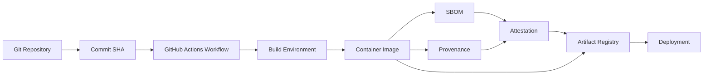
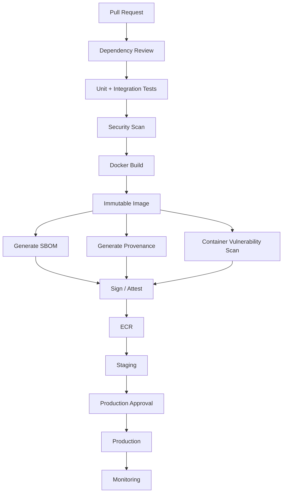
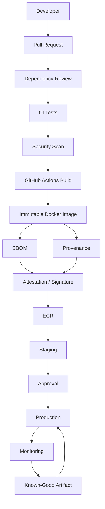

# 18- SBOM and Artifact Provenance

## Overview

Software supply-chain security does not end when CI tests pass. A production pipeline must also establish **what was built, from which source, with which dependencies, by which build process, and whether the resulting artifact can be trusted**.

Two important mechanisms are:

- **Software Bill of Materials (SBOM)** — describes the components contained in an artifact.
- **Artifact provenance** — describes how an artifact was produced and establishes a verifiable relationship between the artifact and its source/build process.

A useful mental model is:

```text
Source Code
    ↓
Dependency Resolution
    ↓
Build Environment
    ↓
Build Process
    ↓
Artifact
    ↓
SBOM + Provenance
    ↓
Registry
    ↓
Deployment
```

For a Python/Docker backend, the resulting artifact may contain:

```text
Application Code
├── Python Runtime
├── Django / FastAPI
├── Direct Dependencies
├── Transitive Dependencies
├── OS Packages
└── Native Libraries
```

An SBOM helps answer:

> What is inside this artifact?

Provenance helps answer:

> How was this artifact produced?

Together they improve:

- Supply-chain visibility.
- Vulnerability response.
- Artifact traceability.
- Incident investigation.
- Release governance.
- Compliance evidence.
- Deployment confidence.

## SBOM

A **Software Bill of Materials** is an inventory of software components associated with an application or artifact.

Conceptually:

```text
Artifact
   ↓
Component Inventory
   ↓
SBOM
```

A typical SBOM may contain:

| Information | Example |
|---|---|
| Component | Django |
| Version | 5.x |
| Ecosystem | PyPI |
| Identifier | Package URL / CPE |
| Dependency relationship | Direct / transitive |
| License | Package license |
| Supplier | Package publisher |
| Hash | Component integrity information |

The exact fields depend on the SBOM format and generation tooling.

## Why SBOMs Exist

Without an SBOM, incident response often requires reconstructing the dependency graph manually.

For example:

```text
Production Image
      ↓
Which packages?
      ↓
Which versions?
      ↓
Which vulnerable component?
      ↓
Which services are affected?
```

With an SBOM:

```text
Production Image
      ↓
SBOM
      ↓
Component Inventory
      ↓
Affected Version
      ↓
Affected Artifact
```

This significantly reduces the time required to identify affected releases.

## SBOM Is Not a Security Scan

An SBOM is an inventory.

It does not automatically mean:

- The components are secure.
- Vulnerabilities have been evaluated.
- The artifact is authentic.
- The build process is trustworthy.

These are separate concerns.

```text
SBOM
→ What is present?

Vulnerability Scanner
→ Is anything known to be vulnerable?

Provenance
→ How was it built?

Signature / Attestation
→ Can the claims be verified?
```

## SBOM Formats

Common SBOM formats include:

- SPDX.
- CycloneDX.

Both can represent software component information, but organizations should standardize on formats supported by their security and compliance tooling.

## SPDX

SPDX is a standardized format for describing software components and licensing information.

It is useful when organizations need structured software inventory and license information.

## CycloneDX

CycloneDX is another widely used SBOM format designed for component and dependency information.

It is commonly used in application and container security workflows.

## SBOM Generation

For a containerized backend, the pipeline can generate an SBOM after the image is built.

Conceptually:

```text
Docker Build
    ↓
Container Image
    ↓
SBOM Generator
    ↓
SBOM
```

The SBOM should describe the artifact that is actually being deployed.

## Example with Syft

A common tool for SBOM generation is Syft.

For example:

```bash
syft my-backend:1.0.0 -o cyclonedx-json > sbom.json
```

The exact tooling can vary by organization.

The important architectural principle is:

```text
Generate SBOM
        ↓
For the exact release artifact
```

rather than generating an unrelated dependency inventory from a developer workstation.

## Python Dependency SBOM

A Python application may contain:

```text
Django
Django REST Framework
Celery
Redis Client
psycopg
Pydantic
```

The SBOM should represent the resolved dependency state used by the build.

For reproducibility:

```text
pyproject.toml
      +
Lock File
      ↓
Resolved Dependency Graph
      ↓
Build
      ↓
Artifact
      ↓
SBOM
```

## Container SBOM

A Docker image contains more than Python packages.

For example:

```text
python:3.12-slim
       ↓
OS Packages
       ↓
Python Runtime
       ↓
Python Packages
       ↓
Application
```

A container SBOM can therefore provide visibility into both application and operating-system components.

## SBOM and Multi-Stage Docker Builds

Consider:

```dockerfile
FROM python:3.12-slim AS builder

WORKDIR /app

COPY pyproject.toml uv.lock ./
RUN pip install --no-cache-dir uv && \
    uv sync --frozen --no-dev

COPY . .

FROM python:3.12-slim

WORKDIR /app

COPY --from=builder /app /app

CMD ["python", "-m", "app"]
```

The final SBOM should describe the **final runtime image**, not merely the builder environment.

This distinction matters because build-time dependencies may not exist in the production image.

## Artifact Provenance

Artifact provenance describes the relationship between:

```text
Source
  ↓
Build
  ↓
Artifact
```

It can capture information such as:

- Source repository.
- Commit or revision.
- Workflow.
- Build invocation.
- Build environment.
- Builder identity.
- Artifact identity.
- Build timestamps.
- Dependency information.
- Build parameters.

The exact contents depend on the provenance format and implementation.

## Why Provenance Matters

Suppose an organization discovers a compromised Docker image.

The investigation needs to answer:

```text
Where did this image come from?
Which commit produced it?
Which workflow built it?
Which repository was used?
Which build identity produced it?
Which artifact was deployed?
```

Provenance creates a machine-readable relationship between the artifact and its build origin.

## SBOM vs Provenance

| Property | SBOM | Provenance |
|---|---|---|
| Main purpose | Component inventory | Build origin/history |
| Answers | What is inside? | How was it produced? |
| Dependency visibility | Yes | Sometimes |
| Source identity | Not primary | Yes |
| Build identity | Not primary | Yes |
| Vulnerability analysis | Supports it | Supports traceability |
| Artifact integrity | Not sufficient alone | Supports verification |
| Incident response | Component identification | Build tracing |

They complement rather than replace each other.

## Artifact Attestations

An attestation is a signed or otherwise verifiable statement associated with an artifact.

Conceptually:

```text
Artifact
   +
Claim
   +
Trusted Identity
   ↓
Attestation
```

An attestation can make statements such as:

```text
"This artifact was built from repository X at commit Y."
```

or:

```text
"This artifact has SBOM Z."
```

The consumer can then verify the claim according to the organization's trust model.

## Provenance Architecture



## Build Integrity

A secure pipeline should establish a chain:

```text
Trusted Source
      ↓
Controlled Workflow
      ↓
Controlled Build
      ↓
Immutable Artifact
      ↓
Verifiable Metadata
      ↓
Controlled Deployment
```

Every transition is a security boundary.

## Source Integrity

Provenance is meaningful only if the source itself is trusted.

Protect:

- Main branches.
- Release branches.
- Workflow files.
- Deployment workflows.
- Reusable workflows.
- Action definitions.

Use appropriate:

- Branch protection.
- Required reviews.
- CODEOWNERS.
- Commit controls.
- Workflow permissions.

## Workflow Integrity

A compromised workflow can produce a compromised artifact.

Therefore:

```text
Artifact Security
    ↓
Workflow Security
    ↓
Action Security
    ↓
Dependency Security
```

Provenance does not make an untrusted build trustworthy by itself.

It makes the build origin observable and verifiable.

## GitHub Actions Build Identity

A GitHub Actions workflow can establish a strong relationship between:

```text
Repository
    ↓
Commit SHA
    ↓
Workflow Run
    ↓
Build
    ↓
Artifact
```

This is particularly useful when artifacts are deployed across multiple environments.

## Immutable Artifacts

An artifact should have an immutable identity.

For Docker:

```text
Repository
    ↓
Image
    ↓
Digest
```

A digest identifies a specific image content.

For example:

```text
123456789012.dkr.ecr.region.amazonaws.com/backend@sha256:<digest>
```

The exact digest is generated by the registry and should be treated as the authoritative artifact identity.

## Tags vs Digests

| Identifier | Behavior |
|---|---|
| `latest` | Mutable |
| `v1.2.3` | Can be mutable unless policy prevents changes |
| Commit SHA tag | Operationally useful but policy-dependent |
| Image digest | Content-addressed identity |

Production deployment should preferably resolve the artifact to an immutable digest.

## Build Once, Promote Many

A secure deployment model is:

```text
Commit
   ↓
Build
   ↓
Image
   ↓
Digest
   ↓
SBOM + Provenance
   ↓
Staging
   ↓
Approval
   ↓
Production
```

Do not rebuild the application independently for staging and production unless the architecture explicitly requires it.

Otherwise:

```text
Build A → Staging
Build B → Production
```

may produce different artifacts.

## Artifact Promotion

A stronger architecture is:

```text
                 ┌───────────┐
                 │   Build   │
                 └─────┬─────┘
                       │
                Immutable Image
                       │
              ┌────────┴────────┐
              │                 │
           Staging          Production
              │                 │
          Validation          Approval
```

The same artifact moves through environments.

## SBOM in the Promotion Pipeline

The SBOM should remain associated with the exact artifact.

```text
Image Digest
     │
     ├── SBOM
     ├── Provenance
     └── Attestation
```

If the artifact changes, its associated metadata must correspond to the new artifact.

## Artifact Signing

Signing can establish artifact authenticity and integrity.

Conceptually:

```text
Build Artifact
      ↓
Hash
      ↓
Signature
      ↓
Registry
      ↓
Deployment Verification
```

The exact signing system depends on organizational tooling.

A signature does not prove that the software is secure. It proves that the artifact corresponds to a trusted signing identity and has not been altered after signing, assuming the trust system is correctly implemented.

## Vulnerability Scanning

SBOM generation should be combined with vulnerability analysis.

```text
Artifact
   ↓
SBOM
   ↓
Vulnerability Database
   ↓
Findings
   ↓
Risk Evaluation
```

For a Docker image:

```text
Docker Image
    ↓
SBOM
    ↓
OS + Python Components
    ↓
Vulnerability Scan
    ↓
Policy
    ↓
Allow / Block
```

## SBOM and Dependency Review

These controls operate at different stages.

```text
Pull Request
    ↓
Dependency Review
    ↓
Build
    ↓
SBOM
    ↓
Vulnerability Scan
    ↓
Artifact
```

Dependency Review evaluates dependency changes before merge.

SBOM describes what exists in the resulting artifact.

## SBOM and Dependabot

Dependabot proposes dependency updates.

The broader flow becomes:

```text
Dependabot
    ↓
Dependency Update PR
    ↓
Dependency Review
    ↓
CI
    ↓
Build
    ↓
SBOM
    ↓
Vulnerability Scan
    ↓
Artifact
```

This provides both proactive maintenance and post-build visibility.

## Python Backend Example

A Python service may use:

```text
FastAPI
Pydantic
SQLAlchemy
asyncpg
Redis
Celery
```

A production pipeline can:

```text
Install Locked Dependencies
        ↓
Run Tests
        ↓
Build Docker Image
        ↓
Generate SBOM
        ↓
Scan Image
        ↓
Generate Provenance
        ↓
Push Image
        ↓
Attach Metadata
        ↓
Deploy
```

## Django Example

For Django:

```text
Django
DRF
Celery
Redis
PostgreSQL Driver
Gunicorn
```

The SBOM helps identify affected production services if a vulnerability is later discovered in one of these components.

## AWS Integration

For AWS deployments, a common architecture is:

```text
GitHub Actions
      ↓
OIDC
      ↓
AWS STS
      ↓
Temporary IAM Role
      ↓
ECR
      ↓
ECS / EKS / EC2 / Lambda
```

The artifact and its metadata should remain traceable from GitHub through ECR and into the deployed environment.

## ECR

For containerized AWS workloads:

```text
GitHub Actions
      ↓
Buildx
      ↓
Docker Image
      ↓
ECR
      ↓
Digest
      ↓
ECS / EKS
```

The deployment system should use the exact artifact intended for production.

## Provenance and ECR

A production system should be able to associate:

```text
ECR Image Digest
      ↓
Source Commit
      ↓
Workflow Run
      ↓
SBOM
      ↓
Build Provenance
```

This enables incident responders to move from a production artifact back to the source and build process.

## Kubernetes

For Kubernetes:

```text
GitHub Actions
      ↓
Container Build
      ↓
SBOM + Provenance
      ↓
Registry
      ↓
Deployment Manifest
      ↓
Kubernetes
```

The deployment manifest should reference an immutable image identity rather than relying solely on a mutable tag.

## Lambda

For Lambda deployments, the artifact may be:

- ZIP package.
- Container image.

The same principles apply:

```text
Source
 ↓
Build
 ↓
Artifact
 ↓
SBOM
 ↓
Provenance
 ↓
Deployment
```

The SBOM format and tooling should match the actual artifact type.

## Infrastructure as Code

Infrastructure code can also participate in the supply chain.

For example:

```text
Terraform
CloudFormation
Docker
Application Code
```

A mature CI/CD system should track which source revision and workflow produced infrastructure changes.

## Reproducible Builds

A reproducible build aims to produce equivalent artifacts from the same source and build inputs.

Important factors include:

- Locked dependencies.
- Controlled build tools.
- Deterministic build configuration.
- Stable base images.
- Controlled timestamps where applicable.
- Controlled external downloads.

Reproducibility improves:

- Incident investigation.
- Debugging.
- Verification.
- Rollback confidence.

## Build Environment Security

The build environment must be treated as a trusted execution boundary.

Protect against:

- Malicious dependencies.
- Compromised actions.
- Secret theft.
- Untrusted pull-request code.
- Network-based dependency substitution.
- Artifact poisoning.

GitHub-hosted runners provide isolation characteristics, while self-hosted runners require additional operational controls.

## Self-Hosted Runners

Self-hosted runners require particular care because the build environment may have:

- Persistent files.
- Cached credentials.
- Network access.
- Cloud credentials.
- Docker socket access.
- Internal service access.

For untrusted code:

```text
Untrusted PR
    ↓
Persistent Privileged Runner
    ↓
High Blast Radius
```

Prefer isolated or ephemeral runners where the workload and threat model justify them.

## OIDC and Provenance

GitHub Actions can use OIDC to authenticate to AWS without storing long-lived AWS access keys.

```yaml
permissions:
  contents: read
  id-token: write
```

The workflow can then exchange its OIDC identity for temporary AWS credentials.

This reduces long-lived credential exposure and improves workload identity.

## Provenance and Least Privilege

Provenance does not replace least privilege.

A workflow should still use:

```yaml
permissions:
  contents: read
```

and grant additional permissions only where required.

For deployment jobs:

```yaml
permissions:
  contents: read
  id-token: write
```

The exact permissions should match the workflow's responsibilities.

## Production Pipeline

A production-grade supply-chain pipeline can look like:



## Artifact Metadata Model

A useful production model is:

```text
Artifact
├── Image Digest
├── Source Commit
├── Build Workflow
├── Build Run
├── Builder Identity
├── SBOM
├── Provenance
├── Security Findings
└── Signature / Attestation
```

This creates a traceability graph around the artifact.

## Monitoring

Monitor the supply chain for:

- New critical vulnerabilities.
- Invalid or missing attestations.
- Unexpected artifact changes.
- Dependency drift.
- Failed signature verification.
- Unauthorized publishing.
- Suspicious workflow executions.
- Unexpected image provenance.

Operational dashboards can track:

```text
Build Success Rate
Dependency Update Age
Critical Vulnerability Count
Unsigned Artifact Count
Deployment Rollback Count
Artifact Age
```

## Incident Response

Suppose a vulnerability is discovered in a package.

The response should be:

```text
Vulnerability
     ↓
Identify Component
     ↓
Search SBOM Inventory
     ↓
Identify Affected Artifacts
     ↓
Identify Production Deployments
     ↓
Identify Source / Build
     ↓
Patch Dependency
     ↓
Rebuild
     ↓
Scan
     ↓
Generate New Metadata
     ↓
Deploy
```

SBOM significantly reduces the discovery phase.

## Compromised Dependency

If a dependency is compromised:

```text
Compromised Package
       ↓
SBOM Search
       ↓
Affected Images
       ↓
Affected Deployments
       ↓
Build History
       ↓
Credential / Secret Exposure Assessment
       ↓
Rebuild
       ↓
Redeploy
```

If malicious code may have executed in CI, investigate the runner and credentials used by the affected workflow.

## Compromised Build

If the build environment is compromised, rebuilding from the same compromised environment is not sufficient.

Investigate:

- Workflow changes.
- Action versions.
- Runner state.
- Credentials.
- OIDC role usage.
- Registry activity.
- Source changes.
- Artifact publishing events.

Then establish a known-good build environment before rebuilding.

## Artifact Poisoning

Artifact poisoning occurs when an attacker causes a malicious artifact to be accepted as legitimate.

Controls include:

- Immutable artifact identities.
- Protected registries.
- Least-privilege publishing.
- Provenance.
- Attestations.
- Signatures.
- Deployment verification.
- Build isolation.

## Artifact Promotion Security

A production deployment should verify that:

```text
Requested Artifact
       =
Approved Artifact
```

rather than rebuilding or resolving a mutable tag.

## Environment Protection

Production deployment can require:

- Required reviewers.
- Protected environments.
- Branch restrictions.
- Deployment concurrency.
- Artifact verification.

A useful flow is:

```text
Artifact
   ↓
Staging
   ↓
Validation
   ↓
Approval
   ↓
Production
```

## Rollback

Rollback should reference a previously verified artifact.

```text
Current Artifact
      ↓
Incident
      ↓
Select Known-Good Digest
      ↓
Deploy
      ↓
Health Validation
```

Do not rebuild an old commit during an emergency unless necessary.

Use the previously built artifact whenever possible.

## Reliability

Supply-chain security should not unnecessarily reduce deployment reliability.

Maintain:

- Known-good artifacts.
- Artifact retention.
- Registry redundancy where required.
- Dependency caches or proxies where justified.
- Documented rollback procedures.
- Recovery procedures for build-system failures.

## Disaster Recovery

For CI/CD recovery, retain enough metadata to reconstruct:

```text
Source
+
Dependencies
+
Build Configuration
+
Artifact
+
SBOM
+
Provenance
```

If GitHub Actions is temporarily unavailable, organizations with strict recovery requirements may need an alternate build or recovery path.

## Cost Considerations

SBOM and provenance generation adds processing and storage overhead.

Costs may include:

- Additional CI execution.
- Artifact storage.
- SBOM storage.
- Registry storage.
- Vulnerability scanning.
- Attestation/signing infrastructure.

Keep the process efficient by generating metadata once per immutable artifact rather than repeatedly rebuilding the same artifact.

## Performance Considerations

Supply-chain tooling should not unnecessarily duplicate work.

Prefer:

```text
Build Once
   ↓
Generate Metadata Once
   ↓
Scan Once
   ↓
Promote Artifact
```

instead of:

```text
Build Staging
Scan
Build Production
Scan
Build Another Environment
Scan
```

unless environmental differences require separate artifacts.

## Common Mistakes

### Treating an SBOM as Proof of Security

An SBOM is an inventory, not a security guarantee.

**Avoid it by:** combining SBOMs with vulnerability scanning, provenance, signatures, and policy.

### Generating an SBOM From the Wrong Environment

A workstation-generated SBOM may not represent the deployed artifact.

**Avoid it by:** generating the SBOM from the exact build artifact.

### Generating an SBOM Only for Source Dependencies

Container images may contain OS-level components.

**Avoid it by:** generating an artifact-level SBOM appropriate to the deployed artifact.

### Rebuilding for Every Environment

This creates artifact drift.

**Avoid it by:** building once and promoting the immutable artifact.

### Using Mutable Docker Tags for Production

A tag can point to different image content over time.

**Avoid it by:** resolving production deployments to immutable digests.

### Assuming Provenance Means the Build Is Secure

A provenance record can accurately describe an insecure build.

**Avoid it by:** securing source, workflows, actions, runners, dependencies, and credentials.

### Running Privileged Builds for Forks

Untrusted code may execute with privileged credentials.

**Avoid it by:** separating untrusted validation from privileged deployment.

### Keeping Long-Lived Cloud Credentials in CI

Long-lived credentials increase blast radius.

**Avoid it by:** using OIDC and short-lived AWS credentials.

### Signing Every Artifact Without Verification Policy

Signatures are useful only when consumers verify them against a trusted identity.

**Avoid it by:** defining explicit signing and verification policies.

## Troubleshooting SBOM Generation

**Symptom:** SBOM is missing expected components.

**Possible causes:**

- Generated from the wrong filesystem.
- Generated from the builder instead of the final image.
- Package manager metadata unavailable.
- Unsupported dependency format.

**Isolation strategy:**

```text
Identify Artifact Digest
        ↓
Inspect Final Image
        ↓
Run SBOM Tool Against Exact Artifact
        ↓
Compare With Lock File
        ↓
Inspect Missing Component
```

**Corrective action:**

Generate the SBOM from the exact production artifact using tooling appropriate for the artifact type.

**Prevention:**

Make SBOM generation a standard build-stage control.

## Troubleshooting Provenance

**Symptom:** Provenance cannot be verified.

**Possible causes:**

- Missing attestation.
- Incorrect artifact identity.
- Trust configuration problem.
- Build metadata mismatch.
- Artifact was rebuilt after metadata generation.

**Checks:**

```text
Artifact Digest
Source Commit
Workflow Run
Attestation
Signing Identity
Registry Artifact
```

The artifact identity must match the identity referenced by the metadata.

## Troubleshooting Registry Metadata

**Symptom:** SBOM or provenance is associated with the wrong image.

**Possible causes:**

- Mutable tag used instead of digest.
- Artifact rebuilt.
- Metadata generated before final image changes.
- Registry association error.

**Corrective action:**

Use immutable artifact identities and generate metadata against the final artifact.

## GitHub CLI Operational Checks

Inspect workflow runs:

```bash
gh run list
```

Inspect a specific run:

```bash
gh run view RUN_ID
```

View logs:

```bash
gh run view RUN_ID --log
```

List workflows:

```bash
gh workflow list
```

Run a workflow manually:

```bash
gh workflow run WORKFLOW_NAME
```

The CLI should be used to inspect the CI/CD process, while artifact-specific verification should use the registry and supply-chain tools adopted by the organization.

## Production Checklist

### Source

- [ ] Protected production branches.
- [ ] CODEOWNERS for critical workflows.
- [ ] Dependency changes reviewed.
- [ ] Workflow changes reviewed.

### Dependencies

- [ ] Lock files used where appropriate.
- [ ] Dependabot configured.
- [ ] Dependency Review enabled.
- [ ] Vulnerability scanning enabled.
- [ ] Transitive dependencies evaluated.

### Build

- [ ] Trusted build environment.
- [ ] Least-privilege workflow permissions.
- [ ] Third-party actions controlled.
- [ ] Actions pinned according to policy.
- [ ] Build inputs are controlled.
- [ ] Secrets are protected.

### Artifact

- [ ] Immutable artifact identity.
- [ ] SBOM generated.
- [ ] Provenance generated.
- [ ] Vulnerability scan completed.
- [ ] Attestation/signature policy defined.
- [ ] Artifact stored in controlled registry.

### Deployment

- [ ] Same artifact promoted across environments.
- [ ] Production uses immutable artifact identity.
- [ ] Environment protection configured.
- [ ] Deployment concurrency configured.
- [ ] Rollback artifact retained.
- [ ] Deployment verification implemented.

### Operations

- [ ] Artifact traceability available.
- [ ] Vulnerability response process documented.
- [ ] Incident response covers build compromise.
- [ ] Artifact retention supports rollback.
- [ ] Supply-chain monitoring is available.

## Senior-Level Design Principles

### Treat the Artifact as a Security Boundary

The artifact is the unit that ultimately reaches production.

Therefore security metadata should follow the artifact:

```text
Artifact
  ├── SBOM
  ├── Provenance
  ├── Vulnerability Results
  └── Signature / Attestation
```

### Make Production Deterministic

Production should deploy:

```text
Known Source
+
Known Dependencies
+
Known Build
+
Known Artifact
```

rather than resolving dependencies or rebuilding software during deployment.

### Build Metadata Once

Metadata should correspond to the immutable artifact actually being deployed.

### Make Incident Response Queryable

A security team should be able to answer:

```text
Which production artifacts contain package X?
```

and:

```text
Which workflow produced artifact Y?
```

without manually examining every repository.

### Separate Artifact Identity From Human-Friendly Tags

Use tags for operational usability and immutable digests for artifact identity.

### Secure the Entire Chain

```text
Source
 ↓
Dependencies
 ↓
Workflow
 ↓
Actions
 ↓
Runner
 ↓
Build
 ↓
Artifact
 ↓
Registry
 ↓
Deployment
```

Securing only one stage does not establish end-to-end supply-chain security.

## Interview Scenarios

### Scenario: A Critical CVE Is Announced

Explain how you would determine which production services are affected.

A strong approach is:

```text
CVE
 ↓
Affected Component
 ↓
SBOM Search
 ↓
Affected Artifacts
 ↓
Production Deployments
 ↓
Patch
 ↓
Rebuild
 ↓
Rescan
 ↓
Redeploy
```

### Scenario: Why Is an SBOM Needed If We Already Have `requirements.txt`?

A strong answer should distinguish:

```text
requirements.txt
→ Declared application dependencies

Lock File
→ Resolved dependency state

SBOM
→ Components actually associated with the artifact
```

A container SBOM can also include OS-level components not represented by the Python dependency file.

### Scenario: Why Do We Need Provenance?

Explain that an SBOM tells you what is present, while provenance helps establish where an artifact came from and how it was built.

### Scenario: Why Not Rebuild the Image During Production Deployment?

Because rebuilding can produce a different artifact.

The safer model is:

```text
Build
 ↓
Immutable Artifact
 ↓
Staging
 ↓
Approval
 ↓
Production
```

### Scenario: How Would You Secure a Docker Image Pipeline?

Discuss:

- Locked dependencies.
- Trusted base images.
- Dependency Review.
- Vulnerability scanning.
- Buildx.
- SBOM.
- Provenance.
- Image signing/attestation.
- Immutable digests.
- ECR.
- OIDC.
- Least privilege.
- Environment protection.
- Rollback.

### Scenario: How Would You Investigate a Compromised Production Image?

Trace:

```text
Production Image Digest
        ↓
Registry
        ↓
Provenance
        ↓
Workflow Run
        ↓
Commit
        ↓
Dependencies
        ↓
Actions
        ↓
Runner
```

Then determine whether credentials, secrets, or other artifacts could have been exposed.

## Reference Architecture



This architecture establishes a traceable path from source to production artifact while keeping dependency analysis, build metadata, artifact integrity, and deployment controls connected.

## Key Takeaways

- **SBOMs answer what is inside an artifact; provenance helps answer how and from where the artifact was produced.**
- Generate SBOMs and provenance for the **exact immutable artifact** that will be deployed, not for an unrelated source tree or build environment.
- Combine SBOMs with Dependency Review, Dependabot, vulnerability scanning, artifact attestations/signatures, least-privilege CI, and trusted build environments.
- Prefer **build once, promote many** using immutable artifact identities so staging and production receive the same verified artifact.
- Design CI/CD so production artifacts can be traced back to their source commit, dependencies, workflow, build environment, security metadata, and deployment history.