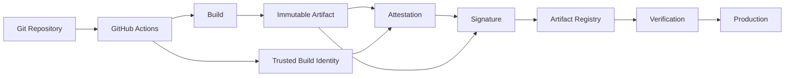
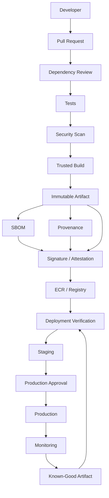

# 19- Artifact Attestations and Signing

## Overview

Artifact signing and attestations extend software supply-chain security beyond simply building and scanning an artifact.

A production CI/CD system should be able to establish:

```text
Source Code
    ↓
Trusted Build
    ↓
Artifact
    ↓
Signature / Attestation
    ↓
Registry
    ↓
Deployment Verification
```

These mechanisms help answer different questions:

| Mechanism | Primary Question |
|---|---|
| SBOM | What components are inside the artifact? |
| Provenance | How and from where was the artifact built? |
| Attestation | What verifiable claim is associated with the artifact? |
| Signature | Which trusted identity signed the artifact? |
| Vulnerability Scan | Does the artifact contain known vulnerabilities? |

They should be treated as complementary controls rather than substitutes.

For a Python/Django/FastAPI application packaged as a Docker image, a production pipeline can establish:

```text
Git Commit
   ↓
GitHub Actions
   ↓
Docker Build
   ↓
Image Digest
   ├── SBOM
   ├── Build Provenance
   ├── Security Results
   └── Signature / Attestation
   ↓
ECR
   ↓
Staging
   ↓
Production
```

The objective is not merely to sign software. The objective is to create a **verifiable chain of trust from source to production**.

## Artifact Integrity

An artifact is the concrete output of a build.

Examples include:

- Docker images.
- Python packages.
- ZIP deployment packages.
- Compiled binaries.
- Terraform modules.
- Release archives.

Artifact integrity means being able to detect whether the artifact changed after it was produced.

A simplified model is:

```text
Artifact
    ↓
Hash
    ↓
Identity
```

For container images, the content-addressed digest identifies the image content.

```text
registry.example.com/backend@sha256:<digest>
```

If the content changes, the digest changes.

## Why Artifact Signing Exists

Consider a deployment pipeline:

```text
Build
  ↓
Registry
  ↓
Production
```

Without verification, the deployment system may only know:

```text
"Use image backend:latest"
```

A mutable tag does not establish which exact artifact should be deployed.

Signing and verification introduce a stronger model:

```text
Artifact
   ↓
Signed Identity
   ↓
Verification
   ↓
Deployment
```

The deployment system can enforce that only artifacts satisfying the required trust policy are accepted.

## Hashing vs Signing

These concepts are related but different.

### Hash

A hash identifies content.

```text
Artifact
   ↓
SHA-256
   ↓
Digest
```

If the content changes, the digest changes.

### Digital Signature

A signature associates an artifact or claim with a signing identity.

Conceptually:

```text
Artifact
   ↓
Hash
   ↓
Private Key
   ↓
Signature
```

A verifier uses the corresponding public key or trusted identity to validate the signature.

A signature therefore provides more than a checksum.

## What Signing Provides

Depending on the trust model, signing can provide:

- Artifact integrity.
- Signing identity.
- Authenticity of the signing claim.
- Tamper detection after signing.

Signing does **not** automatically prove:

- The source code is secure.
- Dependencies are safe.
- The build process was uncompromised.
- The artifact contains no vulnerabilities.
- The signer itself should be trusted.

This distinction is critical.

## Attestations

An attestation is a verifiable statement associated with an artifact.

Conceptually:

```text
Artifact
    +
Statement
    +
Identity
    ↓
Attestation
```

For example:

```text
Artifact X
was built from
repository Y
at commit Z
using workflow W
```

Another attestation may associate:

```text
Artifact X
    ↓
SBOM
```

Attestations allow metadata and claims to travel with the artifact.

## Provenance Attestation

Build provenance describes how an artifact was produced.

Typical information may include:

- Source repository.
- Source revision.
- Build workflow.
- Builder.
- Build invocation.
- Artifact identity.
- Build environment.
- Build metadata.

The exact fields depend on the provenance format and implementation.

A useful model is:

```text
Repository
    ↓
Commit SHA
    ↓
Workflow Run
    ↓
Build
    ↓
Artifact Digest
```

Provenance connects these objects.

## SBOM Attestation

An SBOM can also be associated with an artifact through an attestation.

```text
Docker Image
     ↓
SBOM
     ↓
Attestation
```

This allows consumers to establish which SBOM belongs to which artifact.

## Signing vs Attestation

| Concept | Purpose |
|---|---|
| Signature | Establishes a trusted signing relationship |
| Attestation | Carries a verifiable statement about an artifact |
| Provenance | Describes artifact origin/build process |
| SBOM | Describes artifact components |

A signed attestation can combine these concepts:

```text
Artifact
   ↓
Attestation
   ↓
Signed Claim
```

## Trust Model

Signing is useful only when the verifier knows which identities are trusted.

A production trust model therefore includes:

```text
Signer
   ↓
Trusted Identity
   ↓
Verification Policy
   ↓
Artifact
   ↓
Deployment
```

For example, a deployment policy might require:

```text
Artifact must:
- originate from the approved repository
- be built by the approved workflow
- have valid provenance
- have a trusted signature
- pass vulnerability policy
```

## Key-Based Signing

Traditional artifact signing can use asymmetric cryptography.

```text
                Private Key
                    │
Artifact ──────────┤
                    ↓
                Signature
                    │
                    ↓
                  Registry
                    │
                    ↓
             Public Key
                    │
                    ↓
               Verification
```

The private key must remain protected.

If the private signing key is compromised, an attacker may be able to produce artifacts that appear legitimate.

## Key Management

Signing keys require controls such as:

- Restricted access.
- Rotation.
- Secure storage.
- Audit logging.
- Separation of duties.
- Emergency revocation procedures.

Avoid storing long-lived private signing keys directly in workflow YAML or source control.

## Keyless Signing

Modern CI/CD systems can also use identity-based or keyless signing approaches.

Instead of managing a long-lived private key in the repository:

```text
GitHub Actions Identity
       ↓
Trusted Identity
       ↓
Signing Operation
       ↓
Artifact
```

This can reduce key-management overhead and improve identity traceability.

The exact implementation depends on the signing infrastructure and trust system adopted by the organization.

## GitHub Actions Identity

GitHub Actions can establish workload identity using OIDC.

A workflow can request an OIDC token:

```yaml
permissions:
  contents: read
  id-token: write
```

The identity can then be used with supported external systems.

For AWS, the flow is commonly:

```text
GitHub Actions
      ↓
OIDC Token
      ↓
AWS STS
      ↓
Temporary IAM Role
      ↓
AWS Resource
```

The same identity model can support controlled artifact operations when the external signing or registry architecture supports it.

## Signing Architecture



## Artifact Identity

The most important artifact identity should be immutable.

For Docker:

```text
backend:latest
```

is human-friendly but mutable.

A digest is content-addressed:

```text
backend@sha256:<digest>
```

A production deployment should prefer immutable identities.

## Tags vs Digests vs Signatures

| Mechanism | Main Purpose | Mutable? |
|---|---|---|
| `latest` | Convenience | Yes |
| Semantic tag | Human-readable release | Potentially |
| Commit tag | Traceability | Policy-dependent |
| Digest | Exact content identity | No |
| Signature | Authenticity/integrity claim | Associated with artifact |

A strong deployment model combines them:

```text
Release Tag
    ↓
Image Digest
    ↓
Signature
    ↓
Attestation
```

## Attestation Lifecycle

```text
Build
  ↓
Artifact Created
  ↓
Artifact Digest Determined
  ↓
Metadata Generated
  ↓
Attestation Created
  ↓
Attestation Signed
  ↓
Registry
  ↓
Verification
  ↓
Deployment
```

Attestations must correspond to the final artifact identity.

## Build Once, Promote Many

Signing is most useful when the same artifact is promoted through environments.

```text
Commit
   ↓
Build
   ↓
Image
   ↓
Sign
   ↓
Attest
   ↓
Staging
   ↓
Approval
   ↓
Production
```

Avoid:

```text
Build → Staging
Build → Production
```

because the second build can produce different artifact content.

## Production Promotion

A production pipeline can enforce:

```text
Artifact Exists
      ↓
Signature Valid
      ↓
Provenance Valid
      ↓
SBOM Present
      ↓
Security Policy Passed
      ↓
Staging Validated
      ↓
Production Approval
      ↓
Deploy
```

This makes production deployment an artifact verification operation rather than simply a build operation.

## Docker Signing

For containerized backend applications, signing should be performed against the immutable image identity.

Conceptually:

```text
Docker Build
    ↓
Image Digest
    ↓
Sign Digest
    ↓
Push / Store Metadata
```

Do not sign an arbitrary mutable tag and assume that the tag will permanently refer to the signed content.

## AWS ECR Architecture

A common AWS flow is:

```text
GitHub Actions
      ↓
OIDC
      ↓
STS
      ↓
IAM Role
      ↓
ECR
      ↓
Image Digest
      ↓
Deployment
```

The build role should have only the permissions required to publish artifacts.

A deployment role should be separated where practical.

## ECR and Immutable Artifact Promotion

A mature pipeline can use:

```text
Build Account / CI
       ↓
ECR Artifact
       ↓
Staging
       ↓
Production
```

The same image digest should be promoted rather than rebuilt.

This reduces artifact drift and simplifies incident response.

## Kubernetes Verification

For Kubernetes:

```text
Image Digest
      ↓
Signature Verification
      ↓
Admission Policy
      ↓
Pod Creation
```

A cluster can enforce policies requiring trusted images before workloads are admitted.

The exact admission mechanism depends on the Kubernetes security tooling adopted by the organization.

## ECS Verification

For ECS:

```text
Signed Image
      ↓
ECR
      ↓
Task Definition
      ↓
ECS Deployment
```

Verification requirements should be integrated into the deployment architecture rather than treated as an informal operational check.

## Lambda Verification

For Lambda container images:

```text
Build
 ↓
Image
 ↓
Sign / Attest
 ↓
Registry
 ↓
Lambda
```

For ZIP-based Lambda deployments, signing and artifact verification can be applied to the deployment package according to the organization's chosen artifact-signing model.

## Python Backend Example

A production FastAPI service may use:

```text
FastAPI
Pydantic
SQLAlchemy
asyncpg
Redis
Celery
```

The pipeline can produce:

```text
Source Commit
    ↓
Dependency Resolution
    ↓
Unit Tests
    ↓
Integration Tests
    ↓
Docker Build
    ↓
Image Digest
    ↓
SBOM
    ↓
Provenance
    ↓
Signature
    ↓
ECR
    ↓
Staging
    ↓
Production
```

The signature should identify the exact image being promoted.

## Django Example

For Django:

```text
Django
DRF
PostgreSQL
Redis
Celery
Gunicorn
```

The image can be:

```text
backend@sha256:<digest>
```

with associated:

```text
SBOM
Provenance
Security Results
Signature
```

The deployment system then promotes that exact artifact.

## GitHub Actions Workflow Structure

A simplified build pipeline can be structured as:

```yaml
name: Build and Release

on:
  push:
    branches:
      - main

permissions:
  contents: read
  id-token: write
  packages: write

jobs:
  build:
    runs-on: ubuntu-latest

    steps:
      - name: Checkout
        uses: actions/checkout@v4

      - name: Build image
        run: |
          docker build \
            -t backend:${GITHUB_SHA} \
            .

      - name: Inspect image
        run: |
          docker image inspect backend:${GITHUB_SHA}
```

The signing and attestation mechanism should be added after the final artifact identity is established.

In production, third-party action references should follow the organization's version and SHA-pinning policy.

## GitHub Artifact Attestations

GitHub Actions supports artifact attestation workflows for establishing provenance around build outputs.

A typical conceptual flow is:

```text
GitHub Actions
      ↓
Build Artifact
      ↓
Generate Provenance Attestation
      ↓
Artifact
```

The exact action, permissions, artifact type, and verification workflow should follow the GitHub Actions capabilities and organizational security policy in use.

## Provenance Verification

A verifier should be able to establish:

```text
Artifact
   ↓
Provenance
   ↓
Repository
   ↓
Commit
   ↓
Workflow
```

A useful verification policy might require:

- Approved repository.
- Approved branch or workflow.
- Approved builder identity.
- Valid artifact identity.
- Valid attestation.
- Required security checks.

## Trust Policy

A production deployment policy can be expressed conceptually as:

```text
ALLOW deployment
IF

artifact signature is valid
AND
signing identity is trusted
AND
provenance is valid
AND
source repository is approved
AND
workflow is approved
AND
artifact passed required security checks
```

This is stronger than simply checking whether an image exists in a registry.

## Admission Control

Artifact verification can be performed before deployment.

```text
Registry
   ↓
Verification
   ↓
Policy
   ↓
Deployment
```

For Kubernetes, this can be integrated into admission control.

For other platforms, the equivalent control can live in the deployment workflow or release system.

## Artifact Verification Failure

If verification fails:

```text
Deployment Request
       ↓
Signature Check
       ↓
FAIL
       ↓
Deployment Blocked
```

Do not silently fall back to deploying the unsigned artifact.

A verification failure should be observable and actionable.

## Revocation and Key Rotation

Signing identities can become compromised.

An operational process should support:

```text
Compromised Identity
      ↓
Disable / Revoke
      ↓
Identify Affected Artifacts
      ↓
Re-sign Trusted Artifacts
      ↓
Update Verification Policy
      ↓
Redeploy Where Required
```

The exact revocation mechanism depends on the signing technology.

## Compromised Signing Key

If a private signing key is compromised:

1. Stop trusting new signatures from the affected identity.
2. Determine when the compromise occurred.
3. Identify artifacts signed during the affected period.
4. Investigate build and registry activity.
5. Rotate or revoke the identity.
6. Rebuild affected artifacts from a known-good source.
7. Generate new signatures and attestations.
8. Redeploy trusted artifacts.

A valid signature does not prove that the signing key was uncompromised at the time.

## Compromised Build Environment

If the runner is compromised:

```text
Build
 ↓
Artifact
 ↓
Signature
```

the artifact may still receive a valid signature even though its contents are malicious.

Therefore signing must be combined with:

- Trusted build environments.
- Protected workflows.
- Least-privilege credentials.
- Dependency security.
- Source protection.
- Runner isolation.

## Compromised Third-Party Action

A malicious or compromised GitHub Action can execute code in the build environment.

Protect the pipeline with:

- SHA pinning.
- Trusted action sources.
- Least-privilege `GITHUB_TOKEN`.
- Minimal secrets.
- OIDC instead of long-lived credentials.
- Ephemeral runners.
- Action allowlists.
- Reusable workflow governance.

## Fork Pull Requests

Fork pull requests are untrusted execution contexts.

Do not give arbitrary fork code access to:

- Signing credentials.
- Production AWS roles.
- Registry publishing credentials.
- Production secrets.

A safer model is:

```text
Fork PR
   ↓
Untrusted CI
   ↓
Tests / Review
```

while:

```text
Trusted Branch
   ↓
Privileged Build
   ↓
Signing
   ↓
Production Artifact
```

remains a separate trust boundary.

## `pull_request_target`

`pull_request_target` requires particular caution because it executes in the context of the base repository.

Avoid combining:

```text
pull_request_target
+
Checkout of untrusted fork code
+
Privileged credentials
```

This can create a path for untrusted code to access trusted capabilities.

## Secrets and Signing

Signing credentials are high-value secrets.

Do not:

```yaml
env:
  SIGNING_KEY: ${{ secrets.SIGNING_KEY }}
```

unless the signing architecture explicitly requires it and the key is properly protected.

Prefer short-lived identity-based signing where supported.

## OIDC and Signing

OIDC can reduce the need for long-lived signing credentials.

Conceptually:

```text
GitHub Actions
      ↓
OIDC Identity
      ↓
Trusted Signing Service
      ↓
Signature
```

This creates a stronger relationship between the workflow identity and the signature.

## SBOM + Provenance + Signing

A complete supply-chain model is:

```text
                    Artifact
                       │
          ┌────────────┼────────────┐
          │            │            │
         SBOM      Provenance    Signature
          │            │            │
          └────────────┼────────────┘
                       │
                 Verification
                       │
                  Deployment
```

Each mechanism answers a different security question.

## Vulnerability Scanning

Signing should not bypass vulnerability scanning.

A signed artifact can contain a critical vulnerability.

A secure pipeline therefore uses:

```text
Build
 ↓
SBOM
 ↓
Vulnerability Scan
 ↓
Provenance
 ↓
Signature
 ↓
Policy
 ↓
Deploy
```

The exact ordering can vary, but all required controls must operate on the same artifact identity.

## Security Policy

A mature deployment policy may require:

| Control | Requirement |
|---|---|
| Immutable identity | Required |
| SBOM | Required |
| Provenance | Required |
| Signature | Required |
| Vulnerability scan | Required |
| Trusted source | Required |
| Approved workflow | Required |
| Production approval | Required |

The policy should be explicit rather than depending on manual conventions.

## Artifact Registry Security

The registry should protect:

- Artifact publishing.
- Artifact deletion.
- Metadata modification.
- Access credentials.
- Repository permissions.

Use least privilege.

For example:

```text
Build Role
→ Push images

Deploy Role
→ Pull images / deploy

Developer Role
→ Read artifacts where required
```

Do not give every CI job write access to every production registry.

## Separation of Duties

Separate responsibilities where practical:

```text
CI Build Role
    ↓
Build + Publish

Deployment Role
    ↓
Deploy Approved Artifact

Security Policy
    ↓
Verify Artifact
```

This limits the blast radius of a compromised job.

## High Availability

Signing infrastructure can become part of the release critical path.

For high-availability environments, consider:

- Reliable signing services.
- Registry availability.
- Artifact retention.
- Recovery of signing metadata.
- Documented emergency procedures.

Do not remove verification controls simply because signing infrastructure is temporarily unavailable.

## Disaster Recovery

Retain enough information to reconstruct artifact trust:

```text
Artifact
+
Digest
+
SBOM
+
Provenance
+
Signature / Attestation
+
Source Commit
```

Known-good signed artifacts should remain available for rollback.

## Cost Considerations

Signing and attestation generally add less operational cost than repeated builds and extensive scanning, but costs can arise from:

- CI execution.
- Artifact storage.
- Registry metadata.
- Signing services.
- Verification infrastructure.
- SBOM storage.

Generate metadata once for each immutable artifact and promote that artifact instead of rebuilding it.

## Performance Considerations

Do not repeatedly rebuild or sign the same artifact for each environment.

Prefer:

```text
Build Once
   ↓
Scan Once
   ↓
Generate Metadata Once
   ↓
Sign Once
   ↓
Promote Many
```

This reduces CI execution time and artifact drift.

## Monitoring

Monitor:

- Signature verification failures.
- Missing attestations.
- Invalid provenance.
- Unexpected signing identities.
- Registry publishing activity.
- Artifact digest changes.
- Failed deployments caused by policy.
- Signing infrastructure failures.

Useful operational metrics include:

```text
Unsigned Artifact Count
Invalid Attestation Count
Verification Failure Count
Artifact Promotion Failures
Signing Failure Rate
Build-to-Deploy Traceability
```

## Incident Response

When an artifact is suspected of compromise:

```text
Production Artifact
       ↓
Digest
       ↓
Signature
       ↓
Signer Identity
       ↓
Provenance
       ↓
Workflow
       ↓
Commit
       ↓
Dependencies
```

This allows the investigation to move backward through the supply chain.

## Supply-Chain Incident Example

Suppose a production image contains malicious code.

Investigate:

1. Image digest.
2. Signature and signer.
3. Provenance.
4. Workflow run.
5. Commit SHA.
6. Workflow changes.
7. Third-party actions.
8. Dependencies.
9. Runner activity.
10. Registry activity.
11. Credentials available to the build.

Then:

```text
Known-Good Source
      ↓
Clean Build Environment
      ↓
Rebuild
      ↓
Scan
      ↓
Generate Metadata
      ↓
Sign
      ↓
Deploy
```

## Common Mistakes

### Signing Mutable Tags

Signing:

```text
backend:latest
```

without anchoring the signature to immutable content creates ambiguity.

**Avoid it by:** signing and verifying the exact artifact digest.

### Treating Signatures as Vulnerability Scans

A valid signature does not mean the artifact is vulnerability-free.

**Avoid it by:** combining signing with SBOM generation and vulnerability scanning.

### Storing Long-Lived Signing Keys in CI

A compromised runner could expose the private key.

**Avoid it by:** using protected signing infrastructure and identity-based mechanisms where possible.

### Signing Before the Final Artifact Is Created

If the image changes after signing, the signature no longer corresponds to the final artifact.

**Avoid it by:** signing the final immutable artifact.

### Trusting Any Valid Signature

A valid signature from an unauthorized identity is not sufficient.

**Avoid it by:** enforcing trusted identity and provenance policies.

### Rebuilding Between Environments

A newly built production image may differ from the signed staging image.

**Avoid it by:** promoting the same signed artifact.

### Giving Signing Credentials to Pull Request Jobs

Untrusted code can potentially access privileged signing capabilities.

**Avoid it by:** isolating signing to trusted branches or protected deployment workflows.

### Ignoring Workflow Integrity

A compromised workflow can generate a validly signed malicious artifact.

**Avoid it by:** protecting workflow files, actions, runners, and permissions.

### Deploying When Verification Fails

A failed verification should not silently fall back to an unverified artifact.

**Avoid it by:** making verification a deployment gate.

## Troubleshooting Signature Verification

**Symptom:** Deployment rejects an artifact signature.

**Possible causes:**

- Wrong artifact digest.
- Unknown signer.
- Invalid signature.
- Expired or revoked identity.
- Registry metadata mismatch.
- Verification policy mismatch.

**Isolation strategy:**

```text
Artifact Digest
      ↓
Signature
      ↓
Signer Identity
      ↓
Trust Policy
      ↓
Registry Metadata
```

**Corrective action:**

Verify that the signature was created for the exact artifact being deployed and that the signing identity is trusted.

**Prevention:**

- Use immutable artifact identities.
- Standardize signing.
- Automate verification.
- Monitor trust-policy changes.

## Troubleshooting Attestations

**Symptom:** Provenance or SBOM attestation cannot be verified.

**Possible causes:**

- Attestation missing.
- Wrong artifact digest.
- Incorrect subject identity.
- Metadata generated for an earlier artifact.
- Trust configuration problem.

**Checks:**

```text
Artifact Digest
Source Commit
Workflow Run
Attestation Subject
Signing Identity
Registry
```

All artifact references must point to the same immutable artifact.

## Troubleshooting OIDC-Based Signing

**Symptom:** Signing workflow cannot obtain an identity token.

**Possible causes:**

- Missing `id-token: write`.
- Incorrect trust configuration.
- Incorrect repository or environment restrictions.
- Invalid signing-service configuration.

Check:

```yaml
permissions:
  contents: read
  id-token: write
```

Then verify the trust relationship between GitHub Actions and the external signing service.

## Troubleshooting Registry Publishing

**Symptom:** Image pushes successfully but signature or attestation is unavailable.

**Possible causes:**

- Metadata was attached to a different digest.
- Registry permissions are insufficient.
- Artifact was retagged.
- Signing occurred before the final push.
- Registry does not support the expected metadata workflow.

**Isolation strategy:**

```text
Local Artifact
    ↓
Digest
    ↓
Registry Digest
    ↓
Signature / Attestation
```

The digest must remain consistent across each stage.

## GitHub CLI Operational Checks

List workflows:

```bash
gh workflow list
```

List workflow runs:

```bash
gh run list
```

Inspect a run:

```bash
gh run view RUN_ID
```

Inspect logs:

```bash
gh run view RUN_ID --log
```

Run a workflow manually:

```bash
gh workflow run WORKFLOW_NAME
```

These commands are useful for tracing the GitHub Actions build that produced an artifact.

Artifact-specific verification should use the registry and signing tools adopted by the organization.

## Production Checklist

### Source

- [ ] Production branches are protected.
- [ ] Workflow files have appropriate ownership.
- [ ] Critical workflow changes require review.
- [ ] Dependency changes are reviewed.

### Build

- [ ] Build runs in a trusted environment.
- [ ] Workflow permissions follow least privilege.
- [ ] Third-party actions are controlled.
- [ ] Signing is isolated from untrusted pull requests.
- [ ] OIDC is used where appropriate.

### Artifact

- [ ] Artifact has an immutable identity.
- [ ] Image digest is recorded.
- [ ] SBOM is generated.
- [ ] Provenance is generated.
- [ ] Vulnerability scanning is performed.
- [ ] Artifact is signed or attested.
- [ ] Signing identity is trusted.

### Verification

- [ ] Signature verification is automated.
- [ ] Provenance verification is automated.
- [ ] SBOM presence is enforced where required.
- [ ] Verification failures block deployment.
- [ ] Trusted repositories and workflows are defined.

### Deployment

- [ ] Same artifact is promoted across environments.
- [ ] Production uses immutable artifact identity.
- [ ] Production approval is configured.
- [ ] Deployment concurrency is controlled.
- [ ] Known-good signed artifacts are retained for rollback.

### Operations

- [ ] Signing failures are monitored.
- [ ] Verification failures are monitored.
- [ ] Signing identities can be rotated or revoked.
- [ ] Artifact provenance can be traced to source.
- [ ] Incident response includes signing and build compromise.

## Senior-Level Design Principles

### Sign the Artifact, Not the Environment

The artifact should be the stable trust unit.

```text
Build
 ↓
Immutable Artifact
 ↓
Signature
 ↓
Promotion
```

Environments should consume the verified artifact rather than creating new versions of it.

### Identity Matters as Much as Integrity

A digest can prove content identity.

A signature can establish a signing relationship.

A trust policy determines whether that signing identity is acceptable.

Therefore:

```text
Integrity
+
Identity
+
Policy
```

form the basis of artifact verification.

### Provenance and Signing Solve Different Problems

Provenance tells you:

```text
Where did this artifact come from?
```

Signing helps establish:

```text
Who or what made this claim?
```

They should be used together.

### Keep the Trust Chain Small

Avoid giving a large number of workflows access to signing capabilities.

Prefer:

```text
Untrusted CI
   ↓
Validation
   ↓
Trusted Build
   ↓
Signing
   ↓
Production
```

This reduces blast radius.

### Verify at the Deployment Boundary

Build-time signing is useful, but production deployment should also enforce verification.

```text
Registry
   ↓
Verify
   ↓
Policy
   ↓
Deploy
```

This prevents an unverified artifact from entering production even if earlier controls failed.

### Make Rollback Trustable

Rollback should deploy a previously verified artifact:

```text
Known-Good Digest
      ↓
Verify
      ↓
Deploy
```

Do not rebuild during an emergency unless necessary.

## Interview Scenarios

### Scenario: Why Do We Need Artifact Signing If Docker Already Provides Digests?

A strong answer should distinguish:

```text
Digest
→ Identifies exact artifact content.

Signature
→ Associates the artifact with a trusted signing identity.
```

A digest alone does not establish who produced the artifact.

### Scenario: What Is the Difference Between an SBOM and Provenance?

Explain:

```text
SBOM
→ What components are present?

Provenance
→ How and from where was the artifact built?
```

Neither replaces the other.

### Scenario: Why Should Production Use an Image Digest?

Because tags can move.

```text
backend:latest
```

may refer to different image contents over time.

A digest identifies the exact content:

```text
backend@sha256:<digest>
```

### Scenario: What Happens If the Signing Key Is Compromised?

Discuss:

- Stop trusting the affected identity.
- Determine compromise scope.
- Identify affected artifacts.
- Investigate signing activity.
- Rotate or revoke the key.
- Rebuild affected artifacts.
- Generate new metadata.
- Re-sign.
- Redeploy.
- Review the trust policy.

### Scenario: Can a Malicious Artifact Have a Valid Signature?

Yes.

If the trusted build environment or signing identity is compromised, a malicious artifact may receive a valid signature.

Therefore signing must be combined with:

- Secure source control.
- Protected workflows.
- Trusted runners.
- Dependency security.
- Least privilege.
- Provenance.
- Vulnerability scanning.

### Scenario: How Would You Secure a GitHub Actions Docker Pipeline?

A strong architecture includes:

```text
Pull Request
   ↓
Dependency Review
   ↓
Tests
   ↓
Security Scan
   ↓
Trusted Build
   ↓
Immutable Image
   ↓
SBOM
   ↓
Provenance
   ↓
Signature
   ↓
ECR
   ↓
Staging
   ↓
Verification
   ↓
Production
```

### Scenario: How Would You Prevent an Untrusted Pull Request From Using Signing Credentials?

Separate trust domains:

```text
Fork / Untrusted PR
        ↓
Unprivileged CI
```

and:

```text
Protected Branch
        ↓
Trusted Build
        ↓
Signing
        ↓
Production
```

Signing capabilities should not be exposed to arbitrary code.

### Scenario: How Would You Implement Artifact Verification in Kubernetes?

Discuss:

```text
Image
 ↓
Signature Verification
 ↓
Trusted Identity
 ↓
Provenance Policy
 ↓
Admission Control
 ↓
Pod
```

The exact implementation depends on the cluster's security tooling.

## Reference Architecture



The architecture creates a chain from source to production:

```text
Source
  ↓
Trusted Build
  ↓
Immutable Artifact
  ↓
SBOM
  ↓
Provenance
  ↓
Signature
  ↓
Verification
  ↓
Deployment
```

The key senior-level design principle is that **production should consume verifiable artifacts rather than trusting mutable references or rebuilding software during deployment**.

## Key Takeaways

- **Artifact signing establishes a verifiable relationship between an artifact and a trusted signing identity; attestations carry verifiable claims such as provenance or SBOM information.**
- Use immutable artifact identities, preferably digests for container images, and verify signatures and attestations at the deployment boundary.
- Signing does not prove that software is secure; combine signatures with secure source control, trusted builds, dependency controls, SBOMs, vulnerability scanning, provenance, and least-privilege CI.
- Keep signing capabilities isolated from untrusted pull requests and prefer short-lived identity-based mechanisms such as OIDC where supported.
- Build once, generate metadata once, sign the exact artifact once, and promote that verified artifact through staging and production without rebuilding.