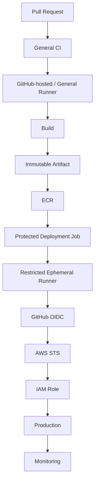

# 20- Runner Security

## Overview

GitHub Actions runners are the execution environments where workflow jobs actually run. Every command, action, test, dependency installation, Docker build, deployment script, and custom tool executes on a runner.

This makes runner security a critical part of CI/CD security.

A useful mental model is:

```text
Workflow
    ↓
Job
    ↓
Runner
    ↓
Steps / Actions
    ↓
Commands
    ↓
Files + Credentials + Network
```

If malicious or compromised code executes on a runner, it may attempt to access:

- Source code.
- `GITHUB_TOKEN`.
- Environment variables.
- Secrets.
- Temporary files.
- Build artifacts.
- Docker credentials.
- Cloud credentials.
- SSH credentials.
- Internal services.
- Private networks.

Runner security is therefore not simply an infrastructure-hardening concern. It is a security boundary connecting source code, CI/CD execution, credentials, build systems, and deployment infrastructure.

A production-grade runner strategy should answer:

```text
Who can execute code?
        ↓
Where does it execute?
        ↓
What credentials are available?
        ↓
What network can it reach?
        ↓
What persistent state remains?
        ↓
What happens if the runner is compromised?
```

## Runner Security Model

The goal is to minimize the capabilities available to any individual job.

A secure execution environment should provide only:

```text
Required Source
+
Required Tools
+
Required Credentials
+
Required Permissions
+
Required Network Access
```

The four most important principles are:

1. **Least privilege** — give the workflow only the permissions and credentials it needs.
2. **Isolation** — separate workloads with different trust levels.
3. **Ephemerality** — avoid persistent state when practical.
4. **Controlled connectivity** — restrict network access to required destinations.

## Runner Types

| Runner Type | Main Characteristics | Primary Security Consideration |
|---|---|---|
| GitHub-hosted | Managed execution environment | Limited infrastructure control |
| Persistent self-hosted | Organization-managed long-lived machine | Residual state and host compromise |
| Ephemeral self-hosted | Fresh runner per workload | Stronger isolation with more infrastructure |
| Specialized private runner | Access to private infrastructure | Larger network blast radius |

Runner selection should be based on trust boundaries and workload requirements, not only convenience.

## GitHub-Hosted Runners

GitHub-hosted runners are managed execution environments provided for GitHub Actions jobs.

Example:

```yaml
jobs:
  test:
    runs-on: ubuntu-latest

    steps:
      - name: Checkout
        uses: actions/checkout@v4

      - name: Install dependencies
        run: pip install -r requirements.txt

      - name: Run tests
        run: pytest
```

They are useful for general CI workloads because the organization does not need to maintain the underlying host.

### Advantages

- Minimal infrastructure management.
- Standardized environments.
- Easy horizontal scaling.
- Clean execution environments.
- Multiple operating systems and runner configurations.
- Good fit for ordinary build and test workloads.

### Limitations

They may not satisfy workloads requiring:

- Private corporate networks.
- Specialized internal software.
- Custom hardware.
- Highly customized operating systems.
- Persistent local state.

When private infrastructure access is required, self-hosted runners may be appropriate.

## Self-Hosted Runners

A self-hosted runner is infrastructure managed by the organization.

It provides greater control over:

- Operating system.
- Installed software.
- Network connectivity.
- Hardware.
- Private infrastructure access.
- Runner lifecycle.
- Security controls.

However, this also transfers security responsibility to the organization.

The organization must manage:

- Operating-system patching.
- Runner software updates.
- Network security.
- Host hardening.
- Credential protection.
- Monitoring.
- Isolation.
- Malware protection.
- Runner registration.
- Lifecycle management.

A self-hosted runner should therefore be treated as production infrastructure.

## Persistent vs Ephemeral Runners

The most important distinction is whether runner state survives between jobs.

### Persistent Runner

```text
Job A
  ↓
Runner
  ↓
Job B
  ↓
Same Runner
  ↓
Job C
```

Files, caches, Docker layers, temporary credentials, or modified tools may survive between jobs.

### Ephemeral Runner

```text
Job A
  ↓
Fresh Runner
  ↓
Destroy

Job B
  ↓
Fresh Runner
  ↓
Destroy
```

Ephemeral execution reduces cross-job contamination and simplifies recovery after compromise.

## Runner Isolation

Isolation controls how much one workload can affect another.

A simplified hierarchy is:

```text
Repository
    ↓
Workflow
    ↓
Job
    ↓
Runner
    ↓
Container
    ↓
Process
```

Each layer can establish a security boundary.

However, containers do not eliminate the need to secure the underlying runner.

## Threat Model

Runner threats include:

- Malicious pull requests.
- Compromised dependencies.
- Malicious third-party actions.
- Compromised actions.
- Shell injection.
- Malicious build scripts.
- Malicious Docker images.
- Credential theft.
- Artifact poisoning.
- Network exploitation.
- Persistence on self-hosted machines.

The most important security question is:

> What can an attacker access if arbitrary code executing in this job becomes malicious?

## Runner Blast Radius

Consider a runner with:

```text
AWS credentials
Docker socket
Private network access
SSH keys
Production secrets
Persistent filesystem
```

A compromise may expose multiple systems.

A more restricted architecture is:

```text
Ephemeral Runner
+
Minimal Permissions
+
OIDC
+
Restricted Network
+
Immutable Artifact
```

The second design limits what a compromised workload can reach.

## `GITHUB_TOKEN`

GitHub Actions provides a `GITHUB_TOKEN` to workflows according to configured permissions.

Do not assume the token should have broad access.

Prefer:

```yaml
permissions:
  contents: read
```

and add only the permissions required by the job.

For example:

```yaml
permissions:
  contents: read
  id-token: write
```

may be appropriate for a deployment job using AWS OIDC.

## Job-Level Permissions

Different jobs often have different security requirements.

```yaml
jobs:
  test:
    permissions:
      contents: read

    runs-on: ubuntu-latest

    steps:
      - uses: actions/checkout@v4
      - run: pytest

  deploy:
    permissions:
      contents: read
      id-token: write

    runs-on: ubuntu-latest

    steps:
      - name: Authenticate with AWS
        run: ./scripts/aws-login.sh

      - name: Deploy
        run: ./scripts/deploy.sh
```

This prevents ordinary test jobs from automatically receiving deployment-related privileges.

## Runner Credentials

Avoid placing long-lived credentials directly on runner machines.

Poor architecture:

```text
Runner
 ├── AWS Access Key
 ├── AWS Secret Key
 ├── SSH Private Key
 ├── Registry Password
 └── Production Credentials
```

Prefer:

```text
Runner
    ↓
Short-Lived Identity
    ↓
Target System
```

For AWS, GitHub OIDC can provide temporary credentials through STS.

## OIDC Runner Authentication

A common AWS flow is:

```text
GitHub Actions Job
       ↓
GitHub OIDC Token
       ↓
AWS STS
       ↓
IAM Role
       ↓
Temporary Credentials
       ↓
AWS Resource
```

The workflow needs:

```yaml
permissions:
  contents: read
  id-token: write
```

The IAM trust policy should restrict which GitHub identities can assume the role.

This is preferable to storing long-lived AWS access keys in repository or runner configuration.

## Self-Hosted Runner Registration

Runner registration is a privileged infrastructure operation.

Protect:

- Registration credentials.
- Runner configuration.
- Runner service files.
- Runner labels.
- Runner groups.
- Host access.

Registration credentials should never be:

- Committed to Git.
- Printed in logs.
- Passed through untrusted workflow input.
- Stored in application configuration unnecessarily.

## Runner Labels

Labels allow jobs to select appropriate runners.

Example:

```yaml
jobs:
  integration:
    runs-on:
      - self-hosted
      - linux
      - private-network
```

Labels should correspond to meaningful capabilities or trust boundaries.

Avoid assigning broad labels without understanding their implications.

For example:

```text
production
```

should not merely mean "this machine happens to deploy production." It should represent a deliberately restricted execution capability.

## Runner Groups

Runner groups provide another layer of access control.

A useful organizational model is:

```text
Organization
│
├── General CI Runners
│
├── Private Network Runners
│
└── Production Deployment Runners
```

Sensitive runner groups should be available only to approved repositories and workflows.

## Production Deployment Runners

Deployment workloads often have access to:

- AWS.
- Kubernetes.
- Production APIs.
- Private networks.
- Container registries.
- Infrastructure-management systems.

They should therefore be separated from ordinary CI workloads.

Prefer:

```text
General CI
    ↓
General Runner

Production Deployment
    ↓
Restricted Deployment Runner
```

rather than:

```text
All Workflows
    ↓
One Highly Privileged Runner
```

## Runner Network Access

Network access is a privilege.

A runner may require access to:

```text
GitHub
Package Registry
AWS
PostgreSQL
Redis
Kafka
Internal APIs
Kubernetes API
```

It should not automatically receive unrestricted access to every network.

## Private Network Access

Self-hosted runners are frequently used because they can access private services.

Example:

```text
GitHub Actions
       ↓
Self-Hosted Runner
       ↓
Private VPC
       ├── PostgreSQL
       ├── Redis
       ├── Internal API
       └── Kubernetes
```

This is useful for integration testing and deployment, but it increases the consequences of runner compromise.

## Network Segmentation

Separate sensitive networks where practical.

```text
General CI Network
       │
       X
       │
Production Network
       │
Restricted Runner
       │
       ↓
Production Services
```

A deployment runner should reach only the services required for deployment.

## Egress Control

Outbound network access matters as much as inbound access.

A compromised job may attempt to exfiltrate:

- Source code.
- Secrets.
- Cloud tokens.
- Build artifacts.
- Environment information.

Restrict outbound access when practical.

For example, a controlled CI environment may allow access to:

```text
GitHub
PyPI / Internal Package Proxy
Container Registry
Approved AWS Endpoints
```

while blocking unrelated destinations.

## Dependency Installation

Python workflows commonly install dependencies:

```bash
pip install -r requirements.txt
```

This requires network access to a package repository.

A restricted runner should allow only approved dependency sources where possible.

Enterprise environments may use internal package proxies or artifact repositories to reduce dependency risk.

## Persistent Runner Risks

Persistent runners may retain:

- Workspace files.
- Build outputs.
- Dependency caches.
- Docker layers.
- Temporary credentials.
- Debug files.
- Modified binaries.
- Logs.

For example:

```text
Job A
    ↓
Writes /tmp/config.json
    ↓
Job completes
    ↓
Job B
    ↓
Reads leftover file
```

Cleanup can reduce this risk, but cleanup itself may fail.

## Workspace Cleanup

Persistent runners should remove unnecessary state from:

- Workspace directories.
- Temporary directories.
- Generated credentials.
- Docker resources.
- Build artifacts.
- Tool caches.

However:

```text
Cleanup
```

is weaker than:

```text
Destroy and recreate
```

because cleanup may miss files, hidden state, modified tooling, or host-level persistence.

## Ephemeral Runners

An ephemeral runner exists for a limited workload and is then destroyed.

A typical lifecycle is:

```text
Job Queued
    ↓
Provision Runner
    ↓
Register
    ↓
Execute Job
    ↓
Collect Required Results
    ↓
Deregister
    ↓
Destroy
```

Ephemeral runners are particularly valuable for:

- Untrusted workloads.
- Sensitive builds.
- Production deployment.
- Private-network access.
- Short-lived credentials.

## Ephemeral Runner Autoscaling

Large organizations can dynamically provision runners based on workload demand.

```text
Workflow Queue
      ↓
Autoscaler
      ↓
Provision Runner
      ↓
Execute Job
      ↓
Destroy Runner
```

This provides:

- Better isolation.
- Elastic capacity.
- Reduced idle infrastructure.
- Easier replacement after compromise.

The trade-off is additional infrastructure complexity.

## Runner Strategy Comparison

| Strategy | Isolation | Customization | Operational Complexity | Typical Use |
|---|---:|---:|---:|---|
| GitHub-hosted | High | Low/Medium | Low | General CI |
| Persistent self-hosted | Low/Medium | High | Medium | Specialized workloads |
| Ephemeral self-hosted | High | High | High | Sensitive/private workloads |
| Autoscaled ephemeral | High | High | High | Enterprise CI/CD |

The correct choice depends on workload trust, network requirements, security requirements, and operational maturity.

## Docker on Runners

Docker is commonly used to build backend applications.

```yaml
steps:
  - name: Build image
    run: docker build -t backend:${GITHUB_SHA} .
```

Docker introduces additional security considerations.

## Docker Socket Risk

A runner exposing:

```text
/var/run/docker.sock
```

provides powerful access to the Docker daemon.

If untrusted code can access the socket, it may be able to interact with host-level resources.

Do not give Docker daemon access to jobs that do not need it.

## Docker-in-Docker

Docker-in-Docker introduces additional complexity around:

- Privileged containers.
- Storage.
- Networking.
- Isolation.
- Performance.
- Lifecycle management.

Use the simplest supported build architecture that satisfies the workload.

## Containerized Jobs

Jobs can execute inside containers:

```yaml
jobs:
  test:
    runs-on: ubuntu-latest

    container:
      image: python:3.12-slim

    steps:
      - name: Checkout
        uses: actions/checkout@v4

      - name: Install dependencies
        run: pip install -r requirements.txt

      - name: Run tests
        run: pytest
```

This improves environment consistency but does not make the host irrelevant.

The runner host remains part of the security boundary.

## Service Containers

Integration tests may require PostgreSQL or Redis.

```yaml
jobs:
  integration:
    runs-on: ubuntu-latest

    services:
      postgres:
        image: postgres:16
        env:
          POSTGRES_PASSWORD: postgres
        options: >-
          --health-cmd "pg_isready -U postgres"
          --health-interval 10s
          --health-timeout 5s
          --health-retries 5

      redis:
        image: redis:7

    steps:
      - uses: actions/checkout@v4

      - run: pip install -r requirements.txt

      - run: pytest tests/integration
```

Service containers provide useful test isolation, but the runner still controls their lifecycle.

## Kubernetes Runner Security

Kubernetes-based runner infrastructure introduces additional boundaries:

```text
Kubernetes Cluster
       ↓
Runner Namespace
       ↓
Runner Pod
       ↓
Job
```

Controls should include:

- Dedicated namespaces.
- Restricted service accounts.
- Network policies.
- Pod security.
- Restricted container privileges.
- Limited Kubernetes API access.
- Controlled secrets.

Avoid granting:

```text
cluster-admin
```

to ordinary CI workloads.

## Kubernetes Service Accounts

A runner pod should use a dedicated service account with minimum required permissions.

```text
Runner Pod
    ↓
Service Account
    ↓
Kubernetes API
```

The runner should not inherit broad cluster privileges simply because it needs to deploy one application.

## AWS Runner Security

A self-hosted runner in AWS may have access to:

```text
VPC
 ├── ECR
 ├── ECS
 ├── EKS
 ├── RDS
 └── Internal APIs
```

Controls should combine:

- IAM.
- OIDC.
- Security groups.
- Private subnets.
- Restricted routes.
- VPC endpoints where useful.
- Controlled egress.

## EC2 Self-Hosted Runners

If runners run on EC2, protect:

- Instance metadata.
- IAM instance profiles.
- Security groups.
- SSH access.
- Root access.
- Runner configuration.
- Local disk.
- Registration credentials.

Prefer workload identity through GitHub OIDC where practical instead of broad EC2 instance-profile credentials.

## Instance Metadata

A compromised workload on an EC2 runner may attempt to access instance metadata.

Use appropriate EC2 metadata protections, including IMDSv2, and minimize permissions attached to the instance role.

A runner should not have a powerful instance profile simply because one deployment job requires access to AWS.

## Runner and AWS IAM

Separate identities by workload.

```text
Test Runner
    ↓
Read-only AWS role

Build Runner
    ↓
ECR push role

Deployment Runner
    ↓
Restricted deployment role
```

Avoid using one broad IAM role for all CI/CD operations.

## Secrets on Runners

A runner should receive only the secrets required for the current job.

Prefer:

```text
Unit Tests
→ No production secrets

Integration Tests
→ Test database credentials

Deployment
→ Temporary deployment identity
```

Avoid:

```text
Every Job
→ Every Repository Secret
```

## Environment Protection

Production deployments should use protected environments where appropriate.

```yaml
jobs:
  deploy:
    environment: production
```

Environment protection can provide:

- Required reviewers.
- Deployment restrictions.
- Environment-specific secrets.
- Deployment history.

This creates an additional control boundary around production operations.

## Untrusted Pull Requests

Fork-based pull requests should be treated as untrusted execution.

Potential attack path:

```text
Attacker
    ↓
Fork Repository
    ↓
Malicious Source / Workflow Input
    ↓
Runner
    ↓
Credential or Network Access
```

The safe default is:

```text
Untrusted PR
    ↓
Minimal Permissions
    ↓
No Production Credentials
    ↓
Validation Only
```

## `pull_request` Security

For normal pull requests:

```yaml
on:
  pull_request:
```

the workflow should assume that source changes may be attacker-controlled.

Keep privileged operations separate from the untrusted validation workflow.

## `pull_request_target` Security

`pull_request_target` executes in the context of the base repository and therefore requires particular caution.

The dangerous pattern is:

```text
pull_request_target
        +
checkout attacker-controlled code
        +
production secrets
        +
privileged token
```

This can turn untrusted source into privileged code execution.

Privileged workflows should avoid executing arbitrary code from untrusted pull requests.

## Third-Party Actions

Actions are executable software.

This:

```yaml
uses: vendor/action@v1
```

should therefore be treated as a software dependency rather than passive configuration.

Security controls include:

- Trusted action sources.
- SHA pinning.
- Minimal permissions.
- Minimal secrets.
- Dependency review.
- Version management.
- Security monitoring.

## Action Dependency Chains

A third-party action may depend on:

- Node packages.
- Python packages.
- Docker images.
- Other actions.
- External services.

The effective trust chain is:

```text
Workflow
   ↓
Action
   ↓
Action Dependencies
   ↓
Runtime
   ↓
External Resources
```

The runner is where this entire chain executes.

## SHA Pinning

For sensitive workflows, pin actions to reviewed immutable commits.

```yaml
uses: actions/checkout@<verified-sha>
```

Pinning reduces the risk associated with mutable tags.

It does not guarantee the pinned code is secure. The pinned revision must still be reviewed and updated through controlled dependency-management processes.

## Shell Injection

Runner security also depends on how workflow input is passed to shell commands.

Avoid directly embedding attacker-controlled values into shell commands.

Instead of:

```yaml
run: echo "${{ github.event.pull_request.title }}"
```

prefer passing the value through the environment:

```yaml
env:
  PR_TITLE: ${{ github.event.pull_request.title }}

run: |
  printf '%s\n' "$PR_TITLE"
```

The same concern applies to:

- Pull request titles.
- Branch names.
- Commit messages.
- Issue content.
- Workflow inputs.
- Repository dispatch payloads.

## Python Subprocess Security

Python code executed in CI must also treat workflow-derived values as untrusted.

Avoid:

```python
import os
import subprocess

branch = os.environ["BRANCH"]

subprocess.run(
    f"git checkout {branch}",
    shell=True,
    check=True,
)
```

Prefer argument lists:

```python
import os
import subprocess

branch = os.environ["BRANCH"]

subprocess.run(
    ["git", "checkout", branch],
    check=True,
)
```

Validate values according to the expected input format before using them.

## Dependency Installation Security

Dependency installation can execute package build or installation logic.

For example:

```bash
pip install -r requirements.txt
```

should therefore be considered part of the runner threat model.

A secure CI system should combine:

```text
Dependency Management
+
Dependency Scanning
+
Trusted Registries
+
Runner Isolation
```

## Cache Security

Caches may contain:

- Dependencies.
- Build outputs.
- Compiled files.
- Tool state.

A cache created by untrusted code can potentially influence later jobs if trust boundaries are poorly designed.

Use cache keys and scopes that do not unintentionally allow unrelated trust domains to share state.

## Artifact Security

Artifacts can contain:

- Test reports.
- Build outputs.
- Logs.
- Debug information.
- Generated configuration.
- Sensitive data.

Example:

```yaml
- name: Upload test reports
  uses: actions/upload-artifact@v4
  with:
    name: test-results
    path: reports/
```

Ensure the artifact directory does not contain:

```text
.env
Credentials
Private keys
Cloud configuration
Access tokens
```

## Runner Filesystem Security

Sensitive state can appear in:

```text
$GITHUB_WORKSPACE
$RUNNER_TEMP
/tmp
$HOME
Docker storage
Package caches
```

Persistent runners should have explicit cleanup controls.

Ephemeral runners reduce the dependency on perfect cleanup.

## Runner Hardening

Self-hosted Linux runners should generally:

- Run a supported operating system.
- Receive security patches.
- Minimize installed software.
- Restrict administrative access.
- Use host-level firewall controls.
- Restrict network access.
- Protect runner configuration.
- Monitor authentication.
- Protect registration credentials.
- Prefer ephemeral lifecycle management where practical.

## Operating System Security

A runner should not be treated as a general-purpose development server.

Install only required tools.

A specialized deployment runner might need:

```text
Git
AWS CLI
kubectl
Helm
Docker
Terraform
```

It should not contain unrelated developer credentials or unnecessary interactive tooling.

## Runner User Privileges

Use the least privileged operating-system account practical.

Avoid unnecessary:

```text
root
```

execution.

A workflow that only needs to run tests should not require host administration privileges.

## Human Access

Restrict direct human access to self-hosted runners.

Control:

- SSH.
- RDP.
- Administrator access.
- `sudo`.
- Root access.
- Cloud console access.

Human access should be separately authenticated and auditable.

## Runner Monitoring

Runner security requires monitoring at multiple levels.

### GitHub Actions

Monitor:

- Workflow executions.
- Workflow file changes.
- Permission changes.
- Runner registrations.
- Runner group changes.
- Environment changes.
- Deployment activity.

### Host

Monitor:

- Process execution.
- Authentication.
- Network connections.
- File modifications.
- Privilege escalation.
- Unexpected binaries.

### Cloud

Monitor:

- IAM role assumptions.
- ECR activity.
- S3 access.
- EC2 changes.
- Security-group changes.
- Kubernetes activity.

## Auditability

A production incident investigation should be able to answer:

```text
Which workflow ran?
       ↓
Which commit was checked out?
       ↓
Which runner executed it?
       ↓
Which actions ran?
       ↓
Which permissions were granted?
       ↓
Which credentials were available?
       ↓
Which network resources were accessed?
       ↓
Which artifacts were produced?
```

Without this chain, determining the impact of runner compromise becomes significantly harder.

## Runner Lifecycle

A secure self-hosted runner lifecycle should resemble:

```text
Provision
    ↓
Harden
    ↓
Register
    ↓
Execute
    ↓
Monitor
    ↓
Deregister
    ↓
Destroy
```

For ephemeral infrastructure, replacement should be a normal operational capability rather than an emergency-only procedure.

## Runner Image Security

Custom runner images improve reproducibility and startup performance.

For example:

```text
Runner Image
 ├── Python
 ├── Docker
 ├── AWS CLI
 ├── kubectl
 ├── Terraform
 └── Security Tools
```

However, the image itself becomes part of the software supply chain.

Treat it as an artifact:

```text
Build
  ↓
Scan
  ↓
Verify
  ↓
Publish
  ↓
Provision
```

The runner image should be:

- Versioned.
- Rebuilt regularly.
- Vulnerability-scanned.
- Provenance-tracked.
- Updated when critical dependencies are affected.

## Runner Updates

Long-lived runners accumulate operational risk.

Potentially outdated components include:

- Operating system.
- Runner software.
- Docker.
- Python.
- AWS CLI.
- Kubernetes tooling.
- Terraform.
- Security agents.

Ephemeral runners make updates easier because replacing the image replaces the environment.

## High Availability

Runner infrastructure should not become a CI/CD single point of failure.

For critical pipelines:

- Maintain sufficient capacity.
- Monitor queue depth.
- Use autoscaling where justified.
- Spread infrastructure across failure domains.
- Avoid reliance on one persistent runner.
- Automate runner replacement.

## Cost Optimization

Runner costs depend on:

- Execution time.
- Machine size.
- Idle capacity.
- Startup time.
- Storage.
- Network traffic.
- Autoscaling efficiency.

Persistent runners can reduce startup latency but may remain idle and require more operational maintenance.

Ephemeral runners may increase provisioning overhead but provide stronger isolation and predictable lifecycle behavior.

## Performance Considerations

Security and performance involve trade-offs.

Persistent runners may provide:

- Warm caches.
- Preinstalled tools.
- Faster startup.

Ephemeral runners provide:

- Cleaner environments.
- Better isolation.
- Reproducible state.

A common compromise is to maintain a hardened runner image with required tooling preinstalled and provision ephemeral instances from that image.

## Disaster Recovery

Runner infrastructure should be reproducible.

A strong recovery model is:

```text
Runner Failure
     ↓
Destroy
     ↓
Provision New Runner
     ↓
Register
     ↓
Execute
```

Do not depend on a manually configured machine that cannot be recreated reliably.

Infrastructure-as-code can make runner environments reproducible.

## Common Mistakes

### Using One Privileged Runner for Everything

```text
Tests
+
Builds
+
Private Network
+
Production Deployment
```

on one runner creates a large blast radius.

**Avoid it by:** separating runner groups and trust domains.

### Using Persistent Runners for Untrusted Code

Persistent runners retain state between jobs.

**Avoid it by:** using GitHub-hosted or ephemeral runners for untrusted workloads where practical.

### Giving Every Job Production Credentials

This means a compromised test job can potentially become a production incident.

**Avoid it by:** job-level permissions, protected environments, and short-lived credentials.

### Storing AWS Access Keys on Runners

Static credentials can remain available after the intended job.

**Avoid it by:** GitHub OIDC and temporary STS credentials.

### Giving Untrusted Jobs Docker Socket Access

Docker daemon access can provide powerful host-level capabilities.

**Avoid it by:** limiting Docker access to trusted workloads.

### Allowing Broad Network Access

A compromised runner can use network connectivity as an attack path.

**Avoid it by:** restricting ingress and egress according to workload requirements.

### Treating Containers as Complete Runner Isolation

A container does not eliminate host-level risk.

**Avoid it by:** securing both the container workload and the underlying runner.

### Sharing Caches Across Trust Boundaries

Untrusted cache content may influence later jobs.

**Avoid it by:** using appropriate cache scopes and keys.

### Executing Untrusted Code in Privileged Jobs

This is particularly dangerous when combined with `pull_request_target`.

**Avoid it by:** separating untrusted validation from privileged deployment operations.

### Running Deployment Jobs on General CI Runners

General CI workloads have a broader code and dependency surface.

**Avoid it by:** using restricted deployment runners.

## Troubleshooting Runner Failures

Use the general diagnostic model:

```text
Symptom
   ↓
Possible Causes
   ↓
Isolation Strategy
   ↓
Commands / Checks
   ↓
Root Cause
   ↓
Corrective Action
   ↓
Prevention
```

## Runner Queue Problems

**Symptom:** A job remains queued.

**Possible causes:**

- No matching runner.
- Runner offline.
- Incorrect labels.
- Runner-group restrictions.
- Insufficient capacity.

**Isolation strategy:**

```text
Workflow
   ↓
runs-on
   ↓
Labels
   ↓
Runner Group
   ↓
Runner Status
```

**Prevention:**

- Monitor runner availability.
- Maintain capacity.
- Validate labels.
- Use autoscaling where appropriate.

## Self-Hosted Runner Offline

**Symptom:** A self-hosted runner becomes unavailable.

**Possible causes:**

- Host failure.
- Network failure.
- Runner service stopped.
- Operating-system issue.
- Registration problem.

Useful host checks include:

```bash
systemctl status actions.runner.*
df -h
free -m
uptime
ip addr
```

Also verify outbound connectivity to GitHub.

## Runner Disk Exhaustion

**Symptom:** Jobs fail because the runner has insufficient disk space.

**Possible causes:**

- Docker layers.
- Old workspaces.
- Build artifacts.
- Dependency caches.
- Logs.

Checks:

```bash
df -h
du -sh "$RUNNER_WORKSPACE"/* 2>/dev/null
docker system df
```

**Corrective action:**

Clean unnecessary resources or replace the runner.

**Prevention:**

Use ephemeral runners or controlled cleanup for persistent environments.

## Permission Failures

**Symptom:** A workflow receives an authorization error.

**Possible causes:**

- Insufficient `GITHUB_TOKEN` permissions.
- AWS IAM policy failure.
- OIDC trust-policy mismatch.
- Runner identity misconfiguration.

Trace:

```text
Workflow Permissions
       ↓
Token
       ↓
Trust Policy
       ↓
IAM Role
       ↓
Target Resource
```

Check:

```yaml
permissions:
  contents: read
  id-token: write
```

where appropriate.

## OIDC Failures

**Symptom:** AWS role assumption fails.

Check:

- `id-token: write`.
- OIDC provider.
- Audience.
- Subject.
- Repository.
- Branch.
- Environment.
- IAM trust policy.
- IAM role permissions.

Avoid replacing OIDC with long-lived access keys merely to bypass the error.

## Network Failures

**Symptom:** The runner cannot connect to a private service.

**Possible causes:**

- Security group.
- Routing.
- DNS.
- Firewall.
- Proxy.
- Private subnet configuration.

Useful checks:

```bash
getent hosts db.internal
ip route
curl -I https://example.internal
nc -vz db.internal 5432
```

Only perform network diagnostics against infrastructure you are authorized to access.

## Docker Failures

**Symptom:** Docker commands fail on a self-hosted runner.

Checks:

```bash
docker version
docker info
docker system df
```

Verify:

- Docker daemon availability.
- Runner user permissions.
- Disk space.
- Network access.
- Image availability.

If the workflow does not require Docker, remove Docker privileges instead of expanding them.

## Security Incident Response

If suspicious runner activity is detected:

```text
Detect
  ↓
Stop Job Assignment
  ↓
Isolate Runner
  ↓
Revoke Temporary Credentials
  ↓
Investigate Workflow and Actions
  ↓
Inspect Cloud / Registry Activity
  ↓
Assess Secret Exposure
  ↓
Preserve Relevant Evidence
  ↓
Destroy / Rebuild Runner
  ↓
Rebuild Affected Artifacts
```

Do not simply restart a potentially compromised runner and assume the problem is resolved.

## GitHub CLI for CI/CD Operations

List workflows:

```bash
gh workflow list
```

List recent workflow runs:

```bash
gh run list
```

Inspect a workflow run:

```bash
gh run view RUN_ID
```

Inspect logs:

```bash
gh run view RUN_ID --log
```

Rerun a workflow:

```bash
gh run rerun RUN_ID
```

List repository secrets:

```bash
gh secret list
```

List repository variables:

```bash
gh variable list
```

Inspect environments:

```bash
gh api repos/OWNER/REPO/environments
```

These commands are useful for operational investigation without turning GitHub CLI into a separate administration course.

## Production Runner Checklist

### Runner Architecture

- [ ] Runner type matches workload trust level.
- [ ] General CI and production deployment workloads are separated.
- [ ] Sensitive runner groups are restricted.
- [ ] Ephemeral runners are considered for sensitive workloads.
- [ ] Runner capacity and queue depth are monitored.

### Credentials

- [ ] `GITHUB_TOKEN` permissions are minimized.
- [ ] Production secrets are protected.
- [ ] OIDC is used instead of long-lived AWS credentials where appropriate.
- [ ] Deployment identities are job-specific.
- [ ] Runner registration credentials are protected.

### Network

- [ ] Private-network access is restricted.
- [ ] Egress is controlled where practical.
- [ ] Production services are not unnecessarily reachable.
- [ ] Security groups follow least privilege.
- [ ] Internal services require appropriate authentication.

### Host

- [ ] Operating system is patched.
- [ ] Runner software is maintained.
- [ ] Unnecessary software is removed.
- [ ] Administrative access is restricted.
- [ ] Disk and process monitoring are enabled.

### Workflow

- [ ] Untrusted PRs do not receive production credentials.
- [ ] `pull_request_target` is carefully controlled.
- [ ] Third-party actions are trusted and pinned.
- [ ] Shell injection risks are addressed.
- [ ] Cache boundaries are appropriate.
- [ ] Sensitive artifacts are protected.

### Deployment

- [ ] Build and deployment responsibilities are separated.
- [ ] Immutable artifacts are promoted.
- [ ] Production deployments use protected environments.
- [ ] Deployment concurrency is controlled.
- [ ] Rollback artifacts remain available.

## Senior-Level Design Principles

### Treat Runners as Security Boundaries

A runner is where:

```text
Source Code
+
Build Tools
+
Credentials
+
Network Access
```

meet.

Every runner should therefore be evaluated according to what happens if arbitrary code executing on it becomes malicious.

### Minimize Runner Capabilities

A secure runner should have:

```text
Only Required Tools
+
Only Required Network Access
+
Only Required Credentials
+
Only Required Permissions
```

Anything else expands the attack surface.

### Prefer Ephemeral Execution for Sensitive Workloads

Ephemeral execution reduces:

- Persistent state.
- Cross-job contamination.
- Manual cleanup requirements.
- Long-lived compromised hosts.

The trade-off is increased provisioning and operational complexity.

### Separate Build and Deployment Trust

A build job generally does not need production access.

Prefer:

```text
Build
  ↓
Immutable Artifact
  ↓
Restricted Deployment Job
  ↓
Production
```

over:

```text
Build + Test + Deploy
  ↓
Highly Privileged Runner
```

### Use Identity Instead of Static Credentials

For AWS:

```text
GitHub OIDC
    ↓
AWS STS
    ↓
Temporary IAM Credentials
```

This reduces the long-term value of stolen credentials.

### Treat Network Access as a Privilege

Private database, Kubernetes, and production API access are capabilities.

Only runners that actually need those capabilities should receive them.

### Isolation Is Stronger Than Cleanup

Cleanup helps:

```text
Delete Workspace
Delete Temporary Files
Delete Credentials
```

but replacement provides stronger isolation:

```text
Destroy Runner
    ↓
Provision Fresh Runner
```

### Design for Compromise

A mature CI/CD architecture assumes a runner may eventually be compromised.

The design should minimize:

```text
What can be stolen?
What can be modified?
What can be reached?
What can be deployed?
What credentials can be reused?
```

This is the practical definition of minimizing runner blast radius.

## Interview Scenarios

### Why Are Self-Hosted Runners Riskier?

Discuss:

- Persistent state.
- Host compromise.
- Private-network access.
- Secrets.
- Docker access.
- Administrative privileges.
- Cross-job contamination.
- Patch management.
- Monitoring.

Self-hosted runners are not inherently insecure, but they transfer significantly more infrastructure-security responsibility to the organization.

### How Would You Secure a Production Deployment Runner?

A strong architecture is:

```text
Dedicated Runner Group
        ↓
Restricted Repository Access
        ↓
Ephemeral Runner
        ↓
Minimal Permissions
        ↓
OIDC
        ↓
Restricted Network
        ↓
Immutable Artifact
        ↓
Deployment
```

### Why Separate Build and Deployment Runners?

Build jobs execute more varied code, dependencies, and tooling.

A deployment runner should have a smaller and more trusted workload surface.

Separating them reduces the blast radius of a compromised build.

### How Would You Allow GitHub Actions to Access a Private PostgreSQL Database?

A possible architecture is:

```text
GitHub Actions
      ↓
Restricted Self-Hosted Runner
      ↓
Private VPC
      ↓
PostgreSQL
```

Then apply:

- Security groups.
- Database authentication.
- Restricted runner access.
- Network segmentation.
- Minimal credentials.
- Ephemeral runner lifecycle where practical.

### What Would You Do If a Runner Was Compromised?

A strong response includes:

1. Stop assigning jobs to the runner.
2. Isolate the host.
3. Revoke temporary credentials.
4. Investigate workflows and actions.
5. Review registry and cloud activity.
6. Determine whether secrets were exposed.
7. Preserve relevant evidence.
8. Destroy or rebuild the runner.
9. Rebuild affected artifacts from a trusted environment.
10. Review the original security boundary.

### How Would You Protect Fork Pull Requests?

Use:

```text
Fork PR
   ↓
Untrusted Execution
   ↓
Minimal Permissions
   ↓
No Production Secrets
```

Privileged deployment, signing, and production operations should occur only in trusted contexts.

### How Does OIDC Improve Runner Security?

Instead of storing:

```text
AWS_ACCESS_KEY_ID
AWS_SECRET_ACCESS_KEY
```

the workflow requests an identity token:

```text
GitHub Actions
      ↓
OIDC
      ↓
STS
      ↓
Temporary IAM Credentials
```

The credentials can be short-lived and constrained by IAM trust policies.

### What Is the Major Risk of a Persistent Runner?

Residual state.

A malicious job can leave:

- Credentials.
- Modified tools.
- Backdoors.
- Artifacts.
- Docker layers.
- Malicious files.

A later job may inherit that state.

### Should Every Job Run Inside a Container?

Not necessarily.

Containers can improve consistency and isolation, but they do not eliminate host-level security concerns.

The execution model should be selected based on:

- Trust boundaries.
- Tooling requirements.
- Network requirements.
- Performance.
- Security.
- Operational complexity.

## Reference Architecture



The important trust boundaries are:

```text
Untrusted PR
    ↓
General CI
    ↓
Immutable Artifact
    ↓
Protected Deployment
    ↓
Restricted Runner
    ↓
Temporary Identity
    ↓
Production
```

This architecture prevents ordinary CI jobs from automatically inheriting production deployment capabilities.

## Key Takeaways

- **Treat every GitHub Actions runner as a security boundary** because workflows execute code there with access to files, tokens, credentials, and network resources.
- Prefer **GitHub-hosted or ephemeral runners** for untrusted or sensitive workloads, and isolate persistent self-hosted runners when they are required.
- Separate general CI from production deployment, minimize `GITHUB_TOKEN` and cloud permissions, and use **OIDC with short-lived credentials** instead of long-lived AWS keys.
- Restrict runner network access, Docker capabilities, caches, secrets, and private-resource access according to the minimum capabilities required by each workload.
- Design for runner compromise: minimize blast radius, monitor runner activity, preserve auditability, and make compromised runners disposable and reproducible.