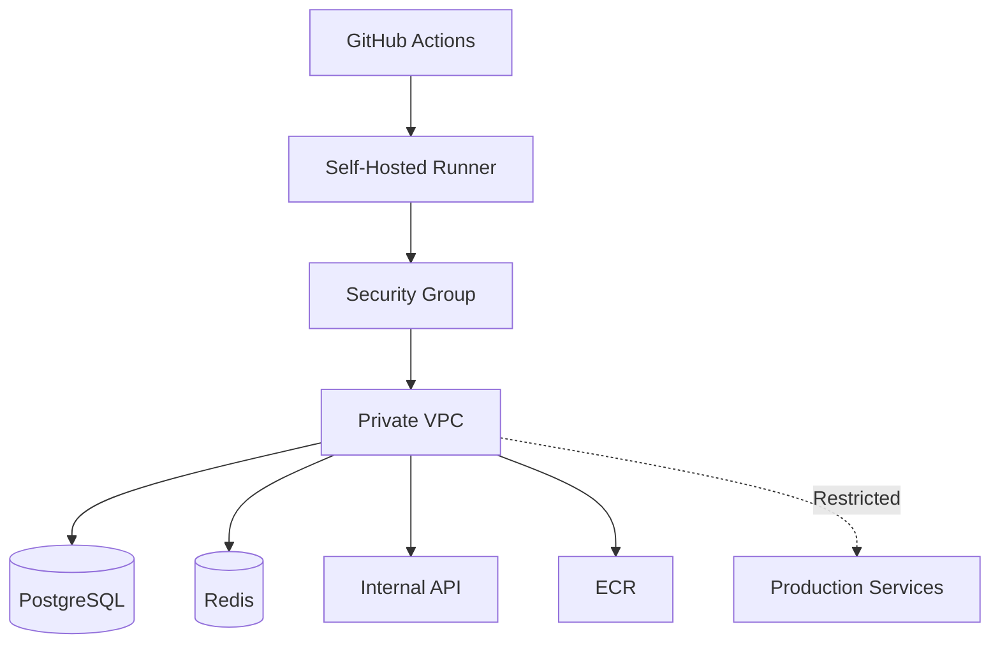
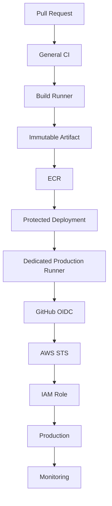

# 21- Self Hosted Runner Security

## Overview

Self-hosted GitHub Actions runners provide organizations with direct control over the machines that execute CI/CD workloads. This enables capabilities that GitHub-hosted runners may not provide, such as private-network access, custom software, specialized hardware, internal services, and tightly controlled deployment environments.

That control also creates significant security responsibility.

A self-hosted runner is both:

- An execution environment for potentially untrusted code.
- A host with potentially privileged access to organizational infrastructure.

The security model therefore depends on controlling:

```text
Repository
    ↓
Workflow
    ↓
Job
    ↓
Self-Hosted Runner
    ↓
Credentials
    ↓
Network
    ↓
Internal / Production Systems
```

A secure self-hosted runner architecture should minimize:

- Who can schedule jobs on the runner.
- What code those jobs can execute.
- What credentials are available.
- What network resources are reachable.
- What state survives between jobs.
- What privileges the runner process has.
- The blast radius of a compromised workflow.

Self-hosted runners are particularly useful for:

- Private PostgreSQL or MySQL integration testing.
- Internal APIs.
- Kubernetes deployments.
- AWS infrastructure operations.
- Specialized build tooling.
- Enterprise network access.
- Custom hardware.
- Restricted production deployment environments.

They should not be treated as ordinary developer machines.

## Self-Hosted Runner Architecture

A self-hosted runner consists of a host machine and the GitHub Actions runner software.

A simplified execution path is:

```text
GitHub Repository
       ↓
Workflow Event
       ↓
Job Scheduling
       ↓
Runner Selection
       ↓
Self-Hosted Runner
       ↓
Runner Service
       ↓
Job Steps
       ↓
Commands / Actions
       ↓
External Systems
```

The runner may have access to:

```text
Source Code
Secrets
GITHUB_TOKEN
Cloud Credentials
Private Network
Docker
Package Registries
Internal APIs
Databases
Kubernetes
```

Every one of these capabilities contributes to the runner's security boundary.

## Why Self-Hosted Runners Exist

GitHub-hosted runners are convenient, but some workloads require capabilities that are difficult or impossible to provide using managed runners.

Examples include:

| Requirement | Self-Hosted Runner Benefit |
|---|---|
| Private VPC access | Runner can reside inside the private network |
| Internal APIs | Direct network connectivity |
| Custom software | Full host customization |
| Specialized hardware | Hardware can be selected |
| Internal package registries | Controlled network access |
| Private Kubernetes cluster | Direct cluster connectivity |
| Enterprise tooling | Preinstalled internal tools |
| Dedicated deployment infrastructure | Restricted execution environment |

The trade-off is that the organization becomes responsible for securing and operating the runner.

## Security Responsibility Model

With GitHub-hosted runners, much of the underlying host management is handled by GitHub.

With self-hosted runners, the organization must manage:

- Operating system.
- Runner software.
- Host security.
- Network security.
- Credentials.
- Patching.
- Software inventory.
- Monitoring.
- Logging.
- Isolation.
- Lifecycle.
- Disaster recovery.

The operational responsibility is therefore substantially higher.

## Persistent vs Ephemeral Self-Hosted Runners

The most important architectural decision is whether runners persist between jobs.

### Persistent Runner

```text
Job A
  ↓
Runner
  ↓
Job B
  ↓
Same Runner
  ↓
Job C
```

Potential state may survive between jobs.

### Ephemeral Runner

```text
Job A
  ↓
Fresh Runner
  ↓
Destroy

Job B
  ↓
Fresh Runner
  ↓
Destroy
```

Ephemeral runners provide stronger isolation because the environment is discarded after the workload.

## Persistent Runner Risks

A persistent runner can retain:

- Source code.
- Credentials.
- Temporary files.
- Build artifacts.
- Docker layers.
- Package caches.
- Modified binaries.
- Shell history.
- Logs.
- Malicious persistence mechanisms.

For example:

```text
Job A
   ↓
Writes credential to /tmp/config
   ↓
Job completes
   ↓
Job B
   ↓
Credential remains available
```

Even if the workflow itself is trusted, accidental state leakage can occur.

If a malicious workflow executes, persistent state becomes an even greater concern.

## Ephemeral Runner Security

Ephemeral runners reduce cross-job contamination.

A typical lifecycle is:

```text
Provision
    ↓
Register
    ↓
Execute One Workload
    ↓
Collect Results
    ↓
Deregister
    ↓
Destroy
```

Advantages include:

- Reduced persistent state.
- Smaller cross-job blast radius.
- Easier incident response.
- Predictable environment.
- Easier patching.
- Easier replacement.

The main disadvantages are:

- More infrastructure.
- Provisioning latency.
- Autoscaling complexity.
- Image-management requirements.

## Runner Trust Zones

A production organization should avoid treating all runners equally.

A practical model is:

```text
Runner Zones
│
├── General CI
│
├── Private Integration Testing
│
├── Build
│
└── Production Deployment
```

Each zone should have different:

- Repository access.
- Network access.
- Credentials.
- Runner groups.
- Host configuration.
- Monitoring requirements.

## General CI Runners

General CI runners execute:

- Linting.
- Unit tests.
- Static analysis.
- Dependency checks.
- Build validation.

They should generally have:

```text
No Production Credentials
No Production Network Access
Minimal GitHub Permissions
```

This reduces the impact of malicious code executed during pull requests.

## Private Integration Runners

Private integration runners may need access to:

```text
Private PostgreSQL
Private Redis
Internal APIs
Private Kafka
```

A typical architecture is:

```text
GitHub Actions
      ↓
Private Integration Runner
      ↓
Private VPC
      ├── PostgreSQL
      ├── Redis
      ├── Kafka
      └── Internal API
```

These runners should not automatically have production deployment permissions.

## Production Deployment Runners

Production deployment runners are highly sensitive.

They may access:

- AWS.
- Kubernetes.
- ECR.
- ECS.
- EKS.
- CloudFormation.
- Terraform.
- Production APIs.

They should therefore be isolated from general CI.

```text
General CI
    ↓
Immutable Artifact
    ↓
Protected Deployment
    ↓
Production Runner
    ↓
Production
```

## Runner Groups

Runner groups help control which repositories can use specific self-hosted runners.

A useful structure is:

```text
Organization
│
├── General CI Runners
│
├── Private Network Runners
│
└── Production Deployment Runners
```

Production runner groups should have the narrowest repository access.

Do not make highly privileged runners available to every repository merely because they are located within the same organization.

## Runner Labels

Labels allow jobs to select runners with particular capabilities.

Example:

```yaml
jobs:
  integration:
    runs-on:
      - self-hosted
      - linux
      - private-network
```

Labels can represent:

- Operating system.
- Architecture.
- Hardware.
- Network location.
- Tool availability.
- Workload category.

Labels should not be treated as the only security boundary.

A label such as:

```text
production
```

does not itself guarantee that a workflow is trusted to deploy production.

The repository and runner-group access model must also be restricted.

## Runner Registration

Registering a self-hosted runner creates a trust relationship between the machine and GitHub.

Protect:

- Registration credentials.
- Runner configuration.
- Runner service.
- Host access.
- Runner group membership.

Never:

- Commit registration credentials.
- Print registration credentials.
- Store them in application configuration.
- Pass them through untrusted workflow input.

## Runner Service

The runner typically operates as a service on the host.

The service should run under a dedicated operating-system identity where practical.

Avoid using a personal developer account.

A dedicated service account makes:

- Permissions easier to reason about.
- Auditing easier.
- Access removal easier.
- Host isolation stronger.

## Operating System Hardening

A self-hosted runner should be purpose-built rather than treated as a general-purpose server.

Recommended controls include:

- Supported operating system.
- Regular security updates.
- Minimal installed software.
- Host firewall.
- Restricted administrative access.
- Restricted inbound traffic.
- Controlled outbound traffic.
- Disk encryption where appropriate.
- Security monitoring.
- Centralized logging.

The smaller the host software footprint, the smaller the attack surface.

## Software Inventory

Know exactly what exists on the runner.

Typical tools may include:

```text
Git
Python
Docker
AWS CLI
kubectl
Helm
Terraform
Security Scanners
Build Tools
```

Do not install unrelated tools simply because they may be useful later.

Every installed component becomes part of the runner's attack surface.

## Runner Image Management

For ephemeral runners, the base image is a critical security artifact.

A typical lifecycle is:

```text
Base OS
   ↓
Install Required Tools
   ↓
Security Scan
   ↓
Version
   ↓
Publish
   ↓
Provision Runner
```

The image should be:

- Versioned.
- Reproducible.
- Regularly rebuilt.
- Vulnerability-scanned.
- Tracked as part of the software supply chain.

## Runner Image Drift

Persistent runners can suffer from configuration drift.

For example:

```text
Initial State
   ↓
Install Tool
   ↓
Upgrade Tool
   ↓
Manual Configuration
   ↓
Emergency Fix
   ↓
Unknown Final State
```

This makes debugging and security analysis harder.

Infrastructure-as-code and immutable images reduce configuration drift.

## Runner User Privileges

The runner service should have the minimum host privileges required.

Avoid unnecessary:

```text
root
```

execution.

A test runner should not need unrestricted system administration capabilities.

For specialized workloads that genuinely require privileged operations, isolate those jobs onto dedicated runners.

## Sudo Access

Avoid giving the runner service account unrestricted `sudo`.

Poor configuration:

```text
runner ALL=(ALL) NOPASSWD: ALL
```

This means arbitrary workflow code can potentially obtain root privileges.

If elevated operations are genuinely required, restrict them to narrowly defined commands and use a dedicated runner.

## SSH Access

SSH access to runners should be tightly controlled.

Avoid using:

- Personal SSH keys.
- Shared administrator accounts.
- Long-lived unmanaged keys.

Prefer:

- Individual identities.
- Short-lived credentials where supported.
- Centralized access management.
- Audit logging.
- Restricted source networks.

## Windows Runners

Windows self-hosted runners have similar security requirements.

Protect:

- Administrator access.
- PowerShell execution.
- Windows services.
- Credential stores.
- RDP access.
- Local administrator accounts.
- Installed software.

Do not assume that Windows runners require a different security philosophy.

The operating-system controls differ, but the trust model remains:

```text
Untrusted Code
    ↓
Runner
    ↓
Credentials + Network + Host
```

## Network Security

Network connectivity is one of the most important differences between self-hosted and GitHub-hosted runners.

A self-hosted runner may be able to reach:

```text
Private VPC
Internal APIs
Databases
Kubernetes
Production Services
```

This increases its blast radius.

## Network Segmentation

Separate environments:

```text
CI Network
   │
   ├── Test Services
   │
   └── Integration Systems

Production Network
   │
   ├── Production APIs
   ├── Databases
   └── Kubernetes
```

A general CI runner should not automatically have routes into the production network.

## Security Groups

For AWS-based runners, security groups should permit only required connections.

For example:

```text
Runner Security Group
    ↓
TCP 443 → Approved AWS/Internal Services
TCP 5432 → Approved PostgreSQL
TCP 6379 → Approved Redis
```

Avoid broad rules such as:

```text
0.0.0.0/0
```

for internal services unless there is a deliberate architectural reason.

## Network Egress

A compromised runner may attempt to exfiltrate secrets.

Restrict outbound connectivity where practical.

A controlled environment might permit:

```text
GitHub
Approved Package Registry
Approved Container Registry
Approved AWS Services
Approved Internal APIs
```

and deny unrelated destinations.

## DNS Security

DNS can be used to access unexpected destinations or exfiltrate information.

For sensitive runner networks:

- Use controlled DNS resolution.
- Monitor unusual domains.
- Restrict outbound DNS where appropriate.
- Avoid allowing arbitrary internal DNS resolution from general CI runners.

## Private VPC Runner Architecture



The key design decision is that private-network access should be granted according to workload requirements rather than runner convenience.

## AWS IAM Security

Self-hosted runners frequently interact with AWS.

Avoid embedding long-lived access keys on the host.

Prefer:

```text
GitHub Actions
      ↓
OIDC
      ↓
AWS STS
      ↓
IAM Role
      ↓
Temporary Credentials
```

## OIDC

A workflow can request an OIDC token by granting:

```yaml
permissions:
  id-token: write
  contents: read
```

The IAM trust policy should constrain:

- Repository.
- Branch.
- Environment.
- Workflow identity where applicable.
- Audience.

The resulting AWS credentials should be temporary.

## Instance Profiles

If the runner runs on EC2, it may have an instance profile.

Be careful not to give the EC2 instance broad AWS permissions merely because one job needs AWS access.

Prefer:

```text
Runner
   ↓
GitHub OIDC
   ↓
Specific IAM Role
```

where practical.

If an instance profile is required, it should follow least privilege.

## EC2 Instance Metadata

Protect EC2 instance metadata access.

Use IMDSv2 and minimize the permissions of the associated instance role.

A compromised workflow should not automatically gain broad AWS access through the host.

## Secrets

Do not store production secrets permanently on the runner.

Avoid:

```text
/etc/production.env
~/.aws/credentials
~/.ssh/id_rsa
```

for automated deployment identities when short-lived authentication is available.

Prefer:

```text
Job
 ↓
Temporary Credential
 ↓
Operation
 ↓
Credential Expires
```

## GitHub Secrets

Secrets should be scoped as narrowly as possible.

Use:

- Repository secrets for repository-wide requirements.
- Environment secrets for environment-specific operations.
- Job-specific secret usage.
- Protected environments for production.

Do not expose production secrets to general test jobs.

## Environment Protection

A production deployment can use:

```yaml
jobs:
  deploy:
    environment: production
```

The production environment can provide additional controls such as:

- Required reviewers.
- Deployment restrictions.
- Environment-specific secrets.
- Deployment history.

This is especially important when the deployment runner has production network access.

## GITHUB_TOKEN

The runner receives the workflow's `GITHUB_TOKEN` according to configured permissions.

Use minimal permissions:

```yaml
permissions:
  contents: read
```

For deployment jobs requiring OIDC:

```yaml
permissions:
  contents: read
  id-token: write
```

Avoid broad organization-level or repository-level permissions when a job does not require them.

## Pull Requests and Forks

Pull requests from forks should be treated as untrusted.

Potential attack path:

```text
Attacker
    ↓
Fork
    ↓
Malicious Source
    ↓
Workflow
    ↓
Self-Hosted Runner
    ↓
Private Network
    ↓
Sensitive Systems
```

This is one of the most important self-hosted runner security risks.

## Why Self-Hosted Runners and Fork PRs Are Dangerous

A malicious pull request can modify:

- Application code.
- Tests.
- Build scripts.
- Dependency files.
- Workflow inputs.
- Scripts executed by CI.

If that code executes on a privileged self-hosted runner, the attacker may gain the runner's capabilities.

Therefore:

```text
Untrusted PR
    ↓
Do Not Use Privileged Runner
```

is a useful security principle.

## Runner Selection for Pull Requests

Use GitHub-hosted runners or isolated ephemeral runners for untrusted pull-request validation where possible.

Example:

```yaml
jobs:
  test:
    if: github.event_name == 'pull_request'
    runs-on: ubuntu-latest
```

Keep privileged self-hosted runners for trusted workflows.

## `pull_request_target`

`pull_request_target` requires particular caution because it executes in the context of the base repository.

Avoid this pattern:

```text
pull_request_target
        ↓
Checkout PR Code
        ↓
Execute PR Code
        ↓
Production Secrets
```

This can create a direct path from attacker-controlled code to privileged credentials.

## Runner Repository Access

Do not expose production runners to every repository in an organization.

A production deployment runner should generally be accessible only to repositories that:

- Are explicitly approved.
- Have appropriate branch protections.
- Follow security standards.
- Have trusted maintainers.

## Runner Group Governance

A useful policy is:

```text
General Runner Group
→ Approved CI Repositories

Private Runner Group
→ Approved Internal-Service Repositories

Production Runner Group
→ Approved Production Repositories
```

This creates an additional organizational security boundary.

## Docker Security

Self-hosted runners commonly build Docker images.

Example:

```yaml
steps:
  - name: Build image
    run: docker build -t backend:${GITHUB_SHA} .
```

Docker must be secured as part of the runner architecture.

## Docker Socket

Access to:

```text
/var/run/docker.sock
```

is highly privileged.

A workflow that can communicate with the Docker daemon may gain capabilities beyond the intended container boundary.

Do not expose the Docker socket to untrusted jobs unless the architecture explicitly requires it and the security implications are understood.

## Privileged Containers

Avoid unnecessary:

```text
--privileged
```

containers.

Privileged containers reduce isolation and can expose host capabilities.

If a build requires privileged execution, isolate that workload onto a dedicated runner.

## Kubernetes Deployment Runners

A self-hosted runner deploying to Kubernetes may have:

```text
kubectl
+
Kubernetes Credentials
+
Cluster Network Access
```

This makes it highly sensitive.

Prefer:

```text
Deployment Runner
    ↓
Dedicated Service Account
    ↓
Namespace-Scoped Permissions
    ↓
Kubernetes API
```

Avoid giving CI:

```text
cluster-admin
```

unless there is a documented and unavoidable requirement.

## Kubernetes Service Accounts

Use dedicated service accounts with minimum permissions.

For example:

```text
Deployment Service Account
    ↓
Deployment Namespace
    ├── Deployments
    ├── Services
    └── ConfigMaps
```

rather than:

```text
Deployment Service Account
    ↓
Entire Cluster
```

## Runner Isolation Strategies

Isolation can occur at several levels.

| Isolation | Example | Security Benefit |
|---|---|---|
| Repository | Runner group restriction | Limits who can schedule jobs |
| Workflow | Protected deployment workflow | Limits execution paths |
| Job | Separate deployment job | Limits credentials |
| Host | Dedicated machine | Limits cross-workload access |
| Container | Job container | Process/environment isolation |
| Network | VPC/subnet/firewall | Limits reachable systems |
| Lifecycle | Ephemeral runner | Removes persistent state |

Strong architectures combine multiple boundaries.

## Build and Deployment Separation

Avoid giving the build stage production permissions.

Prefer:

```text
Pull Request
   ↓
Lint
   ↓
Unit Tests
   ↓
Integration Tests
   ↓
Security Scan
   ↓
Build
   ↓
Immutable Artifact
   ↓
Protected Deployment
   ↓
Production Runner
   ↓
Production
```

The build runner does not need to deploy the application.

## Immutable Artifact Promotion

Build once:

```text
Source
  ↓
Build
  ↓
Docker Image
  ↓
Registry
```

Then promote the same image:

```text
Registry
  ↓
Staging
  ↓
Approval
  ↓
Production
```

This reduces the need for production runners to build arbitrary source code.

## Artifact Security

Production runners should preferably consume trusted immutable artifacts.

For example:

```text
ECR
  ↓
Image Digest
  ↓
Deployment Runner
  ↓
ECS / EKS
```

Rather than:

```text
Production Runner
  ↓
Checkout Source
  ↓
Install Dependencies
  ↓
Build
  ↓
Deploy
```

The second approach expands the privileged execution surface.

## Runner Supply Chain

The runner itself is part of the software supply chain.

Components include:

```text
Operating System
      ↓
Runner Software
      ↓
Base Image
      ↓
Installed Tools
      ↓
Actions
      ↓
Dependencies
      ↓
Build Environment
```

Any compromised component can affect workflow execution.

## Third-Party Actions

A self-hosted runner executes third-party actions with the runner's privileges.

Therefore:

```yaml
uses: vendor/action@v1
```

should be treated as executable code.

Security controls include:

- Trusted sources.
- SHA pinning.
- Minimal permissions.
- Minimal secrets.
- Dependency review.
- Controlled updates.

## Action Pinning

Prefer immutable action references for sensitive workflows:

```yaml
uses: actions/checkout@<verified-sha>
```

A pinned action still requires security review. Pinning protects against unexpected changes to a mutable reference but does not make vulnerable code safe.

## Runner and Untrusted Dependencies

A workflow may install dependencies from:

```text
PyPI
npm
Maven
Internal Registries
Container Registries
```

A compromised dependency can execute on the runner.

Therefore runner security should be combined with:

- Dependency pinning.
- Lock files.
- Dependency review.
- Vulnerability scanning.
- Trusted package repositories.
- SBOM generation.

## Cache Security

Persistent runners may contain dependency caches.

Caches can become an attack surface if untrusted workloads can write state later consumed by trusted jobs.

Avoid sharing sensitive caches across trust boundaries.

Cache keys should incorporate the appropriate dependency and source state.

## Filesystem Security

A self-hosted runner can contain sensitive information in:

```text
$GITHUB_WORKSPACE
$RUNNER_TEMP
/tmp
$HOME
Docker storage
Package caches
Tool caches
```

Persistent runners require explicit cleanup.

Ephemeral runners reduce the importance of perfect cleanup.

## Host Persistence

A sophisticated compromise may attempt to persist through:

- Modified binaries.
- Startup services.
- Cron jobs.
- Scheduled tasks.
- SSH keys.
- Shell configuration.
- Docker images.
- System configuration.

This is why rebuilding a compromised persistent runner is generally safer than attempting to manually clean it.

## Runner Monitoring

Monitor the runner at three levels.

### GitHub

Track:

- Runner registration.
- Runner status.
- Runner group changes.
- Workflow execution.
- Workflow file changes.
- Permission changes.
- Deployment events.

### Host

Track:

- Process execution.
- Authentication.
- File modifications.
- Privilege escalation.
- Network connections.
- Unexpected services.

### Cloud

Track:

- IAM role assumptions.
- ECR operations.
- S3 access.
- EC2 API activity.
- Kubernetes operations.
- Security-group changes.

## Auditability

A security investigation should reconstruct:

```text
Repository
    ↓
Commit
    ↓
Workflow
    ↓
Job
    ↓
Runner
    ↓
Action
    ↓
Credential
    ↓
Network Destination
    ↓
Artifact / Deployment
```

This requires consistent logging and traceability.

## Runner Health Monitoring

Monitor:

- Online/offline state.
- Job queue time.
- Job execution duration.
- CPU.
- Memory.
- Disk.
- Network.
- Docker usage.
- Runner process health.

A runner that is constantly near resource limits can become both a reliability and security concern.

## Runner Disk Management

Check:

```bash
df -h
```

Inspect Docker usage:

```bash
docker system df
```

Inspect large workspace directories:

```bash
du -sh "$RUNNER_WORKSPACE"/* 2>/dev/null
```

Persistent runners should have controlled cleanup policies.

## Runner Capacity

A production runner pool should have sufficient capacity to avoid:

```text
All Runners Busy
      ↓
Deployment Queued
      ↓
Operational Delay
```

Autoscaling can help:

```text
Queue Depth
    ↓
Autoscaler
    ↓
New Runner
    ↓
Job
```

## Autoscaling Security

Autoscaling infrastructure should ensure:

- Runner images are trusted.
- New instances are hardened.
- Registration is controlled.
- Instances are destroyed after use.
- Credentials are not embedded in images.
- Network policies are applied automatically.

A compromised autoscaling image can propagate compromise to every new runner.

## Ephemeral Runner Autoscaling

A secure pattern is:

```text
Workflow
   ↓
Runner Queue
   ↓
Autoscaler
   ↓
Trusted Runner Image
   ↓
Ephemeral Runner
   ↓
Job
   ↓
Destroy
```

The runner image should be immutable and regularly rebuilt.

## High Availability

Self-hosted runners should not create a CI/CD single point of failure.

Use:

- Multiple runners.
- Multiple availability zones where appropriate.
- Autoscaling.
- Automated replacement.
- Health checks.
- Capacity monitoring.

For production deployments, ensure another healthy runner can execute the deployment if one runner fails.

## Disaster Recovery

Runner hosts should be disposable.

A strong recovery model is:

```text
Runner Failure
      ↓
Terminate
      ↓
Provision from Known Image
      ↓
Register
      ↓
Execute
```

Do not depend on manually repairing a corrupted runner.

## Cost Optimization

Self-hosted runners can reduce some execution costs but introduce infrastructure-management costs.

Consider:

- VM cost.
- Storage.
- Network traffic.
- Monitoring.
- Security tooling.
- Autoscaling.
- Maintenance.
- Engineer time.

A cheap persistent runner that creates a major security risk may cost more operationally than an ephemeral architecture.

## Performance Considerations

Persistent runners can be faster because they may retain:

- Docker layers.
- Package caches.
- Preinstalled tools.

Ephemeral runners provide stronger isolation but may require:

- Image download.
- Tool installation.
- Runner provisioning.

A common optimization is to create hardened runner images containing stable tooling while keeping application state ephemeral.

## Runner Image Caching

Avoid embedding:

```text
Secrets
Private Keys
Temporary Tokens
Environment Credentials
```

in a reusable runner image.

Only immutable tooling should be included.

## Runner Security and CI/CD Pipeline

A production backend pipeline might use:

```text
Pull Request
      ↓
General Runner
      ↓
Lint
      ↓
Unit Tests
      ↓
Integration Tests
      ↓
Security Scan
      ↓
Build
      ↓
Immutable Artifact
      ↓
Staging
      ↓
Approval
      ↓
Restricted Deployment Runner
      ↓
Production
```

This architecture limits privileged execution to the final deployment stage.

## Django Example

A Django application might use:

```text
General Runner
    ↓
Python Environment
    ↓
pytest
    ↓
PostgreSQL Service
    ↓
Redis Service
```

The test runner does not need:

```text
Production Database
Production AWS Role
Production Kubernetes Access
```

The deployment job can operate separately.

## FastAPI Example

A FastAPI service might use:

```text
Pull Request
    ↓
Lint
    ↓
pytest
    ↓
PostgreSQL
    ↓
Redis
    ↓
Docker Build
    ↓
ECR
    ↓
Deployment Runner
    ↓
ECS / EKS
```

The deployment runner consumes the image rather than rebuilding the application.

## Celery and Redis

A CI runner testing Django or FastAPI with Celery may require:

```text
Application
    ↓
Celery Worker
    ↓
Redis
```

This workload should remain isolated from production Redis.

Use test-specific services or isolated private infrastructure.

## Kafka

Integration tests involving Kafka should use dedicated test infrastructure.

Do not give an untrusted PR access to production Kafka topics.

Prefer:

```text
PR
 ↓
Ephemeral/Test Kafka
 ↓
Integration Tests
```

rather than:

```text
PR
 ↓
Production Kafka
```

## PostgreSQL

A runner requiring PostgreSQL should use:

- Test database.
- Restricted credentials.
- Network restrictions.
- Isolated schema or instance.
- No production data where possible.

Do not give general CI jobs access to production database credentials.

## Nginx and Internal APIs

If integration tests require Nginx or internal APIs:

```text
Runner
   ↓
Nginx
   ↓
Internal Service
```

the network path should be explicitly allowed.

Avoid exposing unrelated internal services simply because the runner is already inside the private network.

## Security Boundaries by Workload

| Workload | Runner | Network | Credentials |
|---|---|---|---|
| Unit tests | General | Internet/limited | None |
| Integration tests | Private/test runner | Test VPC | Test credentials |
| Build | General/build runner | Registry | Registry identity |
| Staging deployment | Restricted runner | Staging | Temporary cloud identity |
| Production deployment | Dedicated runner | Production | Temporary production identity |

This separation provides a practical least-privilege model.

## Common Mistakes

### Making a Production Runner Available to Every Repository

**Problem:** Any authorized workflow may potentially reach the production environment.

**Avoid it by:** restricting runner groups to approved repositories.

### Using Persistent Runners for Fork Pull Requests

**Problem:** Attacker-controlled code can execute on infrastructure that may contain sensitive state.

**Avoid it by:** using GitHub-hosted or isolated ephemeral runners for untrusted PR validation.

### Installing Developer Credentials on the Runner

**Problem:** A compromised workflow can potentially steal personal credentials.

**Avoid it by:** using workload-specific, short-lived identities.

### Running the Runner as Root

**Problem:** Workflow code may gain unrestricted host privileges.

**Avoid it by:** running under a dedicated least-privileged account.

### Giving `sudo` Without Restrictions

**Problem:** Workflow code can elevate privileges.

**Avoid it by:** removing `sudo` access or restricting it to narrowly defined commands.

### Allowing Production Network Access to General CI

**Problem:** A compromised dependency or pull request can reach production systems.

**Avoid it by:** separating CI and deployment networks.

### Storing AWS Credentials on Disk

**Problem:** Persistent credentials can survive beyond the intended workflow.

**Avoid it by:** using OIDC and temporary credentials.

### Mounting the Docker Socket

**Problem:** Docker daemon access can become a host-level security boundary violation.

**Avoid it by:** restricting Docker access to trusted jobs.

### Treating a Runner as a Normal Development Machine

**Problem:** Personal files, credentials, and unrelated software expand the attack surface.

**Avoid it by:** using purpose-built runner hosts.

### Reusing a Compromised Runner

**Problem:** Malware or persistence may remain even after the obvious issue is fixed.

**Avoid it by:** terminating and rebuilding the runner from a trusted image.

## Troubleshooting Self-Hosted Runner Problems

### Runner Not Available

**Symptom:**

```text
Waiting for a runner to pick up this job
```

**Possible causes:**

- Runner offline.
- Incorrect labels.
- Runner group restrictions.
- No available capacity.
- Runner service failure.

**Checks:**

```text
Workflow
    ↓
runs-on
    ↓
Labels
    ↓
Runner Group
    ↓
Runner Status
```

**Prevention:**

- Monitor runner status.
- Validate labels.
- Maintain capacity.
- Use autoscaling where appropriate.

### Runner Service Failure

On Linux, inspect the service:

```bash
systemctl status actions.runner.*
```

Also inspect:

```bash
journalctl -u actions.runner.*
```

Check:

```bash
df -h
free -m
uptime
```

### Disk Exhaustion

**Symptom:**

```text
No space left on device
```

Check:

```bash
df -h
docker system df
du -sh "$RUNNER_WORKSPACE"/* 2>/dev/null
```

Then identify:

- Docker layers.
- Workspace data.
- Build artifacts.
- Caches.
- Logs.

Persistent runners should have controlled cleanup or replacement procedures.

### Network Connectivity Failure

**Symptom:** Runner cannot access a required service.

Check:

```bash
ip route
getent hosts internal.example.com
nc -vz db.internal 5432
curl -I https://internal.example.com
```

Possible causes include:

- Security group.
- Route table.
- DNS.
- Firewall.
- Proxy.
- Private subnet.
- Network policy.

### AWS Authentication Failure

Trace:

```text
Workflow
    ↓
id-token: write
    ↓
OIDC Token
    ↓
IAM Trust Policy
    ↓
STS
    ↓
IAM Role
    ↓
AWS API
```

Check:

- OIDC provider.
- Audience.
- Subject.
- Repository.
- Branch.
- Environment.
- IAM permissions.

Do not solve an OIDC configuration issue by introducing permanent access keys.

### Kubernetes Authentication Failure

Check:

```text
Runner
   ↓
Kubeconfig / Identity
   ↓
Kubernetes API
   ↓
Service Account
   ↓
RBAC
```

Validate that the runner has only the permissions required for the deployment.

## Security Incident Response

If a self-hosted runner is suspected of compromise:

```text
Detect
   ↓
Stop Scheduling Jobs
   ↓
Isolate Host
   ↓
Revoke Temporary Credentials
   ↓
Investigate Workflow
   ↓
Inspect Actions
   ↓
Inspect Network Activity
   ↓
Inspect Cloud Activity
   ↓
Assess Secret Exposure
   ↓
Preserve Evidence
   ↓
Destroy Runner
   ↓
Rebuild from Trusted Image
   ↓
Rebuild Affected Artifacts
```

Do not simply restart the runner.

## Credential Rotation After Compromise

If a compromised runner had access to credentials, determine:

```text
Which credentials?
      ↓
How long available?
      ↓
Which resources accessible?
      ↓
Were they used?
```

Rotate or revoke affected credentials according to their sensitivity.

For AWS OIDC credentials, short lifetimes reduce exposure, but any active session should still be considered during incident response.

## Artifact Integrity After Runner Compromise

If a runner used to build production artifacts is compromised, previously produced artifacts may require investigation.

A safer recovery model is:

```text
Trusted Build Environment
       ↓
Rebuild
       ↓
Scan
       ↓
Generate SBOM
       ↓
Generate Provenance
       ↓
Sign / Attest
       ↓
Promote
```

Do not blindly promote artifacts produced by a potentially compromised runner.

## Supply Chain Security

Self-hosted runner security is part of the broader CI/CD supply chain.

Consider:

```text
Source
 ↓
Workflow
 ↓
Actions
 ↓
Dependencies
 ↓
Runner Image
 ↓
Runner Host
 ↓
Build
 ↓
Artifact
 ↓
Registry
 ↓
Deployment
```

Every stage can influence the final artifact.

## SBOM and Provenance

For sensitive builds, generate:

- SBOM.
- Build provenance.
- Artifact attestations.
- Signatures where appropriate.

This helps answer:

```text
What was built?
From which source?
Using which dependencies?
In which environment?
By which workflow?
```

## Runner Governance

Organizations should define standards for:

- Approved runner images.
- Approved runner groups.
- Repository access.
- Required patching.
- Required monitoring.
- Action allowlists.
- Network access.
- Credential management.
- Ephemeral runner usage.
- Production runner approval.

## Action Allowlists

Organizations may restrict which actions can execute.

A sensitive runner should not automatically execute arbitrary marketplace actions.

Prefer:

```text
Approved Actions
    ↓
Pinned Versions
    ↓
Reviewed Changes
```

for privileged workflows.

## Reusable Workflows

Reusable workflows can centralize security-sensitive runner behavior.

For example:

```text
Application Repository
       ↓
Reusable Deployment Workflow
       ↓
Restricted Runner Group
       ↓
OIDC
       ↓
AWS
```

This prevents every repository from independently implementing privileged deployment logic.

## Reusable Workflow Security

Centralized workflows should:

- Define minimal permissions.
- Restrict inputs.
- Validate parameters.
- Control runner selection.
- Avoid arbitrary command execution.
- Pin dependencies.
- Protect deployment environments.

The reusable workflow itself becomes a privileged component and must therefore be secured.

## Failure Domains

A mature architecture separates failure domains:

```text
General CI Failure
       ≠
Private Integration Failure
       ≠
Runner Infrastructure Failure
       ≠
Production Deployment Failure
```

This prevents one problem from unnecessarily taking down the entire CI/CD system.

## Recovery Architecture

For production runners:

```text
Runner Pool
 ├── Runner A
 ├── Runner B
 └── Runner C
```

If Runner A fails:

```text
Runner A
   ↓
Remove
   ↓
Provision Replacement
   ↓
Runner Pool
```

Jobs should not depend on one manually maintained machine.

## Reference Architecture



The security boundaries are:

```text
Untrusted Source
      ↓
General CI
      ↓
Trusted Immutable Artifact
      ↓
Protected Deployment
      ↓
Dedicated Runner
      ↓
Temporary Cloud Identity
      ↓
Production
```

## Senior-Level Design Principles

### Self-Hosted Does Not Mean Trusted

A self-hosted runner is trusted infrastructure from the organization's perspective, but the code executing on it may not be trusted.

Therefore:

```text
Trusted Host
+
Potentially Untrusted Code
```

must be treated as a dangerous combination.

### Separate Trust Domains

Use different runners for:

```text
General CI
Private Integration
Build
Production Deployment
```

when their security requirements differ.

### Never Give a Runner More Access Than Its Jobs Require

The runner's:

- Network access.
- Host privileges.
- Cloud permissions.
- Kubernetes permissions.
- GitHub permissions.

should all follow least privilege.

### Prefer Disposable Infrastructure

A compromised ephemeral runner can be destroyed.

A compromised persistent runner may require forensic analysis and manual cleanup.

### Protect the Runner from Untrusted PRs

One of the most important rules is:

```text
Untrusted Code
    ↓
Untrusted / Isolated Execution
```

not:

```text
Untrusted Code
    ↓
Privileged Production Runner
```

### Build Once, Promote Many

Build artifacts in a controlled environment and promote the immutable artifact through environments.

This reduces the need for privileged runners to execute arbitrary source code.

### Use Short-Lived Identity

For AWS:

```text
OIDC
 ↓
STS
 ↓
Temporary IAM Credentials
```

is preferable to permanent access keys stored on runner hosts.

### Assume the Runner Can Be Compromised

The correct senior-level question is not:

> How do we guarantee the runner can never be compromised?

It is:

> If the runner is compromised, what is the maximum damage the attacker can cause?

That question drives isolation, least privilege, network segmentation, ephemeral infrastructure, and credential design.

## Interview Scenarios

### Why Are Self-Hosted Runners Riskier Than GitHub-Hosted Runners?

Discuss:

- Host ownership.
- Persistent state.
- Network access.
- Credentials.
- Administrative privileges.
- Docker access.
- Patch management.
- Monitoring.
- Cross-job contamination.

The key distinction is that self-hosted runners transfer substantially more security responsibility to the organization.

### How Would You Secure a Self-Hosted Runner Used for Production Deployments?

A strong design includes:

```text
Dedicated Runner Group
        ↓
Approved Repository
        ↓
Protected Environment
        ↓
Ephemeral Runner
        ↓
Minimal Permissions
        ↓
OIDC
        ↓
Restricted Network
        ↓
Immutable Artifact
        ↓
Production
```

### Would You Allow Fork PRs to Use a Production Runner?

No privileged execution path should be exposed to arbitrary fork code.

Use GitHub-hosted or isolated execution for untrusted validation and keep production deployment capabilities behind trusted workflows.

### Why Separate Build and Deployment Runners?

Build jobs execute source code, dependencies, scripts, and build tools.

Deployment runners have access to production infrastructure.

Separating them means compromise of the build environment does not automatically grant production deployment access.

### How Would You Connect a Runner to a Private VPC?

Place the runner in an appropriate private network and restrict access through:

- Security groups.
- Routing.
- Network policies.
- DNS.
- Egress controls.
- Least-privilege IAM.

Only the required private services should be reachable.

### What Happens If a Persistent Runner Is Compromised?

Assume that:

- Files may have been modified.
- Credentials may have been exposed.
- Tools may have been replaced.
- Persistence may exist.
- Build artifacts may be affected.

Isolate the runner, revoke relevant credentials, investigate, preserve evidence, and rebuild the runner from a trusted image.

### How Does OIDC Improve Self-Hosted Runner Security?

OIDC avoids storing long-lived cloud credentials on the host.

```text
Runner
  ↓
GitHub OIDC
  ↓
AWS STS
  ↓
Temporary Role Credentials
```

The credentials can be restricted by IAM trust and permission policies and expire automatically.

### Should a Self-Hosted Runner Have Internet Access?

Only to the extent required.

A runner that requires GitHub, an internal package proxy, and ECR does not necessarily need unrestricted Internet access.

### How Would You Secure a Kubernetes Deployment Runner?

Use:

- Dedicated runner group.
- Restricted repository access.
- Ephemeral lifecycle.
- Dedicated Kubernetes identity.
- Namespace-scoped RBAC where possible.
- Restricted network access.
- Minimal GitHub permissions.
- OIDC or another short-lived identity mechanism.
- Immutable deployment artifacts.

## Production Checklist

### Runner Access

- [ ] Runner groups are restricted.
- [ ] Only approved repositories can use sensitive runners.
- [ ] Labels accurately represent capabilities.
- [ ] Production runners are isolated from general CI.

### Host Security

- [ ] Operating system is patched.
- [ ] Runner software is maintained.
- [ ] Dedicated service account is used.
- [ ] Root access is restricted.
- [ ] `sudo` is restricted or removed.
- [ ] SSH/RDP access is controlled.
- [ ] Unnecessary software is removed.

### Network

- [ ] Private-network access is explicitly restricted.
- [ ] Security groups follow least privilege.
- [ ] Egress is controlled where practical.
- [ ] Production services are not reachable from general CI.
- [ ] DNS access is appropriately controlled.

### Credentials

- [ ] `GITHUB_TOKEN` permissions are minimized.
- [ ] Long-lived cloud credentials are not stored on runners.
- [ ] OIDC is used where appropriate.
- [ ] Production secrets are environment-scoped.
- [ ] Runner registration credentials are protected.

### Workload Isolation

- [ ] Untrusted PRs do not use privileged runners.
- [ ] `pull_request_target` is carefully reviewed.
- [ ] Build and deployment workloads are separated.
- [ ] Ephemeral runners are considered for sensitive workloads.
- [ ] Persistent runner cleanup is controlled.

### Supply Chain

- [ ] Third-party actions are reviewed.
- [ ] Sensitive actions are pinned.
- [ ] Dependencies are managed securely.
- [ ] Runner images are scanned.
- [ ] SBOM/provenance controls are used where appropriate.
- [ ] Production artifacts are immutable.

### Operations

- [ ] Runner health is monitored.
- [ ] Disk usage is monitored.
- [ ] Runner logs are available.
- [ ] Cloud activity is auditable.
- [ ] Incident-response procedures exist.
- [ ] Runners can be rebuilt automatically.

## Key Takeaways

- **A self-hosted runner is privileged infrastructure and a major CI/CD security boundary**, especially when it can access private networks, cloud accounts, Docker, or production systems.
- **Separate runners by trust and capability**: general CI, private integration testing, build, and production deployment should not automatically share the same runner or privileges.
- Prefer **ephemeral, reproducible runners** for sensitive workloads and design runner infrastructure so compromised hosts can be destroyed and recreated rather than manually trusted again.
- Protect the runner with **least-privilege permissions, restricted network access, short-lived OIDC credentials, protected environments, and tightly controlled runner groups**.
- Design for compromise: **untrusted code should never automatically inherit production capabilities**, and immutable artifacts should be promoted to production through a restricted deployment path.