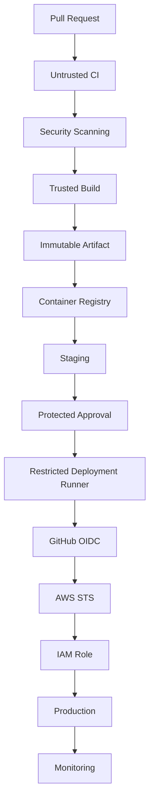

# 22- Security Best Practices

## Overview

GitHub Actions security is the combination of workflow configuration, identity, permissions, secrets, runner isolation, dependency trust, artifact integrity, deployment controls, and operational governance.

A production CI/CD system should assume that:

- Workflow files are executable infrastructure.
- Third-party actions are executable dependencies.
- Pull requests may contain untrusted code.
- Dependencies may execute arbitrary installation scripts.
- Runners may become compromised.
- Credentials may be exposed if trust boundaries are incorrect.
- Build artifacts may be modified or replaced.
- Deployment workflows may become race conditions without concurrency controls.

A useful security model is:

```text
Source
  ↓
Workflow
  ↓
Actions + Dependencies
  ↓
Runner
  ↓
Credentials
  ↓
Build
  ↓
Artifact
  ↓
Registry
  ↓
Deployment
  ↓
Production
```

Security controls should exist across the entire path rather than being concentrated in a single security-scanning job.

## Security Objectives

A production GitHub Actions environment should provide:

| Objective | Primary Controls |
|---|---|
| Minimize workflow privilege | `permissions`, job-level permissions |
| Protect secrets | Environments, secrets scoping, OIDC |
| Protect untrusted code | PR isolation, runner isolation |
| Protect actions | SHA pinning, allowlists, review |
| Protect dependencies | Lock files, Dependabot, dependency review |
| Protect runners | Ephemeral execution, hardening, segmentation |
| Protect artifacts | Immutable references, provenance, signing |
| Protect deployments | Environments, approvals, concurrency |
| Detect attacks | Logs, audit events, monitoring |
| Recover from compromise | Rotation, rebuilds, rollback |

## GitHub Actions Trust Model

GitHub Actions executes automation on behalf of a repository. The workflow therefore becomes part of the repository's security boundary.

Consider:

```text
Repository
    ↓
.github/workflows/*.yml
    ↓
GitHub Actions
    ↓
Runner
    ↓
Commands
    ↓
Credentials / Network / Artifacts
```

A workflow change can alter:

- Which commands execute.
- Which actions execute.
- Which secrets are available.
- Which permissions are granted.
- Which AWS role is assumed.
- Which runner executes the job.
- Which artifacts are produced.
- Which production systems are modified.

Workflow files should therefore be reviewed like application code and infrastructure-as-code.

## Security by Trust Boundary

A useful production model is:

```text
Untrusted
──────────────
Fork PR
PR source
Issue content
Commit messages
External input
Third-party dependencies
        ↓
Controlled CI
        ↓
Trusted Build
        ↓
Immutable Artifact
        ↓
Protected Deployment
        ↓
Production
```

The goal is to prevent untrusted input from crossing directly into privileged execution.

## GITHUB_TOKEN

`GITHUB_TOKEN` provides workflow authentication against GitHub resources.

Its permissions should be explicitly minimized.

Example:

```yaml
permissions:
  contents: read
```

A deployment job requiring AWS OIDC may use:

```yaml
permissions:
  contents: read
  id-token: write
```

Do not grant broad permissions globally simply because one job needs them.

## Workflow-Level vs Job-Level Permissions

Prefer job-level permissions when different jobs have different requirements.

```yaml
permissions:
  contents: read

jobs:
  test:
    permissions:
      contents: read

  deploy:
    permissions:
      contents: read
      id-token: write
```

This creates a smaller blast radius if the test job is compromised.

## Permission Categories

Common permissions include:

| Permission | Typical Purpose |
|---|---|
| `contents` | Repository contents |
| `actions` | Workflow/action management |
| `packages` | Packages and registries |
| `pull-requests` | Pull request operations |
| `issues` | Issue operations |
| `id-token` | OIDC identity token |
| `checks` | Check runs |
| `deployments` | Deployment operations |

Grant only what the workflow actually requires.

## Least Privilege

Least privilege applies at multiple levels:

```text
Organization
    ↓
Repository
    ↓
Workflow
    ↓
Job
    ↓
Step
    ↓
Action
    ↓
Credential
    ↓
External Resource
```

For example, a test job should not have:

```text
Production AWS Role
Production Database
Production Kubernetes
```

just because the repository contains a deployment job elsewhere.

## Secrets

GitHub secrets should be treated as privileged credentials, not configuration values.

Possible scopes include:

- Repository.
- Organization.
- Environment.

Use the narrowest appropriate scope.

## Environment Secrets

Production secrets should generally be associated with a protected production environment.

```yaml
jobs:
  deploy:
    environment: production
```

This can combine:

- Environment secrets.
- Required reviewers.
- Deployment restrictions.
- Deployment history.

## Secret Masking

GitHub attempts to mask secrets in logs, but masking is not a substitute for secure handling.

Avoid:

```bash
echo "$AWS_SECRET_ACCESS_KEY"
```

Also avoid placing secrets unnecessarily into:

- Command arguments.
- Artifacts.
- Test reports.
- Debug output.
- Docker build arguments.
- Temporary files.

## Secrets in Command Arguments

Avoid:

```yaml
run: deploy --token "${{ secrets.DEPLOY_TOKEN }}"
```

Command-line arguments can appear in process inspection or diagnostic output depending on the environment and tooling.

Prefer passing credentials through supported environment variables or dedicated authentication mechanisms.

## Secret Exposure Through Artifacts

A job can accidentally package secrets into an artifact.

For example:

```bash
tar -czf debug.tar.gz .
```

could capture:

```text
.env
credentials.json
.aws/
temporary files
```

before uploading the artifact.

Before uploading artifacts, explicitly control the paths.

```yaml
- name: Upload reports
  uses: actions/upload-artifact@v4
  with:
    name: test-reports
    path: |
      reports/
      coverage.xml
```

## Secret Exposure Through Docker

Avoid:

```dockerfile
ARG AWS_SECRET_ACCESS_KEY
```

for sensitive credentials.

Build arguments can become part of build metadata or layers.

Use secure build mechanisms and temporary authentication instead.

## OIDC for AWS

Long-lived AWS credentials should generally not be stored as GitHub secrets when GitHub OIDC can be used.

Architecture:

```text
GitHub Actions
      ↓
OIDC Token
      ↓
AWS STS
      ↓
IAM Role
      ↓
Temporary Credentials
      ↓
AWS Resource
```

Typical workflow permissions:

```yaml
permissions:
  contents: read
  id-token: write
```

## IAM Trust Policy

The AWS IAM trust policy should restrict who can assume the role.

A conceptual policy condition might constrain:

```text
Repository
Branch
Environment
Audience
```

For example:

```text
repo:organization/backend-api:environment:production
```

The exact claim structure should match the GitHub OIDC configuration being used.

## OIDC Security Benefits

OIDC reduces:

- Long-lived credentials.
- Credential storage.
- Manual key rotation.
- Credential distribution.

It does not eliminate authorization requirements.

The IAM role still needs:

- A restrictive trust policy.
- Minimal permissions.
- Resource-level restrictions where possible.

## Pull Request Security

Pull requests are one of the most important CI/CD trust boundaries.

A pull request can modify:

```text
Application Code
Tests
Dependencies
Build Scripts
Workflow Inputs
Configuration
```

If these changes execute on a privileged runner, the author may influence privileged operations.

## Fork Pull Requests

Fork repositories should be treated as untrusted.

A dangerous architecture is:

```text
Fork PR
   ↓
Self-Hosted Production Runner
   ↓
Production Network
   ↓
Production Credentials
```

A safer model is:

```text
Fork PR
   ↓
Isolated CI
   ↓
Tests
   ↓
No Production Credentials
```

## `pull_request`

`pull_request` is generally appropriate for validating changes from pull requests because the workflow execution model provides an important boundary for untrusted changes.

Typical validation:

```yaml
on:
  pull_request:
```

Use this for:

- Linting.
- Unit tests.
- Integration tests.
- Static analysis.
- Security scanning.

Do not assume that every workflow triggered by `pull_request` is automatically safe. The commands and dependencies it executes still matter.

## `pull_request_target`

`pull_request_target` executes in the context of the base repository and therefore requires particular caution.

Dangerous pattern:

```yaml
on:
  pull_request_target:

jobs:
  build:
    steps:
      - uses: actions/checkout@v4
        with:
          ref: ${{ github.event.pull_request.head.sha }}

      - run: ./build.sh
```

This can create a path where attacker-controlled pull-request code executes with privileges associated with the base repository.

A useful rule is:

```text
Privileged Workflow
        +
Untrusted Checkout
        =
High-Risk Execution Path
```

## Safe Pull Request Pattern

Keep untrusted validation separate from privileged operations:

```text
Pull Request
    ↓
Test Workflow
    ↓
No Production Secrets
    ↓
No Production Runner
```

After approval and merge:

```text
main
 ↓
Trusted Build
 ↓
Artifact
 ↓
Protected Deployment
```

## Shell Injection

GitHub expressions and shell commands are different execution layers.

Dangerous example:

```yaml
- name: Process title
  run: echo "${{ github.event.pull_request.title }}"
```

If the value contains shell metacharacters, it may be interpreted by the shell.

## Safe Environment Passing

Prefer:

```yaml
- name: Process title
  env:
    PR_TITLE: ${{ github.event.pull_request.title }}
  run: |
    printf '%s\n' "$PR_TITLE"
```

The expression is passed as data to the process instead of being directly embedded into the shell program.

## Untrusted Inputs

Treat these as potentially attacker-controlled:

- Pull request titles.
- Branch names.
- Commit messages.
- Issue content.
- Workflow inputs.
- Repository dispatch payloads.
- External API responses.
- File names.
- Generated JSON.
- Dependency metadata.

Never assume that a value is safe simply because it originated from GitHub.

## Python Subprocess Security

Avoid constructing shell commands from untrusted values:

```python
import subprocess

subprocess.run(f"git checkout {branch}", shell=True, check=True)
```

Prefer argument arrays:

```python
import subprocess

subprocess.run(
    ["git", "checkout", branch],
    check=True,
)
```

If shell execution is unavoidable, validate input using an explicit allowlist.

## Input Validation

Prefer allowlists over broad sanitization when values have a known valid set.

For example:

```python
ALLOWED_ENVIRONMENTS = {"staging", "production"}

if environment not in ALLOWED_ENVIRONMENTS:
    raise ValueError("Unsupported environment")
```

This is stronger than attempting to remove dangerous characters from arbitrary input.

## File Path Security

Do not trust user-controlled paths.

Dangerous pattern:

```python
path = Path("/workspace") / user_input
```

A value containing path traversal can escape the intended directory.

Validate and resolve paths:

```python
from pathlib import Path

base = Path("/workspace").resolve()
candidate = (base / user_input).resolve()

if base not in candidate.parents and candidate != base:
    raise ValueError("Invalid path")
```

## Dynamic Matrices

Dynamic matrices can introduce untrusted data into workflow execution.

For example:

```yaml
strategy:
  matrix: ${{ fromJSON(needs.plan.outputs.matrix) }}
```

The matrix should be generated from trusted and validated data.

Do not allow untrusted pull-request content to directly control:

- Runner labels.
- Deployment environments.
- Shell commands.
- Artifact destinations.
- Cloud account identifiers.

## Third-Party Actions

Every action is executable code.

Example:

```yaml
uses: vendor/action@v1
```

The action may:

- Read environment variables.
- Read files.
- Access `GITHUB_TOKEN`.
- Access network resources.
- Execute binaries.
- Access available secrets.

Therefore action selection is a supply-chain security decision.

## Action Trust Hierarchy

Consider:

```text
Official / Maintained Action
        ↓
Reviewed Internal Action
        ↓
Well-Established Third-Party Action
        ↓
Unreviewed Marketplace Action
```

The exact trust level depends on the action, source, maintenance history, permissions, dependencies, and workflow context.

## SHA Pinning

Mutable references can change.

For example:

```yaml
uses: actions/checkout@v4
```

is easier to maintain but references a mutable tag.

A SHA-pinned reference identifies a specific revision:

```yaml
uses: actions/checkout@<verified-commit-sha>
```

SHA pinning helps prevent unexpected action updates from silently changing the executed code.

It does not replace:

- Code review.
- Vulnerability analysis.
- Dependency review.
- Version management.

## Action Allowlists

Organizations may restrict which actions can execute.

A production environment can require:

```text
Approved Actions
      ↓
Pinned Revision
      ↓
Reviewed Update
```

This reduces the number of external executable dependencies.

## Composite Actions

Composite actions package multiple steps.

They are useful for:

- Standard Python setup.
- Dependency installation.
- Common linting.
- Shared test setup.

Security considerations remain because composite actions execute commands within the caller's job.

## JavaScript Actions

JavaScript actions execute Node.js code and can access GitHub APIs and workflow inputs.

Review:

- Dependencies.
- Runtime.
- API calls.
- Permissions.
- Input handling.
- Packaging.
- Release process.

## Docker Actions

Docker actions provide containerized execution but still operate within the runner's security boundary.

Review:

- Base image.
- Dockerfile.
- Dependencies.
- Entrypoint.
- Network behavior.
- File access.
- Runtime privileges.

## Reusable Workflows

Reusable workflows centralize pipeline logic across repositories.

They are particularly useful for:

- Security standards.
- Organization-wide CI.
- Deployment workflows.
- OIDC authentication.
- Runner selection.

However, reusable workflows can become highly privileged components.

Protect them with:

- CODEOWNERS.
- Branch protection.
- Version control.
- Review.
- Minimal permissions.
- Controlled inputs.

## Reusable Workflow vs Composite Action

| Capability | Reusable Workflow | Composite Action |
|---|---|---|
| Multiple jobs | Yes | No |
| Job orchestration | Yes | No |
| Job-level permissions | Yes | Caller controls job |
| Environments | Yes | Caller job |
| Step packaging | No | Yes |
| Matrix orchestration | Yes | Limited to caller |
| Best use | Pipeline architecture | Reusable steps |

A reusable workflow is appropriate for orchestration; a composite action is appropriate for reusable step sequences.

## Dependency Security

Python applications may execute package installation scripts during CI.

Example:

```yaml
- name: Install dependencies
  run: pip install -r requirements.txt
```

Dependency security should include:

- Lock files where appropriate.
- Version pinning.
- Dependency review.
- Vulnerability scanning.
- Dependabot.
- Trusted package indexes.
- SBOM generation.

## Dependency Confusion

An attacker may publish a malicious package using a name that an internal project expects.

For private dependencies:

- Use trusted package indexes.
- Configure package resolution carefully.
- Validate package sources.
- Avoid ambiguous dependency names.
- Control publishing permissions.

## Docker Base Images

Docker images are also dependencies.

Example:

```dockerfile
FROM python:3.12-slim
```

The base image should be:

- Trusted.
- Version-controlled.
- Regularly updated.
- Vulnerability-scanned.

Avoid blindly using:

```dockerfile
FROM latest
```

for production builds.

## Build Context Security

Do not accidentally send secrets or unrelated files to Docker builds.

Use `.dockerignore`:

```text
.git
.env
.venv
__pycache__
*.log
tests/local-secrets
```

## Artifact Security

An artifact should be treated as a security-sensitive output.

Typical artifacts include:

- Docker images.
- Python packages.
- ZIP files.
- Lambda packages.
- Terraform plans.
- Test reports.

Production systems should consume known artifacts rather than rebuilding arbitrary source during deployment.

## Immutable Artifact Promotion

Preferred model:

```text
Source
  ↓
Build
  ↓
Artifact
  ↓
Registry
  ↓
Staging
  ↓
Approval
  ↓
Production
```

Avoid:

```text
Staging Build
      ↓
Production Rebuild
```

because the two environments may receive different binaries.

## Docker Image Identity

Prefer immutable image references such as digests:

```text
registry.example.com/backend@sha256:<digest>
```

Commit SHA tags are also useful:

```text
backend:<git-sha>
```

Semantic tags can be useful for human readability but should not be the only production identity mechanism.

## SBOM

A Software Bill of Materials identifies the components contained in an artifact.

For a Python service, this can include:

```text
Application
 ├── Django
 ├── FastAPI
 ├── Requests
 ├── Pydantic
 └── Other Dependencies
```

For containers, it can also include operating-system packages.

SBOMs support:

- Vulnerability response.
- Dependency visibility.
- Compliance.
- Incident investigation.

## Artifact Provenance

Provenance helps establish:

```text
Source
   ↓
Workflow
   ↓
Builder
   ↓
Dependencies
   ↓
Artifact
```

This is useful when determining whether a production artifact came from the expected repository and build process.

## Artifact Attestations

Attestations can associate metadata with an artifact, such as:

- Source repository.
- Commit.
- Workflow.
- Build identity.
- Build environment.

They complement SBOMs and signatures.

## Artifact Signing

Signing provides a cryptographic mechanism for establishing artifact authenticity.

A simplified model is:

```text
Artifact
   ↓
Hash
   ↓
Signature
   ↓
Verification
```

Verification should happen before sensitive deployment where the architecture requires strong artifact integrity.

## Vulnerability Scanning

A production pipeline can include:

```text
Source
 ↓
Dependency Scan
 ↓
Build
 ↓
Container Scan
 ↓
SBOM
 ↓
Artifact
```

Scanning should cover both:

- Application dependencies.
- Container/base-image dependencies.

Scanning does not guarantee security. It is one layer in a defense-in-depth model.

## GitHub Dependency Controls

Use appropriate GitHub capabilities such as:

- Dependabot.
- Dependency review.
- Secret scanning where available.
- Code scanning where appropriate.

These controls should complement, not replace, secure workflow design.

## Self-Hosted Runner Security

Self-hosted runners introduce host-level risk.

Important controls include:

- Dedicated hosts.
- Minimal software.
- Least-privileged service accounts.
- Network segmentation.
- Runner groups.
- Ephemeral runners.
- Automated patching.
- Monitoring.
- Rebuild capability.

## Persistent Runner Risks

Persistent runners can retain:

```text
Source
Credentials
Docker Layers
Caches
Temporary Files
Artifacts
Modified Binaries
```

A compromised workflow can potentially affect later jobs.

For sensitive environments, prefer ephemeral runners.

## Ephemeral Runner Architecture

```text
Provision
    ↓
Hardened Image
    ↓
Register
    ↓
Execute One Job
    ↓
Collect Results
    ↓
Destroy
```

This reduces cross-job contamination.

## Private Network Access

A self-hosted runner may have access to:

```text
Private PostgreSQL
Redis
Kafka
Internal APIs
Kubernetes
Production Systems
```

Do not interpret private network placement as sufficient security.

Apply:

- Security groups.
- Network policies.
- Route restrictions.
- Egress controls.
- Dedicated subnets.
- Service-level authorization.

## Production Deployment Security

A production pipeline should resemble:

```text
Pull Request
    ↓
Lint
    ↓
Unit Tests
    ↓
Integration Tests
    ↓
Security Scan
    ↓
Build
    ↓
Immutable Artifact
    ↓
ECR
    ↓
Staging
    ↓
Approval
    ↓
Production
    ↓
Monitoring
```

Each stage should have only the privileges required for that stage.

## Environment Protection

Production should use a protected environment:

```yaml
jobs:
  deploy:
    environment: production
```

Controls can include:

- Required reviewers.
- Deployment restrictions.
- Environment secrets.
- Deployment history.

## Deployment Concurrency

Prevent simultaneous production deployments.

```yaml
concurrency:
  group: production-deployment
  cancel-in-progress: false
```

This avoids:

```text
Deployment A
      ↓
Production

Deployment B
      ↓
Production
```

executing concurrently and creating race conditions.

## Rollback

A deployment pipeline must define how to recover from a failed release.

For immutable Docker images:

```text
Current:
backend@sha256:AAA

Previous:
backend@sha256:BBB
```

Rollback can point production back to the known-good artifact.

## Deployment Strategies

Common strategies include:

| Strategy | Characteristics |
|---|---|
| Rolling | Gradually replace instances |
| Blue/Green | Switch traffic between environments |
| Canary | Gradually expose new version |
| Recreate | Replace old deployment directly |

The appropriate strategy depends on:

- Application architecture.
- Traffic model.
- Rollback requirements.
- Infrastructure.
- Database compatibility.

## Database Migration Security

Database migrations are privileged operations.

A deployment runner performing migrations may have:

```text
Production Database Credentials
```

Do not expose these credentials to test or build jobs.

Prefer:

```text
Build
  ↓
Artifact
  ↓
Protected Deployment
  ↓
Migration
  ↓
Application Deployment
```

Migration ordering should also be compatible with rolling or blue/green deployments.

## Terraform Security

Terraform workflows may modify infrastructure.

Separate:

```text
terraform plan
```

from:

```text
terraform apply
```

where practical.

Use protected environments for production apply operations.

Avoid storing long-lived AWS credentials in repository secrets when OIDC can be used.

## CloudFormation Security

CloudFormation deployments can have broad AWS permissions.

The deployment role should be restricted according to the infrastructure being managed.

Avoid granting every CI workflow unrestricted CloudFormation or IAM privileges.

## Lambda Deployment Security

Lambda deployment workflows may update:

- Function code.
- Layers.
- Environment variables.
- Permissions.

Production Lambda deployments should consume immutable build artifacts and use protected deployment credentials.

## ECR Security

For Amazon ECR:

```text
Build Runner
   ↓
OIDC
   ↓
AWS STS
   ↓
IAM Role
   ↓
ECR Push
```

Deployment jobs can separately obtain read/pull access.

Separate push and deployment privileges where practical.

## ECS Security

A secure ECS pipeline can use:

```text
Build
  ↓
ECR
  ↓
Image Digest
  ↓
Deployment Role
  ↓
ECS Service
```

The build role does not necessarily need permissions to modify ECS services.

## EC2 Deployment Security

If deployment targets EC2:

- Prefer short-lived credentials.
- Restrict network access.
- Avoid shared SSH keys.
- Use managed deployment mechanisms where appropriate.
- Avoid giving CI unrestricted instance access.

## Kubernetes Security

For Kubernetes deployments:

```text
CI
 ↓
Dedicated Deployment Identity
 ↓
RBAC
 ↓
Namespace
 ↓
Deployment
```

Avoid cluster-wide administrative access unless explicitly required.

## Logging

Logs should support troubleshooting without leaking sensitive information.

Avoid logging:

```text
Tokens
Passwords
Private Keys
Authorization Headers
Database Passwords
Cloud Credentials
```

Use structured logs and controlled verbosity.

## Debugging Security

Debug logging can expose information that normal logs do not.

Avoid enabling verbose debugging globally in production deployment workflows.

If diagnostics are necessary:

- Restrict access.
- Redact secrets.
- Remove temporary debugging.
- Review logs after the incident.

## Step Summaries

GitHub step summaries are useful for operational information.

Example:

```yaml
- name: Deployment summary
  run: |
    {
      echo "### Deployment"
      echo "- Environment: staging"
      echo "- Commit: $GITHUB_SHA"
      echo "- Status: completed"
    } >> "$GITHUB_STEP_SUMMARY"
```

Never include credentials in summaries.

## Artifact Retention

Retention should match operational requirements.

Keep:

- Deployment artifacts long enough for rollback requirements.
- Security reports long enough for investigation.
- Test artifacts according to debugging needs.

Avoid indefinite retention when it has no operational value.

## Cache Security

Caches are optimization mechanisms, not trusted artifact stores.

Do not use caches for:

- Secrets.
- Production credentials.
- Security-sensitive artifacts.
- Trusted release binaries.

A cache may be reused under conditions that differ from a normal artifact lifecycle.

## GitHub Actions Governance

Enterprise environments should establish standards for:

- Workflow permissions.
- Approved actions.
- SHA pinning.
- Runner groups.
- Production environments.
- OIDC roles.
- Secret management.
- Artifact integrity.
- Reusable workflows.

## CODEOWNERS

Protect security-sensitive files with code ownership.

Example:

```text
.github/workflows/ @platform-security
.github/actions/ @platform-security
```

This ensures workflow changes receive appropriate review.

## Branch Protection

Production workflows should be connected to protected branches.

Controls may include:

- Required reviews.
- Status checks.
- Restricted direct pushes.
- Required conversation resolution.

The goal is to prevent unauthorized changes to privileged automation.

## Workflow File Protection

A workflow that controls production deployment is effectively infrastructure code.

Review changes to:

```text
.github/workflows/
```

with the same seriousness as:

```text
Terraform
Kubernetes
IAM
Docker
Application Security
```

## Security Architecture

A production security architecture can be modeled as:



The most important security boundary is:

```text
Untrusted Source
      ↓
Controlled Validation
      ↓
Trusted Build
      ↓
Immutable Artifact
      ↓
Protected Deployment
      ↓
Production
```

## Defense in Depth

No individual control is sufficient.

For example:

```text
SHA Pinning
    +
Least Privilege
    +
Ephemeral Runner
    +
OIDC
    +
Environment Approval
    +
Artifact Verification
    +
Network Segmentation
```

provides substantially stronger protection than relying on any one mechanism.

## High Availability and Security

Security controls should not create unnecessary single points of failure.

Production deployment infrastructure should have:

- Multiple runners.
- Automated provisioning.
- Runner health checks.
- Recovery procedures.
- Capacity management.

A security architecture that cannot recover from runner failure becomes an operational risk.

## Disaster Recovery

A self-hosted runner should ideally be replaceable rather than irreplaceable.

Recovery model:

```text
Runner Failure
    ↓
Terminate
    ↓
Provision Trusted Image
    ↓
Register
    ↓
Execute
```

Keep infrastructure definitions and runner configuration reproducible.

## Incident Response

A CI/CD security incident should follow a defined process:

```text
Detection
   ↓
Containment
   ↓
Credential Revocation
   ↓
Runner Isolation
   ↓
Workflow Investigation
   ↓
Artifact Investigation
   ↓
Impact Assessment
   ↓
Rebuild
   ↓
Recovery
   ↓
Prevention
```

## Compromised Runner Response

If a runner is suspected of compromise:

1. Stop scheduling sensitive workloads.
2. Isolate the runner.
3. Revoke or rotate exposed credentials.
4. Inspect workflow and action changes.
5. Review cloud and GitHub audit events.
6. Assess artifacts produced by the runner.
7. Preserve relevant evidence.
8. Destroy the runner.
9. Rebuild from a trusted image.
10. Rebuild affected artifacts where necessary.

Do not simply restart a potentially compromised host.

## Compromised Action Response

If an action is found to be compromised:

```text
Identify Affected Workflows
        ↓
Stop Execution
        ↓
Replace / Pin Trusted Revision
        ↓
Assess Credentials
        ↓
Review Runner Activity
        ↓
Review Artifacts
        ↓
Rebuild
```

Determine whether the action could access:

- Secrets.
- `GITHUB_TOKEN`.
- AWS credentials.
- Files.
- Internal networks.

## Compromised Dependency Response

If a Python package or container dependency is compromised:

- Identify affected versions.
- Determine where they were installed.
- Identify produced artifacts.
- Rebuild affected applications.
- Review artifact provenance.
- Rotate credentials if execution could access them.
- Deploy known-good artifacts.

## Security Monitoring

Monitor events across:

### GitHub

- Workflow changes.
- Permission changes.
- Runner registration.
- Runner-group changes.
- Environment changes.
- Secret changes.
- Deployment events.
- Release events.

### AWS

- STS role assumptions.
- IAM changes.
- ECR activity.
- S3 access.
- ECS changes.
- EC2 operations.
- CloudFormation changes.

### Infrastructure

- Process execution.
- Network connections.
- Authentication.
- Privilege escalation.
- Filesystem changes.

## Practical GitHub CLI Operations

List workflows:

```bash
gh workflow list
```

List recent runs:

```bash
gh run list
```

Inspect a run:

```bash
gh run view <run-id>
```

Show logs:

```bash
gh run view <run-id> --log
```

Rerun a failed workflow:

```bash
gh run rerun <run-id>
```

List workflow artifacts:

```bash
gh run download <run-id>
```

List environments:

```bash
gh api repos/{owner}/{repo}/environments
```

List repository variables:

```bash
gh variable list
```

List repository secrets metadata:

```bash
gh secret list
```

These commands are useful during operational investigation and CI/CD troubleshooting.

## Troubleshooting Security Failures

### Workflow Has Unexpected Permissions

**Symptom**

A job can access resources it should not access.

**Possible causes**

- Broad workflow-level permissions.
- Organization defaults.
- Job inherited permissions.
- Overprivileged reusable workflow.
- Excessive environment permissions.

**Isolation strategy**

Inspect:

```text
Workflow
 ↓
Job
 ↓
permissions
 ↓
Action
 ↓
Credential
```

**Corrective action**

Set explicit minimal permissions.

---

### Secret Is Visible in Logs

**Symptom**

Sensitive information appears in workflow output.

**Possible causes**

- Explicit `echo`.
- Command failure output.
- Debug logging.
- Tool output.
- Artifact contents.

**Corrective action**

Immediately determine whether the secret was exposed outside the intended boundary and rotate it if necessary.

---

### Fork PR Accesses Sensitive Resources

**Symptom**

Untrusted code executes with privileged capabilities.

**Possible causes**

- Self-hosted runner available to PRs.
- `pull_request_target`.
- Privileged checkout.
- Environment secrets.
- Broad permissions.

**Corrective action**

Separate untrusted validation from privileged deployment.

---

### OIDC Authentication Fails

**Symptom**

AWS role assumption fails.

**Possible causes**

- Missing `id-token: write`.
- Incorrect audience.
- Incorrect repository condition.
- Incorrect branch/environment condition.
- IAM trust policy mismatch.

**Checks**

```text
Workflow permissions
 ↓
OIDC token
 ↓
IAM trust policy
 ↓
STS
```

---

### Deployment Runs Twice

**Symptom**

Multiple production deployments execute concurrently.

**Possible causes**

- Missing concurrency group.
- Different workflow names/groups.
- Manual and automatic workflows targeting the same environment.

**Corrective action**

Define a shared production deployment concurrency group.

```yaml
concurrency:
  group: production-deployment
  cancel-in-progress: false
```

---

### Runner Retains Sensitive Data

**Symptom**

Files from earlier jobs exist on the runner.

**Possible causes**

- Persistent runner.
- Incomplete cleanup.
- Docker layers.
- Package caches.
- Temporary files.

**Corrective action**

Use ephemeral runners for sensitive workloads or implement strict cleanup and isolation controls.

---

### Docker Build Exposes Credentials

**Symptom**

Credentials appear in build history, layers, or logs.

**Possible causes**

- `ARG` used for secrets.
- Secrets copied into build context.
- `.env` included in build context.
- Debug logging.

**Corrective action**

Remove exposed credentials, rotate them if necessary, and rebuild the image using secure secret-handling mechanisms.

## Security Review Checklist

### Workflow

- [ ] Workflow files are protected with CODEOWNERS.
- [ ] Branch protection is enabled.
- [ ] Workflow permissions are explicit.
- [ ] Job permissions are minimized.
- [ ] Untrusted inputs are treated as data.
- [ ] Shell interpolation is reviewed.
- [ ] Status functions are used intentionally.

### Secrets

- [ ] Production secrets are environment-scoped.
- [ ] Long-lived AWS credentials are avoided.
- [ ] Secrets are not passed unnecessarily through command arguments.
- [ ] Secrets are not included in artifacts.
- [ ] Secrets are not embedded into Docker images.
- [ ] Secret rotation procedures exist.

### Pull Requests

- [ ] Fork PRs are treated as untrusted.
- [ ] Privileged self-hosted runners are not exposed to untrusted code.
- [ ] `pull_request_target` usage is reviewed.
- [ ] Untrusted code is not checked out inside privileged workflows.

### Actions

- [ ] Third-party actions are reviewed.
- [ ] Sensitive actions are SHA-pinned.
- [ ] Action dependencies are understood.
- [ ] Action allowlists are considered.
- [ ] Reusable workflows are protected.

### Dependencies

- [ ] Lock files are used appropriately.
- [ ] Dependabot is enabled where appropriate.
- [ ] Dependency review is used.
- [ ] Vulnerability scanning is enabled.
- [ ] Package sources are trusted.
- [ ] Container base images are controlled.

### Runners

- [ ] Sensitive runners are isolated.
- [ ] Runner groups are restricted.
- [ ] Hosts are patched.
- [ ] Runner software is maintained.
- [ ] Privileged access is minimized.
- [ ] Ephemeral runners are considered.
- [ ] Network access is restricted.
- [ ] Docker privileges are controlled.

### AWS

- [ ] OIDC is used where appropriate.
- [ ] IAM trust policies are restrictive.
- [ ] IAM permissions follow least privilege.
- [ ] STS credentials are temporary.
- [ ] Production roles are isolated.
- [ ] Cloud activity is auditable.

### Artifacts

- [ ] Build outputs are immutable.
- [ ] Docker images have traceable identities.
- [ ] Artifacts are vulnerability-scanned.
- [ ] SBOMs are generated where appropriate.
- [ ] Provenance is available where required.
- [ ] Signing/attestation is considered for sensitive workloads.

### Deployment

- [ ] Production uses protected environments.
- [ ] Approval gates are configured where required.
- [ ] Deployment concurrency is controlled.
- [ ] Rollback is defined.
- [ ] Production deployment runners are restricted.
- [ ] The same immutable artifact is promoted between environments.

## Senior-Level Design Principles

### Treat Workflow Files as Production Code

A workflow can change infrastructure, credentials, artifacts, and deployments.

Therefore:

```text
Workflow Change
    ≈
Infrastructure Change
```

from a security perspective.

### Minimize Privileged Execution

Only the smallest possible portion of the pipeline should have access to production.

```text
Build
  ↓
No Production Access

Deploy
  ↓
Production Access
```

### Separate Trust Domains

Do not mix:

```text
Untrusted PR
+
Production Credentials
+
Production Runner
```

### Prefer Identity Federation

For AWS:

```text
OIDC
 ↓
STS
 ↓
Temporary IAM Role
```

is preferable to distributing permanent access keys.

### Prefer Immutable Artifacts

Build once and promote the same artifact.

This provides:

- Consistency.
- Traceability.
- Easier rollback.
- Reduced privileged execution.
- Better provenance.

### Design for Compromise

Ask:

```text
If this job is compromised,
what can it access?
```

Then reduce:

- Permissions.
- Secrets.
- Network access.
- Runner capabilities.
- Artifact access.

### Security Must Follow the Artifact

A secure pipeline should preserve trust from:

```text
Source
 ↓
Build
 ↓
Artifact
 ↓
Registry
 ↓
Deployment
 ↓
Production
```

Security cannot stop at the successful build.

## Production CI/CD Security Architecture

A mature backend engineering pipeline can use:

```text
Pull Request
      ↓
Isolated CI
      ├── Lint
      ├── Unit Tests
      ├── Integration Tests
      ├── Security Scan
      └── Matrix Testing
      ↓
Trusted Build
      ↓
Docker Image
      ↓
SBOM + Provenance
      ↓
ECR
      ↓
Staging
      ↓
Validation
      ↓
Protected Approval
      ↓
Dedicated Deployment Runner
      ↓
GitHub OIDC
      ↓
AWS STS
      ↓
Restricted IAM Role
      ↓
Production
      ↓
Monitoring
      ↓
Rollback if Required
```

The important property is not the YAML itself. It is the separation of trust, privilege, execution, artifact creation, and deployment.

## Interview Preparation

### Fundamentals

**Question:** What is the most important security principle in GitHub Actions?

**Expected reasoning:** Least privilege across workflow permissions, secrets, runners, network access, actions, and deployment identities.

### Permissions

**Question:** Why use job-level permissions?

**Expected reasoning:** Different jobs have different trust and authorization requirements. Job-level permissions reduce the blast radius of a compromised job.

### Secrets

**Question:** Why should production secrets not be available to test jobs?

**Expected reasoning:** Tests execute application code and dependencies. A compromised test dependency or malicious pull request could access production credentials.

### Pull Requests

**Question:** Why is `pull_request_target` dangerous?

**Expected reasoning:** It executes in the base repository context and can expose privileged capabilities if untrusted pull-request code is checked out and executed.

### Self-Hosted Runners

**Question:** Why are self-hosted runners higher risk?

**Expected reasoning:** They may retain state, access private networks, contain credentials, run privileged tooling, and expose organizational infrastructure.

### OIDC

**Question:** Why use GitHub OIDC with AWS?

**Expected reasoning:** It allows short-lived AWS credentials through STS without storing long-lived access keys in GitHub secrets.

### Third-Party Actions

**Question:** Is SHA pinning enough to secure third-party actions?

**Expected reasoning:** No. It protects against mutable-reference changes but does not guarantee that the pinned revision is trustworthy or vulnerability-free.

### Artifacts

**Question:** Why build once and promote the same artifact?

**Expected reasoning:** It ensures staging and production receive the same tested binary/image and reduces the need for privileged environments to execute arbitrary source.

### Production Deployment

**Question:** How would you prevent two production deployments from running simultaneously?

**Expected reasoning:** Use GitHub Actions concurrency groups together with protected environments and appropriate deployment controls.

### Compromised Runner

**Question:** What would you do if a production runner were compromised?

**Expected reasoning:** Isolate it, revoke affected credentials, investigate workflow and cloud activity, assess artifacts, preserve evidence, destroy the runner, rebuild from a trusted image, and rebuild affected artifacts where necessary.

## Key Takeaways

- **GitHub Actions security is an end-to-end trust problem** spanning workflow permissions, secrets, actions, dependencies, runners, artifacts, registries, and deployment infrastructure.
- **Least privilege must exist at every layer**: `GITHUB_TOKEN`, jobs, secrets, AWS IAM, Kubernetes RBAC, runner groups, network access, and production environments.
- **Untrusted pull-request code must remain isolated from privileged infrastructure**, especially self-hosted runners, production secrets, private networks, and deployment identities.
- **Use trusted immutable artifacts and short-lived identities**: build once, generate appropriate provenance/SBOM/attestations, promote the same artifact, and prefer OIDC-based temporary credentials for AWS.
- **Design for compromise and recovery**, using ephemeral runners, restricted deployment paths, monitoring, concurrency controls, credential rotation, reproducible infrastructure, and automated runner replacement.