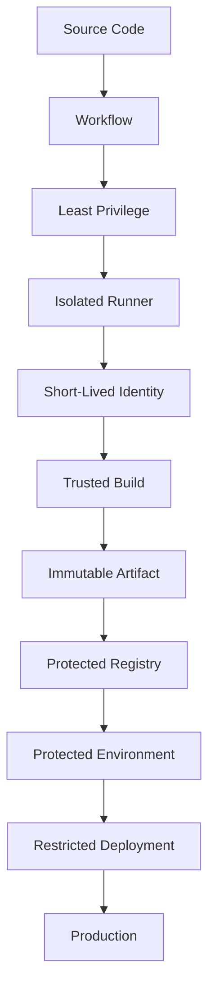

# README

## Overview

This directory contains the security documentation for the GitHub Actions CI/CD playbook.

GitHub Actions security is not limited to protecting secrets or adding security scans to a workflow. A production-grade CI/CD system must control the complete execution path:

```text
Source Code
    ↓
Pull Request
    ↓
Workflow
    ↓
Actions + Dependencies
    ↓
Runner
    ↓
Credentials
    ↓
Build
    ↓
Artifact
    ↓
Registry
    ↓
Deployment
    ↓
Production
```

Each stage introduces different trust boundaries and failure modes. Security therefore needs to be designed across workflow permissions, secrets, untrusted input, third-party actions, dependency supply chain, runners, AWS identity, artifacts, deployments, and operational recovery.

This directory builds from fundamental GitHub Actions security controls to senior-level supply-chain security, runner isolation, artifact integrity, and production security architecture.

## Navigation

| # | File | Description |
|---|---|---|
| 01 | [01- GitHub Actions Security Overview](./01-%20GitHub%20Actions%20Security%20Overview.md) | GitHub Actions security is the combination of workflow permissions, secret protection, execution isolation, supply-chain controls, identity... |
| 02 | [02- GITHUB_TOKEN Security](./02-%20GITHUB_TOKEN%20Security.md) | GITHUB_TOKEN is the GitHub-provided authentication token available to a GitHub Actions workflow. |
| 03 | [03- Permissions and Least Privilege](./03-%20Permissions%20and%20Least%20Privilege.md) | GitHub Actions permissions determine what a workflow can do through its execution identity, particularly through GITHUB_TOKEN. |
| 04 | [04- Secrets Security](./04-%20Secrets%20Security.md) | Secrets are credentials or sensitive values used by CI/CD workflows to authenticate with external systems or protected services. |
| 05 | [05- Environment Secrets and Protection](./05-%20Environment%20Secrets%20and%20Protection.md) | GitHub Actions environments provide a security and deployment boundary around workflows that target different operational stages such as dev... |
| 06 | [06- Script Injection](./06-%20Script%20Injection.md) | Script injection is one of the most important security risks in GitHub Actions because workflow files frequently combine trusted repository... |
| 07 | [07- Untrusted Input Handling](./07-%20Untrusted%20Input%20Handling.md) | GitHub Actions workflows routinely consume data that may be controlled by users or external systems. |
| 08 | [08- Pull Request Security](./08-%20Pull%20Request%20Security.md) | Pull requests are one of the most important security boundaries in GitHub Actions. |
| 09 | [09- pull_request vs pull_request_target](./09-%20pull_request%20vs%20pull_request_target.md) | GitHub Actions pull-request workflows operate across an important trust boundary: the pull request may contain code controlled by a contribu... |
| 10 | [10- Third Party Actions Security](./10-%20Third%20Party%20Actions%20Security.md) | GitHub Actions workflows are composed of executable components. |
| 11 | [11- Action Version Pinning](./11-%20Action%20Version%20Pinning.md) | GitHub Actions workflows depend on executable components such as: |
| 12 | [12- SHA Pinning](./12-%20SHA%20Pinning.md) | SHA pinning is the practice of referencing a GitHub Actions dependency by a specific Git commit SHA instead of a mutable branch or version tag. |
| 13 | [13- Malicious and Compromised Actions](./13-%20Malicious%20and%20Compromised%20Actions.md) | GitHub Actions executes third-party and organization-owned software inside CI/CD workflows. |
| 14 | [14- OIDC Security](./14-%20OIDC%20Security.md) | OpenID Connect (OIDC) allows GitHub Actions workflows to authenticate to external identity providers and cloud platforms using short-lived,... |
| 15 | [15- AWS IAM Trust Policies for OIDC](./15-%20AWS%20IAM%20Trust%20Policies%20for%20OIDC.md) | AWS IAM trust policies define who or what is allowed to assume an IAM role. |
| 16 | [16- Supply Chain Security](./16-%20Supply%20Chain%20Security.md) | Supply chain security in GitHub Actions protects the entire path from source code to production deployment: |
| 17 | [17- Dependency Review and Dependabot](./17-%20Dependency%20Review%20and%20Dependabot.md) | Dependency management is a core software supply chain concern in GitHub Actions. |
| 18 | [18- SBOM and Artifact Provenance](./18-%20SBOM%20and%20Artifact%20Provenance.md) | Software supply-chain security does not end when CI tests pass. |
| 19 | [19- Artifact Attestations and Signing](./19-%20Artifact%20Attestations%20and%20Signing.md) | Artifact signing and attestations extend software supply-chain security beyond simply building and scanning an artifact. |
| 20 | [20- Runner Security](./20-%20Runner%20Security.md) | GitHub Actions runners are the execution environments where workflow jobs actually run. |
| 21 | [21- Self Hosted Runner Security](./21-%20Self%20Hosted%20Runner%20Security.md) | Self-hosted GitHub Actions runners provide organizations with direct control over the machines that execute CI/CD workloads. |
| 22 | [22- Security Best Practices](./22-%20Security%20Best%20Practices.md) | GitHub Actions security is the combination of workflow configuration, identity, permissions, secrets, runner isolation, dependency trust, ar... |

## Security Documentation

| File | Focus |
|---|---|
| `01- GitHub Actions Security Overview.md` | GitHub Actions security model, trust boundaries, security architecture, and core security principles |
| `02- Workflow Security.md` | Workflow-level security controls, execution boundaries, secure workflow design, and configuration risks |
| `03- Permissions and Least Privilege.md` | `GITHUB_TOKEN`, permissions, job-level authorization, and least-privilege design |
| `04- Secrets Security.md` | Repository, organization, and environment secrets, masking, exposure risks, rotation, and secure handling |
| `05- Environment Protection.md` | Development, staging, production environments, approvals, restrictions, and deployment protection |
| `06- Untrusted Input Handling.md` | Shell injection, expression evaluation, workflow inputs, external data, validation, and safe execution |
| `07- pull_request vs pull_request_target.md` | Pull request trust boundaries, fork security, privileged workflows, and `pull_request_target` risks |
| `08- Fork and PR Security.md` | Forked repositories, untrusted code execution, secrets, permissions, and runner isolation |
| `09- Third Party Actions Security.md` | Marketplace actions, action trust, dependencies, permissions, and supply-chain risks |
| `10- Action Pinning.md` | Action versioning, immutable references, SHA pinning, verification, and update management |
| `11- Dependency Security.md` | Application dependencies, lock files, dependency review, Dependabot, package sources, and dependency attacks |
| `12- SHA Pinning.md` | SHA-based action integrity, mutable references, verification, and governance |
| `13- Malicious and Compromised Actions.md` | Detection and containment of malicious or compromised GitHub Actions |
| `14- Dependency Supply Chain Security.md` | Dependency confusion, typosquatting, malicious packages, build scripts, and dependency trust |
| `15- AWS IAM Trust Policies for OIDC.md` | GitHub OIDC, AWS STS, IAM trust policies, repository/branch/environment restrictions, and secure federation |
| `16- Supply Chain Security.md` | End-to-end software supply-chain security across source, workflows, dependencies, runners, artifacts, and deployment |
| `17- Build Integrity.md` | Trusted builds, reproducibility, build isolation, provenance, and build-environment security |
| `18- SBOM and Artifact Provenance.md` | SBOM generation, provenance, dependency visibility, artifact traceability, and verification |
| `19- Artifact Attestations and Signing.md` | Artifact attestations, signatures, provenance, verification, and trusted artifact promotion |
| `20- Runner Security.md` | GitHub-hosted and self-hosted runners, isolation, privileges, network access, and runner lifecycle security |
| `21- Self Hosted Runner Security.md` | Dedicated self-hosted runner hardening, persistent/ephemeral runners, private networks, and production isolation |
| `22- Security Best Practices.md` | Consolidated production security practices, architecture patterns, incident response, governance, and senior-level guidance |

> The exact files present in the repository should be treated as the source of truth for navigation. The table above represents the intended security documentation structure.

## Security Learning Flow

The recommended progression is:

```text
Security Fundamentals
        ↓
Workflow Security
        ↓
Permissions
        ↓
Secrets
        ↓
Environments
        ↓
Untrusted Input
        ↓
Pull Request Security
        ↓
Third-Party Actions
        ↓
Action Pinning
        ↓
Dependency Security
        ↓
AWS OIDC / IAM
        ↓
Supply Chain Security
        ↓
SBOM / Provenance
        ↓
Artifact Signing
        ↓
Runner Security
        ↓
Self-Hosted Runner Security
        ↓
Production Security Architecture
```

This progression moves from individual workflow controls toward system-level CI/CD security.

## Core Security Model

A production GitHub Actions environment should enforce several independent security layers.



No single control should be treated as sufficient.

For example:

```text
SHA Pinning
    +
Least Privilege
    +
Ephemeral Runners
    +
OIDC
    +
Environment Protection
    +
Artifact Provenance
    +
Network Segmentation
```

provides defense in depth across different failure domains.

## GitHub Actions Security Boundaries

Important trust boundaries include:

| Boundary | Security Question |
|---|---|
| Pull Request → Workflow | Is the source trusted? |
| Workflow → Runner | What code can execute? |
| Runner → Repository | What repository data is accessible? |
| Runner → Secrets | Which credentials are available? |
| Runner → AWS | Which IAM role can be assumed? |
| Build → Artifact | Can the artifact be modified? |
| Artifact → Registry | Is the published artifact trusted? |
| Registry → Production | Is the exact artifact being deployed? |
| Deployment → Production | Is authorization and approval enforced? |

Senior-level CI/CD security design starts by identifying these boundaries before selecting individual GitHub Actions features.

## Least Privilege

Every workflow should receive only the permissions it requires.

Prefer:

```yaml
permissions:
  contents: read
```

over broad default permissions.

If only a deployment job requires AWS OIDC:

```yaml
jobs:
  test:
    permissions:
      contents: read

  deploy:
    permissions:
      contents: read
      id-token: write
```

This limits the blast radius if a test job or third-party action is compromised.

## Secrets

Production secrets should be:

- Scoped to the smallest appropriate boundary.
- Unavailable to untrusted pull requests.
- Avoided when short-lived identity federation is available.
- Prevented from appearing in logs.
- Excluded from artifacts.
- Rotated after suspected exposure.

For AWS deployments, prefer:

```text
GitHub Actions
    ↓
OIDC
    ↓
AWS STS
    ↓
Temporary IAM Credentials
```

instead of long-lived AWS access keys stored as GitHub secrets.

## Pull Request Security

A pull request can modify:

- Application code.
- Tests.
- Dependencies.
- Build scripts.
- Workflow files.
- Dockerfiles.
- Configuration.

Therefore, a pull request should not automatically receive production-level privileges.

A secure separation is:

```text
Untrusted Pull Request
        ↓
Isolated CI
        ↓
No Production Secrets
        ↓
No Production Deployment
```

After code reaches a trusted branch:

```text
Trusted Branch
        ↓
Build
        ↓
Immutable Artifact
        ↓
Protected Deployment
```

## Third-Party Action Security

An action is executable code.

Before introducing an action, consider:

- Source repository.
- Maintainer trust.
- Release history.
- Dependencies.
- Permissions required.
- Network access.
- Secrets available to the job.
- Whether the action is pinned.
- Whether the action is still maintained.

For sensitive workflows, prefer immutable SHA references:

```yaml
uses: actions/checkout@<verified-commit-sha>
```

SHA pinning reduces the risk associated with mutable tags, but it does not eliminate the need to review the referenced code.

## Dependency Security

CI pipelines execute application dependencies and build tooling.

A Python pipeline may execute:

```text
pip install
    ↓
Package Installation
    ↓
Build Scripts
    ↓
Application Tests
```

Therefore dependency security must include:

- Locking versions where appropriate.
- Trusted package repositories.
- Dependency review.
- Vulnerability scanning.
- Dependabot.
- Dependency provenance.
- Container base-image controls.

## Supply Chain Security

The CI/CD supply chain includes:

```text
Source
 ↓
Workflow
 ↓
Actions
 ↓
Dependencies
 ↓
Runner
 ↓
Build
 ↓
Artifact
 ↓
Registry
 ↓
Deployment
```

Security controls should protect every stage.

Important concepts include:

- SHA pinning.
- Dependency review.
- SBOM.
- Provenance.
- Attestations.
- Artifact signing.
- Immutable artifacts.
- Trusted builders.
- Reproducible builds.

## Artifact Security

A production pipeline should preferably:

```text
Build
  ↓
Produce Immutable Artifact
  ↓
Store in Registry
  ↓
Promote Same Artifact
  ↓
Production
```

rather than rebuilding independently for staging and production.

For Docker workloads, prefer immutable identities such as:

```text
backend@sha256:<digest>
```

A Git commit SHA tag can also provide useful traceability:

```text
backend:<commit-sha>
```

## SBOM and Provenance

An SBOM answers:

```text
What components are inside this artifact?
```

Provenance answers:

```text
Where did this artifact come from?
How was it built?
Which source and workflow produced it?
```

Attestations and signatures can strengthen the verification model.

A mature artifact lifecycle is:

```text
Source
 ↓
Build
 ↓
SBOM
 ↓
Provenance
 ↓
Attestation / Signature
 ↓
Registry
 ↓
Verification
 ↓
Deployment
```

## Runner Security

Runners are execution environments and should be treated as security-sensitive infrastructure.

Consider:

- GitHub-hosted runners.
- Self-hosted runners.
- Persistent runners.
- Ephemeral runners.
- Runner groups.
- Labels.
- Operating-system hardening.
- Network access.
- Docker privileges.
- Filesystem cleanup.
- Credentials.
- Monitoring.

Sensitive workloads should avoid unnecessary access to private networks and production systems.

## Ephemeral Runner Model

For sensitive workloads, an ephemeral runner can follow:

```text
Provision
    ↓
Trusted Image
    ↓
Register
    ↓
Execute Job
    ↓
Collect Results
    ↓
Destroy
```

This reduces persistent state and cross-job contamination.

## Production Deployment Security

A production-grade pipeline can follow:

```text
Pull Request
    ↓
Lint
    ↓
Unit Tests
    ↓
Integration Tests
    ↓
Security Scan
    ↓
Matrix Testing
    ↓
Build
    ↓
Docker Image
    ↓
ECR
    ↓
Staging
    ↓
Approval
    ↓
Production
    ↓
Monitoring
    ↓
Rollback
```

The deployment path should use:

- Protected environments.
- Restricted IAM roles.
- OIDC.
- Immutable artifacts.
- Deployment concurrency.
- Health validation.
- Rollback procedures.

## Deployment Concurrency

Production deployments should not race each other.

Example:

```yaml
concurrency:
  group: production-deployment
  cancel-in-progress: false
```

This creates a serialization boundary around production deployment operations.

For pull requests, a different policy may be appropriate:

```yaml
concurrency:
  group: pr-${{ github.event.pull_request.number }}
  cancel-in-progress: true
```

The correct policy depends on whether an older run remains valuable.

## AWS Security Model

A secure GitHub Actions → AWS architecture is:

```text
GitHub Actions
      ↓
OIDC Token
      ↓
AWS STS
      ↓
Restricted IAM Role
      ↓
ECR / ECS / EC2 / S3 / Lambda
```

Avoid sharing one highly privileged AWS role across unrelated workflows.

Separate identities where possible:

```text
CI Role
Deployment Role
Infrastructure Role
Read-Only Role
```

## Environment Protection

Production environments should provide stronger controls than development.

| Environment | Typical Security Model |
|---|---|
| Development | Broad developer iteration |
| Staging | Controlled deployment |
| Production | Restricted identity + approval + concurrency |

Production environments may use:

- Required reviewers.
- Deployment restrictions.
- Environment secrets.
- Protected branches.
- Deployment history.

## Monitoring and Incident Response

Security monitoring should cover both GitHub and cloud infrastructure.

Important signals include:

- Workflow changes.
- Permission changes.
- Runner registration.
- Secret changes.
- Environment changes.
- Unexpected deployments.
- AWS STS role assumptions.
- ECR activity.
- IAM modifications.
- Artifact changes.

If a runner is compromised:

```text
Detect
 ↓
Isolate
 ↓
Revoke Credentials
 ↓
Investigate
 ↓
Assess Artifacts
 ↓
Destroy Runner
 ↓
Rebuild Trusted Runner
 ↓
Rebuild Affected Artifacts
 ↓
Recover
```

Restarting a potentially compromised runner is not an adequate recovery strategy.

## Governance

At organizational scale, establish standards for:

- Approved actions.
- SHA pinning.
- Workflow permissions.
- Reusable workflows.
- Runner groups.
- Self-hosted runners.
- Production environments.
- AWS OIDC roles.
- Secret management.
- Artifact retention.
- SBOM and provenance.
- Security scanning.

Use CODEOWNERS for security-sensitive workflow infrastructure.

Example:

```text
.github/workflows/ @platform-security
.github/actions/ @platform-security
```

## Troubleshooting Security Failures

Use a consistent failure-analysis model:

```text
Symptom
  ↓
Possible Causes
  ↓
Isolation Strategy
  ↓
Commands / Checks
  ↓
Root Cause
  ↓
Corrective Action
  ↓
Prevention
```

Common security-related failures include:

- Unexpected permissions.
- Missing secrets.
- Secret exposure.
- Fork PR privilege escalation.
- `pull_request_target` misuse.
- Shell injection.
- Action compromise.
- Dependency compromise.
- Runner contamination.
- OIDC trust-policy failures.
- AWS authorization failures.
- Artifact integrity failures.
- Deployment races.

Useful operational commands include:

```bash
gh workflow list
gh run list
gh run view <run-id>
gh run view <run-id> --log
gh run rerun <run-id>
gh secret list
gh variable list
```

## Security Architecture for a Backend Platform

A production Python backend such as Django or FastAPI can use:

```text
Developer
    ↓
Pull Request
    ↓
GitHub Actions
    ├── Lint
    ├── Unit Tests
    ├── PostgreSQL Integration Tests
    ├── Redis Integration Tests
    ├── Security Scans
    └── Matrix Tests
    ↓
Trusted Build
    ↓
Docker Image
    ↓
SBOM + Provenance
    ↓
ECR
    ↓
Staging
    ↓
Validation
    ↓
Protected Approval
    ↓
OIDC → STS → IAM
    ↓
ECS / EC2 / Kubernetes
    ↓
Monitoring
```

The application stack may include:

```text
Django / FastAPI
PostgreSQL
Redis
Celery
Kafka
Nginx
Docker
AWS
```

Security decisions should be made according to the actual trust and privilege requirements of each component rather than applying identical controls everywhere.

## Senior-Level Security Principles

### Treat Workflows as Infrastructure

A workflow can modify:

- Source repositories.
- Cloud infrastructure.
- Production applications.
- Artifacts.
- Credentials.

Workflow changes therefore require strong review and ownership.

### Separate Build and Deployment Privileges

A build job should generally not need production credentials.

```text
Build
 ↓
Artifact

Deploy
 ↓
Production
```

This limits the blast radius of compromised build tooling.

### Minimize Trust

Ask for every job:

```text
What does this job trust?

What can this job access?

What happens if this job is compromised?
```

These questions are more useful than simply asking whether a workflow is "secure."

### Prefer Short-Lived Identity

For cloud deployments:

```text
OIDC
 ↓
STS
 ↓
Temporary Credentials
```

reduces the operational burden and exposure associated with long-lived credentials.

### Build Once, Promote Many

The same immutable artifact should move through:

```text
Staging
 ↓
Approval
 ↓
Production
```

This reduces differences between environments and improves traceability.

### Design for Recovery

Security controls should assume compromise is possible.

A production system should be able to:

- Revoke credentials.
- Replace runners.
- Rebuild artifacts.
- Roll back deployments.
- Recreate infrastructure.
- Trace artifact provenance.
- Investigate workflow execution.

## Recommended Security Review Order

When reviewing a GitHub Actions repository, inspect security in this order:

```text
1. Workflow Triggers
       ↓
2. Pull Request Trust Boundaries
       ↓
3. GITHUB_TOKEN Permissions
       ↓
4. Secrets and Environments
       ↓
5. Third-Party Actions
       ↓
6. Untrusted Input
       ↓
7. Runner Isolation
       ↓
8. AWS OIDC / IAM
       ↓
9. Artifact Integrity
       ↓
10. Deployment Protection
       ↓
11. Monitoring
       ↓
12. Incident Recovery
```

This order moves from initial code execution toward the highest-impact production boundaries.

## Production Security Checklist

### Workflow Security

- [ ] Workflow files are reviewed and protected.
- [ ] Workflow permissions are explicit.
- [ ] Job-level permissions are minimized.
- [ ] Untrusted inputs are treated as data.
- [ ] Shell interpolation is reviewed.
- [ ] Status functions are used intentionally.
- [ ] Production workflows have controlled triggers.

### Pull Request Security

- [ ] Fork PRs are treated as untrusted.
- [ ] Privileged runners are not exposed to untrusted code.
- [ ] `pull_request_target` is used only when justified.
- [ ] Untrusted code is not executed inside privileged workflows.
- [ ] Production secrets are unavailable to untrusted validation jobs.

### Action Security

- [ ] Third-party actions are reviewed.
- [ ] Sensitive actions are SHA-pinned.
- [ ] Action dependencies are understood.
- [ ] Approved action sources are defined.
- [ ] Reusable workflows are protected.

### Secret Security

- [ ] Production secrets are environment-scoped.
- [ ] Secrets are not logged.
- [ ] Secrets are not included in artifacts.
- [ ] Secrets are not embedded into Docker images.
- [ ] Long-lived cloud credentials are minimized.
- [ ] Credential rotation procedures exist.

### Runner Security

- [ ] Runner groups are restricted.
- [ ] Sensitive runners are isolated.
- [ ] Runner software is maintained.
- [ ] Host privileges are minimized.
- [ ] Network access is restricted.
- [ ] Ephemeral runners are considered.
- [ ] Persistent runner state is controlled.

### Supply Chain Security

- [ ] Dependencies are controlled.
- [ ] Dependency review is enabled where appropriate.
- [ ] Dependabot is used where appropriate.
- [ ] Container images are scanned.
- [ ] SBOMs are generated where required.
- [ ] Artifact provenance is available where required.
- [ ] Artifact signing or attestations are considered.

### AWS Security

- [ ] GitHub OIDC is used where appropriate.
- [ ] IAM trust policies are restrictive.
- [ ] IAM permissions follow least privilege.
- [ ] Production roles are separated from CI roles.
- [ ] STS credentials are temporary.
- [ ] Cloud activity is auditable.

### Deployment Security

- [ ] Production environments are protected.
- [ ] Required approvals are configured where necessary.
- [ ] Deployment concurrency is controlled.
- [ ] Artifacts are immutable.
- [ ] Rollback is defined and tested.
- [ ] Health validation exists.
- [ ] The same artifact is promoted between environments.

## Key Takeaways

- **GitHub Actions security is an end-to-end system concern** covering workflows, permissions, secrets, actions, dependencies, runners, artifacts, cloud identities, and deployments.
- **Untrusted code must remain separated from privileged execution**, particularly production secrets, self-hosted runners, private networks, and deployment identities.
- **Least privilege and short-lived identity reduce blast radius**, with explicit workflow permissions, restricted IAM roles, protected environments, and OIDC-based AWS authentication.
- **Supply-chain controls protect the path from source to production**, using reviewed and pinned actions, controlled dependencies, immutable artifacts, SBOMs, provenance, attestations, and signing where appropriate.
- **Production security requires recovery as well as prevention**: runners, credentials, artifacts, and deployments must be replaceable, traceable, revocable, and recoverable.