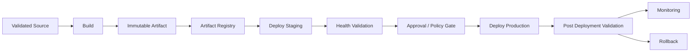
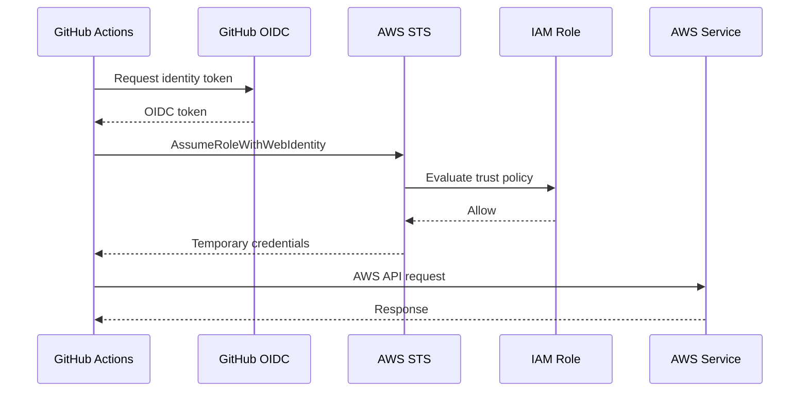
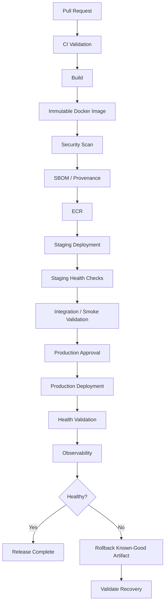

# 02- CD Pipeline Architecture

## Overview

Continuous Delivery and Continuous Deployment extend CI beyond validation into the controlled delivery of software to runtime environments.

A production CD pipeline should answer five fundamental questions:

- What artifact is being deployed?
- Where is it being deployed?
- Who or what is authorized to deploy it?
- How is deployment safety validated?
- How is the system recovered when deployment fails?

A mature backend CD architecture separates **build**, **artifact creation**, **promotion**, and **deployment**:

```text
Source
  ↓
CI Validation
  ↓
Build
  ↓
Immutable Artifact
  ↓
Artifact Registry
  ↓
Staging
  ↓
Validation
  ↓
Approval / Policy Gate
  ↓
Production
  ↓
Health Validation
  ↓
Monitoring
  ↓
Rollback if Required
```

The central production principle is:

```text
Build once
    ↓
Produce immutable artifact
    ↓
Promote the same artifact
```

The production environment should not require rebuilding the application.

---

## Continuous Delivery vs Continuous Deployment

### Continuous Delivery

Continuous Delivery keeps software continuously deployable while allowing controlled production promotion.

```text
Code
 ↓
CI
 ↓
Artifact
 ↓
Staging
 ↓
Approval
 ↓
Production
```

A manual approval may exist between staging and production.

### Continuous Deployment

Continuous Deployment automatically promotes validated changes to production.

```text
Code
 ↓
CI
 ↓
Artifact
 ↓
Staging
 ↓
Automated Validation
 ↓
Production
```

The distinction is primarily in the promotion policy, not in the artifact architecture.

| Concern | Continuous Delivery | Continuous Deployment |
|---|---|---|
| Build | Automated | Automated |
| Testing | Automated | Automated |
| Artifact | Immutable | Immutable |
| Staging | Common | Common |
| Production approval | May be required | Usually automated |
| Production deployment | Controlled | Automatic |
| Rollback | Required | Required |
| Environment protection | Common | Common |

---

## CD Pipeline Architecture

A production backend pipeline can be modeled as:



The architecture separates responsibilities:

| Layer | Responsibility |
|---|---|
| CI | Validate source |
| Build | Produce deployable artifact |
| Registry | Store immutable artifact |
| Staging | Validate deployment behavior |
| Approval | Apply release policy |
| Production | Serve real traffic |
| Monitoring | Validate runtime behavior |
| Rollback | Restore a known-good state |

---

## Build Once, Promote Many

The most important CD architecture principle is to avoid rebuilding for each environment.

### Weak Architecture

```text
Source
 ├── Build → Staging
 │
 └── Build → Production
```

The two builds can differ because of:

- Dependency changes
- Base image changes
- Build tooling changes
- External downloads
- Environment-dependent build behavior
- Timestamps or generated metadata

### Preferred Architecture

```text
Source
   ↓
Build
   ↓
Immutable Artifact
   ↓
Registry
   ├── Staging
   └── Production
```

The artifact that passed staging is the artifact promoted to production.

This improves:

- Reproducibility
- Traceability
- Rollback
- Auditability
- Deployment confidence

---

## Artifact Identity

An artifact should have a stable identity.

For a Docker image:

```text
backend:7f3a8e2
```

where `7f3a8e2` represents a source revision.

An even stronger identity is the registry digest:

```text
backend@sha256:<digest>
```

### Tag vs Digest

| Identifier | Characteristic |
|---|---|
| `latest` | Mutable |
| `1.4.0` | Human-readable, may be mutable |
| Git SHA tag | Strong source correlation |
| Registry digest | Immutable artifact identity |

Production deployment systems should avoid relying on mutable tags as the sole artifact identity.

---

## Artifact Registry

The registry is the boundary between build and deployment.

For containerized applications:

```text
GitHub Actions
      ↓
Docker Build
      ↓
Image Scan
      ↓
ECR
      ↓
Staging
      ↓
Production
```

Amazon ECR can store Docker images used by:

- ECS
- EKS
- EC2-based workloads
- Other container platforms

The registry should retain sufficient metadata to answer:

```text
Which source produced this artifact?
Which workflow produced it?
Which commit produced it?
Which version was deployed?
Which environments consumed it?
```

---

## Docker Build for CD

A production build should use deterministic and reproducible inputs as much as practical.

```yaml
- name: Set up Docker Buildx
  uses: docker/setup-buildx-action@v3

- name: Build image
  uses: docker/build-push-action@v6
  with:
    context: .
    push: false
    tags: backend:${{ github.sha }}
```

Buildx supports:

- Multi-platform builds
- Advanced caching
- Build graph optimization
- Registry-based workflows

### Multi-Stage Builds

```dockerfile
FROM python:3.12-slim AS builder

WORKDIR /build

COPY pyproject.toml .
COPY src ./src

RUN pip install --no-cache-dir build \
    && python -m build

FROM python:3.12-slim

WORKDIR /app

COPY --from=builder /build/dist ./dist

RUN pip install --no-cache-dir ./dist/*.whl

USER 10001

CMD ["python", "-m", "myapp"]
```

The production image should contain only what is required at runtime.

---

## Docker Layer Caching

Build caching can reduce CD build time.

```yaml
- name: Build image
  uses: docker/build-push-action@v6
  with:
    context: .
    push: false
    tags: backend:${{ github.sha }}
    cache-from: type=gha
    cache-to: type=gha,mode=max
```

Caching is an optimization, not a correctness dependency.

A production pipeline must still work when the cache is unavailable or invalidated.

---

## Artifact Promotion

A promotion workflow should reference the existing artifact.

```text
Build
  ↓
backend@sha256:abc123
  ↓
ECR
  ↓
Staging
  ↓
Validation
  ↓
Production
```

The production deployment should not run:

```text
docker build
```

again.

Instead, it should consume the already-built artifact.

---

## Environment Promotion

A typical environment lifecycle is:

```text
Development
    ↓
Staging
    ↓
Production
```

Each environment should have a clear purpose.

| Environment | Purpose |
|---|---|
| Development | Developer integration |
| Staging | Production-like validation |
| Production | Real user traffic |

The same artifact should move through environments while environment-specific configuration is injected at deployment time.

---

## Environment Configuration

Application code and deployment configuration should be separated.

For example:

```text
Artifact
  ├── Application Code
  ├── Dependencies
  └── Runtime

Environment
  ├── Database URL
  ├── Redis URL
  ├── API endpoints
  └── Credentials
```

Do not rebuild the application merely because the deployment target has different configuration.

---

## GitHub Environments

GitHub environments can create deployment boundaries:

```yaml
jobs:
  deploy:
    environment:
      name: production
```

Environments can be used with:

- Environment secrets
- Environment variables
- Required reviewers
- Deployment protection
- Branch restrictions
- Deployment history

A common production model is:

```text
Build
  ↓
Staging
  ↓
Automated Validation
  ↓
Production Environment
  ↓
Approval
  ↓
Deployment
```

---

## Deployment Approvals

Manual approval is useful when production changes require human authorization.

Examples:

- Regulated systems
- High-risk releases
- Database migrations
- Infrastructure changes
- Major application versions

Approval should be treated as a policy boundary, not as a substitute for automated validation.

A strong model is:

```text
Automated Tests
      ↓
Security Checks
      ↓
Staging Validation
      ↓
Human Approval
      ↓
Production
```

Human approval should not replace CI quality gates.

---

## Deployment Concurrency

Two production deployments should not accidentally modify the same environment simultaneously.

```yaml
concurrency:
  group: production-deployment
  cancel-in-progress: false
```

This creates a deployment serialization boundary.

### Why Cancellation Matters

For PR CI, canceling an outdated run is often desirable:

```yaml
concurrency:
  group: ci-${{ github.workflow }}-${{ github.ref }}
  cancel-in-progress: true
```

For production deployment, canceling an active deployment can be dangerous.

Prefer:

```yaml
cancel-in-progress: false
```

when an active deployment should be allowed to complete safely.

---

## Deployment Race Conditions

Without concurrency control:

```text
Deployment A ────────→ Production
             \
Deployment B ─────────→ Production
```

Both deployments may modify:

- Application version
- Configuration
- Database state
- Infrastructure
- Load balancer routing

Possible outcomes include:

- Older code replacing newer code
- Incorrect rollback
- Mixed infrastructure state
- Conflicting migrations

Concurrency groups reduce this class of race condition.

---

## Rolling Deployments

A rolling deployment gradually replaces existing instances.

```text
Version A
Version A
Version A
Version A

       ↓

Version B
Version A
Version A
Version A

       ↓

Version B
Version B
Version A
Version A

       ↓

Version B
Version B
Version B
Version B
```

Advantages:

- Lower infrastructure overhead
- Gradual replacement
- Common with ECS and Kubernetes

Limitations:

- Multiple application versions coexist
- Database compatibility is important
- Rollback may require another deployment

---

## Blue/Green Deployments

Blue/green maintains two environments.

```text
                 ┌── Blue
Load Balancer ───┤
                 └── Green
```

For example:

```text
Blue  → Current Production
Green → New Version
```

Traffic is switched after validation.

### Advantages

- Fast traffic switching
- Clear deployment boundary
- Straightforward rollback

### Limitations

- Higher infrastructure cost
- Duplicate runtime capacity
- Database changes still require compatibility planning

---

## Canary Deployments

Canary deployment sends a small percentage of traffic to the new version.

```text
Users
  │
  ├── 95% → Stable
  │
  └── 5%  → Canary
```

The canary can be evaluated using:

- Error rate
- Latency
- CPU/memory
- Business metrics
- Dependency failures

Traffic can then be progressively shifted.

```text
5% → 25% → 50% → 100%
```

Canary deployment requires strong observability. Without reliable telemetry, the deployment strategy provides limited value.

---

## Zero-Downtime Deployment

Zero downtime is a system property rather than a single GitHub Actions feature.

It requires coordination between:

- Load balancers
- Health checks
- Application startup
- Connection draining
- Graceful shutdown
- Deployment strategy
- Database compatibility
- Background workers

A typical flow:

```text
Start New Version
      ↓
Readiness Check
      ↓
Add to Traffic
      ↓
Drain Old Version
      ↓
Terminate Old Version
```

---

## Health Validation

Deployment success should not be defined solely by an exit code.

A deployment command can succeed while the application remains unhealthy.

Validation should include:

- Process health
- Readiness
- HTTP health endpoints
- Dependency connectivity
- Error rate
- Latency
- Application logs
- Infrastructure health

Example:

```bash
curl --fail --silent \
  https://staging.example.com/health/ready
```

For stronger validation:

```text
Deployment
    ↓
Readiness
    ↓
Smoke Test
    ↓
Metrics Check
    ↓
Promotion
```

---

## Health Endpoints

A backend application may expose:

```text
/health/live
/health/ready
```

Conceptually:

```text
Liveness
  → Is the process alive?

Readiness
  → Can the application safely receive traffic?
```

A readiness check may validate:

- Database connectivity
- Required configuration
- Critical dependencies

Avoid making liveness depend on every external dependency. A temporary dependency failure should not necessarily cause the orchestrator to restart a healthy process repeatedly.

---

## Deployment Validation for Django

A Django deployment can validate:

```bash
python manage.py check
python manage.py migrate --check
```

Then run an HTTP smoke test:

```bash
curl --fail --silent \
  https://staging.example.com/health/ready
```

Production deployment should also validate application behavior after traffic is enabled.

---

## Deployment Validation for FastAPI

For FastAPI:

```bash
curl --fail --silent \
  https://staging.example.com/health
```

Additional checks can validate critical endpoints:

```bash
curl --fail --silent \
  https://staging.example.com/api/v1/status
```

Do not make smoke tests dependent on destructive operations.

---

## Database Migration Strategy

CD architecture becomes significantly more difficult when application and database schemas change together.

A safer model is:

```text
Expand
  ↓
Deploy Compatible Application
  ↓
Backfill
  ↓
Switch Application Behavior
  ↓
Contract
```

### Expand

Add the new database structure while preserving compatibility with the old application.

### Deploy

Deploy application code that can operate with both old and new schema states.

### Backfill

Populate required data asynchronously where possible.

### Switch

Enable the new behavior.

### Contract

Remove obsolete database structures only after old application versions are no longer active.

This approach is particularly important for rolling deployments where old and new application versions can coexist.

---

## Backward Compatibility

During deployment:

```text
Old Version ─┐
             ├──→ Database
New Version ─┘
```

Both versions may temporarily access the same database.

Therefore:

- New columns should often be additive first
- Removing columns requires coordination
- API contracts should remain compatible
- Kafka message schemas should support rolling consumers
- gRPC contracts should consider older clients
- Redis key migrations should avoid immediate invalidation where unsafe

---

## AWS OIDC Architecture

GitHub Actions can authenticate to AWS without storing long-lived access keys.



Typical workflow permission:

```yaml
permissions:
  contents: read
  id-token: write
```

The AWS IAM role should be restricted using trust-policy conditions.

---

## IAM Trust Policy

The trust policy defines who can assume the deployment role.

Conceptually:

```text
GitHub Repository
      ↓
Branch / Environment Claim
      ↓
OIDC Token
      ↓
IAM Trust Policy
      ↓
AWS Role
```

Restrict roles by:

- Repository
- Organization
- Branch
- GitHub environment
- Other relevant OIDC claims

Avoid broad trust policies that allow unrelated repositories to assume the same production role.

---

## AWS Deployment Targets

GitHub Actions can deploy to services including:

- ECR
- ECS
- EC2
- S3
- Lambda
- CloudFormation
- Terraform-managed infrastructure

The CD architecture should keep the GitHub workflow responsible for orchestration while AWS services remain responsible for runtime execution.

---

## ECR Deployment Flow

A container deployment may look like:

```text
GitHub Actions
      ↓
Build Docker Image
      ↓
Scan
      ↓
Generate SBOM
      ↓
Authenticate using OIDC
      ↓
Push to ECR
      ↓
Record Digest
      ↓
Deploy ECS
      ↓
Validate Health
```

The digest should be retained as deployment metadata.

---

## ECS Deployment

Conceptually:

```text
ECR Image
    ↓
ECS Task Definition
    ↓
ECS Service
    ↓
Load Balancer
    ↓
Application
```

A deployment should update the task definition to reference the intended immutable image.

Health validation should confirm:

- Tasks become healthy
- Target groups become healthy
- Application readiness succeeds
- Error rates remain acceptable

---

## EC2 Deployment

For EC2-based systems, GitHub Actions may:

```text
Build Artifact
    ↓
Upload
    ↓
EC2 / Deployment System
    ↓
Install
    ↓
Restart / Reload
    ↓
Health Check
```

Avoid making production servers depend on mutable local build processes when an immutable artifact can be distributed instead.

---

## Lambda Deployment

A Lambda deployment can follow:

```text
Source
  ↓
Build Package / Image
  ↓
Artifact
  ↓
Deploy Lambda
  ↓
Version
  ↓
Alias / Traffic
  ↓
Validation
```

Versioned deployments make rollback easier than overwriting an untracked production state.

---

## Infrastructure as Code

CD can also manage infrastructure through:

- CloudFormation
- Terraform

A common architecture is:

```text
Pull Request
   ↓
IaC Validation
   ↓
Plan
   ↓
Approval
   ↓
Apply
   ↓
Infrastructure Validation
```

Infrastructure deployment should use the same principles as application deployment:

- Review
- Least privilege
- Controlled environments
- State management
- Concurrency
- Rollback/recovery planning

---

## Application Deployment vs Infrastructure Deployment

These are related but distinct workflows.

| Concern | Application CD | Infrastructure CD |
|---|---|---|
| Artifact | Container/package | IaC configuration/state |
| Main target | Runtime | Cloud infrastructure |
| Rollback | Previous artifact | State/configuration recovery |
| Validation | Health checks | Infrastructure validation |
| State | Runtime state | IaC state |
| Approval | Environment | Often environment/change policy |

Avoid tightly coupling unrelated infrastructure changes to every application deployment.

---

## Release Management

A release pipeline may be triggered by a Git tag:

```text
git tag v1.8.0
        ↓
Push tag
        ↓
Release Workflow
        ↓
Build Artifact
        ↓
Test
        ↓
Publish
```

Example:

```yaml
on:
  push:
    tags:
      - "v*"
```

GitHub Releases can provide:

- Versioned releases
- Release notes
- Release artifacts
- Pre-releases

---

## Semantic Versioning

Semantic versioning generally follows:

```text
MAJOR.MINOR.PATCH
```

For example:

```text
2.4.1
```

Use versioning consistently with the compatibility guarantees of the application.

A Docker image can contain both:

```text
backend:2.4.1
backend:<commit-sha>
```

The semantic tag is useful for release identification, while the commit identity provides stronger source traceability.

---

## Pre-Release Workflow

A release pipeline may support:

```text
2.5.0-alpha.1
2.5.0-beta.1
2.5.0
```

Pre-releases can be deployed to non-production environments without exposing them to production traffic.

---

## Reusable Deployment Workflows

Deployment logic should not be duplicated across repositories.

A reusable deployment workflow can expose a contract:

```yaml
on:
  workflow_call:
    inputs:
      environment:
        required: true
        type: string

      image:
        required: true
        type: string

    secrets:
      AWS_ROLE_ARN:
        required: true
```

A caller:

```yaml
jobs:
  deploy:
    uses: organization/platform/.github/workflows/deploy.yml@v1
    with:
      environment: staging
      image: backend@sha256:abc123
    secrets:
      AWS_ROLE_ARN: ${{ secrets.AWS_ROLE_ARN }}
```

The reusable workflow should own deployment mechanics while the calling repository provides the deployment intent.

---

## Deployment Workflow vs Composite Action

A deployment workflow often requires:

- Multiple jobs
- Environment protection
- Approvals
- Job dependencies
- Deployment concurrency
- Cloud authentication
- Validation

Therefore a reusable workflow is generally the appropriate abstraction.

A composite action is better suited for a reusable step sequence such as:

```text
Authenticate
↓
Configure CLI
↓
Execute Deployment Command
```

---

## CD Security Model

Production deployment should be a privileged boundary.

A useful architecture is:

```text
CI Job
  │
  │ Read-only
  ▼
Build Artifact
  │
  ▼
Deployment Job
  │
  ├── id-token: write
  ├── Environment: production
  └── AWS Role
        │
        ▼
     Production
```

Do not grant deployment permissions to every CI job.

This limits blast radius.

---

## Least-Privilege Deployment

Example:

```yaml
jobs:
  test:
    permissions:
      contents: read

  deploy:
    permissions:
      contents: read
      id-token: write
```

The test job does not need cloud deployment permissions.

The deployment role should also contain only required AWS permissions.

---

## Production Secrets

Prefer:

```text
GitHub OIDC
      ↓
AWS STS
      ↓
Temporary Credentials
```

over:

```text
GitHub Secret
      ↓
Long-Lived AWS Access Key
```

Environment-specific application secrets should preferably come from an appropriate runtime secret-management system rather than being baked into container images.

Never:

```dockerfile
ENV DATABASE_PASSWORD=production-secret
```

and never commit production credentials into the repository.

---

## Untrusted Pull Requests

Production deployment should never automatically trust arbitrary fork code.

A safe architecture is:

```text
Fork PR
  ↓
Unprivileged CI
  ↓
Tests
```

while:

```text
Trusted Main Branch
  ↓
Build
  ↓
Protected Deployment
```

Be particularly cautious with:

```text
pull_request_target
+
checkout of PR code
+
secrets
+
write permissions
```

This combination can cross a critical security boundary.

---

## Third-Party Action Security in CD

Deployment workflows often have the highest privileges, so third-party action risk is amplified.

A compromised action inside a deployment job may gain access to:

- Cloud credentials
- Production configuration
- Deployment APIs
- Repository write access

Use:

- Trusted action sources
- SHA pinning
- Least-privilege permissions
- Minimal secrets
- Dedicated deployment jobs
- Protected environments

---

## Artifact Security

An artifact should be treated as a security-sensitive object.

Recommended controls include:

- Immutable artifact identity
- Vulnerability scanning
- SBOM generation
- Provenance
- Attestations
- Signing where required
- Registry access controls

Conceptually:

```text
Source
 ↓
Build
 ↓
Artifact
 ├── SBOM
 ├── Provenance
 └── Signature / Attestation
 ↓
Registry
 ↓
Deployment
```

---

## SBOM

A Software Bill of Materials describes components contained in an artifact.

For a Python application, this may include:

```text
Django
FastAPI
requests
pydantic
cryptography
...
```

For a container it can also include:

- Base image packages
- OS libraries
- Application dependencies

SBOMs support:

- Vulnerability investigation
- Dependency visibility
- Compliance
- Incident response

---

## Artifact Provenance

Provenance answers questions such as:

```text
Who built this artifact?
From which source?
Using which workflow?
When?
Under which build environment?
```

This improves confidence that the artifact came from an expected build process.

---

## Artifact Attestations

Attestations can associate metadata with an artifact.

Conceptually:

```text
Artifact
   +
Build Identity
   +
Source Identity
   +
Build Metadata
```

This can support verification before deployment.

---

## Runner Architecture for CD

Production deployment runners require stronger controls than ordinary CI runners.

Possible architecture:

```text
                    GitHub Actions
                          │
                 Deployment Workflow
                          │
                   Protected Job
                          │
                    Runner Group
                          │
              ┌───────────┴───────────┐
              │                       │
       Private Network          AWS APIs
```

Consider:

- Dedicated runner groups
- Network segmentation
- Ephemeral runners
- Minimal permissions
- Egress restrictions
- Runner lifecycle management
- Auditability

A runner with production network access should not execute arbitrary untrusted pull request code.

---

## Persistent vs Ephemeral Deployment Runners

### Persistent

```text
Runner
  ↓
Deployment A
  ↓
Deployment B
  ↓
Deployment C
```

Advantages:

- Lower startup overhead
- Simple infrastructure

Risks:

- Residual state
- Credential leakage
- Workspace contamination
- Persistent compromise

### Ephemeral

```text
Provision
   ↓
Deploy
   ↓
Collect Results
   ↓
Destroy
```

Advantages:

- Reduced persistence
- Better isolation
- Easier cleanup

Trade-off:

- More infrastructure orchestration
- Higher startup overhead

---

## Deployment Monitoring

Post-deployment monitoring should verify more than process health.

Useful signals include:

- HTTP error rate
- Request latency
- CPU
- Memory
- Database errors
- Redis errors
- Kafka consumer lag
- Celery queue depth
- Load balancer health
- Application-specific business metrics

For example:

```text
Deployment
   ↓
Health Check
   ↓
5xx Rate
   ↓
Latency
   ↓
Dependency Errors
   ↓
Promotion / Rollback
```

---

## Rollback

Rollback should use a known-good artifact.

```text
Production
   ↓
Version B
   ↓
Failure
   ↓
Rollback
   ↓
Version A
```

For Docker:

```text
backend@sha256:good-digest
```

should be retained as a deployable reference.

### Rollback Is Not Always Application-Only

Rollback can be complicated by:

- Irreversible database migrations
- Data format changes
- External API changes
- Kafka schema changes
- Background jobs
- Cache state
- Infrastructure changes

Therefore rollback must be designed at the system level.

---

## Automated Rollback

Automated rollback can be appropriate when failure signals are objective.

For example:

```text
Deploy
  ↓
Wait for readiness
  ↓
Measure health
  ↓
Threshold exceeded?
  ├── No → Continue
  └── Yes → Rollback
```

The rollback trigger should be carefully designed to avoid reacting to temporary noise.

---

## Manual Rollback

Manual rollback remains useful for:

- Complex incidents
- Database issues
- Business-impacting behavior
- Partial deployments
- External dependency failures

Operational documentation should identify:

- Previous artifact
- Deployment command
- Required permissions
- Validation steps
- Escalation path

---

## Disaster Recovery

CD infrastructure itself should be recoverable.

Critical components include:

- Workflow definitions
- Reusable workflows
- Infrastructure-as-code
- Artifact registry
- Deployment configuration
- Environment configuration
- Runner infrastructure
- Access policies

A production recovery plan should answer:

```text
Can we redeploy if the current CI runner infrastructure disappears?
Can we identify the last known-good artifact?
Can we recreate deployment infrastructure?
Can we authenticate without manually generated long-lived credentials?
```

---

## High Availability of Delivery

Application HA and delivery HA are different concerns.

An application may have multiple instances but still be difficult to deploy if:

- Only one runner exists
- Registry access is a single point of failure
- Deployment state is stored manually
- Workflow configuration exists only outside version control

Use:

- Multiple runner capacity where required
- Infrastructure-as-code
- Version-controlled workflows
- Durable artifact storage
- Automated recovery procedures

---

## CD Cost Optimization

Major CD cost drivers include:

- Docker build time
- Large runners
- Excessive deployment frequency
- Long-lived staging environments
- Blue/green infrastructure
- Large artifact storage
- Large test matrices
- Repeated builds

Cost optimization techniques:

- Build once
- Cache dependencies and Docker layers
- Use targeted testing
- Destroy temporary environments
- Right-size runners
- Avoid unnecessary rebuilds
- Retain artifacts according to operational requirements

Do not optimize away validation required for production safety.

---

## Deployment Observability

Record deployment metadata such as:

```text
Application
Version
Commit SHA
Artifact Digest
Environment
Workflow Run
Deployment Time
Actor
Result
```

This enables questions such as:

```text
Which version is running?
Which commit produced it?
Which workflow deployed it?
When was it deployed?
Who initiated it?
What changed?
```

A deployment should be traceable from source to runtime.

---

## Operational Deployment Metadata

A useful deployment record:

```json
{
  "service": "backend-api",
  "environment": "production",
  "commit": "7f3a8e2",
  "image_digest": "sha256:abc123...",
  "workflow_run": "123456",
  "deployed_at": "2026-09-28T10:30:00Z",
  "status": "success"
}
```

This metadata can support:

- Incident investigation
- Auditing
- Rollback
- Release management
- Change correlation

---

## CD Troubleshooting

Use a consistent failure model:

```text
Symptom
  ↓
Possible Causes
  ↓
Isolation Strategy
  ↓
Commands / Checks
  ↓
Root Cause
  ↓
Corrective Action
  ↓
Prevention
```

---

## Deployment Workflow Not Starting

Check:

- Trigger configuration
- Branch/tag filters
- `workflow_dispatch`
- `workflow_call`
- Required branch
- Workflow file location
- Environment protection
- Repository policy

CLI:

```bash
gh workflow list
```

---

## Environment Approval Blocking Deployment

Check:

- Environment name
- Required reviewers
- Branch restrictions
- Pending deployment state
- Deployment permissions

Inspect the workflow run:

```bash
gh run view <run-id>
```

---

## Artifact Not Found

Check:

- Artifact name
- Registry repository
- Commit SHA
- Image digest
- Workflow dependency
- Artifact retention
- Permissions

For container deployments, verify the exact digest rather than assuming a tag points to the intended image.

---

## Docker Build Failure

Check:

```bash
docker build .
```

Then inspect:

- Build context
- `.dockerignore`
- Base image
- Dependency installation
- Architecture
- Build arguments
- Secrets
- Network access

Do not put credentials in Docker build arguments when a secure build-secret mechanism is appropriate.

---

## ECR Authentication Failure

Separate:

```text
OIDC
 ↓
STS
 ↓
IAM Role
 ↓
ECR Permission
 ↓
Docker Login
 ↓
Push
```

A successful OIDC role assumption does not automatically mean ECR permissions are correct.

---

## ECS Deployment Failure

Separate:

```text
Image
 ↓
Task Definition
 ↓
ECS Service
 ↓
Target Group
 ↓
Health Check
 ↓
Traffic
```

Inspect:

- ECS service events
- Task status
- Container logs
- Image availability
- IAM execution role
- Target group health
- Application readiness

---

## Deployment Succeeds but Application Is Unhealthy

This usually indicates that deployment completion was incorrectly treated as application health.

Check:

- Readiness endpoint
- Application logs
- Dependency connectivity
- Database migrations
- Configuration
- Secrets
- Load balancer health
- Runtime resource limits

---

## Rollback Fails

Possible causes include:

- Previous artifact unavailable
- Database schema incompatible
- Old configuration removed
- External API changed
- Artifact registry inaccessible
- Previous version depends on deleted infrastructure

Rollback testing should be part of production readiness.

---

## Concurrency Problems

If two deployments overlap, inspect:

```yaml
concurrency:
  group: production-deployment
```

Verify:

- Same group name
- Correct workflow scope
- `cancel-in-progress`
- Environment boundaries

A concurrency group that is too broad can serialize unrelated services unnecessarily.

A group that is too narrow may fail to protect the shared environment.

---

## AWS Authentication Troubleshooting

Check:

```text
GitHub OIDC Provider
       ↓
id-token: write
       ↓
IAM Trust Policy
       ↓
Subject / Audience
       ↓
STS
       ↓
Role Permissions
```

Common failures:

- Missing `id-token: write`
- Incorrect repository claim
- Incorrect branch condition
- Incorrect environment claim
- Incorrect audience
- Missing IAM permissions
- Wrong role ARN

---

## GitHub CLI Operational Commands

List workflows:

```bash
gh workflow list
```

Run a workflow:

```bash
gh workflow run deploy.yml
```

List recent runs:

```bash
gh run list
```

Inspect a run:

```bash
gh run view <run-id>
```

View logs:

```bash
gh run view <run-id> --log
```

Rerun:

```bash
gh run rerun <run-id>
```

List releases:

```bash
gh release list
```

List repository secrets:

```bash
gh secret list
```

List variables:

```bash
gh variable list
```

Use these commands for operational diagnosis rather than relying exclusively on the GitHub web interface.

---

## Production CD Reference Architecture



The important boundaries are:

```text
CI Boundary
    ↓
Artifact Boundary
    ↓
Registry Boundary
    ↓
Staging Boundary
    ↓
Approval Boundary
    ↓
Production Boundary
    ↓
Recovery Boundary
```

Each boundary should have explicit security, reliability, and operational responsibilities.

---

## Production Deployment Workflow Example

```yaml
name: Deploy Backend

on:
  workflow_dispatch:
    inputs:
      environment:
        description: Deployment environment
        required: true
        type: choice
        options:
          - staging
          - production

permissions:
  contents: read

concurrency:
  group: deploy-${{ inputs.environment }}
  cancel-in-progress: false

jobs:
  deploy:
    runs-on: ubuntu-latest

    environment:
      name: ${{ inputs.environment }}

    permissions:
      contents: read
      id-token: write

    steps:
      - name: Configure AWS credentials
        uses: aws-actions/configure-aws-credentials@v4
        with:
          role-to-assume: ${{ secrets.AWS_ROLE_ARN }}
          aws-region: ${{ vars.AWS_REGION }}

      - name: Deploy immutable image
        env:
          IMAGE_DIGEST: ${{ vars.IMAGE_DIGEST }}
        run: |
          echo "Deploying image: ${IMAGE_DIGEST}"

      - name: Validate deployment
        run: |
          curl --fail --silent \
            https://example.com/health/ready
```

The deployment job is intentionally isolated from ordinary CI jobs.

---

## Production Deployment Checklist

### Artifact

- [ ] Artifact has a unique identity
- [ ] Artifact is immutable
- [ ] Artifact maps to a source commit
- [ ] Artifact has appropriate security metadata
- [ ] Production consumes the same artifact validated in staging

### Environment

- [ ] Staging and production are distinct
- [ ] Environment protection is configured
- [ ] Production secrets are scoped
- [ ] Branch restrictions are intentional
- [ ] Deployment history is available

### Security

- [ ] `GITHUB_TOKEN` permissions are minimized
- [ ] AWS uses OIDC where appropriate
- [ ] IAM trust policy is restricted
- [ ] Deployment role is least privilege
- [ ] Third-party actions are reviewed
- [ ] Deployment runners are protected
- [ ] Untrusted PR code cannot access production credentials

### Deployment

- [ ] Deployment concurrency is configured
- [ ] Health validation exists
- [ ] Rollback is documented
- [ ] Database migrations are deployment-safe
- [ ] Rolling/blue-green/canary strategy is intentional
- [ ] Production traffic is protected during deployment

### Operations

- [ ] Deployment metadata is recorded
- [ ] Logs are accessible
- [ ] Metrics are monitored
- [ ] Failure diagnosis is documented
- [ ] Artifact retention is appropriate
- [ ] Recovery procedures have been tested

---

## Senior-Level Design Questions

### Why should production not rebuild the Docker image?

Because rebuilding can produce a different artifact. Promotion should move the already-tested artifact through environments.

### Why use a deployment-specific job?

To isolate elevated permissions and production credentials from ordinary CI jobs.

### Why use OIDC instead of AWS access keys?

OIDC enables short-lived credentials and avoids storing long-lived cloud credentials in GitHub secrets.

### Why is deployment concurrency necessary?

It prevents multiple deployments from racing against the same production environment.

### Why is artifact immutability important?

It makes deployments traceable and rollback deterministic.

### Why can rolling deployments break database migrations?

Because old and new application versions can coexist and access the same database schema.

### When would blue/green be useful?

When fast traffic switching and simple application-level rollback justify the additional infrastructure cost.

### When would canary deployment be useful?

When progressive exposure and runtime telemetry can be used to validate a release before full traffic migration.

### Why are health checks not enough?

A process can be healthy while the application is functionally broken. Deployment validation should include meaningful application and dependency checks.

### Why are self-hosted deployment runners more sensitive?

They can have private network access and therefore create a larger blast radius if compromised.

---

## Common CD Design Mistakes

### Rebuilding Per Environment

```text
Build → Staging
Build → Production
```

Prefer:

```text
Build → Artifact → Staging → Production
```

### Using `latest`

```text
backend:latest
```

does not provide strong deployment traceability.

### Deploying Without Health Validation

A successful deployment command does not prove that users can successfully use the application.

### No Deployment Concurrency

Concurrent deployments can overwrite one another.

### No Rollback Artifact

A production incident becomes significantly harder to recover when the previous known-good artifact is not available.

### Mixing CI and Production Credentials

Do not expose production credentials to test and lint jobs.

### Treating Approval as Testing

A human approval gate should complement automated validation, not replace it.

### Ignoring Database Compatibility

Application rollback does not automatically roll back database state.

### Using Persistent Privileged Runners

A compromised workflow can potentially persist access through runner state.

### Storing Secrets in Images

Secrets baked into an image become part of the artifact and may persist indefinitely in registries and caches.

---

## Senior CD Design Principles

A production-grade CD system should be designed around these principles:

```text
Immutable Artifacts
        ↓
Explicit Promotion
        ↓
Least Privilege
        ↓
Protected Environments
        ↓
Controlled Concurrency
        ↓
Health Validation
        ↓
Observable Deployment
        ↓
Deterministic Rollback
```

The deployment system should make the safe path the default path.

A senior engineer should be able to trace:

```text
Git Commit
    ↓
Workflow Run
    ↓
Build
    ↓
Artifact Digest
    ↓
Registry
    ↓
Staging Deployment
    ↓
Approval
    ↓
Production Deployment
    ↓
Runtime Version
```

If any part of this chain is ambiguous, incident investigation and rollback become harder.

---

## Key Takeaways

- A production CD pipeline should build an immutable artifact once and promote that same artifact through staging and production rather than rebuilding for each environment.
- Deployment safety depends on protected environments, least-privilege permissions, OIDC-based cloud authentication, deployment concurrency, health validation, and explicit rollback strategies.
- Rolling, blue/green, and canary deployments have different infrastructure, cost, compatibility, and recovery characteristics; the deployment strategy must match the application's operational requirements.
- Application deployments, database migrations, infrastructure changes, and runtime health must be designed together because application rollback alone cannot always restore a previous system state.
- Senior-level CD architecture provides end-to-end traceability from Git commit to artifact, deployment, runtime health, monitoring, and recovery.