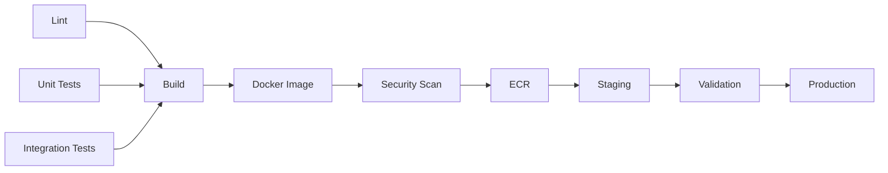
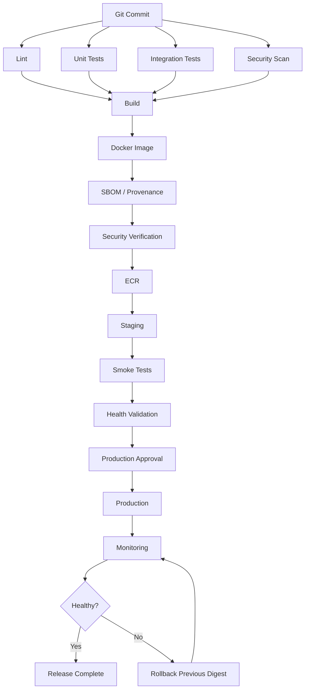

# 03- Build Once Deploy Many

## Overview

Build Once Deploy Many is a CI/CD architecture in which a deployable artifact is built exactly once and then promoted unchanged across environments.

The core flow is:

```text
Source
  ↓
CI Validation
  ↓
Build
  ↓
Immutable Artifact
  ↓
Artifact Registry
  ↓
Development / Staging
  ↓
Validation
  ↓
Production
```

The same artifact must be used throughout:

```text
Artifact A
   ├── Staging
   └── Production
```

rather than:

```text
Source
   ├── Build A → Staging
   └── Build B → Production
```

This distinction matters because a deployment system should promote a known artifact, not repeatedly recreate one.

For a Python backend, the artifact might be:

- A Docker image
- A Python wheel
- A packaged application
- A serverless deployment package
- A versioned infrastructure artifact

For containerized systems, Docker images stored in a registry such as Amazon ECR are a common implementation.

---

## Why Build Once Deploy Many Exists

A build is not necessarily deterministic.

Even when the source commit is identical, separate builds can differ because of:

- Dependency resolution
- Base image changes
- Package repository changes
- Build tooling versions
- Environment variables
- Generated files
- Timestamps
- Network dependencies
- Compiler differences
- Unpinned dependencies

Consider:

```text
Commit abc123
    ↓
Build for Staging
    ↓
Image A

Commit abc123
    ↓
Build for Production
    ↓
Image B
```

If Image A and Image B differ, production is not deploying exactly what was tested in staging.

Build Once Deploy Many changes the model:

```text
Commit abc123
    ↓
Build
    ↓
Image A
    ↓
Test
    ↓
Staging
    ↓
Production
```

The deployment unit remains stable.

---

## The Core Invariant

The most important invariant is:

> The artifact validated before production promotion must be the artifact deployed to production.

For a Docker image:

```text
backend@sha256:abc123...
```

should remain the same throughout promotion.

The environment changes.

The artifact does not.

---

## Build Once vs Rebuild Per Environment

| Model | Build Count | Artifact Identity | Production Confidence | Rollback |
|---|---:|---|---|---|
| Rebuild per environment | Multiple | Potentially different | Lower | More complex |
| Build once, promote | One | Stable | Higher | Deterministic |
| Build once per release | One | Stable | High | Straightforward |

The objective is not simply to reduce build time.

The primary objective is **artifact consistency**.

---

## Environment Promotion

A typical promotion flow is:

```text
                  ┌──────────────┐
                  │   Source     │
                  └──────┬───────┘
                         │
                         ▼
                  ┌──────────────┐
                  │     Build    │
                  └──────┬───────┘
                         │
                         ▼
                  ┌──────────────┐
                  │   Artifact   │
                  └──────┬───────┘
                         │
                         ▼
                  ┌──────────────┐
                  │   Registry   │
                  └──────┬───────┘
                         │
              ┌──────────┴──────────┐
              ▼                     ▼
        ┌───────────┐         ┌────────────┐
        │  Staging  │         │ Production │
        └───────────┘         └────────────┘
```

A more controlled production flow is:

```text
Build
  ↓
Security Scan
  ↓
SBOM / Provenance
  ↓
Registry
  ↓
Staging
  ↓
Automated Validation
  ↓
Approval
  ↓
Production
```

---

## Artifact Identity

A production artifact needs a stable identity.

### Git Commit Tag

```text
backend:7f3a8e2
```

This provides a direct relationship between the artifact and source revision.

### Semantic Version

```text
backend:2.4.0
```

This is useful for human-readable release management.

### Registry Digest

```text
backend@sha256:abc123...
```

The digest identifies the exact image content.

A useful production strategy is to retain both human-readable release metadata and immutable artifact identity.

---

## Mutable vs Immutable Tags

Consider:

```text
backend:latest
```

The tag can point to different image content over time.

For example:

```text
latest → Image A

later

latest → Image B
```

This makes deployment history ambiguous.

A commit-specific tag provides stronger traceability:

```text
backend:7f3a8e2
```

The digest provides even stronger content identity:

```text
backend@sha256:abc123...
```

Production systems should avoid treating `latest` as the deployment identity.

---

## Artifact Metadata

A deployment record should preserve information such as:

```json
{
  "service": "backend-api",
  "version": "2.4.0",
  "commit": "7f3a8e2",
  "image": "backend@sha256:abc123...",
  "workflow_run": "123456",
  "environment": "staging"
}
```

This makes it possible to answer:

- What was deployed?
- Which commit produced it?
- Which workflow built it?
- Which environment received it?
- When was it deployed?
- Which artifact should be used for rollback?

---

## Docker Implementation

A typical Docker build job might look like:

```yaml
jobs:
  build:
    runs-on: ubuntu-latest

    permissions:
      contents: read

    steps:
      - name: Checkout
        uses: actions/checkout@v4

      - name: Set up Docker Buildx
        uses: docker/setup-buildx-action@v3

      - name: Build image
        uses: docker/build-push-action@v6
        with:
          context: .
          push: false
          tags: backend:${{ github.sha }}
```

The image is associated with the source commit.

The next stage should consume that image rather than rebuilding it.

---

## Push the Artifact to a Registry

A common AWS architecture is:

```text
GitHub Actions
      ↓
Docker Build
      ↓
Security Scan
      ↓
ECR
      ↓
Staging
      ↓
Production
```

The image can be pushed using a commit-specific tag:

```yaml
- name: Build and push image
  uses: docker/build-push-action@v6
  with:
    context: .
    push: true
    tags: |
      ${{ vars.ECR_REGISTRY }}/${{ vars.ECR_REPOSITORY }}:${{ github.sha }}
```

The registry becomes the durable boundary between build and deployment.

---

## Recording the Image Digest

After pushing, the registry provides an image digest.

Conceptually:

```text
Tag
 ↓
backend:7f3a8e2
 ↓
Digest
 ↓
sha256:abc123...
```

The digest should be captured as deployment metadata.

For production deployment, using the digest avoids ambiguity when tags can be changed.

---

## Buildx and Layer Caching

Buildx can accelerate image construction.

```yaml
- name: Build image
  uses: docker/build-push-action@v6
  with:
    context: .
    push: true
    tags: ${{ vars.ECR_REGISTRY }}/${{ vars.ECR_REPOSITORY }}:${{ github.sha }}
    cache-from: type=gha
    cache-to: type=gha,mode=max
```

Caching affects build performance, not artifact semantics.

A cache miss should cause a slower build, not an incorrect deployment.

---

## Multi-Stage Docker Builds

A production image should avoid unnecessary build dependencies.

```dockerfile
FROM python:3.12-slim AS builder

WORKDIR /build

COPY pyproject.toml .
COPY src ./src

RUN pip install --no-cache-dir build \
    && python -m build

FROM python:3.12-slim

WORKDIR /app

COPY --from=builder /build/dist ./dist

RUN pip install --no-cache-dir ./dist/*.whl

USER 10001

CMD ["python", "-m", "myapp"]
```

The builder environment and runtime environment have different responsibilities.

The final artifact remains one immutable image.

---

## Environment Configuration

Build Once Deploy Many requires separating application artifacts from environment configuration.

For example:

```text
Artifact
├── Python application
├── Dependencies
├── Runtime files
└── Application configuration schema

Environment
├── DATABASE_URL
├── REDIS_URL
├── API_ENDPOINT
├── AWS configuration
└── Runtime secrets
```

The production database URL should not be baked into the image.

Instead:

```text
Same Image
   ├── Staging Configuration
   └── Production Configuration
```

---

## Configuration Should Not Trigger a Rebuild

Suppose staging uses:

```text
DATABASE_URL=postgres://staging-db
```

and production uses:

```text
DATABASE_URL=postgres://production-db
```

The image should remain unchanged.

```text
backend@sha256:abc123
        │
        ├── Staging → staging-db
        │
        └── Production → production-db
```

Rebuilding merely to change environment configuration breaks the promotion model.

---

## Python Backend Example

A Django application can read runtime configuration:

```python
import os

DATABASE_URL = os.environ["DATABASE_URL"]
REDIS_URL = os.environ["REDIS_URL"]
```

The container image contains the application.

The deployment environment supplies the configuration.

The same Docker image can therefore run in:

```text
Development
Staging
Production
```

without changing its contents.

---

## FastAPI Example

A FastAPI service can use environment-based configuration:

```python
import os

ENVIRONMENT = os.getenv("ENVIRONMENT", "development")
DATABASE_URL = os.environ["DATABASE_URL"]
```

The code remains unchanged across environments.

Only deployment configuration changes.

---

## Configuration Hierarchy

A practical model is:

```text
Application Artifact
        ↓
Runtime Environment
        ↓
Environment Variables
        ↓
Secret Management
        ↓
External Dependencies
```

Avoid creating separate application builds for:

```text
staging
production
customer-a
customer-b
```

unless the artifact itself genuinely needs to differ.

---

## Secrets

Secrets should never be embedded in the artifact.

Bad:

```dockerfile
ENV DATABASE_PASSWORD="production-password"
```

Also avoid:

```text
source
 ↓
build
 ↓
secret baked into image
 ↓
registry
```

Once a secret enters an image, it can remain available through:

- Image layers
- Registry storage
- Build cache
- Image history
- Downloads
- Backups

Prefer runtime secret injection.

---

## AWS OIDC

GitHub Actions can authenticate to AWS using OIDC.

```text
GitHub Actions
      ↓
GitHub OIDC Token
      ↓
AWS STS
      ↓
IAM Role
      ↓
Temporary Credentials
      ↓
ECR / ECS / S3 / Lambda
```

Example permissions:

```yaml
permissions:
  contents: read
  id-token: write
```

The AWS role should have a restricted trust policy.

Long-lived AWS access keys should not be required for the deployment pipeline when OIDC is available.

---

## Registry Authentication

A production build job might authenticate to ECR using OIDC-backed AWS credentials:

```yaml
- name: Configure AWS credentials
  uses: aws-actions/configure-aws-credentials@v4
  with:
    role-to-assume: ${{ secrets.AWS_ROLE_ARN }}
    aws-region: ${{ vars.AWS_REGION }}

- name: Login to Amazon ECR
  id: login-ecr
  uses: aws-actions/amazon-ecr-login@v2
```

The build job now has access to the registry without storing long-lived AWS access keys.

---

## CI and CD Separation

A clean architecture separates validation from deployment.

```text
Pull Request
   ↓
Lint
   ↓
Unit Tests
   ↓
Integration Tests
   ↓
Security Scan
   ↓
Build
   ↓
Artifact
```

Then:

```text
Artifact
   ↓
Staging
   ↓
Validation
   ↓
Approval
   ↓
Production
```

The artifact is the boundary between CI and CD.

---

## Why the Artifact Is the Boundary

Without an artifact boundary:

```text
CI
 ↓
Source
 ↓
Production Build
```

The production environment remains dependent on build-time conditions.

With an artifact boundary:

```text
CI
 ↓
Artifact
 ↓
CD
```

CD only needs to deploy an already-created artifact.

This improves separation of concerns.

---

## GitHub Actions Architecture

A common implementation uses separate jobs:



The build job should depend on the required CI validation jobs.

---

## Fan-In Before Build

Multiple validation jobs can run in parallel:

```text
             ┌── Lint ──────────┐
             │                  │
             ├── Unit Tests ────┤
Pull Request │                  ├── Build
             ├── Integration ───┤
             │                  │
             └── Security ──────┘
```

GitHub Actions can express this using `needs`.

```yaml
build:
  needs:
    - lint
    - unit-tests
    - integration-tests
    - security
```

The artifact should only be created after required validation succeeds.

---

## Build Job Example

```yaml
jobs:
  build:
    needs:
      - lint
      - unit-tests
      - integration-tests
      - security

    runs-on: ubuntu-latest

    permissions:
      contents: read
      id-token: write

    steps:
      - name: Checkout
        uses: actions/checkout@v4

      - name: Configure AWS credentials
        uses: aws-actions/configure-aws-credentials@v4
        with:
          role-to-assume: ${{ secrets.AWS_ROLE_ARN }}
          aws-region: ${{ vars.AWS_REGION }}

      - name: Login to ECR
        uses: aws-actions/amazon-ecr-login@v2

      - name: Build and push
        uses: docker/build-push-action@v6
        with:
          context: .
          push: true
          tags: |
            ${{ vars.ECR_REGISTRY }}/${{ vars.ECR_REPOSITORY }}:${{ github.sha }}
```

The resulting image becomes the deployable unit.

---

## Passing Artifact Identity Between Jobs

Job outputs can carry metadata.

```yaml
jobs:
  build:
    runs-on: ubuntu-latest

    outputs:
      image: ${{ steps.metadata.outputs.image }}

    steps:
      - name: Set image
        id: metadata
        run: |
          echo "image=${IMAGE}" >> "$GITHUB_OUTPUT"
        env:
          IMAGE: ${{ vars.ECR_REGISTRY }}/${{ vars.ECR_REPOSITORY }}:${{ github.sha }}
```

A deployment job can consume it:

```yaml
deploy:
  needs: build

  steps:
    - name: Deploy
      env:
        IMAGE: ${{ needs.build.outputs.image }}
      run: |
        echo "Deploying ${IMAGE}"
```

For stronger artifact identity, pass the digest rather than relying only on a mutable tag.

---

## Artifacts vs Caches

Artifacts and caches serve different purposes.

| Feature | Artifact | Cache |
|---|---|---|
| Purpose | Preserve build output | Accelerate repeated work |
| Required for deployment | Often | No |
| Identity | Explicit | Key-based |
| Typical contents | Package, report, binary | Dependencies, build layers |
| Retention | Release/debug oriented | Optimization oriented |
| Safe as deployment source | Yes | No |

Do not treat a cache as the source of truth for production deployment.

---

## GitHub Actions Artifact Example

For non-container artifacts:

```yaml
- name: Upload build artifact
  uses: actions/upload-artifact@v4
  with:
    name: backend-${{ github.sha }}
    path: dist/
    retention-days: 30
```

A downstream job can download it:

```yaml
- name: Download build artifact
  uses: actions/download-artifact@v4
  with:
    name: backend-${{ github.sha }}
    path: dist/
```

The artifact name should be tied to the release or source identity.

---

## Container Registry vs GitHub Artifact

Use the appropriate storage mechanism for the deployment target.

| Deployment Type | Typical Artifact |
|---|---|
| ECS/EKS | Docker image |
| EC2 | Package/archive/image |
| Lambda | Deployment package/container image |
| Python package | Wheel |
| Static application | Build directory/archive |
| Infrastructure | IaC source/state |

The principle remains unchanged:

```text
Build once
Store
Promote
```

---

## Staging Promotion

Staging should consume the exact production candidate.

```text
ECR
 │
 │ digest abc123
 ▼
Staging
 │
 ├── Smoke Tests
 ├── Integration Tests
 ├── Health Checks
 └── Security Validation
 │
 ▼
Production
```

Do not build a second image for staging.

---

## Production Promotion

A production job should reference the validated artifact.

```yaml
deploy-production:
  needs:
    - deploy-staging
    - production-approval

  environment:
    name: production

  steps:
    - name: Deploy immutable image
      env:
        IMAGE: ${{ needs.build.outputs.image }}
      run: |
        echo "Deploying ${IMAGE}"
```

The production environment can provide:

- Approval
- Environment secrets
- Deployment protection
- Branch restrictions
- Deployment history

---

## Deployment Concurrency

Build Once Deploy Many works best when deployment concurrency is explicitly controlled.

```yaml
concurrency:
  group: production-deployment
  cancel-in-progress: false
```

This prevents concurrent workflows from changing the same production environment.

For PR CI, a different policy may be appropriate:

```yaml
concurrency:
  group: ci-${{ github.workflow }}-${{ github.ref }}
  cancel-in-progress: true
```

The correct policy depends on whether an older run is safe to cancel.

---

## Rollback

A rollback should point to a previously validated artifact.

```text
Production
   ↓
Current: digest-B
   ↓
Incident
   ↓
Rollback
   ↓
Known-good: digest-A
```

The deployment system should retain enough information to identify digest-A.

A robust release history might contain:

```text
Release 2.4.0 → sha256:aaa
Release 2.3.2 → sha256:bbb
Release 2.3.1 → sha256:ccc
```

Rollback then becomes artifact selection rather than rebuilding.

---

## Why Rebuilding During Rollback Is Wrong

Consider:

```text
Source
 ↓
Rebuild
 ↓
Rollback candidate
```

The new build may differ from the artifact that originally worked.

Instead:

```text
Registry
 ├── Known-good A
 ├── Current B
 └── Previous C
```

Deploy the known-good artifact directly.

---

## Database Migration Considerations

Build Once Deploy Many does not solve database compatibility automatically.

Suppose:

```text
Version A
  ↓
Database schema A
```

becomes:

```text
Version B
  ↓
Database schema B
```

A rolling deployment may temporarily run both:

```text
Version A ─┐
           ├── Database
Version B ─┘
```

Therefore migrations should generally support compatibility during the transition.

A safer migration sequence is:

```text
Expand Schema
    ↓
Deploy Compatible Application
    ↓
Backfill
    ↓
Switch Behavior
    ↓
Remove Old Schema
```

---

## Django Migration Strategy

For a Django application, avoid combining destructive schema changes with an application deployment that still contains old instances.

For example:

```text
Migration 1
    ↓
Add new nullable column
    ↓
Deploy application using new column
    ↓
Backfill
    ↓
Make constraint stricter later
```

The exact migration strategy depends on workload and schema size.

Large production tables may require online or staged migration techniques to avoid long locks.

---

## Redis Compatibility

The same principle applies to Redis.

Suppose Version A uses:

```text
user:{id}
```

and Version B uses:

```text
profile:{id}
```

A deployment that immediately removes the old keys may break Version A during a rolling deployment.

Safer migration patterns include:

```text
Read old + new
      ↓
Write new
      ↓
Migrate
      ↓
Stop old readers
      ↓
Remove old format
```

---

## Kafka Compatibility

For Kafka-based systems:

```text
Producer A
Producer B
Consumer A
Consumer B
```

may coexist during deployment.

Message schema changes should therefore preserve compatibility where possible.

Build Once Deploy Many does not eliminate distributed-system compatibility requirements.

---

## Celery Compatibility

Celery workers can also overlap during deployment.

For example:

```text
Worker A → old application
Worker B → new application
```

Queued tasks created by one version may be consumed by another.

Task payloads should therefore remain compatible across deployment transitions.

---

## API Compatibility

REST and gRPC deployments can similarly involve multiple application versions.

For REST:

```text
Client
  ↓
Load Balancer
  ├── Version A
  └── Version B
```

For gRPC:

```text
Client
  ↓
Service
  ├── Old server
  └── New server
```

API contracts should tolerate rolling transitions.

---

## Security Boundary

Build Once Deploy Many reduces one class of supply-chain risk because production does not execute a fresh build.

The pipeline becomes:

```text
Source
  ↓
Trusted Build Environment
  ↓
Artifact
  ↓
Artifact Verification
  ↓
Production
```

Security controls can therefore be applied at the artifact boundary.

---

## Artifact Scanning

Before promotion, scan the artifact.

```text
Build
  ↓
Image
  ↓
Vulnerability Scan
  ↓
SBOM
  ↓
Provenance
  ↓
Registry
  ↓
Promotion
```

A staging deployment should not automatically imply that all production security policies are satisfied. Production may apply additional policy checks.

---

## SBOM

An SBOM provides dependency visibility.

For Python:

```text
Application
 ├── Django
 ├── FastAPI
 ├── Pydantic
 ├── requests
 └── cryptography
```

For a container, the SBOM can also include OS-level packages.

This supports:

- Vulnerability analysis
- Dependency investigation
- Incident response
- Compliance

---

## Provenance

Artifact provenance links the artifact to its build context.

A useful chain is:

```text
Git Commit
    ↓
Workflow Run
    ↓
Build
    ↓
Artifact Digest
```

This provides stronger evidence that the deployed artifact originated from the expected source and build process.

---

## Artifact Attestation

An attestation can associate metadata with an artifact.

Conceptually:

```text
Artifact Digest
      +
Source Identity
      +
Build Identity
      +
Build Metadata
```

Deployment policy can then require that an artifact satisfy specific provenance requirements before promotion.

---

## Third-Party Actions

The build job often has access to:

- Source code
- Package registries
- Artifact registries
- Cloud credentials

Therefore third-party actions in the build path must be treated as trusted dependencies.

Use:

- Trusted action sources
- SHA pinning where appropriate
- Least-privilege permissions
- Minimal secrets
- Dependency review
- Controlled action updates

A compromised build action can potentially compromise the artifact itself.

---

## Untrusted Pull Requests

Do not allow arbitrary pull request code to access production credentials or production deployment permissions.

A safe separation is:

```text
Fork PR
  ↓
Unprivileged CI
  ↓
Tests
```

and:

```text
Protected Branch
  ↓
Build
  ↓
Artifact
  ↓
Production Promotion
```

Be particularly cautious when combining `pull_request_target`, checkout of untrusted code, secrets, and write permissions.

---

## Reusable Build Workflow

Build logic can be centralized.

```yaml
on:
  workflow_call:
    inputs:
      image-name:
        required: true
        type: string

    outputs:
      image:
        value: ${{ jobs.build.outputs.image }}
```

A reusable workflow can own:

- Docker setup
- Buildx
- Authentication
- Image build
- Security scanning
- SBOM generation
- Artifact publication
- Output generation

Application repositories then consume a consistent build process.

---

## Reusable Deployment Workflow

Deployment can similarly be centralized:

```yaml
on:
  workflow_call:
    inputs:
      image:
        required: true
        type: string

      environment:
        required: true
        type: string
```

The workflow can enforce organization-wide requirements such as:

- OIDC
- Permissions
- Concurrency
- Environment protection
- Deployment validation
- Audit metadata

---

## Build Workflow vs Deployment Workflow

| Responsibility | Build Workflow | Deployment Workflow |
|---|---|---|
| Checkout | Yes | Sometimes |
| Tests | Yes | Usually no |
| Docker build | Yes | No |
| Artifact push | Yes | No |
| SBOM | Yes | May verify |
| Provenance | Yes | May verify |
| Environment selection | No | Yes |
| Approval | No | Yes |
| Runtime deployment | No | Yes |
| Health validation | Limited | Yes |
| Rollback | No | Yes |

Separating these responsibilities reduces coupling.

---

## Cross-Repository Promotion

A platform team may maintain a reusable deployment workflow.

```text
Application Repository
        ↓
Reusable Build Workflow
        ↓
Artifact Registry
        ↓
Reusable Deployment Workflow
        ↓
Environment
```

This allows multiple services to follow the same deployment controls without duplicating implementation.

---

## Monorepo Considerations

For a monorepo:

```text
repository
├── services/
│   ├── users/
│   ├── orders/
│   └── payments/
└── shared/
```

Each service may produce an independent artifact:

```text
users:sha
orders:sha
payments:sha
```

A change-detection job can determine which services require builds.

The build-once principle still applies independently to each artifact.

---

## Microservice Promotion

For microservices:

```text
Users Service
   ↓
users@sha256:A

Orders Service
   ↓
orders@sha256:B

Payments Service
   ↓
payments@sha256:C
```

Each artifact should be independently traceable.

Avoid rebuilding all services merely because one service changed unless the architecture requires synchronized builds.

---

## Artifact Dependency Graph

Some systems have dependencies between artifacts.

For example:

```text
Shared Library
      ↓
Users Service
      ↓
API Gateway
```

When an upstream artifact changes, dependent artifacts may need rebuilding.

The build-once principle applies to each resulting release artifact:

```text
Build
 ↓
Immutable Artifact
 ↓
Promote
```

---

## Production Promotion Model

A mature pipeline may use:

```text
Pull Request
    ↓
CI
    ↓
Build
    ↓
Security
    ↓
Artifact
    ↓
Staging
    ↓
Automated Validation
    ↓
Production Approval
    ↓
Production
    ↓
Monitoring
```

The artifact identity remains constant.

Only:

- Environment
- Configuration
- Runtime infrastructure
- Deployment policy

change during promotion.

---

## Failure Domains

Build Once Deploy Many creates explicit failure boundaries.

| Failure | Impact |
|---|---|
| CI failure | No artifact produced |
| Build failure | No deployable artifact |
| Registry failure | Artifact unavailable |
| Staging failure | Promotion blocked |
| Approval failure | Production blocked |
| Production failure | Rollback/recovery |
| Monitoring failure | Reduced deployment visibility |

This separation improves incident diagnosis.

---

## Troubleshooting Model

Use:

```text
Symptom
  ↓
Possible Causes
  ↓
Isolation Strategy
  ↓
Commands / Checks
  ↓
Root Cause
  ↓
Corrective Action
  ↓
Prevention
```

---

## Artifact Differs Between Environments

### Symptom

Staging and production appear to run different builds.

### Possible Causes

- Rebuilding during deployment
- Mutable tags
- Incorrect artifact reference
- Environment-specific build arguments
- Different registry tags

### Isolation

Compare image digests:

```text
Staging → sha256:abc
Production → sha256:def
```

If the digests differ, the same artifact was not promoted.

### Corrective Action

Deploy by immutable artifact identity.

---

## Production Uses Wrong Version

### Possible Causes

- `latest` tag
- Incorrect Git SHA
- Deployment race
- Stale task definition
- Incorrect output propagation

### Checks

Inspect deployment metadata:

```text
Commit
Image
Digest
Workflow Run
Environment
```

Verify that the runtime references the intended digest.

---

## Build Succeeds but Promotion Fails

Separate:

```text
Build
 ↓
Registry
 ↓
Promotion
```

Check:

- Registry availability
- Artifact existence
- IAM permissions
- Deployment role
- Environment protection
- Deployment concurrency

Do not rebuild unless the artifact itself is invalid.

---

## Staging Works but Production Fails

This does not necessarily mean the artifact is different.

Possible causes include:

- Production configuration
- Missing secret
- Network policy
- IAM permissions
- Database differences
- Traffic volume
- External dependencies
- Infrastructure differences

The first check should be:

```text
Is the production artifact digest identical to staging?
```

If yes, investigate environment and runtime differences.

---

## Rollback Cannot Find Previous Artifact

Possible causes:

- Artifact retention too short
- Registry cleanup
- Deployment metadata missing
- Previous version used mutable tags

Prevention:

- Retain production artifacts appropriately
- Record digests
- Maintain release metadata
- Test rollback procedures

---

## Build Reproducibility

Build Once Deploy Many works best when builds are reproducible.

Control:

- Python version
- Dependency lock files
- Base image versions
- Build tooling
- OS packages
- Build configuration

For Python, lock dependencies where appropriate rather than relying on unconstrained resolution.

For Docker:

```dockerfile
FROM python:3.12-slim
```

is more reproducible than depending on an unspecified floating runtime.

For stronger reproducibility, pin dependencies and consider immutable base-image references where operationally appropriate.

---

## Deterministic Build Considerations

A deterministic build aims for:

```text
Same source
+
Same build inputs
=
Same artifact
```

Not every environment can guarantee perfect bit-for-bit reproducibility, but reducing uncontrolled inputs improves confidence.

Important variables include:

- Dependency versions
- Base images
- Package repositories
- Build scripts
- Compiler versions
- Generated metadata
- Network dependencies

---

## Performance

Build Once Deploy Many can reduce:

- Duplicate Docker builds
- Registry transfers
- Dependency installation
- Build runner consumption

Suppose three environments exist:

```text
Staging
Production
Disaster Recovery
```

Rebuilding separately requires:

```text
3 builds
```

Build once requires:

```text
1 build
3 deployments
```

The main benefit is consistency, while reduced build cost is an additional advantage.

---

## Scalability

At organization scale:

```text
                 Platform Workflows
                        │
       ┌────────────────┼────────────────┐
       ▼                ▼                ▼
   Service A        Service B        Service C
       │                │                │
       ▼                ▼                ▼
     Artifact         Artifact         Artifact
       │                │                │
       └────────────── Registry ─────────┘
                        │
               Environment Promotion
```

Reusable workflows can enforce common build and promotion standards.

---

## High Availability

The deployment platform should not become a single point of failure.

Consider:

- Multiple runner capacity
- Durable artifact storage
- Registry availability
- Infrastructure-as-code
- Version-controlled workflows
- Recoverable deployment configuration

The application may be highly available while the delivery platform is not. These are separate reliability concerns.

---

## Disaster Recovery

A recovery plan should identify:

```text
Last Known-Good Artifact
        ↓
Registry
        ↓
Deployment Workflow
        ↓
Infrastructure
        ↓
Production
```

If the current deployment fails catastrophically, the organization should be able to identify and redeploy the previous known-good artifact without rebuilding it.

---

## Cost Optimization

Build Once Deploy Many reduces redundant build operations.

Other optimizations include:

- Docker layer caching
- Dependency caching
- Right-sized runners
- Selective service builds
- Appropriate artifact retention
- Temporary environment cleanup
- Avoiding unnecessary rebuilds

Do not use cache as the authoritative production artifact.

---

## Operational Governance

At organization scale, define policies for:

- Artifact naming
- Artifact retention
- Registry lifecycle
- Image scanning
- SBOM requirements
- Provenance requirements
- Deployment approvals
- Environment ownership
- Runner access
- Action pinning
- IAM roles
- Rollback retention

A consistent artifact model makes these policies easier to enforce.

---

## Release Promotion Record

A production deployment record can look like:

```text
Service: backend-api
Release: 2.4.0
Commit: 7f3a8e2
Artifact: backend@sha256:abc123
Built by: workflow run 123456
Staging: Passed
Approval: Approved
Production: Deployed
Health: Healthy
```

This provides an operational chain from source to runtime.

---

## Example End-to-End Architecture



---

## Interview Scenarios

### Scenario: Production Must Use Exactly What Staging Tested

Design:

```text
Build
 ↓
Immutable Image
 ↓
Registry
 ↓
Staging
 ↓
Validation
 ↓
Production
```

Use the same digest for both environments.

---

### Scenario: Production Deployment Failed

First determine:

```text
Is the artifact the same?
```

If the digest is identical, investigate:

- Configuration
- Secrets
- Network
- IAM
- Dependencies
- Infrastructure
- Traffic

Do not immediately rebuild the application.

---

### Scenario: Rollback Is Required

Use:

```text
Previous Known-Good Digest
```

rather than:

```text
Rebuild Previous Commit
```

The former is deterministic.

---

### Scenario: Docker Image Is Tagged `latest`

The problem is ambiguous artifact identity.

Replace:

```text
latest
```

with a traceable identity such as:

```text
commit SHA
```

and preferably deploy using the immutable digest.

---

### Scenario: Database Migration Is Breaking Rolling Deployment

Use an expand/contract migration strategy:

```text
Expand
 ↓
Compatible Application
 ↓
Backfill
 ↓
Switch
 ↓
Contract
```

The application must tolerate coexistence between versions.

---

### Scenario: Multiple Services Share One Pipeline

Separate artifacts:

```text
service-a@digest-A
service-b@digest-B
service-c@digest-C
```

Promote each immutable artifact independently unless coordinated release behavior is explicitly required.

---

## Senior-Level Design Principles

Build Once Deploy Many is fundamentally an **artifact-management architecture**, not merely a GitHub Actions YAML pattern.

A strong implementation establishes these boundaries:

```text
Source
  ↓
Validation
  ↓
Build
  ↓
Artifact
  ↓
Verification
  ↓
Registry
  ↓
Promotion
  ↓
Runtime
```

The build stage owns artifact creation.

The deployment stage owns artifact promotion.

The environment owns runtime configuration.

The registry owns artifact persistence.

The monitoring system owns runtime validation.

The rollback mechanism owns recovery to a known-good artifact.

This separation reduces coupling and makes the deployment system easier to reason about during both normal releases and production incidents.

---

## Key Takeaways

- Build Once Deploy Many means creating one immutable, traceable artifact and promoting that exact artifact across environments without rebuilding it.
- Artifact identity should be based on immutable references such as image digests, with commit SHAs and release versions providing useful human-readable traceability.
- Environment-specific configuration and secrets belong to the deployment/runtime environment, not inside the application artifact.
- Deterministic promotion makes rollback safer because recovery uses a previously validated artifact instead of rebuilding an older source revision.
- Build-once architecture works best when combined with artifact security, OIDC, least privilege, deployment concurrency, environment protection, health validation, and explicit deployment metadata.