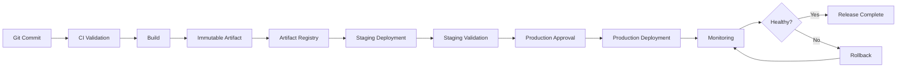

# 04- Artifact Promotion

## Overview

Artifact promotion is the process of moving a previously built and validated artifact through deployment environments without rebuilding it.

The fundamental flow is:

```text
Source
  ↓
CI Validation
  ↓
Build
  ↓
Immutable Artifact
  ↓
Artifact Registry
  ↓
Staging
  ↓
Validation
  ↓
Production
```

The artifact remains unchanged while its deployment state changes:

```text
Artifact
   │
   ├── Built
   ├── Scanned
   ├── Staging
   ├── Approved
   └── Production
```

This is a core part of a production-grade GitHub Actions CD architecture because it separates **artifact creation** from **artifact deployment**.

For a containerized Python backend, the artifact is commonly a Docker image stored in Amazon ECR:

```text
backend@sha256:abc123...
```

The same image digest can be deployed to staging and production.

---

## What Artifact Promotion Means

Artifact promotion means:

> Take an existing artifact that has already passed the required validation and make that same artifact available in a higher environment.

For example:

```text
ECR
 │
 │ image digest A
 ▼
Staging
 │
 │ validation
 ▼
Production
```

There is no second build.

The following should remain unchanged:

- Application source
- Dependencies
- Docker image contents
- Build output
- Artifact digest

The following can change:

- Environment configuration
- Secrets
- Infrastructure
- Deployment target
- Approval state
- Runtime scaling
- Traffic routing

---

## Why Artifact Promotion Exists

Without artifact promotion, a deployment pipeline may rebuild the application for every environment:

```text
Source
 ├── Build → Staging
 │
 └── Build → Production
```

This creates two independent build events.

Even when both builds use the same commit, they can differ because of:

- Dependency resolution
- Base image changes
- Package repository state
- Build tooling
- Build arguments
- Generated files
- Network dependencies
- Environment-specific build configuration

Artifact promotion removes that ambiguity:

```text
Source
   ↓
Build
   ↓
Artifact A
   ├── Staging
   └── Production
```

---

## Build Once, Promote Many

The two concepts are closely related:

```text
Build Once
     ↓
Create immutable artifact
     ↓
Promote Many
     ↓
Development / Staging / Production
```

The build creates the deployable unit.

Promotion changes where that unit is deployed.

A mature pipeline therefore treats the artifact as the boundary between CI and CD.

---

## Artifact Promotion vs Rebuilding

| Approach | Artifact Count | Consistency | Rollback | Operational Complexity |
|---|---:|---|---|---|
| Rebuild per environment | Multiple | Lower | Higher | Higher |
| Build once, promote | One | High | Lower | Lower |
| Build once but mutate artifact | One | Weak | Complex | High |
| Build once and deploy by digest | One | Strong | Straightforward | Low |

The important property is not merely the number of builds.

It is whether the exact artifact tested before production is the artifact deployed to production.

---

## Artifact Identity

An artifact needs a stable identity.

For Docker images, common identifiers include:

```text
backend:7f3a8e2
```

```text
backend:2.4.0
```

and:

```text
backend@sha256:abc123...
```

These serve different purposes.

| Identifier | Purpose | Immutable? |
|---|---|---|
| Commit SHA tag | Traceability | Usually treated as immutable |
| Semantic version | Release management | Depends on registry policy |
| `latest` | Convenience | No |
| Image digest | Exact content identity | Yes |

For production deployments, the digest is the strongest artifact identity.

---

## Tags vs Digests

A tag is a human-readable reference:

```text
backend:2.4.0
```

A digest identifies the exact image content:

```text
backend@sha256:abc123...
```

A tag can potentially be moved:

```text
2.4.0 → Image A

later

2.4.0 → Image B
```

A digest identifies the image content itself.

Therefore a useful model is:

```text
Release: 2.4.0
Commit: 7f3a8e2
Image: backend:2.4.0
Digest: sha256:abc123...
```

Use the release and commit identifiers for traceability and the digest for deployment identity.

---

## Immutable Artifact Principle

Once an artifact is accepted for promotion, do not modify it.

Avoid:

```text
Build
 ↓
Artifact
 ↓
Modify
 ↓
Staging
 ↓
Modify
 ↓
Production
```

Prefer:

```text
Build
 ↓
Artifact
 ↓
Staging
 ↓
Production
```

If production requires different application behavior, use runtime configuration rather than modifying the artifact.

---

## Environment Configuration

The artifact should contain application code and dependencies.

The environment should provide configuration.

```text
                    Same Artifact
                         │
             ┌───────────┴───────────┐
             ▼                       ▼
         Staging                  Production
             │                       │
       staging config          production config
       staging secrets         production secrets
```

For example:

```text
Artifact:
backend@sha256:abc123

Staging:
DATABASE_URL=postgres://staging-db
REDIS_URL=redis://staging-cache

Production:
DATABASE_URL=postgres://production-db
REDIS_URL=redis://production-cache
```

The image does not change.

---

## Configuration Should Not Trigger Rebuilds

A common anti-pattern is:

```text
Build staging image
Build production image
```

only because configuration differs.

Instead:

```text
One image
   ↓
Runtime configuration
```

A Django application can read runtime configuration:

```python
import os

DATABASE_URL = os.environ["DATABASE_URL"]
REDIS_URL = os.environ["REDIS_URL"]
```

The same image can then run in multiple environments.

---

## Artifact Registry

The registry is the durable storage boundary for deployable artifacts.

For Docker-based AWS deployments:

```text
GitHub Actions
      ↓
Docker Buildx
      ↓
Security Validation
      ↓
Amazon ECR
      ↓
Staging
      ↓
Production
```

ECR provides the repository from which deployment systems can retrieve the artifact.

---

## ECR Artifact Model

A repository might contain:

```text
backend
├── 7f3a8e2
├── 8a1b9c3
├── 2.4.0
└── 2.3.1
```

Each production release should be traceable to an exact artifact.

A stronger deployment record is:

```text
Release: 2.4.0
Commit: 7f3a8e2
Digest: sha256:abc123
```

---

## Promotion Metadata

A deployment system should preserve enough metadata to reconstruct artifact history.

Example:

```json
{
  "service": "backend-api",
  "release": "2.4.0",
  "commit": "7f3a8e2",
  "artifact": "backend@sha256:abc123",
  "workflow_run": "123456",
  "source_environment": "staging",
  "target_environment": "production"
}
```

This supports:

- Auditing
- Rollback
- Incident investigation
- Deployment tracing
- Release management

---

## Artifact Lifecycle

A useful lifecycle is:

```text
Built
  ↓
Scanned
  ↓
Published
  ↓
Staged
  ↓
Validated
  ↓
Approved
  ↓
Production
  ↓
Retained
  ↓
Eventually Archived / Deleted
```

The exact states depend on organizational requirements.

The important distinction is between:

- **Artifact identity**
- **Artifact deployment state**

An artifact can move between states without changing its contents.

---

## Artifact State vs Environment State

Do not confuse:

```text
Artifact state
```

with:

```text
Environment state
```

For example:

```text
Artifact A
    ├── Built
    ├── Scanned
    └── Approved

Production
    ├── Deployment started
    ├── Health check failed
    └── Rollback
```

The artifact remains valid even if a deployment fails.

A deployment failure does not automatically mean the artifact must be rebuilt.

---

## Promotion Architecture



The registry provides the persistent artifact boundary.

---

## GitHub Actions Promotion Model

A GitHub Actions pipeline can separate build and promotion:

```yaml
jobs:
  build:
    runs-on: ubuntu-latest

    outputs:
      image: ${{ steps.image.outputs.image }}

    steps:
      - name: Checkout
        uses: actions/checkout@v4

      - name: Build and push image
        id: image
        env:
          IMAGE: ${{ vars.ECR_REGISTRY }}/${{ vars.ECR_REPOSITORY }}:${{ github.sha }}
        run: |
          docker build -t "$IMAGE" .
          docker push "$IMAGE"
          echo "image=$IMAGE" >> "$GITHUB_OUTPUT"
```

The deployment jobs consume the build output.

---

## Staging Promotion

```yaml
  deploy-staging:
    needs: build
    runs-on: ubuntu-latest

    environment:
      name: staging

    steps:
      - name: Deploy
        env:
          IMAGE: ${{ needs.build.outputs.image }}
        run: |
          ./deploy.sh staging "$IMAGE"
```

The important property is:

```text
needs.build.outputs.image
```

The staging job does not perform another Docker build.

---

## Production Promotion

```yaml
  deploy-production:
    needs:
      - build
      - deploy-staging

    runs-on: ubuntu-latest

    environment:
      name: production

    steps:
      - name: Deploy
        env:
          IMAGE: ${{ needs.build.outputs.image }}
        run: |
          ./deploy.sh production "$IMAGE"
```

The production job consumes the same artifact produced by the build job.

---

## Using Immutable Digests

For stronger guarantees, capture the digest after publication.

Conceptually:

```text
Build
 ↓
Push
 ↓
Digest
 ↓
Store digest
 ↓
Staging
 ↓
Production
```

The deployment input becomes:

```text
backend@sha256:abc123...
```

instead of:

```text
backend:latest
```

This prevents a later tag mutation from silently changing the deployment target.

---

## Deployment by Digest

A deployment command can use the digest:

```bash
docker pull "${ECR_REGISTRY}/${ECR_REPOSITORY}@${IMAGE_DIGEST}"
```

The exact deployment mechanism depends on the target platform.

For ECS, the digest can be represented in the task definition or resolved as part of the deployment process.

For Kubernetes, the container image reference can use the digest directly.

---

## AWS Authentication

GitHub Actions should preferably authenticate to AWS using OIDC rather than long-lived access keys.

The flow is:

```text
GitHub Actions
      ↓
OIDC Token
      ↓
AWS STS
      ↓
IAM Role
      ↓
Temporary Credentials
      ↓
ECR
```

Example:

```yaml
permissions:
  contents: read
  id-token: write
```

Then:

```yaml
- name: Configure AWS credentials
  uses: aws-actions/configure-aws-credentials@v4
  with:
    role-to-assume: ${{ secrets.AWS_ROLE_ARN }}
    aws-region: ${{ vars.AWS_REGION }}
```

The role should have only the permissions required by the workflow.

---

## Artifact Promotion with ECS

A typical architecture is:

```text
GitHub Actions
      ↓
Build Docker Image
      ↓
Amazon ECR
      ↓
ECS Task Definition
      ↓
Staging ECS Service
      ↓
Validation
      ↓
Production ECS Service
```

The task definition should reference the same image identity that was validated in staging.

---

## Artifact Promotion with EC2

For EC2-based deployment:

```text
GitHub Actions
      ↓
Artifact Registry / S3
      ↓
Deployment System
      ↓
EC2
```

The artifact could be:

- Docker image
- Application archive
- Python wheel
- Release package

The deployment process retrieves the already-built artifact.

---

## Artifact Promotion with Lambda

For Lambda, the artifact might be:

```text
ZIP package
```

or:

```text
Container image
```

The same release artifact can be promoted through:

```text
Staging Lambda
      ↓
Validation
      ↓
Production Lambda
```

The function configuration can differ while the artifact remains unchanged.

---

## Infrastructure as Code

Artifact promotion should not be confused with infrastructure promotion.

A production deployment may require:

```text
Application Artifact
        +
Infrastructure Configuration
        +
Environment Configuration
```

Terraform or CloudFormation can manage infrastructure.

The application artifact should remain independently identifiable.

---

## Approval Gates

Production promotion may require manual approval.

```text
Staging
   ↓
Automated Tests
   ↓
Approval
   ↓
Production
```

GitHub Environments can provide deployment protection and required reviewers.

The approval controls **promotion**, not artifact creation.

This means:

```text
Build
 ↓
Artifact
 ↓
Staging
 ↓
Approval
 ↓
Production
```

rather than:

```text
Approval
 ↓
Build production artifact
```

---

## Promotion Policies

A production environment can enforce rules such as:

- Required reviewers
- Deployment branch restrictions
- Environment-specific secrets
- Deployment protection
- Concurrency controls

This creates a controlled promotion boundary.

---

## Promotion vs Deployment

These terms are related but not identical.

**Promotion** means authorizing an artifact to move to a higher environment.

**Deployment** means actually applying that artifact to infrastructure.

For example:

```text
Artifact
   ↓
Promoted to production
   ↓
Deployment begins
   ↓
Health checks
```

A promotion policy may approve an artifact before deployment occurs.

---

## Staging Validation

Staging should validate the artifact under conditions reasonably representative of production.

Possible checks include:

- Smoke tests
- API health checks
- Database connectivity
- Redis connectivity
- Authentication flows
- Integration tests
- Performance checks
- Background task execution

For a Python backend:

```text
Docker Image
    ↓
Django / FastAPI
    ↓
PostgreSQL
    ↓
Redis
    ↓
Celery
    ↓
Smoke Tests
```

---

## Health Validation

A deployment should not be considered successful merely because a deployment command exited with status zero.

Validate runtime health.

For example:

```bash
curl --fail https://staging.example.com/health
```

A more realistic health endpoint might verify application readiness without unnecessarily exposing internal details.

For Kubernetes or ECS deployments, platform-level health signals should also be considered.

---

## Smoke Tests

A simple smoke-test flow:

```text
Deploy
  ↓
Wait for readiness
  ↓
GET /health
  ↓
GET /api/version
  ↓
Authentication test
  ↓
Critical API test
```

The goal is to catch deployment failures before production promotion.

---

## Environment Parity

Build Once Deploy Many does not mean all environments must be identical.

Instead, aim for meaningful parity in:

- Runtime
- Dependency behavior
- Database engine
- Network behavior
- Authentication
- External service contracts

Configuration can differ.

For example:

```text
Staging:
1 ECS service
2 tasks

Production:
10 ECS tasks
3 Availability Zones
```

The artifact remains identical.

---

## Database Migrations

Artifact promotion does not automatically make database changes safe.

A rolling deployment can temporarily have:

```text
Old Application
       +
New Application
       ↓
Same Database
```

Therefore schema changes should generally be compatible across application versions during the transition.

A common pattern is:

```text
Expand
  ↓
Deploy
  ↓
Backfill
  ↓
Switch
  ↓
Contract
```

---

## Django Migration Example

Suppose a Django application needs to rename a field.

Avoid immediately performing:

```text
Drop old field
Add new field
```

when old application instances may still be running.

A safer approach can be:

```text
Add new field
      ↓
Deploy compatible code
      ↓
Backfill data
      ↓
Switch reads/writes
      ↓
Remove old field later
```

The exact strategy depends on the schema and workload.

---

## Redis Data Compatibility

During rolling deployments:

```text
Version A
Version B
```

may both access Redis.

If the key format changes, use a compatibility strategy.

For example:

```text
Version B
  ├── Read new key
  └── Fallback to old key
```

Then migrate data before removing the old representation.

---

## Celery Task Compatibility

Celery workers may also overlap:

```text
Worker A → Version A
Worker B → Version B
```

Task payloads should remain compatible.

Avoid deploying a worker that can no longer deserialize or process tasks generated by the previous version unless the queue has been safely drained or migrated.

---

## Kafka Compatibility

For Kafka-based services, producers and consumers may be deployed independently.

```text
Producer A
Producer B
Consumer A
Consumer B
```

Message schemas should support the transition.

Schema evolution should be handled deliberately rather than assuming all consumers switch simultaneously.

---

## Artifact Promotion and API Compatibility

Rolling deployments can expose multiple versions simultaneously:

```text
Load Balancer
      │
 ┌────┴────┐
 ▼         ▼
v2.3      v2.4
```

API changes therefore need compatibility considerations.

For REST APIs, additive changes are generally easier to roll out safely than immediate breaking changes.

For gRPC, protobuf evolution should preserve compatibility according to the project's schema-evolution policy.

---

## Security Scanning Before Promotion

A production artifact should pass security controls before production deployment.

A typical flow is:

```text
Build
 ↓
Image Scan
 ↓
SBOM
 ↓
Provenance
 ↓
Policy Evaluation
 ↓
Registry
 ↓
Staging
 ↓
Production
```

The exact controls depend on organizational requirements.

---

## SBOM

An SBOM identifies software components contained in an artifact.

For a Python image:

```text
Application
 ├── Django
 ├── Pydantic
 ├── Celery
 ├── Redis client
 └── PostgreSQL driver
```

The container may additionally contain OS-level packages.

SBOMs support:

- Vulnerability investigation
- Compliance
- Incident response
- Dependency visibility

---

## Artifact Provenance

Provenance should connect:

```text
Source Commit
      ↓
GitHub Actions Workflow
      ↓
Build
      ↓
Artifact Digest
```

This helps answer:

> Which source and build process produced this artifact?

That information is important during security investigations and production incidents.

---

## Artifact Signing and Attestation

A mature supply-chain architecture may require signed or attested artifacts.

Conceptually:

```text
Artifact
   +
Build Provenance
   +
Signature / Attestation
   ↓
Trusted Promotion
```

Deployment policy can then require verification before production.

---

## Third-Party Actions

The build and promotion workflows often have access to sensitive systems.

For example:

```text
GitHub Actions
 ├── Source
 ├── ECR
 ├── AWS IAM role
 └── Production deployment
```

A compromised third-party action can therefore become part of the software supply chain.

Use:

- Trusted action sources
- Appropriate version pinning
- SHA pinning where required
- Minimal permissions
- Minimal secrets
- Dependency review
- Controlled upgrades

---

## Least Privilege

A build workflow may only need:

```yaml
permissions:
  contents: read
  id-token: write
```

A deployment workflow may require additional permissions depending on the deployment mechanism.

Do not grant broad permissions to every job.

Prefer job-level permissions when responsibilities differ.

---

## Production Concurrency

Two workflows must not accidentally promote conflicting releases at the same time.

For example:

```text
Release A ────────┐
                  ├── Production
Release B ────────┘
```

This can create race conditions.

Use concurrency controls:

```yaml
concurrency:
  group: production-deployment
  cancel-in-progress: false
```

For production deployments, queued execution is often preferable to silently cancelling an active deployment.

The exact policy depends on the release model.

---

## Promotion Race Condition

Consider:

```text
Workflow A → Artifact A → Production
Workflow B → Artifact B → Production
```

If both operate concurrently:

```text
A starts deployment
B starts deployment
A finishes
B finishes
```

The final production state may not be the state operators expected.

Concurrency control makes the deployment order explicit.

---

## Pull Request Concurrency

CI has different requirements.

For pull requests:

```yaml
concurrency:
  group: pr-${{ github.workflow }}-${{ github.event.pull_request.number }}
  cancel-in-progress: true
```

An older test run may be safely cancelled when a newer commit is pushed.

This policy should not automatically be copied to production deployments.

---

## Rollback

Rollback should use a previously validated artifact.

```text
Production
   ↓
Current Artifact B
   ↓
Incident
   ↓
Known-Good Artifact A
   ↓
Redeploy
```

Avoid:

```text
Find old commit
   ↓
Rebuild
   ↓
Deploy
```

The rebuilt artifact could differ from the original release.

---

## Rollback Metadata

Maintain:

```text
Release
Commit
Artifact Digest
Deployment Time
Environment
Workflow Run
```

Example:

```text
2.4.0
7f3a8e2
sha256:abc123
Production
2026-09-28
Run 123456
```

This makes rollback an operational procedure rather than an investigation into historical source code.

---

## Artifact Retention

If an artifact is required for rollback, deleting it immediately after deployment defeats the purpose of immutable promotion.

Retention should account for:

- Rollback requirements
- Compliance
- Incident response
- Disaster recovery
- Release frequency
- Storage cost

Registry lifecycle policies can remove artifacts that are no longer operationally required.

Do not delete the currently deployed artifact or recent rollback candidates without an explicit retention policy.

---

## Disaster Recovery

Artifact promotion should remain possible during infrastructure recovery.

A DR architecture may look like:

```text
                 Artifact Registry
                       │
             ┌─────────┴─────────┐
             ▼                   ▼
        Primary Region       DR Region
             │                   │
        Production          Recovery Env
```

The artifact registry and release metadata therefore become important parts of the recovery system.

---

## High Availability

The CI/CD platform should not create unnecessary deployment bottlenecks.

Consider:

- Multiple runners
- Durable registry storage
- Reliable artifact retention
- Infrastructure automation
- Reusable workflows
- Clear deployment state
- Automated health checks

Application HA and CI/CD HA are different concerns.

A highly available application can still have a fragile deployment process.

---

## Cost Considerations

Artifact promotion can reduce unnecessary compute consumption.

Instead of:

```text
Build staging
Build production
Build DR
```

use:

```text
Build once
 ↓
Promote to staging
 ↓
Promote to production
 ↓
Promote to DR
```

This can reduce:

- Runner time
- Dependency downloads
- Docker build time
- Registry writes
- Network traffic

Caching can further reduce build time, but caching should remain an optimization rather than the source of deployment truth.

---

## Troubleshooting Artifact Promotion

Use:

```text
Symptom
  ↓
Possible Causes
  ↓
Isolation Strategy
  ↓
Commands / Checks
  ↓
Root Cause
  ↓
Corrective Action
  ↓
Prevention
```

---

## Wrong Artifact Deployed

### Symptom

Production is running a version different from the approved staging release.

### Possible Causes

- Mutable tag
- Incorrect workflow output
- Wrong image reference
- Deployment race
- Stale task definition
- Manual deployment override

### Checks

Compare:

```text
Staging Digest
Production Digest
Approved Digest
Registry Digest
```

All should match.

---

## Artifact Cannot Be Found

### Possible Causes

- Registry cleanup
- Incorrect repository
- Incorrect region
- Wrong tag
- Wrong account
- Artifact never pushed

### AWS Checks

```bash
aws ecr describe-images \
  --repository-name backend \
  --region "$AWS_REGION"
```

For a specific tag:

```bash
aws ecr describe-images \
  --repository-name backend \
  --image-ids imageTag="$IMAGE_TAG" \
  --region "$AWS_REGION"
```

---

## Deployment Uses `latest`

### Symptom

Production unexpectedly changes after a deployment.

### Cause

`latest` is mutable.

### Prevention

Use:

```text
commit SHA
```

and preferably:

```text
image digest
```

for deployment identity.

---

## Staging and Production Digests Differ

### Possible Causes

- Rebuild occurred
- Different tag resolved
- Artifact promotion is incorrect
- Deployment workflow rebuilds the image
- Mutable tag changed

### Corrective Action

Trace:

```text
Build
 ↓
Registry
 ↓
Staging
 ↓
Approval
 ↓
Production
```

At each stage record the artifact identity.

---

## Production Deployment Fails After Successful Staging

First verify:

```text
Staging Digest == Production Digest
```

If they match, investigate environment-specific differences:

- Secrets
- IAM
- Network
- Database
- External services
- Capacity
- Runtime configuration

Do not automatically rebuild.

---

## Promotion Workflow Example

```yaml
name: Promote Backend

on:
  workflow_dispatch:
    inputs:
      image:
        description: "Immutable image reference"
        required: true
        type: string

jobs:
  deploy-staging:
    runs-on: ubuntu-latest

    environment:
      name: staging

    steps:
      - name: Deploy staging
        env:
          IMAGE: ${{ inputs.image }}
        run: |
          ./deploy.sh staging "$IMAGE"

      - name: Validate staging
        run: |
          curl --fail https://staging.example.com/health

  deploy-production:
    needs: deploy-staging
    runs-on: ubuntu-latest

    environment:
      name: production

    concurrency:
      group: production-deployment
      cancel-in-progress: false

    steps:
      - name: Deploy production
        env:
          IMAGE: ${{ inputs.image }}
        run: |
          ./deploy.sh production "$IMAGE"

      - name: Validate production
        run: |
          curl --fail https://api.example.com/health
```

The workflow accepts an already-built image instead of building a new one.

---

## Promotion Workflow vs Build Workflow

| Responsibility | Build Workflow | Promotion Workflow |
|---|---|---|
| Checkout source | Yes | Not necessarily |
| Run tests | Yes | Usually no |
| Build image | Yes | No |
| Scan artifact | Yes | May verify |
| Publish artifact | Yes | No |
| Select environment | No | Yes |
| Approval | No | Yes |
| Deploy | No | Yes |
| Health validation | Optional | Yes |
| Rollback | No | Yes |

Separating the workflows makes the artifact boundary explicit.

---

## Manual Promotion

Manual promotion can be useful when release approval is required.

```yaml
on:
  workflow_dispatch:
    inputs:
      artifact:
        description: "Artifact digest"
        required: true
        type: string
```

An operator selects an already-built artifact.

The workflow should validate that the artifact exists before deployment.

---

## Automated Promotion

Automation can promote automatically when validation succeeds:

```text
Build
 ↓
Scan
 ↓
Staging
 ↓
Smoke Tests
 ↓
Automatic Promotion
 ↓
Production
```

This is appropriate when the organization's risk and approval model permit it.

Production environments may still require protected approvals.

---

## Promotion Through Multiple Environments

A larger organization might use:

```text
Build
 ↓
Development
 ↓
QA
 ↓
Staging
 ↓
Production
```

The same artifact moves through every stage.

```text
Artifact A
  ├── Development
  ├── QA
  ├── Staging
  └── Production
```

The artifact is not rebuilt between stages.

---

## Environment-Specific Deployment Configuration

The deployment configuration can change:

```yaml
environment: staging
```

versus:

```yaml
environment: production
```

while the artifact remains:

```text
backend@sha256:abc123
```

This separation is one of the key properties of a mature CD system.

---

## GitHub Environments

GitHub Environments can provide environment-specific controls.

For example:

```text
staging
 ├── staging secrets
 └── staging deployment policy

production
 ├── production secrets
 ├── required reviewers
 └── deployment protection
```

This keeps production controls separate from lower environments.

---

## Release Promotion

A release may be represented as:

```text
Git Tag
    ↓
Build
    ↓
Artifact
    ↓
Staging
    ↓
Production
```

For example:

```text
v2.4.0
```

maps to:

```text
Commit: 7f3a8e2
Image: backend@sha256:abc123
```

The tag identifies the release while the digest identifies the exact deployable content.

---

## Semantic Versioning

Semantic versioning can provide release semantics:

```text
MAJOR.MINOR.PATCH
```

For example:

```text
2.4.0
```

The version is useful for:

- Release notes
- Human communication
- Changelog generation
- Support
- Incident response

It should not replace immutable artifact identity.

---

## GitHub Releases

A GitHub Release can contain:

```text
Version
 ↓
Release Notes
 ↓
Commit
 ↓
Artifact Metadata
```

The release can document the production artifact that was promoted.

---

## Reusable Promotion Workflows

Organizations often centralize deployment controls:

```text
Application Repository
        ↓
Reusable Build Workflow
        ↓
Artifact Registry
        ↓
Reusable Promotion Workflow
        ↓
Environment
```

The reusable workflow can enforce:

- OIDC
- Permissions
- Artifact verification
- Concurrency
- Approval
- Deployment
- Health validation
- Rollback behavior

This prevents every application repository from implementing production promotion differently.

---

## Cross-Repository Promotion

A platform repository can host reusable workflows while application repositories invoke them.

```text
Platform Repository
       │
       ├── build.yml
       └── deploy.yml
              │
       ┌──────┼──────┐
       ▼      ▼      ▼
    Service A B      C
```

Version reusable workflows deliberately so changes do not unexpectedly alter production deployment behavior.

---

## Artifact Promotion for Microservices

Each service can have an independent artifact:

```text
users@sha256:A
orders@sha256:B
payments@sha256:C
```

Promotion can occur independently:

```text
users
  ↓
staging
  ↓
production

orders
  ↓
staging
```

unless the system requires coordinated releases.

Independent artifacts reduce unnecessary rebuilds and deployment coupling.

---

## Monorepo Promotion

In a monorepo:

```text
services/
├── users/
├── orders/
└── payments/
```

a change to `users` should not necessarily rebuild `orders` or `payments`.

A dynamic matrix or change-detection step can determine which services need artifacts.

The promotion model remains:

```text
Service
 ↓
Build
 ↓
Immutable Artifact
 ↓
Promote
```

---

## GitHub CLI Operations

GitHub CLI can help inspect promotion workflows.

List workflows:

```bash
gh workflow list
```

List workflow runs:

```bash
gh run list
```

Inspect a specific run:

```bash
gh run view RUN_ID
```

View logs:

```bash
gh run view RUN_ID --log
```

Rerun a workflow:

```bash
gh run rerun RUN_ID
```

The CLI is useful for operational investigation without turning the workflow into a manual deployment process.

---

## Operational Checklist

Before production promotion, verify:

- Artifact exists
- Artifact digest is recorded
- Artifact passed required scans
- Staging deployment succeeded
- Staging health checks passed
- Database compatibility is confirmed
- Production approval is available
- Deployment concurrency is controlled
- Production configuration is available
- Rollback artifact is available
- Monitoring is active

---

## Common Mistakes

### Rebuilding for Production

```text
Staging Build
Production Build
```

This defeats the primary purpose of artifact promotion.

Use one artifact.

---

### Deploying `latest`

```text
backend:latest
```

creates ambiguous deployment history.

Use immutable identifiers.

---

### Baking Environment Secrets into the Image

Secrets should not be included in the build artifact.

Inject them at runtime.

---

### Treating a Cache as an Artifact

Caches are optimization mechanisms.

They should not become the authoritative production release source.

---

### Deleting Previous Production Artifacts

A rollback requires access to a known-good artifact.

Retention policies must account for recovery requirements.

---

### Ignoring Database Compatibility

A single immutable image does not guarantee safe rolling deployment.

Application and schema versions may overlap.

---

### Allowing Concurrent Production Deployments

Two release workflows can race.

Use production concurrency controls.

---

### Rebuilding During Rollback

Rollback should select a known-good artifact.

Do not rebuild historical source unless there is a deliberate reason to do so.

---

### Using Broad AWS Permissions

The promotion workflow should use a dedicated IAM role with only the required permissions.

OIDC is preferable to long-lived AWS credentials.

---

## Interview Questions

### What is artifact promotion?

Artifact promotion moves an already-built artifact through environments without rebuilding it.

---

### Why is artifact promotion safer than rebuilding?

It ensures that the artifact validated earlier is the same artifact deployed later.

---

### Should staging and production use the same configuration?

No. They should generally use different runtime configuration while using the same application artifact.

---

### Why should production deploy by digest?

A digest identifies exact image content and avoids ambiguity caused by mutable tags.

---

### What is the difference between a tag and a digest?

A tag is a human-readable reference that can be moved. A digest identifies exact image content.

---

### What happens if the production deployment fails?

The system should retain the current artifact identity and redeploy a previously validated known-good artifact when rollback is required.

---

### Should a Docker image be rebuilt for production?

In a Build Once Deploy Many architecture, no. Production should promote the existing validated artifact.

---

### How should AWS credentials be provided to GitHub Actions?

Prefer OIDC-based authentication to AWS STS with a tightly scoped IAM role rather than long-lived credentials.

---

### How do you prevent two releases from deploying simultaneously?

Use GitHub Actions concurrency groups around the production deployment.

---

### How do database migrations affect artifact promotion?

Multiple application versions may temporarily coexist, so database changes should normally be backward-compatible during rolling deployment.

---

### What if staging and production use different image digests?

The promotion chain is broken. Investigate rebuilding, mutable tags, incorrect outputs, stale deployment configuration, or another source of artifact divergence.

---

### How would you design rollback?

Record immutable artifact identities for every production release and redeploy the last known-good digest rather than rebuilding an older commit.

---

## Production Reference Architecture

```text
                         Git Repository
                               │
                               ▼
                    ┌────────────────────┐
                    │ GitHub Actions CI  │
                    │                    │
                    │ Lint               │
                    │ Unit Tests         │
                    │ Integration Tests  │
                    │ Security Scan      │
                    └─────────┬──────────┘
                              │
                              ▼
                    ┌────────────────────┐
                    │ Immutable Build    │
                    │                    │
                    │ Docker / Package   │
                    │ SBOM / Provenance  │
                    └─────────┬──────────┘
                              │
                              ▼
                    ┌────────────────────┐
                    │ Artifact Registry  │
                    │                    │
                    │ ECR                │
                    │ Digest             │
                    └─────────┬──────────┘
                              │
                              ▼
                    ┌────────────────────┐
                    │      Staging       │
                    │                    │
                    │ Deploy             │
                    │ Smoke Tests        │
                    │ Health Checks      │
                    └─────────┬──────────┘
                              │
                              ▼
                    ┌────────────────────┐
                    │ Production Gate    │
                    │                    │
                    │ Approval           │
                    │ Policy             │
                    │ Concurrency        │
                    └─────────┬──────────┘
                              │
                              ▼
                    ┌────────────────────┐
                    │    Production      │
                    │                    │
                    │ Same Artifact      │
                    │ Runtime Config     │
                    │ Monitoring         │
                    └─────────┬──────────┘
                              │
                         ┌────┴────┐
                         ▼         ▼
                     Healthy    Failure
                         │         │
                         ▼         ▼
                      Release   Rollback
                                  │
                                  ▼
                           Known-Good Digest
```

## Senior-Level Design Principles

A production artifact-promotion system should establish clear boundaries:

```text
Source
  ↓
Validation
  ↓
Build
  ↓
Artifact
  ↓
Verification
  ↓
Registry
  ↓
Promotion
  ↓
Deployment
  ↓
Runtime Validation
```

Each layer has a different responsibility.

**CI** determines whether the software can be built and validated.

**Build** creates the deployable artifact.

**Registry** stores the immutable artifact.

**Promotion** determines whether the artifact can move to another environment.

**Deployment** applies the artifact to runtime infrastructure.

**Runtime validation** determines whether the deployment is actually healthy.

**Rollback** selects a previously validated artifact.

This separation makes the system easier to secure, operate, troubleshoot, and scale.

## Key Takeaways

- Artifact promotion moves the exact same immutable artifact through environments without rebuilding it.
- Deployments should use strong artifact identity, preferably an immutable image digest, while tags and semantic versions provide useful release traceability.
- Environment configuration and secrets should change at deployment time; the application artifact itself should remain unchanged.
- Production promotion should combine artifact verification, staging validation, protected environments, concurrency control, monitoring, and a tested rollback path.
- Database, Redis, Celery, Kafka, and API compatibility must be designed for periods where old and new application versions coexist.