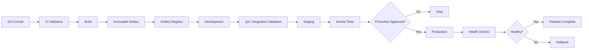
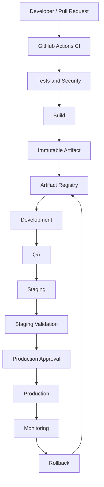

# 05- Environment Promotion

## Overview

Environment promotion is the controlled movement of a validated application release from one deployment environment to another.

A typical production pipeline looks like:

```text
Pull Request
    ↓
CI Validation
    ↓
Build
    ↓
Immutable Artifact
    ↓
Development
    ↓
Staging
    ↓
Approval / Policy Gate
    ↓
Production
    ↓
Monitoring
    ↓
Rollback if required
```

Environment promotion is closely related to artifact promotion, but the concepts are different:

- **Artifact promotion** moves a specific immutable artifact.
- **Environment promotion** moves that artifact through increasingly controlled environments.

The central production principle is:

```text
Build Once
    ↓
Validate
    ↓
Promote
    ↓
Deploy
```

rather than rebuilding the application separately for every environment.

---

## What Environment Promotion Means

An environment represents a runtime context with its own:

- Infrastructure
- Configuration
- Secrets
- Database
- Networking
- Access controls
- Scaling characteristics
- Monitoring
- Deployment policies

Common environments include:

| Environment | Primary Purpose | Typical Controls |
|---|---|---|
| Development | Developer validation | Low |
| QA | Functional testing | Moderate |
| Staging | Production-like validation | High |
| Production | Customer traffic | Highest |

Promotion means moving a release from one environment to another while satisfying the controls required by the target environment.

---

## Why Environment Promotion Exists

Without controlled environments, a deployment process can become:

```text
Developer
   ↓
Production
```

This increases the chance that:

- Integration problems reach production
- Configuration errors are discovered too late
- Database compatibility problems appear during release
- Security checks are skipped
- Rollback procedures are untested
- Production deployments become manual and inconsistent

Environment promotion creates explicit validation boundaries.

```text
Development
     ↓
Integration validation
     ↓
Staging
     ↓
Production validation
```

---

## Environment vs Artifact

An artifact answers:

> What software are we deploying?

An environment answers:

> Where and under what configuration are we running it?

For example:

```text
Artifact:
backend@sha256:abc123

Staging:
DATABASE_URL → staging database
REDIS_URL    → staging Redis
LOG_LEVEL    → INFO

Production:
DATABASE_URL → production database
REDIS_URL    → production Redis
LOG_LEVEL    → WARNING
```

The artifact remains unchanged.

---

## Environment Promotion Architecture



Each environment introduces additional validation and control.

---

## Environment Boundaries

A mature system treats environments as security and operational boundaries.

For example:

```text
Development
    │
    ├── Developer access
    └── Non-production credentials

Staging
    │
    ├── CI/CD access
    ├── Controlled secrets
    └── Production-like infrastructure

Production
    │
    ├── Restricted access
    ├── Protected secrets
    ├── Approval requirements
    └── Deployment concurrency
```

The production environment should not simply be another namespace with identical access.

---

## Configuration Separation

Application artifacts should remain environment-neutral whenever possible.

Avoid:

```text
Build staging image
Build production image
```

Prefer:

```text
Build image
    ↓
Staging configuration
    ↓
Production configuration
```

For Django:

```python
import os

DEBUG = os.getenv("DJANGO_DEBUG", "false").lower() == "true"
DATABASE_URL = os.environ["DATABASE_URL"]
REDIS_URL = os.environ["REDIS_URL"]
```

The container can be identical across environments.

---

## Configuration Sources

Environment configuration may come from:

- GitHub Environment variables
- GitHub Environment secrets
- AWS Secrets Manager
- AWS Systems Manager Parameter Store
- Kubernetes Secrets
- ECS task configuration
- Deployment tooling
- Infrastructure-as-Code outputs

The exact mechanism depends on the architecture.

The important principle is that sensitive or environment-specific configuration should not be baked into the artifact.

---

## Environment Variables

GitHub Actions supports environment variables at different scopes:

```yaml
env:
  APP_NAME: backend
```

Job-level:

```yaml
jobs:
  deploy:
    env:
      APP_ENV: staging
```

Step-level:

```yaml
steps:
  - name: Deploy
    env:
      IMAGE: ${{ needs.build.outputs.image }}
    run: ./deploy.sh
```

Keep environment-specific values close to the environment boundary.

---

## GitHub Environments

GitHub Environments provide a useful control boundary for deployment workflows.

For example:

```yaml
jobs:
  deploy:
    environment:
      name: production
```

The `production` environment can be configured with:

- Environment secrets
- Environment variables
- Required reviewers
- Deployment protection
- Branch restrictions
- Deployment history

This allows production deployment to have stricter controls than staging.

---

## Development Environment

Development environments optimize for fast feedback.

Typical characteristics:

- Frequent deployments
- Minimal approval
- Debug logging
- Smaller infrastructure
- Disposable data
- Broad developer access

Example:

```text
Developer
   ↓
Push
   ↓
CI
   ↓
Development
```

Development should not be treated as a security-free environment.

Even non-production systems may contain:

- Source code
- Internal APIs
- Cloud credentials
- Customer-like data
- Internal network access

---

## QA Environment

QA environments focus on functional and integration validation.

Typical checks include:

- API tests
- Database integration
- Redis integration
- Celery execution
- Kafka integration
- Authentication
- Contract tests
- Regression tests

Example:

```text
Build
 ↓
QA
 ├── PostgreSQL
 ├── Redis
 ├── Celery
 └── API Tests
```

---

## Staging Environment

Staging should approximate production sufficiently to expose important deployment problems before production.

Useful areas of parity include:

- Application runtime
- Docker image
- Database engine
- Network topology
- Authentication mechanisms
- Service integrations
- Deployment mechanism
- Observability

Staging does not necessarily require production scale.

For example:

```text
Staging:
2 ECS tasks
1 database instance

Production:
20 ECS tasks
Multi-AZ database
```

The runtime architecture can remain structurally similar.

---

## Production Environment

Production has the strongest controls.

Typical controls include:

- Restricted deployment permissions
- Required reviewers
- Branch restrictions
- Environment-specific secrets
- Deployment concurrency
- Health checks
- Rollback procedures
- Monitoring
- Auditability

A production workflow should be deterministic and repeatable.

---

## Promotion Criteria

Promotion should be based on explicit criteria.

For example:

```text
Build
 ↓
Unit Tests Passed
 ↓
Integration Tests Passed
 ↓
Security Scan Passed
 ↓
Artifact Published
 ↓
Staging Deployment Successful
 ↓
Smoke Tests Passed
 ↓
Approval
 ↓
Production
```

Promotion should not depend on an operator informally deciding that a deployment "looks fine."

---

## Automated Promotion

A fully automated pipeline can promote a release when all required conditions succeed.

```text
Build
  ↓
Tests
  ↓
Security
  ↓
Staging
  ↓
Smoke Tests
  ↓
Production
```

This is useful when:

- Tests are reliable
- Deployment is deterministic
- Monitoring is strong
- Rollback is automated
- Organizational policy permits automatic production release

---

## Manual Promotion

A manual approval gate can be appropriate for production.

```text
Staging
   ↓
Validation
   ↓
Manual Approval
   ↓
Production
```

The important distinction is:

```text
Approval controls promotion
```

not:

```text
Approval triggers a new production build
```

The production deployment should use the already-validated artifact.

---

## Promotion with GitHub Actions

A simple environment-aware deployment might look like:

```yaml
jobs:
  deploy-staging:
    needs: build
    runs-on: ubuntu-latest

    environment:
      name: staging

    steps:
      - name: Deploy staging
        env:
          IMAGE: ${{ needs.build.outputs.image }}
        run: |
          ./deploy.sh staging "$IMAGE"

      - name: Validate staging
        run: |
          curl --fail https://staging.example.com/health

  deploy-production:
    needs: deploy-staging
    runs-on: ubuntu-latest

    environment:
      name: production

    steps:
      - name: Deploy production
        env:
          IMAGE: ${{ needs.build.outputs.image }}
        run: |
          ./deploy.sh production "$IMAGE"
```

The same build output flows into both environments.

---

## Promotion Using a Reusable Workflow

A platform team can centralize deployment logic:

```yaml
jobs:
  deploy:
    uses: company/platform-workflows/.github/workflows/deploy.yml@v2
    with:
      environment: production
      image: ${{ needs.build.outputs.image }}
    secrets: inherit
```

The reusable workflow can enforce organization-wide deployment standards.

This is particularly useful when many backend services use the same deployment platform.

---

## Environment-Specific Secrets

A production environment should not reuse staging credentials.

Example:

```text
staging:
  DATABASE_URL
  REDIS_URL
  API_KEY

production:
  DATABASE_URL
  REDIS_URL
  API_KEY
```

The values should be independently managed.

A compromised staging credential should not automatically provide production access.

---

## AWS Environment Promotion

A common AWS architecture is:

```text
GitHub Actions
      ↓
OIDC
      ↓
AWS STS
      ↓
IAM Role
      ↓
ECR
      ↓
Staging ECS
      ↓
Production ECS
```

Separate IAM roles can be used:

```text
GitHub OIDC
   ├── Staging Role
   └── Production Role
```

The production role should have access only to the resources required for production deployment.

---

## OIDC and Environment Restrictions

GitHub OIDC can be combined with environment-aware IAM trust policies.

Conceptually:

```text
GitHub Environment
       ↓
OIDC token
       ↓
AWS IAM trust policy
       ↓
Production deployment role
```

The IAM trust policy can restrict which repository, workflow context, branch, or environment is allowed to assume the role.

This creates a stronger boundary than simply storing AWS access keys as GitHub secrets.

---

## Separate AWS Accounts

Larger environments may use separate AWS accounts:

```text
Organization
 ├── Development Account
 ├── Staging Account
 └── Production Account
```

Advantages include:

- Stronger isolation
- Reduced blast radius
- Independent IAM policies
- Separate billing
- Clearer compliance boundaries
- Safer experimentation

The trade-off is increased infrastructure and operational complexity.

---

## Same Account vs Separate Accounts

| Model | Isolation | Complexity | Typical Use |
|---|---|---|---|
| Same account, separate resources | Lower | Lower | Smaller systems |
| Separate environments / resource groups | Moderate | Moderate | Growing systems |
| Separate AWS accounts | Strong | Higher | Enterprise production |

There is no universal requirement to use separate accounts. The appropriate model depends on security, compliance, operational, and organizational requirements.

---

## Environment Promotion and Docker

A Docker image should normally be built once:

```bash
docker buildx build \
  --platform linux/amd64 \
  -t "$IMAGE" \
  --push .
```

The resulting image can then be promoted.

Do not use:

```text
Dockerfile + staging configuration → staging image
Dockerfile + production configuration → production image
```

unless environment-specific build-time differences are genuinely required.

---

## Immutable Image References

Prefer:

```text
backend@sha256:abc123
```

over:

```text
backend:latest
```

A digest identifies the exact image content.

A useful release record is:

```text
Version: 2.4.0
Commit: 7f3a8e2
Image: backend@sha256:abc123
Environment: production
```

---

## Environment Promotion and Database Migrations

Environment promotion does not eliminate database migration risk.

During a rolling deployment:

```text
Old Application
       +
New Application
       ↓
Same Database
```

Both application versions may temporarily run against the same schema.

Prefer backward-compatible migrations.

A common sequence is:

```text
Expand
  ↓
Deploy compatible application
  ↓
Backfill
  ↓
Switch application behavior
  ↓
Contract
```

---

## Django Migration Example

Suppose a field must be renamed.

A risky deployment is:

```text
Drop old field
Add new field
Deploy new application
```

If old application instances are still running, they may fail.

A safer strategy can be:

```text
Add new field
      ↓
Deploy code supporting both
      ↓
Backfill
      ↓
Switch reads/writes
      ↓
Remove old field later
```

The exact migration strategy depends on workload and schema behavior.

---

## Redis Compatibility

Redis data can outlive a deployment.

Suppose version A writes:

```text
user:123
```

and version B expects:

```text
user:v2:123
```

A rolling deployment may have both versions active.

A compatibility strategy might temporarily support both formats:

```text
Read v2
  ↓
Fallback to v1
```

Data migration can then happen independently.

---

## Celery Compatibility

Celery workers can overlap during promotion:

```text
Old Worker
     +
New Worker
     ↓
Celery Queue
```

Task payloads should remain compatible across versions.

Avoid changing task arguments in a way that causes an older worker to reject tasks produced by the newer application.

---

## Kafka Compatibility

Kafka-based services introduce similar compatibility requirements.

```text
Producer v1
Producer v2
Consumer v1
Consumer v2
```

Messages should evolve in a way that allows compatible producers and consumers to coexist during deployment.

This is particularly important during rolling or canary releases.

---

## API Compatibility

Environment promotion can temporarily expose multiple application versions:

```text
Load Balancer
    │
 ┌──┴──┐
 ▼     ▼
v2.3  v2.4
```

API changes should therefore consider compatibility.

For REST APIs:

```text
Prefer:
Add optional field
```

over:

```text
Immediately remove required field
```

For gRPC, protobuf schema evolution should preserve compatibility with deployed clients and services.

---

## Promotion and Microservices

A microservice architecture may promote services independently:

```text
users-service
    ↓
staging
    ↓
production

orders-service
    ↓
staging
```

This reduces unnecessary deployment coupling.

However, if services have tightly coupled API or schema changes, coordinated promotion may be required.

---

## Environment Dependencies

An environment is more than the application container.

A production environment might include:

```text
                    Production
                        │
        ┌───────────────┼────────────────┐
        ▼               ▼                ▼
    Load Balancer     ECS/EKS         Database
                        │                │
                   ┌────┴────┐           │
                   ▼         ▼           ▼
                API Pods   Workers    PostgreSQL
                   │
                   ▼
                 Redis
                   │
                   ▼
                 Kafka
```

Promotion must account for dependencies.

A successful container deployment does not guarantee the complete system is healthy.

---

## Health Checks

A deployment should validate both infrastructure and application health.

Examples:

```bash
curl --fail https://staging.example.com/health
```

and:

```bash
curl --fail https://staging.example.com/ready
```

A health endpoint should expose only appropriate information.

Avoid returning:

- Database credentials
- Internal stack traces
- Secret values
- Sensitive infrastructure details

---

## Smoke Tests

A staging smoke-test sequence might be:

```text
Deployment
   ↓
Readiness
   ↓
Health endpoint
   ↓
Authentication
   ↓
Critical API
   ↓
Database operation
   ↓
Background task
```

For a Django or FastAPI service:

```text
GET /health
GET /ready
POST /api/login
GET /api/orders
```

The exact tests should focus on high-value production paths.

---

## Deployment Strategies

Environment promotion can be combined with different deployment strategies.

### Rolling Deployment

```text
Old
Old
Old

   ↓

New
Old
Old

   ↓

New
New
Old

   ↓

New
New
New
```

Advantages:

- Lower infrastructure overhead
- Gradual replacement

Limitations:

- Multiple versions coexist
- Compatibility is required
- Rollback can be more complex

---

### Blue-Green Deployment

```text
Production Traffic
       │
       ▼
    Router
    /     \
   ▼       ▼
 Blue     Green
 Old       New
```

Traffic switches between complete environments.

Advantages:

- Fast traffic switching
- Easier rollback

Limitations:

- Higher infrastructure cost
- Data migration remains challenging

---

### Canary Deployment

```text
Traffic
   │
   ├── 95% → Stable
   │
   └── 5%  → New
```

The new release receives a small portion of traffic before broader rollout.

Canary promotion can use:

- Error rates
- Latency
- Saturation
- Business metrics
- Health checks

---

## Zero-Downtime Promotion

Zero-downtime deployment requires more than a deployment command.

Consider:

- Load balancing
- Readiness checks
- Connection draining
- Backward-compatible schema changes
- Graceful shutdown
- Multiple application instances
- Queue behavior
- Cache compatibility

For example:

```text
Traffic
   ↓
Load Balancer
   ↓
Healthy instances
   ↓
Replace one instance
   ↓
Health check
   ↓
Continue
```

---

## Environment Promotion and Concurrency

Production promotion must be serialized when releases can conflict.

```yaml
concurrency:
  group: production-deployment
  cancel-in-progress: false
```

For pull request environments, cancellation may be appropriate:

```yaml
concurrency:
  group: pr-${{ github.event.pull_request.number }}
  cancel-in-progress: true
```

The correct behavior depends on the environment.

---

## Preventing Promotion Races

Consider:

```text
Release A
   ↓
Staging
   ↓
Approval
   ↓
Production

Release B
   ↓
Staging
   ↓
Approval
   ↓
Production
```

If both deploy simultaneously, the final production version may depend on timing.

Use:

- Concurrency groups
- Release sequencing
- Environment protection
- Explicit artifact identity
- Deployment state tracking

---

## Rollback

Rollback should promote a previously validated release.

```text
Production
   ↓
Release B
   ↓
Failure
   ↓
Release A
   ↓
Production
```

The rollback should reference the existing artifact.

For Docker:

```text
backend@sha256:known-good
```

rather than rebuilding the old source.

---

## Rollback and Database State

Application rollback does not automatically roll back database changes.

For example:

```text
Application B
    ↓
Schema migration
    ↓
Production
    ↓
Application B fails
    ↓
Rollback to Application A
```

If the schema is no longer compatible with A, application rollback may fail.

This is why expand/contract migration strategies are important.

---

## Promotion History

Maintain deployment metadata such as:

```text
Environment
Release
Commit
Artifact Digest
Workflow Run
Deployment Time
Actor
Status
```

This supports:

- Auditing
- Incident response
- Rollback
- Release analysis
- Compliance

GitHub Environment deployment history can provide part of this operational record.

---

## Monitoring Promotion

Monitor both deployment and application health.

Important signals include:

- Deployment duration
- Deployment failure rate
- HTTP error rate
- Request latency
- CPU
- Memory
- Database connections
- Queue depth
- Kafka consumer lag
- Redis errors
- Container restarts

A deployment should be considered successful only after the system reaches an acceptable healthy state.

---

## Observability Flow

```text
Deployment
    ↓
Infrastructure Metrics
    ↓
Application Metrics
    ↓
Logs
    ↓
Traces
    ↓
Health Checks
    ↓
Promotion Decision
```

This provides evidence for whether promotion should continue.

---

## Failure Domains

Troubleshoot environment promotion by isolating the failure domain.

| Failure Domain | Example |
|---|---|
| CI | Build or test failure |
| Artifact | Wrong image digest |
| Registry | Image unavailable |
| Authentication | OIDC / IAM failure |
| Infrastructure | ECS/EKS deployment failure |
| Configuration | Incorrect environment variable |
| Secrets | Missing or invalid secret |
| Network | Security group / routing problem |
| Database | Migration failure |
| Application | Startup failure |
| Dependency | Redis/Kafka unavailable |
| Health check | Readiness failure |
| Concurrency | Conflicting deployments |

---

## Troubleshooting Promotion Failures

Use:

```text
Symptom
  ↓
Possible Causes
  ↓
Isolation Strategy
  ↓
Commands / Checks
  ↓
Root Cause
  ↓
Corrective Action
  ↓
Prevention
```

---

## Production Environment Was Not Updated

### Possible Causes

- Workflow did not trigger
- Job dependency failed
- Environment approval is pending
- Branch restriction blocked deployment
- Concurrency queue is active
- Deployment command failed

### Checks

```bash
gh run list
```

```bash
gh run view RUN_ID
```

Inspect the workflow's environment and deployment status.

---

## Wrong Configuration Reached Production

### Possible Causes

- Environment variable precedence
- Repository variable used instead of environment variable
- Incorrect secret
- Hard-coded value
- Build-time configuration embedded in image

### Prevention

Keep environment-specific configuration at the deployment boundary and verify the effective configuration without exposing secrets.

---

## Production Approval Is Missing

### Possible Causes

- Required reviewer not configured
- Workflow targets the wrong environment
- Deployment branch restriction
- Approval is pending

The deployment workflow should make the environment explicit:

```yaml
environment:
  name: production
```

---

## Staging Passed but Production Failed

First verify that the same artifact was used:

```text
Staging Digest
       ==
Production Digest
```

If they match, investigate environmental differences:

- IAM
- Networking
- Secrets
- Database
- Capacity
- External integrations
- Runtime configuration

Do not immediately rebuild.

---

## Production Is Running an Unexpected Version

Check:

```text
Git Commit
Artifact Tag
Artifact Digest
Deployment Record
Runtime Image
```

A useful release record is:

```text
Release: 2.4.0
Commit: 7f3a8e2
Digest: sha256:abc123
```

If the runtime digest differs from the approved digest, investigate the deployment path before investigating application code.

---

## AWS Diagnostic Commands

Inspect ECR images:

```bash
aws ecr describe-images \
  --repository-name backend \
  --region "$AWS_REGION"
```

Inspect ECS services:

```bash
aws ecs describe-services \
  --cluster production \
  --services backend-api \
  --region "$AWS_REGION"
```

Inspect task details:

```bash
aws ecs list-tasks \
  --cluster production \
  --service-name backend-api \
  --region "$AWS_REGION"
```

Inspect a task:

```bash
aws ecs describe-tasks \
  --cluster production \
  --tasks TASK_ARN \
  --region "$AWS_REGION"
```

These commands help verify what was actually deployed rather than relying only on workflow output.

---

## GitHub CLI Diagnostics

List workflows:

```bash
gh workflow list
```

List recent runs:

```bash
gh run list
```

Inspect a run:

```bash
gh run view RUN_ID
```

Inspect logs:

```bash
gh run view RUN_ID --log
```

Rerun when appropriate:

```bash
gh run rerun RUN_ID
```

Use reruns carefully when the workflow has side effects such as production deployments.

---

## Environment Security

Production environments should follow least privilege.

Consider:

```text
Developer
   ↓
Development

CI
   ↓
Staging

Protected Deployment Workflow
   ↓
Production
```

Do not allow every workflow to assume the production IAM role.

---

## Fork Pull Requests

Fork-based pull requests represent an untrusted execution context.

Avoid allowing untrusted fork code to access production credentials.

Be particularly careful with:

```text
pull_request
pull_request_target
```

A workflow that checks out untrusted code and then exposes privileged secrets or tokens can create a serious security boundary violation.

---

## `pull_request_target` and Environments

`pull_request_target` runs with the context of the base repository.

This can provide access to repository resources that are unavailable to ordinary fork pull requests.

It must therefore be handled carefully.

Do not combine privileged credentials with execution of untrusted pull request code.

---

## Environment Protection and OIDC

Production authentication should ideally depend on both:

```text
Trusted GitHub workflow
        +
Correct environment
        +
OIDC identity
        ↓
Production IAM Role
```

This reduces the risk that an unrelated workflow can obtain production credentials.

---

## Secrets Management

Do not:

```yaml
run: deploy --token ${{ secrets.PROD_TOKEN }}
```

when the command line can expose the value through process inspection or logging.

Prefer passing secrets through supported environment or tool-specific mechanisms and avoid printing them.

For AWS, prefer OIDC instead of storing long-lived access keys.

---

## Artifact Verification Before Promotion

Before production promotion, verify:

- Artifact exists
- Digest matches expected value
- Artifact passed required security scans
- Provenance is available when required
- Artifact has not been replaced
- Staging validation succeeded

Conceptually:

```text
Expected Digest
      │
      ▼
Registry Digest
      │
      ▼
Verified?
   │      │
  Yes     No
   │       │
   ▼       ▼
Promote   Stop
```

---

## Supply Chain Security

The environment promotion boundary should also protect against compromised artifacts.

Useful controls include:

- SHA-pinned actions
- Dependency review
- Dependabot
- SBOM
- Artifact provenance
- Artifact attestations
- Artifact signing
- Trusted build workflows
- Least-privilege permissions
- Restricted deployment roles

Promotion should not mean blindly trusting every artifact produced by CI.

---

## Reproducibility

A good environment promotion system should allow operators to answer:

> What exactly is running in production?

The answer should include:

```text
Source Commit
     ↓
Workflow Run
     ↓
Artifact Digest
     ↓
Deployment
     ↓
Environment
```

If that chain cannot be reconstructed, operational debugging becomes significantly harder.

---

## Disaster Recovery

Environment promotion is also important for disaster recovery.

A DR environment may require:

```text
Known Artifact
     ↓
DR Infrastructure
     ↓
Environment Configuration
     ↓
Deployment
     ↓
Health Validation
```

The organization should know:

- Which artifacts are retained
- Where they are stored
- How they are deployed
- Which secrets are required
- Which infrastructure is provisioned
- How rollback works

---

## High Availability

CI/CD should support application HA rather than undermine it.

For production:

- Use multiple application instances
- Deploy gradually when appropriate
- Validate readiness
- Drain connections before termination
- Avoid simultaneous replacement of all instances
- Monitor during rollout

For ECS or Kubernetes, deployment configuration should preserve sufficient healthy capacity during rollout.

---

## Cost Optimization

Environment promotion can control costs by using appropriate environment sizes.

For example:

```text
Development → Small
QA          → Small/Medium
Staging     → Production-like architecture
Production  → Production capacity
```

Avoid duplicating full production capacity in every environment unless required.

However, cost optimization should not eliminate critical production-like validation.

---

## Environment Lifecycle

Not every environment needs to be permanent.

Ephemeral environments can be created for pull requests:

```text
Pull Request
    ↓
Build
    ↓
Ephemeral Environment
    ↓
Integration Tests
    ↓
Destroy
```

This can provide isolation without permanently maintaining infrastructure.

---

## Ephemeral Environment Considerations

Ephemeral environments require:

- Automatic creation
- Unique naming
- Isolated configuration
- Temporary credentials
- Data initialization
- Cleanup
- Cost controls

For example:

```text
pr-123
pr-124
pr-125
```

Each can have a separate deployment target.

---

## Environment Drift

Environment drift occurs when environments diverge unexpectedly.

For example:

```text
Staging:
PostgreSQL 16

Production:
PostgreSQL 14
```

or:

```text
Staging:
Nginx configuration A

Production:
Nginx configuration B
```

Some differences are intentional.

Unexpected differences should be controlled through Infrastructure as Code and configuration management.

---

## Infrastructure as Code

Terraform or CloudFormation can define environments.

Example Terraform structure:

```text
infrastructure/
├── modules/
│   ├── ecs-service/
│   └── database/
├── environments/
│   ├── staging/
│   └── production/
```

The environments can share reusable infrastructure modules while supplying different parameters.

---

## Environment Promotion and Terraform

Application promotion and infrastructure promotion should remain conceptually separate.

```text
Application Artifact
       +
Infrastructure Configuration
       +
Environment Configuration
```

A Terraform change should not automatically imply that the application artifact must be rebuilt.

Likewise, a new application release does not necessarily require infrastructure changes.

---

## Production Pipeline

A production-grade environment promotion pipeline can look like:

```text
Pull Request
    ↓
Lint
    ↓
Unit Tests
    ↓
Integration Tests
    ↓
Security Scan
    ↓
Matrix Tests
    ↓
Build
    ↓
Docker Image
    ↓
ECR
    ↓
Staging
    ↓
Smoke Tests
    ↓
Approval
    ↓
Production
    ↓
Health Validation
    ↓
Monitoring
    ↓
Rollback if required
```

The artifact remains unchanged after the build.

---

## Example Production Workflow

```yaml
name: Promote Application

on:
  workflow_dispatch:
    inputs:
      image:
        description: "Immutable image reference"
        required: true
        type: string

permissions:
  contents: read
  id-token: write

jobs:
  staging:
    runs-on: ubuntu-latest

    environment:
      name: staging

    steps:
      - name: Deploy staging
        env:
          IMAGE: ${{ inputs.image }}
        run: |
          ./deploy.sh staging "$IMAGE"

      - name: Validate staging
        run: |
          curl --fail https://staging.example.com/health

  production:
    needs: staging
    runs-on: ubuntu-latest

    environment:
      name: production

    concurrency:
      group: production-deployment
      cancel-in-progress: false

    steps:
      - name: Deploy production
        env:
          IMAGE: ${{ inputs.image }}
        run: |
          ./deploy.sh production "$IMAGE"

      - name: Validate production
        run: |
          curl --fail https://api.example.com/health
```

The production job does not rebuild the application.

---

## Promotion Policy Example

A mature organization can define explicit promotion criteria:

```text
Artifact exists
    AND
Artifact is verified
    AND
Required tests passed
    AND
Staging deployment succeeded
    AND
Smoke tests passed
    AND
Production approval granted
    AND
No conflicting production deployment
        ↓
Allow Production Promotion
```

This converts deployment decisions into enforceable controls.

---

## Common Mistakes

### Treating Every Environment as Identical

Production and staging often require different scale and access controls.

Aim for meaningful parity rather than exact duplication.

---

### Rebuilding for Each Environment

```text
Build staging
Build production
```

can produce different artifacts.

Build once and promote the same artifact.

---

### Storing Production Secrets in Source Control

Never commit:

```text
PROD_DATABASE_PASSWORD
AWS_ACCESS_KEY_ID
AWS_SECRET_ACCESS_KEY
```

Use appropriate secret-management mechanisms.

---

### Giving Staging Access to Production

A staging workflow should not automatically receive production credentials.

Use separate IAM roles and environment boundaries.

---

### Using `latest`

`latest` makes artifact identity ambiguous.

Prefer commit-based references and immutable digests.

---

### Ignoring Environment Drift

Infrastructure differences can invalidate staging confidence.

Use Infrastructure as Code and configuration management.

---

### Running Database Migrations Without Compatibility Planning

Rolling deployments can leave old and new application versions running simultaneously.

Design migrations for compatibility.

---

### Assuming Successful Deployment Means Healthy Application

A deployment command succeeding does not prove:

- Requests work
- Database connectivity works
- Redis works
- Background workers work
- Dependencies are healthy

Perform runtime validation.

---

### Using `cancel-in-progress: true` for Production

Cancelling an active production deployment can leave the environment in an unexpected intermediate state.

Production usually requires a deliberate queueing or deployment policy.

---

### Allowing Untrusted Code to Access Production Credentials

Fork pull requests and other untrusted execution contexts require strict separation from production secrets and deployment roles.

---

## Production Checklist

### Artifact

- [ ] Artifact is immutable
- [ ] Artifact digest is recorded
- [ ] Artifact is stored in a durable registry
- [ ] Artifact security checks passed
- [ ] Provenance is available where required

### Development and QA

- [ ] CI validation passed
- [ ] Unit tests passed
- [ ] Integration tests passed
- [ ] Required matrix tests passed

### Staging

- [ ] Same artifact is deployed
- [ ] Configuration is correct
- [ ] Dependencies are available
- [ ] Smoke tests passed
- [ ] Health checks passed

### Production

- [ ] Production environment is protected
- [ ] Approval requirements are satisfied
- [ ] IAM permissions are least privilege
- [ ] OIDC is used where appropriate
- [ ] Deployment concurrency is controlled
- [ ] Monitoring is active
- [ ] Rollback artifact is available

### Data

- [ ] Database migration is compatible
- [ ] Redis compatibility is considered
- [ ] Celery task compatibility is considered
- [ ] Kafka schema compatibility is considered
- [ ] API compatibility is considered

---

## Interview Scenarios

### Production Deployment Must Not Run Twice

Design:

```text
Production Environment
        +
Concurrency Group
        +
Immutable Artifact
```

Explain why production deployments should not be cancelled arbitrarily.

---

### Production Requires Manual Approval

Use a protected GitHub Environment:

```text
Staging
   ↓
Validation
   ↓
Production Environment
   ↓
Required Reviewer
   ↓
Deployment
```

The approved artifact should be the same artifact validated in staging.

---

### Docker Image Must Not Be Rebuilt for Production

Design:

```text
Build
 ↓
ECR
 ↓
Digest
 ↓
Staging
 ↓
Approval
 ↓
Production
```

The production workflow consumes the digest.

---

### AWS Credentials Must Not Be Long-Lived

Use:

```text
GitHub Actions
 ↓
OIDC
 ↓
AWS STS
 ↓
IAM Role
```

Use separate roles where environment isolation requires it.

---

### Staging Passed but Production Failed

First compare:

```text
Staging Artifact Digest
Production Artifact Digest
```

If identical, investigate environment-specific differences rather than rebuilding.

---

### Rollback Is Required

Use:

```text
Production
 ↓
Current Release
 ↓
Failure
 ↓
Known-Good Artifact
 ↓
Production
```

Do not rebuild the historical commit unless there is a deliberate reason.

---

### Multiple Python Versions Must Be Tested

Use a matrix during CI:

```yaml
strategy:
  matrix:
    python-version:
      - "3.11"
      - "3.12"
      - "3.13"
```

Only the release artifact from the intended production build should proceed to promotion.

Testing multiple versions does not mean producing multiple production artifacts unnecessarily.

---

### Self-Hosted Runner Needs Private Network Access

Design:

```text
GitHub
  ↓
Self-Hosted Runner
  ↓
Private Network
  ├── ECS / Kubernetes
  ├── Database
  └── Internal APIs
```

The runner becomes a high-value security boundary and should be isolated, monitored, and preferably ephemeral for sensitive workloads.

---

## Senior-Level Design Principles

A mature environment promotion system separates:

```text
Application Source
        ↓
CI Validation
        ↓
Artifact Creation
        ↓
Artifact Verification
        ↓
Environment Promotion
        ↓
Deployment
        ↓
Runtime Validation
```

The most important design boundaries are:

### Artifact Boundary

The artifact is immutable.

### Configuration Boundary

Environment-specific values are supplied at runtime.

### Security Boundary

Production credentials and deployment permissions are restricted.

### Promotion Boundary

Moving into production requires explicit policy satisfaction.

### Deployment Boundary

The deployment mechanism should be deterministic and observable.

### Recovery Boundary

Previously validated artifacts remain available for rollback and disaster recovery.

---

## Reference Architecture



The registry is the persistent boundary for the deployable artifact.

The environments are progressively more controlled execution contexts.

---

## Key Takeaways

- Environment promotion moves a validated release through controlled runtime environments while keeping the deployable artifact immutable.
- Environment-specific configuration, secrets, infrastructure, scaling, and access controls should change at the environment boundary rather than requiring a new application build.
- Production promotion should combine staging validation, protected environments, least-privilege access, OIDC-based AWS authentication, deployment concurrency, and explicit approval policies where required.
- Database, Redis, Celery, Kafka, and API compatibility must account for periods when multiple application versions coexist during rolling or gradual deployments.
- Reliable promotion requires strong artifact identity, deployment observability, environment drift control, and a rollback path based on previously validated artifacts.