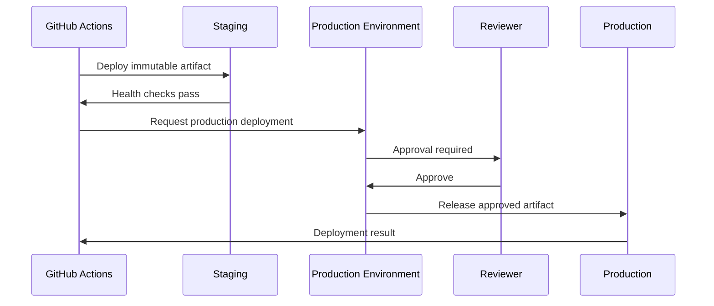
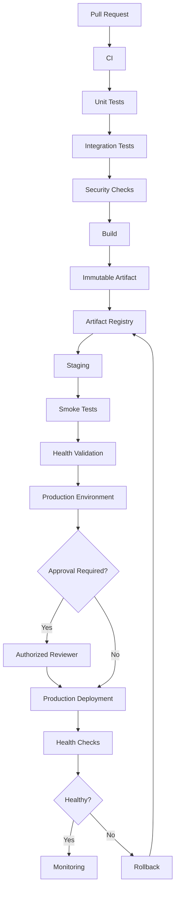

# 06- Deployment Approvals

## Overview

Deployment approval is a controlled decision point between a validated release and deployment into a protected environment.

A production deployment commonly follows:

```text
Pull Request
    ↓
Lint
    ↓
Unit Tests
    ↓
Integration Tests
    ↓
Security Checks
    ↓
Build
    ↓
Immutable Artifact
    ↓
Staging
    ↓
Validation
    ↓
Deployment Approval
    ↓
Production
    ↓
Health Validation
    ↓
Monitoring
```

The approval mechanism should control **promotion of an already-built artifact**, not trigger a separate production build.

The core principle is:

```text
Build Once
    ↓
Validate
    ↓
Approve
    ↓
Deploy the Same Artifact
```

Deployment approvals are useful when production changes require explicit authorization, separation of duties, compliance evidence, or additional operational review.

---

## What Deployment Approval Is

A deployment approval is a policy-controlled gate that must be satisfied before a workflow can deploy to a protected environment.

For example:

```text
Staging Deployment
       ↓
Automated Validation
       ↓
Production Environment
       ↓
Required Reviewer
       ↓
Production Deployment
```

The approval answers:

> Is this already-validated release allowed to enter this environment?

It should not answer:

> Should we build a different version for production?

---

## Why Deployment Approvals Exist

Production deployments can have consequences that automated tests cannot completely evaluate.

Approval gates can provide:

- Separation of duties
- Operational review
- Compliance evidence
- Change-management control
- Release coordination
- Explicit authorization for high-risk changes

However, approval should not compensate for weak automation.

A poor pipeline might look like:

```text
Build
 ↓
Human checks everything manually
 ↓
Production
```

A stronger pipeline is:

```text
Automated Validation
 ↓
Automated Staging
 ↓
Automated Health Checks
 ↓
Approval for Production
 ↓
Automated Production Deployment
```

---

## Automated Validation vs Manual Approval

These are different controls.

| Control | Purpose |
|---|---|
| Unit tests | Validate code behavior |
| Integration tests | Validate component interaction |
| Security scanning | Identify known security risks |
| Staging tests | Validate deployed behavior |
| Health checks | Validate runtime availability |
| Approval | Authorize promotion into a protected environment |

An approval should not replace automated validation.

---

## GitHub Environments

GitHub Actions Environments provide a natural boundary for deployment approval.

Example:

```yaml
jobs:
  deploy-production:
    runs-on: ubuntu-latest

    environment:
      name: production

    steps:
      - name: Deploy
        run: ./deploy.sh
```

The `production` environment can be configured with protection rules such as:

- Required reviewers
- Deployment branch restrictions
- Environment secrets
- Environment variables
- Deployment history

The workflow reaches the environment boundary before executing the protected deployment steps.

---

## Approval Flow

Conceptually:



The approval occurs after the artifact has already been built and validated.

---

## Approval as a Security Boundary

Production approval is also a security control.

Consider:

```text
Developer
    ↓
Pull Request
    ↓
GitHub Actions
    ↓
Staging
    ↓
Production Approval
    ↓
Production IAM Role
```

The developer should not automatically receive unrestricted production access merely because they can modify application source.

The deployment system can enforce the production boundary.

---

## Separation of Duties

A common enterprise requirement is:

```text
Developer
    ↓
Creates Change

CI
    ↓
Validates Change

Reviewer
    ↓
Approves Promotion

Deployment Workflow
    ↓
Deploys
```

This provides separation between:

- Creating the change
- Validating the change
- Authorizing production deployment
- Executing the deployment

The exact separation depends on organizational policy.

---

## Required Reviewers

A production environment can require designated reviewers before deployment proceeds.

The reviewer should evaluate information such as:

- Release version
- Commit
- Artifact digest
- Test status
- Staging health
- Deployment scope
- Database changes
- Known incidents
- Rollback plan

The reviewer should not need to manually perform the deployment.

---

## What a Reviewer Should See

A useful deployment summary might contain:

```text
Service: backend-api
Release: 2.4.0
Commit: 7f3a8e2
Artifact: backend@sha256:abc123
Environment: production

CI:
✓ Unit tests
✓ Integration tests
✓ Security scan

Staging:
✓ Deployment
✓ Health checks
✓ Smoke tests

Database:
✓ Backward-compatible migration

Rollback:
backend@sha256:previous-good
```

This makes approval an informed operational decision.

---

## Step Summary for Approval Context

GitHub Actions can publish deployment information using `$GITHUB_STEP_SUMMARY`.

Example:

```yaml
- name: Publish deployment summary
  env:
    IMAGE: ${{ needs.build.outputs.image }}
  run: |
    {
      echo "## Production Deployment"
      echo
      echo "- Artifact: \`$IMAGE\`"
      echo "- Commit: \`${GITHUB_SHA}\`"
      echo "- Environment: production"
    } >> "$GITHUB_STEP_SUMMARY"
```

Do not place secrets in the summary.

---

## Approval Should Happen After Staging

A common production flow is:

```text
Build
 ↓
Security Scan
 ↓
Staging
 ↓
Smoke Tests
 ↓
Approval
 ↓
Production
```

Not:

```text
Build
 ↓
Approval
 ↓
Production Build
```

The latter introduces the possibility that the approved artifact is not the artifact actually deployed.

---

## Build Once, Approve Once, Deploy Same Artifact

The preferred model is:

```text
Source
  ↓
Build
  ↓
Artifact A
  ↓
Staging
  ↓
Approval
  ↓
Production
```

Not:

```text
Source
 ├── Build A → Staging
 │
 └── Build B → Production
```

Approval should be associated with a specific artifact identity.

---

## Artifact Identity During Approval

For Docker-based deployments, record:

```text
Repository:
backend

Commit:
7f3a8e2

Tag:
2.4.0

Digest:
sha256:abc123
```

The digest is the strongest identity for the image content.

A production deployment should use the approved artifact rather than resolving a mutable tag again.

---

## Approval and Mutable Tags

Avoid approving:

```text
backend:latest
```

and later deploying:

```text
backend:latest
```

The tag could point to different content.

Prefer:

```text
backend@sha256:abc123
```

This ensures the approved artifact and deployed artifact are the same content.

---

## Environment Secrets

Production secrets should be associated with the protected environment.

Conceptually:

```text
staging
 ├── STAGING_DATABASE_URL
 └── STAGING_API_KEY

production
 ├── PRODUCTION_DATABASE_URL
 └── PRODUCTION_API_KEY
```

A staging workflow should not automatically gain access to production credentials.

---

## Secret Availability and Approval

One important security principle is:

> Do not expose production secrets to untrusted workflow execution before the deployment boundary.

For example, do not execute arbitrary pull request code with production credentials simply because the workflow eventually deploys to a protected environment.

---

## OIDC and Production Approval

Approval can be combined with AWS OIDC:

```text
GitHub Actions
      ↓
Production Environment
      ↓
Approval
      ↓
OIDC Token
      ↓
AWS STS
      ↓
Production IAM Role
      ↓
Deployment
```

This creates multiple controls:

1. Workflow authorization
2. Environment protection
3. AWS identity verification
4. IAM authorization

---

## AWS IAM Trust Policy

The production IAM role should be restricted to the intended GitHub identity.

Conceptually:

```text
GitHub OIDC Provider
        ↓
IAM Trust Policy
        ↓
Production Deployment Role
```

The trust policy can constrain claims such as:

- Repository
- Organization
- Branch
- Environment

This prevents unrelated workflows from assuming the production role.

---

## Production Permissions

The production deployment job should receive only the permissions it needs.

For example:

```yaml
permissions:
  contents: read
  id-token: write
```

The AWS IAM role then controls access to deployment resources.

Do not grant broad permissions such as unrestricted account administration merely because the workflow is a deployment workflow.

---

## Approval and `GITHUB_TOKEN`

The GitHub token should also follow least privilege.

For example:

```yaml
permissions:
  contents: read
```

Additional permissions should be enabled only when required.

A deployment workflow does not automatically need write access to repository contents.

---

## Approval and Pull Requests

Production approval should not turn untrusted pull request code into trusted production execution.

Be particularly careful with:

```text
pull_request
pull_request_target
```

and forked repositories.

A dangerous pattern is:

```text
Untrusted PR
    ↓
Privileged workflow
    ↓
Checkout PR code
    ↓
Production secret
    ↓
Shell execution
```

The workflow must maintain a clear trust boundary.

---

## `pull_request_target` Considerations

`pull_request_target` executes using the base repository context.

It can therefore have access to repository resources that ordinary fork pull requests cannot.

Do not combine privileged credentials with execution of untrusted pull request content.

Production approval does not make untrusted code safe.

---

## Approval and Branch Restrictions

Production environments can restrict deployments to approved branches.

A common model is:

```text
main
  ↓
CI
  ↓
Staging
  ↓
Approval
  ↓
Production
```

This prevents arbitrary branches from directly reaching production.

---

## Release Branches

Some organizations use release branches:

```text
main
  ↓
release/2.4
  ↓
Staging
  ↓
Approval
  ↓
Production
```

This can be useful when release stabilization is required.

The exact branching model should match the team's release strategy.

---

## Approval and Git Tags

Another model uses release tags:

```text
Commit
  ↓
Tag v2.4.0
  ↓
Build
  ↓
Staging
  ↓
Approval
  ↓
Production
```

Tags provide a useful human-readable release identifier.

The artifact digest should still be recorded for exact deployment identity.

---

## Approval Gates for Different Environments

Not every environment needs the same approval level.

| Environment | Approval | Typical Purpose |
|---|---|---|
| Development | Usually none | Fast feedback |
| QA | Usually automated | Functional validation |
| Staging | Usually automated or limited | Production-like validation |
| Production | Often protected | Controlled release |

Organizations may require additional approval for regulated or high-risk systems.

---

## Risk-Based Approval

Approval requirements can vary based on change risk.

For example:

```text
Documentation-only
    ↓
Low-risk pipeline

Application change
    ↓
Standard approval

Database migration
    ↓
Additional review

Infrastructure change
    ↓
Infrastructure review

Security-sensitive change
    ↓
Security review
```

GitHub Actions alone may not implement every policy automatically. Additional tooling or organizational processes may be required.

---

## Database Changes and Approval

Database changes deserve special attention.

A release might include:

```text
Application
+
Migration
```

The reviewer should understand:

- Schema changes
- Locking behavior
- Data migration
- Backward compatibility
- Rollback implications
- Expected execution time

A migration that locks a large PostgreSQL table may require a different rollout strategy from a simple additive migration.

---

## Expand and Contract

A safer deployment model is often:

```text
Expand
  ↓
Deploy compatible code
  ↓
Migrate / Backfill
  ↓
Switch behavior
  ↓
Contract
```

This allows old and new application versions to coexist during deployment.

---

## Django Approval Scenario

A Django release might contain:

```text
models.py
migration
API changes
Celery tasks
```

Before approval, validate:

```text
Migration compatibility
        +
API compatibility
        +
Celery task compatibility
        +
Database performance
```

Approval should be based on the validated release rather than simply the fact that the workflow completed.

---

## FastAPI Approval Scenario

For FastAPI:

```text
Build
 ↓
pytest
 ↓
API integration tests
 ↓
OpenAPI contract validation
 ↓
Staging
 ↓
Smoke tests
 ↓
Approval
 ↓
Production
```

The production deployment should use the same container image tested in staging.

---

## Celery and Approval

A release may change task code.

During a rolling deployment:

```text
Old Worker
New Worker
    ↓
Celery Queue
```

Review whether queued tasks remain compatible.

A production approval may need to consider worker compatibility separately from API health.

---

## Redis and Approval

Redis data formats may survive application releases.

Before approving a release that changes Redis structures, validate:

- Key compatibility
- Serialization format
- TTL behavior
- Cache invalidation
- Session compatibility

Do not assume an application rollback automatically restores Redis state.

---

## Kafka and Approval

Kafka deployments may involve:

```text
Producer
Consumer
Schema
```

A release that changes message structure should be reviewed for compatibility across deployed producer and consumer versions.

Approval should consider schema evolution when Kafka is part of the production architecture.

---

## Approval and Deployment Strategies

Approvals can be combined with:

- Rolling deployments
- Blue-green deployments
- Canary deployments
- Zero-downtime deployments

The approval occurs before traffic is moved into the protected environment.

---

## Rolling Deployment

```text
Approval
   ↓
Replace Instance 1
   ↓
Health Check
   ↓
Replace Instance 2
   ↓
Health Check
   ↓
Continue
```

The deployment system should maintain enough healthy capacity throughout the rollout.

---

## Blue-Green Deployment

```text
                 Production Traffic
                        │
                        ▼
                     Router
                    /      \
                   /        \
                Blue        Green
                 Old          New
```

Approval can happen before switching traffic:

```text
Deploy Green
     ↓
Validate Green
     ↓
Approve
     ↓
Switch Traffic
```

Rollback can then switch traffic back if the old environment remains available.

---

## Canary Deployment

```text
Production Traffic
       │
   ┌───┴────┐
   ▼        ▼
  95%       5%
Stable     Canary
```

Approval may happen before enabling the canary.

Further promotion can be based on runtime metrics.

---

## Approval and Health Checks

Approval does not prove the application is healthy.

After deployment:

```text
Deploy
  ↓
Readiness
  ↓
Health
  ↓
Smoke Tests
  ↓
Metrics
```

A production release should be monitored after approval and deployment.

---

## Approval and Monitoring

Monitor:

- HTTP 5xx rate
- Latency
- CPU
- Memory
- Container restarts
- Database connections
- Queue depth
- Kafka consumer lag
- Redis failures
- External dependency failures

For canary deployments, compare the new release against the stable release where appropriate.

---

## Approval Timeout

A deployment may remain pending approval for a long time.

This creates operational questions:

- Is the artifact still valid?
- Has the environment changed?
- Has a newer release superseded it?
- Are dependencies still compatible?
- Is the rollback target still available?

For long-lived approval queues, organizations should define release freshness policies.

---

## Stale Approval

Suppose:

```text
10:00 → Release A staged
10:30 → Release A approved
10:31 → Release B staged
```

If Release A is then deployed without considering Release B, the production state may not match current release intent.

Use explicit artifact identity and release sequencing.

Do not assume that an old approval automatically applies to a newer artifact.

---

## Deployment Concurrency

Production deployments should be protected from concurrent execution.

Example:

```yaml
concurrency:
  group: production-deployment
  cancel-in-progress: false
```

This prevents two production deployment jobs from modifying the environment simultaneously.

---

## Approval and Concurrency

Approval and concurrency solve different problems.

**Approval:**

```text
Is this deployment authorized?
```

**Concurrency:**

```text
Can this deployment execute simultaneously with another deployment?
```

Both may be required.

---

## Promotion Race Condition

Without concurrency:

```text
Release A
   ↓
Approval
   ↓
Production

Release B
   ↓
Approval
   ↓
Production
```

Both workflows can attempt to modify production.

The final state may depend on timing.

Use concurrency and explicit artifact identity.

---

## Approval and Rollback

Rollback should normally not require rebuilding.

```text
Production
   ↓
Release B
   ↓
Incident
   ↓
Known-Good Release A
   ↓
Production
```

Whether rollback requires approval depends on organizational policy.

Some systems allow automated rollback after health-check failure.

Others require explicit human authorization.

---

## Automated Rollback

A deployment can automatically rollback when health validation fails:

```text
Deploy
  ↓
Health Check
  ↓
Failure
  ↓
Rollback
  ↓
Known-Good Artifact
```

This reduces recovery time but requires strong confidence in the rollback mechanism.

---

## Manual Rollback

A manual rollback may be appropriate when:

- Database changes are involved
- External dependencies are affected
- Data corruption is possible
- Rollback itself has operational risk

The operator should use a known-good artifact rather than rebuild from an old commit.

---

## Approval and Disaster Recovery

Production approval policies should not prevent emergency recovery.

Organizations should define how emergency changes are handled.

For example:

```text
Normal Deployment
    ↓
Standard Approval

Emergency Recovery
    ↓
Emergency Authorization
    ↓
Audited Deployment
```

Emergency procedures should still preserve auditability and least privilege.

---

## Approval Audit Trail

A production deployment should be reconstructable.

Useful metadata includes:

```text
Repository
Commit
Release
Artifact Digest
Workflow Run
Environment
Reviewer
Approval Time
Deployment Time
Result
```

This supports:

- Incident response
- Compliance
- Change management
- Release analysis
- Rollback

---

## Deployment Summary

A useful GitHub Actions summary might include:

```text
## Production Deployment

Release: 2.4.0
Commit: 7f3a8e2
Artifact: backend@sha256:abc123

CI:
- Unit tests: PASS
- Integration tests: PASS
- Security scan: PASS

Staging:
- Deployment: PASS
- Smoke tests: PASS
- Health checks: PASS

Production:
- Approval: REQUIRED
- Rollout: Rolling
- Rollback: sha256:previous-good
```

Never expose secrets or sensitive internal credentials in the summary.

---

## Approval Workflow Example

```yaml
name: Production Deployment

on:
  workflow_dispatch:
    inputs:
      image:
        description: "Immutable image reference"
        required: true
        type: string

permissions:
  contents: read
  id-token: write

jobs:
  staging:
    runs-on: ubuntu-latest

    environment:
      name: staging

    steps:
      - name: Deploy staging
        env:
          IMAGE: ${{ inputs.image }}
        run: |
          ./deploy.sh staging "$IMAGE"

      - name: Validate staging
        run: |
          curl --fail https://staging.example.com/health

      - name: Publish staging result
        env:
          IMAGE: ${{ inputs.image }}
        run: |
          {
            echo "## Staging Validation"
            echo
            echo "- Artifact: \`$IMAGE\`"
            echo "- Health checks: PASS"
          } >> "$GITHUB_STEP_SUMMARY"

  production:
    needs: staging
    runs-on: ubuntu-latest

    environment:
      name: production

    concurrency:
      group: production-deployment
      cancel-in-progress: false

    steps:
      - name: Deploy production
        env:
          IMAGE: ${{ inputs.image }}
        run: |
          ./deploy.sh production "$IMAGE"

      - name: Validate production
        run: |
          curl --fail https://api.example.com/health
```

The `production` environment is the policy boundary.

---

## Approval with Reusable Workflows

A reusable deployment workflow can centralize the production pattern.

```yaml
jobs:
  deploy:
    uses: company/platform-workflows/.github/workflows/deploy.yml@v2
    with:
      environment: production
      image: ${{ needs.build.outputs.image }}
    secrets: inherit
```

The reusable workflow can enforce:

- Standard deployment process
- Environment selection
- Concurrency
- AWS authentication
- Artifact validation
- Health checks
- Rollback
- Logging

This reduces inconsistent deployment implementations across repositories.

---

## Reusable Workflow vs Composite Action

A reusable workflow can orchestrate multiple jobs:

```text
Build
 ↓
Test
 ↓
Stage
 ↓
Approve
 ↓
Production
```

A composite action packages reusable steps inside a job.

For deployment approval architecture, reusable workflows are generally the more appropriate abstraction when multiple jobs and environments are involved.

---

## Approval Governance

Enterprise organizations may establish:

- Approved production environments
- Required reviewers
- Deployment branch policies
- Action allowlists
- Reusable workflow requirements
- OIDC requirements
- IAM standards
- Audit requirements
- Runner policies
- Artifact retention policies

Governance should standardize controls without forcing every repository into identical deployment logic.

---

## Approval and Third-Party Actions

Production deployment workflows should minimize dependencies on untrusted third-party actions.

A compromised action can potentially access:

- `GITHUB_TOKEN`
- Secrets
- Environment variables
- Filesystem
- Cloud credentials

Use:

- Trusted action sources
- SHA pinning where required
- Minimal permissions
- Minimal secrets
- Controlled action updates

---

## Approval and Self-Hosted Runners

Self-hosted runners require additional care.

A production deployment runner may have access to:

```text
Private Network
    │
    ├── Production APIs
    ├── Databases
    └── Infrastructure
```

If the runner is persistent and compromised, subsequent jobs may inherit the risk.

Prefer ephemeral runners for sensitive workloads where practical.

---

## Approval and Private Networks

A self-hosted runner may be required when production resources are private.

Architecture:

```text
GitHub Actions
       ↓
Self-Hosted Runner
       ↓
Private Network
       ├── Kubernetes
       ├── ECS
       ├── Database
       └── Internal APIs
```

The runner becomes part of the production security boundary.

---

## Failure Domains

Troubleshoot approval failures by separating:

| Failure Domain | Example |
|---|---|
| Workflow | Job never reaches environment |
| Environment | Incorrect environment configuration |
| Reviewer | Approval unavailable |
| Branch policy | Deployment source not allowed |
| Secrets | Environment secret missing |
| Permissions | Token lacks required permission |
| IAM | OIDC role cannot be assumed |
| Artifact | Wrong digest |
| Concurrency | Deployment waiting in queue |
| Deployment | Runtime deployment failure |
| Health | Application unhealthy |

---

## Troubleshooting Approval Problems

Use:

```text
Symptom
  ↓
Possible Causes
  ↓
Isolation Strategy
  ↓
Commands / Checks
  ↓
Root Cause
  ↓
Corrective Action
  ↓
Prevention
```

---

## Deployment Is Waiting for Approval

### Possible Causes

- Required reviewer not available
- Workflow targets protected environment
- Approval request not acknowledged
- Environment configuration changed

### Checks

Inspect the workflow run:

```bash
gh run view RUN_ID
```

Then inspect the environment configuration and deployment status.

---

## Approval Exists but Deployment Does Not Start

Possible causes:

- Job dependency failed
- Concurrency group is occupied
- Branch restriction
- Environment protection rule
- Workflow condition evaluates to false

Check the complete dependency graph rather than assuming approval itself is the problem.

---

## Wrong Artifact Was Approved

### Possible Causes

- Mutable tag
- Incorrect workflow output
- Stale deployment
- Manual input typo

Use immutable artifact identity:

```text
backend@sha256:abc123
```

Record it in the deployment summary.

---

## Production Uses Different Artifact Than Staging

First compare:

```text
Staging Digest
Production Digest
Approved Digest
```

If they differ, investigate the promotion chain.

The production workflow should not rebuild the image.

---

## Approval Was Given for an Old Release

Suppose:

```text
Release A → staged → approved

Release B → staged
```

An old approval should not silently authorize a different artifact.

Use explicit release and artifact identity.

---

## AWS Authentication Failure

Check:

```text
OIDC permission
 ↓
JWT claims
 ↓
IAM trust policy
 ↓
Role ARN
 ↓
AWS region/account
```

The workflow normally needs:

```yaml
permissions:
  id-token: write
  contents: read
```

The IAM trust policy must allow the intended GitHub identity.

---

## GitHub CLI Operations

List workflows:

```bash
gh workflow list
```

List runs:

```bash
gh run list
```

Inspect a run:

```bash
gh run view RUN_ID
```

View logs:

```bash
gh run view RUN_ID --log
```

Rerun a workflow:

```bash
gh run rerun RUN_ID
```

These commands are useful for deployment operations and troubleshooting.

---

## Production Approval Checklist

### Before Approval

- [ ] Artifact identity is known
- [ ] Artifact is immutable
- [ ] CI passed
- [ ] Security checks passed
- [ ] Staging deployment succeeded
- [ ] Smoke tests passed
- [ ] Health checks passed
- [ ] Database migration reviewed
- [ ] Rollback artifact identified
- [ ] Monitoring is available

### During Approval

- [ ] Correct environment selected
- [ ] Correct release selected
- [ ] Artifact digest verified
- [ ] Change scope understood
- [ ] Known incidents considered
- [ ] Deployment strategy understood
- [ ] Reviewer authorization recorded

### After Approval

- [ ] Production deployment starts
- [ ] Concurrency policy is enforced
- [ ] Health checks run
- [ ] Monitoring is active
- [ ] Deployment result is recorded
- [ ] Rollback remains available

---

## Common Mistakes

### Using Approval as a Substitute for Testing

Approval is not a replacement for automated validation.

Use:

```text
Automated Validation
+
Human Authorization
```

when both are required.

---

### Approving a Mutable Tag

Avoid approving:

```text
backend:latest
```

Use an immutable digest.

---

### Rebuilding After Approval

Do not:

```text
Approve Artifact A
    ↓
Build Artifact B
    ↓
Deploy B
```

The approved artifact should be the deployed artifact.

---

### Giving Reviewers Production Credentials

Reviewers should authorize deployment through the platform rather than manually receiving production secrets.

---

### Allowing Every Developer to Approve Production

Production approval should follow organizational access policy and separation-of-duties requirements.

---

### Ignoring Concurrency

Two approved deployments can still race.

Use production concurrency controls.

---

### Ignoring Database Compatibility

A deployment approval does not eliminate schema compatibility requirements.

---

### Exposing Secrets in Deployment Summaries

Do not print:

```text
DATABASE_PASSWORD
AWS_SECRET_ACCESS_KEY
API_TOKEN
```

into workflow summaries or logs.

---

### Allowing Untrusted Code to Run with Production Access

A protected environment does not make arbitrary workflow code trustworthy.

Maintain strict boundaries around:

- Fork pull requests
- `pull_request_target`
- Third-party actions
- Self-hosted runners
- Production secrets

---

## Production Reference Architecture



The critical boundary is:

```text
Staging Validation
       ↓
Production Environment
       ↓
Approval
       ↓
Same Immutable Artifact
```

---

## Senior-Level Design Principles

A production approval system should satisfy these principles:

### Approve Artifacts, Not Builds

The artifact should already exist before approval.

### Keep Approval Separate from Deployment Logic

Approval determines authorization. Deployment automation performs the release.

### Use Immutable Identity

Prefer image digests or equivalent immutable artifact identifiers.

### Protect Production Credentials

Production credentials should be available only inside the trusted deployment boundary.

### Use Least Privilege

GitHub permissions and AWS IAM permissions should be scoped to the required operations.

### Preserve Auditability

Record who approved what, when, and which artifact was deployed.

### Make Rollback Explicit

Every production release should have a known rollback strategy.

### Avoid Approval Races

Combine environment protection with concurrency controls.

### Validate Runtime Health

Approval does not prove that the deployment is healthy.

### Design for Recovery

Production approval should fit into rollback and disaster-recovery procedures rather than being treated as an isolated workflow feature.

---

## Senior-Level Interview Questions

### Why use deployment approvals if CI is already automated?

CI validates technical properties of the release. Approval can provide authorization, separation of duties, compliance evidence, or operational control for the target environment.

### Should approval happen before or after staging?

For a typical production pipeline, approval happens after the artifact has been deployed and validated in staging.

### Should production be rebuilt after approval?

No. The approved release should normally deploy the same immutable artifact that passed earlier validation.

### How do you prevent approval from becoming a manual deployment?

The reviewer should authorize the deployment through the protected environment. The workflow should perform the actual deployment automatically.

### How do you guarantee that the approved Docker image is the deployed image?

Record and pass an immutable image digest rather than relying on mutable tags.

### How do you prevent two approved deployments from running simultaneously?

Use a production concurrency group and an explicit deployment sequencing policy.

### How should AWS authentication work?

Use GitHub OIDC to obtain temporary AWS credentials through STS and a least-privilege IAM role.

### What happens if the deployment fails after approval?

Use health checks and an explicit rollback mechanism based on a previously validated artifact.

### Can an approval protect against malicious pull request code?

No. Approval does not make untrusted code trustworthy. Workflow trust boundaries, permissions, secrets, action security, and runner isolation remain necessary.

### What should a reviewer check before approving a database migration?

At minimum, understand schema compatibility, locking behavior, migration duration, data movement, application-version coexistence, and rollback implications.

### Why are GitHub Environments useful?

They provide a deployment boundary where environment-specific secrets, variables, protection rules, reviewers, and deployment history can be associated with a target environment.

---

## Key Takeaways

- Deployment approval is an authorization boundary for promoting an already-validated release into a protected environment; it should not trigger a separate production build.
- GitHub Environments can centralize production protection through reviewers, deployment restrictions, environment-specific secrets, and deployment history.
- Approval must be combined with immutable artifact identity, least-privilege permissions, secure AWS OIDC authentication, and strict handling of untrusted workflow execution.
- Production deployment requires more than approval: concurrency control, health validation, monitoring, database compatibility, and a known-good rollback path are essential.
- A mature approval system makes the production decision auditable by connecting the reviewer, release, commit, artifact digest, environment, workflow run, and deployment result.