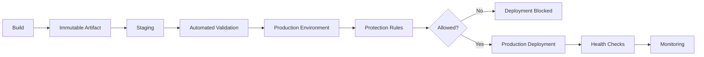
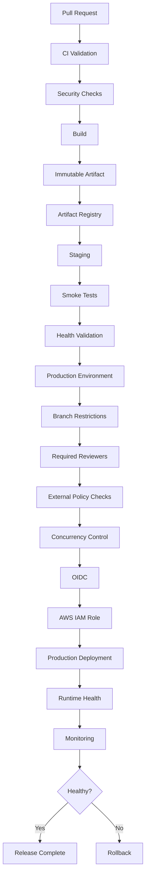

# 07- Deployment Protection Rules

## Overview

Deployment protection rules define the conditions that must be satisfied before a deployment can proceed into a protected environment.

In a production GitHub Actions pipeline, deployment protection sits between:

```text
Validated Release
      ↓
Protected Environment
      ↓
Protection Rules
      ↓
Deployment
```

A typical production pipeline is:

```text
Pull Request
    ↓
Lint
    ↓
Unit Tests
    ↓
Integration Tests
    ↓
Security Scan
    ↓
Matrix Testing
    ↓
Build
    ↓
Immutable Artifact
    ↓
Artifact Registry
    ↓
Staging
    ↓
Health Validation
    ↓
Production Protection Rules
    ↓
Approval / Policy Checks
    ↓
Production Deployment
    ↓
Monitoring
    ↓
Rollback if Required
```

Deployment protection rules are different from ordinary CI conditions.

A workflow condition such as:

```yaml
if: ${{ success() }}
```

controls whether a job or step executes based on workflow state.

A deployment protection rule controls whether a deployment to a protected environment is allowed to proceed.

The distinction becomes important when designing production-grade CD systems.

---

## What Deployment Protection Rules Are

Deployment protection rules are controls associated with a deployment environment that can prevent or delay deployment until required conditions are satisfied.

Examples include:

- Required reviewers
- Branch restrictions
- Environment-specific controls
- Custom deployment protection mechanisms
- External deployment checks
- Environment-specific secrets and configuration boundaries

The general model is:

```text
Workflow
   ↓
Deployment Job
   ↓
Target Environment
   ↓
Protection Rules
   ↓
Deployment Execution
```

Protection rules are therefore part of the **deployment authorization boundary**.

---

## Why Deployment Protection Exists

A production deployment can affect:

- Customer traffic
- Databases
- Internal services
- Security boundaries
- Infrastructure
- Financial systems
- Compliance-sensitive systems

Automated tests cannot necessarily determine whether the organization should release a change at a particular moment.

Protection rules allow the organization to combine automation with controlled authorization.

For example:

```text
Automated Validation
        +
Staging Validation
        +
Production Protection
        ↓
Production Deployment
```

This is generally stronger than relying exclusively on either manual processes or automated tests.

---

## Deployment Protection vs Approval

Deployment approval is one form of deployment protection.

The broader concept is:

```text
Deployment Protection
├── Required Reviewers
├── Branch Restrictions
├── Environment Controls
├── External Checks
└── Organization Policies
```

Approval answers:

> Has an authorized person approved this deployment?

Protection rules can answer additional questions:

> Is this deployment allowed from this source?

> Is this environment protected?

> Have required external checks passed?

> Should this deployment be allowed to continue?

---

## Environment as a Security Boundary

A production environment should be treated as a security boundary.

For example:

```text
Development
    │
    ▼
Staging
    │
    ▼
┌───────────────────────┐
│ Production Environment│
│                       │
│ Protection Rules      │
│ Secrets               │
│ Variables             │
│ Deployment History    │
└───────────┬───────────┘
            │
            ▼
       Production
```

The environment should not simply represent a string such as:

```yaml
environment: production
```

It should represent a controlled deployment boundary with appropriate access and policy.

---

## GitHub Environment Configuration

A deployment job can target an environment:

```yaml
jobs:
  deploy-production:
    runs-on: ubuntu-latest

    environment:
      name: production

    steps:
      - name: Deploy
        run: ./deploy.sh
```

The environment can then provide protection and environment-specific configuration.

For production, the environment may have:

- Required reviewers
- Deployment restrictions
- Production secrets
- Production variables
- Deployment history

---

## Deployment Protection Flow



The artifact is created before the production protection boundary.

---

## Required Reviewers

Required reviewers provide explicit human authorization.

A common flow is:

```text
Staging
   ↓
Automated Validation
   ↓
Production Environment
   ↓
Required Reviewer
   ↓
Production Deployment
```

The reviewer should approve a specific release rather than manually execute deployment commands.

---

## What Reviewers Should Verify

A production reviewer should have enough information to make an informed deployment decision.

Useful information includes:

| Information | Example |
|---|---|
| Service | `backend-api` |
| Release | `2.4.0` |
| Commit | `7f3a8e2` |
| Artifact | `backend@sha256:abc123` |
| Tests | Passed |
| Security scan | Passed |
| Staging | Healthy |
| Database changes | Expand-only |
| Rollback | Previous digest |
| Deployment strategy | Rolling |

The approval process should be based on evidence rather than manually inspecting source code line by line.

---

## Deployment Summary

GitHub Actions can create a deployment summary using `$GITHUB_STEP_SUMMARY`.

Example:

```yaml
- name: Publish deployment summary
  env:
    IMAGE: ${{ needs.build.outputs.image }}
  run: |
    {
      echo "## Production Deployment"
      echo
      echo "- Release: \`${GITHUB_REF_NAME}\`"
      echo "- Commit: \`${GITHUB_SHA}\`"
      echo "- Artifact: \`$IMAGE\`"
      echo "- Environment: production"
      echo "- Staging validation: PASS"
    } >> "$GITHUB_STEP_SUMMARY"
```

Never include:

- Passwords
- Access tokens
- Private keys
- Database credentials
- Sensitive secret values

---

## Branch Restrictions

Production deployments should generally originate only from approved branches or release references.

A typical flow is:

```text
Feature Branch
     ↓
Pull Request
     ↓
main
     ↓
Build
     ↓
Staging
     ↓
Production
```

The production environment can restrict which branches are permitted to deploy.

This reduces the chance that an arbitrary branch can directly reach production.

---

## Branch Restrictions vs Branch Protection

These controls solve different problems.

**Branch protection** controls changes to the Git branch.

Examples:

- Required pull request reviews
- Required status checks
- Restrictions on direct pushes

**Environment deployment restrictions** control which references are permitted to deploy to an environment.

The two controls complement each other.

```text
Branch Protection
        ↓
What can enter main?
        ↓
Environment Protection
        ↓
What can enter production?
```

---

## Deployment Protection and Tags

Production can also use release tags as part of the release model.

For example:

```text
Commit
  ↓
v2.4.0
  ↓
Build
  ↓
Staging
  ↓
Production
```

The tag provides release identity.

The artifact digest provides immutable deployment identity.

```text
Release:
v2.4.0

Artifact:
backend@sha256:abc123
```

---

## Build Once, Protect Once, Deploy Same Artifact

The protection boundary should not cause another build.

Prefer:

```text
Source
  ↓
Build
  ↓
Artifact A
  ↓
Staging
  ↓
Protection Rules
  ↓
Production
```

Avoid:

```text
Source
  ↓
Staging Build
  ↓
Approval
  ↓
Production Build
```

The second model can produce a different artifact after approval.

---

## Immutable Artifact Identity

For Docker deployments, use an immutable image identity.

Prefer:

```text
backend@sha256:abc123
```

over:

```text
backend:latest
```

A production protection rule should apply to a known artifact.

A useful release record is:

```text
Release: 2.4.0
Commit: 7f3a8e2
Digest: sha256:abc123
Environment: production
```

---

## Why Mutable Tags Are Dangerous

Suppose:

```text
backend:latest → Image A
```

The staging deployment uses Image A.

Later:

```text
backend:latest → Image B
```

If production resolves `latest` after approval, production could receive Image B.

The approved artifact and deployed artifact are now different.

Use:

```text
backend@sha256:abc123
```

to avoid this ambiguity.

---

## Environment Secrets

Production secrets should be scoped to the production environment.

For example:

```text
staging
 ├── DATABASE_URL
 ├── REDIS_URL
 └── API_KEY

production
 ├── DATABASE_URL
 ├── REDIS_URL
 └── API_KEY
```

The values should be independently controlled.

A staging workflow should not automatically receive production credentials.

---

## Protection Rules and Secret Availability

Production secrets should remain behind the deployment trust boundary.

The important principle is:

```text
Untrusted Code
      X
      │
      │ cannot access
      ▼
Production Secrets

Trusted Deployment
      │
      ▼
Production Environment
      ↓
Production Secrets
```

Protection rules do not make untrusted code safe.

Workflow design must still prevent untrusted pull request code from executing with privileged credentials.

---

## `pull_request` Security

Fork pull requests should be treated as potentially untrusted.

A safe architecture separates:

```text
Fork PR
   ↓
Restricted CI
   ↓
No Production Credentials
```

from:

```text
Trusted Branch
   ↓
Protected Deployment Workflow
   ↓
Production
```

---

## `pull_request_target` Security

`pull_request_target` requires particular caution because it runs using the base repository context.

A dangerous pattern is:

```text
Fork PR
   ↓
pull_request_target
   ↓
Checkout PR Code
   ↓
Execute PR Code
   ↓
Production Secret
```

This can cross a trust boundary.

Do not allow untrusted pull request code to execute with production privileges merely because the workflow itself is trusted.

---

## GITHUB_TOKEN Permissions

Protection rules should be complemented by least-privilege token permissions.

Example:

```yaml
permissions:
  contents: read
```

For AWS OIDC:

```yaml
permissions:
  contents: read
  id-token: write
```

Do not grant broad repository write permissions unless required.

---

## Job-Level Permissions

Different jobs should have different privileges when responsibilities differ.

For example:

```yaml
jobs:
  test:
    permissions:
      contents: read

  deploy:
    permissions:
      contents: read
      id-token: write
```

The deployment job becomes the privileged boundary.

This reduces the blast radius if an earlier job is compromised.

---

## AWS OIDC and Deployment Protection

A production deployment can combine GitHub environment protection with AWS OIDC.

```text
GitHub Workflow
      ↓
Production Environment
      ↓
Protection Rules
      ↓
OIDC Token
      ↓
AWS STS
      ↓
Production IAM Role
      ↓
ECS / EKS / EC2 / Lambda
```

This creates multiple authorization layers.

---

## IAM Trust Policy

The AWS IAM role should trust only the intended GitHub identity.

Conceptually:

```text
GitHub OIDC Provider
        ↓
IAM Trust Policy
        ↓
Production Deployment Role
```

The trust policy can restrict claims related to:

- Repository
- Organization
- Branch
- Environment

The production deployment role should also use least-privilege permissions.

---

## Environment-Specific AWS Roles

A stronger separation is:

```text
GitHub OIDC
    ├── Development IAM Role
    ├── Staging IAM Role
    └── Production IAM Role
```

This prevents a staging workflow from automatically receiving production permissions.

---

## Separate AWS Accounts

For larger systems:

```text
AWS Organization
    ├── Development Account
    ├── Staging Account
    └── Production Account
```

Environment protection then exists at multiple layers:

```text
GitHub Environment
        +
AWS Account
        +
IAM Role
```

This can substantially reduce blast radius.

The trade-off is increased infrastructure and operational complexity.

---

## External Protection Checks

Production systems may require checks beyond GitHub-native workflow state.

Examples include:

- Change-management systems
- Incident state
- Deployment windows
- Security checks
- External service health
- Infrastructure policy validation

A conceptual flow is:

```text
GitHub Actions
      ↓
External Policy Check
      ↓
Production Environment
      ↓
Deployment
```

External systems should be integrated carefully so that the deployment decision remains observable and auditable.

---

## Custom Deployment Protection

Where custom protection mechanisms are used, consider:

- Authentication
- Authorization
- Timeout behavior
- Retry behavior
- Failure handling
- Auditability
- Availability
- Idempotency

A protection service that is unavailable should have a clearly defined failure policy.

For production security controls, fail-open behavior can be dangerous.

---

## Fail-Open vs Fail-Closed

Consider an external approval or policy service:

```text
Deployment
    ↓
Policy Service
```

If the policy service is unavailable, two possible behaviors exist.

### Fail Open

```text
Policy unavailable
      ↓
Deployment continues
```

This improves availability but can bypass an intended protection boundary.

### Fail Closed

```text
Policy unavailable
      ↓
Deployment blocked
```

This preserves the protection boundary but can delay releases.

The correct choice depends on the purpose of the control and organizational requirements.

For security-sensitive production gates, fail-closed behavior is often considered where availability impact is acceptable.

---

## Protection Rules and Deployment Windows

Some organizations restrict production deployment to approved operational windows.

For example:

```text
Allowed Window
22:00–23:00 UTC
```

The pipeline can conceptually enforce:

```text
Deployment Requested
        ↓
Allowed Window?
    │          │
   Yes         No
    │           │
    ▼           ▼
Continue      Block
```

If an external scheduling or change-management system is used, its state should be treated as an explicit deployment dependency.

---

## Emergency Deployments

Production protection should account for emergency changes.

A possible model is:

```text
Normal Change
    ↓
Standard Protection

Emergency Change
    ↓
Emergency Authorization
    ↓
Audited Deployment
```

Emergency procedures should not simply bypass all security controls.

At minimum, preserve:

- Authorization
- Audit trail
- Artifact identity
- Deployment identity
- Post-incident review

---

## Approval vs Emergency Override

A production emergency may require a different authorization path.

However:

```text
Emergency ≠ No Controls
```

Instead:

```text
Emergency
   ↓
Alternative Control Path
   ↓
Explicit Authorization
   ↓
Auditing
```

This prevents emergency procedures from becoming an undocumented permanent bypass.

---

## Protection Rules and Concurrency

Protection rules determine whether a deployment is allowed.

Concurrency determines whether it can execute alongside another deployment.

They solve different problems.

```text
Protection
    ↓
Is deployment authorized?

Concurrency
    ↓
Can deployment execute now?
```

Use both where appropriate.

Example:

```yaml
concurrency:
  group: production-deployment
  cancel-in-progress: false
```

For production, cancelling an active deployment should generally be avoided unless the deployment mechanism explicitly supports safe cancellation.

---

## Deployment Race Conditions

Consider:

```text
Release A
   ↓
Approval
   ↓
Production

Release B
   ↓
Approval
   ↓
Production
```

Without concurrency control, both may execute simultaneously.

Possible outcomes include:

- Unexpected final version
- Conflicting infrastructure changes
- Incorrect deployment status
- Difficult rollback
- Partial rollout

Serialize production deployments when concurrent modification is unsafe.

---

## Stale Approvals

An approval can become stale if the release context changes.

Example:

```text
10:00
Release A → Staging → Approval Pending

10:15
Release B → Staging

10:20
Release A → Approved
```

The deployment system must make the artifact being approved explicit.

Do not allow an approval for Release A to silently apply to Release B.

---

## Deployment Identity

A protected deployment should be traceable to:

```text
Repository
Commit
Workflow Run
Release
Artifact Digest
Environment
Reviewer
Deployment Time
Result
```

Example:

```text
Service: backend-api
Release: 2.4.0
Commit: 7f3a8e2
Artifact: sha256:abc123
Environment: production
Reviewer: authorized-user
Status: deployed
```

This information is valuable during incidents.

---

## Deployment History

Deployment history helps answer:

- What changed?
- When did it change?
- Who authorized it?
- Which artifact was deployed?
- Which environment was affected?
- Did the deployment succeed?
- What was deployed previously?

This should be considered operational data, not merely administrative information.

---

## Deployment Protection and Rollback

Protection rules should not prevent recovery unnecessarily.

A rollback may follow:

```text
Production
    ↓
Current Release
    ↓
Health Failure
    ↓
Known-Good Artifact
    ↓
Rollback
```

Whether rollback requires approval depends on organizational policy.

Possible models include:

```text
Automatic rollback
```

or:

```text
Rollback → Approval → Execution
```

---

## Automatic Rollback

Automatic rollback can reduce recovery time.

Example:

```text
Deploy
  ↓
Health Check
  ↓
Failure
  ↓
Rollback
```

This requires:

- Reliable health checks
- Known-good artifact
- Deterministic rollback
- Compatible database state
- Clear failure thresholds

Automatic rollback should not be implemented merely because it is easy to automate.

---

## Database Changes and Protection

Database migrations can make rollback more complicated.

Example:

```text
Application A
     ↓
Schema A
     ↓
Deploy Application B
     ↓
Schema B
     ↓
Application B fails
```

Rolling back the application to A may not work if Schema B is incompatible with A.

Use compatibility-oriented migration strategies.

---

## Expand and Contract

A common approach is:

```text
Expand
  ↓
Deploy compatible code
  ↓
Backfill
  ↓
Switch behavior
  ↓
Contract
```

This supports coexistence between application versions.

For Django, migrations should be designed with rolling deployments in mind.

---

## Redis Protection Considerations

A release may change Redis structures.

During a rollout:

```text
Application A
Application B
     ↓
   Redis
```

Both versions may access the same keys.

Protection review should consider:

- Key compatibility
- Serialization
- TTL changes
- Cache invalidation
- Session compatibility

---

## Celery Protection Considerations

Celery workers may run different versions during deployment.

```text
Worker A
Worker B
   ↓
Queue
```

Task payloads should remain compatible.

A production deployment should not introduce a task format that older workers cannot process unless the queue transition has been deliberately managed.

---

## Kafka Protection Considerations

Kafka introduces another compatibility boundary:

```text
Producer A
Producer B
Consumer A
Consumer B
```

When approving a deployment that changes message schemas, review:

- Schema compatibility
- Consumer compatibility
- Producer compatibility
- Rollback behavior
- Consumer lag

---

## API Compatibility

Rolling deployments can temporarily expose multiple application versions.

```text
Load Balancer
     │
 ┌───┴───┐
 ▼       ▼
v2.3    v2.4
```

Therefore production protection should not focus only on deployment infrastructure.

Review potentially breaking API changes as part of the release.

For gRPC, protobuf compatibility should be preserved across the deployment transition.

---

## Protection and Deployment Strategies

Protection rules work with:

- Rolling deployments
- Blue-green deployments
- Canary deployments
- Zero-downtime deployments

The exact placement of the protection boundary depends on the strategy.

---

## Rolling Deployment

```text
Approval
   ↓
Deploy Instance 1
   ↓
Health Check
   ↓
Deploy Instance 2
   ↓
Health Check
   ↓
Continue
```

Protection occurs before the rollout begins.

Runtime health checks then control whether the rollout should continue.

---

## Blue-Green Deployment

```text
Production Traffic
       │
       ▼
     Router
    /      \
   ▼        ▼
 Blue      Green
 Old        New
```

A useful pattern is:

```text
Deploy Green
     ↓
Validate Green
     ↓
Production Protection
     ↓
Approve
     ↓
Switch Traffic
```

The old environment remains available for rollback.

---

## Canary Deployment

```text
Production
    │
    ├── 95% → Stable
    │
    └── 5%  → Canary
```

Protection can be applied before the canary starts.

Further rollout can then depend on:

- Error rate
- Latency
- Resource usage
- Business metrics
- Dependency health

---

## Zero-Downtime Deployments

Deployment protection does not itself guarantee zero downtime.

The deployment strategy must also provide:

- Multiple instances
- Readiness checks
- Graceful shutdown
- Connection draining
- Compatible migrations
- Capacity during rollout

Protection determines whether deployment may begin.

Deployment mechanics determine whether service remains available.

---

## Security of Protection Rules

Protection rules are part of the CI/CD security model.

Consider the trust chain:

```text
Source Repository
       ↓
Workflow
       ↓
GitHub Token
       ↓
Environment
       ↓
Protection Rules
       ↓
AWS OIDC
       ↓
IAM Role
       ↓
Production
```

A weakness at any layer can affect the production boundary.

---

## Third-Party Actions

Production deployment workflows should minimize third-party action risk.

A compromised action can potentially access:

- Environment variables
- Tokens
- Secrets
- Files
- Cloud credentials

Use:

- Trusted sources
- Version pinning
- SHA pinning where required
- Least-privilege permissions
- Controlled updates

Do not assume an action is safe simply because it is widely used.

---

## Supply Chain Security

Protection should apply to the artifact as well as the deployment process.

A mature flow is:

```text
Build
 ↓
Security Scan
 ↓
SBOM
 ↓
Provenance
 ↓
Attestation / Signature
 ↓
Artifact Registry
 ↓
Staging
 ↓
Protection
 ↓
Production
```

This helps establish that the approved artifact came from the expected build process.

---

## Self-Hosted Runner Protection

Self-hosted runners may have access to private infrastructure.

Example:

```text
GitHub Actions
       ↓
Self-Hosted Runner
       ↓
Private Network
       ├── ECS
       ├── Kubernetes
       ├── PostgreSQL
       └── Internal APIs
```

If the runner is compromised, the production environment may also be exposed.

Use:

- Ephemeral runners where practical
- Minimal permissions
- Runner groups
- Restricted labels
- Network segmentation
- Monitoring
- Regular image updates

---

## Persistent vs Ephemeral Runners

| Runner | Security | Startup | State Risk |
|---|---|---|---|
| Persistent | Lower isolation | Fast | Higher |
| Ephemeral | Stronger isolation | Slower | Lower |

Sensitive production deployment workloads often benefit from ephemeral execution.

---

## Protection Rule Failure Modes

A protection mechanism itself can fail.

Possible failure modes:

- Reviewer unavailable
- Policy service unavailable
- Incorrect branch restriction
- Wrong environment selected
- Stale deployment
- Concurrency queue
- Authentication failure
- Configuration error
- External check timeout

The pipeline should make these states observable.

---

## Troubleshooting Protection Problems

Use:

```text
Symptom
  ↓
Possible Causes
  ↓
Isolation Strategy
  ↓
Commands / Checks
  ↓
Root Cause
  ↓
Corrective Action
  ↓
Prevention
```

---

## Deployment Is Blocked

### Possible Causes

- Required reviewer has not approved
- Branch is not permitted
- Environment protection rule failed
- External check failed
- Workflow condition evaluated to false
- Deployment is waiting for concurrency

### Checks

Inspect the workflow:

```bash
gh run view RUN_ID
```

Inspect workflow logs:

```bash
gh run view RUN_ID --log
```

Then inspect the target environment configuration.

---

## Approval Completed but Job Is Still Waiting

Possible causes include:

- Another deployment owns the concurrency group
- A downstream dependency has not completed
- External protection is pending
- A separate environment rule remains unsatisfied

Do not assume that reviewer approval means every deployment prerequisite has been satisfied.

---

## Wrong Branch Can Deploy

### Possible Causes

- Environment restriction is too broad
- Workflow trigger is too permissive
- Deployment job does not validate source reference
- Release workflow accepts arbitrary input

### Prevention

Combine:

```text
Branch protection
+
Environment restrictions
+
Workflow conditions
+
Artifact identity
```

No single control should be responsible for the entire deployment boundary.

---

## Production Secrets Are Available Too Early

### Possible Causes

- Secrets exposed at workflow level
- Privileged job runs untrusted code
- `pull_request_target` checks out untrusted code
- Broad secret inheritance

### Prevention

Keep production secrets scoped to the protected deployment job and environment.

Use:

```text
Untrusted CI
    ↓
No production secrets

Trusted deployment
    ↓
Production environment
    ↓
Production secrets
```

---

## OIDC Authentication Failure

Check:

```text
permissions:
  id-token: write
```

Then verify:

```text
GitHub OIDC claims
      ↓
IAM trust policy
      ↓
Role ARN
      ↓
AWS account
      ↓
Deployment permissions
```

An IAM trust-policy mismatch commonly prevents role assumption.

---

## Production Deployment Uses Wrong Artifact

Compare:

```text
Approved Digest
Staging Digest
Production Digest
Registry Digest
```

All should represent the intended artifact.

If production differs, investigate:

- Mutable tags
- Rebuilds
- Incorrect workflow outputs
- Manual overrides
- Deployment scripts

---

## Deployment Protection and GitHub CLI

Useful commands include:

List workflows:

```bash
gh workflow list
```

List recent runs:

```bash
gh run list
```

Inspect a workflow run:

```bash
gh run view RUN_ID
```

Inspect logs:

```bash
gh run view RUN_ID --log
```

Rerun a workflow:

```bash
gh run rerun RUN_ID
```

The CLI is particularly useful when diagnosing whether the workflow reached the environment boundary and which job is waiting.

---

## Environment Management with GitHub CLI

Where supported by the GitHub CLI and repository permissions, environment and deployment information can be inspected through GitHub APIs or related CLI commands.

For operational workflows, the important principle is to inspect the actual deployment state rather than assuming the YAML configuration represents the current environment configuration.

---

## Production Protection Checklist

### Workflow

- [ ] Production job explicitly targets the production environment
- [ ] Production job has minimal GitHub permissions
- [ ] Untrusted pull request code cannot access production privileges
- [ ] Artifact identity is explicit
- [ ] Production does not rebuild the artifact

### Environment

- [ ] Production environment is protected
- [ ] Required reviewers are configured where required
- [ ] Deployment restrictions are defined
- [ ] Production secrets are environment-scoped
- [ ] Deployment history is available

### AWS

- [ ] OIDC is used instead of long-lived credentials where appropriate
- [ ] IAM trust policy is restricted
- [ ] Production role is least privilege
- [ ] Production account/resource boundaries are appropriate

### Deployment

- [ ] Concurrency prevents unsafe simultaneous deployments
- [ ] Health validation exists
- [ ] Rollback artifact is available
- [ ] Database compatibility is reviewed
- [ ] Monitoring is active

### Security

- [ ] Third-party actions are controlled
- [ ] Actions are appropriately pinned
- [ ] Artifact integrity is verified
- [ ] Secrets are not exposed in logs
- [ ] Self-hosted runners are hardened

---

## Common Mistakes

### Protecting the Environment but Not the Workflow

An environment rule cannot compensate for a workflow that executes untrusted code with privileged credentials.

Protection must be combined with workflow security.

---

### Giving Production Secrets to the Entire Workflow

Avoid:

```yaml
env:
  PROD_SECRET: ${{ secrets.PROD_SECRET }}
```

at broad workflow scope when only one deployment step needs it.

Prefer the smallest practical scope.

---

### Using Mutable Artifact Tags

Do not approve:

```text
backend:latest
```

and assume it remains unchanged.

Use immutable artifact identity.

---

### Rebuilding After Protection

Do not:

```text
Staging Artifact A
    ↓
Approval
    ↓
Production Build B
```

The artifact after approval should remain the approved artifact.

---

### Treating Approval as a Security Boundary for Untrusted Code

Approval does not sanitize:

- Pull request code
- Branch names
- Commit messages
- Issue content
- Workflow inputs
- Third-party action behavior

Untrusted data must still be handled safely.

---

### Allowing Concurrent Production Deployments

Approval does not prevent two approved workflows from running simultaneously.

Use concurrency controls.

---

### Making Emergency Deployments Unaudited

Emergency procedures should have an explicit authorization path and preserve audit information.

---

### Ignoring Environment Drift

Protection rules do not guarantee infrastructure parity.

Use Infrastructure as Code and configuration management to control environment differences.

---

## Production Deployment Architecture



The production boundary is composed of multiple controls rather than a single approval button.

---

## Layered Protection Model

A strong deployment system uses defense in depth:

```text
Layer 1: Branch Protection
        ↓
Layer 2: CI Validation
        ↓
Layer 3: Security Scanning
        ↓
Layer 4: Immutable Artifact
        ↓
Layer 5: Staging Validation
        ↓
Layer 6: Environment Protection
        ↓
Layer 7: Approval / External Checks
        ↓
Layer 8: OIDC + IAM
        ↓
Layer 9: Deployment Concurrency
        ↓
Layer 10: Runtime Health
```

Each layer addresses a different failure or attack mode.

---

## High Availability Considerations

Deployment protection should not unnecessarily become a single point of failure.

Consider:

- Availability of external approval systems
- Reviewer availability
- Deployment runner availability
- Artifact registry availability
- AWS authentication availability
- Health-check reliability

For critical systems, define operational procedures for protection-system outages.

A deployment gate that is unavailable may delay releases, while a fail-open gate may weaken security. The trade-off should be explicit.

---

## Scalability Considerations

As the number of services grows:

```text
10 services
    ↓
100 services
    ↓
1000 services
```

manually maintaining protection logic in every repository becomes difficult.

Use:

- Reusable workflows
- Standard environments
- Organization-level policies
- Centralized deployment tooling
- Standard IAM patterns
- Action governance
- Consistent artifact metadata

The goal is standardized controls without creating a single deployment workflow that becomes a bottleneck for every team.

---

## Cost Considerations

Protection rules generally have little direct compute cost, but they can increase operational latency.

Examples:

```text
Required Approval
    ↓
Release waits
```

Long approval delays can:

- Keep runners occupied
- Increase operational coordination
- Create stale releases
- Delay incident fixes

Use protection where the risk justifies the operational cost.

Avoid unnecessary approval gates for low-risk development workflows.

---

## Reliability Considerations

A production protection system should be:

- Deterministic
- Observable
- Auditable
- Idempotent
- Secure
- Recoverable

Protection failures should produce clear diagnostic information.

Avoid workflows where an operator cannot determine why a deployment is blocked.

---

## Disaster Recovery

Protection rules should be considered during disaster recovery planning.

A DR deployment may need:

```text
Known-Good Artifact
      ↓
DR Environment
      ↓
Protection / Emergency Authorization
      ↓
Deployment
      ↓
Health Validation
```

Ensure that emergency responders know:

- Which artifact to deploy
- Which IAM role is required
- Which environment is protected
- How approval works
- How to perform rollback
- How to audit the operation

---

## Senior-Level Design Principles

### Protection Must Be Layered

Do not rely on one approval rule.

Use:

```text
Branch
+
CI
+
Artifact
+
Environment
+
IAM
+
Runtime
```

### Protect the Deployment Boundary

Production credentials should only become available inside the trusted deployment path.

### Approve Immutable Releases

The object being approved should be identifiable and immutable.

### Keep Approval Separate from Execution

A human authorizes the deployment; automation performs it.

### Preserve Auditability

Every production change should be traceable to its source, artifact, workflow, authorization, and deployment result.

### Design for Failure

Protection services, reviewers, runners, registries, and AWS authentication can all fail.

### Do Not Bypass Security for Convenience

Emergency procedures should have explicit, audited alternatives rather than undocumented bypasses.

---

## Interview Questions

### What is a deployment protection rule?

It is a control that prevents or delays deployment into a protected environment until defined authorization or policy conditions are satisfied.

### How is deployment protection different from an `if` condition?

An `if` condition controls workflow execution based on workflow state. Environment protection controls whether deployment into a protected environment is authorized.

### Why use GitHub Environments?

They provide a deployment boundary for environment-specific configuration, secrets, protection rules, reviewers, and deployment history.

### Why should approval happen after staging?

Staging validates the actual release before human authorization is requested for production.

### Should the production artifact be rebuilt after approval?

No. The approved immutable artifact should normally be the artifact deployed to production.

### How do you prevent a mutable Docker tag from bypassing approval?

Pass and deploy an immutable digest such as:

```text
backend@sha256:abc123
```

### How do approval and concurrency differ?

Approval determines whether a deployment is authorized. Concurrency determines whether it can execute simultaneously with another deployment.

### How do you secure AWS deployment credentials?

Use GitHub OIDC with AWS STS and a least-privilege IAM role rather than long-lived access keys.

### Can deployment protection make `pull_request_target` safe?

No. Privileged workflows must still prevent execution of untrusted pull request code.

### How would you design emergency production deployment?

Use an explicit emergency authorization path with least privilege, immutable artifacts, auditing, monitoring, and a documented recovery procedure.

### What should happen if a protection service is unavailable?

The failure policy should be explicit. Security-sensitive controls commonly require fail-closed behavior when the availability trade-off is acceptable.

### How do you prevent stale approvals?

Associate approval with an explicit release and immutable artifact identity and prevent a different artifact from being substituted after approval.

### How do you protect a production deployment from a compromised third-party action?

Use least-privilege permissions, restricted secrets, controlled action sources, version or SHA pinning, isolated runners, and separate privileged deployment jobs.

---

## Key Takeaways

- Deployment protection rules form a layered authorization boundary around production environments; they should complement CI validation, artifact integrity, IAM, and runtime health checks.
- GitHub Environments can provide production-specific protection through reviewers, deployment restrictions, secrets, variables, and deployment history.
- Protection must be applied to an immutable release identity, not a mutable Docker tag, and approval should authorize the same artifact that was validated in staging.
- Strong production security requires separating untrusted workflow execution from privileged deployment jobs and combining environment protection with least-privilege permissions and AWS OIDC.
- Production protection must account for concurrency, stale approvals, emergency recovery, database compatibility, rollback, observability, and failures in the protection mechanism itself.