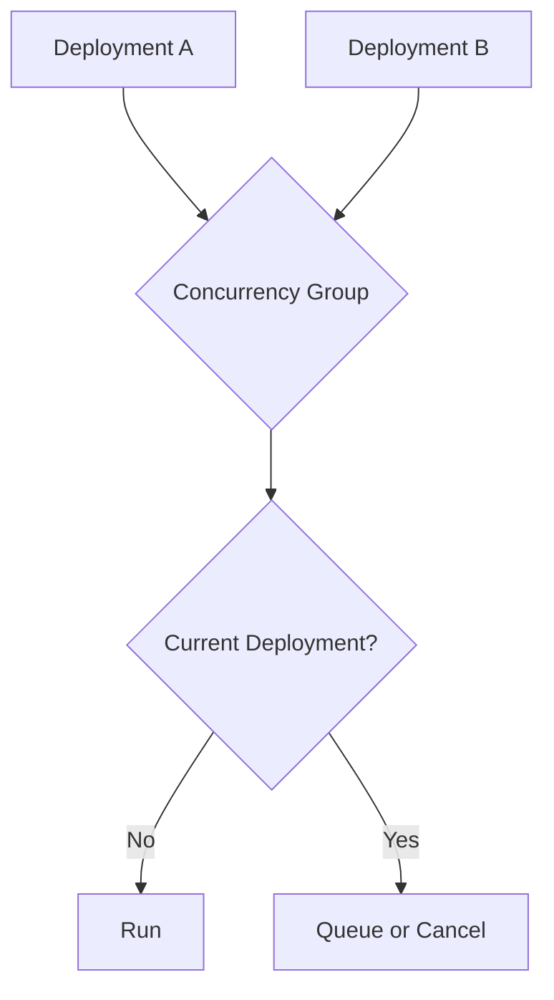

# 08- Deployment Concurrency

## Overview

Deployment concurrency controls how multiple CI/CD workflow runs interact when they attempt to deploy the same environment or modify the same deployment target.

In production GitHub Actions pipelines, concurrency is primarily used to prevent:

- Duplicate deployments
- Deployment race conditions
- Conflicting infrastructure changes
- Multiple releases modifying the same environment simultaneously
- Stale releases overwriting newer releases
- Unsafe cancellation of active production deployments

A typical production flow is:

```text
Pull Request
    ↓
Lint
    ↓
Unit Tests
    ↓
Integration Tests
    ↓
Security Scan
    ↓
Matrix Tests
    ↓
Build
    ↓
Immutable Artifact
    ↓
Staging
    ↓
Approval
    ↓
Production Concurrency Control
    ↓
Production Deployment
    ↓
Health Validation
    ↓
Monitoring
    ↓
Rollback if Required
```

Concurrency is different from deployment protection.

```text
Protection
    ↓
"Is this deployment authorized?"

Concurrency
    ↓
"Can this deployment execute at the same time as another deployment?"
```

A production-grade pipeline commonly needs both.

---

## Why Deployment Concurrency Matters

Without concurrency control, two workflow runs can deploy simultaneously:

```text
Release A ───────────────→ Production
Release B ───────────────→ Production
```

The result may depend on timing rather than release intent.

For example:

```text
10:00  Release A starts
10:02  Release B starts
10:04  Release B completes
10:06  Release A completes
```

Production may now contain Release A even though Release B was the newer release.

Concurrency prevents this class of race condition.

---

## GitHub Actions Concurrency

GitHub Actions provides the `concurrency` keyword for controlling workflow or job execution.

A basic example is:

```yaml
concurrency:
  group: production-deployment
  cancel-in-progress: false
```

The `group` identifies executions that must be coordinated.

The `cancel-in-progress` setting determines whether an already-running execution should be cancelled when another execution enters the same concurrency group.

---

## Basic Concurrency Model



The concurrency group is the key coordination mechanism.

---

## Concurrency Groups

A concurrency group should represent the resource that cannot safely be modified concurrently.

For example:

```yaml
concurrency:
  group: production-deployment
```

This means production deployments share the same concurrency boundary.

For multiple environments:

```yaml
concurrency:
  group: deploy-${{ inputs.environment }}
```

This can produce:

```text
deploy-development
deploy-staging
deploy-production
```

Each environment gets its own concurrency domain.

---

## Environment-Specific Concurrency

A common production design is:

```yaml
concurrency:
  group: deployment-${{ github.repository }}-${{ inputs.environment }}
  cancel-in-progress: false
```

Including the repository prevents unrelated repositories from sharing a concurrency group.

Including the environment allows staging and production deployments to proceed independently.

Conceptually:

```text
Repository A
 ├── staging
 └── production

Repository B
 ├── staging
 └── production
```

Each repository/environment combination has its own deployment boundary.

---

## Workflow-Level Concurrency

Concurrency can be defined for an entire workflow.

```yaml
name: CI/CD

on:
  push:
    branches:
      - main

concurrency:
  group: ci-cd-${{ github.ref }}
  cancel-in-progress: true

jobs:
  test:
    runs-on: ubuntu-latest
    steps:
      - uses: actions/checkout@v4

      - name: Run tests
        run: pytest
```

This is useful when the entire workflow should be serialized or superseded.

---

## Job-Level Concurrency

Concurrency can also be applied to an individual job.

```yaml
jobs:
  deploy-production:
    runs-on: ubuntu-latest

    concurrency:
      group: production-deployment
      cancel-in-progress: false

    steps:
      - name: Deploy
        run: ./deploy.sh
```

This is usually more appropriate when only production deployment needs serialization.

CI jobs such as linting and unit tests can continue independently.

---

## Workflow-Level vs Job-Level Concurrency

| Requirement | Recommended Scope |
|---|---|
| Cancel obsolete PR CI | Workflow |
| Serialize complete release workflows | Workflow |
| Prevent simultaneous production deployments | Deployment job |
| Serialize infrastructure changes | Infrastructure job |
| Protect a shared database migration | Migration/deployment job |
| Prevent duplicate production rollouts | Deployment job |

Do not serialize the entire workflow when only one stage requires serialization.

---

## `cancel-in-progress`

The `cancel-in-progress` setting determines whether an existing execution can be cancelled when another run enters the same concurrency group.

Example:

```yaml
concurrency:
  group: ci-${{ github.ref }}
  cancel-in-progress: true
```

This is useful for CI where a newer commit makes an older run obsolete.

For production deployment:

```yaml
concurrency:
  group: production-deployment
  cancel-in-progress: false
```

is generally safer when an active deployment should not be interrupted arbitrarily.

---

## CI and CD Need Different Policies

A useful distinction is:

```text
CI
├── Old PR run may become obsolete
└── cancel-in-progress: true

CD
├── Active production deployment may need to finish safely
└── cancel-in-progress: false
```

The correct setting depends on whether cancellation is safe for the operation.

---

## Pull Request Concurrency

Pull request CI often benefits from cancelling stale runs.

Example:

```yaml
concurrency:
  group: pr-${{ github.workflow }}-${{ github.event.pull_request.number }}
  cancel-in-progress: true
```

Suppose a developer pushes:

```text
Commit A
Commit B
Commit C
```

while Commit A is still testing.

The pipeline can cancel obsolete work and prioritize Commit C.

This reduces:

- Runner consumption
- Queue time
- CI cost
- Feedback latency

---

## Production Deployment Concurrency

Production deployments generally require a different policy.

```yaml
concurrency:
  group: production-deployment
  cancel-in-progress: false
```

Suppose:

```text
Release A → Deploying
Release B → Waiting
```

Release B should not arbitrarily interrupt Release A.

The active deployment should complete safely before the next deployment proceeds, unless the deployment system explicitly supports safe interruption.

---

## Deployment Race Conditions

Consider:

```text
Release A
    │
    ├── Deploy instance 1
    ├── Deploy instance 2
    └── Deploy instance 3

Release B
    │
    ├── Deploy instance 1
    ├── Deploy instance 2
    └── Deploy instance 3
```

Without concurrency, these operations can overlap.

Potential problems include:

- Mixed application versions
- Conflicting migrations
- Infrastructure drift
- Incorrect load-balancer state
- Unexpected final release
- Rollback ambiguity

Concurrency creates an explicit serialization boundary.

---

## Concurrency and Deployment Protection

These mechanisms solve different problems.

```text
                    Production
                        │
             ┌──────────┴──────────┐
             │                     │
       Protection             Concurrency
             │                     │
       Authorization          Serialization
             │                     │
             └──────────┬──────────┘
                        ↓
                   Deployment
```

Protection may require an approval.

Concurrency prevents another deployment from executing simultaneously.

A deployment may therefore be:

```text
Authorized
but waiting for concurrency
```

or:

```text
Concurrency available
but waiting for approval
```

---

## Concurrency and Environments

A production environment can combine:

- Required reviewers
- Deployment restrictions
- Environment secrets
- Concurrency
- Deployment history

Example:

```yaml
jobs:
  deploy:
    environment:
      name: production

    concurrency:
      group: production-deployment
      cancel-in-progress: false

    runs-on: ubuntu-latest

    steps:
      - name: Deploy
        run: ./deploy.sh
```

The environment controls the authorization boundary while concurrency controls execution ordering.

---

## Concurrency and Immutable Artifacts

Concurrency becomes more reliable when deployments use immutable artifacts.

Prefer:

```text
Release A
  ↓
Image sha256:AAA
  ↓
Production

Release B
  ↓
Image sha256:BBB
  ↓
Wait
```

over:

```text
Release A → backend:latest
Release B → backend:latest
```

Mutable tags make it harder to determine exactly which artifact a queued deployment will execute.

---

## Build Once, Deploy Many

A production deployment should generally use:

```text
Source
  ↓
Build
  ↓
Immutable Artifact
  ↓
Staging
  ↓
Approval
  ↓
Production Concurrency
  ↓
Production
```

Do not rebuild after waiting for concurrency.

The artifact selected before the deployment boundary should remain the artifact being deployed.

---

## Stale Release Problem

Consider:

```text
Release A → Waiting
Release B → Waiting
```

If both are queued, deployment order matters.

Suppose:

```text
A = commit 100
B = commit 110
```

Deploying both may be unnecessary.

A more advanced release architecture can determine whether an older queued release is still relevant.

However, concurrency itself does not automatically implement semantic release supersession.

Do not assume:

```yaml
cancel-in-progress: false
```

means only the newest release will deploy.

It means an active execution is not automatically cancelled.

---

## Concurrency Does Not Guarantee Latest-Only Deployment

This distinction is important.

With:

```yaml
concurrency:
  group: production
  cancel-in-progress: false
```

the system may effectively behave like:

```text
A → running
B → waiting
C → waiting
```

The exact ordering and queue behavior should not be treated as an application-level release policy.

If the requirement is:

> Only the newest release should deploy.

that must be designed explicitly.

---

## Latest-Release Deployment Policy

A latest-release policy may require:

```text
A → running
B → superseded
C → latest
```

This is different from merely serializing deployments.

Possible strategies include:

- Explicit release validation
- Checking whether a newer approved release exists
- Cancelling obsolete workflows where safe
- Maintaining deployment state externally
- Using a release orchestrator

Concurrency provides the locking mechanism, not the entire release policy.

---

## Idempotent Deployments

Concurrency should not be the only protection against repeated execution.

Deployment operations should be idempotent where practical.

For example:

```bash
aws ecs update-service \
  --cluster production \
  --service backend-api \
  --force-new-deployment
```

The surrounding deployment process should tolerate safe retries.

Idempotency matters because workflows can be:

- Retried
- Rerun
- Interrupted
- Recovered after infrastructure failures

---

## Why Idempotency Matters

A deployment can fail after the external system has accepted the request.

Example:

```text
GitHub Actions
     ↓
AWS API
     ↓
Deployment accepted
     X
Network failure
```

GitHub Actions may report failure even though the deployment started.

If the deployment is retried without idempotent behavior, the system can create confusing state.

Concurrency reduces simultaneous execution.

Idempotency makes individual operations safe to repeat.

Both are required for robust deployment systems.

---

## Database Migration Concurrency

Database migrations are particularly sensitive to concurrent execution.

Avoid:

```text
Deployment A
   ↓
Migration

Deployment B
   ↓
Migration
```

Use a dedicated migration concurrency boundary:

```yaml
jobs:
  migrate:
    concurrency:
      group: production-database-migration
      cancel-in-progress: false
```

The application deployment may have a separate group if appropriate.

---

## Migration Ordering

A common production sequence is:

```text
Expand Database Schema
       ↓
Deploy Compatible Application
       ↓
Backfill
       ↓
Switch Application Behavior
       ↓
Contract Schema
```

Concurrency prevents two independent release workflows from simultaneously changing the migration state.

---

## Django Deployment Example

A Django deployment may involve:

```text
Build Image
   ↓
Run Tests
   ↓
Push ECR Image
   ↓
Staging
   ↓
Migration Validation
   ↓
Production Approval
   ↓
Production Concurrency
   ↓
python manage.py migrate
   ↓
Application Deployment
```

Do not assume application-level deployment concurrency automatically protects database operations if migrations are executed through a separate workflow.

---

## FastAPI Deployment Example

A FastAPI service may use:

```text
Build
  ↓
pytest
  ↓
Docker Image
  ↓
ECR
  ↓
Staging
  ↓
Production Concurrency
  ↓
ECS / Kubernetes
```

The deployment job can serialize updates to the service.

---

## Redis and Deployment Concurrency

Redis changes can also be affected by concurrent releases.

Potential conflicts include:

- Cache key format changes
- Session format changes
- Lock ownership
- Distributed locks
- Queue coordination

If a deployment changes Redis state, ensure that the release sequence is compatible with the running application versions.

---

## Celery and Deployment Concurrency

Celery deployments require attention to worker and task compatibility.

Consider:

```text
Release A
  ├── API
  └── Worker

Release B
  ├── API
  └── Worker
```

Deploying workers and APIs concurrently without compatibility planning can produce:

- Unknown task errors
- Serialization failures
- Duplicate task execution
- Queue incompatibility

Concurrency can serialize releases, but application-level backward compatibility is still required.

---

## Kafka and Deployment Concurrency

Kafka deployments may involve:

```text
Producer A
Producer B
Consumer A
Consumer B
```

Concurrent releases can create schema compatibility problems.

Review:

- Producer compatibility
- Consumer compatibility
- Schema evolution
- Consumer lag
- Deployment ordering

Concurrency should be combined with backward-compatible message contracts.

---

## Microservice Deployment Concurrency

For microservices:

```text
Service A
Service B
Service C
```

not every service necessarily needs to share the same concurrency group.

A better model can be:

```text
service-a-production
service-b-production
service-c-production
```

This allows independent services to deploy concurrently.

However, services sharing a common infrastructure resource may need a shared group.

---

## Shared Infrastructure Concurrency

Consider two services that modify the same infrastructure:

```text
Service A
    ↓
Terraform
    ↓
Shared VPC

Service B
    ↓
Terraform
    ↓
Shared VPC
```

Independent application deployment groups do not protect the shared Terraform state.

Infrastructure changes should have their own concurrency boundary.

```yaml
concurrency:
  group: terraform-production
  cancel-in-progress: false
```

---

## Terraform State Concurrency

Terraform already has state-locking mechanisms, but CI/CD concurrency still matters.

The two mechanisms solve different problems:

```text
GitHub Actions Concurrency
        ↓
Prevents competing workflow execution

Terraform State Lock
        ↓
Protects Terraform state operations
```

Use both where appropriate.

---

## Kubernetes Deployment Concurrency

Kubernetes itself manages reconciliation, but CI/CD pipelines can still race.

For example:

```text
Workflow A → kubectl apply
Workflow B → kubectl apply
```

The later operation may overwrite desired state from the earlier release.

Use concurrency around production deployment workflows.

For GitOps systems, concurrency requirements may instead apply to repository changes or promotion operations rather than direct `kubectl` execution.

---

## AWS ECS Deployment Concurrency

For ECS:

```text
GitHub Actions
     ↓
ECR Image
     ↓
ECS Service
```

Concurrent workflow runs can modify the same service.

Serialize production deployment jobs:

```yaml
concurrency:
  group: ecs-production-backend
  cancel-in-progress: false
```

The exact concurrency group should represent the ECS service or deployment unit being protected.

---

## AWS Lambda Deployment Concurrency

Lambda deployments can also race when multiple workflow runs update the same function.

For example:

```text
Release A → Lambda version
Release B → Lambda version
```

Serialize deployment operations for the same function where the deployment process is not designed for concurrent releases.

Aliases and versioned deployments can provide additional release control.

---

## Blue-Green Deployment

Concurrency is particularly important for blue-green deployments.

```text
             Router
             /    \
            /      \
         Blue      Green
          ↑          ↑
       Current      New
```

Without serialization, two workflows might both attempt to change traffic routing.

A safer sequence is:

```text
Deploy Green
    ↓
Validate
    ↓
Approval
    ↓
Concurrency Lock
    ↓
Switch Traffic
```

---

## Canary Deployment

Canary deployments may take longer than standard rolling deployments.

Example:

```text
Deploy Canary
     ↓
5% Traffic
     ↓
Observe
     ↓
25%
     ↓
Observe
     ↓
50%
     ↓
100%
```

Another deployment should not start halfway through this progression unless the rollout system explicitly supports concurrent releases.

---

## Long-Running Deployments

Long-running deployments increase the importance of concurrency design.

Examples:

- Large Kubernetes rollouts
- Database migrations
- Blue-green traffic shifts
- Canary analysis
- Infrastructure provisioning

Avoid arbitrary cancellation.

Define:

- Maximum deployment duration
- Timeout behavior
- Recovery procedure
- Rollback behavior
- Ownership

---

## Concurrency and Rollback

Rollback is itself a deployment.

Therefore it should be included in the same concurrency model.

For example:

```text
Production Group
       │
 ┌─────┼─────┐
 │     │     │
Deploy Rollback Hotfix
```

If a deployment is active, a rollback should not blindly execute concurrently.

The rollback mechanism should coordinate with the active deployment.

---

## Safe Rollback Sequence

```text
Current Deployment
       ↓
Health Failure
       ↓
Stop Further Rollout
       ↓
Acquire Deployment Boundary
       ↓
Deploy Known-Good Artifact
       ↓
Validate
       ↓
Monitor
```

This avoids a rollback racing against the deployment that caused the incident.

---

## Deployment Concurrency and Monitoring

Concurrency decisions should be observable.

Track:

- Deployment queue duration
- Deployment execution duration
- Number of queued deployments
- Cancelled deployments
- Failed deployments
- Rollbacks
- Deployment frequency
- Time between approval and deployment

A growing queue may indicate a deployment-system bottleneck.

---

## Deployment Queue Time

Consider:

```text
Approval
   ↓
Queue: 30 minutes
   ↓
Deployment
```

Long queue times can create stale releases.

Monitor:

```text
Queue Duration
```

rather than measuring only:

```text
Deployment Duration
```

---

## Concurrency and Cost

Concurrency can reduce cost by preventing unnecessary work.

For PR CI:

```yaml
concurrency:
  group: pr-${{ github.event.pull_request.number }}
  cancel-in-progress: true
```

If a developer pushes ten commits quickly, obsolete runs can be cancelled.

This reduces:

- Runner minutes
- Compute consumption
- Artifact generation
- Cache activity
- Feedback noise

For production, however, aggressive cancellation can create operational risk.

---

## Concurrency and Performance

Concurrency improves system-level reliability but can reduce deployment throughput.

For example:

```text
Deployment A → 20 min
Deployment B → waits 20 min
Deployment C → waits
```

If production deployments are serialized, deployment duration directly affects release throughput.

Optimize the deployment itself rather than simply allowing unsafe parallel execution.

---

## Concurrency and High Availability

Deployment concurrency is compatible with high availability.

For example:

```text
Production
 ├── Instance A
 ├── Instance B
 ├── Instance C
 └── Instance D
```

A rolling deployment can update instances gradually while only one deployment workflow operates on the service.

Concurrency controls workflow-level coordination.

Rolling deployment controls runtime availability.

---

## Concurrency and Disaster Recovery

A DR environment may need an independent concurrency group.

For example:

```text
production-deployment
dr-deployment
```

Do not accidentally serialize unrelated environments unless they share a real deployment resource.

During a disaster, the deployment system should still know:

- Which artifact is approved
- Which environment is active
- Which deployment owns the resource
- Which release should be restored
- How rollback is coordinated

---

## Concurrency Group Design

A good concurrency group identifies the resource that must be serialized.

Examples:

```yaml
group: production
```

Simple, but potentially too broad.

```yaml
group: production-backend-api
```

More precise.

```yaml
group: ${{ github.repository }}-${{ inputs.environment }}-${{ inputs.service }}
```

Useful for multi-service repositories.

---

## Avoiding Overly Broad Groups

This is potentially inefficient:

```yaml
concurrency:
  group: production
```

if a repository contains unrelated services:

```text
API
Worker
Scheduler
Admin
```

A deployment to the API would block an independent worker deployment.

Prefer a resource-specific group where independent deployments are genuinely safe.

---

## Avoiding Overly Narrow Groups

The opposite problem also exists.

Suppose:

```text
Service A → Shared Database
Service B → Shared Database
```

If the groups are:

```text
service-a
service-b
```

both migrations may execute concurrently.

The group should represent the shared resource:

```text
shared-database-production
```

Concurrency design must follow resource dependencies, not merely repository structure.

---

## Concurrency as a Lock

A useful mental model is:

```text
Concurrency Group
       ↓
Logical Lock
       ↓
Protected Resource
```

Examples:

```text
production-backend
terraform-production
database-production
cluster-production
```

The group should correspond to something that cannot safely be changed concurrently.

---

## Concurrency and Fan-Out

Fan-out jobs should usually run concurrently.

Example:

```text
Build
  ↓
 ┌────────┬────────┬────────┐
 ↓        ↓        ↓
Python 3.10  Python 3.11  Python 3.12
```

Do not unnecessarily serialize independent test jobs.

Concurrency is not a requirement to make all workflow execution sequential.

---

## Concurrency and Fan-In

After parallel validation:

```text
Python 3.10 ─┐
Python 3.11 ─┼→ Validation Complete → Build
Python 3.12 ─┘
```

The deployment job can then acquire the production concurrency boundary.

This creates a clean architecture:

```text
Parallel CI
    ↓
Fan-In
    ↓
Build
    ↓
Promotion
    ↓
Serialized Production Deployment
```

---

## Matrix Testing and Concurrency

Matrix jobs should generally remain parallel.

Example:

```yaml
strategy:
  matrix:
    python-version:
      - "3.10"
      - "3.11"
      - "3.12"
```

Use concurrency at the deployment boundary rather than unnecessarily serializing matrix tests.

---

## Reusable Workflows and Concurrency

Reusable deployment workflows can define standardized concurrency behavior.

Example:

```yaml
on:
  workflow_call:
    inputs:
      environment:
        required: true
        type: string
      service:
        required: true
        type: string

jobs:
  deploy:
    runs-on: ubuntu-latest

    concurrency:
      group: ${{ github.repository }}-${{ inputs.environment }}-${{ inputs.service }}
      cancel-in-progress: false

    steps:
      - name: Deploy
        run: ./deploy.sh
```

This allows repositories to share a consistent deployment policy.

---

## Reusable Workflow vs Composite Action

Concurrency is primarily a workflow/job orchestration concern.

A reusable workflow can orchestrate:

```text
Jobs
 ↓
Dependencies
 ↓
Environments
 ↓
Concurrency
 ↓
Deployment
```

A composite action packages steps within a job.

Therefore deployment concurrency generally belongs in the workflow architecture rather than inside a composite action.

---

## Dynamic Concurrency Groups

For multi-service deployment workflows:

```yaml
concurrency:
  group: ${{ github.repository }}-${{ inputs.environment }}-${{ inputs.service }}
  cancel-in-progress: false
```

This can dynamically create groups such as:

```text
org/backend-production-api
org/backend-production-worker
org/backend-staging-api
```

This supports independent deployment where resource boundaries permit it.

---

## Concurrency and Workflow Inputs

Manual deployments may use:

```yaml
on:
  workflow_dispatch:
    inputs:
      environment:
        required: true
        type: choice
        options:
          - staging
          - production
```

The concurrency group can incorporate the selected environment:

```yaml
concurrency:
  group: deploy-${{ inputs.environment }}
  cancel-in-progress: false
```

Validate inputs carefully before using them to determine deployment behavior.

---

## Security Considerations

Concurrency configuration itself is not a complete security mechanism.

Do not rely on:

```yaml
concurrency:
  group: production
```

to protect production credentials.

Security still requires:

- Least-privilege permissions
- Environment protection
- Secret isolation
- OIDC
- IAM policies
- Trusted workflow sources
- Safe handling of untrusted input

Concurrency controls execution overlap, not authorization.

---

## Untrusted Input and Concurrency Groups

If concurrency groups are derived from user-controlled input, consider the possible impact.

For example:

```yaml
group: deploy-${{ github.event.inputs.environment }}
```

Validate environment inputs against an allowlist.

Prefer:

```yaml
environment:
  type: choice
  options:
    - staging
    - production
```

rather than accepting arbitrary strings for sensitive deployment controls.

---

## `pull_request` and Concurrency

PR workflows commonly use:

```yaml
concurrency:
  group: pr-${{ github.event.pull_request.number }}
  cancel-in-progress: true
```

This isolates each pull request.

A push to one PR does not cancel CI for another PR.

---

## `pull_request_target` and Concurrency

Concurrency does not make `pull_request_target` safe.

The trust boundary remains:

```text
Base Repository Context
        ↓
Privileged Workflow
        ↓
Potentially Untrusted PR Data
```

Avoid executing untrusted PR code with privileged permissions.

---

## Third-Party Actions and Concurrency

A deployment workflow may contain third-party actions.

Concurrency should not be used as a substitute for action security.

Use:

- Trusted action sources
- Version pinning
- SHA pinning where appropriate
- Minimal permissions
- Limited secrets
- Isolated deployment jobs

---

## Self-Hosted Runners

Self-hosted runners may retain state between jobs.

If production deployments use self-hosted runners:

```text
Deployment
   ↓
Runner
   ↓
Private Network
   ↓
Production
```

concurrency does not provide runner isolation.

Use appropriate:

- Runner groups
- Labels
- Ephemeral runners
- Network controls
- Cleanup
- Monitoring

---

## Failure Domain: Workflow Queued

### Symptom

A deployment is waiting.

### Possible Causes

- Another run owns the concurrency group
- Deployment approval is pending
- External protection is pending
- Runner capacity is unavailable

### Isolation Strategy

Inspect the workflow run:

```bash
gh run view RUN_ID
```

Inspect related runs:

```bash
gh run list
```

Determine whether the run is blocked by concurrency or another workflow condition.

### Prevention

Expose deployment queue time and deployment state through operational dashboards or summaries.

---

## Failure Domain: Multiple Deployments Run

### Symptom

Two deployments appear to modify production simultaneously.

### Possible Causes

- Different concurrency groups
- Different workflow definitions
- Direct manual deployment outside GitHub Actions
- Deployment jobs use different resource names
- One deployment uses an external deployment mechanism

### Isolation Strategy

Compare:

```text
Repository
Workflow
Job
Environment
Concurrency Group
Artifact
Deployment Target
```

### Corrective Action

Define concurrency around the actual shared resource.

---

## Failure Domain: Old Release Deploys After New Release

### Symptom

An older release becomes active after a newer release.

### Possible Causes

- Concurrent workflows
- Queued deployments
- Mutable image tags
- Missing release validation
- External deployment outside the protected workflow

### Corrective Action

Use:

```text
Immutable Artifact
+
Deployment Concurrency
+
Explicit Release Ordering
```

Concurrency alone does not implement latest-release semantics.

---

## Failure Domain: Deployment Cancelled

### Symptom

An active deployment is cancelled unexpectedly.

### Possible Causes

```yaml
cancel-in-progress: true
```

combined with a new workflow run entering the same group.

### Corrective Action

Use:

```yaml
cancel-in-progress: false
```

for operations that cannot safely be interrupted.

Alternatively, explicitly design the deployment mechanism for safe cancellation.

---

## Failure Domain: Rollback Races With Deployment

### Symptom

A rollback and deployment both modify production.

### Possible Causes

- Rollback uses a different concurrency group
- Manual rollback bypasses GitHub Actions
- Emergency procedure does not acquire the deployment boundary

### Prevention

Treat rollback as a production deployment operation and coordinate it with the same protected resource.

---

## Failure Domain: Infrastructure Deployment Race

### Symptom

Terraform or infrastructure changes conflict.

### Possible Causes

- Multiple workflows modify the same environment
- Separate concurrency groups
- Terraform state locking alone is insufficient for workflow-level coordination

### Prevention

Use a shared infrastructure concurrency group:

```yaml
concurrency:
  group: terraform-${{ inputs.environment }}
  cancel-in-progress: false
```

---

## Failure Domain: Database Migration Race

### Symptom

Migration failures or inconsistent schema state.

### Possible Causes

- Two deployment workflows execute migrations
- Separate services use independent deployment groups
- Migration workflow bypasses production concurrency

### Prevention

Serialize migrations around the shared database resource.

---

## Diagnostic Commands

List workflow runs:

```bash
gh run list
```

Inspect a run:

```bash
gh run view RUN_ID
```

Inspect logs:

```bash
gh run view RUN_ID --log
```

Rerun a failed workflow:

```bash
gh run rerun RUN_ID
```

List workflows:

```bash
gh workflow list
```

These commands help identify whether the issue is caused by workflow state, deployment state, or execution failure.

---

## Operational Debugging Sequence

When a production deployment appears blocked:

```text
1. Identify Workflow Run
        ↓
2. Identify Deployment Job
        ↓
3. Identify Environment
        ↓
4. Identify Concurrency Group
        ↓
5. Identify Active Run
        ↓
6. Determine Protection State
        ↓
7. Inspect Logs
        ↓
8. Inspect Artifact Identity
        ↓
9. Determine Corrective Action
```

Do not immediately rerun a production deployment without determining whether another run is active.

---

## Production Deployment Example

A production workflow can combine:

- Immutable artifacts
- Environment protection
- OIDC
- Concurrency
- Health validation

Example:

```yaml
name: Deploy

on:
  workflow_dispatch:
    inputs:
      environment:
        required: true
        type: choice
        options:
          - staging
          - production

jobs:
  deploy:
    runs-on: ubuntu-latest

    environment:
      name: ${{ inputs.environment }}

    concurrency:
      group: deploy-${{ github.repository }}-${{ inputs.environment }}
      cancel-in-progress: false

    permissions:
      contents: read
      id-token: write

    steps:
      - name: Checkout
        uses: actions/checkout@v4

      - name: Configure AWS credentials
        uses: aws-actions/configure-aws-credentials@v4
        with:
          role-to-assume: ${{ vars.AWS_DEPLOY_ROLE_ARN }}
          aws-region: ${{ vars.AWS_REGION }}

      - name: Deploy immutable artifact
        env:
          IMAGE_DIGEST: ${{ vars.IMAGE_DIGEST }}
        run: |
          ./deploy.sh "$IMAGE_DIGEST"

      - name: Validate deployment
        run: ./scripts/health-check.sh
```

The important architecture is:

```text
workflow_dispatch
      ↓
Environment
      ↓
Protection
      ↓
Concurrency
      ↓
OIDC
      ↓
AWS
      ↓
Immutable Artifact
      ↓
Health Check
```

---

## Production CI/CD Architecture

```mermaid
flowchart LR
    A[Pull Request] --> B[Lint]
    B --> C[Unit Tests]
    C --> D[Integration Tests]
    D --> E[Security Scan]
    E --> F[Matrix Testing]
    F --> G[Build]
    G --> H[Immutable Docker Image]
    H --> I[ECR]
    I --> J[Staging]
    J --> K[Health Validation]
    K --> L[Production Approval]
    L --> M[Production Concurrency]
    M --> N[OIDC]
    N --> O[AWS IAM]
    O --> P[Production Deployment]
    P --> Q[Monitoring]
    Q --> R{Healthy?}
    R -->|Yes| S[Complete]
    R -->|No| T[Rollback]
    T --> M
```



The concurrency boundary is intentionally close to the production deployment.

---

## Deployment Concurrency Strategy

A mature system can use different policies for different workloads.

| Workload | Concurrency | Cancellation |
|---|---|---|
| PR lint/test | Per PR | Usually allowed |
| Main branch CI | Per branch/workflow | Often allowed |
| Staging deployment | Per service/environment | Depends |
| Production deployment | Per service/environment | Usually not during active deployment |
| Database migration | Per database/environment | Usually not |
| Terraform | Per state/environment | Usually not |
| Rollback | Same production resource | Coordinate explicitly |
| Canary rollout | Per service/environment | Usually not |

---

## Concurrency and Release Management

A release pipeline can use:

```text
Git Tag
   ↓
Build
   ↓
Release Artifact
   ↓
Staging
   ↓
Approval
   ↓
Production Concurrency
   ↓
Production
```

Release identity should remain stable throughout the pipeline.

For example:

```text
Release: v2.8.1
Commit: 7f3a8e2
Image: backend@sha256:abc123
```

---

## Semantic Versioning and Concurrency

Semantic versions provide human-readable release identity.

```text
v2.7.0
v2.7.1
v2.8.0
```

They do not replace immutable artifact identity.

Use:

```text
Version → Release identity
Commit SHA → Source identity
Digest → Artifact identity
Concurrency Group → Deployment resource identity
```

Each identifier solves a different problem.

---

## Concurrency and Artifact Promotion

Promotion should use the same artifact:

```text
Build
  ↓
Image Digest A
  ↓
Staging
  ↓
Approval
  ↓
Concurrency
  ↓
Production
```

Do not resolve a mutable tag again after the deployment waits.

---

## Concurrency and Observability

Include concurrency information in deployment summaries.

Example:

```yaml
- name: Deployment summary
  env:
    ENVIRONMENT: ${{ inputs.environment }}
    COMMIT: ${{ github.sha }}
  run: |
    {
      echo "## Deployment"
      echo
      echo "- Environment: $ENVIRONMENT"
      echo "- Commit: $COMMIT"
      echo "- Workflow: $GITHUB_RUN_ID"
      echo "- Concurrency Group: deploy-${GITHUB_REPOSITORY}-${ENVIRONMENT}"
    } >> "$GITHUB_STEP_SUMMARY"
```

Do not expose credentials or other sensitive information.

---

## Governance

At organization scale, define standard rules for:

- Production concurrency
- Infrastructure concurrency
- Database migration concurrency
- Environment naming
- Deployment workflows
- Reusable workflows
- Runner groups
- Permissions
- Artifact identity

A shared deployment workflow can enforce these standards consistently.

---

## Enterprise Architecture

```text
                 Organization
                      │
          ┌───────────┴───────────┐
          │                       │
   Reusable CI              Reusable CD
          │                       │
          │               Environment Rules
          │                       │
          │               Concurrency Policy
          │                       │
          └───────────┬───────────┘
                      │
               Repository
                      │
          ┌───────────┼───────────┐
          ↓           ↓           ↓
       Service A   Service B   Service C
          │           │           │
          ↓           ↓           ↓
      Production  Production  Production
      Concurrency Concurrency Concurrency
```

The organization should standardize policy while allowing service-level deployment independence where safe.

---

## Common Mistakes

### Using One Global Concurrency Group

```yaml
concurrency:
  group: production
```

This may unnecessarily serialize unrelated services.

Use resource-specific groups when services can safely deploy independently.

---

### Using Separate Groups for Shared Resources

If two services modify the same database, separate service-level groups may allow conflicting migrations.

Group by the shared resource.

---

### Setting `cancel-in-progress: true` for Production

This can interrupt active deployments.

Use it only when the deployment system is explicitly designed to tolerate cancellation.

---

### Assuming Concurrency Means Latest Release Wins

Concurrency serializes executions. It does not automatically implement a latest-release policy.

---

### Using Mutable Docker Tags

A queued deployment using:

```text
backend:latest
```

may resolve a different artifact later.

Use immutable digests.

---

### Ignoring Rollbacks

A rollback that bypasses the deployment concurrency boundary can race with an active deployment.

Treat rollback as a deployment operation.

---

### Ignoring Database Concurrency

Application deployment concurrency does not necessarily protect migrations executed elsewhere.

Protect the database resource explicitly.

---

### Serializing All CI Jobs

Concurrency should not turn a parallel test matrix into a sequential pipeline.

Use concurrency at the actual contention boundary.

---

### Treating Concurrency as Security

Concurrency does not provide:

- Authorization
- Secret isolation
- Least privilege
- Artifact verification
- IAM protection

It is one layer of the deployment control plane.

---

## Senior-Level Design Principles

### Model Concurrency Around Resources

Ask:

> What resource cannot safely be modified concurrently?

The answer should determine the concurrency group.

### Separate CI Concurrency From CD Concurrency

CI can aggressively cancel obsolete work.

Production deployment generally requires controlled serialization.

### Protect the Deployment, Not the Entire Workflow

Keep linting, tests, and matrix execution parallel while serializing only the shared deployment resource.

### Combine Concurrency With Idempotency

Concurrency prevents simultaneous operations.

Idempotency makes retries and recovery safe.

### Use Immutable Artifacts

The deployment lock should protect a known artifact, not a mutable tag.

### Treat Rollback as a Deployment

Rollback must participate in the same resource coordination model.

### Coordinate Shared Resources

Database migrations, Terraform state, cluster configuration, and traffic routing may require broader concurrency groups than individual services.

### Make Concurrency Observable

Operators should be able to determine:

```text
Who is running?
What is waiting?
Why is it waiting?
Which artifact is involved?
Which resource is locked?
```

---

## Interview Questions

### What problem does GitHub Actions concurrency solve?

It coordinates workflow or job executions that share a concurrency group, preventing unsafe overlap or allowing obsolete executions to be cancelled.

### What is the difference between workflow-level and job-level concurrency?

Workflow-level concurrency coordinates the entire workflow. Job-level concurrency limits only the specific job that requires serialization.

### Why would you use `cancel-in-progress: true` for CI?

A newer commit can make an older CI run obsolete, so cancelling the older run saves resources and reduces feedback latency.

### Why is `cancel-in-progress: false` often used for production?

An active deployment may not be safely interruptible. Allowing it to finish reduces the risk of partially applied deployments.

### Does concurrency guarantee that only the latest release reaches production?

No. Concurrency coordinates executions but does not automatically implement a latest-release policy.

### How would you prevent two services from running migrations concurrently?

Use a concurrency group representing the shared database rather than separate service-level groups.

### How does concurrency differ from an environment approval?

An approval determines whether deployment is authorized. Concurrency determines whether it can execute simultaneously with another deployment.

### How would you design concurrency for microservices?

Use independent groups for independently deployable services, but share a group when services modify a common resource.

### Why are immutable Docker digests important for deployment concurrency?

A queued deployment may execute later. An immutable digest guarantees that the artifact remains the same while waiting.

### How does concurrency interact with rollback?

Rollback should acquire the same deployment resource boundary so it cannot race with an active deployment.

### Why is idempotency still required if concurrency is enabled?

A deployment can fail after an external system accepted the operation. Idempotency makes safe retries possible even when the workflow's observed state is uncertain.

### How would you handle Terraform deployments?

Use a concurrency group for the relevant environment/state and retain Terraform's own state-locking mechanism. They protect different layers.

### Should matrix tests use a single concurrency group?

Generally no. Independent matrix jobs should run in parallel. Concurrency should primarily protect shared resources.

### How would you troubleshoot a deployment that is stuck?

Identify the workflow run, deployment job, environment, concurrency group, active competing run, protection state, and runner state before deciding whether to rerun or cancel anything.

---

## Key Takeaways

- Deployment concurrency prevents unsafe overlapping changes to shared environments and resources; the concurrency group should represent the actual resource that must be serialized.
- CI and CD require different cancellation policies: stale PR CI can often be cancelled, while active production deployments generally require controlled completion.
- Concurrency is not authorization or security; combine it with environment protection, least-privilege permissions, immutable artifacts, OIDC, and IAM controls.
- Robust deployments combine concurrency with idempotency, explicit rollback coordination, database compatibility, and observable deployment state.
- Avoid both overly broad and overly narrow concurrency groups; serialize shared resources while keeping genuinely independent CI and service deployments parallel.