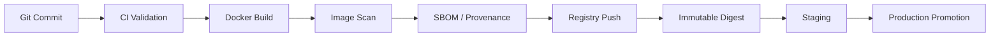
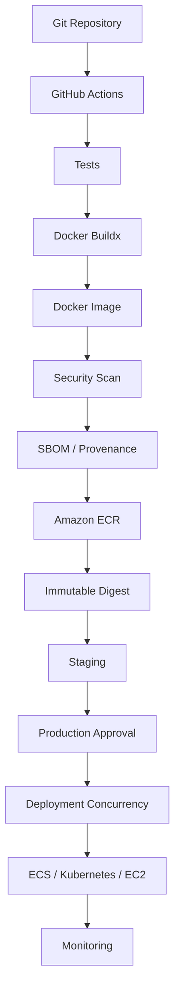

# 09- Docker Image Build and Publishing

## Overview

Docker image build and publishing is the CI/CD stage where application source code is transformed into an immutable container image and published to an artifact registry for later deployment.

A production pipeline should separate:

```text
Source Code
    ↓
Validation
    ↓
Docker Build
    ↓
Security Scanning
    ↓
Image Metadata
    ↓
Registry Push
    ↓
Immutable Artifact
    ↓
Staging
    ↓
Production Promotion
```

The key principle is:

> Build the image once, identify it immutably, and promote the same image across environments.

For Python backend systems such as Django and FastAPI, this stage connects application packaging with deployment systems such as AWS ECR, ECS, EC2, Kubernetes, and Lambda-compatible container workflows.

---

## Docker Image Build in CI/CD

A Docker image contains the application runtime and its required dependencies.

For a Python service, this commonly includes:

- Python runtime
- Application source
- Python dependencies
- System libraries
- Application configuration defaults
- Runtime entrypoint

Environment-specific configuration should generally not be baked into the image.

```text
                    Docker Image
                         │
        ┌────────────────┼────────────────┐
        │                │                │
   Python Runtime   Application      Dependencies
        │                │                │
        └────────────────┼────────────────┘
                         ↓
                  Immutable Artifact
```

The same image can then be deployed to:

```text
Development
    ↓
Staging
    ↓
Production
```

with configuration supplied by the target environment.

---

## Why Build Images in CI

Building the image inside CI provides:

- Repeatable builds
- Automated validation
- Consistent runtime packaging
- Centralized security checks
- Immutable deployment artifacts
- Traceability to source commits
- Automated registry publishing

A CI pipeline can associate:

```text
Git Commit
    ↓
Workflow Run
    ↓
Docker Image
    ↓
Image Digest
    ↓
Deployment
```

This creates a traceable release chain.

---

## Production Image Lifecycle



The registry should store the image as an artifact rather than acting as the build environment.

---

## Build Once, Deploy Many

The preferred production model is:

```text
Source
  ↓
Build
  ↓
Image A
  ↓
ECR
  ↓
Staging
  ↓
Approval
  ↓
Production
```

Avoid:

```text
Source
  ↓
Build Image A
  ↓
Staging

Source
  ↓
Build Image B
  ↓
Production
```

Even if both builds use the same Git commit, differences in:

- Dependencies
- Base images
- Build arguments
- Network responses
- Build tools
- Package indexes

can result in different artifacts.

---

## Image Identity

An image can have multiple identifiers.

| Identifier | Purpose |
|---|---|
| Repository | Image location |
| Tag | Human-readable reference |
| Commit SHA | Source identity |
| Semantic version | Release identity |
| Digest | Immutable artifact identity |

Example:

```text
Repository:
123456789012.dkr.ecr.ap-south-1.amazonaws.com/backend

Tag:
7f3a8e2

Digest:
sha256:abc123...
```

For deployment, the digest provides the strongest artifact identity.

---

## Docker Tags

Common tags include:

```text
latest
main
v2.4.0
7f3a8e2
```

Each has different semantics.

### `latest`

Convenient but mutable.

Avoid using it as the production deployment identity.

### Branch Tag

```text
main
```

Useful for development or continuously updated environments.

It is still mutable.

### Commit SHA Tag

```text
7f3a8e2
```

Provides strong traceability to source.

### Semantic Version

```text
v2.4.0
```

Useful for release management but can still be moved unless protected.

### Digest

```text
sha256:abc123...
```

Immutable image identity.

---

## Recommended Tagging Strategy

A practical strategy is:

```text
backend:7f3a8e2
backend:v2.4.0
backend:latest
```

where:

- SHA tag identifies the build
- semantic tag identifies the release
- `latest` is optional for convenience

Production deployment should use:

```text
backend@sha256:abc123...
```

rather than relying on a mutable tag.

---

## Dockerfile Design

A Python backend image might use:

```dockerfile
FROM python:3.12-slim

ENV PYTHONDONTWRITEBYTECODE=1 \
    PYTHONUNBUFFERED=1

WORKDIR /app

COPY requirements.txt .

RUN pip install --no-cache-dir -r requirements.txt

COPY . .

CMD ["gunicorn", "config.wsgi:application"]
```

For FastAPI:

```dockerfile
FROM python:3.12-slim

ENV PYTHONDONTWRITEBYTECODE=1 \
    PYTHONUNBUFFERED=1

WORKDIR /app

COPY requirements.txt .

RUN pip install --no-cache-dir -r requirements.txt

COPY . .

CMD ["uvicorn", "app.main:app", "--host", "0.0.0.0", "--port", "8000"]
```

Production images should be intentionally small and contain only what is required at runtime.

---

## Multi-Stage Builds

Multi-stage builds separate build dependencies from runtime dependencies.

```dockerfile
FROM python:3.12-slim AS builder

WORKDIR /build

COPY requirements.txt .

RUN python -m venv /opt/venv \
    && /opt/venv/bin/pip install --no-cache-dir -r requirements.txt


FROM python:3.12-slim AS runtime

ENV PATH="/opt/venv/bin:$PATH" \
    PYTHONDONTWRITEBYTECODE=1 \
    PYTHONUNBUFFERED=1

WORKDIR /app

COPY --from=builder /opt/venv /opt/venv
COPY . .

CMD ["gunicorn", "config.wsgi:application"]
```

Advantages include:

- Smaller runtime image
- Reduced attack surface
- Separation of build and runtime dependencies
- Cleaner production packaging

---

## Build Context

The Docker build context determines which files are available to the Docker build.

Avoid sending unnecessary files.

A suitable `.dockerignore` might contain:

```text
.git
.github
.venv
__pycache__
*.pyc
.pytest_cache
.coverage
htmlcov
.env
.env.*
node_modules
dist
build
```

This improves:

- Build performance
- Cache efficiency
- Security
- Image reproducibility

Never rely on `.dockerignore` as the only secret protection mechanism. Secrets should not exist in the build context in the first place.

---

## Docker Build in GitHub Actions

A basic build can use Docker Buildx.

```yaml
name: Build Image

on:
  push:
    branches:
      - main

jobs:
  build:
    runs-on: ubuntu-latest

    permissions:
      contents: read

    steps:
      - name: Checkout
        uses: actions/checkout@v4

      - name: Set up Docker Buildx
        uses: docker/setup-buildx-action@v3

      - name: Build image
        uses: docker/build-push-action@v6
        with:
          context: .
          push: false
          tags: backend:${{ github.sha }}
```

Buildx provides modern Docker build capabilities and integrates well with CI caching and multi-platform builds.

---

## Buildx

Docker Buildx provides features useful for production CI/CD, including:

- BuildKit-based builds
- Layer caching
- Multi-platform builds
- Improved build performance
- Advanced output options
- Registry-based caching

A typical setup is:

```yaml
- name: Set up Docker Buildx
  uses: docker/setup-buildx-action@v3
```

Then:

```yaml
- name: Build image
  uses: docker/build-push-action@v6
  with:
    context: .
    push: false
    tags: backend:${{ github.sha }}
```

---

## Build Cache

Docker builds can be expensive when dependencies are installed repeatedly.

Build caching allows unchanged layers to be reused.

Conceptually:

```text
Dockerfile
    ↓
Layer 1 ─────────── Cache Hit
Layer 2 ─────────── Cache Hit
Layer 3 ─────────── Cache Miss
Layer 4 ─────────── Rebuild
```

A good Dockerfile ordering maximizes cache reuse.

For Python:

```dockerfile
COPY requirements.txt .
RUN pip install --no-cache-dir -r requirements.txt

COPY . .
```

Application source changes do not invalidate the dependency installation layer unless the requirements file changes.

---

## GitHub Actions Build Cache

Buildx can use GitHub Actions cache storage:

```yaml
- name: Build image
  uses: docker/build-push-action@v6
  with:
    context: .
    push: false
    tags: backend:${{ github.sha }}
    cache-from: type=gha
    cache-to: type=gha,mode=max
```

Caching should improve build performance without becoming part of the release artifact identity.

---

## Cache vs Artifact

A cache is an optimization.

An artifact is a release object.

| Property | Cache | Image Artifact |
|---|---|---|
| Purpose | Speed up work | Deploy application |
| Mutability | Replaceable | Should be immutable |
| Required for correctness | No | Yes |
| Deployment identity | No | Yes |
| Safe to regenerate | Usually | Must preserve released version |

Never treat a Docker build cache as the production artifact.

---

## Registry Authentication

Before pushing an image, CI needs registry authentication.

For AWS ECR, prefer GitHub OIDC with AWS STS rather than storing long-lived AWS access keys.

Architecture:

```text
GitHub Actions
      ↓
OIDC Token
      ↓
AWS STS
      ↓
IAM Role
      ↓
ECR
```

This removes the need for long-lived AWS credentials in GitHub secrets.

---

## AWS OIDC Configuration

The deployment/build job can request an OIDC token:

```yaml
permissions:
  contents: read
  id-token: write
```

Then configure AWS credentials:

```yaml
- name: Configure AWS credentials
  uses: aws-actions/configure-aws-credentials@v4
  with:
    role-to-assume: ${{ vars.AWS_ECR_ROLE_ARN }}
    aws-region: ${{ vars.AWS_REGION }}
```

The IAM trust policy should restrict which GitHub workflows can assume the role.

---

## ECR Login

After AWS authentication:

```yaml
- name: Login to Amazon ECR
  id: ecr
  uses: aws-actions/amazon-ecr-login@v2
```

The workflow can then push the image to ECR.

---

## Build and Push to ECR

Example:

```yaml
name: Build and Publish

on:
  push:
    branches:
      - main

jobs:
  build:
    runs-on: ubuntu-latest

    permissions:
      contents: read
      id-token: write

    env:
      AWS_REGION: ap-south-1
      ECR_REPOSITORY: backend

    steps:
      - name: Checkout
        uses: actions/checkout@v4

      - name: Configure AWS credentials
        uses: aws-actions/configure-aws-credentials@v4
        with:
          role-to-assume: ${{ vars.AWS_ECR_ROLE_ARN }}
          aws-region: ${{ env.AWS_REGION }}

      - name: Login to ECR
        id: login-ecr
        uses: aws-actions/amazon-ecr-login@v2

      - name: Set up Docker Buildx
        uses: docker/setup-buildx-action@v3

      - name: Build and push
        uses: docker/build-push-action@v6
        with:
          context: .
          push: true
          tags: |
            ${{ steps.login-ecr.outputs.registry }}/${{ env.ECR_REPOSITORY }}:${{ github.sha }}
            ${{ steps.login-ecr.outputs.registry }}/${{ env.ECR_REPOSITORY }}:latest
          cache-from: type=gha
          cache-to: type=gha,mode=max
```

For production deployment, resolve and preserve the resulting digest.

---

## Registry Repository Design

For a microservice architecture:

```text
ECR
├── backend-api
├── backend-worker
├── notification-service
├── payment-service
└── scheduler
```

Repositories can be separated by service where independent lifecycle and access control are useful.

---

## ECR Image Lifecycle

A production flow might be:

```text
Git Commit
    ↓
Docker Build
    ↓
Security Scan
    ↓
Push to ECR
    ↓
Image Digest
    ↓
Staging
    ↓
Production
```

The registry becomes the source of truth for deployable container artifacts.

---

## Image Digest

After pushing an image, Docker identifies the resulting artifact with a digest.

Conceptually:

```text
Repository:
backend

Tag:
7f3a8e2

Digest:
sha256:123456...
```

A production deployment can use:

```text
backend@sha256:123456...
```

This prevents tag movement from changing the artifact.

---

## Capturing the Digest

A deployment pipeline should preserve the image reference.

For example:

```yaml
- name: Build image
  id: build
  uses: docker/build-push-action@v6
  with:
    context: .
    push: true
    tags: ${{ steps.login-ecr.outputs.registry }}/backend:${{ github.sha }}
```

The build step exposes metadata that can be propagated through job outputs.

The important design is:

```text
Build Job
    ↓
Image Reference
    ↓
Job Output
    ↓
Deployment Job
```

---

## Passing Image Information Between Jobs

Example:

```yaml
jobs:
  build:
    runs-on: ubuntu-latest
    outputs:
      image: ${{ steps.meta.outputs.image }}

    steps:
      - name: Generate image reference
        id: meta
        run: |
          echo "image=123456789012.dkr.ecr.ap-south-1.amazonaws.com/backend:${GITHUB_SHA}" >> "$GITHUB_OUTPUT"

  deploy:
    needs: build
    runs-on: ubuntu-latest

    steps:
      - name: Show image
        run: echo "${{ needs.build.outputs.image }}"
```

For production, the output should identify the immutable artifact being promoted.

---

## Artifact Promotion

A mature pipeline should separate artifact creation from deployment.

```text
Build Job
   ↓
Push Image
   ↓
Record Digest
   ↓
Staging Deployment
   ↓
Validation
   ↓
Production Approval
   ↓
Production Deployment
```

The production job should not rebuild the Docker image.

---

## Production Deployment Example

```yaml
jobs:
  build:
    runs-on: ubuntu-latest
    outputs:
      image: ${{ steps.image.outputs.reference }}

    steps:
      - uses: actions/checkout@v4

      - name: Build image
        id: image
        run: |
          IMAGE="123456789012.dkr.ecr.ap-south-1.amazonaws.com/backend:${GITHUB_SHA}"
          echo "reference=$IMAGE" >> "$GITHUB_OUTPUT"

  deploy-production:
    needs: build
    runs-on: ubuntu-latest

    environment:
      name: production

    concurrency:
      group: production-backend
      cancel-in-progress: false

    permissions:
      contents: read
      id-token: write

    steps:
      - name: Deploy
        env:
          IMAGE: ${{ needs.build.outputs.image }}
        run: ./deploy.sh "$IMAGE"
```

The real production implementation should pass the immutable digest rather than relying only on the tag.

---

## Security Scanning

Docker images should be scanned before production deployment.

Common scan targets include:

- OS packages
- Python dependencies
- Application dependencies
- Known CVEs
- Malware indicators
- Misconfigurations

A conceptual pipeline is:

```text
Build
  ↓
Scan
  ↓
Pass?
 ├── No → Stop
 └── Yes
       ↓
    Publish
```

Scanning should occur early enough to prevent vulnerable artifacts from entering the production promotion path.

---

## Vulnerability Scanning Policy

Not every vulnerability should necessarily block every build.

A production policy can define thresholds based on:

- Severity
- Exploitability
- Runtime exposure
- Package relevance
- Available remediation

The policy should be explicit rather than relying on an arbitrary scanner exit code.

---

## SBOM

An SBOM describes the software components contained in an artifact.

For a Python image, it can include:

```text
Python
Django
FastAPI
Pydantic
Requests
System Libraries
```

The SBOM supports:

- Vulnerability analysis
- Dependency inventory
- Incident response
- Compliance
- Supply-chain visibility

---

## Artifact Provenance

Provenance answers questions such as:

```text
Where did this image come from?
Which source commit produced it?
Which workflow built it?
Which builder produced it?
```

A useful release chain is:

```text
Commit
  ↓
Workflow Run
  ↓
Build
  ↓
Image Digest
  ↓
Attestation
  ↓
Deployment
```

---

## Artifact Attestations and Signing

Hashing proves that content has not changed relative to a known hash.

Signing provides stronger authenticity guarantees when the signing identity is trusted.

A mature image pipeline may use:

```text
Image
  ↓
Digest
  ↓
SBOM
  ↓
Provenance
  ↓
Attestation
  ↓
Signature
```

Production systems can then enforce policies around artifact origin and integrity.

---

## Multi-Platform Images

Some workloads require:

```text
linux/amd64
linux/arm64
```

Buildx can build multiple platforms.

Example:

```yaml
- name: Build multi-platform image
  uses: docker/build-push-action@v6
  with:
    context: .
    platforms: linux/amd64,linux/arm64
    push: true
    tags: ${{ steps.meta.outputs.tags }}
```

Multi-platform builds increase build complexity and should be used only when required.

---

## Architecture Compatibility

Python applications may depend on native libraries.

Examples include:

- `psycopg`
- `mysqlclient`
- `numpy`
- `cryptography`

When building for multiple architectures, verify that native dependencies support each target architecture.

---

## Docker Build Secrets

Never bake secrets into an image:

```dockerfile
ENV API_KEY=secret
```

Do not copy secret files into the image:

```dockerfile
COPY .env .
```

Use BuildKit-supported secret mechanisms when a build-time secret is genuinely required.

The secret should not become part of an image layer.

---

## Runtime Secrets

Application secrets should generally be supplied at runtime.

For example:

```text
Docker Image
    ↓
ECS / Kubernetes
    ↓
Runtime Environment
    ↓
Secret Manager
```

For Django:

```text
DJANGO_SECRET_KEY
DATABASE_URL
```

should normally be runtime configuration rather than image contents.

---

## Dockerfile Security

Prefer:

- Minimal base images
- Pinned dependencies
- Non-root runtime users where practical
- Multi-stage builds
- No secrets in layers
- Minimal packages
- Regular base-image updates

Example:

```dockerfile
FROM python:3.12-slim

RUN useradd --create-home appuser

WORKDIR /app

COPY requirements.txt .
RUN pip install --no-cache-dir -r requirements.txt

COPY . .

USER appuser

CMD ["gunicorn", "config.wsgi:application"]
```

---

## Dependency Pinning

Python dependencies should be reproducible.

Prefer a locked dependency strategy.

For example:

```text
requirements.txt
requirements.lock
uv.lock
poetry.lock
```

depending on the project's package-management approach.

A Docker build should not unexpectedly install a different dependency version because an unpinned requirement changed upstream.

---

## Base Image Strategy

Base images affect:

- Security
- Compatibility
- Build performance
- Image size
- Maintenance

Common choices include:

```text
python:3.12-slim
python:3.12-alpine
```

Alpine can produce smaller images but may introduce compatibility or build complexity for Python packages using native dependencies.

Use a base image based on runtime requirements rather than image size alone.

---

## Base Image Updates

Base images should be updated regularly.

A mature process includes:

```text
Base Image Update
      ↓
Build
      ↓
Tests
      ↓
Security Scan
      ↓
Staging
      ↓
Production
```

Do not blindly update production base images without validating application compatibility.

---

## Reproducibility

A reproducible build should produce equivalent artifacts from the same inputs.

Sources of non-reproducibility include:

- Floating dependencies
- Mutable base image tags
- Current timestamps
- Network-dependent build scripts
- Uncontrolled package repositories
- Environment-specific build arguments

Use controlled inputs and record build metadata.

---

## Build Arguments

Build arguments are useful for non-secret build configuration.

Example:

```yaml
- name: Build image
  uses: docker/build-push-action@v6
  with:
    build-args: |
      APP_VERSION=${{ github.sha }}
```

Do not pass secrets as ordinary build arguments.

Build arguments can become visible through build metadata or layers depending on how they are used.

---

## Image Labels

OCI image labels can provide release metadata.

Example:

```dockerfile
LABEL org.opencontainers.image.source="https://github.com/example/backend" \
      org.opencontainers.image.revision="$VCS_REF" \
      org.opencontainers.image.version="$VERSION"
```

Useful metadata includes:

- Source repository
- Commit
- Version
- Build system
- Build timestamp
- License

Avoid embedding sensitive information.

---

## Docker Build Metadata

A production image can be associated with:

```text
Repository
Commit
Version
Build Run
Builder
Image Digest
SBOM
Provenance
```

This enables incident investigation and release traceability.

---

## Registry Authentication Security

Avoid:

```text
AWS_ACCESS_KEY_ID
AWS_SECRET_ACCESS_KEY
```

stored as long-lived GitHub secrets when OIDC is available.

Prefer:

```text
GitHub OIDC
    ↓
AWS STS
    ↓
Short-Lived Credentials
    ↓
ECR
```

IAM should grant only the permissions required by the build/publish job.

---

## Least-Privilege ECR Permissions

A build job typically needs permissions associated with:

- Authentication
- Image upload
- Image metadata operations

Do not automatically grant broad permissions such as:

```text
AdministratorAccess
```

to the GitHub deployment role.

Separate build/publish and production deployment roles where practical.

---

## Build Role vs Deployment Role

A stronger architecture separates privileges:

```text
Build Workflow
      ↓
ECR Push Role

Deployment Workflow
      ↓
Production Deployment Role
```

This prevents a compromised build job from automatically receiving all production infrastructure permissions.

---

## GitHub Actions Permissions

A build job might use:

```yaml
permissions:
  contents: read
  id-token: write
```

The `id-token` permission is required only when OIDC authentication is used.

Do not grant unnecessary repository write permissions.

---

## Untrusted Pull Requests

A pull request from a fork should not receive production credentials merely because it runs the Docker build workflow.

A safe model is:

```text
Fork PR
   ↓
Build/Test
   ↓
No Production AWS Credentials
```

Then:

```text
Trusted Main Branch
   ↓
Publish
   ↓
Staging
   ↓
Production
```

---

## `pull_request_target`

Do not combine privileged credentials with execution of untrusted pull request code.

A dangerous pattern is:

```text
pull_request_target
      ↓
Checkout PR Branch
      ↓
Docker Build
      ↓
AWS Credentials
```

A malicious Dockerfile or build script could execute with those credentials.

Keep privileged image publishing in trusted workflows.

---

## Dockerfile as Executable Code

A Dockerfile is not passive configuration.

Commands such as:

```dockerfile
RUN ./build.sh
```

execute code during the build.

Similarly:

```dockerfile
RUN pip install ...
```

can execute package installation logic.

Treat the build context and Dockerfile as code executed with CI privileges.

---

## Build Context Security

Avoid:

```text
docker build .
```

when the repository contains unnecessary sensitive files.

Use `.dockerignore`.

Also verify:

```text
.git
.env
credentials
private keys
local configuration
```

are excluded.

---

## Docker-in-Docker and Docker Socket

Some CI architectures expose a Docker daemon to jobs.

A mounted Docker socket can provide powerful host-level access.

For example:

```text
CI Job
  ↓
/var/run/docker.sock
  ↓
Host Docker Daemon
```

Treat Docker socket access as privileged.

Prefer isolated builders and least-privilege build architecture where practical.

---

## Self-Hosted Runners

Self-hosted runners used for Docker builds require particular care.

A malicious build can potentially access:

- Docker daemon
- Host filesystem
- Network
- Cached credentials
- Other build artifacts

Use:

- Ephemeral runners
- Minimal network access
- Dedicated runner groups
- Restricted credentials
- Regular runner image updates

---

## Image Publishing and Concurrency

Publishing the same service image from multiple workflows can create release ambiguity.

For example:

```text
Commit A → build → push
Commit B → build → push
```

If mutable tags are used:

```text
backend:latest
```

the final tag depends on timing.

Use immutable tags or digests for release identity.

---

## Production Deployment Concurrency

Publishing and deployment are related but distinct.

```text
Build
  ↓
Publish
  ↓
Artifact
  ↓
Production Deployment
```

Deployment concurrency should protect the deployment target.

Image publishing can often proceed independently for different commits.

---

## Registry Immutability

Where supported, registry policies can reduce accidental tag mutation.

A strong strategy is:

```text
Commit SHA Tag
       +
Digest
       +
Protected Release Tags
```

This reduces the chance of an approved release being silently replaced.

---

## Image Retention

Registries accumulate images.

Example:

```text
10 builds/day
×
30 days
=
300 images/service
```

Retention policies should remove artifacts that are no longer required while preserving:

- Current production image
- Recent rollback images
- Release images
- Compliance-required artifacts

Do not delete the only known-good rollback artifact.

---

## ECR Lifecycle Policies

AWS ECR lifecycle policies can automatically expire old images.

A production strategy may retain:

```text
Recent N images
+
Release-tagged images
+
Production rollback window
```

Retention should be aligned with deployment and disaster-recovery requirements.

---

## Image Size Optimization

Image size affects:

- Registry storage
- Network transfer
- Container startup
- Deployment time
- Cold-start behavior

Optimize through:

- Slim runtime images
- Multi-stage builds
- `.dockerignore`
- Removing build tools from runtime
- Avoiding unnecessary OS packages

Do not sacrifice security or compatibility solely to minimize image size.

---

## Layer Ordering

A poor Dockerfile can invalidate expensive layers.

Less efficient:

```dockerfile
COPY . .

RUN pip install --no-cache-dir -r requirements.txt
```

A source change invalidates the dependency layer.

Better:

```dockerfile
COPY requirements.txt .

RUN pip install --no-cache-dir -r requirements.txt

COPY . .
```

Application changes can then reuse dependency layers.

---

## Docker Build Performance

Build performance depends on:

- Context size
- Layer ordering
- Cache availability
- Dependency installation
- Base image pulls
- Network access
- Build parallelism

Measure before optimizing.

Useful metrics include:

```text
Build Duration
Cache Hit Rate
Image Size
Push Duration
Registry Transfer
```

---

## Multi-Service Builds

A monorepo might contain:

```text
services/
├── api/
├── worker/
├── scheduler/
└── notifications/
```

Avoid rebuilding every service for every change.

A planning job can identify changed services:

```text
Git Diff
   ↓
Changed Services
   ↓
Dynamic Matrix
   ↓
Build Only Required Images
```

---

## Dynamic Matrix for Images

Conceptually:

```yaml
strategy:
  matrix:
    service:
      - api
      - worker
      - scheduler
```

For a larger monorepo, generate the matrix dynamically.

```text
Changed Files
     ↓
Planning Job
     ↓
JSON Service List
     ↓
fromJSON()
     ↓
Build Matrix
```

This improves CI scalability.

---

## Build Outputs

The build job can expose:

- Image reference
- Digest
- Version
- Registry
- SBOM location
- Provenance information

Use `$GITHUB_OUTPUT` for small structured values:

```bash
echo "digest=sha256:abc123" >> "$GITHUB_OUTPUT"
```

Pass those values through job outputs.

---

## Artifact vs Docker Image

A Docker image is itself a deployable artifact.

Do not unnecessarily upload the entire Docker image as a GitHub Actions artifact when a registry is the intended artifact store.

Use:

```text
GitHub Artifact
    ↓
Logs / Reports / Metadata

Container Registry
    ↓
Deployable Docker Image
```

---

## Build Reports

Useful CI artifacts include:

- Test reports
- Coverage
- Security scan results
- SBOM
- Build metadata
- Docker build logs

Example:

```yaml
- name: Upload security report
  if: ${{ !cancelled() }}
  uses: actions/upload-artifact@v4
  with:
    name: image-security-report
    path: reports/
```

Do not upload secrets or sensitive runtime configuration.

---

## Failure Domain: Docker Build Failure

### Symptom

The Docker build fails.

### Possible Causes

- Invalid Dockerfile
- Missing files
- Dependency installation failure
- Native package compilation failure
- Incorrect architecture
- Base image issue

### Isolation

Run locally:

```bash
docker build -t backend:debug .
```

Inspect the failing layer.

### Prevention

- Pin dependencies
- Use supported base images
- Keep Dockerfiles deterministic
- Test the production build in CI

---

## Failure Domain: ECR Authentication Failure

### Symptom

The image cannot be pushed.

### Possible Causes

- OIDC permission missing
- IAM trust policy mismatch
- Incorrect AWS account
- Incorrect region
- Insufficient ECR permissions

### Checks

```bash
aws sts get-caller-identity
```

Verify:

```text
GitHub OIDC
    ↓
STS
    ↓
IAM Role
    ↓
ECR
```

---

## Failure Domain: Image Push Failure

### Symptom

Build succeeds but push fails.

### Possible Causes

- Registry authentication
- Network issue
- ECR repository does not exist
- IAM permissions
- Registry quota
- Incorrect repository name

### Isolation

Verify:

```bash
aws ecr describe-repositories \
  --repository-names backend \
  --region ap-south-1
```

Then inspect the workflow logs.

---

## Failure Domain: Wrong Image Deployed

### Symptom

Production contains an unexpected image.

### Possible Causes

- Mutable tag
- Incorrect workflow output
- Rebuild after approval
- Incorrect ECR repository
- Wrong AWS account
- Wrong environment variable

### Prevention

Record and deploy:

```text
Image Digest
```

rather than resolving mutable tags during deployment.

---

## Failure Domain: Vulnerability Scan Blocks Release

### Symptom

Image publishing or promotion stops after scanning.

### Possible Causes

- Critical CVE
- High-severity dependency vulnerability
- Vulnerable base image
- Policy threshold

### Corrective Action

Determine:

```text
Vulnerability
    ↓
Affected Component
    ↓
Exploitability
    ↓
Available Fix
    ↓
Risk Policy
```

Do not blindly suppress the finding.

---

## Failure Domain: Large Image

### Symptom

Build or deployment takes too long.

### Possible Causes

- Large build context
- Unnecessary packages
- Build tools in runtime image
- Poor layer reuse
- Large dependency set

### Corrective Action

Inspect image layers and remove unnecessary runtime content.

---

## Failure Domain: Cache Not Working

### Symptom

Every Docker build takes approximately the same time.

### Possible Causes

- Incorrect cache configuration
- Dockerfile ordering
- Changing files copied too early
- Cache eviction
- Different build context

### Corrective Action

Inspect cache configuration and Dockerfile layer ordering.

---

## Failure Domain: Multi-Architecture Build Failure

### Symptom

`amd64` works but `arm64` fails.

### Possible Causes

- Native dependency lacks architecture support
- Architecture-specific binary
- Base image limitation
- Build tool incompatibility

### Corrective Action

Test the dependency chain for each target architecture.

---

## GitHub CLI Operations

List workflows:

```bash
gh workflow list
```

List workflow runs:

```bash
gh run list
```

Inspect a workflow run:

```bash
gh run view RUN_ID
```

Inspect logs:

```bash
gh run view RUN_ID --log
```

Rerun a workflow:

```bash
gh run rerun RUN_ID
```

These commands are useful for diagnosing image build and publishing workflows.

---

## AWS CLI Operations

Check identity:

```bash
aws sts get-caller-identity
```

List ECR repositories:

```bash
aws ecr describe-repositories
```

List images:

```bash
aws ecr list-images \
  --repository-name backend
```

Describe images:

```bash
aws ecr describe-images \
  --repository-name backend
```

These commands help verify that the expected image was actually published.

---

## Inspecting Image Digests

For an ECR image:

```bash
aws ecr describe-images \
  --repository-name backend \
  --image-ids imageTag=7f3a8e2
```

Inspect:

```text
imageDigest
imageTags
imagePushedAt
```

The digest should be recorded as part of release metadata.

---

## Production Pipeline

A complete production-oriented image pipeline can be structured as:

```text
Pull Request
      ↓
Lint
      ↓
Unit Tests
      ↓
Integration Tests
      ↓
Security Scan
      ↓
Matrix Tests
      ↓
Docker Build
      ↓
Image Scan
      ↓
SBOM
      ↓
Provenance
      ↓
ECR Push
      ↓
Immutable Digest
      ↓
Staging
      ↓
Health Validation
      ↓
Production Approval
      ↓
Production Concurrency
      ↓
Production
      ↓
Monitoring
      ↓
Rollback
```

---

## Complete GitHub Actions Example

```yaml
name: Build and Publish Docker Image

on:
  push:
    branches:
      - main

permissions:
  contents: read

env:
  AWS_REGION: ap-south-1
  ECR_REPOSITORY: backend

jobs:
  test:
    runs-on: ubuntu-latest

    steps:
      - name: Checkout
        uses: actions/checkout@v4

      - name: Set up Python
        uses: actions/setup-python@v6
        with:
          python-version: "3.12"

      - name: Install dependencies
        run: pip install -r requirements.txt

      - name: Run tests
        run: pytest

  build:
    needs: test
    runs-on: ubuntu-latest

    permissions:
      contents: read
      id-token: write

    outputs:
      image: ${{ steps.meta.outputs.image }}

    steps:
      - name: Checkout
        uses: actions/checkout@v4

      - name: Configure AWS credentials
        uses: aws-actions/configure-aws-credentials@v4
        with:
          role-to-assume: ${{ vars.AWS_ECR_ROLE_ARN }}
          aws-region: ${{ env.AWS_REGION }}

      - name: Login to ECR
        id: ecr
        uses: aws-actions/amazon-ecr-login@v2

      - name: Set up Docker Buildx
        uses: docker/setup-buildx-action@v3

      - name: Generate image reference
        id: meta
        env:
          REGISTRY: ${{ steps.ecr.outputs.registry }}
        run: |
          echo "image=${REGISTRY}/${ECR_REPOSITORY}:${GITHUB_SHA}" >> "$GITHUB_OUTPUT"

      - name: Build and push image
        uses: docker/build-push-action@v6
        with:
          context: .
          push: true
          tags: ${{ steps.meta.outputs.image }}
          cache-from: type=gha
          cache-to: type=gha,mode=max

  deploy-staging:
    needs: build
    runs-on: ubuntu-latest

    environment:
      name: staging

    permissions:
      contents: read
      id-token: write

    steps:
      - name: Deploy image
        env:
          IMAGE: ${{ needs.build.outputs.image }}
        run: ./deploy.sh staging "$IMAGE"

  deploy-production:
    needs: deploy-staging
    runs-on: ubuntu-latest

    environment:
      name: production

    concurrency:
      group: production-backend
      cancel-in-progress: false

    permissions:
      contents: read
      id-token: write

    steps:
      - name: Deploy image
        env:
          IMAGE: ${{ needs.build.outputs.image }}
        run: ./deploy.sh production "$IMAGE"

      - name: Validate deployment
        run: ./scripts/health-check.sh production
```

For a mature production implementation, the `IMAGE` value should ultimately resolve to the immutable image digest associated with the build.

---

## Docker Image Architecture



The registry stores the deployable artifact while GitHub Actions orchestrates the lifecycle.

---

## ECS Deployment

For ECS:

```text
GitHub Actions
      ↓
Docker Buildx
      ↓
ECR
      ↓
Image Digest
      ↓
ECS Task Definition
      ↓
ECS Service
      ↓
Load Balancer
      ↓
Health Checks
```

The task definition should reference the intended immutable image.

---

## Kubernetes Deployment

For Kubernetes:

```text
GitHub Actions
      ↓
ECR
      ↓
Image Digest
      ↓
Deployment Manifest
      ↓
Kubernetes
      ↓
ReplicaSet
      ↓
Pods
      ↓
Service / Ingress
```

Prefer immutable image references where practical.

---

## EC2 Deployment

For EC2-based systems:

```text
GitHub Actions
      ↓
ECR
      ↓
Image Digest
      ↓
EC2 Host
      ↓
Docker
      ↓
Container
      ↓
Nginx
      ↓
Application
```

The deployment mechanism should still use the same immutable image built by CI.

---

## Django Production Image

A Django image commonly contains:

```text
Python
Django
Gunicorn
Application Code
Dependencies
```

Runtime dependencies such as:

```text
DATABASE_URL
REDIS_URL
DJANGO_SECRET_KEY
```

should be injected through the deployment environment.

The image should remain environment-neutral.

---

## FastAPI Production Image

A FastAPI image commonly contains:

```text
Python
FastAPI
Uvicorn / Gunicorn
Application Code
Dependencies
```

For production, process management, health checks, graceful shutdown, and worker configuration should be handled by the runtime platform.

---

## Nginx and Docker Images

Nginx may be packaged separately:

```text
Nginx Container
      ↓
FastAPI / Django Container
      ↓
Application
```

or provided by the infrastructure layer.

Do not place unrelated services into a single image merely to reduce the number of containers.

A container image should normally represent one deployable service component.

---

## Worker Images

Celery workers can reuse the application image when the runtime dependencies are identical.

For example:

```text
backend:sha256:abc123
      ├── Web
      └── Celery Worker
```

Different entrypoints can execute different processes.

This ensures that application and worker code are built from the same artifact.

---

## Scheduler Images

A Celery Beat or scheduler process can similarly use the same application image when appropriate:

```text
Backend Image
   ├── API
   ├── Worker
   └── Scheduler
```

This reduces drift between runtime components.

---

## Kafka Services

Kafka producers and consumers can also use versioned immutable images.

For example:

```text
producer@sha256:AAA
consumer@sha256:BBB
```

Deployment pipelines should consider message compatibility when promoting new images.

---

## Reliability

A reliable image publishing pipeline should provide:

- Deterministic builds
- Immutable artifacts
- Registry durability
- Build retries where safe
- Clear artifact identity
- Health validation
- Rollback artifacts
- Audit metadata

The registry should not be the only place where release metadata exists.

---

## High Availability

The CI build system itself should not become a production deployment bottleneck.

Use:

- Parallel CI jobs
- Build caching
- Independent service builds
- Registry redundancy
- Multiple deployment targets
- Health checks
- Rollback mechanisms

Deployment architecture should also preserve runtime availability through rolling or blue-green strategies.

---

## Disaster Recovery

Preserve enough artifacts to restore a known-good production state.

At minimum, maintain access to:

```text
Production Release
      ↓
Image Digest
      ↓
Registry Image
      ↓
Deployment Configuration
      ↓
Infrastructure Configuration
```

A rollback is difficult if the image was deleted immediately after deployment.

---

## Cost Optimization

Docker CI/CD costs can be reduced through:

- Build caching
- Smaller build contexts
- Efficient Dockerfile layers
- Parallel testing
- Selective service builds
- Image retention policies
- Appropriate runner selection

Do not over-retain every development image indefinitely.

---

## Production Checklist

### Docker Build

- [ ] Dockerfile is production-oriented
- [ ] `.dockerignore` is configured
- [ ] Multi-stage build is used where beneficial
- [ ] Runtime image is minimal
- [ ] Dependencies are controlled
- [ ] No secrets are baked into the image
- [ ] Non-root execution is considered

### CI

- [ ] Tests run before publishing
- [ ] Buildx is used where appropriate
- [ ] Build cache is configured
- [ ] Image metadata is recorded
- [ ] Build failures stop promotion

### Security

- [ ] Image vulnerabilities are scanned
- [ ] SBOM is generated where required
- [ ] Provenance is recorded where required
- [ ] Third-party actions are controlled
- [ ] AWS credentials use OIDC where appropriate
- [ ] IAM follows least privilege
- [ ] Untrusted PRs cannot publish privileged images

### Registry

- [ ] ECR repository is configured
- [ ] Image tags provide traceability
- [ ] Digest is recorded
- [ ] Registry retention is configured
- [ ] Production rollback images are retained

### Deployment

- [ ] Same artifact is promoted
- [ ] Production uses immutable identity
- [ ] Deployment concurrency is configured
- [ ] Environment protection is configured
- [ ] Health checks are available
- [ ] Rollback is tested

---

## Common Mistakes

### Using `latest` as the Production Identity

```text
backend:latest
```

is mutable.

Use an immutable digest for production deployment.

---

### Rebuilding for Production

```text
Staging → Build A
Production → Build B
```

This violates build-once promotion.

Build the artifact once and promote it.

---

### Baking Secrets into Images

Avoid:

```dockerfile
ENV DATABASE_PASSWORD=secret
```

and:

```dockerfile
COPY .env .
```

Secrets belong in the runtime secret-management layer.

---

### Copying the Entire Repository Into the Build Context

This can expose:

- `.git`
- `.env`
- Credentials
- Local caches
- Test artifacts

Use `.dockerignore`.

---

### Installing Build Tools in the Runtime Image

Leaving compilers and development packages in production increases image size and attack surface.

Use multi-stage builds.

---

### Using Long-Lived AWS Credentials

Avoid storing permanent AWS access keys in GitHub secrets when OIDC is available.

Use:

```text
GitHub OIDC
    ↓
STS
    ↓
Short-Lived IAM Credentials
```

---

### Giving the Build Job Production Permissions

A build job usually does not need permissions to modify production infrastructure.

Separate:

```text
Build Role
```

from:

```text
Production Deployment Role
```

where practical.

---

### Treating Docker Build as Trusted

Dockerfiles and build scripts execute code.

A compromised dependency or malicious pull request can execute during the build.

Protect privileged builds accordingly.

---

### Ignoring Base Image Vulnerabilities

The application may be secure while the operating-system layer contains critical vulnerabilities.

Scan the complete image.

---

### Deleting Rollback Images

Aggressive registry retention can remove the exact artifact required for recovery.

Retention policies should account for rollback requirements.

---

### Poor Dockerfile Layer Ordering

Copying the entire source tree before dependency installation can destroy cache efficiency.

Place stable dependency inputs before frequently changing source code.

---

## Senior-Level Design Principles

### Image Is an Artifact

Treat the Docker image like a release artifact, not a disposable build byproduct.

### Digest Is the Strongest Deployment Identity

Tags are convenient references. Digests identify immutable image content.

### Build Once, Promote Many

Do not rebuild the application for each environment.

### Keep Images Environment-Neutral

Environment-specific configuration belongs outside the image.

### Separate Build and Deployment Privileges

A compromised build process should not automatically gain unrestricted production access.

### Use OIDC for AWS Authentication

Short-lived credentials reduce the risk associated with long-lived secrets.

### Secure the Build Context

The Docker build process executes code and must be treated as a privileged operation.

### Optimize for Reproducibility

Control dependency versions, base images, build inputs, and metadata.

### Preserve Rollback Artifacts

A release is not operationally complete if its known-good artifact cannot be restored.

### Make Artifact Metadata First-Class

Record:

```text
Commit
Release
Workflow Run
Image Tag
Image Digest
SBOM
Provenance
Deployment Environment
```

This makes production incidents significantly easier to investigate.

---

## Interview Questions

### Why should Docker images be built once and promoted?

Rebuilding for every environment can produce different artifacts. Building once creates a single artifact that can be validated and promoted consistently.

### Why is a Docker digest better than a tag for production deployment?

A digest identifies immutable image content, while tags can be moved to different images.

### What is Docker Buildx?

Buildx is Docker's extended build interface based on BuildKit and provides capabilities such as advanced caching and multi-platform builds.

### Why use multi-stage Docker builds?

They separate build dependencies from runtime dependencies, reducing image size and attack surface.

### How would you authenticate GitHub Actions with ECR?

Use GitHub OIDC to obtain short-lived AWS credentials through STS and an IAM role with the minimum required ECR permissions.

### Should AWS credentials be stored in GitHub Secrets?

Long-lived AWS credentials should generally be avoided when OIDC can provide short-lived credentials.

### How do you prevent secrets from entering a Docker image?

Do not copy secret files into the build context or image, do not place secrets in `ENV` or ordinary build arguments, and use runtime secret injection or supported BuildKit secret mechanisms when necessary.

### How would you make a Python Docker build faster?

Use a small build context, optimize Dockerfile layer ordering, cache dependency layers, use Buildx caching, and avoid rebuilding unchanged dependencies.

### How do you handle multiple Docker services in a monorepo?

Detect changed services and generate a dynamic matrix so only affected images are built.

### What happens if two workflows push `latest` simultaneously?

The tag can point to whichever image is written last, creating release ambiguity. Immutable SHA tags and digests should be used for deployment identity.

### How do you secure Docker builds from fork pull requests?

Run untrusted builds without privileged production credentials and keep image publishing and deployment in trusted workflows.

### Why should build and deployment IAM roles be separated?

It limits blast radius. A compromised build job should not automatically have permission to modify production infrastructure.

### What should happen when an image vulnerability is detected?

Evaluate the affected component, severity, exploitability, available remediation, and organizational policy before deciding whether publication or promotion should be blocked.

### How do you guarantee rollback?

Retain the known-good immutable image, record its digest, preserve deployment metadata, and ensure the deployment system can reference that artifact deterministically.

---

## Key Takeaways

- Build Docker images once in CI, publish them as immutable release artifacts, and promote the same image across staging and production.
- Use image digests for production identity; tags such as `latest` and branch names are mutable convenience references rather than reliable release identifiers.
- Secure the complete build chain with minimal Docker images, controlled dependencies, vulnerability scanning, SBOM/provenance, safe build contexts, and no embedded secrets.
- Prefer GitHub OIDC with least-privilege AWS IAM roles for ECR authentication and separate image-publishing privileges from production deployment privileges.
- Treat Docker builds as executable, security-sensitive workloads and design the pipeline for reproducibility, rollback, observability, performance, and controlled artifact retention.