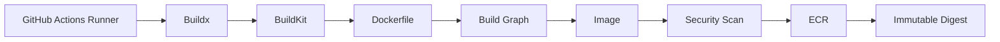
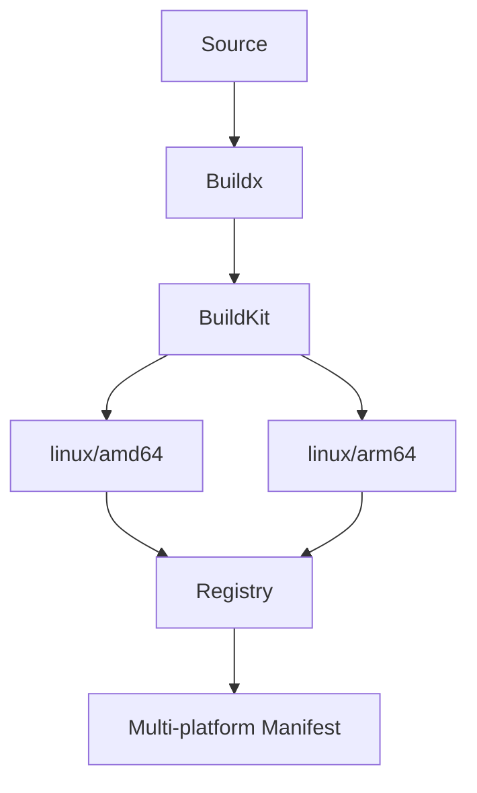
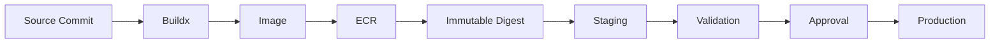

# 10- Docker Buildx

## Overview

Docker Buildx is the modern Docker build interface built on BuildKit. In GitHub Actions, it provides the capabilities required for production-grade container image builds, including advanced caching, multi-platform builds, parallelized build execution, registry-based cache storage, and integration with modern image publishing workflows.

For backend systems using Python, Django, FastAPI, Celery, or microservices, Buildx becomes particularly valuable when CI pipelines need to produce reproducible images efficiently and publish them to registries such as Amazon ECR.

A production image pipeline commonly looks like:

```text
Git Commit
    ↓
Lint / Tests
    ↓
Buildx
    ↓
Docker Image
    ↓
Security Scan
    ↓
SBOM / Provenance
    ↓
Container Registry
    ↓
Immutable Digest
    ↓
Staging
    ↓
Production
```

Buildx should be viewed as a build engine within this pipeline rather than as a replacement for the overall CI/CD architecture.

---

## What Buildx Is

Buildx is Docker's extended build interface for BuildKit.

It provides functionality beyond traditional `docker build`, including:

- Advanced caching
- Multi-platform builds
- Parallel build execution
- Multiple output types
- Registry-based cache management
- Build metadata
- BuildKit features
- Integration with CI/CD systems

The important architectural distinction is:

```text
Docker CLI
    ↓
Buildx
    ↓
BuildKit
    ↓
Build Graph
    ↓
Image / Registry / Other Output
```

Buildx is the interface used to configure and invoke BuildKit.

---

## Why Buildx Matters in CI/CD

A basic image build may work locally:

```bash
docker build -t backend:latest .
```

Production CI introduces additional requirements:

- Build quickly
- Reuse previous layers
- Build for multiple architectures
- Push directly to a registry
- Avoid unnecessary local image storage
- Produce metadata
- Preserve reproducibility
- Integrate with GitHub Actions
- Handle large monorepos
- Support secure release workflows

Buildx addresses many of these requirements.

---

## Buildx and BuildKit

Buildx is the user-facing build interface.

BuildKit is the underlying build engine.

```text
GitHub Actions
      ↓
Docker Buildx
      ↓
BuildKit
      ↓
Dockerfile
      ↓
Build Graph
      ↓
Image
```

BuildKit can optimize execution by understanding the dependency relationships between Dockerfile instructions rather than treating the Dockerfile simply as a linear sequence of shell commands.

---

## Buildx Builder

A Buildx builder provides the environment used to execute builds.

Inspect available builders:

```bash
docker buildx ls
```

Example output:

```text
NAME/NODE       DRIVER/ENDPOINT   STATUS
default         docker             running
builder         docker-container   running
```

Create a dedicated builder:

```bash
docker buildx create \
  --name ci-builder \
  --driver docker-container \
  --use
```

Inspect it:

```bash
docker buildx inspect --bootstrap
```

The builder is an important CI concern because its capabilities, lifecycle, cache configuration, and architecture affect build behavior.

---

## Builder Drivers

Buildx supports different builder drivers.

Common drivers include:

| Driver | Typical Use |
|---|---|
| `docker` | Simple local builds |
| `docker-container` | Isolated BuildKit builder |
| `kubernetes` | Kubernetes-backed builders |
| `remote` | Remote BuildKit daemon |

For CI, `docker-container` is often useful because BuildKit runs in a dedicated environment rather than being tightly coupled to the host Docker daemon.

---

## GitHub Actions Buildx Setup

A typical workflow uses the official Docker setup action:

```yaml
- name: Set up Docker Buildx
  uses: docker/setup-buildx-action@v3
```

Then:

```yaml
- name: Build image
  uses: docker/build-push-action@v6
  with:
    context: .
    push: false
    tags: backend:${{ github.sha }}
```

The setup step prepares a Buildx builder for subsequent build operations.

---

## Buildx in a Production Pipeline



Buildx is therefore part of the build stage, not the complete deployment system.

---

## Basic Buildx Command

Build an image:

```bash
docker buildx build \
  --tag backend:latest \
  .
```

The behavior depends on the output configuration.

For example:

```bash
docker buildx build \
  --tag backend:latest \
  --load \
  .
```

loads the resulting image into the local Docker image store.

Without an appropriate output option, the image may not automatically appear in the local Docker image store.

---

## `--load`

Use `--load` when the image needs to become available to the local Docker daemon.

```bash
docker buildx build \
  --tag backend:test \
  --load \
  .
```

This is useful when subsequent CI steps need to execute:

```bash
docker run backend:test
```

For example:

```text
Buildx
  ↓
--load
  ↓
Local Docker Image
  ↓
docker run
```

It is not always necessary when the only goal is to push directly to a registry.

---

## `--push`

Use `--push` when the build result should be sent directly to a container registry.

```bash
docker buildx build \
  --tag 123456789012.dkr.ecr.ap-south-1.amazonaws.com/backend:${GITHUB_SHA} \
  --push \
  .
```

This is commonly preferred in CI when the image is intended for deployment.

The flow becomes:

```text
Buildx
   ↓
BuildKit
   ↓
Registry
```

rather than:

```text
Buildx
   ↓
Local Image
   ↓
Docker Save
   ↓
Upload
```

---

## `--load` vs `--push`

| Requirement | Option |
|---|---|
| Run image locally | `--load` |
| Push image to registry | `--push` |
| Generate OCI output | `--output` |
| Generate Docker archive | `--output type=docker` |
| Generate local files | `--output type=local` |

For production CI, direct registry publishing is generally more efficient when the image does not need to be executed on the runner after building.

---

## Docker Buildx GitHub Action

The standard GitHub Actions build action is:

```yaml
- name: Build and push
  uses: docker/build-push-action@v6
  with:
    context: .
    push: true
    tags: |
      123456789012.dkr.ecr.ap-south-1.amazonaws.com/backend:${{ github.sha }}
```

This action provides a GitHub Actions-friendly interface over BuildKit.

---

## Build Context

The build context determines which files are available to the Docker build.

Example:

```yaml
with:
  context: .
```

If the repository contains:

```text
.
├── .git
├── .env
├── .venv
├── tests
├── src
├── Dockerfile
└── requirements.txt
```

sending the entire repository can unnecessarily increase build overhead.

Use `.dockerignore`:

```text
.git
.github
.env
.env.*
.venv
__pycache__
*.pyc
.pytest_cache
.coverage
htmlcov
node_modules
dist
build
```

---

## Dockerfile and Build Graph

Consider:

```dockerfile
FROM python:3.12-slim

WORKDIR /app

COPY requirements.txt .

RUN pip install --no-cache-dir -r requirements.txt

COPY . .

CMD ["gunicorn", "config.wsgi:application"]
```

BuildKit can represent this as a dependency graph:

```text
Base Image
    ↓
requirements.txt
    ↓
pip install
    ↓
Application Source
    ↓
Runtime Image
```

If only application source changes, the dependency installation layer can remain reusable.

---

## Layer Ordering

Poor ordering:

```dockerfile
COPY . .

RUN pip install --no-cache-dir -r requirements.txt
```

Better:

```dockerfile
COPY requirements.txt .

RUN pip install --no-cache-dir -r requirements.txt

COPY . .
```

The second structure improves cache reuse because dependency installation is independent of most source-code changes.

---

## Build Cache

Build cache allows BuildKit to reuse previously generated layers or build results.

Conceptually:

```text
Dockerfile
    ↓
Layer A ── Cache Hit
Layer B ── Cache Hit
Layer C ── Cache Miss
Layer D ── Rebuild
```

The objective is not simply to make the Dockerfile shorter.

The objective is to arrange expensive, stable operations so they can be reused.

---

## Cache Sources and Destinations

Buildx separates:

```text
cache-from
```

from:

```text
cache-to
```

Example:

```yaml
- name: Build image
  uses: docker/build-push-action@v6
  with:
    context: .
    push: true
    tags: backend:${{ github.sha }}
    cache-from: type=gha
    cache-to: type=gha,mode=max
```

Conceptually:

```text
Previous CI Builds
       ↓
   cache-from
       ↓
     Build
       ↓
   cache-to
       ↓
 Future CI Builds
```

---

## GitHub Actions Cache

Buildx can use GitHub Actions cache storage:

```yaml
cache-from: type=gha
cache-to: type=gha,mode=max
```

This is convenient for GitHub-hosted runners because runners are typically ephemeral.

Without external cache storage:

```text
Runner A
  ↓
Build
  ↓
Runner destroyed
  ↓
Cache lost
```

With external cache:

```text
Runner A
  ↓
Build
  ↓
GitHub Cache

Runner B
  ↓
Restore Cache
  ↓
Faster Build
```

---

## Registry-Based Cache

A registry can also store BuildKit cache data.

```yaml
cache-from: type=registry,ref=registry.example.com/backend:buildcache
cache-to: type=registry,ref=registry.example.com/backend:buildcache,mode=max
```

This can be useful for organizations that already operate a container registry as a central build infrastructure component.

---

## GitHub Cache vs Registry Cache

| Characteristic | GitHub Actions Cache | Registry Cache |
|---|---|---|
| Easy GitHub integration | High | Medium |
| Registry-independent | Yes | No |
| Centralized across systems | Limited | Strong |
| Useful across CI platforms | Limited | Strong |
| Operational complexity | Lower | Higher |
| Suitable for large organizations | Yes | Often useful |

Choose based on pipeline architecture rather than assuming one cache backend is always better.

---

## `mode=min` vs `mode=max`

BuildKit supports different cache export modes.

Conceptually:

```text
mode=min
```

stores the cache required for the resulting image.

```text
mode=max
```

stores additional intermediate build information.

Example:

```yaml
cache-to: type=gha,mode=max
```

`mode=max` can improve future build reuse at the cost of additional cache storage.

---

## Cache Correctness

Caching should only improve performance.

It must not change the intended correctness of the build.

If a build depends on:

```text
requirements.txt
```

that file must participate in cache invalidation.

Similarly:

```text
package-lock.json
poetry.lock
uv.lock
```

should be part of the dependency layer inputs when applicable.

---

## Cache Invalidation

A cache is invalidated when its inputs change.

For example:

```text
requirements.txt
     ↓
pip install
```

Changing `requirements.txt` should invalidate the dependency installation layer.

This is one reason to copy dependency manifests separately from application source.

---

## Multi-Platform Builds

Buildx makes multi-platform builds practical.

For example:

```bash
docker buildx build \
  --platform linux/amd64,linux/arm64 \
  --tag backend:v1.0.0 \
  --push \
  .
```

The registry can then expose a multi-platform image reference.

Conceptually:

```text
backend:v1.0.0
       │
       ├── linux/amd64
       └── linux/arm64
```

The client selects the appropriate platform image.

---

## Why Multi-Platform Builds Matter

Different environments may use different CPU architectures.

Examples:

- x86-based servers
- ARM-based cloud instances
- Apple Silicon development machines
- ARM Kubernetes nodes

Without multi-platform support, an image built for one architecture may fail to run on another.

---

## Multi-Platform Build Architecture



The registry stores the platform-specific manifests and the index that references them.

---

## Architecture-Specific Python Dependencies

Python applications may include native extensions.

Examples:

- `psycopg`
- `mysqlclient`
- `cryptography`
- `numpy`
- `pandas`

A package working on `amd64` may require different binaries or build dependencies on `arm64`.

Always test every supported architecture.

---

## Cross-Compilation Considerations

Multi-platform builds may require:

- Architecture-compatible base images
- BuildKit platform support
- QEMU emulation where required
- Architecture-compatible native dependencies

Emulation can be significantly slower than native execution.

For high-volume multi-platform builds, native builders may be preferable.

---

## Build Arguments and Platforms

BuildKit exposes platform information that can be useful for architecture-specific builds.

Conceptually:

```text
BUILDPLATFORM
TARGETPLATFORM
TARGETARCH
TARGETOS
```

A Dockerfile can use these when build and target platforms differ.

Avoid adding architecture-specific logic unless the application genuinely requires it.

---

## Multi-Stage Builds with Buildx

A production Python image can use:

```dockerfile
FROM python:3.12-slim AS builder

WORKDIR /build

COPY requirements.txt .

RUN python -m venv /opt/venv \
    && /opt/venv/bin/pip install --no-cache-dir -r requirements.txt


FROM python:3.12-slim AS runtime

ENV PATH="/opt/venv/bin:$PATH" \
    PYTHONDONTWRITEBYTECODE=1 \
    PYTHONUNBUFFERED=1

WORKDIR /app

COPY --from=builder /opt/venv /opt/venv
COPY . .

CMD ["gunicorn", "config.wsgi:application"]
```

Buildx handles the multi-stage dependency graph.

---

## Build Targets

Multi-stage Dockerfiles can expose specific targets.

```dockerfile
FROM python:3.12-slim AS base

WORKDIR /app

COPY requirements.txt .
RUN pip install --no-cache-dir -r requirements.txt


FROM base AS test

COPY . .
RUN pytest


FROM base AS production

COPY . .

CMD ["gunicorn", "config.wsgi:application"]
```

CI can build a specific target:

```yaml
- name: Build test image
  uses: docker/build-push-action@v6
  with:
    context: .
    target: test
    load: true
    tags: backend:test
```

This can separate CI validation images from production runtime images.

---

## Test and Production Targets

A useful backend Dockerfile can provide:

```text
base
 ├── test
 └── production
```

The test stage may contain:

- pytest
- coverage
- debugging tools

The production stage can remain minimal.

This prevents test-only dependencies from entering the production image.

---

## Build Secrets

BuildKit supports secret mounts for build-time credentials.

Example:

```yaml
- name: Build image
  uses: docker/build-push-action@v6
  with:
    context: .
    secrets: |
      private_token=${{ secrets.PRIVATE_TOKEN }}
```

Dockerfile:

```dockerfile
RUN --mount=type=secret,id=private_token \
    ./install-private-dependencies.sh
```

The secret should not be copied into the final image.

Use this only when a build genuinely requires a secret.

---

## SSH Mounts

BuildKit can also provide SSH access during builds.

This can be useful for private Git dependencies.

Example:

```yaml
with:
  ssh: default
```

Dockerfile:

```dockerfile
RUN --mount=type=ssh \
    git clone git@github.com:example/private-repository.git
```

The private key should remain outside the resulting image layers.

---

## Secret Anti-Patterns

Avoid:

```dockerfile
ARG TOKEN
RUN echo "$TOKEN"
```

or:

```dockerfile
ENV API_TOKEN=secret
```

or:

```dockerfile
COPY .env .
```

Secrets should not become part of image configuration or layers.

---

## Registry Publishing

Buildx can push directly to a registry:

```yaml
- name: Build and push
  uses: docker/build-push-action@v6
  with:
    context: .
    push: true
    tags: |
      123456789012.dkr.ecr.ap-south-1.amazonaws.com/backend:${{ github.sha }}
```

This avoids transferring the complete image through GitHub Actions artifact storage.

---

## Amazon ECR Integration

A common architecture is:

```text
GitHub Actions
      ↓
OIDC
      ↓
AWS STS
      ↓
IAM Role
      ↓
ECR Login
      ↓
Buildx
      ↓
ECR
```

The workflow should use short-lived credentials rather than permanent AWS access keys.

---

## ECR Authentication

```yaml
permissions:
  contents: read
  id-token: write

steps:
  - name: Configure AWS credentials
    uses: aws-actions/configure-aws-credentials@v4
    with:
      role-to-assume: ${{ vars.AWS_ECR_ROLE_ARN }}
      aws-region: ap-south-1

  - name: Login to ECR
    id: ecr
    uses: aws-actions/amazon-ecr-login@v2
```

Then:

```yaml
- name: Build and push
  uses: docker/build-push-action@v6
  with:
    context: .
    push: true
    tags: ${{ steps.ecr.outputs.registry }}/backend:${{ github.sha }}
```

---

## Immutable Image Identity

Use a commit SHA tag:

```text
backend:7f3a8e2
```

and preserve the resulting digest:

```text
backend@sha256:abc123...
```

Production deployment should preferably use the digest.

The important lifecycle is:

```text
Git SHA
   ↓
Buildx
   ↓
Image
   ↓
Digest
   ↓
ECR
   ↓
Deployment
```

---

## Image Metadata

Buildx can attach metadata to images.

Useful metadata includes:

- Source repository
- Commit SHA
- Version
- Build timestamp
- Build system
- Source revision

For example:

```text
org.opencontainers.image.source
org.opencontainers.image.revision
org.opencontainers.image.version
```

This makes operational investigation easier.

---

## GitHub Actions Metadata

A workflow can generate image tags based on Git state.

For example:

```yaml
- name: Extract Docker metadata
  id: meta
  uses: docker/metadata-action@v5
  with:
    images: 123456789012.dkr.ecr.ap-south-1.amazonaws.com/backend
    tags: |
      type=sha
      type=semver,pattern={{version}}
```

The generated metadata can then be passed to the build action.

---

## Image Tagging Strategy

A production strategy can use:

```text
backend:sha-7f3a8e2
backend:v2.4.0
```

while deployment uses:

```text
backend@sha256:...
```

Avoid treating:

```text
latest
```

as the canonical production release identity.

---

## Build Provenance

Buildx and BuildKit support modern build metadata and provenance capabilities.

A production pipeline may record:

```text
Source Commit
     ↓
Workflow
     ↓
Builder
     ↓
Dockerfile
     ↓
Image Digest
```

This supports software supply-chain verification.

---

## SBOM Integration

An SBOM can be generated alongside the image.

Conceptually:

```text
Buildx
   ├── Image
   ├── SBOM
   └── Provenance
```

The SBOM can then be stored or attached to the release artifact.

This helps identify vulnerable dependencies during incident response.

---

## Docker Image Signing

Image signing can establish that an image was produced by a trusted build pipeline.

A mature release chain may be:

```text
Source
  ↓
Buildx
  ↓
Image
  ↓
Digest
  ↓
SBOM
  ↓
Provenance
  ↓
Signature
  ↓
Registry
```

Deployment infrastructure can then enforce artifact policies where supported.

---

## Buildx and Supply-Chain Security

Buildx does not automatically make a pipeline secure.

Security still depends on:

- Dockerfile integrity
- Dependency integrity
- Base image trust
- Action pinning
- Runner security
- GitHub permissions
- AWS IAM
- Secret handling
- Registry controls
- Artifact verification

Buildx is a build mechanism, not a complete supply-chain security solution.

---

## Untrusted Pull Requests

Never assume Docker builds are harmless.

A Dockerfile can execute:

```dockerfile
RUN ./script.sh
```

and dependency installation can execute package-specific build logic.

Therefore:

```text
Untrusted PR
    ↓
Docker Build
    ↓
Code Execution
```

Do not provide production AWS credentials to an untrusted build.

---

## `pull_request` vs `pull_request_target`

A privileged workflow should not check out and execute untrusted pull-request code while exposing sensitive credentials.

Dangerous design:

```text
pull_request_target
      ↓
Checkout PR Code
      ↓
Buildx
      ↓
AWS Credentials
      ↓
ECR
```

Separate:

```text
Untrusted Validation
```

from:

```text
Trusted Publishing
```

---

## GITHUB_TOKEN Permissions

A build workflow should explicitly minimize permissions.

Example:

```yaml
permissions:
  contents: read
```

For AWS OIDC:

```yaml
permissions:
  contents: read
  id-token: write
```

Avoid unnecessary:

```yaml
contents: write
pull-requests: write
packages: write
```

unless the workflow genuinely requires them.

---

## Third-Party Actions

Build pipelines commonly use:

```yaml
uses: docker/setup-buildx-action@v3
uses: docker/build-push-action@v6
uses: docker/metadata-action@v5
```

These actions execute code within the workflow environment.

Production organizations should evaluate:

- Source repository
- Maintainer trust
- Release process
- Dependencies
- Permissions
- Security history
- Version pinning

For high-security environments, pinning actions to immutable commit SHAs can reduce supply-chain risk.

---

## Docker Buildx Action Versioning

A version tag such as:

```yaml
uses: docker/build-push-action@v6
```

is convenient.

An immutable reference can be:

```yaml
uses: docker/build-push-action@<commit-sha>
```

The trade-off is maintenance overhead versus stronger reproducibility and supply-chain control.

---

## Monorepo Builds

A large backend monorepo may contain:

```text
services/
├── users/
├── orders/
├── payments/
└── notifications/
```

A naïve workflow might build all images after every change.

A scalable workflow is:

```text
Git Diff
   ↓
Changed Service Detection
   ↓
Dynamic Matrix
   ↓
Buildx
   ├── users
   └── payments
```

This reduces:

- Build time
- Registry writes
- Runner consumption
- Cache pressure

---

## Dynamic Build Matrix

A planning job can produce JSON:

```json
["users", "payments"]
```

Then:

```yaml
strategy:
  matrix:
    service: ${{ fromJSON(needs.plan.outputs.services) }}
```

The build job can use:

```yaml
context: services/${{ matrix.service }}
```

This pattern scales better than hardcoding every service when the repository becomes large.

---

## Parallel Builds

Buildx can optimize work within an image build, while GitHub Actions matrices can parallelize separate image builds.

These are different levels of parallelism:

```text
GitHub Actions
 ├── API build
 ├── Worker build
 └── Scheduler build
```

and within each:

```text
Buildx
   ↓
BuildKit
   ↓
Parallelizable Build Graph
```

Use both carefully because excessive parallelism can increase:

- Runner usage
- Registry traffic
- Network contention
- Cost

---

## Buildx and Python Dependencies

For Python:

```dockerfile
COPY requirements.txt .

RUN pip install --no-cache-dir -r requirements.txt
```

This creates a reusable dependency layer.

For lock-based dependency management, use the project's lock file as the cache input.

Examples:

```text
requirements.lock
poetry.lock
uv.lock
```

The dependency installation layer should only be invalidated when dependency inputs change.

---

## Django Example

A production Django image might use:

```dockerfile
FROM python:3.12-slim

ENV PYTHONDONTWRITEBYTECODE=1 \
    PYTHONUNBUFFERED=1

WORKDIR /app

COPY requirements.txt .

RUN pip install --no-cache-dir -r requirements.txt

COPY . .

USER 10001

CMD ["gunicorn", "config.wsgi:application"]
```

Build it with:

```bash
docker buildx build \
  --tag backend:local \
  --load \
  .
```

---

## FastAPI Example

```dockerfile
FROM python:3.12-slim

ENV PYTHONDONTWRITEBYTECODE=1 \
    PYTHONUNBUFFERED=1

WORKDIR /app

COPY requirements.txt .

RUN pip install --no-cache-dir -r requirements.txt

COPY . .

USER 10001

CMD [
  "uvicorn",
  "app.main:app",
  "--host",
  "0.0.0.0",
  "--port",
  "8000"
]
```

The same Buildx pipeline can publish the image to ECR.

---

## Celery Image Strategy

If Celery uses the same application dependencies, the API and worker can use the same image:

```text
backend@sha256:abc123
       ├── Django API
       └── Celery Worker
```

Different commands can select the runtime role.

For example:

```text
API:
gunicorn config.wsgi:application

Worker:
celery -A config worker
```

This avoids rebuilding nearly identical application images.

---

## Buildx with Redis and PostgreSQL

Redis and PostgreSQL are usually runtime or test dependencies rather than image-build dependencies.

A CI pipeline can therefore use:

```text
Build/Test
   ↓
PostgreSQL Service Container
   ↓
Redis Service Container
   ↓
pytest
   ↓
Buildx
   ↓
Production Image
```

Do not install PostgreSQL or Redis into the application image merely because CI tests depend on them.

---

## Docker Compose vs Buildx

Docker Compose can orchestrate local multi-container environments.

Buildx builds images.

| Tool | Primary Responsibility |
|---|---|
| Docker Compose | Multi-container environment orchestration |
| Buildx | Image building |
| BuildKit | Build execution engine |
| ECR | Image registry |
| ECS/Kubernetes | Container deployment |

They solve different problems and can be used together.

---

## Buildx and Kubernetes

Buildx can produce images for Kubernetes deployments.

Example:

```text
Buildx
   ↓
ECR
   ↓
Kubernetes Deployment
   ↓
Pods
```

For clusters containing multiple architectures, publish a multi-platform image.

---

## Buildx and ECS

For ECS:

```text
Buildx
   ↓
ECR
   ↓
Task Definition
   ↓
ECS Service
   ↓
Load Balancer
```

The deployment should reference the image produced by the trusted build workflow.

---

## Buildx and Lambda Container Images

AWS Lambda supports container images for supported runtimes.

A CI flow can be:

```text
Buildx
   ↓
ECR
   ↓
Lambda Function
```

The image architecture must match the Lambda function architecture.

---

## Buildx and Infrastructure as Code

Terraform or CloudFormation can reference the image digest.

For example:

```text
Terraform
   ↓
ECS Task Definition
   ↓
ECR Image Digest
```

The infrastructure deployment should consume the artifact created by the build workflow rather than silently rebuilding it.

---

## Reusable Build Workflow

Organizations with multiple repositories can centralize image building.

```yaml
on:
  workflow_call:
    inputs:
      image-name:
        required: true
        type: string
```

A reusable workflow can standardize:

- Buildx setup
- Cache configuration
- Registry login
- Image metadata
- SBOM generation
- Security scanning
- Publishing
- Artifact outputs

This reduces duplicated CI logic.

---

## Reusable Workflow vs Composite Action

| Capability | Reusable Workflow | Composite Action |
|---|---|---|
| Multiple jobs | Yes | No |
| Buildx orchestration | Yes | Within one job |
| Environment deployment | Yes | Limited |
| Job permissions | Workflow/job boundary | Caller job |
| Matrix orchestration | Yes | No |
| Package reusable steps | No | Yes |

A reusable workflow is appropriate for an organizational Docker build pipeline.

---

## Production Build Workflow

```yaml
name: Container Build

on:
  workflow_call:
    inputs:
      image:
        required: true
        type: string
    secrets:
      aws-role-arn:
        required: true

jobs:
  build:
    runs-on: ubuntu-latest

    permissions:
      contents: read
      id-token: write

    steps:
      - name: Checkout
        uses: actions/checkout@v4

      - name: Configure AWS credentials
        uses: aws-actions/configure-aws-credentials@v4
        with:
          role-to-assume: ${{ secrets.aws-role-arn }}
          aws-region: ap-south-1

      - name: Login to ECR
        id: ecr
        uses: aws-actions/amazon-ecr-login@v2

      - name: Set up Buildx
        uses: docker/setup-buildx-action@v3

      - name: Build and push
        uses: docker/build-push-action@v6
        with:
          context: .
          push: true
          tags: ${{ steps.ecr.outputs.registry }}/${{ inputs.image }}:${{ github.sha }}
          cache-from: type=gha
          cache-to: type=gha,mode=max
```

---

## Build Once, Deploy Many

Buildx should participate in a build-once promotion architecture.



The production deployment should consume the same digest validated in staging.

---

## Deployment Concurrency

Image builds for different commits can often run concurrently.

Production deployments should generally have stronger concurrency controls.

```yaml
concurrency:
  group: production-backend
  cancel-in-progress: false
```

This prevents multiple production deployment workflows from racing against the same environment.

Build concurrency and deployment concurrency should not automatically use the same policy.

---

## Build Failure Isolation

A mature workflow separates:

```text
Source/Test Failure
        ↓
Build Failure
        ↓
Security Failure
        ↓
Registry Failure
        ↓
Deployment Failure
```

This allows operators to determine whether the problem is:

- Application
- Dockerfile
- Build environment
- Security policy
- Registry
- Deployment system

---

## Troubleshooting Buildx

### Dockerfile Syntax Error

Check:

```bash
docker buildx build .
```

and isolate the failing Dockerfile instruction.

### Cache Misses

Inspect:

```text
Dockerfile ordering
cache-from
cache-to
build context
dependency manifests
```

### Builder Problem

Inspect:

```bash
docker buildx ls
```

and:

```bash
docker buildx inspect --bootstrap
```

### Registry Push Failure

Verify:

```bash
aws sts get-caller-identity
```

and confirm ECR permissions and repository configuration.

---

## Troubleshooting Multi-Platform Builds

Check:

```bash
docker buildx inspect --bootstrap
```

Verify supported platforms.

Then test:

```bash
docker buildx build \
  --platform linux/amd64 \
  --load \
  .
```

and separately:

```bash
docker buildx build \
  --platform linux/arm64 \
  --push \
  .
```

If one architecture fails, investigate native dependencies and architecture-specific binaries.

---

## Troubleshooting Cache

If builds remain slow:

```text
Symptom
  ↓
Cache Miss
  ↓
Check cache exporter
  ↓
Check cache importer
  ↓
Check Dockerfile ordering
  ↓
Check changed inputs
  ↓
Check cache storage
```

Do not assume that adding `cache-to` automatically means every layer will be reused.

---

## Troubleshooting ECR Publishing

Check AWS identity:

```bash
aws sts get-caller-identity
```

Check repository:

```bash
aws ecr describe-repositories \
  --repository-names backend \
  --region ap-south-1
```

Check images:

```bash
aws ecr describe-images \
  --repository-name backend \
  --region ap-south-1
```

Inspect:

- AWS account
- Region
- Repository
- IAM role
- ECR permissions
- Image tag
- Digest

---

## Troubleshooting Wrong Image

If production runs an unexpected version, trace:

```text
Deployment
   ↓
Image Reference
   ↓
Image Digest
   ↓
Registry
   ↓
Build Run
   ↓
Git Commit
```

Do not rely only on the human-readable tag.

The digest should be the authoritative artifact identity.

---

## Performance Considerations

Buildx performance depends on:

- Cache hit rate
- Dockerfile structure
- Build context size
- Dependency installation
- Base image size
- CPU allocation
- Network throughput
- Architecture emulation
- Parallel builds

Optimize the largest bottleneck rather than blindly enabling every BuildKit feature.

---

## Cost Considerations

CI build costs can grow quickly in large repositories.

Control cost through:

- Effective cache reuse
- Selective builds
- Dynamic matrices
- Appropriate runner sizes
- Reduced build context
- Multi-stage images
- Efficient test/build ordering
- Registry retention policies

Avoid rebuilding unchanged services.

---

## Reliability Considerations

A reliable image pipeline should tolerate transient failures without producing ambiguous releases.

Useful controls include:

- Retry safe registry operations
- Immutable artifact identity
- Build metadata
- Cache fallback
- Registry availability
- Explicit deployment concurrency
- Rollback image retention

Do not automatically retry operations that could create conflicting releases without understanding idempotency.

---

## High Availability

Build infrastructure can use:

- Multiple builders
- Ephemeral builders
- Remote BuildKit
- Registry redundancy
- Independent CI jobs

However, the build system does not need the same availability characteristics as the production application.

The important requirement is that a CI failure does not result in an unknown or partially published production release.

---

## Disaster Recovery

For container artifacts, disaster recovery requires more than rebuilding from source.

Preserve:

```text
Source Commit
    ↓
Build Configuration
    ↓
Dockerfile
    ↓
Image Digest
    ↓
Registry Artifact
    ↓
Deployment Configuration
```

If a previous production image is needed during an incident, the exact artifact should still be retrievable.

---

## Common Mistakes

### Assuming Buildx Automatically Pushes Images

Buildx does not imply registry publishing.

Use:

```text
--push
```

or:

```yaml
push: true
```

when publishing is required.

---

### Assuming the Image Exists Locally

A Buildx build does not necessarily place the image into the local Docker image store.

Use:

```text
--load
```

when subsequent local Docker commands need it.

---

### Using No External Cache in Ephemeral CI

GitHub-hosted runners are temporary.

Without external caching, every runner may start with an empty build cache.

Use:

```yaml
cache-from: type=gha
cache-to: type=gha,mode=max
```

or an appropriate registry cache.

---

### Overusing `mode=max`

`mode=max` can improve cache reuse but increases cache storage.

Use it deliberately based on build performance and storage requirements.

---

### Building All Monorepo Services

A repository containing ten services does not necessarily require ten image builds after every commit.

Use change detection and dynamic matrices where appropriate.

---

### Ignoring Architecture Compatibility

An image that works on `amd64` may fail on `arm64`.

Validate every architecture that the production platform supports.

---

### Putting Secrets in Build Arguments

Do not assume:

```text
--build-arg SECRET=value
```

is a secure secret-management mechanism.

Use BuildKit secret mounts when a build-time secret is unavoidable.

---

### Using Mutable Tags for Deployment

Avoid:

```text
production → latest
```

Prefer:

```text
production → image digest
```

---

### Giving Build Jobs Excessive AWS Permissions

Image publishing should not require unrestricted AWS access.

Use dedicated IAM roles with minimal ECR permissions.

---

### Trusting Unreviewed Dockerfiles

A Dockerfile can execute arbitrary commands during the build.

Treat the build process as code execution.

---

### Treating Cache as an Artifact

Cache data is an optimization.

The image stored in ECR is the deployable artifact.

---

## Senior-Level Architecture

A mature Docker Buildx architecture can be structured as:

```text
                         Git Repository
                               │
                               ▼
                       GitHub Actions
                               │
                    ┌──────────┴──────────┐
                    │                     │
                 Tests                Security
                    │                     │
                    └──────────┬──────────┘
                               ▼
                            Buildx
                               │
                         BuildKit Builder
                               │
              ┌────────────────┼────────────────┐
              │                │                │
          Build Cache      SBOM/Metadata    Provenance
              │                │                │
              └────────────────┼────────────────┘
                               ▼
                          Docker Image
                               │
                               ▼
                              ECR
                               │
                         Image Digest
                               │
                 ┌─────────────┴─────────────┐
                 │                           │
             Staging                    Release Approval
                 │                           │
                 └─────────────┬─────────────┘
                               ▼
                          Production
                               │
                               ▼
                          Monitoring
```

---

## Senior Design Trade-Offs

### GitHub Cache vs Registry Cache

GitHub cache is simpler for GitHub-centric pipelines.

Registry cache can be more appropriate when multiple CI systems or centralized build infrastructure share cache data.

### GitHub-Hosted vs Self-Hosted Builders

GitHub-hosted runners simplify operations.

Self-hosted or remote builders may provide:

- Larger resources
- Private network access
- Specialized architectures
- Better cache persistence

but increase operational responsibility.

### Emulation vs Native Builds

QEMU-based builds simplify multi-platform support.

Native architecture builders can provide better performance for large or architecture-sensitive builds.

### Single vs Multiple Builders

A single builder is simpler.

Multiple builders can improve capacity and isolation but introduce additional operational complexity.

---

## Production Reference Pipeline

```text
Pull Request
    ↓
Lint
    ↓
Unit Tests
    ↓
Integration Tests
    ↓
Security Checks
    ↓
Buildx
    ↓
Docker Image
    ↓
Image Scan
    ↓
SBOM
    ↓
Provenance
    ↓
ECR
    ↓
Immutable Digest
    ↓
Staging
    ↓
Health Validation
    ↓
Approval
    ↓
Production
    ↓
Monitoring
    ↓
Rollback
```

The key invariant is:

```text
Same Image Digest
        ↓
Staging
        ↓
Production
```

not:

```text
Staging Build ≠ Production Build
```

---

## Interview Questions

### What is Docker Buildx?

Buildx is Docker's extended build interface that uses BuildKit and provides advanced capabilities such as caching, multi-platform builds, and multiple output modes.

### What is the difference between Buildx and BuildKit?

Buildx is the interface used to configure and invoke builds. BuildKit is the underlying build engine that executes the build.

### When would you use `--load`?

When the built image needs to be loaded into the local Docker image store so subsequent commands can run it.

### When would you use `--push`?

When the image should be sent directly to a container registry.

### Why is Buildx useful in GitHub Actions?

It provides efficient builds, external caching, multi-platform support, direct registry publishing, and modern BuildKit functionality suitable for CI/CD.

### How would you optimize a slow Docker build?

Inspect cache hit rates, Dockerfile layer ordering, build context size, dependency installation, base image size, and runner resources.

### How would you build for both ARM64 and AMD64?

Use:

```bash
docker buildx build \
  --platform linux/amd64,linux/arm64 \
  --push \
  .
```

and verify native dependency compatibility.

### Why can multi-platform builds be slower?

Architecture emulation can be significantly slower than native execution, and some dependencies require architecture-specific compilation.

### How would you cache Docker builds in GitHub Actions?

For example:

```yaml
cache-from: type=gha
cache-to: type=gha,mode=max
```

### What is the difference between `cache-from` and `cache-to`?

`cache-from` imports existing build cache. `cache-to` exports build cache for future builds.

### Why should the dependency manifest be copied before application source?

It allows dependency installation layers to remain cached when only application source changes.

### How would you secure a Buildx pipeline?

Use least-privilege GitHub permissions, OIDC for AWS, trusted actions, controlled dependencies, secure runners, vulnerability scanning, immutable artifacts, SBOM/provenance, and safe handling of untrusted pull requests.

### How would you publish an image to ECR securely?

Use GitHub OIDC to assume a narrowly scoped IAM role, authenticate to ECR, build with Buildx, and push the image using a traceable immutable identifier.

### How would you prevent production from running a different image than staging?

Record the image digest after build and promote that exact digest through staging and production.

### What is the danger of giving AWS credentials to a Docker build from a fork?

The Dockerfile and build commands execute code. An attacker could potentially use those credentials to access AWS resources.

### How would you design Buildx for a monorepo?

Use change detection to identify affected services, generate a dynamic matrix, build only those images, reuse shared cache infrastructure, and publish each image with immutable identifiers.

### How would you recover a previous production image?

Use the recorded immutable image digest and redeploy that exact artifact from the registry.

---

## Key Takeaways

- Buildx provides the BuildKit-based capabilities required for efficient production Docker builds, including advanced caching, multi-platform builds, and direct registry publishing.
- Use `--load` when the image must be available to the local Docker daemon and `--push` when the build should publish directly to a container registry.
- Optimize CI performance through correct Dockerfile layer ordering, external cache storage, small build contexts, selective monorepo builds, and appropriate builder resources.
- Treat Docker builds as security-sensitive code execution: protect untrusted workflows, minimize permissions, avoid embedded secrets, use OIDC for AWS, and secure the complete supply chain.
- Production deployments should promote the exact immutable image digest produced by Buildx rather than rebuilding or resolving mutable tags in later environments.