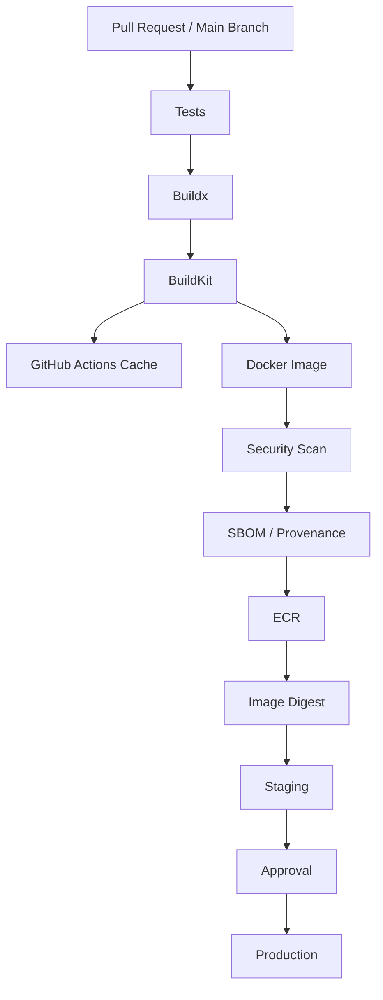

# 11- Docker Layer Caching

## Overview

Docker layer caching is one of the most important techniques for reducing container build time and CI/CD cost.

A Docker image is assembled from filesystem layers generated by Dockerfile instructions. When BuildKit can reuse a previously computed result, it avoids repeating expensive operations such as:

- Installing Python dependencies
- Installing Node dependencies
- Compiling native extensions
- Downloading system packages
- Building application assets
- Running expensive build commands

In GitHub Actions, this becomes especially important because GitHub-hosted runners are typically ephemeral. A runner may disappear after one workflow run, taking its local Docker build cache with it.

A production pipeline therefore commonly uses persistent cache storage:

```text
Git Commit
    ↓
GitHub Actions Runner
    ↓
Buildx / BuildKit
    ↓
Restore Build Cache
    ↓
Docker Build
    ↓
Reuse Cached Layers
    ↓
Build New Layers
    ↓
Push Image
    ↓
Export Updated Cache
```

The key principle is:

> Docker caching should reduce build work without changing build correctness.

Caching is an optimization. The Docker image itself remains the deployable artifact.

---

## Docker Layers

A Dockerfile is transformed into a sequence of build operations.

Consider:

```dockerfile
FROM python:3.12-slim

WORKDIR /app

COPY requirements.txt .

RUN pip install --no-cache-dir -r requirements.txt

COPY . .

CMD ["gunicorn", "config.wsgi:application"]
```

Conceptually, the image contains layers corresponding to build operations:

```text
Base Image
    ↓
WORKDIR
    ↓
requirements.txt
    ↓
pip install
    ↓
Application Source
    ↓
Runtime Configuration
```

When a layer can be reused, BuildKit does not need to execute the associated operation again.

---

## Why Layer Caching Matters

Without effective caching:

```text
Commit A
  ↓
Install dependencies
  ↓
Build application
  ↓
Push image

Commit B
  ↓
Install dependencies again
  ↓
Build application again
  ↓
Push image
```

With effective caching:

```text
Commit A
  ↓
Install dependencies
  ↓
Build application
  ↓
Export cache

Commit B
  ↓
Restore cache
  ↓
Reuse dependency layer
  ↓
Build changed application layer
```

For a Python service with hundreds of dependencies, the difference can be substantial.

---

## Build Cache vs Docker Image

These are different concepts.

| Resource | Purpose |
|---|---|
| Docker image | Deployable application artifact |
| Docker layer | Component of an image |
| Build cache | Reusable intermediate build results |
| GitHub Actions artifact | File produced by a workflow |
| GitHub Actions cache | Persistent CI optimization data |
| Registry cache | Build cache stored in a container registry |

A cache should never be treated as the authoritative production artifact.

---

## How Docker Layer Caching Works

BuildKit evaluates the build graph and determines whether an operation can reuse an existing result.

Conceptually:

```text
Dockerfile Instruction
        ↓
Input State
        ↓
BuildKit Cache Lookup
        ↓
 ┌──────┴──────┐
 │             │
Hit           Miss
 │             │
Reuse        Execute
 │             │
 └──────┬──────┘
        ↓
Next Instruction
```

A cache hit means the build result can be reused.

A cache miss causes BuildKit to execute the operation again.

---

## Cache Invalidation

Caching is only useful when you understand invalidation.

For example:

```dockerfile
COPY requirements.txt .

RUN pip install --no-cache-dir -r requirements.txt

COPY . .
```

If only:

```text
app/views.py
```

changes, the dependency installation layer can remain cached.

If:

```text
requirements.txt
```

changes, the dependency installation layer needs to be rebuilt.

This is the desired behavior.

---

## Layer Ordering

Dockerfile ordering has a major effect on cache efficiency.

### Inefficient Ordering

```dockerfile
COPY . .

RUN pip install --no-cache-dir -r requirements.txt
```

A source-code change may invalidate the layer containing the entire application context before dependency installation.

### Better Ordering

```dockerfile
COPY requirements.txt .

RUN pip install --no-cache-dir -r requirements.txt

COPY . .
```

Now dependency installation depends primarily on the dependency manifest.

---

## Python Dependency Caching

For Python applications:

```dockerfile
COPY requirements.txt .

RUN pip install --no-cache-dir -r requirements.txt

COPY . .
```

For Poetry:

```dockerfile
COPY pyproject.toml poetry.lock .

RUN poetry install --no-interaction --no-ansi --no-root

COPY . .
```

For `uv`:

```dockerfile
COPY pyproject.toml uv.lock .

RUN uv sync --frozen --no-install-project

COPY . .
```

The exact dependency-management strategy can vary, but the principle is the same:

```text
Dependency Metadata
        ↓
Dependency Installation
        ↓
Application Source
```

---

## Node Dependency Caching

A Node-based build should similarly separate dependency metadata:

```dockerfile
COPY package.json package-lock.json .

RUN npm ci

COPY . .

RUN npm run build
```

Avoid:

```dockerfile
COPY . .

RUN npm ci
```

when source changes frequently but dependencies change relatively rarely.

---

## Dockerfile Cache Boundaries

A useful mental model is:

```text
Stable Inputs
     ↓
Expensive Operation
     ↓
Cache Boundary
     ↓
Frequently Changing Inputs
```

For a Python backend:

```text
Base Image
     ↓
OS Dependencies
     ↓
requirements.txt
     ↓
pip install
     ↓
Application Source
     ↓
Runtime Configuration
```

Place frequently changing content later whenever practical.

---

## `.dockerignore`

The build context also affects caching.

Example:

```text
.git
.github
.env
.env.*
.venv
__pycache__
*.pyc
.pytest_cache
.coverage
htmlcov
node_modules
dist
build
```

A large context can:

- Increase upload time
- Increase hashing work
- Increase build overhead
- Accidentally include sensitive files
- Reduce operational efficiency

Keep the build context as small as practical.

---

## Cache Sources and Destinations

Buildx uses two important concepts:

```text
cache-from
```

and:

```text
cache-to
```

`cache-from` specifies where BuildKit should retrieve existing cache data.

`cache-to` specifies where BuildKit should export cache data.

Example:

```yaml
cache-from: type=gha
cache-to: type=gha,mode=max
```

The flow is:

```text
Previous Build
     ↓
cache-to
     ↓
Persistent Cache
     ↓
cache-from
     ↓
Current Build
```

---

## GitHub Actions Cache

GitHub Actions provides a BuildKit cache backend.

A common configuration is:

```yaml
- name: Set up Buildx
  uses: docker/setup-buildx-action@v3

- name: Build image
  uses: docker/build-push-action@v6
  with:
    context: .
    push: false
    tags: backend:${{ github.sha }}
    cache-from: type=gha
    cache-to: type=gha,mode=max
```

This is particularly useful with GitHub-hosted runners.

---

## Why GitHub Cache Is Important

GitHub-hosted runners are generally ephemeral:

```text
Runner A
   ↓
Build
   ↓
Local Docker Cache
   ↓
Runner Destroyed
   ↓
Local Cache Lost
```

With GitHub Actions cache:

```text
Runner A
   ↓
Build
   ↓
Export Cache
   ↓
GitHub Cache

Runner B
   ↓
Restore Cache
   ↓
Reuse Layers
```

This allows independent runners to benefit from previous builds.

---

## `type=gha`

The GitHub Actions cache backend can be configured as:

```yaml
cache-from: type=gha
cache-to: type=gha,mode=max
```

This integrates BuildKit cache storage with the GitHub Actions caching infrastructure.

It is convenient when the CI platform is GitHub Actions and the cache does not need to be shared broadly with other CI systems.

---

## Cache Mode

BuildKit supports cache export modes such as:

```text
mode=min
mode=max
```

### `mode=min`

Exports a smaller cache focused on the final image result.

### `mode=max`

Exports more intermediate build information.

Example:

```yaml
cache-to: type=gha,mode=max
```

`mode=max` can provide better cache reuse for complex multi-stage builds but may consume more cache storage.

---

## When to Use `mode=max`

`mode=max` is useful when:

- Dockerfiles contain multiple stages
- Intermediate stages are expensive
- CI builds frequently change
- Build reuse is important
- The cache storage budget is acceptable

Do not enable it blindly for every repository without observing cache usage and build performance.

---

## Registry-Based Build Cache

BuildKit can store cache data in a container registry.

Example:

```yaml
cache-from: type=registry,ref=123456789012.dkr.ecr.ap-south-1.amazonaws.com/backend:buildcache
cache-to: type=registry,ref=123456789012.dkr.ecr.ap-south-1.amazonaws.com/backend:buildcache,mode=max
```

The architecture becomes:

```text
GitHub Actions
      ↓
Buildx
      ↓
BuildKit
      ├──────────────→ ECR Image
      │
      └──────────────→ ECR Build Cache
```

---

## GitHub Cache vs Registry Cache

| Characteristic | GitHub Actions Cache | Registry Cache |
|---|---|---|
| GitHub integration | Excellent | Good |
| Setup complexity | Low | Medium |
| Shared with other CI systems | Limited | Strong |
| Centralized registry architecture | No | Yes |
| Works naturally with ECR | Not registry-native | Yes |
| Operational control | Lower | Higher |
| Useful for enterprise build infrastructure | Yes | Often |

Use the backend that fits the broader CI/CD architecture.

---

## Registry Cache in AWS

For AWS-centric environments, ECR can act as both:

```text
Image Registry
```

and:

```text
Build Cache Registry
```

Conceptually:

```text
ECR
├── backend image
├── worker image
└── build cache
```

This can simplify centralized cache management across multiple repositories or CI systems.

---

## Cache Scope

A cache should not accidentally mix unrelated build configurations.

For example:

```text
backend-api
backend-worker
frontend
```

may need independent cache namespaces.

A useful convention is:

```text
backend-api:buildcache
backend-worker:buildcache
frontend:buildcache
```

This reduces accidental cache collisions.

---

## Branch and Cache Reuse

A production CI system may want cache reuse across branches.

For example:

```text
main
  ↓
Shared base cache

feature/login
  ↓
Restore compatible cache
```

However, cache reuse must not weaken security boundaries or cause untrusted code to influence trusted builds.

For pull requests from untrusted forks, be particularly careful about what cache data can be restored or modified.

---

## Cache Security

Caches can contain information derived from build inputs.

Treat caches as potentially sensitive.

Avoid allowing secrets to become part of cached layers.

Bad:

```dockerfile
ARG TOKEN

RUN curl -H "Authorization: Bearer $TOKEN" ...
```

Even if the final image does not contain the token, poorly designed build steps can create undesirable cache or layer exposure.

Prefer BuildKit secret mounts.

---

## BuildKit Secret Mounts

Example:

```yaml
- name: Build image
  uses: docker/build-push-action@v6
  with:
    context: .
    secrets: |
      private_token=${{ secrets.PRIVATE_TOKEN }}
```

Dockerfile:

```dockerfile
RUN --mount=type=secret,id=private_token \
    ./install-private-dependencies.sh
```

The secret is mounted only for the duration of the build step.

Do not copy it into the image filesystem.

---

## Cache Poisoning

A cache poisoning scenario can occur when untrusted build input influences cached results that are later consumed by a trusted build.

Conceptually:

```text
Untrusted Build
      ↓
Shared Cache
      ↓
Trusted Build
      ↓
Unexpected Build Result
```

Cache sharing therefore needs to respect trust boundaries.

Do not treat caches as trusted source artifacts.

---

## Pull Request Cache Boundaries

A secure architecture separates:

```text
Untrusted PR Build
```

from:

```text
Trusted Release Build
```

especially when the trusted build has:

- AWS credentials
- Registry write access
- Signing credentials
- Production deployment permissions

A cache should never become a mechanism for bypassing those security boundaries.

---

## Build Cache and `pull_request_target`

Be particularly cautious when combining:

```text
pull_request_target
```

with:

```text
checkout of PR code
```

and:

```text
privileged Buildx execution
```

A Docker build executes Dockerfile instructions.

Therefore:

```text
Untrusted PR
   ↓
Dockerfile
   ↓
Buildx
   ↓
Code Execution
```

should not receive production credentials merely because the workflow is triggered through a privileged event.

---

## Cache and Immutable Artifacts

Cache data is mutable optimization state.

Production artifacts should be immutable.

The recommended relationship is:

```text
Build Cache
     ↓
Faster Build
     ↓
Immutable Image
     ↓
Image Digest
     ↓
Promotion
```

Do not deploy the cache.

Deploy the image.

---

## Build Once, Deploy Many

A production pipeline should build an image once:

```text
Source
  ↓
Buildx
  ↓
Image
  ↓
ECR
  ↓
Digest
  ↓
Staging
  ↓
Approval
  ↓
Production
```

The same digest should be promoted between environments.

Caching improves the build stage but does not change this deployment principle.

---

## Docker Image Tags and Cache Tags

Do not confuse application image tags with cache references.

For example:

```text
backend:7f3a8e2
```

can identify an application image.

While:

```text
backend:buildcache
```

can represent build cache state.

These have different lifecycle requirements.

---

## Cache Retention

Cache storage should have a lifecycle policy.

Consider:

- Cache size
- Retention period
- Branch count
- Repository count
- Build frequency
- Storage cost
- Cache usefulness

An unlimited cache is not automatically better.

A stale cache can consume resources without providing meaningful build acceleration.

---

## Cache Hit Rate

Monitor cache effectiveness.

A useful metric is:

```text
Cache Hit Rate =
Reused Build Work
-----------------
Total Build Work
```

Other useful metrics include:

- Build duration
- Cache restore duration
- Cache export duration
- Cache size
- Cache miss frequency
- Dependency-install time
- Image build time

A cache that takes longer to restore than it saves may not be worthwhile.

---

## Build Time Decomposition

When investigating slow builds, measure:

```text
Build Time
├── Context transfer
├── Base image pull
├── Dependency installation
├── Compilation
├── Application build
├── Cache restore
├── Cache export
└── Image push
```

Do not assume Docker layer caching is the only bottleneck.

---

## Cache Performance Trade-Off

A simplified model is:

```text
Total Time =
Cache Restore
+ Cache Processing
+ Actual Build
+ Cache Export
```

A larger cache can reduce:

```text
Actual Build
```

but increase:

```text
Cache Restore
Cache Export
Storage
```

The optimal configuration depends on workload characteristics.

---

## Multi-Stage Builds and Caching

Consider:

```dockerfile
FROM python:3.12-slim AS builder

WORKDIR /build

COPY requirements.txt .

RUN python -m venv /opt/venv \
    && /opt/venv/bin/pip install --no-cache-dir -r requirements.txt


FROM python:3.12-slim AS runtime

WORKDIR /app

COPY --from=builder /opt/venv /opt/venv
COPY . .

ENV PATH="/opt/venv/bin:$PATH"

CMD ["gunicorn", "config.wsgi:application"]
```

The expensive dependency stage can be cached independently from the application source stage.

---

## Test and Production Targets

A multi-stage Dockerfile can separate test and production dependencies:

```dockerfile
FROM python:3.12-slim AS base

WORKDIR /app

COPY requirements.txt .

RUN pip install --no-cache-dir -r requirements.txt


FROM base AS test

COPY requirements-test.txt .

RUN pip install --no-cache-dir -r requirements-test.txt

COPY . .

RUN pytest


FROM base AS production

COPY . .

USER 10001

CMD ["gunicorn", "config.wsgi:application"]
```

The test stage can be built independently:

```yaml
- name: Build test target
  uses: docker/build-push-action@v6
  with:
    context: .
    target: test
    load: true
    tags: backend:test
    cache-from: type=gha
    cache-to: type=gha,mode=max
```

---

## Buildx Cache and CI Matrix

Suppose a workflow tests:

```text
Python 3.11
Python 3.12
Python 3.13
```

and databases:

```text
PostgreSQL
MySQL
```

This produces six combinations.

Do not automatically create six independent expensive Docker builds unless each combination genuinely requires a different image.

Testing matrices and image-build matrices solve different problems.

---

## Matrix-Aware Cache Design

For genuinely different images, cache namespaces can include matrix dimensions.

Conceptually:

```text
backend-python311
backend-python312
backend-python313
```

However, unnecessary cache fragmentation reduces reuse.

Prefer a shared cache when the build inputs are compatible.

---

## Monorepo Cache Strategy

For a monorepo:

```text
services/
├── users/
├── orders/
├── payments/
└── notifications/
```

Use separate image and cache identities:

```text
users:buildcache
orders:buildcache
payments:buildcache
notifications:buildcache
```

Then combine this with change detection:

```text
Git Diff
   ↓
Changed Services
   ↓
Dynamic Matrix
   ↓
Buildx
   ↓
Service-specific Cache
```

This avoids rebuilding unaffected services.

---

## Shared Base Images

Organizations with many Python services can standardize base images:

```text
company/python-runtime:3.12
```

Then:

```text
Django Service
      ↓
FastAPI Service
      ↓
Celery Service
      ↓
Shared Base
```

Benefits include:

- Consistent OS packages
- Consistent Python version
- Common security updates
- Smaller application Dockerfiles
- Potentially better cache reuse

However, tightly coupling every service to a shared base image can increase release coordination.

---

## Base Image Updates

A base image change invalidates dependent layers.

For example:

```text
python:3.12-slim
      ↓
System Dependencies
      ↓
Python Dependencies
      ↓
Application
```

When the base image changes, downstream layers may need to rebuild.

This is expected and important for security updates.

Do not optimize caching in a way that prevents necessary base-image refreshes.

---

## Dependency Lock Files

Use deterministic dependency inputs where possible.

Examples:

```text
requirements.txt
requirements.lock
poetry.lock
uv.lock
package-lock.json
```

This improves both reproducibility and cache correctness.

A cache should represent a known build input state rather than an undocumented collection of dependency versions.

---

## Reproducibility

A cache hit should produce the same intended build result as executing the operation again with the same inputs.

Therefore:

- Pin important dependencies
- Use lock files
- Control base images
- Avoid time-dependent build commands
- Avoid network-dependent nondeterminism where practical

Caching should not become a source of hidden build state.

---

## Cache Busting

Sometimes an explicit cache invalidation mechanism is useful.

For example:

```yaml
build-arg: |
  CACHE_BUST=${{ github.run_id }}
```

But this forces invalidation and defeats caching.

Do not add arbitrary cache-busting arguments unless there is a specific correctness reason.

A better approach is to identify the actual input that should invalidate the layer.

---

## Cache Busting Anti-Pattern

Avoid:

```dockerfile
ARG CACHE_BUST
RUN echo "$CACHE_BUST"
```

combined with:

```yaml
CACHE_BUST: ${{ github.sha }}
```

for every build.

This effectively tells Docker:

```text
Every commit → rebuild
```

which removes much of the benefit of layer caching.

---

## Package Manager Caches

Docker layer caching and package-manager caching are different mechanisms.

For example:

```text
Docker Layer Cache
       ↓
pip install result
```

versus:

```text
pip download/cache
       ↓
Package archives
```

BuildKit also supports cache mounts for some build workloads.

Example:

```dockerfile
RUN --mount=type=cache,target=/root/.cache/pip \
    pip install -r requirements.txt
```

This can allow package downloads to be reused without embedding the package cache into the final image.

---

## Cache Mounts

Cache mounts are different from layer cache.

A layer cache reuses the result of an entire build operation.

A cache mount provides persistent build-time storage to an operation.

Conceptually:

```text
RUN pip install
      │
      └── /root/.cache/pip
              ↓
         Cache Mount
```

Example:

```dockerfile
RUN --mount=type=cache,target=/root/.cache/pip \
    pip install -r requirements.txt
```

This can be useful when the command itself must execute but can reuse downloaded package data.

---

## Layer Cache vs Cache Mount

| Mechanism | Reuses | Typical Benefit |
|---|---|---|
| Layer cache | Complete build result | Skip operation |
| Cache mount | Build-time files | Avoid repeated downloads |
| GitHub Actions cache | Persistent CI cache | Preserve cache across runners |
| Registry cache | BuildKit cache | Share cache through registry |

These mechanisms can be combined.

---

## Cache Mount with Python

Example:

```dockerfile
FROM python:3.12-slim

WORKDIR /app

COPY requirements.txt .

RUN --mount=type=cache,target=/root/.cache/pip \
    pip install -r requirements.txt

COPY . .
```

The package download cache is separate from the final image.

This can be particularly useful when dependency installation must still execute but package downloads are expensive.

---

## Cache Mount with npm

```dockerfile
COPY package.json package-lock.json .

RUN --mount=type=cache,target=/root/.npm \
    npm ci

COPY . .

RUN npm run build
```

The npm cache remains build-time state rather than application runtime state.

---

## Cache Invalidation and Security Updates

Caching must not prevent security updates.

For example:

```text
Base Image
   ↓
OS Packages
   ↓
Application Dependencies
```

If the base image has a security update, rebuild dependent layers.

A long-lived cache should never be treated as evidence that a dependency is current.

---

## Vulnerability Scanning

A production image pipeline can perform:

```text
Buildx
   ↓
Image
   ↓
Vulnerability Scan
   ↓
SBOM
   ↓
Provenance
   ↓
Registry
```

Caching accelerates the build stage but should not bypass security validation.

---

## Buildx Cache and SBOM

An SBOM describes the contents of the image.

The cache describes how the image was built.

They serve different purposes:

| Data | Purpose |
|---|---|
| Build cache | Faster future builds |
| Image | Runtime artifact |
| SBOM | Dependency inventory |
| Provenance | Build origin and metadata |
| Signature | Artifact authenticity/integrity |

Do not substitute one for another.

---

## GitHub Actions Example

A production-oriented Python image build might look like:

```yaml
name: Build Container

on:
  push:
    branches:
      - main

permissions:
  contents: read
  id-token: write

jobs:
  build:
    runs-on: ubuntu-latest

    steps:
      - name: Checkout
        uses: actions/checkout@v4

      - name: Set up Buildx
        uses: docker/setup-buildx-action@v3

      - name: Build image
        uses: docker/build-push-action@v6
        with:
          context: .
          push: false
          tags: backend:${{ github.sha }}
          cache-from: type=gha
          cache-to: type=gha,mode=max
```

The cache is used only to accelerate the build.

---

## ECR Build Cache Example

```yaml
- name: Configure AWS credentials
  uses: aws-actions/configure-aws-credentials@v4
  with:
    role-to-assume: ${{ vars.AWS_ECR_ROLE_ARN }}
    aws-region: ap-south-1

- name: Login to ECR
  id: ecr
  uses: aws-actions/amazon-ecr-login@v2

- name: Build and push
  uses: docker/build-push-action@v6
  with:
    context: .
    push: true
    tags: ${{ steps.ecr.outputs.registry }}/backend:${{ github.sha }}
    cache-from: type=registry,ref=${{ steps.ecr.outputs.registry }}/backend:buildcache
    cache-to: type=registry,ref=${{ steps.ecr.outputs.registry }}/backend:buildcache,mode=max
```

The IAM role should have only the permissions necessary for the intended ECR operations.

---

## AWS OIDC and Cache Security

For AWS-based registry caching, GitHub Actions should preferably use OIDC:

```text
GitHub Actions
      ↓
OIDC Token
      ↓
AWS STS
      ↓
IAM Role
      ↓
ECR
```

Avoid storing long-lived AWS access keys in GitHub secrets when OIDC can provide short-lived credentials.

---

## IAM Permissions

The role used by a build workflow should be narrowly scoped.

A publishing workflow may require ECR permissions such as:

```text
ecr:GetAuthorizationToken
ecr:BatchCheckLayerAvailability
ecr:InitiateLayerUpload
ecr:UploadLayerPart
ecr:CompleteLayerUpload
ecr:PutImage
```

The exact policy should be based on the operations performed and AWS's current authorization model.

Do not grant:

```text
AdministratorAccess
```

merely because the workflow needs to publish an image.

---

## Cache and Deployment Environments

Cache configuration belongs to the build system.

Environment configuration belongs to deployment.

Keep the distinction clear:

```text
Build
 ├── Dockerfile
 ├── Dependencies
 ├── Cache
 └── Image

Deployment
 ├── Environment
 ├── Secrets
 ├── Configuration
 └── Runtime Infrastructure
```

Do not embed staging or production secrets into cached build layers.

---

## Cache and Environment Promotion

A sound architecture is:

```text
Build
  ↓
Cache-assisted
  ↓
Immutable Image
  ↓
ECR
  ↓
Staging
  ↓
Approval
  ↓
Production
```

The cache affects how quickly the image is created.

It does not determine which environment receives the image.

---

## Reliability Considerations

A cache should be treated as optional infrastructure.

If the cache becomes unavailable:

```text
Cache unavailable
      ↓
Build continues without cache
      ↓
Longer build
```

A robust pipeline should not make production releases impossible merely because an optimization cache is temporarily unavailable.

This is especially important for registry-backed caches.

---

## Cache Failure Domain

The cache should be isolated from the deployable artifact.

For example:

```text
Cache Failure
   ↓
Build Slower
   ↓
Image Still Buildable
```

rather than:

```text
Cache Failure
   ↓
No Artifact
   ↓
Production Recovery Blocked
```

A build pipeline should retain a cold-build path.

---

## High Availability

For critical build systems:

- Maintain reliable registry access
- Keep a cold-build path
- Avoid dependence on a single cache namespace
- Use hosted runners or resilient self-hosted infrastructure
- Keep production image retention independent of cache retention

The image registry and cache may use the same platform but should be treated as different operational resources.

---

## Disaster Recovery

A previous production image should remain available independently of the build cache.

For example:

```text
ECR
├── Production Image
│     └── sha256:...
│
└── Build Cache
      └── Intermediate Build State
```

If the cache is deleted, production should still be recoverable from the immutable image.

---

## Cache Eviction

Cache eviction is normal.

A build must not assume that:

```text
cache entry exists forever
```

After eviction:

```text
Cache Miss
   ↓
Rebuild Layer
   ↓
Export New Cache
```

This is acceptable behavior.

---

## Operational Monitoring

Track:

- Build duration
- Cache hit rate
- Cache restore time
- Cache export time
- Cache size
- Image size
- Dependency installation time
- Build failure rate
- Registry push duration

A useful dashboard might show:

```text
Build Duration
Cache Hit Rate
Image Size
Registry Push Time
Build Failure Rate
```

---

## GitHub Actions Step Summary

For operational visibility, workflows can publish a concise summary.

Example:

```yaml
- name: Build summary
  if: always()
  run: |
    {
      echo "## Docker Build"
      echo ""
      echo "- Commit: $GITHUB_SHA"
      echo "- Image: backend"
      echo "- Cache: BuildKit/GitHub Actions"
    } >> "$GITHUB_STEP_SUMMARY"
```

This makes build information easier to inspect without searching raw logs.

---

## Debugging Cache Behavior

When investigating a cache issue, first establish:

```text
Is the cache available?
        ↓
Was it restored?
        ↓
Did BuildKit find matching inputs?
        ↓
Did Dockerfile ordering invalidate the layer?
        ↓
Was the cache exported?
```

Do not start by changing Dockerfile instructions blindly.

---

## Useful Docker Commands

List builders:

```bash
docker buildx ls
```

Inspect a builder:

```bash
docker buildx inspect --bootstrap
```

Build with local loading:

```bash
docker buildx build \
  --load \
  --tag backend:test \
  .
```

Build and push:

```bash
docker buildx build \
  --push \
  --tag registry.example.com/backend:${GITHUB_SHA} \
  .
```

Build for multiple platforms:

```bash
docker buildx build \
  --platform linux/amd64,linux/arm64 \
  --push \
  --tag registry.example.com/backend:${GITHUB_SHA} \
  .
```

---

## GitHub CLI Operations

Inspect workflow runs:

```bash
gh run list
```

Inspect a run:

```bash
gh run view RUN_ID
```

View logs:

```bash
gh run view RUN_ID --log
```

Rerun a workflow:

```bash
gh run rerun RUN_ID
```

These commands are useful when investigating build or cache behavior in CI.

---

## Troubleshooting Workflow

Use the following failure-domain model:

```text
Symptom
   ↓
Possible Causes
   ↓
Isolation Strategy
   ↓
Commands / Checks
   ↓
Root Cause
   ↓
Corrective Action
   ↓
Prevention
```

---

## Cache Miss Troubleshooting

### Symptom

The Docker build is unexpectedly slow.

### Possible Causes

- Cache was not restored
- Cache key/backend changed
- Dockerfile ordering is poor
- Dependency manifest changed
- Build context changed
- Base image changed
- Cache was evicted

### Checks

Inspect workflow configuration:

```yaml
cache-from: type=gha
cache-to: type=gha,mode=max
```

Then inspect BuildKit build logs.

### Corrective Action

Fix the actual cache invalidation cause rather than introducing arbitrary cache-busting.

---

## Cache Restore Failure

### Symptom

The workflow reports cache retrieval problems.

### Possible Causes

- Cache backend unavailable
- Permissions
- Storage limits
- Invalid cache configuration
- Cache corruption
- Registry authentication failure

### Isolation

Temporarily perform a cold build.

```bash
docker buildx build \
  --no-cache \
  --load \
  --tag backend:test \
  .
```

If the cold build succeeds, investigate the cache path independently.

---

## Registry Cache Failure

### Symptom

Image builds successfully but registry cache export fails.

### Possible Causes

- Authentication failure
- Missing ECR permissions
- Repository missing
- Region mismatch
- Registry network failure
- Cache reference misconfiguration

Check:

```bash
aws sts get-caller-identity
```

Then:

```bash
aws ecr describe-repositories \
  --repository-names backend \
  --region ap-south-1
```

---

## Dockerfile Cache Failure

### Symptom

A dependency installation layer rebuilds on every commit.

### Likely Cause

Application source is copied before dependency installation:

```dockerfile
COPY . .

RUN pip install -r requirements.txt
```

### Corrective Action

Use:

```dockerfile
COPY requirements.txt .

RUN pip install -r requirements.txt

COPY . .
```

---

## Cache Is Present but Build Is Still Slow

A cache hit does not guarantee a fast build.

Possible causes:

- Expensive cache restore
- Large cache
- Slow network
- Large image layers
- Expensive uncached stage
- Multi-platform emulation
- Large build context

Measure each phase before optimizing.

---

## Production Architecture

A production GitHub Actions build architecture can use:



The cache is intentionally positioned as an optimization alongside the image build rather than as part of the deployment artifact chain.

---

## Enterprise Cache Architecture

For multiple backend services:

```text
                         Build Platform
                              │
                 ┌────────────┴────────────┐
                 │                         │
             GitHub Actions            Other CI
                 │                         │
                 └────────────┬────────────┘
                              ↓
                         Buildx/BuildKit
                              │
                 ┌────────────┴────────────┐
                 │                         │
          Registry Cache               Image Registry
                 │                         │
       ┌─────────┼─────────┐               │
       │         │         │               │
   API Cache Worker Cache Frontend Cache   │
                                           ↓
                                     Immutable Images
```

This model is useful when several services or CI platforms need shared build infrastructure.

---

## Security Architecture

A secure build pipeline separates:

```text
Untrusted Source
      ↓
Validation
      ↓
Trusted Build
      ↓
Artifact
      ↓
Registry
      ↓
Deployment
```

Credentials should be introduced only at the stage where they are necessary.

For example:

```text
Unit Tests
   ↓
No AWS Credentials

Build
   ↓
No Production Credentials

Publish
   ↓
Scoped ECR Role

Deploy
   ↓
Environment-Specific Role
```

---

## Common Mistakes

### Copying the Entire Repository Before Dependency Installation

Bad:

```dockerfile
COPY . .
RUN pip install -r requirements.txt
```

This causes unnecessary invalidation.

Use dependency-first copying.

### Assuming Local Cache Persists on GitHub-Hosted Runners

Ephemeral runners do not provide durable local build cache across workflow runs.

Use an external cache backend.

### Treating Cache as a Production Artifact

Cache data is an optimization and can disappear.

Production must depend on the immutable image, not the cache.

### Sharing Caches Across Trust Boundaries

Avoid allowing untrusted builds to influence trusted production builds through shared cache state.

### Using Arbitrary Cache-Busting

A commit SHA as a universal cache-busting argument defeats layer reuse.

Invalidate based on actual build inputs.

### Ignoring Build Context Size

A huge context slows CI and may accidentally expose sensitive files.

Use `.dockerignore`.

### Over-Optimizing Cache Storage

A massive cache may cost more in storage and transfer than it saves in build time.

Measure before increasing cache scope.

### Assuming Cache Hits Mean Correct Builds

Cache correctness depends on accurate build inputs.

Use lock files, deterministic dependency management, and correct Dockerfile structure.

---

## Production Checklist

### Dockerfile

- [ ] Stable operations appear before frequently changing source
- [ ] Dependency manifests are copied separately
- [ ] Multi-stage builds are used where appropriate
- [ ] `.dockerignore` is configured
- [ ] Secrets are not copied into images
- [ ] Build arguments are not used as secret storage
- [ ] Base images are maintained

### Buildx

- [ ] Buildx is explicitly configured in CI
- [ ] Appropriate builder is selected
- [ ] Cache source is configured
- [ ] Cache destination is configured
- [ ] `--load` is used only when required
- [ ] `--push` is used for direct registry publishing
- [ ] Multi-platform builds are tested when required

### Cache

- [ ] Cache namespace is appropriate
- [ ] Cache does not cross trust boundaries
- [ ] Cache retention is understood
- [ ] Cache size is monitored
- [ ] Cold builds still work
- [ ] Cache failures do not corrupt production artifacts

### Security

- [ ] GITHUB_TOKEN permissions are minimized
- [ ] AWS uses OIDC where appropriate
- [ ] Build secrets use secure BuildKit mechanisms
- [ ] Untrusted PR builds do not receive production credentials
- [ ] Third-party actions are trusted and appropriately pinned
- [ ] Images are scanned
- [ ] SBOM/provenance requirements are defined

### Deployment

- [ ] Images receive immutable identifiers
- [ ] Digests are recorded
- [ ] Staging and production use the same artifact
- [ ] Deployment concurrency is controlled
- [ ] Previous production images remain available for rollback

---

## Senior Design Principles

A production-grade Docker caching strategy should follow these principles:

### Optimize Build Inputs

Caching works best when expensive operations have stable, explicit inputs.

### Cache the Build, Not the Release

Build cache accelerates creation of the artifact. It should not determine what gets deployed.

### Keep Trust Boundaries Explicit

A cache shared by untrusted and trusted workflows can become a security boundary.

### Prefer Deterministic Inputs

Lock files, controlled base images, and reproducible dependency installation improve cache correctness.

### Measure Before Optimizing

Track build duration, cache hit rate, restore cost, export cost, and storage usage.

### Preserve a Cold-Build Path

The build should remain functional if the cache disappears.

### Promote Immutable Artifacts

The final image digest, not the cache or mutable tag, should identify the production release.

---

## Interview Scenarios

### Scenario: Every Python Commit Reinstalls 500 MB of Dependencies

Explain how you would:

1. Inspect Dockerfile layer ordering.
2. Separate dependency manifests from source.
3. Configure Buildx cache.
4. Measure cache hit rate.
5. Verify that the dependency layer invalidates only when dependency inputs change.

### Scenario: GitHub Actions Builds Are Slow

Investigate:

```text
Build Context
    ↓
Cache Restore
    ↓
Base Image
    ↓
Dependencies
    ↓
Compilation
    ↓
Application Build
    ↓
Cache Export
    ↓
Registry Push
```

Do not assume the Docker cache is the only bottleneck.

### Scenario: ECR Cache Is Corrupted

Explain how you would:

- Validate AWS authentication.
- Validate ECR permissions.
- Test a cold build.
- Recreate the cache reference.
- Ensure the image artifact remains independent of cache state.

### Scenario: A Fork Pull Request Can Modify the Dockerfile

Explain why the build must be treated as untrusted code execution and why AWS publishing credentials should not be exposed to that workflow.

### Scenario: Production Must Use Exactly the Image Tested in Staging

Design:

```text
Buildx
  ↓
Image Digest
  ↓
ECR
  ↓
Staging
  ↓
Validation
  ↓
Approval
  ↓
Same Digest
  ↓
Production
```

Caching is used only to accelerate the initial build.

### Scenario: Ten Microservices Share One Monorepo

Explain how you would combine:

- Git diff detection
- Dynamic matrices
- Service-specific image tags
- Service-specific cache references
- Shared base images
- Buildx
- ECR
- Immutable digests

to avoid rebuilding unchanged services.

---

## Key Takeaways

- Docker layer caching reduces repeated build work by reusing valid BuildKit results; Dockerfile ordering and stable build inputs are the foundation of effective caching.
- GitHub-hosted runners are ephemeral, so production CI should use an appropriate persistent Buildx cache such as GitHub Actions cache or a registry-backed cache.
- Layer caches, cache mounts, GitHub Actions caches, Docker images, SBOMs, and provenance serve different purposes and should not be treated as interchangeable artifacts.
- Cache design must respect security boundaries: untrusted builds should not be able to poison trusted production build state or gain access to publishing credentials.
- The final production artifact should remain an immutable image identified by its digest; caching is an optimization that should improve build speed without becoming a dependency for deployment or recovery.