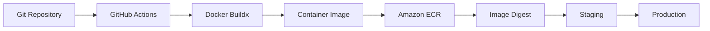
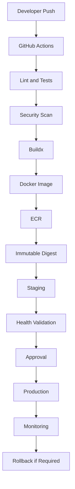
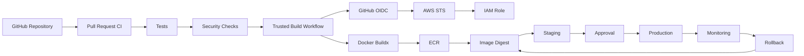

# 12- Amazon ECR Deployment

## Overview

Amazon Elastic Container Registry (ECR) is AWS's managed container image registry. In a production GitHub Actions pipeline, ECR commonly acts as the trusted artifact store between container image creation and deployment to services such as ECS, EKS, EC2, or Lambda.

A typical backend deployment pipeline is:

```text
Pull Request
    ↓
Lint / Unit Tests
    ↓
Integration Tests
    ↓
Security Scan
    ↓
Docker Buildx
    ↓
Docker Image
    ↓
Amazon ECR
    ↓
Immutable Image Digest
    ↓
Staging
    ↓
Approval
    ↓
Production
```

The important architectural principle is to separate **image creation** from **image deployment**.

GitHub Actions builds the image once, publishes it to ECR, records its immutable identity, and promotes that same artifact through environments.

---

## What Amazon ECR Is

Amazon ECR is a managed container registry for storing Docker and OCI-compatible container images.

A repository can contain multiple image versions:

```text
ECR Repository: backend

backend:sha-7f3a8e2
backend:sha-8a92d11
backend:v2.4.0
backend:v2.5.0
```

Each image is also associated with a content digest:

```text
backend@sha256:abc123...
```

The digest represents the immutable content identity of the image.

---

## Why ECR Is Important in CI/CD

ECR provides a controlled boundary between CI and deployment.

Without a registry:

```text
GitHub Actions
      ↓
Build Image
      ↓
Somehow transfer image
      ↓
Deployment
```

With ECR:

```text
GitHub Actions
      ↓
Buildx
      ↓
ECR
      ↓
ECS / EKS / EC2 / Lambda
```

This enables:

- Build once, deploy many
- Immutable image promotion
- Centralized image storage
- Image lifecycle management
- Vulnerability scanning
- IAM-controlled access
- Cross-service consumption
- Operational rollback

---

## ECR Architecture



ECR is therefore an artifact boundary rather than the deployment system itself.

---

## ECR Repository

An ECR repository stores images for a particular application or service.

A common naming strategy is:

```text
backend/api
backend/worker
backend/scheduler
frontend/web
```

or:

```text
production/backend-api
production/backend-worker
```

Choose a naming scheme that is predictable and works with your organization's repository, account, and environment model.

---

## Repository Design

For microservices:

```text
ECR
├── users
├── orders
├── payments
└── notifications
```

Each service can have an independent lifecycle.

This makes it easier to:

- Deploy services independently
- Apply service-specific lifecycle policies
- Control access
- Investigate image history
- Roll back individual services

---

## Account and Environment Strategies

Organizations commonly choose between:

```text
Single AWS Account
    └── ECR repositories
```

or:

```text
Development Account
    └── ECR

Staging Account
    └── ECR

Production Account
    └── ECR
```

A stronger environment boundary can use separate AWS accounts.

However, separate accounts increase operational complexity.

The important design decision is to define clearly:

```text
Who can push?
Who can pull?
Who can promote?
Who can delete?
```

---

## Image Lifecycle

A typical image lifecycle is:

```text
Source Commit
     ↓
Build
     ↓
Image
     ↓
ECR
     ↓
Scan
     ↓
Staging
     ↓
Approval
     ↓
Production
     ↓
Retention / Cleanup
```

The image should not be rebuilt between staging and production.

---

## Build Once, Deploy Many

The recommended production model is:

```text
Build
  ↓
Immutable Image
  ↓
ECR
  ↓
Digest
  ↓
Staging
  ↓
Approval
  ↓
Production
```

Avoid:

```text
Build
  ↓
Staging Image

Rebuild
  ↓
Production Image
```

The second approach creates two potentially different artifacts.

---

## Image Tags

Common tags include:

```text
backend:latest
backend:7f3a8e2
backend:v2.4.0
```

A commit SHA tag provides traceability:

```text
backend:sha-7f3a8e2
```

Semantic version tags provide release-oriented identity:

```text
backend:v2.4.0
```

`latest` is convenient for development but should generally not be the authoritative production identity.

---

## Image Digests

A digest looks like:

```text
backend@sha256:abc123...
```

Unlike a mutable tag, the digest identifies the image content.

Production deployments should preferably reference the digest.

The relationship is:

```text
Git Commit
    ↓
Docker Build
    ↓
Image
    ↓
Digest
    ↓
ECR
    ↓
Deployment
```

---

## Why Tags Alone Are Insufficient

Consider:

```text
backend:production
```

The tag could potentially point to different image content over time.

A deployment using:

```text
backend@sha256:abc123...
```

references a specific artifact.

This is especially important for:

- Rollbacks
- Auditing
- Incident response
- Reproducibility
- Supply-chain verification

---

## ECR Authentication

A GitHub Actions runner needs AWS credentials before it can authenticate with ECR.

A modern architecture uses GitHub OIDC:

```text
GitHub Actions
      ↓
OIDC Identity Token
      ↓
AWS STS
      ↓
IAM Role
      ↓
Temporary Credentials
      ↓
ECR Authentication
```

This avoids storing long-lived AWS access keys in GitHub secrets.

---

## GitHub OIDC

The workflow requires:

```yaml
permissions:
  contents: read
  id-token: write
```

Then AWS credentials can be obtained through an IAM role.

Example:

```yaml
- name: Configure AWS credentials
  uses: aws-actions/configure-aws-credentials@v4
  with:
    role-to-assume: ${{ vars.AWS_ECR_ROLE_ARN }}
    aws-region: ap-south-1
```

The IAM role should be restricted to the repositories, branches, environments, or workflow identities that genuinely need access.

---

## Why OIDC Is Preferable

Long-lived access keys create a persistent credential:

```text
GitHub Secret
      ↓
AWS Access Key
      ↓
Potentially long-lived access
```

OIDC provides:

```text
GitHub Workflow
      ↓
Short-lived identity
      ↓
AWS STS
      ↓
Temporary Credentials
```

This reduces the operational burden of rotating permanent AWS credentials.

---

## IAM Trust Policy

The IAM role's trust policy determines which GitHub identity can assume it.

A simplified structure is:

```json
{
  "Effect": "Allow",
  "Principal": {
    "Federated": "arn:aws:iam::<ACCOUNT_ID>:oidc-provider/token.actions.githubusercontent.com"
  },
  "Action": "sts:AssumeRoleWithWebIdentity",
  "Condition": {
    "StringEquals": {
      "token.actions.githubusercontent.com:aud": "sts.amazonaws.com"
    },
    "StringLike": {
      "token.actions.githubusercontent.com:sub": "repo:ORG/REPO:ref:refs/heads/main"
    }
  }
}
```

Production trust policies should be as specific as the deployment architecture permits.

---

## ECR Permissions

A build-and-push role generally needs permissions related to:

- Authentication
- Repository inspection
- Layer upload
- Image upload
- Image metadata

Typical permissions include:

```text
ecr:GetAuthorizationToken
ecr:BatchCheckLayerAvailability
ecr:InitiateLayerUpload
ecr:UploadLayerPart
ecr:CompleteLayerUpload
ecr:PutImage
```

The exact policy should be scoped to the required repositories and operations.

Do not grant broad AWS permissions merely because the workflow needs to publish an image.

---

## ECR Login from GitHub Actions

A common workflow uses the AWS-provided ECR login action:

```yaml
- name: Login to Amazon ECR
  id: ecr
  uses: aws-actions/amazon-ecr-login@v2
```

The registry endpoint can then be used by the Docker build step.

Example:

```yaml
- name: Build and push image
  uses: docker/build-push-action@v6
  with:
    context: .
    push: true
    tags: ${{ steps.ecr.outputs.registry }}/backend:${{ github.sha }}
```

---

## Complete ECR Build Example

```yaml
name: Build and Push

on:
  push:
    branches:
      - main

permissions:
  contents: read
  id-token: write

jobs:
  build:
    runs-on: ubuntu-latest

    steps:
      - name: Checkout
        uses: actions/checkout@v4

      - name: Configure AWS credentials
        uses: aws-actions/configure-aws-credentials@v4
        with:
          role-to-assume: ${{ vars.AWS_ECR_ROLE_ARN }}
          aws-region: ap-south-1

      - name: Login to ECR
        id: ecr
        uses: aws-actions/amazon-ecr-login@v2

      - name: Set up Docker Buildx
        uses: docker/setup-buildx-action@v3

      - name: Build and push
        uses: docker/build-push-action@v6
        with:
          context: .
          push: true
          tags: |
            ${{ steps.ecr.outputs.registry }}/backend:${{ github.sha }}
          cache-from: type=gha
          cache-to: type=gha,mode=max
```

---

## Docker Buildx with ECR

Buildx provides:

- Layer caching
- Multi-platform builds
- Registry publishing
- Build metadata
- BuildKit functionality

Example:

```yaml
- name: Build and push
  uses: docker/build-push-action@v6
  with:
    context: .
    platforms: linux/amd64,linux/arm64
    push: true
    tags: |
      ${{ steps.ecr.outputs.registry }}/backend:${{ github.sha }}
    cache-from: type=gha
    cache-to: type=gha,mode=max
```

Use multiple platforms only when the deployment infrastructure requires them.

---

## ECR Registry URI

An ECR registry commonly looks like:

```text
123456789012.dkr.ecr.ap-south-1.amazonaws.com
```

A repository image reference then becomes:

```text
123456789012.dkr.ecr.ap-south-1.amazonaws.com/backend:7f3a8e2
```

The region and account are part of the registry identity.

---

## ECR CLI

List repositories:

```bash
aws ecr describe-repositories \
  --region ap-south-1
```

Describe a repository:

```bash
aws ecr describe-repositories \
  --repository-names backend \
  --region ap-south-1
```

List images:

```bash
aws ecr list-images \
  --repository-name backend \
  --region ap-south-1
```

Describe images:

```bash
aws ecr describe-images \
  --repository-name backend \
  --region ap-south-1
```

These commands are useful for operational troubleshooting.

---

## Verify AWS Identity

Before debugging ECR permissions, verify which identity the workflow is using:

```bash
aws sts get-caller-identity
```

This is one of the most useful diagnostics for AWS CI/CD failures.

If the returned account or role is unexpected, investigate OIDC and IAM before changing ECR configuration.

---

## Create an ECR Repository

A repository can be created through the AWS CLI:

```bash
aws ecr create-repository \
  --repository-name backend \
  --region ap-south-1
```

Repository creation can also be managed through Terraform or CloudFormation.

For production infrastructure, infrastructure-as-code is generally preferable to manually created resources.

---

## Infrastructure as Code

Terraform example:

```hcl
resource "aws_ecr_repository" "backend" {
  name = "backend"

  image_scanning_configuration {
    scan_on_push = true
  }

  image_tag_mutability = "IMMUTABLE"
}
```

The exact configuration should reflect organizational requirements and current AWS capabilities.

---

## Immutable Tags

ECR can be configured to prevent image tags from being overwritten.

This can help enforce artifact immutability.

Conceptually:

```text
backend:7f3a8e2
        ↓
Image A

Attempt to reuse tag
        ↓
Rejected
```

This is useful when tags are intended to represent immutable release identities.

However, digest-based deployment remains the strongest artifact identity mechanism.

---

## Tagging Strategy

A practical release strategy may use:

```text
backend:sha-7f3a8e2
backend:v2.4.0
```

while recording:

```text
backend@sha256:...
```

for deployment.

The tag provides human-readable traceability.

The digest provides immutable identity.

---

## Metadata-Based Tagging

Docker's metadata action can generate consistent tags:

```yaml
- name: Docker metadata
  id: meta
  uses: docker/metadata-action@v5
  with:
    images: ${{ steps.ecr.outputs.registry }}/backend
    tags: |
      type=sha
      type=semver,pattern={{version}}
```

Then:

```yaml
- name: Build and push
  uses: docker/build-push-action@v6
  with:
    context: .
    push: true
    tags: ${{ steps.meta.outputs.tags }}
    labels: ${{ steps.meta.outputs.labels }}
```

This centralizes image tagging rules.

---

## Image Labels

OCI image labels can capture useful metadata:

```text
org.opencontainers.image.source
org.opencontainers.image.revision
org.opencontainers.image.version
```

This allows an operator to trace an image back to its source.

Useful metadata includes:

- Repository
- Commit SHA
- Release version
- Build system
- Build timestamp

---

## ECR Image Scanning

Image scanning helps identify vulnerabilities in image contents.

A production workflow can use:

```text
Build
  ↓
Push to ECR
  ↓
Vulnerability Scan
  ↓
Policy Decision
  ↓
Promotion
```

Scanning should not be treated as a substitute for secure dependency management.

It is one layer in a broader supply-chain security model.

---

## Dependency Security

A Python application may contain:

```text
Django
FastAPI
Celery
Redis client
PostgreSQL driver
Cryptography libraries
```

The image can also contain:

```text
OS packages
glibc
OpenSSL
system libraries
```

Therefore, image security requires considering both:

```text
Application Dependencies
```

and:

```text
Operating System Dependencies
```

---

## SBOM

An SBOM provides a structured inventory of software components inside the image.

Conceptually:

```text
ECR Image
   ├── Python
   ├── Django
   ├── FastAPI
   ├── PostgreSQL Driver
   ├── OpenSSL
   └── OS Packages
```

This becomes valuable during vulnerability investigation and incident response.

---

## Provenance and Attestations

A mature pipeline can associate build metadata with an image:

```text
Source Commit
     ↓
GitHub Workflow
     ↓
Buildx
     ↓
Image Digest
     ↓
Provenance
     ↓
ECR
```

This helps answer:

```text
Which source produced this image?
Which workflow built it?
Which commit was used?
Which artifact was deployed?
```

---

## ECR Lifecycle Policies

Container registries accumulate old images.

For example:

```text
backend
├── sha-001
├── sha-002
├── sha-003
├── ...
└── sha-5000
```

Without retention policies, storage grows continuously.

A lifecycle policy can automatically expire images according to defined rules.

---

## Lifecycle Strategy

A practical policy might retain:

- Recent release images
- Images currently used by production
- Recent rollback candidates
- A bounded number of older images

Avoid deleting artifacts that are still required for rollback.

---

## Production Rollback

If production currently runs:

```text
backend@sha256:NEW
```

and the release is unhealthy, rollback can use:

```text
backend@sha256:OLD
```

The registry therefore becomes part of the recovery architecture.

Keep sufficient historical images to support the organization's rollback and disaster-recovery requirements.

---

## ECR and ECS

A common deployment architecture is:

```text
GitHub Actions
      ↓
Buildx
      ↓
ECR
      ↓
ECS Task Definition
      ↓
ECS Service
      ↓
Load Balancer
      ↓
Users
```

The task definition references the ECR image.

A deployment workflow should update the task definition to the intended image digest or immutable image reference.

---

## ECS Deployment

The workflow can conceptually perform:

```text
Build Image
    ↓
Push ECR
    ↓
Record Digest
    ↓
Update ECS Task Definition
    ↓
Deploy ECS Service
    ↓
Wait for Stability
    ↓
Health Validation
```

The deployment should fail if the service cannot reach a healthy state.

---

## ECR and EKS

For Kubernetes:

```text
GitHub Actions
      ↓
ECR
      ↓
Kubernetes Deployment
      ↓
EKS
      ↓
Pods
```

The Kubernetes deployment can reference:

```yaml
image: 123456789012.dkr.ecr.ap-south-1.amazonaws.com/backend@sha256:abc123...
```

Using a digest prevents a later mutable tag change from silently altering the workload.

---

## ECR and EC2

An EC2-based deployment can:

```text
GitHub Actions
      ↓
ECR
      ↓
EC2 Instance
      ↓
docker pull
      ↓
docker run
```

The EC2 instance needs permission to authenticate and pull from ECR.

In production, use an IAM role attached to the instance rather than static AWS credentials.

---

## ECR and Lambda

Container-based Lambda functions can also use ECR.

The flow is:

```text
Buildx
   ↓
ECR
   ↓
Lambda Function
```

The image architecture must match the configured Lambda architecture.

Changes to the image require an explicit Lambda deployment operation.

---

## ECR and Kubernetes Image Pull Access

The CI role that pushes images and the runtime identity that pulls images should not necessarily be the same.

Prefer:

```text
GitHub Actions Role
    ↓
Push

Runtime Role
    ↓
Pull
```

This separation limits blast radius.

---

## Separation of Push and Pull Permissions

A production architecture should distinguish:

| Identity | Typical Responsibility |
|---|---|
| CI role | Push images |
| Deployment role | Update infrastructure |
| ECS/EKS runtime identity | Pull images |
| Developer identity | Inspect or pull as authorized |
| Security tooling | Scan/inspect images |

Do not give runtime workloads permission to overwrite images.

---

## Cross-Account ECR

Large organizations may separate:

```text
Build Account
       ↓
Central ECR Account
       ↓
Production Account
```

or:

```text
Non-Production ECR
       ↓
Production ECR
```

Cross-account access requires explicit IAM and repository policies.

The design should make ownership and promotion boundaries clear.

---

## Artifact Promotion Across Accounts

A mature architecture may use:

```text
Build Account
     ↓
ECR
     ↓
Security Validation
     ↓
Production Registry
     ↓
Production Deployment
```

The important invariant remains:

```text
Same Image Content
```

rather than rebuilding the image in the production account.

---

## Environment Promotion

GitHub Environments can provide deployment controls:

```text
development
    ↓
staging
    ↓
production
```

Production can require:

- Manual approval
- Restricted branches
- Environment-specific secrets
- Deployment protection
- Concurrency control

---

## Deployment Concurrency

Prevent multiple production deployments from racing:

```yaml
concurrency:
  group: production-backend
  cancel-in-progress: false
```

This is particularly important when deployments modify shared infrastructure or the same ECS/EKS service.

---

## Build Concurrency vs Deployment Concurrency

These are different concerns.

Multiple builds can often run concurrently:

```text
Commit A → Build
Commit B → Build
Commit C → Build
```

But production deployment may need serialization:

```text
Production
    ↓
Deployment A
    ↓
Deployment B
```

Do not automatically cancel every older build if it may still be required for investigation or release promotion.

---

## Approval Gates

A production workflow can require:

```text
Build
  ↓
ECR
  ↓
Staging
  ↓
Validation
  ↓
Approval
  ↓
Production
```

The approved artifact should be the same artifact tested in staging.

---

## Health Validation

After deployment, validate:

- Application health endpoint
- ECS service stability
- Kubernetes rollout state
- HTTP response status
- Error rate
- Dependency connectivity
- Critical business checks

For a Django or FastAPI application:

```text
Deployment
    ↓
/health
    ↓
Database
    ↓
Redis
    ↓
Application readiness
```

---

## Rolling Deployment

A rolling deployment replaces instances gradually.

```text
Old Version
Old Version
Old Version
      ↓
New Version
Old Version
Old Version
      ↓
New Version
New Version
Old Version
      ↓
New Version
New Version
New Version
```

The deployment system should monitor health throughout the rollout.

---

## Blue/Green Deployment

Blue/green keeps two environments:

```text
Blue → Current
Green → New
```

After validation:

```text
Traffic
   ↓
Green
```

Rollback can switch traffic back to Blue.

This can increase infrastructure cost but simplify rollback.

---

## Canary Deployment

A canary releases the new image to a small percentage of traffic.

```text
95% → Current
5%  → New
```

Monitor:

- Error rate
- Latency
- Saturation
- Business metrics

Then gradually increase exposure.

---

## Zero-Downtime Considerations

Container deployment alone does not guarantee zero downtime.

The application should support:

- Health checks
- Graceful shutdown
- Connection draining
- Backward-compatible migrations
- Multiple healthy instances
- Appropriate readiness behavior

For Django, FastAPI, and Celery services, runtime shutdown behavior should be considered explicitly.

---

## Database Migration Strategy

Database migrations can create deployment coupling.

A safer production pattern is:

```text
Expand
  ↓
Deploy Compatible Application
  ↓
Backfill
  ↓
Migrate Reads/Writes
  ↓
Contract
```

Avoid deploying an image that immediately requires a schema change that older production instances cannot understand.

---

## Redis Compatibility

When deploying an application using Redis:

```text
New Application
      ↓
Redis Data
```

consider:

- Key format
- TTL
- Serialization
- Cache invalidation
- Backward compatibility

The image deployment should not assume Redis is empty.

---

## Kafka Compatibility

For Kafka consumers:

```text
Old Consumer
     ↓
Kafka
     ↓
New Consumer
```

consider:

- Event schema compatibility
- Consumer group behavior
- Offset handling
- Serialization
- Rolling deployment behavior

An image rollout can affect multiple consumers simultaneously.

---

## ECR and Nginx

A common architecture is:

```text
Internet
   ↓
Load Balancer
   ↓
Nginx
   ↓
Django / FastAPI
   ↓
PostgreSQL / Redis
```

Nginx can itself be packaged as a separate image and stored in ECR.

Avoid coupling unrelated image lifecycles unnecessarily.

---

## Microservice Deployment

For:

```text
users
orders
payments
notifications
```

use independent ECR repositories or clearly isolated repository paths.

A deployment should identify:

```text
Service
Image
Digest
Environment
Deployment
```

This makes operational debugging substantially easier.

---

## Production Metadata

Record at deployment time:

```text
Repository
Image Tag
Image Digest
Git SHA
Workflow Run ID
Environment
Deployment Time
Deployer
```

This allows an incident responder to answer:

```text
What is running?
Where did it come from?
When was it deployed?
Which workflow produced it?
```

---

## Observability

A production deployment pipeline should expose:

- Workflow status
- Build duration
- Image digest
- ECR push duration
- Deployment duration
- Health-check results
- Rollout status
- Rollback events

Application monitoring should remain separate from CI logs but connected through release metadata.

---

## GitHub Step Summary

A deployment workflow can record release information:

```yaml
- name: Deployment summary
  if: always()
  run: |
    {
      echo "## Deployment"
      echo ""
      echo "- Commit: $GITHUB_SHA"
      echo "- Environment: production"
      echo "- Image: $IMAGE_URI"
      echo "- Digest: $IMAGE_DIGEST"
    } >> "$GITHUB_STEP_SUMMARY"
```

This provides a quick operational record inside the workflow run.

---

## Security Considerations

### Least Privilege

Use separate IAM roles for:

```text
Build
Publish
Deploy
Runtime
```

when practical.

### OIDC

Prefer short-lived OIDC credentials over long-lived AWS access keys.

### Repository Policies

Restrict ECR repository access to authorized principals.

### Immutable Artifacts

Use immutable image identities and, where appropriate, immutable tag policies.

### Untrusted Pull Requests

Do not expose ECR write credentials to workflows executing untrusted pull-request code.

---

## Third-Party Actions

A production workflow may use:

```yaml
uses: actions/checkout@v4
uses: aws-actions/configure-aws-credentials@v4
uses: aws-actions/amazon-ecr-login@v2
uses: docker/setup-buildx-action@v3
uses: docker/build-push-action@v6
```

Every action executes code in the workflow environment.

Evaluate:

- Source
- Maintainer
- Version
- Dependencies
- Permissions
- Release process

High-security environments may pin actions to immutable commit SHAs.

---

## Self-Hosted Runners

A self-hosted runner that can publish to ECR has access to valuable infrastructure.

Risks include:

- Persistent filesystem state
- Cached credentials
- Docker socket exposure
- Network access
- Malicious build code
- Compromised dependencies

Prefer ephemeral runners for workloads with high trust sensitivity where operationally practical.

---

## Docker Socket Risk

A workflow with access to:

```text
/var/run/docker.sock
```

may have substantial control over the host.

Do not expose Docker daemon access to untrusted workflows without understanding the security implications.

---

## Production ECR Architecture



The registry is the central artifact boundary.

---

## Failure Domains

Treat failures independently:

```text
GitHub Failure
      ↓
Build Failure
      ↓
AWS Authentication Failure
      ↓
ECR Failure
      ↓
Deployment Failure
      ↓
Application Failure
```

A failed deployment does not necessarily indicate a failed image build.

Isolation improves incident response.

---

## Troubleshooting ECR Authentication

### Symptom

```text
denied: Your authorization token has expired
```

### Possible Causes

- ECR login not performed
- AWS credentials expired
- Wrong AWS account
- Wrong region
- Incorrect role assumption

### Checks

```bash
aws sts get-caller-identity
```

Then:

```bash
aws ecr describe-repositories \
  --repository-names backend \
  --region ap-south-1
```

### Corrective Action

Verify:

```text
OIDC
→ STS
→ IAM Role
→ ECR Login
```

---

## Troubleshooting Access Denied

### Symptom

```text
AccessDeniedException
```

### Possible Causes

- IAM policy missing
- Trust policy mismatch
- Wrong repository
- Wrong AWS account
- Wrong region

### Isolation Strategy

First identify the role:

```bash
aws sts get-caller-identity
```

Then inspect the relevant IAM and ECR resource policies.

Do not immediately grant administrator permissions.

---

## Troubleshooting Push Failures

### Symptom

Docker build succeeds but ECR push fails.

### Checks

```text
AWS Identity
    ↓
ECR Login
    ↓
Repository Exists
    ↓
IAM Push Permissions
    ↓
Region
    ↓
Registry URI
```

A successful build does not prove that the runner can publish the image.

---

## Troubleshooting Wrong Image in Production

Trace:

```text
Production Deployment
       ↓
Image Reference
       ↓
Digest
       ↓
ECR Image
       ↓
Git SHA
       ↓
GitHub Workflow Run
```

Use ECR image metadata:

```bash
aws ecr describe-images \
  --repository-name backend \
  --region ap-south-1
```

Compare the deployed digest with the digest produced by CI.

---

## Troubleshooting Image Pull Failures

For ECS/EKS/EC2, verify:

- ECR repository exists
- Image exists
- Correct region
- Runtime identity has pull permissions
- Network access is available
- Image architecture matches the runtime
- Image reference is correct

The runtime pull identity should not require image push permissions.

---

## Troubleshooting Deployment Failures

If ECR contains the correct image but deployment fails, separate:

```text
Registry
    ↓
Runtime Pull
    ↓
Container Startup
    ↓
Health Check
    ↓
Application
    ↓
Dependencies
```

For example, an ECS task may pull the image successfully but fail its health check because the application cannot connect to PostgreSQL.

---

## Troubleshooting Architecture Mismatch

A common error occurs when an image architecture does not match the runtime.

For example:

```text
Image: linux/arm64
Runtime: linux/amd64
```

Build explicitly when required:

```bash
docker buildx build \
  --platform linux/amd64 \
  --push \
  --tag "$IMAGE_URI" \
  .
```

For mixed environments:

```bash
docker buildx build \
  --platform linux/amd64,linux/arm64 \
  --push \
  --tag "$IMAGE_URI" \
  .
```

---

## Troubleshooting Rollback

If a release is unhealthy:

```text
Current Digest
      ↓
Identify Previous Healthy Digest
      ↓
Redeploy Previous Digest
      ↓
Health Validation
      ↓
Monitor
```

Do not rebuild the old commit unless there is a specific reason.

The previously published artifact is the more reliable rollback target.

---

## GitHub CLI Operations

List workflow runs:

```bash
gh run list
```

Inspect a workflow run:

```bash
gh run view RUN_ID
```

View logs:

```bash
gh run view RUN_ID --log
```

Rerun a workflow:

```bash
gh run rerun RUN_ID
```

List releases:

```bash
gh release list
```

These commands are useful for CI/CD operations rather than general GitHub administration.

---

## AWS CLI Operations

Check identity:

```bash
aws sts get-caller-identity
```

List repositories:

```bash
aws ecr describe-repositories \
  --region ap-south-1
```

List images:

```bash
aws ecr list-images \
  --repository-name backend \
  --region ap-south-1
```

Describe image metadata:

```bash
aws ecr describe-images \
  --repository-name backend \
  --region ap-south-1
```

Delete an image when operationally appropriate:

```bash
aws ecr batch-delete-image \
  --repository-name backend \
  --image-ids imageTag=old-tag \
  --region ap-south-1
```

Prefer lifecycle policies over manual deletion for routine retention management.

---

## Cost Optimization

ECR and CI costs can increase with:

- Large images
- Excessive image retention
- Duplicate builds
- Unused architectures
- Large build caches
- Frequent deployment artifacts

Optimize through:

- Multi-stage builds
- Small base images
- Layer reuse
- Effective Buildx caching
- Lifecycle policies
- Selective service builds
- Appropriate image retention
- Build-once promotion

Do not delete rollback-critical artifacts solely to reduce storage cost.

---

## Reliability Considerations

The deployment system should remain deterministic when possible.

Use:

```text
Commit SHA
+
Image Digest
+
Deployment Record
```

rather than:

```text
latest
```

as the primary production release identity.

A reliable pipeline should also be able to recover when:

- A build fails
- ECR temporarily fails
- Deployment fails
- Health checks fail
- A production release must be rolled back

---

## High Availability

ECR is managed infrastructure, but application availability still depends on the deployment platform.

For ECS/EKS:

```text
ECR
  ↓
Multiple Runtime Instances
  ↓
Load Balancer
  ↓
Users
```

A container registry being available does not itself make the application highly available.

Application deployment strategy must provide redundancy.

---

## Disaster Recovery

Maintain enough information to recreate or redeploy a release:

```text
Git SHA
Image Digest
ECR Repository
Deployment Configuration
Infrastructure Version
Environment Configuration
```

For critical systems, ensure that previous production images remain accessible according to the organization's recovery requirements.

---

## Release Architecture

A mature release flow is:

```text
Git Tag
   ↓
GitHub Release
   ↓
Buildx
   ↓
ECR
   ↓
Security Validation
   ↓
Staging
   ↓
Approval
   ↓
Production
```

Semantic versioning can provide a human-readable release identity:

```text
v2.4.0
```

while the image digest remains the immutable deployment identity.

---

## Reference Architecture



The architecture separates:

- Validation
- Build
- Authentication
- Artifact storage
- Promotion
- Deployment
- Monitoring
- Recovery

---

## Production Checklist

### ECR

- [ ] Repository naming is standardized
- [ ] Repository ownership is documented
- [ ] Image retention is configured
- [ ] Image scanning requirements are defined
- [ ] Immutable tagging requirements are defined
- [ ] Lifecycle policies are configured

### GitHub Actions

- [ ] `contents: read` is explicitly configured
- [ ] `id-token: write` is used only where required
- [ ] AWS credentials use OIDC
- [ ] ECR login occurs before publishing
- [ ] Buildx is configured
- [ ] Build cache is configured appropriately
- [ ] Image metadata is recorded

### IAM

- [ ] Trust policy restricts workflow identity
- [ ] ECR permissions are least privilege
- [ ] Push and pull identities are separated
- [ ] Deployment permissions are separated from build permissions
- [ ] Runtime roles cannot overwrite images

### Artifact Management

- [ ] Commit SHA tags are generated
- [ ] Image digests are recorded
- [ ] Production uses immutable image identity
- [ ] SBOM requirements are defined
- [ ] Provenance requirements are defined
- [ ] Rollback artifacts are retained

### Deployment

- [ ] Staging validates the published image
- [ ] Production promotes the same image
- [ ] Approval gates are configured where required
- [ ] Deployment concurrency is controlled
- [ ] Health checks are enforced
- [ ] Rollback is tested

---

## Common Mistakes

### Storing Long-Lived AWS Keys in GitHub Secrets

Prefer:

```text
GitHub OIDC
    ↓
AWS STS
    ↓
Temporary Credentials
```

### Granting Administrator Access to the Build Role

The workflow should receive only the permissions required to publish the intended ECR repository.

### Using `latest` as the Production Identity

Use immutable image identity, preferably the digest.

### Rebuilding for Production

Promote the image already tested in staging.

### Giving Runtime Workloads Push Access

Runtime identities generally need to pull images, not modify the registry.

### Exposing ECR Credentials to Fork Pull Requests

Treat pull-request builds as potentially untrusted.

### Deleting All Old Images

Rollback depends on historical artifacts.

### Ignoring Image Architecture

Ensure the image architecture matches ECS, EKS, EC2, or Lambda runtime requirements.

### Treating ECR as the Deployment Platform

ECR stores artifacts. ECS, EKS, EC2, Lambda, or another runtime performs deployment.

---

## Senior Design Principles

### Separate Build and Deploy

The build pipeline creates an immutable artifact.

The deployment pipeline promotes that artifact.

### Separate IAM Responsibilities

Use distinct identities for:

```text
Build
Push
Deploy
Runtime Pull
```

where the architecture justifies the separation.

### Prefer OIDC

Use short-lived AWS credentials instead of long-lived access keys.

### Use Digests

Tags are useful for humans.

Digests are authoritative for artifact identity.

### Make Rollback an Artifact Operation

Rollback should normally redeploy a known-good image rather than rebuild it.

### Protect Production

Use:

- Environment protection
- Approval gates
- Deployment concurrency
- Restricted IAM
- Immutable artifacts
- Health validation

### Treat the Registry as Part of Recovery

ECR is not just a place to push images. It preserves the artifacts required to reproduce and recover production deployments.

---

## Interview Questions

### What is Amazon ECR?

Amazon ECR is AWS's managed container registry used to store and distribute container images.

### Why would GitHub Actions use ECR?

ECR provides a controlled artifact store between the CI build process and AWS runtime services such as ECS, EKS, EC2, and Lambda.

### How does GitHub Actions authenticate with AWS without storing access keys?

GitHub Actions can use OIDC to obtain an identity token, exchange it through AWS STS, and receive temporary credentials associated with an IAM role.

### What permissions does a container build workflow need?

It generally needs permission to authenticate to ECR and upload image layers and manifests to the intended repository. It should not receive unrestricted AWS access.

### Why should production use an image digest?

A digest identifies immutable image content, preventing deployment ambiguity caused by mutable tags.

### What is the difference between an image tag and a digest?

A tag is a human-readable reference that may be mutable. A digest identifies the specific image content.

### Why should staging and production use the same image?

Rebuilding creates the possibility that the production artifact differs from the artifact validated in staging.

### How would you implement rollback?

Record the production image digest and retain previous known-good digests in ECR. Roll back by redeploying the previous digest.

### How would you secure an ECR deployment pipeline?

Use least-privilege IAM, OIDC, restricted workflow permissions, protected environments, immutable artifacts, secure actions, vulnerability scanning, and controlled deployment identities.

### How would you design ECR for multiple microservices?

Use predictable repositories or repository paths, independent image lifecycles, service-specific permissions where required, and immutable image identities.

### What happens if an ECR image exists but ECS cannot start the task?

Separate registry access from runtime startup. Verify image pull permissions, architecture, networking, container startup, environment configuration, health checks, and application dependencies.

### How would you prevent two production deployments from racing?

Use GitHub Actions concurrency controls and deployment-platform safeguards so that only the intended production deployment modifies the environment at a time.

### How would you deploy the same image to staging and production?

Publish the image once, record its digest, deploy that digest to staging, validate it, obtain approval, and deploy the same digest to production.

### What would you investigate if the wrong image is running?

Trace:

```text
Running Workload
→ Image Reference
→ Image Digest
→ ECR Image
→ Git SHA
→ GitHub Workflow
```

Do not rely only on the tag.

### How would you design cross-account ECR access?

Define explicit repository and IAM policies, separate build and runtime identities, and make the artifact ownership and promotion boundaries explicit.

---

## Key Takeaways

- Amazon ECR should act as the trusted container artifact boundary between GitHub Actions and AWS runtime platforms such as ECS, EKS, EC2, and Lambda.
- Use GitHub OIDC with narrowly scoped IAM roles instead of long-lived AWS access keys, and separate image-push, deployment, and runtime-pull permissions where practical.
- Build the Docker image once, publish it to ECR, record its immutable digest, and promote that same artifact through staging and production.
- Production reliability depends on immutable artifact identity, health validation, deployment concurrency, retention of rollback images, and clear separation of CI, registry, deployment, and runtime failure domains.
- Treat ECR as part of the release and recovery architecture: image metadata, digests, lifecycle policies, scanning, SBOM/provenance, and retained historical artifacts support secure operations and rollback.