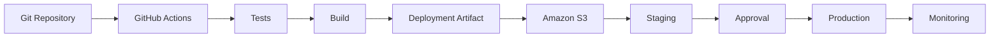
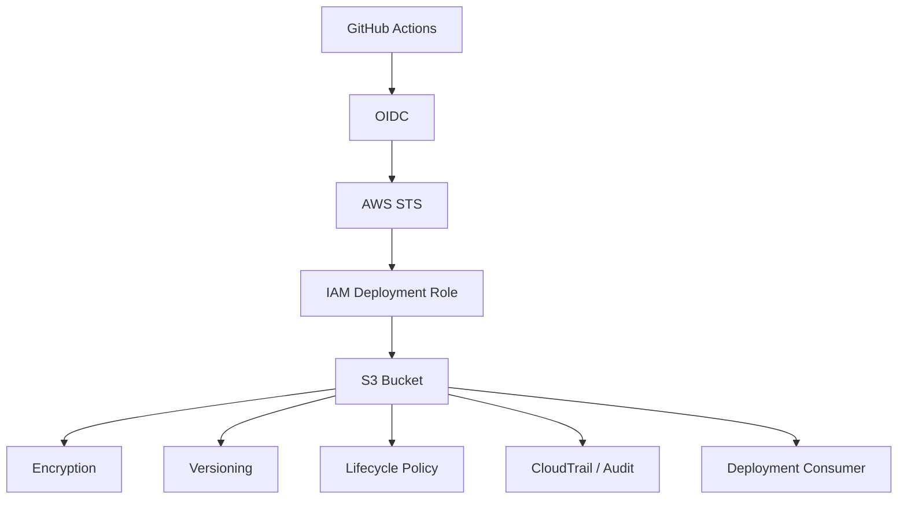

# 13- Amazon S3 Deployment

## Overview

Amazon S3 is an object storage service commonly used in CI/CD pipelines for storing and distributing deployment artifacts, static assets, frontend builds, configuration packages, reports, backups, and release metadata.

In GitHub Actions, S3 is most useful when the deployment target is an object-based application or artifact rather than a container runtime.

Typical use cases include:

- Deploying static websites
- Publishing frontend builds
- Storing Python application packages
- Publishing release artifacts
- Storing generated documentation
- Hosting downloadable artifacts
- Distributing configuration or migration packages
- Storing deployment manifests
- Supporting rollback and disaster recovery

A production deployment commonly follows:

```text
Pull Request
    ↓
Lint
    ↓
Unit Tests
    ↓
Integration Tests
    ↓
Security Scan
    ↓
Build
    ↓
Artifact
    ↓
Amazon S3
    ↓
Staging
    ↓
Approval
    ↓
Production
    ↓
Monitoring
    ↓
Rollback
```

For static web applications, the flow may instead be:

```text
GitHub
   ↓
Build
   ↓
Static Files
   ↓
S3
   ↓
CloudFront
   ↓
Users
```

The key CI/CD principle remains:

> Build the artifact once, store it immutably, and promote the same artifact between environments.

---

## What S3 Provides in CI/CD

S3 stores objects inside buckets.

An object consists conceptually of:

```text
Bucket
 └── Object Key
       ├── Content
       └── Metadata
```

For example:

```text
s3://company-artifacts/releases/backend/2.4.0/backend.tar.gz
```

The bucket provides the storage boundary while the key identifies the object.

---

## Why S3 Is Useful for Deployment

S3 provides a durable artifact storage layer between CI and deployment.

Without artifact storage:

```text
GitHub Actions
      ↓
Build
      ↓
Direct Deployment
```

With S3:

```text
GitHub Actions
      ↓
Build
      ↓
Artifact
      ↓
S3
      ↓
Promotion
      ↓
Deployment
```

This separation improves:

- Reproducibility
- Rollback
- Auditing
- Artifact retention
- Deployment isolation
- Disaster recovery

---

## S3 Deployment Architecture



S3 is the artifact boundary.

The deployment system consumes the artifact after it has been validated.

---

## S3 Bucket Design

A production S3 bucket should have a clearly defined purpose.

Examples:

```text
company-ci-artifacts
company-frontend-assets
company-release-artifacts
company-deployment-packages
```

Avoid using one unrestricted bucket for unrelated data.

Separating buckets by security boundary, lifecycle, or ownership can simplify:

- IAM policies
- Retention
- Auditing
- Encryption
- Cost allocation
- Incident response

---

## Environment Separation

A common design is:

```text
Development
    ↓
S3 development bucket

Staging
    ↓
S3 staging bucket

Production
    ↓
S3 production bucket
```

Another model is a centralized artifact bucket:

```text
s3://company-artifacts/
    ├── releases/
    ├── builds/
    └── manifests/
```

followed by controlled promotion.

The correct model depends on the organization's account and environment boundaries.

---

## Build Once, Deploy Many

A production pipeline should preferably use:

```text
Source
  ↓
Build
  ↓
Artifact
  ↓
S3
  ↓
Staging
  ↓
Production
```

rather than:

```text
Source
  ↓
Build for Staging

Source
  ↓
Build Again for Production
```

Rebuilding introduces the possibility that production receives different content.

---

## Artifact Identity

An artifact should have a deterministic identity.

Useful identifiers include:

```text
Git SHA
Release Version
Artifact SHA-256
Build ID
Workflow Run ID
```

For example:

```text
backend-7f3a8e2.tar.gz
```

or:

```text
frontend-v2.4.0.zip
```

The deployment system should also record the artifact checksum.

---

## S3 Object Keys

A structured key convention improves traceability.

Example:

```text
releases/
└── backend/
    ├── 2.3.0/
    │   └── backend.tar.gz
    ├── 2.4.0/
    │   └── backend.tar.gz
    └── 2.5.0/
        └── backend.tar.gz
```

For commit-based artifacts:

```text
builds/backend/7f3a8e2/backend.tar.gz
```

For frontend deployments:

```text
releases/frontend/v2.4.0/
    index.html
    assets/
```

---

## GitHub Actions to S3

A common deployment workflow is:

```yaml
name: Deploy to S3

on:
  push:
    branches:
      - main

permissions:
  contents: read
  id-token: write

jobs:
  deploy:
    runs-on: ubuntu-latest

    steps:
      - name: Checkout
        uses: actions/checkout@v4

      - name: Configure AWS credentials
        uses: aws-actions/configure-aws-credentials@v4
        with:
          role-to-assume: ${{ vars.AWS_S3_DEPLOY_ROLE_ARN }}
          aws-region: ap-south-1

      - name: Upload artifact
        run: |
          aws s3 cp dist/ \
            s3://company-frontend-assets/ \
            --recursive
```

The workflow uses temporary AWS credentials obtained through OIDC.

---

## GitHub OIDC with S3

The authentication flow is:

```text
GitHub Actions
      ↓
OIDC Token
      ↓
AWS STS
      ↓
IAM Role
      ↓
Temporary Credentials
      ↓
S3
```

The workflow requires:

```yaml
permissions:
  contents: read
  id-token: write
```

The IAM role should restrict access to the required S3 bucket and operations.

---

## Why OIDC Is Preferred

Avoid storing long-lived AWS access keys such as:

```text
AWS_ACCESS_KEY_ID
AWS_SECRET_ACCESS_KEY
```

as persistent GitHub secrets when OIDC can satisfy the authentication requirement.

Instead:

```text
GitHub Workflow
      ↓
Short-lived identity
      ↓
STS
      ↓
Temporary AWS credentials
```

This reduces credential lifetime and rotation overhead.

---

## IAM Permissions for S3 Deployment

A static website deployment may require:

```text
s3:ListBucket
s3:PutObject
s3:DeleteObject
```

A deployment that only publishes immutable artifacts may only require:

```text
s3:PutObject
```

The exact permissions should match the workflow.

Avoid:

```json
{
  "Effect": "Allow",
  "Action": "s3:*",
  "Resource": "*"
}
```

when a narrower policy is possible.

---

## Example Least-Privilege Policy

```json
{
  "Version": "2012-10-17",
  "Statement": [
    {
      "Effect": "Allow",
      "Action": [
        "s3:PutObject",
        "s3:AbortMultipartUpload"
      ],
      "Resource": "arn:aws:s3:::company-frontend-assets/*"
    },
    {
      "Effect": "Allow",
      "Action": [
        "s3:ListBucket"
      ],
      "Resource": "arn:aws:s3:::company-frontend-assets"
    }
  ]
}
```

Add delete permissions only when the deployment strategy genuinely requires them.

---

## S3 Upload with AWS CLI

Upload a single file:

```bash
aws s3 cp build.zip \
  s3://company-artifacts/releases/build.zip
```

Upload a directory:

```bash
aws s3 cp dist/ \
  s3://company-frontend-assets/ \
  --recursive
```

Synchronize directories:

```bash
aws s3 sync dist/ \
  s3://company-frontend-assets/
```

The distinction between `cp` and `sync` matters for deployment behavior.

---

## `aws s3 cp` vs `aws s3 sync`

| Command | Typical Use |
|---|---|
| `aws s3 cp` | Explicit file or recursive copy |
| `aws s3 sync` | Synchronize directory/object trees |
| `aws s3 mv` | Move objects |
| `aws s3 rm` | Delete objects |
| `aws s3 ls` | Inspect objects |

For production deployments, understand exactly whether existing remote objects should remain or be deleted.

---

## S3 Sync Behavior

Consider:

```text
Previous deployment:
index.html
app.js
old.js

New deployment:
index.html
app.js
```

A simple upload may leave:

```text
old.js
```

in the bucket.

A synchronization strategy can remove objects that no longer exist locally, depending on the command options.

For example:

```bash
aws s3 sync dist/ \
  s3://company-frontend-assets/ \
  --delete
```

`--delete` should be used carefully because it can remove objects from the destination.

Never enable it without understanding the bucket prefix being targeted.

---

## Static Website Deployment

A frontend build might produce:

```text
dist/
├── index.html
├── assets/
│   ├── app.js
│   └── app.css
└── favicon.ico
```

Deployment:

```text
GitHub Actions
      ↓
npm build
      ↓
dist/
      ↓
S3
      ↓
CloudFront
      ↓
Users
```

This is one of the most common S3 deployment patterns.

---

## S3 and CloudFront

For production static applications, a common architecture is:

```text
User
  ↓
CloudFront
  ↓
S3
```

GitHub Actions updates S3:

```text
GitHub Actions
      ↓
S3
      ↓
CloudFront
```

CloudFront provides:

- Global edge caching
- TLS termination
- Reduced latency
- Origin protection
- Cache control

S3 remains the origin storage layer.

---

## Cache-Control

Static assets often use content-addressed filenames:

```text
app.7f3a8e2.js
vendor.3d92ab1.js
```

These can be cached for long periods:

```bash
aws s3 sync dist/ \
  s3://company-frontend-assets/ \
  --cache-control "public,max-age=31536000,immutable"
```

HTML often requires shorter caching:

```bash
aws s3 cp dist/index.html \
  s3://company-frontend-assets/index.html \
  --cache-control "no-cache"
```

The correct policy depends on the application's asset naming strategy.

---

## Cache Invalidation

When CloudFront caches an object, updating S3 does not necessarily make every edge immediately serve the new object.

A deployment may therefore include:

```bash
aws cloudfront create-invalidation \
  --distribution-id "$DISTRIBUTION_ID" \
  --paths "/index.html"
```

Avoid invalidating every object on every deployment when content-hashed assets are used.

A better pattern is often:

```text
Hashed Assets → Long Cache
index.html    → Short Cache / Invalidation
```

---

## S3 Versioning

S3 Versioning allows multiple versions of an object to be retained.

Conceptually:

```text
index.html
   ├── Version A
   ├── Version B
   └── Version C
```

Versioning can improve recovery from:

- Accidental deletion
- Accidental overwrite
- Bad deployments
- Operator mistakes

However, versioning increases storage consumption and should be combined with lifecycle management.

---

## Object Lock

For specific compliance or retention requirements, S3 Object Lock can prevent objects from being deleted or overwritten during a retention period.

This is useful for controlled immutable artifact storage.

It should not be enabled blindly for ordinary application assets because retention policies can affect operational cleanup.

---

## S3 Encryption

S3 supports server-side encryption.

Common options include:

```text
SSE-S3
SSE-KMS
```

Use SSE-KMS when centralized key management, auditing, or organizational key policies require it.

Sensitive deployment artifacts should not rely solely on bucket obscurity for protection.

---

## Bucket Policies

Bucket policies provide resource-based access control.

For example:

```text
GitHub Deployment Role
       ↓
S3 Bucket
       ↓
Allowed Prefix
```

Use bucket policies to enforce organization-wide restrictions where appropriate.

Avoid public bucket access unless the architecture explicitly requires it.

---

## Public S3 Access

A common mistake is to make an entire bucket publicly readable simply to serve a website.

A production architecture can instead use:

```text
Internet
   ↓
CloudFront
   ↓
Private S3 Origin
```

This reduces direct exposure of the S3 bucket.

Public access requirements should be evaluated against the application architecture.

---

## S3 Block Public Access

S3 Block Public Access provides controls to prevent unintended public exposure.

For private artifact buckets, public access should generally remain blocked.

This is particularly important for buckets containing:

- Deployment packages
- Backend artifacts
- Configuration
- Logs
- Reports
- Backup data

---

## Static Website vs Private Origin

| Model | Typical Use |
|---|---|
| S3 website endpoint | Simple static hosting |
| CloudFront + S3 | Production static applications |
| Private S3 + controlled access | Internal artifacts |
| S3 artifact bucket | CI/CD packages |

The correct model depends on security, caching, domain, and operational requirements.

---

## Artifact Packaging

For a Python backend, a deployment artifact might contain:

```text
backend.tar.gz
├── application/
├── manage.py
├── requirements.txt
└── deployment/
```

The pipeline can create:

```bash
tar -czf backend.tar.gz \
  application/ \
  manage.py \
  requirements.txt \
  deployment/
```

Then publish:

```bash
aws s3 cp backend.tar.gz \
  s3://company-artifacts/releases/backend/7f3a8e2/backend.tar.gz
```

The deployment platform can retrieve the exact artifact later.

---

## Python Package Deployment

S3 can also act as an internal distribution location for packages or deployment bundles.

For example:

```text
GitHub Actions
      ↓
Build Python Package
      ↓
S3
      ↓
Deployment Environment
```

This is useful when S3 is intentionally part of the organization's artifact distribution architecture.

It should not automatically replace a package registry when a package registry is more appropriate.

---

## Django Deployment Artifact

A Django deployment might contain:

```text
release/
├── application/
├── requirements.txt
├── manage.py
├── static/
└── deployment/
```

The CI pipeline should:

```text
Install Dependencies
      ↓
Run Tests
      ↓
Collect Static Files
      ↓
Package
      ↓
Upload Artifact
```

The deployment system then retrieves the same artifact.

---

## Django Static Files

A Django deployment often separates:

```text
Application Code
```

from:

```text
Static Assets
```

For example:

```bash
python manage.py collectstatic --noinput
```

The resulting static files can be published to S3.

The architecture becomes:

```text
Django
   ↓
collectstatic
   ↓
S3
   ↓
CloudFront
```

This is separate from deploying the Django application runtime itself.

---

## FastAPI Deployment

A FastAPI application may use S3 for:

- Release bundles
- Static assets
- Deployment metadata
- Generated documentation
- Export files

For example:

```text
FastAPI Build
     ↓
backend.tar.gz
     ↓
S3
     ↓
Deployment System
```

If the runtime is containerized, ECR is usually the container artifact registry while S3 may still store auxiliary deployment artifacts.

---

## Celery Deployment Artifacts

For a Celery-based backend:

```text
Django / FastAPI
     ↓
Celery Workers
     ↓
Deployment Artifact
     ↓
S3
```

Workers should use the same release artifact or image version as the application when compatibility requires it.

Avoid independently deploying worker code that expects a different task schema.

---

## Kafka Consumer Deployment

Kafka consumers can also be released using versioned artifacts:

```text
Source
  ↓
Build
  ↓
Artifact
  ↓
S3
  ↓
Consumer Deployment
```

Event schema compatibility should be maintained during rolling deployments.

---

## Database Migration Artifacts

A deployment package may include migrations:

```text
release/
├── application/
├── migrations/
└── deployment/
```

A production process can then execute:

```text
Artifact
   ↓
Migration
   ↓
Application Deployment
```

Migrations should be designed to remain compatible with the running application during rolling deployments.

---

## Artifact Checksums

Calculate a checksum:

```bash
sha256sum backend.tar.gz
```

Example:

```text
8e3d... backend.tar.gz
```

Store the checksum alongside deployment metadata.

This helps verify that the downloaded artifact is exactly the artifact produced by CI.

---

## Manifest Files

A release manifest can contain:

```json
{
  "service": "backend",
  "version": "2.4.0",
  "commit": "7f3a8e2",
  "artifact": "backend.tar.gz",
  "sha256": "8e3d...",
  "workflow_run": "123456"
}
```

The manifest provides traceability between source, CI, artifact, and deployment.

---

## Immutable Artifact Promotion

A mature pipeline can use:

```text
Build
  ↓
S3
  ↓
Artifact Checksum
  ↓
Staging
  ↓
Approval
  ↓
Production
```

The production deployment should retrieve the exact artifact validated in staging.

---

## Environment Promotion Strategies

### Shared Artifact Bucket

```text
S3
 └── releases
      └── backend
           └── 7f3a8e2
```

All environments consume the same artifact.

### Environment-Specific Buckets

```text
S3 Dev
S3 Staging
S3 Production
```

Artifacts are explicitly copied between environments.

The second model can provide stronger account-level isolation but adds promotion complexity.

---

## Copying an Artifact Between S3 Locations

An artifact can be copied:

```bash
aws s3 cp \
  s3://company-artifacts/releases/backend/7f3a8e2/backend.tar.gz \
  s3://company-production-artifacts/releases/backend/7f3a8e2/backend.tar.gz
```

The promotion process should verify that the resulting object corresponds to the expected artifact.

---

## S3 Artifact Promotion Across AWS Accounts

A larger architecture may use:

```text
CI Account
    ↓
Artifact S3
    ↓
Security Validation
    ↓
Production Account
    ↓
Production S3
```

Cross-account access requires explicit IAM and bucket policies.

The deployment identity should not receive unrestricted access to the source account.

---

## Deployment Approvals

A production deployment can use GitHub Environments:

```text
Build
  ↓
S3
  ↓
Staging
  ↓
Validation
  ↓
Production Approval
  ↓
Production
```

The approved artifact should remain immutable between approval and deployment.

---

## Deployment Concurrency

Production deployments should avoid races.

Example:

```yaml
concurrency:
  group: production-s3-deployment
  cancel-in-progress: false
```

This prevents two workflows from concurrently modifying the same production deployment target.

---

## Rollback

For versioned releases:

```text
Current
v2.5.0
   ↓
Failure
   ↓
Previous
v2.4.0
```

The rollback process should select the previously validated artifact rather than rebuilding it.

For static sites, the rollback may involve restoring a previous release directory or object version.

---

## Blue/Green S3 Deployment

Static applications can use versioned prefixes:

```text
s3://frontend/
    ├── releases/v2.4.0/
    └── releases/v2.5.0/
```

Traffic or configuration can then reference a specific release.

This can simplify rollback because the previous release remains intact.

---

## Canary Releases

S3 itself does not implement application traffic canarying.

A canary architecture may use:

```text
S3
 ↓
CloudFront / Application Routing
 ↓
Current Release
New Release
```

Traffic management belongs to the serving layer rather than S3 object storage.

---

## Health Validation

For an API deployment, validation may look like:

```text
Upload Artifact
      ↓
Deploy
      ↓
/health
      ↓
/ready
      ↓
Database
      ↓
Redis
      ↓
Application Metrics
```

A successful S3 upload does not mean the application deployment succeeded.

---

## S3 and CloudFormation

Infrastructure can be deployed through CloudFormation with templates stored in S3.

Example:

```text
GitHub Actions
      ↓
CloudFormation Template
      ↓
S3
      ↓
CloudFormation
      ↓
AWS Infrastructure
```

The workflow should validate the template before production deployment.

---

## S3 and Terraform

Terraform can also interact with S3 for deployment-related infrastructure.

For example:

```text
Terraform
    ↓
S3 Bucket
    ↓
Bucket Policy
    ↓
Encryption
    ↓
Versioning
    ↓
Lifecycle
```

Infrastructure changes should be separated from application artifact deployment where possible.

---

## S3 CLI Operations

List a bucket:

```bash
aws s3 ls s3://company-artifacts/
```

List recursively:

```bash
aws s3 ls s3://company-artifacts/ \
  --recursive
```

Copy a file:

```bash
aws s3 cp build.zip \
  s3://company-artifacts/builds/build.zip
```

Download:

```bash
aws s3 cp \
  s3://company-artifacts/builds/build.zip \
  build.zip
```

Synchronize:

```bash
aws s3 sync dist/ \
  s3://company-frontend-assets/
```

Remove an object:

```bash
aws s3 rm \
  s3://company-artifacts/builds/old.zip
```

---

## Inspect Object Metadata

Use:

```bash
aws s3api head-object \
  --bucket company-artifacts \
  --key releases/backend/7f3a8e2/backend.tar.gz
```

This can help inspect:

- Content length
- Content type
- ETag
- Metadata
- Encryption information

Do not assume an ETag is always a simple MD5 checksum, particularly for multipart uploads or certain encryption scenarios.

---

## S3 API Concepts

The AWS CLI maps to S3 APIs.

For example:

```text
aws s3 cp
    ↓
S3 PutObject / multipart operations
```

Object operations include:

```text
PutObject
GetObject
HeadObject
DeleteObject
ListObjectsV2
```

Understanding the underlying operations helps when debugging IAM permissions.

---

## Content Types

Static deployments should publish correct content types.

Examples:

```text
text/html
text/css
application/javascript
application/json
image/svg+xml
```

Incorrect content types can cause browser behavior and caching problems.

Example:

```bash
aws s3 cp index.html \
  s3://company-frontend-assets/index.html \
  --content-type "text/html"
```

For large deployments, configure the build/upload process to preserve appropriate metadata consistently.

---

## Cache-Control Strategy

A typical frontend strategy is:

| Asset | Cache Strategy |
|---|---|
| `index.html` | Short/no-cache |
| Hashed JS | Long-lived |
| Hashed CSS | Long-lived |
| Images | Long-lived when versioned |
| Manifest | Short-lived |

The exact values should follow the application's release model.

---

## S3 Storage Classes

S3 provides multiple storage classes.

For CI/CD artifacts, consider whether the artifact needs:

- Frequent access
- Infrequent access
- Long-term archival
- Immediate rollback availability

Do not automatically move active deployment artifacts into an archival class if production rollback requires immediate access.

---

## Lifecycle Policies

Artifact buckets can accumulate:

```text
build-001
build-002
...
build-10000
```

Lifecycle rules can automatically transition or expire old objects.

A sensible policy should preserve:

- Active releases
- Recent rollback candidates
- Compliance-required artifacts

while removing unnecessary temporary builds.

---

## Storage Cost

Cost is affected by:

- Number of objects
- Object size
- Storage class
- Data transfer
- Requests
- Lifecycle transitions
- CloudFront usage
- Cross-region replication

Avoid retaining every CI build indefinitely unless there is a clear requirement.

---

## Security Architecture



The bucket should be treated as a production security boundary.

---

## S3 Encryption

For deployment artifacts containing sensitive information:

```text
Artifact
   ↓
S3
   ↓
Server-Side Encryption
```

SSE-KMS may be appropriate when centralized key control and auditing are required.

Do not put secrets directly into deployment artifacts unless the architecture explicitly requires it and the artifacts are adequately protected.

---

## Secrets in Artifacts

Avoid packaging:

```text
.env
AWS credentials
Database passwords
API keys
Private keys
```

into S3 deployment artifacts.

Instead, retrieve runtime configuration through appropriate secret-management mechanisms.

The artifact should contain application code and immutable build output, not environment-specific secrets.

---

## Environment Configuration

A better model is:

```text
Immutable Artifact
        +
Environment Configuration
        ↓
Deployment
```

For example:

```text
backend.tar.gz
```

is the same across staging and production.

The runtime configuration differs:

```text
STAGING_DATABASE_URL
PRODUCTION_DATABASE_URL
```

This supports build-once/deploy-many.

---

## Untrusted Pull Requests

A pull request may contain arbitrary code.

Do not allow an untrusted PR workflow to obtain:

```text
AWS OIDC deployment credentials
```

and publish to production S3.

Separate:

```text
PR Validation
```

from:

```text
Trusted Deployment
```

A typical model is:

```text
Pull Request
    ↓
Tests
    ↓
No Production Credentials

Main
    ↓
Trusted Deployment
    ↓
OIDC
    ↓
S3
```

---

## `pull_request_target` Caution

`pull_request_target` runs in the context of the base repository and can have access to privileged resources.

Do not combine privileged credentials with execution of untrusted pull-request code.

Avoid patterns where PR-controlled data is directly passed into shell commands.

---

## Shell Injection

This is dangerous:

```yaml
- name: Deploy
  run: aws s3 cp build/ "s3://${{ github.event.pull_request.title }}/"
```

User-controlled values should not be interpolated directly into shell code.

Prefer controlled environment variables and explicit validation.

For deployment workflows, the destination bucket and prefix should normally come from trusted configuration.

---

## Third-Party Actions

An S3 deployment may use:

```yaml
uses: aws-actions/configure-aws-credentials@v4
```

or other deployment actions.

Treat every action as executable code.

Evaluate:

- Source
- Maintainer
- Version
- Permissions
- Dependency chain
- Release process

Pin high-trust deployment actions according to organizational supply-chain policy.

---

## Self-Hosted Runners

A self-hosted runner with S3 deployment credentials can potentially access production artifacts.

Risks include:

- Persistent credentials
- Malicious code
- Workspace contamination
- Cached files
- Network access
- Docker socket access

Use isolated or ephemeral runners for sensitive workloads where practical.

---

## Artifact Integrity

For critical artifacts:

```text
Build
  ↓
Checksum
  ↓
S3
  ↓
Verify
  ↓
Deploy
```

A release manifest can bind:

```text
Git SHA
+
Artifact Name
+
Artifact Digest
+
Workflow Run
```

This improves forensic traceability.

---

## Artifact Provenance

A mature pipeline can record:

```text
Source Repository
Commit SHA
Workflow
Runner
Build Time
Artifact
Checksum
Environment
```

This helps determine whether the deployed artifact came from the expected trusted build process.

---

## Monitoring

Monitor:

- Deployment workflow failures
- S3 access failures
- Unauthorized access
- Artifact upload failures
- CloudFront invalidation failures
- Deployment duration
- Rollback frequency
- Object lifecycle behavior

AWS audit logs can help investigate unexpected bucket activity.

---

## Deployment Audit Trail

A production deployment should answer:

```text
Who deployed?
What was deployed?
Which commit produced it?
Which workflow built it?
Which S3 object was used?
Which checksum was expected?
Which environment received it?
When did deployment occur?
```

Store or expose this metadata as part of the deployment process.

---

## Failure Domains

Separate failures into:

```text
GitHub Actions
      ↓
Build
      ↓
AWS Authentication
      ↓
S3 Upload
      ↓
Artifact Validation
      ↓
Deployment
      ↓
Application Health
      ↓
CloudFront / Traffic Layer
```

This prevents an S3 upload failure from being confused with an application runtime failure.

---

## Troubleshooting AWS Authentication

### Symptom

```text
Unable to locate credentials
```

### Checks

```bash
aws sts get-caller-identity
```

Verify:

```text
GitHub OIDC
    ↓
IAM Trust Policy
    ↓
Role Assumption
```

### Prevention

Use explicit workflow permissions:

```yaml
permissions:
  contents: read
  id-token: write
```

---

## Troubleshooting Access Denied

### Symptom

```text
AccessDenied
```

Check:

```text
AWS Account
↓
Assumed Role
↓
IAM Permissions
↓
Bucket Policy
↓
Object Prefix
```

Use:

```bash
aws sts get-caller-identity
```

and:

```bash
aws s3api head-object \
  --bucket company-artifacts \
  --key releases/backend/7f3a8e2/backend.tar.gz
```

Do not immediately grant `s3:*`.

---

## Troubleshooting Missing Files

### Symptom

The deployment completes but an expected file is missing.

Possible causes:

- Incorrect local build path
- Incorrect S3 prefix
- `sync --delete`
- Wrong bucket
- Wrong AWS account
- Wrong region
- Build artifact missing the file

Check:

```bash
aws s3 ls \
  s3://company-frontend-assets/ \
  --recursive
```

Then compare with the local build output.

---

## Troubleshooting Stale Frontend Assets

### Symptom

The new deployment exists in S3 but users receive old content.

Possible causes:

- CloudFront cache
- Browser cache
- Long-lived HTML caching
- Missing invalidation
- Incorrect cache-control headers

Inspect:

```text
S3 Object
   ↓
CloudFront Cache
   ↓
Browser Cache
```

Do not immediately delete and recreate the bucket.

---

## Troubleshooting `sync --delete`

### Symptom

Objects unexpectedly disappear.

Possible cause:

```bash
aws s3 sync dist/ \
  s3://company-frontend-assets/ \
  --delete
```

The destination is being reconciled against the local directory.

Check:

- Local directory contents
- Destination prefix
- Command scope
- Workflow working directory

Use a narrow prefix rather than an entire production bucket where possible.

---

## Troubleshooting CloudFront

If S3 contains the correct file but CloudFront serves old content:

```text
S3
 ↓
Object Correct?
 ↓ yes
CloudFront
 ↓
Cached?
 ↓ yes
Invalidate / Wait for TTL
```

Prefer targeted invalidation or content-hashed assets.

---

## Troubleshooting Wrong Artifact

Trace:

```text
Production
   ↓
Artifact Path
   ↓
S3 Object
   ↓
Checksum
   ↓
Git SHA
   ↓
Workflow Run
```

Compare the actual object with the release manifest.

---

## GitHub CLI Operations

List workflow runs:

```bash
gh run list
```

Inspect a run:

```bash
gh run view RUN_ID
```

View logs:

```bash
gh run view RUN_ID --log
```

Rerun a workflow:

```bash
gh run rerun RUN_ID
```

List releases:

```bash
gh release list
```

The GitHub CLI should be used here for CI/CD operations rather than as a general GitHub administration tool.

---

## AWS CLI Deployment Operations

Verify identity:

```bash
aws sts get-caller-identity
```

List bucket contents:

```bash
aws s3 ls s3://company-artifacts/ --recursive
```

Upload:

```bash
aws s3 cp build.zip \
  s3://company-artifacts/releases/build.zip
```

Synchronize:

```bash
aws s3 sync dist/ \
  s3://company-frontend-assets/
```

Inspect metadata:

```bash
aws s3api head-object \
  --bucket company-artifacts \
  --key releases/build.zip
```

---

## Production CI/CD Pipeline

A complete backend-oriented pipeline can be:


The artifact should remain unchanged throughout promotion.

---

## Example Production Workflow

```yaml
name: Build and Deploy

on:
  push:
    branches:
      - main

permissions:
  contents: read
  id-token: write

concurrency:
  group: production-s3-deployment
  cancel-in-progress: false

jobs:
  build:
    runs-on: ubuntu-latest

    steps:
      - name: Checkout
        uses: actions/checkout@v4

      - name: Install dependencies
        run: |
          python -m pip install --upgrade pip
          pip install -r requirements.txt

      - name: Run tests
        run: |
          pytest

      - name: Build artifact
        run: |
          tar -czf backend-${GITHUB_SHA}.tar.gz \
            application/ \
            manage.py \
            requirements.txt

      - name: Configure AWS credentials
        uses: aws-actions/configure-aws-credentials@v4
        with:
          role-to-assume: ${{ vars.AWS_S3_DEPLOY_ROLE_ARN }}
          aws-region: ap-south-1

      - name: Upload artifact
        run: |
          aws s3 cp \
            "backend-${GITHUB_SHA}.tar.gz" \
            "s3://company-artifacts/releases/backend/${GITHUB_SHA}/"

      - name: Deployment summary
        run: |
          echo "## Release" >> "$GITHUB_STEP_SUMMARY"
          echo "- Commit: $GITHUB_SHA" >> "$GITHUB_STEP_SUMMARY"
          echo "- Artifact: backend-${GITHUB_SHA}.tar.gz" >> "$GITHUB_STEP_SUMMARY"
```

For production, deployment should generally be separated from artifact creation so that staging and production can consume the same artifact.

---

## Separating CI and CD

A stronger architecture is:

```text
CI Workflow
    ↓
Build
    ↓
Artifact
    ↓
S3
```

followed by:

```text
CD Workflow
    ↓
Retrieve Artifact
    ↓
Staging
    ↓
Approval
    ↓
Production
```

This separation allows production deployment without rebuilding.

---

## Reusable Deployment Workflow

A reusable workflow can centralize deployment logic:

```yaml
on:
  workflow_call:
    inputs:
      artifact_key:
        required: true
        type: string
      environment:
        required: true
        type: string
```

The workflow can then standardize:

- AWS authentication
- Artifact retrieval
- Deployment
- Health checks
- Rollback
- Logging

This reduces duplicated deployment logic across repositories.

---

## S3 and Reusable Workflows

A central deployment workflow might provide:

```text
Repository A ─┐
Repository B ─┼──→ Reusable Deployment Workflow
Repository C ─┘              ↓
                            S3
```

The reusable workflow should have a stable interface and narrowly scoped permissions.

---

## S3 and Docker Deployments

S3 and ECR solve different artifact problems.

| Artifact | Typical Registry |
|---|---|
| Docker image | ECR |
| Static frontend files | S3 |
| Release archive | S3 |
| Deployment manifest | S3 |
| Python package | Package registry or S3 depending on architecture |
| Kubernetes manifest | Git/artifact storage |
| Infrastructure template | S3/Git depending on workflow |

Do not use S3 simply because it is available. Select the artifact store that matches the deployment model.

---

## S3 vs ECR

| Concern | S3 | ECR |
|---|---|---|
| Object storage | Yes | No |
| Docker image registry | No | Yes |
| Static website assets | Yes | No |
| Release archives | Yes | Possible but not intended |
| Container image layers | No | Yes |
| Object versioning | Yes | Registry/image semantics |
| CloudFront origin | Yes | No |
| ECS image source | No | Yes |

For a containerized Django or FastAPI application:

```text
Docker Image → ECR
```

For static frontend assets:

```text
Build Output → S3
```

---

## High Availability

S3 is designed as durable object storage, but application availability depends on the complete serving architecture.

For static content:

```text
Users
  ↓
CloudFront
  ↓
S3
```

For backend artifacts:

```text
S3
 ↓
Multiple Application Instances
 ↓
Load Balancer
```

The artifact store and runtime availability should be considered separately.

---

## Disaster Recovery

For critical deployment artifacts, consider:

- Versioning
- Lifecycle policies
- Cross-region replication where required
- Cross-account copies
- Artifact checksums
- Release manifests
- Retention requirements

A recovery process should know exactly which artifact was deployed.

---

## Cross-Region Replication

For high-recovery requirements:

```text
Primary Region
    ↓
S3 Bucket
    ↓
Replication
    ↓
Secondary Region
```

Replication can provide an additional recovery path.

However, replication does not automatically reproduce the entire application environment.

Infrastructure, IAM, networking, DNS, databases, and deployment configuration require their own recovery strategies.

---

## Cost Optimization

Reduce unnecessary S3 costs through:

- Lifecycle policies
- Appropriate storage classes
- Retention limits
- Content-hashed static assets
- Avoiding redundant copies
- Targeted CloudFront invalidations
- Removing temporary CI artifacts
- Separating short-lived builds from long-lived releases

Do not optimize storage cost by deleting artifacts required for operational rollback.

---

## Production Checklist

### S3

- [ ] Bucket purpose is clearly defined
- [ ] Bucket naming is standardized
- [ ] Public access is blocked unless explicitly required
- [ ] Encryption is enabled
- [ ] Versioning requirements are defined
- [ ] Lifecycle policies are configured
- [ ] Retention requirements are documented
- [ ] Artifact prefixes are predictable

### GitHub Actions

- [ ] OIDC is used for AWS authentication
- [ ] `id-token: write` is scoped to trusted workflows
- [ ] AWS credentials are temporary
- [ ] Deployment actions are trusted and controlled
- [ ] Artifact identity is recorded
- [ ] Workflow concurrency is configured
- [ ] Deployment environments are protected

### IAM

- [ ] Least-privilege permissions are used
- [ ] S3 access is restricted to required buckets
- [ ] Prefix-level restrictions are used where appropriate
- [ ] Runtime roles are separated from deployment roles
- [ ] Production deployment roles are protected

### Artifact Management

- [ ] Build happens once
- [ ] Artifact checksum is recorded
- [ ] Git SHA is associated with the artifact
- [ ] Staging and production use the same artifact
- [ ] Rollback artifacts are retained
- [ ] Sensitive credentials are not packaged

### Static Websites

- [ ] CloudFront architecture is evaluated
- [ ] S3 public access is controlled
- [ ] Cache-Control headers are correct
- [ ] Content-hashed assets are used where appropriate
- [ ] HTML caching is handled separately
- [ ] CloudFront invalidation is targeted

---

## Common Mistakes

### Rebuilding for Every Environment

This breaks the build-once/deploy-many model.

### Using Public S3 Buckets by Default

A production static website can often use CloudFront with a controlled S3 origin instead.

### Uploading Secrets

Never package `.env` files, AWS credentials, private keys, or production passwords into deployment artifacts.

### Overusing `--delete`

`sync --delete` can remove destination objects unexpectedly.

### Using `latest`-Style Mutable Releases

Use deterministic artifact paths and release identities.

### No Rollback Strategy

A deployment is incomplete if the team cannot restore the previous known-good artifact.

### No Lifecycle Policy

CI/CD buckets can grow rapidly when every build is retained indefinitely.

### Treating Upload Success as Deployment Success

A successful S3 upload only proves that the artifact reached S3. It does not prove that the runtime is healthy.

### Ignoring CloudFront Caching

A correct S3 deployment can still appear broken because users receive cached content.

### Giving Deployment Roles Excessive Access

Do not grant broad AWS permissions when a narrowly scoped S3 policy is sufficient.

---

## Senior Design Principles

### S3 Is an Artifact Boundary

Treat S3 as the controlled handoff between artifact creation and deployment.

### Keep Artifacts Immutable

Prefer:

```text
releases/backend/7f3a8e2/backend.tar.gz
```

over:

```text
releases/backend/latest.tar.gz
```

### Separate Artifact and Configuration

Use:

```text
Immutable Artifact
+
Environment Configuration
```

instead of rebuilding artifacts with environment-specific settings.

### Prefer OIDC

Use short-lived AWS credentials for GitHub Actions.

### Separate CI from CD

CI produces the artifact.

CD promotes and deploys it.

### Make Rollback Deterministic

Rollback should select a known-good artifact rather than rerunning an uncontrolled build.

### Protect the Production Boundary

Use:

- IAM least privilege
- GitHub Environments
- Approval gates
- Concurrency
- Immutable artifacts
- Trusted workflows
- Controlled runners

---

## Interview Questions

### What is S3's role in CI/CD?

S3 can provide durable artifact storage for deployment packages, static assets, release archives, manifests, and other build outputs.

### How should GitHub Actions authenticate with S3?

Use GitHub OIDC to assume an AWS IAM role through STS and obtain temporary credentials.

### Why should you avoid long-lived AWS credentials in GitHub?

They remain valid until rotated or revoked. OIDC provides short-lived credentials tied to a workflow identity.

### Why is build-once/deploy-many important?

It ensures that staging and production receive the same artifact that was validated during CI.

### How would you implement rollback for an S3 deployment?

Use versioned or immutable release artifacts and redeploy the previously validated artifact.

### What is the difference between S3 and ECR?

S3 is object storage commonly used for static files and release artifacts. ECR is a container registry designed for Docker and OCI images.

### How would you deploy a React or similar frontend to S3?

Build the frontend, upload the generated static files to S3, and typically serve them through CloudFront.

### Why is CloudFront commonly placed in front of S3?

It provides edge caching, TLS, distribution, and additional control over how the S3 content is served.

### How do you handle frontend caching?

Use content-hashed assets with long cache lifetimes and give `index.html` a shorter cache lifetime or targeted invalidation strategy.

### Why should an S3 deployment bucket usually not be public?

Deployment artifacts may contain sensitive code or configuration, and public access unnecessarily expands the attack surface.

### What is the risk of `aws s3 sync --delete`?

It can delete destination objects that are absent from the local source directory. An incorrectly scoped command can therefore remove production content.

### How would you design IAM for an S3 deployment?

Grant the GitHub deployment role only the S3 operations and bucket/prefix access required by the workflow.

### How would you troubleshoot `AccessDenied`?

First verify the AWS identity:

```bash
aws sts get-caller-identity
```

Then inspect IAM permissions, bucket policies, object prefixes, and the target account.

### How would you design a production static website deployment?

A typical architecture is:

```text
GitHub Actions
    ↓
Build
    ↓
S3
    ↓
CloudFront
    ↓
Users
```

with immutable or content-addressed assets, controlled cache behavior, OIDC authentication, and rollback support.

### How would you deploy the same backend artifact to staging and production?

Build once, upload the artifact to S3, record its checksum and Git SHA, deploy it to staging, validate it, obtain approval, and deploy the same artifact to production.

### What would you investigate if S3 contains the correct file but users still see an old version?

Check:

```text
S3 Object
↓
Cache-Control
↓
CloudFront Cache
↓
Browser Cache
```

The problem may be caching rather than deployment.

### How would you design S3 for disaster recovery?

Use appropriate versioning, retention, replication where required, release manifests, checksums, and documented recovery procedures while separately addressing application infrastructure and data recovery.

## Key Takeaways

- Use Amazon S3 as a controlled artifact and static-content boundary in CI/CD, while keeping container images in ECR and runtime deployment responsibilities in the appropriate AWS service.
- Authenticate GitHub Actions to AWS through OIDC and narrowly scoped IAM roles rather than long-lived AWS credentials.
- Build artifacts once, assign deterministic identities such as Git SHAs and checksums, and promote the same immutable artifact through staging and production.
- For S3-hosted frontends, combine controlled S3 access with CloudFront, content-hashed assets, appropriate cache headers, and targeted invalidation strategies.
- Production S3 deployments require more than successful uploads: enforce security, lifecycle management, observability, deployment concurrency, artifact retention, and deterministic rollback.