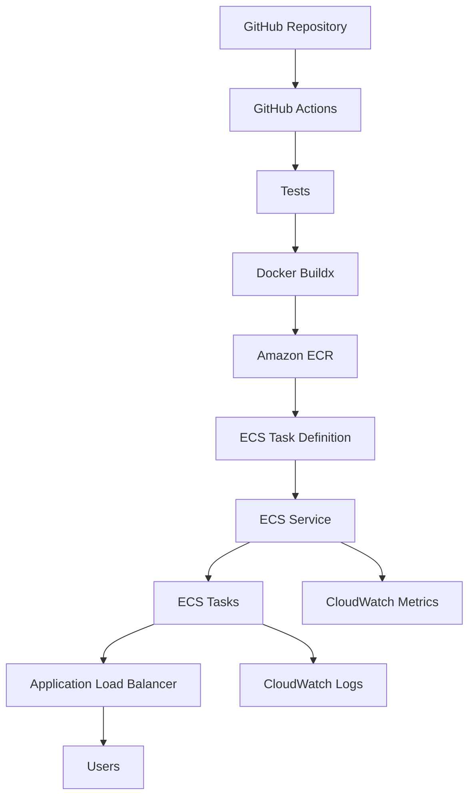
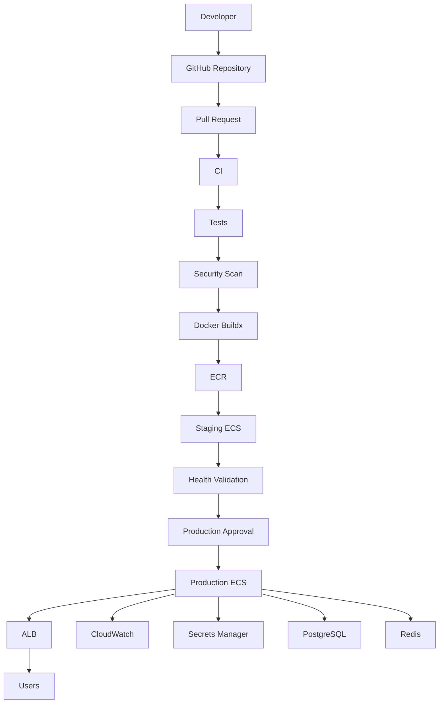

# 14- Amazon ECS Deployment

## Overview

Amazon Elastic Container Service (ECS) is an AWS container orchestration service used to run Docker containers without requiring Kubernetes control-plane management.

In a GitHub Actions CI/CD architecture, ECS commonly acts as the production runtime while Amazon ECR stores the container image.

A typical deployment flow is:

```text
Pull Request
    ↓
Lint
    ↓
Unit Tests
    ↓
Integration Tests
    ↓
Security Scan
    ↓
Docker Build
    ↓
ECR
    ↓
Staging ECS
    ↓
Health Validation
    ↓
Approval
    ↓
Production ECS
    ↓
Monitoring
    ↓
Rollback
```

For a Python backend such as Django or FastAPI, ECS can provide the runtime layer while GitHub Actions handles CI/CD orchestration.

The important architectural separation is:

```text
GitHub Actions
     │
     ├── Build
     ├── Test
     └── Deploy
          │
          ↓
         ECR
          │
          ↓
         ECS
          │
          ├── ECS Service
          ├── ECS Tasks
          └── Load Balancer
```

ECR answers:

> Where is the container image?

ECS answers:

> Where and how should that container run?

---

## ECS Deployment Models

ECS supports two primary compute options:

| Model | Description | Typical Use |
|---|---|---|
| Fargate | Serverless container compute | Most application workloads |
| EC2 | ECS tasks run on customer-managed EC2 instances | Specialized workloads and greater host control |

For most GitHub Actions-driven application deployments, Fargate provides a simpler operational model because the team does not need to manage the underlying container hosts.

---

## ECS Core Components

A production ECS deployment commonly involves:

```text
ECS Cluster
    ↓
ECS Service
    ↓
Task Definition
    ↓
ECS Task
    ↓
Container
```

Additional components commonly include:

```text
Application Load Balancer
Amazon ECR
CloudWatch
IAM
VPC
Security Groups
Secrets Manager / SSM Parameter Store
```

---

## ECS Cluster

An ECS cluster is a logical grouping of ECS resources.

It provides the management boundary for workloads.

Example:

```text
production-cluster
    ├── backend-service
    ├── celery-worker
    └── celery-beat
```

A cluster does not itself run application containers. ECS services and tasks run within the cluster.

---

## ECS Task Definition

A task definition describes how containers should run.

It includes configuration such as:

- Container image
- CPU
- Memory
- Ports
- Environment variables
- Secrets
- Logging
- IAM roles
- Health checks
- Networking
- Storage configuration

A simplified task definition:

```json
{
  "family": "backend",
  "networkMode": "awsvpc",
  "requiresCompatibilities": [
    "FARGATE"
  ],
  "cpu": "512",
  "memory": "1024",
  "containerDefinitions": [
    {
      "name": "backend",
      "image": "123456789012.dkr.ecr.ap-south-1.amazonaws.com/backend:7f3a8e2",
      "essential": true,
      "portMappings": [
        {
          "containerPort": 8000,
          "protocol": "tcp"
        }
      ]
    }
  ]
}
```

The task definition is effectively the deployment specification for the container workload.

---

## Task Definition Revisions

Task definitions are versioned through revisions.

For example:

```text
backend:101
backend:102
backend:103
```

A deployment can update the ECS service to use a new revision.

This provides an important rollback mechanism.

```text
backend:103
    ↓
Deployment failure
    ↓
backend:102
```

The image itself should also have a deterministic identity.

---

## ECS Task

A task is a running instance of a task definition.

For example:

```text
Task Definition
backend:103
      ↓
Task
      ↓
Container
      ↓
backend image
```

If the service desired count is:

```text
desiredCount = 3
```

ECS attempts to maintain three running task instances, subject to deployment and capacity constraints.

---

## ECS Service

An ECS service maintains a desired number of tasks.

For example:

```text
ECS Service
desiredCount = 3

        ↓

Task 1
Task 2
Task 3
```

The service also controls deployment behavior and integrates with load balancers.

This is the normal ECS abstraction for continuously running APIs.

---

## ECS Deployment Architecture



The deployment pipeline should treat ECR as the immutable artifact boundary.

---

## Build Once, Deploy Many

A production pipeline should preferably follow:

```text
Source
  ↓
Build
  ↓
Docker Image
  ↓
ECR
  ↓
Staging ECS
  ↓
Approval
  ↓
Production ECS
```

rather than:

```text
Source
  ↓
Build for Staging

Source
  ↓
Build Again for Production
```

Rebuilding can produce different dependency resolution, base image, or source results.

The same image should be promoted through environments.

---

## Container Image Identity

A Git SHA is a useful deployment tag:

```text
backend:7f3a8e2
```

However, the strongest runtime identity is the image digest:

```text
backend@sha256:abc123...
```

A mature deployment process records both:

```text
Git SHA
+
Image Tag
+
Image Digest
```

The digest identifies the exact image content.

---

## ECR Authentication

GitHub Actions can authenticate to ECR using OIDC:

```text
GitHub Actions
      ↓
GitHub OIDC
      ↓
AWS STS
      ↓
IAM Role
      ↓
ECR
```

Example:

```yaml
permissions:
  contents: read
  id-token: write
```

Then:

```yaml
- name: Configure AWS credentials
  uses: aws-actions/configure-aws-credentials@v4
  with:
    role-to-assume: ${{ vars.AWS_DEPLOY_ROLE_ARN }}
    aws-region: ap-south-1

- name: Login to Amazon ECR
  id: login-ecr
  uses: aws-actions/amazon-ecr-login@v2
```

This avoids long-lived AWS credentials in GitHub secrets.

---

## Building the Docker Image

A typical workflow uses Buildx:

```yaml
- name: Set up Docker Buildx
  uses: docker/setup-buildx-action@v3

- name: Build image
  run: |
    docker build \
      -t "$ECR_REGISTRY/$ECR_REPOSITORY:$GITHUB_SHA" \
      .
```

For production pipelines, Buildx provides better support for:

- Build caching
- Multi-platform images
- BuildKit features
- Advanced build configuration

---

## Publishing the Image

```yaml
- name: Push image
  run: |
    docker push \
      "$ECR_REGISTRY/$ECR_REPOSITORY:$GITHUB_SHA"
```

A stronger pipeline captures the image digest after publishing.

The digest should then be propagated to the deployment stage.

---

## Docker Image Tagging Strategy

Common tags include:

```text
backend:7f3a8e2
backend:v2.4.0
backend:latest
```

A recommended production pattern is to use immutable identifiers:

```text
backend:7f3a8e2
```

and preferably deploy using the corresponding digest.

Avoid making production deployment depend solely on:

```text
backend:latest
```

because the tag can move.

---

## ECR Image Scan

Container images should be scanned according to the organization's security requirements.

A pipeline can implement:

```text
Build
 ↓
Push
 ↓
Scan
 ↓
Policy Evaluation
 ↓
Deploy
```

Deployment should be blocked when vulnerabilities violate the organization's defined release policy.

A vulnerability scanner finding is not automatically equivalent to a deployment blocker; severity, exploitability, runtime exposure, and organizational policy must be considered.

---

## ECS Task Execution Role

The task execution role is used by ECS to perform actions needed to start the task.

Examples include:

- Pulling images from ECR
- Writing logs to CloudWatch
- Retrieving certain runtime resources

Do not confuse this with the application task role.

---

## ECS Task Role

The task role represents the application's AWS identity.

For example, a Django application might need access to:

```text
S3
Secrets Manager
SQS
```

The task role should grant only the permissions required by the application.

This creates an important separation:

```text
ECS
 ├── Task Execution Role
 │     └── Infrastructure-level startup permissions
 │
 └── Task Role
       └── Application AWS permissions
```

---

## IAM Least Privilege

Avoid assigning:

```text
AdministratorAccess
```

to the ECS task.

Instead define explicit permissions.

For example:

```json
{
  "Effect": "Allow",
  "Action": [
    "s3:GetObject"
  ],
  "Resource": "arn:aws:s3:::company-assets/*"
}
```

The task should not receive access to unrelated AWS services.

---

## ECS Networking

Fargate tasks commonly use:

```text
awsvpc
```

network mode.

Each task receives network interfaces within the VPC.

A typical architecture is:

```text
Internet
   ↓
Application Load Balancer
   ↓
Private Subnets
   ↓
ECS Tasks
```

The application tasks do not need to be directly exposed to the public internet.

---

## VPC Architecture

A production architecture commonly uses:

```text
VPC
├── Public Subnets
│   └── Application Load Balancer
│
└── Private Subnets
    ├── ECS Tasks
    ├── Redis
    └── Other internal services
```

The exact topology depends on the surrounding AWS architecture.

---

## Security Groups

A common security-group relationship is:

```text
Internet
   ↓
ALB Security Group
   ↓
ECS Security Group
```

The ECS security group should generally allow application traffic from the ALB security group rather than from the entire internet.

For example:

```text
ALB SG
  → TCP 8000
  → ECS SG
```

This is more restrictive than:

```text
0.0.0.0/0
  → TCP 8000
```

---

## Application Load Balancer

An ALB provides:

- HTTP/HTTPS routing
- Health checks
- Load distribution
- Path-based routing
- Host-based routing
- Integration with ECS services

Example:

```text
api.example.com
       ↓
ALB
       ↓
ECS Service
       ↓
Tasks
```

---

## Health Checks

Health checks are essential for safe ECS deployments.

A FastAPI application might expose:

```text
GET /health
```

A Django application can expose a lightweight health endpoint.

The ALB can use:

```text
/health
```

as the target health check.

Health checks should verify enough of the application to determine whether it can safely receive traffic without introducing unnecessary dependencies.

---

## Readiness vs Liveness

These concepts should not be treated as identical.

### Liveness

Answers:

> Is the process alive?

### Readiness

Answers:

> Can this instance safely receive traffic?

For example:

```text
Process Running
     ↓
Application Initialized
     ↓
Dependencies Available
     ↓
Ready for Traffic
```

A deployment system should use meaningful readiness validation.

---

## ECS Deployment Lifecycle

A simplified rolling deployment is:

```text
Old Tasks
   ↓
Start New Tasks
   ↓
Health Checks
   ↓
Shift Traffic
   ↓
Stop Old Tasks
```

ECS manages task replacement according to service deployment configuration.

---

## Rolling Deployment

Rolling deployment gradually replaces old tasks.

Example:

```text
Before:
v1 v1 v1

During:
v1 v1 v2

Then:
v1 v2 v2

After:
v2 v2 v2
```

Advantages:

- No need for a complete duplicate environment
- Lower infrastructure cost than full blue/green
- Simple operational model

Limitations:

- Old and new versions coexist temporarily
- Backward compatibility may be required
- Database migrations require careful design

---

## Blue/Green Deployment

Blue/green maintains two environments or task sets:

```text
Blue
v1

Green
v2
```

Traffic can be shifted:

```text
Users
  ↓
Load Balancer
  ├── Blue
  └── Green
```

This can provide a cleaner rollback path but requires additional capacity and deployment complexity.

---

## Canary Deployment

A canary deployment sends a controlled amount of traffic to the new version.

Conceptually:

```text
Users
  ↓
Routing
 ├── 95% → v1
 └── 5%  → v2
```

After validation:

```text
0% → v1
100% → v2
```

Canary traffic management is usually implemented through the load-balancing or deployment layer rather than ECS alone.

---

## Zero-Downtime Deployment

Zero-downtime deployment requires more than replacing containers.

Consider:

- Multiple running tasks
- Load-balancer health checks
- Graceful shutdown
- Connection draining
- Backward-compatible database changes
- Startup readiness
- Sufficient deployment capacity

For example:

```text
Existing Tasks
      ↓
New Tasks Healthy
      ↓
Traffic Shift
      ↓
Old Tasks Drain
      ↓
Old Tasks Stop
```

---

## ECS Deployment Configuration

A service deployment should account for:

```text
Desired Count
Minimum Healthy Percent
Maximum Percent
Health Checks
Deployment Circuit Breaker
```

The values determine how much capacity ECS can use during replacement.

---

## Deployment Circuit Breaker

A deployment circuit breaker can detect unsuccessful deployments and stop the rollout.

This helps prevent:

```text
Bad Version
   ↓
Repeatedly Replacing Tasks
   ↓
Extended Outage
```

For production workloads, automated failure detection is preferable to waiting for an operator to discover the issue.

---

## Automatic Rollback

A failed deployment should have a deterministic rollback strategy.

Conceptually:

```text
v2 Deployment
     ↓
Health Failure
     ↓
Deployment Stops
     ↓
Previous Healthy Revision
```

Rollback should restore a known-good image and task definition.

---

## Database Migration Strategy

ECS deployments frequently involve Django or other applications with database migrations.

Do not assume:

```text
Deploy New Container
↓
Run Destructive Migration
↓
Everything Works
```

A safer approach is often:

```text
Expand
  ↓
Deploy Compatible Application
  ↓
Backfill / Transition
  ↓
Contract
```

This allows old and new application versions to coexist during rolling deployments.

---

## Django on ECS

A typical Django architecture is:

```text
ALB
 ↓
ECS Service
 ↓
Django / Gunicorn
 ↓
PostgreSQL
```

Static files may be stored separately:

```text
Django
 ↓
S3
 ↓
CloudFront
```

Background processing may use:

```text
Celery
 ↓
Redis / SQS
```

The web service and worker service should usually be independently scalable.

---

## FastAPI on ECS

A typical architecture is:

```text
ALB
 ↓
ECS
 ↓
FastAPI
 ↓
Uvicorn
```

The container should expose the configured application port.

Example:

```dockerfile
CMD ["uvicorn", "app.main:app", "--host", "0.0.0.0", "--port", "8000"]
```

The container should not bind only to `127.0.0.1` when traffic must arrive from the ALB.

---

## Celery on ECS

Celery workers can run as a separate ECS service:

```text
ECS Cluster
├── API Service
│
└── Celery Worker Service
```

This allows independent scaling.

For example:

```text
API traffic increases
    ↓
Scale API tasks

Queue depth increases
    ↓
Scale Celery workers
```

Do not tightly couple both workloads to the same scaling policy.

---

## Redis

Redis may be used for:

- Caching
- Celery broker
- Session storage
- Rate limiting

Production Redis should normally be operated separately from the ECS application containers when persistence and high availability matter.

---

## Kafka Consumers

Kafka consumers can run as a dedicated ECS service:

```text
Kafka
  ↓
ECS Consumer Service
  ↓
Application Logic
```

Consumer scaling must account for partition count and consumer-group behavior.

Deployments must also maintain event schema compatibility.

---

## ECS and gRPC

gRPC services can also run on ECS.

The architecture might be:

```text
Service A
   ↓
Internal Load Balancer
   ↓
ECS Service B
   ↓
gRPC
```

Ensure that:

- Networking permits the required port
- Load balancer protocol configuration is correct
- Health checks are appropriate
- TLS requirements are satisfied

---

## Secrets Management

Do not embed production secrets into Docker images.

Avoid:

```dockerfile
ENV DATABASE_PASSWORD=production-password
```

Instead use runtime configuration through AWS-managed mechanisms such as:

```text
AWS Secrets Manager
SSM Parameter Store
```

The ECS task role should have access only to the required secrets.

---

## Environment Variables

Task definitions can reference non-secret configuration:

```text
ENVIRONMENT=production
LOG_LEVEL=INFO
DATABASE_HOST=...
```

Environment-specific configuration should be injected at deployment/runtime rather than baked into the image.

This preserves build-once/deploy-many.

---

## Logging

ECS applications should send logs to a centralized destination.

A common architecture is:

```text
Container
   ↓
awslogs
   ↓
CloudWatch Logs
```

For example:

```json
{
  "logConfiguration": {
    "logDriver": "awslogs",
    "options": {
      "awslogs-group": "/ecs/backend",
      "awslogs-region": "ap-south-1",
      "awslogs-stream-prefix": "ecs"
    }
  }
}
```

Logs should include enough contextual information to troubleshoot individual requests and deployments.

---

## Application Observability

Monitor:

- Request latency
- Error rate
- HTTP status codes
- CPU
- Memory
- Task count
- Task restarts
- ALB target health
- Deployment duration
- Deployment failures
- Queue depth
- Database latency

Monitoring should cover both infrastructure and application behavior.

---

## ECS Deployment Metrics

Useful deployment signals include:

```text
Deployment started
Deployment completed
Deployment failed
Tasks healthy
Tasks unhealthy
Rollback triggered
Application errors increased
Latency increased
```

A successful ECS rollout is not necessarily equivalent to a healthy application.

---

## Graceful Shutdown

Containers should handle termination correctly.

The application should:

1. Stop accepting new work.
2. Finish or safely terminate active requests.
3. Close connections.
4. Stop background processing safely.
5. Exit within the configured shutdown period.

This is especially important for:

- Django
- FastAPI
- Celery
- Kafka consumers

---

## ECS Task Scaling

ECS services can scale horizontally:

```text
2 tasks
 ↓
4 tasks
 ↓
8 tasks
```

Scaling signals may include:

- CPU utilization
- Memory utilization
- ALB request count
- Queue depth
- Custom CloudWatch metrics

CPU-only scaling is often insufficient for asynchronous workers.

---

## Horizontal Scaling

For a stateless API:

```text
ALB
 ├── Task 1
 ├── Task 2
 ├── Task 3
 └── Task 4
```

The application should avoid storing critical local state inside a container.

Use external systems for shared state:

```text
PostgreSQL
Redis
S3
Kafka
```

---

## Container Filesystem

ECS task storage should generally be treated as ephemeral.

Do not rely on:

```text
/tmp
Local uploaded files
Local application state
```

for durable business data.

Store durable data in appropriate external systems.

---

## ECS Deployment from GitHub Actions

A common deployment uses the AWS ECS deploy action after registering a task definition revision.

Conceptually:

```text
Build Image
    ↓
Push ECR
    ↓
Render Task Definition
    ↓
Deploy ECS Service
    ↓
Wait for Stability
```

Example:

```yaml
- name: Render task definition
  id: task-def
  uses: aws-actions/amazon-ecs-render-task-definition@v1
  with:
    task-definition: ecs-task-definition.json
    container-name: backend
    image: ${{ steps.build-image.outputs.image }}

- name: Deploy to ECS
  uses: aws-actions/amazon-ecs-deploy-task-definition@v2
  with:
    task-definition: ${{ steps.task-def.outputs.task-definition }}
    service: backend
    cluster: production
    wait-for-service-stability: true
```

The exact task definition and service configuration should match the application's architecture.

---

## Capturing the Image Identity

A deployment should explicitly propagate the image reference.

For example:

```yaml
- name: Set image
  id: image
  run: |
    echo "image=${ECR_REGISTRY}/${ECR_REPOSITORY}:${GITHUB_SHA}" \
      >> "$GITHUB_OUTPUT"
```

Then:

```yaml
image: ${{ steps.image.outputs.image }}
```

This avoids relying on mutable tags.

---

## Artifact Promotion

A mature deployment pipeline can use:

```text
Build
 ↓
ECR
 ↓
Image Digest
 ↓
Staging ECS
 ↓
Validation
 ↓
Approval
 ↓
Production ECS
```

The production deployment references the same image digest.

---

## ECS and GitHub Environments

A production GitHub Environment can enforce:

- Required reviewers
- Environment secrets
- Deployment history
- Branch restrictions
- Protection rules

Example:

```yaml
jobs:
  deploy-production:
    environment:
      name: production
```

This creates a deployment control boundary between CI and production.

---

## Deployment Concurrency

Prevent simultaneous production deployments:

```yaml
concurrency:
  group: production-ecs-deployment
  cancel-in-progress: false
```

Without concurrency controls:

```text
Workflow A → ECS
Workflow B → ECS
Workflow C → ECS
```

can create deployment races.

For production deployments, serializing the deployment control plane is usually preferable.

---

## Multi-Service Deployments

A microservice system may contain:

```text
ECS Cluster
├── user-service
├── order-service
├── payment-service
├── notification-service
└── worker-service
```

Each service should ideally have:

- Independent task definitions
- Independent deployment lifecycle
- Independent scaling policy
- Independent health checks

Shared deployment workflows can standardize the process without coupling service releases unnecessarily.

---

## Monorepo Deployments

For a monorepo:

```text
services/
├── users/
├── orders/
├── payments/
└── notifications/
```

GitHub Actions can detect changed paths and selectively build/deploy affected ECS services.

For example:

```text
services/orders/**
        ↓
Build orders image
        ↓
Deploy orders ECS service
```

This reduces unnecessary builds and deployments.

---

## ECS Deployment Failure Domains

A useful troubleshooting model is:

```text
GitHub
  ↓
AWS Authentication
  ↓
Docker Build
  ↓
ECR
  ↓
Task Definition
  ↓
ECS Service
  ↓
Task Startup
  ↓
Networking
  ↓
ALB
  ↓
Application
  ↓
Dependencies
```

Debug from the earliest failed boundary rather than changing multiple components simultaneously.

---

## Troubleshooting OIDC

### Symptom

```text
Not authorized to perform sts:AssumeRoleWithWebIdentity
```

### Check

```bash
aws sts get-caller-identity
```

Review:

```text
GitHub OIDC Provider
IAM Trust Policy
Repository
Branch
Environment
Audience
Subject
```

Also verify:

```yaml
permissions:
  id-token: write
```

---

## Troubleshooting ECR

### Symptom

```text
no basic auth credentials
```

Check ECR authentication:

```bash
aws ecr get-login-password \
  --region ap-south-1
```

Then verify:

```text
AWS Identity
↓
ECR Repository
↓
Registry Region
↓
Image Tag
```

---

## Troubleshooting ECS Task Startup

### Symptom

Tasks repeatedly stop.

Inspect:

```text
ECS Service Events
Task Stopped Reason
Container Exit Code
CloudWatch Logs
Task Definition
```

Common causes:

- Invalid image
- ECR permissions
- Missing secrets
- Invalid environment variables
- Application startup failure
- Insufficient CPU/memory
- Network connectivity
- Incorrect command
- Incorrect port

---

## Troubleshooting Image Pull Failures

Possible causes:

```text
Incorrect ECR URI
Wrong AWS Region
Missing Execution Role Permissions
Network Access
Image Does Not Exist
```

Verify:

```bash
aws ecr describe-images \
  --repository-name backend \
  --image-ids imageTag="$GITHUB_SHA"
```

---

## Troubleshooting ALB Health Checks

### Symptom

Tasks are running but targets are unhealthy.

Check:

```text
Container Port
↓
Task Port Mapping
↓
Security Group
↓
Target Group Port
↓
Health Check Path
↓
Application Binding
```

For FastAPI:

```text
0.0.0.0:8000
```

is typically required for network traffic to reach the container.

---

## Troubleshooting Memory Failures

A container can be killed even when the deployment itself is valid.

Check:

```text
Task Memory
Application Memory
Python Worker Count
Request Concurrency
```

For Django/Gunicorn, excessive worker counts can consume significant memory.

For FastAPI/Uvicorn, worker configuration should also be sized based on available task resources.

---

## Troubleshooting Database Connectivity

If an ECS task cannot connect to PostgreSQL:

```text
ECS Task
   ↓
Security Group
   ↓
Route
   ↓
Database Security Group
   ↓
PostgreSQL
```

Verify:

- DNS
- Security groups
- Routes
- Port
- Credentials
- Secrets
- Database availability

Do not expose PostgreSQL publicly merely to make troubleshooting easier.

---

## Troubleshooting Redis Connectivity

For Redis:

```text
Application
   ↓
ECS Network
   ↓
Redis
```

Verify:

- DNS
- Port
- Security groups
- Authentication
- TLS
- Connection configuration

Redis failures can appear as application latency or Celery failures rather than direct ECS deployment failures.

---

## Troubleshooting Deployment Stability

If GitHub Actions waits indefinitely:

```yaml
wait-for-service-stability: true
```

inspect ECS service events.

The deployment may be waiting because:

- New tasks are unhealthy
- ALB health checks fail
- Tasks cannot pull the image
- Tasks repeatedly crash
- Capacity is unavailable
- Required dependencies are unavailable

Do not disable stability waiting simply to make the workflow green.

---

## ECS CLI Operations

List clusters:

```bash
aws ecs list-clusters
```

List services:

```bash
aws ecs list-services \
  --cluster production
```

Describe service:

```bash
aws ecs describe-services \
  --cluster production \
  --services backend
```

List tasks:

```bash
aws ecs list-tasks \
  --cluster production \
  --service-name backend
```

Describe tasks:

```bash
aws ecs describe-tasks \
  --cluster production \
  --tasks TASK_ID
```

---

## ECS Task Definition Operations

List task definitions:

```bash
aws ecs list-task-definitions
```

Describe a task definition:

```bash
aws ecs describe-task-definition \
  --task-definition backend:103
```

Register a task definition:

```bash
aws ecs register-task-definition \
  --cli-input-json file://task-definition.json
```

---

## ECS Service Deployment

Update a service:

```bash
aws ecs update-service \
  --cluster production \
  --service backend \
  --task-definition backend:103
```

Force a new deployment:

```bash
aws ecs update-service \
  --cluster production \
  --service backend \
  --force-new-deployment
```

Use `--force-new-deployment` intentionally. It is not a substitute for publishing a new image or task definition revision.

---

## Waiting for Deployment

The AWS CLI can wait for service stability:

```bash
aws ecs wait services-stable \
  --cluster production \
  --services backend
```

This is useful in operational scripts and deployment diagnostics.

---

## GitHub CLI Operations

Inspect workflow runs:

```bash
gh run list
```

Inspect a specific run:

```bash
gh run view RUN_ID
```

View logs:

```bash
gh run view RUN_ID --log
```

Rerun:

```bash
gh run rerun RUN_ID
```

The GitHub CLI complements AWS CLI diagnostics:

```text
gh
 ↓
GitHub Workflow

aws
 ↓
AWS Infrastructure
```

---

## ECS Cost Considerations

Costs depend on:

- Fargate CPU
- Fargate memory
- Task count
- Runtime duration
- Load balancer
- NAT Gateway
- CloudWatch Logs
- ECR storage
- Data transfer

NAT Gateway costs can become significant in architectures where private ECS tasks frequently access external services.

Cost optimization should therefore consider the complete network path rather than only ECS task pricing.

---

## Fargate vs ECS on EC2

| Concern | Fargate | ECS on EC2 |
|---|---|---|
| Host management | AWS-managed | Customer-managed |
| Operational complexity | Lower | Higher |
| Capacity control | More abstracted | More control |
| Host customization | Limited | High |
| Scaling | Task-based | Instance + task capacity |
| Typical use | Application workloads | Specialized workloads |

Choose based on operational requirements rather than assuming one model fits every workload.

---

## High Availability

For production APIs:

```text
ALB
 ↓
AZ-A → ECS Tasks
AZ-B → ECS Tasks
AZ-C → ECS Tasks
```

Distribute tasks across multiple Availability Zones where the workload and capacity configuration support it.

A single ECS task is not a highly available production architecture.

---

## Disaster Recovery

ECS disaster recovery includes more than restoring task definitions.

Consider:

```text
Container Images
Task Definitions
Infrastructure
IAM
Secrets
Database
Redis
DNS
Load Balancer
Networking
```

ECR image retention and infrastructure-as-code are important parts of the recovery strategy.

---

## Infrastructure as Code

Production ECS environments should generally be reproducible through infrastructure-as-code.

Common options include:

```text
Terraform
CloudFormation
AWS CDK
```

Infrastructure code can define:

- ECS cluster
- Services
- Task definitions
- IAM roles
- Security groups
- ALB
- Target groups
- ECR
- CloudWatch
- VPC resources

Avoid manually configuring production infrastructure when it needs repeatability and auditability.

---

## Terraform and GitHub Actions

A common architecture is:

```text
GitHub
   ↓
Terraform Plan
   ↓
Approval
   ↓
Terraform Apply
   ↓
AWS Infrastructure
```

Application deployment can then follow:

```text
Docker Build
   ↓
ECR
   ↓
ECS
```

Infrastructure and application changes should be coordinated without unnecessarily coupling their release lifecycles.

---

## Release Strategy

A production release can be represented as:

```text
Git Tag
   ↓
CI
   ↓
Docker Image
   ↓
ECR
   ↓
Staging ECS
   ↓
Validation
   ↓
Approval
   ↓
Production ECS
```

The Git tag, image digest, ECS task definition revision, and deployment should be traceable to one release.

---

## Production Deployment Architecture



The design separates:

```text
Source Control
CI
Artifact Registry
Deployment
Runtime
Observability
Dependencies
```

This separation reduces failure coupling.

---

## Production Security Checklist

### GitHub Actions

- [ ] OIDC is used for AWS authentication
- [ ] `id-token: write` is limited to trusted jobs
- [ ] GITHUB_TOKEN permissions are minimized
- [ ] Production deployments use protected environments
- [ ] Deployment concurrency is configured
- [ ] Third-party actions are controlled
- [ ] Untrusted PR code cannot access production credentials

### AWS

- [ ] ECS task execution role is least privilege
- [ ] ECS task role is least privilege
- [ ] Security groups are restrictive
- [ ] ECS tasks are private where appropriate
- [ ] Secrets are stored outside the image
- [ ] ECR access is restricted
- [ ] CloudWatch logging is enabled

### Container

- [ ] Image is immutable
- [ ] Image is scanned
- [ ] Image digest is recorded
- [ ] Container does not contain production secrets
- [ ] Container runs with appropriate privileges
- [ ] Base image is maintained

### Deployment

- [ ] Health checks are meaningful
- [ ] Deployment rollback is defined
- [ ] Database migrations are backward compatible
- [ ] Production deployments are serialized
- [ ] Previous releases are recoverable
- [ ] Deployment metadata is recorded

---

## Common ECS Deployment Mistakes

### Deploying `latest`

A mutable tag makes it harder to determine which image is running.

Prefer:

```text
backend:7f3a8e2
```

and record the digest.

### Storing AWS Credentials in GitHub Secrets

Use OIDC when possible.

### Putting Secrets in Docker Images

Images are artifacts and may be distributed widely.

Inject secrets at runtime.

### Exposing ECS Tasks Directly

Prefer:

```text
Internet
 ↓
ALB
 ↓
ECS
```

rather than directly exposing application tasks.

### Ignoring Health Checks

A running container can still be unable to serve traffic.

### Deploying Database-Breaking Changes First

Rolling deployments can temporarily run old and new application versions together.

Database changes must account for this.

### Using One ECS Service for Everything

API, worker, scheduler, and consumers often have different scaling and lifecycle requirements.

### Ignoring Memory

Python applications can consume substantially more memory than expected under concurrency.

### Running Deployment Without Concurrency Control

Two production deployments can race and leave the service on an unexpected revision.

### Treating ECS Stability as Application Health

ECS can report a stable service while the application still has logical errors.

Application-level monitoring remains necessary.

---

## Senior-Level Design Principles

### ECR Is the Artifact Boundary

CI produces the image once.

ECS consumes that image.

### ECS Is the Runtime Boundary

ECS manages:

- Task placement
- Desired count
- Service deployment
- Task lifecycle
- Integration with load balancers

### Keep Application Configuration Outside the Image

Use:

```text
Immutable Image
+
Environment Configuration
+
Runtime Secrets
```

### Separate Execution and Application IAM Roles

The ECS execution role and task role serve different purposes.

### Design for Coexistence

Rolling deployments mean:

```text
Old Version + New Version
```

may run simultaneously.

Application and database contracts must tolerate this.

### Make Rollback Deterministic

Rollback should reference a known-good task definition and immutable image.

### Observe the Complete System

Monitor:

```text
GitHub Actions
ECR
ECS
ALB
Application
Database
Redis
Kafka
```

rather than only ECS task status.

---

## Interview Questions

### What is the difference between ECS, ECR, and Fargate?

ECR stores container images. ECS orchestrates containers. Fargate is a compute option that runs ECS tasks without customer-managed EC2 hosts.

### What is an ECS task definition?

It is the configuration describing how one or more containers should run, including images, resources, ports, environment variables, secrets, logging, and IAM roles.

### What is an ECS service?

An ECS service maintains a desired number of task instances and manages their lifecycle and deployments.

### How would GitHub Actions deploy to ECS without storing AWS access keys?

Use GitHub OIDC to assume an AWS IAM role through STS and obtain temporary credentials.

### What is the difference between an ECS execution role and task role?

The execution role supports ECS infrastructure operations such as pulling images and publishing logs. The task role represents the application's AWS identity.

### Why should ECS deployments use immutable image identifiers?

They make deployments deterministic and allow the exact image to be identified and rolled back.

### Why is `latest` dangerous in production?

The tag is mutable. It can point to different image content over time, making deployments and rollbacks less deterministic.

### How would you deploy a Django application to ECS?

A common architecture is:

```text
ALB
 ↓
ECS Service
 ↓
Django/Gunicorn
 ↓
PostgreSQL
```

Static files can be separated into S3/CloudFront and background jobs into a separate Celery service.

### How would you deploy FastAPI to ECS?

Build the application into a Docker image, publish it to ECR, register or render an ECS task definition using that image, update the ECS service, and validate ALB and application health.

### How do you achieve zero-downtime ECS deployment?

Run multiple tasks, start new tasks before terminating healthy old tasks, use meaningful health checks, allow connection draining, and ensure application/database compatibility during the transition.

### How would you rollback an ECS deployment?

Identify the previous healthy task definition and immutable image, update the service to that revision, wait for stability, and validate application health.

### Why are database migrations difficult during rolling deployments?

Old and new application versions may execute simultaneously. Destructive schema changes can therefore break the old version before it is removed.

### How would you troubleshoot ECS tasks that continuously stop?

Inspect ECS service events, task stopped reasons, container exit codes, CloudWatch logs, image pull permissions, secrets, environment variables, resource limits, networking, and application startup behavior.

### How would you troubleshoot an ECS task that is running but unhealthy behind an ALB?

Check the target group's health-check path, container port, task port mapping, security groups, application binding address, startup time, and application logs.

### How would you design ECS deployment concurrency?

Use GitHub Actions concurrency groups so that only one production deployment control flow operates against the production ECS service at a time.

### How would you design a multi-service ECS platform?

Use independent ECS services and task definitions for each workload, with independent scaling, deployment, health checks, and release lifecycles while standardizing CI/CD through reusable workflows.

### How would you design rollback for a production ECS platform?

Use immutable images, versioned task definitions, deployment health checks, deployment circuit breakers where appropriate, and a release history that identifies the previous known-good revision.

### How would you secure an ECS task that needs access to S3?

Assign a dedicated ECS task role with only the required S3 actions and resource scope. Do not provide broad AWS permissions or embed credentials in the container.

### How would you deploy the same Docker image to staging and production?

Build and push the image once, record its digest, deploy that exact image to staging, validate it, obtain production approval, and update production ECS to reference the same immutable image.

## Key Takeaways

- ECS is the runtime orchestration layer, while ECR is the container artifact registry; GitHub Actions should build the image once and promote the same immutable image through environments.
- Use GitHub OIDC with least-privilege IAM roles, separate the ECS task execution role from the application task role, and inject secrets at runtime rather than into images.
- Production ECS deployments require meaningful health checks, controlled concurrency, backward-compatible database changes, graceful shutdown, and a deterministic rollback path.
- Design ECS networking around private application tasks, restrictive security groups, load balancers, centralized logging, and appropriate multi-AZ capacity for highly available workloads.
- Treat ECS deployment as a complete system spanning GitHub Actions, ECR, IAM, networking, ALB, containers, databases, Redis/Kafka, observability, and recovery rather than as a single `update-service` command.