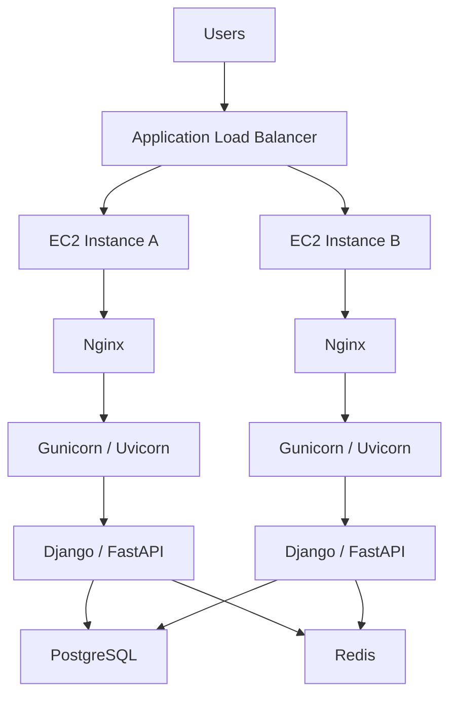
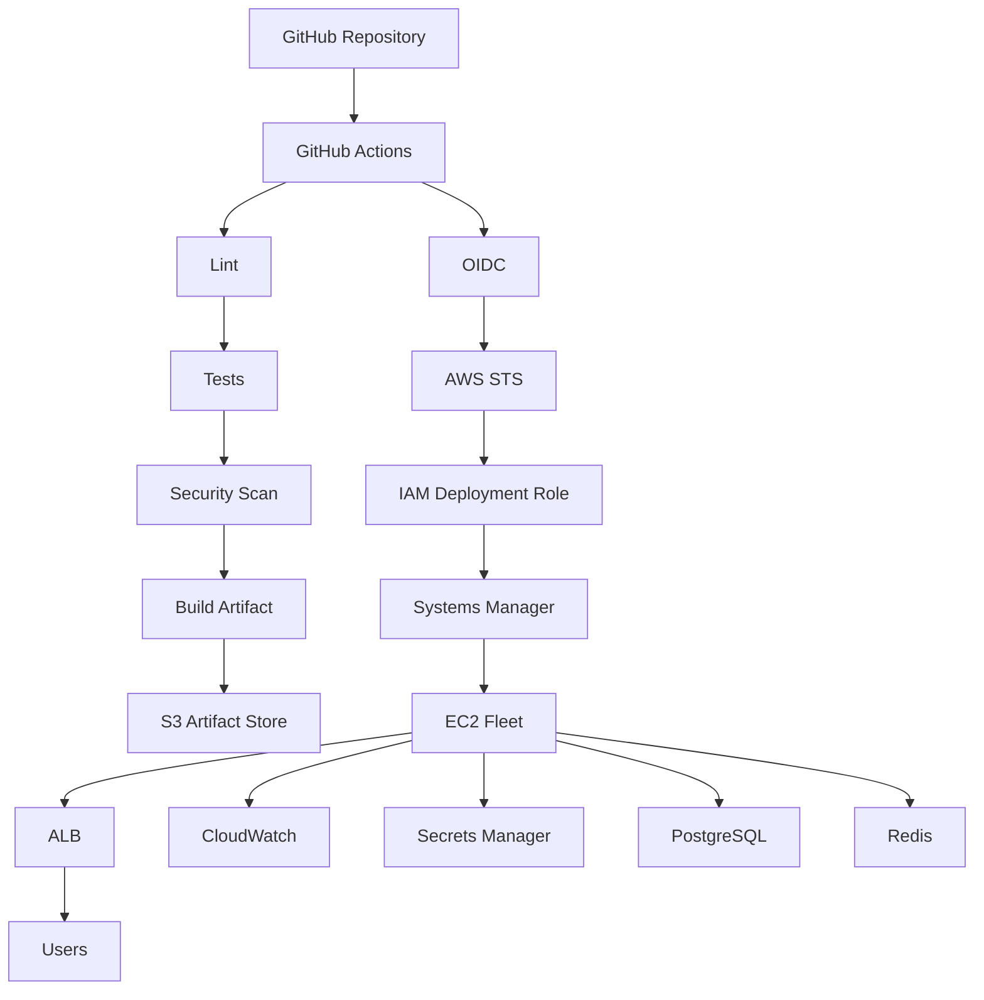

# 15- Amazon EC2 Deployment

## Overview

Amazon Elastic Compute Cloud (EC2) provides virtual machines that can run application workloads with direct control over the operating system, networking, storage, security configuration, and installed software.

In a GitHub Actions CI/CD architecture, EC2 is typically used as the runtime target when the team needs more host-level control than a managed container platform provides.

A common production flow is:

```text
Pull Request
    ↓
Lint
    ↓
Unit Tests
    ↓
Integration Tests
    ↓
Security Scan
    ↓
Build
    ↓
Artifact
    ↓
Staging EC2
    ↓
Health Validation
    ↓
Approval
    ↓
Production EC2
    ↓
Monitoring
    ↓
Rollback
```

For a Python backend, a typical runtime architecture is:

```text
Internet
    ↓
Application Load Balancer
    ↓
EC2
    ↓
Nginx
    ↓
Gunicorn / Uvicorn
    ↓
Django / FastAPI
```

EC2 deployments require more operational responsibility than ECS or other managed compute models because the deployment process may need to manage:

- Operating system packages
- Application processes
- System services
- Nginx
- Python runtime
- Disk space
- Logs
- Security patches
- Process supervision
- Deployment directories
- Rollbacks
- Host health

---

## EC2 in a CI/CD Architecture

EC2 is the runtime layer.

GitHub Actions is the CI/CD orchestration layer.

The artifact registry or object store provides the deployment artifact.


A production deployment should avoid treating the EC2 server as the place where source code is built.

Prefer:

```text
CI
 ↓
Build
 ↓
Test
 ↓
Immutable Artifact
 ↓
EC2 Deployment
```

rather than:

```text
EC2
 ↓
git pull
 ↓
pip install
 ↓
Build
 ↓
Restart
```

---

## Why Deploy to EC2

EC2 is useful when the application requires:

- Operating-system-level customization
- Specialized software
- Custom networking
- Host-level agents
- Legacy applications
- Custom process management
- Persistent local storage requirements
- Specific kernel or system dependencies
- Existing VM-based infrastructure

It also provides flexibility for applications that do not fit neatly into a managed container deployment model.

The trade-off is increased operational responsibility.

---

## EC2 vs ECS

| Concern | EC2 | ECS/Fargate |
|---|---|---|
| OS management | Customer-managed | AWS-managed with Fargate |
| Application packaging | VM/application | Container |
| Host customization | High | Lower |
| Deployment complexity | Higher | Lower |
| Scaling | Instance-based | Task/service-based |
| Patch management | Required | Reduced |
| Process management | Customer responsibility | ECS-managed |
| Infrastructure control | High | More abstracted |
| Typical use | Specialized/custom workloads | Containerized applications |

The choice should be driven by operational and architectural requirements rather than deployment familiarity.

---

## Build Once, Deploy Many

The preferred model is:

```text
Source
  ↓
GitHub Actions
  ↓
Build
  ↓
Test
  ↓
Artifact
  ↓
S3 / Artifact Storage
  ↓
Staging EC2
  ↓
Production EC2
```

Avoid rebuilding directly on the production machine.

For example, the same:

```text
backend-7f3a8e2.tar.gz
```

should be deployable to:

```text
staging
```

and later:

```text
production
```

without modification.

---

## Deployment Artifact

An artifact might contain:

```text
backend-7f3a8e2.tar.gz
```

with:

```text
application/
manage.py
requirements.txt
deployment/
```

The artifact should have a deterministic identity such as:

```text
Git SHA
Release Version
Artifact SHA-256
```

Example:

```text
backend/
└── 7f3a8e2/
    ├── backend.tar.gz
    └── manifest.json
```

---

## Release Manifest

A release manifest can contain:

```json
{
  "service": "backend",
  "version": "2.4.0",
  "commit": "7f3a8e2",
  "artifact": "backend.tar.gz",
  "sha256": "8e3d...",
  "build_run": "123456"
}
```

This allows operators to determine exactly what was deployed.

---

## EC2 Deployment Architecture

A production backend may use:



Multiple EC2 instances provide application-level redundancy.

---

## Single EC2 vs Multiple EC2 Instances

### Single Instance

```text
ALB
 ↓
EC2
```

This is simple but introduces a significant availability dependency on one machine.

### Multiple Instances

```text
ALB
 ├── EC2-A
 ├── EC2-B
 └── EC2-C
```

This provides better fault tolerance and enables rolling deployment strategies.

For production systems, multiple instances across Availability Zones are generally preferable when the workload requires high availability.

---

## Availability Zones

A high-availability architecture can distribute instances:

```text
Region
├── AZ-A
│   └── EC2
├── AZ-B
│   └── EC2
└── AZ-C
    └── EC2
```

The ALB distributes traffic across healthy targets.

This protects against failure of an individual Availability Zone.

---

## Immutable Deployment Directory

Avoid deploying directly into the only live application directory.

Instead use release directories:

```text
/opt/backend/
├── releases/
│   ├── 7f3a8e2/
│   ├── 91ab2c4/
│   └── a31d9e4/
│
└── current -> releases/7f3a8e2
```

The `current` symlink points to the active release.

Deployment becomes:

```text
Upload New Release
       ↓
Extract
       ↓
Validate
       ↓
Switch Symlink
       ↓
Restart Application
```

Rollback becomes:

```text
current
  ↓
previous release
```

---

## Why Release Directories Matter

A deployment such as:

```bash
cp -r new-code/* /opt/backend/
```

can leave a partially updated application if the operation fails.

Release directories isolate deployments:

```text
release A
release B
release C
```

Only after the new release is complete should the active pointer change.

This significantly reduces partial-deployment risk.

---

## EC2 Application Layout

A practical structure is:

```text
/opt/backend/
├── releases/
│   ├── 7f3a8e2/
│   └── 91ab2c4/
├── current -> releases/7f3a8e2
├── shared/
│   ├── logs/
│   └── runtime/
└── deployment/
```

Avoid storing secrets directly inside release directories.

---

## Python Runtime

A production EC2 deployment should control the Python runtime explicitly.

For example:

```text
Python 3.12
Virtual Environment
Application Dependencies
```

Create a virtual environment:

```bash
python3.12 -m venv /opt/backend/venv
```

Install dependencies:

```bash
/opt/backend/venv/bin/pip install \
  -r /opt/backend/current/requirements.txt
```

For stronger reproducibility, pin dependencies through an appropriate lock or requirements strategy.

---

## Dependency Installation

Do not allow production deployment to resolve arbitrary latest dependency versions.

Prefer deterministic dependencies.

For example:

```text
Django==5.2.3
gunicorn==23.0.0
```

or a properly locked dependency set.

Dependency resolution should ideally happen during CI, not unpredictably during production deployment.

---

## Prebuilt Python Dependencies

For large applications, dependency installation can be moved into CI.

For example:

```text
CI
 ↓
Build release
 ↓
Package application + dependencies
 ↓
S3
 ↓
EC2
```

This can reduce deployment time and external dependency availability during production deployment.

The trade-off is larger artifacts and stronger compatibility requirements between the build environment and EC2 runtime.

---

## Docker on EC2

An alternative is to run the application as a Docker container on EC2:

```text
EC2
 └── Docker
      └── Application Container
```

The deployment becomes:

```text
Docker Image
    ↓
Registry
    ↓
EC2
    ↓
docker pull
    ↓
Container
```

At that point, the architecture starts approaching a container-oriented deployment model.

If container orchestration, scaling, and lifecycle management become complex, ECS or Kubernetes may be more appropriate.

---

## Nginx on EC2

A common Python architecture is:

```text
Internet
   ↓
ALB
   ↓
Nginx
   ↓
Gunicorn / Uvicorn
   ↓
Application
```

Nginx can provide:

- Reverse proxying
- Static file serving
- Connection handling
- Request size limits
- TLS termination in some architectures
- Access logging

The exact role depends on whether the ALB already handles TLS and HTTP routing.

---

## Gunicorn with Django

A typical Gunicorn command is:

```bash
/opt/backend/venv/bin/gunicorn \
  --workers 3 \
  --bind 127.0.0.1:8000 \
  config.wsgi:application
```

The correct worker count depends on:

- CPU
- Memory
- Request characteristics
- I/O behavior
- Database capacity

Do not blindly multiply worker count by CPU count.

---

## Uvicorn with FastAPI

A FastAPI deployment may use:

```bash
/opt/backend/venv/bin/uvicorn \
  app.main:app \
  --host 127.0.0.1 \
  --port 8000
```

For production workloads, process management, worker strategy, timeouts, and graceful shutdown should be designed explicitly.

---

## Systemd

Systemd is commonly used to manage application processes on EC2.

Example:

```ini
[Unit]
Description=Backend Application
After=network.target

[Service]
User=backend
Group=backend
WorkingDirectory=/opt/backend/current
EnvironmentFile=/etc/backend/backend.env
ExecStart=/opt/backend/venv/bin/gunicorn \
    --workers 3 \
    --bind 127.0.0.1:8000 \
    config.wsgi:application
Restart=always
RestartSec=5

[Install]
WantedBy=multi-user.target
```

Enable the service:

```bash
sudo systemctl enable backend
```

Start it:

```bash
sudo systemctl start backend
```

Check status:

```bash
sudo systemctl status backend
```

---

## Systemd Deployment Lifecycle

A release deployment can be:

```text
Download Artifact
      ↓
Extract Release
      ↓
Install / Validate Dependencies
      ↓
Run Checks
      ↓
Switch current Symlink
      ↓
systemctl restart backend
      ↓
Health Check
```

The service should not be restarted before the new release is ready.

---

## Graceful Restart

A production deployment should allow existing requests to finish where possible.

The process manager should support:

```text
Stop accepting new work
        ↓
Finish active work
        ↓
Terminate old process
        ↓
Start new process
```

Abruptly killing processes can cause:

- Failed requests
- Interrupted jobs
- Broken connections
- Lost in-memory state

---

## Celery on EC2

Celery workers can run as separate systemd services.

For example:

```text
EC2
├── backend.service
├── celery-worker.service
└── celery-beat.service
```

This allows different process configurations and restart policies.

However, worker workloads may eventually benefit from independent compute and orchestration.

---

## Redis

Redis may be external to EC2:

```text
EC2 Application
      ↓
Redis
```

Avoid treating the local EC2 filesystem as a durable Redis replacement.

For production Redis requirements, managed Redis infrastructure can reduce operational burden.

---

## PostgreSQL

A common architecture is:

```text
EC2
 ↓
Application
 ↓
PostgreSQL
```

For production systems, PostgreSQL is often hosted separately, such as through Amazon RDS or another managed database service.

Do not place the database on the same EC2 instance as the application merely because it is convenient.

Separating failure domains makes scaling, backup, and recovery easier.

---

## Kafka Consumers on EC2

Kafka consumers can run as separate services:

```text
EC2
├── API
└── Kafka Consumer
```

For higher-scale workloads, consumer instances can be independently scaled.

Deployment must account for:

- Consumer group behavior
- Partition assignment
- Graceful shutdown
- Offset handling
- Schema compatibility

---

## Secrets Management

Do not store production credentials in:

```text
.git
.env
Dockerfile
GitHub repository
Deployment artifact
```

Prefer runtime retrieval from:

```text
AWS Secrets Manager
SSM Parameter Store
```

The EC2 instance can use an IAM instance profile to access only the required secrets.

---

## IAM Instance Profile

The EC2 instance should obtain AWS permissions through an IAM instance profile rather than static access keys stored on disk.

Architecture:

```text
EC2
 ↓
Instance Profile
 ↓
IAM Role
 ↓
Temporary AWS Credentials
```

This is safer than:

```text
/etc/aws/credentials
```

containing long-lived production credentials.

---

## EC2 Metadata

Applications running on EC2 can obtain temporary role credentials through the instance metadata service.

Use IMDSv2 where appropriate and avoid exposing instance metadata to untrusted processes.

The application should not need to know the underlying access keys.

---

## Security Groups

A typical architecture is:

```text
Internet
   ↓
ALB Security Group
   ↓
EC2 Security Group
```

The EC2 security group should allow application traffic from the ALB rather than from:

```text
0.0.0.0/0
```

SSH access should also be restricted.

---

## SSH-Based Deployment

A traditional deployment may use SSH:

```text
GitHub Actions
      ↓
SSH
      ↓
EC2
      ↓
Download Artifact
      ↓
Deploy
```

Example:

```bash
ssh deploy@server \
  'sudo /opt/deployment/deploy.sh 7f3a8e2'
```

This works but creates credential and network-management concerns.

---

## SSH Deployment Risks

Potential risks include:

- Private key management
- Long-lived credentials
- Public SSH exposure
- Key rotation
- Bastion configuration
- Runner network access
- Host key management

If SSH is used, keep access narrowly scoped and avoid storing unrestricted private keys in CI.

---

## AWS Systems Manager

Systems Manager can reduce the need for direct SSH.

A deployment can use:

```text
GitHub Actions
      ↓
AWS IAM / OIDC
      ↓
Systems Manager
      ↓
EC2
```

This can avoid exposing SSH to the internet.

It also provides a more centralized operational model.

---

## SSM Run Command

A deployment can invoke a command remotely through Systems Manager.

Conceptually:

```bash
aws ssm send-command \
  --document-name "AWS-RunShellScript" \
  --targets "Key=instanceIds,Values=i-0123456789abcdef0" \
  --parameters commands='["/opt/deployment/deploy.sh 7f3a8e2"]'
```

The exact command should be adapted to the application's deployment model.

---

## OIDC to AWS for EC2 Deployment

GitHub Actions can authenticate using:

```text
GitHub Actions
      ↓
OIDC
      ↓
AWS STS
      ↓
IAM Role
      ↓
SSM / S3 / EC2 APIs
```

The workflow can therefore deploy without storing long-lived AWS credentials.

---

## Deployment Role Permissions

A deployment role may need permissions such as:

```text
s3:GetObject
ssm:SendCommand
ssm:GetCommandInvocation
ec2:DescribeInstances
```

Only grant the actions required by the deployment workflow.

Avoid:

```json
{
  "Action": "*",
  "Resource": "*"
}
```

unless there is a documented and justified infrastructure requirement.

---

## S3-Based EC2 Deployment

A robust pattern is:

```text
GitHub Actions
      ↓
Build Artifact
      ↓
S3
      ↓
SSM
      ↓
EC2
      ↓
Download Artifact
      ↓
Validate
      ↓
Deploy
```

The EC2 host does not need direct access to the Git repository.

---

## Example Deployment Script

```bash
#!/usr/bin/env bash

set -euo pipefail

RELEASE_ID="${1:?release id is required}"
BUCKET="company-artifacts"
ARTIFACT="releases/backend/${RELEASE_ID}/backend.tar.gz"

BASE="/opt/backend"
RELEASE_DIR="${BASE}/releases/${RELEASE_ID}"

mkdir -p "$RELEASE_DIR"

aws s3 cp \
  "s3://${BUCKET}/${ARTIFACT}" \
  "/tmp/backend.tar.gz"

tar -xzf \
  "/tmp/backend.tar.gz" \
  -C "$RELEASE_DIR"

ln -sfn \
  "$RELEASE_DIR" \
  "${BASE}/current"

sudo systemctl restart backend

curl --fail \
  --silent \
  --show-error \
  http://127.0.0.1:8000/health
```

Production deployments should add artifact verification, validation, locking, logging, and rollback handling.

---

## Artifact Verification

Before activation:

```bash
sha256sum backend.tar.gz
```

Compare it with the expected release checksum.

The deployment should not activate an artifact that does not match the expected identity.

---

## Atomic Release Switching

A symlink switch can be effectively atomic:

```bash
ln -sfn \
  /opt/backend/releases/7f3a8e2 \
  /opt/backend/current
```

This is safer than copying files over the live application directory.

The application can then restart against the new release.

---

## Deployment Locking

Two deployments should not modify the same EC2 host concurrently.

For example:

```bash
flock \
  /var/lock/backend-deploy.lock \
  /opt/deployment/deploy.sh 7f3a8e2
```

This prevents concurrent deployment scripts from changing:

```text
current
systemd
release directories
```

at the same time.

GitHub Actions should also use workflow-level concurrency.

---

## GitHub Actions Concurrency

```yaml
concurrency:
  group: production-ec2-deployment
  cancel-in-progress: false
```

This protects the CI/CD control plane.

The EC2-side deployment lock protects the target host.

Using both provides defense in depth.

---

## Health Checks

After deployment:

```bash
curl --fail \
  --silent \
  --show-error \
  https://api.example.com/health
```

For internal validation:

```bash
curl --fail \
  http://127.0.0.1:8000/health
```

The check should verify that the application can actually serve traffic.

---

## Health Check Levels

A mature deployment can use multiple checks:

```text
Process
   ↓
Application
   ↓
HTTP
   ↓
Database
   ↓
Critical Dependency
   ↓
External Traffic
```

Do not make a basic health endpoint perform expensive or fragile dependency checks unless the endpoint's semantics require it.

---

## Rollback

With release directories:

```text
releases/
├── 7f3a8e2/
├── 91ab2c4/
└── a31d9e4/

current -> a31d9e4
```

Rollback can switch:

```text
current -> 91ab2c4
```

Then restart:

```bash
sudo systemctl restart backend
```

The rollback should use a known-good release rather than rebuilding the application.

---

## Automated Rollback

A deployment can follow:

```text
Deploy
  ↓
Health Check
  ↓
Success?
 ├── Yes → Complete
 └── No  → Restore Previous Release
```

A production deployment should define the failure threshold clearly.

---

## Rolling Deployment Across EC2 Instances

For multiple instances:

```text
ALB
├── EC2-A v1
├── EC2-B v1
└── EC2-C v1
```

Deploy sequentially:

```text
EC2-A → v2
Health Check
EC2-B → v2
Health Check
EC2-C → v2
Health Check
```

The ALB should keep unhealthy instances out of rotation.

---

## Blue/Green EC2 Deployment

Maintain separate instance groups:

```text
Blue
v1
```

and:

```text
Green
v2
```

Then switch traffic:

```text
ALB
 ├── Blue
 └── Green
```

After validation:

```text
Traffic → Green
```

Rollback:

```text
Traffic → Blue
```

This provides fast rollback but requires additional capacity.

---

## Auto Scaling Groups

For production workloads, EC2 instances are commonly managed through an Auto Scaling Group.

```text
Auto Scaling Group
├── EC2-A
├── EC2-B
└── EC2-C
```

The group can maintain desired capacity and replace unhealthy instances.

---

## Golden AMI Strategy

A more advanced EC2 deployment approach builds an AMI:

```text
Source
  ↓
CI
  ↓
Build AMI
  ↓
Validate AMI
  ↓
Auto Scaling Group
  ↓
New Instances
```

This differs from deploying application files onto long-lived servers.

---

## Immutable Infrastructure

Instead of modifying servers in place:

```text
Existing EC2
   ↓
Modify
   ↓
Restart
```

use:

```text
New AMI
   ↓
New EC2 Instances
   ↓
Health Check
   ↓
Traffic Shift
   ↓
Terminate Old Instances
```

This reduces configuration drift and makes rollback more deterministic.

---

## Mutable vs Immutable EC2 Deployment

| Model | Characteristics |
|---|---|
| Mutable | Update existing EC2 hosts |
| Immutable | Replace hosts with new versions |
| Release-directory | Keep host but atomically switch application release |
| AMI-based | Build a new machine image and replace instances |

Release-directory deployment is simpler operationally.

AMI-based deployment provides stronger host reproducibility.

---

## EC2 User Data

User Data can bootstrap an instance:

```bash
#!/bin/bash

dnf update -y
dnf install -y nginx python3
systemctl enable nginx
systemctl start nginx
```

User Data is useful for instance initialization but should not become an unstructured replacement for infrastructure-as-code.

---

## Infrastructure as Code

Production EC2 infrastructure should preferably be managed through:

```text
Terraform
CloudFormation
AWS CDK
```

Resources can include:

- VPC
- Subnets
- Security groups
- IAM roles
- EC2
- Auto Scaling Groups
- Load balancers
- Target groups
- S3
- CloudWatch
- Systems Manager

---

## Terraform Architecture

```text
GitHub
   ↓
Terraform Plan
   ↓
Approval
   ↓
Terraform Apply
   ↓
AWS Infrastructure
```

Application deployment remains a separate concern:

```text
CI
 ↓
Artifact
 ↓
EC2 Deployment
```

---

## EC2 Monitoring

Monitor:

- CPU
- Memory
- Disk
- Network
- Load balancer health
- Process health
- Application latency
- Error rates
- Deployment failures
- Instance status checks

CloudWatch can collect infrastructure and application telemetry.

---

## Disk Monitoring

EC2 deployments can fail when disks fill up.

Check:

```bash
df -h
```

and:

```bash
du -sh /opt/backend/releases/*
```

Retain only the number of releases required for rollback and compliance.

---

## Log Management

Avoid allowing:

```text
/var/log
```

to grow without limits.

Use centralized logging and log rotation.

For example:

```text
Application
   ↓
journald
   ↓
CloudWatch Agent / logging pipeline
```

The exact implementation depends on the operating system and observability architecture.

---

## Application Logs

Logs should contain useful context:

```text
timestamp
request id
service
level
message
exception
```

Avoid logging:

```text
passwords
tokens
API keys
authorization headers
sensitive personal data
```

---

## EC2 Security Updates

EC2 requires host patch management.

The team must maintain:

- OS patches
- Kernel updates
- Python runtime
- Nginx
- OpenSSL
- System libraries
- Monitoring agents
- Security tooling

This operational burden is one reason managed container platforms may be preferred when host-level control is unnecessary.

---

## SSM Patch Management

Systems Manager can support centralized instance management and patching.

The architecture can become:

```text
EC2 Fleet
   ↓
Systems Manager
   ↓
Patch / Inventory / Operations
```

This is preferable to manually SSHing into every instance.

---

## Self-Hosted Runner vs Deployment Target

Do not confuse:

```text
GitHub Actions self-hosted runner
```

with:

```text
EC2 application server
```

A self-hosted runner executes CI/CD jobs.

An application EC2 instance runs the production application.

Running both on the same host increases the blast radius.

---

## Self-Hosted Runner Risk

If a production EC2 instance also runs a GitHub Actions runner:

```text
Untrusted Workflow
      ↓
Runner
      ↓
Production Host
```

a workflow compromise could potentially affect the production application.

Prefer separate infrastructure and privilege boundaries.

---

## Production Deployment Architecture



The deployment identity is separate from the application runtime identity.

---

## GitHub Actions Workflow

A simplified deployment workflow can be:

```yaml
name: Deploy EC2

on:
  push:
    branches:
      - main

permissions:
  contents: read
  id-token: write

concurrency:
  group: production-ec2-deployment
  cancel-in-progress: false

jobs:
  build:
    runs-on: ubuntu-latest

    steps:
      - name: Checkout
        uses: actions/checkout@v4

      - name: Install dependencies
        run: |
          python -m pip install --upgrade pip
          pip install -r requirements.txt

      - name: Run tests
        run: |
          pytest

      - name: Build artifact
        run: |
          tar -czf "backend-${GITHUB_SHA}.tar.gz" \
            application/ \
            manage.py \
            requirements.txt

      - name: Configure AWS credentials
        uses: aws-actions/configure-aws-credentials@v4
        with:
          role-to-assume: ${{ vars.AWS_DEPLOY_ROLE_ARN }}
          aws-region: ap-south-1

      - name: Upload artifact
        run: |
          aws s3 cp \
            "backend-${GITHUB_SHA}.tar.gz" \
            "s3://company-artifacts/releases/backend/${GITHUB_SHA}/"

      - name: Deploy through Systems Manager
        run: |
          aws ssm send-command \
            --document-name "AWS-RunShellScript" \
            --targets "Key=tag:Deployment,Values=backend" \
            --parameters commands='[
              "/opt/deployment/deploy.sh '${GITHUB_SHA}'"
            ]'
```

A production implementation should capture the SSM command ID and wait for command completion before reporting deployment success.

---

## Waiting for SSM Deployment

The deployment pipeline should not stop after calling:

```bash
aws ssm send-command
```

It should track execution.

Conceptually:

```text
Send Command
     ↓
Command ID
     ↓
Poll Status
     ↓
Success?
 ├── Yes → Continue
 └── No  → Fail / Rollback
```

This prevents a CI workflow from reporting success while the EC2 deployment is still failing.

---

## Production Deployment State

A useful state model is:

```text
PENDING
   ↓
DOWNLOADING
   ↓
VALIDATING
   ↓
ACTIVATING
   ↓
HEALTH_CHECK
   ↓
SUCCEEDED
```

Failure paths:

```text
Any State
   ↓
FAILED
   ↓
ROLLBACK
```

This state should be observable through deployment logs or summaries.

---

## Deployment Metadata

Record:

```text
Release ID
Git SHA
Artifact
Checksum
Target Instances
Deployment Start
Deployment End
Deployment Result
Rollback Result
```

This creates an operational audit trail.

---

## GitHub Step Summary

GitHub Actions can expose deployment information:

```yaml
- name: Deployment summary
  run: |
    {
      echo "## EC2 Deployment"
      echo "- Commit: $GITHUB_SHA"
      echo "- Environment: production"
      echo "- Artifact: backend-${GITHUB_SHA}.tar.gz"
    } >> "$GITHUB_STEP_SUMMARY"
```

Step summaries are preferable to scattering important deployment metadata across raw logs.

---

## Troubleshooting by Failure Domain

Use:

```text
Symptom
  ↓
Possible Causes
  ↓
Isolation Strategy
  ↓
Commands / Checks
  ↓
Root Cause
  ↓
Corrective Action
  ↓
Prevention
```

This prevents random configuration changes during incidents.

---

## Troubleshooting GitHub Actions

Check:

```bash
gh run view RUN_ID
```

and:

```bash
gh run view RUN_ID --log
```

Verify:

- Workflow trigger
- Permissions
- OIDC
- AWS role
- Artifact creation
- S3 upload
- SSM command

---

## Troubleshooting OIDC

Verify:

```yaml
permissions:
  id-token: write
```

Then inspect the AWS identity:

```bash
aws sts get-caller-identity
```

Check IAM trust conditions for:

- Repository
- Branch
- Environment
- Audience
- Subject

---

## Troubleshooting S3

Check:

```bash
aws s3 ls \
  s3://company-artifacts/releases/backend/
```

Inspect:

```bash
aws s3api head-object \
  --bucket company-artifacts \
  --key releases/backend/7f3a8e2/backend.tar.gz
```

Possible causes:

- Wrong account
- Wrong region
- Wrong prefix
- Missing IAM permission
- Artifact not uploaded

---

## Troubleshooting SSM

Check command execution:

```bash
aws ssm list-command-invocations \
  --details
```

Inspect:

```text
Status
StatusDetails
StandardOutputContent
StandardErrorContent
```

Possible causes:

- Instance not managed by SSM
- Missing instance IAM role
- SSM agent failure
- Command syntax error
- Network connectivity
- Deployment script failure

---

## Troubleshooting EC2

Check instance state:

```bash
aws ec2 describe-instances \
  --instance-ids i-0123456789abcdef0
```

On the instance:

```bash
systemctl status backend
```

Check logs:

```bash
journalctl -u backend \
  --since "15 minutes ago"
```

Check disk:

```bash
df -h
```

Check processes:

```bash
ps aux | grep gunicorn
```

---

## Troubleshooting Nginx

Check:

```bash
sudo nginx -t
```

Then:

```bash
sudo systemctl status nginx
```

Inspect logs:

```bash
sudo tail -f /var/log/nginx/error.log
```

Common causes include:

- Invalid configuration
- Incorrect upstream
- Wrong port
- Permission problems
- TLS configuration
- Application process not running

---

## Troubleshooting Application Health

Test locally:

```bash
curl --fail \
  http://127.0.0.1:8000/health
```

Test through Nginx:

```bash
curl --fail \
  http://127.0.0.1/health
```

Test through the ALB or production hostname:

```bash
curl --fail \
  https://api.example.com/health
```

This isolates:

```text
Application
   ↓
Nginx
   ↓
ALB
   ↓
Internet
```

---

## Troubleshooting High CPU

Check:

```bash
top
```

or:

```bash
htop
```

Investigate:

- Excessive application workers
- Infinite loops
- CPU-heavy tasks
- Unexpected traffic
- Background workers
- Database query behavior

Do not solve every CPU problem by immediately increasing instance size.

---

## Troubleshooting High Memory

Check:

```bash
free -h
```

and:

```bash
ps aux --sort=-%mem | head
```

Possible causes:

- Too many Gunicorn workers
- Memory leaks
- Large request payloads
- Unbounded caches
- Celery worker concurrency
- Python object retention

---

## Troubleshooting Disk Full

Check:

```bash
df -h
```

Find large directories:

```bash
sudo du -xhd1 /var | sort -h
```

Check release storage:

```bash
du -sh /opt/backend/releases/*
```

Remove only releases that are no longer required.

Do not blindly delete logs or application data during an incident.

---

## Troubleshooting Deployment Race Conditions

Possible symptom:

```text
Version A deployed
Version B deployed
Version A becomes active again
```

Potential causes:

- Multiple GitHub Actions runs
- Multiple operators
- Missing EC2 deployment lock
- Multiple automation systems

Use:

```yaml
concurrency:
  group: production-ec2-deployment
  cancel-in-progress: false
```

and an EC2-side lock such as:

```bash
flock /var/lock/backend-deploy.lock ...
```

---

## Troubleshooting Partial Deployment

If some application files belong to one release and others to another, the deployment model is probably modifying the live directory directly.

Prefer:

```text
Release Directory
       ↓
Validate
       ↓
Symlink Switch
```

instead of:

```text
Copy files over current release
```

---

## Troubleshooting Rollback

A rollback can fail if:

- Previous release was deleted
- Dependencies are missing
- Database schema is incompatible
- Shared configuration changed
- Static assets were removed
- Previous process configuration no longer exists

Rollback design must include application, dependencies, configuration, and database compatibility.

---

## Database Migration Compatibility

Suppose:

```text
v1 → v2
```

and v2 removes a column immediately.

During a rolling deployment:

```text
EC2-A → v2
EC2-B → v1
```

v1 may still expect that column.

Use expand/contract migration patterns:

```text
Add new structure
      ↓
Deploy compatible code
      ↓
Migrate data
      ↓
Switch reads/writes
      ↓
Remove old structure
```

---

## EC2 Deployment Security

Security boundaries should include:

```text
GitHub
 ↓
OIDC
 ↓
AWS IAM
 ↓
SSM / S3
 ↓
EC2
 ↓
Application
```

Each layer should have narrowly scoped permissions.

---

## Third-Party Actions

Deployment workflows should minimize third-party action risk.

Review:

- Action source
- Version
- SHA pinning policy
- Permissions
- Secrets available to the job
- Dependency chain

A compromised action running with production AWS permissions can affect the deployment environment.

---

## Untrusted Pull Requests

Never allow untrusted pull-request code to obtain production deployment credentials.

A safer separation is:

```text
Pull Request
    ↓
Tests
    ↓
No Production AWS Access
```

versus:

```text
Main Branch
    ↓
Trusted Workflow
    ↓
OIDC
    ↓
Production Deployment
```

---

## Self-Hosted Runners

If a self-hosted runner has network access to production EC2:

```text
Runner
 ↓
Private Network
 ↓
Production
```

the runner becomes part of the production trust boundary.

Use isolated or ephemeral runners when the security requirements justify them.

---

## EC2 Patch Management

Production instances should have a defined patch lifecycle:

```text
OS Image
   ↓
Security Updates
   ↓
Validation
   ↓
Staging
   ↓
Production
```

Avoid manually patching individual production servers without recording the change.

Configuration drift makes incidents harder to reproduce.

---

## Golden AMI and CI/CD

A mature EC2 platform can combine:

```text
Packer / Image Build
        ↓
Golden AMI
        ↓
Auto Scaling Group
        ↓
Immutable EC2 Fleet
```

The application release can then be baked into the AMI or delivered during controlled instance initialization.

This provides stronger reproducibility than continuously modifying long-lived hosts.

---

## Reliability Considerations

A production EC2 deployment should account for:

- Multiple Availability Zones
- Auto Scaling
- Health checks
- Load balancing
- Graceful shutdown
- Deployment locking
- Immutable releases
- Rollback
- Monitoring
- Backup
- Patch management

Reliability is a property of the entire deployment architecture, not the EC2 instance alone.

---

## Disaster Recovery

A recovery strategy should include:

```text
Infrastructure
+
Application Artifact
+
Configuration
+
IAM
+
Secrets
+
Database
+
DNS
+
Load Balancer
```

Keeping only the EC2 AMI is not enough if the application depends on external databases, Redis, S3, or other services.

---

## Cost Optimization

EC2 deployment cost depends on:

- Instance type
- Instance count
- Runtime hours
- EBS storage
- Data transfer
- Load balancers
- NAT gateways
- CloudWatch logs
- Backup storage

Use right-sized instances and autoscaling where appropriate.

Avoid keeping oversized instances permanently allocated for short-lived deployment peaks.

---

## EC2 Deployment Checklist

### CI

- [ ] Linting succeeds
- [ ] Unit tests succeed
- [ ] Integration tests succeed
- [ ] Security scanning succeeds
- [ ] Artifact is deterministic
- [ ] Artifact checksum is recorded

### AWS Authentication

- [ ] GitHub OIDC is configured
- [ ] Deployment role is least privilege
- [ ] No long-lived AWS keys are stored in GitHub
- [ ] IAM trust policy restricts repository/environment

### Artifact

- [ ] Artifact is stored centrally
- [ ] Artifact is immutable
- [ ] Git SHA is recorded
- [ ] Release manifest exists
- [ ] Previous releases are retained for rollback

### EC2

- [ ] Instances are managed consistently
- [ ] Security groups are restrictive
- [ ] Instance profiles are used
- [ ] SSM is available where appropriate
- [ ] OS patching is defined
- [ ] Disk usage is monitored

### Deployment

- [ ] Releases use separate directories
- [ ] Deployment locking exists
- [ ] Application restart is controlled
- [ ] Health checks run after deployment
- [ ] Rollback is documented
- [ ] Production deployments are serialized

### Operations

- [ ] Application logs are centralized
- [ ] Metrics are monitored
- [ ] ALB health is monitored
- [ ] Deployment metadata is retained
- [ ] Disaster recovery is documented

---

## Common Mistakes

### Running `git pull` Directly on Production

This couples production state to the repository and makes deployments less deterministic.

Prefer immutable artifacts.

### Building on EC2

Production builds can be inconsistent and slow.

Build and test in CI.

### Storing Secrets on Disk

Avoid static AWS credentials and application secrets in files that can be copied or exposed.

### Deploying Directly Into the Live Directory

A failed copy can leave a partially updated application.

Use release directories and atomic activation.

### No Deployment Lock

Concurrent deployments can corrupt the active release state.

### One EC2 Instance for Production

A single instance creates a major availability dependency.

### No Process Manager

Running Gunicorn or Uvicorn directly from an SSH session is not a production process-management strategy.

Use systemd or another controlled process manager.

### Restarting Before Validation

Do not activate a release before its files, dependencies, and configuration have been validated.

### No Health Check

A successful process restart does not prove that the application is healthy.

### Storing Database on the Application Instance

This couples application and database failure domains.

Use an appropriate managed database architecture when possible.

### Using a Self-Hosted Runner on the Production Server

This increases the blast radius of workflow compromise.

Keep CI execution and production runtime isolated.

---

## Senior Design Principles

### Treat EC2 as Runtime Infrastructure

CI should produce the artifact.

EC2 should execute it.

### Prefer Immutable Releases

Use:

```text
release-id
   ↓
release directory
   ↓
validation
   ↓
atomic activation
```

### Separate Deployment Identity from Runtime Identity

GitHub Actions should use a deployment IAM role.

The EC2 application should use its own instance profile or application identity.

### Protect Both Control Planes

Protect:

```text
GitHub Actions concurrency
```

and:

```text
EC2 deployment locking
```

### Make Rollback Deterministic

Keep known-good releases and make the active release independently selectable.

### Design for Coexistence

Rolling deployments can temporarily run multiple application versions.

Database and API compatibility must account for that.

### Minimize Host Drift

Use:

- Infrastructure as Code
- Golden AMIs
- SSM
- Configuration management
- Controlled patching

rather than manually modifying servers.

---

## Interview Questions

### What is Amazon EC2?

EC2 provides virtual machines in AWS with control over the operating system, networking, storage, and installed software.

### How would GitHub Actions deploy an application to EC2?

A typical flow is:

```text
GitHub Actions
 ↓
Build
 ↓
Test
 ↓
Artifact
 ↓
S3
 ↓
SSM
 ↓
EC2
 ↓
Deploy
 ↓
Health Check
```

### Why should you avoid `git pull` on production?

It makes production state dependent on the current repository state and can introduce untested or non-deterministic changes.

### How would you implement rollback?

Store immutable release directories and switch the active `current` symlink back to the previous known-good release.

### Why use S3 for EC2 deployment?

S3 provides durable centralized artifact storage and separates artifact creation from runtime deployment.

### Why use Systems Manager instead of SSH?

SSM can reduce direct SSH exposure and allows AWS IAM-based operational access without requiring persistent SSH credentials.

### How does GitHub Actions authenticate with AWS securely?

Use GitHub OIDC to assume an IAM role through AWS STS and obtain temporary credentials.

### What is an EC2 instance profile?

It provides an IAM role to an EC2 instance so applications can obtain temporary AWS credentials without storing static access keys.

### How would you deploy Django to EC2?

A common architecture is:

```text
ALB
 ↓
Nginx
 ↓
Gunicorn
 ↓
Django
 ↓
PostgreSQL
```

The application release is stored separately and activated atomically.

### How would you deploy FastAPI?

A typical deployment uses:

```text
ALB
 ↓
Nginx
 ↓
Uvicorn
 ↓
FastAPI
```

with a process manager such as systemd.

### Why use release directories?

They prevent partial file replacement and make rollback a simple switch between known release versions.

### How would you prevent two deployments from modifying the same EC2 instance?

Use GitHub Actions concurrency plus an EC2-side deployment lock such as `flock`.

### How would you perform zero-downtime deployment across EC2 instances?

Use multiple instances behind an ALB, deploy one or more instances at a time, validate health, and keep unhealthy or updating instances out of traffic.

### What is a blue/green EC2 deployment?

Two environments or instance groups are maintained. Traffic is shifted from the old group to the new group after validation, providing a straightforward rollback path.

### Why are database migrations difficult during rolling deployment?

Old and new application versions can coexist. A migration must therefore remain compatible with both versions during the transition.

### What would you check if the application process is running but the API is unavailable?

Check:

```text
Application
 ↓
Listening Port
 ↓
Nginx
 ↓
Security Group
 ↓
ALB Target
 ↓
Health Check
 ↓
DNS
```

### How would you troubleshoot high memory usage?

Inspect instance memory, process memory, Gunicorn/Uvicorn workers, Celery concurrency, caches, and application behavior before deciding whether to scale the instance.

### How would you design EC2 for high availability?

Use multiple instances across Availability Zones behind an ALB, health checks, Auto Scaling, centralized monitoring, and externalized state.

### When would you choose ECS instead of EC2?

When containerized workloads do not require host-level control and the operational benefits of managed container orchestration outweigh the need for direct VM management.

### How would you prevent a compromised GitHub Action from compromising production EC2?

Use least-privilege GitHub permissions, OIDC with tightly scoped IAM trust, protected production environments, trusted/pinned actions, isolated runners, restricted SSM permissions, and separation between CI infrastructure and production hosts.

### How would you design a production EC2 deployment for rollback?

Use immutable artifacts, versioned release directories, release manifests, checksums, deployment locking, health validation, retained previous releases, and an atomic active-release switch.

## Key Takeaways

- EC2 provides strong host-level control but shifts responsibility for patching, process management, security, scaling, logging, and operational consistency to the engineering team.
- Build artifacts in CI, store them centrally, and deploy immutable releases to EC2 instead of building or running `git pull` directly on production hosts.
- Use GitHub OIDC for AWS authentication, IAM instance profiles for EC2 runtime access, and Systems Manager where practical to reduce dependence on long-lived SSH credentials.
- Release directories, atomic symlink switching, deployment locks, health checks, and retained previous releases provide a deterministic foundation for safe deployment and rollback.
- Production EC2 architecture should separate CI from runtime infrastructure and combine load balancing, multi-AZ capacity, monitoring, security, infrastructure-as-code, and recovery planning.