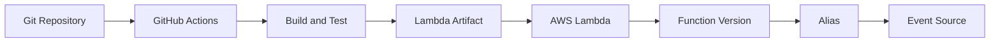
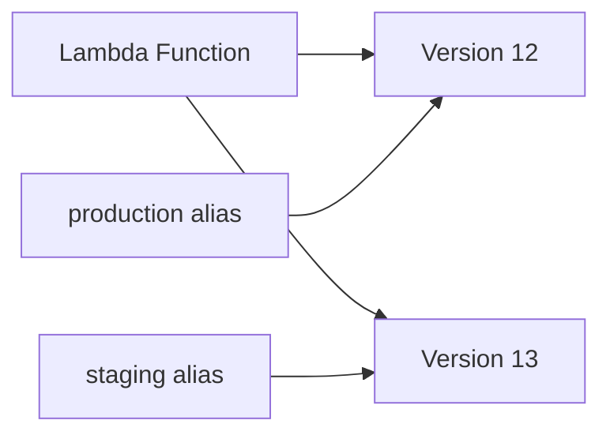
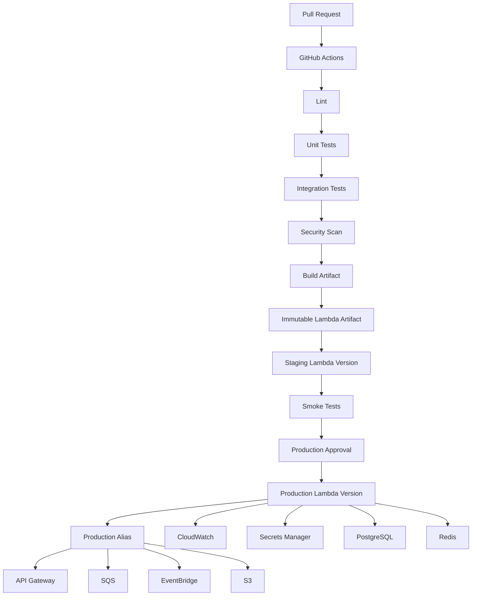

# 16- AWS Lambda Deployment

## Overview

AWS Lambda is a serverless compute service that executes application code in response to events without requiring the engineering team to manage application servers.

In a GitHub Actions CI/CD architecture, Lambda is typically treated as a deployable application artifact rather than as a server that must be manually configured.

A production deployment should follow:

```text
Pull Request
    ↓
Lint
    ↓
Unit Tests
    ↓
Integration Tests
    ↓
Security Scan
    ↓
Build
    ↓
Package Lambda
    ↓
Immutable Artifact
    ↓
Staging
    ↓
Validation
    ↓
Approval
    ↓
Production
    ↓
Monitoring
    ↓
Rollback
```

For Python backends, Lambda can run:

- Python application code
- API handlers
- Event processors
- Scheduled jobs
- S3 processors
- SQS consumers
- EventBridge handlers
- Lightweight background workloads

The deployment model differs significantly from EC2.

With EC2:

```text
Artifact
 ↓
Server
 ↓
Process
 ↓
Application
```

With Lambda:

```text
Artifact
 ↓
Lambda Function Version
 ↓
Alias
 ↓
Event Source / API Gateway / EventBridge
```

This distinction is fundamental to designing safe Lambda deployments.

---

## Lambda Deployment Model

A Lambda function consists of:

- Function code
- Runtime
- Handler
- Environment variables
- IAM execution role
- Memory configuration
- Timeout
- Concurrency configuration
- Layers where applicable
- Event source configuration
- Networking configuration where applicable

A simplified architecture is:



The deployment pipeline should manage these components deliberately rather than treating `aws lambda update-function-code` as the entire deployment strategy.

---

## Lambda Deployment vs EC2 Deployment

| Concern | Lambda | EC2 |
|---|---|---|
| Server management | AWS-managed | Customer-managed |
| Deployment unit | Function version/code | Server/application release |
| Scaling | Managed automatically | Instance-based |
| Process management | AWS-managed | Customer-managed |
| OS patching | AWS-managed | Customer-managed |
| Runtime | Managed Lambda runtime/custom runtime | Customer-managed |
| Artifact | ZIP or container image | Application package/image |
| Rollback | Versions/aliases | Release or infrastructure rollback |
| Traffic shifting | Aliases / deployment mechanisms | ALB/instances |
| Persistent local storage | Not intended for durable application state | Possible |
| Long-running workloads | Usually unsuitable | Suitable depending on design |

---

## Lambda Execution Lifecycle

A Lambda invocation generally follows:

```text
Event
 ↓
Lambda Service
 ↓
Select Function Version
 ↓
Execution Environment
 ↓
Handler
 ↓
Response
```

The execution environment may be reused.

Therefore, application code must not assume:

```text
Every invocation starts from a completely clean process
```

Nor should it rely on reuse for correctness.

---

## Cold Starts

A cold start occurs when Lambda needs to initialize a new execution environment.

Conceptually:

```text
Invocation
   ↓
Create Environment
   ↓
Initialize Runtime
   ↓
Load Dependencies
   ↓
Import Application
   ↓
Execute Handler
```

Subsequent invocations may reuse the environment.

Cold-start latency can be affected by:

- Package size
- Dependency count
- Runtime initialization
- VPC configuration
- Initialization logic
- Memory allocation
- Layer size
- Container image size

Keep initialization efficient.

---

## Python Lambda Handler

A simple Python handler:

```python
import json


def handler(event, context):
    return {
        "statusCode": 200,
        "body": json.dumps({"message": "ok"}),
    }
```

The configured handler would be:

```text
app.handler
```

where:

```text
app.py
```

contains:

```python
def handler(event, context):
    ...
```

---

## Handler Responsibilities

Keep the handler thin.

Prefer:

```python
def handler(event, context):
    request = parse_event(event)
    result = service.process(request)
    return format_response(result)
```

rather than putting all business logic into:

```python
def handler(event, context):
    # hundreds of lines
```

This improves:

- Unit testing
- Maintainability
- Reuse
- Error handling
- Local development

---

## Recommended Lambda Project Structure

A Python Lambda can use:

```text
lambda-service/
├── app/
│   ├── __init__.py
│   ├── handler.py
│   ├── services/
│   ├── repositories/
│   └── models/
├── tests/
├── requirements.txt
└── template.yaml
```

For larger applications, separate:

```text
handler
service
repository
integration
configuration
```

boundaries.

---

## Lambda Deployment Packages

Lambda code can commonly be deployed as:

- ZIP archives
- Container images

The appropriate packaging model depends on:

- Dependency size
- Runtime requirements
- Build complexity
- Existing Docker workflow
- Organizational standards

---

## ZIP Deployment

A ZIP deployment contains application code and dependencies.

Example:

```text
lambda.zip
├── app.py
├── services/
├── models/
└── installed dependencies
```

The deployment artifact can be uploaded directly to Lambda.

---

## Building a Python ZIP Artifact

A typical build process is:

```bash
rm -rf build lambda.zip

mkdir -p build

pip install \
  -r requirements.txt \
  -t build/

cp -r app.py services/ models/ build/

cd build
zip -r ../lambda.zip .
cd ..
```

The exact package layout must match the configured handler.

---

## Lambda Package Architecture

```text
GitHub Actions
      ↓
Checkout
      ↓
Install Dependencies
      ↓
Package
      ↓
lambda.zip
      ↓
Upload
      ↓
Lambda Function
```

The build environment should match the Lambda runtime and architecture.

---

## Lambda Layers

Lambda Layers allow shared code or dependencies to be packaged separately.

Example:

```text
Function
├── Application Code
└── Layer
     └── Shared Dependencies
```

Layers can be useful when multiple functions share large dependency sets.

However, excessive layer usage can increase operational complexity.

---

## Layer Versioning

Layers are versioned.

A function can reference:

```text
Layer v1
Layer v2
Layer v3
```

Avoid mutating shared dependencies without tracking versions.

A production deployment should know exactly which layer version the function uses.

---

## When to Use Layers

Layers are useful for:

- Shared dependencies
- Common libraries
- Organization-wide runtime utilities
- Large reusable components

They are less useful when:

- Only one function uses the dependency
- Deployment complexity outweighs reuse
- Dependencies change frequently

---

## Container Image Deployment

Lambda also supports container images.

Architecture:

```text
GitHub Actions
      ↓
Docker Buildx
      ↓
Container Image
      ↓
ECR
      ↓
Lambda
```

This integrates naturally with an existing Docker and ECR pipeline.

---

## Lambda Container Image

A simplified Dockerfile:

```dockerfile
FROM public.ecr.aws/lambda/python:3.12

COPY requirements.txt .

RUN pip install \
    -r requirements.txt \
    -t ${LAMBDA_TASK_ROOT}

COPY app.py ${LAMBDA_TASK_ROOT}/

CMD ["app.handler"]
```

The image is then pushed to ECR.

---

## ZIP vs Container Image

| Concern | ZIP | Container Image |
|---|---|---|
| Simplicity | High | Medium |
| Docker knowledge | Not required | Required |
| Large dependency sets | Less convenient | Convenient |
| Existing Docker pipeline | Separate | Reusable |
| ECR required | No | Yes |
| Image scanning | Not image-based | Supported |
| Build reproducibility | Good with locked dependencies | Strong with image digest |
| Runtime customization | More limited | More flexible |

Do not choose containers merely because the rest of the organization uses Docker.

Choose the packaging model that reduces operational complexity for the workload.

---

## Build Once, Deploy Many

The Lambda deployment should follow the same artifact-promotion principle used elsewhere in CI/CD.

```text
Source
 ↓
Build
 ↓
Test
 ↓
Artifact
 ↓
Staging
 ↓
Approval
 ↓
Production
```

Do not rebuild the Lambda package separately for production.

For ZIP deployments:

```text
lambda-7f3a8e2.zip
```

For container deployments:

```text
ECR image digest
```

should identify the immutable artifact.

---

## Lambda Versions

Lambda supports published versions.

For example:

```text
Function
├── $LATEST
├── Version 10
├── Version 11
└── Version 12
```

`$LATEST` is mutable.

Published versions provide immutable deployment targets.

Production traffic should preferably reference a published version rather than relying directly on `$LATEST`.

---

## Lambda Aliases

An alias is a stable name pointing to a Lambda version.

Example:

```text
production → version 12
staging    → version 13
```

The application can invoke:

```text
production
```

instead of hardcoding:

```text
version 12
```

This makes traffic management and rollback significantly easier.

---

## Alias-Based Deployment



A deployment can therefore publish version 13 and change the staging alias without immediately changing production traffic.

---

## Recommended Promotion Model

```text
Build
 ↓
Publish Version N
 ↓
Staging Alias → Version N
 ↓
Integration / Smoke Tests
 ↓
Approval
 ↓
Production Alias → Version N
```

This is safer than modifying `$LATEST` and treating it as production.

---

## Environment Configuration

Do not bake environment-specific secrets into the artifact.

Use:

```text
Lambda Configuration
      ↓
Environment Variables
```

and secure secret stores where appropriate.

For example:

```text
DATABASE_HOST
API_BASE_URL
LOG_LEVEL
```

can be configuration.

Secrets such as:

```text
DATABASE_PASSWORD
API_TOKEN
```

should generally come from an appropriate secrets-management system.

---

## Environment Variables

Lambda environment variables are associated with the function configuration.

Example:

```yaml
Environment:
  Variables:
    LOG_LEVEL: INFO
    SERVICE_NAME: payments
```

Environment-specific values should be managed separately from application source code.

---

## Secrets Manager

A Lambda function can retrieve secrets from AWS Secrets Manager.

Architecture:

```text
Lambda
  ↓
Execution Role
  ↓
Secrets Manager
  ↓
Secret
```

The IAM execution role should only have access to the required secret.

---

## Parameter Store

AWS Systems Manager Parameter Store can also provide configuration.

Use it for suitable parameters and secrets-management use cases.

The important design principle is:

```text
Application Artifact ≠ Environment Secrets
```

---

## Lambda Execution Role

The execution role defines what the function can do at runtime.

For example:

```text
Lambda
  ↓
Execution Role
  ├── CloudWatch Logs
  ├── S3 Read
  └── SQS Receive
```

Avoid granting:

```text
AdministratorAccess
```

to application functions.

---

## Deployment Role vs Execution Role

These are different identities.

```text
GitHub Actions
      ↓
Deployment IAM Role
      ↓
Lambda APIs
```

while:

```text
Lambda Runtime
      ↓
Execution IAM Role
      ↓
AWS Services
```

Separating them reduces blast radius.

---

## GitHub Actions OIDC

A production GitHub Actions workflow should avoid long-lived AWS access keys.

Use:

```text
GitHub Actions
      ↓
OIDC Token
      ↓
AWS STS
      ↓
IAM Role
      ↓
Lambda Deployment
```

Workflow permissions:

```yaml
permissions:
  contents: read
  id-token: write
```

---

## Lambda Deployment Permissions

A deployment role may need permissions such as:

```text
lambda:UpdateFunctionCode
lambda:PublishVersion
lambda:UpdateAlias
lambda:GetFunction
lambda:GetAlias
```

For container deployments, it may also require appropriate ECR permissions.

Keep permissions scoped to the required functions and resources.

---

## AWS CLI Deployment

Update ZIP code:

```bash
aws lambda update-function-code \
  --function-name payments-api \
  --zip-file fileb://lambda.zip
```

Publish a version:

```bash
aws lambda publish-version \
  --function-name payments-api
```

Inspect versions:

```bash
aws lambda list-versions-by-function \
  --function-name payments-api
```

---

## Updating an Alias

```bash
aws lambda update-alias \
  --function-name payments-api \
  --name production \
  --function-version 12
```

The alias now points to the selected published version.

---

## Waiting for Deployment Completion

A deployment pipeline should not immediately assume that the update is ready.

Use:

```bash
aws lambda wait function-updated \
  --function-name payments-api
```

Then validate configuration and invoke the function where appropriate.

---

## Lambda Deployment State

A production pipeline should distinguish:

```text
Build
 ↓
Upload
 ↓
Update
 ↓
Publish
 ↓
Validate
 ↓
Promote
```

A failed deployment should not automatically move the production alias.

---

## Lambda Function URLs and API Gateway

Lambda can be exposed through different event integrations.

Common architectures include:

```text
API Gateway
    ↓
Lambda
```

or:

```text
Application
    ↓
Lambda Function URL
```

The deployment mechanism should account for the entry point but should keep application artifact promotion separate from API routing configuration.

---

## Event-Driven Lambda

Lambda is particularly useful for event-driven workloads.

Examples:

```text
S3
 ↓
Lambda
```

```text
SQS
 ↓
Lambda
```

```text
EventBridge
 ↓
Lambda
```

```text
API Gateway
 ↓
Lambda
```

The deployment pipeline must validate both function code and event integration assumptions.

---

## SQS Lambda Deployment

A common architecture is:

```text
Producer
   ↓
SQS
   ↓
Lambda
   ↓
Database / External API
```

Deployment considerations include:

- Batch size
- Visibility timeout
- Reserved concurrency
- Error handling
- Dead-letter queues
- Idempotency

Changing Lambda behavior can affect message processing semantics.

---

## Kafka and Lambda

Where Kafka is used as an event source:

```text
Kafka
 ↓
Lambda
 ↓
Application Logic
```

Deployments must consider:

- Event schema compatibility
- Consumer behavior
- Batch processing
- Failure handling
- Retry behavior
- Offset semantics

A function deployment is not isolated from its event contract.

---

## Database Compatibility

Lambda deployments can have the same database migration problem as rolling EC2 deployments.

Suppose:

```text
Version 10
```

and:

```text
Version 11
```

can both process requests during a deployment.

Database changes should therefore remain compatible with both versions until traffic is fully migrated.

Use expand/contract migration strategies.

---

## Django with Lambda

Django can be deployed to Lambda through appropriate adapters, but it is not automatically a natural fit for every Django workload.

Consider:

- Cold starts
- ORM connection management
- Package size
- Static files
- Long-running requests
- Background workers
- WebSocket requirements
- Database connection limits

For conventional always-on Django APIs, container or VM architectures may be operationally simpler.

---

## FastAPI with Lambda

FastAPI can be adapted to Lambda using an ASGI adapter.

The architecture becomes:

```text
API Gateway
    ↓
Lambda Adapter
    ↓
FastAPI
```

This can work well for suitable API workloads but should be evaluated against latency, traffic profile, dependency initialization, and operational requirements.

---

## Database Connections

Lambda scaling can create many concurrent execution environments.

If every invocation creates a new database connection:

```text
Many Lambda Instances
       ↓
Many DB Connections
       ↓
Database Exhaustion
```

Use appropriate connection-management strategies and consider managed connection pooling solutions where applicable.

---

## Lambda Concurrency

Lambda can scale concurrent executions.

Relevant controls include:

- Reserved concurrency
- Provisioned concurrency
- Account concurrency limits

Concurrency should be designed alongside downstream capacity.

For example:

```text
Lambda
1000 concurrent invocations
        ↓
PostgreSQL
100 connections
```

can create a downstream bottleneck.

---

## Reserved Concurrency

Reserved concurrency can protect downstream systems.

Conceptually:

```text
Lambda
 ↓
Maximum 50 concurrent executions
 ↓
Database
```

This can prevent uncontrolled scaling from overwhelming a dependency.

---

## Provisioned Concurrency

Provisioned concurrency keeps execution environments initialized to reduce cold-start latency.

It is useful for latency-sensitive workloads where predictable startup performance matters.

The trade-off is additional cost.

---

## Lambda Timeout

Configure timeout based on actual workload requirements.

Avoid using an excessively large timeout to hide slow application behavior.

A timeout should reflect:

```text
Expected Processing Time
+
Reasonable Failure Bound
```

Long-running workloads may be better suited to:

- ECS
- EC2
- Batch
- Step Functions
- Queue-based workers

depending on the workload.

---

## Memory and CPU

Lambda memory allocation also affects available CPU resources.

Increasing memory can sometimes reduce execution time enough to lower total cost.

Therefore:

```text
Higher Memory
≠
Always Higher Cost
```

Benchmark realistic workloads rather than optimizing from memory size alone.

---

## Lambda Container Image Deployment

For containerized Lambda:

```text
GitHub Actions
 ↓
Docker Buildx
 ↓
Security Scan
 ↓
ECR
 ↓
Lambda Update
 ↓
Publish Version
 ↓
Alias Promotion
```

Use an immutable image digest where possible.

---

## Docker Image Tagging

Useful tags include:

```text
7f3a8e2
2.4.0
```

But tags are mutable references.

For production identity, the digest is stronger:

```text
sha256:abc123...
```

Promotion should preserve the exact image identity.

---

## ECR Workflow

```bash
aws ecr get-login-password \
  --region ap-south-1 |
docker login \
  --username AWS \
  --password-stdin \
  "${AWS_ACCOUNT_ID}.dkr.ecr.ap-south-1.amazonaws.com"
```

Build:

```bash
docker buildx build \
  --platform linux/amd64 \
  -t "${IMAGE_URI}:${GITHUB_SHA}" \
  --push \
  .
```

Then update Lambda with the image URI or immutable digest as appropriate.

---

## Lambda Image Architecture

Ensure the image architecture matches the Lambda function configuration.

Common architectures include:

```text
x86_64
arm64
```

A mismatch can result in deployment or runtime failures.

---

## Multi-Architecture Builds

Buildx can produce architecture-specific images:

```bash
docker buildx build \
  --platform linux/amd64,linux/arm64 \
  --push \
  -t "${IMAGE_URI}:${GITHUB_SHA}" \
  .
```

The Lambda function must still be configured consistently with the architecture it will execute.

---

## Lambda Deployment with GitHub Actions

A production-oriented workflow can be structured as:

```yaml
name: Deploy Lambda

on:
  push:
    branches:
      - main

permissions:
  contents: read
  id-token: write

concurrency:
  group: production-lambda-deployment
  cancel-in-progress: false

jobs:
  test:
    runs-on: ubuntu-latest

    steps:
      - name: Checkout
        uses: actions/checkout@v4

      - name: Setup Python
        uses: actions/setup-python@v5
        with:
          python-version: "3.12"

      - name: Install dependencies
        run: |
          python -m pip install --upgrade pip
          pip install -r requirements.txt

      - name: Run tests
        run: pytest

  package:
    needs: test
    runs-on: ubuntu-latest

    steps:
      - name: Checkout
        uses: actions/checkout@v4

      - name: Build Lambda package
        run: |
          rm -rf build lambda.zip
          mkdir build

          pip install \
            -r requirements.txt \
            -t build/

          cp -r app.py build/

          cd build
          zip -r ../lambda.zip .
          cd ..

      - name: Upload artifact
        uses: actions/upload-artifact@v4
        with:
          name: lambda-package
          path: lambda.zip

  deploy-staging:
    needs: package
    runs-on: ubuntu-latest
    environment: staging

    permissions:
      contents: read
      id-token: write

    steps:
      - name: Download artifact
        uses: actions/download-artifact@v4
        with:
          name: lambda-package

      - name: Configure AWS credentials
        uses: aws-actions/configure-aws-credentials@v4
        with:
          role-to-assume: ${{ vars.AWS_DEPLOY_ROLE_ARN }}
          aws-region: ap-south-1

      - name: Deploy Lambda
        run: |
          aws lambda update-function-code \
            --function-name payments-api-staging \
            --zip-file fileb://lambda.zip

      - name: Wait for deployment
        run: |
          aws lambda wait function-updated \
            --function-name payments-api-staging

  promote:
    needs: deploy-staging
    runs-on: ubuntu-latest
    environment: production

    permissions:
      contents: read
      id-token: write

    steps:
      - name: Configure AWS credentials
        uses: aws-actions/configure-aws-credentials@v4
        with:
          role-to-assume: ${{ vars.AWS_DEPLOY_ROLE_ARN }}
          aws-region: ap-south-1

      - name: Publish version
        run: |
          VERSION=$(aws lambda publish-version \
            --function-name payments-api-staging \
            --query Version \
            --output text)

          echo "version=$VERSION" >> "$GITHUB_OUTPUT"
```

In a real implementation, staging and production should normally use the same immutable artifact and should not accidentally publish from different function code.

---

## Reusable Deployment Workflow

Lambda deployments are good candidates for reusable workflows.

For example:

```text
Repository A
    ↓
Reusable Lambda Deployment Workflow

Repository B
    ↓
Reusable Lambda Deployment Workflow

Repository C
    ↓
Reusable Lambda Deployment Workflow
```

Inputs might include:

```yaml
on:
  workflow_call:
    inputs:
      function-name:
        required: true
        type: string
      environment:
        required: true
        type: string
```

This centralizes:

- OIDC
- Permissions
- Packaging
- Deployment
- Validation
- Rollback conventions

---

## Environment Protection

Use GitHub Environments:

```text
staging
production
```

Production can require:

- Manual approval
- Restricted branches
- Environment-specific variables
- Environment-specific secrets
- Deployment history

The production environment should not be accessible from arbitrary pull-request workflows.

---

## Deployment Concurrency

Production Lambda deployments should generally be serialized.

```yaml
concurrency:
  group: production-lambda
  cancel-in-progress: false
```

This prevents two workflows from attempting to promote different versions simultaneously.

---

## Canary Deployment

Lambda versions and aliases can support gradual traffic shifting.

Conceptually:

```text
production alias

95% → Version 12
 5% → Version 13
```

Observe:

- Error rate
- Duration
- Throttles
- Business metrics

Then increase traffic to the new version if validation succeeds.

---

## Blue/Green Lambda Deployment

A blue/green model can use:

```text
Blue → Version 12
Green → Version 13
```

Traffic is shifted after validation.

Rollback:

```text
production → Version 12
```

This is especially useful when a fast rollback path is important.

---

## Health Validation

A deployment should validate:

- Function state
- Published version
- Invocation success
- Error rate
- Latency
- Downstream connectivity
- Event processing

For API-based Lambda:

```bash
curl --fail \
  https://api.example.com/health
```

For event-driven Lambda, invoke a controlled test event where appropriate.

---

## Smoke Testing

A smoke test should validate the production deployment without generating unnecessary load.

Example:

```text
Deploy Version
    ↓
Invoke Health/Test Event
    ↓
Validate Response
    ↓
Check Errors
```

Do not use destructive production test data.

---

## Monitoring

Important Lambda metrics include:

- Invocations
- Errors
- Duration
- Throttles
- Concurrent executions
- Iterator age for applicable event sources
- Dead-letter behavior
- Destination failures

Also monitor business-level signals.

Infrastructure success does not necessarily mean application success.

---

## Structured Logging

Python applications should use structured logs where possible.

Example:

```python
import logging

logger = logging.getLogger()
logger.setLevel(logging.INFO)


def handler(event, context):
    logger.info(
        "processing_request",
        extra={
            "request_id": context.aws_request_id,
        },
    )

    return {"statusCode": 200}
```

Ensure sensitive values are not emitted.

---

## Lambda Tracing

Distributed applications may benefit from distributed tracing.

Tracing can help connect:

```text
API Gateway
 ↓
Lambda
 ↓
Database / AWS Service
```

This is especially valuable when debugging latency across multiple services.

---

## Lambda and Redis

Lambda can use Redis for:

- Caching
- Short-lived state
- Rate limiting
- Shared coordination

However, VPC networking and connection lifecycle must be considered.

Do not create expensive infrastructure connections unnecessarily on every invocation.

---

## Lambda and VPC

A Lambda function can be attached to a VPC when it needs private access to resources such as:

- RDS
- ElastiCache
- Internal services

Architecture:

```text
Lambda
 ↓
VPC Subnet
 ↓
Private Resource
```

VPC configuration introduces networking considerations and should not be enabled merely because other AWS resources use a VPC.

---

## NAT and Internet Access

A Lambda function in private subnets may require appropriate egress architecture to reach public AWS or internet endpoints.

Incorrect networking can produce:

```text
Function executes
 ↓
External request
 ↓
Timeout
```

Troubleshoot:

- Route tables
- NAT
- Security groups
- Network ACLs
- DNS
- VPC endpoints

---

## Lambda Layers vs Shared Python Packages

Avoid creating a layer for every internal library.

Layers introduce version-management overhead.

Use them when shared dependency reuse materially improves:

- Build time
- Package size
- Standardization

Otherwise, keeping dependencies inside the function artifact can be simpler.

---

## Artifact Security

For ZIP artifacts:

```text
Source
 ↓
Build
 ↓
Test
 ↓
Checksum
 ↓
Artifact
```

For container images:

```text
Source
 ↓
Build
 ↓
Scan
 ↓
Digest
 ↓
ECR
```

The production deployment should know exactly which artifact was promoted.

---

## SBOM and Provenance

For security-sensitive workloads, generate:

- SBOM
- Build provenance
- Artifact attestations
- Signatures where appropriate

This provides visibility into:

```text
Source
 ↓
Dependencies
 ↓
Build
 ↓
Artifact
 ↓
Deployment
```

---

## Lambda Rollback

ZIP-based rollback can publish or restore a known-good version.

Alias rollback is particularly straightforward:

```bash
aws lambda update-alias \
  --function-name payments-api \
  --name production \
  --function-version 12
```

The key requirement is retaining known-good versions.

---

## Rollback Triggers

Possible rollback triggers include:

- Elevated error rate
- Increased latency
- Failed smoke test
- Dependency incompatibility
- Database compatibility issue
- Event processing failures
- Business metric degradation

Rollback criteria should be defined before deployment.

---

## Rollback Limitations

Application rollback does not automatically roll back:

- Database migrations
- External API changes
- Infrastructure changes
- Data mutations
- Event schema changes

Therefore, rollback must be designed at the system level.

---

## Infrastructure as Code

Lambda infrastructure should preferably be managed through:

- Terraform
- CloudFormation
- AWS CDK

Infrastructure may include:

```text
Lambda
IAM
API Gateway
EventBridge
SQS
S3
CloudWatch
Secrets Manager
VPC
ECR
```

This reduces configuration drift.

---

## Terraform and Lambda

Terraform can define:

```hcl
resource "aws_lambda_function" "api" {
  function_name = "payments-api"
  role          = aws_iam_role.lambda_exec.arn

  runtime = "python3.12"
  handler = "app.handler"

  filename         = "lambda.zip"
  source_code_hash = filebase64sha256("lambda.zip")
}
```

The infrastructure and application artifact lifecycle should be designed carefully so that Terraform does not unintentionally become the only application deployment mechanism.

---

## Lambda Deployment Separation

A useful enterprise separation is:

```text
Infrastructure Pipeline
        ↓
IAM / Lambda / API Gateway / Event Sources

Application Pipeline
        ↓
Build / Test / Package / Promote Lambda Version
```

This reduces coupling between infrastructure changes and application releases.

---

## GitHub CLI Operations

Inspect workflow runs:

```bash
gh run list
```

Inspect a specific run:

```bash
gh run view RUN_ID
```

View logs:

```bash
gh run view RUN_ID --log
```

Rerun:

```bash
gh run rerun RUN_ID
```

Inspect repository workflows:

```bash
gh workflow list
```

Trigger a manual workflow:

```bash
gh workflow run deploy-lambda.yml
```

---

## AWS CLI Operations

Get current AWS identity:

```bash
aws sts get-caller-identity
```

Inspect a function:

```bash
aws lambda get-function \
  --function-name payments-api
```

List versions:

```bash
aws lambda list-versions-by-function \
  --function-name payments-api
```

Inspect alias:

```bash
aws lambda get-alias \
  --function-name payments-api \
  --name production
```

Invoke:

```bash
aws lambda invoke \
  --function-name payments-api \
  response.json
```

---

## Troubleshooting Workflow Syntax

### Symptom

The workflow does not start.

### Possible Causes

- Invalid YAML
- Incorrect event
- Branch filter mismatch
- Path filter mismatch
- Workflow file location
- Workflow disabled

### Isolation

Inspect the workflow and trigger conditions.

Use:

```bash
gh workflow list
```

### Prevention

Keep triggers explicit and test manual dispatch paths where appropriate.

---

## Troubleshooting OIDC

### Symptom

AWS authentication fails.

### Possible Causes

- Missing `id-token: write`
- Incorrect IAM trust policy
- Wrong repository condition
- Wrong branch/environment
- Incorrect audience
- Incorrect role ARN

### Check

```bash
aws sts get-caller-identity
```

Verify the IAM trust policy and GitHub environment configuration.

---

## Troubleshooting Lambda Update

### Symptom

`update-function-code` fails.

### Possible Causes

- Incorrect function name
- Wrong region
- Missing IAM permission
- Invalid ZIP
- Architecture mismatch
- Artifact path error

### Check

```bash
aws lambda get-function \
  --function-name payments-api
```

Confirm:

- Region
- Function name
- Runtime
- Architecture
- Deployment package

---

## Troubleshooting Handler Errors

### Symptom

Lambda deploys successfully but invocation fails.

### Possible Causes

- Incorrect handler
- Missing dependency
- Import error
- Runtime incompatibility
- Environment configuration
- Packaging path

Check CloudWatch logs and verify the package structure.

For:

```text
app.handler
```

the artifact must contain:

```text
app.py
```

with:

```python
def handler(event, context):
    ...
```

---

## Troubleshooting Dependency Failures

### Symptom

```text
Unable to import module
```

Possible causes:

- Dependency not packaged
- Wrong Python version
- Native library compiled for the wrong architecture
- Incorrect ZIP directory structure

For native dependencies, build them in an environment compatible with the Lambda runtime and architecture.

---

## Troubleshooting Cold Starts

### Symptom

High initial invocation latency.

### Investigate

- Package size
- Dependency imports
- Initialization code
- VPC configuration
- Memory size
- Provisioned concurrency requirements

Avoid loading unnecessary libraries during module initialization.

---

## Troubleshooting Timeouts

### Symptom

Lambda invocation times out.

### Investigate

```text
Lambda
 ↓
Network
 ↓
Database
 ↓
External API
```

Check:

- Timeout setting
- Database connectivity
- Security groups
- Route tables
- NAT
- DNS
- External API latency

Do not simply increase timeout without identifying the slow dependency.

---

## Troubleshooting Throttling

### Symptom

Lambda returns throttling errors.

### Possible Causes

- Account concurrency limit
- Reserved concurrency
- Traffic spike
- Downstream protection
- Event-source behavior

Investigate concurrency metrics and downstream capacity together.

---

## Troubleshooting Database Exhaustion

### Symptom

Lambda functions experience database connection failures.

### Cause

Lambda concurrency can scale faster than database connection capacity.

Example:

```text
500 Lambda executions
        ↓
500 database connections
        ↓
Database connection exhaustion
```

Use appropriate connection management, pooling, concurrency controls, and managed database integration patterns.

---

## Troubleshooting Event Processing

For SQS, investigate:

- Queue depth
- Visibility timeout
- Batch size
- Lambda concurrency
- Failed messages
- Dead-letter queue
- Processing duration

A deployment that changes processing time can alter queue behavior even if the Lambda function itself reports successful invocations.

---

## Common Mistakes

### Deploying `$LATEST` Directly to Production

`$LATEST` is mutable.

Prefer published versions and aliases.

### Rebuilding for Production

Rebuilding introduces artifact drift.

Promote the same tested artifact.

### Storing AWS Access Keys in GitHub Secrets

Prefer GitHub OIDC and temporary AWS credentials.

### Giving Lambda Administrator Access

Use a narrowly scoped execution role.

### Giving the Deployment Role Excessive Permissions

The CI deployment role should only manage required Lambda and supporting resources.

### Packaging Dependencies Incorrectly

Lambda requires the handler and dependencies to exist at the expected package paths.

### Ignoring Architecture

`x86_64` and `arm64` builds are not interchangeable.

### Opening Database Access Broadly

Use restrictive security groups and network controls.

### Creating a Database Connection Per Invocation

Lambda concurrency can quickly exhaust database capacity.

### Treating Lambda as an EC2 Server

Lambda is an event-driven execution environment, not a persistent server.

### Using Lambda for Long-Running Workloads

If the workload naturally exceeds Lambda execution constraints or requires persistent processes, consider another compute model.

### Storing Stateful Application Data in `/tmp`

Temporary storage is not a durable application database.

### Embedding Secrets in Environment Variables Without a Secret Strategy

Environment variables are configuration, not a complete secret-management architecture.

### Deploying Without Health Validation

A successful AWS API call does not prove that the application works correctly.

---

## Production Architecture

A mature Lambda CI/CD architecture can look like:



The important boundaries are:

```text
Source
 ↓
CI
 ↓
Artifact
 ↓
Lambda Version
 ↓
Alias
 ↓
Production Traffic
```

---

## High Availability

Lambda provides managed execution infrastructure, but application availability still depends on:

- Downstream databases
- External APIs
- Event sources
- Concurrency limits
- IAM
- Network configuration
- Deployment correctness

Do not equate serverless compute with automatic system-wide availability.

---

## Disaster Recovery

A Lambda recovery plan should include:

```text
Source Code
+
Deployment Artifact
+
Lambda Configuration
+
IAM
+
Event Sources
+
Secrets
+
Database
+
Infrastructure as Code
```

If the function can be recreated but the required event sources, IAM roles, or database cannot, recovery remains incomplete.

---

## Cost Optimization

Lambda cost depends on factors such as:

- Requests
- Execution duration
- Memory allocation
- Architecture
- Provisioned concurrency
- Data transfer
- Supporting services

Optimize the complete workload.

For example:

```text
Higher Memory
 ↓
Shorter Execution
 ↓
Potentially Similar or Lower Cost
```

Benchmark before making changes.

---

## Reliability vs Cost Trade-Offs

| Technique | Reliability / Performance Benefit | Cost / Complexity |
|---|---|---|
| Provisioned concurrency | Lower cold-start impact | Higher cost |
| Reserved concurrency | Protects dependencies | Limits scaling |
| More memory | Faster execution | Higher per-unit allocation |
| Layers | Dependency reuse | Version complexity |
| Container images | Flexible packaging | ECR/image complexity |
| Canary deployment | Safer rollout | More deployment complexity |
| Extensive observability | Better diagnosis | Additional cost |

---

## Senior Design Considerations

### Separate Artifact Identity from Deployment Target

The artifact should identify what was built.

The alias should identify where traffic goes.

```text
Artifact
   ↓
Version
   ↓
Alias
```

### Separate Deployment and Runtime Permissions

```text
GitHub Actions
    ↓
Deployment Role

Lambda
    ↓
Execution Role
```

### Make Rollback a First-Class Operation

Rollback should be an explicit, tested workflow rather than an emergency manual procedure.

### Protect Downstream Systems

Lambda can scale rapidly.

Database, Redis, Kafka, and external APIs may not.

Concurrency must be designed across the entire dependency graph.

### Treat Configuration as a Separate Lifecycle

Application code, secrets, infrastructure, and event routing should not be unnecessarily coupled into one deployment artifact.

---

## Interview Scenarios

### Production Lambda Deployment

Design:

```text
PR
 ↓
Tests
 ↓
Security Scan
 ↓
Package
 ↓
Staging
 ↓
Smoke Test
 ↓
Approval
 ↓
Production
```

Explain how the same artifact is promoted.

### Secure AWS Authentication

Explain:

```text
GitHub OIDC
 ↓
STS
 ↓
IAM Role
 ↓
Lambda APIs
```

and why this is preferable to long-lived access keys.

### Lambda Rollback

Explain how:

```text
Version 12
Version 13
```

can coexist while:

```text
production → Version 12
```

is changed to:

```text
production → Version 13
```

and later restored.

### Lambda and PostgreSQL

Explain why uncontrolled Lambda concurrency can exhaust database connections and how concurrency and connection management can protect the database.

### Lambda Canary Deployment

Explain how traffic can be gradually shifted from an existing Lambda version to a new version while monitoring errors and latency.

### Lambda vs EC2

Explain why Lambda is suitable for event-driven, bounded workloads while EC2 provides greater host-level control and supports long-running processes.

### ZIP vs Container Image

Explain the packaging trade-offs and when an existing Docker/ECR pipeline makes container-based Lambda deployment attractive.

### Production Deployment Race

Two GitHub Actions workflows try to deploy different Lambda versions simultaneously.

Explain how:

```yaml
concurrency:
  group: production-lambda
  cancel-in-progress: false
```

prevents overlapping production deployments.

### Compromised GitHub Action

Explain how least-privilege permissions, OIDC trust restrictions, environment protection, action pinning, and isolated runners reduce the potential blast radius.

### Database Migration During Lambda Deployment

Explain how old and new Lambda versions may execute concurrently and why database changes must remain backward-compatible during the transition.

---

## Production Checklist

### CI

- [ ] Linting succeeds
- [ ] Unit tests succeed
- [ ] Integration tests succeed
- [ ] Security scanning succeeds
- [ ] Dependencies are deterministic
- [ ] Artifact identity is recorded

### Lambda Artifact

- [ ] ZIP or container image is reproducible
- [ ] Dependencies match the runtime
- [ ] Architecture is correct
- [ ] Artifact is immutable
- [ ] Artifact checksum or image digest is recorded
- [ ] SBOM/provenance is generated where required

### AWS Authentication

- [ ] GitHub OIDC is configured
- [ ] Deployment IAM role is least privilege
- [ ] No long-lived AWS keys are stored
- [ ] Trust policy restricts repository and deployment context

### Lambda

- [ ] Execution role is least privilege
- [ ] Environment configuration is separated from code
- [ ] Secrets use an appropriate secret store
- [ ] Timeout is appropriate
- [ ] Memory is benchmarked
- [ ] Concurrency is designed
- [ ] Logging and metrics are enabled

### Deployment

- [ ] Published versions are used
- [ ] Aliases identify environments
- [ ] Staging validation occurs before production
- [ ] Production requires appropriate approval
- [ ] Deployment concurrency is configured
- [ ] Rollback is tested

### Operations

- [ ] CloudWatch monitoring is configured
- [ ] Error and duration metrics are monitored
- [ ] Event-source failures are observable
- [ ] Database capacity is monitored
- [ ] Infrastructure is managed as code
- [ ] Disaster recovery is documented

## Key Takeaways

- Treat Lambda deployment as immutable artifact promotion: build and test once, publish a version, validate it, and promote the same version through environment aliases.
- Use GitHub OIDC with least-privilege IAM roles for CI/CD and keep deployment permissions separate from the Lambda execution role.
- Published Lambda versions and aliases provide the foundation for controlled releases, canary or blue/green traffic shifting, and deterministic rollback.
- Lambda can scale rapidly, so concurrency, database connections, Redis, Kafka, external APIs, and other downstream capacity must be designed together.
- Production Lambda deployment requires more than updating function code: secure packaging, configuration, event integrations, observability, deployment protection, rollback, and infrastructure recovery must all be part of the architecture.