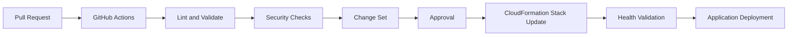
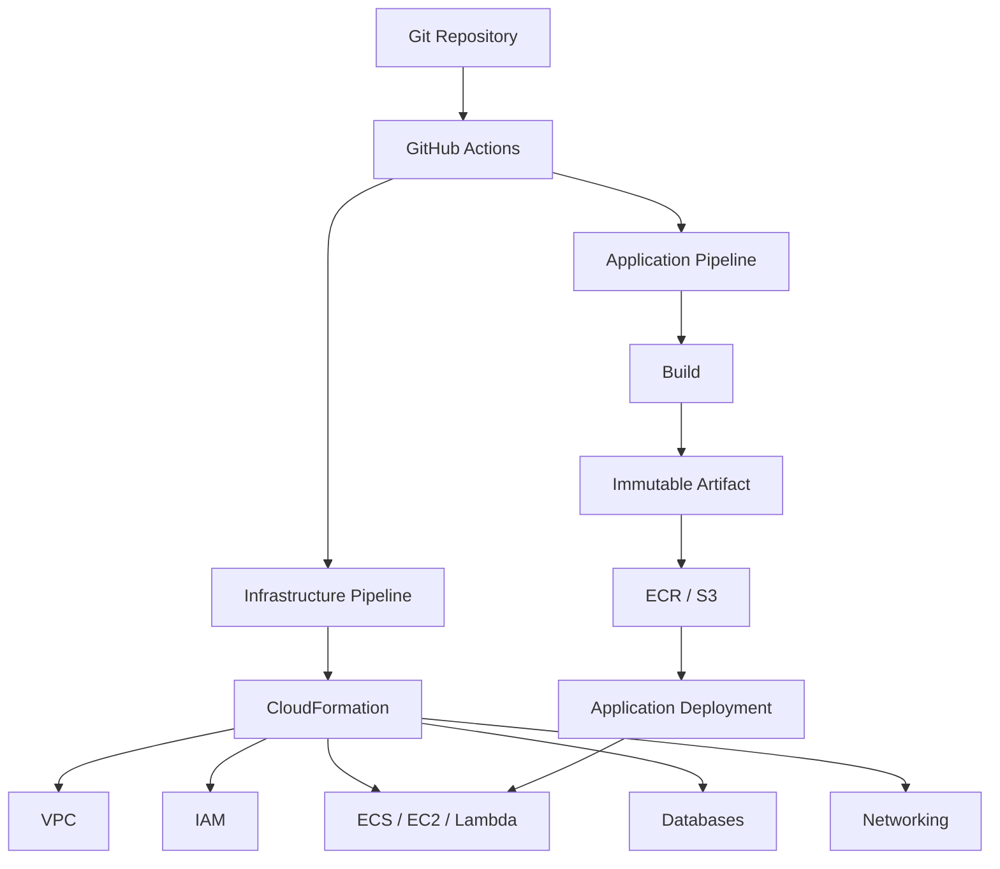

# 17- CloudFormation Deployment

## Overview

AWS CloudFormation is an infrastructure-as-code service for defining and managing AWS resources through declarative templates.

In a GitHub Actions CI/CD system, CloudFormation is typically used to provision or update infrastructure while application deployment pipelines deploy application artifacts onto that infrastructure.

A production architecture often separates:

```text
Application Pipeline
    ↓
Build
    ↓
Test
    ↓
Artifact
    ↓
Application Deployment
```

from:

```text
Infrastructure Pipeline
    ↓
Validate Template
    ↓
Plan / Change Set
    ↓
Approval
    ↓
CloudFormation Stack Update
    ↓
Health Validation
```

For AWS-backed Python systems, CloudFormation can manage resources such as:

- Lambda
- API Gateway
- ECS
- EC2
- IAM
- S3
- ECR
- SQS
- SNS
- EventBridge
- RDS
- VPC
- Security Groups
- CloudWatch
- Load Balancers

The important CI/CD principle is to distinguish **infrastructure state** from **application artifacts**.

```text
CloudFormation
    → What infrastructure should exist?

Application Deployment
    → Which application artifact should run on that infrastructure?
```

---

## CloudFormation in a CI/CD Architecture

A typical deployment flow is:



The exact ordering depends on the architecture.

For example, an infrastructure pipeline may create:

```text
VPC
ECR
ECS
IAM
ALB
RDS
```

while an application pipeline subsequently deploys:

```text
Docker Image
    ↓
ECR
    ↓
ECS Service
```

---

## CloudFormation Fundamentals

A CloudFormation template describes AWS resources declaratively.

A simplified template:

```yaml
AWSTemplateFormatVersion: "2010-09-09"

Resources:
  ApplicationBucket:
    Type: AWS::S3::Bucket
```

CloudFormation interprets the template and creates the requested resource.

The engineering model is:

```text
Template
    ↓
CloudFormation
    ↓
AWS Resources
```

Rather than manually executing:

```bash
aws s3api create-bucket ...
aws iam create-role ...
aws ec2 run-instances ...
```

the desired infrastructure is represented in code.

---

## Why CloudFormation Matters in CI/CD

Infrastructure created manually can drift away from the intended configuration.

CloudFormation provides:

- Declarative infrastructure
- Version-controlled configuration
- Repeatable deployments
- Dependency management
- Change sets
- Stack lifecycle management
- Drift detection
- Rollback mechanisms
- Integration with AWS services

This allows infrastructure changes to follow a controlled software-engineering workflow.

---

## CloudFormation Stack

A stack is the deployment unit managed by CloudFormation.

For example:

```text
payments-production
```

could contain:

```text
VPC
ALB
ECS Cluster
ECS Service
IAM Roles
CloudWatch Logs
SQS
RDS
```

CloudFormation tracks the resources associated with the stack.

---

## CloudFormation Resources

Resources are declared under:

```yaml
Resources:
```

Example:

```yaml
Resources:
  ApplicationQueue:
    Type: AWS::SQS::Queue

  ApplicationBucket:
    Type: AWS::S3::Bucket
```

Each logical ID is local to the template.

The logical ID:

```text
ApplicationQueue
```

is not necessarily the physical AWS resource name.

---

## Parameters

Parameters allow a template to accept deployment-specific values.

```yaml
Parameters:
  Environment:
    Type: String
    AllowedValues:
      - staging
      - production

  InstanceType:
    Type: String
    Default: t3.small
```

Parameters can be useful for:

- Environment names
- VPC IDs
- Subnet IDs
- Instance types
- Domain names
- Feature configuration

Avoid using parameters as a substitute for proper configuration management.

---

## Mappings

Mappings provide static lookup data.

Example:

```yaml
Mappings:
  EnvironmentConfig:
    staging:
      InstanceType: t3.small
    production:
      InstanceType: t3.medium
```

Mappings are appropriate for relatively static configuration.

For dynamic configuration, parameters, SSM Parameter Store, or other configuration mechanisms may be more appropriate.

---

## Conditions

Conditions allow resources or properties to be created only when specific conditions are satisfied.

```yaml
Conditions:
  IsProduction: !Equals
    - !Ref Environment
    - production
```

A resource can then use:

```yaml
Condition: IsProduction
```

This is useful when environments have materially different infrastructure requirements.

---

## Outputs

Outputs expose useful stack values.

```yaml
Outputs:
  QueueArn:
    Description: Application queue ARN
    Value: !GetAtt ApplicationQueue.Arn
```

Outputs can be consumed by:

- Operators
- Other deployment processes
- CloudFormation exports
- CLI queries

Avoid exposing secrets through outputs.

---

## Intrinsic Functions

CloudFormation provides intrinsic functions for constructing values dynamically.

Common functions include:

```text
Ref
Fn::GetAtt
Fn::Sub
Fn::Join
Fn::If
Fn::Equals
Fn::FindInMap
Fn::ImportValue
```

Example:

```yaml
Environment:
  Variables:
    SERVICE_NAME: !Sub "${AWS::StackName}-api"
```

---

## Resource Dependencies

CloudFormation builds a dependency graph from resource references.

For example:

```text
VPC
 ↓
Subnet
 ↓
Security Group
 ↓
Load Balancer
 ↓
Target Group
 ↓
ECS Service
```

When possible, let CloudFormation infer dependencies through references rather than manually forcing them.

Explicit dependencies can be used when required:

```yaml
DependsOn:
  - SomeResource
```

Overusing `DependsOn` can make infrastructure unnecessarily sequential.

---

## CloudFormation Template Validation

Validate a template before attempting deployment:

```bash
aws cloudformation validate-template \
  --template-body file://template.yaml
```

For larger templates, validation should be part of pull-request CI.

Validation catches structural problems but does not guarantee that the resulting architecture is correct.

---

## CloudFormation Linting

Use additional static validation where appropriate.

For example:

```bash
cfn-lint template.yaml
```

A production CI pipeline can perform:

```text
YAML Validation
    ↓
CloudFormation Validation
    ↓
cfn-lint
    ↓
Security Checks
    ↓
Change Set
```

---

## CloudFormation Change Sets

A change set previews how a stack update would affect resources.

Conceptually:

```text
Current Stack
     ↓
New Template
     ↓
Change Set
     ↓
Review
     ↓
Execute
```

This is valuable for production infrastructure changes.

---

## Creating a Change Set

Example:

```bash
aws cloudformation create-change-set \
  --stack-name payments-production \
  --template-body file://template.yaml \
  --change-set-name release-${GITHUB_SHA} \
  --change-set-type UPDATE
```

Inspect:

```bash
aws cloudformation describe-change-set \
  --stack-name payments-production \
  --change-set-name release-${GITHUB_SHA}
```

Execute only after appropriate validation and approval.

---

## Change Set Types

A change set can represent:

- Stack creation
- Stack update
- Resource replacement
- Resource modification
- Resource deletion

Resource replacement deserves particular attention.

A seemingly small template change can cause:

```text
Existing Resource
      ↓
Replacement
      ↓
New Resource
```

which may cause downtime, data loss, or changed identifiers depending on the resource.

---

## Resource Replacement

Not every property update happens in place.

Some changes require resource replacement.

Examples can include changes to properties whose update behavior is replacement-oriented.

Production review should therefore ask:

```text
Will this update modify the resource?

Will it replace the resource?

Will replacement destroy data?

Will dependent resources also change?
```

---

## Stack Update Lifecycle

A simplified lifecycle is:

```text
Template
   ↓
Validate
   ↓
Create Change Set
   ↓
Review
   ↓
Execute
   ↓
CREATE_IN_PROGRESS / UPDATE_IN_PROGRESS
   ↓
CREATE_COMPLETE / UPDATE_COMPLETE
```

Failures may produce states such as:

```text
UPDATE_FAILED
UPDATE_ROLLBACK_IN_PROGRESS
UPDATE_ROLLBACK_COMPLETE
```

Deployment automation must understand these states.

---

## Stack Rollback

CloudFormation can automatically roll back certain failed stack updates.

Conceptually:

```text
Current Version
      ↓
Stack Update
      ↓
Failure
      ↓
Rollback
      ↓
Previous State
```

However, rollback is not equivalent to complete application recovery.

External changes, data mutations, and manually modified resources may not be automatically undone.

---

## CloudFormation and Application Deployment

Do not unnecessarily combine:

```text
Infrastructure Deployment
```

with:

```text
Application Deployment
```

For example:

```text
CloudFormation
    ↓
ECS Cluster
    ↓
ECS Service
```

can be managed separately from:

```text
Docker Build
    ↓
ECR
    ↓
ECS Task Definition
    ↓
ECS Deployment
```

This separation allows application releases to occur without recreating infrastructure.

---

## Build Once, Deploy Many

The same artifact-promotion principle applies.

```text
Source
 ↓
Build
 ↓
Test
 ↓
Artifact
 ↓
Staging
 ↓
Production
```

CloudFormation should not cause application artifacts to be rebuilt independently for every environment.

For containerized applications:

```text
Docker Image Digest
        ↓
Staging
        ↓
Production
```

should remain identical.

---

## CloudFormation and Lambda

CloudFormation can define Lambda infrastructure.

Example:

```yaml
Resources:
  PaymentsFunction:
    Type: AWS::Lambda::Function
    Properties:
      Runtime: python3.12
      Handler: app.handler
      Role: !GetAtt LambdaExecutionRole.Arn
      Code:
        S3Bucket: !Ref ArtifactBucket
        S3Key: !Ref LambdaArtifactKey
```

The application artifact and infrastructure definition should have clear ownership.

---

## CloudFormation and ECS

CloudFormation can manage:

```text
ECS Cluster
ECS Task Definition
ECS Service
Load Balancer
Target Group
Security Groups
IAM Roles
```

The application pipeline can then update the task definition with the immutable ECR image.

---

## CloudFormation and EC2

CloudFormation can provision:

```text
VPC
Subnet
Security Group
EC2
EBS
IAM Role
Load Balancer
Auto Scaling Group
```

Application deployment can remain separate:

```text
Infrastructure
    ↓
EC2 Fleet

Application Artifact
    ↓
EC2 Deployment
```

This separation is especially important for independently deployable backend releases.

---

## CloudFormation and API Gateway

CloudFormation can define API Gateway resources and integrations.

A typical architecture is:

```text
Client
  ↓
API Gateway
  ↓
Lambda
  ↓
Application Services
```

Infrastructure changes should be reviewed separately from Lambda application releases when practical.

---

## CloudFormation and IAM

IAM resources are often part of the infrastructure stack.

Example:

```yaml
Resources:
  LambdaExecutionRole:
    Type: AWS::IAM::Role
```

IAM changes require careful review because an infrastructure deployment can unintentionally expand application privileges.

Follow least privilege.

---

## CloudFormation and VPC

A production stack may manage:

```text
VPC
├── Public Subnets
├── Private Subnets
├── Route Tables
├── NAT
├── Internet Gateway
├── Security Groups
└── VPC Endpoints
```

Network changes can have a much larger blast radius than an application deployment.

Treat them accordingly.

---

## Stack Parameters in GitHub Actions

GitHub Actions can pass parameters:

```bash
aws cloudformation deploy \
  --template-file template.yaml \
  --stack-name payments-staging \
  --parameter-overrides \
    Environment=staging \
    ImageTag="${GITHUB_SHA}"
```

This allows the infrastructure template to remain reusable across environments.

---

## `aws cloudformation deploy`

The AWS CLI provides:

```bash
aws cloudformation deploy
```

Example:

```bash
aws cloudformation deploy \
  --template-file template.yaml \
  --stack-name payments-staging \
  --capabilities CAPABILITY_IAM \
  --parameter-overrides \
    Environment=staging
```

For production, the command should be wrapped in a controlled workflow with validation, permissions, concurrency, and appropriate approval.

---

## Capabilities

CloudFormation may require capabilities when templates create or modify certain IAM resources.

Common capability flags include:

```text
CAPABILITY_IAM
CAPABILITY_NAMED_IAM
CAPABILITY_AUTO_EXPAND
```

Do not add capability flags blindly.

Review what the template is allowed to create.

---

## CloudFormation IAM Security

A deployment role may require permissions such as:

```text
cloudformation:ValidateTemplate
cloudformation:CreateChangeSet
cloudformation:DescribeChangeSet
cloudformation:ExecuteChangeSet
cloudformation:DescribeStacks
```

However, CloudFormation often needs permissions to create or modify the underlying resources as well.

A highly privileged deployment role therefore represents a significant security boundary.

---

## CloudFormation Service Role

For stronger separation, CloudFormation can operate using a service role.

Conceptually:

```text
GitHub Actions
      ↓
Deployment Role
      ↓
CloudFormation
      ↓
CloudFormation Service Role
      ↓
AWS Resources
```

This separates:

```text
Who can request a stack operation?
```

from:

```text
What resources can CloudFormation create or modify?
```

The exact role architecture should reflect organizational security requirements.

---

## GitHub Actions OIDC

Avoid long-lived AWS access keys in GitHub Actions.

Use:

```text
GitHub Actions
      ↓
OIDC Token
      ↓
AWS STS
      ↓
IAM Role
      ↓
CloudFormation
```

Workflow permissions:

```yaml
permissions:
  contents: read
  id-token: write
```

The IAM trust policy should restrict:

- Repository
- Organization
- Branch
- Environment
- Appropriate workflow context

---

## GitHub Actions CloudFormation Workflow

A production-oriented workflow can look like:

```yaml
name: Deploy Infrastructure

on:
  pull_request:
    paths:
      - "infrastructure/**"

  push:
    branches:
      - main
    paths:
      - "infrastructure/**"

permissions:
  contents: read

jobs:
  validate:
    runs-on: ubuntu-latest

    steps:
      - name: Checkout
        uses: actions/checkout@v4

      - name: Validate template
        run: |
          aws cloudformation validate-template \
            --template-body file://infrastructure/template.yaml

      - name: Lint template
        run: |
          pip install cfn-lint
          cfn-lint infrastructure/template.yaml
```

AWS authentication should be configured explicitly before AWS CLI commands in a real deployment job.

---

## Production Infrastructure Workflow

A stronger architecture is:

```text
Pull Request
    ↓
Template Validation
    ↓
Lint
    ↓
Security Scan
    ↓
Change Set / Review
    ↓
Merge
    ↓
Staging Deployment
    ↓
Validation
    ↓
Production Approval
    ↓
Production Change Set
    ↓
Execute
    ↓
Health Validation
```

---

## Environment Promotion

Use separate stacks or logically isolated environments.

For example:

```text
payments-staging
payments-production
```

The same infrastructure definition can be parameterized for each environment.

Do not allow production configuration to be accidentally sourced from staging variables.

---

## GitHub Environments

GitHub Environments can protect production infrastructure deployments.

Example:

```text
staging
production
```

Production can require:

- Required reviewers
- Restricted deployment branches
- Environment-specific variables
- Environment-specific secrets
- Deployment history

---

## Deployment Concurrency

Infrastructure deployment races can be dangerous.

Example:

```text
Workflow A → production stack
Workflow B → production stack
```

Both workflows may attempt to update the same stack.

Use:

```yaml
concurrency:
  group: production-cloudformation
  cancel-in-progress: false
```

This serializes production infrastructure updates.

---

## Why Cancel-In-Progress Is Risky for Infrastructure

For pull-request CI:

```yaml
cancel-in-progress: true
```

may be appropriate.

For infrastructure deployment:

```yaml
cancel-in-progress: false
```

is often safer because cancelling an active infrastructure operation can leave a workflow in an ambiguous operational state.

The exact behavior should be designed around the deployment mechanism rather than applied mechanically.

---

## Change Sets and Approval

A strong production pattern is:

```text
Create Change Set
       ↓
Inspect Changes
       ↓
Approval
       ↓
Execute Change Set
```

Review should pay particular attention to:

- Resource replacement
- IAM changes
- Network changes
- Security groups
- Database changes
- Public exposure
- Deletion
- Encryption configuration

---

## Stack Policies

Stack policies can help protect critical resources from unintended updates.

They are particularly useful for infrastructure containing valuable stateful resources.

However, stack policies are not a substitute for:

- IAM controls
- Pull-request review
- Change sets
- Backups
- Infrastructure testing

---

## Termination Protection

Critical production stacks can use termination protection where appropriate.

This reduces the risk of accidental stack deletion.

Example:

```bash
aws cloudformation update-termination-protection \
  --stack-name payments-production \
  --enable-termination-protection
```

---

## Drift Detection

Infrastructure can drift when resources are modified outside CloudFormation.

Example:

```text
CloudFormation Template
        ↓
Expected State

AWS Resource
        ↓
Actual State
```

Drift occurs when:

```text
Expected State != Actual State
```

Detect drift:

```bash
aws cloudformation detect-stack-drift \
  --stack-name payments-production
```

Then inspect the drift status.

---

## Drift Prevention

Prefer:

```text
Git
 ↓
CloudFormation
 ↓
AWS
```

rather than:

```text
Git
 ↓
CloudFormation
 ↓
AWS

plus

Manual Console Changes
```

Manual changes create ambiguity and can later be overwritten by infrastructure deployments.

---

## Nested Stacks

Nested stacks allow complex infrastructure to be divided into reusable templates.

For example:

```text
Root Stack
├── Network Stack
├── Security Stack
├── Database Stack
└── Application Stack
```

This can improve organization but introduces additional dependency and lifecycle complexity.

---

## Cross-Stack References

Stacks can expose outputs for other stacks.

Example:

```yaml
Outputs:
  VpcId:
    Value: !Ref VPC
    Export:
      Name: payments-vpc-id
```

Another stack can reference it:

```yaml
VpcId: !ImportValue payments-vpc-id
```

Use cross-stack dependencies carefully.

Strong coupling between stacks can make independent lifecycle management difficult.

---

## Stack Design

A useful boundary is based on lifecycle.

For example:

```text
Network Stack
    ↓
Rarely changes

Data Stack
    ↓
Changes carefully

Application Infrastructure Stack
    ↓
Changes frequently
```

Avoid putting every AWS resource into one giant stack.

---

## Monolithic Stack vs Multiple Stacks

| Approach | Advantages | Limitations |
|---|---|---|
| Single large stack | Simple initial model | Large blast radius |
| Multiple focused stacks | Independent lifecycle | More dependencies |
| Nested stacks | Reusable structure | More complexity |
| Separate application/infrastructure stacks | Faster application releases | Requires clear interfaces |

The right boundary usually follows ownership and lifecycle rather than arbitrary resource count.

---

## CloudFormation and Terraform

Both are infrastructure-as-code technologies.

| Concern | CloudFormation | Terraform |
|---|---|---|
| AWS integration | Native | Provider-based |
| AWS resource coverage | Strong | Strong |
| State model | AWS-managed stack state | Terraform state |
| Multi-cloud | Limited | Strong |
| Change planning | Change sets | Plan |
| AWS-native workflows | Strong | Strong |
| Existing AWS ecosystem | Natural fit | Strong |

Avoid managing the same resource with both CloudFormation and Terraform.

For example:

```text
Terraform → VPC
CloudFormation → Same VPC
```

creates conflicting ownership.

---

## Infrastructure Ownership

Every resource should have a clear owner.

For example:

```text
VPC
 → Network Stack

IAM
 → Security Stack

ECS
 → Application Infrastructure Stack

Application Image
 → Application CI/CD
```

Clear ownership reduces deployment conflicts.

---

## Lambda Deployment with CloudFormation

A common architecture is:

```text
GitHub Actions
    ↓
Build Lambda
    ↓
Upload Artifact to S3
    ↓
CloudFormation Parameter
    ↓
Lambda Version
    ↓
Alias
```

The infrastructure pipeline manages Lambda resources while the application artifact pipeline produces the deployable package.

---

## ECS Deployment with CloudFormation

A common architecture:

```text
GitHub Actions
    ↓
Docker Buildx
    ↓
ECR
    ↓
Immutable Image
    ↓
CloudFormation / ECS Deployment
    ↓
ECS Service
```

Do not rebuild the image during the CloudFormation deployment.

Pass the immutable image identity into the infrastructure deployment.

---

## EC2 Deployment with CloudFormation

CloudFormation can provision:

```text
VPC
 ↓
ALB
 ↓
Auto Scaling Group
 ↓
EC2
```

The application deployment can then update instances through:

- User data
- AMI replacement
- SSM
- Deployment tooling

For mature systems, immutable AMI replacement can reduce configuration drift.

---

## Database Infrastructure

CloudFormation can provision RDS.

But database infrastructure requires special treatment.

Avoid casually replacing a production database through template changes.

Review:

- Deletion policies
- Backup retention
- Encryption
- Multi-AZ
- Parameter groups
- Subnet groups
- Snapshot behavior
- Resource replacement behavior

---

## DeletionPolicy

For stateful resources, consider:

```yaml
DeletionPolicy: Retain
```

or appropriate snapshot behavior where supported.

This can prevent accidental deletion of critical data when a stack resource is removed.

However, retained resources can become orphaned and should be tracked operationally.

---

## UpdateReplacePolicy

For resources supporting it, an update replacement policy can influence what happens to the previous physical resource during replacement.

This is particularly relevant for stateful infrastructure.

The policy must be selected based on recovery requirements rather than copied mechanically.

---

## Secrets in CloudFormation

Do not place secrets directly into templates:

```yaml
Password: my-production-password
```

Avoid committing secrets to Git.

Use:

- Secrets Manager
- SSM Parameter Store
- Dynamic references
- Environment-specific secret mechanisms

The deployment role should have only the access necessary to resolve required configuration.

---

## CloudFormation Dynamic References

Dynamic references can retrieve values from supported AWS services without embedding the secret directly into the template.

Conceptually:

```text
CloudFormation
     ↓
Secrets Manager / Parameter Store
     ↓
Secret or Parameter
```

This reduces secret exposure in source control.

---

## Security Considerations

### Template Security

Review templates for:

- Public S3 buckets
- Public security groups
- Overly broad IAM
- Unencrypted storage
- Public databases
- Unrestricted ingress
- Excessive Lambda permissions
- Disabled logging

### CI Security

Use:

```yaml
permissions:
  contents: read
  id-token: write
```

only where required.

Avoid giving every job deployment privileges.

### Action Security

Pin trusted third-party actions appropriately and review action dependencies.

A compromised action in an infrastructure deployment pipeline can have a much larger blast radius than a compromised test-only job.

---

## Untrusted Pull Requests

Do not allow untrusted pull-request code to access production deployment credentials.

Be particularly careful with:

```text
pull_request_target
```

when workflow logic can execute code from an untrusted branch.

Separate:

```text
Validation of untrusted code
```

from:

```text
Privileged infrastructure deployment
```

---

## Self-Hosted Runners

Self-hosted runners can provide:

- Private network access
- Custom tooling
- Internal AWS connectivity
- Specialized software

But infrastructure deployment jobs are highly privileged.

Prefer:

- Ephemeral runners
- Minimal permissions
- Restricted network access
- Runner isolation
- Strong cleanup

Do not allow arbitrary untrusted pull-request code to execute on a privileged persistent runner.

---

## CloudFormation Logging

CloudFormation events should be observable.

Inspect stack events:

```bash
aws cloudformation describe-stack-events \
  --stack-name payments-production
```

This is often the first diagnostic command when a stack update fails.

---

## CloudFormation Stack Status

Inspect:

```bash
aws cloudformation describe-stacks \
  --stack-name payments-production
```

Important statuses include:

```text
CREATE_IN_PROGRESS
CREATE_COMPLETE
UPDATE_IN_PROGRESS
UPDATE_COMPLETE
UPDATE_FAILED
UPDATE_ROLLBACK_IN_PROGRESS
UPDATE_ROLLBACK_COMPLETE
DELETE_IN_PROGRESS
DELETE_COMPLETE
```

The exact status determines the appropriate recovery strategy.

---

## Troubleshooting Model

Use:

```text
Symptom
  ↓
Possible Causes
  ↓
Isolation Strategy
  ↓
Commands / Checks
  ↓
Root Cause
  ↓
Corrective Action
  ↓
Prevention
```

Do not immediately rerun a failed deployment without understanding the stack state.

---

## Troubleshooting: Template Validation

### Symptom

CloudFormation rejects the template.

### Checks

```bash
aws cloudformation validate-template \
  --template-body file://template.yaml
```

Also run:

```bash
cfn-lint template.yaml
```

### Common Causes

- Invalid YAML
- Incorrect resource type
- Invalid property
- Incorrect intrinsic function
- Invalid parameter reference

---

## Troubleshooting: Stack Update Failure

### Symptom

Stack enters:

```text
UPDATE_FAILED
```

Inspect events:

```bash
aws cloudformation describe-stack-events \
  --stack-name payments-production
```

Look for the first meaningful resource failure rather than only the final rollback message.

---

## Troubleshooting: Rollback

### Symptom

Stack enters:

```text
UPDATE_ROLLBACK_IN_PROGRESS
```

Wait for the rollback to complete unless there is a specific reason to intervene.

Then inspect:

```bash
aws cloudformation describe-stack-events \
  --stack-name payments-production
```

If the stack becomes stuck in a rollback state, determine which resource prevents progress before using recovery actions.

---

## Troubleshooting: IAM

### Symptom

CloudFormation cannot create a resource.

### Possible Causes

- Deployment role lacks permission
- CloudFormation service role lacks permission
- Resource policy blocks operation
- Explicit deny
- Incorrect trust policy

Inspect the failing resource and determine which AWS principal performed the operation.

---

## Troubleshooting: Resource Replacement

### Symptom

An apparently small template change causes a replacement.

### Investigate

- Resource update behavior
- Change set
- Dependent resources
- Data persistence
- Deletion policy
- Downtime impact

Never assume a template diff equals a harmless infrastructure diff.

---

## Troubleshooting: Drift

### Symptom

The template appears correct but AWS configuration differs.

### Possible Cause

Manual or external modification.

Run:

```bash
aws cloudformation detect-stack-drift \
  --stack-name payments-production
```

Then inspect drift details.

---

## Troubleshooting: OIDC

### Symptom

GitHub Actions cannot assume the AWS role.

### Check

```text
Workflow permissions
IAM OIDC provider
IAM trust policy
Repository
Branch
Environment
Audience
Subject
```

Verify the workflow has:

```yaml
id-token: write
```

---

## Troubleshooting: Concurrency

### Symptom

Infrastructure deployments overwrite each other or appear inconsistent.

### Possible Cause

Multiple workflows updating the same stack.

Use:

```yaml
concurrency:
  group: production-cloudformation
  cancel-in-progress: false
```

and ensure only one deployment workflow owns a given stack.

---

## Troubleshooting: CloudFormation and Application Artifacts

### Symptom

Infrastructure deployment succeeds but the application is running an unexpected version.

### Possible Causes

- Mutable Docker tag
- Wrong S3 artifact key
- Incorrect Lambda version
- Incorrect ECS task definition
- Environment parameter mismatch

Prefer immutable artifact identifiers.

---

## Monitoring Infrastructure Deployments

Monitor:

- Deployment duration
- Stack failures
- Resource replacement
- Rollback frequency
- Drift
- Change-set failures
- IAM changes
- Production deployment frequency

Infrastructure deployment telemetry should be treated as an operational signal.

---

## Cost Considerations

CloudFormation itself is generally an orchestration layer, but the resources it provisions incur cost.

CI/CD cost can increase through:

- Excessive stack updates
- Repeated environment creation
- Temporary environments
- NAT gateways
- Large CI runners
- Long-running integration infrastructure

Infrastructure pipelines should avoid unnecessary updates.

---

## Ephemeral Environments

For pull-request environments:

```text
Pull Request
    ↓
Create Stack
    ↓
Deploy Application
    ↓
Run Tests
    ↓
Destroy Stack
```

This can provide strong isolation but requires:

- Naming strategy
- Cleanup
- TTL handling
- Cost controls
- Quota management
- Failure recovery

---

## High Availability

CloudFormation can provision highly available infrastructure, but the template must explicitly model it.

For example:

```text
ALB
 ↓
AZ-A ── ECS/EC2
AZ-B ── ECS/EC2
 ↓
Multi-AZ Database
```

A CloudFormation template does not automatically make an architecture highly available.

---

## Disaster Recovery

Infrastructure-as-code improves recovery because infrastructure definitions are version-controlled.

A recovery model should include:

```text
Git Repository
    ↓
CloudFormation Templates
    ↓
AWS Infrastructure
    ↓
Application Artifacts
    ↓
Data Backups
```

Infrastructure recovery is incomplete without:

- Database backups
- Secrets recovery
- DNS
- Certificates
- Artifact availability
- IAM
- External dependencies

---

## Rollback vs Disaster Recovery

Rollback means:

```text
Return infrastructure/application to a known previous state
```

Disaster recovery means:

```text
Restore service after a major infrastructure or regional failure
```

They are related but not equivalent.

---

## Architecture: Infrastructure and Application Pipelines



This architecture reduces coupling while keeping both infrastructure and application delivery automated.

---

## Enterprise Architecture

For larger organizations:

```text
Application Repository
        ↓
Reusable CI Workflow
        ↓
Application Artifact

Infrastructure Repository
        ↓
Reusable Infrastructure Workflow
        ↓
CloudFormation
        ↓
AWS Accounts / Environments
```

Reusable workflows can standardize:

- OIDC
- Validation
- Security scanning
- Change-set generation
- Approval
- Deployment
- Logging
- Notifications

---

## Multi-Account Deployment

A production AWS organization may use:

```text
Development Account
        ↓
Staging Account
        ↓
Production Account
```

GitHub Actions can assume different IAM roles for each account.

```text
GitHub OIDC
     ↓
STS
     ↓
Account-specific Deployment Role
```

Production trust policies should be stricter than development.

---

## Cross-Account CloudFormation

Cross-account infrastructure deployment should use explicit role assumption.

Example:

```text
GitHub Actions
     ↓
OIDC
     ↓
Management / Deployment Account
     ↓
STS AssumeRole
     ↓
Target AWS Account
     ↓
CloudFormation
```

Do not distribute long-lived credentials across accounts.

---

## Governance

Enterprise CloudFormation governance should address:

- Approved resource types
- IAM policies
- Naming conventions
- Tags
- Encryption requirements
- Public exposure
- Region restrictions
- Stack ownership
- Deployment permissions
- Template validation
- Change review

CloudFormation Hooks, AWS Config, service control policies, and policy-as-code mechanisms can complement pipeline controls where appropriate.

---

## Resource Tagging

Standard tags improve operations:

```yaml
Tags:
  - Key: Environment
    Value: production
  - Key: Service
    Value: payments
  - Key: Owner
    Value: backend-platform
  - Key: ManagedBy
    Value: cloudformation
```

Tags support:

- Cost allocation
- Ownership
- Operations
- Inventory
- Governance

---

## Production Best Practices

- Store CloudFormation templates in Git.
- Validate templates during pull requests.
- Use linting and security scanning.
- Review change sets before high-risk production changes.
- Separate infrastructure and application deployment lifecycles where practical.
- Use GitHub OIDC instead of long-lived AWS credentials.
- Restrict deployment IAM permissions.
- Protect production environments.
- Serialize production infrastructure changes.
- Monitor stack events.
- Detect and investigate drift.
- Protect stateful resources from accidental deletion.
- Use immutable application artifacts.
- Avoid managing the same resource through multiple IaC tools.
- Keep infrastructure stacks aligned with lifecycle and ownership boundaries.
- Test rollback and recovery procedures.

---

## Common Production Pitfalls

| Pitfall | Why It Happens | Prevention |
|---|---|---|
| Giant CloudFormation stack | Everything starts in one template | Split by lifecycle and ownership |
| Manual console changes | Faster during incidents | Restore changes through IaC |
| No change-set review | Deployment is treated as routine | Review resource-level impact |
| Overprivileged CI role | Easy initial setup | Use least privilege |
| Long-lived AWS keys | Legacy CI configuration | Use OIDC |
| Mutable image tags | Convenient naming | Promote immutable digests |
| Accidental replacement | Property behavior overlooked | Review change sets |
| Database deletion | Resource lifecycle ignored | Use protection and backups |
| Stack drift | Resources modified manually | Detect and reconcile drift |
| Concurrent stack updates | Multiple workflows | Use deployment concurrency |
| Mixed IaC ownership | Teams use different tools | Establish resource ownership |
| No rollback procedure | Only forward deployment tested | Test rollback explicitly |
| Untrusted PR with deployment access | Workflow trust boundary misunderstood | Separate validation from privileged deployment |

---

## Senior Design Principles

### Infrastructure Is Code

Infrastructure changes should go through:

```text
Code Review
 ↓
Validation
 ↓
Testing
 ↓
Controlled Deployment
```

### Resource Ownership Must Be Explicit

One resource should have one authoritative infrastructure owner.

### Deployment Identity Must Be Temporary

Use:

```text
OIDC
 ↓
STS
 ↓
Temporary Credentials
```

rather than persistent CI credentials.

### Change Sets Are Risk-Reduction Tools

They should be treated as an engineering review mechanism, not merely an AWS CLI feature.

### Stateful Resources Need Special Protection

Databases and persistent storage should have stronger controls than stateless compute.

### Infrastructure Changes Are Production Changes

A security-group or IAM modification can be more consequential than an application code change.

### Rollback Must Be Designed Before Deployment

If the team cannot explain how to recover from a failed change, the deployment is not operationally mature.

---

## Interview Questions

### Fundamentals

- What problem does CloudFormation solve?
- What is a CloudFormation stack?
- What is the difference between a logical ID and a physical resource?
- What are parameters, conditions, mappings, and outputs?
- What are intrinsic functions?
- How does CloudFormation determine resource dependencies?

### CI/CD

- How would you deploy CloudFormation through GitHub Actions?
- Why use change sets?
- How would you separate infrastructure and application deployment?
- How would you prevent concurrent production stack updates?
- How would you implement staging and production promotion?

### Security

- How would GitHub Actions authenticate with AWS without storing access keys?
- What permissions should a CloudFormation deployment role have?
- How would you protect production infrastructure from pull requests?
- How would you review IAM changes in CloudFormation?
- What risks exist when using self-hosted runners?

### Reliability

- What happens when a CloudFormation update fails?
- What is the difference between rollback and disaster recovery?
- How would you protect an RDS database from accidental deletion?
- How would you detect infrastructure drift?
- How would you handle a resource replacement during production deployment?

### Architecture

- When would you split one CloudFormation stack into multiple stacks?
- How would you structure CloudFormation for a multi-account AWS organization?
- How would you separate infrastructure deployment from application deployment?
- How would you manage ECS infrastructure with CloudFormation while deploying Docker images independently?
- How would you design a reusable CloudFormation deployment workflow?

---

## Production Reference Workflow

```text
Pull Request
     ↓
CloudFormation Template Change
     ↓
YAML Validation
     ↓
cfn-lint
     ↓
Security / Policy Checks
     ↓
Change Set Generation
     ↓
Review
     ↓
Merge
     ↓
Staging Stack Update
     ↓
Validation
     ↓
Production Approval
     ↓
Production Change Set
     ↓
Execute Change Set
     ↓
CloudFormation Events
     ↓
Health Validation
     ↓
Monitoring
```

For application deployments:

```text
Application Source
     ↓
Lint
     ↓
Unit Tests
     ↓
Integration Tests
     ↓
Security Scan
     ↓
Build
     ↓
Immutable Artifact
     ↓
ECR / S3
     ↓
Application Deployment
     ↓
Health Validation
```

These pipelines can remain independent while sharing common GitHub Actions security, governance, artifact, and environment controls.

## Key Takeaways

- Treat CloudFormation as the authoritative infrastructure lifecycle and keep infrastructure ownership separate from application artifact deployment.
- Use GitHub Actions OIDC, least-privilege IAM, protected environments, and deployment concurrency for secure production infrastructure delivery.
- Validate templates and review change sets before production, paying particular attention to resource replacement, IAM, networking, and stateful resources.
- Design stacks around lifecycle and ownership boundaries, avoid configuration drift, and never allow multiple IaC systems to manage the same resource.
- Production readiness requires tested rollback, drift detection, monitoring, backups, and disaster recovery rather than relying only on CloudFormation's automatic rollback.