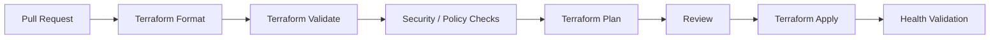
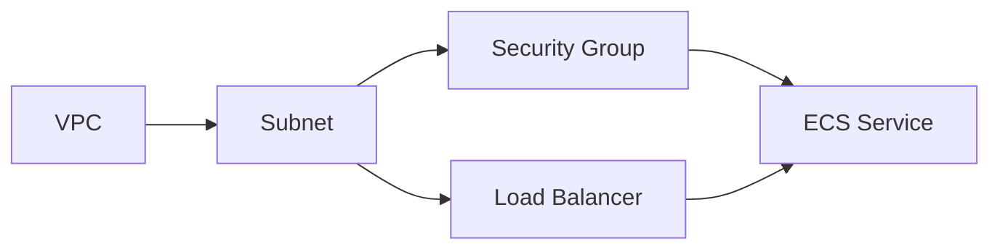
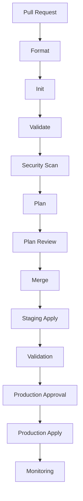
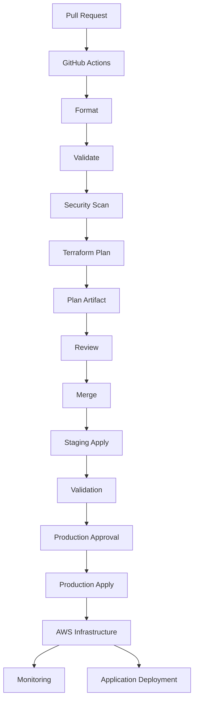
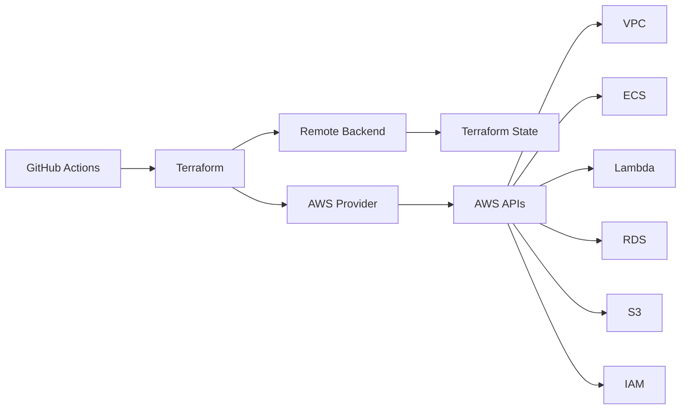
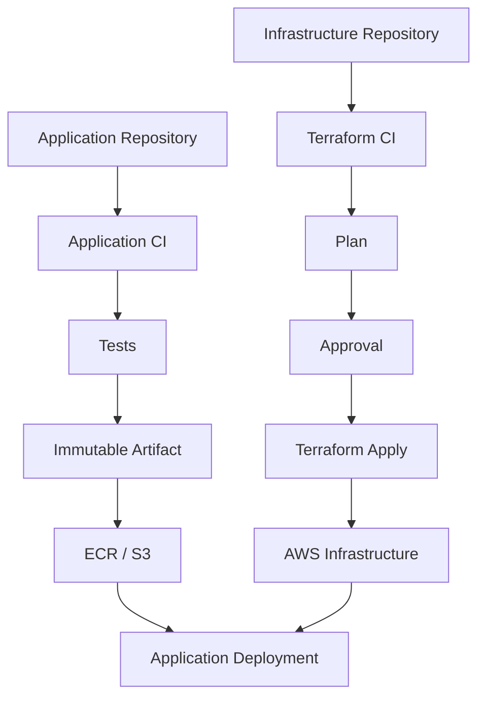

# 18- Terraform Deployment

## Overview

Terraform is an infrastructure-as-code tool that allows infrastructure to be defined, reviewed, provisioned, and changed through version-controlled configuration.

In a GitHub Actions CI/CD architecture, Terraform typically owns infrastructure state while GitHub Actions provides the automation layer:

```text
Git Repository
      ↓
GitHub Actions
      ↓
Terraform Init
      ↓
Terraform Validate
      ↓
Terraform Plan
      ↓
Review / Approval
      ↓
Terraform Apply
      ↓
AWS Infrastructure
```

Terraform is commonly used to provision and manage:

- VPCs
- Subnets
- Security Groups
- IAM
- EC2
- ECS
- ECR
- Lambda
- S3
- RDS
- ElastiCache
- Load Balancers
- Route 53
- CloudWatch
- SQS
- SNS
- EventBridge

The important engineering distinction is:

```text
Terraform
    → Defines infrastructure

Application CI/CD
    → Builds and deploys application artifacts
```

A production pipeline should avoid rebuilding application artifacts simply because Terraform is applying infrastructure changes.

---

## Terraform in CI/CD

A typical infrastructure pipeline is:



For production:

```text
Pull Request
    ↓
terraform fmt
    ↓
terraform validate
    ↓
Security Scan
    ↓
terraform plan
    ↓
Plan Review
    ↓
Approval
    ↓
terraform apply
```

The plan should be generated from the same configuration and relevant variable inputs that will be used for the apply.

---

## Terraform vs CloudFormation

Terraform and CloudFormation solve similar infrastructure-as-code problems but use different state and workflow models.

| Concern | Terraform | CloudFormation |
|---|---|---|
| Configuration | HCL | YAML/JSON |
| State | Terraform state | CloudFormation-managed stack state |
| Planning | `terraform plan` | Change sets |
| Apply | `terraform apply` | Stack update |
| AWS integration | Provider-based | AWS-native |
| Multi-cloud | Strong support | AWS-focused |
| State backend | Configurable | AWS-managed |
| Module model | Modules | Nested/reusable templates |
| CI/CD integration | Strong | Strong |

The organization should generally select one authoritative owner for a resource.

Avoid:

```text
Terraform → VPC
CloudFormation → Same VPC
```

because competing ownership creates drift and unpredictable changes.

---

## Terraform Architecture

Terraform has several important components:

```text
Terraform Configuration
        ↓
Provider
        ↓
Terraform State
        ↓
Plan
        ↓
Apply
        ↓
Cloud Provider APIs
        ↓
Infrastructure
```

Terraform configuration describes the desired state.

Terraform state records the relationship between configuration and real infrastructure.

The provider translates Terraform resources into API operations against AWS and other platforms.

---

## Terraform Configuration

Terraform files normally use `.tf`.

Example:

```text
infrastructure/
├── main.tf
├── variables.tf
├── outputs.tf
├── versions.tf
├── providers.tf
└── terraform.tfvars
```

Terraform automatically loads `.tf` files in a working directory.

The file names are primarily organizational; Terraform evaluates the configuration as a single module.

---

## Terraform Providers

Providers allow Terraform to interact with external APIs.

Example:

```hcl
terraform {
  required_providers {
    aws = {
      source  = "hashicorp/aws"
      version = "~> 6.0"
    }
  }
}

provider "aws" {
  region = var.aws_region
}
```

The provider handles AWS API interactions for resources such as:

```text
aws_vpc
aws_subnet
aws_instance
aws_lambda_function
aws_ecs_service
aws_s3_bucket
```

Pin provider versions deliberately to avoid unexpected behavior changes.

---

## Terraform Initialization

Before most Terraform operations:

```bash
terraform init
```

Initialization downloads:

- Providers
- Modules
- Backend dependencies

It also prepares the working directory.

A CI pipeline should run initialization before validation and planning.

---

## Terraform Format

Format Terraform code consistently:

```bash
terraform fmt -check -recursive
```

For local development:

```bash
terraform fmt -recursive
```

The CI pipeline should normally fail when formatting is incorrect.

---

## Terraform Validate

Validate the configuration:

```bash
terraform validate
```

Validation catches configuration and structural problems but does not prove that the infrastructure is safe or that AWS will accept every operation.

A strong CI pipeline uses:

```text
fmt
 ↓
init
 ↓
validate
 ↓
security/policy checks
 ↓
plan
```

---

## Terraform Plan

The plan shows the changes Terraform intends to make.

```bash
terraform plan
```

A production pipeline should save the plan:

```bash
terraform plan \
  -out=tfplan
```

Then inspect or apply that exact plan:

```bash
terraform apply tfplan
```

This creates a stronger relationship between reviewed changes and executed changes.

---

## Plan vs Apply

Avoid treating:

```bash
terraform plan
```

and:

```bash
terraform apply
```

as completely independent operations in a controlled deployment.

A safer workflow is:

```text
Configuration
     ↓
Plan
     ↓
Review
     ↓
Saved Plan
     ↓
Apply Exact Plan
```

This reduces the risk that infrastructure changes between planning and applying.

---

## Terraform State

Terraform state is one of the most important concepts for production operations.

Terraform needs to know:

```text
What configuration describes
        ↓
What resources currently exist
```

The state records resource identities and relevant attributes.

Without properly managed state, multiple CI jobs could attempt to manage infrastructure without a reliable shared view of ownership.

---

## Local State

Terraform can use local state:

```text
terraform.tfstate
```

This can be acceptable for experimentation.

It is generally unsuitable for shared production infrastructure because:

- State is local
- Collaboration is difficult
- Locking is limited
- State can be lost
- CI runners are ephemeral

Production systems should use a remote backend appropriate to the organization.

---

## S3 Remote Backend

For AWS environments, an S3 backend is a common design.

Conceptually:

```text
GitHub Actions
      ↓
Terraform
      ↓
S3 Backend
      ↓
Terraform State
```

Example:

```hcl
terraform {
  backend "s3" {
    bucket = "company-terraform-state"
    key    = "payments/production/terraform.tfstate"
    region = "ap-south-1"
  }
}
```

The exact backend configuration should follow the organization's state-management architecture.

---

## State Locking

Concurrent Terraform operations against the same state are dangerous.

For example:

```text
Workflow A → plan/apply
Workflow B → plan/apply
```

If both manipulate the same infrastructure state concurrently, the result can be inconsistent.

Use a supported remote-state locking strategy appropriate to the Terraform and backend versions in use.

The important principle is:

```text
One state
+
Controlled concurrency
+
Reliable locking
```

---

## State Security

Terraform state can contain sensitive information.

Do not assume that:

```text
sensitive = true
```

means the value cannot exist in state.

Protect state with:

- Encryption at rest
- Strict IAM
- Restricted bucket access
- Versioning
- Audit logging
- Appropriate retention
- State access controls

Never commit:

```text
terraform.tfstate
terraform.tfstate.backup
```

to Git.

---

## Backend Bootstrap Problem

A remote backend itself needs infrastructure.

For example:

```text
S3 State Bucket
```

must exist before Terraform can use it.

This creates a bootstrap problem.

A common approach is:

```text
Bootstrap Infrastructure
        ↓
State Backend
        ↓
Application Infrastructure
```

The bootstrap process should be tightly controlled and documented.

---

## State File Separation

Avoid one giant state for unrelated environments.

Prefer:

```text
payments/
├── staging/
└── production/
```

or an equivalent workspace/module architecture.

Separate state reduces:

- Blast radius
- Lock contention
- Accidental production changes
- Plan size
- Dependency coupling

---

## Terraform Workspaces

Terraform workspaces can represent multiple state instances for the same configuration.

For example:

```text
default
staging
production
```

However, workspaces are not automatically the best environment-isolation strategy.

For critical production systems, separate directories, modules, accounts, or backend keys may provide clearer isolation.

Do not use workspaces simply because they are available.

---

## Modules

Terraform modules package reusable infrastructure.

Example:

```text
modules/
├── vpc/
├── ecs-service/
├── rds/
└── lambda/
```

A root configuration can consume a module:

```hcl
module "vpc" {
  source = "./modules/vpc"

  environment = var.environment
  cidr_block  = var.vpc_cidr
}
```

Modules should represent meaningful infrastructure abstractions rather than merely splitting every resource into another file.

---

## Module Design

A good module should expose a small, stable interface.

For example:

```text
Inputs
 ├── environment
 ├── cidr_block
 └── availability_zones

Outputs
 ├── vpc_id
 ├── private_subnet_ids
 └── public_subnet_ids
```

Avoid exposing every internal implementation detail.

---

## Module Versioning

For shared modules, version them deliberately.

Example:

```hcl
module "network" {
  source  = "git::https://github.com/company/terraform-modules.git//vpc?ref=v2.4.0"
}
```

Unpinned module references can introduce unexpected infrastructure changes.

---

## Variables

Variables allow reusable configurations.

```hcl
variable "environment" {
  type        = string
  description = "Deployment environment"

  validation {
    condition     = contains(["staging", "production"], var.environment)
    error_message = "Environment must be staging or production."
  }
}
```

Use strong typing and validation.

---

## Variable Types

Common Terraform types include:

```text
string
number
bool
list
set
map
object
tuple
```

Example:

```hcl
variable "tags" {
  type = map(string)
}
```

Strong types make infrastructure interfaces easier to reason about.

---

## Outputs

Outputs expose values from a module or root configuration.

```hcl
output "vpc_id" {
  value = aws_vpc.main.id
}
```

Outputs are useful for:

- Application deployment
- Cross-module communication
- CI/CD
- Operational tooling

Avoid exposing secrets unnecessarily.

---

## Data Sources

Data sources retrieve existing information.

Example:

```hcl
data "aws_caller_identity" "current" {}
```

Then:

```hcl
account_id = data.aws_caller_identity.current.account_id
```

Data sources are useful when Terraform should reference existing infrastructure rather than manage it.

---

## Resources vs Data Sources

| Concept | Purpose |
|---|---|
| Resource | Terraform manages the object |
| Data source | Terraform reads an existing object |

For example:

```hcl
resource "aws_s3_bucket" "logs" {}
```

means Terraform owns the bucket.

While:

```hcl
data "aws_vpc" "existing" {}
```

means Terraform reads an existing VPC.

---

## Terraform Dependency Graph

Terraform builds a dependency graph.

Example:



Terraform can parallelize independent operations.

This improves deployment speed while respecting dependencies.

---

## Implicit Dependencies

References naturally create dependencies.

Example:

```hcl
resource "aws_instance" "app" {
  subnet_id = aws_subnet.private.id
}
```

Terraform understands:

```text
Subnet
  ↓
Instance
```

Prefer implicit dependencies when possible.

---

## Explicit Dependencies

Use:

```hcl
depends_on = [
  aws_iam_role_policy_attachment.app
]
```

only when Terraform cannot infer the dependency.

Excessive `depends_on` declarations can:

- Reduce parallelism
- Increase plan complexity
- Hide architecture problems

---

## Terraform Plan Review

A senior engineer should inspect:

```text
Create
Destroy
Update
Replace
```

with particular attention to:

- Databases
- IAM
- Security groups
- Load balancers
- DNS
- Networking
- Encryption
- Production resources

A plan containing:

```text
-/+ resource
```

requires careful investigation because it generally represents replacement.

---

## Resource Lifecycle

Terraform lifecycle settings can influence resource behavior.

Example:

```hcl
lifecycle {
  prevent_destroy = true
}
```

This can protect critical resources.

Another example:

```hcl
lifecycle {
  create_before_destroy = true
}
```

can be useful for resources where replacement should minimize downtime, provided the resource and dependencies support the strategy.

---

## `ignore_changes`

Terraform can ignore selected attribute changes:

```hcl
lifecycle {
  ignore_changes = [
    tags
  ]
}
```

This should be used cautiously.

Excessive `ignore_changes` can hide real configuration drift and undermine Terraform's desired-state model.

---

## Terraform and AWS Authentication

GitHub Actions should preferably use OIDC:

```text
GitHub Actions
      ↓
OIDC
      ↓
AWS STS
      ↓
IAM Role
      ↓
Terraform
      ↓
AWS APIs
```

Workflow permissions:

```yaml
permissions:
  contents: read
  id-token: write
```

The AWS role should be scoped to the infrastructure it manages.

---

## AWS Credentials with Terraform

Avoid:

```yaml
env:
  AWS_ACCESS_KEY_ID: ...
  AWS_SECRET_ACCESS_KEY: ...
```

for long-lived credentials.

Prefer:

```yaml
- name: Configure AWS credentials
  uses: aws-actions/configure-aws-credentials@v4
  with:
    role-to-assume: ${{ vars.TERRAFORM_ROLE_ARN }}
    aws-region: ap-south-1
```

Terraform can then use the temporary AWS credentials provided by the action.

---

## Terraform Deployment Role

The deployment role may require permissions for the resources Terraform manages.

For example:

```text
VPC
IAM
EC2
ECS
ECR
Lambda
S3
RDS
CloudWatch
```

Do not grant:

```text
AdministratorAccess
```

simply because Terraform needs to manage infrastructure.

Instead, establish resource-specific permissions and account-level boundaries.

---

## Terraform Plan Permissions

If plan and apply use different identities, their permissions can produce different plans.

For example:

```text
Plan Role
   ↓
Limited permissions

Apply Role
   ↓
Broader permissions
```

This can result in plan/apply inconsistency.

The pipeline should ensure that the reviewed plan is representative of the identity and permissions used for the actual apply.

---

## GitHub Actions Workflow

A basic Terraform CI workflow:

```yaml
name: Terraform CI

on:
  pull_request:
    paths:
      - "infrastructure/**"

permissions:
  contents: read

jobs:
  terraform:
    runs-on: ubuntu-latest

    defaults:
      run:
        working-directory: infrastructure

    steps:
      - name: Checkout
        uses: actions/checkout@v4

      - name: Setup Terraform
        uses: hashicorp/setup-terraform@v3

      - name: Terraform Init
        run: terraform init -input=false

      - name: Terraform Format
        run: terraform fmt -check -recursive

      - name: Terraform Validate
        run: terraform validate

      - name: Terraform Plan
        run: terraform plan -input=false
```

Production deployments should add security scanning, protected environments, concurrency, and approval controls.

---

## Production Terraform Workflow

A mature workflow can be:



The production apply should use controlled credentials and protected environments.

---

## Saved Plan Artifact

A production workflow can generate:

```bash
terraform plan \
  -input=false \
  -out=tfplan
```

Then apply:

```bash
terraform apply \
  -input=false \
  tfplan
```

If the plan is passed between jobs, ensure the Terraform configuration, provider versions, variables, backend, and relevant execution context remain compatible.

---

## Plan Artifacts

A plan can be uploaded as an artifact when appropriate.

However, Terraform plan files may contain sensitive information.

Do not treat them as harmless build artifacts.

Use:

- Restricted access
- Appropriate retention
- Secure artifact storage
- No unnecessary public exposure

---

## Terraform Plan Output

For human review:

```bash
terraform show tfplan
```

For machine-readable output:

```bash
terraform show \
  -json \
  tfplan
```

JSON plan data can be useful for policy checks and automation.

---

## Policy as Code

Terraform changes can be evaluated against organizational policies.

Examples:

```text
No public S3 buckets
No unrestricted SSH
Encryption required
Production resources require tags
IAM policies cannot use *
```

Possible policy mechanisms include:

- Terraform-native validation
- OPA
- Sentinel
- Checkov
- tfsec-compatible tooling
- Cloud provider policy controls

The exact tool is an organizational choice.

---

## Security Scanning

A CI pipeline should inspect Terraform for security issues.

For example:

```bash
checkov -d .
```

or another approved security scanner.

Scan for:

- Public exposure
- Excessive IAM
- Missing encryption
- Weak network controls
- Unrestricted ingress
- Missing logging
- Insecure storage

Static scanning complements, rather than replaces, human review.

---

## Terraform and Docker

Terraform should generally provision container infrastructure rather than build application images.

Prefer:

```text
Application Pipeline
    ↓
Docker Buildx
    ↓
ECR
    ↓
Image Digest
```

and:

```text
Infrastructure Pipeline
    ↓
Terraform
    ↓
ECS / EKS Infrastructure
```

The two pipelines can interact through an immutable image reference.

---

## Terraform and ECR

Terraform can create the ECR repository:

```hcl
resource "aws_ecr_repository" "payments" {
  name = "payments"
}
```

The application pipeline then pushes images.

```text
Terraform
    ↓
ECR Repository

Application CI
    ↓
Docker Image
    ↓
ECR Repository
```

This separates infrastructure ownership from application artifact creation.

---

## Terraform and ECS

Terraform can manage:

```text
ECS Cluster
Task Definition
Service
ALB
Target Group
Security Groups
IAM Roles
```

The application pipeline can update the image reference.

A strong architecture is:

```text
Terraform
    ↓
ECS Infrastructure

Application Pipeline
    ↓
ECR Image
    ↓
ECS Service Deployment
```

Avoid having both systems fight over the same frequently changing application deployment field.

---

## Terraform and Lambda

Terraform can manage:

```text
Lambda Function
IAM Role
Event Sources
API Gateway
CloudWatch
```

The application pipeline can independently produce the Lambda artifact.

For example:

```text
Terraform
    ↓
Lambda Infrastructure

Application CI
    ↓
ZIP / Image
    ↓
Lambda Version
```

Define a clear ownership model for function code and infrastructure.

---

## Terraform and EC2

Terraform can provision:

```text
VPC
Subnet
Security Group
EC2
EBS
IAM
Auto Scaling
Load Balancer
```

Application deployment can use:

- AMI replacement
- SSM
- User data
- Deployment tooling

For production, immutable infrastructure is often easier to reason about than continuously mutating long-lived instances.

---

## Terraform and Kubernetes

Terraform can provision Kubernetes infrastructure and sometimes Kubernetes resources.

For example:

```text
Terraform
    ↓
EKS Cluster
    ↓
Kubernetes

Application Pipeline
    ↓
Container Image
    ↓
Kubernetes Deployment
```

Avoid using Terraform to continuously manage rapidly changing Kubernetes application state if another deployment controller is already authoritative.

---

## Terraform and Database Infrastructure

Terraform can manage RDS and related resources:

```text
RDS
Subnet Group
Parameter Group
Security Group
Monitoring
Backup Configuration
```

But database schema migrations should normally remain part of the application lifecycle.

```text
Terraform
    → Database Infrastructure

Application Deployment
    → Schema Migration
```

This avoids coupling every schema change to infrastructure provisioning.

---

## Database Migration Safety

A deployment can involve:

```text
Terraform
 ↓
RDS Infrastructure

Application
 ↓
Migration
```

Use backward-compatible migration patterns such as:

```text
Expand
 ↓
Deploy Compatible Application
 ↓
Migrate Data
 ↓
Contract
```

Do not assume Terraform rollback can safely reverse application-level database changes.

---

## Environment Architecture

A common production structure is:

```text
infrastructure/
├── modules/
│   ├── network/
│   ├── ecs/
│   └── database/
│
└── environments/
    ├── staging/
    └── production/
```

Each environment can have:

- Backend configuration
- Variables
- Provider configuration
- Environment-specific values

---

## Environment Isolation

For critical systems, stronger isolation can use:

```text
AWS Development Account
AWS Staging Account
AWS Production Account
```

with separate Terraform state.

This reduces:

- Blast radius
- Credential scope
- State contention
- Accidental cross-environment changes

---

## Multi-Account Terraform

A GitHub Actions pipeline can assume different roles:

```text
GitHub OIDC
     ↓
STS
     ↓
Development Role
```

or:

```text
GitHub OIDC
     ↓
STS
     ↓
Production Role
```

The production role should have stricter trust conditions and deployment controls.

---

## Terraform State per Environment

A useful model is:

```text
S3
└── terraform-state
    ├── staging/
    │   └── terraform.tfstate
    └── production/
        └── terraform.tfstate
```

The exact backend key structure should reflect the organization's account and environment boundaries.

---

## Terraform State Locking and Concurrency

Terraform state locking protects against concurrent operations.

GitHub Actions concurrency adds another control layer.

Example:

```yaml
concurrency:
  group: terraform-production
  cancel-in-progress: false
```

This prevents two GitHub Actions workflows from intentionally applying the same production infrastructure simultaneously.

Use both:

```text
Terraform state locking
+
CI/CD deployment concurrency
```

because they protect different boundaries.

---

## Terraform Refresh and Drift

Terraform compares:

```text
Configuration
+
State
+
Real Infrastructure
```

to determine required changes.

Manual infrastructure changes can produce drift.

A disciplined operating model is:

```text
Git
 ↓
Terraform
 ↓
AWS
```

rather than allowing uncontrolled console changes.

---

## Importing Existing Resources

Terraform can import existing infrastructure.

Example:

```bash
terraform import \
  aws_s3_bucket.logs \
  company-production-logs
```

Importing should be followed by configuration reconciliation.

Importing a resource without writing an accurate configuration can result in unexpected future plans.

---

## Terraform State Migration

State changes are operationally sensitive.

Examples include:

- Resource renaming
- Module restructuring
- Backend migration
- Resource moves

Modern Terraform supports declarative state movement using `moved` blocks.

Example:

```hcl
moved {
  from = aws_instance.app
  to   = module.app.aws_instance.this
}
```

This is preferable to blindly destroying and recreating a resource simply because its configuration address changed.

---

## Terraform State Recovery

State corruption or accidental state deletion can be severe.

Protect state with:

- Remote storage
- Versioning
- Encryption
- Access control
- Backups
- Audit logging

Recovery should be tested rather than assumed.

---

## Secrets

Do not hardcode:

```hcl
password = "production-password"
```

Use appropriate secret-management mechanisms.

Terraform state may still contain sensitive values depending on the resource and configuration.

Therefore:

```text
Secret handling
+
State security
```

must both be addressed.

---

## Sensitive Variables

Terraform supports:

```hcl
variable "database_password" {
  type      = string
  sensitive = true
}
```

This reduces accidental display in Terraform CLI output.

It does not eliminate the need to secure:

- State
- CI logs
- Artifacts
- Backend storage
- Provider APIs

---

## GitHub Actions Secrets vs AWS Secrets Manager

Use GitHub secrets for credentials that genuinely belong in the CI/CD control plane.

For application runtime secrets, prefer AWS-managed secret mechanisms.

For example:

```text
GitHub Actions
    ↓
OIDC
    ↓
AWS

Application
    ↓
Secrets Manager
```

Do not pass every application secret through GitHub Actions.

---

## Terraform and GitHub Environments

Use:

```text
staging
production
```

GitHub Environments to protect deployment jobs.

Production can require:

- Reviewers
- Restricted branches
- Environment variables
- Deployment history

This creates a human approval boundary around high-impact infrastructure changes.

---

## Pull Request Security

Pull requests from forks should not receive production deployment credentials.

Separate:

```text
Untrusted CI
```

from:

```text
Privileged Infrastructure Deployment
```

A secure architecture might use:

```text
pull_request
    ↓
Validation / Plan
```

and:

```text
main
    ↓
Protected Environment
    ↓
Apply
```

rather than allowing arbitrary PR code to execute privileged Terraform.

---

## Third-Party Actions

Terraform pipelines often depend on actions such as:

```text
actions/checkout
hashicorp/setup-terraform
aws-actions/configure-aws-credentials
```

Treat these as supply-chain dependencies.

Use:

- Trusted sources
- Version control
- SHA pinning where required
- Least-privilege permissions
- Dependency monitoring

A compromised action can potentially access Terraform credentials and infrastructure.

---

## Self-Hosted Runners

Self-hosted runners can be useful when Terraform needs:

- Private network access
- Internal APIs
- Custom providers
- Specialized tooling

However, infrastructure runners are highly privileged.

Prefer:

- Ephemeral runners
- Minimal software
- Restricted network egress
- Dedicated runner groups
- No shared state outside approved backends

Never allow untrusted code to run on a persistent runner with production infrastructure credentials.

---

## Terraform Operations

Useful commands include:

```bash
terraform init
terraform fmt
terraform validate
terraform plan
terraform show
terraform apply
terraform destroy
terraform state list
terraform state show
terraform import
terraform output
terraform providers
```

Production operations should be controlled through the CI/CD workflow rather than ad hoc local execution.

---

## Inspecting State

List resources:

```bash
terraform state list
```

Inspect a resource:

```bash
terraform state show \
  aws_vpc.main
```

This can help determine what Terraform currently believes it owns.

Do not edit the state file directly.

---

## Terraform Outputs

View outputs:

```bash
terraform output
```

A specific output:

```bash
terraform output vpc_id
```

Machine-readable output:

```bash
terraform output -json
```

Outputs can be passed to deployment systems when necessary.

---

## GitHub CLI Operations

List workflows:

```bash
gh workflow list
```

List recent runs:

```bash
gh run list
```

Inspect a run:

```bash
gh run view RUN_ID
```

View logs:

```bash
gh run view RUN_ID --log
```

Rerun:

```bash
gh run rerun RUN_ID
```

Trigger a workflow:

```bash
gh workflow run terraform.yml
```

These commands are useful for CI/CD operations and troubleshooting.

---

## Terraform Troubleshooting Model

Use:

```text
Symptom
  ↓
Possible Causes
  ↓
Isolation Strategy
  ↓
Commands / Checks
  ↓
Root Cause
  ↓
Corrective Action
  ↓
Prevention
```

Avoid repeatedly running `terraform apply` without understanding the failure.

---

## Troubleshooting: `terraform init`

### Symptom

Initialization fails.

### Possible Causes

- Backend configuration problem
- AWS authentication failure
- Provider download failure
- Module source unavailable
- Network restrictions
- Provider lock-file mismatch

### Checks

```bash
terraform version
terraform providers
aws sts get-caller-identity
```

Review backend and provider configuration.

---

## Troubleshooting: Provider Authentication

### Symptom

Terraform cannot authenticate with AWS.

### Check

```bash
aws sts get-caller-identity
```

If this fails, investigate:

```text
GitHub OIDC
 ↓
IAM Trust Policy
 ↓
STS
 ↓
Temporary Credentials
```

Verify:

```yaml
permissions:
  id-token: write
```

---

## Troubleshooting: Plan Fails

### Symptom

`terraform plan` fails.

### Possible Causes

- Invalid configuration
- Missing variable
- Provider error
- Resource already changed
- Insufficient IAM permissions
- Data source unavailable
- State inconsistency

Run:

```bash
terraform validate
terraform plan
```

and inspect the first meaningful provider error.

---

## Troubleshooting: Apply Fails

### Symptom

`terraform apply` fails after some resources were changed.

### Important Principle

Terraform is not necessarily all-or-nothing from an external system perspective.

Some resources may already have been created or modified.

Inspect:

```bash
terraform plan
```

before attempting another apply.

---

## Troubleshooting: State Lock

### Symptom

Terraform reports that the state is locked.

### Possible Causes

- Another deployment is running
- Previous CI job crashed
- Lock was not released
- Stale lock metadata

Do not force-unlock immediately.

First verify whether another Terraform process is active.

If the lock is genuinely stale, use the appropriate Terraform backend recovery procedure.

---

## Troubleshooting: Unexpected Resource Replacement

### Symptom

Plan shows:

```text
-/+ resource
```

### Possible Causes

- Immutable resource property changed
- Resource identity changed
- Configuration address changed
- Provider behavior changed
- Module refactoring

Investigate the plan before applying.

For critical resources, determine:

```text
Will data be lost?

Will downtime occur?

Will dependent resources be replaced?
```

---

## Troubleshooting: Drift

### Symptom

Terraform repeatedly proposes changes that were not expected.

### Possible Causes

- Manual console changes
- Another automation system
- AWS-managed modifications
- Incorrect `ignore_changes`
- Incorrect configuration

Identify which system is authoritative and restore a single ownership model.

---

## Troubleshooting: Provider Version

### Symptom

A previously working plan changes behavior after initialization.

### Possible Causes

- Provider version changed
- Lock file changed
- CI and local provider versions differ

Commit:

```text
.terraform.lock.hcl
```

and use controlled provider upgrades.

---

## Terraform Dependency Lock File

`.terraform.lock.hcl` records selected provider versions and checksums.

Commit it to Git.

This helps ensure CI and developer environments resolve consistent provider packages.

---

## Terraform and Version Management

Pin:

- Terraform versions
- Provider versions
- Module versions
- GitHub Actions versions

Example:

```hcl
terraform {
  required_version = "~> 1.9"
}
```

The exact version should follow the organization's tested compatibility matrix.

---

## Terraform Upgrades

Do not upgrade Terraform or providers directly in production without validation.

Use:

```text
Upgrade Branch
    ↓
terraform init -upgrade
    ↓
Plan
    ↓
CI
    ↓
Staging
    ↓
Production
```

Review plan changes carefully.

---

## Terraform Destroy

`terraform destroy` is powerful and dangerous.

Production workflows should generally prevent arbitrary destroy operations.

Protect critical resources with appropriate lifecycle controls and IAM restrictions.

A CI pipeline should not expose:

```bash
terraform destroy -auto-approve
```

as a casually executable production operation.

---

## Production Apply Controls

A production Terraform job should ideally require:

```text
Protected Branch
+
Trusted Workflow
+
OIDC
+
Least-Privilege Role
+
Plan Review
+
Environment Approval
+
Concurrency
```

This creates multiple independent security controls.

---

## Production Architecture



The infrastructure pipeline should have explicit boundaries between:

```text
Validation
Planning
Approval
Application
Monitoring
```

---

## Terraform State Architecture



The remote state and AWS infrastructure are separate concerns.

State is Terraform's record of infrastructure ownership; it is not the infrastructure itself.

---

## Application and Infrastructure Architecture



This separation supports independent release cycles.

---

## Terraform and Immutable Infrastructure

Terraform should define infrastructure predictably.

For compute resources, prefer patterns that minimize long-lived mutable configuration.

For example:

```text
Terraform
 ↓
Launch Template
 ↓
Auto Scaling Group
 ↓
Immutable AMI
```

rather than:

```text
Long-lived EC2
 ↓
SSH
 ↓
Manual Changes
```

Immutable infrastructure improves reproducibility and rollback.

---

## Blue/Green Infrastructure

Terraform can participate in blue/green architecture:

```text
Load Balancer
      ↓
 ┌───────────────┐
 │               │
Blue            Green
Version A       Version B
```

Traffic routing can be controlled through:

- ALB
- Route 53
- ECS services
- Target groups
- Other deployment mechanisms

Terraform should not necessarily be responsible for every high-frequency traffic-shifting operation.

---

## Canary Architecture

A canary deployment can look like:

```text
Traffic
  │
  ├── 95% → Existing
  │
  └──  5% → New
```

Terraform can provision the infrastructure required for the strategy, while a deployment system can manage frequent traffic changes.

Separate infrastructure lifecycle from application rollout mechanics when that reduces operational complexity.

---

## High Availability

Terraform enables repeatable HA infrastructure but does not guarantee HA.

A production architecture might require:

```text
Multi-AZ VPC
    ↓
ALB
    ↓
Multiple Application Instances
    ↓
Multi-AZ Database
```

Terraform should define the topology explicitly.

---

## Disaster Recovery

Terraform improves infrastructure recovery because configuration is stored in Git.

A complete DR plan requires:

```text
Terraform Code
+
Remote State
+
Application Artifacts
+
Secrets
+
Database Backups
+
DNS
+
Certificates
+
IAM
```

Losing state or secrets can prevent an otherwise reproducible infrastructure deployment from being immediately recoverable.

---

## Cost Optimization

Terraform can make cost controls repeatable.

Examples:

- Right-size EC2
- Control RDS classes
- Avoid unnecessary NAT gateways
- Remove unused environments
- Use autoscaling
- Apply lifecycle policies
- Tag resources
- Schedule non-production resources

Infrastructure automation should include cost considerations, not just provisioning correctness.

---

## Monitoring Terraform Operations

Track:

- Plan duration
- Apply duration
- Failed deployments
- Rollbacks
- State lock contention
- Infrastructure drift
- Provider failures
- Production change frequency

Terraform deployment logs should be retained according to operational and compliance requirements.

---

## Governance

Enterprise Terraform governance should establish:

- Approved providers
- Provider versions
- Module standards
- State backend standards
- IAM requirements
- Naming conventions
- Mandatory tags
- Encryption requirements
- Network policies
- Security scanning
- Production approval requirements
- Runner standards
- Account boundaries

---

## Repository Structure

A practical repository can look like:

```text
infrastructure/
├── modules/
│   ├── network/
│   ├── ecs/
│   ├── lambda/
│   └── database/
│
├── environments/
│   ├── staging/
│   │   ├── main.tf
│   │   ├── variables.tf
│   │   └── backend.tf
│   │
│   └── production/
│       ├── main.tf
│       ├── variables.tf
│       └── backend.tf
│
└── .terraform.lock.hcl
```

Keep environment-specific configuration explicit.

---

## Common Mistakes

### Committing Terraform State

Never commit:

```text
terraform.tfstate
```

State can contain sensitive information and should be remotely managed.

### Using Local State in Production

Local state creates collaboration and recovery problems.

### No State Locking

Concurrent applies can corrupt operational assumptions.

### Running `apply` Without Review

Production infrastructure changes should be reviewable.

### Rebuilding Application Artifacts During Terraform Apply

Keep application artifacts and infrastructure lifecycle separate.

### Using Long-Lived AWS Credentials

Use GitHub OIDC and temporary credentials.

### Overusing `ignore_changes`

This can hide drift and prevent Terraform from correcting configuration.

### Overusing `depends_on`

This can reduce parallelism and hide real dependencies.

### Giant Terraform Modules

Modules should represent meaningful reusable infrastructure boundaries.

### Giant State Files

Large states increase blast radius and lock contention.

### Mixing Terraform and CloudFormation Ownership

One resource should have one authoritative infrastructure owner.

### Running Production Terraform from a Developer Laptop

Manual local production applies reduce auditability and bypass deployment controls.

### Blindly Running `terraform apply` After a Failure

Always inspect the current state and plan first.

### Ignoring Provider Lock Files

Uncontrolled provider resolution can produce inconsistent behavior.

### Using Mutable Infrastructure

Long-lived manually configured servers create configuration drift.

---

## Senior Design Principles

### Terraform Is an Infrastructure Control Plane

Treat Terraform as a controlled system for changing infrastructure rather than as a collection of CLI commands.

### State Is a Critical Production Asset

Protect it like other production control-plane data.

### Plan and Apply Must Be Connected

Prefer:

```text
Plan
 ↓
Review
 ↓
Apply Exact Plan
```

rather than generating an unreviewed plan and later recalculating a different one.

### CI Credentials Should Be Temporary

Use:

```text
GitHub OIDC
 ↓
STS
 ↓
Temporary AWS Credentials
```

### Separate Infrastructure from Application Releases

Use:

```text
Terraform
    → Infrastructure

Application Pipeline
    → Artifact and Application Release
```

### Concurrency Is a Safety Control

Protect shared Terraform state and production infrastructure from simultaneous changes.

### Resource Lifecycle Matters

A plan that says:

```text
destroy/create
```

is fundamentally different from:

```text
update in place
```

and should receive substantially more scrutiny.

---

## Interview Scenarios

### Terraform Production Pipeline

Design:

```text
PR
 ↓
fmt
 ↓
validate
 ↓
security scan
 ↓
plan
 ↓
review
 ↓
staging
 ↓
approval
 ↓
production apply
```

Explain how credentials, state, locking, and concurrency are handled.

### Terraform State

Explain:

- Why Terraform needs state
- Why local state is unsuitable for shared production
- How remote state works
- Why state must be protected
- How locking prevents concurrent operations

### Plan vs Apply

Explain why a saved plan can be safer than independently running:

```bash
terraform plan
terraform apply
```

at different times.

### Terraform and GitHub OIDC

Explain:

```text
GitHub Actions
 ↓
OIDC
 ↓
STS
 ↓
IAM Role
 ↓
Terraform
```

and how the trust policy limits who can assume the role.

### Terraform and ECS

Explain how Terraform should provision ECS infrastructure while the application pipeline builds and promotes immutable Docker images.

### Terraform and Lambda

Explain how infrastructure and Lambda application artifacts can have separate deployment lifecycles.

### Terraform vs CloudFormation

Explain the differences in:

- State management
- Planning
- Configuration language
- AWS integration
- Multi-cloud support
- Team workflows

### Resource Replacement

A production plan shows:

```text
-/+ aws_db_instance.production
```

Explain what questions must be answered before applying it.

### State Lock Failure

A production deployment reports that the state is locked.

Explain why force-unlocking immediately is dangerous and how you would determine whether another deployment is still active.

### Drift

Someone manually modifies a production security group.

Explain how Terraform detects the difference and how the team should restore a single source of truth.

### Compromised CI Action

A third-party GitHub Action used by the Terraform workflow is compromised.

Explain how:

- OIDC trust restrictions
- Least privilege
- Action pinning
- Protected environments
- Ephemeral runners
- Separate roles

reduce the blast radius.

---

## Production Checklist

### Terraform Configuration

- [ ] Terraform version is controlled
- [ ] Provider versions are controlled
- [ ] `.terraform.lock.hcl` is committed
- [ ] Formatting is validated
- [ ] Configuration passes validation
- [ ] Modules have clear interfaces
- [ ] Resource ownership is explicit

### State

- [ ] Remote backend is configured
- [ ] State is encrypted
- [ ] State access is restricted
- [ ] State locking is enabled
- [ ] State backups/versioning are available
- [ ] State is never committed to Git
- [ ] Environment state is appropriately isolated

### CI/CD

- [ ] Pull requests run validation
- [ ] Security scanning is enabled
- [ ] Terraform plan is generated
- [ ] Plan is reviewed
- [ ] Production requires approval
- [ ] Production apply uses protected credentials
- [ ] Terraform concurrency is controlled
- [ ] Apply uses the reviewed plan where appropriate

### AWS Security

- [ ] GitHub OIDC is configured
- [ ] IAM role is least privilege
- [ ] Trust policy restricts repository/context
- [ ] No long-lived AWS keys are stored
- [ ] Production credentials are protected
- [ ] Third-party actions are controlled

### Infrastructure

- [ ] Critical resources have lifecycle protection
- [ ] Database backups are configured
- [ ] Encryption is enabled
- [ ] HA topology is intentional
- [ ] Resource tagging is standardized
- [ ] Drift is monitored
- [ ] Infrastructure ownership is documented

### Operations

- [ ] Deployment logs are available
- [ ] Stack/resource changes are observable
- [ ] Rollback procedures are documented
- [ ] Disaster recovery is tested
- [ ] Cost controls are implemented
- [ ] Production changes are auditable

## Key Takeaways

- Treat Terraform as a production infrastructure control plane with version-controlled configuration, protected remote state, controlled planning, and explicit deployment ownership.
- Use GitHub Actions OIDC with least-privilege IAM roles and protected environments instead of long-lived AWS credentials.
- Connect `terraform plan` and `terraform apply` through a reviewed, controlled workflow, while protecting shared state with remote storage and locking.
- Keep Terraform infrastructure lifecycle separate from application artifact delivery, using immutable Docker images, Lambda packages, or other artifacts as the interface between the two.
- Senior-level Terraform operations focus on blast radius, resource replacement, state integrity, concurrency, security, drift, rollback, disaster recovery, and clear ownership boundaries.