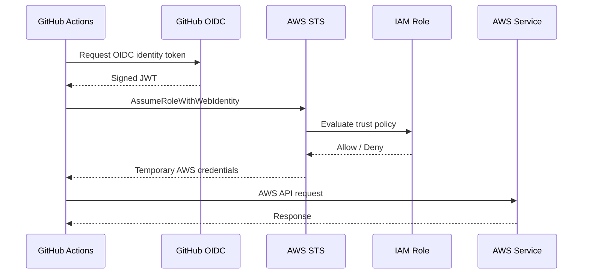
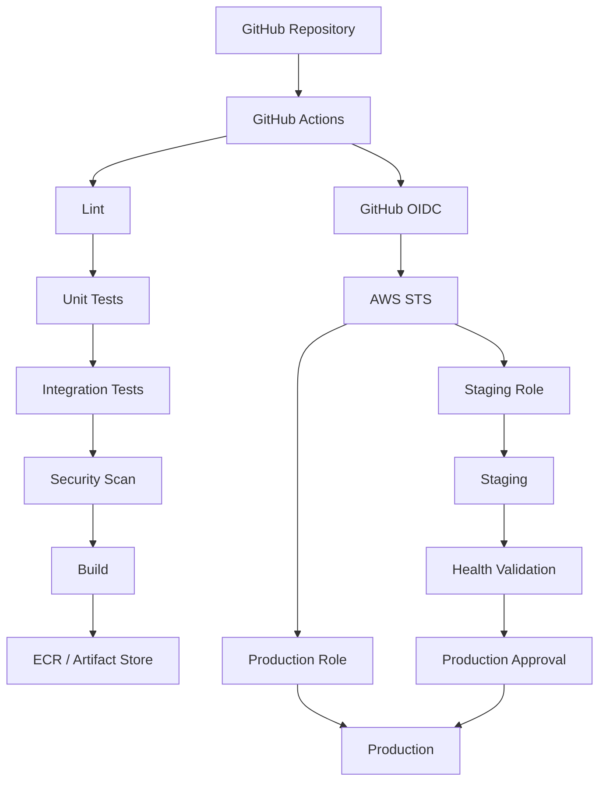

# 19- OIDC Based AWS Deployment

## Overview

OpenID Connect (OIDC) allows GitHub Actions to authenticate to AWS without storing long-lived AWS access keys in GitHub secrets.

The production authentication flow is:

```text
GitHub Actions
      ↓
GitHub OIDC Identity Token
      ↓
AWS IAM OIDC Provider
      ↓
IAM Role Trust Policy
      ↓
AWS STS AssumeRoleWithWebIdentity
      ↓
Temporary AWS Credentials
      ↓
AWS Services
```

This model is particularly important for infrastructure and deployment pipelines involving:

- Terraform
- Amazon ECR
- Amazon ECS
- Amazon EC2
- AWS Lambda
- Amazon S3
- CloudFormation
- Kubernetes/EKS

Instead of storing:

```text
AWS_ACCESS_KEY_ID
AWS_SECRET_ACCESS_KEY
```

in GitHub, the workflow requests a short-lived identity token and exchanges it with AWS STS for temporary credentials.

The important security boundary is the IAM trust policy. AWS must determine exactly which GitHub Actions workload is allowed to assume the deployment role.

---

## Why OIDC Exists

Long-lived AWS credentials create a persistent secret-management problem.

A traditional approach is:

```text
GitHub Secrets
    ↓
AWS Access Key
    ↓
AWS APIs
```

The credentials must be:

- Created
- Stored
- Rotated
- Revoked
- Audited
- Protected from accidental exposure

OIDC changes the model:

```text
GitHub Actions
    ↓
Short-lived identity assertion
    ↓
AWS STS
    ↓
Temporary credentials
```

The AWS credentials are generated for the specific session instead of being permanently stored in GitHub.

---

## Long-Lived Credentials vs OIDC

| Concern | Long-Lived Keys | OIDC |
|---|---|---|
| GitHub secret required | Yes | No AWS access key required |
| Credential lifetime | Long | Short |
| Rotation | Required | Temporary credentials |
| Revocation | Manual credential management | Disable role/trust relationship |
| Repository binding | Indirect | IAM trust conditions |
| Branch restrictions | Additional controls | Can be encoded in trust policy |
| Environment restrictions | Additional controls | Can be encoded in subject claims |
| Secret leakage impact | Potentially long-lived | Temporary session |
| Recommended for CI/CD | Generally avoid | Preferred |

OIDC does not eliminate IAM security requirements. It changes how AWS credentials are obtained.

---

## Core Architecture



The workflow does not directly receive permanent AWS credentials.

---

## GitHub OIDC Provider

AWS must trust GitHub's OIDC identity provider.

The AWS account contains an IAM OIDC identity provider associated with GitHub's token issuer.

Conceptually:

```text
AWS Account
    │
    └── IAM OIDC Provider
            │
            └── GitHub Actions
```

The provider establishes trust in the token issuer.

The IAM role trust policy then determines which tokens are allowed to assume the role.

---

## OIDC Provider vs IAM Role

These are separate concepts.

| Component | Responsibility |
|---|---|
| OIDC Provider | Establishes trust in the token issuer |
| IAM Trust Policy | Determines who can assume the role |
| IAM Permissions Policy | Determines what the assumed role can do |
| STS | Exchanges identity for temporary credentials |
| GitHub Actions | Requests and uses the credentials |

A common mistake is to configure the OIDC provider and assume that authentication is complete.

It is not.

The trust policy is the critical authorization boundary.

---

## IAM Role Architecture

A typical deployment role has two policy layers:

```text
IAM Role
├── Trust Policy
│   └── Who may assume this role?
│
└── Permissions Policy
    └── What may this role do?
```

For example:

```text
Trust Policy
    → GitHub repository / branch / environment

Permissions Policy
    → ECR / ECS / S3 / EC2 / Terraform resources
```

Authentication and authorization should be analyzed separately.

---

## GitHub OIDC Token

GitHub issues a signed JWT containing identity claims.

The claims describe information about the workflow execution, such as:

- Repository
- Organization
- Ref
- Branch
- Workflow
- Environment
- Event context
- Audience

AWS evaluates these claims through the IAM trust policy.

Conceptually:

```json
{
  "iss": "https://token.actions.githubusercontent.com",
  "aud": "sts.amazonaws.com",
  "sub": "repo:company/payments:ref:refs/heads/main"
}
```

The exact claim set depends on the GitHub Actions execution context.

---

## `sub` Claim

The `sub` claim is especially important for restricting which GitHub workload can assume an AWS role.

For a branch-based workflow, it can represent a repository and branch relationship such as:

```text
repo:company/payments:ref:refs/heads/main
```

For a GitHub Environment, the subject can represent the environment context.

This allows AWS to distinguish:

```text
production
```

from:

```text
feature branches
```

---

## Audience Claim

AWS STS commonly expects:

```text
sts.amazonaws.com
```

as the OIDC audience.

A trust policy can constrain the audience:

```json
"StringEquals": {
  "token.actions.githubusercontent.com:aud": "sts.amazonaws.com"
}
```

This prevents tokens intended for another audience from satisfying the trust condition.

---

## Basic Trust Policy

A simplified example:

```json
{
  "Version": "2012-10-17",
  "Statement": [
    {
      "Effect": "Allow",
      "Principal": {
        "Federated": "arn:aws:iam::123456789012:oidc-provider/token.actions.githubusercontent.com"
      },
      "Action": "sts:AssumeRoleWithWebIdentity",
      "Condition": {
        "StringEquals": {
          "token.actions.githubusercontent.com:aud": "sts.amazonaws.com",
          "token.actions.githubusercontent.com:sub": "repo:company/payments:ref:refs/heads/main"
        }
      }
    }
  ]
}
```

The trust policy answers:

> Which GitHub Actions identity is allowed to obtain credentials for this role?

---

## Trust Policy vs Permissions Policy

These policies answer different questions.

| Policy | Question |
|---|---|
| Trust policy | Who can assume the role? |
| Permissions policy | What can the role do after assumption? |

For example:

```text
Trust
 ↓
Only company/payments main branch

Permissions
 ↓
ECR push
ECS deployment
CloudWatch read
```

A highly restrictive permissions policy cannot compensate for an overly broad trust policy.

---

## GitHub Actions Permissions

The workflow must explicitly request the OIDC token permission:

```yaml
permissions:
  contents: read
  id-token: write
```

Example:

```yaml
name: Deploy

on:
  push:
    branches:
      - main

permissions:
  contents: read
  id-token: write

jobs:
  deploy:
    runs-on: ubuntu-latest

    steps:
      - name: Checkout
        uses: actions/checkout@v4

      - name: Configure AWS credentials
        uses: aws-actions/configure-aws-credentials@v4
        with:
          role-to-assume: arn:aws:iam::123456789012:role/github-production-deploy
          aws-region: ap-south-1
```

Without:

```yaml
id-token: write
```

the workflow cannot request the GitHub OIDC token.

---

## Why `contents: read` Matters

The workflow generally needs repository read access for checkout:

```yaml
permissions:
  contents: read
  id-token: write
```

Avoid granting:

```yaml
contents: write
```

unless the workflow genuinely needs it.

OIDC authentication should not become a reason to increase unrelated GitHub permissions.

---

## Least Privilege

OIDC should be combined with least privilege.

Use:

```text
Specific GitHub identity
+
Specific IAM role
+
Specific AWS permissions
```

rather than:

```text
Any repository
+
AdministratorAccess
```

A production deployment role might need access to:

```text
ECR
ECS
CloudWatch
S3
```

but not necessarily:

```text
IAM *
Organizations *
Billing *
All AWS resources
```

---

## Separate Roles by Environment

A practical design is:

```text
GitHub
 │
 ├── Staging Role
 │
 └── Production Role
```

For example:

```text
github-staging-deploy
github-production-deploy
```

The production role should have:

- More restrictive trust conditions
- Separate permissions
- Protected GitHub Environment
- Approval requirements where appropriate

---

## Separate Roles by Function

Large organizations may use separate roles:

```text
Terraform Role
Application Deployment Role
Read-Only Diagnostics Role
Release Role
```

This reduces blast radius.

For example:

```text
Terraform
    ↓
Infrastructure permissions

Application deployment
    ↓
ECS/ECR permissions
```

An application deployment should not automatically receive full infrastructure administration permissions.

---

## GitHub Environments

GitHub Environments can form part of the production security boundary.

Example:

```text
Job
 ↓
environment: production
 ↓
Required reviewer
 ↓
OIDC
 ↓
Production IAM Role
```

Example:

```yaml
jobs:
  deploy:
    environment: production
    runs-on: ubuntu-latest

    permissions:
      contents: read
      id-token: write
```

The environment can also control environment-specific variables and secrets.

---

## Environment-Based Trust

Instead of trusting every branch in a repository, a production IAM role can be restricted to a specific GitHub Environment.

Conceptually:

```text
Repository
    ↓
Protected production environment
    ↓
Production deployment job
    ↓
OIDC token
    ↓
Production IAM role
```

This provides an additional boundary beyond branch filtering.

---

## Branch-Based Trust

A role can restrict access to a specific branch.

Conceptually:

```text
repo:company/payments:ref:refs/heads/main
```

This is useful when production deployments are exclusively performed from `main`.

However, branch-only trust may be less expressive than environment-based controls for organizations with complex release workflows.

---

## Tag-Based Deployments

Release workflows can use Git tags.

For example:

```text
v2.4.0
```

A trust policy can be designed around the relevant GitHub OIDC subject pattern where supported by the workflow identity model.

Tag-based deployment must be carefully designed so that untrusted users cannot create an authorized deployment identity merely by creating a tag.

---

## `StringEquals` vs `StringLike`

IAM conditions can use:

```text
StringEquals
StringLike
```

`StringEquals` provides exact matching.

```json
"StringEquals": {
  "token.actions.githubusercontent.com:sub": "repo:company/payments:ref:refs/heads/main"
}
```

`StringLike` supports patterns.

```json
"StringLike": {
  "token.actions.githubusercontent.com:sub": "repo:company/payments:*"
}
```

Broad wildcard patterns should be treated carefully.

---

## Dangerous Wildcards

Avoid unnecessarily broad trust:

```json
"StringLike": {
  "token.actions.githubusercontent.com:sub": "repo:company/*"
}
```

This could allow multiple repositories to assume a sensitive role.

A production trust relationship should identify the smallest legitimate workload.

---

## Repository Restriction

A production role should normally be bound to the intended repository.

Conceptually:

```text
company/payments
```

rather than:

```text
company/*
```

Repository-level isolation significantly reduces accidental privilege expansion.

---

## Fork Pull Requests

Forks create an important security boundary.

A workflow triggered by an external fork should not automatically receive production deployment credentials.

Avoid designs where:

```text
Untrusted fork code
      ↓
Production OIDC credentials
      ↓
AWS
```

Instead:

```text
Fork PR
   ↓
Unprivileged validation

Trusted branch
   ↓
Protected deployment
```

---

## `pull_request` vs `pull_request_target`

`pull_request` is commonly appropriate for testing untrusted contribution code.

`pull_request_target` runs in the context of the target repository and therefore requires particular caution.

The dangerous pattern is:

```text
pull_request_target
    ↓
Checkout attacker-controlled code
    ↓
Execute code
    ↓
Privileged credentials
```

This can turn a workflow into a credential-exfiltration path.

Do not give privileged OIDC access to arbitrary untrusted code execution.

---

## OIDC and Untrusted Input

GitHub data can be attacker-controlled.

Examples include:

- Pull request titles
- Branch names
- Commit messages
- Issue content
- Workflow inputs

Do not directly interpolate these values into shell commands.

Unsafe:

```yaml
run: echo "${{ github.event.pull_request.title }}"
```

A safer pattern is to pass values through environment variables:

```yaml
env:
  PR_TITLE: ${{ github.event.pull_request.title }}
run: |
  printf '%s\n' "$PR_TITLE"
```

The same principle applies to scripts used by Terraform pipelines.

---

## Terraform and OIDC

Terraform can consume temporary AWS credentials established by the workflow.

```text
GitHub Actions
    ↓
OIDC
    ↓
AWS STS
    ↓
Temporary Credentials
    ↓
Terraform
    ↓
AWS APIs
```

Example:

```yaml
- name: Configure AWS credentials
  uses: aws-actions/configure-aws-credentials@v4
  with:
    role-to-assume: arn:aws:iam::123456789012:role/github-terraform-production
    aws-region: ap-south-1

- name: Terraform Init
  run: terraform init -input=false

- name: Terraform Plan
  run: terraform plan -input=false
```

No AWS access key needs to be stored in GitHub secrets.

---

## OIDC and ECR

A container pipeline can authenticate to ECR using the same model:

```text
GitHub Actions
    ↓
OIDC
    ↓
STS
    ↓
ECR IAM permissions
    ↓
Docker login
    ↓
Buildx
    ↓
ECR Push
```

The role should only receive the ECR permissions required by the pipeline.

---

## OIDC and ECS

A deployment role can be granted the permissions required to update ECS.

A common architecture is:

```text
Application CI
    ↓
Build Docker Image
    ↓
ECR
    ↓
Assume ECS Deployment Role
    ↓
Update ECS
    ↓
Health Validation
```

Terraform can separately own the ECS infrastructure.

---

## OIDC and EC2

EC2 deployment workflows can use OIDC to authenticate to AWS for operations such as:

- SSM
- S3
- AMI operations
- Auto Scaling
- Load Balancer operations

For example:

```text
GitHub Actions
    ↓
OIDC
    ↓
AWS STS
    ↓
EC2 Deployment Role
    ↓
SSM / EC2 / S3
```

Avoid using static IAM access keys for deployment scripts.

---

## OIDC and S3

A deployment may upload artifacts:

```bash
aws s3 cp release.tar.gz \
  s3://company-releases/payments/
```

The GitHub Actions role should have only the necessary S3 permissions and preferably only the relevant bucket/prefix.

Avoid:

```text
s3:*
Resource: *
```

when a narrower policy is possible.

---

## OIDC and Lambda

A Lambda deployment can use:

```text
GitHub Actions
    ↓
OIDC
    ↓
STS
    ↓
Lambda deployment role
    ↓
Update Lambda
```

The role should not automatically receive permission to modify unrelated infrastructure.

---

## OIDC and CloudFormation

CloudFormation deployment:

```text
GitHub Actions
    ↓
OIDC
    ↓
STS
    ↓
CloudFormation Role
    ↓
CloudFormation Stack
```

Where possible, CloudFormation can assume a dedicated execution role so the GitHub-facing role does not directly need every underlying AWS resource permission.

---

## OIDC and Terraform Role Separation

Terraform often requires broader permissions than application deployment.

Use separate roles:

```text
GitHub
 │
 ├── Terraform Role
 │      └── Infrastructure permissions
 │
 └── Application Deployment Role
        └── ECR/ECS permissions
```

This prevents a compromised application deployment workflow from automatically becoming an infrastructure administration workflow.

---

## IAM Permission Boundary

For larger environments, permission boundaries can constrain the maximum permissions an IAM role can receive.

Conceptually:

```text
IAM Role Permissions
        ∩
Permission Boundary
        ↓
Effective Permissions
```

This can provide an additional governance layer for roles created or managed by automation.

---

## AWS STS

AWS Security Token Service issues temporary credentials.

The important operation is:

```text
AssumeRoleWithWebIdentity
```

The resulting credentials include temporary:

```text
Access Key ID
Secret Access Key
Session Token
```

The workflow receives these credentials dynamically.

They expire after the configured session duration.

---

## Verifying the Identity

After configuring AWS credentials, verify the active identity:

```bash
aws sts get-caller-identity
```

Example output conceptually identifies:

```text
Account
UserId
Arn
```

This is one of the most useful diagnostics in an OIDC deployment pipeline.

---

## AWS CLI Diagnostic Workflow

When authentication fails:

```bash
aws sts get-caller-identity
```

Then inspect:

```text
GitHub permissions
        ↓
OIDC token request
        ↓
IAM provider
        ↓
Trust policy
        ↓
STS
        ↓
Role permissions
```

Do not immediately modify the permissions policy if the actual problem is the trust policy.

---

## Trust Policy Diagnostics

Check:

- OIDC provider exists
- Provider ARN is correct
- Audience is correct
- Subject matches
- Repository name is correct
- Branch/environment is correct
- IAM role ARN is correct
- Workflow has `id-token: write`
- Workflow is running in the expected context

A trust-policy failure occurs before AWS resource permissions are relevant.

---

## Permissions Policy Diagnostics

If:

```bash
aws sts get-caller-identity
```

works but:

```bash
aws ecs update-service ...
```

fails, authentication succeeded.

The problem is likely authorization.

Investigate:

- IAM role permissions
- Resource ARN
- Explicit denies
- SCPs
- Permission boundaries
- Resource policies
- AWS service-specific restrictions

---

## Authentication vs Authorization

Always distinguish:

```text
Authentication
    ↓
Who are you?
```

from:

```text
Authorization
    ↓
What may you do?
```

For OIDC:

```text
OIDC + Trust Policy
    → Authentication / role assumption decision

IAM Permissions
    → AWS API authorization
```

This distinction dramatically improves troubleshooting.

---

## Production Deployment Architecture



The production role should not be available to every workflow.

---

## Build Once, Deploy Many

OIDC does not change the artifact-promotion principle.

Prefer:

```text
Build
 ↓
Immutable Artifact
 ↓
Staging
 ↓
Approval
 ↓
Production
```

rather than:

```text
Build
 ↓
Staging

Rebuild
 ↓
Production
```

The same artifact should be promoted across environments whenever practical.

---

## Immutable Docker Images

For Docker deployments, use immutable identity.

Prefer:

```text
payments:git-8f4c2d1
```

or an image digest:

```text
payments@sha256:...
```

A production deployment should not silently resolve a mutable:

```text
latest
```

tag to a different image.

---

## OIDC and Artifact Promotion

A mature pipeline may use different AWS roles:

```text
Build Role
    ↓
Push to ECR

Staging Role
    ↓
Deploy staging

Production Role
    ↓
Deploy production
```

The production role should not need to build the image.

This supports both least privilege and build-once/deploy-many.

---

## Reusable Workflows

OIDC configuration can be centralized through reusable workflows.

For example:

```yaml
jobs:
  deploy:
    uses: company/platform/.github/workflows/aws-deploy.yml@v2
    with:
      environment: production
    secrets: inherit
```

Reusable workflows can standardize:

- AWS authentication
- Permissions
- Environment handling
- Deployment steps
- Security controls

They should still expose a narrow and well-defined interface.

---

## Reusable Workflow vs Composite Action

A reusable workflow can orchestrate multiple jobs:

```text
Job A
 ↓
Job B
 ↓
Job C
```

A composite action packages steps within a single job:

```text
Job
 └── Composite Action
      ├── Step
      ├── Step
      └── Step
```

Use reusable workflows for pipeline architecture and composite actions for reusable step groups.

---

## OIDC and Custom Actions

Custom actions should not automatically assume that credentials are available.

A deployment action should receive only the permissions and credentials necessary for its operation.

For example:

```text
Job permissions
    ↓
id-token: write
    ↓
AWS role assumption
```

Avoid giving every custom action in a job unrestricted access to the resulting credentials.

---

## Third-Party Action Security

A compromised third-party action can access the credentials available to the job.

Therefore:

```text
OIDC
+
Least privilege
+
Action pinning
+
Trusted sources
+
Job isolation
```

should be used together.

If a job has:

```yaml
permissions:
  id-token: write
```

and can assume a production role, every action executing in that job should be treated as part of the privileged trust boundary.

---

## Job-Level Isolation

Separate privileged deployment steps from untrusted or unrelated actions.

For example:

```text
Build Job
    ↓
Unprivileged

Deploy Job
    ↓
OIDC
    ↓
Production Role
```

This is safer than giving the entire workflow a broad privilege context.

---

## Production Deployment Job

Example:

```yaml
deploy-production:
  needs:
    - build

  environment: production

  permissions:
    contents: read
    id-token: write

  concurrency:
    group: production-deployment
    cancel-in-progress: false

  runs-on: ubuntu-latest

  steps:
    - name: Checkout
      uses: actions/checkout@v4

    - name: Configure AWS credentials
      uses: aws-actions/configure-aws-credentials@v4
      with:
        role-to-assume: ${{ vars.AWS_PRODUCTION_ROLE_ARN }}
        aws-region: ap-south-1

    - name: Verify AWS identity
      run: aws sts get-caller-identity

    - name: Deploy
      run: ./scripts/deploy-production.sh
```

This combines:

- Environment protection
- OIDC
- Least privilege
- Concurrency
- Identity verification

---

## Deployment Concurrency

Production infrastructure should not be modified simultaneously by competing workflows.

Example:

```yaml
concurrency:
  group: production-deployment
  cancel-in-progress: false
```

This prevents deployment races.

For infrastructure changes, cancelling an already-running apply may be undesirable because Terraform may have partially changed infrastructure.

Therefore, production Terraform jobs generally benefit from:

```yaml
cancel-in-progress: false
```

with queued deployments reviewed carefully.

---

## OIDC and Rollback

Rollback should use a known-good artifact or known-good infrastructure configuration.

For application deployment:

```text
Current
  ↓
Bad Release
  ↓
Detect Failure
  ↓
Redeploy Previous Immutable Artifact
```

For infrastructure:

```text
Git Commit
  ↓
Previous Terraform Configuration
  ↓
Plan
  ↓
Review
  ↓
Apply
```

Do not assume `terraform destroy` is a rollback mechanism.

---

## Infrastructure Rollback Caveat

Terraform rollback is not equivalent to application rollback.

For example:

```text
Database schema
```

may have changed irreversibly even if the Terraform configuration is reverted.

Similarly,:

```text
Data migration
```

may not be safely reversed.

Infrastructure rollback should therefore be designed per resource type.

---

## Security Architecture

A strong OIDC deployment has multiple boundaries:

```text
GitHub Repository
      ↓
Workflow Permissions
      ↓
Protected Environment
      ↓
OIDC Token
      ↓
IAM Trust Policy
      ↓
AWS IAM Role
      ↓
IAM Permissions
      ↓
AWS Resource
```

Each layer should restrict the next.

---

## Defense in Depth

OIDC should not be treated as the complete security model.

Use:

- Protected branches
- Protected environments
- Required reviewers
- Least-privilege GitHub permissions
- Restrictive IAM trust policies
- Least-privilege IAM permissions
- Action pinning
- Ephemeral runners
- Artifact integrity
- Monitoring
- Audit logs
- Deployment concurrency

---

## Monitoring and Auditing

Monitor:

- IAM role assumptions
- STS activity
- CloudTrail events
- GitHub workflow executions
- Deployment failures
- Unexpected role assumptions
- Production changes
- IAM policy changes

CloudTrail can help correlate AWS activity with deployment events.

Useful investigation data includes:

```text
Timestamp
Principal
Role
Account
Source
API operation
Resource
Workflow
Commit
```

---

## Incident Response

If an OIDC deployment role is compromised:

1. Disable or restrict the IAM trust relationship.
2. Review recent `AssumeRoleWithWebIdentity` events.
3. Identify affected workflows.
4. Review CloudTrail API calls.
5. Inspect GitHub workflow changes.
6. Review third-party action changes.
7. Restrict the role permissions.
8. Review affected AWS resources.
9. Restore known-good infrastructure or artifacts.
10. Investigate the root cause before re-enabling deployment.

OIDC reduces long-lived credential exposure but does not prevent a compromised workflow from using valid temporary credentials.

---

## Self-Hosted Runner Considerations

A self-hosted runner may have access to:

```text
Private Network
AWS
Internal APIs
Secrets
```

If that runner can request an OIDC token and assume a production role, compromise of the runner can become a production security incident.

Prefer:

```text
Ephemeral Runner
+
Dedicated Runner Group
+
Restricted Network
+
Short-Lived Credentials
+
Least-Privilege Role
```

---

## Private AWS Resources

OIDC authentication itself does not require the runner to be inside a private AWS subnet.

GitHub-hosted runners can authenticate to AWS public APIs when the relevant AWS endpoints are reachable.

Private resource access is a separate networking requirement.

For example:

```text
GitHub-hosted Runner
    ↓
AWS public control-plane API
    ↓
ECS / S3 / ECR
```

while a deployment requiring access to a private internal service may require:

```text
Self-hosted / network-connected runner
    ↓
Private VPC
```

Do not confuse AWS API authentication with application network connectivity.

---

## OIDC Performance

OIDC authentication adds a small setup step to the workflow:

```text
Token
 ↓
STS
 ↓
Temporary Credentials
```

This is normally negligible compared with build and deployment operations.

The more important performance concerns are:

- Runner startup
- Docker builds
- Dependency installation
- Terraform provider downloads
- Large plans
- AWS API operations

OIDC should generally not be optimized away by reverting to long-lived credentials.

---

## High Availability

OIDC is a deployment authentication mechanism rather than an application availability mechanism.

Production availability should be achieved through infrastructure architecture such as:

```text
Multi-AZ
+
Load Balancing
+
Auto Scaling
+
Managed Databases
+
Health Checks
+
Rollback
```

The deployment pipeline should support those architectures without becoming a single point of operational failure.

---

## Disaster Recovery

A production OIDC deployment system should be recoverable using:

```text
Git repository
+
Terraform configuration
+
Remote state
+
IAM configuration
+
AWS account access
+
Application artifacts
```

Do not make recovery dependent on a single developer's laptop or manually stored AWS credentials.

---

## Cost Considerations

OIDC itself has little operational cost compared with the infrastructure it manages.

The larger CI/CD costs generally come from:

- Runner execution time
- Self-hosted runner infrastructure
- Docker builds
- Artifact storage
- ECR storage
- Terraform execution
- Repeated environment deployments

Use caching and build-once/deploy-many patterns to reduce unnecessary work.

---

## Common OIDC Mistakes

### Missing `id-token: write`

The workflow cannot obtain an OIDC token.

### Broad Trust Policy

For example:

```text
repo:company/*
```

can expose a role to more workloads than intended.

### Broad IAM Permissions

OIDC does not make:

```text
AdministratorAccess
```

safe.

### Using `pull_request_target` Carelessly

Executing untrusted code with privileged credentials can expose the role.

### Giving OIDC to Every Job

Only jobs requiring AWS access should normally receive:

```yaml
id-token: write
```

### Mixing Build and Deployment Privileges

Build jobs generally do not need production AWS permissions.

### Trusting Branch Names Without Reviewing Workflow Controls

A branch restriction is only one part of the security model.

### Using Mutable Artifacts

OIDC does not protect against deploying the wrong Docker image.

### Assuming Temporary Credentials Are Harmless

A compromised workflow can use valid temporary credentials until they expire.

### Forgetting IAM Trust Conditions

Creating the OIDC provider without restrictive role trust conditions does not provide meaningful workload isolation.

---

## Troubleshooting OIDC Failures

### Symptom

Workflow reports that no AWS credentials are available.

### Possible Causes

- `id-token: write` missing
- Credentials action not configured
- Wrong role ARN
- OIDC provider missing
- Trust policy mismatch

### Checks

```yaml
permissions:
  id-token: write
```

Then verify the role configuration.

---

## Troubleshooting Trust Policy Denial

### Symptom

STS returns an authorization error when assuming the role.

### Possible Causes

- Incorrect `sub`
- Incorrect `aud`
- Wrong repository
- Wrong branch
- Wrong environment
- Incorrect provider ARN

### Isolation

Check the GitHub workflow execution context and compare it with the IAM trust policy.

The question is:

```text
Does this exact GitHub identity satisfy the trust conditions?
```

---

## Troubleshooting AWS Permissions

### Symptom

Role assumption succeeds, but AWS API calls fail.

### Example

```bash
aws sts get-caller-identity
```

works, but:

```bash
aws ecr push-image ...
```

fails.

This indicates authentication succeeded.

Investigate the IAM permissions policy and other AWS policy layers.

---

## Troubleshooting Wrong Account

### Symptom

Deployment reaches an unexpected AWS account.

Verify:

```bash
aws sts get-caller-identity
```

Check:

```text
Role ARN
Account ID
GitHub environment variables
Workflow configuration
```

Do not infer the active AWS account from repository configuration alone.

---

## Troubleshooting Wrong Environment

### Symptom

A production workflow assumes a staging role.

Check:

```text
GitHub Environment
 ↓
Workflow job
 ↓
OIDC subject
 ↓
IAM trust policy
 ↓
Role ARN
```

Environment names and trust-policy conditions must agree.

---

## Troubleshooting With AWS CLI

Useful commands:

```bash
aws sts get-caller-identity
```

```bash
aws iam get-role \
  --role-name github-production-deploy
```

```bash
aws iam list-role-policies \
  --role-name github-production-deploy
```

```bash
aws iam list-attached-role-policies \
  --role-name github-production-deploy
```

These commands help determine which identity is active and what policies are attached.

---

## Troubleshooting GitHub Actions

Useful commands:

```bash
gh run list
```

```bash
gh run view RUN_ID
```

```bash
gh run view RUN_ID --log
```

```bash
gh workflow view deploy.yml
```

```bash
gh workflow run deploy.yml
```

Use GitHub logs together with AWS CloudTrail when investigating authentication and authorization failures.

---

## OIDC and Workflow Governance

Organizations should standardize:

- Approved OIDC providers
- IAM role naming
- Trust policy templates
- Repository restrictions
- Environment restrictions
- Permission policies
- Action versions
- SHA pinning
- Runner groups
- Production approval requirements

Example naming:

```text
github-oidc-terraform-staging
github-oidc-terraform-production
github-oidc-ecs-staging
github-oidc-ecs-production
```

Consistent naming makes auditing easier.

---

## Terraform OIDC Role Example

A production Terraform job:

```yaml
name: Terraform Production

on:
  push:
    branches:
      - main
    paths:
      - "infrastructure/**"

permissions:
  contents: read

jobs:
  plan:
    runs-on: ubuntu-latest

    permissions:
      contents: read
      id-token: write

    steps:
      - name: Checkout
        uses: actions/checkout@v4

      - name: Configure AWS credentials
        uses: aws-actions/configure-aws-credentials@v4
        with:
          role-to-assume: ${{ vars.TERRAFORM_PRODUCTION_ROLE_ARN }}
          aws-region: ap-south-1

      - name: Verify identity
        run: aws sts get-caller-identity

      - name: Setup Terraform
        uses: hashicorp/setup-terraform@v3

      - name: Terraform init
        working-directory: infrastructure
        run: terraform init -input=false

      - name: Terraform plan
        working-directory: infrastructure
        run: terraform plan -input=false -out=tfplan
```

Production apply should normally be isolated behind the appropriate approval and deployment controls.

---

## Reference Architecture

```text
                    GitHub
                       │
                       ▼
              ┌─────────────────┐
              │ GitHub Actions  │
              └────────┬────────┘
                       │
              id-token: write
                       │
                       ▼
              ┌─────────────────┐
              │  GitHub OIDC    │
              └────────┬────────┘
                       │
                       ▼
              ┌─────────────────┐
              │    AWS STS      │
              └────────┬────────┘
                       │
             AssumeRoleWithWebIdentity
                       │
                       ▼
              ┌─────────────────┐
              │   IAM Role      │
              │ Trust + Policy  │
              └────────┬────────┘
                       │
          ┌────────────┼─────────────┐
          ▼            ▼             ▼
        ECR           ECS          Terraform
                                      │
                                      ▼
                                    AWS
```

The critical controls are:

```text
GitHub permissions
        ↓
OIDC claims
        ↓
IAM trust policy
        ↓
IAM permissions
        ↓
AWS resource
```

---

## Senior Design Principles

### OIDC Is Identity Federation

OIDC does not simply replace an AWS password.

It establishes a trust relationship between GitHub's workload identity and AWS IAM.

### Trust and Permissions Are Separate

Always reason about:

```text
Who may assume the role?
```

and:

```text
What may the role do?
```

independently.

### Restrict the Identity as Much as the Permissions

A role with minimal permissions but an excessively broad trust policy can still create a significant security boundary.

### Privilege Should Exist Only Where Needed

Prefer:

```text
Build Job
    → No AWS credentials

Deploy Job
    → OIDC + Deployment Role
```

over granting AWS access to the entire workflow.

### Production Roles Need Stronger Boundaries

Use:

```text
Protected Environment
+
Restricted Trust Policy
+
Least Privilege
+
Approval
+
Concurrency
```

for production deployments.

### Temporary Credentials Are Still Privileged Credentials

OIDC reduces credential persistence but does not remove the impact of a compromised workflow.

### Artifact Integrity Still Matters

Authentication does not prove that the artifact being deployed is correct.

Combine OIDC with:

```text
Immutable Artifacts
+
Image Digests
+
SBOM
+
Provenance
+
Attestations
```

where appropriate.

---

## Interview Scenarios

### Why Use OIDC Instead of AWS Access Keys?

Explain:

```text
Long-lived credentials
```

versus:

```text
GitHub OIDC
 ↓
STS
 ↓
Temporary credentials
```

Discuss rotation, exposure, trust policies, and least privilege.

### How Does GitHub Actions Authenticate to AWS?

Explain the complete flow:

```text
Workflow
 ↓
OIDC Token
 ↓
IAM OIDC Provider
 ↓
Trust Policy
 ↓
STS
 ↓
Temporary Credentials
 ↓
AWS API
```

### What Is the Difference Between an OIDC Provider and an IAM Trust Policy?

Explain that the provider establishes the trusted identity issuer while the trust policy determines which identities may assume a particular role.

### How Would You Restrict Production Deployments?

Design:

```text
main branch
 ↓
Protected production environment
 ↓
Required approval
 ↓
OIDC
 ↓
Production IAM role
```

with restrictive subject and audience conditions.

### How Would You Protect Against Forks?

Separate:

```text
Untrusted PR validation
```

from:

```text
Trusted production deployment
```

and avoid executing attacker-controlled code with privileged OIDC access.

### Why Is `id-token: write` Sensitive?

Because a job with this permission can request a GitHub OIDC token and potentially exchange it for AWS credentials if an IAM role trusts the workload identity.

### What Happens If `aws sts get-caller-identity` Works but Deployment Fails?

Authentication succeeded.

Investigate authorization:

```text
IAM permissions
SCP
Permission boundary
Resource policy
Resource ARN
```

### How Would You Design Terraform and Application Roles?

Use separate roles:

```text
Terraform
 → Infrastructure

Application Deployment
 → ECR/ECS/Lambda/etc.
```

This reduces blast radius.

### How Would You Investigate a Compromised Deployment Workflow?

Correlate:

```text
GitHub workflow changes
+
OIDC role assumptions
+
CloudTrail API calls
+
Affected resources
```

Then restrict the trust relationship and rotate/revoke affected access as appropriate.

---

## Production Checklist

### GitHub Actions

- [ ] OIDC is enabled only where required
- [ ] `id-token: write` is job-scoped where possible
- [ ] `contents: read` is used instead of broader permissions
- [ ] Production uses a protected GitHub Environment
- [ ] Deployment concurrency is configured
- [ ] Untrusted PRs cannot access production credentials
- [ ] Third-party actions are controlled and pinned appropriately

### AWS IAM

- [ ] GitHub OIDC provider is configured
- [ ] Trust policy restricts the repository
- [ ] Trust policy restricts branch or environment where appropriate
- [ ] Audience is restricted
- [ ] IAM permissions follow least privilege
- [ ] Terraform and application roles are separated where appropriate
- [ ] Permission boundaries/SCPs are considered for enterprise environments

### Deployment

- [ ] Build once, deploy many is used
- [ ] Docker images use immutable identifiers
- [ ] ECR permissions are scoped
- [ ] Staging and production roles are separated
- [ ] Production deployments require appropriate approval
- [ ] Rollback procedures are documented
- [ ] Health validation is implemented

### Security

- [ ] No long-lived AWS access keys are stored for CI/CD
- [ ] `pull_request_target` is used only with a clear trust model
- [ ] Fork workflows cannot obtain production credentials
- [ ] Self-hosted runners are isolated
- [ ] Privileged jobs are separated from untrusted jobs
- [ ] OIDC trust policies are reviewed regularly
- [ ] CloudTrail and GitHub audit data are available

### Operations

- [ ] `aws sts get-caller-identity` is used for diagnostics
- [ ] IAM role assumptions are auditable
- [ ] Deployment failures are observable
- [ ] Infrastructure and application ownership are separated
- [ ] Disaster recovery procedures include IAM and CI/CD
- [ ] Production role compromise procedures are documented

## Key Takeaways

- GitHub Actions OIDC replaces long-lived AWS access keys with short-lived credentials obtained through GitHub identity tokens, AWS IAM trust policies, and STS.
- The two critical IAM questions are separate: the trust policy determines who may assume the role, while the permissions policy determines what the role may do.
- Production deployments should combine OIDC with least privilege, protected environments, restrictive repository/branch or environment conditions, job isolation, and deployment concurrency.
- OIDC does not eliminate CI/CD security risks; compromised workflows, third-party actions, self-hosted runners, untrusted pull requests, and excessive IAM permissions can still expose AWS resources.
- A production architecture should combine OIDC authentication with immutable artifacts, build-once/deploy-many promotion, monitoring, CloudTrail auditing, rollback procedures, and clear separation between infrastructure and application deployment roles.